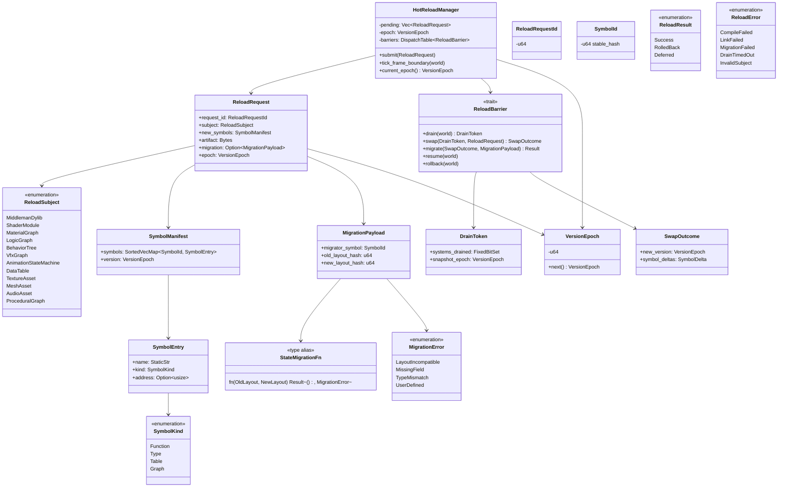
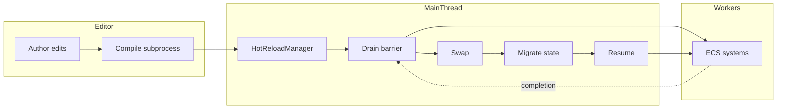
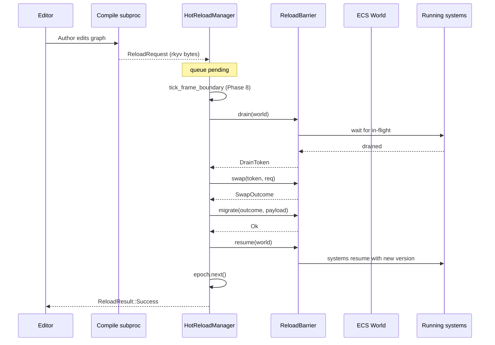
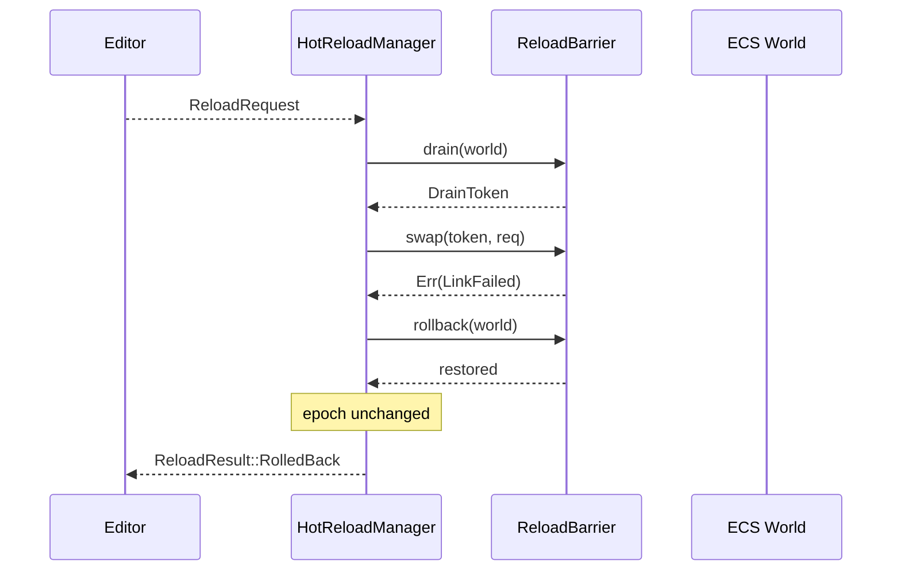

# Hot-Reload Protocol Design

## Requirements Trace

> **Canonical sources:** This document is the single source of truth for the hot-reload protocol
> used by the middleman .dylib, scripting, material graphs, behavior trees, VFX effects, tables,
> assets, and logic graphs. See design review
> [section 2.6](../design-review.md#26-hot-reload-protocol-is-everywhere-and-nowhere) and P0 task 4.

### Feature Trace

| Feature  | Scope                                                               |
|----------|---------------------------------------------------------------------|
| F-1.11.1 | Drain-then-swap hot-reload barrier                                  |
| F-1.11.2 | State migration callback contract                                   |
| F-1.11.3 | Compile-error rollback                                              |
| F-1.11.4 | Version epoch counter                                               |
| F-1.11.5 | Symbol manifest binding                                             |
| F-1.11.6 | Editor-to-runtime wire format                                       |
| F-13.4.3 | Logic-graph state preservation across reload                        |
| F-12.4   | Asset hot-reload                                                    |

1. **F-1.11.1** — Hot-reload swap happens at a fixed phase boundary (no in-flight system writes)
2. **F-1.11.2** — User-authored state-migration function maps old layout to new layout
3. **F-1.11.3** — Compile failures are rolled back; live content untouched
4. **F-1.11.4** — Every reload increments a monotonic `VersionEpoch`
5. **F-1.11.5** — `SymbolManifest` binds new symbols without dangling references
6. **F-1.11.6** — Wire format is rkyv-archived `ReloadRequest`
7. **F-13.4.3** — Running logic graphs are migrated via `StateMigrationFn`
8. **F-12.4** — Assets (textures, meshes) hot-reload via same barrier

## Overview

Seven subsystems previously described hot-reload in prose without a unified protocol. This document
defines `HotReloadManager`, `ReloadRequest`, `ReloadBarrier`, `StateMigrationFn`, `ReloadResult`,
`VersionEpoch`, and `SymbolManifest` once. Every reload path — middleman .dylib, scripting, material
graphs, behavior trees, VFX, tables, assets, logic graphs — participates in the same
drain/swap/migrate/resume cycle.

### Client Subsystems

| Doc                                        | Reload subject          |
|--------------------------------------------|-------------------------|
| `content-pipeline/asset-pipeline.md`       | Middleman .dylib        |
| `game-framework/scripting.md`              | Logic graph instances   |
| `rendering/render-styles.md`               | Material graphs, PSOs   |
| `rendering/render-pipeline.md`             | Shader bytecode         |
| `ai/behavior.md`                           | Behavior trees          |
| `vfx/effects.md`                           | VFX effect graphs       |
| `animation/state-machine.md`               | Animation state machines|
| `data-systems/data-tables.md`              | Table schemas + data    |
| `content-pipeline/asset-pipeline.md`       | Textures / meshes / audio|
| `geometry/procedural-generation.md`        | Procedural graphs       |

### Design Constraints

| Constraint                | Rationale                                              |
|---------------------------|--------------------------------------------------------|
| No async / await          | Reload runs on main thread in frame boundary           |
| Deterministic ordering    | Subsystem reloads process in dependency order          |
| Never partial reload      | All-or-nothing per request                             |
| Zero-copy wire format     | rkyv-archived ReloadRequest streamed over pipe         |
| Rollback preserved state  | On failure, old layout fully restored                  |

## Architecture

### Class Diagram



### Subsystem Wiring



## API Design

```rust
use crate::ids::SymbolId;
use crate::primitives::{SortedVecMap, DispatchTable, Handle};

/// Manages the lifecycle of every pending hot-reload request. Owned by
/// the main thread; never crossed thread boundaries.
pub struct HotReloadManager {
    pending: Vec<ReloadRequest>,
    in_flight: Option<ReloadRequest>,
    epoch: VersionEpoch,
    barriers: DispatchTable<fn(&mut World, &ReloadRequest) -> Result<ReloadResult, ReloadError>>,
}

impl HotReloadManager {
    pub fn new() -> Self { unimplemented!() }

    pub fn register_barrier(
        &mut self,
        subject: ReloadSubject,
        barrier: fn(&mut World, &ReloadRequest)
            -> Result<ReloadResult, ReloadError>,
    ) { unimplemented!() }

    /// Called from the main-thread IoResponse drain when a compiled
    /// artifact arrives from the editor.
    pub fn submit(&mut self, req: ReloadRequest) { unimplemented!() }

    /// Called exactly once at Phase 8 of the game loop (after command
    /// buffers flush, before frame swap).
    pub fn tick_frame_boundary(&mut self, world: &mut World) {
        while let Some(req) = self.pending.pop() {
            match self.execute(world, req) {
                Ok(ReloadResult::Success) => {}
                Ok(ReloadResult::RolledBack) => {}
                Ok(ReloadResult::Deferred) => {}
                Err(_) => {}
            }
        }
    }

    pub fn current_epoch(&self) -> VersionEpoch { self.epoch }
}

#[derive(Clone)]
pub struct ReloadRequest {
    pub request_id: ReloadRequestId,
    pub subject: ReloadSubject,
    pub new_symbols: SymbolManifest,
    pub artifact: Vec<u8>,
    pub migration: Option<MigrationPayload>,
    pub epoch: VersionEpoch,
}

#[derive(Copy, Clone, Eq, PartialEq, Hash)]
pub struct ReloadRequestId(pub u64);

#[derive(Copy, Clone, Eq, PartialEq, Hash)]
pub enum ReloadSubject {
    MiddlemanDylib,
    ShaderModule,
    MaterialGraph,
    LogicGraph,
    BehaviorTree,
    VfxGraph,
    AnimationStateMachine,
    DataTable,
    TextureAsset,
    MeshAsset,
    AudioAsset,
    ProceduralGraph,
}

/// Each subsystem implements this to participate in hot-reload.
pub trait ReloadBarrier {
    fn subject(&self) -> ReloadSubject;
    fn drain(&mut self, world: &mut World) -> DrainToken;
    fn swap(
        &mut self,
        token: DrainToken,
        req: &ReloadRequest,
    ) -> Result<SwapOutcome, ReloadError>;
    fn migrate(
        &mut self,
        out: &SwapOutcome,
        payload: &MigrationPayload,
    ) -> Result<(), ReloadError>;
    fn resume(&mut self, world: &mut World);
    fn rollback(&mut self, world: &mut World);
}

pub struct DrainToken {
    pub systems_drained: FixedBitSet,
    pub snapshot_epoch: VersionEpoch,
}

pub struct SwapOutcome {
    pub new_version: VersionEpoch,
    pub symbol_deltas: Vec<SymbolDelta>,
}

pub struct SymbolDelta {
    pub id: SymbolId,
    pub kind: SymbolDeltaKind,
}

pub enum SymbolDeltaKind {
    Added(SymbolEntry),
    Removed,
    Replaced(SymbolEntry),
}

pub struct SymbolManifest {
    pub symbols: SortedVecMap<SymbolId, SymbolEntry>,
    pub version: VersionEpoch,
}

#[derive(Clone)]
pub struct SymbolEntry {
    pub name: &'static str,
    pub kind: SymbolKind,
    pub address: Option<usize>,
}

#[derive(Copy, Clone, Eq, PartialEq)]
pub enum SymbolKind {
    Function,
    Type,
    Table,
    Graph,
}

/// A user-authored function that maps old instance state to new instance
/// state. Looked up via `MigrationPayload::migrator_symbol` in the newly
/// loaded manifest.
pub type StateMigrationFn =
    fn(old: &[u8], new: &mut [u8]) -> Result<(), MigrationError>;

pub struct MigrationPayload {
    pub migrator_symbol: SymbolId,
    pub old_layout_hash: u64,
    pub new_layout_hash: u64,
}

#[derive(Debug)]
pub enum MigrationError {
    LayoutIncompatible,
    MissingField { name: &'static str },
    TypeMismatch { field: &'static str },
    UserDefined { message: &'static str },
}

#[derive(Copy, Clone, Eq, PartialEq)]
pub enum ReloadResult {
    Success,
    RolledBack,
    Deferred,
}

#[derive(Copy, Clone, Eq, PartialEq, Ord, PartialOrd)]
pub struct VersionEpoch(pub u64);

impl VersionEpoch {
    pub fn next(self) -> Self { VersionEpoch(self.0 + 1) }
}

#[derive(Debug)]
pub enum ReloadError {
    CompileFailed { diagnostics: Vec<Diagnostic> },
    LinkFailed { symbol: SymbolId },
    MigrationFailed(MigrationError),
    DrainTimedOut,
    InvalidSubject,
}
```

## Data Flow

### Successful Reload



### Error Rollback



## Platform Considerations

| Platform   | Dylib loader          | Subprocess launcher |
|------------|-----------------------|---------------------|
| Windows    | libloading via LoadLibrary | CreateProcessW      |
| macOS      | libloading via dlopen  | posix_spawn         |
| Linux      | libloading via dlopen  | posix_spawn         |
| iOS        | Not supported (shipping only) | N/A          |
| Android    | Not supported (shipping only) | N/A          |

Hot-reload is only available in editor / dev builds. Shipping builds statically link the middleman
and disable `HotReloadManager` at compile time via a `#[cfg]` gate.

## Test Plan

Full test cases live in [hot-reload-protocol-test-cases.md](hot-reload-protocol-test-cases.md).
Summary:

| Category    | Scope                                                            |
|-------------|------------------------------------------------------------------|
| Unit        | ReloadRequest rkyv round-trip                                    |
| Unit        | VersionEpoch monotonic increment                                 |
| Unit        | SymbolManifest delta computation                                 |
| Integration | Material graph reload swaps PSO bindings                         |
| Integration | Logic graph reload preserves instance state                      |
| Integration | Compile failure rolls back without mutation                      |
| Benchmark   | Middleman .dylib drain-then-swap under 50 ms                     |
| Benchmark   | 1000 logic graph instances migrated under 20 ms                  |

## Open Questions

1. Should the drain barrier guarantee that no ECS commands are in-flight, or only systems that touch
   the affected subject?
2. How does `MigrationPayload::migrator_symbol` get looked up if the migrator itself fails to link?
3. Should shaders reload on the render thread via IoResponse rather than main-thread barrier?
4. What is the watchdog timeout for `DrainToken` resolution before the barrier fails?
5. Should `HotReloadManager` publish an ECS event on completion so systems can react?
