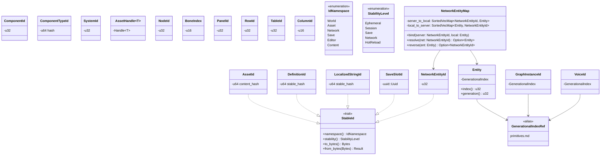
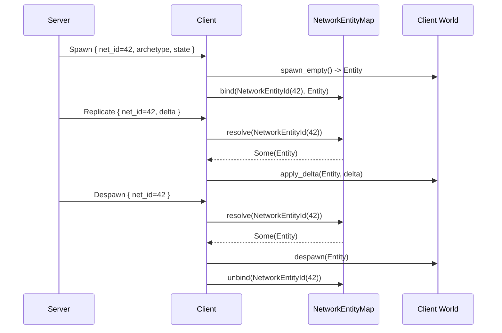
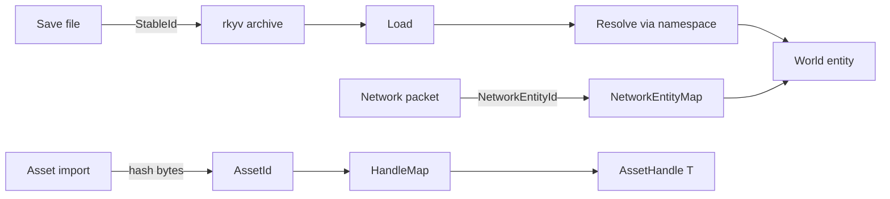

# ID Conventions Design

## Requirements Trace

> **Canonical sources:** This document is the single owner of ID taxonomy. It defines `StableId`,
> references `GenerationalIndex` from [primitives.md](primitives.md), and classifies every ID in the
> engine by kind, stability, and owning subsystem. See design review
> [section 2.4](../design-review.md#24-id--handle-fragmentation) and P0 task 3.

### Feature Trace

| Feature  | Scope                                                              |
|----------|--------------------------------------------------------------------|
| F-1.10.1 | Canonical `StableId` trait                                         |
| F-1.10.2 | Taxonomy of engine ID types                                        |
| F-1.10.3 | Network entity ID distinct from `Entity`                           |
| F-1.10.4 | Save-stable ID policy                                              |
| F-1.10.5 | Hot-reload-stable ID policy                                        |

1. **F-1.10.1** — `StableId` trait gates which IDs persist across save / network
2. **F-1.10.2** — Every ID doc has exactly one canonical owning document
3. **F-1.10.3** — `NetworkEntityId` is a `u32` distinct from `Entity` with mapping protocol
4. **F-1.10.4** — Save files round-trip only IDs that implement `StableId`
5. **F-1.10.5** — Hot-reload preserves definition IDs but not ephemeral instance IDs

## Overview

The engine previously defined `Entity`, `ComponentId`, `AssetId`, `GraphInstanceId`, `NodeId`,
`BoneIndex`, `VoiceId`, `NetworkEntityId`, and more in each owning document without a unifying
taxonomy. Some were generational indices, some were hash IDs, and some were implicit `u32` counters.
This document classifies every ID and establishes policies for stability across save, hot-reload,
and network boundaries.

### ID Kinds

| Kind                | Description                                          | Example         |
|---------------------|------------------------------------------------------|-----------------|
| Generational index  | `u32` index + `u32` generation                       | `Entity`        |
| u64 content hash    | Hash of content bytes (deterministic)                | `AssetId`       |
| UUID                | 128-bit random identifier                            | `SaveSlotId`    |
| Small int newtype   | Compact enum/bit index                               | `BoneIndex`     |

### Stability Levels

| Level            | Scope                                                          |
|------------------|----------------------------------------------------------------|
| Ephemeral        | Only valid within a single frame or session                    |
| Session-stable   | Valid for the lifetime of the running process                  |
| Save-stable      | Survives save/load cycles (requires `StableId`)                |
| Network-stable   | Matches across all clients in a networked session              |
| Hot-reload-stable| Preserved across middleman .dylib reloads                      |

## Architecture

### Class Diagram



### ID Taxonomy Part 1 — Runtime / World

| ID                 | Kind                | Stability        | Owning doc                   |
|--------------------|---------------------|------------------|------------------------------|
| `Entity`           | Generational index  | Session          | `core-runtime/ecs.md`        |
| `ComponentId`      | u32 newtype         | Session          | `core-runtime/ecs.md`        |
| `ComponentTypeId`  | u64 content hash    | HotReload+Save   | `core-runtime/ecs.md`        |
| `SystemId`         | u32 newtype         | Session          | `core-runtime/ecs.md`        |
| `GraphInstanceId`  | Generational index  | Session          | `game-framework/scripting.md`|
| `NodeId`           | u32 newtype         | Session          | `core-runtime/graph-runtime.md` |
| `BoneIndex`        | u16 newtype         | Save             | `animation/skeletal.md`      |
| `VoiceId`          | Generational index  | Session          | `audio/audio.md`             |

### ID Taxonomy Part 2 — Content / Persistence

| ID                 | Kind                | Stability        | Owning doc                   |
|--------------------|---------------------|------------------|------------------------------|
| `AssetId`          | u64 content hash    | Save+Network     | `content-pipeline/asset-pipeline.md` |
| `AssetHandle<T>`   | `Handle<T>`         | Session          | `content-pipeline/asset-pipeline.md` |
| `SaveSlotId`       | UUID                | Save             | `game-framework/save-system.md`      |
| `DefinitionId`     | u64 stable hash     | Save+Network     | `data-systems/definitions.md`        |
| `LocalizedStringId`| u64 stable hash     | Save+Network     | `core-runtime/localization.md`       |

### ID Taxonomy Part 3 — Tables / Editor

| ID             | Kind              | Stability       | Owning doc                      |
|----------------|-------------------|-----------------|---------------------------------|
| `PanelId`      | u32 newtype       | Session         | `tools/editor-core.md`          |
| `RowId`        | u32 newtype       | Save            | `data-systems/data-tables.md`   |
| `TableId`      | u32 newtype       | Save            | `data-systems/data-tables.md`   |
| `ColumnId`     | u16 newtype       | Save            | `data-systems/data-tables.md`   |

### ID Taxonomy Part 4 — Networking

| ID                 | Kind              | Stability       | Owning doc                      |
|--------------------|-------------------|-----------------|---------------------------------|
| `NetworkEntityId`  | u32 newtype       | Network         | `networking/network-transport.md` |
| `ConnectionId`     | u32 newtype       | Session         | `networking/network-transport.md` |
| `StreamId`         | u64 newtype       | Session         | `networking/network-transport.md` |
| `RelevancyCellId`  | u32 newtype       | Session         | `networking/replication.md`       |

### Policy Table

| Policy             | Rule                                                                  |
|--------------------|-----------------------------------------------------------------------|
| Save-stable        | Must derive `StableId` with non-collision namespace hash              |
| Network-stable     | Server assigns, maps to client-local per connection                   |
| Generational reuse | Generation counter ensures stale handles return `None` on lookup      |
| Hash collision     | 64-bit stable hash with namespace prefix reduces collision to 1 in 2^64|
| UUID generation    | Version 4 (random) via `getrandom` during save-file creation          |
| Newtype opacity    | All IDs are newtypes, never raw `u32`/`u64` in public APIs            |

## API Design

```rust
use uuid::Uuid;

/// Every ID that crosses a persistence boundary implements this trait.
/// Ephemeral IDs (Entity, ComponentId, SystemId) do NOT implement it.
pub trait StableId: Copy + Eq + Ord + core::hash::Hash {
    fn namespace(&self) -> IdNamespace;
    fn stability(&self) -> StabilityLevel;
    fn to_bytes(&self) -> [u8; 16];
    fn from_bytes(bytes: [u8; 16]) -> Result<Self, IdError>;
}

#[derive(Copy, Clone, Eq, PartialEq)]
pub enum IdNamespace {
    World,
    Asset,
    Network,
    Save,
    Editor,
    Content,
}

#[derive(Copy, Clone, Eq, PartialEq)]
pub enum StabilityLevel {
    Ephemeral,
    Session,
    Save,
    Network,
    HotReload,
}

// -------- Entity (ecs.md owns the type; shown here for reference) --------

/// Session-stable only. Not serializable across save/load.
#[derive(Clone, Copy, Eq, PartialEq, Hash)]
pub struct Entity(GenerationalIndex);

// -------- NetworkEntityId (networking/network-transport.md owns; shown here)

/// Server-assigned, network-stable. Distinct u32 type from `Entity`.
/// Each client maintains a `NetworkEntityMap` that translates between
/// the server-assigned ID and its local `Entity`. Never written to save
/// files — server and client worlds are re-synced on reconnect.
#[derive(Clone, Copy, Eq, PartialEq, Ord, PartialOrd, Hash)]
#[derive(rkyv::Archive, rkyv::Serialize, rkyv::Deserialize)]
pub struct NetworkEntityId(pub u32);

impl StableId for NetworkEntityId {
    fn namespace(&self) -> IdNamespace { IdNamespace::Network }
    fn stability(&self) -> StabilityLevel { StabilityLevel::Network }
    fn to_bytes(&self) -> [u8; 16] {
        let mut out = [0u8; 16];
        out[..4].copy_from_slice(&self.0.to_le_bytes());
        out
    }
    fn from_bytes(bytes: [u8; 16]) -> Result<Self, IdError> {
        Ok(Self(u32::from_le_bytes(bytes[..4].try_into().unwrap())))
    }
}

/// Per-client table mapping server-assigned NetworkEntityId to local
/// `Entity`. Populated when replication spawns an entity, removed when
/// replication despawns it.
pub struct NetworkEntityMap {
    server_to_local: SortedVecMap<NetworkEntityId, Entity>,
    local_to_server: SortedVecMap<Entity, NetworkEntityId>,
}

impl NetworkEntityMap {
    pub fn bind(&mut self, net: NetworkEntityId, local: Entity) {
        self.server_to_local.insert(net, local);
        self.local_to_server.insert(local, net);
    }

    pub fn resolve(&self, net: NetworkEntityId) -> Option<Entity> {
        self.server_to_local.get(&net).copied()
    }

    pub fn reverse(&self, local: Entity) -> Option<NetworkEntityId> {
        self.local_to_server.get(&local).copied()
    }
}

// -------- AssetId -------------------------------------------------------

/// Content hash of the baked asset bytes. Deterministic, cache-friendly,
/// save-stable. Implements `StableId`.
#[derive(Clone, Copy, Eq, PartialEq, Ord, PartialOrd, Hash)]
#[derive(rkyv::Archive, rkyv::Serialize, rkyv::Deserialize)]
pub struct AssetId(pub u64);

impl StableId for AssetId {
    fn namespace(&self) -> IdNamespace { IdNamespace::Asset }
    fn stability(&self) -> StabilityLevel { StabilityLevel::Save }
    fn to_bytes(&self) -> [u8; 16] {
        let mut out = [0u8; 16];
        out[..8].copy_from_slice(&self.0.to_le_bytes());
        out
    }
    fn from_bytes(bytes: [u8; 16]) -> Result<Self, IdError> {
        Ok(Self(u64::from_le_bytes(bytes[..8].try_into().unwrap())))
    }
}

// -------- DefinitionId --------------------------------------------------

/// Stable hash of a definition (item, quest, ability, effect) by
/// namespace-prefixed slug. Never changes when the definition content
/// is edited, only when the slug is renamed.
#[derive(Clone, Copy, Eq, PartialEq, Ord, PartialOrd, Hash)]
#[derive(rkyv::Archive, rkyv::Serialize, rkyv::Deserialize)]
pub struct DefinitionId(pub u64);

#[derive(Debug)]
pub enum IdError {
    InvalidLength,
    InvalidNamespace,
    CorruptedPayload,
}
```

### Mapping Protocol — Network Entity



## Data Flow



## Platform Considerations

| Platform   | UUID source              | Hash impl          |
|------------|--------------------------|--------------------|
| Windows    | BCryptGenRandom           | xxhash3 (fixed)    |
| macOS      | SecRandomCopyBytes        | xxhash3 (fixed)    |
| Linux      | getrandom syscall         | xxhash3 (fixed)    |
| iOS        | SecRandomCopyBytes        | xxhash3 (fixed)    |
| Android    | getrandom syscall         | xxhash3 (fixed)    |

xxhash3 is deterministic across all targets; no byte-order concerns for save / network payloads.

## Test Plan

Full test cases live in [ids-test-cases.md](ids-test-cases.md). Summary:

| Category    | Scope                                                                |
|-------------|----------------------------------------------------------------------|
| Unit        | StableId round-trip, NetworkEntityId distinct from Entity            |
| Unit        | NetworkEntityMap bind/resolve/reverse                                |
| Unit        | DefinitionId hash stability                                          |
| Integration | Save round-trip preserves all StableId values                        |
| Integration | Network spawn/despawn correctly populates NetworkEntityMap           |
| Benchmark   | 10K NetworkEntityMap lookups under 1 ms                              |

## Open Questions

1. Should `Entity` ever become `StableId` via explicit opt-in for deterministic replays?
2. Does `DefinitionId` need a rename-migration table, or do we rely on content-hash reissue?
3. Should `AssetId` collisions be detected at build time or load time?
4. What is the policy for `LocalizedStringId` when a string is removed in a new version?
5. Should `SaveSlotId` be UUID v4 or v7 (time-ordered)?
