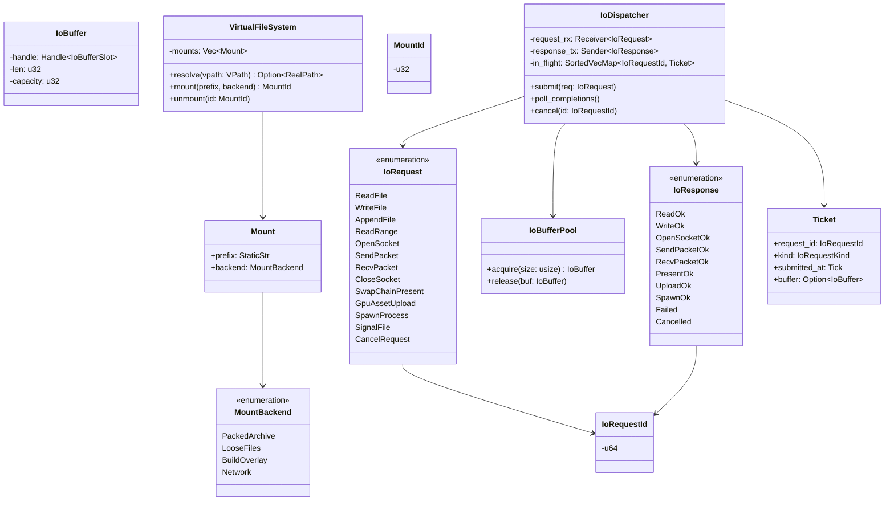
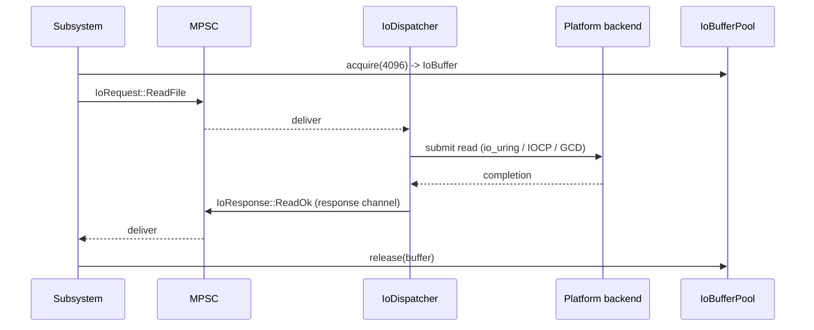
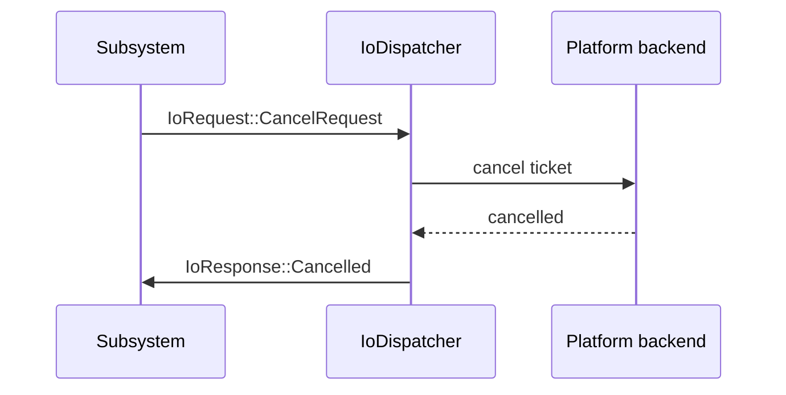

# I/O Request Protocol Design

## Requirements Trace

> **Canonical sources:** This document defines the canonical main-thread I/O request/response
> protocol that reinforces [constraints.md](../constraints.md) and is referenced from platform,
> content-pipeline, save, and networking docs. `memory-async-io.md` becomes a consumer of this
> protocol. See design review P1 task 29.

### Feature Trace

| Feature | Scope                                                         |
|---------|---------------------------------------------------------------|
| F-1.8.1 | Platform-native I/O request channel                           |
| F-1.8.2 | Request/response completion model                             |
| F-1.8.3 | Virtual file system mount contract                            |
| F-1.8.4 | Cancellation via `IoRequestId`                                |
| F-1.8.5 | Main-thread drain protocol                                    |
| F-1.8.6 | Zero-copy buffer handoff via `IoBuffer`                       |

1. **F-1.8.1** — One enum `IoRequest` with per-platform backend dispatch
2. **F-1.8.2** — One enum `IoResponse` carries completion state
3. **F-1.8.3** — `VirtualFileSystem` owns mount table and path resolution
4. **F-1.8.4** — `IoRequestId` tags in-flight requests for cancellation
5. **F-1.8.5** — Main thread drains via `poll_completions()` once per frame
6. **F-1.8.6** — Buffers allocated via typed pools, released on completion

## Overview

Constraints.md mandates platform-native I/O on the main thread. This document specifies the wire
protocol: every subsystem that needs I/O sends an `IoRequest` via crossbeam-channel to the main
thread; the main thread maps each request to its platform backend (io_uring / IOCP / GCD /
Networking.framework / Vulkan staging buffers / Vulkan staging buffers); completions arrive via
`IoResponse` on a reply channel. No subsystem calls OS I/O APIs directly.

### Client Subsystems

| Doc                                      | Uses                             |
|------------------------------------------|----------------------------------|
| `core-runtime/memory-async-io.md`        | File + network buffers           |
| `core-runtime/hot-reload-protocol.md`    | ReloadRequest delivery pipe      |
| `content-pipeline/asset-pipeline.md`     | Asset loading, importer output   |
| `game-framework/save-system.md`          | Save file read / write           |
| `networking/network-transport.md`        | QUIC socket open / send / recv   |
| `rendering/render-pipeline.md`           | Swap chain present (via IoRequest)|
| `platform/services.md`                   | Clipboard, file dialogs          |
| `audio/audio.md`                         | Audio asset streaming            |

## Architecture

### Class Diagram



### Dispatcher Lifecycle


## API Design

```rust
use std::path::PathBuf;
use crate::ids::NetworkEntityId;
use crate::error::IoError;
use crate::primitives::{Handle, SortedVecMap};

#[derive(Copy, Clone, Eq, PartialEq, Ord, PartialOrd, Hash)]
pub struct IoRequestId(pub u64);

/// Every I/O path from every subsystem flows through this enum.
pub enum IoRequest {
    ReadFile {
        id: IoRequestId,
        path: VPath,
        buffer: IoBuffer,
    },
    WriteFile {
        id: IoRequestId,
        path: VPath,
        buffer: IoBuffer,
    },
    AppendFile {
        id: IoRequestId,
        path: VPath,
        buffer: IoBuffer,
    },
    ReadRange {
        id: IoRequestId,
        path: VPath,
        offset: u64,
        len: u64,
        buffer: IoBuffer,
    },
    OpenSocket {
        id: IoRequestId,
        endpoint: SocketEndpoint,
    },
    SendPacket {
        id: IoRequestId,
        socket: SocketHandle,
        buffer: IoBuffer,
    },
    RecvPacket {
        id: IoRequestId,
        socket: SocketHandle,
        buffer: IoBuffer,
    },
    CloseSocket {
        id: IoRequestId,
        socket: SocketHandle,
    },
    SwapChainPresent {
        id: IoRequestId,
        swapchain: SwapchainHandle,
        image_index: u32,
    },
    GpuAssetUpload {
        id: IoRequestId,
        destination: GpuBufferHandle,
        source: IoBuffer,
    },
    SpawnProcess {
        id: IoRequestId,
        argv: Vec<String>,
        env: Vec<(String, String)>,
    },
    SignalFile {
        id: IoRequestId,
        path: VPath,
    },
    CancelRequest {
        target: IoRequestId,
    },
}

pub enum IoResponse {
    ReadOk {
        id: IoRequestId,
        bytes_read: u64,
        buffer: IoBuffer,
    },
    WriteOk {
        id: IoRequestId,
        bytes_written: u64,
    },
    OpenSocketOk {
        id: IoRequestId,
        socket: SocketHandle,
    },
    SendPacketOk {
        id: IoRequestId,
        bytes_sent: u64,
    },
    RecvPacketOk {
        id: IoRequestId,
        bytes_recv: u64,
        buffer: IoBuffer,
    },
    PresentOk {
        id: IoRequestId,
    },
    UploadOk {
        id: IoRequestId,
    },
    SpawnOk {
        id: IoRequestId,
        exit_code: i32,
        stdout: IoBuffer,
        stderr: IoBuffer,
    },
    Failed {
        id: IoRequestId,
        error: IoError,
    },
    Cancelled {
        id: IoRequestId,
    },
}

/// Opaque handle into the IoBufferPool. The pool owns the bytes; the
/// handle lets the dispatcher reclaim the buffer on completion.
#[derive(Clone)]
pub struct IoBuffer {
    handle: Handle<IoBufferSlot>,
    len: u32,
    capacity: u32,
}

pub struct IoBufferSlot;

pub struct IoBufferPool {
    // small / medium / large bucket structure
}

impl IoBufferPool {
    pub fn acquire(&mut self, size: usize) -> IoBuffer { unimplemented!() }
    pub fn release(&mut self, buf: IoBuffer) { unimplemented!() }
}

/// Virtual file system path. Always uses forward slashes and a scheme
/// prefix like `asset://` or `save://`.
#[derive(Clone)]
pub struct VPath(pub String);

pub struct VirtualFileSystem {
    mounts: Vec<Mount>,
}

pub struct Mount {
    pub prefix: &'static str,
    pub backend: MountBackend,
}

pub enum MountBackend {
    PackedArchive { path: PathBuf },
    LooseFiles { path: PathBuf },
    BuildOverlay { path: PathBuf },
    Network { endpoint: String },
}

#[derive(Copy, Clone, Eq, PartialEq, Hash)]
pub struct MountId(pub u32);

impl VirtualFileSystem {
    pub fn resolve(&self, vpath: &VPath) -> Option<PathBuf> { unimplemented!() }
    pub fn mount(&mut self, prefix: &'static str, backend: MountBackend)
        -> MountId { unimplemented!() }
    pub fn unmount(&mut self, id: MountId) { unimplemented!() }
}

/// Main-thread-owned dispatcher.
pub struct IoDispatcher {
    request_rx: crossbeam_channel::Receiver<IoRequest>,
    response_tx: crossbeam_channel::Sender<IoResponse>,
    in_flight: SortedVecMap<IoRequestId, Ticket>,
    buffers: IoBufferPool,
    vfs: VirtualFileSystem,
}

pub struct Ticket {
    pub request_id: IoRequestId,
    pub kind: IoRequestKind,
    pub submitted_at_tick: u64,
    pub buffer: Option<IoBuffer>,
}

pub enum IoRequestKind {
    Read, Write, Socket, Present, Upload, Spawn, Control,
}

impl IoDispatcher {
    /// Called exactly once per main-thread iteration (phase 0 of game loop).
    pub fn poll_completions(&mut self) {
        // 1. Drain request_rx and submit to platform backend.
        // 2. Poll platform backend for completions.
        // 3. Emit IoResponse via response_tx.
        // 4. Release buffers back to pool.
    }

    pub fn submit(&mut self, req: IoRequest) { unimplemented!() }
    pub fn cancel(&mut self, id: IoRequestId) { unimplemented!() }
}

pub struct SocketEndpoint {
    pub host: String,
    pub port: u16,
}

#[derive(Copy, Clone, Eq, PartialEq, Hash)]
pub struct SocketHandle(pub u32);

#[derive(Copy, Clone, Eq, PartialEq, Hash)]
pub struct SwapchainHandle(pub u32);

#[derive(Copy, Clone, Eq, PartialEq, Hash)]
pub struct GpuBufferHandle(pub u32);
```

### VFS Mount Examples

| Prefix          | Backend            | Purpose                   |
|-----------------|--------------------|---------------------------|
| `asset://`      | PackedArchive      | Shipping asset bundle     |
| `asset://`      | LooseFiles         | Editor iteration          |
| `save://`       | LooseFiles         | Save slots                |
| `temp://`       | LooseFiles         | Scratch                   |
| `build://`      | BuildOverlay       | Codegen artifacts         |
| `net://`        | Network            | Shared asset hosting      |

## Data Flow

### Read File



### Cancellation



## Platform Considerations

| Platform | File backend       | Network backend          | GPU upload backend |
|----------|--------------------|--------------------------|--------------------|
| Windows  | IOCP + Vulkan staging buffers | MsQuic via windows-rs  | Vulkan staging buffers      |
| macOS    | GCD dispatch_io    | Networking.framework     | Vulkan staging buffers          |
| iOS      | GCD dispatch_io    | Networking.framework     | Vulkan staging buffers          |
| Linux    | io_uring           | quinn-proto + io_uring   | Vulkan + io_uring  |
| Android  | io_uring (kernel >= 5.15) | quinn-proto      | Vulkan             |

All backends map cleanly onto the same `IoRequest`/`IoResponse` enum. Platform-specific state
(HANDLE, fd, dispatch_io_t, MTLIOCommandBuffer) lives in a private backend struct inside
`IoDispatcher`, never leaked to callers.

## Test Plan

Full test cases live in [io-test-cases.md](io-test-cases.md). Summary:

| Category    | Scope                                                          |
|-------------|----------------------------------------------------------------|
| Unit        | VFS path resolution, VPath parsing                              |
| Unit        | IoBufferPool acquire/release                                    |
| Unit        | Cancellation moves ticket to cancelled state                    |
| Integration | Asset loader reads file end-to-end                              |
| Integration | Network subsystem sends/receives packet                         |
| Benchmark   | 10K small-file reads under 100 ms                               |

## Open Questions

1. Should `IoBuffer` be POD for cross-thread transfer without cloning?
2. Should cancellation be eager (platform cancel) or lazy (ignore completion)?
3. What is the maximum number of in-flight requests before backpressure engages?
4. Should `SwapChainPresent` live in this doc or move to render-pipeline?
5. Does `SpawnProcess` need a stdin buffer for interactive subprocesses?
