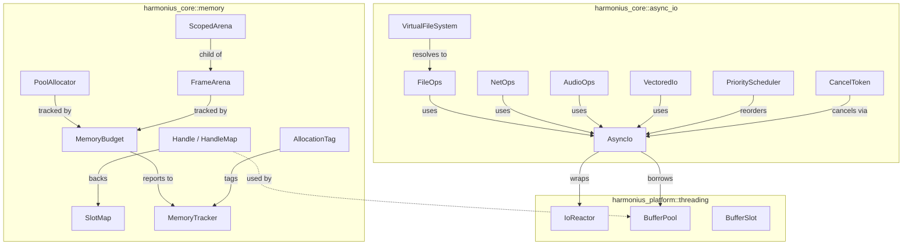
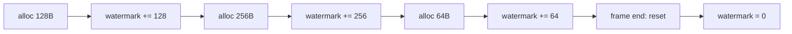
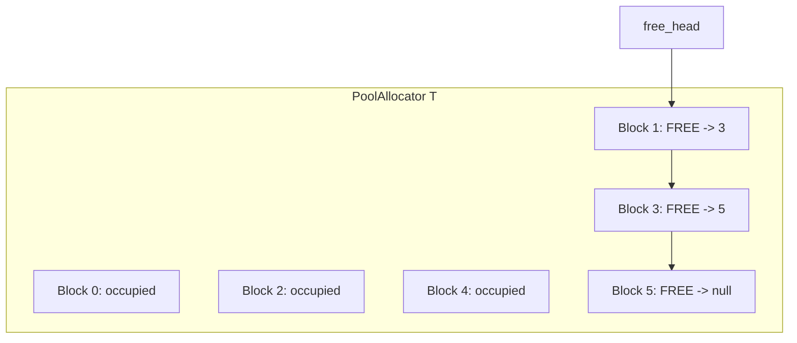
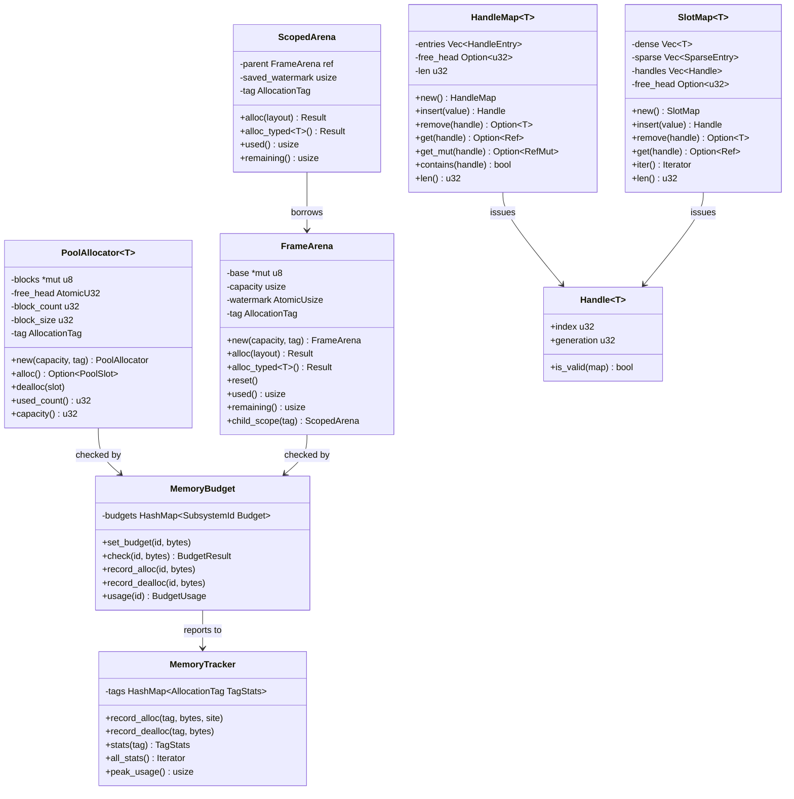
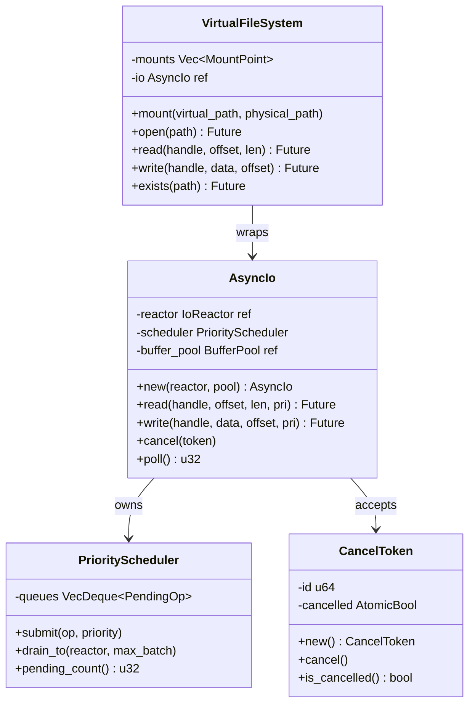
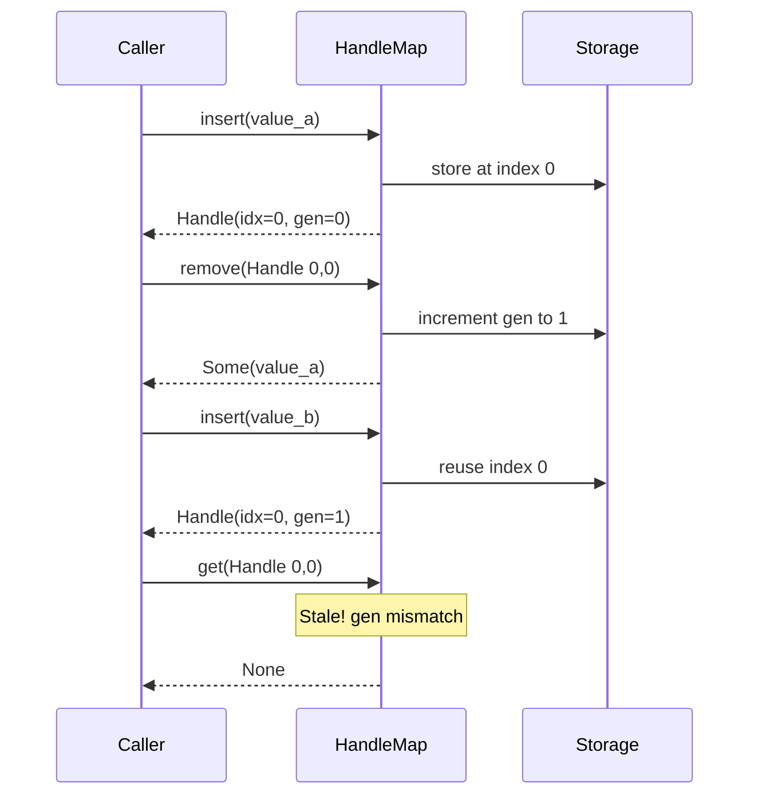
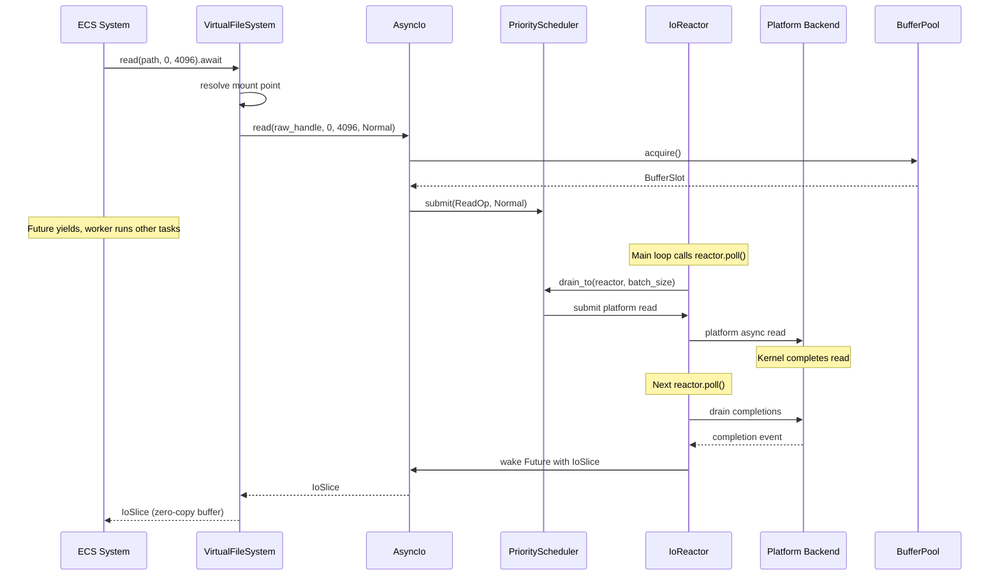

# Memory Management & Async I/O Design

## Requirements Trace

> **Canonical sources:** Features, requirements, and user stories are defined in
> [features/core-runtime/](../../features/core-runtime/),
> [requirements/core-runtime/](../../requirements/core-runtime/), and
> [user-stories/core-runtime/](../../user-stories/core-runtime/). The table below traces design
> elements to those definitions.

### Memory Management (F-1.7 / R-1.7)

| Feature | Requirement | Description |
|---------|-------------|-------------|
| F-1.7.1 | R-1.7.1, R-1.7.1a | Per-frame arena allocator with bump pointer and zero-cost reset |
| F-1.7.2 | R-1.7.2 | Scoped arena with nested lifetimes, restores parent watermark on drop |
| F-1.7.3 | R-1.7.3 | Typed pool allocator with O(1) alloc/dealloc via intrusive free list |
| F-1.7.4 | R-1.7.4 | Generational index handles for safe resource references |
| F-1.7.5 | R-1.7.5, R-1.7.5a | Slot map (dense-sparse set) with generational handle lookup |
| F-1.7.6 | R-1.7.6 | Per-subsystem memory budgets with eviction/backpressure |
| F-1.7.7 | R-1.7.7 | Profiling hooks compiled out in release builds |
| F-1.7.8 | R-1.7.8 | Allocation tagging with subsystem propagation |
| F-1.7.9 | R-1.7.9 | Arbitrary precision numeric types |

### Async I/O (F-1.8 / R-1.8)

| Feature | Requirement | Description |
|---------|-------------|-------------|
| F-1.8.1 | R-1.8.1 | Platform I/O backend abstraction (IOCP, GCD, io_uring) |
| F-1.8.2 | R-1.8.2, R-1.8.2a | Completion-based proactor model |
| F-1.8.3 | R-1.8.3 | Async file I/O with explicit byte offsets |
| F-1.8.4 | R-1.8.4 | Async network socket I/O (TCP/UDP) |
| F-1.8.5 | R-1.8.5 | Async audio stream I/O with deadline hints |
| F-1.8.6 | R-1.8.6 | Scatter-gather and vectored I/O |
| F-1.8.7 | R-1.8.7 | I/O priority and deadline scheduling |
| F-1.8.8 | R-1.8.8, R-1.8.8a | Cooperative I/O cancellation via tokens |
| F-1.8.9 | R-1.8.9 | Registered buffer pools for zero-copy transfers |

## Overview

This document designs the memory management and async I/O subsystems of the Harmonius engine.
Together they form the allocation and I/O foundation consumed by every other domain.

**Memory management** provides three allocator types (frame arena, scoped arena, typed pool),
generational handles for safe indirect references, a slot map container for cache-friendly
iteration, per-subsystem memory budgets, and allocation profiling/tagging.

**Async I/O** wraps the `IoReactor` defined in [platform/threading.md](../platform/threading.md)
with a higher-level `AsyncIo` trait, adding priority scheduling, cancellation tokens, a virtual file
system (VFS) for path resolution, and typed operation interfaces for files, sockets, and audio
streams. All I/O uses `async`/`await`. No Rust stdlib file I/O is permitted.

### Interop Contracts Defined Here

| Contract | Consumed By |
|----------|-------------|
| Allocator types (`FrameArena`, `PoolAllocator`) | All domains |
| `Handle<T>` / `HandleMap<T>` / `SlotMap<T>` | All domains (ECS, assets, rendering) |
| `AsyncIo` trait (wraps `IoReactor`) | Content Pipeline, Platform, Networking |
| `VirtualFileSystem` | Content Pipeline, Save System |
| `MemoryBudget` / `MemoryTracker` | All domains |

## Architecture

### Module Boundaries



### File Layout

```text
harmonius_core/
├── memory/
│   ├── arena.rs          # FrameArena, ScopedArena
│   ├── pool.rs           # PoolAllocator<T>
│   ├── handle.rs         # Handle<T>, HandleMap<T>
│   ├── slot_map.rs       # SlotMap<T>
│   ├── budget.rs         # MemoryBudget, BudgetUsage
│   ├── tracker.rs        # MemoryTracker, TagStats
│   ├── tag.rs            # AllocationTag, SubsystemId
│   └── precision.rs      # BigInt, BigFloat
└── async_io/
    ├── io.rs             # AsyncIo, IoSlice
    ├── vfs.rs            # VirtualFileSystem,
    │                     # MountPoint, VfsHandle
    ├── file.rs           # FileOps (read, write,
    │                     # flush)
    ├── net.rs            # NetOps (TCP, UDP)
    ├── audio.rs          # AudioOps (deadline
    │                     # hints)
    ├── vectored.rs       # VectoredIo
    │                     # (scatter-gather)
    ├── priority.rs       # PriorityScheduler,
    │                     # IoPriority
    ├── cancel.rs         # CancelToken
    └── error.rs          # IoError
```

### Arena Allocator Bump Flow



### Pool Allocator Free List



### Memory Data Structures



### Async I/O Data Structures



### Generational Handle Lifecycle



### Async I/O Data Flow



## API Design

### Frame Arena Allocator

```rust
/// Per-frame bump allocator backed by platform-native
/// virtual memory (VirtualAlloc / mmap).
/// Resets at zero cost at frame boundaries.
pub struct FrameArena {
    base: *mut u8,
    capacity: usize,
    watermark: AtomicUsize,
    tag: AllocationTag,
    budget: *const MemoryBudget,
}

pub struct ArenaConfig {
    /// Initial capacity in bytes. Default: 8 MiB.
    pub initial_capacity: usize,
    /// Maximum capacity. Arena doubles up to this.
    pub max_capacity: usize,
    /// Subsystem tag for profiling.
    pub tag: AllocationTag,
}

impl FrameArena {
    /// Create a new arena backed by virtual memory.
    pub fn new(
        config: ArenaConfig,
        budget: &MemoryBudget,
    ) -> Result<Self, ArenaError>;

    /// Bump-allocate `layout.size()` bytes aligned to
    /// `layout.align()`. Returns pointer to allocated
    /// memory or an error if capacity is exceeded.
    pub fn alloc(
        &self,
        layout: Layout,
    ) -> Result<*mut u8, ArenaError>;

    /// Typed bump allocation.
    pub fn alloc_typed<T>(
        &self,
    ) -> Result<*mut T, ArenaError>;

    /// Zero-cost reset. Watermark returns to base.
    /// All prior allocations are invalidated.
    pub fn reset(&self);

    /// Bytes currently allocated.
    pub fn used(&self) -> usize;

    /// Bytes remaining before capacity.
    pub fn remaining(&self) -> usize;

    /// Create a child scope. The child allocates from
    /// the parent's remaining capacity. On drop, the
    /// parent watermark is restored.
    pub fn child_scope(
        &self,
        tag: AllocationTag,
    ) -> ScopedArena<'_>;
}

/// Scoped sub-arena. Restores parent watermark on
/// drop. Enables temporary allocations within a
/// system's execution without waiting for frame end.
pub struct ScopedArena<'parent> {
    parent: &'parent FrameArena,
    saved_watermark: usize,
    tag: AllocationTag,
}

impl<'parent> ScopedArena<'parent> {
    pub fn alloc(
        &self,
        layout: Layout,
    ) -> Result<*mut u8, ArenaError>;

    pub fn alloc_typed<T>(
        &self,
    ) -> Result<*mut T, ArenaError>;

    pub fn used(&self) -> usize;
    pub fn remaining(&self) -> usize;
}

impl Drop for ScopedArena<'_> {
    fn drop(&mut self) {
        // Restore parent watermark to saved_watermark
    }
}

pub enum ArenaError {
    /// Requested allocation exceeds remaining
    /// capacity.
    OutOfMemory {
        requested: usize,
        remaining: usize,
    },
    /// Budget exceeded for this subsystem.
    BudgetExceeded {
        subsystem: SubsystemId,
        budget: usize,
        current: usize,
    },
}
```

### Typed Pool Allocator

```rust
/// Fixed-size block pool. O(1) alloc and dealloc via
/// intrusive free list. Zero fragmentation.
/// Backs ECS component columns and resource containers.
pub struct PoolAllocator<T> {
    blocks: *mut u8,
    free_head: AtomicU32,
    block_count: u32,
    block_size: u32,
    tag: AllocationTag,
    budget: *const MemoryBudget,
    _marker: PhantomData<T>,
}

pub struct PoolConfig {
    /// Initial number of blocks.
    pub initial_count: u32,
    /// Maximum number of blocks. Grows by doubling
    /// via virtual memory commit-on-demand.
    pub max_count: u32,
    /// Subsystem tag.
    pub tag: AllocationTag,
}

impl<T> PoolAllocator<T> {
    pub fn new(
        config: PoolConfig,
        budget: &MemoryBudget,
    ) -> Self;

    /// Allocate a block. Returns None if pool
    /// exhausted and cannot grow.
    pub fn alloc(&self) -> Option<PoolSlot<T>>;

    /// Return a block to the free list.
    pub fn dealloc(&self, slot: PoolSlot<T>);

    pub fn used_count(&self) -> u32;
    pub fn capacity(&self) -> u32;
}

/// A slot in the pool. Provides typed access to the
/// allocated block.
pub struct PoolSlot<T> {
    ptr: *mut T,
    index: u32,
}

impl<T> PoolSlot<T> {
    pub fn as_ref(&self) -> &T;
    pub fn as_mut(&mut self) -> &mut T;
    pub fn index(&self) -> u32;
}
```

### Generational Handles

```rust
/// Generational index handle. Packed index + generation
/// counter. Stale handles fail validation in O(1).
///
/// `Handle<T>` is the canonical engine-wide
/// generational index. ECS `Entity` and spatial
/// `BvhHandle` are aliases or wrappers of this type.
/// See [shared-primitives.md](shared-primitives.md)
/// for the full contract.
#[derive(Clone, Copy, Debug, PartialEq, Eq, Hash)]
pub struct Handle<T> {
    pub index: u32,
    pub generation: u32,
    _marker: PhantomData<T>,
}

impl<T> Handle<T> {
    /// Check if this handle is still valid in the
    /// given map.
    pub fn is_valid(
        &self,
        map: &HandleMap<T>,
    ) -> bool;
}

/// Storage container that issues and validates
/// generational handles.
pub struct HandleMap<T> {
    entries: Vec<HandleEntry<T>>,
    free_head: Option<u32>,
    len: u32,
}

struct HandleEntry<T> {
    value: Option<T>,
    generation: u32,
    next_free: Option<u32>,
}

impl<T> HandleMap<T> {
    pub fn new() -> Self;

    /// Insert a value. Returns a handle for future
    /// access.
    pub fn insert(&mut self, value: T) -> Handle<T>;

    /// Remove the value at `handle`. Increments the
    /// generation, invalidating all copies of this
    /// handle. Returns the value if valid.
    pub fn remove(
        &mut self,
        handle: Handle<T>,
    ) -> Result<T, HandleError>;

    /// O(1) lookup by handle.
    pub fn get(
        &self,
        handle: Handle<T>,
    ) -> Result<&T, HandleError>;

    /// O(1) mutable lookup by handle.
    pub fn get_mut(
        &mut self,
        handle: Handle<T>,
    ) -> Result<&mut T, HandleError>;

    /// Check if handle points to a live entry.
    pub fn contains(&self, handle: Handle<T>) -> bool;

    pub fn len(&self) -> u32;
}

pub enum HandleError {
    /// Handle's generation does not match stored
    /// generation.
    GenerationMismatch {
        handle_gen: u32,
        stored_gen: u32,
    },
    /// Index is out of bounds.
    IndexOutOfBounds { index: u32, capacity: u32 },
}
```

### Slot Map

```rust
/// Dense-sparse set. Values stored in a contiguous
/// dense array for cache-friendly iteration.
/// Generational handles provide O(1) lookup via a
/// sparse indirection table.
pub struct SlotMap<T> {
    dense: Vec<T>,
    sparse: Vec<SparseEntry>,
    handles: Vec<Handle<T>>,
    free_head: Option<u32>,
}

struct SparseEntry {
    dense_index: u32,
    generation: u32,
    next_free: Option<u32>,
}

impl<T> SlotMap<T> {
    pub fn new() -> Self;

    pub fn with_capacity(capacity: u32) -> Self;

    /// Insert a value. Returns a generational handle.
    pub fn insert(&mut self, value: T) -> Handle<T>;

    /// Remove by handle. Swap-removes from dense
    /// array and updates indirection.
    pub fn remove(
        &mut self,
        handle: Handle<T>,
    ) -> Result<T, HandleError>;

    /// O(1) lookup via sparse indirection.
    pub fn get(
        &self,
        handle: Handle<T>,
    ) -> Result<&T, HandleError>;

    pub fn get_mut(
        &mut self,
        handle: Handle<T>,
    ) -> Result<&mut T, HandleError>;

    /// Iterate the dense array (cache-friendly).
    pub fn iter(&self) -> impl Iterator<Item = &T>;

    pub fn iter_mut(
        &mut self,
    ) -> impl Iterator<Item = &mut T>;

    /// Iterate handles and values together.
    pub fn iter_with_handles(
        &self,
    ) -> impl Iterator<Item = (Handle<T>, &T)>;

    pub fn len(&self) -> u32;
    pub fn capacity(&self) -> u32;
}
```

### Memory Budgets and Tracking

```rust
/// Identifies an engine subsystem for budget tracking.
#[derive(
    Clone, Copy, Debug, PartialEq, Eq, Hash,
)]
pub struct SubsystemId(pub u16);

/// Tag attached to every allocation for profiling.
#[derive(Clone, Copy, Debug, PartialEq, Eq, Hash)]
pub struct AllocationTag {
    pub subsystem: SubsystemId,
    pub label: Option<&'static str>,
}

/// Per-subsystem memory budget enforcement.
pub struct MemoryBudget { /* ... */ }

pub struct BudgetUsage {
    pub current_bytes: usize,
    pub peak_bytes: usize,
    pub budget_bytes: usize,
}

pub enum BudgetResult {
    /// Allocation fits within budget.
    Ok,
    /// Budget exceeded. Trigger eviction.
    Exceeded {
        subsystem: SubsystemId,
        over_by: usize,
    },
}

impl MemoryBudget {
    pub fn new() -> Self;

    /// Set the budget for a subsystem in bytes.
    pub fn set_budget(
        &mut self,
        id: SubsystemId,
        bytes: usize,
    );

    /// Check if `bytes` can be allocated within
    /// the subsystem's budget.
    pub fn check(
        &self,
        id: SubsystemId,
        bytes: usize,
    ) -> BudgetResult;

    /// Record an allocation against the budget.
    pub fn record_alloc(
        &self,
        id: SubsystemId,
        bytes: usize,
    );

    /// Record a deallocation.
    pub fn record_dealloc(
        &self,
        id: SubsystemId,
        bytes: usize,
    );

    /// Query current usage for a subsystem.
    pub fn usage(
        &self,
        id: SubsystemId,
    ) -> BudgetUsage;
}

/// Profiling hooks. Compiled out in release builds
/// via `cfg(debug_assertions)`.
pub struct MemoryTracker { /* ... */ }

pub struct TagStats {
    pub tag: AllocationTag,
    pub alloc_count: u64,
    pub dealloc_count: u64,
    pub current_bytes: usize,
    pub peak_bytes: usize,
}

impl MemoryTracker {
    pub fn new() -> Self;

    #[cfg(debug_assertions)]
    pub fn record_alloc(
        &self,
        tag: AllocationTag,
        bytes: usize,
        call_site: &'static str,
    );

    #[cfg(debug_assertions)]
    pub fn record_dealloc(
        &self,
        tag: AllocationTag,
        bytes: usize,
    );

    pub fn stats(
        &self,
        tag: AllocationTag,
    ) -> Option<&TagStats>;

    pub fn all_stats(
        &self,
    ) -> impl Iterator<Item = &TagStats>;

    pub fn peak_usage(&self) -> usize;
}
```

### AsyncIo Trait

The `AsyncIo` layer wraps the `IoReactor` from [platform/threading.md](../platform/threading.md)
with priority scheduling, cancellation, and typed operation interfaces. It is the sole I/O path for
all engine subsystems.

```rust
/// I/O priority levels.
#[derive(
    Clone, Copy, Debug, PartialEq, Eq, PartialOrd, Ord,
)]
pub enum IoPriority {
    /// Audio buffers, frame-critical assets.
    Critical,
    /// Default: most asset loads, saves.
    Normal,
    /// Prefetch, telemetry, log flushing.
    Background,
}

/// Result of an I/O read operation. Contains a
/// zero-copy BufferSlot from the registered pool.
pub struct IoSlice {
    pub buffer: BufferSlot,
    pub bytes_transferred: u32,
}

impl IoSlice {
    pub fn as_slice(&self) -> &[u8];
}

/// Platform-agnostic I/O errors.
pub enum IoError {
    NotFound,
    PermissionDenied,
    /// Operation was cancelled via CancelToken.
    Cancelled,
    DeviceFull,
    /// Subsystem memory budget exceeded.
    BudgetExceeded { subsystem: SubsystemId },
    /// Platform-specific error with OS error code.
    Platform { code: i32 },
}

/// The engine's async I/O facade. Wraps IoReactor.
/// All I/O operations in the engine route through
/// this layer.
pub struct AsyncIo {
    reactor: *const IoReactor,
    scheduler: PriorityScheduler,
    buffer_pool: *const BufferPool,
}

impl AsyncIo {
    pub fn new(
        reactor: &IoReactor,
        buffer_pool: &BufferPool,
    ) -> Self;

    /// Async file read at explicit byte offset.
    pub async fn read(
        &self,
        handle: RawHandle,
        offset: u64,
        len: u32,
        priority: IoPriority,
    ) -> Result<IoSlice, IoError>;

    /// Async file write at explicit byte offset.
    pub async fn write(
        &self,
        handle: RawHandle,
        data: &[u8],
        offset: u64,
        priority: IoPriority,
    ) -> Result<u32, IoError>;

    /// Scatter-gather read into multiple buffers.
    pub async fn read_vectored(
        &self,
        handle: RawHandle,
        ops: &[(u64, u32)],
        priority: IoPriority,
    ) -> Vec<Result<IoSlice, IoError>>;

    /// Scatter-gather write from multiple buffers.
    pub async fn write_vectored(
        &self,
        handle: RawHandle,
        bufs: &[&[u8]],
        offset: u64,
        priority: IoPriority,
    ) -> Result<u32, IoError>;

    /// Async TCP accept.
    pub async fn tcp_accept(
        &self,
        listener: RawHandle,
    ) -> Result<RawHandle, IoError>;

    /// Async TCP connect.
    pub async fn tcp_connect(
        &self,
        addr: SocketAddr,
    ) -> Result<RawHandle, IoError>;

    /// Async TCP/UDP send.
    pub async fn send(
        &self,
        handle: RawHandle,
        data: &[u8],
        priority: IoPriority,
    ) -> Result<u32, IoError>;

    /// Async TCP/UDP receive.
    pub async fn recv(
        &self,
        handle: RawHandle,
        priority: IoPriority,
    ) -> Result<IoSlice, IoError>;

    /// Async UDP sendto.
    pub async fn sendto(
        &self,
        handle: RawHandle,
        data: &[u8],
        addr: SocketAddr,
        priority: IoPriority,
    ) -> Result<u32, IoError>;

    /// Async UDP recvfrom.
    pub async fn recvfrom(
        &self,
        handle: RawHandle,
        priority: IoPriority,
    ) -> Result<(IoSlice, SocketAddr), IoError>;

    /// Cancel an in-flight operation.
    pub fn cancel(
        &self,
        token: &CancelToken,
    );

    /// Delegates to `IoReactor::poll()`.
    pub fn poll(&self) -> u32;
}
```

### Priority Scheduler

```rust
/// Reorders I/O submissions by priority. Critical
/// operations are drained before normal and
/// background. Within a priority level, FIFO order.
pub struct PriorityScheduler {
    critical: VecDeque<PendingOp>,
    normal: VecDeque<PendingOp>,
    background: VecDeque<PendingOp>,
}

impl PriorityScheduler {
    pub fn new() -> Self;

    /// Enqueue an operation at the given priority.
    pub fn submit(
        &mut self,
        op: PendingOp,
        priority: IoPriority,
    );

    /// Drain up to `max_batch` operations to the
    /// reactor, prioritizing critical > normal >
    /// background.
    pub fn drain_to(
        &mut self,
        reactor: &IoReactor,
        max_batch: u32,
    ) -> u32;

    pub fn pending_count(&self) -> u32;
}
```

### Cancellation Token

```rust
/// Cooperative cancellation for in-flight I/O.
/// The completion always fires (with IoError::Cancelled
/// if the cancellation beat the OS completion).
pub struct CancelToken {
    id: u64,
    cancelled: AtomicBool,
}

impl CancelToken {
    pub fn new() -> Self;

    /// Request cancellation.
    pub fn cancel(&self);

    /// Check if cancellation was requested.
    pub fn is_cancelled(&self) -> bool;
}
```

### Virtual File System

```rust
/// Resolve virtual paths to physical file handles.
/// Enables content pipeline to mount asset directories,
/// archive files, and mod overlay paths.
pub struct VirtualFileSystem {
    mounts: Vec<MountPoint>,
    io: *const AsyncIo,
}

pub struct MountPoint {
    pub virtual_path: String,
    pub physical_path: String,
    pub priority: u32,
}

/// Opaque file handle returned by VFS.
pub struct VfsHandle {
    raw: RawHandle,
    mount_index: u32,
}

pub struct FileMetadata {
    pub size: u64,
    pub modified: u64,
    /// BLAKE3 content hash.
    pub content_hash: [u8; 32],
}

impl VirtualFileSystem {
    pub fn new(io: &AsyncIo) -> Self;

    /// Mount a physical path at a virtual location.
    /// Higher priority mounts override lower ones.
    pub fn mount(
        &mut self,
        virtual_path: &str,
        physical_path: &str,
        priority: u32,
    );

    /// Open a file by virtual path.
    pub async fn open(
        &self,
        path: &str,
    ) -> Result<VfsHandle, IoError>;

    /// Async read from an opened file.
    pub async fn read(
        &self,
        handle: &VfsHandle,
        offset: u64,
        len: u32,
    ) -> Result<IoSlice, IoError>;

    /// Async write to an opened file.
    pub async fn write(
        &self,
        handle: &VfsHandle,
        data: &[u8],
        offset: u64,
    ) -> Result<u32, IoError>;

    /// Check if a virtual path exists.
    pub async fn exists(
        &self,
        path: &str,
    ) -> Result<bool, IoError>;

    /// Query file metadata including BLAKE3 hash.
    pub async fn metadata(
        &self,
        path: &str,
    ) -> Result<FileMetadata, IoError>;
}
```

### Arbitrary Precision Types

**Note:** Arbitrary-precision numerics (`BigInt`, `BigFloat`) address R-1.7.9 but are not related to
memory management or I/O. These will be relocated to a dedicated math/core-types design in a future
revision.

```rust
/// Arbitrary precision integer. Supports 128-bit,
/// 256-bit, and unlimited precision.
pub struct BigInt {
    limbs: Vec<u64>,
}

impl BigInt {
    pub fn from_i128(val: i128) -> Self;
    pub fn to_f64(&self) -> f64;
    pub fn to_f32(&self) -> f32;
}

/// Arbitrary precision float with configurable
/// precision and deterministic cross-platform
/// arithmetic.
pub struct BigFloat {
    significand: BigInt,
    exponent: i32,
    precision_bits: u32,
}

impl BigFloat {
    pub fn new(
        significand: BigInt,
        exponent: i32,
        precision: u32,
    ) -> Self;
    pub fn to_f64(&self) -> f64;
    pub fn to_f32(&self) -> f32;
    /// Format with unit suffix (e.g., "2.4M ly").
    pub fn format_with_units(
        &self,
        unit: &str,
    ) -> String;
}
```

## Data Flow

### Frame Lifecycle with Memory and I/O

The game loop owns the `IoReactor`, `FrameArena`, and `AsyncIo`. Each frame proceeds as:

```rust
loop {
    // 1. Reset frame arena (zero cost)
    frame_arena.reset();

    // 2. Poll I/O reactor: harvest completions
    async_io.poll();

    // 3. Build and run ECS systems
    let graph = ecs.build_frame_graph();
    pool.execute_graph(graph).await;
    // Systems allocate transient data from
    // frame_arena. Async systems submit I/O
    // through async_io and yield at .await
    // points.

    // 4. Mid-frame poll (reduces I/O latency)
    async_io.poll();

    // 5. Render submission
    renderer.submit_commands();

    // 6. GPU sync (async, no CPU spin)
    renderer.present().await;
}
```

### Scoped Arena Usage

```rust
pool.scope(|scope| {
    let query_results = frame_arena.child_scope(
        AllocationTag {
            subsystem: PHYSICS_ID,
            label: Some("broadphase"),
        },
    );
    // Allocate broadphase results in child scope
    let pairs = query_results.alloc_typed::<
        ContactPair
    >();
    // ... use pairs ...

    // Child scope drops here -> watermark restored.
    // Peak memory is reduced vs. waiting for
    // frame end.
});
```

### VFS Resolution Order

When multiple mounts overlap, the VFS resolves paths by mount priority (highest wins):

1. Check mounts in descending priority order
2. For each mount, test if `physical_path + relative` exists
3. First match wins; open the physical file
4. If no mount matches, return `IoError::NotFound`

### I/O Cancellation Flow

1. Caller creates `CancelToken` and passes it when submitting I/O
2. To cancel, caller calls `token.cancel()` which sets an atomic bool
3. The `AsyncIo` layer passes the cancellation to the platform backend (`CancelIoEx` /
   `dispatch_io_close` / `io_uring_prep_cancel`)
4. The completion **always** fires: either with the original result (if the OS completed before
   cancellation) or with `IoError::Cancelled`
5. The buffer is returned to the pool in either case

## Platform Considerations

### Memory Backing

| Platform | Virtual Memory API | Notes |
|----------|-------------------|-------|
| Windows | `VirtualAlloc` / `VirtualFree` | `MEM_RESERVE` + `MEM_COMMIT` for commit-on-demand pool growth |
| macOS | `mmap` / `munmap` | `MAP_ANON` for arena backing; GCD-compatible |
| Linux | `mmap` / `munmap` | `MAP_ANON | MAP_PRIVATE`; `madvise(MADV_DONTNEED)` for arena reset |

### I/O Backend Mapping

AsyncIo delegates to the `IoReactor` from [platform/threading.md](../platform/threading.md). Each
platform backend is selected at compile time via `cfg` attributes with zero dynamic dispatch.

| Operation | Windows (IOCP) | macOS (GCD) | Linux (io_uring) |
|-----------|---------------|-------------|-----------------|
| File read | `ReadFile` + `OVERLAPPED` | `dispatch_io_read` via cxx.rs | `io_uring_prep_read` |
| File write | `WriteFile` + `OVERLAPPED` | `dispatch_io_write` via cxx.rs | `io_uring_prep_write` |
| Vectored read | `ReadFileScatter` | `dispatch_data` composites | `io_uring_prep_readv` |
| Vectored write | `WriteFileGather` | `dispatch_data` composites | `io_uring_prep_writev` |
| TCP accept | `AcceptEx` | `dispatch_source` READ | `io_uring_prep_accept` |
| TCP send | `WSASend` + overlapped | `dispatch_source` WRITE | `io_uring_prep_send` |
| TCP recv | `WSARecv` + overlapped | `dispatch_source` READ | `io_uring_prep_recv` |
| UDP sendto | `WSASendTo` + overlapped | `dispatch_source` WRITE | `io_uring_prep_sendmsg` |
| UDP recvfrom | `WSARecvFrom` + overlapped | `dispatch_source` READ | `io_uring_prep_recvmsg` |
| Cancel | `CancelIoEx` | `dispatch_io_close(STOP)` | `io_uring_prep_cancel` |
| Buffer reg | `SetFileIoOverlappedRange` | `dispatch_data_create` | `io_uring_register_buffers` |
| Priority | Thread pool priority | QoS classes | `ioprio_set` |
| Audio I/O | WASAPI event-driven + IOCP | CoreAudio + `dispatch_io` | ALSA + io_uring periods |

### Memory Budget Defaults

| Tier | ECS | Asset Cache | GPU Upload | Scratch | Total |
|------|-----|-------------|------------|---------|-------|
| Mobile (2-6 GB) | 128 MB | 256 MB | 64 MB | 32 MB | 480 MB |
| Switch (4 GB) | 256 MB | 512 MB | 128 MB | 64 MB | 960 MB |
| Desktop (16+ GB) | 1 GB | 4 GB | 512 MB | 256 MB | 5.75 GB |
| High-end (64 GB) | 4 GB | 16 GB | 2 GB | 1 GB | 23 GB |

### In-Flight I/O Limits

| Tier | Max In-Flight |
|------|--------------|
| Mobile | 32 |
| Switch | 64 |
| Desktop | 256 |
| High-end PC | 1024 |

### Proposed Dependencies

| Crate | Purpose | Justification |
|-------|---------|---------------|
| `blake3` | BLAKE3 content hashing for VFS metadata | Fast, SIMD-optimized, pure Rust |
| `windows-sys` | Win32 `VirtualAlloc`, IOCP, `CancelIoEx` | Zero-cost FFI to Win32 APIs |
| `io-uring` | Linux io_uring bindings | Safe Rust wrapper around liburing |
| `cxx` | C++ interop for macOS GCD / Dispatch IO | Safe bridge to Dispatch C++ wrappers |

Note: `crossbeam-deque`, `crossbeam-utils`, and `smallvec` are already approved in
[platform/threading.md](../platform/threading.md).

## Safety Invariants

### FrameArena Lifetime (Critical)

`FrameArena::alloc` returns `*mut T` with no lifetime bound. After `reset()`, all prior allocations
are invalid. Implementation must return `ArenaRef<'a, T>` borrowing from the arena, tying the
reference lifetime to the arena scope. `reset()` requires `&mut self` to prevent aliased access
during reset.

### FrameArena Thread Safety (Critical)

`watermark: AtomicUsize` suggests concurrent alloc. Implementation must use a CAS loop:
`compare_exchange(old, align_up(old, align) + size)`. Plain `fetch_add` without alignment interleave
check causes overlapping allocations. Specify `Ordering::Relaxed` for the watermark (single-object
allocation has no inter-allocation ordering dependency).

### PoolAllocator ABA Problem (Critical)

`free_head: AtomicU32` intrusive free list is susceptible to ABA. Use `AtomicU64` with
`[count:32][index:32]` tagged pointer, or add a generation counter per slot (matching `Handle<T>`
pattern). Without ABA protection, concurrent alloc/dealloc silently corrupts the free list.

### PoolSlot Lifetime (Critical)

`PoolSlot<T>::as_ref()` produces `&T` from a raw pointer with no lifetime bound. After `dealloc`,
the slot is freed. Implementation must tie `PoolSlot<T>` to the allocator's lifetime, or use
generational indices (like `Handle<T>`) with runtime validation.

### AsyncIo Raw Pointers (Critical)

`AsyncIo` stores `reactor: *const IoReactor` as a raw pointer. If `IoReactor` is dropped while
`AsyncIo` exists, all operations are use-after-free. Store `&'a IoReactor` with lifetime parameter,
making `AsyncIo<'a>` a borrowing struct. Raw pointers are not justified here.

### ScopedArena Child Lifetimes (High)

When `ScopedArena` drops, it restores the parent watermark. Allocations from child scopes become
dangling. `alloc` must return references bounded by the scope's `'parent` lifetime.

## Test Plan

### Unit Tests — Memory

| Test | Req | Description |
|------|-----|-------------|
| `test_arena_100k_allocs_under_1ms` | R-1.7.1 | 100,000 varying-size bump allocations in one frame. Verify total time < 1 ms. Verify watermark = sum of sizes + padding. |
| `test_arena_reset_zero_cost` | R-1.7.1 | Allocate 8 MB, reset, verify watermark = 0 in < 1 us. |
| `test_arena_overflow_error` | R-1.7.1a | Fill to 99% capacity. Attempt oversize alloc. Verify `ArenaError::OutOfMemory` with correct sizes. |
| `test_arena_grow_by_doubling` | R-1.7.1a | Exhaust initial 8 MiB arena. Verify it doubles to 16 MiB. Verify growth stops at configured max. |
| `test_scoped_arena_restore` | R-1.7.2 | Parent 1 MB. Child allocates 512 KB. Drop child. Verify parent remaining = 1 MB. |
| `test_scoped_arena_nested_10` | R-1.7.2 | 10 nested scopes. Verify correct watermark at each level on drop. |
| `test_pool_o1_alloc_dealloc` | R-1.7.3 | 10,000 random alloc/dealloc. Benchmark confirms constant time regardless of occupancy. |
| `test_pool_zero_fragmentation` | R-1.7.3 | After random ops, verify total memory = block_count * block_size. |
| `test_handle_generation_mismatch` | R-1.7.4 | Alloc handle, remove, alloc new at same index. Old handle returns `GenerationMismatch`. |
| `test_handle_validate_1m` | R-1.7.4 | Validate 1 million handles. Verify O(1) per validation. |
| `test_slotmap_dense_iteration` | R-1.7.5 | Insert 10,000, remove 5,000 random. Verify dense iteration visits exactly 5,000. |
| `test_slotmap_4m_entries` | R-1.7.5a | Insert 4 million entries. Verify all lookups succeed. |
| `test_slotmap_stale_error` | R-1.7.5a | Stale handle returns `GenerationMismatch` with expected/actual gen. |
| `test_budget_eviction` | R-1.7.6 | Set 100 MB budget. Allocate to limit. Next alloc returns `BudgetExceeded`. |
| `test_profiling_hooks_dev` | R-1.7.7 | Dev build: 1,000 allocations across 3 allocators. Verify correct counts, byte totals, peak. |
| `test_profiling_compiled_out` | R-1.7.7 | Release build: verify no profiling symbol exists (binary inspection). |
| `test_tag_propagation` | R-1.7.8 | Parent arena tagged "physics". Child scope inherits tag. Verify per-tag stats sum correctly. |
| `test_bigint_determinism` | R-1.7.9 | Compute distance at 10M light-years. Verify bit-identical on all platforms. |
| `test_bigfloat_to_f32_f64` | R-1.7.9 | Round-trip conversion. Verify deterministic across architectures. |

### Unit Tests — Async I/O

| Test | Req | Description |
|------|-----|-------------|
| `test_async_read_data_integrity` | R-1.8.3 | Write 4 MB at explicit offsets from 4 tasks. Read back. Verify integrity. |
| `test_no_std_fs_calls` | R-1.8.3 | Static analysis: verify no `std::fs` or `std::io::Read/Write` in codebase. |
| `test_completion_typed_result` | R-1.8.2 | Submit 1 MB write. Verify completion carries correct byte count and context. |
| `test_completion_latency_p99` | R-1.8.2a | 10,000 concurrent 4 KB reads. Verify p99 delivery latency < 100 us. |
| `test_vectored_write_integrity` | R-1.8.6 | Write 3 non-contiguous buffers via single vectored write. Read back, verify concatenation. |
| `test_vectored_syscall_reduction` | R-1.8.6 | Benchmark vectored vs. individual writes. Verify >= 30% syscall reduction. |
| `test_priority_ordering` | R-1.8.7 | Submit 100 background reads then 1 critical. Verify critical completes before 90% of background. |
| `test_cancel_fires_completion` | R-1.8.8 | Submit 100 MB read, cancel within 1 ms. Verify `IoError::Cancelled` fires. Verify no buffer leak. |
| `test_cancel_1000_no_leaks` | R-1.8.8a | Submit 1,000 ops, cancel all. Verify all complete within 10 ms. Verify no buffer/handle leaks. |
| `test_buffer_pool_backpressure` | R-1.8.9 | Register 64 buffers. Submit 128 reads. Verify pool handles backpressure (queuing). |
| `test_buffer_pool_reclaim` | R-1.8.9 | After completions, verify all buffers reclaimed to free list. |
| `test_reactor_nothing_before_poll` | R-1.8.1 | Submit I/O. Verify no future wakes until `poll()` called. |

### Integration Tests

| Test | Req | Description |
|------|-----|-------------|
| `test_backend_per_platform` | R-1.8.1 | Same test suite passes on Windows, macOS, Linux via CI. |
| `test_tcp_connect_accept_1mb` | R-1.8.4 | Async connect/accept, send 1 MB, verify receipt. |
| `test_udp_1000_datagrams` | R-1.8.4 | Send 1,000 datagrams. Verify delivery count. |
| `test_concurrent_tcp_500` | R-1.8.4 | 500 concurrent TCP connections. No handle leaks. |
| `test_audio_latency_under_10ms` | R-1.8.5 | Audio writes + 100 MB background reads. p99 audio latency < 10 ms. Zero underruns over 60 s. |
| `test_vfs_mount_resolution` | - | Mount 3 overlapping paths. Verify highest priority wins. |
| `test_vfs_blake3_hash` | - | Write known data, query metadata, verify BLAKE3 hash matches. |
| `test_budget_24h_server` | R-1.7.6 | 24-hour sustained server load. No OOM. Budget never exceeded. |

### Benchmarks

| Benchmark | Target | Source |
|-----------|--------|--------|
| Arena alloc throughput | > 100M allocs/sec | US-1.7.2 |
| Arena reset | < 1 us | US-1.7.1 |
| Pool alloc/dealloc | O(1), < 50 ns each | US-1.7.5 |
| Handle validation | O(1), < 10 ns | US-1.7.7 |
| SlotMap dense iteration 10k | < 50 us | US-1.7.8 |
| Registered buffer I/O throughput | >= 80% raw disk bandwidth | US-1.8.19 |
| Reactor poll (100 completions) | < 50 us | R-14.3.5 |
| Priority critical vs. background | Critical < 2x background latency under load | US-1.8.16 |
| Vectored write vs. individual | >= 30% fewer syscalls | US-1.8.14 |

## Design Q & A

**Q1. What is the biggest constraint limiting this design?** What would happen if we lifted that
constraint? What is the best possible solution imaginable without those constraints? What is the
impact of removing them?

The ban on all third-party async runtimes and Rust stdlib file I/O is the most limiting constraint.
Every I/O operation must route through the custom IoReactor built on platform-native primitives
(IOCP, GCD, io_uring). Lifting this would allow using tokio or async-std, which provide mature,
battle-tested I/O with ecosystem support for HTTP, gRPC, and database drivers. The best possible
solution without this constraint would leverage tokio's io_uring backend on Linux and IOCP backend
on Windows with minimal custom code. However, removing the constraint sacrifices the controlled
poll-point model (R-1.8.2) that ensures I/O completions never fire asynchronously into the game
loop. Third-party runtimes own their own threads and wake patterns, making frame-pacing
unpredictable.

**Q2. How can this design be improved?** Where is it weak? What potential issues will arise? What
trade-offs are we making?

The three-platform I/O backend (F-1.8.1) requires maintaining parallel implementations of
substantial complexity. GCD's dispatch_io semantics differ significantly from io_uring's submission
queue model, making behavioral parity difficult to achieve and test. The scoped async limitation
(CPU-only for borrowed tasks) is a usability concern: developers must remember which tasks can
borrow and which require 'static. Memory budgets (F-1.7.6) with eviction policies add runtime
overhead to every allocation path. The priority scheduling (F-1.8.7) relies on platform-specific QoS
mechanisms that behave differently across OSes. Adding a comprehensive platform abstraction test
suite, clearer lifetime annotations in the API, and a priority simulation layer for testing would
mitigate these weaknesses.

**Q3. Is there a better approach?** If we are not taking it, why not?

Using a readiness-based model (epoll/kqueue) with user-space buffering is simpler to implement and
has wider platform support, including older Linux kernels that lack io_uring. We are not taking this
approach because all three target platforms natively support completion-based I/O (R-1.8.2), and the
readiness model requires extra copies and retry loops that add latency. The completion model
delivers data directly into registered buffers (F-1.8.9) with zero intermediate copies, which is
critical for the >= 500 MB/s serialization throughput target (R-1.4.1a). The minimum kernel version
requirement (Linux 5.1+) is acceptable for a new engine targeting modern hardware.

**Q4. Does this design solve all customer problems?** Are there missing features, requirements, or
user stories? What are they? How would adding them improve the engine? What kinds of games does it
enable?

The design covers file, network, and audio I/O but lacks explicit memory-mapped I/O management
beyond zero-copy deserialization (F-1.4.2). User story US-1.8.7 references asset loading but there
is no streaming virtual memory feature for texture and mesh data that exceeds physical RAM. For
open-world games with hundreds of GB of terrain data, a virtual memory streaming layer integrated
with the IoReactor would enable seamless world traversal. The arbitrary precision numerics (F-1.7.9)
also lack user stories for integration with the spatial index (F-1.9) for cosmic-scale worlds.
Adding virtual memory streaming and large-world coordinate integration would expand support for
space games and planetary-scale simulations.

**Q5. Is this design cohesive with the overall engine?** Does it fit? Does it differ from other
modules, and why? How could we make it more cohesive? How can we improve it to meet engine goals?

Memory management and async I/O are foundational layers that all other modules depend on, giving
them strong structural cohesion. The generational handle design (F-1.7.4) is shared across ECS
entities (F-1.1.11), spatial index (F-1.9.1), and buffer pools (F-1.8.9), which is well unified via
the shared primitives module. One gap is between the per-frame arena (F-1.7.1) and the async I/O
buffer pool (F-1.8.9): arenas reset at frame boundaries but I/O buffers may outlive frames when
operations span multiple ticks. The current design handles this by keeping I/O buffers in separate
pool allocators, but a clearer ownership protocol between frame arenas and I/O completion lifetimes
would improve safety and documentation.

## Open Questions

1. **Arena page decommit strategy** — On arena reset, should we `madvise(MADV_DONTNEED)` /
   `VirtualFree` pages beyond a high-water mark to reduce RSS? This trades reset latency for memory
   pressure relief on constrained platforms.

2. **Pool growth vs. fixed capacity** — Should pool allocators grow (commit more pages) on
   exhaustion, or return `None` and let the caller evict? Growth is simpler but risks unbounded
   memory usage.

3. **SlotMap max capacity** — R-1.7.5a requires 4M entries. Should we support 2^24 (16M) or 2^32
   (4B)? Larger capacity increases sparse table memory overhead.

4. **Handle bit packing** — Current design uses two `u32` fields (index + generation) for 8 bytes
   total. An alternative packs both into a single `u64` (e.g., 24-bit index + 8-bit generation).
   Smaller handles improve cache density but limit max entries and generation rollover.

5. **VFS archive support** — Should the VFS support reading from archive files (e.g., zip, custom
   pak) in addition to directory mounts? This is needed for shipping but may be deferred.

6. **BLAKE3 streaming hash** — Should `FileMetadata` compute BLAKE3 on `open()` (blocking, expensive
   for large files) or lazily on first `metadata()` call? Lazy is better for hot paths but
   complicates the API.

7. **Audio I/O integration depth** — The current design routes audio I/O through `AsyncIo`. Should
   audio have a completely separate I/O path (dedicated thread with deadline scheduling) to
   guarantee sub-10 ms latency even under I/O saturation?
