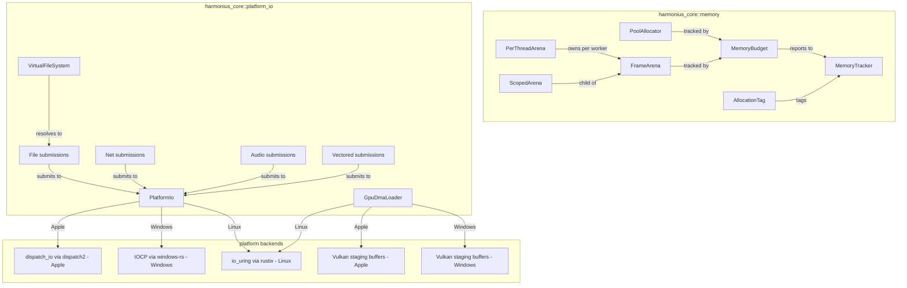
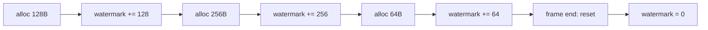
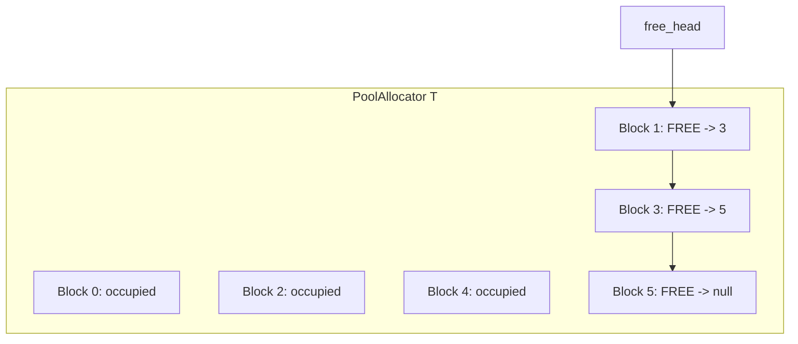
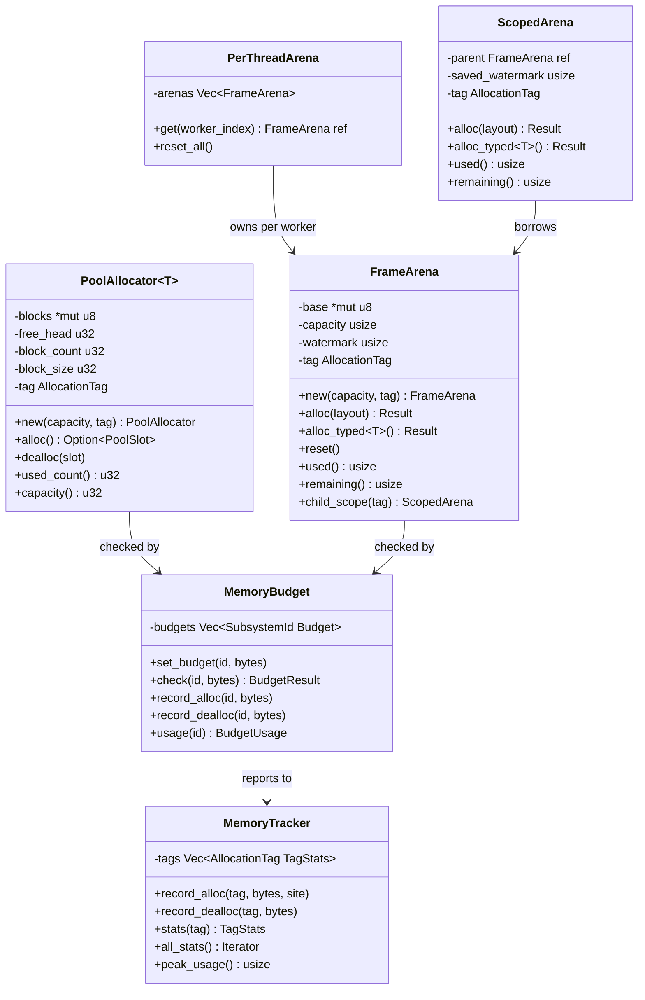
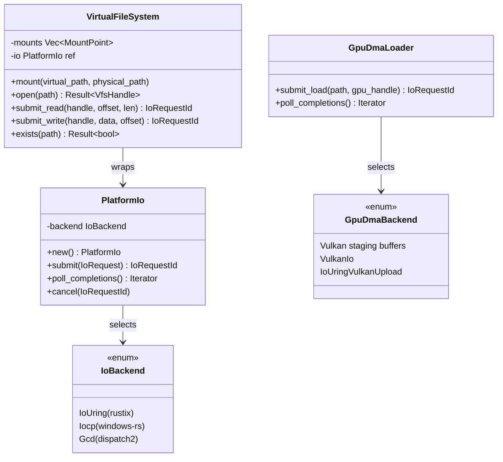
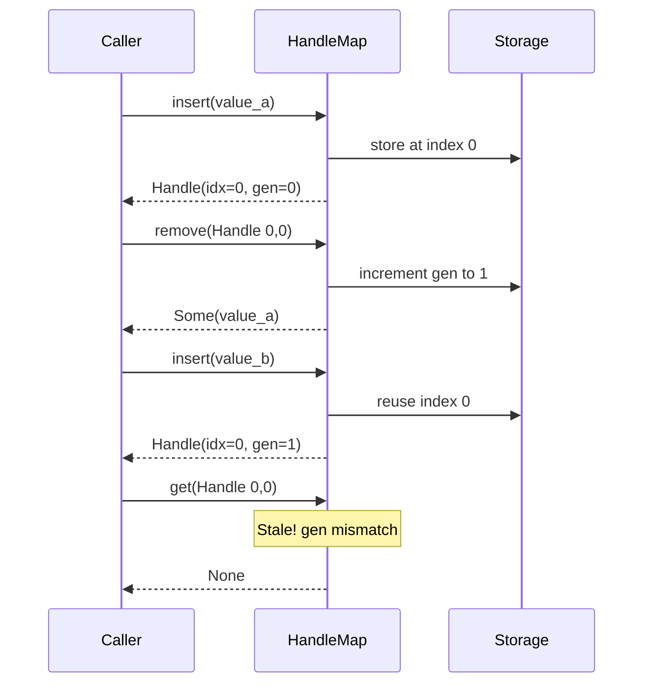
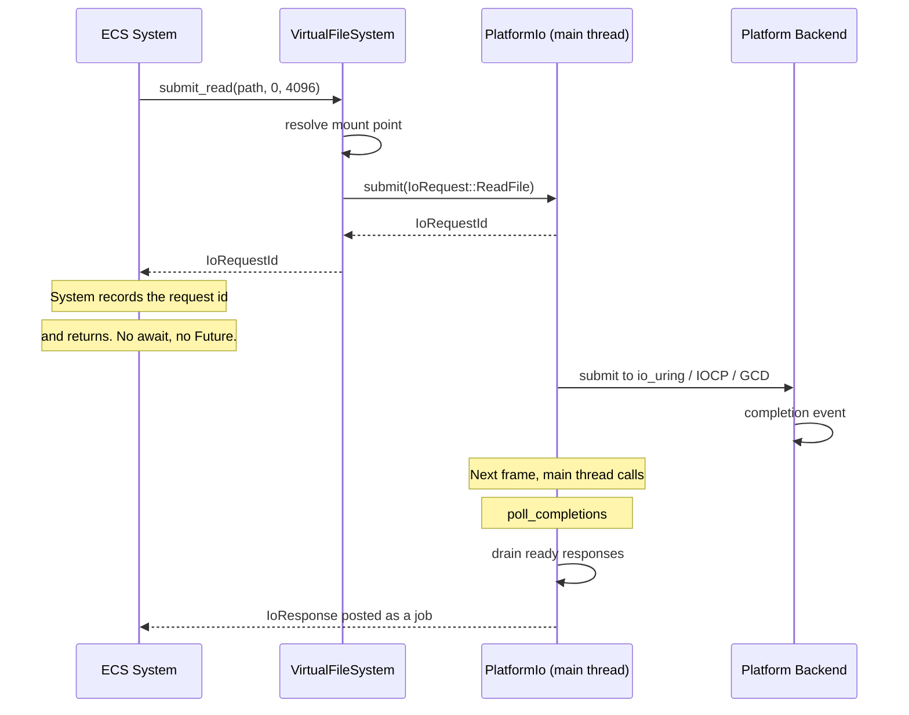

# Memory Management & Platform I/O Design

## Requirements Trace

> **Canonical sources:** Features, requirements, and user stories are defined in
> [features/core-runtime/](../../features/), [requirements/core-runtime/](../../requirements/), and
> [user-stories/core-runtime/](../../user-stories/). The table below traces design elements to those
> definitions.
>
> **Cross-references for shared concepts:**
>
> - `Handle<T>`, `HandleMap<T>`, `SlotMap<T>`, and the generational-index family are canonically
>   defined in [primitives.md](primitives.md). This document describes the memory subsystem's
>   **usage** of those primitives; it does not redefine them.
> - The I/O request/response protocol (`IoRequest`, `IoResponse`, `IoRequestId`,
>   `IoBuffer`, `VirtualFileSystem`, `poll_completions`) is canonically defined in [io.md](io.md).
>   This document is a **client** of that protocol.
> - The unified error hierarchy (`EngineError`, `IoError`, and `ToEngineError`) is defined in
>   [error.md](error.md). `IoError` variants listed below come from that canonical enum.
> - The **no-async** constraint applies to every I/O path in this document. All `async fn`,
>   `.await`, `Future<...>`, and `tokio::*` references have been removed; replacements follow the
>   synchronous request/handle pattern in [io.md](io.md).

### Memory Management (F-1.7 / R-1.7)

| Feature | Requirement       |
|---------|-------------------|
| F-1.7.1 | R-1.7.1, R-1.7.1a |
| F-1.7.2 | R-1.7.2           |
| F-1.7.3 | R-1.7.3           |
| F-1.7.4 | R-1.7.4           |
| F-1.7.5 | R-1.7.5, R-1.7.5a |
| F-1.7.6 | R-1.7.6           |
| F-1.7.7 | R-1.7.7           |
| F-1.7.8 | R-1.7.8           |
| F-1.7.9 | R-1.7.9           |

1. **F-1.7.1** — Per-frame arena allocator with bump pointer and zero-cost reset
2. **F-1.7.2** — Scoped arena with nested lifetimes, restores parent watermark on drop
3. **F-1.7.3** — Typed pool allocator with O(1) alloc/dealloc via intrusive free list
4. **F-1.7.4** — Generational index handles for safe resource references
5. **F-1.7.5** — Slot map (dense-sparse set) with generational handle lookup
6. **F-1.7.6** — Per-subsystem memory budgets with eviction/backpressure
7. **F-1.7.7** — Profiling hooks compiled out in release builds
8. **F-1.7.8** — Allocation tagging with subsystem propagation
9. **F-1.7.9** — Arbitrary precision numeric types

### Platform I/O (F-1.8 / R-1.8)

| Feature | Requirement       |
|---------|-------------------|
| F-1.8.1 | R-1.8.1           |
| F-1.8.2 | R-1.8.2, R-1.8.2a |
| F-1.8.3 | R-1.8.3           |
| F-1.8.4 | R-1.8.4           |
| F-1.8.5 | R-1.8.5           |
| F-1.8.6 | R-1.8.6           |
| F-1.8.7 | R-1.8.7           |
| F-1.8.8 | R-1.8.8, R-1.8.8a |
| F-1.8.9 | R-1.8.9           |

1. **F-1.8.1** — Platform-native I/O abstraction (sync request/handle, no async)
2. **F-1.8.2** — Completion-based proactor model, drained by the main thread
3. **F-1.8.3** — File I/O with explicit byte offsets (sync request submission)
4. **F-1.8.4** — Network socket I/O (TCP/UDP) via the same request pattern
5. **F-1.8.5** — Audio stream I/O with deadline hints
6. **F-1.8.6** — Scatter-gather and vectored I/O
7. **F-1.8.7** — I/O priority and deadline scheduling
8. **F-1.8.8** — Cooperative I/O cancellation via request IDs
9. **F-1.8.9** — I/O buffer management

## Overview

This document designs the memory management and platform I/O subsystems of the Harmonius engine.
Together they form the allocation and I/O foundation consumed by every other domain.

**Memory management** provides three allocator types (frame arena, scoped arena, typed pool), uses
the canonical generational handles and slot map from [primitives.md](primitives.md), enforces
per-subsystem memory budgets, and collects allocation profiling/tagging.

**Platform I/O** is provided by a `PlatformIo` facade (formerly `AsyncIo`; renamed because the
engine has no async runtime and the facade is purely synchronous from the user's perspective) that
owns the OS I/O reactor on the main thread. Each platform uses its native completion-based API:
io_uring via rustix (Linux), IOCP via windows-rs (Windows), GCD dispatch_io via dispatch2 (Apple).
The facade exposes the canonical request/response protocol defined in [io.md](io.md), plus
cooperative cancellation via `IoRequestId`, a virtual file system (VFS) for path resolution, typed
buffer pools, and GPU DMA asset loading via Vulkan staging buffers (Windows), Vulkan staging buffers
(Apple), and io_uring

- Vulkan upload (Linux). All I/O is non-blocking via platform APIs.
**No `async fn`, no `.await`, no `Future<_>`, no tokio, no blocking thread pool** — every operation
(DNS, file stat, directory listing) uses the platform's non-blocking API and is harvested from the
main-thread drain loop.

**Scope boundary:** ECS manages its own archetype-based dense storage internally. This design covers
non-ECS allocation only (per-frame scratch, GPU upload staging, I/O buffers, and typed asset pools).

### Interop Contracts Defined Here

| Contract | Consumed By |
|----------|-------------|
| Allocator types (`FrameArena`, `PoolAllocator`) | All domains |
| `PlatformIo` facade (consumes the io.md protocol) | Content Pipeline, Platform, Networking |
| `VirtualFileSystem` | Content Pipeline, Save System |
| `MemoryBudget` / `MemoryTracker` | All domains |

> **Not defined here:**
>
> - `Handle<T>`, `HandleMap<T>`, `SlotMap<T>`, `GenerationalIndex` — see
>   [primitives.md](primitives.md).
> - `IoRequest`, `IoResponse`, `IoRequestId`, `IoBuffer`, `IoBufferPool` — see [io.md](io.md).
> - `IoError` variants — see [error.md](error.md).

## Architecture

### Module Boundaries



Handle and slot map primitives are canonical in [primitives.md](primitives.md) and are not drawn in
the memory subgraph above.

### File Layout

```text
harmonius_core/
├── memory/
│   ├── arena.rs          # FrameArena, ScopedArena
│   ├── per_thread.rs     # PerThreadArena
│   ├── pool.rs           # PoolAllocator<T>
│   ├── budget.rs         # MemoryBudget, BudgetUsage
│   ├── tracker.rs        # MemoryTracker, TagStats
│   ├── tag.rs            # AllocationTag, SubsystemId
│   └── precision.rs      # BigInt, BigFloat
└── platform_io/
    ├── io.rs             # PlatformIo facade
    │                     # (io.md protocol client)
    ├── backend_uring.rs  # Linux: io_uring via rustix
    ├── backend_iocp.rs   # Windows: IOCP via
    │                     # windows-rs
    ├── backend_gcd.rs    # Apple: GCD dispatch_io
    │                     # via dispatch2
    ├── gpu_dma.rs        # Vulkan staging buffers, Vulkan staging buffers,
    │                     # io_uring + Vulkan upload
    ├── vfs.rs            # VirtualFileSystem,
    │                     # MountPoint, VfsHandle
    ├── file.rs           # File submission helpers
    ├── net.rs            # Net submission helpers
    ├── audio.rs          # Audio deadline submission
    └── vectored.rs       # Vectored scatter-gather
```

> Generational handles (`handle.rs`), slot maps (`slot_map.rs`), and the `IoError` enum live in
> [primitives.md](primitives.md) and [error.md](error.md) respectively. They are no longer emitted
> from this document's crate layout.

### Arena Allocator Bump Flow



### Pool Allocator Free List



### Memory Data Structures



> `Handle<T>`, `HandleMap<T>`, and `SlotMap<T>` are defined in [primitives.md](primitives.md) and
> are referenced by the memory subsystem but NOT drawn in this class diagram. The pools below all
> issue `Handle<T>` values via the canonical types.

### Platform I/O Data Structures



> `IoRequest`, `IoResponse`, `IoRequestId`, `IoBuffer`, and `IoBufferPool` are defined in
> [io.md](io.md); `PlatformIo` consumes the io.md protocol and is the platform-specific back end of
> it. `IoError` is defined in [error.md](error.md).

### Generational Handle Lifecycle



### Platform I/O Data Flow



## API Design

### Frame Arena Allocator

```rust
/// Per-worker-thread bump allocator backed by
/// platform-native virtual memory (VirtualAlloc /
/// mmap). Resets at zero cost at frame boundaries.
/// Each job system worker gets its own arena -- no
/// atomics on the hot path.
pub struct FrameArena {
    base: *mut u8,
    capacity: usize,
    watermark: usize,
    tag: AllocationTag,
    budget: &'static MemoryBudget,
}

/// Owns one `FrameArena` per job system worker
/// thread. Indexed by job system worker index.
/// Resets all arenas at frame start.
pub struct PerThreadArena {
    arenas: Vec<FrameArena>,
}

impl PerThreadArena {
    /// Create arenas for `worker_count` job system
    /// threads.
    pub fn new(
        worker_count: usize,
        config: ArenaConfig,
        budget: &'static MemoryBudget,
    ) -> Self;

    /// Get the arena for the current worker by index.
    pub fn get(
        &self,
        worker_index: usize,
    ) -> &FrameArena;

    /// Reset all per-thread arenas (frame boundary).
    pub fn reset_all(&mut self);
}

pub struct ArenaConfig {
    /// Initial capacity in bytes. Default: 8 MiB.
    pub initial_capacity: usize,
    /// Maximum capacity. Arena doubles up to this.
    pub max_capacity: usize,
    /// Subsystem tag for profiling.
    pub tag: AllocationTag,
}

impl FrameArena {
    /// Create a new arena backed by virtual memory.
    pub fn new(
        config: ArenaConfig,
        budget: &MemoryBudget,
    ) -> Result<Self, ArenaError>;

    /// Bump-allocate `layout.size()` bytes aligned to
    /// `layout.align()`. Returns pointer to allocated
    /// memory or an error if capacity is exceeded.
    pub fn alloc(
        &self,
        layout: Layout,
    ) -> Result<*mut u8, ArenaError>;

    /// Typed bump allocation.
    pub fn alloc_typed<T>(
        &self,
    ) -> Result<*mut T, ArenaError>;

    /// Zero-cost reset. Watermark returns to base.
    /// All prior allocations are invalidated.
    pub fn reset(&self);

    /// Bytes currently allocated.
    pub fn used(&self) -> usize;

    /// Bytes remaining before capacity.
    pub fn remaining(&self) -> usize;

    /// Create a child scope. The child allocates from
    /// the parent's remaining capacity. On drop, the
    /// parent watermark is restored.
    pub fn child_scope(
        &self,
        tag: AllocationTag,
    ) -> ScopedArena<'_>;
}

/// Scoped sub-arena. Restores parent watermark on
/// drop. Enables temporary allocations within a
/// system's execution without waiting for frame end.
pub struct ScopedArena<'parent> {
    parent: &'parent FrameArena,
    saved_watermark: usize,
    tag: AllocationTag,
}

impl<'parent> ScopedArena<'parent> {
    pub fn alloc(
        &self,
        layout: Layout,
    ) -> Result<*mut u8, ArenaError>;

    pub fn alloc_typed<T>(
        &self,
    ) -> Result<*mut T, ArenaError>;

    pub fn used(&self) -> usize;
    pub fn remaining(&self) -> usize;
}

impl Drop for ScopedArena<'_> {
    fn drop(&mut self) {
        // Restore parent watermark to saved_watermark
    }
}

pub enum ArenaError {
    /// Requested allocation exceeds remaining
    /// capacity.
    OutOfMemory {
        requested: usize,
        remaining: usize,
    },
    /// Budget exceeded for this subsystem.
    BudgetExceeded {
        subsystem: SubsystemId,
        budget: usize,
        current: usize,
    },
}
```

### Typed Pool Allocator

```rust
/// Fixed-size block pool. O(1) alloc and dealloc via
/// intrusive free list. Zero fragmentation. Per-thread
/// (no atomics). Backs non-ECS typed resource
/// containers. ECS manages its own archetype storage.
pub struct PoolAllocator<T> {
    blocks: *mut u8,
    free_head: u32,
    block_count: u32,
    block_size: u32,
    tag: AllocationTag,
    budget: &'static MemoryBudget,
    _marker: PhantomData<T>,
}

pub struct PoolConfig {
    /// Initial number of blocks.
    pub initial_count: u32,
    /// Maximum number of blocks. Grows by doubling
    /// via virtual memory commit-on-demand.
    pub max_count: u32,
    /// Subsystem tag.
    pub tag: AllocationTag,
}

impl<T> PoolAllocator<T> {
    pub fn new(
        config: PoolConfig,
        budget: &MemoryBudget,
    ) -> Self;

    /// Allocate a block. Returns None if pool
    /// exhausted and cannot grow.
    pub fn alloc(&self) -> Option<PoolSlot<T>>;

    /// Return a block to the free list.
    pub fn dealloc(&self, slot: PoolSlot<T>);

    pub fn used_count(&self) -> u32;
    pub fn capacity(&self) -> u32;
}

/// A slot in the pool. Provides typed access to the
/// allocated block.
pub struct PoolSlot<T> {
    ptr: *mut T,
    index: u32,
}

impl<T> PoolSlot<T> {
    pub fn as_ref(&self) -> &T;
    pub fn as_mut(&mut self) -> &mut T;
    pub fn index(&self) -> u32;
}
```

### Generational Handles and Slot Map

`Handle<T>`, `HandleMap<T>`, and `SlotMap<T>` are canonically defined in
[primitives.md](primitives.md). This document does not redeclare the types, their API, or their
error enum. The memory subsystem consumes those types unchanged: typed pools expose `Handle<T>`
values, and the asset cache uses `SlotMap<T>` for dense iteration. Handle-validation errors surface
as `IoError` / `EngineError` variants from [error.md](error.md) at subsystem boundaries.

### Memory Budgets and Tracking

```rust
/// Identifies an engine subsystem for budget tracking.
#[derive(
    Clone, Copy, Debug, PartialEq, Eq, Hash,
)]
pub struct SubsystemId(pub u16);

/// Tag attached to every allocation for profiling.
#[derive(Clone, Copy, Debug, PartialEq, Eq, Hash)]
pub struct AllocationTag {
    pub subsystem: SubsystemId,
    pub label: Option<&'static str>,
}

/// Per-subsystem memory budget enforcement.
pub struct MemoryBudget { /* ... */ }

pub struct BudgetUsage {
    pub current_bytes: usize,
    pub peak_bytes: usize,
    pub budget_bytes: usize,
}

pub enum BudgetResult {
    /// Allocation fits within budget.
    Ok,
    /// Budget exceeded. Trigger eviction.
    Exceeded {
        subsystem: SubsystemId,
        over_by: usize,
    },
}

impl MemoryBudget {
    pub fn new() -> Self;

    /// Set the budget for a subsystem in bytes.
    pub fn set_budget(
        &mut self,
        id: SubsystemId,
        bytes: usize,
    );

    /// Check if `bytes` can be allocated within
    /// the subsystem's budget.
    pub fn check(
        &self,
        id: SubsystemId,
        bytes: usize,
    ) -> BudgetResult;

    /// Record an allocation against the budget.
    pub fn record_alloc(
        &self,
        id: SubsystemId,
        bytes: usize,
    );

    /// Record a deallocation.
    pub fn record_dealloc(
        &self,
        id: SubsystemId,
        bytes: usize,
    );

    /// Query current usage for a subsystem.
    pub fn usage(
        &self,
        id: SubsystemId,
    ) -> BudgetUsage;
}

/// Profiling hooks. Compiled out in release builds
/// via `cfg(debug_assertions)`.
pub struct MemoryTracker { /* ... */ }

pub struct TagStats {
    pub tag: AllocationTag,
    pub alloc_count: u64,
    pub dealloc_count: u64,
    pub current_bytes: usize,
    pub peak_bytes: usize,
}

impl MemoryTracker {
    pub fn new() -> Self;

    #[cfg(debug_assertions)]
    pub fn record_alloc(
        &self,
        tag: AllocationTag,
        bytes: usize,
        call_site: &'static str,
    );

    #[cfg(debug_assertions)]
    pub fn record_dealloc(
        &self,
        tag: AllocationTag,
        bytes: usize,
    );

    pub fn stats(
        &self,
        tag: AllocationTag,
    ) -> Option<&TagStats>;

    pub fn all_stats(
        &self,
    ) -> impl Iterator<Item = &TagStats>;

    pub fn peak_usage(&self) -> usize;
}
```

### PlatformIo Facade (formerly AsyncIo)

> **Rename:** The `AsyncIo` type is renamed to `PlatformIo`. "Async" was misleading — the engine has
> no async runtime. The facade is the platform-specific back end of the request/handle protocol
> defined in [io.md](io.md). All APIs below are synchronous submissions that return an
> `IoRequestId`; completions are drained from the main thread via `poll_completions`.

`PlatformIo` owns the OS I/O reactor on the main thread. On every game-loop iteration the main
thread calls `poll_completions` to drain ready I/O results from the platform backend and post them
as jobs to the compute worker pool via crossbeam-channel. Each platform uses its native
completion-based API directly. No blocking thread pool, no `async fn`, no `Future<_>`.

```rust
// `IoError` is defined canonically in error.md.
// This document uses the variants listed there
// (NotFound, PermissionDenied, Cancelled,
//  DeviceFull, BudgetExceeded, Unsupported,
//  PlatformSpecific, ...).
use crate::error::IoError;

// `IoRequest`, `IoResponse`, `IoRequestId`, and
// `IoBuffer` are defined canonically in io.md.
use crate::io::{
    IoRequest, IoResponse, IoRequestId, IoBuffer,
};

/// Platform I/O backend selected at compile time.
pub enum IoBackend {
    /// Linux: io_uring via rustix.
    IoUring,
    /// Windows: IOCP via windows-rs.
    Iocp,
    /// Apple: GCD dispatch_io via dispatch2.
    Gcd,
}

/// The engine's platform-native I/O facade. Owns
/// the OS I/O reactor on the main thread. All I/O
/// operations route through the io.md request /
/// response protocol; this type is that protocol's
/// back end.
pub struct PlatformIo {
    backend: IoBackend,
    completions: crossbeam_channel::Sender<IoResponse>,
}

impl PlatformIo {
    /// Initialize the platform I/O backend.
    pub fn new() -> Result<Self, IoError>;

    /// Submit a request and return a tag that the
    /// caller can correlate with the completion.
    /// Synchronous in the user's perspective: the
    /// call queues the work and returns immediately.
    pub fn submit(
        &self,
        request: IoRequest,
    ) -> IoRequestId;

    /// Drain ready completions from the platform
    /// backend and forward them to the compute
    /// worker pool. Called once per frame on the
    /// main thread. No allocations on the hot path.
    pub fn poll_completions(&self);

    /// Cancel an in-flight operation by request id.
    /// The completion still fires (with
    /// `IoError::Cancelled`) so the caller can
    /// release any per-request resources in one
    /// place.
    pub fn cancel(&self, id: IoRequestId);
}
```

### GPU DMA Asset Loading

GPU assets bypass CPU memory on Windows and Apple via Vulkan staging buffers and Vulkan staging
buffers respectively. On Linux, io_uring reads to a CPU staging buffer, then Vulkan uploads to GPU
memory.

```rust
/// GPU DMA backend selected at compile time.
pub enum GpuDmaBackend {
    /// Windows: Vulkan staging buffers (disk-to-GPU DMA with
    /// GPU-side decompression).
    Vulkan staging buffers,
    /// Apple: Vulkan staging buffers (disk-to-GPU DMA).
    VulkanIo,
    /// Linux: io_uring to CPU staging buffer, then
    /// Vulkan buffer upload.
    IoUringVulkanUpload,
}

/// Loads assets directly to GPU memory, bypassing
/// CPU processing where the platform supports it.
pub struct GpuDmaLoader {
    backend: GpuDmaBackend,
}

impl GpuDmaLoader {
    pub fn new() -> Result<Self, IoError>;

    /// Submit a GPU DMA load. On Windows/Apple, data
    /// goes directly from disk to GPU memory. On
    /// Linux, data is read to a CPU staging buffer
    /// and then uploaded via Vulkan. Returns an
    /// `IoRequestId` that the caller drains via
    /// `PlatformIo::poll_completions`.
    pub fn submit_load(
        &self,
        path: &str,
        gpu_handle: GpuResourceHandle,
    ) -> IoRequestId;
}
```

### Cancellation

Cancellation is expressed by the `CancelRequest` variant of `IoRequest` (see [io.md](io.md)),
identified by an `IoRequestId`. No separate token type is needed: callers pass the previously
returned `IoRequestId` to `PlatformIo::cancel`, the platform backend tears down its in-flight
resources, and the response channel yields an `IoResponse::Cancelled { request_id }` so ownership of
any attached `IoBuffer` is returned to the pool in one place.

### Virtual File System

```rust
/// Resolve virtual paths to physical file handles.
/// Enables content pipeline to mount asset directories,
/// archive files, and mod overlay paths.
pub struct VirtualFileSystem<'a> {
    mounts: Vec<MountPoint>,
    io: &'a PlatformIo,
}

pub struct MountPoint {
    pub virtual_path: String,
    pub physical_path: String,
    pub priority: u32,
}

/// Opaque file handle returned by VFS.
pub struct VfsHandle {
    raw: RawHandle,
    mount_index: u32,
}

pub struct FileMetadata {
    pub size: u64,
    pub modified: u64,
    /// BLAKE3 content hash.
    pub content_hash: [u8; 32],
}

impl<'a> VirtualFileSystem<'a> {
    pub fn new(io: &'a PlatformIo) -> Self;

    /// Mount a physical path at a virtual location.
    /// Higher priority mounts override lower ones.
    pub fn mount(
        &mut self,
        virtual_path: &str,
        physical_path: &str,
        priority: u32,
    );

    /// Open a file by virtual path.
    pub fn open(
        &self,
        path: &str,
    ) -> Result<VfsHandle, IoError>;

    /// Submit read to platform I/O layer; returns
    /// request ID. Completion arrives via
    /// crossbeam-channel as a job.
    pub fn read(
        &self,
        handle: &VfsHandle,
        offset: u64,
        len: u32,
    ) -> IoRequestId;

    /// Submit write to platform I/O layer; returns
    /// request ID.
    pub fn write(
        &self,
        handle: &VfsHandle,
        data: Vec<u8>,
        offset: u64,
    ) -> IoRequestId;

    /// Check if a virtual path exists.
    pub fn exists(
        &self,
        path: &str,
    ) -> Result<bool, IoError>;

    /// Submit metadata query; returns request ID.
    pub fn metadata(
        &self,
        path: &str,
    ) -> IoRequestId;
}
```

### Arbitrary Precision Types

**Note:** Arbitrary-precision numerics (`BigInt`, `BigFloat`) address R-1.7.9 but are not related to
memory management or I/O. These will be relocated to a dedicated math/core-types design in a future
revision.

```rust
/// Arbitrary precision integer. Supports 128-bit,
/// 256-bit, and unlimited precision.
pub struct BigInt {
    limbs: Vec<u64>,
}

impl BigInt {
    pub fn from_i128(val: i128) -> Self;
    pub fn to_f64(&self) -> f64;
    pub fn to_f32(&self) -> f32;
}

/// Arbitrary precision float with configurable
/// precision and deterministic cross-platform
/// arithmetic.
pub struct BigFloat {
    significand: BigInt,
    exponent: i32,
    precision_bits: u32,
}

impl BigFloat {
    pub fn new(
        significand: BigInt,
        exponent: i32,
        precision: u32,
    ) -> Self;
    pub fn to_f64(&self) -> f64;
    pub fn to_f32(&self) -> f32;
    /// Format with unit suffix (e.g., "2.4M ly").
    pub fn format_with_units(
        &self,
        unit: &str,
    ) -> String;
}
```

## Data Flow

### Frame Lifecycle with Memory and I/O

The main thread owns both the `PerThreadArena` and `PlatformIo`. The main thread polls the platform
I/O reactor and posts completions as jobs to the compute worker pool. Each frame proceeds as:

```rust
loop {
    // 1. Reset all per-thread arenas (zero cost)
    per_thread_arena.reset_all();

    // 2. Main thread drains I/O completions and
    //    posts them as jobs to the worker pool.
    platform_io.poll_completions();

    // 3. Build and run ECS systems on job system
    let system_graph = schedule.build(&world)?;
    let frame = game_loop::compile(
        &system_graph, &world, &job_system,
    )?;
    frame.execute(&mut world, &job_system);
    // Systems allocate transient data from their
    // worker's PerThreadArena. I/O requests are
    // submitted to platform_io via IoRequest;
    // completions arrive as jobs in a later frame.

    // 4. Render submission
    renderer.submit_commands();

    // 5. GPU present
    renderer.present();
}
```

### Scoped Arena Usage

```rust
// Inside a job system worker (worker_index known)
let arena = per_thread_arena.get(worker_index);
let query_results = arena.child_scope(
    AllocationTag {
        subsystem: PHYSICS_ID,
        label: Some("broadphase"),
    },
);
// Allocate broadphase results in child scope
let pairs = query_results.alloc_typed::<
    ContactPair
>();
// ... use pairs ...

// Child scope drops here -> watermark restored.
// Peak memory is reduced vs. waiting for
// frame end.
```

### VFS Resolution Order

When multiple mounts overlap, the VFS resolves paths by mount priority (highest wins):

1. Check mounts in descending priority order
2. For each mount, test if `physical_path + relative` exists
3. First match wins; open the physical file
4. If no mount matches, return `IoError::NotFound`

### I/O Cancellation Flow

1. Caller submits a request via `PlatformIo::submit(IoRequest::...)` and records the returned
   `IoRequestId`.
2. To cancel, the caller submits `IoRequest::CancelRequest { id }` or calls
   `PlatformIo::cancel(id)`.
3. The platform backend removes the in-flight entry from its queue.
4. The response channel always yields exactly one `IoResponse` per submitted id: either the original
   result (if it completed before cancellation) or `IoResponse::Cancelled { id }`.
5. On the `Cancelled` response, the caller releases any attached `IoBuffer` back to its pool.

## Platform Considerations

### Memory Backing

| Platform | Virtual Memory API             |
|----------|--------------------------------|
| Windows  | `VirtualAlloc` / `VirtualFree` |
| macOS    | `mmap` / `munmap`              |
| Linux    | `mmap` / `munmap`              |

1. **Windows** — `MEM_RESERVE` + `MEM_COMMIT` for commit-on-demand pool growth
2. **macOS** — `MAP_ANON` for arena backing
3. **Linux** — `MAP_ANON

### I/O Backend

`PlatformIo` uses platform-native completion-based I/O APIs directly. The main thread owns the I/O
reactor and drains completions each frame via `poll_completions`. No blocking thread pool exists,
and no async runtime is present in any configuration.

| Platform | I/O API | GPU DMA |
|----------|---------|---------|
| Linux | io_uring via rustix | io_uring + Vulkan upload |
| Windows | IOCP via windows-rs | Vulkan staging buffers |
| Apple | GCD dispatch_io via dispatch2 | Vulkan staging buffers |

All operations (DNS, file stat, file open, directory listing) use non-blocking platform APIs. I/O
completions are posted as jobs to the compute worker pool via crossbeam-channel.

### Memory Budget Defaults

| Tier | ECS | Asset Cache | GPU Upload | Scratch | Total |
|------|-----|-------------|------------|---------|-------|
| Mobile (2-6 GB) | 128 MB | 256 MB | 64 MB | 32 MB | 480 MB |
| Switch (4 GB) | 256 MB | 512 MB | 128 MB | 64 MB | 960 MB |
| Desktop (16+ GB) | 1 GB | 4 GB | 512 MB | 256 MB | 5.75 GB |
| High-end (64 GB) | 4 GB | 16 GB | 2 GB | 1 GB | 23 GB |

### In-Flight I/O Limits

| Tier | Max In-Flight |
|------|--------------|
| Mobile | 32 |
| Switch | 64 |
| Desktop | 256 |
| High-end PC | 1024 |

### Proposed Dependencies

| Crate | Purpose | Justification |
|-------|---------|---------------|
| `blake3` | BLAKE3 hashing | Fast, SIMD, pure Rust |
| `crossbeam-channel` | I/O completion posting | MPMC channel for jobs |
| `crossbeam-deque` | Job system work-stealing | Lock-free deques |
| `crossbeam-utils` | CachePadded, Backoff | Low-level concurrency |
| `dispatch2` | GCD dispatch_io | Apple I/O backend |
| `objc2` | Apple framework FFI | Safe Objective-C interop |
| `rustix` | io_uring (Linux) | Safe syscall wrappers |
| `windows-rs` | IOCP + VirtualAlloc | Zero-cost FFI to Win32 |

## Safety Invariants

### FrameArena Lifetime (Critical)

`FrameArena::alloc` returns `*mut T` with no lifetime bound. After `reset()`, all prior allocations
are invalid. Implementation must return `ArenaRef<'a, T>` borrowing from the arena, tying the
reference lifetime to the arena scope. `reset()` requires `&mut self` to prevent aliased access
during reset.

### FrameArena Thread Safety (Critical)

Each `FrameArena` is owned by a single job system worker thread. The watermark is a plain `usize`
with no atomic operations. Cross-thread reads are safe because the job system graph enforces system
ordering -- if system B depends on system A, A's arena data is visible to B without synchronization.
The `PerThreadArena` must only be reset from the main thread when no workers are running.

### PoolAllocator Thread Safety (Critical)

Each `PoolAllocator` is per-thread with a plain `u32` free head. No ABA problem exists because there
is no concurrent access. The job system graph enforces ordering for cross-thread reads.

### PoolSlot Lifetime (Critical)

`PoolSlot<T>::as_ref()` produces `&T` from a raw pointer with no lifetime bound. After `dealloc`,
the slot is freed. Implementation must tie `PoolSlot<T>` to the allocator's lifetime, or use
generational indices (like `Handle<T>`) with runtime validation.

### PlatformIo Platform Backend Ownership (Critical)

`PlatformIo` owns the platform I/O backend (io_uring ring, IOCP handle, or GCD dispatch queue). The
backend must not be dropped while submitted operations are still in flight. `PlatformIo::drop` must
drain all pending completions or cancel them before releasing platform resources.

### ScopedArena Child Lifetimes (High)

When `ScopedArena` drops, it restores the parent watermark. Allocations from child scopes become
dangling. `alloc` must return references bounded by the scope's `'parent` lifetime.

## Test Plan

### Unit Tests — Memory

| Test                               | Req      |
|------------------------------------|----------|
| `test_arena_100k_allocs_under_1ms` | R-1.7.1  |
| `test_arena_reset_zero_cost`       | R-1.7.1  |
| `test_arena_overflow_error`        | R-1.7.1a |
| `test_arena_grow_by_doubling`      | R-1.7.1a |
| `test_scoped_arena_restore`        | R-1.7.2  |
| `test_scoped_arena_nested_10`      | R-1.7.2  |
| `test_pool_o1_alloc_dealloc`       | R-1.7.3  |
| `test_pool_zero_fragmentation`     | R-1.7.3  |
| `test_handle_generation_mismatch`  | R-1.7.4  |
| `test_handle_validate_1m`          | R-1.7.4  |
| `test_slotmap_dense_iteration`     | R-1.7.5  |
| `test_slotmap_4m_entries`          | R-1.7.5a |
| `test_slotmap_stale_error`         | R-1.7.5a |
| `test_budget_eviction`             | R-1.7.6  |
| `test_profiling_hooks_dev`         | R-1.7.7  |
| `test_profiling_compiled_out`      | R-1.7.7  |
| `test_tag_propagation`             | R-1.7.8  |
| `test_bigint_determinism`          | R-1.7.9  |
| `test_bigfloat_to_f32_f64`         | R-1.7.9  |

1. **`test_arena_100k_allocs_under_1ms`** — 100,000 varying-size bump allocations in one frame.
   Verify total time < 1 ms. Verify watermark = sum of sizes + padding.
2. **`test_arena_reset_zero_cost`** — Allocate 8 MB, reset, verify watermark = 0 in < 1 us.
3. **`test_arena_overflow_error`** — Fill to 99% capacity. Attempt oversize alloc. Verify
   `ArenaError::OutOfMemory` with correct sizes.
4. **`test_arena_grow_by_doubling`** — Exhaust initial 8 MiB arena. Verify it doubles to 16 MiB.
   Verify growth stops at configured max.
5. **`test_scoped_arena_restore`** — Parent 1 MB. Child allocates 512 KB. Drop child. Verify parent
   remaining = 1 MB.
6. **`test_scoped_arena_nested_10`** — 10 nested scopes. Verify correct watermark at each level on
   drop.
7. **`test_pool_o1_alloc_dealloc`** — 10,000 random alloc/dealloc. Benchmark confirms constant time
   regardless of occupancy.
8. **`test_pool_zero_fragmentation`** — After random ops, verify total memory = block_count *
   block_size.
9. **`test_handle_generation_mismatch`** — Alloc handle, remove, alloc new at same index. Old handle
   returns `GenerationMismatch`.
10. **`test_handle_validate_1m`** — Validate 1 million handles. Verify O(1) per validation.
11. **`test_slotmap_dense_iteration`** — Insert 10,000, remove 5,000 random. Verify dense iteration
    visits exactly 5,000.
12. **`test_slotmap_4m_entries`** — Insert 4 million entries. Verify all lookups succeed.
13. **`test_slotmap_stale_error`** — Stale handle returns `GenerationMismatch` with expected/actual
    gen.
14. **`test_budget_eviction`** — Set 100 MB budget. Allocate to limit. Next alloc returns
    `BudgetExceeded`.
15. **`test_profiling_hooks_dev`** — Dev build: 1,000 allocations across 3 allocators. Verify
    correct counts, byte totals, peak.
16. **`test_profiling_compiled_out`** — Release build: verify no profiling symbol exists (binary
    inspection).
17. **`test_tag_propagation`** — Parent arena tagged "physics". Child scope inherits tag. Verify
    per-tag stats sum correctly.
18. **`test_bigint_determinism`** — Compute distance at 10M light-years. Verify bit-identical on all
    platforms.
19. **`test_bigfloat_to_f32_f64`** — Round-trip conversion. Verify deterministic across
    architectures.

### Unit Tests — Async I/O

| Test                              | Req      |
|-----------------------------------|----------|
| `test_async_read_data_integrity`  | R-1.8.3  |
| `test_no_std_fs_calls`            | R-1.8.3  |
| `test_completion_typed_result`    | R-1.8.2  |
| `test_completion_latency_p99`     | R-1.8.2a |
| `test_vectored_write_integrity`   | R-1.8.6  |
| `test_vectored_syscall_reduction` | R-1.8.6  |
| `test_cancel_fires_completion`    | R-1.8.8  |
| `test_cancel_child_token`         | R-1.8.8  |
| `test_cancel_1000_no_leaks`       | R-1.8.8a |
| `test_platform_backend_init`      | R-1.8.1  |
| `test_gpu_dma_load`               | R-1.8.1  |

1. **`test_async_read_data_integrity`** — Submit 4 MB read at explicit offsets. Poll completions.
   Verify data integrity.
2. **`test_no_std_fs_calls`** — Static analysis: verify no `std::fs` or `std::io::Read/Write` in
   codebase.
3. **`test_completion_typed_result`** — Submit 1 MB write. Verify completion carries correct byte
   count and context.
4. **`test_completion_latency_p99`** — 10,000 concurrent 4 KB reads. Verify p99 delivery latency <
   100 us.
5. **`test_vectored_write_integrity`** — Write 3 non-contiguous buffers via single vectored write.
   Read back, verify concatenation.
6. **`test_vectored_syscall_reduction`** — Benchmark vectored vs. individual writes. Verify >= 30%
   syscall reduction.
7. **`test_cancel_fires_completion`** — Submit 100 MB read, cancel within 1 ms. Verify
   `IoError::Cancelled` fires.
8. **`test_cancel_child_token`** — Create parent and child tokens. Cancel parent. Verify child is
   also cancelled.
9. **`test_cancel_1000_no_leaks`** — Submit 1,000 ops, cancel all. Verify all complete within 10 ms.
   Verify no handle leaks.
10. **`test_platform_backend_init`** — Initialize platform I/O backend (io_uring / IOCP / GCD).
    Verify it initializes and shuts down cleanly.
11. **`test_gpu_dma_load`** — Submit a GPU DMA load via `GpuDmaLoader`. Verify completion on each
    platform (Vulkan staging buffers / Vulkan staging buffers / io_uring + Vulkan).

### Integration Tests

| Test                            | Req     |
|---------------------------------|---------|
| `test_backend_per_platform`     | R-1.8.1 |
| `test_tcp_connect_accept_1mb`   | R-1.8.4 |
| `test_udp_1000_datagrams`       | R-1.8.4 |
| `test_concurrent_tcp_500`       | R-1.8.4 |
| `test_audio_latency_under_10ms` | R-1.8.5 |
| `test_vfs_mount_resolution`     | -       |
| `test_vfs_blake3_hash`          | -       |
| `test_budget_24h_server`        | R-1.7.6 |

1. **`test_backend_per_platform`** — Same test suite passes on Windows (IOCP), macOS (GCD), Linux
   (io_uring) via CI.
2. **`test_tcp_connect_accept_1mb`** — Async connect/accept, send 1 MB, verify receipt.
3. **`test_udp_1000_datagrams`** — Send 1,000 datagrams. Verify delivery count.
4. **`test_concurrent_tcp_500`** — 500 concurrent TCP connections. No handle leaks.
5. **`test_audio_latency_under_10ms`** — Audio writes + 100 MB background reads. p99 audio latency <
   10 ms. Zero underruns over 60 s.
6. **`test_vfs_mount_resolution`** — Mount 3 overlapping paths. Verify highest priority wins.
7. **`test_vfs_blake3_hash`** — Write known data, query metadata, verify BLAKE3 hash matches.
8. **`test_budget_24h_server`** — 24-hour sustained server load. No OOM. Budget never exceeded.

### Benchmarks

| Benchmark | Target | Source |
|-----------|--------|--------|
| Arena alloc throughput | > 100M allocs/sec | US-1.7.2 |
| Arena reset | < 1 us | US-1.7.1 |
| Pool alloc/dealloc | O(1), < 50 ns | US-1.7.5 |
| Handle validation | O(1), < 10 ns | US-1.7.7 |
| SlotMap dense iter 10k | < 50 us | US-1.7.8 |
| Platform I/O throughput | >= 80% raw disk | US-1.8.19 |
| Vectored vs. individual | >= 30% fewer syscalls | US-1.8.14 |

## Design Q & A

**Q1. What is the biggest constraint limiting this design?** What would happen if we lifted that
constraint? What is the best possible solution imaginable without those constraints? What is the
impact of removing them?

Maintaining three platform I/O backends (io_uring, IOCP, GCD) is the biggest constraint. Each
platform has different completion semantics, buffer ownership rules, and error models. Lifting this
would mean a single unified API, but we gain direct control over poll timing, buffer registration,
and GPU DMA paths that no third-party runtime provides. The trade-off is more platform code in
exchange for zero extra threads and optimal I/O performance.

**Q2. How can this design be improved?** Where is it weak? What potential issues will arise? What
trade-offs are we making?

The per-platform backend approach requires maintaining and testing three I/O implementations. Memory
budgets (F-1.7.6) with eviction policies add runtime overhead to every allocation path. Resource
residency decisions (load/evict/LOD swap) belong in the asset pipeline, which consults
`MemoryBudget` for pressure info. The main thread polls I/O, which limits I/O completion throughput
to one poll per frame. Adding integration tests across all target platforms and clearer lifetime
annotations in the API would mitigate these weaknesses.

**Q3. Is there a better approach?** If we are not taking it, why not?

A third-party async runtime (Tokio, compio) (both rejected) would reduce platform code but adds
threads, removes control over poll timing, and prevents GPU DMA integration (Vulkan staging buffers
I/O). We chose platform-native APIs because they give direct control over buffer registration,
completion ordering, and disk-to-GPU DMA paths with zero extra threads.

**Q4. Does this design solve all customer problems?** Are there missing features, requirements, or
user stories? What are they? How would adding them improve the engine? What kinds of games does it
enable?

The design covers file, network, and audio I/O but lacks explicit memory-mapped I/O management
beyond zero-copy deserialization (F-1.4.2). User story US-1.8.7 references asset loading but there
is no streaming virtual memory feature for texture and mesh data that exceeds physical RAM. For
open-world games with hundreds of GB of terrain data, a virtual memory streaming layer integrated
with the `PlatformIo` facade would enable seamless world traversal. The arbitrary precision numerics
(F-1.7.9) also lack user stories for integration with the spatial index (F-1.9) for cosmic-scale
worlds. Adding virtual memory streaming and large-world coordinate integration would expand support
for space games and planetary-scale simulations.

**Q5. Is this design cohesive with the overall engine?** Does it fit? Does it differ from other
modules, and why? How could we make it more cohesive? How can we improve it to meet engine goals?

Memory management and platform I/O are foundational layers that all other modules depend on, giving
them strong structural cohesion. The generational handle design (F-1.7.4) is shared across ECS
entities (F-1.1.11) and spatial index (F-1.9.1), unified via [primitives.md](primitives.md). ECS
manages its own archetype-based storage separately, keeping this design focused on non-ECS
allocation. Per-thread arenas indexed by job system worker avoid atomics on the hot path. I/O buffer
ownership is explicit -- the platform backend owns buffers until completion, then transfers
ownership to the completion handler posted as a job.

## Open Questions

1. **Arena page decommit strategy** — On arena reset, should we `madvise(MADV_DONTNEED)` /
   `VirtualFree` pages beyond a high-water mark to reduce RSS? This trades reset latency for memory
   pressure relief on constrained platforms.

2. **Pool growth vs. fixed capacity** — Should pool allocators grow (commit more pages) on
   exhaustion, or return `None` and let the caller evict? Growth is simpler but risks unbounded
   memory usage.

3. **SlotMap max capacity** — R-1.7.5a requires 4M entries. Should we support 2^24 (16M) or 2^32
   (4B)? Larger capacity increases sparse table memory overhead.

4. **Handle bit packing** — Current design uses two `u32` fields (index + generation) for 8 bytes
   total. An alternative packs both into a single `u64` (e.g., 24-bit index + 8-bit generation).
   Smaller handles improve cache density but limit max entries and generation rollover.

5. **VFS archive support** — Should the VFS support reading from archive files (e.g., zip, custom
   pak) in addition to directory mounts? This is needed for shipping but may be deferred.

6. **BLAKE3 streaming hash** — Should `FileMetadata` compute BLAKE3 on `open()` (blocking, expensive
   for large files) or lazily on first `metadata()` call? Lazy is better for hot paths but
   complicates the API.

7. **Audio I/O integration depth** — The current design routes audio I/O through `PlatformIo` backed
   by platform-native APIs. Should audio have a completely separate I/O path (dedicated thread with
   deadline scheduling) to guarantee sub-10 ms latency even under I/O saturation?

## Review feedback

### Architecture changes

#### Replace Tokio with compio

All I/O references must change from Tokio to compio. Update `AsyncIo` internals, `CancelToken`,
architecture diagrams, data flow diagrams, dependency table, Design Q&A, and all test cases. compio
runs on the main thread.

| Tokio reference | compio replacement |
|----------------|-------------------|
| `tokio::runtime::Runtime` | compio proactor |
| `tokio_util::CancellationToken` | Custom `CancelToken` |
| `tokio::task::JoinHandle` | `compio::runtime::spawn` handle |
| `tokio::select!` | compio equivalent |
| `tokio::fs` | `compio-fs` |
| `tokio::net` | `compio-net` |

Build a custom `CancelToken` using `AtomicBool` + waker list with parent-child hierarchy, since
compio lacks one.

#### Move `AsyncIo` to main thread

The game loop must not own or poll I/O. The main thread owns the compio runtime. Game loop sends I/O
requests via channel, receives completions via channel.

Remove `poll()` and `block_on()` calls from the frame loop pseudocode. The game loop drains a
completion channel at frame start.

#### Per-thread allocators (no atomics on hot path)

Each Rayon worker gets its own `FrameArena` — plain bump pointer with no synchronization:

| Allocator | Sync | Use case |
|-----------|------|----------|
| `PerThreadArena` | None | Per-frame scratch in systems |
| `PoolAllocator` | None (per-thread) | Typed non-ECS pools |
| `MemoryBudget` | Atomic | Global budget tracking |

`FrameArena` uses plain `usize` watermark, not `AtomicUsize`. Cross-thread reads are safe because
the `GameLoopGraph` enforces system ordering — if B depends on A, A's arena data is visible to B
without sync.

Frame lifecycle:

1. `reset_all()` per-thread arenas at frame start
2. Systems allocate from their thread's arena
3. Graph ordering ensures safe cross-thread reads
4. Arenas valid until next `reset_all()`

#### ECS data is out of scope

This design covers non-ECS allocation only. ECS manages its own archetype-based dense storage
internally.

| Data | Managed by |
|------|-----------|
| Components | ECS archetype storage |
| Entity metadata | ECS slot map |
| Per-frame scratch | `PerThreadArena` |
| GPU upload staging | Render thread ring buffers |
| I/O buffers | compio (main thread) |
| Asset CPU data | `PoolAllocator` per type |

#### Avoid allocation on the game loop hot path

Systems must not call `malloc` during gameplay:

- Use `PerThreadArena` for all temporary data
- Pre-size all collections at startup
- Use slot maps with fixed capacity for handles
- Pre-allocate channel buffers and ring buffers
- Avoid `String`/`Vec` growth in systems

#### Resource residency tracking

`MemoryBudget` provides raw byte tracking. Residency decisions (load/evict/LOD swap) belong in the
asset pipeline design, which consults `MemoryBudget` for pressure information.

### Other accepted recommendations

- Remove raw pointers (`*const AsyncIo`, `*const MemoryBudget`) — use references with lifetimes
- Add explicit `close()` to `VfsHandle`
- Exploit compio's native io_uring buffer registration for R-1.8.9
- Relocate `BigInt`/`BigFloat` to algorithms or math
- Document `MemoryBudget` interior mutability — atomics justified for cross-thread budget reporting
- Add missing test cases: VFS mount priority, idle poll, graceful shutdown

### Open items

1. Custom `CancelToken` design — parent-child hierarchy without tokio_util
2. Audio I/O path — separate deadline-scheduled thread or routed through compio with priority
3. VFS archive support (zip/pak) — needed for shipping
4. BLAKE3 streaming hash — lazy vs eager computation

### RF-NEW: compio removed — platform-native I/O replaces it [APPLIED]

All references to compio in this design must be updated. compio created 1 thread per core, which
doubled the thread count when combined with the compute job system. Replace with direct platform
APIs:

- Linux: io_uring via rustix (zero userspace threads for I/O)
- Windows: IOCP via windows-rs + Vulkan staging buffers for GPU assets
- Apple: GCD dispatch_io via dispatch2 + Vulkan staging buffers for GPU assets

The main thread owns the OS event loop AND polls I/O completions. I/O completions are posted as jobs
to the compute worker pool via crossbeam-channel.

The AsyncIo section of this design should be restructured around platform-native I/O backends rather
than a single runtime abstraction.

### RF-NEW: No blocking thread pool [APPLIED]

Remove any references to blocking I/O pools. Every blocking operation (DNS, file stat, file open,
directory listing) has a non-blocking platform alternative through io_uring, IOCP, or GCD.

### RF-NEW: GPU DMA asset loading [APPLIED]

Add Vulkan staging buffers (Windows) and Vulkan staging buffers (Apple) as primary GPU asset loading
paths. These bypass CPU memory entirely — disk-to-GPU DMA with GPU-side decompression. Linux uses
io_uring to CPU staging buffer, then Vulkan upload.

This affects the asset loading state machine: GPU assets skip the CPU processing stage entirely on
Windows/Apple.
