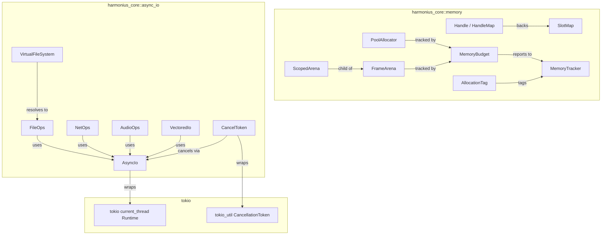
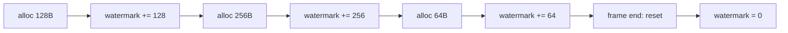
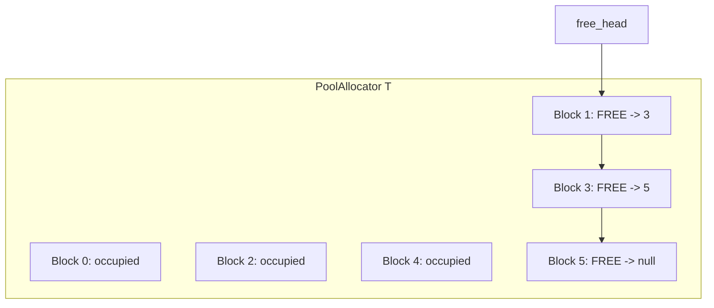
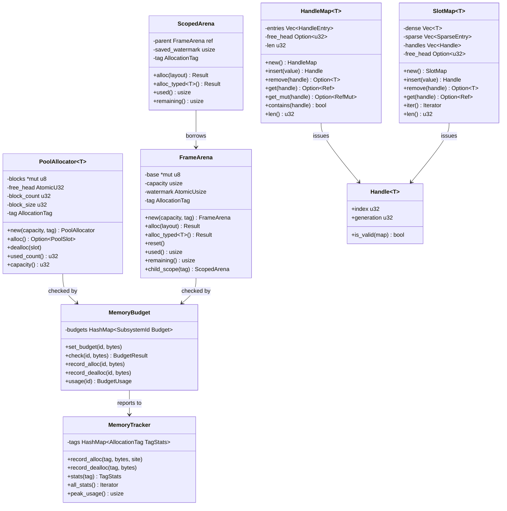
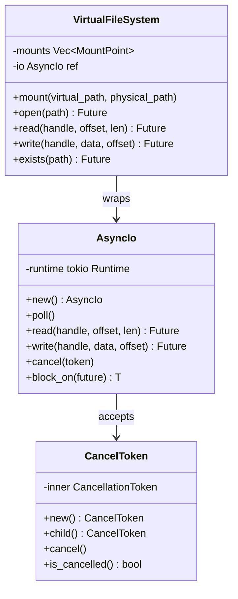
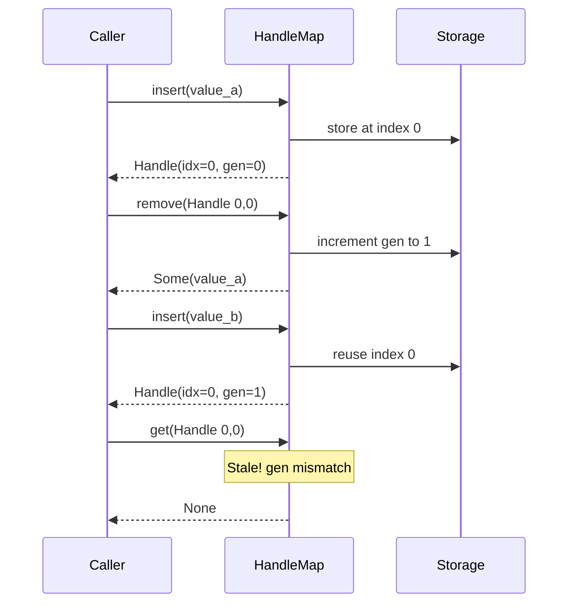
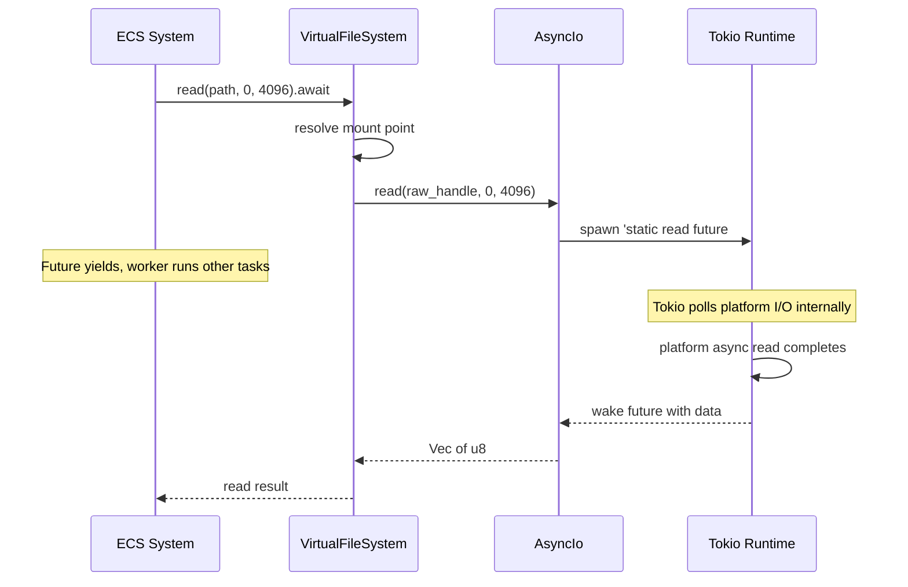

# Memory Management & Async I/O Design

## Requirements Trace

> **Canonical sources:** Features, requirements, and user stories are defined in
> [features/core-runtime/](../../features/), [requirements/core-runtime/](../../requirements/), and
> [user-stories/core-runtime/](../../user-stories/). The table below traces design elements to those
> definitions.

### Memory Management (F-1.7 / R-1.7)

| Feature | Requirement       |
|---------|-------------------|
| F-1.7.1 | R-1.7.1, R-1.7.1a |
| F-1.7.2 | R-1.7.2           |
| F-1.7.3 | R-1.7.3           |
| F-1.7.4 | R-1.7.4           |
| F-1.7.5 | R-1.7.5, R-1.7.5a |
| F-1.7.6 | R-1.7.6           |
| F-1.7.7 | R-1.7.7           |
| F-1.7.8 | R-1.7.8           |
| F-1.7.9 | R-1.7.9           |

1. **F-1.7.1** — Per-frame arena allocator with bump pointer and zero-cost reset
2. **F-1.7.2** — Scoped arena with nested lifetimes, restores parent watermark on drop
3. **F-1.7.3** — Typed pool allocator with O(1) alloc/dealloc via intrusive free list
4. **F-1.7.4** — Generational index handles for safe resource references
5. **F-1.7.5** — Slot map (dense-sparse set) with generational handle lookup
6. **F-1.7.6** — Per-subsystem memory budgets with eviction/backpressure
7. **F-1.7.7** — Profiling hooks compiled out in release builds
8. **F-1.7.8** — Allocation tagging with subsystem propagation
9. **F-1.7.9** — Arbitrary precision numeric types

### Async I/O (F-1.8 / R-1.8)

| Feature | Requirement       |
|---------|-------------------|
| F-1.8.1 | R-1.8.1           |
| F-1.8.2 | R-1.8.2, R-1.8.2a |
| F-1.8.3 | R-1.8.3           |
| F-1.8.4 | R-1.8.4           |
| F-1.8.5 | R-1.8.5           |
| F-1.8.6 | R-1.8.6           |
| F-1.8.7 | R-1.8.7           |
| F-1.8.8 | R-1.8.8, R-1.8.8a |
| F-1.8.9 | R-1.8.9           |

1. **F-1.8.1** — Tokio-based async I/O abstraction
2. **F-1.8.2** — Completion-based proactor model
3. **F-1.8.3** — Async file I/O with explicit byte offsets
4. **F-1.8.4** — Async network socket I/O (TCP/UDP)
5. **F-1.8.5** — Async audio stream I/O with deadline hints
6. **F-1.8.6** — Scatter-gather and vectored I/O
7. **F-1.8.7** — I/O priority and deadline scheduling
8. **F-1.8.8** — Cooperative I/O cancellation via tokens
9. **F-1.8.9** — I/O buffer management

## Overview

This document designs the memory management and async I/O subsystems of the Harmonius engine.
Together they form the allocation and I/O foundation consumed by every other domain.

**Memory management** provides three allocator types (frame arena, scoped arena, typed pool),
generational handles for safe indirect references, a slot map container for cache-friendly
iteration, per-subsystem memory budgets, and allocation profiling/tagging.

**Async I/O** wraps a Tokio `current_thread` runtime with a higher-level `AsyncIo` facade, adding
cancellation tokens (via `tokio_util::sync::CancellationToken`), a virtual file system (VFS) for
path resolution, and typed operation interfaces for files, sockets, and audio streams. Tokio handles
platform-specific I/O internally. All I/O uses `async`/`await` with `'static` futures. No Rust
stdlib file I/O is permitted.

### Interop Contracts Defined Here

| Contract | Consumed By |
|----------|-------------|
| Allocator types (`FrameArena`, `PoolAllocator`) | All domains |
| `Handle<T>` / `HandleMap<T>` / `SlotMap<T>` | All domains (ECS, assets, rendering) |
| `AsyncIo` facade (wraps Tokio runtime) | Content Pipeline, Platform, Networking |
| `VirtualFileSystem` | Content Pipeline, Save System |
| `MemoryBudget` / `MemoryTracker` | All domains |

## Architecture

### Module Boundaries



### File Layout

```text
harmonius_core/
├── memory/
│   ├── arena.rs          # FrameArena, ScopedArena
│   ├── pool.rs           # PoolAllocator<T>
│   ├── handle.rs         # Handle<T>, HandleMap<T>
│   ├── slot_map.rs       # SlotMap<T>
│   ├── budget.rs         # MemoryBudget, BudgetUsage
│   ├── tracker.rs        # MemoryTracker, TagStats
│   ├── tag.rs            # AllocationTag, SubsystemId
│   └── precision.rs      # BigInt, BigFloat
└── async_io/
    ├── io.rs             # AsyncIo (wraps Tokio
    │                     # current_thread)
    ├── vfs.rs            # VirtualFileSystem,
    │                     # MountPoint, VfsHandle
    ├── file.rs           # FileOps (read, write,
    │                     # flush)
    ├── net.rs            # NetOps (TCP, UDP)
    ├── audio.rs          # AudioOps (deadline
    │                     # hints)
    ├── vectored.rs       # VectoredIo
    │                     # (scatter-gather)
    ├── cancel.rs         # CancelToken (wraps
    │                     # tokio_util
    │                     # CancellationToken)
    └── error.rs          # IoError
```

### Arena Allocator Bump Flow



### Pool Allocator Free List



### Memory Data Structures



### Async I/O Data Structures



### Generational Handle Lifecycle



### Async I/O Data Flow



## API Design

### Frame Arena Allocator

```rust
/// Per-frame bump allocator backed by platform-native
/// virtual memory (VirtualAlloc / mmap).
/// Resets at zero cost at frame boundaries.
pub struct FrameArena {
    base: *mut u8,
    capacity: usize,
    watermark: AtomicUsize,
    tag: AllocationTag,
    budget: *const MemoryBudget,
}

pub struct ArenaConfig {
    /// Initial capacity in bytes. Default: 8 MiB.
    pub initial_capacity: usize,
    /// Maximum capacity. Arena doubles up to this.
    pub max_capacity: usize,
    /// Subsystem tag for profiling.
    pub tag: AllocationTag,
}

impl FrameArena {
    /// Create a new arena backed by virtual memory.
    pub fn new(
        config: ArenaConfig,
        budget: &MemoryBudget,
    ) -> Result<Self, ArenaError>;

    /// Bump-allocate `layout.size()` bytes aligned to
    /// `layout.align()`. Returns pointer to allocated
    /// memory or an error if capacity is exceeded.
    pub fn alloc(
        &self,
        layout: Layout,
    ) -> Result<*mut u8, ArenaError>;

    /// Typed bump allocation.
    pub fn alloc_typed<T>(
        &self,
    ) -> Result<*mut T, ArenaError>;

    /// Zero-cost reset. Watermark returns to base.
    /// All prior allocations are invalidated.
    pub fn reset(&self);

    /// Bytes currently allocated.
    pub fn used(&self) -> usize;

    /// Bytes remaining before capacity.
    pub fn remaining(&self) -> usize;

    /// Create a child scope. The child allocates from
    /// the parent's remaining capacity. On drop, the
    /// parent watermark is restored.
    pub fn child_scope(
        &self,
        tag: AllocationTag,
    ) -> ScopedArena<'_>;
}

/// Scoped sub-arena. Restores parent watermark on
/// drop. Enables temporary allocations within a
/// system's execution without waiting for frame end.
pub struct ScopedArena<'parent> {
    parent: &'parent FrameArena,
    saved_watermark: usize,
    tag: AllocationTag,
}

impl<'parent> ScopedArena<'parent> {
    pub fn alloc(
        &self,
        layout: Layout,
    ) -> Result<*mut u8, ArenaError>;

    pub fn alloc_typed<T>(
        &self,
    ) -> Result<*mut T, ArenaError>;

    pub fn used(&self) -> usize;
    pub fn remaining(&self) -> usize;
}

impl Drop for ScopedArena<'_> {
    fn drop(&mut self) {
        // Restore parent watermark to saved_watermark
    }
}

pub enum ArenaError {
    /// Requested allocation exceeds remaining
    /// capacity.
    OutOfMemory {
        requested: usize,
        remaining: usize,
    },
    /// Budget exceeded for this subsystem.
    BudgetExceeded {
        subsystem: SubsystemId,
        budget: usize,
        current: usize,
    },
}
```

### Typed Pool Allocator

```rust
/// Fixed-size block pool. O(1) alloc and dealloc via
/// intrusive free list. Zero fragmentation.
/// Backs ECS component columns and resource containers.
pub struct PoolAllocator<T> {
    blocks: *mut u8,
    free_head: AtomicU32,
    block_count: u32,
    block_size: u32,
    tag: AllocationTag,
    budget: *const MemoryBudget,
    _marker: PhantomData<T>,
}

pub struct PoolConfig {
    /// Initial number of blocks.
    pub initial_count: u32,
    /// Maximum number of blocks. Grows by doubling
    /// via virtual memory commit-on-demand.
    pub max_count: u32,
    /// Subsystem tag.
    pub tag: AllocationTag,
}

impl<T> PoolAllocator<T> {
    pub fn new(
        config: PoolConfig,
        budget: &MemoryBudget,
    ) -> Self;

    /// Allocate a block. Returns None if pool
    /// exhausted and cannot grow.
    pub fn alloc(&self) -> Option<PoolSlot<T>>;

    /// Return a block to the free list.
    pub fn dealloc(&self, slot: PoolSlot<T>);

    pub fn used_count(&self) -> u32;
    pub fn capacity(&self) -> u32;
}

/// A slot in the pool. Provides typed access to the
/// allocated block.
pub struct PoolSlot<T> {
    ptr: *mut T,
    index: u32,
}

impl<T> PoolSlot<T> {
    pub fn as_ref(&self) -> &T;
    pub fn as_mut(&mut self) -> &mut T;
    pub fn index(&self) -> u32;
}
```

### Generational Handles

```rust
/// Generational index handle. Packed index + generation
/// counter. Stale handles fail validation in O(1).
///
/// `Handle<T>` is the canonical engine-wide
/// generational index. ECS `Entity` and spatial
/// `BvhHandle` are aliases or wrappers of this type.
/// See [shared-primitives.md](shared-primitives.md)
/// for the full contract.
#[derive(Clone, Copy, Debug, PartialEq, Eq, Hash)]
pub struct Handle<T> {
    pub index: u32,
    pub generation: u32,
    _marker: PhantomData<T>,
}

impl<T> Handle<T> {
    /// Check if this handle is still valid in the
    /// given map.
    pub fn is_valid(
        &self,
        map: &HandleMap<T>,
    ) -> bool;
}

/// Storage container that issues and validates
/// generational handles.
pub struct HandleMap<T> {
    entries: Vec<HandleEntry<T>>,
    free_head: Option<u32>,
    len: u32,
}

struct HandleEntry<T> {
    value: Option<T>,
    generation: u32,
    next_free: Option<u32>,
}

impl<T> HandleMap<T> {
    pub fn new() -> Self;

    /// Insert a value. Returns a handle for future
    /// access.
    pub fn insert(&mut self, value: T) -> Handle<T>;

    /// Remove the value at `handle`. Increments the
    /// generation, invalidating all copies of this
    /// handle. Returns the value if valid.
    pub fn remove(
        &mut self,
        handle: Handle<T>,
    ) -> Result<T, HandleError>;

    /// O(1) lookup by handle.
    pub fn get(
        &self,
        handle: Handle<T>,
    ) -> Result<&T, HandleError>;

    /// O(1) mutable lookup by handle.
    pub fn get_mut(
        &mut self,
        handle: Handle<T>,
    ) -> Result<&mut T, HandleError>;

    /// Check if handle points to a live entry.
    pub fn contains(&self, handle: Handle<T>) -> bool;

    pub fn len(&self) -> u32;
}

pub enum HandleError {
    /// Handle's generation does not match stored
    /// generation.
    GenerationMismatch {
        handle_gen: u32,
        stored_gen: u32,
    },
    /// Index is out of bounds.
    IndexOutOfBounds { index: u32, capacity: u32 },
}
```

### Slot Map

```rust
/// Dense-sparse set. Values stored in a contiguous
/// dense array for cache-friendly iteration.
/// Generational handles provide O(1) lookup via a
/// sparse indirection table.
pub struct SlotMap<T> {
    dense: Vec<T>,
    sparse: Vec<SparseEntry>,
    handles: Vec<Handle<T>>,
    free_head: Option<u32>,
}

struct SparseEntry {
    dense_index: u32,
    generation: u32,
    next_free: Option<u32>,
}

impl<T> SlotMap<T> {
    pub fn new() -> Self;

    pub fn with_capacity(capacity: u32) -> Self;

    /// Insert a value. Returns a generational handle.
    pub fn insert(&mut self, value: T) -> Handle<T>;

    /// Remove by handle. Swap-removes from dense
    /// array and updates indirection.
    pub fn remove(
        &mut self,
        handle: Handle<T>,
    ) -> Result<T, HandleError>;

    /// O(1) lookup via sparse indirection.
    pub fn get(
        &self,
        handle: Handle<T>,
    ) -> Result<&T, HandleError>;

    pub fn get_mut(
        &mut self,
        handle: Handle<T>,
    ) -> Result<&mut T, HandleError>;

    /// Iterate the dense array (cache-friendly).
    pub fn iter(&self) -> impl Iterator<Item = &T>;

    pub fn iter_mut(
        &mut self,
    ) -> impl Iterator<Item = &mut T>;

    /// Iterate handles and values together.
    pub fn iter_with_handles(
        &self,
    ) -> impl Iterator<Item = (Handle<T>, &T)>;

    pub fn len(&self) -> u32;
    pub fn capacity(&self) -> u32;
}
```

### Memory Budgets and Tracking

```rust
/// Identifies an engine subsystem for budget tracking.
#[derive(
    Clone, Copy, Debug, PartialEq, Eq, Hash,
)]
pub struct SubsystemId(pub u16);

/// Tag attached to every allocation for profiling.
#[derive(Clone, Copy, Debug, PartialEq, Eq, Hash)]
pub struct AllocationTag {
    pub subsystem: SubsystemId,
    pub label: Option<&'static str>,
}

/// Per-subsystem memory budget enforcement.
pub struct MemoryBudget { /* ... */ }

pub struct BudgetUsage {
    pub current_bytes: usize,
    pub peak_bytes: usize,
    pub budget_bytes: usize,
}

pub enum BudgetResult {
    /// Allocation fits within budget.
    Ok,
    /// Budget exceeded. Trigger eviction.
    Exceeded {
        subsystem: SubsystemId,
        over_by: usize,
    },
}

impl MemoryBudget {
    pub fn new() -> Self;

    /// Set the budget for a subsystem in bytes.
    pub fn set_budget(
        &mut self,
        id: SubsystemId,
        bytes: usize,
    );

    /// Check if `bytes` can be allocated within
    /// the subsystem's budget.
    pub fn check(
        &self,
        id: SubsystemId,
        bytes: usize,
    ) -> BudgetResult;

    /// Record an allocation against the budget.
    pub fn record_alloc(
        &self,
        id: SubsystemId,
        bytes: usize,
    );

    /// Record a deallocation.
    pub fn record_dealloc(
        &self,
        id: SubsystemId,
        bytes: usize,
    );

    /// Query current usage for a subsystem.
    pub fn usage(
        &self,
        id: SubsystemId,
    ) -> BudgetUsage;
}

/// Profiling hooks. Compiled out in release builds
/// via `cfg(debug_assertions)`.
pub struct MemoryTracker { /* ... */ }

pub struct TagStats {
    pub tag: AllocationTag,
    pub alloc_count: u64,
    pub dealloc_count: u64,
    pub current_bytes: usize,
    pub peak_bytes: usize,
}

impl MemoryTracker {
    pub fn new() -> Self;

    #[cfg(debug_assertions)]
    pub fn record_alloc(
        &self,
        tag: AllocationTag,
        bytes: usize,
        call_site: &'static str,
    );

    #[cfg(debug_assertions)]
    pub fn record_dealloc(
        &self,
        tag: AllocationTag,
        bytes: usize,
    );

    pub fn stats(
        &self,
        tag: AllocationTag,
    ) -> Option<&TagStats>;

    pub fn all_stats(
        &self,
    ) -> impl Iterator<Item = &TagStats>;

    pub fn peak_usage(&self) -> usize;
}
```

### AsyncIo Facade

The `AsyncIo` layer wraps a Tokio `current_thread` runtime with cancellation and typed operation
interfaces. Tokio manages task scheduling and platform I/O internally. It is the sole I/O path for
all engine subsystems. All spawned futures must be `'static`.

```rust
/// Platform-agnostic I/O errors.
pub enum IoError {
    NotFound,
    PermissionDenied,
    /// Operation was cancelled via CancelToken.
    Cancelled,
    DeviceFull,
    /// Subsystem memory budget exceeded.
    BudgetExceeded { subsystem: SubsystemId },
    /// Platform-specific error with OS error code.
    Platform { code: i32 },
}

/// The engine's async I/O facade. Wraps a Tokio
/// `current_thread` runtime. All I/O operations in
/// the engine route through this layer.
pub struct AsyncIo {
    runtime: tokio::runtime::Runtime,
}

impl AsyncIo {
    /// Build a Tokio `current_thread` runtime.
    pub fn new() -> Result<Self, IoError>;

    /// Non-blocking I/O poll. Drains ready I/O
    /// completions, runs woken futures until they
    /// yield, then returns immediately.
    pub fn poll(&self);

    /// Drive I/O until `future` completes. Blocks
    /// the calling thread.
    pub fn block_on<F: Future + 'static>(
        &self,
        future: F,
    ) -> F::Output;

    /// Spawn a `'static` future on the runtime.
    pub fn spawn<F>(
        &self,
        future: F,
    ) -> tokio::task::JoinHandle<F::Output>
    where
        F: Future + Send + 'static,
        F::Output: Send + 'static;

    /// Async file read at explicit byte offset.
    pub async fn read(
        &self,
        handle: RawHandle,
        offset: u64,
        len: u32,
    ) -> Result<Vec<u8>, IoError>;

    /// Async file write at explicit byte offset.
    pub async fn write(
        &self,
        handle: RawHandle,
        data: Vec<u8>,
        offset: u64,
    ) -> Result<u32, IoError>;

    /// Scatter-gather read into multiple buffers.
    pub async fn read_vectored(
        &self,
        handle: RawHandle,
        ops: &[(u64, u32)],
    ) -> Vec<Result<Vec<u8>, IoError>>;

    /// Scatter-gather write from multiple buffers.
    pub async fn write_vectored(
        &self,
        handle: RawHandle,
        bufs: Vec<Vec<u8>>,
        offset: u64,
    ) -> Result<u32, IoError>;

    /// Async TCP accept.
    pub async fn tcp_accept(
        &self,
        listener: RawHandle,
    ) -> Result<RawHandle, IoError>;

    /// Async TCP connect.
    pub async fn tcp_connect(
        &self,
        addr: SocketAddr,
    ) -> Result<RawHandle, IoError>;

    /// Async TCP/UDP send.
    pub async fn send(
        &self,
        handle: RawHandle,
        data: Vec<u8>,
    ) -> Result<u32, IoError>;

    /// Async TCP/UDP receive.
    pub async fn recv(
        &self,
        handle: RawHandle,
    ) -> Result<Vec<u8>, IoError>;

    /// Async UDP sendto.
    pub async fn sendto(
        &self,
        handle: RawHandle,
        data: Vec<u8>,
        addr: SocketAddr,
    ) -> Result<u32, IoError>;

    /// Async UDP recvfrom.
    pub async fn recvfrom(
        &self,
        handle: RawHandle,
    ) -> Result<(Vec<u8>, SocketAddr), IoError>;

    /// Cancel an in-flight operation.
    pub fn cancel(
        &self,
        token: &CancelToken,
    );
}
```

### Cancellation Token

```rust
/// Cooperative cancellation for in-flight I/O.
/// Wraps `tokio_util::sync::CancellationToken`.
/// The completion always fires (with
/// `IoError::Cancelled` if cancelled before the
/// underlying operation completed).
pub struct CancelToken {
    inner: tokio_util::sync::CancellationToken,
}

impl CancelToken {
    pub fn new() -> Self;

    /// Create a child token. Cancelling the parent
    /// also cancels all children.
    pub fn child(&self) -> Self;

    /// Request cancellation.
    pub fn cancel(&self);

    /// Check if cancellation was requested.
    pub fn is_cancelled(&self) -> bool;

    /// Returns a future that completes when the
    /// token is cancelled.
    pub async fn cancelled(&self);
}
```

### Virtual File System

```rust
/// Resolve virtual paths to physical file handles.
/// Enables content pipeline to mount asset directories,
/// archive files, and mod overlay paths.
pub struct VirtualFileSystem {
    mounts: Vec<MountPoint>,
    io: *const AsyncIo,
}

pub struct MountPoint {
    pub virtual_path: String,
    pub physical_path: String,
    pub priority: u32,
}

/// Opaque file handle returned by VFS.
pub struct VfsHandle {
    raw: RawHandle,
    mount_index: u32,
}

pub struct FileMetadata {
    pub size: u64,
    pub modified: u64,
    /// BLAKE3 content hash.
    pub content_hash: [u8; 32],
}

impl VirtualFileSystem {
    pub fn new(io: &AsyncIo) -> Self;

    /// Mount a physical path at a virtual location.
    /// Higher priority mounts override lower ones.
    pub fn mount(
        &mut self,
        virtual_path: &str,
        physical_path: &str,
        priority: u32,
    );

    /// Open a file by virtual path.
    pub async fn open(
        &self,
        path: &str,
    ) -> Result<VfsHandle, IoError>;

    /// Async read from an opened file.
    pub async fn read(
        &self,
        handle: &VfsHandle,
        offset: u64,
        len: u32,
    ) -> Result<Vec<u8>, IoError>;

    /// Async write to an opened file.
    pub async fn write(
        &self,
        handle: &VfsHandle,
        data: Vec<u8>,
        offset: u64,
    ) -> Result<u32, IoError>;

    /// Check if a virtual path exists.
    pub async fn exists(
        &self,
        path: &str,
    ) -> Result<bool, IoError>;

    /// Query file metadata including BLAKE3 hash.
    pub async fn metadata(
        &self,
        path: &str,
    ) -> Result<FileMetadata, IoError>;
}
```

### Arbitrary Precision Types

**Note:** Arbitrary-precision numerics (`BigInt`, `BigFloat`) address R-1.7.9 but are not related to
memory management or I/O. These will be relocated to a dedicated math/core-types design in a future
revision.

```rust
/// Arbitrary precision integer. Supports 128-bit,
/// 256-bit, and unlimited precision.
pub struct BigInt {
    limbs: Vec<u64>,
}

impl BigInt {
    pub fn from_i128(val: i128) -> Self;
    pub fn to_f64(&self) -> f64;
    pub fn to_f32(&self) -> f32;
}

/// Arbitrary precision float with configurable
/// precision and deterministic cross-platform
/// arithmetic.
pub struct BigFloat {
    significand: BigInt,
    exponent: i32,
    precision_bits: u32,
}

impl BigFloat {
    pub fn new(
        significand: BigInt,
        exponent: i32,
        precision: u32,
    ) -> Self;
    pub fn to_f64(&self) -> f64;
    pub fn to_f32(&self) -> f32;
    /// Format with unit suffix (e.g., "2.4M ly").
    pub fn format_with_units(
        &self,
        unit: &str,
    ) -> String;
}
```

## Data Flow

### Frame Lifecycle with Memory and I/O

The game loop owns the `FrameArena` and `AsyncIo`. The `AsyncIo` wraps a Tokio `current_thread`
runtime. Each frame proceeds as:

```rust
loop {
    // 1. Reset frame arena (zero cost)
    frame_arena.reset();

    // 2. Non-blocking I/O poll: drain completions
    async_io.poll();

    // 3. Build and run ECS systems
    let graph = ecs.build_frame_graph();
    async_io.block_on(pool.execute_graph(graph));
    // Systems allocate transient data from
    // frame_arena. Async systems submit I/O
    // through async_io.spawn() with 'static
    // futures and yield at .await points.

    // 4. Mid-frame I/O poll (optional)
    async_io.poll();

    // 5. Render submission
    renderer.submit_commands();

    // 6. GPU sync (blocks until present)
    async_io.block_on(renderer.present());
}
```

### Scoped Arena Usage

```rust
pool.scope(|scope| {
    let query_results = frame_arena.child_scope(
        AllocationTag {
            subsystem: PHYSICS_ID,
            label: Some("broadphase"),
        },
    );
    // Allocate broadphase results in child scope
    let pairs = query_results.alloc_typed::<
        ContactPair
    >();
    // ... use pairs ...

    // Child scope drops here -> watermark restored.
    // Peak memory is reduced vs. waiting for
    // frame end.
});
```

### VFS Resolution Order

When multiple mounts overlap, the VFS resolves paths by mount priority (highest wins):

1. Check mounts in descending priority order
2. For each mount, test if `physical_path + relative` exists
3. First match wins; open the physical file
4. If no mount matches, return `IoError::NotFound`

### I/O Cancellation Flow

1. Caller creates `CancelToken` and passes it when submitting I/O
2. I/O futures use `tokio::select!` to race `token.cancelled()` against the operation
3. To cancel, caller calls `token.cancel()`
4. Child tokens are also cancelled automatically
5. The result is either the original data (if completed before cancellation) or `IoError::Cancelled`

## Platform Considerations

### Memory Backing

| Platform | Virtual Memory API             |
|----------|--------------------------------|
| Windows  | `VirtualAlloc` / `VirtualFree` |
| macOS    | `mmap` / `munmap`              |
| Linux    | `mmap` / `munmap`              |

1. **Windows** — `MEM_RESERVE` + `MEM_COMMIT` for commit-on-demand pool growth
2. **macOS** — `MAP_ANON` for arena backing
3. **Linux** — `MAP_ANON

### I/O Backend

AsyncIo delegates all platform I/O to Tokio. Tokio selects the optimal platform backend internally
(IOCP on Windows, kqueue on macOS, epoll/io_uring on Linux). The engine does not manage platform I/O
primitives directly.

### Memory Budget Defaults

| Tier | ECS | Asset Cache | GPU Upload | Scratch | Total |
|------|-----|-------------|------------|---------|-------|
| Mobile (2-6 GB) | 128 MB | 256 MB | 64 MB | 32 MB | 480 MB |
| Switch (4 GB) | 256 MB | 512 MB | 128 MB | 64 MB | 960 MB |
| Desktop (16+ GB) | 1 GB | 4 GB | 512 MB | 256 MB | 5.75 GB |
| High-end (64 GB) | 4 GB | 16 GB | 2 GB | 1 GB | 23 GB |

### In-Flight I/O Limits

| Tier | Max In-Flight |
|------|--------------|
| Mobile | 32 |
| Switch | 64 |
| Desktop | 256 |
| High-end PC | 1024 |

### Proposed Dependencies

| Crate | Purpose | Justification |
|-------|---------|---------------|
| `blake3` | BLAKE3 content hashing | Fast, SIMD, pure Rust |
| `tokio` | Async runtime | Mature, single-threaded mode |
| `tokio-util` | CancellationToken | Cooperative cancellation |
| `windows-rs` | Win32 `VirtualAlloc` | Zero-cost FFI to Win32 |

Note: `crossbeam-deque`, `crossbeam-utils`, and `smallvec` are already approved in
[platform/threading.md](../platform/threading.md).

## Safety Invariants

### FrameArena Lifetime (Critical)

`FrameArena::alloc` returns `*mut T` with no lifetime bound. After `reset()`, all prior allocations
are invalid. Implementation must return `ArenaRef<'a, T>` borrowing from the arena, tying the
reference lifetime to the arena scope. `reset()` requires `&mut self` to prevent aliased access
during reset.

### FrameArena Thread Safety (Critical)

`watermark: AtomicUsize` suggests concurrent alloc. Implementation must use a CAS loop:
`compare_exchange(old, align_up(old, align) + size)`. Plain `fetch_add` without alignment interleave
check causes overlapping allocations. Specify `Ordering::Relaxed` for the watermark (single-object
allocation has no inter-allocation ordering dependency).

### PoolAllocator ABA Problem (Critical)

`free_head: AtomicU32` intrusive free list is susceptible to ABA. Use `AtomicU64` with
`[count:32][index:32]` tagged pointer, or add a generation counter per slot (matching `Handle<T>`
pattern). Without ABA protection, concurrent alloc/dealloc silently corrupts the free list.

### PoolSlot Lifetime (Critical)

`PoolSlot<T>::as_ref()` produces `&T` from a raw pointer with no lifetime bound. After `dealloc`,
the slot is freed. Implementation must tie `PoolSlot<T>` to the allocator's lifetime, or use
generational indices (like `Handle<T>`) with runtime validation.

### AsyncIo Tokio Runtime Ownership (Critical)

`AsyncIo` owns the Tokio `current_thread` runtime. The runtime must not be dropped while spawned
tasks are still running. `AsyncIo::drop` must shut down the runtime gracefully, allowing pending
tasks to complete or be cancelled.

### ScopedArena Child Lifetimes (High)

When `ScopedArena` drops, it restores the parent watermark. Allocations from child scopes become
dangling. `alloc` must return references bounded by the scope's `'parent` lifetime.

## Test Plan

### Unit Tests — Memory

| Test                               | Req      |
|------------------------------------|----------|
| `test_arena_100k_allocs_under_1ms` | R-1.7.1  |
| `test_arena_reset_zero_cost`       | R-1.7.1  |
| `test_arena_overflow_error`        | R-1.7.1a |
| `test_arena_grow_by_doubling`      | R-1.7.1a |
| `test_scoped_arena_restore`        | R-1.7.2  |
| `test_scoped_arena_nested_10`      | R-1.7.2  |
| `test_pool_o1_alloc_dealloc`       | R-1.7.3  |
| `test_pool_zero_fragmentation`     | R-1.7.3  |
| `test_handle_generation_mismatch`  | R-1.7.4  |
| `test_handle_validate_1m`          | R-1.7.4  |
| `test_slotmap_dense_iteration`     | R-1.7.5  |
| `test_slotmap_4m_entries`          | R-1.7.5a |
| `test_slotmap_stale_error`         | R-1.7.5a |
| `test_budget_eviction`             | R-1.7.6  |
| `test_profiling_hooks_dev`         | R-1.7.7  |
| `test_profiling_compiled_out`      | R-1.7.7  |
| `test_tag_propagation`             | R-1.7.8  |
| `test_bigint_determinism`          | R-1.7.9  |
| `test_bigfloat_to_f32_f64`         | R-1.7.9  |

1. **`test_arena_100k_allocs_under_1ms`** — 100,000 varying-size bump allocations in one frame.
   Verify total time < 1 ms. Verify watermark = sum of sizes + padding.
2. **`test_arena_reset_zero_cost`** — Allocate 8 MB, reset, verify watermark = 0 in < 1 us.
3. **`test_arena_overflow_error`** — Fill to 99% capacity. Attempt oversize alloc. Verify
   `ArenaError::OutOfMemory` with correct sizes.
4. **`test_arena_grow_by_doubling`** — Exhaust initial 8 MiB arena. Verify it doubles to 16 MiB.
   Verify growth stops at configured max.
5. **`test_scoped_arena_restore`** — Parent 1 MB. Child allocates 512 KB. Drop child. Verify parent
   remaining = 1 MB.
6. **`test_scoped_arena_nested_10`** — 10 nested scopes. Verify correct watermark at each level on
   drop.
7. **`test_pool_o1_alloc_dealloc`** — 10,000 random alloc/dealloc. Benchmark confirms constant time
   regardless of occupancy.
8. **`test_pool_zero_fragmentation`** — After random ops, verify total memory = block_count *
   block_size.
9. **`test_handle_generation_mismatch`** — Alloc handle, remove, alloc new at same index. Old handle
   returns `GenerationMismatch`.
10. **`test_handle_validate_1m`** — Validate 1 million handles. Verify O(1) per validation.
11. **`test_slotmap_dense_iteration`** — Insert 10,000, remove 5,000 random. Verify dense iteration
    visits exactly 5,000.
12. **`test_slotmap_4m_entries`** — Insert 4 million entries. Verify all lookups succeed.
13. **`test_slotmap_stale_error`** — Stale handle returns `GenerationMismatch` with expected/actual
    gen.
14. **`test_budget_eviction`** — Set 100 MB budget. Allocate to limit. Next alloc returns
    `BudgetExceeded`.
15. **`test_profiling_hooks_dev`** — Dev build: 1,000 allocations across 3 allocators. Verify
    correct counts, byte totals, peak.
16. **`test_profiling_compiled_out`** — Release build: verify no profiling symbol exists (binary
    inspection).
17. **`test_tag_propagation`** — Parent arena tagged "physics". Child scope inherits tag. Verify
    per-tag stats sum correctly.
18. **`test_bigint_determinism`** — Compute distance at 10M light-years. Verify bit-identical on all
    platforms.
19. **`test_bigfloat_to_f32_f64`** — Round-trip conversion. Verify deterministic across
    architectures.

### Unit Tests — Async I/O

| Test                              | Req      |
|-----------------------------------|----------|
| `test_async_read_data_integrity`  | R-1.8.3  |
| `test_no_std_fs_calls`            | R-1.8.3  |
| `test_completion_typed_result`    | R-1.8.2  |
| `test_completion_latency_p99`     | R-1.8.2a |
| `test_vectored_write_integrity`   | R-1.8.6  |
| `test_vectored_syscall_reduction` | R-1.8.6  |
| `test_cancel_fires_completion`    | R-1.8.8  |
| `test_cancel_child_token`         | R-1.8.8  |
| `test_cancel_1000_no_leaks`       | R-1.8.8a |
| `test_tokio_runtime_init`         | R-1.8.1  |
| `test_static_future_spawn`        | R-1.8.1  |

1. **`test_async_read_data_integrity`** — Write 4 MB at explicit offsets from 4 `'static` tasks.
   Read back. Verify integrity.
2. **`test_no_std_fs_calls`** — Static analysis: verify no `std::fs` or `std::io::Read/Write` in
   codebase.
3. **`test_completion_typed_result`** — Submit 1 MB write. Verify completion carries correct byte
   count and context.
4. **`test_completion_latency_p99`** — 10,000 concurrent 4 KB reads. Verify p99 delivery latency <
   100 us.
5. **`test_vectored_write_integrity`** — Write 3 non-contiguous buffers via single vectored write.
   Read back, verify concatenation.
6. **`test_vectored_syscall_reduction`** — Benchmark vectored vs. individual writes. Verify >= 30%
   syscall reduction.
7. **`test_cancel_fires_completion`** — Submit 100 MB read, cancel within 1 ms. Verify
   `IoError::Cancelled` fires.
8. **`test_cancel_child_token`** — Create parent and child tokens. Cancel parent. Verify child is
   also cancelled.
9. **`test_cancel_1000_no_leaks`** — Submit 1,000 ops, cancel all. Verify all complete within 10 ms.
   Verify no handle leaks.
10. **`test_tokio_runtime_init`** — Create `current_thread` runtime. Verify it initializes and shuts
    down cleanly.
11. **`test_static_future_spawn`** — Spawn a `'static` future. Verify it completes and returns the
    expected value.

### Integration Tests

| Test                            | Req     |
|---------------------------------|---------|
| `test_backend_per_platform`     | R-1.8.1 |
| `test_tcp_connect_accept_1mb`   | R-1.8.4 |
| `test_udp_1000_datagrams`       | R-1.8.4 |
| `test_concurrent_tcp_500`       | R-1.8.4 |
| `test_audio_latency_under_10ms` | R-1.8.5 |
| `test_vfs_mount_resolution`     | -       |
| `test_vfs_blake3_hash`          | -       |
| `test_budget_24h_server`        | R-1.7.6 |

1. **`test_backend_per_platform`** — Same test suite passes on Windows, macOS, Linux via CI (Tokio
   handles platform differences).
2. **`test_tcp_connect_accept_1mb`** — Async connect/accept, send 1 MB, verify receipt.
3. **`test_udp_1000_datagrams`** — Send 1,000 datagrams. Verify delivery count.
4. **`test_concurrent_tcp_500`** — 500 concurrent TCP connections. No handle leaks.
5. **`test_audio_latency_under_10ms`** — Audio writes + 100 MB background reads. p99 audio latency <
   10 ms. Zero underruns over 60 s.
6. **`test_vfs_mount_resolution`** — Mount 3 overlapping paths. Verify highest priority wins.
7. **`test_vfs_blake3_hash`** — Write known data, query metadata, verify BLAKE3 hash matches.
8. **`test_budget_24h_server`** — 24-hour sustained server load. No OOM. Budget never exceeded.

### Benchmarks

| Benchmark | Target | Source |
|-----------|--------|--------|
| Arena alloc throughput | > 100M allocs/sec | US-1.7.2 |
| Arena reset | < 1 us | US-1.7.1 |
| Pool alloc/dealloc | O(1), < 50 ns | US-1.7.5 |
| Handle validation | O(1), < 10 ns | US-1.7.7 |
| SlotMap dense iter 10k | < 50 us | US-1.7.8 |
| Tokio file I/O throughput | >= 80% raw disk | US-1.8.19 |
| Vectored vs. individual | >= 30% fewer syscalls | US-1.8.14 |

## Design Q & A

**Q1. What is the biggest constraint limiting this design?** What would happen if we lifted that
constraint? What is the best possible solution imaginable without those constraints? What is the
impact of removing them?

The `'static` future requirement is the most limiting constraint. All spawned futures must own their
data, preventing zero-cost borrows across await points. Lifting this would allow scoped borrows in
async tasks, reducing clones and allocations. However, `'static` futures are required by Tokio's
`spawn` and simplify reasoning about task lifetimes. The trade-off is acceptable given Tokio's
maturity and ecosystem support.

**Q2. How can this design be improved?** Where is it weak? What potential issues will arise? What
trade-offs are we making?

Using Tokio `current_thread` removes the complexity of maintaining three platform I/O backends, but
couples the engine to Tokio's release cycle and API stability. Memory budgets (F-1.7.6) with
eviction policies add runtime overhead to every allocation path. The `current_thread` runtime is
single- threaded, which simplifies reasoning but limits I/O parallelism to one OS thread. Adding
integration tests across all target platforms and clearer lifetime annotations in the API would
mitigate these weaknesses.

**Q3. Is there a better approach?** If we are not taking it, why not?

A custom IoReactor built directly on platform-native primitives (IOCP, GCD, io_uring) would give
finer control over poll points and buffer registration. We chose Tokio instead because it is
battle-tested, has a large ecosystem (HTTP, gRPC, database drivers), and eliminates maintaining
three separate platform backends. Tokio's `current_thread` mode gives us control over when I/O is
polled via `block_on`, which is sufficient for frame pacing.

**Q4. Does this design solve all customer problems?** Are there missing features, requirements, or
user stories? What are they? How would adding them improve the engine? What kinds of games does it
enable?

The design covers file, network, and audio I/O but lacks explicit memory-mapped I/O management
beyond zero-copy deserialization (F-1.4.2). User story US-1.8.7 references asset loading but there
is no streaming virtual memory feature for texture and mesh data that exceeds physical RAM. For
open-world games with hundreds of GB of terrain data, a virtual memory streaming layer integrated
with the AsyncIo facade would enable seamless world traversal. The arbitrary precision numerics
(F-1.7.9) also lack user stories for integration with the spatial index (F-1.9) for cosmic-scale
worlds. Adding virtual memory streaming and large-world coordinate integration would expand support
for space games and planetary-scale simulations.

**Q5. Is this design cohesive with the overall engine?** Does it fit? Does it differ from other
modules, and why? How could we make it more cohesive? How can we improve it to meet engine goals?

Memory management and async I/O are foundational layers that all other modules depend on, giving
them strong structural cohesion. The generational handle design (F-1.7.4) is shared across ECS
entities (F-1.1.11) and spatial index (F-1.9.1), unified via the shared primitives module. Since
Tokio manages its own I/O buffers internally, the gap between frame arenas and I/O buffer lifetimes
is no longer a concern. All async tasks use `'static` futures, making ownership clear and avoiding
lifetime entanglement between the frame arena and I/O completions.

## Open Questions

1. **Arena page decommit strategy** — On arena reset, should we `madvise(MADV_DONTNEED)` /
   `VirtualFree` pages beyond a high-water mark to reduce RSS? This trades reset latency for memory
   pressure relief on constrained platforms.

2. **Pool growth vs. fixed capacity** — Should pool allocators grow (commit more pages) on
   exhaustion, or return `None` and let the caller evict? Growth is simpler but risks unbounded
   memory usage.

3. **SlotMap max capacity** — R-1.7.5a requires 4M entries. Should we support 2^24 (16M) or 2^32
   (4B)? Larger capacity increases sparse table memory overhead.

4. **Handle bit packing** — Current design uses two `u32` fields (index + generation) for 8 bytes
   total. An alternative packs both into a single `u64` (e.g., 24-bit index + 8-bit generation).
   Smaller handles improve cache density but limit max entries and generation rollover.

5. **VFS archive support** — Should the VFS support reading from archive files (e.g., zip, custom
   pak) in addition to directory mounts? This is needed for shipping but may be deferred.

6. **BLAKE3 streaming hash** — Should `FileMetadata` compute BLAKE3 on `open()` (blocking, expensive
   for large files) or lazily on first `metadata()` call? Lazy is better for hot paths but
   complicates the API.

7. **Audio I/O integration depth** — The current design routes audio I/O through `AsyncIo` backed by
   Tokio. Should audio have a completely separate I/O path (dedicated thread with deadline
   scheduling) to guarantee sub-10 ms latency even under I/O saturation?
