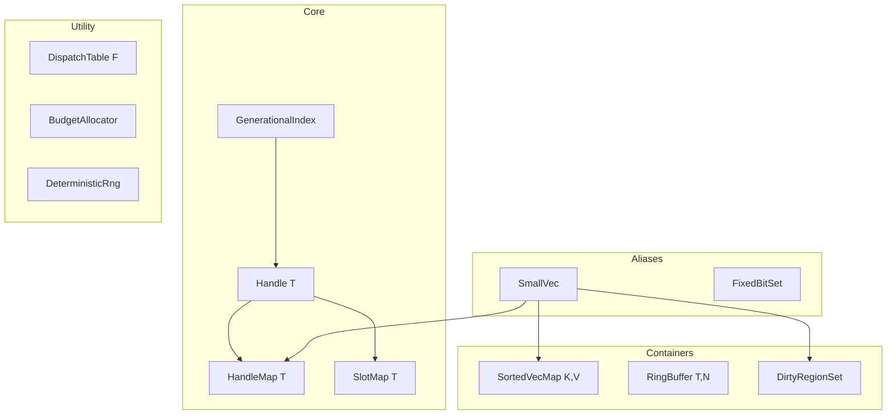
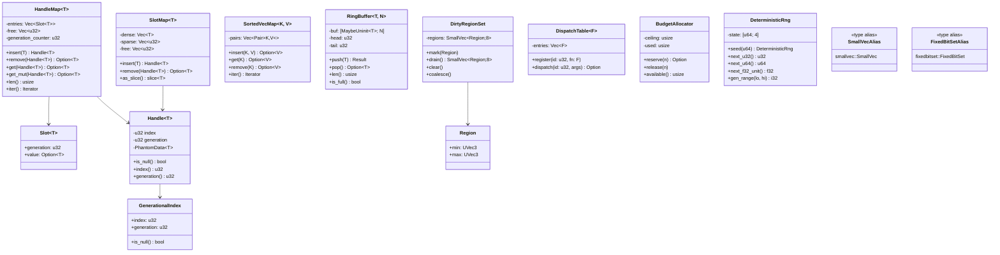
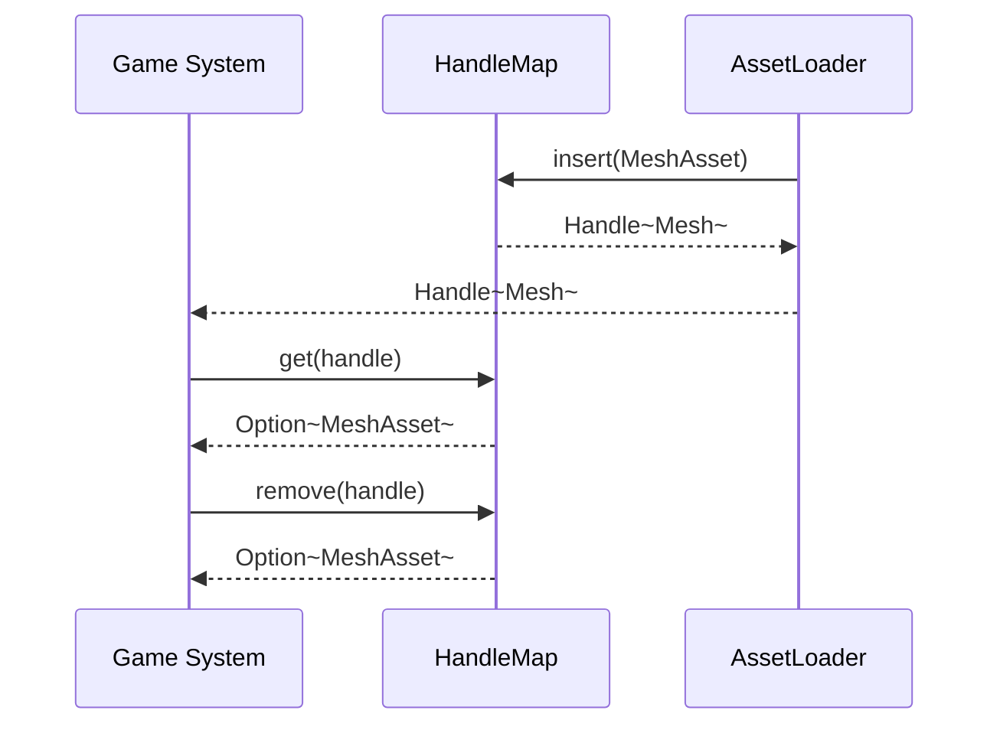

# Core Primitives Design

## Requirements Trace

> **Canonical sources:** This document is the single canonical home for shared container and utility
> primitives. It supersedes the Tier-1 section of [algorithms.md](algorithms.md) per design review
> [section 2.2](../design-review.md#22-foundational-type-duplication) and P0 task 2.

### Feature Trace

| Feature  | Primitive                               |
|----------|-----------------------------------------|
| F-1.7.4  | `Handle<T>`, `HandleMap<T>`             |
| F-1.7.5  | `SlotMap<T>`, `GenerationalIndex`       |
| F-1.7.6  | `BudgetAllocator`                       |
| F-1.9.2  | `SortedVecMap<K, V>`                    |
| F-1.9.3  | `RingBuffer<T, N>`                      |
| F-1.9.4  | `DirtyRegionSet`                        |
| F-1.9.5  | `DispatchTable<F>`                      |
| F-1.9.6  | `DeterministicRng`                      |
| F-1.9.7  | `SmallVec` and `FixedBitSet` aliases    |

1. **F-1.7.4** — Generational handles with compile-time type tagging
2. **F-1.7.5** — Slot map dense storage plus indirection table
3. **F-1.7.6** — Budget enforcement with backpressure across subsystems
4. **F-1.9.2** — Sorted vector map for deterministic iteration
5. **F-1.9.3** — Fixed-capacity ring buffer for audio / command queues
6. **F-1.9.4** — Dirty region tracking shared by rendering, save, VFX
7. **F-1.9.5** — Dispatch table for enum-driven static dispatch
8. **F-1.9.6** — Deterministic seedable RNG (Xoshiro256**)
9. **F-1.9.7** — Standard aliases for smallvec and fixedbitset crates

> **Scope note:** `UniformGrid<T>` belongs to [spatial-index.md](spatial-index.md). The
> gameplay-propagating grid is renamed to `CellGrid` in
> [simulation/grids-volumes.md](../simulation/grids-volumes.md). See design review section 2.2.

## Overview

Every Harmonius subsystem previously defined its own `Handle<T>`, `HandleMap`, and `DirtyRegionSet`,
with subtle API differences. This document establishes a single owner for all shared container and
utility primitives. All other docs must reference these definitions rather than reintroducing them.

### Design Rules

| Rule                         | Rationale                                              |
|------------------------------|--------------------------------------------------------|
| Zero heap allocation on hot  | Arena / stack / slab allocation only during frames     |
| No `HashMap` on hot paths    | Use `SortedVecMap` or index-based lookup               |
| No `Arc` or `RefCell`        | Use generational indices and scoped borrows            |
| Deterministic iteration      | Sorted storage for all shared structures               |
| rkyv-compatible              | All persistent types derive rkyv `Archive`             |
| `bytemuck` where POD         | Zero-copy cast in mmap scenarios                       |

## Architecture

### Primitive Layering



### Class Diagram



## API Design

```rust
use core::marker::PhantomData;
use core::mem::MaybeUninit;
use glam::UVec3;

// -------- Handle -----------------------------------------------------------

/// Generational handle parameterized by the resource type. Not `Copy`-able
/// across type boundaries; `Handle<Texture>` != `Handle<Mesh>`.
#[derive(Clone, Copy, Eq, PartialEq, Hash)]
#[derive(rkyv::Archive, rkyv::Serialize, rkyv::Deserialize)]
pub struct Handle<T: 'static> {
    pub index: u32,
    pub generation: u32,
    _marker: PhantomData<fn() -> T>,
}

impl<T> Handle<T> {
    pub const NULL: Self = Self {
        index: u32::MAX,
        generation: u32::MAX,
        _marker: PhantomData,
    };

    pub fn is_null(self) -> bool { self == Self::NULL }
}

// -------- GenerationalIndex -----------------------------------------------

/// Untyped version; Handle is a newtype wrapper over this.
#[derive(Clone, Copy, Eq, PartialEq, Hash)]
#[derive(rkyv::Archive, rkyv::Serialize, rkyv::Deserialize)]
pub struct GenerationalIndex {
    pub index: u32,
    pub generation: u32,
}

// -------- HandleMap -------------------------------------------------------

/// Dense/sparse map of T keyed by Handle<T>. O(1) insert/remove/get.
pub struct HandleMap<T> {
    entries: Vec<Slot<T>>,
    free: Vec<u32>,
}

struct Slot<T> {
    generation: u32,
    value: Option<T>,
}

impl<T> HandleMap<T> {
    pub fn new() -> Self { unimplemented!() }
    pub fn with_capacity(n: usize) -> Self { unimplemented!() }
    pub fn insert(&mut self, v: T) -> Handle<T> { unimplemented!() }
    pub fn remove(&mut self, h: Handle<T>) -> Option<T> { unimplemented!() }
    pub fn get(&self, h: Handle<T>) -> Option<&T> { unimplemented!() }
    pub fn get_mut(&mut self, h: Handle<T>) -> Option<&mut T> { unimplemented!() }
    pub fn len(&self) -> usize { unimplemented!() }
    pub fn iter(&self) -> impl Iterator<Item = (Handle<T>, &T)> {
        std::iter::empty()
    }
}

// -------- SlotMap ---------------------------------------------------------

/// Densely packed `Vec<T>` with a sparse generation-aware index table. Use
/// when iteration speed matters more than reuse of old indices.
pub struct SlotMap<T> {
    dense: Vec<T>,
    sparse: Vec<u32>,
    free: Vec<u32>,
}

impl<T> SlotMap<T> {
    pub fn insert(&mut self, v: T) -> Handle<T> { unimplemented!() }
    pub fn remove(&mut self, h: Handle<T>) -> Option<T> { unimplemented!() }
    pub fn as_slice(&self) -> &[T] { &self.dense }
}

// -------- SortedVecMap -----------------------------------------------------

/// Sorted vector of `(K, V)` pairs. O(log n) binary search lookup, O(n)
/// insert, deterministic iteration. Replaces HashMap on hot paths.
pub struct SortedVecMap<K: Ord, V> {
    pairs: Vec<(K, V)>,
}

impl<K: Ord, V> SortedVecMap<K, V> {
    pub fn new() -> Self { unimplemented!() }
    pub fn insert(&mut self, k: K, v: V) -> Option<V> { unimplemented!() }
    pub fn get(&self, k: &K) -> Option<&V> { unimplemented!() }
    pub fn remove(&mut self, k: &K) -> Option<V> { unimplemented!() }
    pub fn iter(&self) -> impl Iterator<Item = (&K, &V)> {
        self.pairs.iter().map(|(k, v)| (k, v))
    }
}

// -------- RingBuffer -------------------------------------------------------

/// Fixed-capacity inline ring buffer. Used by audio command queue and the
/// I/O completion drain.
pub struct RingBuffer<T, const N: usize> {
    buf: [MaybeUninit<T>; N],
    head: u32,
    tail: u32,
}

impl<T, const N: usize> RingBuffer<T, N> {
    pub const fn new() -> Self { unimplemented!() }
    pub fn push(&mut self, v: T) -> Result<(), T> { unimplemented!() }
    pub fn pop(&mut self) -> Option<T> { unimplemented!() }
    pub fn len(&self) -> usize { unimplemented!() }
    pub fn is_full(&self) -> bool { unimplemented!() }
}

// -------- DirtyRegionSet ---------------------------------------------------

#[derive(Copy, Clone, Eq, PartialEq)]
pub struct Region {
    pub min: UVec3,
    pub max: UVec3,
}

pub struct DirtyRegionSet {
    regions: smallvec::SmallVec<[Region; 8]>,
}

impl DirtyRegionSet {
    pub fn new() -> Self { unimplemented!() }
    pub fn mark(&mut self, region: Region) { unimplemented!() }
    pub fn drain(&mut self) -> smallvec::SmallVec<[Region; 8]> { unimplemented!() }
    pub fn clear(&mut self) { self.regions.clear(); }
    pub fn coalesce(&mut self) { unimplemented!() }
}

// -------- DispatchTable ---------------------------------------------------

/// Enum-dispatch replacement for `dyn Trait`. Keyed by a compact ID.
pub struct DispatchTable<F> {
    entries: Vec<Option<F>>,
}

impl<F> DispatchTable<F> {
    pub fn new() -> Self { unimplemented!() }
    pub fn register(&mut self, id: u32, f: F) { unimplemented!() }
    pub fn get(&self, id: u32) -> Option<&F> { unimplemented!() }
}

// -------- BudgetAllocator -------------------------------------------------

pub struct BudgetAllocator {
    ceiling: usize,
    used: usize,
}

impl BudgetAllocator {
    pub fn new(ceiling: usize) -> Self { Self { ceiling, used: 0 } }
    pub fn reserve(&mut self, n: usize) -> Option<()> { unimplemented!() }
    pub fn release(&mut self, n: usize) { unimplemented!() }
    pub fn available(&self) -> usize { self.ceiling.saturating_sub(self.used) }
}

// -------- DeterministicRng ------------------------------------------------

/// Xoshiro256** — deterministic, seedable, 2^256 period. Required for
/// rollback, replay, procedural generation, loot rolls.
#[derive(Clone)]
pub struct DeterministicRng {
    state: [u64; 4],
}

impl DeterministicRng {
    pub fn seed(seed: u64) -> Self { unimplemented!() }
    pub fn next_u32(&mut self) -> u32 { unimplemented!() }
    pub fn next_u64(&mut self) -> u64 { unimplemented!() }
    pub fn next_f32_unit(&mut self) -> f32 { unimplemented!() }
    pub fn gen_range(&mut self, lo: i32, hi: i32) -> i32 { unimplemented!() }
}

// -------- Aliases ---------------------------------------------------------

/// Inline-allocated small vector. Prefer capacity 4, 8, or 16. Heap spill
/// is allowed but flagged in profiling.
pub type SmallVec<T, const N: usize> = smallvec::SmallVec<[T; N]>;

/// Fixed-size bitset used by ECS component masks, layer masks, and dirty
/// bit tracking.
pub type FixedBitSet = fixedbitset::FixedBitSet;
```

### rkyv Support Matrix

| Primitive           | rkyv derive | Persisted in | Notes                        |
|---------------------|-------------|--------------|------------------------------|
| `Handle<T>`         | Yes         | Save files   | `T` must be static           |
| `GenerationalIndex` | Yes         | Save files   | Untyped variant              |
| `HandleMap<T>`      | No          | Ephemeral    | Rebuilt from asset list      |
| `SlotMap<T>`        | No          | Ephemeral    | Dense array only             |
| `SortedVecMap<K,V>` | Yes         | Save / asset | `K` and `V` must implement   |
| `RingBuffer<T, N>`  | No          | Ephemeral    | Runtime-only channel state   |
| `DirtyRegionSet`    | No          | Ephemeral    | Per-frame tracker            |
| `DispatchTable<F>`  | No          | Static       | Constructed at startup       |
| `BudgetAllocator`   | No          | Ephemeral    | Per-frame                    |
| `DeterministicRng`  | Yes         | Save / net   | Seed/state saved for replay  |

### Usage Matrix

| Primitive           | ECS | Render | Physics | Audio | AI | Net | Tools | Save |
|---------------------|-----|--------|---------|-------|----|----|-------|------|
| `Handle<T>`         | x   | x      | x       | x     | x  | x   | x     | x    |
| `HandleMap<T>`      | x   | x      | x       |       | x  |     | x     |      |
| `SlotMap<T>`        | x   | x      | x       |       | x  |     |       |      |
| `GenerationalIndex` | x   | x      | x       | x     | x  | x   |       | x    |
| `SortedVecMap<K,V>` | x   | x      | x       | x     | x  | x   | x     | x    |
| `RingBuffer<T, N>`  |     | x      |         | x     |    | x   |       |      |
| `DirtyRegionSet`    |     | x      |         |       |    |     | x     | x    |
| `DispatchTable<F>`  | x   | x      | x       | x     | x  | x   | x     |      |
| `BudgetAllocator`   | x   | x      | x       | x     | x  | x   | x     |      |
| `DeterministicRng`  |     |        | x       |       | x  | x   | x     | x    |
| `SmallVec` alias    | x   | x      | x       | x     | x  | x   | x     | x    |
| `FixedBitSet` alias | x   | x      |         |       | x  | x   | x     |      |

## Data Flow



## Platform Considerations

All primitives are `#![no_std]`-compatible except where explicitly noted. No platform-specific code.
They compile identically on every target. `DeterministicRng` produces the same byte sequence on
every platform for the same seed.

## Test Plan

Full test cases live in [primitives-test-cases.md](primitives-test-cases.md). Summary:

| Category    | Scope                                                          |
|-------------|----------------------------------------------------------------|
| Unit        | Handle stale gen, HandleMap insert/remove/get, SlotMap iter    |
| Unit        | SortedVecMap ordering, RingBuffer full/empty, BudgetAllocator  |
| Unit        | DeterministicRng reproducibility across machines               |
| Integration | ECS uses HandleMap; asset pipeline uses SlotMap                |
| Benchmark   | HandleMap 1M insert under 50 ms                                |
| Benchmark   | SortedVecMap 10K lookup under 20 us                            |

## Open Questions

1. Should `Handle<T>` reserve a NULL constant or rely on `Option<Handle<T>>`?
2. Should `SlotMap` return stable iteration order after remove?
3. What is the maximum `N` for `RingBuffer` before we require heap allocation?
4. Is `DispatchTable<F>` too similar to `Vec<Option<F>>`? Worth keeping as a distinct type?
5. Should `DeterministicRng` expose a `split()` API for parallel systems?
