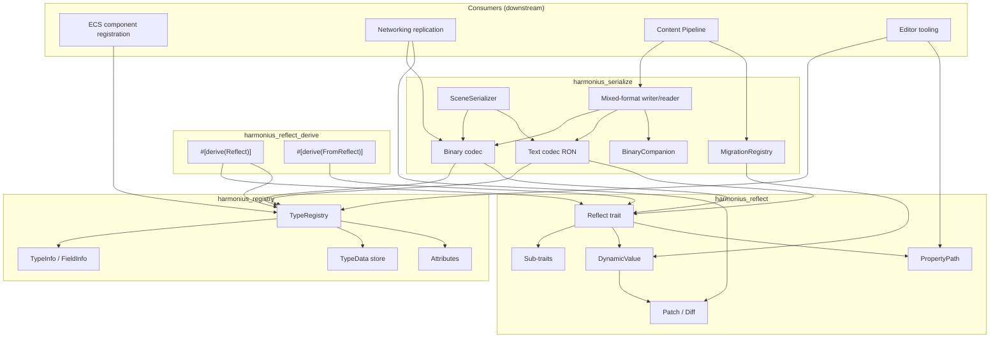
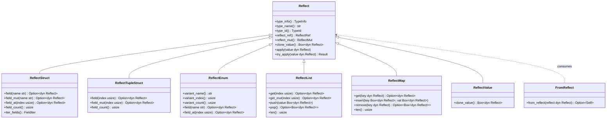
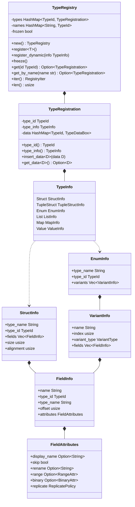
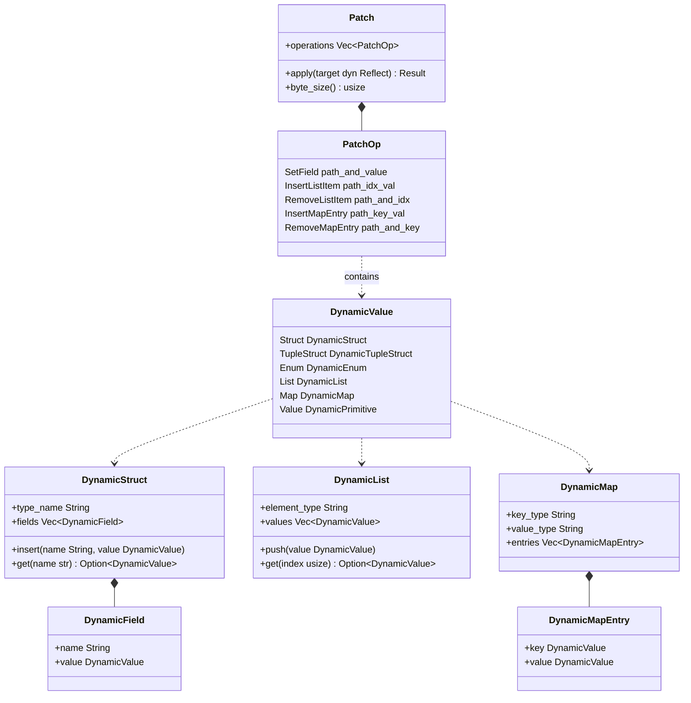
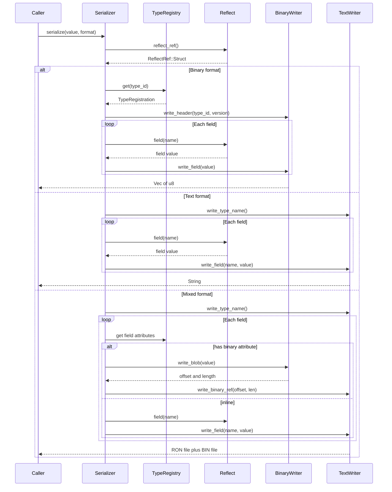
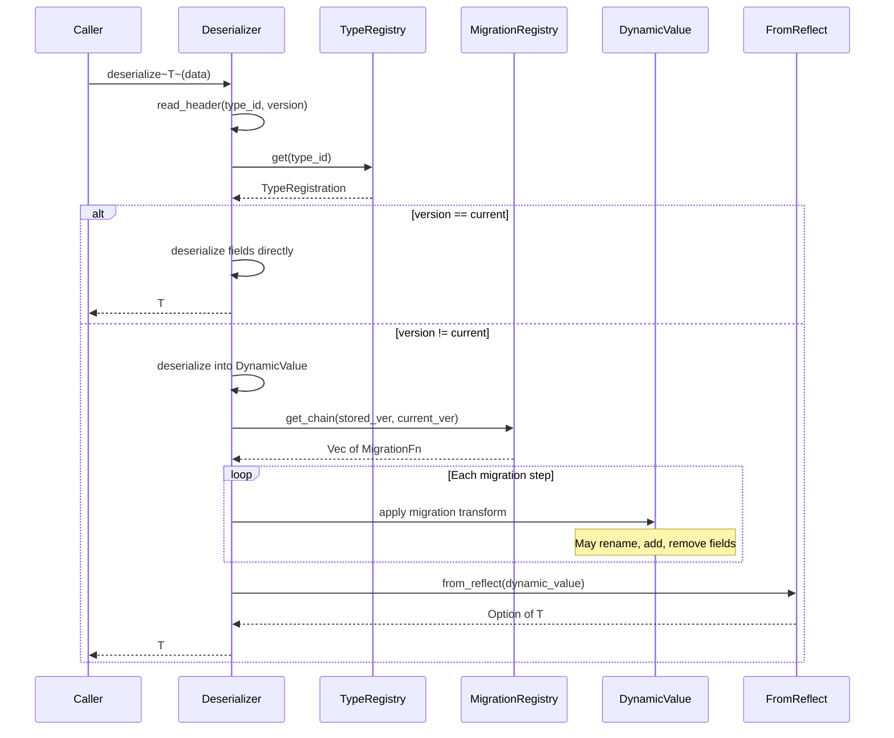
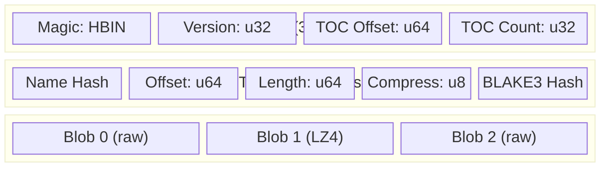

# Reflection and Serialization Design

## Requirements Trace

> **Canonical sources:** Features, requirements, and user
> stories are defined in [features/core-runtime/](../../features/core-runtime/),
> [requirements/core-runtime/](../../requirements/core-runtime/), and
> [user-stories/core-runtime/](../../user-stories/core-runtime/). The table
> below traces design elements to those definitions.

### Reflection (F-1.3 / R-1.3)

| Feature | Requirement | Description |
|---------|-------------|-------------|
| F-1.3.1 | R-1.3.1, R-1.3.1a | Global type registry, O(1) lookup, 10k+ types |
| F-1.3.2 | R-1.3.2 | Structured type descriptors (size, align, drop, clone, default) |
| F-1.3.3 | R-1.3.3, R-1.3.3a | Reflective property access with dot-path syntax, < 500 ns |
| F-1.3.4 | R-1.3.4 | Collection reflection (Vec, HashMap, HashSet) |
| F-1.3.5 | R-1.3.5 | Type-erased DynamicValue with diff and patch |
| F-1.3.6 | R-1.3.6 | Custom type and field attributes (ranges, skip, rename) |
| F-1.3.7 | R-1.3.7 | Trait object registration and dispatch by TypeId |
| F-1.3.8 | R-1.3.8, R-1.3.8a | Reflect trait with derive macro and attribute annotations |
| F-1.3.9 | R-1.3.9 | Reflect sub-traits per type category |
| F-1.3.10 | R-1.3.10 | FromReflect conversion trait |

### Serialization (F-1.4 / R-1.4)

| Feature | Requirement | Description |
|---------|-------------|-------------|
| F-1.4.1 | R-1.4.1, R-1.4.1a | Compact binary format, >= 500 MB/s, little-endian |
| F-1.4.2 | R-1.4.2 | Zero-copy deserialization via memory mapping |
| F-1.4.3 | R-1.4.3 | Human-readable text format (RON), round-trip fidelity |
| F-1.4.4 | R-1.4.4 | Schema versioning with semantic version tags |
| F-1.4.5 | R-1.4.5, R-1.4.5a | Data migration pipeline, 50+ step chains |
| F-1.4.6 | R-1.4.6 | Asset-aware serialization with handle resolution |
| F-1.4.7 | R-1.4.7 | Full scene serialization with entity ID remapping |
| F-1.4.8 | R-1.4.8, R-1.4.8a | Mixed-format with binary companions, atomic writes |
| F-1.4.9 | R-1.4.9, R-1.4.9a | Binary companion file format, append-friendly |
| F-1.4.10 | R-1.4.10 | `#[binary]` field attribute for mixed-format control |

## Overview

The reflection and serialization subsystem provides runtime
type introspection, property access, and data persistence for
the Harmonius engine. It is the data backbone that enables
the ECS, editor, networking, and content pipeline to operate
on types generically without compile-time knowledge.

The design is modeled after bevy_reflect. A `Reflect` trait
with sub-traits per type category (struct, enum, list, map,
value) provides uniform access. A `TypeRegistry` stores rich
type descriptors that are immutable after startup for
lock-free concurrent reads.

Serialization builds on reflection with three codec paths:

1. **Binary** -- compact, little-endian, >= 500 MB/s
2. **Text** -- RON format, human-readable, diff-friendly
3. **Mixed** -- RON metadata + binary companion `.bin` files

Schema versioning and a migration pipeline ensure forward
compatibility across game updates.

### Crate Structure

```
harmonius_reflect_derive/  # proc-macro crate
harmonius_reflect/         # Reflect trait, sub-traits,
                           # DynamicValue, PropertyPath,
                           # Patch, diff
harmonius_registry/        # TypeRegistry, TypeInfo,
                           # TypeRegistration, attributes
harmonius_serialize/       # Binary, text, mixed codecs,
                           # migration, scene serializer,
                           # binary companion format
```

## Architecture

### Module Boundaries



### Reflect Trait Hierarchy



### TypeRegistry and Type Descriptors



### DynamicValue and Patch



### Serialization Data Flow



### Deserialization with Migration



### Binary Companion File Layout



### File Layout

```
harmonius_reflect_derive/
├── lib.rs             # proc-macro entry point
├── reflect.rs         # #[derive(Reflect)] expansion
├── from_reflect.rs    # #[derive(FromReflect)] expansion
└── attrs.rs           # attribute parsing (skip,
                       # rename, default, binary)

harmonius_reflect/
├── lib.rs             # re-exports
├── reflect.rs         # Reflect trait definition
├── sub_traits.rs      # ReflectStruct, ReflectEnum,
│                      # ReflectList, ReflectMap,
│                      # ReflectTupleStruct,
│                      # ReflectValue
├── from_reflect.rs    # FromReflect trait
├── dynamic.rs         # DynamicValue, DynamicStruct,
│                      # DynamicEnum, DynamicList,
│                      # DynamicMap
├── path.rs            # PropertyPath resolution
├── diff.rs            # diff(a, b) -> Patch
├── patch.rs           # Patch, PatchOp, apply
├── impls/
│   ├── primitives.rs  # Reflect for f32, u32, bool,
│   │                  # String, etc.
│   ├── collections.rs # Reflect for Vec, HashMap,
│   │                  # HashSet
│   ├── options.rs     # Reflect for Option<T>
│   └── tuples.rs      # Reflect for (A,), (A,B), ...
└── enums.rs           # ReflectRef, ReflectMut,
                       # VariantType

harmonius_registry/
├── lib.rs             # re-exports
├── registry.rs        # TypeRegistry
├── registration.rs    # TypeRegistration, TypeData
├── type_info.rs       # TypeInfo, StructInfo,
│                      # EnumInfo, etc.
├── field_info.rs      # FieldInfo, FieldAttributes
└── attrs.rs           # RangeAttr, BinaryAttr,
                       # ReplicatePolicy

harmonius_serialize/
├── lib.rs             # re-exports
├── binary/
│   ├── writer.rs      # BinarySerializer
│   ├── reader.rs      # BinaryDeserializer
│   ├── header.rs      # BinaryHeader, type ID,
│   │                  # version tag
│   └── zero_copy.rs   # MappedAsset, pointer-offset
│                      # tables
├── text/
│   ├── writer.rs      # TextSerializer (RON output)
│   └── reader.rs      # TextDeserializer (RON input)
├── mixed/
│   ├── writer.rs      # MixedFormatWriter
│   ├── reader.rs      # MixedFormatReader
│   └── companion.rs   # BinaryCompanion format,
│                      # TOC, blob read/write
├── migration.rs       # MigrationRegistry,
│                      # MigrationFn, chain resolver
├── version.rs         # SchemaVersion (semver)
├── scene.rs           # SceneSerializer,
│                      # SceneDeserializer,
│                      # entity ID remapping
├── asset_handle.rs    # AssetId serialization
└── error.rs           # SerializeError,
                       # DeserializeError,
                       # MigrationError
```

## API Design

### Reflect Trait

```rust
/// The core reflection trait. Every reflected type
/// implements this. The derive macro generates the
/// implementation automatically.
pub trait Reflect: Send + Sync + 'static {
    /// Returns the static type info descriptor.
    fn type_info(&self) -> &'static TypeInfo;

    /// Returns the fully qualified type name.
    fn type_name(&self) -> &str;

    /// Returns the Rust TypeId.
    fn type_id(&self) -> TypeId;

    /// Borrow as an immutable reflected reference.
    fn reflect_ref(&self) -> ReflectRef<'_>;

    /// Borrow as a mutable reflected reference.
    fn reflect_mut(&mut self) -> ReflectMut<'_>;

    /// Clone into a type-erased boxed Reflect.
    fn clone_value(&self) -> Box<dyn Reflect>;

    /// Apply a reflected value onto self. Panics
    /// on type mismatch. Prefer try_apply.
    fn apply(&mut self, value: &dyn Reflect);

    /// Apply a reflected value, returning an error
    /// on type mismatch instead of panicking.
    fn try_apply(
        &mut self,
        value: &dyn Reflect,
    ) -> Result<(), ReflectError>;

    /// Downcast to a concrete type reference.
    fn downcast_ref<T: Reflect>(
        &self,
    ) -> Option<&T>;

    /// Downcast to a concrete type mutable ref.
    fn downcast_mut<T: Reflect>(
        &mut self,
    ) -> Option<&mut T>;

    /// Access a nested value by dot-separated path.
    /// Example: "transform.position.x"
    ///
    /// `Reflect::path` and `path_mut` delegate to
    /// `PropertyPath` internally. `PropertyPath` is
    /// the public API for path-based access; the
    /// trait methods are convenience wrappers.
    fn path(
        &self,
        path: &str,
    ) -> Result<&dyn Reflect, ReflectPathError>;

    /// Mutable access by dot-separated path.
    /// Delegates to `PropertyPath::get_mut`
    /// internally.
    fn path_mut(
        &mut self,
        path: &str,
    ) -> Result<&mut dyn Reflect, ReflectPathError>;
}

/// Immutable reflected reference, dispatches to
/// the correct sub-trait.
pub enum ReflectRef<'a> {
    Struct(&'a dyn ReflectStruct),
    TupleStruct(&'a dyn ReflectTupleStruct),
    Enum(&'a dyn ReflectEnum),
    List(&'a dyn ReflectList),
    Map(&'a dyn ReflectMap),
    Value(&'a dyn ReflectValue),
}

/// Mutable reflected reference.
pub enum ReflectMut<'a> {
    Struct(&'a mut dyn ReflectStruct),
    TupleStruct(&'a mut dyn ReflectTupleStruct),
    Enum(&'a mut dyn ReflectEnum),
    List(&'a mut dyn ReflectList),
    Map(&'a mut dyn ReflectMap),
    Value(&'a mut dyn ReflectValue),
}
```

### Reflect Sub-Traits

```rust
/// Named-field struct reflection.
pub trait ReflectStruct: Reflect {
    fn field(
        &self,
        name: &str,
    ) -> Option<&dyn Reflect>;

    fn field_mut(
        &mut self,
        name: &str,
    ) -> Option<&mut dyn Reflect>;

    fn field_at(
        &self,
        index: usize,
    ) -> Option<&dyn Reflect>;

    fn field_at_mut(
        &mut self,
        index: usize,
    ) -> Option<&mut dyn Reflect>;

    fn field_count(&self) -> usize;

    fn iter_fields(
        &self,
    ) -> FieldIter<'_>;

    fn field_name(
        &self,
        index: usize,
    ) -> Option<&str>;
}

/// Tuple struct reflection (unnamed fields).
pub trait ReflectTupleStruct: Reflect {
    fn field(
        &self,
        index: usize,
    ) -> Option<&dyn Reflect>;

    fn field_mut(
        &mut self,
        index: usize,
    ) -> Option<&mut dyn Reflect>;

    fn field_count(&self) -> usize;
}

/// Enum reflection.
pub trait ReflectEnum: Reflect {
    fn variant_name(&self) -> &str;
    fn variant_index(&self) -> usize;
    fn variant_count(&self) -> usize;
    fn variant_type(&self) -> VariantType;

    /// Field access on the active variant.
    fn field(
        &self,
        name: &str,
    ) -> Option<&dyn Reflect>;

    fn field_mut(
        &mut self,
        name: &str,
    ) -> Option<&mut dyn Reflect>;

    fn field_at(
        &self,
        index: usize,
    ) -> Option<&dyn Reflect>;
}

#[derive(Clone, Copy, Debug, PartialEq, Eq)]
pub enum VariantType {
    Unit,
    Tuple,
    Struct,
}

/// Ordered collection reflection (Vec, arrays).
pub trait ReflectList: Reflect {
    fn get(
        &self,
        index: usize,
    ) -> Option<&dyn Reflect>;

    fn get_mut(
        &mut self,
        index: usize,
    ) -> Option<&mut dyn Reflect>;

    fn push(&mut self, value: Box<dyn Reflect>);
    fn pop(&mut self) -> Option<Box<dyn Reflect>>;
    fn len(&self) -> usize;
    fn is_empty(&self) -> bool;
    fn iter(&self) -> ListIter<'_>;
}

/// Key-value collection reflection (HashMap).
pub trait ReflectMap: Reflect {
    fn get(
        &self,
        key: &dyn Reflect,
    ) -> Option<&dyn Reflect>;

    fn get_mut(
        &mut self,
        key: &dyn Reflect,
    ) -> Option<&mut dyn Reflect>;

    fn insert(
        &mut self,
        key: Box<dyn Reflect>,
        value: Box<dyn Reflect>,
    ) -> Option<Box<dyn Reflect>>;

    fn remove(
        &mut self,
        key: &dyn Reflect,
    ) -> Option<Box<dyn Reflect>>;

    fn len(&self) -> usize;
    fn is_empty(&self) -> bool;
    fn iter(&self) -> MapIter<'_>;
}

/// Opaque leaf value (primitives, foreign types).
pub trait ReflectValue: Reflect {
    fn clone_value(&self) -> Box<dyn Reflect>;
}
```

### FromReflect

```rust
/// Construct a concrete typed value from any
/// Reflect reference. Generated by the derive
/// macro alongside Reflect.
pub trait FromReflect: Reflect + Sized {
    /// Attempt to construct Self from reflected
    /// data. Returns None if the dynamic data is
    /// incompatible. Missing fields use registered
    /// defaults.
    fn from_reflect(
        reflect: &dyn Reflect,
    ) -> Option<Self>;
}
```

### Derive Macro

```rust
/// Derive macro auto-implements Reflect, the
/// appropriate sub-trait, and FromReflect.
///
/// Supported attributes:
/// - #[reflect(skip)]       — exclude field
/// - #[reflect(rename = "x")] — override name
/// - #[reflect(default)]    — use Default on
///                            missing fields
/// - #[binary]              — store in companion
/// - #[binary(compress = "lz4")]
/// - #[binary(align = 16)]
///
/// Example:
/// #[derive(Reflect)]
/// struct Transform {
///     pub position: Vec3,
///     pub rotation: Quat,
///     pub scale: Vec3,
///     #[reflect(skip)]
///     cached_matrix: Mat4,
/// }
///
/// #[derive(Reflect)]
/// enum DamageType {
///     Physical { amount: f32 },
///     Magical { amount: f32, element: Element },
///     Pure(f32),
/// }
///
/// The macro generates:
/// 1. impl Reflect for T
/// 2. impl ReflectStruct (or ReflectEnum, etc.)
/// 3. impl FromReflect for T
/// 4. TypeRegistration auto-registration via
///    inventory::submit!
pub use harmonius_reflect_derive::Reflect;
```

### TypeRegistry

```rust
/// Runtime type registry. Immutable after freeze().
/// All reads are lock-free after initialization.
pub struct TypeRegistry {
    types: HashMap<TypeId, TypeRegistration>,
    names: HashMap<String, TypeId>,
    frozen: bool,
}

impl TypeRegistry {
    pub fn new() -> Self;

    /// Register a concrete Reflect type. Panics
    /// if the registry is frozen or if a duplicate
    /// TypeId is registered (diagnostic error names
    /// both conflicting types).
    pub fn register<T: Reflect + Typed>(&mut self);

    /// Register a dynamically-constructed type.
    pub fn register_dynamic(
        &mut self,
        info: TypeInfo,
    );

    /// Freeze the registry. After this call, no
    /// new types can be registered and all reads
    /// are guaranteed lock-free.
    pub fn freeze(&mut self);

    /// O(1) lookup by TypeId.
    pub fn get(
        &self,
        id: TypeId,
    ) -> Option<&TypeRegistration>;

    /// Lookup by fully qualified type name.
    pub fn get_by_name(
        &self,
        name: &str,
    ) -> Option<&TypeRegistration>;

    /// Iterate all registered types.
    pub fn iter(
        &self,
    ) -> impl Iterator<Item = &TypeRegistration>;

    pub fn len(&self) -> usize;
    pub fn is_empty(&self) -> bool;
}

/// Provides the static TypeInfo for a type.
/// Implemented by the derive macro.
pub trait Typed: Reflect {
    fn type_info() -> &'static TypeInfo;
}

/// A single type's registration entry.
pub struct TypeRegistration {
    type_id: TypeId,
    type_info: &'static TypeInfo,
    data: HashMap<TypeId, Box<dyn TypeData>>,
}

impl TypeRegistration {
    pub fn type_id(&self) -> TypeId;
    pub fn type_info(&self) -> &'static TypeInfo;

    /// Insert auxiliary type data (e.g., a
    /// ReflectSerialize impl, editor metadata).
    pub fn insert_data<D: TypeData>(
        &mut self,
        data: D,
    );

    /// Retrieve auxiliary type data by TypeId.
    pub fn get_data<D: TypeData>(
        &self,
    ) -> Option<&D>;
}

/// Marker trait for type-erased data stored in
/// TypeRegistration.
pub trait TypeData:
    Send + Sync + 'static
{
    fn clone_type_data(
        &self,
    ) -> Box<dyn TypeData>;
}
```

### Type Descriptors

```rust
/// Describes the structure of a reflected type.
pub enum TypeInfo {
    Struct(StructInfo),
    TupleStruct(TupleStructInfo),
    Enum(EnumInfo),
    List(ListInfo),
    Map(MapInfo),
    Value(ValueInfo),
}

pub struct StructInfo {
    pub type_name: &'static str,
    pub type_id: TypeId,
    pub size: usize,
    pub alignment: usize,
    pub fields: &'static [FieldInfo],
    pub drop_fn: unsafe fn(*mut u8),
    pub clone_fn: unsafe fn(*const u8) -> *mut u8,
    pub default_fn: Option<fn() -> Box<dyn Reflect>>,
}

pub struct FieldInfo {
    pub name: &'static str,
    pub type_id: TypeId,
    pub type_name: &'static str,
    pub offset: usize,
    pub attributes: FieldAttributes,
}

pub struct FieldAttributes {
    /// Display name for editor UI.
    pub display_name: Option<&'static str>,
    /// Exclude from reflection and serialization.
    pub skip: bool,
    /// Override the field name in serialization.
    pub rename: Option<&'static str>,
    /// Default value factory for missing fields.
    pub default_fn:
        Option<fn() -> Box<dyn Reflect>>,
    /// Numeric range constraint for editor.
    pub range: Option<RangeAttr>,
    /// Binary companion storage directive.
    pub binary: Option<BinaryAttr>,
    /// Network replication policy.
    pub replicate: ReplicatePolicy,
}

pub struct RangeAttr {
    pub min: f64,
    pub max: f64,
    pub step: Option<f64>,
}

pub struct BinaryAttr {
    pub compress: Compression,
    pub align: usize,
}

#[derive(Clone, Copy, Debug, PartialEq, Eq)]
pub enum Compression {
    None,
    Lz4,
}

#[derive(Clone, Copy, Debug, PartialEq, Eq)]
pub enum ReplicatePolicy {
    /// Always replicate this field.
    Always,
    /// Replicate only on change.
    OnChange,
    /// Never replicate (local-only).
    Never,
}

pub struct EnumInfo {
    pub type_name: &'static str,
    pub type_id: TypeId,
    pub size: usize,
    pub alignment: usize,
    pub variants: &'static [VariantInfo],
    pub drop_fn: unsafe fn(*mut u8),
    pub clone_fn: unsafe fn(*const u8) -> *mut u8,
    pub default_fn: Option<fn() -> Box<dyn Reflect>>,
}

pub struct VariantInfo {
    pub name: &'static str,
    pub index: usize,
    pub variant_type: VariantType,
    pub fields: &'static [FieldInfo],
}

pub struct TupleStructInfo {
    pub type_name: &'static str,
    pub type_id: TypeId,
    pub size: usize,
    pub alignment: usize,
    pub fields: &'static [FieldInfo],
    pub drop_fn: unsafe fn(*mut u8),
    pub clone_fn: unsafe fn(*const u8) -> *mut u8,
}

pub struct ListInfo {
    pub type_name: &'static str,
    pub type_id: TypeId,
    pub element_type_id: TypeId,
    pub element_type_name: &'static str,
}

pub struct MapInfo {
    pub type_name: &'static str,
    pub type_id: TypeId,
    pub key_type_id: TypeId,
    pub key_type_name: &'static str,
    pub value_type_id: TypeId,
    pub value_type_name: &'static str,
}

pub struct ValueInfo {
    pub type_name: &'static str,
    pub type_id: TypeId,
    pub size: usize,
    pub alignment: usize,
}
```

### DynamicValue

```rust
/// Type-erased dynamic representation of any
/// reflected value. Used as the interchange format
/// between serialization, migration, networking,
/// and the ECS world.
pub enum DynamicValue {
    Struct(DynamicStruct),
    TupleStruct(DynamicTupleStruct),
    Enum(DynamicEnum),
    List(DynamicList),
    Map(DynamicMap),
    Value(DynamicPrimitive),
}

pub struct DynamicStruct {
    type_name: String,
    fields: Vec<DynamicField>,
    field_indices: HashMap<String, usize>,
}

pub struct DynamicField {
    pub name: String,
    pub value: DynamicValue,
}

pub struct DynamicEnum {
    type_name: String,
    variant_name: String,
    variant_index: usize,
    fields: Vec<DynamicField>,
}

pub struct DynamicList {
    element_type_name: String,
    values: Vec<DynamicValue>,
}

pub struct DynamicMap {
    key_type_name: String,
    value_type_name: String,
    entries: Vec<(DynamicValue, DynamicValue)>,
}

pub struct DynamicPrimitive {
    type_name: String,
    data: PrimitiveData,
}

/// Inline storage for common primitive types.
pub enum PrimitiveData {
    Bool(bool),
    I8(i8),
    I16(i16),
    I32(i32),
    I64(i64),
    U8(u8),
    U16(u16),
    U32(u32),
    U64(u64),
    F32(f32),
    F64(f64),
    String(String),
    Bytes(Vec<u8>),
}

impl DynamicStruct {
    pub fn new(type_name: String) -> Self;

    pub fn insert(
        &mut self,
        name: String,
        value: DynamicValue,
    );

    pub fn get(
        &self,
        name: &str,
    ) -> Option<&DynamicValue>;

    pub fn get_mut(
        &mut self,
        name: &str,
    ) -> Option<&mut DynamicValue>;

    pub fn iter(
        &self,
    ) -> impl Iterator<Item = &DynamicField>;
}
```

### PropertyPath

```rust
/// Parsed property path for efficient repeated
/// access. Pre-parses "transform.position.x" into
/// segments for O(depth) traversal.
pub struct PropertyPath {
    segments: Vec<PathSegment>,
}

pub enum PathSegment {
    /// Named field access (structs, enum variants).
    Field(String),
    /// Indexed access (lists, tuple structs).
    Index(usize),
    /// Map key access (maps). The key is stored
    /// as a string and converted via FromReflect.
    MapKey(String),
}

impl PropertyPath {
    /// Parse a dot-separated path string.
    /// Field names are plain identifiers.
    /// List indices use bracket syntax: "items[3]".
    /// Map keys use bracket syntax: "map[key]".
    pub fn parse(
        path: &str,
    ) -> Result<Self, ReflectPathError>;

    /// Resolve the path against a reflected value.
    pub fn get<'a>(
        &self,
        root: &'a dyn Reflect,
    ) -> Result<&'a dyn Reflect, ReflectPathError>;

    /// Mutable resolve.
    pub fn get_mut<'a>(
        &self,
        root: &'a mut dyn Reflect,
    ) -> Result<
        &'a mut dyn Reflect,
        ReflectPathError,
    >;

    pub fn depth(&self) -> usize;
}
```

### Diff and Patch

```rust
/// Compute the minimal difference between two
/// reflected values of the same type.
pub fn diff(
    old: &dyn Reflect,
    new: &dyn Reflect,
) -> Result<Patch, ReflectError>;

/// A set of operations that transform one value
/// into another. Used for network delta
/// compression and undo/redo.
pub struct Patch {
    pub operations: Vec<PatchOp>,
}

pub enum PatchOp {
    /// Set a field at a given path to a new value.
    SetField {
        path: String,
        value: DynamicValue,
    },
    /// Insert an item into a list at an index.
    InsertListItem {
        path: String,
        index: usize,
        value: DynamicValue,
    },
    /// Remove a list item at an index.
    RemoveListItem {
        path: String,
        index: usize,
    },
    /// Insert a key-value pair into a map.
    InsertMapEntry {
        path: String,
        key: DynamicValue,
        value: DynamicValue,
    },
    /// Remove a map entry by key.
    RemoveMapEntry {
        path: String,
        key: DynamicValue,
    },
}

impl Patch {
    /// Apply this patch to a mutable reflected
    /// value. Returns errors for invalid paths.
    pub fn apply(
        &self,
        target: &mut dyn Reflect,
    ) -> Result<(), PatchError>;

    /// Total byte size of all operations (for
    /// network budget estimation).
    pub fn byte_size(&self) -> usize;

    /// True if the patch has no operations.
    pub fn is_empty(&self) -> bool;

    /// Serialize the patch to binary for network
    /// transmission.
    pub fn to_bytes(&self) -> Vec<u8>;

    /// Deserialize a patch from binary.
    pub fn from_bytes(
        data: &[u8],
    ) -> Result<Self, DeserializeError>;
}
```

### Binary Serialization

```rust
/// Binary format header. Prepended to every
/// serialized binary blob.
#[repr(C)]
pub struct BinaryHeader {
    /// Magic bytes: b"HSER"
    pub magic: [u8; 4],
    /// Header version (currently 1).
    pub header_version: u8,
    /// Reserved padding.
    pub _pad: [u8; 3],
    /// Type ID hash (u64 from TypeId).
    pub type_id_hash: u64,
    /// Schema version of the serialized type.
    pub schema_version: SchemaVersion,
    /// Byte length of the payload (after header).
    pub payload_len: u64,
}

pub struct BinarySerializer<'a> {
    registry: &'a TypeRegistry,
    output: Vec<u8>,
}

impl<'a> BinarySerializer<'a> {
    pub fn new(
        registry: &'a TypeRegistry,
    ) -> Self;

    /// Serialize a reflected value to binary.
    /// Writes header + tightly-packed payload.
    pub fn serialize(
        &mut self,
        value: &dyn Reflect,
    ) -> Result<&[u8], SerializeError>;
}

pub struct BinaryDeserializer<'a> {
    registry: &'a TypeRegistry,
    migration: &'a MigrationRegistry,
}

impl<'a> BinaryDeserializer<'a> {
    pub fn new(
        registry: &'a TypeRegistry,
        migration: &'a MigrationRegistry,
    ) -> Self;

    /// Deserialize binary data into a DynamicValue.
    /// If the schema version differs from current,
    /// migration is applied automatically.
    pub fn deserialize(
        &self,
        data: &[u8],
    ) -> Result<DynamicValue, DeserializeError>;

    /// Deserialize directly into a concrete type.
    pub fn deserialize_typed<T: FromReflect>(
        &self,
        data: &[u8],
    ) -> Result<T, DeserializeError>;
}
```

### Zero-Copy Deserialization

```rust
/// A memory-mapped asset file with pointer-offset
/// table for zero-copy field access. The backing
/// mmap is held by the caller.
pub struct MappedAsset<'a> {
    /// Memory-mapped byte slice.
    data: &'a [u8],
    /// Pointer-offset table parsed from the header.
    offsets: OffsetTable,
}

/// Offset table mapping field names to byte
/// positions within the mapped data.
pub struct OffsetTable {
    entries: Vec<OffsetEntry>,
}

pub struct OffsetEntry {
    pub name_hash: u64,
    pub offset: u64,
    pub len: u64,
    pub type_id_hash: u64,
}

impl<'a> MappedAsset<'a> {
    /// Interpret a memory-mapped byte slice as a
    /// mapped asset. Validates the header and
    /// builds the offset table. Zero allocation.
    pub fn from_bytes(
        data: &'a [u8],
    ) -> Result<Self, DeserializeError>;

    /// Access a field by name. Returns a
    /// zero-copy byte slice into the mmap.
    pub fn field_bytes(
        &self,
        name: &str,
    ) -> Option<&'a [u8]>;

    /// Access a typed field. The caller must
    /// ensure the field layout matches T.
    pub unsafe fn field_as<T: Copy>(
        &self,
        name: &str,
    ) -> Option<&'a T>;
}
```

### Text Serialization

```rust
/// Serialize reflected values to RON format.
/// Driven entirely by reflection — no custom
/// serialization code per type.
pub struct TextSerializer<'a> {
    registry: &'a TypeRegistry,
}

impl<'a> TextSerializer<'a> {
    pub fn new(
        registry: &'a TypeRegistry,
    ) -> Self;

    /// Serialize to a RON string.
    pub fn serialize(
        &self,
        value: &dyn Reflect,
    ) -> Result<String, SerializeError>;
}

pub struct TextDeserializer<'a> {
    registry: &'a TypeRegistry,
    migration: &'a MigrationRegistry,
}

impl<'a> TextDeserializer<'a> {
    pub fn new(
        registry: &'a TypeRegistry,
        migration: &'a MigrationRegistry,
    ) -> Self;

    /// Deserialize a RON string into a
    /// DynamicValue with automatic migration.
    pub fn deserialize(
        &self,
        text: &str,
    ) -> Result<DynamicValue, DeserializeError>;

    /// Deserialize directly into a concrete type.
    pub fn deserialize_typed<T: FromReflect>(
        &self,
        text: &str,
    ) -> Result<T, DeserializeError>;
}
```

### Mixed-Format Serialization

```rust
/// Write a human-readable text file alongside a
/// binary companion. Fields marked #[binary] are
/// stored in the companion; all others inline.
pub struct MixedFormatWriter<'a> {
    registry: &'a TypeRegistry,
    text_path: PathBuf,
    companion_path: PathBuf,
}

impl<'a> MixedFormatWriter<'a> {
    pub fn new(
        registry: &'a TypeRegistry,
        text_path: PathBuf,
        companion_path: PathBuf,
    ) -> Self;

    /// Serialize value. Writes both files
    /// atomically (write to tmp, rename).
    pub async fn write(
        &self,
        value: &dyn Reflect,
    ) -> Result<(), SerializeError>;
}

pub struct MixedFormatReader<'a> {
    registry: &'a TypeRegistry,
    migration: &'a MigrationRegistry,
}

impl<'a> MixedFormatReader<'a> {
    pub fn new(
        registry: &'a TypeRegistry,
        migration: &'a MigrationRegistry,
    ) -> Self;

    /// Read a mixed-format file pair. Binary
    /// references are resolved transparently.
    pub async fn read(
        &self,
        text_path: &Path,
    ) -> Result<DynamicValue, DeserializeError>;
}
```

### Binary Companion Format

```rust
/// Magic bytes for the companion format: "HBIN".
pub const COMPANION_MAGIC: [u8; 4] = *b"HBIN";

/// Current companion format version.
pub const COMPANION_VERSION: u32 = 1;

/// Header at the start of every .bin companion.
#[repr(C)]
pub struct CompanionHeader {
    pub magic: [u8; 4],
    pub version: u32,
    pub toc_offset: u64,
    pub toc_count: u32,
    pub _reserved: [u8; 12],
}

/// One entry in the table of contents.
#[repr(C)]
pub struct TocEntry {
    /// BLAKE3 hash of the blob name.
    pub name_hash: [u8; 32],
    /// Byte offset from file start.
    pub offset: u64,
    /// Uncompressed byte length.
    pub uncompressed_len: u64,
    /// Compressed byte length (== uncompressed
    /// if no compression).
    pub compressed_len: u64,
    /// Compression method (0 = none, 1 = LZ4).
    pub compression: u8,
    /// Content hash (BLAKE3) for deduplication.
    pub content_hash: [u8; 32],
    pub _pad: [u8; 7],
}

pub struct BinaryCompanion {
    path: PathBuf,
}

impl BinaryCompanion {
    /// Open or create a companion file.
    pub fn open(
        path: PathBuf,
    ) -> Result<Self, IoError>;

    /// Write a named blob. Returns the TOC entry.
    /// Deduplicates by content hash — if an
    /// identical blob exists, returns the existing
    /// entry without writing.
    pub async fn write_blob(
        &mut self,
        name: &str,
        data: &[u8],
        compression: Compression,
        align: usize,
    ) -> Result<TocEntry, IoError>;

    /// Read a named blob by name.
    pub async fn read_blob(
        &self,
        name: &str,
    ) -> Result<Vec<u8>, IoError>;

    /// Append a new blob without rewriting
    /// existing data. Updates the TOC in place
    /// or relocates it to end-of-file.
    pub async fn append_blob(
        &mut self,
        name: &str,
        data: &[u8],
        compression: Compression,
        align: usize,
    ) -> Result<TocEntry, IoError>;

    /// List all blob names in the companion.
    pub fn list_blobs(
        &self,
    ) -> Vec<String>;

    /// Verify all blobs against their content
    /// hashes.
    pub async fn verify(
        &self,
    ) -> Result<(), CompanionError>;
}
```

### Schema Versioning and Migration

```rust
/// Semantic version tag embedded in serialized
/// headers.
#[derive(
    Clone, Copy, Debug, PartialEq, Eq,
    PartialOrd, Ord, Hash,
)]
pub struct SchemaVersion {
    pub major: u16,
    pub minor: u16,
    pub patch: u16,
}

impl SchemaVersion {
    pub const fn new(
        major: u16,
        minor: u16,
        patch: u16,
    ) -> Self {
        Self { major, minor, patch }
    }
}

/// A migration function that transforms a
/// DynamicValue from one schema version to the
/// next. Operates on dynamic data so that removed
/// fields are still accessible.
pub type MigrationFn = fn(
    &mut DynamicValue,
) -> Result<(), MigrationError>;

/// Registry of version-to-version migration
/// functions. Chains are resolved automatically
/// during deserialization.
pub struct MigrationRegistry {
    /// Map from (TypeId, from_version, to_version)
    /// to migration function.
    migrations: HashMap<
        (TypeId, SchemaVersion, SchemaVersion),
        MigrationFn,
    >,
    /// Current schema version per type.
    current_versions: HashMap<
        TypeId,
        SchemaVersion,
    >,
}

impl MigrationRegistry {
    pub fn new() -> Self;

    /// Register a migration from one version to
    /// the next for a given type.
    pub fn register<T: Reflect>(
        &mut self,
        from: SchemaVersion,
        to: SchemaVersion,
        migrate: MigrationFn,
    );

    /// Register the current schema version for
    /// a type.
    pub fn set_current_version<T: Reflect>(
        &mut self,
        version: SchemaVersion,
    );

    /// Get the current version for a type.
    pub fn current_version(
        &self,
        type_id: TypeId,
    ) -> Option<SchemaVersion>;

    /// Resolve the migration chain from a stored
    /// version to the current version. Returns an
    /// ordered list of migration functions.
    /// Supports chains of 50+ steps.
    pub fn get_chain(
        &self,
        type_id: TypeId,
        from: SchemaVersion,
    ) -> Result<Vec<MigrationFn>, MigrationError>;

    /// Apply the full migration chain to a
    /// DynamicValue.
    pub fn migrate(
        &self,
        type_id: TypeId,
        from: SchemaVersion,
        value: &mut DynamicValue,
    ) -> Result<(), MigrationError>;
}
```

### Scene Serialization

```rust
/// Serialized scene containing entities,
/// components, hierarchy, and resources.
pub struct SceneData {
    pub entities: Vec<SceneEntity>,
    pub resources: Vec<SceneResource>,
}

pub struct SceneEntity {
    /// Original entity ID (before remapping).
    pub id: u64,
    /// Parent entity ID (0 = root).
    pub parent: u64,
    /// Components as dynamic values.
    pub components: Vec<SceneComponent>,
}

pub struct SceneComponent {
    pub type_name: String,
    pub value: DynamicValue,
}

pub struct SceneResource {
    pub type_name: String,
    pub value: DynamicValue,
}

pub struct SceneSerializer<'a> {
    registry: &'a TypeRegistry,
}

impl<'a> SceneSerializer<'a> {
    /// Serialize an ECS world to SceneData.
    pub fn serialize_world(
        &self,
        world: &World,
    ) -> Result<SceneData, SerializeError>;

    /// Serialize SceneData to binary format.
    pub fn to_binary(
        &self,
        scene: &SceneData,
    ) -> Result<Vec<u8>, SerializeError>;

    /// Serialize SceneData to RON text format.
    pub fn to_text(
        &self,
        scene: &SceneData,
    ) -> Result<String, SerializeError>;
}

pub struct SceneDeserializer<'a> {
    registry: &'a TypeRegistry,
    migration: &'a MigrationRegistry,
}

impl<'a> SceneDeserializer<'a> {
    /// Deserialize and apply a scene into a
    /// world. Entity IDs are remapped to avoid
    /// collisions.
    pub fn deserialize_into_world(
        &self,
        data: &[u8],
        world: &mut World,
    ) -> Result<EntityMap, DeserializeError>;
}

/// Maps original entity IDs to remapped IDs.
pub struct EntityMap {
    map: HashMap<u64, Entity>,
}

impl EntityMap {
    pub fn get(
        &self,
        original: u64,
    ) -> Option<Entity>;

    pub fn iter(
        &self,
    ) -> impl Iterator<Item = (u64, Entity)> + '_;
}
```

### Asset Handle Serialization

```rust
/// Stable asset identifier for serialization.
/// Asset handles serialize as AssetId rather
/// than raw pointers or indices.
#[derive(
    Clone, Debug, PartialEq, Eq, Hash, Reflect,
)]
pub enum AssetId {
    /// UUID-based asset ID.
    Uuid([u8; 16]),
    /// Path-based asset ID.
    Path(String),
}

/// Registered as TypeData on asset handle types.
/// The serializer detects this and emits an
/// AssetId instead of the raw handle.
pub struct ReflectAssetHandle {
    pub get_id: fn(&dyn Reflect) -> AssetId,
    pub from_id: fn(AssetId) -> Box<dyn Reflect>,
}
```

### Error Types

```rust
#[derive(Debug)]
pub enum ReflectError {
    TypeMismatch {
        expected: String,
        actual: String,
    },
    FieldNotFound {
        type_name: String,
        field_name: String,
    },
    IndexOutOfBounds {
        type_name: String,
        index: usize,
        len: usize,
    },
}

#[derive(Debug)]
pub enum ReflectPathError {
    /// A segment could not be resolved.
    FieldNotFound {
        /// The path up to the failing segment.
        path: String,
        /// The segment that failed.
        segment: String,
        /// The type at the point of failure.
        parent_type: String,
    },
    /// Tried to traverse into a leaf value.
    NotAContainer {
        path: String,
        type_name: String,
    },
    /// Invalid path syntax.
    ParseError {
        path: String,
        message: String,
    },
}

#[derive(Debug)]
pub enum SerializeError {
    TypeNotRegistered {
        type_name: String,
    },
    IoError(IoError),
    EncodingError {
        message: String,
    },
}

#[derive(Debug)]
pub enum DeserializeError {
    /// Truncated or malformed data.
    MalformedData {
        byte_offset: usize,
        expected: String,
        actual: String,
    },
    TypeNotRegistered {
        type_name: String,
    },
    MigrationFailed(MigrationError),
    IoError(IoError),
    /// Missing binary companion file.
    CompanionNotFound {
        path: PathBuf,
    },
}

#[derive(Debug)]
pub enum MigrationError {
    /// No migration path from stored to current.
    NoPath {
        type_name: String,
        from: SchemaVersion,
        to: SchemaVersion,
    },
    /// A specific migration step failed.
    StepFailed {
        type_name: String,
        from: SchemaVersion,
        to: SchemaVersion,
        message: String,
    },
}

#[derive(Debug)]
pub enum PatchError {
    /// Path in a PatchOp could not be resolved.
    PathError(ReflectPathError),
    /// Type mismatch when applying a value.
    TypeMismatch {
        path: String,
        expected: String,
        actual: String,
    },
}
```

## Data Flow

### Registration at Startup

1. The derive macro generates `inventory::submit!` calls
   that register each `#[derive(Reflect)]` type.
2. At engine startup, `TypeRegistry::new()` collects all
   submitted registrations into the hash map.
3. ECS component registration reads from the same
   `TypeRegistry` to build archetype metadata.
4. `TypeRegistry::freeze()` is called after all plugins
   have loaded, making all subsequent reads lock-free.

### Serialization Pipeline

Serialization follows one of three paths depending on
the requested format.

**Binary path (save files, network, baked assets):**

1. `BinarySerializer` reads `TypeRegistration` to get
   the type ID hash and current `SchemaVersion`.
2. Writes a `BinaryHeader` (32 bytes) with magic, type
   ID, schema version, and payload length.
3. Walks the `Reflect` tree depth-first, writing fields
   in declaration order. Primitives are written inline.
   Collections write a length prefix then elements.
4. All data is little-endian on all platforms.

**Text path (config files, debug inspection):**

1. `TextSerializer` walks the `Reflect` tree and emits
   RON-formatted output with type annotations.
2. Struct fields emit `field_name: value`. Enums emit
   `VariantName(fields)`. Collections emit `[...]` or
   `{key: value}`.
3. Round-trip fidelity is guaranteed: parsing the output
   reproduces the original value bit-exactly.

**Mixed path (scenes, prefabs, assets):**

1. `MixedFormatWriter` walks the `Reflect` tree.
2. For each field, checks `FieldAttributes::binary`.
3. If `binary` is set: writes the field data to the
   `BinaryCompanion`, gets back offset and length, then
   emits `$binary("companion.bin", offset, len)` in the
   RON output.
4. If `binary` is not set: writes the field inline in
   RON as normal.
5. Both files are written atomically: write to temporary
   files, then rename both.

### Deserialization with Migration

1. Deserializer reads the header to extract `type_id`
   and `SchemaVersion`.
2. Looks up the type in `TypeRegistry`.
3. Compares stored version with current version from
   `MigrationRegistry`.
4. If versions match: deserialize directly into the
   target type.
5. If versions differ: deserialize into a `DynamicValue`,
   resolve the migration chain, apply each step
   sequentially, then use `FromReflect` to construct
   the concrete typed value.

### Diff/Patch for Network Delta Compression

1. Server holds the last-acknowledged state per client.
2. On state change, calls `diff(old_state, new_state)`
   to produce a `Patch`.
3. Patch is serialized to binary via `Patch::to_bytes()`
   and sent over the network.
4. Client deserializes the `Patch` and calls
   `patch.apply(&mut local_state)`.
5. Only changed fields are transmitted, reducing
   bandwidth.

### Scene Round-Trip

```rust
// Save
let scene_data = serializer
    .serialize_world(&world)?;
let bytes = serializer
    .to_binary(&scene_data)?;

// Load into a new world
let entity_map = deserializer
    .deserialize_into_world(
        &bytes,
        &mut new_world,
    )?;

// Entity IDs are remapped:
let new_player = entity_map
    .get(old_player_id)
    .unwrap();
```

## Platform Considerations

Binary serialization uses little-endian byte order,
matching all target platforms (x86, ARM in LE mode).
Atomic file writes use platform-specific primitives:
POSIX `rename(2)` on macOS/Linux, `ReplaceFile` on
Windows. These guarantee atomicity of the commit step
in the write-to-temp-then-rename pattern.

### Byte Order

All binary formats use **little-endian** on every
platform. No byte-swapping is needed on x86, ARM
(little-endian mode), or RISC-V. This is consistent
with the binary serialization requirement R-1.4.1.

### Memory Mapping

| Platform | API | Notes |
|----------|-----|-------|
| Windows | `CreateFileMappingW` / `MapViewOfFile` | Via `windows-sys` |
| macOS | `mmap` | Via libc crate |
| Linux | `mmap` | Via libc crate |
| Mobile | `mmap` | Streaming deserialization with 1 MB staging buffer on iOS/Android (R-1.4.7) |

Zero-copy deserialization requires the mapped file to
remain open for the lifetime of the `MappedAsset`.

### Atomic File Writes

| Platform | Mechanism |
|----------|-----------|
| Windows | Write to temp file, `MoveFileExW` with `MOVEFILE_REPLACE_EXISTING` |
| POSIX | Write to temp file, `rename()` (atomic on same filesystem) |

Mixed-format writes use this sequence:

1. Write binary companion to `companion.bin.tmp`
2. Write text file to `scene.ron.tmp`
3. `rename("companion.bin.tmp", "companion.bin")`
4. `rename("scene.ron.tmp", "scene.ron")`

If a crash occurs between steps 3 and 4, the text
file still references the old companion. On next
write, both are replaced atomically.

### Streaming Deserialization

On memory-constrained platforms (mobile, Switch), scene
deserialization uses a configurable staging buffer:

| Platform | Staging Buffer | Max Scene Size |
|----------|---------------|----------------|
| Mobile (iOS/Android) | 1 MB | 64 MB |
| Switch handheld | 2 MB | 256 MB |
| Desktop | Configurable | No cap |

The deserializer reads in chunks, constructing entities
incrementally to avoid memory spikes.

### Proposed Dependencies

| Crate | Purpose | Justification |
|-------|---------|---------------|
| `inventory` | Auto-registration of reflected types | Linker-based collection, no runtime cost |
| `ron` | Text format (RON) serialization | Standard Rust object notation, well-maintained |
| `blake3` | Companion file hashing | Content-addressed deduplication; already used in Wave 0 |
| `lz4_flex` | LZ4 compression for binary blobs | Pure Rust, no C dependency, fast |
| `syn` | Proc-macro parsing | Standard for derive macros |
| `quote` | Proc-macro code generation | Standard for derive macros |
| `proc-macro2` | Proc-macro token streams | Standard for derive macros |

## Test Plan

### Unit Tests

| Test | Req | Description |
|------|-----|-------------|
| `test_registry_10k_types` | R-1.3.1a | Register 10,000 types, verify O(1) lookup by ID and name. |
| `test_registry_duplicate_id_error` | R-1.3.1a | Register duplicate TypeId, verify diagnostic error names both types. |
| `test_registry_freeze_rejects_insert` | R-1.3.1 | After freeze(), verify register() panics. |
| `test_type_descriptor_layout` | R-1.3.2 | Register struct, verify size, alignment, field count, offsets match. |
| `test_dynamic_move_drop_clone` | R-1.3.2 | Construct type-erased instance via default_fn, clone, drop both. Custom allocator verifies no leaks. |
| `test_property_path_nested` | R-1.3.3 | Read/write `outer.inner.value` via path API. Verify round-trip. |
| `test_property_path_invalid` | R-1.3.3a | Access nonexistent path, verify error contains path and parent type. |
| `test_property_path_perf` | R-1.3.3a | Access 6-segment path 100k times, verify < 500 ns per access. |
| `test_collection_vec_reflect` | R-1.3.4 | Insert, remove, iterate, index Vec through reflection. |
| `test_collection_map_reflect` | R-1.3.4 | Insert, remove, get HashMap through reflection. |
| `test_dynamic_value_roundtrip` | R-1.3.5 | typed -> DynamicValue -> FromReflect -> verify identical. |
| `test_diff_produces_minimal_patch` | R-1.3.5 | Change one field of a 10-field struct, verify patch has 1 op. |
| `test_patch_apply_correct` | R-1.3.5 | Apply patch to typed value, verify result matches expected. |
| `test_attributes_range_skip_rename` | R-1.3.6 | Register type with attributes, verify queryable at runtime. |
| `test_trait_registration_resolve` | R-1.3.7 | Register Serialize trait for type A, resolve by TypeId, invoke, verify output. |
| `test_trait_missing_error` | R-1.3.7 | Query unregistered trait, verify clear error. |
| `test_derive_struct_reflect` | R-1.3.8 | Derive Reflect on struct, verify field access by name and index. |
| `test_derive_enum_reflect` | R-1.3.8 | Derive Reflect on enum, verify variant access and field access. |
| `test_derive_skip_attribute` | R-1.3.8a | `#[reflect(skip)]` field absent from reflection. |
| `test_derive_rename_attribute` | R-1.3.8a | `#[reflect(rename)]` field uses overridden name. |
| `test_derive_default_attribute` | R-1.3.8a | Missing field during patching receives default. |
| `test_sub_trait_struct` | R-1.3.9 | Struct downcasts to ReflectStruct, not ReflectEnum. |
| `test_sub_trait_enum` | R-1.3.9 | Enum downcasts to ReflectEnum, not ReflectStruct. |
| `test_sub_trait_list` | R-1.3.9 | Vec downcasts to ReflectList with push/pop/len. |
| `test_sub_trait_map` | R-1.3.9 | HashMap downcasts to ReflectMap with insert/get/remove. |
| `test_from_reflect_missing_field` | R-1.3.10 | DynamicValue missing one field, FromReflect fills default. |
| `test_from_reflect_incompatible` | R-1.3.10 | Incompatible DynamicValue returns None. |
| `test_binary_serialize_mixed_types` | R-1.4.1 | Serialize struct with ints, floats, strings, nested structs. Deserialize and verify equality. |
| `test_binary_malformed_error` | R-1.4.1a | Feed truncated data, verify error with byte offset. |
| `test_binary_throughput` | R-1.4.1a | Serialize/deserialize 100k components, verify >= 500 MB/s. |
| `test_text_roundtrip` | R-1.4.3 | Serialize complex struct to RON, deserialize, verify bit-exact equality. |
| `test_text_edge_cases` | R-1.4.3 | Empty collections, optional fields, Unicode strings. |
| `test_schema_version_migration` | R-1.4.4 | Serialize at v1.0.0, deserialize at v1.1.0, verify migration triggered. |
| `test_migration_chain_3_steps` | R-1.4.5 | v1->v2->v3 chain, verify each step applied in order. |
| `test_migration_chain_50_steps` | R-1.4.5a | 50-step chain, verify end-to-end success. |
| `test_migration_missing_step` | R-1.4.5a | Remove one step, verify error identifies the gap. |
| `test_companion_write_read` | R-1.4.9 | Write 3 blobs (1 compressed, 2 raw), read each, verify hash. |
| `test_companion_dedup` | R-1.4.9 | Write duplicate blob, verify no additional storage. |
| `test_companion_append` | R-1.4.9a | Create companion with 2 blobs, append third, verify all readable. |
| `test_binary_attribute` | R-1.4.10 | `#[binary(compress = "lz4")]` field stored in companion, string inline. |
| `test_atomic_write_interrupted` | R-1.4.8a | Simulate crash after text but before companion rename. Verify no partial files. |

### Integration Tests

| Test | Req | Description |
|------|-----|-------------|
| `test_registry_concurrent_reads` | R-1.3.1 | Register 500 types, freeze, read from 16 threads. ThreadSanitizer clean. |
| `test_scene_roundtrip_1k_entities` | R-1.4.7 | 1,000 entities with hierarchy. Serialize, deserialize, verify full state. |
| `test_scene_merge_no_collisions` | R-1.4.7 | Deserialize same scene twice into one world, verify remapped IDs. |
| `test_mixed_format_scene` | R-1.4.8 | Scene with transforms inline and mesh vertices in binary companion. |
| `test_asset_handle_resolution` | R-1.4.6 | Serialize asset handle, deserialize in fresh world, verify load request. |
| `test_streaming_deser_mobile` | R-1.4.7 | 64 MB scene with 1 MB staging buffer, verify no memory spike. |
| `test_zero_copy_256mb` | R-1.4.2 | Memory-map 256 MB asset, verify zero allocation beyond mmap. |

### Benchmarks

| Benchmark | Target | Source |
|-----------|--------|--------|
| Binary serialize throughput | >= 500 MB/s | R-1.4.1a |
| Binary deserialize throughput | >= 500 MB/s | R-1.4.1a |
| Property path access (6-deep) | < 500 ns | R-1.3.3a |
| TypeRegistry lookup by ID | < 50 ns | R-1.3.1a |
| Diff (10-field struct, 1 change) | < 1 us | US-1.3.10 |
| Patch apply (1 SetField op) | < 500 ns | US-1.3.10 |
| Zero-copy field access | < 1 us | R-1.4.2 |
| RON serialize (100 components) | < 10 ms | R-1.4.3 |
| Migration chain (10 steps) | < 100 us | R-1.4.5 |

## Open Questions

1. **RON vs custom text format** -- RON is the leading
   candidate for human-readable serialization. Alternatives
   include TOML (limited nesting) and a custom format.
   RON has the best Rust ecosystem support but lacks a
   formal spec. Should we commit to RON or define a
   custom format?

2. **Inventory vs explicit registration** -- The
   `inventory` crate provides distributed registration
   via linker sections, but it relies on platform-specific
   behavior. Alternative: require explicit
   `registry.register::<T>()` calls in plugin init
   functions. Explicit registration is more portable but
   requires boilerplate.

3. **Binary header size** -- The current 32-byte binary
   header includes type ID, schema version, and payload
   length. Should it also include a content hash for
   integrity checking? Adding BLAKE3 would increase the
   header to 64 bytes but enable corruption detection.

4. **DynamicValue memory layout** -- `DynamicValue` uses
   heap allocation for each field. For networking hot
   paths, a bump-allocated arena-backed `DynamicValue`
   could reduce allocation pressure. This adds complexity
   and lifetime management.

5. **Patch binary encoding** -- The `Patch` type needs a
   compact binary encoding for network transmission. The
   encoding should minimize overhead for common operations
   (single field change). Varint-encoded path indices vs
   string-based paths is an open tradeoff between size
   and debuggability.

6. **Zero-copy safety model** -- `MappedAsset::field_as`
   is unsafe because it reinterprets bytes as a typed
   reference. Should we provide a safe wrapper that
   validates alignment and layout at runtime, accepting
   the performance cost? Or keep the unsafe API and
   rely on asset pipeline validation?

7. **Scene format: binary vs text default** -- Scenes
   could default to binary (fastest) or mixed (most
   flexible). The mixed format adds I/O for the companion
   file. Should scene format be configurable per-project
   or per-scene?

8. **Companion file sharing policy** -- Multiple text
   files can reference the same companion binary. Should
   the engine enforce a 1:1 mapping by default and require
   explicit opt-in for shared companions, or default to
   shared companions with automatic deduplication?
