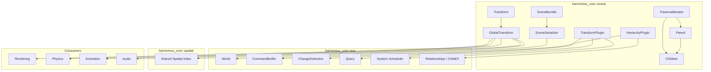
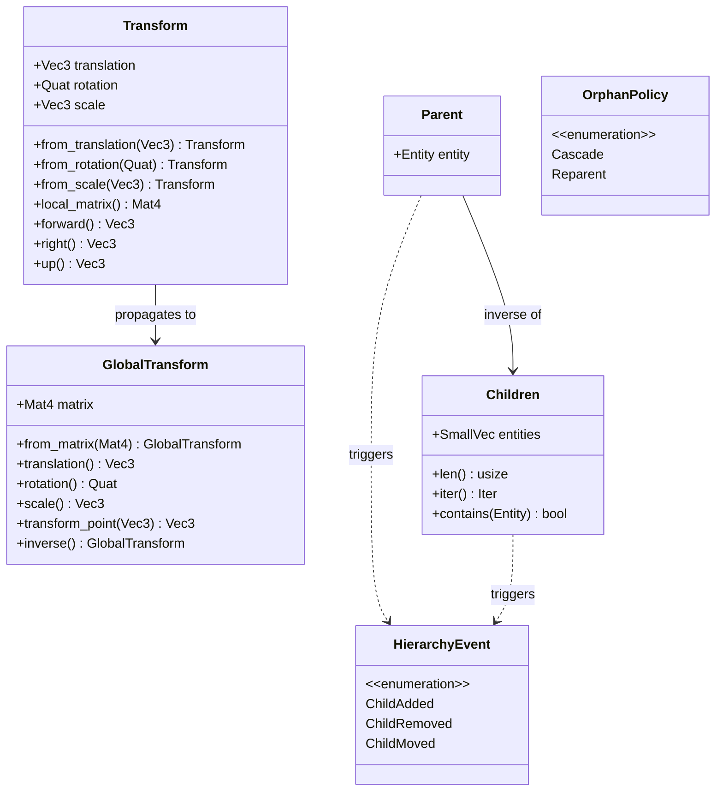
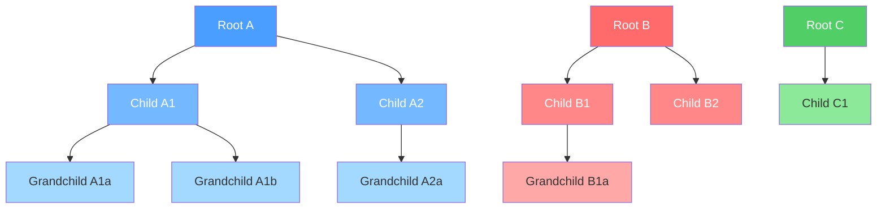
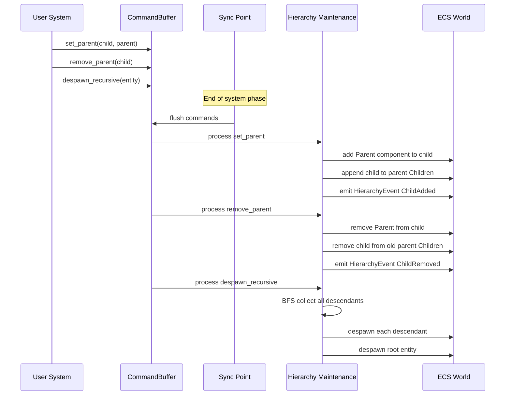
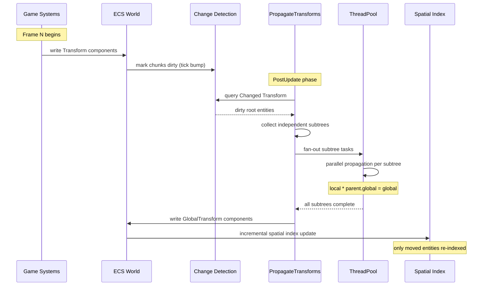
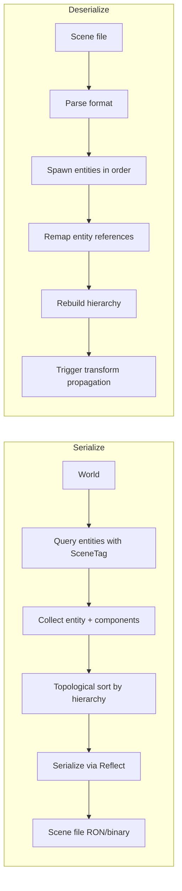

# Scene & Transforms Design

## Requirements Trace

> **Canonical sources:** Features, requirements, and user stories are defined in
> [features/core-runtime/](../../features/core-runtime/),
> [requirements/core-runtime/](../../requirements/core-runtime/), and
> [user-stories/core-runtime/](../../user-stories/core-runtime/). The table below traces design
> elements to those definitions.

| Feature | Requirement | User Stories | Description |
|---------|-------------|--------------|-------------|
| F-1.2.1 | R-1.2.1 | US-1.2.1, US-1.2.2 | Entity-based scene hierarchy with parent-child ECS relationships and batched modifications |
| F-1.2.2 | R-1.2.2, R-1.2.2a | US-1.2.3, US-1.2.4 | Allocation-free DFS/BFS traversal iterators with early termination and subtree skipping |
| F-1.2.3 | R-1.2.3 | US-1.2.5, US-1.2.6 | Cascading lifecycle propagation with optional orphan-on-delete semantics |
| F-1.2.4 | R-1.2.4, R-1.2.4a | US-1.2.7, US-1.2.8, US-1.2.13 | Parallel hierarchical transform propagation with iterative top-down traversal |
| F-1.2.5 | R-1.2.5 | US-1.2.9, US-1.2.10 | Dirty tracking via ECS tick-based change detection to skip static subtrees |
| F-1.2.6 | R-1.2.6 | US-1.2.11 | Spatial partitioning delegated to shared BVH spatial index (F-1.9.1) |
| F-1.2.7 | R-1.2.7 | US-1.2.12 | Spatial scene queries combining spatial and ECS archetype filtering |

### Cross-Cutting Dependencies

| Dependency | Source | Consumed API |
|------------|--------|-------------|
| Entity lifecycle | F-1.1.11 | Generational `Entity` handles |
| ChildOf relationship | F-1.1.14, F-1.1.16 | Built-in parent-child hierarchy |
| Command buffers | F-1.1.32 | Deferred structural changes |
| Change detection | F-1.1.22 | Tick-based `Changed<T>` queries |
| Parallel iteration | F-1.1.20 | Chunk-level parallel query |
| System scheduling | F-1.1.25, F-1.1.26 | `PostUpdate` phase ordering |
| Shared spatial index | F-1.9.1, F-1.9.4 | BVH registration and query API |
| Reflection | F-1.3.1 | `Reflect` derive for serialization |
| Thread pool | F-14.3.1 | Scoped parallel task execution |

## Overview

The scene and transform system is the backbone connecting all spatial subsystems in the engine. It
defines how entities relate to each other hierarchically and how local positions compose into
world-space coordinates consumed by rendering, physics, animation, and audio.

The design follows three principles:

1. **Hierarchy is ECS-native.** Parent-child relationships use the ECS `ChildOf` relationship
   (F-1.1.16), not a separate tree. `Parent` and `Children` are derived components maintained
   automatically by the relationship system.
2. **Transform propagation is parallel and incremental.** Independent root subtrees are processed
   concurrently. Dirty tracking skips static geometry entirely.
3. **Scenes are serializable entity collections.** A scene is a tagged set of entities with their
   components and hierarchy, serialized through the reflection system.

### Key Abstractions

- **Transform** -- local position, rotation, and scale relative to the entity's parent. Stored as a
  Vec3 translation, Quat rotation, and Vec3 scale.
- **GlobalTransform** -- world-space 4x4 matrix derived by composing the entire ancestor chain. Read
  by rendering, physics, audio, and AI.
- **Hierarchy** -- parent-child relationships use the ECS `ChildOf` relationship (F-1.1.16), not a
  separate tree data structure. `Parent` and `Children` are derived components maintained
  automatically.
- **Dirty tracking** -- ECS tick-based change detection marks modified `Transform` components.
  Propagation skips entire subtrees whose root and descendants are all clean.
- **Propagation** -- parallel top-down traversal multiplies each parent's `GlobalTransform` by the
  child's `Transform` to produce the child's `GlobalTransform`. Independent root subtrees run as
  separate scoped tasks.

### Performance Targets (R-1.2.4a)

| Metric | Target |
|--------|--------|
| Propagation throughput | 2M+ entities/ms on 4 cores |
| Propagation latency | Same frame (no N+1 delay) |
| Dirty 1% of 1M entities | Under 0.5 ms total |
| Traversal (100K entities) | Zero heap allocations |
| Spatial query (100 frustum/frame) | Under 1 ms total |

## Architecture

### Module Boundaries



### File Layout

```text
harmonius_core/
├── scene/
│   ├── mod.rs             # Re-exports
│   ├── transform.rs       # Transform, GlobalTransform
│   ├── hierarchy.rs       # Parent, Children,
│   │                      # HierarchyEvent, commands
│   ├── propagation.rs     # propagate_transforms system
│   ├── traversal.rs       # DFS/BFS iterators
│   ├── scene.rs           # Scene, SceneBundle,
│   │                      # SceneSpawner
│   ├── serialization.rs   # Scene serialize/deserialize
│   └── plugin.rs          # TransformPlugin,
│                          # HierarchyPlugin
```

### Core Data Structures



### Parallel Propagation Strategy

Independent root subtrees are distributed across worker threads. Each color below represents a
separate parallel task — no synchronization needed between subtrees.



The algorithm:

1. Query all root entities (entities with `Transform` but no `Parent`).
2. Filter to roots whose subtree contains at least one dirty `Transform` (via change detection).
3. Fan out: assign each dirty root subtree to a scoped task on the thread pool.
4. Within each subtree, propagate top-down iteratively using an explicit stack (no recursion).
5. Skip clean sub-branches where no ancestor is dirty.

## API Design

### Transform Component

```rust
/// Local-space transform relative to the parent
/// entity (or world origin if no parent).
///
/// Modifying this component triggers change
/// detection, which drives incremental
/// GlobalTransform recomputation.
#[derive(
    Component, Clone, Copy, Debug, PartialEq,
    Reflect,
)]
pub struct Transform {
    /// Position relative to parent.
    pub translation: Vec3,
    /// Orientation relative to parent.
    pub rotation: Quat,
    /// Non-uniform scale relative to parent.
    pub scale: Vec3,
}

impl Transform {
    pub const IDENTITY: Self = Self {
        translation: Vec3::ZERO,
        rotation: Quat::IDENTITY,
        scale: Vec3::ONE,
    };

    pub fn from_translation(t: Vec3) -> Self {
        Self {
            translation: t,
            ..Self::IDENTITY
        }
    }

    pub fn from_rotation(r: Quat) -> Self {
        Self {
            rotation: r,
            ..Self::IDENTITY
        }
    }

    pub fn from_scale(s: Vec3) -> Self {
        Self {
            scale: s,
            ..Self::IDENTITY
        }
    }

    pub fn with_translation(
        mut self,
        t: Vec3,
    ) -> Self {
        self.translation = t;
        self
    }

    pub fn with_rotation(
        mut self,
        r: Quat,
    ) -> Self {
        self.rotation = r;
        self
    }

    pub fn with_scale(
        mut self,
        s: Vec3,
    ) -> Self {
        self.scale = s;
        self
    }

    /// Compute the 4x4 affine matrix for this
    /// local transform: T * R * S.
    pub fn local_matrix(&self) -> Mat4 {
        Mat4::from_scale_rotation_translation(
            self.scale,
            self.rotation,
            self.translation,
        )
    }

    /// Local forward direction (-Z in right-hand
    /// coordinate system).
    pub fn forward(&self) -> Vec3 {
        self.rotation * Vec3::NEG_Z
    }

    /// Local right direction (+X).
    pub fn right(&self) -> Vec3 {
        self.rotation * Vec3::X
    }

    /// Local up direction (+Y).
    pub fn up(&self) -> Vec3 {
        self.rotation * Vec3::Y
    }

    /// Rotate to face a target point (world-space
    /// direction from current translation).
    pub fn look_at(
        &mut self,
        target: Vec3,
        up: Vec3,
    ) {
        let forward = (target - self.translation)
            .normalize();
        self.rotation =
            Quat::from_rotation_arc(
                Vec3::NEG_Z, forward,
            );
        // Adjust roll to align with up vector.
        let right = forward.cross(up).normalize();
        let corrected_up =
            right.cross(forward).normalize();
        self.rotation = Quat::from_mat3(
            &Mat3::from_cols(
                right,
                corrected_up,
                -forward,
            ),
        );
    }

    /// Compose with a parent's GlobalTransform
    /// to produce this entity's GlobalTransform.
    pub fn compose(
        &self,
        parent_global: &GlobalTransform,
    ) -> GlobalTransform {
        GlobalTransform {
            matrix: parent_global.matrix
                * self.local_matrix(),
        }
    }
}

impl Default for Transform {
    fn default() -> Self {
        Self::IDENTITY
    }
}
```

### GlobalTransform Component

```rust
/// World-space transform computed by the
/// propagation system. Read-only for gameplay
/// systems — only the propagation system writes
/// this component.
///
/// Stored as a Mat4 to avoid repeated
/// decomposition during rendering and physics
/// queries. Decompose on demand via accessor
/// methods.
#[derive(
    Component, Clone, Copy, Debug, PartialEq,
    Reflect,
)]
pub struct GlobalTransform {
    /// World-space affine transformation matrix.
    pub matrix: Mat4,
}

impl GlobalTransform {
    pub const IDENTITY: Self = Self {
        matrix: Mat4::IDENTITY,
    };

    pub fn from_matrix(m: Mat4) -> Self {
        Self { matrix: m }
    }

    /// Extract world-space translation.
    pub fn translation(&self) -> Vec3 {
        self.matrix.col(3).truncate()
    }

    /// Extract world-space rotation.
    pub fn rotation(&self) -> Quat {
        let (_, r, _) =
            self.matrix.to_scale_rotation_translation();
        r
    }

    /// Extract world-space scale.
    pub fn scale(&self) -> Vec3 {
        let (s, _, _) =
            self.matrix.to_scale_rotation_translation();
        s
    }

    /// Transform a point from local to
    /// world space.
    pub fn transform_point(
        &self,
        point: Vec3,
    ) -> Vec3 {
        self.matrix
            .transform_point3(point)
    }

    /// Transform a direction vector (ignores
    /// translation).
    pub fn transform_direction(
        &self,
        dir: Vec3,
    ) -> Vec3 {
        self.matrix
            .transform_vector3(dir)
    }

    /// Compute the inverse world transform.
    pub fn inverse(&self) -> Self {
        Self {
            matrix: self.matrix.inverse(),
        }
    }

    /// World-space forward direction.
    pub fn forward(&self) -> Vec3 {
        self.rotation() * Vec3::NEG_Z
    }
}

impl Default for GlobalTransform {
    fn default() -> Self {
        Self::IDENTITY
    }
}
```

### GlobalTransform Size (Performance -- High)

`GlobalTransform` stores a full `Mat4` (64 bytes). For entities with uniform scale (the common
case), a compact TRS representation (Vec3 + Quat + f32 = 32 bytes) halves cache pressure during
propagation. Consider a `CompactGlobalTransform` variant with `Mat4` fallback for non-uniform scale.

### Hierarchy Components

```rust
/// Marks an entity as a child of another entity.
/// Backed by the ECS `ChildOf` relationship
/// (F-1.1.16). This is a derived view component
/// — maintained automatically when `ChildOf`
/// pairs are added or removed.
///
/// Each entity has at most one Parent (enforced
/// by the Exclusive property on ChildOf).
#[derive(
    Component, Clone, Copy, Debug, PartialEq,
    Reflect,
)]
pub struct Parent {
    pub entity: Entity,
}

/// Ordered list of child entities. Maintained
/// automatically as the inverse of Parent.
/// Stored inline for small hierarchies (up to 8
/// children) via SmallVec.
#[derive(
    Component, Clone, Debug, PartialEq, Reflect,
)]
pub struct Children {
    pub entities: SmallVec<[Entity; 8]>,
}

impl Children {
    pub fn len(&self) -> usize {
        self.entities.len()
    }

    pub fn is_empty(&self) -> bool {
        self.entities.is_empty()
    }

    pub fn iter(
        &self,
    ) -> impl Iterator<Item = &Entity> {
        self.entities.iter()
    }

    pub fn contains(&self, entity: Entity) -> bool {
        self.entities.contains(&entity)
    }
}

/// Events emitted when hierarchy changes occur.
#[derive(Clone, Debug, PartialEq, Reflect)]
pub enum HierarchyEvent {
    /// A child was added to a parent.
    ChildAdded {
        child: Entity,
        parent: Entity,
    },
    /// A child was removed from a parent.
    ChildRemoved {
        child: Entity,
        old_parent: Entity,
    },
    /// A child was moved from one parent to
    /// another.
    ChildMoved {
        child: Entity,
        old_parent: Entity,
        new_parent: Entity,
    },
}

/// Controls what happens to children when their
/// parent is despawned.
#[derive(
    Clone, Copy, Debug, PartialEq, Eq, Reflect,
)]
pub enum OrphanPolicy {
    /// Recursively despawn all descendants.
    /// This is the default (from ChildOf's
    /// OnDeleteTarget(Delete) property).
    Cascade,
    /// Reparent children to the world root
    /// (remove their Parent component).
    Reparent,
}
```

### Hierarchy Commands

```rust
/// Extension trait on CommandBuffer for hierarchy
/// operations. All mutations are deferred and
/// applied at the next sync point to avoid
/// iterator invalidation during parallel
/// iteration.
pub trait HierarchyCommands {
    /// Make `child` a child of `parent`.
    /// If `child` already has a parent, it is
    /// moved (old parent's Children updated).
    fn set_parent(
        &mut self,
        child: Entity,
        parent: Entity,
    );

    /// Remove `child` from its parent, making
    /// it a root entity.
    fn remove_parent(&mut self, child: Entity);

    /// Insert `child` at a specific index in
    /// the parent's Children list. Enables
    /// ordered siblings for UI and editor.
    fn insert_child(
        &mut self,
        parent: Entity,
        index: usize,
        child: Entity,
    );

    /// Despawn an entity and all its descendants
    /// recursively.
    fn despawn_recursive(&mut self, entity: Entity);

    /// Despawn an entity. Children are reparented
    /// to the world root instead of being
    /// destroyed.
    fn despawn_orphaning(&mut self, entity: Entity);
}
```

### Hierarchy Command Flow



### Traversal Iterators

```rust
/// Maximum tree depth for stack-allocated
/// traversal. Beyond this depth, the iterator
/// falls back to heap allocation (R-1.2.2a).
const MAX_STACK_DEPTH: usize = 256;

/// Depth at which a diagnostic warning is
/// emitted (R-1.2.2a).
const DEPTH_WARNING_THRESHOLD: usize = 128;

/// Depth-first traversal iterator over the
/// scene hierarchy. Allocation-free for trees
/// up to MAX_STACK_DEPTH levels.
pub struct DepthFirstIterator<'w> {
    /// Inline stack for allocation-free traversal.
    stack: SmallVec<
        [(Entity, u32); MAX_STACK_DEPTH]
    >,
    /// Read-only query handle for Children.
    children_query: &'w Query<&Children>,
    /// Whether to include the starting entity
    /// in results.
    include_root: bool,
    /// Current depth (for warning detection).
    max_depth_seen: u32,
}

impl<'w> DepthFirstIterator<'w> {
    pub fn new(
        root: Entity,
        children_query: &'w Query<&Children>,
        include_root: bool,
    ) -> Self;

    /// Skip the subtree rooted at the most
    /// recently yielded entity. The next call
    /// to `next()` will not descend into its
    /// children.
    pub fn skip_subtree(&mut self);
}

impl<'w> Iterator for DepthFirstIterator<'w> {
    type Item = HierarchyNode;

    fn next(&mut self) -> Option<Self::Item>;
}

/// Breadth-first traversal iterator.
pub struct BreadthFirstIterator<'w> {
    queue: SmallVec<
        [(Entity, u32); MAX_STACK_DEPTH]
    >,
    children_query: &'w Query<&Children>,
    include_root: bool,
    max_depth_seen: u32,
}

impl<'w> BreadthFirstIterator<'w> {
    pub fn new(
        root: Entity,
        children_query: &'w Query<&Children>,
        include_root: bool,
    ) -> Self;

    pub fn skip_subtree(&mut self);
}

impl<'w> Iterator for BreadthFirstIterator<'w> {
    type Item = HierarchyNode;

    fn next(&mut self) -> Option<Self::Item>;
}

/// Node yielded by traversal iterators.
#[derive(Clone, Copy, Debug)]
pub struct HierarchyNode {
    pub entity: Entity,
    pub depth: u32,
}
```

### Transform Propagation System

```rust
/// System that computes GlobalTransform from
/// the hierarchy of local Transform components.
///
/// Runs in the PostUpdate phase so that all
/// gameplay systems have finished writing
/// Transform before propagation begins.
///
/// Phase ordering:
///   PreUpdate -> Update -> PostUpdate
///                              |
///                  propagate_transforms (here)
///                              |
///                  update_spatial_index
///                              |
///                       PreRender
pub fn propagate_transforms(
    pool: Res<ThreadPool>,
    // Root entities: have Transform + GlobalTransform
    // but no Parent.
    root_query: Query<
        (Entity, &Transform, &mut GlobalTransform),
        (Without<Parent>, Changed<Transform>),
    >,
    // All root entities including unchanged
    // (needed to propagate to dirty children).
    all_roots: Query<
        (Entity, &Transform, &mut GlobalTransform),
        Without<Parent>,
    >,
    // Hierarchy queries.
    children_query: Query<&Children>,
    // Child entities with transforms.
    child_query: Query<
        (&Transform, &mut GlobalTransform, &Parent),
    >,
    // Change detection ticks.
    change_tick: Res<ChangeTick>,
) {
    // Phase 1: Update root entities whose
    // Transform changed. Roots have no parent,
    // so GlobalTransform = local Transform.
    for (entity, transform, mut global) in
        root_query.iter_mut()
    {
        global.matrix = transform.local_matrix();
    }

    // Phase 2: Collect root entities that need
    // subtree propagation. A root needs
    // propagation if either (a) its own Transform
    // changed, or (b) any descendant's Transform
    // changed.
    let dirty_roots: Vec<Entity> = all_roots
        .iter()
        .filter(|(e, _, _)| {
            subtree_has_dirty_transform(
                *e,
                &children_query,
                &child_query,
                &change_tick,
            )
        })
        .map(|(e, _, _)| e)
        .collect();

    // Phase 3: Parallel propagation of
    // independent subtrees using scoped tasks.
    pool.scope(|scope| {
        for root in &dirty_roots {
            let root_global = all_roots
                .get(*root)
                .unwrap()
                .2
                .matrix;

            scope.spawn(|| {
                propagate_subtree_iterative(
                    *root,
                    root_global,
                    &children_query,
                    &child_query,
                    &change_tick,
                );
            });
        }
    });
}

/// Iterative top-down propagation within a
/// single subtree. Uses an explicit stack to
/// avoid recursion and support arbitrary depth
/// without stack overflow (R-1.2.4).
///
/// Implementation uses iterative top-down
/// traversal with SmallVec stack to avoid
/// recursion.
fn propagate_subtree_iterative(
    root: Entity,
    root_global: Mat4,
    children_query: &Query<&Children>,
    child_query: &Query<
        (&Transform, &mut GlobalTransform, &Parent),
    >,
    change_tick: &ChangeTick,
) {
    /* ... */
}

/// Check if any entity in a subtree has a dirty
/// Transform. Used to skip entire root subtrees
/// that are fully static.
///
/// Implementation uses iterative BFS with
/// SmallVec queue to avoid recursion.
fn subtree_has_dirty_transform(
    root: Entity,
    children_query: &Query<&Children>,
    child_query: &Query<
        (&Transform, &mut GlobalTransform, &Parent),
    >,
    change_tick: &ChangeTick,
) -> bool {
    /* ... */
}
```

### Transform Bundle

```rust
/// Standard bundle for any entity that needs
/// spatial positioning. Adding Transform
/// automatically includes GlobalTransform
/// (via required components, F-1.1.10).
#[derive(Bundle, Default)]
pub struct TransformBundle {
    pub transform: Transform,
    pub global_transform: GlobalTransform,
}

/// Bundle for a spatial entity with hierarchy
/// support. Used when spawning entities that
/// will be children of other entities.
#[derive(Bundle, Default)]
pub struct SpatialBundle {
    pub transform: Transform,
    pub global_transform: GlobalTransform,
}
```

### Scene Types

```rust
/// A serializable collection of entities with
/// their components and hierarchy structure.
/// Scenes are loaded, instantiated (spawned into
/// a world), and can be nested.
pub struct Scene {
    /// The world containing the scene's entities.
    /// This is a staging world — entities are
    /// transferred to the target world on spawn.
    pub world: World,
}

impl Scene {
    pub fn new(world: World) -> Self {
        Self { world }
    }
}

/// Handle to a loaded scene asset.
#[derive(
    Clone, Debug, PartialEq, Eq, Hash, Reflect,
)]
pub struct SceneHandle {
    pub id: AssetId,
}

/// Spawns a scene into the world, remapping
/// entity references and rebuilding hierarchy.
pub struct SceneSpawner { /* ... */ }

impl SceneSpawner {
    /// Spawn all entities from a scene into the
    /// target world. Returns a mapping from
    /// scene-local entity IDs to world entity IDs.
    pub fn spawn(
        &mut self,
        scene: &Scene,
        world: &mut World,
    ) -> EntityMap;

    /// Spawn a scene as children of a given
    /// parent entity. All root entities in the
    /// scene become children of `parent`.
    pub fn spawn_as_child(
        &mut self,
        scene: &Scene,
        world: &mut World,
        parent: Entity,
    ) -> EntityMap;

    /// Despawn all entities that were spawned
    /// from a specific scene instance.
    pub fn despawn_instance(
        &mut self,
        instance: SceneInstanceId,
        world: &mut World,
    );
}

/// Maps scene-local entity IDs to world entity
/// IDs after spawning. Used to remap entity
/// references in components (e.g., Parent
/// targets).
pub struct EntityMap {
    map: HashMap<Entity, Entity>,
}

impl EntityMap {
    pub fn get(
        &self,
        scene_entity: Entity,
    ) -> Option<Entity>;

    pub fn insert(
        &mut self,
        scene_entity: Entity,
        world_entity: Entity,
    );

    pub fn len(&self) -> usize;
}

/// Opaque ID for a spawned scene instance.
/// Used to track and despawn all entities from
/// a single scene spawn.
#[derive(
    Clone, Copy, Debug, PartialEq, Eq, Hash,
)]
pub struct SceneInstanceId(u64);
```

### Scene Serialization

```rust
/// Serialize a set of entities and their
/// components into a Scene. Uses the Reflect
/// trait (F-1.3.1) for component serialization.
pub fn serialize_scene(
    world: &World,
    entities: &[Entity],
    type_registry: &TypeRegistry,
) -> Result<Scene, SceneError>;

/// Deserialize a Scene from a textual format
/// (RON). Binary companion files are loaded
/// separately for large data (meshes, textures).
pub fn deserialize_scene(
    data: &[u8],
    type_registry: &TypeRegistry,
) -> Result<Scene, SceneError>;

/// Errors during scene serialization or
/// deserialization.
#[derive(Debug)]
pub enum SceneError {
    /// A component type was not found in the
    /// type registry.
    UnknownComponent {
        type_name: String,
    },
    /// Entity reference in a component points
    /// to an entity not in the scene.
    DanglingEntityRef {
        entity: Entity,
        component: String,
    },
    /// Serialization format error.
    FormatError {
        message: String,
    },
    /// Cyclic hierarchy detected.
    CyclicHierarchy {
        entities: Vec<Entity>,
    },
}
```

### Plugin Registration

```rust
/// Registers Transform, GlobalTransform, Parent,
/// Children components. Adds the
/// propagate_transforms system to PostUpdate.
pub struct TransformPlugin;

impl Plugin for TransformPlugin {
    fn build(&self, app: &mut App) {
        app.register_component::<Transform>();
        app.register_component::<GlobalTransform>();
        app.register_component::<Parent>();
        app.register_component::<Children>();

        // Required component: Transform requires
        // GlobalTransform.
        app.register_required_component::<
            Transform,
            GlobalTransform,
        >();

        app.add_event::<HierarchyEvent>();

        app.add_system(
            propagate_transforms
                .in_phase(PostUpdate)
                .label("propagate_transforms"),
        );

        app.add_system(
            update_spatial_index
                .in_phase(PostUpdate)
                .after("propagate_transforms")
                .label("update_spatial_index"),
        );
    }
}

/// Registers hierarchy commands and lifecycle
/// cascading.
pub struct HierarchyPlugin {
    pub default_orphan_policy: OrphanPolicy,
}

impl Plugin for HierarchyPlugin {
    fn build(&self, app: &mut App) {
        // Register ChildOf relationship observers
        // that maintain Parent/Children components.
        app.add_observer(
            on_child_of_added
                .on_event::<OnAdd>()
                .with_components::<ChildOf>(),
        );
        app.add_observer(
            on_child_of_removed
                .on_event::<OnRemove>()
                .with_components::<ChildOf>(),
        );
    }
}
```

## Data Flow

### Transform Propagation Pipeline



### Phase Ordering

Transform propagation sits between gameplay and rendering in the system schedule:

| Phase | Systems | Notes |
|-------|---------|-------|
| PreUpdate | Input polling | Read input |
| Update | Gameplay, physics, animation | Write `Transform` |
| PostUpdate | `propagate_transforms` | Compute `GlobalTransform` |
| PostUpdate | `update_spatial_index` | Re-index moved entities |
| PreRender | Frustum culling, batching | Read `GlobalTransform` |
| Render | Draw calls | Read `GlobalTransform` |

### Scene Serialization Flow



### Entity Remap on Scene Spawn

When a scene is spawned into a world, entity references must be remapped:

1. Spawn each entity from the scene's staging world into the target world, recording the mapping
   (old ID -> new ID) in `EntityMap`.
2. Walk all spawned entities' components. For each component field of type `Entity`, look up the
   remapped ID and patch it.
3. Rebuild `Parent`/`Children` from the remapped `ChildOf` relationships.
4. Mark all spawned `Transform` components as dirty to trigger propagation in the next `PostUpdate`.

### Dirty Tracking Detail

The change detection system (F-1.1.22) tracks mutations at chunk granularity. When a system obtains
a mutable reference to `Transform` via `&mut Transform`, the ECS automatically bumps the chunk's
change tick.

The propagation system reads `Changed<Transform>` to identify dirty entities. Within a subtree, the
`ancestor_dirty` flag propagates downward:

| Parent dirty? | Self dirty? | Action |
|--------------|-------------|--------|
| No | No | Skip entirely |
| No | Yes | Recompute self + propagate down |
| Yes | No | Recompute self + propagate down |
| Yes | Yes | Recompute self + propagate down |

This means modification of a single leaf entity recomputes only that leaf's `GlobalTransform`.
Modification of a root recomputes the entire subtree. In typical open-world scenes where under 1% of
entities move per frame, this reduces propagation cost by 99%+.

## Platform Considerations

Transform propagation is platform-agnostic. SIMD acceleration of matrix multiplication is delegated
to the math library (`glam`). Non-send resources (e.g., Metal main-thread constraints) are handled
by the ECS scheduler, not transforms. Platform dependencies are indirect, through the thread pool.

### Parallel Propagation Scaling

| Platform | Workers | Parallel Threshold | Max Depth |
|----------|---------|--------------------|-----------|
| Mobile | 2-4 | 512 entities | 32 |
| Switch | 3 | 256 entities | 64 |
| Desktop | 4-16 | 128 entities | 256 |
| High-end | 16+ | 64 entities | 256 |

- **Parallel threshold**: subtrees smaller than this are processed inline rather than spawned as
  separate tasks (avoids scheduling overhead exceeding computation).
- **Max depth**: configurable per platform. The iterative propagation algorithm handles arbitrary
  depth without stack overflow, but deeper hierarchies should trigger a diagnostic warning (R-1.2.2a
  warns at depth 128).

### Memory Layout

| Component | Size | Alignment | Notes |
|-----------|------|-----------|-------|
| `Transform` | 40 bytes | 16 | Vec3 + Quat + Vec3 (with padding) |
| `GlobalTransform` | 64 bytes | 16 | Mat4 (4x4 f32) |
| `Parent` | 8 bytes | 4 | Single Entity (u32 index + u32 gen) |
| `Children` | 72 bytes | 8 | SmallVec inline (8 entities) |

The `Transform` and `GlobalTransform` components are stored in archetype tables with SoA layout.
During propagation, the hot path reads `Transform` and writes `GlobalTransform` in adjacent memory,
maximizing cache line utilization.

### SIMD Considerations

Matrix multiplication (`Mat4 * Mat4`) is the hot inner operation of propagation. The `glam` math
library provides SIMD-accelerated Mat4 operations on all platforms:

| Platform | SIMD | Notes |
|----------|------|-------|
| x86_64 | SSE2/AVX2 | Default on all x86 |
| ARM64 | NEON | Default on Apple Silicon, mobile |
| WASM | SIMD128 | Optional feature |

No custom SIMD code is needed; `glam` handles this transparently.

### Proposed Dependencies

| Crate | Purpose | Justification |
|-------|---------|---------------|
| `smallvec` | Inline-allocated small vectors | Traversal stacks and child lists without heap allocation |
| `glam` | Math types (Vec3, Quat, Mat4) | SIMD-accelerated transform composition on all platforms |

## Test Plan

### Unit Tests

| Test | Req | Description |
|------|-----|-------------|
| `test_transform_identity` | R-1.2.4 | `Transform::IDENTITY.local_matrix()` returns `Mat4::IDENTITY`. |
| `test_transform_compose_trs` | R-1.2.4 | Verify T * R * S composition matches reference matrix. |
| `test_global_transform_decompose` | R-1.2.4 | Round-trip: compose then decompose translation, rotation, scale. |
| `test_hierarchy_single_parent` | R-1.2.1 | Entity has at most one Parent. Setting a new parent removes the old one. |
| `test_children_ordering` | R-1.2.1 | Children list preserves insertion order after add/remove. |
| `test_set_parent_command` | R-1.2.1 | `set_parent` via command buffer adds Parent, updates Children, emits event. |
| `test_remove_parent_command` | R-1.2.1 | `remove_parent` removes Parent, updates old parent's Children, emits event. |
| `test_reparent_child` | R-1.2.1 | Moving a child to a new parent removes it from old parent's Children. |
| `test_cascade_despawn` | R-1.2.3 | Despawning parent recursively despawns 3-level hierarchy. |
| `test_orphan_on_delete` | R-1.2.3 | `despawn_orphaning` reparents children to root. |
| `test_no_orphaned_entities` | R-1.2.3 | After cascading delete, world contains zero orphaned entities. |
| `test_dfs_traversal_order` | R-1.2.2 | 5-level tree: verify DFS visit order matches expected sequence. |
| `test_bfs_traversal_order` | R-1.2.2 | 5-level tree: verify BFS visit order matches expected sequence. |
| `test_traversal_skip_subtree` | R-1.2.2 | Skip a subtree during DFS; verify skipped entities not visited. |
| `test_traversal_early_termination` | R-1.2.2 | Break after N nodes; verify only N nodes visited. |
| `test_traversal_256_depth` | R-1.2.2a | 256-level chain: verify zero heap allocations and correct traversal. |
| `test_traversal_300_depth_fallback` | R-1.2.2a | 300-level chain: verify correct traversal via heap fallback. |
| `test_traversal_depth_warning` | R-1.2.2a | 129-level tree: verify diagnostic warning fires. |
| `test_propagation_root_only` | R-1.2.4 | Root entity with no parent: `GlobalTransform == Transform.local_matrix()`. |
| `test_propagation_two_levels` | R-1.2.4 | Parent + child: child's GlobalTransform = parent.global * child.local. |
| `test_propagation_deep_chain` | R-1.2.4 | 50-level chain: verify leaf's GlobalTransform matches serial reference. |
| `test_propagation_no_stack_overflow` | R-1.2.4 | 1000-level chain: verify no stack overflow (iterative algorithm). |
| `test_dirty_tracking_unchanged` | R-1.2.5 | Unmodified entity: GlobalTransform not recomputed. |
| `test_dirty_leaf_only` | R-1.2.5 | Modify leaf only: only leaf's GlobalTransform recomputed. |
| `test_dirty_root_propagates` | R-1.2.5 | Modify root: all descendants recomputed. |
| `test_dirty_no_false_marks` | R-1.2.5 | Read-only access to Transform does not trigger dirty flag. |
| `test_scene_serialize_roundtrip` | R-1.2.1 | Serialize scene, deserialize, verify identical hierarchy and transforms. |
| `test_scene_entity_remap` | R-1.2.1 | Spawn scene: verify entity references in components are remapped. |
| `test_scene_spawn_as_child` | R-1.2.1 | Spawn scene under a parent: roots become children of target parent. |
| `test_scene_cyclic_detection` | R-1.2.1 | Attempt to serialize cyclic hierarchy: returns `CyclicHierarchy` error. |

### Integration Tests

| Test | Req | Description |
|------|-----|-------------|
| `test_parallel_propagation_correctness` | R-1.2.4 | 100K entities, mixed depths 1-50: parallel results match serial reference. |
| `test_propagation_same_frame` | R-1.2.4a | Modify Transform in Update, read GlobalTransform in PreRender: no 1-frame lag. |
| `test_hierarchy_during_parallel` | R-1.2.1 | Hierarchy modifications via commands during parallel iteration: no data races (run under ThreadSanitizer). |
| `test_spatial_index_after_propagation` | R-1.2.6 | After propagation, spatial query returns entities at correct world positions. |
| `test_scene_with_prefabs` | R-1.2.1 | Scene containing prefab instances: verify hierarchy and overrides preserved. |

### Benchmarks

| Benchmark | Target | Req |
|-----------|--------|-----|
| Propagation 2M entities, 4 cores | Under 1 ms | R-1.2.4a |
| Propagation 1M entities, 1% dirty | Under 0.5 ms | R-1.2.5 |
| Propagation 100K entities, 100% dirty | Under 0.1 ms | R-1.2.4a |
| DFS traversal 100K entities | Zero allocations | R-1.2.2 |
| BFS traversal 100K entities | Zero allocations | R-1.2.2 |
| `set_parent` 10K commands per frame | Under 0.2 ms | R-1.2.1 |
| Scene serialize 10K entities | Under 5 ms | R-1.2.1 |
| Scene spawn 10K entities | Under 5 ms | R-1.2.1 |
| Entity remap 10K references | Under 0.5 ms | R-1.2.1 |

## Open Questions

1. **GlobalTransform storage format** — The current design stores a full `Mat4` (64 bytes). An
   alternative is to store translation + rotation + scale separately (40 bytes), saving 24 bytes per
   entity but requiring recomposition for rendering. At 1M entities this is 24 MB. The Mat4 approach
   avoids per-frame decomposition cost. Need to benchmark both.
2. **Large subtree splitting** — When a single root has 100K+ descendants, fan-out at the root level
   yields only one task. Should we split large subtrees at depth 1 or 2 to improve parallelism? This
   adds synchronization complexity (children at the split boundary need the parent's GlobalTransform
   before they can proceed).
3. **Dirty subtree detection cost** — The current `subtree_has_dirty_transform` function does a full
   BFS to check if any descendant is dirty. For large static hierarchies this could be expensive. A
   per-root dirty flag (set by an observer on any descendant's Transform change) would be O(1) but
   adds complexity. Need to measure the BFS cost at scale.
4. **Scene format** — RON is human-readable but verbose. Binary is compact but not diff-friendly.
   The reflection system supports mixed textual+binary (constraints.md), but the exact scene file
   format (header structure, entity ordering, companion file layout) needs to be finalized in the
   serialization design (1.3).
5. **Hierarchy depth limits** — R-1.2.2a specifies a warning at depth 128 and stack-allocated
   traversal up to depth 256. Are there real-world game scenarios that exceed 256 levels? If not, we
   could hard-error instead of falling back to heap allocation.
6. **Transform interpolation** — For fixed timestep physics, should GlobalTransform store both the
   current and previous frame's matrices for rendering interpolation? Or should interpolation be
   handled by a separate `PreviousGlobalTransform` component?
