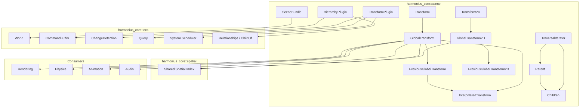
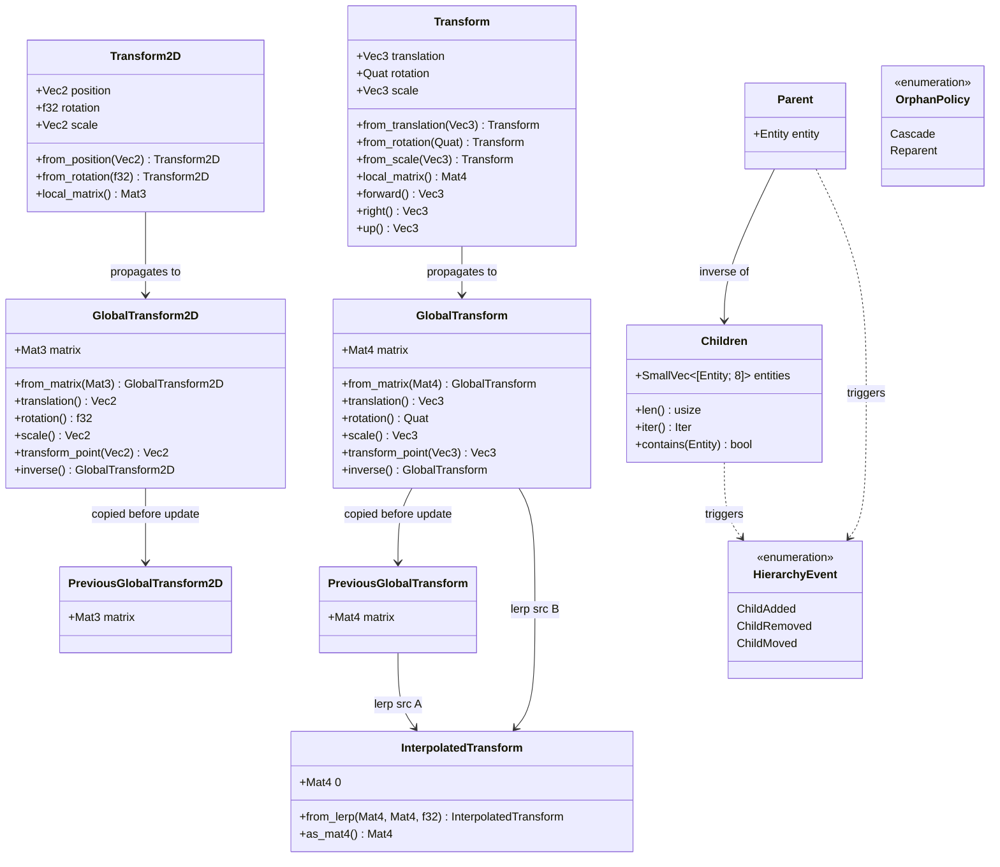
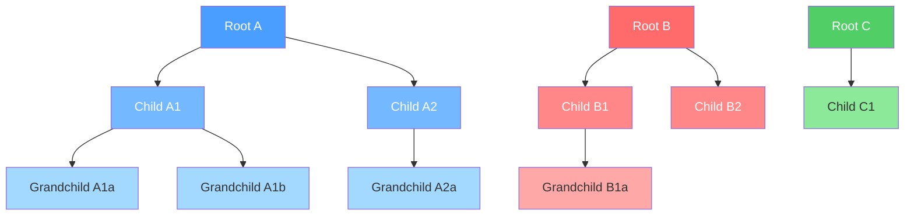
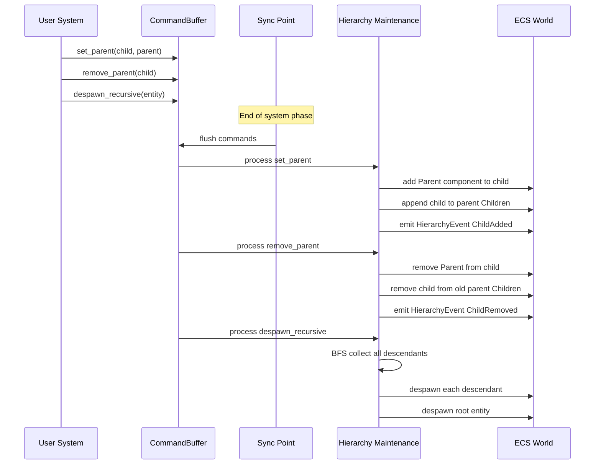
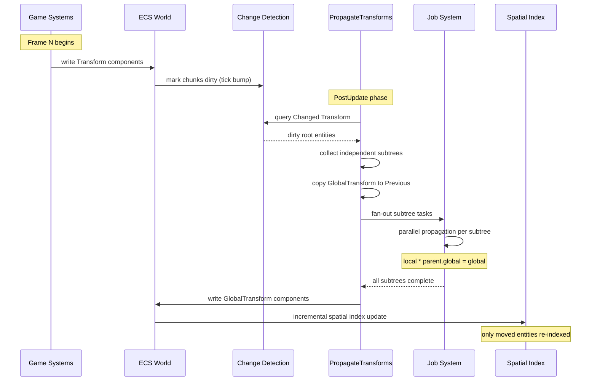
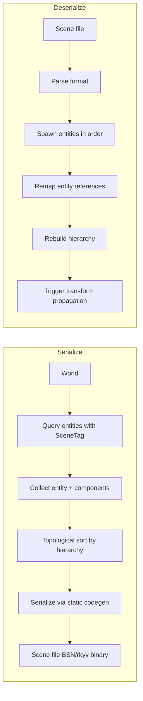
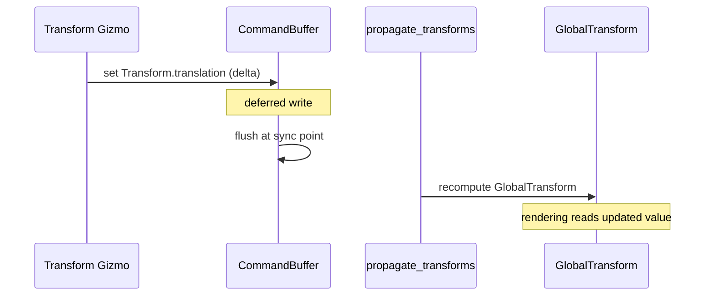

# Scene & Transforms Design

## Requirements Trace

> **Canonical sources:** Features, requirements, and user stories are defined in
> [features/core-runtime/](../../features/), [requirements/core-runtime/](../../requirements/), and
> [user-stories/core-runtime/](../../user-stories/). The table below traces design elements to those
> definitions.

| Feature | Requirement       | User Stories                  |
|---------|-------------------|-------------------------------|
| F-1.2.1 | R-1.2.1           | US-1.2.1, US-1.2.2            |
| F-1.2.2 | R-1.2.2, R-1.2.2a | US-1.2.3, US-1.2.4            |
| F-1.2.3 | R-1.2.3           | US-1.2.5, US-1.2.6            |
| F-1.2.4 | R-1.2.4, R-1.2.4a | US-1.2.7, US-1.2.8, US-1.2.13 |
| F-1.2.5 | R-1.2.5           | US-1.2.9, US-1.2.10           |
| F-1.2.6 | R-1.2.6           | US-1.2.11                     |
| F-1.2.7 | R-1.2.7           | US-1.2.12                     |

1. **F-1.2.1** — Entity-based scene hierarchy with parent-child ECS relationships and batched
   modifications
2. **F-1.2.2** — Allocation-free DFS/BFS traversal iterators with early termination and subtree
   skipping
3. **F-1.2.3** — Cascading lifecycle propagation with optional orphan-on-delete semantics
4. **F-1.2.4** — Parallel hierarchical transform propagation with iterative top-down traversal
5. **F-1.2.5** — Dirty tracking via ECS tick-based change detection to skip static subtrees
6. **F-1.2.6** — Spatial partitioning delegated to shared BVH spatial index (F-1.9.1)
7. **F-1.2.7** — Spatial scene queries combining spatial and ECS archetype filtering

### Cross-Cutting Dependencies

| Dependency | Source | Consumed API |
|------------|--------|-------------|
| Entity lifecycle | F-1.1.11 | Generational `Entity` handles |
| Command buffers | F-1.1.32 | Deferred structural changes |
| Change detection | F-1.1.22 | Tick-based `Changed<T>` queries |
| Parallel iteration | F-1.1.20 | Chunk-level parallel query |
| System scheduling | F-1.1.25, F-1.1.26 | `PostUpdate` phase ordering |
| Shared spatial index | F-1.9.1, F-1.9.4 | BVH registration and query API |
| Job system | F-14.3.1 | Scoped parallel task execution |

> **Canonical content.** This design is the canonical owner of: ChildOf relationship,
> Parent/Children derived components, hierarchy operations (set_parent, remove_parent, ancestors,
> descendants), HierarchyEvent, OrphanPolicy, HierarchyCommands, traversal iterators (DepthFirst,
> BreadthFirst), Transform, GlobalTransform, PreviousGlobalTransform, propagation system, dirty
> tracking, Scene, SceneSpawner, and EntityMap. The ECS design (ecs.md) cross-references this
> document for all hierarchy and scene content.

## Overview

The scene and transform system is the backbone connecting all spatial subsystems in the engine. It
defines how entities relate to each other hierarchically and how local positions compose into
world-space coordinates consumed by rendering, physics, animation, and audio.

The design follows three principles:

1. **Hierarchy is ECS-native.** Parent-child relationships use the ECS `ChildOf` relationship
   (F-1.1.16), not a separate tree. `Parent` and `Children` are derived components maintained
   automatically by the relationship system.
2. **Transform propagation is parallel and incremental.** Independent root subtrees are processed
   concurrently. Dirty tracking skips static geometry entirely.
3. **Scenes are serializable entity collections.** A scene is a tagged set of entities with their
   components and hierarchy, serialized through static codegen (generated rkyv archives and
   `remap_entities()` methods).

### Key Abstractions

- **Transform** -- local position, rotation, and scale relative to the entity's parent. Stored as a
  Vec3 translation, Quat rotation, and Vec3 scale.
- **GlobalTransform** -- world-space 4x4 matrix derived by composing the entire ancestor chain. Read
  by rendering, physics, audio, and AI.
- **Transform2D** -- local 2D position, rotation, and scale for 2D/2.5D entities. Uses Vec2
  position, f32 rotation, and Vec2 scale. Propagates as Mat3 through the hierarchy.
- **Hierarchy** -- parent-child relationships use the ECS `ChildOf` relationship (F-1.1.16), not a
  separate tree data structure. `Parent` and `Children` are derived components maintained
  automatically.
- **Dirty tracking** -- ECS tick-based change detection marks modified `Transform` components.
  Propagation skips entire subtrees whose root and descendants are all clean.
- **Propagation** -- parallel top-down traversal multiplies each parent's `GlobalTransform` by the
  child's `Transform` to produce the child's `GlobalTransform`. Independent root subtrees run as
  separate scoped tasks.

### Performance Targets (R-1.2.4a)

| Metric | Target |
|--------|--------|
| Propagation throughput | 2M+ entities/ms on 4 cores |
| Propagation latency | Same frame (no N+1 delay) |
| Dirty 1% of 1M entities | Under 0.5 ms total |
| Traversal (100K entities) | Zero heap allocations |
| Spatial query (100 frustum/frame) | Under 1 ms total |

## Architecture

### Module Boundaries



### File Layout

```text
harmonius_core/
├── scene/
│   ├── mod.rs             # Re-exports
│   ├── transform.rs       # Transform, GlobalTransform
│   ├── transform2d.rs     # Transform2D, GlobalTransform2D
│   ├── hierarchy.rs       # Parent, Children,
│   │                      # HierarchyEvent, commands
│   ├── propagation.rs     # propagate_transforms system
│   ├── traversal.rs       # DFS/BFS iterators
│   ├── scene.rs           # Scene, SceneBundle,
│   │                      # SceneSpawner
│   ├── serialization.rs   # Scene serialize/deserialize
│   └── plugin.rs          # TransformPlugin,
│                          # HierarchyPlugin
```

### Core Data Structures



### Parallel Propagation Strategy

Independent root subtrees are distributed across worker threads. Each color below represents a
separate parallel task — no synchronization needed between subtrees.



The algorithm:

1. Query all root entities (entities with `Transform` but no `Parent`).
2. Filter to roots whose subtree contains at least one dirty `Transform` (via change detection).
3. Fan out: assign each dirty root subtree to a scoped task via `job_system::scope()`.
4. Within each subtree, propagate top-down iteratively using an explicit stack (no recursion).
5. Skip clean sub-branches where no ancestor is dirty.

#### Parallel Safety (Disjoint Subtree Invariant)

Multiple scoped tasks share a query containing `&mut GlobalTransform` and
`&mut PreviousGlobalTransform`. Disjoint access is guaranteed by the hierarchy invariant:

1. Each root subtree is processed by exactly one task.
2. Subtrees are disjoint -- no entity appears in two subtrees because each entity has exactly one
   parent (enforced by `ChildOf`'s `Exclusive` property).
3. The hierarchy is acyclic (enforced by `ChildOf`'s `Acyclic` property).
4. Therefore no two tasks access the same `GlobalTransform` or `PreviousGlobalTransform`.

A future `par_iter_disjoint` job system primitive could encode this invariant at the API level.

## API Design

### Transform Component

```rust
/// Local-space transform relative to the parent
/// entity (or world origin if no parent).
///
/// Modifying this component triggers change
/// detection, which drives incremental
/// GlobalTransform recomputation.
#[derive(
    Component, Clone, Copy, Debug, PartialEq,
)]
pub struct Transform {
    /// Position relative to parent.
    pub translation: Vec3,
    /// Orientation relative to parent.
    pub rotation: Quat,
    /// Non-uniform scale relative to parent.
    pub scale: Vec3,
}

impl Transform {
    pub const IDENTITY: Self = Self {
        translation: Vec3::ZERO,
        rotation: Quat::IDENTITY,
        scale: Vec3::ONE,
    };

    pub fn from_translation(t: Vec3) -> Self {
        Self {
            translation: t,
            ..Self::IDENTITY
        }
    }

    pub fn from_rotation(r: Quat) -> Self {
        Self {
            rotation: r,
            ..Self::IDENTITY
        }
    }

    pub fn from_scale(s: Vec3) -> Self {
        Self {
            scale: s,
            ..Self::IDENTITY
        }
    }

    pub fn with_translation(
        mut self,
        t: Vec3,
    ) -> Self {
        self.translation = t;
        self
    }

    pub fn with_rotation(
        mut self,
        r: Quat,
    ) -> Self {
        self.rotation = r;
        self
    }

    pub fn with_scale(
        mut self,
        s: Vec3,
    ) -> Self {
        self.scale = s;
        self
    }

    /// Compute the 4x4 affine matrix for this
    /// local transform: T * R * S.
    pub fn local_matrix(&self) -> Mat4 {
        Mat4::from_scale_rotation_translation(
            self.scale,
            self.rotation,
            self.translation,
        )
    }

    /// Local forward direction (-Z in right-hand
    /// coordinate system).
    pub fn forward(&self) -> Vec3 {
        self.rotation * Vec3::NEG_Z
    }

    /// Local right direction (+X).
    pub fn right(&self) -> Vec3 {
        self.rotation * Vec3::X
    }

    /// Local up direction (+Y).
    pub fn up(&self) -> Vec3 {
        self.rotation * Vec3::Y
    }

    /// Rotate to face a target point (world-space
    /// direction from current translation).
    pub fn look_at(
        &mut self,
        target: Vec3,
        up: Vec3,
    ) {
        let forward = (target - self.translation)
            .normalize();
        self.rotation =
            Quat::from_rotation_arc(
                Vec3::NEG_Z, forward,
            );
        // Adjust roll to align with up vector.
        let right = forward.cross(up).normalize();
        let corrected_up =
            right.cross(forward).normalize();
        self.rotation = Quat::from_mat3(
            &Mat3::from_cols(
                right,
                corrected_up,
                -forward,
            ),
        );
    }

    /// Compose with a parent's GlobalTransform
    /// to produce this entity's GlobalTransform.
    pub fn compose(
        &self,
        parent_global: &GlobalTransform,
    ) -> GlobalTransform {
        GlobalTransform {
            matrix: parent_global.matrix
                * self.local_matrix(),
        }
    }
}

impl Default for Transform {
    fn default() -> Self {
        Self::IDENTITY
    }
}
```

### Transform2D Component

```rust
/// Local-space 2D transform relative to the
/// parent entity (or world origin if no parent).
///
/// Used for 2D and 2.5D games. The hierarchy
/// system (ChildOf) works identically to 3D —
/// propagation multiplies Mat3 instead of Mat4.
/// 2D and 3D entities can coexist in the same
/// World; a 2.5D game might use Transform2D for
/// gameplay entities and Transform for 3D
/// decorative elements.
#[derive(
    Component, Clone, Copy, Debug, PartialEq,
)]
pub struct Transform2D {
    /// Position relative to parent.
    pub position: Vec2,
    /// Rotation in radians relative to parent.
    pub rotation: f32,
    /// Scale relative to parent.
    pub scale: Vec2,
}

impl Transform2D {
    pub const IDENTITY: Self = Self {
        position: Vec2::ZERO,
        rotation: 0.0,
        scale: Vec2::ONE,
    };

    pub fn from_position(p: Vec2) -> Self {
        Self { position: p, ..Self::IDENTITY }
    }

    pub fn from_rotation(r: f32) -> Self {
        Self { rotation: r, ..Self::IDENTITY }
    }

    /// Compute the 3x3 affine matrix for this
    /// local 2D transform: T * R * S.
    pub fn local_matrix(&self) -> Mat3 {
        Mat3::from_scale_angle_translation(
            self.scale,
            self.rotation,
            self.position,
        )
    }

    /// Compose with a parent's GlobalTransform2D
    /// to produce this entity's GlobalTransform2D.
    pub fn compose(
        &self,
        parent_global: &GlobalTransform2D,
    ) -> GlobalTransform2D {
        GlobalTransform2D {
            matrix: parent_global.matrix
                * self.local_matrix(),
        }
    }
}

impl Default for Transform2D {
    fn default() -> Self {
        Self::IDENTITY
    }
}
```

### GlobalTransform Component

```rust
/// World-space transform computed by the
/// propagation system. Read-only for gameplay
/// systems — only the propagation system writes
/// this component.
///
/// Stored as a Mat4 to avoid repeated
/// decomposition during rendering and physics
/// queries. Decompose on demand via accessor
/// methods.
#[derive(
    Component, Clone, Copy, Debug, PartialEq,
)]
pub struct GlobalTransform {
    /// World-space affine transformation matrix.
    pub matrix: Mat4,
}

impl GlobalTransform {
    pub const IDENTITY: Self = Self {
        matrix: Mat4::IDENTITY,
    };

    pub fn from_matrix(m: Mat4) -> Self {
        Self { matrix: m }
    }

    /// Extract world-space translation.
    pub fn translation(&self) -> Vec3 {
        self.matrix.col(3).truncate()
    }

    /// Extract world-space rotation.
    pub fn rotation(&self) -> Quat {
        let (_, r, _) =
            self.matrix.to_scale_rotation_translation();
        r
    }

    /// Extract world-space scale.
    pub fn scale(&self) -> Vec3 {
        let (s, _, _) =
            self.matrix.to_scale_rotation_translation();
        s
    }

    /// Transform a point from local to
    /// world space.
    pub fn transform_point(
        &self,
        point: Vec3,
    ) -> Vec3 {
        self.matrix
            .transform_point3(point)
    }

    /// Transform a direction vector (ignores
    /// translation).
    pub fn transform_direction(
        &self,
        dir: Vec3,
    ) -> Vec3 {
        self.matrix
            .transform_vector3(dir)
    }

    /// Compute the inverse world transform.
    pub fn inverse(&self) -> Self {
        Self {
            matrix: self.matrix.inverse(),
        }
    }

    /// World-space forward direction.
    pub fn forward(&self) -> Vec3 {
        self.rotation() * Vec3::NEG_Z
    }
}

impl Default for GlobalTransform {
    fn default() -> Self {
        Self::IDENTITY
    }
}
```

### GlobalTransform2D Component

```rust
/// World-space 2D transform computed by the
/// propagation system. Read-only for gameplay
/// systems — only the propagation system writes
/// this component.
#[derive(
    Component, Clone, Copy, Debug, PartialEq,
)]
pub struct GlobalTransform2D {
    /// World-space 2D affine transformation matrix.
    pub matrix: Mat3,
}

impl GlobalTransform2D {
    pub const IDENTITY: Self = Self {
        matrix: Mat3::IDENTITY,
    };

    pub fn from_matrix(m: Mat3) -> Self {
        Self { matrix: m }
    }

    /// Extract world-space translation.
    pub fn translation(&self) -> Vec2 {
        Vec2::new(
            self.matrix.z_axis.x,
            self.matrix.z_axis.y,
        )
    }

    /// Extract world-space rotation (radians).
    pub fn rotation(&self) -> f32 {
        self.matrix.x_axis.y.atan2(
            self.matrix.x_axis.x,
        )
    }

    /// Extract world-space scale.
    pub fn scale(&self) -> Vec2 {
        Vec2::new(
            self.matrix.x_axis.length(),
            self.matrix.y_axis.length(),
        )
    }

    /// Transform a point from local to
    /// world space.
    pub fn transform_point(
        &self,
        point: Vec2,
    ) -> Vec2 {
        (self.matrix
            * Vec3::new(point.x, point.y, 1.0))
        .truncate()
    }

    /// Compute the inverse world transform.
    pub fn inverse(&self) -> Self {
        Self {
            matrix: self.matrix.inverse(),
        }
    }
}

impl Default for GlobalTransform2D {
    fn default() -> Self {
        Self::IDENTITY
    }
}
```

### PreviousGlobalTransform Component

```rust
/// Stores the previous frame's world-space
/// transform for render interpolation between
/// fixed-timestep physics positions.
///
/// The propagation system copies the current
/// GlobalTransform into PreviousGlobalTransform
/// before computing the new value each frame.
/// Rendering interpolates between previous and
/// current: lerp(previous, current, alpha) where
/// alpha = accumulator / fixed_dt.
#[derive(
    Component, Clone, Copy, Debug, PartialEq,
)]
pub struct PreviousGlobalTransform {
    /// Previous frame's world-space matrix.
    pub matrix: Mat4,
}

impl PreviousGlobalTransform {
    pub const IDENTITY: Self = Self {
        matrix: Mat4::IDENTITY,
    };
}

impl Default for PreviousGlobalTransform {
    fn default() -> Self {
        Self::IDENTITY
    }
}

/// Stores the previous frame's 2D world-space
/// transform for render interpolation. Dual of
/// `PreviousGlobalTransform` for the 2D pipeline so
/// that 2D entities can interpolate between ticks
/// identically to 3D. The matrix is a `Mat3`
/// (column-major, 2D affine).
#[derive(
    Component, Clone, Copy, Debug, PartialEq,
)]
pub struct PreviousGlobalTransform2D {
    /// Previous frame's world-space 2D matrix.
    pub matrix: Mat3,
}

impl PreviousGlobalTransform2D {
    pub const IDENTITY: Self = Self {
        matrix: Mat3::IDENTITY,
    };
}

impl Default for PreviousGlobalTransform2D {
    fn default() -> Self {
        Self::IDENTITY
    }
}
```

### InterpolatedTransform Component

`InterpolatedTransform` is the finalized world-space transform handed to rendering. It is the lerp
between `PreviousGlobalTransform` and `GlobalTransform` using the game loop's `interp_alpha` (see
[game-loop.md](game-loop.md)). Because rendering reads only `InterpolatedTransform` and never raw
`GlobalTransform`, the render thread never sees a half-tick snapshot.

```rust
/// World-space transform the renderer actually uses.
///
/// Computed once per frame in Phase 7 of the game
/// loop (see game-loop.md) from
/// `PreviousGlobalTransform` and `GlobalTransform`
/// together with the current frame's
/// `interp_alpha`. Never written to by gameplay,
/// physics, or animation systems. Read-only for
/// all consumers after Phase 7.
#[derive(
    Component, Clone, Copy, Debug, PartialEq,
)]
pub struct InterpolatedTransform(pub Mat4);

impl InterpolatedTransform {
    pub const IDENTITY: Self = Self(Mat4::IDENTITY);

    pub fn from_lerp(
        previous: Mat4,
        current: Mat4,
        alpha: f32,
    ) -> Self {
        Self(previous.lerp(current, alpha))
    }

    pub fn as_mat4(&self) -> Mat4 { self.0 }
}

impl Default for InterpolatedTransform {
    fn default() -> Self { Self::IDENTITY }
}
```

### Transform Interpolation for Rendering

The Phase 7 Render-Frame Snapshot pass (see [game-loop.md](game-loop.md)) computes
`InterpolatedTransform` for every entity that has both `PreviousGlobalTransform` and
`GlobalTransform`, using the game loop's `interp_alpha`:

```rust
// Phase 7 render-frame pass (see game-loop.md):
let alpha = fixed_timestep.alpha();
for (prev, current, interpolated) in query.iter::<(
    &PreviousGlobalTransform,
    &GlobalTransform,
    &mut InterpolatedTransform,
)>() {
    *interpolated = InterpolatedTransform::from_lerp(
        prev.matrix, current.matrix, alpha,
    );
}
```

The 2D dual is identical in structure: any entity with both `PreviousGlobalTransform2D` and
`GlobalTransform2D` has its `InterpolatedTransform` filled by lifting the `Mat3` into a `Mat4`
before the lerp, keeping the renderer's consumption uniform between 2D and 3D entities. See
[game-loop.md](game-loop.md) for how `interp_alpha` is produced by `FixedTimestep::alpha()` and how
the resulting `InterpolatedTransform` feeds `RenderFrame::transforms`.

### GlobalTransform Size (Performance -- High)

`GlobalTransform` stores a full `Mat4` (64 bytes). For entities with uniform scale (the common
case), a compact TRS representation (Vec3 + Quat + f32 = 32 bytes) halves cache pressure during
propagation. Consider a `CompactGlobalTransform` variant with `Mat4` fallback for non-uniform scale.

### Hierarchy Components

```rust
/// Marks an entity as a child of another entity.
/// Backed by the ECS `ChildOf` relationship
/// (F-1.1.16). This is a derived view component
/// — maintained automatically when `ChildOf`
/// pairs are added or removed.
///
/// Each entity has at most one Parent (enforced
/// by the Exclusive property on ChildOf).
#[derive(
    Component, Clone, Copy, Debug, PartialEq,
)]
pub struct Parent {
    pub entity: Entity,
}

/// Ordered list of child entities. Maintained
/// automatically as the inverse of Parent.
/// Stored as a SmallVec of child entity handles.
#[derive(
    Component, Clone, Debug, PartialEq,
)]
pub struct Children {
    pub entities: SmallVec<[Entity; 8]>,
}

impl Children {
    pub fn len(&self) -> usize {
        self.entities.len()
    }

    pub fn is_empty(&self) -> bool {
        self.entities.is_empty()
    }

    pub fn iter(
        &self,
    ) -> impl Iterator<Item = &Entity> {
        self.entities.iter()
    }

    pub fn contains(&self, entity: Entity) -> bool {
        self.entities.contains(&entity)
    }
}

/// Events emitted when hierarchy changes occur.
#[derive(Clone, Debug, PartialEq)]
pub enum HierarchyEvent {
    /// A child was added to a parent.
    ChildAdded {
        child: Entity,
        parent: Entity,
    },
    /// A child was removed from a parent.
    ChildRemoved {
        child: Entity,
        old_parent: Entity,
    },
    /// A child was moved from one parent to
    /// another.
    ChildMoved {
        child: Entity,
        old_parent: Entity,
        new_parent: Entity,
    },
}

/// Controls what happens to children when their
/// parent is despawned.
#[derive(
    Clone, Copy, Debug, PartialEq, Eq,
)]
pub enum OrphanPolicy {
    /// Recursively despawn all descendants.
    /// This is the default (from ChildOf's
    /// OnDeleteTarget(Delete) property).
    Cascade,
    /// Reparent children to the world root
    /// (remove their Parent component).
    Reparent,
}
```

### Hierarchy Commands

```rust
/// Extension trait on CommandBuffer for hierarchy
/// operations. All mutations are deferred and
/// applied at the next sync point to avoid
/// iterator invalidation during parallel
/// iteration.
pub trait HierarchyCommands {
    /// Make `child` a child of `parent`.
    /// If `child` already has a parent, it is
    /// moved (old parent's Children updated).
    fn set_parent(
        &mut self,
        child: Entity,
        parent: Entity,
    );

    /// Remove `child` from its parent, making
    /// it a root entity.
    fn remove_parent(&mut self, child: Entity);

    /// Insert `child` at a specific index in
    /// the parent's Children list. Enables
    /// ordered siblings for UI and editor.
    fn insert_child(
        &mut self,
        parent: Entity,
        index: usize,
        child: Entity,
    );

    /// Despawn an entity and all its descendants
    /// recursively.
    fn despawn_recursive(&mut self, entity: Entity);

    /// Despawn an entity. Children are reparented
    /// to the world root instead of being
    /// destroyed.
    fn despawn_orphaning(&mut self, entity: Entity);
}
```

### Hierarchy Command Flow



### Traversal Iterators

```rust
/// Maximum tree depth for stack-allocated
/// traversal. Beyond this depth, the iterator
/// falls back to heap allocation (R-1.2.2a).
const MAX_STACK_DEPTH: usize = 256;

/// Depth at which a diagnostic warning is
/// emitted (R-1.2.2a).
const DEPTH_WARNING_THRESHOLD: usize = 128;

/// Depth-first traversal iterator over the
/// scene hierarchy. Allocation-free for trees
/// up to MAX_STACK_DEPTH levels.
pub struct DepthFirstIterator<'w> {
    /// Inline stack for allocation-free traversal.
    stack: SmallVec<[(Entity, u32); 256]>,
    /// Read-only query handle for Children.
    children_query: &'w Query<&Children>,
    /// Whether to include the starting entity
    /// in results.
    include_root: bool,
    /// Current depth (for warning detection).
    max_depth_seen: u32,
}

impl<'w> DepthFirstIterator<'w> {
    pub fn new(
        root: Entity,
        children_query: &'w Query<&Children>,
        include_root: bool,
    ) -> Self;

    /// Skip the subtree rooted at the most
    /// recently yielded entity. The next call
    /// to `next()` will not descend into its
    /// children.
    pub fn skip_subtree(&mut self);
}

impl<'w> Iterator for DepthFirstIterator<'w> {
    type Item = HierarchyNode;

    fn next(&mut self) -> Option<Self::Item>;
}

/// Breadth-first traversal iterator.
pub struct BreadthFirstIterator<'w> {
    queue: SmallVec<[(Entity, u32); 256]>,
    children_query: &'w Query<&Children>,
    include_root: bool,
    max_depth_seen: u32,
}

impl<'w> BreadthFirstIterator<'w> {
    pub fn new(
        root: Entity,
        children_query: &'w Query<&Children>,
        include_root: bool,
    ) -> Self;

    pub fn skip_subtree(&mut self);
}

impl<'w> Iterator for BreadthFirstIterator<'w> {
    type Item = HierarchyNode;

    fn next(&mut self) -> Option<Self::Item>;
}

/// Node yielded by traversal iterators.
#[derive(Clone, Copy, Debug)]
pub struct HierarchyNode {
    pub entity: Entity,
    pub depth: u32,
}
```

### Transform Propagation System

```rust
/// System that computes GlobalTransform from
/// the hierarchy of local Transform components.
///
/// Runs in the PostUpdate phase so that all
/// gameplay systems have finished writing
/// Transform before propagation begins.
///
/// Phase ordering:
///   PreUpdate -> Update -> PostUpdate
///                              |
///                  propagate_transforms (here)
///                              |
///                  update_spatial_index
///                              |
///                       PreRender
pub fn propagate_transforms(
    // Root entities: have Transform + GlobalTransform
    // but no Parent.
    root_query: Query<
        (Entity, &Transform, &mut GlobalTransform,
         &mut PreviousGlobalTransform),
        (Without<Parent>, Changed<Transform>),
    >,
    // All root entities including unchanged
    // (needed to propagate to dirty children).
    all_roots: Query<
        (Entity, &Transform, &mut GlobalTransform,
         &mut PreviousGlobalTransform),
        Without<Parent>,
    >,
    // Hierarchy queries.
    children_query: Query<&Children>,
    // Child entities with transforms.
    child_query: Query<
        (&Transform, &mut GlobalTransform,
         &mut PreviousGlobalTransform, &Parent),
    >,
    // Change detection ticks.
    change_tick: Res<ChangeTick>,
) {
    // Phase 1: Update root entities whose
    // Transform changed. Roots have no parent,
    // so GlobalTransform = local Transform.
    // Copy current to previous before overwriting.
    for (entity, transform, mut global,
         mut previous) in root_query.iter_mut()
    {
        previous.matrix = global.matrix;
        global.matrix = transform.local_matrix();
    }

    // Phase 2: Collect root entities that need
    // subtree propagation. A root needs
    // propagation if either (a) its own Transform
    // changed, or (b) any descendant's Transform
    // changed.
    let dirty_roots: Vec<Entity> = all_roots
        .iter()
        .filter(|(e, _, _, _)| {
            subtree_has_dirty_transform(
                *e,
                &children_query,
                &child_query,
                &change_tick,
            )
        })
        .map(|(e, _, _, _)| e)
        .collect();

    // Phase 3: Parallel propagation of
    // independent subtrees using scoped tasks.
    // Safety: see "Parallel Safety (Disjoint
    // Subtree Invariant)" above.
    job_system::scope(|scope| {
        for root in &dirty_roots {
            let root_global = all_roots
                .get(*root)
                .unwrap()
                .2
                .matrix;

            scope.spawn(|| {
                propagate_subtree_iterative(
                    *root,
                    root_global,
                    &children_query,
                    &child_query,
                    &change_tick,
                );
            });
        }
    });
}

/// Iterative top-down propagation within a
/// single subtree. Uses an explicit stack to
/// avoid recursion and support arbitrary depth
/// without stack overflow (R-1.2.4).
///
/// For each entity, copies current
/// GlobalTransform to PreviousGlobalTransform
/// before computing the new value.
///
/// Implementation uses iterative top-down
/// traversal with Vec stack to avoid
/// recursion.
fn propagate_subtree_iterative(
    root: Entity,
    root_global: Mat4,
    children_query: &Query<&Children>,
    child_query: &Query<
        (&Transform, &mut GlobalTransform,
         &mut PreviousGlobalTransform, &Parent),
    >,
    change_tick: &ChangeTick,
) {
    /* ... */
}

/// Check if any entity in a subtree has a dirty
/// Transform. Used to skip entire root subtrees
/// that are fully static.
///
/// Implementation uses iterative BFS with
/// Vec queue to avoid recursion.
fn subtree_has_dirty_transform(
    root: Entity,
    children_query: &Query<&Children>,
    child_query: &Query<
        (&Transform, &mut GlobalTransform,
         &mut PreviousGlobalTransform, &Parent),
    >,
    change_tick: &ChangeTick,
) -> bool {
    /* ... */
}
```

### Transform Bundle

```rust
/// Standard bundle for any entity that needs
/// 3D spatial positioning. Adding Transform
/// automatically includes GlobalTransform and
/// PreviousGlobalTransform (via required
/// components, F-1.1.10).
#[derive(Bundle, Default)]
pub struct TransformBundle {
    pub transform: Transform,
    pub global_transform: GlobalTransform,
    pub previous_global_transform:
        PreviousGlobalTransform,
}

/// Standard bundle for any entity that needs
/// 2D spatial positioning.
#[derive(Bundle, Default)]
pub struct TransformBundle2D {
    pub transform: Transform2D,
    pub global_transform: GlobalTransform2D,
    pub previous_global_transform:
        PreviousGlobalTransform2D,
}
```

> **Note:** `SpatialBundle` has been removed. It was identical to `TransformBundle` and provided no
> additional differentiation. Use `TransformBundle` for 3D entities and `TransformBundle2D` for 2D
> entities. Add `Visibility` or other spatial components explicitly when needed.

### Scene Types

```rust
/// A serializable collection of entities with
/// their components and hierarchy structure.
/// Scenes are loaded, instantiated (spawned into
/// a world), and can be nested.
pub struct Scene {
    /// The world containing the scene's entities.
    /// This is a staging world — entities are
    /// transferred to the target world on spawn.
    pub world: World,
}

impl Scene {
    pub fn new(world: World) -> Self {
        Self { world }
    }
}

/// Handle to a loaded scene asset.
#[derive(
    Clone, Debug, PartialEq, Eq, Hash,
)]
pub struct SceneHandle {
    pub id: AssetId,
}

/// Spawns a scene into the world, remapping
/// entity references and rebuilding hierarchy.
pub struct SceneSpawner { /* ... */ }

impl SceneSpawner {
    /// Spawn all entities from a scene into the
    /// target world. Returns a mapping from
    /// scene-local entity IDs to world entity IDs.
    pub fn spawn(
        &mut self,
        scene: &Scene,
        world: &mut World,
    ) -> EntityMap;

    /// Spawn a scene as children of a given
    /// parent entity. All root entities in the
    /// scene become children of `parent`.
    pub fn spawn_as_child(
        &mut self,
        scene: &Scene,
        world: &mut World,
        parent: Entity,
    ) -> EntityMap;

    /// Despawn all entities that were spawned
    /// from a specific scene instance.
    pub fn despawn_instance(
        &mut self,
        instance: SceneInstanceId,
        world: &mut World,
    );
}

/// Maps scene-local entity IDs to world entity
/// IDs after spawning. Used to remap entity
/// references in components (e.g., Parent
/// targets).
pub struct EntityMap {
    map: HashMap<Entity, Entity>,
}

impl EntityMap {
    pub fn get(
        &self,
        scene_entity: Entity,
    ) -> Option<Entity>;

    pub fn insert(
        &mut self,
        scene_entity: Entity,
        world_entity: Entity,
    );

    pub fn len(&self) -> usize;
}

/// Opaque ID for a spawned scene instance.
/// Used to track and despawn all entities from
/// a single scene spawn.
#[derive(
    Clone, Copy, Debug, PartialEq, Eq, Hash,
)]
pub struct SceneInstanceId(u64);
```

### Scene Serialization

> Scene serialization and deserialization APIs are defined in the serialization design (Design #8,
> reflection-serialization). This design defines the format-agnostic types (`Scene`, `SceneSpawner`,
> `EntityMap`) above. Entity remap uses generated `remap_entities(&mut self, map: &EntityMap)`
> methods on each component (static codegen, no reflection). Binary persistence uses rkyv for
> zero-copy mmap access.

### Plugin Registration

```rust
/// Registers Transform, GlobalTransform,
/// PreviousGlobalTransform, Transform2D,
/// GlobalTransform2D, PreviousGlobalTransform2D,
/// Parent, and Children components. Adds the
/// propagate_transforms system to PostUpdate.
pub struct TransformPlugin;

impl Plugin for TransformPlugin {
    fn build(&self, app: &mut App) {
        app.register_component::<Transform>();
        app.register_component::<GlobalTransform>();
        app.register_component::<
            PreviousGlobalTransform
        >();
        app.register_component::<Transform2D>();
        app.register_component::<
            GlobalTransform2D
        >();
        app.register_component::<
            PreviousGlobalTransform2D
        >();
        app.register_component::<Parent>();
        app.register_component::<Children>();

        // Required components: Transform requires
        // GlobalTransform and
        // PreviousGlobalTransform.
        app.register_required_component::<
            Transform,
            GlobalTransform,
        >();
        app.register_required_component::<
            Transform,
            PreviousGlobalTransform,
        >();

        // Required components: Transform2D
        // requires GlobalTransform2D and
        // PreviousGlobalTransform2D.
        app.register_required_component::<
            Transform2D,
            GlobalTransform2D,
        >();
        app.register_required_component::<
            Transform2D,
            PreviousGlobalTransform2D,
        >();

        app.add_event::<HierarchyEvent>();

        app.add_system(
            propagate_transforms
                .in_phase(PostUpdate)
                .label("propagate_transforms"),
        );

        app.add_system(
            update_spatial_index
                .in_phase(PostUpdate)
                .after("propagate_transforms")
                .label("update_spatial_index"),
        );
    }
}

/// Registers hierarchy commands and lifecycle
/// cascading.
pub struct HierarchyPlugin {
    pub default_orphan_policy: OrphanPolicy,
}

impl Plugin for HierarchyPlugin {
    fn build(&self, app: &mut App) {
        // Register ChildOf relationship observers
        // that maintain Parent/Children components.
        app.add_observer(
            on_child_of_added
                .on_event::<OnAdd>()
                .with_components::<ChildOf>(),
        );
        app.add_observer(
            on_child_of_removed
                .on_event::<OnRemove>()
                .with_components::<ChildOf>(),
        );
    }
}
```

## Data Flow

### Transform Propagation Pipeline



### Phase Ordering

Transform propagation sits between gameplay and rendering in the system schedule:

| Phase | Systems | Notes |
|-------|---------|-------|
| PreUpdate | Input polling | Read input |
| Update | Gameplay, physics, animation | Write `Transform` |
| PostUpdate | `propagate_transforms` | Compute `GlobalTransform` |
| PostUpdate | `update_spatial_index` | Re-index moved entities |
| PreRender | Frustum culling, batching | Read `GlobalTransform` |
| Render | Draw calls | Read `GlobalTransform` |

### Scene Serialization Flow



### Entity Remap on Scene Spawn

When a scene is spawned into a world, entity references must be remapped:

1. Spawn each entity from the scene's staging world into the target world, recording the mapping
   (old ID -> new ID) in `EntityMap`.
2. Call each component's generated `remap_entities(&mut self, map: &EntityMap)` method to patch
   entity references (static codegen, no reflection).
3. Rebuild `Parent`/`Children` from the remapped `ChildOf` relationships.
4. Mark all spawned `Transform` components as dirty to trigger propagation in the next `PostUpdate`.

### Dirty Tracking Detail

The change detection system (F-1.1.22) tracks mutations at chunk granularity. When a system obtains
a mutable reference to `Transform` via `&mut Transform`, the ECS automatically bumps the chunk's
change tick.

The propagation system reads `Changed<Transform>` to identify dirty entities. Within a subtree, the
`ancestor_dirty` flag propagates downward:

| Parent dirty? | Self dirty? | Action |
|--------------|-------------|--------|
| No | No | Skip entirely |
| No | Yes | Recompute self + propagate down |
| Yes | No | Recompute self + propagate down |
| Yes | Yes | Recompute self + propagate down |

This means modification of a single leaf entity recomputes only that leaf's `GlobalTransform`.
Modification of a root recomputes the entire subtree. In typical open-world scenes where under 1% of
entities move per frame, this reduces propagation cost by 99%+.

## Platform Considerations

Transform propagation is platform-agnostic. SIMD acceleration of matrix multiplication is delegated
to the math library (`glam`). Non-send resources (e.g., Vulkan WSI main-thread constraints) are
handled by the ECS scheduler, not transforms. Platform dependencies are indirect, through the job
system.

### Parallel Propagation Scaling

| Platform | Workers | Parallel Threshold | Max Depth |
|----------|---------|--------------------|-----------|
| Mobile | 2-4 | 512 entities | 32 |
| Switch | 3 | 256 entities | 64 |
| Desktop | 4-16 | 128 entities | 256 |
| High-end | 16+ | 64 entities | 256 |

- **Parallel threshold**: subtrees smaller than this are processed inline rather than spawned as
  separate tasks (avoids scheduling overhead exceeding computation).
- **Max depth**: configurable per platform. The iterative propagation algorithm handles arbitrary
  depth without stack overflow, but deeper hierarchies should trigger a diagnostic warning (R-1.2.2a
  warns at depth 128).

### Memory Layout

| Component | Size | Align | Notes |
|-----------|------|-------|-------|
| `Transform` | 40 B | 16 | Vec3 + Quat + Vec3 (padded) |
| `Transform2D` | 20 B | 4 | Vec2 + f32 + Vec2 |
| `GlobalTransform` | 64 B | 16 | Mat4 (4x4 f32) |
| `GlobalTransform2D` | 36 B | 4 | Mat3 (3x3 f32) |
| `PreviousGlobalTransform` | 64 B | 16 | Mat4 (4x4 f32) |
| `PreviousGlobalTransform2D` | 36 B | 4 | Mat3 (3x3 f32) |
| `Parent` | 8 B | 4 | Entity (u32 index + u32 gen) |
| `Children` | 72 B | 8 | SmallVec (inline 8 entities) |

The `Transform` and `GlobalTransform` components are stored in archetype tables with SoA layout.
During propagation, the hot path reads `Transform` and writes `GlobalTransform` in adjacent memory,
maximizing cache line utilization.

### SIMD Considerations

Matrix multiplication (`Mat4 * Mat4`) is the hot inner operation of propagation. The `glam` math
library provides SIMD-accelerated Mat4 operations on all platforms:

| Platform | SIMD | Notes |
|----------|------|-------|
| x86_64 | SSE2/AVX2 | Default on all x86 |
| ARM64 | NEON | Default on Apple Silicon, mobile |
| WASM | SIMD128 | Optional feature |

No custom SIMD code is needed; `glam` handles this transparently.

### Proposed Dependencies

| Crate      | Purpose                       |
|------------|-------------------------------|
| `glam`     | Math types (Vec3, Quat, Mat4) |
| `smallvec` | Inline small collections      |

1. **`glam`** — SIMD-accelerated transform composition on all platforms
2. **`smallvec`** — Inline storage for Children and traversal stacks

## Viewport Editing Integration

The scene/transform system is the primary data surface for viewport editing (level-world.md RF-24).

### Transform Gizmo Write Path

The transform gizmo (translate/rotate/scale) writes directly to the `Transform` component of the
selected entity via a command buffer. Change detection marks the modified component as dirty;
`propagate_transforms` runs in `PostUpdate` and recomputes the subtree.



### Surface Snap (Global to Local)

When snapping an entity to a surface hit point, the viewport converts the world-space hit position
to the entity's parent local space using the parent's inverse `GlobalTransform`:

```rust
let local_pos = parent_global
    .inverse()
    .transform_point(world_hit_pos);
cmd.insert(child, Transform::from_translation(
    local_pos,
));
```

### 2D Gizmo

The same gizmo system operates on `Transform2D`. The gizmo detects whether the selected entity
carries `Transform` or `Transform2D` and uses the corresponding component. 2D and 3D entities can
coexist in the same scene; the viewport renders both gizmo types simultaneously.

### Origin Rebasing (Large Worlds)

For large worlds (coordinate values exceeding floating-point precision near ~10 km from origin), the
engine rebases the world origin by offsetting all root entity translations:

1. Detect when the camera's world position exceeds the rebase threshold.
2. Compute an integer-aligned offset vector.
3. Apply the offset to all root `Transform` components via bulk command.
4. Change detection triggers a full propagation pass in the next frame.
5. The camera transform is updated to compensate so the visual result is seamless.

### Non-Destructive Override Stack

The level-world.md RF-38 non-destructive override system layers property overrides on top of
transform values. Overrides are applied to `Transform` before `propagate_transforms` runs, so the
propagation system always sees the final effective value. The override stack is resolved in
`PreUpdate`; `Transform` holds the resolved value by the time `PostUpdate` propagation begins.

## Test Plan

### Unit Tests

| Test                                 | Req      |
|--------------------------------------|----------|
| `test_transform_identity`            | R-1.2.4  |
| `test_transform_compose_trs`         | R-1.2.4  |
| `test_global_transform_decompose`    | R-1.2.4  |
| `test_hierarchy_single_parent`       | R-1.2.1  |
| `test_children_ordering`             | R-1.2.1  |
| `test_set_parent_command`            | R-1.2.1  |
| `test_remove_parent_command`         | R-1.2.1  |
| `test_reparent_child`                | R-1.2.1  |
| `test_cascade_despawn`               | R-1.2.3  |
| `test_orphan_on_delete`              | R-1.2.3  |
| `test_no_orphaned_entities`          | R-1.2.3  |
| `test_dfs_traversal_order`           | R-1.2.2  |
| `test_bfs_traversal_order`           | R-1.2.2  |
| `test_traversal_skip_subtree`        | R-1.2.2  |
| `test_traversal_early_termination`   | R-1.2.2  |
| `test_traversal_256_depth`           | R-1.2.2a |
| `test_traversal_300_depth_fallback`  | R-1.2.2a |
| `test_traversal_depth_warning`       | R-1.2.2a |
| `test_propagation_root_only`         | R-1.2.4  |
| `test_propagation_two_levels`        | R-1.2.4  |
| `test_propagation_deep_chain`        | R-1.2.4  |
| `test_propagation_no_stack_overflow` | R-1.2.4  |
| `test_dirty_tracking_unchanged`      | R-1.2.5  |
| `test_dirty_leaf_only`               | R-1.2.5  |
| `test_dirty_root_propagates`         | R-1.2.5  |
| `test_dirty_no_false_marks`          | R-1.2.5  |
| `test_scene_serialize_roundtrip`     | R-1.2.1  |
| `test_scene_entity_remap`            | R-1.2.1  |
| `test_scene_spawn_as_child`          | R-1.2.1  |
| `test_scene_cyclic_detection`        | R-1.2.1  |
| `test_spatial_query_archetype`       | R-1.2.7  |
| `test_spatial_query_aabb`            | R-1.2.7  |
| `test_spatial_query_combined`        | R-1.2.7  |
| `test_dirty_negative_unchanged`      | R-1.2.5  |
| `test_previous_global_transform`     | R-1.2.4  |
| `test_transform2d_identity`          | R-1.2.4  |
| `test_transform2d_compose`           | R-1.2.4  |
| `test_global_transform2d_decompose`  | R-1.2.4  |
| `test_2d_propagation_two_levels`     | R-1.2.4  |
| `test_2d_3d_coexistence`             | R-1.2.4  |

1. **`test_transform_identity`** — `Transform::IDENTITY.local_matrix()` returns `Mat4::IDENTITY`.
2. **`test_transform_compose_trs`** — Verify T * R * S composition matches reference matrix.
3. **`test_global_transform_decompose`** — Round-trip: compose then decompose translation, rotation,
   scale.
4. **`test_hierarchy_single_parent`** — Entity has at most one Parent. Setting a new parent removes
   the old one.
5. **`test_children_ordering`** — Children list preserves insertion order after add/remove.
6. **`test_set_parent_command`** — `set_parent` via command buffer adds Parent, updates Children,
   emits event.
7. **`test_remove_parent_command`** — `remove_parent` removes Parent, updates old parent's Children,
   emits event.
8. **`test_reparent_child`** — Moving a child to a new parent removes it from old parent's Children.
9. **`test_cascade_despawn`** — Despawning parent recursively despawns 3-level hierarchy.
10. **`test_orphan_on_delete`** — `despawn_orphaning` reparents children to root.
11. **`test_no_orphaned_entities`** — After cascading delete, world contains zero orphaned entities.
12. **`test_dfs_traversal_order`** — 5-level tree: verify DFS visit order matches expected sequence.
13. **`test_bfs_traversal_order`** — 5-level tree: verify BFS visit order matches expected sequence.
14. **`test_traversal_skip_subtree`** — Skip a subtree during DFS; verify skipped entities not
    visited.
15. **`test_traversal_early_termination`** — Break after N nodes; verify only N nodes visited.
16. **`test_traversal_256_depth`** — 256-level chain: verify zero heap allocations and correct
    traversal.
17. **`test_traversal_300_depth_fallback`** — 300-level chain: verify correct traversal via heap
    fallback.
18. **`test_traversal_depth_warning`** — 129-level tree: verify diagnostic warning fires.
19. **`test_propagation_root_only`** — Root entity with no parent:
    `GlobalTransform == Transform.local_matrix()`.
20. **`test_propagation_two_levels`** — Parent + child: child's GlobalTransform = parent.global *
    child.local.
21. **`test_propagation_deep_chain`** — 50-level chain: verify leaf's GlobalTransform matches serial
    reference.
22. **`test_propagation_no_stack_overflow`** — 1000-level chain: verify no stack overflow (iterative
    algorithm).
23. **`test_dirty_tracking_unchanged`** — Unmodified entity: GlobalTransform not recomputed.
24. **`test_dirty_leaf_only`** — Modify leaf only: only leaf's GlobalTransform recomputed.
25. **`test_dirty_root_propagates`** — Modify root: all descendants recomputed.
26. **`test_dirty_no_false_marks`** — Read-only access to Transform does not trigger dirty flag.
27. **`test_scene_serialize_roundtrip`** — Serialize scene, deserialize, verify identical hierarchy
    and transforms.
28. **`test_scene_entity_remap`** — Spawn scene: verify entity references in components are
    remapped.
29. **`test_scene_spawn_as_child`** — Spawn scene under a parent: roots become children of target
    parent.
30. **`test_scene_cyclic_detection`** — Attempt to serialize cyclic hierarchy: returns
    `CyclicHierarchy` error.
31. **`test_spatial_query_archetype`** — Spatial query with archetype filter returns only matching
    entities (R-1.2.7).
32. **`test_spatial_query_aabb`** — AABB spatial query returns entities within the search region
    (R-1.2.7).
33. **`test_spatial_query_combined`** — Combined spatial + archetype query: verify both filters
    applied (R-1.2.7).
34. **`test_dirty_negative_unchanged`** — After propagation, verify unchanged entities'
    GlobalTransform was NOT recomputed (compare tick, not just value).
35. **`test_previous_global_transform`** — After propagation, PreviousGlobalTransform holds the
    prior frame's matrix; GlobalTransform holds the new value.
36. **`test_transform2d_identity`** — `Transform2D::IDENTITY.local_matrix()` returns
    `Mat3::IDENTITY`.
37. **`test_transform2d_compose`** — Verify 2D T * R * S composition matches reference matrix.
38. **`test_global_transform2d_decompose`** — Round-trip: compose then decompose position, rotation,
    scale.
39. **`test_2d_propagation_two_levels`** — 2D parent + child: child's GlobalTransform2D =
    parent.global2d * child.local2d.
40. **`test_2d_3d_coexistence`** — World containing both Transform and Transform2D entities:
    propagation runs correctly for both types independently.

### Integration Tests

| Test                                    | Req      |
|-----------------------------------------|----------|
| `test_parallel_propagation_correctness` | R-1.2.4  |
| `test_propagation_same_frame`           | R-1.2.4a |
| `test_hierarchy_during_parallel`        | R-1.2.1  |
| `test_spatial_index_after_propagation`  | R-1.2.6  |
| `test_scene_with_entity_templates`      | R-1.2.1  |
| `test_large_single_root_fanout`         | R-1.2.4  |
| `test_parallel_threshold_boundary`      | R-1.2.4  |

1. **`test_parallel_propagation_correctness`** — 100K entities, mixed depths 1-50: parallel results
   match serial reference.
2. **`test_propagation_same_frame`** — Modify Transform in Update, read GlobalTransform in
   PreRender: no 1-frame lag.
3. **`test_hierarchy_during_parallel`** — Hierarchy modifications via commands during parallel
   iteration: no data races (run under ThreadSanitizer).
4. **`test_spatial_index_after_propagation`** — After propagation, spatial query returns entities at
   correct world positions.
5. **`test_scene_with_entity_templates`** — Scene containing entity template instances: verify
   hierarchy and overrides preserved.
6. **`test_large_single_root_fanout`** — Single root with 100K+ descendants: verify parallel
   propagation produces correct results and does not serialize onto one core.
7. **`test_parallel_threshold_boundary`** — Subtrees at and below the parallel threshold are
   processed inline; subtrees above are spawned as separate tasks.

### Benchmarks

| Benchmark | Target | Req |
|-----------|--------|-----|
| Propagation 2M entities, 4 cores | Under 1 ms | R-1.2.4a |
| Propagation 1M entities, 1% dirty | Under 0.5 ms | R-1.2.5 |
| Propagation 100K entities, 100% dirty | Under 0.1 ms | R-1.2.4a |
| DFS traversal 100K entities | Zero allocations | R-1.2.2 |
| BFS traversal 100K entities | Zero allocations | R-1.2.2 |
| `set_parent` 10K commands per frame | Under 0.2 ms | R-1.2.1 |
| Scene serialize 10K entities | Under 5 ms | R-1.2.1 |
| Scene spawn 10K entities | Under 5 ms | R-1.2.1 |
| Entity remap 10K references | Under 0.5 ms | R-1.2.1 |

## Design Q & A

**Q1. What is the biggest constraint limiting this design?** What would happen if we lifted that
constraint? What is the best possible solution imaginable without those constraints? What is the
impact of removing them?

The delegation of all spatial queries to the shared BVH (F-1.9.1 via R-1.2.6) is the biggest
constraint. The scene module cannot maintain its own specialized spatial structure optimized for
hierarchy traversal patterns (e.g., a scene-graph-aware octree that groups parent and child nodes
for traversal locality). Lifting this would allow a dedicated scene-graph spatial index that
collocates parent and child bounding volumes for faster top-down culling. The impact of removing
this constraint is duplication: maintaining a separate scene-graph index alongside the shared BVH
doubles update cost and memory for spatial data. The shared BVH approach trades per-subsystem
optimization for global consistency across physics, rendering, networking, and gameplay (R-1.9.1).

**Q2. How can this design be improved?** Where is it weak? What potential issues will arise? What
trade-offs are we making?

The top-down parallel propagation (F-1.2.4) has a fan-out problem: a single root entity with 100K+
descendants produces only one parallel task at the root level, leaving most cores idle until depth 1
children are processed. The iterative traversal avoids stack overflow but uses an explicit work
stack that competes with the per-frame arena for memory. Dirty tracking at chunk granularity
(F-1.2.5 via F-1.1.22) means modifying one entity's transform marks the entire chunk dirty, causing
unnecessary propagation for sibling entities. Introducing subtree-level dirty flags set by component
hooks (F-1.1.9), adaptive work splitting at shallow tree depths, and a dedicated propagation arena
separate from the general frame arena would improve performance for deep and wide hierarchies.

**Q3. Is there a better approach?** If we are not taking it, why not?

A deferred, dependency-graph-based propagation model (like Unity ECS's Transform Propagation)
processes transforms in batches sorted by hierarchy depth, allowing full parallelism at each depth
level. This avoids the fan-out problem of recursive top-down traversal. We are using the top-down
subtree model instead because it integrates more naturally with the ECS relationship traversal
(F-1.1.16) and avoids the overhead of a per-frame depth-sorted entity list. The depth-sorted
approach also requires grouping entities by depth every frame when the hierarchy changes, adding
cost that scales with entity count rather than changed entities. With dirty tracking (R-1.2.5), the
top-down model skips entire static subtrees.

**Q4. Does this design solve all customer problems?** Are there missing features, requirements, or
user stories? What are they? How would adding them improve the engine? What kinds of games does it
enable?

The design handles standard transform propagation but lacks support for constraint-based transforms
(e.g., look-at, aim-at, billboard). US-1.2.13 covers editor display of transforms but there are no
user stories for constraint-based attachment (a camera that always faces a target entity, a weapon
that aligns to a bone socket). These are essential for FPS games (weapon attachment), third-person
games (camera follow), and VR (head-tracked transforms). Adding constraint components that
participate in propagation (evaluated after parent composition but before child propagation) would
cover these use cases. The scene also lacks LOD transition support integrated with hierarchy depth,
which would benefit open-world games.

**Q5. Is this design cohesive with the overall engine?** Does it fit? Does it differ from other
modules, and why? How could we make it more cohesive? How can we improve it to meet engine goals?

Scene and transforms are tightly coupled with the ECS hierarchy (F-1.1.16), change detection
(F-1.1.22), command buffers (F-1.1.32), and the shared spatial index (F-1.9.1). This is one of the
most cohesive modules in the engine. The cross-cutting dependency table in the design doc explicitly
traces every dependency. One area for improvement is cohesion with the animation system: animation
drives local transforms but the current design does not specify how animation blending results feed
into the propagation pipeline. Defining a clear contract where animation writes to LocalTransform
components before the propagation system reads them would formalize this dependency and prevent
ordering ambiguities (R-1.1.28).

## Open Questions

1. **GlobalTransform storage format** — The current design stores a full `Mat4` (64 bytes). An
   alternative is to store translation + rotation + scale separately (40 bytes), saving 24 bytes per
   entity but requiring recomposition for rendering. At 1M entities this is 24 MB. The Mat4 approach
   avoids per-frame decomposition cost. Need to benchmark both.
2. **Large subtree splitting** — When a single root has 100K+ descendants, fan-out at the root level
   yields only one task. Should we split large subtrees at depth 1 or 2 to improve parallelism? This
   adds synchronization complexity (children at the split boundary need the parent's GlobalTransform
   before they can proceed).
3. **Dirty subtree detection cost** — The current `subtree_has_dirty_transform` function does a full
   BFS to check if any descendant is dirty. For large static hierarchies this could be expensive. A
   per-root dirty flag (set by an observer on any descendant's Transform change) would be O(1) but
   adds complexity. Need to measure the BFS cost at scale.
4. **Scene format** — The codegen serialization pipeline supports mixed textual+binary
   (constraints.md). The BSN text format and rkyv binary companion file layout needs to be finalized
   in the serialization design (1.3).
5. **Hierarchy depth limits** — R-1.2.2a specifies a warning at depth 128 and stack-allocated
   traversal up to depth 256. Are there real-world game scenarios that exceed 256 levels? If not, we
   could hard-error instead of falling back to heap allocation.
6. **Transform interpolation** — Resolved: `PreviousGlobalTransform` component added (see RF-4).
   Propagation copies current to previous before computing new value. Rendering interpolates with
   `lerp(previous, current, alpha)` where `alpha = accumulator / fixed_dt`.

## Review Feedback

### RF-1: This design is canonical for hierarchy and scene content [APPLIED]

Move all hierarchy-related content from ecs.md into this design. The ECS design defines core
primitives (archetypes, queries, systems, scheduling, commands). This design owns:

- ChildOf relationship, Parent/Children derived components
- Hierarchy operations (set_parent, remove_parent, ancestors, descendants)
- HierarchyEvent, OrphanPolicy, HierarchyCommands
- Traversal iterators (DepthFirst, BreadthFirst, ChildIter, AncestorIter)
- Cascade delete behavior (OnDeleteTarget policy)
- Transform, GlobalTransform, PreviousGlobalTransform
- Propagation system and dirty tracking
- Scene serialization, SceneSpawner, EntityMap

The ECS design (ecs.md) should cross-reference this document for all hierarchy and scene content
rather than defining it.

### RF-2: Remove all Reflect and TypeRegistry usage [APPLIED]

Remove `#[derive(Reflect)]` from all components. Remove `&TypeRegistry` parameters from
`serialize_scene` / `deserialize_scene`. The engine uses zero reflection — all component
serialization is generated at compile time via static codegen (serde derives, generated
`remap_entities()` methods).

Entity remap logic currently relies on reflection to walk component fields of type Entity. With
static codegen, each component gets a generated `remap_entities(&mut self, map: &EntityMap)` method
instead.

### RF-3: Defer scene serialization API [APPLIED]

Remove `serialize_scene` and `deserialize_scene` function signatures from this document. The scene
format depends on the codegen pipeline (Design #8, reflection-serialization). Keep `Scene`,
`SceneSpawner`, and `EntityMap` types which are format-agnostic.

### RF-4: Add PreviousGlobalTransform [APPLIED]

Promote Open Question #6 to a required component. Any game with physics needs render interpolation
between fixed-timestep positions.

```rust
pub struct PreviousGlobalTransform {
    pub matrix: Mat4,
}
```

Added automatically by `TransformPlugin` alongside `GlobalTransform`. The propagation system copies
current `GlobalTransform` to `PreviousGlobalTransform` before computing the new value. Rendering
interpolates: `lerp(previous, current, alpha)` where `alpha = accumulator / fixed_dt`.

### RF-5: Document parallel propagation safety [APPLIED]

Multiple scoped tasks share a query containing `&mut GlobalTransform`. Disjoint access is guaranteed
by the hierarchy invariant (subtrees are disjoint by definition — an entity has exactly one parent).
Document this safety contract explicitly:

1. Each root subtree is processed by exactly one task
2. Subtrees are disjoint (no entity appears in two subtrees)
3. The hierarchy is acyclic (enforced by ChildOf's Acyclic property)
4. Therefore no two tasks access the same `GlobalTransform`

Consider providing a `par_iter_disjoint` job system primitive that encodes this invariant at the API
level.

### RF-6: Fix constraints.md stale references [APPLIED]

constraints.md body text still references compio (lines 51, 83, 99) and Rayon (line 51) while line
190 says they are removed. Update the threading table and I/O model section to match the removal
declaration. This causes downstream designs to make inconsistent choices.

### RF-7: Remove or differentiate SpatialBundle [APPLIED]

`SpatialBundle` is identical to `TransformBundle`. Either add additional components (e.g.,
`Visibility`) to differentiate it, or remove it to avoid confusion.

### RF-8: Add missing tests [APPLIED]

1. R-1.2.7 (spatial scene queries) — no dedicated test cases exist
2. Large single-root fan-out — verify parallel propagation handles 100K+ descendants under one root
3. Negative dirty tracking — verify unchanged nodes were NOT recomputed (not just that changed nodes
   were)
4. Parallel threshold — verify the inline-vs-spawn decision boundary

### RF-9: Use custom job system, not Rayon [APPLIED]

Replace `Res<ThreadPool>` and `pool.scope()` references with the custom job system API
(`job_system::scope()`). The job system is built on crossbeam-deque and provides the same scoped
fork-join semantics.

### RF-10: Spatial index integration for transform-based queries [APPLIED]

The transform propagation system integrates with the shared BVH spatial index. After propagation, a
dedicated system updates the BVH for entities with changed transforms.

**Update flow:**

1. `propagate_transforms` (PostUpdate) computes `GlobalTransform` for dirty entities
2. `update_spatial_index` (PostUpdate, after propagation) reads `Changed<GlobalTransform>` and
   incrementally refits the shared BVH
3. Downstream systems (AI, gameplay) query the BVH to narrow entity sets

Rendering culling is GPU-driven (compute shader frustum + occlusion culling, Nanite-style cluster
LOD). The CPU-side BVH is not used for rendering visibility — only for gameplay spatial queries (AI
perception, AoE, raycasts).

No chunk-level AABBs. Archetype chunks group by component type, not spatial position, so chunk AABBs
would cover the entire world and provide zero culling benefit.

**Combined spatial + archetype queries:**

```rust
// Query entities within radius AND matching archetype
let nearby = spatial_index
    .query_aabb(&search_region)
    .with::<Enemy>()
    .without::<Dead>();
// Returns only entities passing both spatial
// and archetype filters
```

The spatial index design (Design #10, spatial-index.md) defines the BVH data structure and grid for
networking. This design defines the integration point: when the BVH is updated relative to transform
propagation.

### RF-11: 2D and 2.5D transform support [APPLIED]

Add `Transform2D` as an alternative to `Transform` for 2D/2.5D games:

```rust
pub struct Transform2D {
    pub position: Vec2,
    pub rotation: f32,  // radians
    pub scale: Vec2,
}

pub struct GlobalTransform2D {
    pub matrix: Mat3,
}

pub struct PreviousGlobalTransform2D {
    pub matrix: Mat3,
}
```

The hierarchy system (ChildOf) works identically — 2D transform propagation multiplies Mat3 instead
of Mat4. The propagation system detects which transform type an entity has and propagates
accordingly.

2D and 3D entities can coexist in the same World. A 2.5D game might use Transform2D for gameplay
entities and Transform for 3D decorative elements.

### RF-12: Viewport editing integration [APPLIED]

The scene/transform system is the primary data surface for viewport editing (level-world.md RF-24).
The design must document: how the transform gizmo writes to `LocalTransform` and the system
propagates to `GlobalTransform`, how surface snap converts hit position from global to local space,
how 2D entities use `Transform2D` with the same gizmo, how origin rebasing works for large worlds,
and how the non-destructive override stack (level-world.md RF-38) layers on top of transform values.
