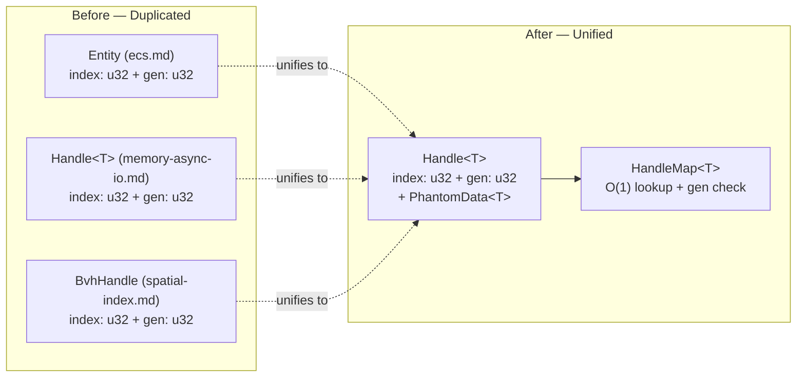
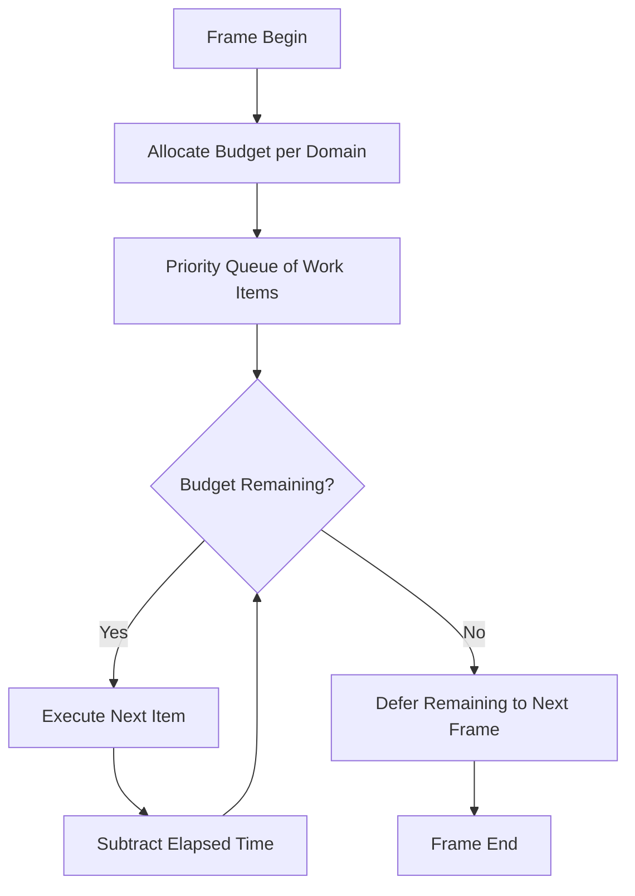
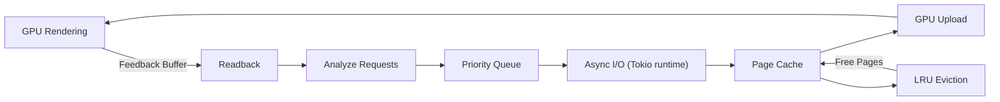

# Shared Primitives Design

## Requirements Trace

> **Canonical sources:** Features, requirements, and user stories are defined across all 15 domains.
> The table below traces each shared primitive to the domain designs where it was previously
> duplicated and the features it serves.

### Tier 1 — Engine-Wide Primitives

| Primitive                         |
|-----------------------------------|
| `Handle<T>` + `HandleMap<T>`      |
| `UniformGrid<T>`                  |
| `Curve<T>`                        |
| `SpringDamper<T>`                 |
| `StatModifier` + `StatAggregator` |
| `ConditionExpr`                   |
| `FrameBudget`                     |
| `FalloffCurve`                    |
| `PlatformTier`                    |
| `CompressionCodec`                |

1. **`Handle<T>` + `HandleMap<T>`** — ecs.md (Entity), memory-async-io.md (Handle), spatial-index.md
   (BvhHandle)
   - **Features Served:** F-1.1.11, F-1.7.4, F-1.7.5, F-1.9.1
2. **`UniformGrid<T>`** — perception.md (ScentGrid), steering-crowds.md (DensityGrid), simulation.md
   (FogGrid, TacticalGrid)
   - **Features Served:** F-7.6, F-7.7, F-13.20, F-13.26
3. **`Curve<T>`** — databases.md (NumericCurve), camera.md (Spline), navigation.md (PathSmooth),
   abilities-combat.md (RecoilCurve), state-machine.md (BlendCurve), behavior.md (ResponseCurve)
   - **Features Served:** F-13.7, F-13.25, F-7.1, F-13.16, F-9.4, F-7.3
4. **`SpringDamper<T>`** — first-person.md (WeaponSpring, CameraSpring, SwaySpring), procedural.md
   (SpringBone), cloth-hair.md (CardHairSpring), constraints.md (SpringParams)
   - **Features Served:** F-9.6, F-9.3, F-9.5, F-4.3
5. **`StatModifier` + `StatAggregator`** — abilities-combat.md, meters-resources.md, progression.md,
   databases.md
   - **Features Served:** F-13.10, F-13.16, F-13.8, F-13.12, F-13.7
6. **`ConditionExpr`** — quest-dialogue.md (PrerequisiteExpr), progression.md (Prerequisites,
   ChallengeConditions)
   - **Features Served:** F-13.6, F-13.12, F-13.23
7. **`FrameBudget`** — behavior.md (AiBudget), perception.md (PerceptionBudget), steering-crowds.md
   (LOD scheduler), destruction.md (ActivationBudget)
   - **Features Served:** F-7.3, F-7.6, F-7.7, F-4.6
8. **`FalloffCurve`** — level-world.md, 2d-games.md, effects.md
   - **Features Served:** F-15.2, F-10.5, F-11.2
9. **`PlatformTier`** — post-processing.md (QualityTier), stylized-materials.md (PlatformTier),
   scene-pipeline.md (merged into core-rendering.md), particles.md, cloth-hair.md
   - **Features Served:** F-2.9, F-2.11, F-2.10, F-11.1, F-9.5
10. **`CompressionCodec`** — streaming.md, dcc-versioning.md
    - **Features Served:** F-12.5, F-12.6

### Tier 2 — Domain-Shared Primitives

| Primitive                 | Features Served                   |
|---------------------------|-----------------------------------|
| `ConditionalGraph<N, E>`  | F-13.6, F-13.12, F-13.10          |
| `DecayingEntry<T>`        | F-7.6, F-13.19, F-13.10           |
| `ConnectivityAnalyzer`    | F-4.6, F-13.14                    |
| `TaggedLookupTable<K, V>` | F-13.16, F-13.10, F-13.7, F-13.19 |
| `LiveOpsResource<T>`      | F-13.23, F-13.24                  |
| `GraphCompiler`           | F-15.3, F-11.6, F-15.8            |
| `VirtualResourceStreamer` | F-3.1, F-12.5, F-3.2              |

1. **`ConditionalGraph<N, E>`** — quest-dialogue.md (QuestGraph), progression.md (TalentTree),
   abilities-combat.md (ComboChain), quest-dialogue.md (DialogueTree)
2. **`DecayingEntry<T>`** — perception.md (PerceptionMemory, DeedMemory, Gossip),
   abilities-combat.md (ThreatTable)
3. **`ConnectivityAnalyzer`** — destruction.md (StructuralAnalysis), simulation.md (IntegrityCheck)
4. **`TaggedLookupTable<K, V>`** — abilities-combat.md (ImpactResponse, TagRules), databases.md
   (LootTable), simulation.md (BarkTable)
5. **`LiveOpsResource<T>`** — progression.md (BattlePass, Store, Challenges, LoginCalendar)
6. **`GraphCompiler`** — material-animation.md (MaterialGraph), effect-graph.md (EffectGraph),
   logic-graph.md (ShaderGraph)
7. **`VirtualResourceStreamer`** — meshlets.md (MeshletStreamer), streaming.md (VirtualTexture),
   terrain.md (TerrainTiles)

---

## Overview

This document defines engine-wide shared abstractions that are currently duplicated across multiple
domain designs. Each primitive is defined once here and consumed by all domains that need it,
eliminating redundancy and ensuring consistent behavior.

Primitives are organized into two tiers:

- **Tier 1 (Engine-Wide):** Fundamental types used across three or more domains. These live in
  `harmonius_core` and have zero domain-specific dependencies.
- **Tier 2 (Domain-Shared):** Higher-level abstractions shared by two or more specific domains.
  These live in `harmonius_shared` and may depend on Tier 1 primitives.

All primitives follow the project constraints: static dispatch preferred, `async`/`await` for any
async work, no `dyn` in the game runtime, and Rust stable only.

---

## Architecture

### Layered Primitive Architecture

```mermaid
graph TD
    subgraph "Tier 1 — Engine-Wide Primitives"
        H["Handle&lt;T&gt; + HandleMap&lt;T&gt;"]
        UG["UniformGrid&lt;T&gt;"]
        C["Curve&lt;T&gt;"]
        SD["SpringDamper&lt;T&gt;"]
        SM["StatModifier + StatAggregator"]
        CE["ConditionExpr"]
        FB["FrameBudget"]
        FC["FalloffCurve"]
        PT["PlatformTier"]
        CC["CompressionCodec"]
    end

    subgraph "Tier 2 — Domain-Shared Primitives"
        CG["ConditionalGraph&lt;N,E&gt;"]
        DE["DecayingEntry&lt;T&gt;"]
        CA["ConnectivityAnalyzer"]
        TL["TaggedLookupTable&lt;K,V&gt;"]
        LO["LiveOpsResource&lt;T&gt;"]
        GC["GraphCompiler"]
        VR["VirtualResourceStreamer"]
    end

    subgraph "Consumers — Engine Domains"
        ECS[ECS]
        REN[Rendering]
        PHY[Physics]
        AI[AI / Behavior]
        ANI[Animation]
        GF[Game Framework]
        VFX[VFX / Particles]
        CP[Content Pipeline]
        NET[Networking]
        TOOL[Tools / Editor]
    end

    H --> ECS
    H --> REN
    H --> PHY
    H --> AI
    H --> CP

    UG --> AI
    UG --> GF
    UG --> NET

    C --> ANI
    C --> GF
    C --> AI
    C --> REN

    SD --> ANI
    SD --> PHY
    SD --> GF

    SM --> GF

    CE --> GF
    CE --> AI

    FB --> AI
    FB --> PHY
    FB --> VFX

    FC --> REN
    FC --> VFX
    FC --> GF

    PT --> REN
    PT --> VFX
    PT --> ANI

    CC --> CP
    CC --> NET

    CG --> GF
    CG --> TOOL

    DE --> AI
    DE --> GF

    CA --> PHY
    CA --> GF

    TL --> GF

    LO --> GF
    LO --> NET

    GC --> REN
    GC --> VFX
    GC --> TOOL

    VR --> REN
    VR --> CP
```



### Handle Unification — Before and After



### Class Diagram — All Types

```mermaid
classDiagram
    direction TB

    class Handle~T~ {
        -u32 index
        -u32 generation
        +index() u32
        +generation() u32
        +is_null() bool
    }

    class HandleMap~T~ {
        -Vec~Slot~T~~ entries
        -Vec~u32~ free_list
        +insert(T) Handle~T~
        +remove(Handle~T~) Option~T~
        +get(Handle~T~) Option~T~
        +get_mut(Handle~T~) Option~T~
        +contains(Handle~T~) bool
        +len() usize
        +iter() Iterator
    }

    class EntityMarker {
        <<unit struct>>
    }

    class UniformGrid~T~ {
        -Vec~T~ cells
        -GridDimensions dimensions
        -f32 cell_size
        -Vec3 origin
        +world_to_cell(Vec3) Option~CellCoord~
        +cell_to_world(CellCoord) Vec3
        +get(CellCoord) Option~T~
        +neighbors(CellCoord, NeighborMode) Iterator
        +cells_in_bounds(Vec3, Vec3) Iterator
        +clear()
    }

    class GridDimensions {
        +u32 width
        +u32 height
        +u32 depth
    }

    class CellCoord {
        +u32 x
        +u32 y
        +u32 z
    }

    class NeighborMode {
        <<enumeration>>
        VonNeumann
        Moore
    }

    class Curve~T~ {
        <<enumeration>>
        Linear
        CatmullRom
        Bezier
        Step
        Piecewise
        +evaluate(f32) T
        +derivative(f32) T
        +resample(usize) Vec
    }

    class CurveKey~T~ {
        +f32 t
        +T value
    }

    class BezierKey~T~ {
        +f32 t
        +T value
        +T tangent_in
        +T tangent_out
    }

    class PiecewiseSegment~T~ {
        +CurveKey~T~ start
        +CurveKey~T~ end
        +InterpolationMode mode
    }

    class InterpolationMode {
        <<enumeration>>
        Linear
        CatmullRom
        Bezier
        Step
    }

    class Interpolate {
        <<trait>>
        +lerp(Self, Self, f32) Self
    }

    class SpringParams {
        +f32 frequency
        +f32 damping
    }

    class SpringDamper~T~ {
        -SpringParams params
        +new(SpringParams) Self
        +tick(f32, T, T, T) SpringState~T~
        +set_params(SpringParams)
    }

    class SpringState~T~ {
        +T position
        +T velocity
    }

    class SpringLerpable {
        <<trait>>
        +add(Self, Self) Self
        +sub(Self, Self) Self
        +scale(Self, f32) Self
    }

    class ModOp {
        <<enumeration>>
        Flat
        Percent
        Override
    }

    class StatModifier {
        +ModOp op
        +f32 value
        +Entity source
        +i32 priority
    }

    class StatAggregator {
        -Vec~StatModifier~ modifiers
        +add(StatModifier)
        +remove_by_source(Entity)
        +evaluate(f32, f32, f32) f32
        +clear()
    }

    class ConditionExpr {
        <<enumeration>>
        And
        Or
        Not
        Leaf
        +evaluate(ConditionContext, ConditionRegistry) bool
        +leaf_count() usize
        +collect_ids() Vec
    }

    class ConditionId {
        +u32 0
    }

    class ConditionRegistry {
        -HandleMap checks
    }

    class ConditionContext {
        +World world
        +Entity entity
    }

    class FrameBudget {
        -u64 budget_us
        -u64 elapsed_us
        -Vec~WorkItem~ queue
        +new(u64) Self
        +enqueue(WorkItem)
        +execute() u32
        +reset()
        +remaining_us() u64
        +deferred_count() usize
    }

    class WorkItem {
        +i32 priority
        +u64 estimated_cost_us
        +fn work
    }

    class WorkContext {
        +u64 remaining_us
    }

    class FalloffCurve {
        <<enumeration>>
        Linear
        Quadratic
        Exponential
        Custom
        +evaluate(f32) f32
        +max_range() f32
    }

    class PlatformTier {
        <<enumeration>>
        Mobile
        Switch
        Desktop
        HighEnd
        +meets(PlatformTier) bool
        +max_draw_distance() f32
        +max_particle_count() u32
    }

    class CompressionCodec {
        <<enumeration>>
        None
        Lz4
        Zstd
        +compress(bytes, Vec) usize
        +decompress(bytes, Vec) usize
    }

    class NodeId {
        +u32 0
    }

    class CondEdge~E~ {
        +NodeId from
        +NodeId to
        +ConditionExpr condition
        +E data
    }

    class ConditionalGraph~N_E~ {
        -HandleMap~N~ nodes
        -Vec~CondEdge~E~~ edges
        +add_node(N) NodeId
        +add_edge(CondEdge~E~)
        +reachable_from(NodeId, ctx, reg) Vec~NodeId~
        +topological_iter() Iterator
        +get_node(NodeId) Option~N~
    }

    class DecayingEntry~T~ {
        +T value
        +f32 strength
        +f32 decay_rate
    }

    class DecayingStore~T~ {
        -Vec~DecayingEntry~T~~ entries
        -f32 threshold
        +new(f32) Self
        +insert(T, f32)
        +tick(f32) usize
        +refresh(Fn)
        +strongest() Option
        +iter() Iterator
    }

    class ConnectivityResult {
        +Vec connected
        +Vec disconnected
    }

    class ConnectivityAnalyzer {
        +analyze(anchors, entities, fn, World)$ ConnectivityResult
    }

    class WeightedEntry~V~ {
        +V value
        +f32 weight
    }

    class TaggedLookupTable~K_V~ {
        -HashMap table
        +insert(K, V, f32)
        +get(K) Option
        +select_weighted(K, Rng) Option~V~
        +len() usize
    }

    class Versioned~T~ {
        +u64 version
        +T data
    }

    class PollResult~T~ {
        <<enumeration>>
        UpToDate
        Updated
        Error
    }

    class LiveOpsResource~T~ {
        -Option~Versioned~T~~ current
        -String endpoint
        -u32 poll_interval_secs
        +poll() PollResult~T~
        +current() Option
        +force_refresh() PollResult~T~
    }

    class CompiledShader {
        +String hlsl_source
        +Vec dxil_bytecode
        +Vec spirv_bytecode
        +Option msl_source
    }

    class CompileError {
        +NodeId node_id
        +String message
    }

    class NodeDef {
        +NodeId id
        +Vec inputs
        +Vec outputs
        +String hlsl_template
    }

    class PinDef {
        +String name
        +ShaderDataType data_type
    }

    class ShaderDataType {
        <<enumeration>>
        Float
        Vec2
        Vec3
        Vec4
        Mat4
        Texture2D
        Sampler
    }

    class CompileTarget {
        <<enumeration>>
        Dxil
        SpirV
        Metal
        All
    }

    class GraphCompiler {
        +compile(nodes, edges, target)$ Result
    }

    class PageId {
        +Handle resource
        +u8 mip
        +u16 tile_x
        +u16 tile_y
    }

    class PageState {
        <<enumeration>>
        NonResident
        Loading
        Resident
        Evicting
    }

    class VirtualResourceStreamer {
        -HandleMap page_table
        -Vec priority_queue
        -u64 budget_bytes
        +new(u64) Self
        +process_feedback(PageIds)
        +dispatch_loads()
        +commit_uploads(GpuDevice)
        +page_state(PageId) PageState
        +memory_usage() u64
        +resident_count() usize
    }

    HandleMap~T~ o-- Handle~T~
    UniformGrid~T~ *-- GridDimensions
    UniformGrid~T~ ..> CellCoord
    UniformGrid~T~ ..> NeighborMode
    Curve~T~ *-- CurveKey~T~
    Curve~T~ *-- BezierKey~T~
    Curve~T~ *-- PiecewiseSegment~T~
    PiecewiseSegment~T~ *-- InterpolationMode
    Curve~T~ ..> Interpolate
    SpringDamper~T~ *-- SpringParams
    SpringDamper~T~ ..> SpringState~T~
    SpringDamper~T~ ..> SpringLerpable
    StatModifier *-- ModOp
    StatAggregator o-- StatModifier
    ConditionExpr *-- ConditionId
    ConditionExpr ..> ConditionRegistry
    ConditionExpr ..> ConditionContext
    FrameBudget o-- WorkItem
    WorkItem ..> WorkContext
    FalloffCurve ..> Curve~T~
    ConditionalGraph~N_E~ o-- CondEdge~E~
    CondEdge~E~ *-- ConditionExpr
    CondEdge~E~ *-- NodeId
    DecayingStore~T~ o-- DecayingEntry~T~
    ConnectivityAnalyzer ..> ConnectivityResult
    TaggedLookupTable~K_V~ o-- WeightedEntry~V~
    LiveOpsResource~T~ o-- Versioned~T~
    LiveOpsResource~T~ ..> PollResult~T~
    GraphCompiler ..> CompiledShader
    GraphCompiler ..> CompileError
    GraphCompiler ..> NodeDef
    GraphCompiler ..> CompileTarget
    NodeDef *-- PinDef
    PinDef *-- ShaderDataType
    CompileError *-- NodeId
    VirtualResourceStreamer ..> PageId
    VirtualResourceStreamer ..> PageState
```



---

## API Design

### Tier 1 — Engine-Wide Primitives

#### 1. `Handle<T>` + `HandleMap<T>`

Generational index pattern providing safe, O(1) indirect references without lifetime tracking. A
`Handle<T>` is a lightweight value containing a slot index and a generation counter. `HandleMap<T>`
stores values in a dense array with generation-validated lookup. Stale handles (referencing
deallocated slots) are detected at access time by comparing the handle's generation against the
slot's current generation. Type safety is enforced via `PhantomData<T>`, preventing accidental use
of a mesh handle where a texture handle is expected.

This primitive unifies `Entity` (ecs.md), `Handle<T>` (memory-async-io.md), and `BvhHandle`
(spatial-index.md) into a single definition. The ECS `Entity` type becomes a type alias:
`type Entity = Handle<EntityMarker>`.

```rust
/// Generational index handle. Type-safe via phantom.
/// 32-bit index + 32-bit generation = 64 bits total.
pub struct Handle<T> {
    index: u32,
    generation: u32,
    _marker: PhantomData<T>,
}

impl<T> Handle<T> {
    /// Returns the raw slot index.
    pub fn index(&self) -> u32;

    /// Returns the generation counter.
    pub fn generation(&self) -> u32;

    /// Returns true if this handle has never been assigned.
    pub fn is_null(&self) -> bool;
}

/// Dense storage with generation-validated O(1) lookup.
pub struct HandleMap<T> {
    entries: Vec<Slot<T>>,
    free_list: Vec<u32>,
}

impl<T> HandleMap<T> {
    /// Allocates a slot and returns a handle to it.
    pub fn insert(&mut self, value: T) -> Handle<T>;

    /// Removes the value at the handle's slot.
    /// Increments the slot generation, invalidating
    /// all existing handles to this slot.
    pub fn remove(&mut self, handle: Handle<T>) -> Option<T>;

    /// Returns a reference if the handle's generation
    /// matches the slot's current generation.
    pub fn get(&self, handle: Handle<T>) -> Option<&T>;

    /// Mutable variant of `get`.
    pub fn get_mut(
        &mut self,
        handle: Handle<T>,
    ) -> Option<&mut T>;

    /// Returns true if the handle is still valid.
    pub fn contains(&self, handle: Handle<T>) -> bool;

    /// Number of occupied slots.
    pub fn len(&self) -> usize;

    /// Iterates over all occupied (handle, value) pairs.
    pub fn iter(&self) -> impl Iterator<Item = (Handle<T>, &T)>;
}

/// Entity is a type alias over Handle.
pub struct EntityMarker;
pub type Entity = Handle<EntityMarker>;
```

#### 2. `UniformGrid<T>`

Generic uniform-cell spatial structure supporting cell-based iteration, neighbor queries, and
world-space bounds mapping. Each cell stores a user-defined `T` (e.g., density `f32`, scent
intensity, fog state, tactical value). The grid maps from continuous world coordinates to discrete
cell indices via a configurable cell size and origin offset.

Optional GPU upload provides a read-only buffer for shaders (fog-of-war rendering, density
visualization). This formalizes the grid as a first-class spatial primitive alongside the BVH
defined in spatial-index.md.

```rust
/// Generic uniform grid over a 2D or 3D region.
/// Cell size is fixed at construction.
pub struct UniformGrid<T> {
    cells: Vec<T>,
    dimensions: GridDimensions,
    cell_size: f32,
    origin: Vec3,
}

/// Grid dimensions and addressing.
pub struct GridDimensions {
    pub width: u32,
    pub height: u32,
    pub depth: u32,
}

/// Integer cell coordinate.
pub struct CellCoord {
    pub x: u32,
    pub y: u32,
    pub z: u32,
}

impl<T: Default + Clone> UniformGrid<T> {
    /// Creates a grid with the given dimensions and cell
    /// size, centered at `origin`. All cells initialized
    /// to `T::default()`.
    pub fn new(
        dimensions: GridDimensions,
        cell_size: f32,
        origin: Vec3,
    ) -> Self;

    /// Maps a world-space position to a cell coordinate.
    /// Returns `None` if out of bounds.
    pub fn world_to_cell(&self, pos: Vec3) -> Option<CellCoord>;

    /// Maps a cell coordinate to the world-space center
    /// of that cell.
    pub fn cell_to_world(&self, coord: CellCoord) -> Vec3;

    /// Returns a reference to the cell value.
    pub fn get(&self, coord: CellCoord) -> Option<&T>;

    /// Returns a mutable reference to the cell value.
    pub fn get_mut(
        &mut self,
        coord: CellCoord,
    ) -> Option<&mut T>;

    /// Iterates over the Von Neumann or Moore neighbors
    /// of a cell, returning (coord, &T) pairs.
    pub fn neighbors(
        &self,
        coord: CellCoord,
        mode: NeighborMode,
    ) -> impl Iterator<Item = (CellCoord, &T)>;

    /// Iterates over all cells in a world-space AABB.
    pub fn cells_in_bounds(
        &self,
        min: Vec3,
        max: Vec3,
    ) -> impl Iterator<Item = (CellCoord, &T)>;

    /// Returns the world-space AABB of the entire grid.
    pub fn world_bounds(&self) -> Aabb;

    /// Uploads cell data to a GPU buffer for shader
    /// access. Returns a handle to the GPU buffer.
    pub fn upload_to_gpu(
        &self,
        device: &GpuDevice,
    ) -> Handle<GpuBuffer>;

    /// Resets all cells to `T::default()`.
    pub fn clear(&mut self);
}

/// Neighbor iteration mode.
pub enum NeighborMode {
    /// Face-adjacent only (6 in 3D, 4 in 2D).
    VonNeumann,
    /// Face + edge + corner adjacent (26 in 3D, 8 in 2D).
    Moore,
}
```

#### 3. `Curve<T>`

Unified curve evaluation supporting multiple interpolation methods. A `Curve<T>` stores a sequence
of control points and evaluates at any parameter `t` in `[0, 1]`. Variants include linear
interpolation, Catmull-Rom splines, cubic Bezier, step functions, and piecewise-linear segments.

This unifies numeric curves (databases), camera splines, navigation path smoothing, weapon recoil
curves, animation blend curves, and AI response curves into one type.

```rust
/// Unified curve with multiple interpolation variants.
/// `T` must support interpolation (f32, Vec3, Quat, etc.)
pub enum Curve<T> {
    /// Linear interpolation between control points.
    Linear(Vec<CurveKey<T>>),
    /// Catmull-Rom spline through control points.
    CatmullRom(Vec<CurveKey<T>>),
    /// Cubic Bezier with explicit tangent handles.
    Bezier(Vec<BezierKey<T>>),
    /// Piecewise constant (sample-and-hold).
    Step(Vec<CurveKey<T>>),
    /// Piecewise segments with per-segment interpolation.
    Piecewise(Vec<PiecewiseSegment<T>>),
}

/// A keyed value at a parameter position.
pub struct CurveKey<T> {
    pub t: f32,
    pub value: T,
}

/// Bezier key with in/out tangent handles.
pub struct BezierKey<T> {
    pub t: f32,
    pub value: T,
    pub tangent_in: T,
    pub tangent_out: T,
}

/// A segment with its own interpolation mode.
pub struct PiecewiseSegment<T> {
    pub start: CurveKey<T>,
    pub end: CurveKey<T>,
    pub mode: InterpolationMode,
}

/// Interpolation mode for piecewise segments.
pub enum InterpolationMode {
    Linear,
    CatmullRom,
    Bezier,
    Step,
}

impl<T: Interpolate> Curve<T> {
    /// Evaluates the curve at parameter `t` in [0, 1].
    /// Clamps to the nearest control point outside range.
    pub fn evaluate(&self, t: f32) -> T;

    /// Returns the total number of control points.
    pub fn len(&self) -> usize;

    /// Returns the derivative at parameter `t`.
    pub fn derivative(&self, t: f32) -> T;

    /// Resamples the curve to `n` evenly-spaced points.
    pub fn resample(&self, n: usize) -> Vec<CurveKey<T>>;
}

/// Trait bound for types that can be interpolated.
pub trait Interpolate: Copy {
    fn lerp(a: Self, b: Self, t: f32) -> Self;
}
```

#### 4. `SpringDamper<T>`

Second-order spring-damper evaluator for smooth procedural motion. Operates on `f32`, `Vec3`, and
`Quat`. A single `tick` call advances the simulation by `dt`, returning the new position and
velocity.

This unifies weapon/camera/sway springs (first-person), spring bones (procedural animation), card
hair springs (cloth-hair), and spring constraints (physics).

```rust
/// Spring-damper parameters. Tuned per use case.
pub struct SpringParams {
    /// Natural frequency in Hz. Higher = stiffer.
    pub frequency: f32,
    /// Damping ratio. 1.0 = critically damped.
    /// < 1.0 = underdamped (oscillates).
    /// > 1.0 = overdamped (sluggish).
    pub damping: f32,
}

/// Spring-damper evaluator for type `T`.
pub struct SpringDamper<T> {
    params: SpringParams,
    _marker: PhantomData<T>,
}

/// Result of a single spring-damper tick.
pub struct SpringState<T> {
    pub position: T,
    pub velocity: T,
}

impl<T: SpringLerpable> SpringDamper<T> {
    /// Creates a new spring-damper with the given params.
    pub fn new(params: SpringParams) -> Self;

    /// Advances the spring by `dt` seconds.
    /// Uses semi-implicit Euler integration.
    /// Returns the new position and velocity.
    pub fn tick(
        &self,
        dt: f32,
        target: T,
        current: T,
        velocity: T,
    ) -> SpringState<T>;

    /// Updates spring parameters at runtime.
    pub fn set_params(&mut self, params: SpringParams);
}

/// Trait for types usable with SpringDamper.
/// Requires addition, scalar multiplication, and
/// subtraction for the spring equation.
pub trait SpringLerpable: Copy {
    fn add(a: Self, b: Self) -> Self;
    fn sub(a: Self, b: Self) -> Self;
    fn scale(a: Self, s: f32) -> Self;
}

// Implementations provided for f32, Vec3, Quat.
```

**Note:** The canonical parameterization uses `frequency` and `damping_ratio`. Some consuming files
(first-person.md, physics/constraints.md, 2d-games.md) use `stiffness`/`damping`/`mass`
parameterization. Implementation must provide conversion: `frequency = sqrt(stiffness / mass)`,
`damping_ratio = damping / (2 * sqrt(stiffness * mass))`. Both parameterizations are supported via
constructors.

#### 5. `StatModifier` + `ModOp` + `StatAggregator`

Stat modification pipeline for composing layered numeric modifiers. Modifiers are tagged with an
operation type (`Flat`, `Percent`, `Override`) and a source handle for removal. The aggregator
collects all active modifiers for a stat, sorts by operation, and produces a final value.

This unifies ability modifiers, weapon stat bonuses, character attribute buffs, talent passives, and
item stat contributions.

**Data Flow:**


```rust
/// Operation type for a stat modifier.
pub enum ModOp {
    /// Added to base value before percent scaling.
    Flat,
    /// Multiplicative percent bonus (1.0 = +100%).
    Percent,
    /// Overrides the final value. Last override wins.
    Override,
}

/// A single modifier applied to a stat.
pub struct StatModifier {
    /// The operation type.
    pub op: ModOp,
    /// The modifier value.
    pub value: f32,
    /// Source entity for removal tracking.
    pub source: Entity,
    /// Priority for ordering within the same ModOp.
    pub priority: i32,
}

/// Aggregates modifiers and computes final stat values.
pub struct StatAggregator {
    modifiers: Vec<StatModifier>,
}

impl StatAggregator {
    /// Adds a modifier to the collection.
    pub fn add(&mut self, modifier: StatModifier);

    /// Removes all modifiers from the given source.
    pub fn remove_by_source(&mut self, source: Entity);

    /// Computes the final value from base + all modifiers.
    /// Order: Flat -> Percent -> Override -> Clamp.
    pub fn evaluate(
        &self,
        base: f32,
        min: f32,
        max: f32,
    ) -> f32;

    /// Returns the number of active modifiers.
    pub fn len(&self) -> usize;

    /// Removes all modifiers.
    pub fn clear(&mut self);
}
```

#### 6. `ConditionExpr`

Composable boolean expression tree for evaluating prerequisites and unlock conditions. Supports
`And`, `Or`, and `Not` combinators with typed leaf predicates. Leaves reference a `ConditionId` that
maps to a concrete check function via a registry.

This unifies quest prerequisites, talent/skill unlock conditions, challenge completion checks, and
dialogue branching guards.

```rust
/// Boolean expression tree for prerequisites.
pub enum ConditionExpr {
    /// All children must be true.
    And(Vec<ConditionExpr>),
    /// At least one child must be true.
    Or(Vec<ConditionExpr>),
    /// Negates the child expression.
    Not(Box<ConditionExpr>),
    /// Leaf predicate identified by a registry key.
    Leaf(ConditionId),
}

/// Opaque identifier for a registered condition check.
pub struct ConditionId(pub u32);

/// Registry mapping ConditionId to evaluation functions.
pub struct ConditionRegistry {
    checks: HandleMap<ConditionCheckFn>,
}

/// Evaluation context passed to condition checks.
pub struct ConditionContext<'w> {
    pub world: &'w World,
    pub entity: Entity,
}

/// Function pointer type for condition evaluation.
pub type ConditionCheckFn =
    fn(&ConditionContext) -> bool;

impl ConditionExpr {
    /// Evaluates the expression tree against the context.
    pub fn evaluate(
        &self,
        ctx: &ConditionContext,
        registry: &ConditionRegistry,
    ) -> bool;

    /// Returns the total number of leaf conditions.
    pub fn leaf_count(&self) -> usize;

    /// Collects all unique ConditionIds referenced.
    pub fn collect_ids(&self) -> Vec<ConditionId>;
}
```

#### 7. `FrameBudget`

Time-sliced per-frame execution cap with priority scheduling. Each domain registers work items with
a priority. The budget executes items in priority order, stopping when the time cap is reached and
deferring remaining work to the next frame.

This unifies AI behavior budgets, perception budgets, AI LOD schedulers, destruction activation
budgets, and pathfinding query budgets.

**Execution Flow:**



```rust
/// Per-frame time budget with priority scheduling.
pub struct FrameBudget {
    budget_us: u64,
    elapsed_us: u64,
    queue: Vec<WorkItem>,
}

/// A unit of work to be executed within the budget.
pub struct WorkItem {
    /// Higher priority executes first.
    pub priority: i32,
    /// Estimated cost in microseconds.
    pub estimated_cost_us: u64,
    /// The work function. Receives the remaining budget.
    pub work: fn(&mut WorkContext),
}

/// Context passed to each work item during execution.
pub struct WorkContext {
    pub remaining_us: u64,
    pub world: *mut World,
}

impl FrameBudget {
    /// Creates a new budget with the given per-frame cap
    /// in microseconds.
    pub fn new(budget_us: u64) -> Self;

    /// Enqueues a work item for this frame.
    pub fn enqueue(&mut self, item: WorkItem);

    /// Executes queued items in priority order until the
    /// budget is exhausted. Returns the number of items
    /// that were deferred.
    pub fn execute(&mut self) -> u32;

    /// Resets the elapsed counter for a new frame.
    /// Deferred items remain in the queue.
    pub fn reset(&mut self);

    /// Returns the remaining budget in microseconds.
    pub fn remaining_us(&self) -> u64;

    /// Returns the number of deferred items.
    pub fn deferred_count(&self) -> usize;
}
```

#### 8. `FalloffCurve`

Distance-based falloff/attenuation for spatial effects. Provides built-in attenuation models:
linear, quadratic (inverse-square), exponential, and custom (user-supplied `Curve<f32>`). Evaluates
to a `[0, 1]` intensity given a distance and a max range.

Used by area lights, audio attenuation, AoE damage, scent propagation, and 2D effect radii.

```rust
/// Distance-based falloff model.
pub enum FalloffCurve {
    /// Linear falloff: 1 - (d / max_range).
    Linear { max_range: f32 },
    /// Inverse-square: 1 / (1 + k * d^2).
    Quadratic { max_range: f32, intensity: f32 },
    /// Exponential decay: e^(-k * d).
    Exponential { max_range: f32, decay_rate: f32 },
    /// User-defined curve mapping [0, 1] -> [0, 1].
    Custom { max_range: f32, curve: Curve<f32> },
}

impl FalloffCurve {
    /// Evaluates the falloff at distance `d`.
    /// Returns a value in [0, 1], where 1 = full
    /// intensity and 0 = fully attenuated.
    /// Distances beyond `max_range` return 0.
    pub fn evaluate(&self, distance: f32) -> f32;

    /// Returns the maximum effective range.
    pub fn max_range(&self) -> f32;
}
```

#### 9. `PlatformTier`

Single unified scaling tier enum for all LOD, quality, and platform-dependent feature gating.
Replaces three or more divergent tier enums (`QualityTier`, `PlatformTier`, unnamed variants)
scattered across rendering, VFX, animation, and content pipeline designs.

Each tier corresponds to a target hardware class. Systems query the current tier at initialization
or when the user changes quality settings.

```rust
/// Unified platform/quality scaling tier.
/// Ordered from lowest to highest capability.
#[derive(
    Clone, Copy, PartialEq, Eq, PartialOrd, Ord, Hash,
)]
pub enum PlatformTier {
    /// Mobile (iOS, Android). Minimal shader features,
    /// reduced draw calls, lowest LOD.
    Mobile,
    /// Handheld console (Switch-class). Moderate shader
    /// features, constrained memory.
    Switch,
    /// Desktop and current-gen console. Full feature set
    /// with standard quality.
    Desktop,
    /// High-end desktop with ray tracing, high-res
    /// textures, maximum draw distance.
    HighEnd,
}

impl PlatformTier {
    /// Returns true if this tier supports the feature
    /// that requires `minimum`.
    pub fn meets(&self, minimum: PlatformTier) -> bool;

    /// Returns the recommended max draw distance in
    /// world units for this tier.
    pub fn max_draw_distance(&self) -> f32;

    /// Returns the recommended max particle count.
    pub fn max_particle_count(&self) -> u32;
}
```

#### 10. `CompressionCodec`

Enum representing supported compression codecs for asset streaming, network payloads, and asset
versioning. Defined once to avoid identifier drift between subsystems.

```rust
/// Compression codec for binary data.
#[derive(Clone, Copy, PartialEq, Eq, Hash)]
pub enum CompressionCodec {
    /// No compression.
    None,
    /// LZ4 frame format. Fast decompression, moderate
    /// ratio.
    Lz4,
    /// Zstandard. Configurable ratio/speed tradeoff.
    Zstd,
}

impl CompressionCodec {
    /// Compresses `input` into `output`, returning the
    /// number of bytes written.
    pub fn compress(
        &self,
        input: &[u8],
        output: &mut Vec<u8>,
    ) -> usize;

    /// Decompresses `input` into `output`, returning the
    /// number of bytes written.
    pub fn decompress(
        &self,
        input: &[u8],
        output: &mut Vec<u8>,
    ) -> usize;
}
```

---

### Tier 2 — Domain-Shared Primitives

#### 11. `ConditionalGraph<N, E>`

Generic directed acyclic graph with condition-guarded edges. Parameterized by node data `N` and
edge/condition type `E`. Provides topological traversal, reachability queries, and serialization
hooks for the visual editor. Used for quest progression graphs, talent trees, combo chains, and
dialogue trees.

```rust
/// Unique node identifier within a graph.
pub struct NodeId(pub u32);

/// A directed edge with a condition guard.
pub struct CondEdge<E> {
    pub from: NodeId,
    pub to: NodeId,
    pub condition: ConditionExpr,
    pub data: E,
}

/// Generic condition-guarded DAG.
pub struct ConditionalGraph<N, E> {
    nodes: HandleMap<N>,
    edges: Vec<CondEdge<E>>,
}

impl<N, E> ConditionalGraph<N, E> {
    /// Adds a node and returns its identifier.
    pub fn add_node(&mut self, data: N) -> NodeId;

    /// Adds a condition-guarded edge between two nodes.
    pub fn add_edge(&mut self, edge: CondEdge<E>);

    /// Returns outgoing edges from a node whose
    /// conditions evaluate to true.
    pub fn reachable_from(
        &self,
        node: NodeId,
        ctx: &ConditionContext,
        registry: &ConditionRegistry,
    ) -> Vec<NodeId>;

    /// Topological traversal of all nodes.
    pub fn topological_iter(
        &self,
    ) -> impl Iterator<Item = (NodeId, &N)>;

    /// Returns the node data by identifier.
    pub fn get_node(&self, id: NodeId) -> Option<&N>;
}
```

#### 12. `DecayingEntry<T>`

Value that decreases over time and auto-removes below a threshold. Each entry stores a value, a
current strength (initialized to 1.0), and a decay rate. Calling `tick` reduces strength by
`decay_rate * dt`. When strength falls below the threshold, the entry is eligible for removal.

Used by perception memory, NPC deed memory, gossip propagation, and threat tables.

```rust
/// An entry whose strength decays over time.
pub struct DecayingEntry<T> {
    pub value: T,
    pub strength: f32,
    pub decay_rate: f32,
}

/// Collection of decaying entries with auto-cleanup.
pub struct DecayingStore<T> {
    entries: Vec<DecayingEntry<T>>,
    threshold: f32,
}

impl<T> DecayingStore<T> {
    /// Creates a store with the given removal threshold.
    pub fn new(threshold: f32) -> Self;

    /// Inserts an entry with initial strength 1.0.
    pub fn insert(
        &mut self,
        value: T,
        decay_rate: f32,
    );

    /// Ticks all entries by `dt` seconds. Removes entries
    /// whose strength falls below the threshold.
    /// Returns the number of entries removed.
    pub fn tick(&mut self, dt: f32) -> usize;

    /// Refreshes the strength of entries matching a
    /// predicate back to 1.0.
    pub fn refresh<F: Fn(&T) -> bool>(
        &mut self,
        predicate: F,
    );

    /// Returns the strongest entry, if any.
    pub fn strongest(&self) -> Option<&DecayingEntry<T>>;

    /// Iterates over all live entries.
    pub fn iter(
        &self,
    ) -> impl Iterator<Item = &DecayingEntry<T>>;
}
```

#### 13. `ConnectivityAnalyzer`

BFS/DFS traversal from anchor entities over connection components for structural integrity analysis.
Given a set of anchor entities and a neighbor function, determines which entities remain connected
to at least one anchor. Disconnected clusters are returned for destruction or detachment.

Shared by destruction (structural analysis after fracture) and simulation (building integrity checks
after damage).

```rust
/// Result of connectivity analysis.
pub struct ConnectivityResult {
    /// Entities still connected to at least one anchor.
    pub connected: Vec<Entity>,
    /// Disconnected clusters, each a vec of entities.
    pub disconnected: Vec<Vec<Entity>>,
}

/// Analyzer for entity connectivity.
pub struct ConnectivityAnalyzer;

/// Function type for querying neighbors of an entity.
pub type NeighborFn =
    fn(Entity, &World) -> Vec<Entity>;

impl ConnectivityAnalyzer {
    /// Performs BFS from anchors over the neighbor graph.
    /// Entities not reachable from any anchor are
    /// reported as disconnected clusters.
    pub fn analyze(
        anchors: &[Entity],
        all_entities: &[Entity],
        neighbor_fn: NeighborFn,
        world: &World,
    ) -> ConnectivityResult;
}
```

#### 14. `TaggedLookupTable<K, V>`

O(1) tag-keyed lookup with optional weighted random selection. Stores entries keyed by a tag type
`K` with associated values `V` and selection weights. Provides both exact lookup and weighted-random
sampling.

Used by weapon impact response tables, ability tag rules, loot tables, and NPC bark tables.

```rust
/// An entry with a weight for random selection.
pub struct WeightedEntry<V> {
    pub value: V,
    pub weight: f32,
}

/// Tag-keyed lookup table with weighted random selection.
pub struct TaggedLookupTable<K: Eq + Hash, V> {
    table: HashMap<K, Vec<WeightedEntry<V>>>,
}

impl<K: Eq + Hash, V> TaggedLookupTable<K, V> {
    /// Inserts an entry under the given tag.
    pub fn insert(
        &mut self,
        key: K,
        value: V,
        weight: f32,
    );

    /// Returns all entries matching the tag.
    pub fn get(&self, key: &K) -> Option<&[WeightedEntry<V>]>;

    /// Selects a random entry weighted by `weight`.
    /// Uses the provided RNG.
    pub fn select_weighted(
        &self,
        key: &K,
        rng: &mut impl Rng,
    ) -> Option<&V>;

    /// Returns the total number of entries across all tags.
    pub fn len(&self) -> usize;
}
```

#### 15. `LiveOpsResource<T>`

Server-polled resource with version comparison and delta fetch for live operations content.
Periodically polls a server endpoint, compares the remote version against the local version, and
fetches only the delta if a newer version exists. All I/O uses `async`/`await` via `Tokio runtime`.

Used by battle pass definitions, store catalogs, challenge rotations, and login calendars.

```rust
/// A live-ops resource that polls for server updates.
pub struct LiveOpsResource<T> {
    current: Option<Versioned<T>>,
    endpoint: String,
    poll_interval_secs: u32,
}

/// Versioned wrapper for live-ops data.
pub struct Versioned<T> {
    pub version: u64,
    pub data: T,
}

/// Result of a poll operation.
pub enum PollResult<T> {
    /// No update available.
    UpToDate,
    /// New version fetched.
    Updated(Versioned<T>),
    /// Fetch failed with an error message.
    Error(String),
}

impl<T: DeserializeOwned> LiveOpsResource<T> {
    /// Creates a resource polling the given endpoint.
    pub fn new(
        endpoint: String,
        poll_interval_secs: u32,
    ) -> Self;

    /// Polls the server for updates. Async via Tokio runtime.
    /// Compares remote version, fetches delta if newer.
    pub async fn poll(&mut self) -> PollResult<T>;

    /// Returns the current data, if loaded.
    pub fn current(&self) -> Option<&Versioned<T>>;

    /// Forces an immediate fetch regardless of interval.
    pub async fn force_refresh(&mut self) -> PollResult<T>;
}
```

#### 16. `GraphCompiler`

Shared framework for compiling visual node graphs to HLSL shader code. Performs topological sort,
type checking, dead code elimination, HLSL emission, DXC compilation, and Metal Shader Converter
(MSC) translation. Each graph domain (material, effect, shader) supplies node type definitions; the
compiler provides the shared pipeline.

```rust
/// A compiled shader output.
pub struct CompiledShader {
    pub hlsl_source: String,
    pub dxil_bytecode: Vec<u8>,
    pub spirv_bytecode: Vec<u8>,
    pub msl_source: Option<String>,
}

/// Error during graph compilation.
pub struct CompileError {
    pub node_id: NodeId,
    pub message: String,
}

/// Node definition supplied by each graph domain.
pub struct NodeDef {
    pub id: NodeId,
    pub inputs: Vec<PinDef>,
    pub outputs: Vec<PinDef>,
    pub hlsl_template: String,
}

/// Pin (input/output) definition on a node.
pub struct PinDef {
    pub name: String,
    pub data_type: ShaderDataType,
}

/// Shader data types for type checking.
pub enum ShaderDataType {
    Float,
    Vec2,
    Vec3,
    Vec4,
    Mat4,
    Texture2D,
    Sampler,
}

/// Shared graph-to-HLSL compiler.
pub struct GraphCompiler;

impl GraphCompiler {
    /// Compiles a graph to shader bytecode.
    /// Steps: topological sort, type check, dead code
    /// elimination, HLSL emission, DXC compilation,
    /// optional MSC conversion.
    pub fn compile(
        nodes: &[NodeDef],
        edges: &[(NodeId, usize, NodeId, usize)],
        target: CompileTarget,
    ) -> Result<CompiledShader, Vec<CompileError>>;
}

/// Target platform for compilation output.
pub enum CompileTarget {
    /// DXIL for Direct3D 12.
    Dxil,
    /// SPIR-V for Vulkan.
    SpirV,
    /// MSL for Metal (via DXC + MSC).
    Metal,
    /// All targets.
    All,
}
```

#### 17. `VirtualResourceStreamer`

GPU-feedback-driven page streaming for virtual resources. Reads a GPU feedback buffer to determine
which pages are requested, prioritizes them, issues async I/O loads via `Tokio runtime`, tracks page
residency, and evicts least- recently-used pages when memory is full.

Shared by meshlet streaming, virtual texturing, and terrain tile streaming.

**Feedback Loop:**



```rust
/// Unique identifier for a virtual page.
pub struct PageId {
    pub resource: Handle<VirtualResource>,
    pub mip: u8,
    pub tile_x: u16,
    pub tile_y: u16,
}

/// Residency state of a page.
pub enum PageState {
    /// Not loaded.
    NonResident,
    /// Load in progress.
    Loading,
    /// Resident in GPU memory.
    Resident,
    /// Marked for eviction.
    Evicting,
}

/// Virtual resource streamer with feedback-driven loading.
pub struct VirtualResourceStreamer {
    page_table: HandleMap<PageState>,
    priority_queue: Vec<(PageId, f32)>,
    lru_cache: LruCache<PageId>,
    budget_bytes: u64,
}

impl VirtualResourceStreamer {
    /// Creates a streamer with the given memory budget.
    pub fn new(budget_bytes: u64) -> Self;

    /// Reads the GPU feedback buffer and queues page
    /// load requests. Called once per frame after
    /// feedback readback completes.
    pub fn process_feedback(
        &mut self,
        feedback: &[PageId],
    );

    /// Issues async I/O for the highest-priority pages.
    /// Respects the memory budget, evicting LRU pages
    /// as needed.
    pub async fn dispatch_loads(&mut self);

    /// Uploads completed loads to GPU memory and updates
    /// the page table.
    pub fn commit_uploads(&mut self, device: &GpuDevice);

    /// Returns the residency state of a page.
    pub fn page_state(&self, page: &PageId) -> PageState;

    /// Returns the current memory usage in bytes.
    pub fn memory_usage(&self) -> u64;

    /// Returns the number of resident pages.
    pub fn resident_count(&self) -> usize;
}
```

---

## Data Flow

Shared primitives are consumed at different points in the frame lifecycle:

| Phase          |
|----------------|
| Frame start    |
| Input / events |
| AI / behavior  |
| Physics        |
| Game logic     |
| Rendering prep |
| GPU dispatch   |
| GPU upload     |
| Post-frame     |

1. **Frame start** — `FrameBudget::reset`, `LiveOpsResource::poll`
2. **Input / events** — `ConditionExpr::evaluate`
3. **AI / behavior** — `FrameBudget::execute`, `DecayingStore::tick`, `Curve::evaluate`,
   `UniformGrid` reads
4. **Physics** — `SpringDamper::tick`, `ConnectivityAnalyzer::analyze`
5. **Game logic** — `StatAggregator::evaluate`, `ConditionalGraph::reachable_from`,
   `TaggedLookupTable::select_weighted`
6. **Rendering prep** — `PlatformTier::meets`, `FalloffCurve::evaluate`,
   `VirtualResourceStreamer::process_feedback`
7. **GPU dispatch** — `VirtualResourceStreamer::dispatch_loads`, `GraphCompiler::compile` (async,
   cached)
8. **GPU upload** — `UniformGrid::upload_to_gpu`, `VirtualResourceStreamer::commit_uploads`
9. **Post-frame** — `Handle/HandleMap` cleanup, `CompressionCodec` for replay/save

---

## Platform Considerations

| Primitive                    |
|------------------------------|
| `Handle<T>` / `HandleMap<T>` |
| `UniformGrid<T>` GPU upload  |
| `CompressionCodec`           |
| `VirtualResourceStreamer`    |
| `GraphCompiler`              |
| `LiveOpsResource<T>`         |
| `PlatformTier`               |

1. **`Handle<T>` / `HandleMap<T>`** — No platform specifics
   - **macOS:** No platform specifics
   - **Linux:** No platform specifics
2. **`UniformGrid<T>` GPU upload** — D3D12 buffer
   - **macOS:** Metal buffer via GCD
   - **Linux:** Vulkan buffer
3. **`CompressionCodec`** — Tokio-based async compress
   - **macOS:** Tokio (kqueue)
   - **Linux:** Tokio (epoll)
4. **`VirtualResourceStreamer`** — D3D12 feedback, Tokio I/O
   - **macOS:** Metal feedback, Tokio (kqueue)
   - **Linux:** Vulkan feedback, Tokio (epoll)
5. **`GraphCompiler`** — DXC native
   - **macOS:** DXC via C API + MSC via swift-bridge
   - **Linux:** DXC via C ABI
6. **`LiveOpsResource<T>`** — Tokio sockets
   - **macOS:** Tokio (kqueue)
   - **Linux:** Tokio (epoll)
7. **`PlatformTier`** — Desktop / HighEnd
   - **macOS:** Mobile / Desktop
   - **Linux:** Desktop / HighEnd

All async operations route through `Tokio runtime` as defined in `platform/threading.md`. No Rust
stdlib file I/O.

---

## Test Plan

### Tier 1 Unit Tests

| Primitive                    |
|------------------------------|
| `Handle<T>` + `HandleMap<T>` |
| `UniformGrid<T>`             |
| `Curve<T>`                   |
| `SpringDamper<T>`            |
| `StatModifier`               |
| `ConditionExpr`              |
| `FrameBudget`                |
| `FalloffCurve`               |
| `PlatformTier`               |
| `CompressionCodec`           |

1. **`Handle<T>` + `HandleMap<T>`** — Insert/get/remove round-trip; stale handle returns `None`;
   generation overflow wraps correctly; iteration skips free slots; type safety prevents cross-type
   access
2. **`UniformGrid<T>`** — World-to-cell mapping at boundaries; neighbor iteration counts (VN=6,
   Moore=26 in 3D); out-of-bounds returns `None`; clear resets all cells
3. **`Curve<T>`** — Linear: `evaluate(0.5)` midpoint; CatmullRom: passes through control points;
   Bezier: endpoint interpolation; Step: holds value until next key; derivative correctness
4. **`SpringDamper<T>`** — Critically damped converges without overshoot; underdamped oscillates;
   overdamped sluggish; zero dt produces no change; f32/Vec3/Quat implementations
5. **`StatModifier`** — Flat-only aggregation; Percent-only scaling; Override replaces final;
   combined ordering (Flat -> Percent -> Override); remove_by_source clears correct entries; clamp
   respects min/max
6. **`ConditionExpr`** — And: all true passes, one false fails; Or: one true passes, all false
   fails; Not: inverts; nested expressions; leaf_count correctness
7. **`FrameBudget`** — High-priority executes first; budget exhaustion defers remainder; reset
   preserves deferred items; zero-budget defers all
8. **`FalloffCurve`** — Linear: 0 at max_range, 1 at distance 0; Quadratic: inverse-square law;
   Exponential: decay rate; Custom: delegates to inner curve; beyond max_range returns 0
9. **`PlatformTier`** — Ordering: Mobile < Switch < Desktop < HighEnd; `meets` returns true for
   equal/higher; recommended values are monotonically increasing
10. **`CompressionCodec`** — None: output equals input; Lz4: round-trip fidelity; Zstd: round-trip
    fidelity; empty input; large input (1 MiB+)

### Tier 2 Unit Tests

| Primitive                 |
|---------------------------|
| `ConditionalGraph<N, E>`  |
| `DecayingStore<T>`        |
| `ConnectivityAnalyzer`    |
| `TaggedLookupTable<K, V>` |
| `LiveOpsResource<T>`      |
| `GraphCompiler`           |
| `VirtualResourceStreamer` |

1. **`ConditionalGraph<N, E>`** — Add nodes/edges; topological order; reachable_from with false
   conditions filters edges; cycle detection (should reject)
2. **`DecayingStore<T>`** — Insert at strength 1.0; tick reduces strength; below-threshold removal;
   refresh restores strength; strongest returns max
3. **`ConnectivityAnalyzer`** — Fully connected: no disconnected clusters; single anchor removed:
   cluster detaches; island detection; empty input
4. **`TaggedLookupTable<K, V>`** — Insert/get round-trip; weighted selection respects weights over
   many samples; missing key returns None
5. **`LiveOpsResource<T>`** — UpToDate when versions match; Updated when remote is newer; Error on
   network failure; force_refresh bypasses interval
6. **`GraphCompiler`** — Topological sort correctness; type mismatch produces CompileError; dead
   code elimination removes unreachable nodes; HLSL output for simple graph
7. **`VirtualResourceStreamer`** — Feedback enqueues pages; dispatch respects budget; LRU eviction
   frees oldest; commit_uploads transitions state to Resident

### Integration Tests

1. **Handle interop:** Create entities in ECS via `Handle<EntityMarker>`, store in `HandleMap`,
   verify cross-system handle validity.
2. **Grid + spatial index:** Populate `UniformGrid` from `SpatialQuery` results, verify cell
   contents match.
3. **Stat pipeline end-to-end:** Attach modifiers from multiple sources (ability, item, buff),
   verify final value matches manual calculation.
4. **Virtual streamer + Tokio runtime:** Load pages via platform I/O backend, verify residency
   tracking.

---

## Design Q & A

**Q1. What is the biggest constraint limiting this design?** What would happen if we lifted that
constraint? What is the best possible solution imaginable without those constraints? What is the
impact of removing them?

The "no frameworks, only libraries" constraint forces every shared primitive to be a standalone,
minimal type rather than part of a cohesive framework with automatic integration. This means
`Handle<T>`, `Curve<T>`, `SpringDamper<T>`, `StatModifier`, and others must be wired together
manually by each consumer. Lifting this would allow a unified math/simulation framework where curves
auto-feed into spring dampers, stats automatically aggregate from modifiers, and handles
self-register with the spatial index. The best possible design would be a small runtime library that
auto-discovers primitives via the reflection system (F-1.3.1) and wires them into the ECS scheduler.
The impact of removing the constraint is implicit coupling: framework-level integration makes it
harder to use primitives in isolation and increases the dependency surface.

**Q2. How can this design be improved?** Where is it weak? What potential issues will arise? What
trade-offs are we making?

The shared primitives module consolidates types that were previously duplicated across 15+ domain
designs, which is a major improvement. However, the UniformGrid<T> primitive serves both 2D (network
relevancy) and 3D (density queries) use cases with the same structure, which may force awkward
dimensionality conversions. The Curve<T> trait requires all interpolation to go through a single
`Interpolate` trait, but quaternion slerp and Hermite splines have fundamentally different
evaluation costs. The StatModifier pipeline's flat/percent/override ordering is fixed and may not
cover all game designs (e.g., multiplicative stacking in some RPG systems). Adding dimension-generic
grid types, specialized curve evaluators per interpolation mode, and configurable modifier pipeline
orderings would address these gaps.

**Q3. Is there a better approach?** If we are not taking it, why not?

An alternative is to not consolidate primitives at all and let each domain define its own
specialized types. Physics would have its own SpringDamper tuned for constraint solving, AI would
have its own Curve for response curves, and networking would have its own grid. We are not taking
this approach because the deduplication benefits are significant: the design doc traces Handle<T> to
4 features across 3 modules (F-1.1.11, F-1.7.4, F-1.7.5, F-1.9.1), and Curve<T> to 6 features across
6 modules. Duplicating these would mean maintaining parallel implementations with diverging bug
fixes and inconsistent APIs. The shared approach also enables cross-domain interoperability (e.g.,
animation curves driving physics spring parameters).

**Q4. Does this design solve all customer problems?** Are there missing features, requirements, or
user stories? What are they? How would adding them improve the engine? What kinds of games does it
enable?

The design covers the most commonly duplicated primitives but misses a shared random number
generator primitive. AI behavior trees (F-7.3), particle effects (F-11), loot tables (F-13.7), and
procedural generation all need deterministic pseudo-random sequences, and each domain currently
defines its own RNG seed management. A shared `DeterministicRng` primitive with per-system seed
forking would ensure reproducible simulation across all subsystems. The VirtualStreamer primitive
addresses texture and mesh streaming but lacks integration with the arbitrary precision types
(F-1.7.9) for cosmic-scale streaming. Adding these would enable deterministic multiplayer in
roguelikes/RPGs and seamless space-game world streaming.

**Q5. Is this design cohesive with the overall engine?** Does it fit? Does it differ from other
modules, and why? How could we make it more cohesive? How can we improve it to meet engine goals?

The shared primitives module is the engine's most cross-cutting module by design, serving as the
foundation layer beneath all 15 domains. It integrates well with the ECS (Handle<T> as entity
identifiers), memory management (pool allocators for HandleMap), and the reflection system (all
primitives derive Reflect). The tier system (Tier 1 engine-wide, Tier 2 multi-domain, Tier 3
domain-pair) provides a clear dependency hierarchy. One cohesion improvement would be ensuring every
shared primitive has a corresponding Reflect derive and serialization support so the editor can
inspect and modify all primitive values uniformly. Currently the design states this intent but does
not trace specific F-1.3 and F-1.4 features for each primitive type.

## Open Questions

1. **Handle bit layout:** Should we use 32+32 (4B entities) or 24+8 (16M entities, 256 generations)?
   The 32+32 layout matches ECS Entity but wastes bits for smaller handle maps. Could `Handle<T>`
   support configurable bit widths via const generics?

2. **Curve derivative for Quat:** Quaternion curves require `slerp` rather than `lerp`. Should
   `Interpolate` have a separate `slerp` path, or should `Quat` curves use a dedicated `QuatCurve`
   type?

3. **FrameBudget thread safety:** Should `FrameBudget` be per-thread or shared across the thread
   pool? Per-thread avoids contention but complicates global budget accounting.

4. **ConditionalGraph serialization:** Should the graph serialize via `Reflect` (bevy_reflect-style)
   or have a custom binary format for editor performance?

5. **GraphCompiler caching:** Should compiled shaders be cached by content hash (BLAKE3) in the CAS
   database defined in `asset-import.md`, or should `GraphCompiler` maintain its own cache?

6. **VirtualResourceStreamer feedback format:** Should the feedback buffer use a fixed-size bitfield
   per page or a variable-length request list? Bitfield is simpler but scales poorly with page
   count.

7. **StatModifier priority:** Should priority be global (across all ModOps) or per-ModOp? Global
   priority enables finer control but complicates the evaluation order guarantee.
