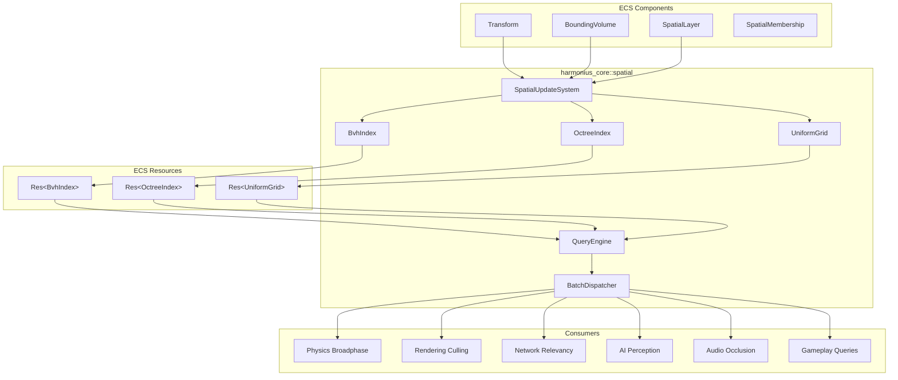
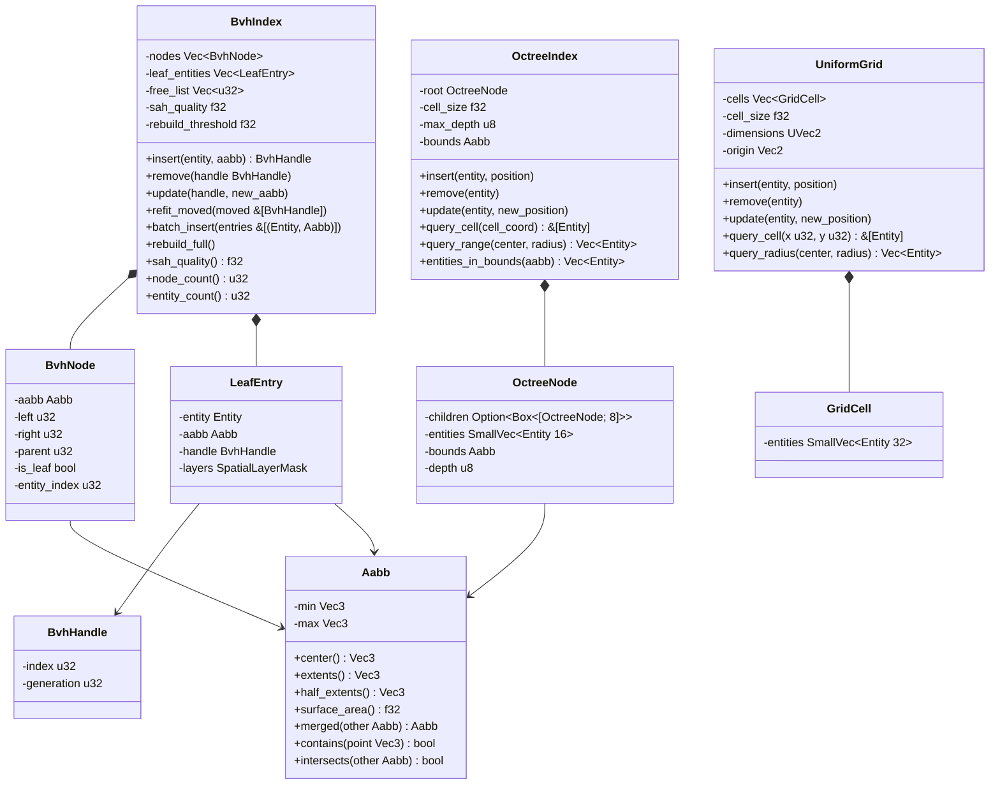
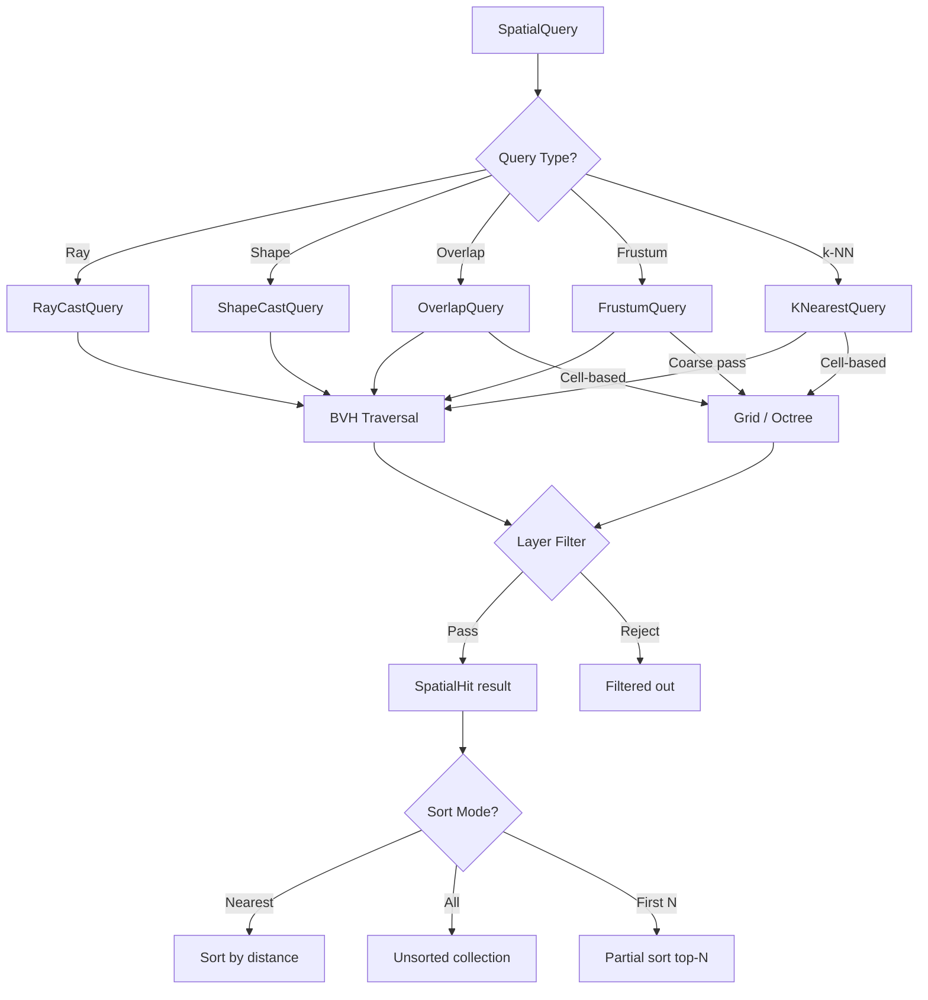
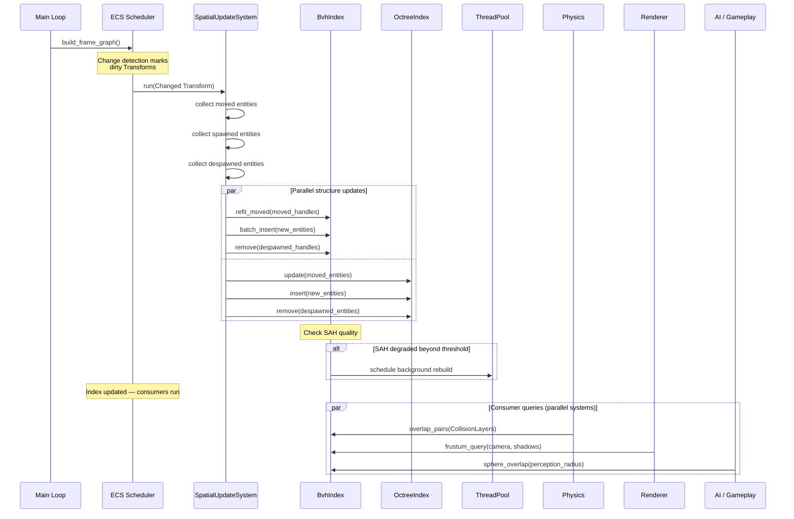
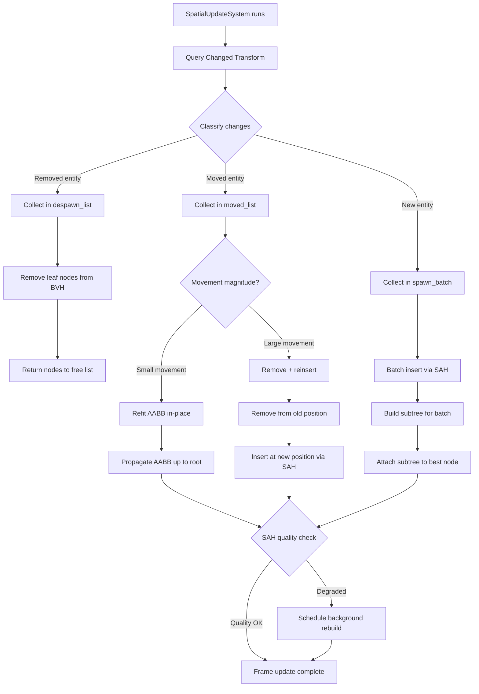
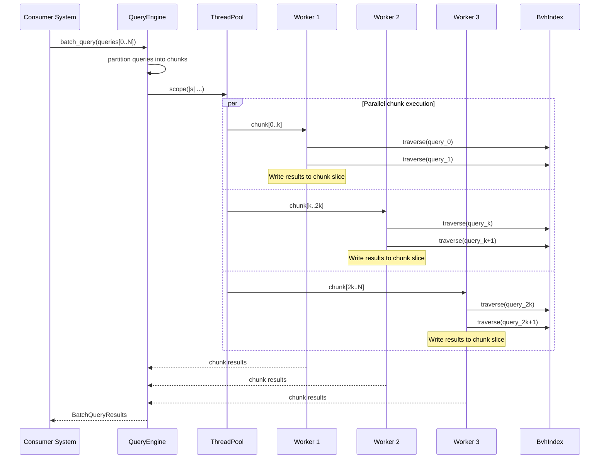

# Spatial Index Design

## Requirements Trace

> **Canonical sources:** Features, requirements, and user stories are defined in
> [features/core-runtime/](../../features/core-runtime/),
> [requirements/core-runtime/](../../requirements/core-runtime/), and
> [user-stories/core-runtime/](../../user-stories/core-runtime/). The table below traces design
> elements to those definitions.

### Acceleration Structures (F-1.9.1–3 / R-1.9.1–3)

| Feature | Requirement | Description |
|---------|-------------|-------------|
| F-1.9.1 | R-1.9.1 | Shared BVH as ECS resource, updated once per frame, read by all subsystems |
| F-1.9.1 | R-1.9.1a | BVH memory <= 64 bytes/entity, SAH quality within 2x of full rebuild |
| F-1.9.2 | R-1.9.2 | Incremental BVH updates via change detection, cost proportional to moved entities |
| F-1.9.3 | R-1.9.3 | Optional grid/octree alongside BVH for cell-based queries |

### Query Interface (F-1.9.4–5 / R-1.9.4–5)

| Feature | Requirement | Description |
|---------|-------------|-------------|
| F-1.9.4 | R-1.9.4 | Unified query API: ray, shape, overlap, frustum, k-NN with ECS filters |
| F-1.9.4 | R-1.9.4a | Ray cast < 10 us at 1M entities; frustum cull < 500 us at 1M entities |
| F-1.9.5 | R-1.9.5 | Batch parallel queries via thread pool with SIMD acceleration |

### Consumer Integration (F-1.9.6–9 / R-1.9.6–9)

| Feature | Requirement | Description |
|---------|-------------|-------------|
| F-1.9.6 | R-1.9.6 | Physics broadphase reads shared BVH, no separate broadphase |
| F-1.9.7 | R-1.9.7 | Rendering frustum culling reads shared BVH for all views |
| F-1.9.8 | R-1.9.8 | Network relevancy uses grid/octree for area-of-interest |
| F-1.9.9 | R-1.9.9 | AI perception and gameplay queries route through unified API |

### Interoperability Contract

This design **defines** the `SpatialQuery` trait consumed by: Physics, Rendering, Networking, AI,
Audio, and Gameplay.

---

## Overview

The spatial indexing subsystem maintains a single shared spatial index as an ECS resource. All
subsystems read from this one structure instead of building their own. The primary acceleration
structure is a BVH (Bounding Volume Hierarchy) built with Surface Area Heuristic (SAH). An optional
octree and 2D uniform grid provide cell-based spatial partitioning for network relevancy, AI crowd
density, and world zone queries.

A dedicated ECS system (`SpatialUpdateSystem`) runs once per frame, before any consumer systems. It
uses change detection on `Transform` components to incrementally refit moved entities, batch-insert
spawned entities, and remove despawned entities. Full rebuilds happen in the background only when
SAH quality degrades past a threshold.

All queries go through a unified `SpatialQuery` API that accepts query shapes (ray, AABB, sphere,
frustum, k-NN) and spatial layer masks. Batch queries are parallelized across worker threads via the
`ThreadPool::scope` API.

In addition to the BVH, the engine provides a generic `UniformGrid<T>` (defined in
[shared-primitives.md](shared-primitives.md)) for density-based and cell-based spatial queries.
Domains such as AI perception (scent), crowd simulation (density), fog of war, and tactical grids
instantiate `UniformGrid<T>` with domain-specific cell data. The BVH remains the primary spatial
index for point, ray, shape, and frustum queries; the uniform grid serves fixed-resolution cell
queries that do not benefit from hierarchical acceleration.

---

## Architecture

### Module Boundaries



### File Layout

```text
harmonius_core/
└── spatial/
    ├── mod.rs          # Public re-exports
    ├── aabb.rs         # Aabb, math helpers
    ├── bvh.rs          # BvhIndex, BvhNode,
    │                   # BvhHandle, SAH build
    ├── octree.rs       # OctreeIndex, OctreeNode
    ├── grid.rs         # UniformGrid, GridCell
    ├── query.rs        # SpatialQuery trait,
    │                   # query shapes, results
    ├── batch.rs        # BatchDispatcher,
    │                   # parallel execution
    ├── layers.rs       # SpatialLayerMask,
    │                   # layer definitions
    ├── components.rs   # BoundingVolume,
    │                   # SpatialLayer,
    │                   # SpatialMembership
    └── systems.rs      # SpatialUpdateSystem,
                        # BvhRebuildSystem
```

### Core Data Structures



### Query Type Dispatch



---

## API Design

### Primitive Types

```rust
/// Axis-aligned bounding box stored as min/max
/// corners for efficient intersection tests.
#[derive(Clone, Copy, Debug, PartialEq)]
pub struct Aabb {
    pub min: Vec3,
    pub max: Vec3,
}

impl Aabb {
    pub fn new(min: Vec3, max: Vec3) -> Self;
    pub fn from_center_extents(
        center: Vec3,
        half_extents: Vec3,
    ) -> Self;
    pub fn center(&self) -> Vec3;
    pub fn extents(&self) -> Vec3;
    pub fn half_extents(&self) -> Vec3;
    pub fn surface_area(&self) -> f32;
    pub fn volume(&self) -> f32;

    /// Merge two AABBs into the smallest enclosing
    /// AABB.
    pub fn merged(&self, other: &Aabb) -> Aabb;

    pub fn contains_point(&self, p: Vec3) -> bool;
    pub fn intersects(&self, other: &Aabb) -> bool;
    pub fn intersects_ray(
        &self,
        origin: Vec3,
        inv_dir: Vec3,
        t_max: f32,
    ) -> Option<f32>;
    pub fn intersects_sphere(
        &self,
        center: Vec3,
        radius: f32,
    ) -> bool;
    pub fn intersects_frustum(
        &self,
        planes: &[Vec4; 6],
    ) -> FrustumTest;

    /// Expand AABB by a margin for movement
    /// prediction (fattened AABB).
    pub fn expanded(&self, margin: f32) -> Aabb;
}

/// Result of frustum-AABB intersection test.
#[derive(Clone, Copy, Debug, PartialEq, Eq)]
pub enum FrustumTest {
    /// Entirely outside frustum.
    Outside,
    /// Partially inside — children must be tested.
    Intersecting,
    /// Entirely inside — skip child tests.
    Inside,
}

/// Oriented bounding box for shape casts.
#[derive(Clone, Copy, Debug)]
pub struct Obb {
    pub center: Vec3,
    pub half_extents: Vec3,
    pub orientation: Quat,
}

/// A sphere volume for overlap/k-NN queries.
#[derive(Clone, Copy, Debug)]
pub struct Sphere {
    pub center: Vec3,
    pub radius: f32,
}
```

### Spatial Layers

```rust
/// Bitmask for spatial query layer filtering.
/// 32 layers allow physics, rendering, AI,
/// networking, and gameplay to define independent
/// categories. Queries specify which layers to
/// test against.
#[derive(
    Clone, Copy, Debug, PartialEq, Eq, Hash,
)]
pub struct SpatialLayerMask(pub u32);

impl SpatialLayerMask {
    pub const ALL: Self = Self(u32::MAX);
    pub const NONE: Self = Self(0);

    pub const PHYSICS: Self = Self(1 << 0);
    pub const RENDERING: Self = Self(1 << 1);
    pub const NAVIGATION: Self = Self(1 << 2);
    pub const NETWORK: Self = Self(1 << 3);
    pub const AI_PERCEPTION: Self = Self(1 << 4);
    pub const AUDIO: Self = Self(1 << 5);
    pub const GAMEPLAY: Self = Self(1 << 6);
    pub const TRIGGER: Self = Self(1 << 7);

    /// Layers 8–31 available for user definition.
    pub const fn custom(bit: u32) -> Self {
        assert!(bit >= 8 && bit < 32);
        Self(1 << bit)
    }

    pub const fn contains(
        &self,
        other: Self,
    ) -> bool {
        (self.0 & other.0) != 0
    }

    pub const fn union(
        &self,
        other: Self,
    ) -> Self {
        Self(self.0 | other.0)
    }

    pub const fn intersection(
        &self,
        other: Self,
    ) -> Self {
        Self(self.0 & other.0)
    }
}
```

### ECS Components

```rust
/// The bounding volume for an entity in the
/// spatial index. Automatically computed from
/// mesh bounds, collider shapes, or set manually.
#[derive(Component, Clone, Debug)]
pub enum BoundingVolume {
    /// Axis-aligned bounding box.
    Aabb(Aabb),
    /// Bounding sphere.
    Sphere(Sphere),
    /// Oriented bounding box (converted to AABB
    /// for BVH storage, used for narrow tests).
    Obb(Obb),
}

impl BoundingVolume {
    /// Compute the enclosing AABB regardless of
    /// the underlying volume type. This AABB is
    /// stored in the BVH leaf.
    pub fn enclosing_aabb(&self) -> Aabb;
}

/// Which spatial layers this entity belongs to.
/// Determines which queries can find it.
#[derive(Component, Clone, Copy, Debug)]
pub struct SpatialLayer {
    pub mask: SpatialLayerMask,
}

impl Default for SpatialLayer {
    fn default() -> Self {
        Self {
            mask: SpatialLayerMask::ALL,
        }
    }
}

/// Internal bookkeeping component. Tracks the
/// entity's handle in each spatial structure.
/// Managed exclusively by SpatialUpdateSystem.
/// Users never add or modify this directly.
#[derive(Component, Debug)]
pub struct SpatialMembership {
    pub bvh_handle: Option<BvhHandle>,
    pub octree_cell: Option<OctreeCell>,
    pub grid_cell: Option<GridCoord>,
}
```

### BVH Index

```rust
/// Generational handle into the BVH. Enables
/// O(1) lookup for incremental updates. Invalid
/// handles (stale generation) are safely rejected.
///
/// BvhHandle wraps the engine-wide `Handle<T>`
/// generational index (see
/// [shared-primitives.md](shared-primitives.md)).
#[derive(
    Clone, Copy, Debug, PartialEq, Eq, Hash,
)]
pub struct BvhHandle {
    index: u32,
    generation: u32,
}

/// Internal BVH node. 32 bytes on 64-bit
/// platforms. Two nodes fit in one cache line.
#[repr(C)]
struct BvhNode {
    /// Enclosing AABB for this subtree.
    aabb: Aabb,         // 24 bytes
    /// Left child index (internal) or entity
    /// index (leaf). u32::MAX = invalid.
    left: u32,          // 4 bytes
    /// Right child index (internal).
    /// Unused for leaves.
    right: u32,         // 4 bytes
    /// Parent node index. Root has u32::MAX.
    parent: u32,        // 4 bytes
    /// True if this node is a leaf storing one
    /// entity.
    is_leaf: bool,      // 1 byte + 3 padding
}

/// Leaf entry storing per-entity spatial data.
struct LeafEntry {
    entity: Entity,
    aabb: Aabb,
    layers: SpatialLayerMask,
    /// Fattened AABB used as movement margin.
    /// If the entity's new AABB still fits inside
    /// the fattened AABB, no refit is needed.
    fat_aabb: Aabb,
}

/// Configuration for BVH construction and
/// maintenance.
pub struct BvhConfig {
    /// SAH traversal cost relative to
    /// intersection cost. Default: 1.0.
    pub traversal_cost: f32,
    /// Number of SAH split candidates per axis.
    /// Default: 12.
    pub sah_bins: u32,
    /// Margin added to leaf AABBs to reduce
    /// refits for small movements. Default: 0.1.
    pub fat_aabb_margin: f32,
    /// Multiplier threshold for SAH quality
    /// degradation. Triggers background rebuild
    /// when exceeded. Default: 2.0.
    pub rebuild_quality_threshold: f32,
    /// Maximum entities before switching from
    /// brute-force to SAH build. Default: 8.
    pub leaf_threshold: u32,
}

/// The primary spatial acceleration structure.
/// Stored as an ECS resource: `Res<BvhIndex>`.
pub struct BvhIndex {
    nodes: Vec<BvhNode>,
    leaves: Vec<LeafEntry>,
    handles: Vec<HandleSlot>,
    free_nodes: Vec<u32>,
    free_handles: Vec<u32>,
    root: u32,
    config: BvhConfig,
    sah_quality: f32,
    entity_count: u32,
}

impl BvhIndex {
    pub fn new(config: BvhConfig) -> Self;

    // --- Mutation (used by SpatialUpdateSystem) ---

    /// Insert a single entity. Returns a handle
    /// for future update/remove. Uses SAH to find
    /// the optimal insertion point.
    pub fn insert(
        &mut self,
        entity: Entity,
        aabb: Aabb,
        layers: SpatialLayerMask,
    ) -> BvhHandle;

    /// Batch-insert multiple entities. Builds a
    /// temporary subtree via top-down SAH then
    /// grafts it onto the best existing node.
    pub fn batch_insert(
        &mut self,
        entries: &[(Entity, Aabb, SpatialLayerMask)],
    ) -> Vec<BvhHandle>;

    /// Remove an entity by handle. Returns the
    /// node to the free list and collapses the
    /// parent if it becomes a single-child node.
    pub fn remove(
        &mut self,
        handle: BvhHandle,
    ) -> Result<(), SpatialError>;

    /// Update an entity's AABB. If the new AABB
    /// fits within the fattened AABB, no tree
    /// modification occurs (fast path). Otherwise,
    /// remove + reinsert.
    pub fn update(
        &mut self,
        handle: BvhHandle,
        new_aabb: Aabb,
        new_layers: SpatialLayerMask,
    ) -> Result<(), SpatialError>;

    /// Refit multiple moved entities in batch.
    /// For each handle: if new AABB exceeds fat
    /// AABB, remove + reinsert. Otherwise refit
    /// leaf AABB and propagate up to root.
    pub fn refit_moved(
        &mut self,
        updates: &[(BvhHandle, Aabb)],
    );

    /// Full SAH rebuild from all current leaves.
    /// Called when incremental quality degrades.
    pub fn rebuild_full(&mut self);

    // --- Read-only queries ---

    /// Current SAH quality metric. 1.0 = optimal
    /// (freshly built). Higher = degraded.
    pub fn sah_quality(&self) -> f32;
    pub fn node_count(&self) -> u32;
    pub fn entity_count(&self) -> u32;

    // --- Traversal (internal, used by queries) ---

    /// Traverse the BVH with a ray. Calls
    /// `visitor` for each leaf whose AABB the ray
    /// intersects. Early-out when visitor returns
    /// `false`.
    fn traverse_ray<F>(
        &self,
        origin: Vec3,
        inv_dir: Vec3,
        t_max: f32,
        layer_mask: SpatialLayerMask,
        visitor: F,
    ) where
        F: FnMut(&LeafEntry, f32) -> bool;

    /// Traverse with an AABB overlap test.
    fn traverse_aabb<F>(
        &self,
        query_aabb: &Aabb,
        layer_mask: SpatialLayerMask,
        visitor: F,
    ) where
        F: FnMut(&LeafEntry) -> bool;

    /// Traverse with a frustum test.
    fn traverse_frustum<F>(
        &self,
        planes: &[Vec4; 6],
        layer_mask: SpatialLayerMask,
        visitor: F,
    ) where
        F: FnMut(&LeafEntry, FrustumTest);
}
```

### Octree Index

```rust
/// Cell coordinate within the octree.
#[derive(
    Clone, Copy, Debug, PartialEq, Eq, Hash,
)]
pub struct OctreeCell {
    pub x: u32,
    pub y: u32,
    pub z: u32,
    pub depth: u8,
}

pub struct OctreeConfig {
    /// Minimum cell size. Subdivisions stop when
    /// cell side length reaches this value.
    pub min_cell_size: f32,
    /// Maximum octree depth. Default: 8.
    pub max_depth: u8,
    /// Maximum entities per leaf before
    /// subdivision. Default: 16.
    pub split_threshold: u32,
}

/// Sparse octree for coarse cell-based queries.
/// Stored as ECS resource: `Res<OctreeIndex>`.
pub struct OctreeIndex {
    root: OctreeNode,
    config: OctreeConfig,
    bounds: Aabb,
    entity_count: u32,
}

struct OctreeNode {
    children: Option<Box<[OctreeNode; 8]>>,
    entities: SmallVec<[Entity; 16]>,
    bounds: Aabb,
    depth: u8,
}

impl OctreeIndex {
    pub fn new(
        bounds: Aabb,
        config: OctreeConfig,
    ) -> Self;

    pub fn insert(
        &mut self,
        entity: Entity,
        position: Vec3,
    ) -> OctreeCell;

    pub fn remove(&mut self, entity: Entity);

    pub fn update(
        &mut self,
        entity: Entity,
        old_cell: OctreeCell,
        new_position: Vec3,
    ) -> OctreeCell;

    /// All entities in a specific cell.
    pub fn query_cell(
        &self,
        cell: OctreeCell,
    ) -> &[Entity];

    /// All entities within a sphere.
    pub fn query_range(
        &self,
        center: Vec3,
        radius: f32,
    ) -> Vec<Entity>;

    /// All entities within an AABB.
    pub fn query_bounds(
        &self,
        aabb: &Aabb,
    ) -> Vec<Entity>;

    pub fn entity_count(&self) -> u32;
}
```

### Uniform Grid (2D)

```rust
/// 2D grid coordinate.
#[derive(
    Clone, Copy, Debug, PartialEq, Eq, Hash,
)]
pub struct GridCoord {
    pub x: u32,
    pub y: u32,
}

pub struct GridConfig {
    /// Side length of each grid cell in world
    /// units.
    pub cell_size: f32,
    /// Grid dimensions (cell count per axis).
    pub dimensions: UVec2,
    /// World-space origin of the grid's (0,0)
    /// corner.
    pub origin: Vec2,
}

/// 2D uniform grid for flat-world queries
/// (network relevancy, zone assignment).
/// Stored as ECS resource: `Res<UniformGrid>`.
pub struct UniformGrid {
    cells: Vec<GridCell>,
    config: GridConfig,
}

struct GridCell {
    entities: SmallVec<[Entity; 32]>,
}

impl UniformGrid {
    pub fn new(config: GridConfig) -> Self;

    pub fn insert(
        &mut self,
        entity: Entity,
        position: Vec2,
    ) -> GridCoord;

    pub fn remove(
        &mut self,
        entity: Entity,
        cell: GridCoord,
    );

    pub fn update(
        &mut self,
        entity: Entity,
        old_cell: GridCoord,
        new_position: Vec2,
    ) -> GridCoord;

    /// All entities in a specific cell.
    pub fn query_cell(
        &self,
        coord: GridCoord,
    ) -> &[Entity];

    /// All entities within radius of a point.
    pub fn query_radius(
        &self,
        center: Vec2,
        radius: f32,
    ) -> Vec<Entity>;

    /// All entities within a rectangular region.
    pub fn query_rect(
        &self,
        min: Vec2,
        max: Vec2,
    ) -> Vec<Entity>;

    /// Convert world position to grid coordinate.
    pub fn world_to_cell(
        &self,
        position: Vec2,
    ) -> Option<GridCoord>;

    pub fn cell_count(&self) -> u32;
}
```

### Unified Query API — SpatialQuery Trait

This is the interoperability contract consumed by Physics, Rendering, Networking, AI, Audio, and
Gameplay.

```rust
/// A single spatial query result.
#[derive(Clone, Debug)]
pub struct SpatialHit {
    /// The entity that was hit.
    pub entity: Entity,
    /// World-space hit point (ray/shape casts).
    /// For overlap queries, this is the closest
    /// point on the entity's AABB.
    pub point: Vec3,
    /// Surface normal at hit point. Zero vector
    /// for overlap queries.
    pub normal: Vec3,
    /// Distance from query origin (ray/shape
    /// casts). For overlap queries, this is the
    /// penetration depth.
    pub distance: f32,
}

/// Configuration for spatial queries.
#[derive(Clone, Debug)]
pub struct QueryConfig {
    /// Layer mask filter. Only entities whose
    /// SpatialLayer intersects this mask are
    /// returned.
    pub layer_mask: SpatialLayerMask,
    /// Maximum number of results. 0 = unlimited.
    pub max_results: u32,
    /// Sort mode for results.
    pub sort: QuerySort,
}

impl Default for QueryConfig {
    fn default() -> Self {
        Self {
            layer_mask: SpatialLayerMask::ALL,
            max_results: 0,
            sort: QuerySort::Nearest,
        }
    }
}

/// How to sort query results.
#[derive(Clone, Copy, Debug, PartialEq, Eq)]
pub enum QuerySort {
    /// Sort by distance ascending (closest
    /// first). Default for ray casts.
    Nearest,
    /// No sorting. Fastest for overlap queries
    /// where order does not matter.
    Unsorted,
}

/// The query shapes that can be submitted.
#[derive(Clone, Debug)]
pub enum QueryShape {
    /// Ray cast: origin + direction + max distance.
    Ray {
        origin: Vec3,
        direction: Vec3,
        max_distance: f32,
    },
    /// Shape cast: sweep an AABB along a direction.
    ShapeCast {
        shape: Aabb,
        direction: Vec3,
        max_distance: f32,
    },
    /// AABB overlap test.
    AabbOverlap(Aabb),
    /// Sphere overlap test.
    SphereOverlap(Sphere),
    /// Frustum query (6 planes).
    Frustum([Vec4; 6]),
    /// k-nearest neighbors from a point.
    KNearest {
        origin: Vec3,
        k: u32,
        max_radius: f32,
    },
}

/// The core spatial query trait. This is the
/// interoperability contract: all consumer
/// subsystems depend on this trait, not on
/// concrete index types.
///
/// Implemented by `QueryEngine` which dispatches
/// to `BvhIndex`, `OctreeIndex`, or
/// `UniformGrid` based on query type and
/// configuration.
pub trait SpatialQuery {
    /// Execute a single spatial query.
    fn query(
        &self,
        shape: &QueryShape,
        config: &QueryConfig,
    ) -> Vec<SpatialHit>;

    /// Execute a single ray cast. Convenience
    /// method equivalent to `query(Ray{..})`.
    fn ray_cast(
        &self,
        origin: Vec3,
        direction: Vec3,
        max_distance: f32,
        config: &QueryConfig,
    ) -> Vec<SpatialHit>;

    /// Execute a single ray cast, returning only
    /// the nearest hit. More efficient than
    /// `ray_cast` with `max_results=1` because
    /// the traversal can early-out.
    fn ray_cast_nearest(
        &self,
        origin: Vec3,
        direction: Vec3,
        max_distance: f32,
        layer_mask: SpatialLayerMask,
    ) -> Option<SpatialHit>;

    /// Test whether a ray hits anything at all.
    /// Most efficient ray query — stops at first
    /// intersection.
    fn ray_test(
        &self,
        origin: Vec3,
        direction: Vec3,
        max_distance: f32,
        layer_mask: SpatialLayerMask,
    ) -> bool;

    /// Find all entities whose AABB overlaps the
    /// given AABB.
    fn overlap_aabb(
        &self,
        aabb: &Aabb,
        config: &QueryConfig,
    ) -> Vec<SpatialHit>;

    /// Find all entities within a sphere.
    fn overlap_sphere(
        &self,
        center: Vec3,
        radius: f32,
        config: &QueryConfig,
    ) -> Vec<SpatialHit>;

    /// Frustum culling query. Returns all entities
    /// whose AABB is inside or intersecting the
    /// frustum.
    fn frustum_query(
        &self,
        planes: &[Vec4; 6],
        layer_mask: SpatialLayerMask,
    ) -> Vec<Entity>;

    /// Find the k nearest entities to a point.
    fn k_nearest(
        &self,
        origin: Vec3,
        k: u32,
        max_radius: f32,
        config: &QueryConfig,
    ) -> Vec<SpatialHit>;
}
```

### Query Engine

```rust
/// Concrete implementation of `SpatialQuery`
/// that dispatches to the underlying index
/// structures. Stored as ECS resource alongside
/// the indices.
pub struct QueryEngine<'a> {
    bvh: &'a BvhIndex,
    octree: Option<&'a OctreeIndex>,
    grid: Option<&'a UniformGrid>,
}

impl<'a> QueryEngine<'a> {
    pub fn new(
        bvh: &'a BvhIndex,
        octree: Option<&'a OctreeIndex>,
        grid: Option<&'a UniformGrid>,
    ) -> Self;
}

impl<'a> SpatialQuery for QueryEngine<'a> {
    // All methods dispatch to BvhIndex traversal
    // functions, with optional grid/octree used
    // for cell-based overlap and range queries.
    // See individual method docs above.

    fn query(
        &self,
        shape: &QueryShape,
        config: &QueryConfig,
    ) -> Vec<SpatialHit> { /* dispatch */ }

    fn ray_cast(
        &self,
        origin: Vec3,
        direction: Vec3,
        max_distance: f32,
        config: &QueryConfig,
    ) -> Vec<SpatialHit> { /* ... */ }

    fn ray_cast_nearest(
        &self,
        origin: Vec3,
        direction: Vec3,
        max_distance: f32,
        layer_mask: SpatialLayerMask,
    ) -> Option<SpatialHit> { /* ... */ }

    fn ray_test(
        &self,
        origin: Vec3,
        direction: Vec3,
        max_distance: f32,
        layer_mask: SpatialLayerMask,
    ) -> bool { /* ... */ }

    fn overlap_aabb(
        &self,
        aabb: &Aabb,
        config: &QueryConfig,
    ) -> Vec<SpatialHit> { /* ... */ }

    fn overlap_sphere(
        &self,
        center: Vec3,
        radius: f32,
        config: &QueryConfig,
    ) -> Vec<SpatialHit> { /* ... */ }

    fn frustum_query(
        &self,
        planes: &[Vec4; 6],
        layer_mask: SpatialLayerMask,
    ) -> Vec<Entity> { /* ... */ }

    fn k_nearest(
        &self,
        origin: Vec3,
        k: u32,
        max_radius: f32,
        config: &QueryConfig,
    ) -> Vec<SpatialHit> { /* ... */ }
}
```

### Batch Query Dispatcher

```rust
/// A batch of queries to execute in parallel.
pub struct BatchQuery {
    pub shape: QueryShape,
    pub config: QueryConfig,
}

/// Results for one query in a batch.
pub struct BatchQueryResult {
    /// Index of this query in the original batch.
    pub query_index: u32,
    pub hits: Vec<SpatialHit>,
}

/// Dispatches batches of spatial queries across
/// worker threads using `ThreadPool::scope`.
pub struct BatchDispatcher<'a> {
    query_engine: &'a QueryEngine<'a>,
    pool: &'a ThreadPool,
}

impl<'a> BatchDispatcher<'a> {
    pub fn new(
        query_engine: &'a QueryEngine<'a>,
        pool: &'a ThreadPool,
    ) -> Self;

    /// Execute a batch of queries in parallel.
    /// Queries are partitioned into chunks,
    /// one per worker thread. Each chunk runs
    /// sequentially on its worker, all chunks
    /// run in parallel. Results are returned in
    /// submission order.
    pub fn execute_batch(
        &self,
        queries: &[BatchQuery],
    ) -> Vec<BatchQueryResult> {
        let chunk_size = (queries.len()
            / self.pool.worker_count() as usize)
            .max(1);

        let mut results: Vec<BatchQueryResult> =
            Vec::with_capacity(queries.len());

        // Pre-allocate result slots
        results.resize_with(
            queries.len(),
            || BatchQueryResult {
                query_index: 0,
                hits: Vec::new(),
            },
        );

        self.pool.scope(|scope| {
            for (chunk_idx, chunk)
                in queries
                    .chunks(chunk_size)
                    .enumerate()
            {
                let offset =
                    chunk_idx * chunk_size;
                let engine =
                    self.query_engine;
                // Safety: each chunk writes to
                // a disjoint slice of results.
                let results_slice =
                    &mut results[
                        offset..offset + chunk.len()
                    ];

                scope.spawn(move || {
                    for (i, q)
                        in chunk.iter().enumerate()
                    {
                        let hits = engine.query(
                            &q.shape,
                            &q.config,
                        );
                        results_slice[i] =
                            BatchQueryResult {
                                query_index:
                                    (offset + i)
                                        as u32,
                                hits,
                            };
                    }
                });
            }
        });

        results
    }

    /// Convenience: batch ray cast.
    pub fn batch_ray_cast(
        &self,
        rays: &[(Vec3, Vec3, f32)],
        config: &QueryConfig,
    ) -> Vec<BatchQueryResult>;

    /// Convenience: batch frustum cull for
    /// multiple views (main camera + shadow
    /// cascades + reflection probes).
    pub fn batch_frustum_cull(
        &self,
        frustums: &[[Vec4; 6]],
        layer_mask: SpatialLayerMask,
    ) -> Vec<Vec<Entity>>;
}
```

### ECS Systems

```rust
/// Runs once per frame before any consumer
/// system. Reads changed/added/removed Transform
/// components and updates all spatial index
/// structures incrementally.
///
/// System ordering:
///   TransformPropagation
///     -> SpatialUpdateSystem
///       -> [Physics, Rendering, AI, ...]
pub fn spatial_update_system(
    // Changed transforms
    moved: Query<
        (
            Entity,
            &Transform,
            &BoundingVolume,
            &SpatialLayer,
            &mut SpatialMembership,
        ),
        Changed<Transform>,
    >,
    // Newly added entities with spatial presence
    added: Query<
        (
            Entity,
            &Transform,
            &BoundingVolume,
            &SpatialLayer,
        ),
        Added<BoundingVolume>,
    >,
    // Entities whose BoundingVolume was removed
    removed: RemovedComponents<BoundingVolume>,
    // Mutable access to spatial indices
    mut bvh: ResMut<BvhIndex>,
    mut octree: Option<ResMut<OctreeIndex>>,
    mut grid: Option<ResMut<UniformGrid>>,
) {
    // 1. Handle despawned entities
    for entity in removed.iter() {
        // Look up SpatialMembership, remove from
        // each index structure
    }

    // 2. Handle moved entities
    for (entity, tf, bv, layer, mut membership)
        in moved.iter_mut()
    {
        let world_aabb =
            bv.enclosing_aabb()
                .transformed(tf);

        if let Some(handle) =
            membership.bvh_handle
        {
            bvh.update(
                handle,
                world_aabb,
                layer.mask,
            );
        }

        if let Some(ref mut octree) = octree {
            if let Some(old_cell) =
                membership.octree_cell
            {
                membership.octree_cell =
                    Some(octree.update(
                        entity,
                        old_cell,
                        tf.translation,
                    ));
            }
        }

        if let Some(ref mut grid) = grid {
            if let Some(old_cell) =
                membership.grid_cell
            {
                membership.grid_cell =
                    Some(grid.update(
                        entity,
                        old_cell,
                        tf.translation.xz(),
                    ));
            }
        }
    }

    // 3. Handle newly spawned entities
    let spawn_batch: Vec<_> = added
        .iter()
        .map(|(e, tf, bv, layer)| {
            let aabb =
                bv.enclosing_aabb()
                    .transformed(tf);
            (e, aabb, layer.mask, tf.translation)
        })
        .collect();

    let handles =
        bvh.batch_insert(&spawn_batch);

    // Assign membership for new entities
    // (via command buffer)

    // 4. Check BVH quality
    if bvh.sah_quality()
        > bvh.config.rebuild_quality_threshold
    {
        // Schedule background rebuild
    }
}

/// Background system that performs a full BVH
/// rebuild when SAH quality degrades. Runs on a
/// low-priority worker thread. Swaps the rebuilt
/// tree atomically at the next frame boundary.
pub fn bvh_rebuild_system(
    mut bvh: ResMut<BvhIndex>,
) {
    bvh.rebuild_full();
}
```

### Error Types

```rust
#[derive(Clone, Debug, PartialEq, Eq)]
pub enum SpatialError {
    /// BvhHandle's generation does not match.
    /// Entity was removed and handle is stale.
    StaleHandle {
        handle: BvhHandle,
    },
    /// Entity not found in the specified index.
    EntityNotFound {
        entity: Entity,
    },
    /// Grid coordinate out of bounds.
    OutOfBounds {
        coord: GridCoord,
        dimensions: UVec2,
    },
    /// Octree position outside world bounds.
    OutsideWorldBounds {
        position: Vec3,
        bounds: Aabb,
    },
}
```

---

## Data Flow

### Frame Update Sequence



### Incremental BVH Update Algorithm



### Fattened AABB Optimization

Leaf nodes store a "fattened" AABB that is slightly larger than the entity's actual AABB. When an
entity moves, the system checks whether the new AABB still fits within the fat AABB. If it does, no
tree modification is needed — only the leaf's actual AABB is updated. This eliminates the vast
majority of refits for entities with small, continuous movements.

```rust
// Fast path: new AABB fits in fat AABB
if fat_aabb.contains_aabb(&new_aabb) {
    leaf.aabb = new_aabb;
    // No tree structure change needed
    return;
}

// Slow path: refit with new fat AABB
let velocity_prediction =
    (new_aabb.center() - leaf.aabb.center())
    * PREDICTION_MULTIPLIER;
let new_fat = new_aabb
    .expanded(config.fat_aabb_margin)
    .expanded_directional(velocity_prediction);
leaf.aabb = new_aabb;
leaf.fat_aabb = new_fat;
// Propagate AABB change up to root
propagate_up(node_index);
```

### Batch Query Parallel Execution



### Consumer System Examples

```rust
// --- Physics broadphase ---
fn physics_broadphase_system(
    bvh: Res<BvhIndex>,
    colliders: Query<(Entity, &Collider)>,
    pool: Res<ThreadPool>,
) {
    let engine = QueryEngine::new(
        &bvh, None, None,
    );
    let dispatcher =
        BatchDispatcher::new(&engine, &pool);

    // Each collider queries for overlapping
    // entities on its collision layers
    let queries: Vec<BatchQuery> = colliders
        .iter()
        .map(|(_, c)| BatchQuery {
            shape: QueryShape::AabbOverlap(
                c.world_aabb(),
            ),
            config: QueryConfig {
                layer_mask: c.collision_layers(),
                ..Default::default()
            },
        })
        .collect();

    let results =
        dispatcher.execute_batch(&queries);
    // Process overlap pairs...
}

// --- Rendering frustum culling ---
fn frustum_cull_system(
    bvh: Res<BvhIndex>,
    cameras: Query<&Camera>,
    pool: Res<ThreadPool>,
) {
    let engine = QueryEngine::new(
        &bvh, None, None,
    );
    let dispatcher =
        BatchDispatcher::new(&engine, &pool);

    let frustums: Vec<[Vec4; 6]> = cameras
        .iter()
        .flat_map(|cam| {
            // Main frustum + shadow cascades
            cam.all_frustum_planes()
        })
        .collect();

    let visible_sets =
        dispatcher.batch_frustum_cull(
            &frustums,
            SpatialLayerMask::RENDERING,
        );
    // Write visibility bitsets...
}

// --- AI perception ---
fn ai_perception_system(
    bvh: Res<BvhIndex>,
    agents: Query<(Entity, &AiAgent, &Transform)>,
    pool: Res<ThreadPool>,
) {
    let engine = QueryEngine::new(
        &bvh, None, None,
    );
    let dispatcher =
        BatchDispatcher::new(&engine, &pool);

    let queries: Vec<BatchQuery> = agents
        .iter()
        .map(|(_, agent, tf)| BatchQuery {
            shape: QueryShape::SphereOverlap(
                Sphere {
                    center: tf.translation,
                    radius: agent.perception_radius,
                },
            ),
            config: QueryConfig {
                layer_mask:
                    SpatialLayerMask::AI_PERCEPTION,
                ..Default::default()
            },
        })
        .collect();

    let results =
        dispatcher.execute_batch(&queries);
    // Filter by sight cone, hearing, etc.
}

// --- Network relevancy ---
fn network_relevancy_system(
    grid: Res<UniformGrid>,
    players: Query<(Entity, &Player, &Transform)>,
) {
    for (entity, player, tf) in players.iter() {
        let nearby = grid.query_radius(
            tf.translation.xz(),
            player.relevancy_radius,
        );
        // Update replication interest set...
    }
}
```

---

## Platform Considerations

### BVH Node Layout and Cache Performance

| Platform | Cache Line | Nodes/Line | Strategy |
|----------|-----------|------------|----------|
| Desktop (x86_64) | 64 B | 2 | BvhNode = 32 B, pairs fit one line |
| Mobile (ARM) | 64 B | 2 | Same layout, NEON SIMD for AABB tests |
| Apple Silicon | 128 B | 4 | Wider prefetch; 4 nodes per line |

`BvhNode` is 32 bytes (`#[repr(C)]`). On x86_64 and ARM, two nodes fit in one 64-byte cache line. On
Apple Silicon (128-byte cache lines), four nodes fit. Depth-first traversal order maximizes spatial
locality during BVH walks.

### SIMD Acceleration

Ray-AABB intersection uses SIMD on all platforms:

| Platform | ISA | Intrinsics |
|----------|-----|------------|
| x86_64 | SSE4.1 / AVX2 | `_mm_max_ps`, `_mm_min_ps` for slab test |
| ARM | NEON | `vmaxq_f32`, `vminq_f32` |
| Apple Silicon | NEON | Same as ARM, unified with GCD dispatch |

The ray-AABB slab test computes entry/exit t-values for all 3 axes simultaneously using 4-wide SIMD.
For batch queries, 4 rays can be tested against one AABB node using SOA (structure-of-arrays) ray
layout.

### Scaling Tiers

| Tier | Max Entities | BVH Memory | Grid Size | Octree Depth | Batch Limit |
|------|-------------|------------|-----------|-------------|-------------|
| Mobile | 50K | ~2 MB | 64 x 64 | 4 | 64 queries |
| Switch | 200K | ~8 MB | 128 x 128 | 5 | 128 queries |
| Desktop | 1M | ~40 MB | 256 x 256 | 8 | 1024 queries |
| High-end | 5M+ | ~200 MB | 512 x 512 | 10 | 4096+ queries |

Memory budget per entity: 32 bytes (BvhNode) + 28 bytes (LeafEntry) = 60 bytes, within the 64 byte
R-1.9.1a requirement.

### Thread Safety Model

The spatial index follows a read-many/write-once model per frame:

1. **Write phase:** `SpatialUpdateSystem` has exclusive `ResMut<BvhIndex>` access. No other system
   can read or write the index. The ECS scheduler enforces this via resource access declarations.
2. **Read phase:** All consumer systems access the index via `Res<BvhIndex>` (shared immutable
   reference). Multiple consumers run in parallel. Batch queries use `ThreadPool::scope` for
   parallelism — all workers read the same immutable BVH simultaneously.

No `AsyncMutex` or `AsyncRwLock` is needed. The ECS scheduler's resource access tracking provides
the synchronization boundary. This is the same pattern used by all ECS resources.

### Proposed Dependencies

| Crate | Purpose | Justification |
|-------|---------|---------------|
| `smallvec` | Inline-allocated small vectors | Traversal stacks, query result buffers without heap allocation |
| `glam` | Math types (Vec3, Mat4, Aabb) | SIMD-accelerated spatial math on all platforms |

---

## Safety and Performance Notes

### BvhNode Sentinel Values (Medium)

`BvhNode::left`, `right`, `parent` use `u32::MAX` as invalid sentinel. Use `Option<NonMaxU32>` or a
`NodeIndex` newtype to prevent accidental indexing with the sentinel value.

### UniformGrid Bounds Checking (Medium)

`insert`, `remove`, `update` accept `GridCoord` directly. Validate coordinates against `dimensions`
in all mutating methods, not only in `world_to_cell`. Return `Result<(), SpatialError>`.

### SpatialQuery Return Type (Performance -- Critical)

`SpatialQuery` trait methods return `Vec<T>`, allocating on every call. At 1000+ queries/frame
(physics broadphase + AI perception + rendering frustum), this creates 1-3 ms/frame of allocation
pressure. Provide arena-allocated variants: `query_into(arena: &FrameArena, ...) -> &[T]` or
callback-based `query_each(|hit| { ... })`.

### BvhNode Size (Performance -- High)

`BvhNode` is 40 bytes (AABB 24 + left 4 + right 4

+ parent 4 + is_leaf 1 + padding 3). Exceeds half
a cache line. Remove `parent` to a separate array and pack `is_leaf` into the sign bit of `left`.
Target 32 bytes (exactly half a 64-byte cache line).

### BVH Rebuild (Performance -- High)

Full BVH rebuild is unbounded and synchronous. For large scenes (100K+ entities), this can spike to
10-50 ms. Provide double-buffered async rebuild: build new BVH on a background task while the
current BVH continues serving queries. Swap atomically when the rebuild completes.

### Octree Remove (Performance -- Medium)

`remove(entity)` with no cell hint forces O(n) scan. `SpatialMembership` already tracks the cell.
Provide `remove_with_hint(entity, cell)` for O(1) removal.

## Test Plan

### Unit Tests

| Test | Req | Description |
|------|-----|-------------|
| `test_aabb_intersection` | R-1.9.4 | AABB-AABB, AABB-ray, AABB-sphere, AABB-frustum intersection correctness against known geometric configurations. |
| `test_bvh_insert_remove` | R-1.9.1 | Insert 1000 entities, remove 500, verify BVH invariants (all leaves reachable, parent AABBs enclose children). |
| `test_bvh_sah_quality` | R-1.9.1a | Build BVH from 10K random AABBs. Verify SAH cost is within expected bounds. |
| `test_bvh_incremental_refit` | R-1.9.2 | Insert 10K entities, move 100. Verify refit updates only moved nodes and their ancestors. |
| `test_bvh_fat_aabb_skip` | R-1.9.2 | Move entity by small amount within fat AABB margin. Verify no tree structure change. |
| `test_bvh_batch_insert` | R-1.9.2 | Batch-insert 1000 entities. Verify all are queryable and SAH quality is comparable to incremental single-inserts. |
| `test_bvh_rebuild_quality` | R-1.9.1a | Degrade BVH via 1000 frames of random movement. Rebuild. Verify SAH quality returns to within 1.1x of fresh build. |
| `test_bvh_stale_handle` | R-1.9.1 | Remove entity, attempt update with old handle. Verify `StaleHandle` error. |
| `test_bvh_memory_budget` | R-1.9.1a | Insert 1M entities. Verify total memory is under 64 bytes per entity. |
| `test_octree_insert_query` | R-1.9.3 | Insert 10K entities, query cells and ranges. Verify against brute-force. |
| `test_octree_cross_cell_move` | R-1.9.3 | Move entity across cell boundary. Verify old cell loses it, new cell gains it. |
| `test_grid_insert_query` | R-1.9.3 | Insert 10K entities into 2D grid, query radius. Verify against brute-force. |
| `test_grid_boundary` | R-1.9.3 | Insert entity at grid boundary. Verify correct cell assignment. |
| `test_ray_cast_accuracy` | R-1.9.4 | 1000 random rays against 10K entities. Verify all hits match brute-force ray-AABB test. |
| `test_frustum_cull_accuracy` | R-1.9.4 | Frustum query against 10K entities. Compare result set to brute-force frustum-AABB test. Zero false negatives, zero false positives. |
| `test_knn_accuracy` | R-1.9.4 | k-NN query (k=10) against 10K entities. Verify returned entities are the 10 closest by brute-force distance sort. |
| `test_layer_filtering` | R-1.9.4 | Insert entities on different layers. Query with specific layer mask. Verify only matching-layer entities returned. |
| `test_empty_index_queries` | R-1.9.4a | All query types against empty BVH. Verify empty result set (not error or panic). |
| `test_query_sort_nearest` | R-1.9.4 | Ray cast with `QuerySort::Nearest`. Verify results ordered by ascending distance. |

### Integration Tests

| Test | Req | Description |
|------|-----|-------------|
| `test_shared_bvh_cross_subsystem` | R-1.9.1 | Move entity via Transform. Verify physics broadphase, rendering culling, and AI perception all see the updated position in the same frame. |
| `test_physics_broadphase_shared` | R-1.9.6 | Create 1000 overlapping collider pairs. Verify physics detects all pairs via shared BVH. Verify no separate broadphase allocation. |
| `test_rendering_frustum_shared` | R-1.9.7 | Place 10K entities, camera covering ~half. Verify ~5K marked visible. Verify shadow cascade produces different set. |
| `test_network_relevancy_grid` | R-1.9.8 | 10K entities, 2 players at different positions. Verify each player's interest set contains only entities within radius. |
| `test_ai_perception_sight_cone` | R-1.9.9 | 100 AI agents with sight cones, 500 targets. Verify sight cone query returns only entities within angular and distance bounds. |
| `test_incremental_vs_full_build` | R-1.9.2 | Insert 1M entities, move 1% per frame for 100 frames. Verify incremental results match a full-rebuild reference. |
| `test_parallel_consumer_safety` | R-1.9.1 | Run physics, rendering, and AI query systems in parallel. Verify no data races (run under ThreadSanitizer). |
| `test_batch_matches_sequential` | R-1.9.5 | Submit 1000 queries both as batch and sequentially. Verify identical result sets. |

### Benchmarks

| Benchmark | Target | Req |
|-----------|--------|-----|
| BVH insert 1M entities | < 500 ms | R-1.9.1 |
| BVH incremental update (1M total, 1% moved) | < 0.5 ms | R-1.9.2 |
| BVH incremental update (1M total, 10% moved) | < 5 ms | R-1.9.2 |
| Single ray cast (1M entities) | < 10 us | R-1.9.4a |
| Frustum cull (1M entities) | < 500 us | R-1.9.4a |
| k-NN k=10 (1M entities) | < 50 us | R-1.9.4 |
| Sphere overlap r=50 (1M entities) | < 100 us | R-1.9.4 |
| Batch 1000 ray casts (1M entities, 8 cores) | >= 3x speedup vs single-threaded | R-1.9.5 |
| Batch 1000 ray casts (1M entities, 4 cores) | >= 3x speedup | R-1.9.5 |
| BVH memory per entity | <= 64 bytes | R-1.9.1a |
| SAH quality after 1000 incremental frames | <= 2x fresh build | R-1.9.1a |

---

## Open Questions

1. **BVH node width (binary vs 4-wide).** A binary BVH is simpler and has lower per-node cost. A
   4-wide BVH (QBVH) enables testing 4 child AABBs simultaneously with one SIMD instruction, which
   can be faster for ray traversal. The 4-wide layout complicates incremental updates. Decision
   depends on benchmarking both layouts at 1M+ entities.

2. **Octree vs uniform grid redundancy.** The design includes both an octree (3D, hierarchical) and
   a uniform grid (2D, flat). For games with a flat ground plane (most action games, MMOs), the 2D
   grid is faster for network relevancy. For games with vertical gameplay (flying, space), the
   octree is needed. Whether to support both or auto-select based on world configuration needs
   discussion.

3. **Background rebuild atomicity.** When a full BVH rebuild runs on a background thread, the
   rebuilt tree must be swapped in atomically at a frame boundary. The current design assumes a
   double- buffer approach (build into a second `BvhIndex`, swap references). The exact swap
   mechanism and how it interacts with `SpatialMembership` handles needs detailed design.

4. **SIMD ray batch layout.** For maximum throughput, batch ray casts should use SOA layout (4 ray
   origins packed into SIMD registers). This requires transforming the query input into SOA format
   and back. The overhead of this transformation may or may not be worthwhile depending on batch
   size. Needs benchmarking.

5. **Spatial layer count.** The current design uses a `u32` bitmask (32 layers). If consumers need
   more than 32 categories, this could be expanded to `u64` (64 layers) at the cost of wider
   `LeafEntry` and slightly slower mask tests. 32 layers match common physics engine conventions.

6. **Grid cell entity cap.** `SmallVec<[Entity; 32]>` is used for grid cells. If entity density
   varies wildly (dense cities vs empty wilderness), a different storage strategy (e.g., chunked
   linked list) may reduce memory waste in sparse cells and overflow allocation in dense cells.
