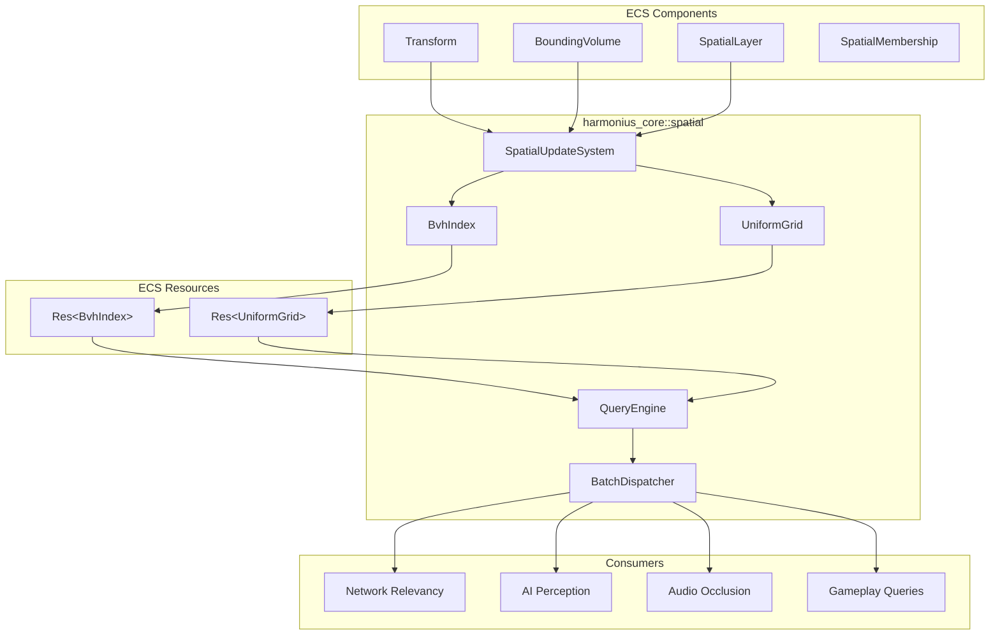
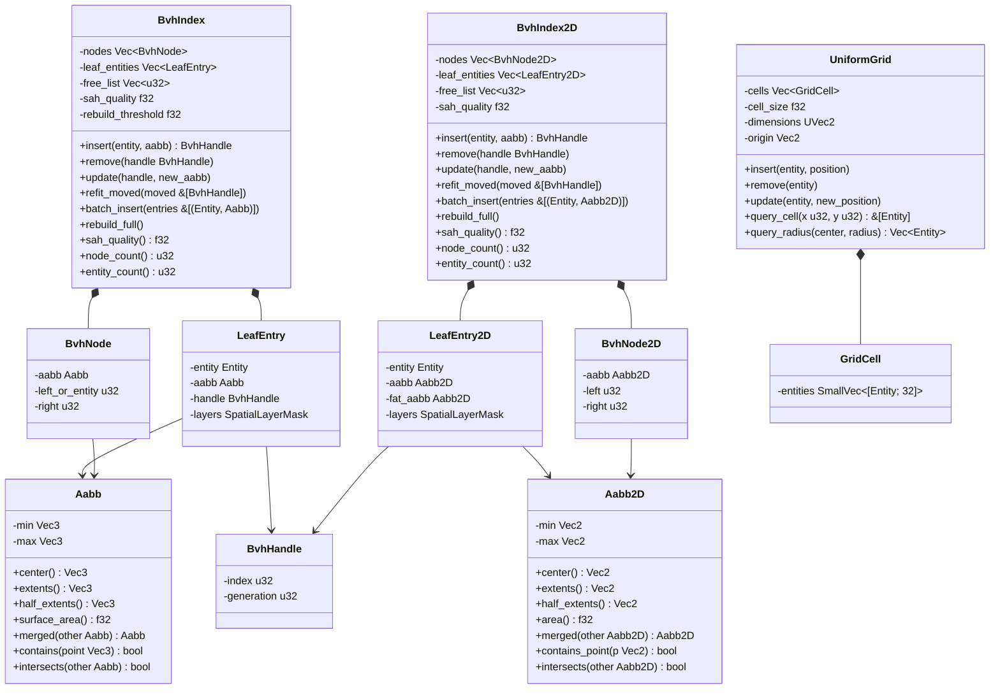
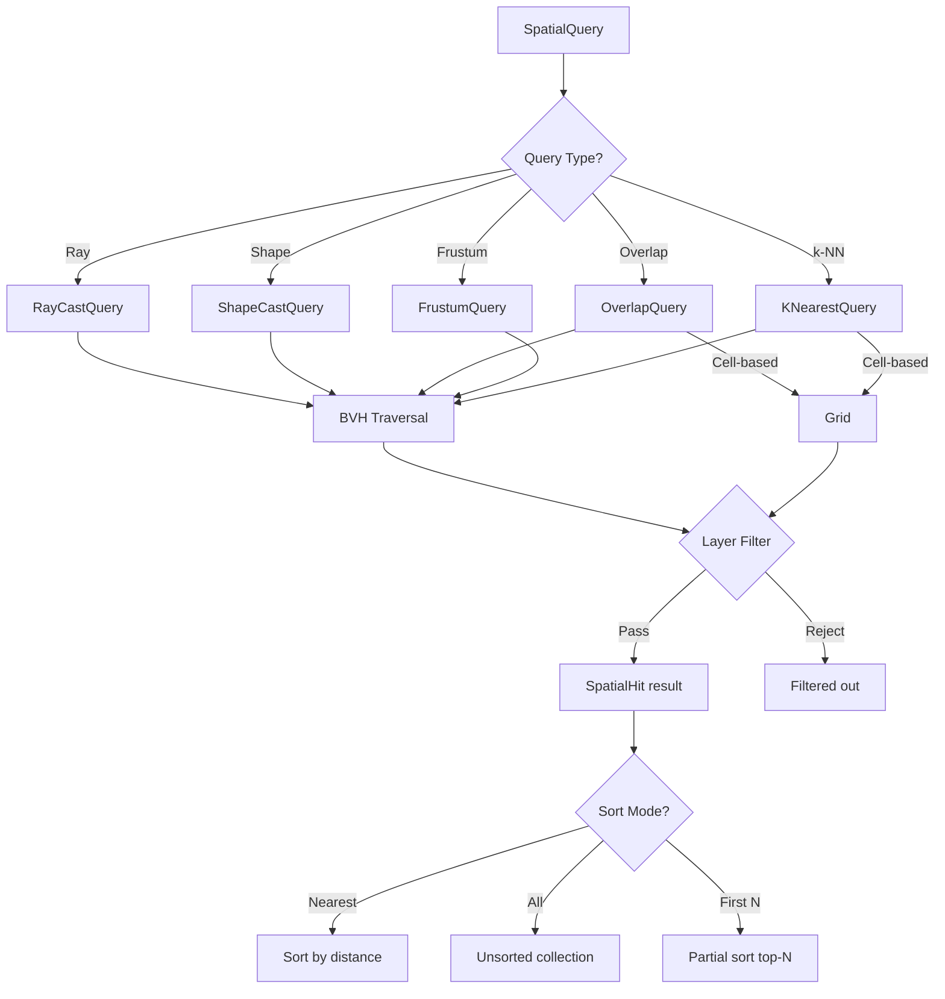
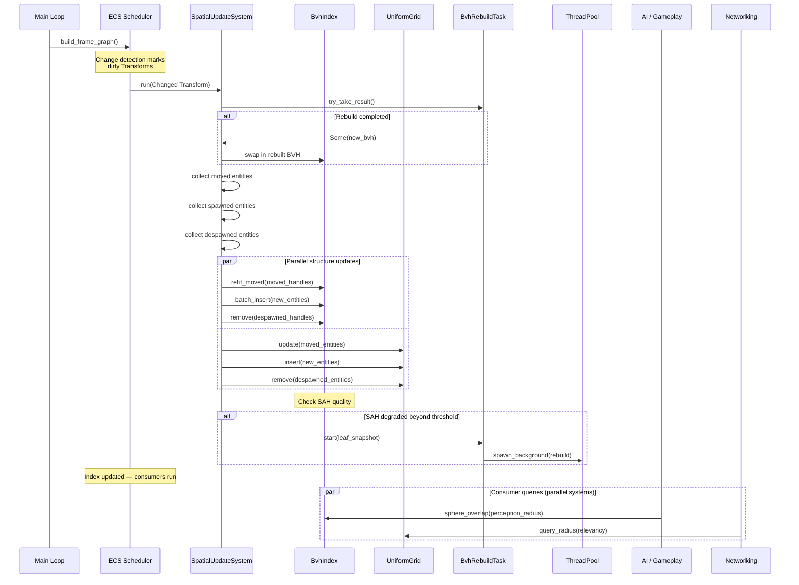
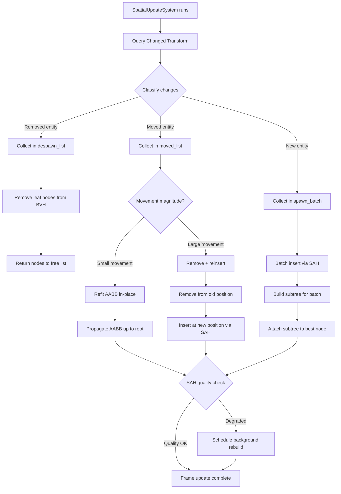
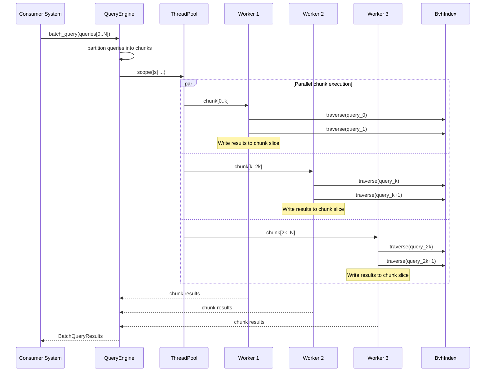
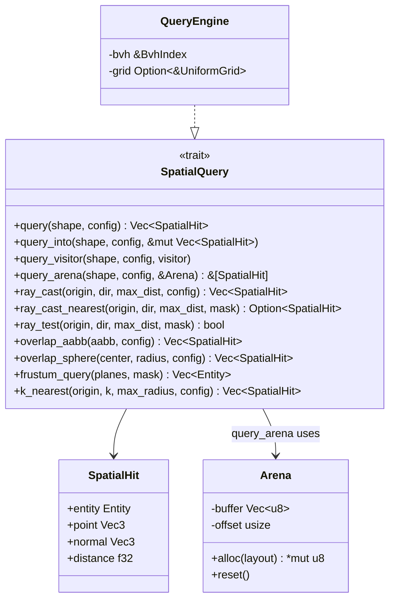

# Spatial Index Design

## Requirements Trace

> **Canonical sources:** Features, requirements, and user stories are defined in
> [features/core-runtime/](../../features/), [requirements/core-runtime/](../../requirements/), and
> [user-stories/core-runtime/](../../user-stories/). The table below traces design elements to those
> definitions.

### Acceleration Structures (F-1.9.1–3 / R-1.9.1–3)

| Feature | Requirement |
|---------|-------------|
| F-1.9.1 | R-1.9.1     |
| F-1.9.1 | R-1.9.1a    |
| F-1.9.2 | R-1.9.2     |
| F-1.9.3 | R-1.9.3     |

1. **F-1.9.1** — Shared BVH as ECS resource, updated once per frame, read by all subsystems
2. **F-1.9.1** — BVH memory <= 64 bytes/entity, SAH quality within 2x of full rebuild
3. **F-1.9.2** — Incremental BVH updates via change detection, cost proportional to moved entities
4. **F-1.9.3** — Optional grid alongside BVH for cell-based queries

### Query Interface (F-1.9.4–5 / R-1.9.4–5)

| Feature | Requirement |
|---------|-------------|
| F-1.9.4 | R-1.9.4     |
| F-1.9.4 | R-1.9.4a    |
| F-1.9.5 | R-1.9.5     |

1. **F-1.9.4** — Unified query API: ray, shape, overlap, frustum, k-NN with ECS filters
2. **F-1.9.4** — Ray cast < 10 us at 1M entities; frustum cull < 500 us at 1M entities
3. **F-1.9.5** — Batch parallel queries via thread pool with SIMD acceleration

### Consumer Integration (F-1.9.6–9 / R-1.9.6–9)

| Feature | Requirement |
|---------|-------------|
| F-1.9.6 | R-1.9.6     |
| F-1.9.7 | R-1.9.7     |
| F-1.9.8 | R-1.9.8     |
| F-1.9.9 | R-1.9.9     |

1. **F-1.9.6** — Physics maintains its own BVH (separate from shared BVH)
2. **F-1.9.7** — GPU compute shaders handle frustum + occlusion culling
3. **F-1.9.8** — Network relevancy uses grid for area-of-interest
4. **F-1.9.9** — AI perception and gameplay queries route through unified API

### Interoperability Contract

This design **defines** the `SpatialQuery` trait consumed by: AI, Audio, Gameplay, and Networking.
Physics maintains its own BVH (see physics design). GPU compute shaders handle rendering culling.

---

## Overview

The spatial indexing subsystem provides 2D and 3D BVH structures specific to spatial queries (ray,
AABB, sphere, frustum, k-NN). The primary acceleration structure is a BVH (Bounding Volume
Hierarchy) built with Surface Area Heuristic (SAH), stored as a shared ECS resource. The CPU-side
BVH is for gameplay queries (AI, AoE, raycasts), NOT for rendering culling. GPU compute shaders
handle frustum + occlusion culling (Nanite-style). Physics maintains its own BVH, separate from this
shared one; the physics design owns the physics BVH spec.

A dedicated ECS system (`SpatialUpdateSystem`) runs once per frame, before any consumer systems. It
uses change detection on `Transform` components to incrementally refit moved entities, batch-insert
spawned entities, and remove despawned entities. Full rebuilds happen in the background via a
double-buffered rebuild task that builds into a shadow buffer and swaps at the frame boundary.

All queries go through a unified `SpatialQuery` API that accepts query shapes (ray, AABB, sphere,
frustum, k-NN) and spatial layer masks. Batch queries are parallelized across worker threads via the
`ThreadPool::scope` API.

> **Phase ordering:** `SpatialUpdateSystem` runs at the **start of Phase 3 (Simulation)**, before
> any AI, physics, audio, or gameplay system that depends on the shared BVH. This guarantees every
> downstream system in Phase 3 and every subsequent phase reads a BVH that reflects the current
> transform snapshot. See [game-loop.md](game-loop.md) for the full phase ordering.
>
> **`UniformGrid<T>` relocated.** The network AOI / interest-management uniform grid has moved to
> [primitives.md](primitives.md). This document retains only the 2D/3D BVH structures specific to
> spatial queries.
>
> **`CellGrid` vs `UniformGrid<T>`.** The gameplay-propagating grid (for influence maps, fog of war,
> scent trails, NPC memory propagation) is a DIFFERENT type named `CellGrid` and lives in
> [simulation/grids-volumes.md](../simulation/grids-volumes.md). It is not a spatial index: it is a
> cell-based propagation scratchpad that the simulation drives per-tick. Do not confuse the two —
> `UniformGrid<T>` (primitives.md) is a static lookup structure, while `CellGrid` (simulation) is a
> dynamic propagation structure.

---

## Architecture

### Module Boundaries



### File Layout

```text
harmonius_core/
└── spatial/
    ├── mod.rs          # Public re-exports
    ├── aabb.rs         # Aabb, Aabb2D, math helpers
    ├── bvh.rs          # BvhIndex, BvhNode,
    │                   # BvhHandle, SAH build
    ├── bvh2d.rs        # BvhIndex2D, BvhNode2D,
    │                   # LeafEntry2D, SAH build 2D
    ├── grid.rs         # UniformGrid, GridCell
    ├── query.rs        # SpatialQuery trait,
    │                   # query shapes, results
    ├── batch.rs        # BatchDispatcher,
    │                   # parallel execution
    ├── layers.rs       # SpatialLayerMask,
    │                   # layer definitions
    ├── components.rs   # BoundingVolume,
    │                   # SpatialLayer,
    │                   # SpatialMembership
    └── systems.rs      # SpatialUpdateSystem,
                        # BvhRebuildTask
```

### Core Data Structures



### Query Type Dispatch



---

## API Design

### Primitive Types

```rust
/// Axis-aligned bounding box stored as min/max
/// corners for efficient intersection tests.
#[derive(Clone, Copy, Debug, PartialEq)]
pub struct Aabb {
    pub min: Vec3,
    pub max: Vec3,
}

impl Aabb {
    pub fn new(min: Vec3, max: Vec3) -> Self;
    pub fn from_center_extents(
        center: Vec3,
        half_extents: Vec3,
    ) -> Self;
    pub fn center(&self) -> Vec3;
    pub fn extents(&self) -> Vec3;
    pub fn half_extents(&self) -> Vec3;
    pub fn surface_area(&self) -> f32;
    pub fn volume(&self) -> f32;

    /// Merge two AABBs into the smallest enclosing
    /// AABB.
    pub fn merged(&self, other: &Aabb) -> Aabb;

    pub fn contains_point(&self, p: Vec3) -> bool;
    pub fn intersects(&self, other: &Aabb) -> bool;
    pub fn intersects_ray(
        &self,
        origin: Vec3,
        inv_dir: Vec3,
        t_max: f32,
    ) -> Option<f32>;
    pub fn intersects_sphere(
        &self,
        center: Vec3,
        radius: f32,
    ) -> bool;
    pub fn intersects_frustum(
        &self,
        planes: &[Vec4; 6],
    ) -> FrustumTest;

    /// Expand AABB by a margin for movement
    /// prediction (fattened AABB).
    pub fn expanded(&self, margin: f32) -> Aabb;
}

/// Result of frustum-AABB intersection test.
#[derive(Clone, Copy, Debug, PartialEq, Eq)]
pub enum FrustumTest {
    /// Entirely outside frustum.
    Outside,
    /// Partially inside — children must be tested.
    Intersecting,
    /// Entirely inside — skip child tests.
    Inside,
}

/// Oriented bounding box for shape casts.
#[derive(Clone, Copy, Debug)]
pub struct Obb {
    pub center: Vec3,
    pub half_extents: Vec3,
    pub orientation: Quat,
}

/// A sphere volume for overlap/k-NN queries.
#[derive(Clone, Copy, Debug)]
pub struct Sphere {
    pub center: Vec3,
    pub radius: f32,
}

/// 2D axis-aligned bounding box for 2D/2.5D games.
/// Operates on Vec2, eliminating the third-axis
/// overhead for games that don't need depth.
#[derive(Clone, Copy, Debug, PartialEq)]
pub struct Aabb2D {
    pub min: Vec2,
    pub max: Vec2,
}

impl Aabb2D {
    pub fn new(min: Vec2, max: Vec2) -> Self;
    pub fn from_center_extents(
        center: Vec2,
        half_extents: Vec2,
    ) -> Self;
    pub fn center(&self) -> Vec2;
    pub fn extents(&self) -> Vec2;
    pub fn half_extents(&self) -> Vec2;
    pub fn area(&self) -> f32;

    /// Merge two 2D AABBs into the smallest
    /// enclosing 2D AABB.
    pub fn merged(
        &self,
        other: &Aabb2D,
    ) -> Aabb2D;

    pub fn contains_point(
        &self,
        p: Vec2,
    ) -> bool;
    pub fn intersects(
        &self,
        other: &Aabb2D,
    ) -> bool;
    pub fn intersects_ray_2d(
        &self,
        origin: Vec2,
        inv_dir: Vec2,
        t_max: f32,
    ) -> Option<f32>;
    pub fn intersects_circle(
        &self,
        center: Vec2,
        radius: f32,
    ) -> bool;

    /// Expand 2D AABB by a margin for movement
    /// prediction (fattened AABB).
    pub fn expanded(&self, margin: f32) -> Aabb2D;
}
```

### Spatial Layers

```rust
/// Bitmask for spatial query layer filtering.
/// 32 layers allow AI, audio, networking, and
/// gameplay to define independent categories.
/// Queries specify which layers to test against.
#[derive(
    Clone, Copy, Debug, PartialEq, Eq, Hash,
)]
pub struct SpatialLayerMask(pub u32);

impl SpatialLayerMask {
    pub const ALL: Self = Self(u32::MAX);
    pub const NONE: Self = Self(0);

    pub const PHYSICS: Self = Self(1 << 0);
    pub const RENDERING: Self = Self(1 << 1);
    pub const NAVIGATION: Self = Self(1 << 2);
    pub const NETWORK: Self = Self(1 << 3);
    pub const AI_PERCEPTION: Self = Self(1 << 4);
    pub const AUDIO: Self = Self(1 << 5);
    pub const GAMEPLAY: Self = Self(1 << 6);
    pub const TRIGGER: Self = Self(1 << 7);

    /// Layers 8–31 available for user definition.
    pub const fn custom(bit: u32) -> Self {
        assert!(bit >= 8 && bit < 32);
        Self(1 << bit)
    }

    pub const fn contains(
        &self,
        other: Self,
    ) -> bool {
        (self.0 & other.0) != 0
    }

    pub const fn union(
        &self,
        other: Self,
    ) -> Self {
        Self(self.0 | other.0)
    }

    pub const fn intersection(
        &self,
        other: Self,
    ) -> Self {
        Self(self.0 & other.0)
    }
}
```

### ECS Components

```rust
/// The bounding volume for an entity in the
/// spatial index. Automatically computed from
/// mesh bounds, collider shapes, or set manually.
#[derive(Component, Clone, Debug)]
pub enum BoundingVolume {
    /// Axis-aligned bounding box.
    Aabb(Aabb),
    /// Bounding sphere.
    Sphere(Sphere),
    /// Oriented bounding box (converted to AABB
    /// for BVH storage, used for narrow tests).
    Obb(Obb),
}

impl BoundingVolume {
    /// Compute the enclosing AABB regardless of
    /// the underlying volume type. This AABB is
    /// stored in the BVH leaf.
    pub fn enclosing_aabb(&self) -> Aabb;
}

/// Which spatial layers this entity belongs to.
/// Determines which queries can find it.
#[derive(Component, Clone, Copy, Debug)]
pub struct SpatialLayer {
    pub mask: SpatialLayerMask,
}

impl Default for SpatialLayer {
    fn default() -> Self {
        Self {
            mask: SpatialLayerMask::ALL,
        }
    }
}

/// Internal bookkeeping component. Tracks the
/// entity's handle in each spatial structure.
/// Managed exclusively by SpatialUpdateSystem.
/// Users never add or modify this directly.
#[derive(Component, Debug)]
pub struct SpatialMembership {
    pub bvh_handle: Option<BvhHandle>,
    pub grid_cell: Option<GridCoord>,
}
```

### BVH Index

```rust
/// Generational handle into the BVH. Enables
/// O(1) lookup for incremental updates. Invalid
/// handles (stale generation) are safely rejected.
///
/// BvhHandle wraps the engine-wide `Handle<T>`
/// generational index (see
/// [algorithms.md](algorithms.md)).
#[derive(
    Clone, Copy, Debug, PartialEq, Eq, Hash,
)]
pub struct BvhHandle {
    index: u32,
    generation: u32,
}

/// Internal BVH node. 32 bytes on 64-bit
/// platforms. Two nodes fit in one 64-byte
/// cache line. Four fit in one 128-byte Apple
/// Silicon cache line.
///
/// `is_leaf` is packed into the MSB of `left`.
/// Bit 31 = 1 means leaf; bits 0..30 store
/// the entity index. Bit 31 = 0 means internal
/// node; bits 0..30 store the left child index.
///
/// Parent pointers are stored in a separate
/// parallel `parents: Vec<u32>` array on
/// `BvhIndex` to keep the hot traversal node
/// at exactly 32 bytes.
#[repr(C)]
struct BvhNode {
    /// Enclosing AABB for this subtree.
    aabb: Aabb,         // 24 bytes
    /// MSB = is_leaf flag. Bits 0..30:
    ///   leaf -> entity index
    ///   internal -> left child index
    left: u32,          // 4 bytes
    /// Right child index (internal).
    /// Unused for leaves.
    right: u32,         // 4 bytes
}
// Total: 24 + 4 + 4 = 32 bytes exactly

/// Leaf entry storing per-entity spatial data.
struct LeafEntry {
    entity: Entity,
    aabb: Aabb,
    layers: SpatialLayerMask,
    /// Fattened AABB used as movement margin.
    /// If the entity's new AABB still fits inside
    /// the fattened AABB, no refit is needed.
    fat_aabb: Aabb,
}

/// Configuration for BVH construction and
/// maintenance.
pub struct BvhConfig {
    /// SAH traversal cost relative to
    /// intersection cost. Default: 1.0.
    pub traversal_cost: f32,
    /// Number of SAH split candidates per axis.
    /// Default: 12.
    pub sah_bins: u32,
    /// Margin added to leaf AABBs to reduce
    /// refits for small movements. Default: 0.1.
    pub fat_aabb_margin: f32,
    /// Multiplier threshold for SAH quality
    /// degradation. Triggers background rebuild
    /// when exceeded. Default: 2.0.
    pub rebuild_quality_threshold: f32,
    /// Maximum entities before switching from
    /// brute-force to SAH build. Default: 8.
    pub leaf_threshold: u32,
}

/// The primary spatial acceleration structure.
/// Stored as an ECS resource: `Res<BvhIndex>`.
pub struct BvhIndex {
    nodes: Vec<BvhNode>,
    /// Parallel array: parents[i] is the parent
    /// of nodes[i]. Kept separate so BvhNode
    /// stays at 32 bytes for cache efficiency.
    parents: Vec<u32>,
    leaves: Vec<LeafEntry>,
    handles: Vec<HandleSlot>,
    free_nodes: Vec<u32>,
    free_handles: Vec<u32>,
    root: u32,
    config: BvhConfig,
    sah_quality: f32,
    entity_count: u32,
}

impl BvhIndex {
    pub fn new(config: BvhConfig) -> Self;

    // --- Mutation (used by SpatialUpdateSystem) ---

    /// Insert a single entity. Returns a handle
    /// for future update/remove. Uses SAH to find
    /// the optimal insertion point.
    pub fn insert(
        &mut self,
        entity: Entity,
        aabb: Aabb,
        layers: SpatialLayerMask,
    ) -> BvhHandle;

    /// Batch-insert multiple entities. Builds a
    /// temporary subtree via top-down SAH then
    /// grafts it onto the best existing node.
    pub fn batch_insert(
        &mut self,
        entries: &[(Entity, Aabb, SpatialLayerMask)],
    ) -> Vec<BvhHandle>;

    /// Remove an entity by handle. Returns the
    /// node to the free list and collapses the
    /// parent if it becomes a single-child node.
    pub fn remove(
        &mut self,
        handle: BvhHandle,
    ) -> Result<(), SpatialError>;

    /// Update an entity's AABB. If the new AABB
    /// fits within the fattened AABB, no tree
    /// modification occurs (fast path). Otherwise,
    /// remove + reinsert.
    pub fn update(
        &mut self,
        handle: BvhHandle,
        new_aabb: Aabb,
        new_layers: SpatialLayerMask,
    ) -> Result<(), SpatialError>;

    /// Refit multiple moved entities in batch.
    /// For each handle: if new AABB exceeds fat
    /// AABB, remove + reinsert. Otherwise refit
    /// leaf AABB and propagate up to root.
    pub fn refit_moved(
        &mut self,
        updates: &[(BvhHandle, Aabb)],
    );

    /// Full SAH rebuild from all current leaves.
    /// Called when incremental quality degrades.
    pub fn rebuild_full(&mut self);

    // --- Read-only queries ---

    /// Current SAH quality metric. 1.0 = optimal
    /// (freshly built). Higher = degraded.
    pub fn sah_quality(&self) -> f32;
    pub fn node_count(&self) -> u32;
    pub fn entity_count(&self) -> u32;

    // --- Traversal (internal, used by queries) ---

    /// Traverse the BVH with a ray. Calls
    /// `visitor` for each leaf whose AABB the ray
    /// intersects. Early-out when visitor returns
    /// `false`.
    fn traverse_ray<F>(
        &self,
        origin: Vec3,
        inv_dir: Vec3,
        t_max: f32,
        layer_mask: SpatialLayerMask,
        visitor: F,
    ) where
        F: FnMut(&LeafEntry, f32) -> bool;

    /// Traverse with an AABB overlap test.
    fn traverse_aabb<F>(
        &self,
        query_aabb: &Aabb,
        layer_mask: SpatialLayerMask,
        visitor: F,
    ) where
        F: FnMut(&LeafEntry) -> bool;

    /// Traverse with a frustum test.
    fn traverse_frustum<F>(
        &self,
        planes: &[Vec4; 6],
        layer_mask: SpatialLayerMask,
        visitor: F,
    ) where
        F: FnMut(&LeafEntry, FrustumTest);
}
```

### BVH Index 2D

2D BVH variant for 2D/2.5D games. Uses `Aabb2D` leaf nodes (16 bytes vs 24 bytes for 3D). The same
SAH build and incremental refit algorithms apply; the third axis is simply absent. Both `BvhIndex`
and `BvhIndex2D` implement the same `SpatialQuery` trait, so consumers can be written generically.

```rust
/// Internal 2D BVH node. 24 bytes on 64-bit
/// platforms. Two nodes fit in one 48-byte span;
/// on Apple Silicon (128-byte cache lines) five
/// nodes fit.
///
/// `is_leaf` is packed into the MSB of `left`
/// using the same convention as `BvhNode`.
#[repr(C)]
struct BvhNode2D {
    /// Enclosing 2D AABB for this subtree.
    aabb: Aabb2D,        // 16 bytes
    /// MSB = is_leaf flag. Bits 0..30:
    ///   leaf -> entity index
    ///   internal -> left child index
    left: u32,           // 4 bytes
    /// Right child index (internal).
    right: u32,          // 4 bytes
}
// Total: 16 + 4 + 4 = 24 bytes

/// Leaf entry for 2D BVH.
struct LeafEntry2D {
    entity: Entity,
    aabb: Aabb2D,
    layers: SpatialLayerMask,
    /// Fattened 2D AABB for movement margin.
    fat_aabb: Aabb2D,
}

/// 2D BVH index for 2D and 2.5D games.
/// Stored as ECS resource: `Res<BvhIndex2D>`.
/// Drop-in alternative to `BvhIndex` for scenes
/// using 2D transforms (`Transform2D`).
pub struct BvhIndex2D {
    nodes: Vec<BvhNode2D>,
    parents: Vec<u32>,
    leaves: Vec<LeafEntry2D>,
    handles: Vec<HandleSlot>,
    free_nodes: Vec<u32>,
    free_handles: Vec<u32>,
    root: u32,
    config: BvhConfig,
    sah_quality: f32,
    entity_count: u32,
}

impl BvhIndex2D {
    pub fn new(config: BvhConfig) -> Self;

    // --- Mutation (used by SpatialUpdateSystem) ---

    pub fn insert(
        &mut self,
        entity: Entity,
        aabb: Aabb2D,
        layers: SpatialLayerMask,
    ) -> BvhHandle;

    pub fn batch_insert(
        &mut self,
        entries: &[(Entity, Aabb2D, SpatialLayerMask)],
    ) -> Vec<BvhHandle>;

    pub fn remove(
        &mut self,
        handle: BvhHandle,
    ) -> Result<(), SpatialError>;

    pub fn update(
        &mut self,
        handle: BvhHandle,
        new_aabb: Aabb2D,
        new_layers: SpatialLayerMask,
    ) -> Result<(), SpatialError>;

    pub fn refit_moved(
        &mut self,
        updates: &[(BvhHandle, Aabb2D)],
    );

    pub fn rebuild_full(&mut self);

    // --- Read-only queries ---

    pub fn sah_quality(&self) -> f32;
    pub fn node_count(&self) -> u32;
    pub fn entity_count(&self) -> u32;

    // --- Traversal (internal) ---

    fn traverse_ray_2d<F>(
        &self,
        origin: Vec2,
        inv_dir: Vec2,
        t_max: f32,
        layer_mask: SpatialLayerMask,
        visitor: F,
    ) where
        F: FnMut(&LeafEntry2D, f32) -> bool;

    fn traverse_aabb_2d<F>(
        &self,
        query_aabb: &Aabb2D,
        layer_mask: SpatialLayerMask,
        visitor: F,
    ) where
        F: FnMut(&LeafEntry2D) -> bool;
}
```

### Uniform Grid (2D)

```rust
/// 2D grid coordinate.
#[derive(
    Clone, Copy, Debug, PartialEq, Eq, Hash,
)]
pub struct GridCoord {
    pub x: u32,
    pub y: u32,
}

pub struct GridConfig {
    /// Side length of each grid cell in world
    /// units.
    pub cell_size: f32,
    /// Grid dimensions (cell count per axis).
    pub dimensions: UVec2,
    /// World-space origin of the grid's (0,0)
    /// corner.
    pub origin: Vec2,
}

/// 2D uniform grid for flat-world queries
/// (network relevancy, zone assignment).
/// Stored as ECS resource: `Res<UniformGrid>`.
pub struct UniformGrid {
    cells: Vec<GridCell>,
    config: GridConfig,
}

struct GridCell {
    entities: SmallVec<[Entity; 32]>,
}

impl UniformGrid {
    pub fn new(config: GridConfig) -> Self;

    pub fn insert(
        &mut self,
        entity: Entity,
        position: Vec2,
    ) -> GridCoord;

    pub fn remove(
        &mut self,
        entity: Entity,
        cell: GridCoord,
    );

    pub fn update(
        &mut self,
        entity: Entity,
        old_cell: GridCoord,
        new_position: Vec2,
    ) -> GridCoord;

    /// All entities in a specific cell.
    pub fn query_cell(
        &self,
        coord: GridCoord,
    ) -> &[Entity];

    /// All entities within radius of a point.
    pub fn query_radius(
        &self,
        center: Vec2,
        radius: f32,
    ) -> Vec<Entity>;

    /// All entities within a rectangular region.
    pub fn query_rect(
        &self,
        min: Vec2,
        max: Vec2,
    ) -> Vec<Entity>;

    /// Convert world position to grid coordinate.
    pub fn world_to_cell(
        &self,
        position: Vec2,
    ) -> Option<GridCoord>;

    pub fn cell_count(&self) -> u32;
}
```

### Unified Query API — SpatialQuery Trait

This is the interoperability contract consumed by AI, Audio, Gameplay, and Networking. Physics
maintains its own BVH. GPU compute shaders handle rendering culling.

```rust
/// A single spatial query result.
#[derive(Clone, Debug)]
pub struct SpatialHit {
    /// The entity that was hit.
    pub entity: Entity,
    /// World-space hit point (ray/shape casts).
    /// For overlap queries, this is the closest
    /// point on the entity's AABB.
    pub point: Vec3,
    /// Surface normal at hit point. Zero vector
    /// for overlap queries.
    pub normal: Vec3,
    /// Distance from query origin (ray/shape
    /// casts). For overlap queries, this is the
    /// penetration depth.
    pub distance: f32,
}

/// Configuration for spatial queries.
#[derive(Clone, Debug)]
pub struct QueryConfig {
    /// Layer mask filter. Only entities whose
    /// SpatialLayer intersects this mask are
    /// returned.
    pub layer_mask: SpatialLayerMask,
    /// Maximum number of results. 0 = unlimited.
    pub max_results: u32,
    /// Sort mode for results.
    pub sort: QuerySort,
}

impl Default for QueryConfig {
    fn default() -> Self {
        Self {
            layer_mask: SpatialLayerMask::ALL,
            max_results: 0,
            sort: QuerySort::Nearest,
        }
    }
}

/// How to sort query results.
#[derive(Clone, Copy, Debug, PartialEq, Eq)]
pub enum QuerySort {
    /// Sort by distance ascending (closest
    /// first). Default for ray casts.
    Nearest,
    /// No sorting. Fastest for overlap queries
    /// where order does not matter.
    Unsorted,
}

/// The query shapes that can be submitted.
#[derive(Clone, Debug)]
pub enum QueryShape {
    /// Ray cast: origin + direction + max distance.
    Ray {
        origin: Vec3,
        direction: Vec3,
        max_distance: f32,
    },
    /// Shape cast: sweep an AABB along a direction.
    ShapeCast {
        shape: Aabb,
        direction: Vec3,
        max_distance: f32,
    },
    /// AABB overlap test.
    AabbOverlap(Aabb),
    /// Sphere overlap test.
    SphereOverlap(Sphere),
    /// Frustum query (6 planes).
    Frustum([Vec4; 6]),
    /// k-nearest neighbors from a point.
    KNearest {
        origin: Vec3,
        k: u32,
        max_radius: f32,
    },
}

/// The core spatial query trait. This is the
/// interoperability contract: all consumer
/// subsystems depend on this trait, not on
/// concrete index types.
///
/// Implemented by `QueryEngine` which dispatches
/// to `BvhIndex` or `UniformGrid` based on
/// query type and configuration.
pub trait SpatialQuery {
    /// Execute a single spatial query.
    fn query(
        &self,
        shape: &QueryShape,
        config: &QueryConfig,
    ) -> Vec<SpatialHit>;

    /// Execute a single ray cast. Convenience
    /// method equivalent to `query(Ray{..})`.
    fn ray_cast(
        &self,
        origin: Vec3,
        direction: Vec3,
        max_distance: f32,
        config: &QueryConfig,
    ) -> Vec<SpatialHit>;

    /// Execute a single ray cast, returning only
    /// the nearest hit. More efficient than
    /// `ray_cast` with `max_results=1` because
    /// the traversal can early-out.
    fn ray_cast_nearest(
        &self,
        origin: Vec3,
        direction: Vec3,
        max_distance: f32,
        layer_mask: SpatialLayerMask,
    ) -> Option<SpatialHit>;

    /// Test whether a ray hits anything at all.
    /// Most efficient ray query — stops at first
    /// intersection.
    fn ray_test(
        &self,
        origin: Vec3,
        direction: Vec3,
        max_distance: f32,
        layer_mask: SpatialLayerMask,
    ) -> bool;

    /// Find all entities whose AABB overlaps the
    /// given AABB.
    fn overlap_aabb(
        &self,
        aabb: &Aabb,
        config: &QueryConfig,
    ) -> Vec<SpatialHit>;

    /// Find all entities within a sphere.
    fn overlap_sphere(
        &self,
        center: Vec3,
        radius: f32,
        config: &QueryConfig,
    ) -> Vec<SpatialHit>;

    /// Frustum culling query. Returns all entities
    /// whose AABB is inside or intersecting the
    /// frustum.
    fn frustum_query(
        &self,
        planes: &[Vec4; 6],
        layer_mask: SpatialLayerMask,
    ) -> Vec<Entity>;

    /// Find the k nearest entities to a point.
    fn k_nearest(
        &self,
        origin: Vec3,
        k: u32,
        max_radius: f32,
        config: &QueryConfig,
    ) -> Vec<SpatialHit>;
}
```

### Query Engine

```rust
/// Concrete implementation of `SpatialQuery`
/// that dispatches to the underlying index
/// structures. Stored as ECS resource alongside
/// the indices.
pub struct QueryEngine<'a> {
    bvh: &'a BvhIndex,
    grid: Option<&'a UniformGrid>,
}

impl<'a> QueryEngine<'a> {
    pub fn new(
        bvh: &'a BvhIndex,
        grid: Option<&'a UniformGrid>,
    ) -> Self;
}

impl<'a> SpatialQuery for QueryEngine<'a> {
    // All methods dispatch to BvhIndex traversal
    // functions, with optional grid used for
    // cell-based overlap and range queries.
    // See individual method docs above.

    fn query(
        &self,
        shape: &QueryShape,
        config: &QueryConfig,
    ) -> Vec<SpatialHit> { /* dispatch */ }

    fn ray_cast(
        &self,
        origin: Vec3,
        direction: Vec3,
        max_distance: f32,
        config: &QueryConfig,
    ) -> Vec<SpatialHit> { /* ... */ }

    fn ray_cast_nearest(
        &self,
        origin: Vec3,
        direction: Vec3,
        max_distance: f32,
        layer_mask: SpatialLayerMask,
    ) -> Option<SpatialHit> { /* ... */ }

    fn ray_test(
        &self,
        origin: Vec3,
        direction: Vec3,
        max_distance: f32,
        layer_mask: SpatialLayerMask,
    ) -> bool { /* ... */ }

    fn overlap_aabb(
        &self,
        aabb: &Aabb,
        config: &QueryConfig,
    ) -> Vec<SpatialHit> { /* ... */ }

    fn overlap_sphere(
        &self,
        center: Vec3,
        radius: f32,
        config: &QueryConfig,
    ) -> Vec<SpatialHit> { /* ... */ }

    fn frustum_query(
        &self,
        planes: &[Vec4; 6],
        layer_mask: SpatialLayerMask,
    ) -> Vec<Entity> { /* ... */ }

    fn k_nearest(
        &self,
        origin: Vec3,
        k: u32,
        max_radius: f32,
        config: &QueryConfig,
    ) -> Vec<SpatialHit> { /* ... */ }
}
```

### Batch Query Dispatcher

```rust
/// A batch of queries to execute in parallel.
pub struct BatchQuery {
    pub shape: QueryShape,
    pub config: QueryConfig,
}

/// Results for one query in a batch.
pub struct BatchQueryResult {
    /// Index of this query in the original batch.
    pub query_index: u32,
    pub hits: Vec<SpatialHit>,
}

/// Dispatches batches of spatial queries across
/// worker threads using `ThreadPool::scope`.
pub struct BatchDispatcher<'a> {
    query_engine: &'a QueryEngine<'a>,
    pool: &'a ThreadPool,
}

impl<'a> BatchDispatcher<'a> {
    pub fn new(
        query_engine: &'a QueryEngine<'a>,
        pool: &'a ThreadPool,
    ) -> Self;

    /// Execute a batch of queries in parallel.
    /// Queries are partitioned into chunks,
    /// one per worker thread. Each chunk runs
    /// sequentially on its worker, all chunks
    /// run in parallel. Results are returned in
    /// submission order.
    pub fn execute_batch(
        &self,
        queries: &[BatchQuery],
    ) -> Vec<BatchQueryResult> {
        let chunk_size = (queries.len()
            / self.pool.worker_count() as usize)
            .max(1);

        let mut results: Vec<BatchQueryResult> =
            Vec::with_capacity(queries.len());

        // Pre-allocate result slots
        results.resize_with(
            queries.len(),
            || BatchQueryResult {
                query_index: 0,
                hits: Vec::new(),
            },
        );

        // Pre-split results into disjoint mutable
        // chunks before entering scope. Each task
        // owns its chunk exclusively — no shared
        // &mut aliasing.
        let query_chunks: Vec<&[BatchQuery]> =
            queries.chunks(chunk_size).collect();
        let result_chunks: Vec<&mut [BatchQueryResult]> =
            results.chunks_mut(chunk_size).collect();

        self.pool.scope(|scope| {
            for (chunk_idx, (q_chunk, r_chunk))
                in query_chunks
                    .iter()
                    .zip(result_chunks)
                    .enumerate()
            {
                let offset =
                    chunk_idx * chunk_size;
                let engine =
                    self.query_engine;

                scope.spawn(move || {
                    for (i, q)
                        in q_chunk
                            .iter()
                            .enumerate()
                    {
                        let hits = engine.query(
                            &q.shape,
                            &q.config,
                        );
                        r_chunk[i] =
                            BatchQueryResult {
                                query_index:
                                    (offset + i)
                                        as u32,
                                hits,
                            };
                    }
                });
            }
        });

        results
    }

    /// Convenience: batch ray cast.
    pub fn batch_ray_cast(
        &self,
        rays: &[(Vec3, Vec3, f32)],
        config: &QueryConfig,
    ) -> Vec<BatchQueryResult>;

    /// Convenience: batch frustum cull for
    /// multiple views (main camera + shadow
    /// cascades + reflection probes).
    pub fn batch_frustum_cull(
        &self,
        frustums: &[[Vec4; 6]],
        layer_mask: SpatialLayerMask,
    ) -> Vec<Vec<Entity>>;
}
```

### ECS Systems

```rust
/// Runs once per frame before any consumer
/// system. Reads changed/added/removed Transform
/// components and updates all spatial index
/// structures incrementally.
///
/// System ordering:
///   TransformPropagation
///     -> SpatialUpdateSystem
///       -> [AI, Audio, Gameplay, Networking]
pub fn spatial_update_system(
    // Changed transforms
    moved: Query<
        (
            Entity,
            &Transform,
            &BoundingVolume,
            &SpatialLayer,
            &mut SpatialMembership,
        ),
        Changed<Transform>,
    >,
    // Newly added entities with spatial presence
    added: Query<
        (
            Entity,
            &Transform,
            &BoundingVolume,
            &SpatialLayer,
        ),
        Added<BoundingVolume>,
    >,
    // Entities whose BoundingVolume was removed
    removed: RemovedComponents<BoundingVolume>,
    // Mutable access to spatial indices
    mut bvh: ResMut<BvhIndex>,
    mut grid: Option<ResMut<UniformGrid>>,
    mut rebuild_task: ResMut<BvhRebuildTask>,
) {
    // 0. Check if background rebuild completed
    if let Some(new_bvh) =
        rebuild_task.try_take_result()
    {
        // Swap shadow buffer into active BVH
        *bvh = new_bvh;
    }

    // 1. Handle despawned entities
    for entity in removed.iter() {
        // Look up SpatialMembership, remove from
        // each index structure
    }

    // 2. Handle moved entities
    for (entity, tf, bv, layer, mut membership)
        in moved.iter_mut()
    {
        let world_aabb =
            bv.enclosing_aabb()
                .transformed(tf);

        if let Some(handle) =
            membership.bvh_handle
        {
            bvh.update(
                handle,
                world_aabb,
                layer.mask,
            );
        }

        if let Some(ref mut grid) = grid {
            if let Some(old_cell) =
                membership.grid_cell
            {
                membership.grid_cell =
                    Some(grid.update(
                        entity,
                        old_cell,
                        tf.translation.xz(),
                    ));
            }
        }
    }

    // 3. Handle newly spawned entities
    let spawn_batch: Vec<_> = added
        .iter()
        .map(|(e, tf, bv, layer)| {
            let aabb =
                bv.enclosing_aabb()
                    .transformed(tf);
            (e, aabb, layer.mask, tf.translation)
        })
        .collect();

    let handles =
        bvh.batch_insert(&spawn_batch);

    // Assign membership for new entities
    // (via command buffer)

    // 4. Check BVH quality — schedule
    // double-buffered rebuild if degraded
    if bvh.sah_quality()
        > bvh.config.rebuild_quality_threshold
        && !rebuild_task.is_running()
    {
        rebuild_task.start(bvh.snapshot_leaves());
    }
}

/// Double-buffered BVH rebuild task. Builds a
/// new BVH into a shadow buffer on a background
/// worker thread. The active BVH continues
/// serving queries while the rebuild runs.
/// `spatial_update_system` polls for completion
/// and swaps the result at frame boundary.
pub struct BvhRebuildTask {
    /// Handle to the background task, if running.
    task: Option<TaskHandle<BvhIndex>>,
}

impl BvhRebuildTask {
    /// Start a background rebuild from the
    /// current leaf snapshot. Does nothing if a
    /// rebuild is already in progress.
    pub fn start(
        &mut self,
        leaves: Vec<LeafEntry>,
    ) {
        if self.task.is_some() {
            return;
        }
        self.task = Some(
            ThreadPool::spawn_background(
                move || {
                    BvhIndex::build_from_leaves(
                        &leaves,
                    )
                },
            ),
        );
    }

    /// Poll for completion. Returns the rebuilt
    /// BVH if the task finished, None otherwise.
    pub fn try_take_result(
        &mut self,
    ) -> Option<BvhIndex> {
        if let Some(ref task) = self.task {
            if task.is_finished() {
                return self
                    .task
                    .take()
                    .and_then(|t| t.join().ok());
            }
        }
        None
    }

    pub fn is_running(&self) -> bool {
        self.task.is_some()
    }
}
```

### Error Types

```rust
#[derive(Clone, Debug, PartialEq, Eq)]
pub enum SpatialError {
    /// BvhHandle's generation does not match.
    /// Entity was removed and handle is stale.
    StaleHandle {
        handle: BvhHandle,
    },
    /// Entity not found in the specified index.
    EntityNotFound {
        entity: Entity,
    },
    /// Grid coordinate out of bounds.
    OutOfBounds {
        coord: GridCoord,
        dimensions: UVec2,
    },
}
```

---

## Data Flow

### Frame Update Sequence



### Incremental BVH Update Algorithm



### Fattened AABB Optimization

Leaf nodes store a "fattened" AABB that is slightly larger than the entity's actual AABB. When an
entity moves, the system checks whether the new AABB still fits within the fat AABB. If it does, no
tree modification is needed — only the leaf's actual AABB is updated. This eliminates the vast
majority of refits for entities with small, continuous movements.

```rust
// Fast path: new AABB fits in fat AABB
if fat_aabb.contains_aabb(&new_aabb) {
    leaf.aabb = new_aabb;
    // No tree structure change needed
    return;
}

// Slow path: refit with new fat AABB
let velocity_prediction =
    (new_aabb.center() - leaf.aabb.center())
    * PREDICTION_MULTIPLIER;
let new_fat = new_aabb
    .expanded(config.fat_aabb_margin)
    .expanded_directional(velocity_prediction);
leaf.aabb = new_aabb;
leaf.fat_aabb = new_fat;
// Propagate AABB change up to root
propagate_up(node_index);
```

### Batch Query Parallel Execution



### Consumer System Examples

```rust
// NOTE: Physics maintains its own BVH (see
// physics design). GPU compute shaders handle
// frustum + occlusion culling. The examples
// below show consumers of the shared BVH.

// --- AI perception ---
fn ai_perception_system(
    bvh: Res<BvhIndex>,
    agents: Query<(Entity, &AiAgent, &Transform)>,
    pool: Res<ThreadPool>,
) {
    let engine = QueryEngine::new(
        &bvh, None,
    );
    let dispatcher =
        BatchDispatcher::new(&engine, &pool);

    let queries: Vec<BatchQuery> = agents
        .iter()
        .map(|(_, agent, tf)| BatchQuery {
            shape: QueryShape::SphereOverlap(
                Sphere {
                    center: tf.translation,
                    radius: agent.perception_radius,
                },
            ),
            config: QueryConfig {
                layer_mask:
                    SpatialLayerMask::AI_PERCEPTION,
                ..Default::default()
            },
        })
        .collect();

    let results =
        dispatcher.execute_batch(&queries);
    // Filter by sight cone, hearing, etc.
}

// --- Gameplay AoE query ---
fn aoe_damage_system(
    bvh: Res<BvhIndex>,
    explosions: Query<(&Explosion, &Transform)>,
) {
    let engine = QueryEngine::new(
        &bvh, None,
    );

    for (explosion, tf) in explosions.iter() {
        let hits = engine.overlap_sphere(
            tf.translation,
            explosion.radius,
            &QueryConfig {
                layer_mask:
                    SpatialLayerMask::GAMEPLAY,
                ..Default::default()
            },
        );
        // Apply damage falloff by distance...
    }
}

// --- Network relevancy ---
fn network_relevancy_system(
    grid: Res<UniformGrid>,
    players: Query<(Entity, &Player, &Transform)>,
) {
    for (entity, player, tf) in players.iter() {
        let nearby = grid.query_radius(
            tf.translation.xz(),
            player.relevancy_radius,
        );
        // Update replication interest set...
    }
}
```

---

## Platform Considerations

### BVH Node Layout and Cache Performance

| Platform | Cache Line | Nodes/Line | Strategy |
|----------|-----------|------------|----------|
| Desktop (x86_64) | 64 B | 2 | BvhNode = 32 B, pairs fit one line |
| Mobile (ARM) | 64 B | 2 | Same layout, NEON SIMD for AABB tests |
| Apple Silicon | 128 B | 4 | Wider prefetch; 4 nodes per line |

`BvhNode` is 32 bytes (`#[repr(C)]`). On x86_64 and ARM, two nodes fit in one 64-byte cache line. On
Apple Silicon (128-byte cache lines), four nodes fit. Depth-first traversal order maximizes spatial
locality during BVH walks.

### SIMD Acceleration

Ray-AABB intersection uses SIMD on all platforms:

| Platform | ISA | Intrinsics |
|----------|-----|------------|
| x86_64 | SSE4.1 / AVX2 | `_mm_max_ps`, `_mm_min_ps` for slab test |
| ARM | NEON | `vmaxq_f32`, `vminq_f32` |
| Apple Silicon | NEON | Same as ARM (NEON) |

The ray-AABB slab test computes entry/exit t-values for all 3 axes simultaneously using 4-wide SIMD.
For batch queries, 4 rays can be tested against one AABB node using SOA (structure-of-arrays) ray
layout.

### Scaling Tiers

| Tier | Max Entities | BVH Memory | Grid Size | Batch Limit |
|------|-------------|------------|-----------|-------------|
| Mobile | 50K | ~3 MB | 64 x 64 | 64 queries |
| Switch | 200K | ~12 MB | 128 x 128 | 128 queries |
| Desktop | 1M | ~60 MB | 256 x 256 | 1024 queries |
| High-end | 5M+ | ~300 MB | 512 x 512 | 4096+ queries |

Memory budget per entity: 32 bytes (BvhNode) + 4 bytes (parent in parallel array) + 24 bytes
(LeafEntry: entity + aabb + layers) = 60 bytes. Fat AABBs are stored in a separate parallel
`fat_aabbs: Vec<Aabb>` array (24 bytes) for a total of 84 bytes when fat AABBs are enabled. The base
60 bytes are within the 64-byte R-1.9.1a requirement; fat AABBs are an opt-in tradeoff (memory for
fewer refits).

### Thread Safety Model

The spatial index follows a read-many/write-once model per frame:

1. **Write phase:** `SpatialUpdateSystem` has exclusive `ResMut<BvhIndex>` access. No other system
   can read or write the index. The ECS scheduler enforces this via resource access declarations.
2. **Read phase:** All consumer systems access the index via `Res<BvhIndex>` (shared immutable
   reference). Multiple consumers run in parallel. Batch queries use `ThreadPool::scope` for
   parallelism — all workers read the same immutable BVH simultaneously.

No `AsyncMutex` or `AsyncRwLock` is needed. The ECS scheduler's resource access tracking provides
the synchronization boundary. This is the same pattern used by all ECS resources.

### Proposed Dependencies

| Crate      | Purpose                       |
|------------|-------------------------------|
| `glam`     | Math types (Vec3, Mat4, Aabb) |
| `smallvec` | Inline small collections      |

1. **`glam`** — SIMD-accelerated spatial math on all platforms
2. **`smallvec`** — Inline storage for grid cell entity lists

---

## Safety and Performance Notes

### BvhNode Sentinel Values (Medium)

`BvhNode::left` and `right` use `u32::MAX` (with MSB masked) as invalid sentinel. Use
`Option<NonMaxU32>` or a `NodeIndex` newtype to prevent accidental indexing with the sentinel value.
The parallel `parents` array uses `u32::MAX` for the root node.

### UniformGrid Bounds Checking (Medium)

`insert`, `remove`, `update` accept `GridCoord` directly. Validate coordinates against `dimensions`
in all mutating methods, not only in `world_to_cell`. Return `Result<(), SpatialError>`.

### SpatialQuery Return Type (Performance -- Critical)

`SpatialQuery` trait methods return `Vec<T>`, allocating on every call. At 1000+ queries/frame (AI
perception + gameplay), this creates 1-3 ms/frame of allocation pressure. The allocation-free query
API section below provides `query_into`, `query_visitor`, and `query_arena` variants to eliminate
this overhead.

## Test Plan

### Unit Tests

| Test                           | Req      |
|--------------------------------|----------|
| `test_aabb_intersection`       | R-1.9.4  |
| `test_bvh_insert_remove`       | R-1.9.1  |
| `test_bvh_sah_quality`         | R-1.9.1a |
| `test_bvh_incremental_refit`   | R-1.9.2  |
| `test_bvh_fat_aabb_skip`       | R-1.9.2  |
| `test_bvh_batch_insert`        | R-1.9.2  |
| `test_bvh_rebuild_quality`     | R-1.9.1a |
| `test_bvh_stale_handle`        | R-1.9.1  |
| `test_bvh_memory_budget`       | R-1.9.1a |
| `test_grid_insert_query`       | R-1.9.3  |
| `test_grid_boundary`           | R-1.9.3  |
| `test_ray_cast_accuracy`       | R-1.9.4  |
| `test_frustum_cull_accuracy`   | R-1.9.4  |
| `test_knn_accuracy`            | R-1.9.4  |
| `test_layer_filtering`         | R-1.9.4  |
| `test_empty_index_queries`     | R-1.9.4a |
| `test_query_sort_nearest`      | R-1.9.4  |
| `test_query_into_no_alloc`     | R-1.9.4a |
| `test_query_visitor_no_alloc`  | R-1.9.4a |
| `test_query_arena_no_alloc`    | R-1.9.4a |
| `test_double_buffer_rebuild`   | R-1.9.1a |

1. **`test_aabb_intersection`** — AABB-AABB, AABB-ray, AABB-sphere, AABB-frustum intersection
   correctness against known geometric configurations.
2. **`test_bvh_insert_remove`** — Insert 1000 entities, remove 500, verify BVH invariants (all
   leaves reachable, parent AABBs enclose children).
3. **`test_bvh_sah_quality`** — Build BVH from 10K random AABBs. Verify SAH cost is within expected
   bounds.
4. **`test_bvh_incremental_refit`** — Insert 10K entities, move 100. Verify refit updates only moved
   nodes and their ancestors.
5. **`test_bvh_fat_aabb_skip`** — Move entity by small amount within fat AABB margin. Verify no tree
   structure change.
6. **`test_bvh_batch_insert`** — Batch-insert 1000 entities. Verify all are queryable and SAH
   quality is comparable to incremental single-inserts.
7. **`test_bvh_rebuild_quality`** — Degrade BVH via 1000 frames of random movement. Rebuild. Verify
   SAH quality returns to within 1.1x of fresh build.
8. **`test_bvh_stale_handle`** — Remove entity, attempt update with old handle. Verify `StaleHandle`
   error.
9. **`test_bvh_memory_budget`** — Insert 1M entities. Verify total memory is under 64 bytes per
   entity (base, excluding fat AABBs).
10. **`test_grid_insert_query`** — Insert 10K entities into 2D grid, query radius. Verify against
    brute-force.
11. **`test_grid_boundary`** — Insert entity at grid boundary. Verify correct cell assignment.
12. **`test_ray_cast_accuracy`** — 1000 random rays against 10K entities. Verify all hits match
    brute-force ray-AABB test.
13. **`test_frustum_cull_accuracy`** — Frustum query against 10K entities. Compare result set to
    brute-force frustum-AABB test. Zero false negatives, zero false positives.
14. **`test_knn_accuracy`** — k-NN query (k=10) against 10K entities. Verify returned entities are
    the 10 closest by brute-force distance sort.
15. **`test_layer_filtering`** — Insert entities on different layers. Query with specific layer
    mask. Verify only matching-layer entities returned.
16. **`test_empty_index_queries`** — All query types against empty BVH. Verify empty result set (not
    error or panic).
17. **`test_query_sort_nearest`** — Ray cast with `QuerySort::Nearest`. Verify results ordered by
    ascending distance.
18. **`test_query_into_no_alloc`** — Call `query_into` with a pre-allocated buffer. Verify results
    match `query()` and no new heap allocations occur (measure via allocator counter).
19. **`test_query_visitor_no_alloc`** — Call `query_visitor` with an inline callback. Verify all
    hits are delivered and no heap allocations occur.
20. **`test_query_arena_no_alloc`** — Call `query_arena` with a pre-allocated arena. Verify results
    match `query()` and only arena bump allocation is used.
21. **`test_double_buffer_rebuild`** — Start a `BvhRebuildTask`, run queries against the active BVH
    while rebuild is in progress, then swap and verify the rebuilt BVH produces identical query
    results.

### Integration Tests

| Test                              | Req     |
|-----------------------------------|---------|
| `test_shared_bvh_cross_subsystem` | R-1.9.1 |
| `test_network_relevancy_grid`     | R-1.9.8 |
| `test_ai_perception_sight_cone`   | R-1.9.9 |
| `test_incremental_vs_full_build`  | R-1.9.2 |
| `test_parallel_consumer_safety`   | R-1.9.1 |
| `test_batch_matches_sequential`   | R-1.9.5 |
| `test_rebuild_while_querying`     | R-1.9.1 |

1. **`test_shared_bvh_cross_subsystem`** — Move entity via Transform. Verify AI perception, audio
   occlusion, and gameplay queries all see the updated position in the same frame.
2. **`test_network_relevancy_grid`** — 10K entities, 2 players at different positions. Verify each
   player's interest set contains only entities within radius.
3. **`test_ai_perception_sight_cone`** — 100 AI agents with sight cones, 500 targets. Verify sight
   cone query returns only entities within angular and distance bounds.
4. **`test_incremental_vs_full_build`** — Insert 1M entities, move 1% per frame for 100 frames.
   Verify incremental results match a full-rebuild reference.
5. **`test_parallel_consumer_safety`** — Run AI, audio, and gameplay query systems in parallel.
   Verify no data races (run under ThreadSanitizer).
6. **`test_batch_matches_sequential`** — Submit 1000 queries both as batch and sequentially. Verify
   identical result sets.
7. **`test_rebuild_while_querying`** — Start `BvhRebuildTask`, submit queries against the active BVH
   every frame while rebuild runs in background. Verify queries return correct results throughout.
   Verify swap at frame boundary produces no stale handles.

### Benchmarks

| Benchmark | Target | Req |
|-----------|--------|-----|
| BVH insert 1M entities | < 500 ms | R-1.9.1 |
| BVH incremental update (1M total, 1% moved) | < 0.5 ms | R-1.9.2 |
| BVH incremental update (1M total, 10% moved) | < 5 ms | R-1.9.2 |
| Single ray cast (1M entities) | < 10 us | R-1.9.4a |
| Frustum cull (1M entities) | < 500 us | R-1.9.4a |
| k-NN k=10 (1M entities) | < 50 us | R-1.9.4 |
| Sphere overlap r=50 (1M entities) | < 100 us | R-1.9.4 |
| Batch 1000 ray casts (1M entities, 8 cores) | >= 3x speedup vs single-threaded | R-1.9.5 |
| Batch 1000 ray casts (1M entities, 4 cores) | >= 2x speedup | R-1.9.5 |
| BVH memory per entity | <= 64 bytes | R-1.9.1a |
| SAH quality after 1000 incremental frames | <= 2x fresh build | R-1.9.1a |

---

## Allocation-Free Query API

### Problem

The `SpatialQuery` trait returns `Vec<SpatialHit>` from every query method. Each call allocates,
grows, and drops a heap buffer. AI perception and gameplay queries invoke spatial queries per frame.
At 1000+ queries/frame this causes 1--3 ms/frame of allocation overhead.

This contradicts the ECS design goal of zero per-frame allocations in hot paths (R-1.9.4a). The
existing API remains useful for infrequent or convenience queries, but high-frequency consumers need
allocation-free alternatives.

### API Variants

Three new methods extend the `SpatialQuery` trait. The original `query()` method is retained for
convenience but documented as allocation-heavy.

| Variant         | Allocation          | Use Case                    |
|-----------------|---------------------|-----------------------------|
| `query`         | Heap per call       | Low-frequency convenience   |
| `query_into`    | None (caller-owned) | Reused buffer across frames |
| `query_visitor` | None                | Early-exit traversal        |
| `query_arena`   | Arena bump          | Per-frame budget queries    |

1. **`query`** — `fn query(&self, shape: &QueryShape, config: &QueryConfig) -> Vec<SpatialHit>`
2. **`query_into`** —
   `fn query_into(&self, shape: &QueryShape, config: &QueryConfig, results: &mut Vec<SpatialHit>)`
3. **`query_visitor`** —

   ```rust
   fn query_visitor(
       &self,
       shape: &QueryShape,
       config: &QueryConfig,
       visitor: impl FnMut(SpatialHit) -> ControlFlow<()>,
   )
   ```

4. **`query_arena`** —
   `fn query_arena<'a>(&self, shape: &QueryShape, config: &QueryConfig, arena: &'a Arena) -> &'a [SpatialHit]`

### Updated SpatialQuery Trait



### Consumer Integration

Each consumer subsystem should use the variant that best fits its access pattern and performance
requirements.

| Consumer             | Variant         |
|----------------------|-----------------|
| AI perception        | `query_arena`   |
| Audio occlusion      | `query_visitor` |
| Gameplay AoE         | `query_into`    |
| Gameplay / scripting | `query`         |

1. **AI perception** — Multiple agents share one per-frame arena; results outlive individual queries
   for downstream filtering
2. **Audio occlusion** — Processes each raycast hit inline for occlusion factor; early exit when
   occluder found
3. **Gameplay AoE** — Reuses a hit buffer (`Vec<SpatialHit>`) across frames; buffer size stabilizes
   after a few frames
4. **Gameplay / scripting** — Called infrequently from visual scripting nodes; convenience outweighs
   allocation cost

```rust
// --- Audio occlusion (query_visitor) ---
// Process raycast hits inline, no allocation.
fn audio_occlusion_system(
    bvh: Res<BvhIndex>,
    sources: Query<(Entity, &AudioSource, &Transform)>,
    listener: Query<&Transform, With<AudioListener>>,
) {
    let engine = QueryEngine::new(
        &bvh, None,
    );
    let listener_pos =
        listener.single().translation;

    for (entity, source, tf) in sources.iter() {
        let dir =
            listener_pos - tf.translation;
        let dist = dir.length();
        let shape = QueryShape::Ray {
            origin: tf.translation,
            direction: dir / dist,
            max_distance: dist,
        };
        let config = QueryConfig {
            layer_mask:
                SpatialLayerMask::AUDIO,
            ..Default::default()
        };

        let mut occlusion = 0.0_f32;
        engine.query_visitor(
            &shape,
            &config,
            |hit| {
                occlusion += 0.3;
                if occlusion >= 1.0 {
                    return ControlFlow::Break(());
                }
                ControlFlow::Continue(())
            },
        );
        source.set_occlusion(occlusion);
    }
}

// --- Gameplay AoE (query_into) ---
// Reuse hit buffer across frames.
fn aoe_damage_alloc_free_system(
    bvh: Res<BvhIndex>,
    explosions: Query<(&Explosion, &Transform)>,
    mut hit_buf: Local<Vec<SpatialHit>>,
) {
    let engine = QueryEngine::new(
        &bvh, None,
    );

    for (explosion, tf) in explosions.iter() {
        hit_buf.clear();
        let shape = QueryShape::SphereOverlap(
            Sphere {
                center: tf.translation,
                radius: explosion.radius,
            },
        );
        let config = QueryConfig {
            layer_mask:
                SpatialLayerMask::GAMEPLAY,
            sort: QuerySort::Unsorted,
            ..Default::default()
        };

        engine.query_into(
            &shape, &config, &mut hit_buf,
        );
        // hit_buf reused next explosion
        apply_damage_falloff(explosion, &hit_buf);
    }
}

// --- AI perception (query_arena) ---
// Per-frame arena shared across all agents.
fn ai_perception_system(
    bvh: Res<BvhIndex>,
    agents: Query<(Entity, &AiAgent, &Transform)>,
    mut arena: Local<Arena>,
) {
    arena.reset();
    let engine = QueryEngine::new(
        &bvh, None,
    );

    for (entity, agent, tf) in agents.iter() {
        let shape = QueryShape::SphereOverlap(
            Sphere {
                center: tf.translation,
                radius: agent.perception_radius,
            },
        );
        let config = QueryConfig {
            layer_mask:
                SpatialLayerMask::AI_PERCEPTION,
            ..Default::default()
        };

        let hits = engine.query_arena(
            &shape, &config, &arena,
        );
        // hits valid until arena.reset()
        filter_by_sight_cone(entity, agent, hits);
    }
}
```

**Migration path.** Add the three new methods to `SpatialQuery` with default implementations that
delegate to `query()`, then update `QueryEngine` with optimized implementations. Migrate consumers
one at a time, starting with AI perception (highest call frequency). Mark `query()` with a doc
comment noting allocation cost and recommending alternatives for hot paths.

---

## Design Q & A

**Q1. What is the biggest constraint limiting this design?** What would happen if we lifted that
constraint? What is the best possible solution imaginable without those constraints? What is the
impact of removing them?

The shared spatial index constraint (one BVH for gameplay queries) is both this module's defining
feature and its biggest limitation. Network relevancy (F-1.9.8) and AI perception (F-1.9.9) have
different optimal structures: networking prefers flat grids for area-of-interest, while AI benefits
from hierarchical BVH traversal. Physics maintains its own BVH at fixed timestep (F-1.9.6), and GPU
compute shaders handle rendering culling (F-1.9.7), so neither depends on this shared BVH. Lifting
the shared constraint would let each remaining consumer use its ideal structure. The best possible
design would give each consumer a view adapter over a shared entity position cache, avoiding data
duplication while allowing specialized query structures.

**Q2. How can this design be improved?** Where is it weak? What potential issues will arise? What
trade-offs are we making?

Incremental BVH updates (F-1.9.2) degrade tree quality over time as entities move, and the SAH
quality threshold for triggering a full rebuild (R-1.9.1a) is a tuning challenge: too aggressive and
rebuilds spike frame times, too lenient and query performance degrades. The 64 bytes/entity memory
bound (R-1.9.1a) may be tight for a BVH with SIMD-friendly 4-wide nodes that require padding. The
unified query API (F-1.9.4) returns Entity handles with hit metadata, but for AI narrow-phase
filtering the caller immediately needs additional components, requiring a secondary ECS lookup.
Adding a query variant that returns component references directly (via the archetype pointer) would
eliminate this extra lookup. The double-buffered rebuild task (`BvhRebuildTask`) needs integration
with the frame budget system to avoid competing with gameplay systems for CPU time.

**Q3. Is there a better approach?** If we are not taking it, why not?

A per-subsystem spatial index with a shared entity position cache would let each consumer use its
optimal structure. We are not taking this approach for the gameplay BVH because the shared BVH
eliminates an entire class of bugs where subsystems disagree on entity positions within the same
frame. R-1.9.1 explicitly requires that gameplay subsystems read from the same structure updated
once per frame. Physics and rendering are already separated (physics owns its own BVH at fixed
timestep, GPU handles culling), so the shared BVH serves AI, audio, gameplay, and networking. The
shared BVH with an optional grid (F-1.9.3) provides a pragmatic middle ground covering the most
common query patterns.

**Q4. Does this design solve all customer problems?** Are there missing features, requirements, or
user stories? What are they? How would adding them improve the engine? What kinds of games does it
enable?

The design covers AI perception, gameplay queries, audio occlusion, and network relevancy. CCD
(continuous collision detection) swept-volume queries are the physics BVH's responsibility, not this
shared BVH. LOD selection is handled by GPU compute shaders (Nanite-style mesh cluster LOD), not by
CPU-side spatial queries. The main gap is temporal queries for gameplay: swept-sphere queries for
fast-moving projectiles that need to detect entities along a trajectory within a single frame.
Adding swept-volume queries (extending F-1.9.4) would enable fast-paced FPS games with fast-moving
projectiles. Raycast support exists but temporal sweep queries are a gap.

**Q5. Is this design cohesive with the overall engine?** Does it fit? Does it differ from other
modules, and why? How could we make it more cohesive? How can we improve it to meet engine goals?

The spatial index is highly cohesive with the engine: it reads from the ECS (Transform components
via F-1.1.22 change detection), writes to an ECS resource (the BVH), and is consumed by AI, audio,
gameplay, and networking through the unified query API (F-1.9.4). Physics maintains its own BVH at
fixed timestep (F-1.9.6), and GPU compute shaders handle rendering culling (F-1.9.7), keeping clear
ownership boundaries. One cohesion gap is the relationship between the spatial index and the scene
hierarchy (F-1.2): the BVH indexes individual entities flat, with no awareness of parent-child
grouping. For hierarchy-aware queries (skip all children of a culled parent), a BVH node-to-subtree
mapping would improve cohesion with the scene module.

## Open Questions

1. **BVH node width (binary vs 4-wide).** A binary BVH is simpler and has lower per-node cost. A
   4-wide BVH (QBVH) enables testing 4 child AABBs simultaneously with one SIMD instruction, which
   can be faster for ray traversal. The 4-wide layout complicates incremental updates. Decision
   depends on benchmarking both layouts at 1M+ entities.

2. ~~**Octree vs uniform grid redundancy.**~~ **Resolved.** No octree. The design provides two
   structures: BVH and grid. The BVH handles all hierarchical queries. The 2D grid serves networking
   relevancy and zone-based replication.

3. ~~**Background rebuild atomicity.**~~ **Resolved.** The `BvhRebuildTask` builds into a shadow
   buffer on a background worker thread. `spatial_update_system` polls for completion via
   `try_take_result()` and swaps the rebuilt BVH at frame boundary. `SpatialMembership` handles
   remain valid because the rebuild preserves the leaf-to-entity mapping.

4. **SIMD ray batch layout.** For maximum throughput, batch ray casts should use SOA layout (4 ray
   origins packed into SIMD registers). This requires transforming the query input into SOA format
   and back. The overhead of this transformation may or may not be worthwhile depending on batch
   size. Needs benchmarking.

5. **Spatial layer count.** The current design uses a `u32` bitmask (32 layers). If consumers need
   more than 32 categories, this could be expanded to `u64` (64 layers) at the cost of wider
   `LeafEntry` and slightly slower mask tests. 32 layers match common physics engine conventions.

6. **Grid cell entity cap.** `SmallVec<[Entity; 32]>` is used for grid cells. If entity density
   varies wildly (dense cities vs empty wilderness), a different storage strategy (e.g., chunked
   linked list) may reduce memory waste in sparse cells and overflow allocation in dense cells.

## Review Feedback

### RF-1: Remove octree — BVH + grid only [APPLIED]

Remove the octree entirely. The spatial index provides two structures:

1. **BVH** — shared resource for rendering, AI, and gameplay queries (frustum culling, raycasts,
   AoE, nearest neighbor, perception). A second separate BVH is owned by the physics subsystem for
   broadphase collision at fixed timestep.
2. **Grid** — owned by networking for relevancy, zone-based replication, and interest management.
   Simple 2D array of entity lists.

BVH handles everything octree does but with tighter bounds, cheaper dynamic updates (refit vs
re-insert), less memory (each entity stored once), and better SIMD traversal. Open question #2 is
resolved: no octree, grid only for networking.

### RF-2: No chunk-level AABBs [APPLIED]

Remove chunk-level AABBs (supersedes scene-transforms RF-10). Archetype chunks group entities by
component type, not spatial position. A chunk AABB covering spatially scattered entities becomes the
entire world — zero culling benefit.

The BVH handles all per-entity spatial queries directly. No two-level chunk → entity hierarchy.

### RF-3: GPU handles its own culling and LOD [APPLIED]

The rendering pipeline uses GPU-driven culling (Nanite-style):

- Compute shaders perform frustum + occlusion culling on GPU
- Mesh cluster LOD selected per-cluster on GPU
- DrawIndexedInstancedIndirect eliminates CPU draw call submission
- GPU builds its own visibility buffer without CPU spatial structures

The CPU-side BVH is used for gameplay queries (AI, AoE, raycasts), not rendering culling. The GPU
owns rendering visibility entirely.

### RF-4: Physics BVH is separate [APPLIED]

Physics maintains its own BVH for broadphase collision detection, separate from the
rendering/gameplay BVH:

- Updated at fixed timestep (not variable framerate)
- Objects outside camera frustum still collide
- Different update cadence than rendering
- Physics engines (Rapier, PhysX, Bullet) all use separate broadphase

The physics design (Design #19-21) owns the physics BVH specification. This design specifies the
shared rendering/gameplay BVH only.

### RF-5: Fix BvhNode to 32 bytes [APPLIED]

BvhNode is 40 bytes, not 32 as claimed. Remove `parent` field to a parallel `parents: Vec<u32>`
array. Pack `is_leaf` into MSB of `left`. This achieves the 32-byte target: 2 nodes per 64-byte
cache line.

Update the memory budget calculation — LeafEntry is also larger than claimed (fat_aabb not counted).
Move `fat_aabb` to a parallel array to stay within the per-entity memory budget.

### RF-6: Double-buffered background rebuild [APPLIED]

Add `BvhRebuildTask` that builds into a shadow buffer and swaps at frame boundary. The current
`bvh_rebuild_system` takes `ResMut<BvhIndex>` which blocks all consumers during rebuild, causing
frame spikes.

### RF-7: Fix batch dispatcher soundness [APPLIED]

The batch query pseudocode hands out `&mut` slices into a shared Vec across `scope.spawn`
boundaries. Use `chunks_mut` to pre-split the results Vec before entering the scope, or use per-task
result buffers merged after scope completion.

### RF-8: Remove GCD reference [APPLIED]

Line 1656 references "GCD dispatch." Remove — GCD is used for I/O dispatch, not SIMD. Change to
"Same as ARM (NEON)."

### RF-9: Add missing tests [APPLIED]

1. Allocation-free query variants (query_into, query_visitor, query_arena)
2. Double-buffered background rebuild
3. Adjust 4-core benchmark target from >= 3x to >= 2x

### RF-10: Fix constraints.md stale references

constraints.md threading table (lines 51-52) still references compio and Rayon. Line 193 says they
are removed. Update the threading table to say "custom job system" and "platform-native I/O."

### RF-11: 2D spatial index [APPLIED]

Add a 2D BVH variant for 2D/2.5D games. Same algorithms as the 3D BVH but operating on 2D AABBs
(`Aabb2D` with min/max `Vec2`). This avoids the overhead of a third axis for games that don't need
it.

The shared spatial index resource detects whether the world uses 2D or 3D transforms and
instantiates the appropriate BVH variant. Both variants implement the same query interface
(`ray_cast`, `aabb_query`, etc.) with 2D/3D overloads.

The networking grid is already 2D and works for both 2D and 3D games.
