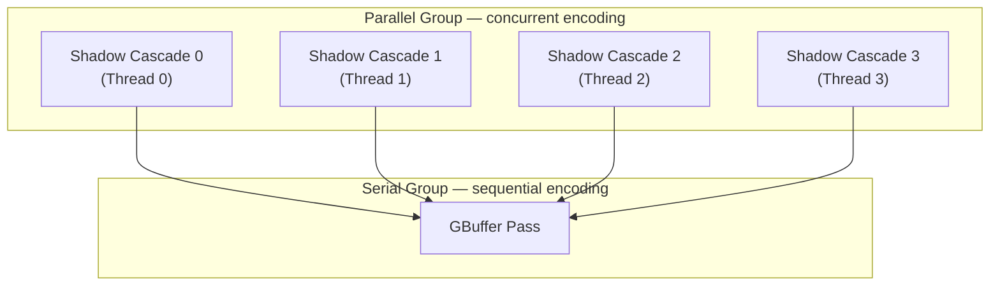
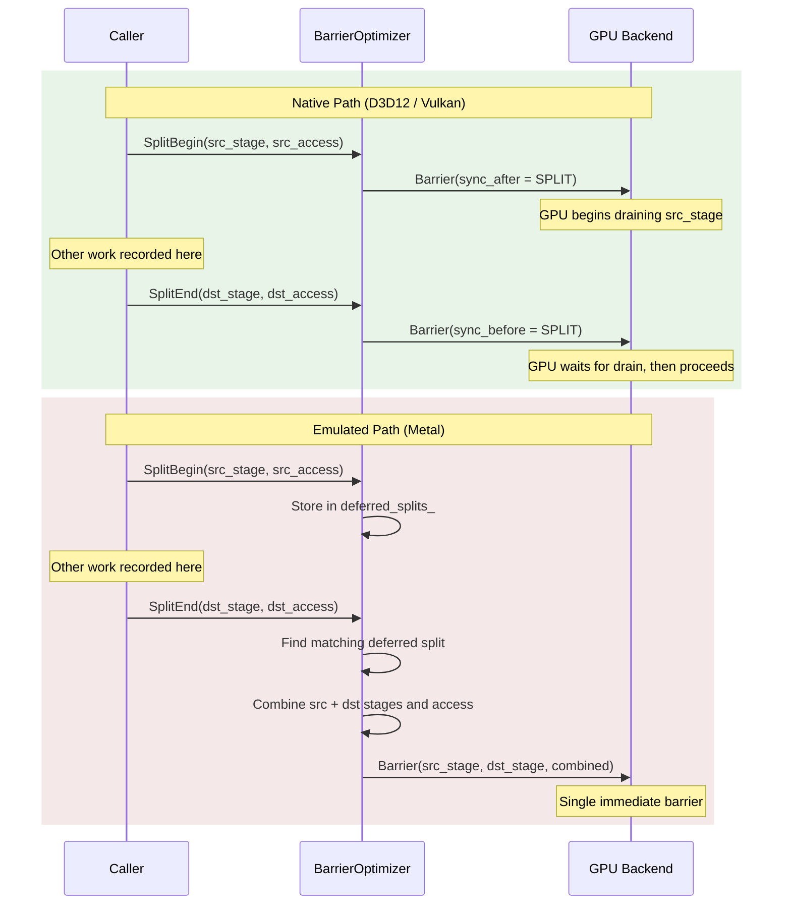

# Cross-Backend Emulation Specifications

Detailed algorithms and implementation guidance for cross-backend feature emulation in the
Harmonius GPU runtime layer (`harmonius::gpu_runtime::compat`). This document expands on the
feature emulation requirements (GR-4.1 through GR-4.9) and work graph runtime requirements
(GR-3.1 through GR-3.9) from the [GPU runtime design](gpu-runtime.md).

**Requirements:**
[GR-3 Work Graph Runtime](../requirements/7-gpu-runtime/7.3-work-graph-runtime.md),
[GR-4 Feature Emulation](../requirements/7-gpu-runtime/7.4-feature-emulation.md)

---

## Contents

- [Cross-Backend Emulation Specifications](#cross-backend-emulation-specifications)
  - [Contents](#contents)
  - [1. Work Graph Emulation (Vulkan and Metal)](#1-work-graph-emulation-vulkan-and-metal)
    - [Emulation Algorithm](#emulation-algorithm)
    - [Parallel Encoding in Emulated Path](#parallel-encoding-in-emulated-path)
    - [Synchronization Mapping](#synchronization-mapping)
    - [Performance Comparison](#performance-comparison)
  - [2. Ray Tracing Pipeline Emulation (Metal)](#2-ray-tracing-pipeline-emulation-metal)
    - [Dispatch Translation Algorithm](#dispatch-translation-algorithm)
    - [SBT Emulation Layout](#sbt-emulation-layout)
    - [Shader Authoring Implications](#shader-authoring-implications)
    - [Acceleration Structure Binding Differences](#acceleration-structure-binding-differences)
  - [3. Split Barrier Emulation (Metal)](#3-split-barrier-emulation-metal)
    - [Algorithm](#algorithm)
    - [Stage Combination Rules](#stage-combination-rules)
  - [4. Queue Ownership Transfer Elision (Metal)](#4-queue-ownership-transfer-elision-metal)
    - [Detection](#detection)
    - [Elision Algorithm](#elision-algorithm)
  - [5. Variable Rate Shading (Metal Fallback)](#5-variable-rate-shading-metal-fallback)
  - [6. Fallback Behavior Summary](#6-fallback-behavior-summary)
  - [7. Compile-Time Path Elimination](#7-compile-time-path-elimination)

---

## 1. Work Graph Emulation (Vulkan and Metal)

Native GPU work graphs are a D3D12-only feature. On Vulkan and Metal, the
`WorkGraphExecutor` emulates the same scheduling behavior on the CPU. The emulated path
produces identical rendering results to the native path (GR-3.3) while inserting explicit
synchronization primitives that replicate the implicit guarantees of native GPU work
graphs (GR-3.8).

### Emulation Algorithm

**Input:** An `ExecutionPlanView` containing passes in topological order, inter-pass
dependency edges, and barrier groups derived from the render graph compiler.

**Per-frame loop** (invoked from `WorkGraphExecutor::Execute()` when `use_native_` is
false):

```
execute_emulated(plan, frame_data):

    // Step 1: Apply pass activation flags — skip inactive passes
    active_passes = filter(plan.passes, frame_data.pass_activation_flags)

    // Step 2: Iterate passes in topological order
    for pass in active_passes:

        // 2a. Verify all dependencies are satisfied
        //     Each dependency's timeline fence must have signaled
        for dep in dependencies_of(pass):
            if not fence_signaled(dep.src_pass):
                wait_timeline_fence(dep.src_pass.queue, dep.fence_value)

        // 2b. Acquire a TrackedCommandBuffer from the per-queue pool
        cmd = AcquireCommandBuffer(pass.queue)
        cmd.Begin()

        // 2c. Emit pre-barriers via BarrierOptimizer
        for barrier in plan.barriers[pass.id].pre:
            cmd.Barrier(barrier)
        cmd.FlushBarriers()

        // 2d. Invoke the pass's execute callback
        pass.Execute(cmd, frame_data.resource_bindings)

        // 2e. Emit post-barriers via BarrierOptimizer
        for barrier in plan.barriers[pass.id].post:
            cmd.Barrier(barrier)
        cmd.FlushBarriers()

        // 2f. End command buffer
        cmd.End()

    // Step 3: Group completed command buffers by queue
    queue_batches = GroupByQueue(completed_command_buffers)

    // Step 4: Submit to each queue with timeline fence signals
    for queue, batch in queue_batches:
        Submit(queue, batch, signal_fence = NextFenceValue(queue))

    // Step 5: Recycle command buffers from frame N-2
    RecycleCommandBuffers(frame_data.frame_index - 2)
```

**Key invariants:**

- Passes are always processed in topological order, guaranteeing that a pass's
  dependencies are satisfied before it begins recording.
- Command buffer recycling uses a two-frame lag (frame N-2) to ensure the GPU has
  completed execution before buffers are reused.
- The `BarrierOptimizer` applies batching (GR-4.3), deduplication (GR-4.4), and queue
  ownership elision (GR-4.5) transparently within `FlushBarriers()`.

### Parallel Encoding in Emulated Path

When passes have no dependency edges between them, they can be encoded in parallel on
separate threads. The encoding dependency graph from the `ExecutionPlan` groups passes
into:

- **Parallel groups:** passes with no mutual dependencies, eligible for concurrent
  encoding on separate threads.
- **Serial groups:** passes with producer-consumer dependencies that must be encoded
  sequentially.

The following diagram shows how four shadow cascade passes form a parallel group (they
share no write-write or write-read dependencies), followed by a serial GBuffer pass that
depends on all four cascades:



Each pass in the parallel group acquires its own `TrackedCommandBuffer` from the
thread-safe per-queue pool (RG-10.2). Encoding proceeds independently, and the resulting
command buffers are submitted in topological order after all parallel encoding completes
(RG-10.7).

**Thread assignment algorithm:**

```
EncodeParallelGroups(plan, frame_data):
    groups = ComputeEncodingGroups(plan)

    for group in groups:
        if group.is_parallel:
            // Dispatch each pass to the thread pool
            futures = []
            for pass in group.passes:
                futures.push(thread_pool.Submit(EncodPass, pass, frame_data))
            // Wait for all passes in the group to finish encoding
            WaitAll(futures)
        else:
            // Encode sequentially on the current thread
            for pass in group.passes:
                EncodePass(pass, frame_data)
```

### Synchronization Mapping

The following table maps native GPU work graph synchronization mechanisms to their
emulated equivalents:

| Native Work Graph Mechanism | Emulated Equivalent | Implementation |
|---|---|---|
| Implicit node ordering | Pipeline Barrier | `BarrierOptimizer` batches consecutive same-queue barriers into a single `Barrier()` call |
| Node-to-node data flow | Resource Barrier | `ResourceStateCache` emits layout Transition + access Barrier for each resource dependency |
| Cross-queue scheduling | Timeline fence pair | Signal after producer queue Submit, Wait before consumer queue Submit |
| GPU self-scheduling | CPU topological iteration | Deterministic topological sort from `ExecutionPlan`, iterated by `WorkGraphExecutor` |
| Backing memory | Not needed | Emulated path Has no backing memory requirement (node records exist only on the CPU) |

### Performance Comparison

| Aspect | Native (D3D12 Work Graphs Tier 1) | Emulated (CPU scheduling) |
|---|---|---|
| CPU overhead | Low — single `DispatchGraph()` call per frame | Higher — per-pass command Buffer record + Submit |
| GPU scheduling | Hardware-driven, dynamic load balancing | Fixed topological order, no runtime adaptation |
| Latency | Lower — GPU begins work immediately | Higher — CPU must finish recording before Submit |
| Debuggability | Limited — GPU-internal scheduling is opaque | Better — deterministic pass order, per-pass timestamps |
| Portability | D3D12 only, requires Tier 1 hardware | All backends, all hardware |
| Parallel encoding | Not applicable (GPU handles scheduling) | Supported via encoding dependency graph (RG-10.4) |

The native path is preferred when available, as it eliminates CPU command recording
overhead and enables the GPU to dynamically rebalance work across shader engines. The
emulated path is the default and always-available code path, active on all Vulkan and
Metal builds, and on D3D12 hardware without Work Graphs Tier 1 support.

---

## 2. Ray Tracing Pipeline Emulation (Metal)

Metal has no dedicated ray tracing pipeline stage. Ray tracing effects on Metal use
inline ray queries (`intersector<>`) within compute shaders. The `RayTracingAdapter`
(GR-4.6 through GR-4.9) transparently translates `TraceRays()` dispatches into compute
`Dispatch()` calls on backends without dedicated RT pipeline support.

### Dispatch Translation Algorithm

The following steps describe the translation performed by
`RayTracingAdapter::Dispatch()` when `IsEmulated()` returns true:

```
RayTracingAdapter::Dispatch(pipeline_id, desc, cmd):

    // Step 1: Input validation
    //   desc contains: width, height, depth (TraceRaysDesc)
    pair = pairs_[pipeline_id]

    // Step 2: Pipeline selection
    //   Use the registered compute_fallback instead of rt_pipeline
    cmd.SetPipeline(pair.compute_fallback)

    // Step 3: SBT translation
    //   Bind the emulated SBT buffer as a bindless SRV
    //   The buffer index is retrieved from the sbt_buffers_ map
    sbt_index = BindlessIndex(sbt_buffers_[pipeline_id])

    // Step 4: Acceleration structure binding
    //   Bind the top-level AS as a compute shader resource view
    //   (on native RT, AS is bound via the RT descriptor layout)
    cmd.BindAccelerationStructureAsSrv(tlas_handle)

    // Step 5: Push constants
    //   Pack dispatch dimensions and SBT buffer index
    pc = RtPushConstants {
        .width            = desc.width,
        .height           = desc.height,
        .depth            = desc.depth,
        .sbt_buffer_index = sbt_index
    }
    cmd.PushConstants(&pc, sizeof(pc))

    // Step 6: Compute dispatch
    //   Use 8x8 thread groups to cover the ray grid
    tile = 8
    cmd.Dispatch(
        ceil(desc.width  / tile),
        ceil(desc.height / tile),
        desc.depth
    )
```

**Thread group size rationale:** The 8x8 tile size balances occupancy across Apple GPU
architectures. Each thread group processes 64 rays, aligning with the SIMD width of
Apple GPU shader cores.

### SBT Emulation Layout

On native RT backends (D3D12, Vulkan), the shader binding table (SBT) contains shader
identifiers followed by per-record root arguments, with strict alignment requirements.
On Metal, the emulated SBT is a flat GPU buffer containing only per-record root
arguments, without shader identifiers:

```
Emulated SBT buffer layout (Metal):

Offset 0                                                         End
+------------------+---------------------+------------------------+
| Raygen Region    | Miss Region         | Hit Group Region       |
| (push constants) | [miss_0][miss_1]... | [inst*geomCount+geom]  |
+------------------+---------------------+------------------------+

- Raygen Region:  Dispatch parameters passed via push constants
                  (not stored in the buffer).
- Miss Region:    Array of miss records indexed by miss shader index.
                  Each record contains per-record root arguments only.
- Hit Group Region: Array of hit group records indexed by
                    (instanceID * geometryCount + geometryIndex).
                    Each record contains per-record root arguments only.
```

Each record omits the shader identifier because the compute fallback shader handles
material dispatch via branching on a material ID stored in the root arguments. The
record stride is uniform across all regions and is determined by the largest per-record
root argument size, padded to the device's constant buffer alignment.

**SBT buffer construction** (`RayTracingAdapter::BuildSbt()` on the emulated path):

```
build_sbt_emulated(layout):

    // Calculate region sizes
    miss_size      = layout.miss_records.size() * layout.record_stride
    hit_group_size = layout.hit_group_records.size() * layout.record_stride

    // Allocate a single GPU buffer for the entire emulated SBT
    total_size = miss_size + hit_group_size
    buffer     = allocator_.create_buffer({
        .size       = total_size,
        .usage      = BufferUsage::shader_resource,
        .debug_name = "emulated_sbt"
    })

    // Pack miss records
    offset = 0
    for record in layout.miss_records:
        write(buffer, offset, record.local_root_args)
        offset += layout.record_stride

    // Pack hit group records
    for record in layout.hit_group_records:
        write(buffer, offset, record.local_root_args)
        offset += layout.record_stride

    // Register buffer for bindless access
    sbt_buffers_[pipeline_id] = buffer
```

The emulated SBT buffer is rebuilt only when the SBT layout changes (new materials
added, geometry rebound), not per frame (GR-4.7).

### Shader Authoring Implications

Both RT pipeline variants must be authored for every ray tracing effect:

1. **Native RT shader set** (D3D12, Vulkan): Separate raygen, miss, closest-hit, and
   any-hit shaders compiled into a ray tracing pipeline via the shader pipeline module.
2. **Compute fallback** (Metal): A single compute shader containing inline ray queries
   (`rayQueryEXT` in SPIR-V, `intersector<>` in Metal Shading Language) compiled into a
   compute pipeline.

The [shader pipeline module](shader-pipeline.md) is responsible for producing both
variants from a shared effect description. The GPU runtime does not perform shader
compilation or translation; it only selects the appropriate pre-compiled pipeline handle
at dispatch time via `RayTracingAdapter::Dispatch()`.

**Functional equivalence:**

| Shader Stage | Native RT Pipeline | Compute Fallback |
|---|---|---|
| Ray generation | Raygen shader entry point | Compute shader `main()` with Dispatch grid mapping |
| Miss | Dedicated miss shader | Branch on `rayQuery.committed == false` |
| Closest hit | Dedicated closest-hit shader | Branch on material ID from emulated SBT |
| Any hit | Dedicated any-hit shader | Alpha test in intersection loop before `rayQuery.commit()` |
| Intersection | Built-in triangle intersection | Built-in via `intersector<>` / `rayQueryEXT` |

### Acceleration Structure Binding Differences

| Aspect | D3D12 | Vulkan | Metal |
|---|---|---|---|
| AS type | `D3D12_RAYTRACING_ACCELERATION_STRUCTURE_SRV` | `VkAccelerationStructureKHR` | `MTLAccelerationStructure` |
| Binding mechanism | SRV in descriptor heap | Descriptor set binding | Argument Buffer entry |
| Inline query access | `RayQuery<>` in any shader stage | `rayQueryEXT` in any shader stage | `intersector<>` in Compute shaders only |
| Build command | `BuildRaytracingAccelerationStructure` | `vkCmdBuildAccelerationStructuresKHR` | `MTLAccelerationStructureCommandEncoder` |

On the emulated path, the `RayTracingAdapter` binds the acceleration structure as a
compute shader resource view (argument buffer entry on Metal) rather than through the
dedicated RT pipeline descriptor layout (GR-4.9). The binding method is selected
automatically based on `DeviceCapabilities::ray_tracing`.

---

## 3. Split Barrier Emulation (Metal)

Metal does not support split barriers. The `BarrierOptimizer` converts split barrier
pairs into single immediate barriers, preserving the same synchronization guarantees
with reduced GPU overlap opportunity (GR-4.2).

### Algorithm

```
split_begin(desc):
    if caps_.split_barriers:
        // Native path (D3D12 / Vulkan):
        // Emit a barrier with SYNC_AFTER = SPLIT
        // The GPU begins draining the source stage immediately
        emit_barrier(desc, sync_after = SPLIT)
    else:
        // Emulated path (Metal):
        // Store the descriptor — no GPU call yet
        deferred_splits_.push(desc)

split_end(desc):
    if caps_.split_barriers:
        // Native path (D3D12 / Vulkan):
        // Emit a barrier with SYNC_BEFORE = SPLIT
        // The GPU waits for the drain to complete
        emit_barrier(desc, sync_before = SPLIT)
    else:
        // Emulated path (Metal):
        // Find the matching deferred split by resource handle
        deferred = find_and_remove(deferred_splits_, desc.resource)

        // Combine stages and emit a single immediate barrier
        combined = BarrierDesc {
            .resource    = desc.resource,
            .src_stage   = deferred.src_stage,
            .dst_stage   = desc.dst_stage,
            .src_access  = deferred.src_access | desc.src_access,
            .dst_access  = deferred.dst_access | desc.dst_access,
            .old_layout  = deferred.old_layout,
            .new_layout  = desc.new_layout
        }
        emit_barrier(combined)
```

### Stage Combination Rules

When combining stages for the immediate barrier on Metal:

- **Source stage** = the `SplitBegin` call's source stage (where the resource was last
  written).
- **Destination stage** = the `SplitEnd` call's destination stage (where the resource
  will next be read or written).
- **Access flags** = union of both the begin and end access flags, ensuring all required
  visibility guarantees are met.
- **Layout transition** = from `SplitBegin`'s `old_layout` to `SplitEnd`'s
  `new_layout`.

The following sequence diagram compares the native and emulated split barrier paths:



**Trade-off:** Native split barriers allow the GPU to overlap the drain of the source
stage with intervening work, improving pipeline utilization. The emulated immediate
barrier forces a full pipeline stall at the `SplitEnd` site. This is an accepted
trade-off on Metal, where the barrier overhead is offset by the unified memory
architecture's lower synchronization cost.

---

## 4. Queue Ownership Transfer Elision (Metal)

Metal's unified memory architecture means all GPU queues share the same physical memory.
Queue ownership transfers, which are required on discrete GPU architectures to ensure
cache coherency between queues, are unnecessary on unified memory systems. The
`BarrierOptimizer` detects this and elides ownership transfer barriers (GR-4.5).

### Detection

Unified memory is detected by examining the device capabilities at initialization:

```cpp
bool IsUnifiedMemory() const { return caps_.shared_memory_bytes > 0 && caps_.device_local_memory_bytes == 0; }
```

On unified memory systems, all GPU memory is host-visible and shared. There is no
dedicated device-local memory pool, so `device_local_memory_bytes` is zero.

### Elision Algorithm

The elision is applied within `BarrierOptimizer::Flush()`:

```
BarrierOptimizer::flush():

    // Step 1: Check memory architecture
    if is_unified_memory():

        // Step 2: Strip queue ownership fields from all pending barriers
        for barrier in pending_:
            barrier.src_queue = QueueType::graphics
            barrier.dst_queue = QueueType::graphics

        // Step 3: Cross-queue barriers become same-queue barriers
        //   Only stage and access transitions remain; no ownership
        //   transfer is emitted to the GPU

    // Step 4: On discrete GPU systems (D3D12, Vulkan discrete):
    //   Emit full ownership transfer barriers as-is
    //   The backend translates these to:
    //     - D3D12: resource barrier with D3D12_RESOURCE_BARRIER_FLAG_NONE
    //     - Vulkan: VkBufferMemoryBarrier2 / VkImageMemoryBarrier2
    //       with srcQueueFamilyIndex != dstQueueFamilyIndex

    // Continue with normal barrier batching and deduplication
    return batch_and_deduplicate(pending_)
```

**Effect:** On Metal, a cross-queue resource transition that would normally require two
barriers (release on the source queue + acquire on the destination queue) is reduced to
a single same-queue barrier containing only the stage and access transition. This
eliminates unnecessary synchronization overhead on a memory architecture that does not
require it.

---

## 5. Variable Rate Shading (Metal Fallback)

Metal does not support image-based variable rate shading (VRS). Unlike the other
emulation strategies in this document, VRS is not emulated on Metal. Instead:

- The render graph's capability gating system (RG-6.1, RG-6.2) detects that
  `DeviceCapabilities::variable_rate_shading` is false.
- VRS passes are declared with a soft capability gate and are silently pruned from the
  execution plan at graph compilation time (RG-6.2).
- No emulation is provided. This is an accepted quality trade-off: VRS is a performance
  optimization that reduces shading rate in low-detail screen regions. Without VRS,
  all pixels are shaded at full rate, resulting in higher GPU cost but identical or
  higher visual quality.
- The VRS pass's exclusive resources are not allocated (RG-6.1), so there is no memory
  overhead from the missing feature.

---

## 6. Fallback Behavior Summary

The following table summarizes the behavior of each emulated feature across all three
backends:

| Feature | D3D12 Behavior | Vulkan Behavior | Metal Behavior | Fallback Type |
|---|---|---|---|---|
| Work graphs | Native (Tier 1) or CPU emulated | Always CPU emulated | Always CPU emulated | CPU emulation |
| RT pipeline | Native DXR 1.2 | Native `VK_KHR_ray_tracing_pipeline` | Compute with inline ray queries | Compute emulation |
| Split barriers | Native enhanced barriers | Native `VkEvent` | Deferred + immediate combined | Barrier rewrite |
| Queue ownership | Native ownership transfer | Native ownership transfer | Elided (unified memory) | Stripped |
| VRS | Native VRS Tier 2 | Native fragment shading rate | Not available (culled) | Capability gate |
| Opacity micromaps | Native DXR 1.2 OMM | Native `VK_EXT_opacity_micromap` | Not available (culled) | Capability gate |

**Fallback type definitions:**

- **CPU emulation:** The GPU runtime performs equivalent scheduling or dispatch on the
  CPU, producing identical rendering results.
- **Compute emulation:** A dedicated compute shader replaces the native pipeline stage,
  using inline alternatives (ray queries) to achieve equivalent results.
- **Barrier rewrite:** The `BarrierOptimizer` transforms barrier descriptors to use
  available primitives, preserving synchronization guarantees.
- **Stripped:** The operation is removed entirely because the hardware architecture
  makes it unnecessary.
- **Capability gate:** The feature is pruned from the execution plan at compile time.
  No emulation is attempted; the quality trade-off is accepted.

---

## 7. Compile-Time Path Elimination

The GPU backend is selected at compile time via template instantiation. This means the
compiler eliminates all code paths for unsupported features on each backend, resulting in
zero runtime overhead for unused emulation logic.

**Elimination by backend:**

| Backend | Eliminated Code Paths |
|---|---|
| Metal | Native RT pipeline dispatch, work graph native path, split barrier native path, VRS pass code, opacity micromap code |
| Vulkan | Work graph native path, queue ownership elision code |
| D3D12 | Queue ownership elision code, RT compute fallback dispatch (when Tier 1 available) |

**Enforcement mechanism:** The static dispatch pattern uses `if constexpr` and
concept-gated template instantiation to ensure unused paths are never compiled:

```cpp
template <Backend B>
void WorkGraphExecutor<B>::Execute(const FrameData& data, TrackedCommandBuffer& cmd) {
  if constexpr (supports_work_graphs<B>) {
    if (use_native_) {
      ExecuteNative(data, cmd);
      return;
    }
  }
  // Emulated path — always compiled, always available
  ExecuteEmulated(data, cmd);
}

template <Backend B>
bool RayTracingAdapter<B>::Dispatch(uint64_t pipeline_id, const gpu::TraceRaysDesc& desc, TrackedCommandBuffer& cmd) {
  if constexpr (supports_rt_pipeline<B>) {
    cmd.SetPipeline(pairs_[pipeline_id].rt_pipeline);
    cmd.Inner().TraceRays(desc);
    return false;
  } else {
    // Compute fallback — compiled only on Metal
    return DispatchEmulated(pipeline_id, desc, cmd);
  }
}

template <Backend B>
void BarrierOptimizer<B>::SplitBegin(const gpu::BarrierDesc& desc) {
  if constexpr (supports_split_barriers<B>) {
    EmitBarrier(desc, SyncMode::split_after);
  } else {
    // Metal — deferred, no GPU call
    deferred_splits_.push_back(desc);
  }
}
```

On Metal builds, the `if constexpr (supports_work_graphs<B>)` branch and the
`if constexpr (supports_rt_pipeline<B>)` branch are both `false`, so the native code
paths are discarded entirely by the compiler. The same applies to split barrier native
code and VRS shader compilation. This guarantees that no unused feature code contributes
to binary size or instruction cache pressure on any backend.
