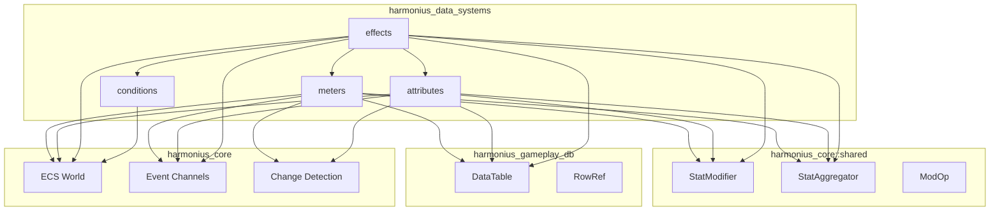
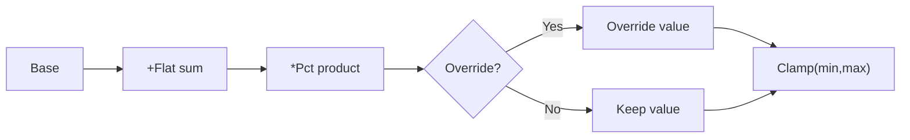
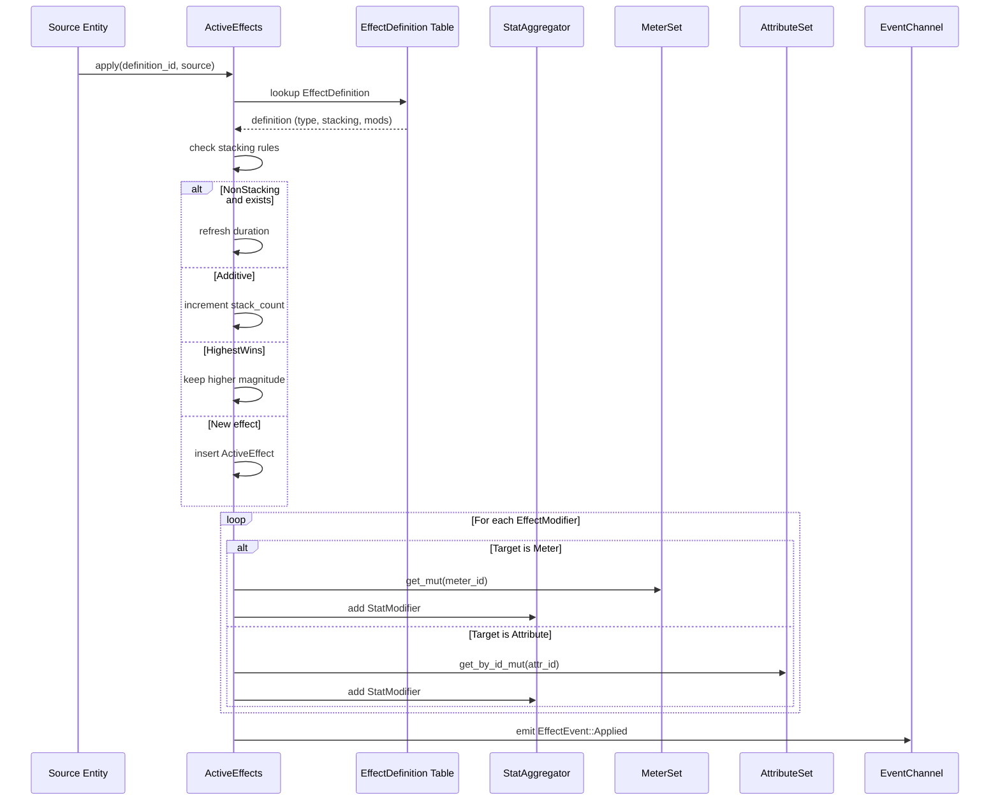

# Attributes and Effects Design

## Requirements Trace

> **Canonical sources:** Features, requirements, and user stories live in
> [features/](../../features/), [requirements/](../../requirements/), and
> [user-stories/](../../user-stories/).

### Core Features

| Feature   | Requirement | Design Element     |
|-----------|-------------|--------------------|
| F-13.9.1  | R-13.9.1    | Attribute sets     |
| F-13.9.2  | R-13.9.2    | Meters             |
| F-13.9.3  | R-13.9.3    | Modifier stacks    |
| F-13.10.3 | R-13.10.3   | Gameplay effects   |
| F-13.12.5 | R-13.12.5   | Faction reputation |

1. **F-13.9.1** -- Schema-defined named-value collections with modifier stacks
2. **F-13.9.2** -- Bounded numeric values with drain/fill rates and threshold events
3. **F-13.9.3** -- Layered modifier pipeline (flat, percent, override)
4. **F-13.10.3** -- Time-limited bundles applying modifiers, firing events, interacting via tags
5. **F-13.12.5** -- Faction reputation as a meter with tier thresholds

### Non-Functional Requirements

| Requirement | Target                           |
|-------------|----------------------------------|
| NFR-METER.1 | 1,000 meters evaluated < 0.5 ms |
| NFR-METER.2 | Modifier stacking < 0.01 ms ea  |
| NFR-METER.3 | Threshold check < 0.001 ms ea   |
| NFR-ATTR.1  | 10,000 attribute reads < 0.1 ms |
| NFR-ATTR.2  | Attribute set clone < 0.01 ms   |
| NFR-FX.1    | 64 effects per entity < 0.1 ms  |

### Cross-Cutting Dependencies

| Dependency         | Source   | Consumed API        |
|--------------------|----------|---------------------|
| ECS world/queries  | F-1.1.1  | `Query`, `Entity`   |
| Event channels     | F-1.5.1  | `EventWriter`       |
| Change detection   | F-1.1.22 | `Changed<T>`        |
| Serialization      | F-1.4.1  | `rkyv` zero-copy    |
| Gameplay databases | F-13.7   | `DataTable`,`RowRef`|
| Gameplay tags      | F-13.10  | `GameplayTagSet`    |
| StatModifier       | shared   | `StatAggregator`    |
| ConditionExpr      | shared   | `ConditionRegistry` |

---

## Overview

Three layered primitives replace all genre-specific numeric tracking and buff/debuff systems.

- **Meters** -- bounded numeric value with drain/fill rates, modifier stack, thresholds, and events.
- **Attribute Sets** -- schema-driven N-dimensional named numeric values with modifier stacks.
- **Effects** -- time-limited bundles applying modifiers to meters/attributes, firing events,
  interacting via gameplay tags.
- **Conditions** -- boolean expression trees (shared `ConditionExpr`) gating effects and thresholds.

### Design Principles

1. **ECS-primary (~90%)-based** -- all state in components
2. **Data-driven / no-code** -- visual editor authored
3. **Genre-agnostic** -- no "health"/"mana" in code
4. **Immutable definitions, mutable state**
5. **Shared modifier pipeline** -- `StatAggregator`
6. **Deterministic** -- explicit evaluation order
7. **No Arc, Rc, Cell, RefCell**

---

## Architecture

### Module Boundaries



### Codegen Integration

User-defined types flow through the codegen pipeline into the middleman `.dylib`:

1. `AttributeSchema`, `MeterDefinition`, and `EffectDefinition` authored in the visual editor are
   codegen'd as Rust structs into the middleman `.dylib`. The engine binary loads them via
   `libloading` at startup and on hot-reload.
2. `ConditionRegistry` is populated at load time with codegen'd condition functions. Each condition
   in a logic graph compiles to a `fn(&ConditionContext) -> bool` pointer in the middleman.
3. Hot-reload recompiles the middleman when definitions or conditions change. The engine binary
   stays stable.
4. Custom `ModOp` variants or stacking policies authored by users are codegen'd enum variants in the
   middleman `.dylib`.

### Class Diagram

```mermaid
classDiagram
    class MeterDefinitionId {
        +u32 0
    }
    class MeterDefinition {
        +MeterDefinitionId id
        +SmolStr display_name
        +f32 min_value
        +f32 max_value
        +f32 default_value
        +MeterDrainFill drain_fill
        +Vec~MeterThreshold~ thresholds
        +bool save_on_persist
        +bool replicate
    }
    class MeterDrainFill {
        +f32 drain_rate
        +f32 fill_rate
        +bool drain_when_empty
        +bool fill_when_full
    }
    class MeterThreshold {
        +f32 value
        +ThresholdDirection direction
        +ThresholdAction action
        +Option~RowRef~ effect_ref
        +Option~GameplayTagSet~ tag_grant
    }
    class ThresholdDirection {
        Rising
        Falling
        Either
    }
    class ThresholdAction {
        FireEvent
        ApplyEffect
        RemoveEffect
    }
    class Meter {
        +MeterDefinitionId definition_id
        +f32 current_value
        +f32 previous_value
        +StatAggregator modifier_stack
        +from_definition(MeterDefinition) Meter
        +fraction(MeterDefinition) f32
        +apply_delta(f32, MeterDefinition)
        +set_value(f32, MeterDefinition)
    }
    class MeterSet {
        +SmallVec~Meter 4~ meters
        +get(MeterDefinitionId) Option~Meter~
        +get_mut(MeterDefinitionId) Option~Meter~
        +insert(Meter)
        +remove(MeterDefinitionId) Option~Meter~
    }
    class AttributeDefId {
        +u32 0
    }
    class AttributeSchemaId {
        +u32 0
    }
    class AttributeValueType {
        F32
        I32
        Bool
        Enum
    }
    class AttributeDefinition {
        +AttributeDefId id
        +SmolStr name
        +AttributeValueType value_type
        +f32 min_value
        +f32 max_value
        +f32 default_value
        +bool replicate
    }
    class AttributeSchema {
        +AttributeSchemaId id
        +SmolStr name
        +Vec~AttributeDefinition~ attributes
        +get(AttributeDefId) Option~AttributeDefinition~
        +index_of(AttributeDefId) Option~usize~
    }
    class AttributeValue {
        +f32 base
        +f32 current
        +StatAggregator modifier_stack
        +evaluate(AttributeDefinition) bool
        +set_base(f32)
    }
    class AttributeSet {
        +AttributeSchemaId schema_id
        +Vec~AttributeValue~ values
        +from_schema(AttributeSchema) Self
        +get_by_id(AttributeDefId, AttributeSchema) Option~AttributeValue~
        +evaluate_all(AttributeSchema) SmallVec~usize 8~
    }
    class ModOp {
        Flat
        Percent
        Override
    }
    class StatModifier {
        +ModOp op
        +f32 value
        +Entity source
        +i32 priority
    }
    class StatAggregator {
        -SmallVec~StatModifier 8~ modifiers
        +add(StatModifier)
        +remove_by_source(Entity)
        +evaluate(f32, f32, f32) f32
        +clear()
    }
    class EffectDefinition {
        +EffectType effect_type
        +f32 magnitude
        +Option~u32~ duration_ticks
        +Option~u32~ period_ticks
        +StackingRule stacking
        +Vec~EffectModifier~ modifiers
        +GameplayTagSet tags
        +Option~ConditionExpr~ condition
        +Option~Handle~EffectGraphAsset~~ vfx_indicator
        +Option~RowRef~ data_table_row
    }
    class EffectType {
        Instant
        Duration
        Periodic
        Infinite
    }
    class StackingRule {
        Additive
        Multiplicative
        HighestWins
        NonStacking
    }
    class EffectModifier {
        +EffectTarget target
        +ModOp op
        +f32 value
    }
    class EffectTarget {
        Meter_MeterDefinitionId
        Attribute_AttributeSchemaId_AttributeDefId
    }
    class ActiveEffect {
        +AssetId definition
        +Entity source
        +u32 remaining_ticks
        +u32 next_tick_at
        +u32 stack_count
    }
    class ActiveEffects {
        +SmallVec~ActiveEffect 16~ effects
        +apply(EffectDefinition, Entity)
        +tick(u32) SmallVec~EffectEvent 8~
        +remove_by_source(Entity)
        +has_tag(GameplayTag) bool
    }
    class EffectEvent {
        +Entity entity
        +AssetId definition
        +EffectEventKind kind
    }
    class EffectEventKind {
        Applied
        Ticked
        Expired
        Removed
    }
    class ConditionExpr {
        And_Vec_ConditionExpr
        Or_Vec_ConditionExpr
        Not_Box_ConditionExpr
        Leaf_ConditionId
        +evaluate(ConditionContext, ConditionRegistry) bool
    }
    class ConditionId {
        +u32 0
    }
    class ConditionContext {
        +World world
        +Entity entity
    }
    class ConditionCheckFn {
        fn(ConditionContext) bool
    }
    class ConditionRegistry {
        -Vec~Option~ConditionCheckFn~~ checks
        +register(ConditionId, ConditionCheckFn)
        +get(ConditionId) Option~ConditionCheckFn~
    }
    class MeterChanged {
        +Entity entity
        +MeterDefinitionId meter_id
        +f32 old_value
        +f32 new_value
    }
    class ThresholdCrossed {
        +Entity entity
        +MeterDefinitionId meter_id
        +f32 threshold_value
        +ThresholdDirection direction
        +ThresholdAction action
    }
    class AttributeChanged {
        +Entity entity
        +AttributeSchemaId schema_id
        +AttributeDefId attribute_id
        +f32 old_value
        +f32 new_value
    }

    MeterDefinition --> MeterDefinitionId
    MeterDefinition *-- MeterDrainFill
    MeterDefinition *-- MeterThreshold
    MeterThreshold --> ThresholdDirection
    MeterThreshold --> ThresholdAction
    Meter --> MeterDefinitionId
    Meter *-- StatAggregator
    MeterSet *-- Meter

    AttributeDefinition --> AttributeDefId
    AttributeDefinition --> AttributeValueType
    AttributeSchema --> AttributeSchemaId
    AttributeSchema *-- AttributeDefinition
    AttributeValue *-- StatAggregator
    AttributeSet --> AttributeSchemaId
    AttributeSet *-- AttributeValue

    StatModifier *-- ModOp
    StatAggregator o-- StatModifier

    EffectDefinition --> EffectType
    EffectDefinition --> StackingRule
    EffectDefinition *-- EffectModifier
    EffectModifier --> EffectTarget
    EffectModifier --> ModOp
    EffectDefinition ..> ConditionExpr
    ActiveEffect --> EffectDefinition : references
    ActiveEffects *-- ActiveEffect
    EffectEvent --> EffectEventKind

    ConditionExpr ..> ConditionId
    ConditionExpr ..> ConditionContext
    ConditionExpr ..> ConditionRegistry

    MeterChanged --> MeterDefinitionId
    ThresholdCrossed --> MeterDefinitionId
    ThresholdCrossed --> ThresholdDirection
    AttributeChanged --> AttributeSchemaId
    AttributeChanged --> AttributeDefId
```



---

## API Design

All type metadata is generated statically by the codegen pipeline — no `Reflect` derive, no runtime
type registry. Definitions are immutable database rows. Components are mutable per-entity state.
`ModOp`, `StatModifier`, `StatAggregator`, `ConditionExpr`, and `ConditionRegistry` are from
`harmonius_core::shared` (see algorithms.md).

### Meters

```rust
pub struct MeterDefinitionId(pub u32);

/// Immutable database row. Derives `rkyv::Archive` for zero-copy mmap loading.
pub struct MeterDefinition {
    pub id: MeterDefinitionId,
    pub display_name: SmolStr,
    pub min_value: f32,
    pub max_value: f32,
    pub default_value: f32,
    pub drain_fill: MeterDrainFill,
    pub thresholds: Vec<MeterThreshold>,
    pub save_on_persist: bool,
    pub replicate: bool,
}
pub struct MeterDrainFill {
    pub drain_rate: f32,
    pub fill_rate: f32,
    pub drain_when_empty: bool,
    pub fill_when_full: bool,
}
pub struct MeterThreshold {
    pub value: f32,
    pub direction: ThresholdDirection,
    pub action: ThresholdAction,
    pub effect_ref: Option<RowRef>,
    pub tag_grant: Option<GameplayTagSet>,
}
pub enum ThresholdDirection {
    Rising, Falling, Either,
}
pub enum ThresholdAction {
    FireEvent, ApplyEffect, RemoveEffect,
}

/// Mutable per-entity state.
pub struct Meter {
    pub definition_id: MeterDefinitionId,
    pub current_value: f32,
    pub previous_value: f32,
    pub modifier_stack: StatAggregator,
}
impl Meter {
    pub fn from_definition(
        def: &MeterDefinition) -> Self;
    pub fn fraction(
        &self, def: &MeterDefinition) -> f32;
    pub fn apply_delta(
        &mut self, delta: f32,
        def: &MeterDefinition);
}

/// ECS component: all meters on an entity.
pub struct MeterSet {
    pub meters: SmallVec<[Meter; 4]>,
}
impl MeterSet {
    pub fn get(&self, id: MeterDefinitionId,
    ) -> Option<&Meter>;
    pub fn get_mut(&mut self,
        id: MeterDefinitionId,
    ) -> Option<&mut Meter>;
    pub fn insert(&mut self, meter: Meter);
    pub fn remove(&mut self,
        id: MeterDefinitionId,
    ) -> Option<Meter>;
}
```

### Attributes

```rust
pub struct AttributeSchemaId(pub u32);
pub struct AttributeDefId(pub u32);

/// Immutable database row. Derives `rkyv::Archive` for zero-copy mmap loading.
pub struct AttributeDefinition {
    pub id: AttributeDefId,
    pub name: SmolStr,
    pub value_type: AttributeValueType,
    pub min_value: f32,
    pub max_value: f32,
    pub default_value: f32,
    pub replicate: bool,
}
pub enum AttributeValueType {
    F32, I32, Bool, Enum { type_id: u32 },
}
pub struct AttributeSchema {
    pub id: AttributeSchemaId,
    pub name: SmolStr,
    pub attributes: Vec<AttributeDefinition>,
}

/// Mutable per-entity state.
pub struct AttributeValue {
    pub base: f32,
    pub current: f32,
    pub modifier_stack: StatAggregator,
}
impl AttributeValue {
    pub fn evaluate(
        &mut self, def: &AttributeDefinition,
    ) -> bool;
    pub fn set_base(&mut self, value: f32);
}

/// ECS component: attribute collection.
pub struct AttributeSet {
    pub schema_id: AttributeSchemaId,
    pub values: Vec<AttributeValue>,
}
impl AttributeSet {
    pub fn from_schema(
        schema: &AttributeSchema) -> Self;
    pub fn get_by_id(&self,
        id: AttributeDefId,
        schema: &AttributeSchema,
    ) -> Option<&AttributeValue>;
    pub fn evaluate_all(&mut self,
        schema: &AttributeSchema,
    ) -> SmallVec<[usize; 8]>;
}
```

### Effects

```rust
/// Context passed to every condition check.
///
/// `world` provides read access to any component or resource. Codegen'd condition
/// functions declare their exact queries statically — the codegen pipeline validates
/// that only read-only ECS access is performed. No write access is permitted inside
/// a `ConditionCheckFn`. This justifies passing `World` rather than a narrow query
/// result: conditions authored in the visual editor may query arbitrary components
/// (e.g., checking faction tags, environment state, equipment slots).
pub struct ConditionContext<'w> {
    pub world: &'w World,
    pub entity: Entity,
}

/// Codegen'd function pointer type for condition evaluation.
/// Conditions are compiled into the middleman .dylib and loaded as fn pointers.
pub type ConditionCheckFn = fn(&ConditionContext<'_>) -> bool;

/// Immutable database row. Derives `rkyv::Archive` for zero-copy mmap loading.
/// Loadable from a data table row (F-13.7.2) via the ECS binding system.
pub struct EffectDefinition {
    pub effect_type: EffectType,
    pub magnitude: f32,
    pub duration_ticks: Option<u32>,
    pub period_ticks: Option<u32>,
    pub stacking: StackingRule,
    pub modifiers: Vec<EffectModifier>,
    pub tags: GameplayTagSet,
    pub condition: Option<ConditionExpr>,
    /// Optional VFX indicator template. Spawned on apply, despawned on expiry.
    /// VFX graph instance is owned by the VFX system; spawn/despawn is owned here.
    pub vfx_indicator: Option<Handle<EffectGraphAsset>>,
    /// Row in the data table that was the source of this definition, if any.
    pub data_table_row: Option<RowRef>,
}
pub enum EffectType {
    Instant, Duration, Periodic, Infinite,
}
pub enum StackingRule {
    Additive, Multiplicative,
    HighestWins, NonStacking,
}
pub struct EffectModifier {
    pub target: EffectTarget,
    pub op: ModOp,
    pub value: f32,
}
pub enum EffectTarget {
    Meter(MeterDefinitionId),
    Attribute(AttributeSchemaId, AttributeDefId),
}

/// Mutable per-entity state.
pub struct ActiveEffect {
    pub definition: AssetId,
    pub source: Entity,
    pub remaining_ticks: u32,
    pub next_tick_at: u32,
    pub stack_count: u32,
}

/// ECS component: all active effects.
pub struct ActiveEffects {
    pub effects: SmallVec<[ActiveEffect; 16]>,
}
impl ActiveEffects {
    pub fn apply(&mut self,
        def: &EffectDefinition, source: Entity);
    pub fn tick(&mut self, current_tick: u32,
    ) -> SmallVec<[EffectEvent; 8]>;
    pub fn remove_by_source(
        &mut self, source: Entity);
    pub fn has_tag(
        &self, tag: GameplayTag) -> bool;
}
```

### Events

```rust
pub struct MeterChanged {
    pub entity: Entity,
    pub meter_id: MeterDefinitionId,
    pub old_value: f32,
    pub new_value: f32,
    pub min_value: f32,
    pub max_value: f32,
}
pub struct ThresholdCrossed {
    pub entity: Entity,
    pub meter_id: MeterDefinitionId,
    pub threshold_value: f32,
    pub direction: ThresholdDirection,
    pub action: ThresholdAction,
    pub effect_ref: Option<RowRef>,
}
pub struct AttributeChanged {
    pub entity: Entity,
    pub schema_id: AttributeSchemaId,
    pub attribute_id: AttributeDefId,
    pub index: usize,
    pub old_value: f32,
    pub new_value: f32,
}
pub struct EffectEvent {
    pub entity: Entity,
    pub definition: AssetId,
    pub kind: EffectEventKind,
}
pub enum EffectEventKind {
    Applied, Ticked, Expired, Removed,
}
```

### Systems

```rust
pub fn effect_tick_system(
    current_tick: u32,
    effect_defs: &TableRegistry,
    effects: Query<(Entity, &mut ActiveEffects)>,
    cond_reg: &ConditionRegistry,
    events: &mut EventWriter<EffectEvent>);

pub fn threshold_effect_handler_system(
    crossed: EventReader<ThresholdCrossed>,
    effect_defs: &TableRegistry,
    effects: Query<&mut ActiveEffects>);

pub fn meter_tick_system(
    dt: f32, meter_defs: &TableRegistry,
    meters: Query<(Entity, &mut MeterSet)>,
    changed: &mut EventWriter<MeterChanged>,
    crossed: &mut EventWriter<ThresholdCrossed>);

pub fn meter_modifier_cleanup_system(
    meters: Query<(Entity, &mut MeterSet)>,
    entities: &World);

pub fn attribute_eval_system(
    schemas: &TableRegistry,
    sets: Query<(Entity, &mut AttributeSet),
        Changed<AttributeSet>>,
    changed: &mut EventWriter<AttributeChanged>);

pub fn attribute_modifier_cleanup_system(
    sets: Query<(Entity, &mut AttributeSet)>,
    entities: &World);
```

---

## Data Flow

### Modifier Evaluation Pipeline



Within each `ModOp` group, modifiers sort by `priority` (ascending). Ties broken by insertion order.

### Effect Application Sequence



### System Execution Order

All six systems run in the **FixedUpdate** phase. One game tick equals one fixed-update step.
`meter_tick_system` receives `dt: f32` as the fixed delta time (e.g., 1/60 s), not variable frame
time. Drain and fill rates are expressed in units per second and scaled by `dt`.

1. `effect_tick_system`
2. `threshold_effect_handler_system`
3. `meter_tick_system`
4. `meter_modifier_cleanup_system`
5. `attribute_eval_system`
6. `attribute_modifier_cleanup_system`

### Frame-Boundary Handoff

- **Events** emitted in one system are readable by all subsequent systems in the same FixedUpdate
  phase. Events are flushed at the end of each FixedUpdate stage.
- **Component writes** (e.g., `MeterSet`, `AttributeSet`) are immediately visible to all systems
  scheduled after the writer within the same phase.
- **UI and rendering** read attribute and meter values from the last committed FixedUpdate state.
  The render thread snapshots the relevant components at the FixedUpdate→Render handoff point (end
  of FixedUpdate, before the render graph runs).

---

## Platform Considerations

### Memory Layout

| Component        | Typical Size     | Notes         |
|------------------|------------------|---------------|
| MeterSet (4)     | ~256 bytes       | SmallVec inl. |
| AttributeSet     | ~32 + 24*N bytes | N = attr cnt  |
| ActiveEffects    | ~32 + 40*N bytes | N = fx count  |
| MeterDefinition  | ~128 bytes       | Shared, immut |
| AttributeSchema  | ~64 + 48*N bytes | Shared, immut |
| EffectDefinition | ~96 + 24*N bytes | Shared, immut |

### Serialization and Replication

- **Definitions:** `MeterDefinition`, `AttributeSchema`, and `EffectDefinition` are baked to rkyv
  archives by the asset pipeline and loaded via zero-copy mmap. No text serialization at runtime.
- **Meters:** save file stores `definition_id` + `current_value`. Definition re-resolved from
  database on load.
- **Attributes:** save file stores `schema_id` + base values. Modifiers recomputed on load.
- **Effects:** save file stores `definition` + `source` + `remaining_ticks` + `stack_count`.
- **Replication:** only `replicate = true` fields sent. Delta-compressed updates.

### Platform Agnosticism

This system is pure Rust with no platform-specific code. It works identically across all target
platforms: Windows, macOS, Linux, iOS, Android, Switch, and VR. Parallelism delegates to the custom
job system (`par_iter` / `scope()` via crossbeam-deque). The system is dimension-agnostic and works
identically for 2D, 2.5D, and 3D games.

Temporary collections produced during evaluation (e.g., `SmallVec` returns from `tick()`,
intermediate modifier lists in `StatAggregator`) use per-thread arena allocators when they exceed
inline capacity. Arenas reset at frame boundaries.

### Algorithm References

- **Modifier stack evaluation order** — layered flat/percent/override pipeline described in Unreal
  Engine GAS documentation: <https://github.com/tranek/GASDocumentation#concepts-ge-mods>
- **Stacking policies** (Additive, Multiplicative, HighestWins) — GDC 2019 "Gameplay Ability System"
  talk by Michael Noland (Epic Games): <https://www.youtube.com/watch?v=YvXvWa6vbAA>

---

## Test Plan

Detailed test cases in companion file
[attributes-effects-test-cases.md](attributes-effects-test-cases.md).

### Unit Tests

| Area               | Coverage Target       |
|--------------------|-----------------------|
| Meter CRUD         | create, delta, clamp  |
| Meter fraction     | 0.0, 0.5, 1.0        |
| Threshold crossing | Rising, Falling, Both |
| Modifier stacking  | Flat, Pct, Override   |
| MeterSet ops       | insert, get, remove   |
| Attribute eval     | base + modifiers      |
| evaluate_all       | changed list accurate |
| ConditionExpr tree | And, Or, Not, nested  |
| Stacking rules     | all 4 variants        |
| Effect lifecycle   | all 4 EffectTypes     |
| Effect targeting   | Meter and Attribute   |
| Event fields       | all 4 event types     |

### Integration Tests

| Test                     | Systems Under Test   |
|--------------------------|----------------------|
| Effect modifies meter    | EffectTick + MeterTk |
| Threshold applies effect | MeterTick + FxApply  |
| Effect modifies attr     | EffectTick + AttrEvl |
| Periodic effect ticks    | EffectTick + MeterTk |
| Effect expiry cleanup    | EffectTick + Cleanup |
| Condition gates effect   | EffectTick + CondReg |
| Save/load round-trip     | Serialization (all)  |
| Network sync             | Replication + Meter  |
| Source despawn cleanup   | Cleanup system       |

### Benchmarks

| Benchmark               | Target      |
|-------------------------|-------------|
| 1,000 meter ticks       | < 0.5 ms   |
| 10,000 attribute reads  | < 0.1 ms   |
| 64 modifier stack eval  | < 0.01 ms  |
| 64 effects/entity tick  | < 0.1 ms   |
| ConditionExpr (depth 8) | < 0.001 ms |

---

## Open Questions

| # | Question | Status |
|---|----------|--------|
| 1 | Per-modifier conditions? | Deferred |
| 2 | Fourth ModOp (Additive Pct)? | Deferred |
| 3 | Effect network authority? | Deferred |
| 4 | Runtime ConditionRegistry? | Deferred |

1. Currently `condition` gates the entire effect. Per-modifier conditions add granularity but
   increase cost.
2. Three-op pipeline matches `StatAggregator`. Some engines split Percent into additive and
   multiplicative.
3. Replicated effects follow server-authoritative model. Client-side prediction reuses
   prediction/rollback (F-8.2.1).
4. Currently populated at plugin init. Dynamic registration compiles logic graph conditions into
   functions at load time.

## Review feedback

### RF-1: Remove Reflect derives and TypeRegistry

Remove all `Reflect` derives. Remove the `TR[TypeRegistry]` node from the architecture diagram.
Remove `Type registry | F-1.3.1` from the cross-cutting dependencies table. Replace "All types
derive `Reflect`" with a statement that all type metadata is generated statically by the codegen
pipeline.

### RF-2: Codegen pipeline for user-defined types

Zero mention of codegen or middleman .dylib. Add a "Codegen integration" subsection:

1. User-defined `AttributeSchema`, `MeterDefinition`, and `EffectDefinition` types are codegen'd
   into the middleman .dylib
2. `ConditionRegistry` is populated by codegen'd condition functions at load time — conditions
   compile to Rust via the "everything is Rust" pipeline
3. Hot-reload recompiles the middleman when definitions change
4. Custom `ModOp` variants or stacking policies added by users are codegen'd enum variants in the
   middleman

### RF-3: Replace RON with rkyv

Replace `Binary/RON codecs` in the cross-cutting dependencies with `rkyv`. Definitions are authored
in the visual editor and baked to rkyv archives — no text serialization format needed at the API
level. All `*Definition` and `*Schema` types derive `rkyv::Archive` for zero-copy mmap loading.
Mutable runtime state (Meter, AttributeValue, ActiveEffect) uses standard serialization for save
files.

### RF-4: Define ConditionCheckFn as codegen'd function pointers

`ConditionCheckFn` is never defined. Define it as `fn(&ConditionContext) -> bool` (function pointer,
not `dyn Fn`). Conditions are codegen'd Rust functions compiled into the middleman .dylib, loaded as
function pointers. Replace `HandleMap` in `ConditionRegistry` with
`Vec<Option<fn(&ConditionContext) -> bool>>` indexed by `ConditionId(u32)` for deterministic O(1)
lookup.

### RF-5: Create companion test cases file

Create `attributes-effects-test-cases.md` with TC-IDs in `TC-X.Y.Z.N` format, explicit
inputs/outputs, and links to R-X.Y.Z for every test.

### RF-6: Identify game loop phase

State explicitly which game loop phase the six attribute/effect systems run in (likely FixedUpdate
or PostUpdate). Document the tick rate relationship (e.g., 1 tick = 1 fixed update step). If meter
drain/fill uses `dt: f32`, clarify whether that is fixed or variable delta time.

### RF-7: Frame-boundary handoff points

Document: (a) events are flushed between system stages; (b) component writes are visible to
subsequent systems in the same phase; (c) UI/rendering reads attribute values from the previous
frame's committed state (or specify the actual handoff mechanism).

### RF-8: Use custom job system terminology

Replace `parallel_for` with a reference to the engine's custom job system: "Uses the custom job
system (`par_iter` / `scope()` via crossbeam-deque) for batch processing across worker threads."

### RF-9: Per-thread arenas for hot-path allocations

Note that temporary collections produced during evaluation (SmallVec returns from `tick()`,
intermediate modifier lists in `StatAggregator`) use per-thread arena allocators when they exceed
inline capacity. Arenas reset at frame boundaries.

### RF-10: Algorithm reference URLs

Add citations for: modifier stack evaluation order (Unreal GAS documentation or GDC talks), stacking
policies (Additive, Multiplicative, HighestWins).

### RF-11: Expand platform considerations

Add a statement confirming the system is pure Rust with no platform-specific code, works identically
across all target platforms (Windows, macOS, Linux, iOS, Android, Switch, VR), and relies on the job
system for parallelism.

### RF-12: Narrow ConditionContext or justify World access

`ConditionContext` holds a `World` reference. Passing the entire `World` to condition evaluation is
a broad API surface. Either: (a) document why `World` access is needed and confirm condition
functions are codegen'd with validated access, or (b) narrow the context to specific query results.

### RF-13: Specify HandleMap backing for determinism

Define `HandleMap` explicitly or replace with `Vec<Option<T>>` indexed by ID for deterministic O(1)
lookup. Condition evaluation during effect ticking is a hot path — HashMap backing would violate the
determinism constraint.

### RF-14: SmallVec for StatAggregator modifiers

Change `Vec<StatModifier>` to `SmallVec<[StatModifier; 8]>` in `StatAggregator`. Most entities have
fewer than 8 active modifiers.

### RF-15: Note 2D/2.5D/3D agnosticism

Add a one-line note confirming the attribute/effect system is dimension-agnostic and works
identically for 2D, 2.5D, and 3D games.

### RF-16: Status effect VFX indicators

Active effects should drive persistent 3D visual indicators on affected entities (poison cloud, fire
aura, frost overlay, shield bubble). These are VFX effect graph instances (see vfx/effects.md RF-26)
spawned when an effect is applied and despawned when it expires. The attribute/effect system owns
the spawn/despawn logic; the VFX system owns the visual. Effect definitions should reference an
optional `Handle<EffectGraphAsset>` for the visual indicator template.

### RF-17: Data table integration

The design doesn't explain how effect definitions connect to data tables. Effect templates should be
storable as data table rows (F-13.7.2) with typed columns for duration, modifier values, stacking
policy, and condition references. The `EffectDefinition` asset should be loadable from a data table
row via the ECS binding system. This enables designers to author all effect balance data in the
table editor.
