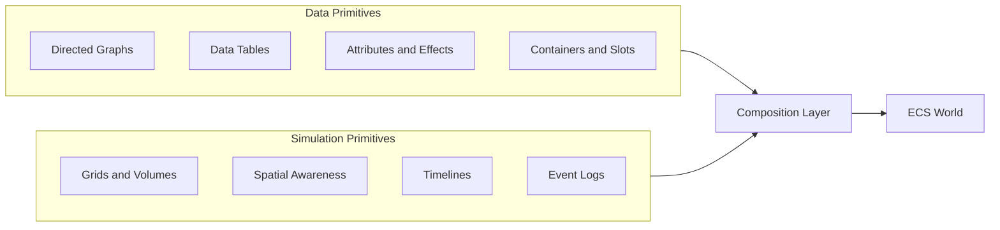
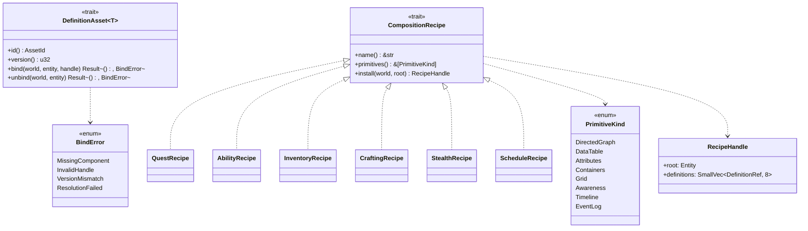
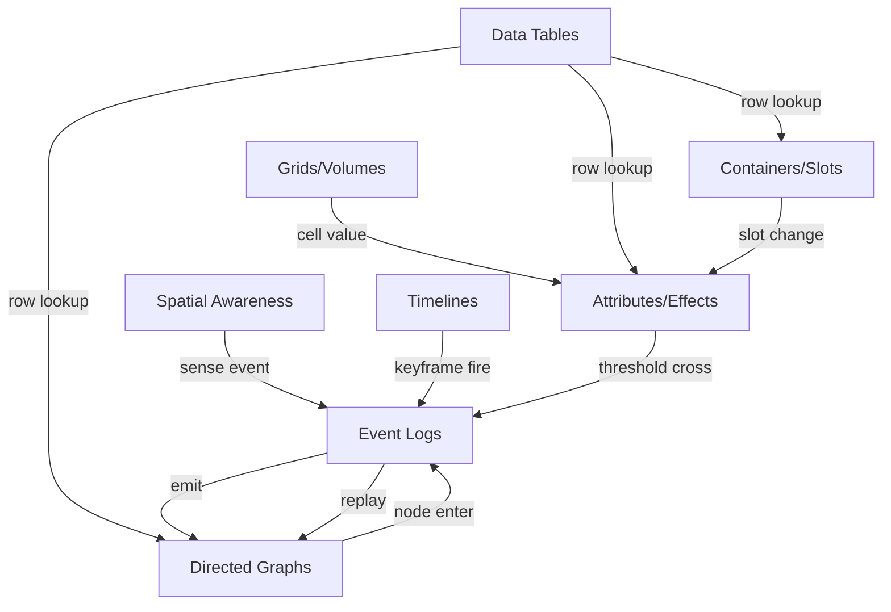
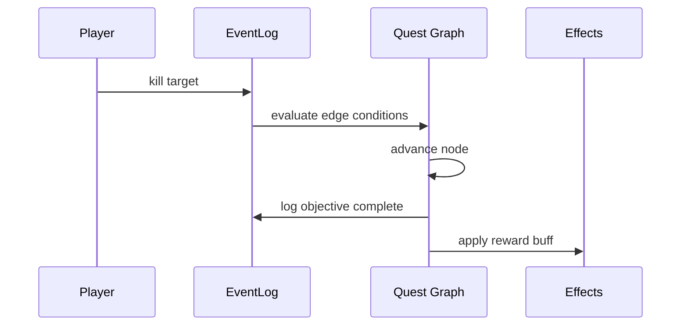
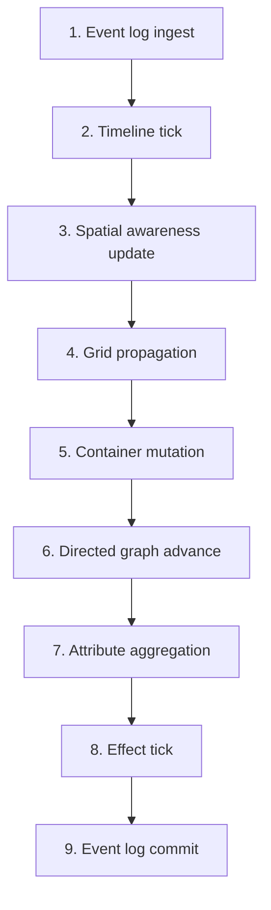

# Data Systems Composition Design

## Requirements Trace

> **Canonical sources:** Features, requirements, and user stories live in
> [features/](../../features/), [requirements/](../../requirements/), and
> [user-stories/](../../user-stories/).

### Primary Requirements

| Feature   | Requirement | User Story  | Design Element                         |
|-----------|-------------|-------------|----------------------------------------|
| F-16.5.1  | R-16.5.1    | US-16.5.1   | `DefinitionAsset<T>` unifying pattern  |
| F-16.5.2  | R-16.5.2    | US-16.5.2   | Composition recipes per gameplay genre |
| F-16.5.3  | R-16.5.3    | US-16.5.3   | Cross-primitive interaction protocol   |
| F-16.5.4  | R-16.5.4    | US-16.5.4   | Networked execution determinism        |
| F-16.5.5  | R-16.5.5    | US-16.5.5   | Composition performance profile        |
| F-16.5.6  | R-16.5.6    | US-16.5.6   | Definition binding lifecycle           |
| F-16.5.7  | R-16.5.7    | US-16.5.7   | Save/load across composed primitives   |

1. **R-16.5.1** -- `DefinitionAsset<T>` trait unifying definition-to-component binding
2. **R-16.5.2** -- Authored recipes for quest, ability, inventory, crafting, stealth, schedule
3. **R-16.5.3** -- Primitive interaction order contract (events, conditions, modifiers)
4. **R-16.5.4** -- Deterministic execution across network peers using sorted evaluation order
5. **R-16.5.5** -- 256-character RPG scene: composition budget < 3 ms/frame at 60 fps
6. **R-16.5.6** -- Binding resolves asset handles to ECS components within 1 frame
7. **R-16.5.7** -- Save snapshots traverse definitions in topological order

### Primitive Dependencies

| Primitive                | Source Doc                                                        |
|--------------------------|-------------------------------------------------------------------|
| Directed graphs          | [directed-graphs.md](directed-graphs.md)                          |
| Data tables              | [data-tables.md](data-tables.md)                                  |
| Attributes and effects   | [attributes-effects.md](attributes-effects.md)                    |
| Containers and slots     | [containers-slots.md](containers-slots.md)                        |
| Grids and volumes        | [../simulation/grids-volumes.md](../simulation/grids-volumes.md)  |
| Spatial awareness        | [../simulation/spatial-awareness.md](../simulation/spatial-awareness.md) |
| Timelines                | [../simulation/timelines.md](../simulation/timelines.md)          |
| Event logs               | [../simulation/event-logs.md](../simulation/event-logs.md)        |

### Cross-Cutting Dependencies

| Dependency         | Source   | Consumed API                 |
|--------------------|----------|------------------------------|
| ECS world          | F-1.1.1  | `Query`, `Entity`, `World`   |
| Event channels     | F-1.5.1  | `EventWriter<T>`             |
| Asset system       | F-12.1   | `AssetId`, `Handle<T>`       |
| Condition registry | F-16.6.1 | `ConditionExpr`, `ConditionContext` |
| Networking         | F-11.3.1 | Deterministic lockstep       |
| Serialization      | F-1.4.1  | `rkyv` zero-copy             |

---

## Overview

The engine ships **four data primitives** (directed graphs, data tables, attributes/effects,
containers/slots) and **four simulation primitives** (grids/volumes, spatial awareness, timelines,
event logs). Gameplay systems are built by **composing** these eight primitives. No dedicated quest,
ability, inventory, or crafting subsystem exists.

This document shows six concrete recipes (quest, ability, inventory, crafting, stealth, NPC
schedule), introduces the unifying `DefinitionAsset<T>` trait, specifies the cross-primitive
interaction protocol, and provides the performance profile for realistic RPG density.

### Design Principles

1. **No dedicated gameplay subsystems** -- compose primitives, never invent new ones
2. **Definitions are assets** -- one `DefinitionAsset<T>` trait for every primitive
3. **Events are the only coupling** -- primitives communicate via ECS events, never direct calls
4. **Deterministic evaluation order** -- phases run in topological order every frame
5. **Networked by default** -- every recipe executes identically on host and clients
6. **Codegen-first** -- visual editor writes definitions, codegen emits Rust that binds them
7. **No Arc, Rc, Cell, RefCell** -- generational handles, owned values only

---

## Architecture

### The Eight Primitives



### Class Diagram



### Cross-Primitive Interaction



---

## API Design

### DefinitionAsset Trait

```rust
/// Unifies how immutable definitions (meter, attribute set, container, graph schema,
/// data table, timeline track, event log schema, grid descriptor) bind to ECS components.
pub trait DefinitionAsset: Sized + rkyv::Archive {
    type Component: Component;
    type Handle: Copy + Eq;

    fn id(&self) -> AssetId;
    fn version(&self) -> u32;

    /// Create and attach the corresponding ECS component. Called at spawn time
    /// or when a save game is loaded. Must be idempotent.
    fn bind(
        &self,
        world: &mut World,
        entity: Entity,
        handle: Self::Handle,
    ) -> Result<(), BindError>;

    /// Detach the component. Called on despawn or hot-reload.
    fn unbind(&self, world: &mut World, entity: Entity) -> Result<(), BindError>;
}

pub enum BindError {
    MissingComponent(&'static str),
    InvalidHandle,
    VersionMismatch { expected: u32, actual: u32 },
    ResolutionFailed,
}
```

### Composition Recipe Trait

```rust
/// A recipe installs the combination of primitives needed to realize a gameplay
/// feature (quest, ability, etc.) onto an entity tree.
pub trait CompositionRecipe {
    fn name(&self) -> &'static str;
    fn primitives(&self) -> &'static [PrimitiveKind];

    fn install(
        &self,
        world: &mut World,
        root: Entity,
        ctx: &RecipeContext,
    ) -> Result<RecipeHandle, RecipeError>;
}

pub struct RecipeHandle {
    pub root: Entity,
    pub definitions: SmallVec<[DefinitionRef; 8]>,
}
```

### Primitive Kind Enum

```rust
pub enum PrimitiveKind {
    DirectedGraph,
    DataTable,
    Attributes,
    Containers,
    Grid,
    Awareness,
    Timeline,
    EventLog,
}
```

---

## Composition Recipes

### Recipe 1: Quest System

A quest is a **`DirectedGraph<QuestNode, QuestEdge>`** whose nodes are rows in a
**`DataTable<QuestNodeRow>`**, whose edges carry **`ConditionExpr`** guards, and whose progression
events are logged to an **`EventLog<QuestEvent>`**.

| Primitive         | Used As                                          |
|-------------------|--------------------------------------------------|
| Directed graph    | Topology of objectives and branches              |
| Data tables       | Reward and localized text per objective          |
| Event logs        | Player progression history (auditable, replayable) |
| Attributes/effects| Quest-bound stat buffs while active              |
| Timelines         | Time-limited quests with failure keyframe        |

Interaction:



### Recipe 2: Ability System

An ability is a **`DirectedGraph<AbilityNode, AbilityEdge>`** (the activation DAG), driven by
**`Meter` cooldowns**, consumed from an **`AttributeSet`** (mana/stamina), targeted via
**spatial awareness**, and scheduled on a **`Timeline`** for wind-up/cast/recovery phases.

| Primitive         | Used As                                         |
|-------------------|-------------------------------------------------|
| Directed graph    | Activation state machine (charge, release, combo) |
| Attributes/effects| Cooldown meter, resource cost, damage roll     |
| Timelines         | Cast sequence (wind-up -> release -> recovery) |
| Spatial awareness | Target selection within cone or radius         |
| Event logs        | Damage history for replay / combat log         |
| Data tables       | Ability data (icon, tooltip, base damage)      |

### Recipe 3: Inventory

An inventory is a **`Container`** (grid or flat) whose items reference rows in a
**`DataTable<ItemRow>`**, whose equipment slots propagate stat modifiers into an **`AttributeSet`**
via **`Effect`** events, and whose transaction history lives in an **`EventLog<InventoryEvent>`**.

| Primitive         | Used As                                         |
|-------------------|-------------------------------------------------|
| Containers/slots  | Grid occupancy, stacking, nesting              |
| Data tables       | Item master data                                |
| Attributes/effects| Equipment stat propagation                     |
| Event logs        | Transaction history for rollback / undo        |

### Recipe 4: Crafting

Crafting is a **`DirectedGraph<RecipeNode, IngredientEdge>`** of unlockable recipes whose inputs
query **`Container`** contents, outputs apply **`Effect`** events, and success/failure feeds an
**`EventLog<CraftEvent>`**.

| Primitive         | Used As                                         |
|-------------------|-------------------------------------------------|
| Directed graph    | Recipe prerequisite tree                        |
| Data tables       | Recipe ingredients and outputs                  |
| Containers/slots  | Source and destination containers              |
| Event logs        | Craft history                                   |
| Timelines         | Progress bar for long-duration crafts          |

### Recipe 5: Stealth

Stealth is a **`Grid<f32>`** storing sensory noise levels, a **`SpatialAwareness`** system giving
NPCs perception cones, **`EventLog<StealthEvent>`** for detection events, and **`Effect`** modifying
movement cost when in shadow.

| Primitive         | Used As                                         |
|-------------------|-------------------------------------------------|
| Grids/volumes     | Ambient noise and light grid                    |
| Spatial awareness | NPC sight and hearing cones                    |
| Event logs        | Detection and state-change events               |
| Attributes/effects| Invisibility, noise suppression effects        |

### Recipe 6: NPC Schedule

NPC schedules are **`Timelines`** whose keyframes set `DestinationTarget` components, causing AI
path queries via **spatial awareness**, logged to **`EventLog<NpcEvent>`** for memory.

| Primitive         | Used As                                         |
|-------------------|-------------------------------------------------|
| Timelines         | Daily routine keyframes (sleep, work, eat)     |
| Spatial awareness | Path queries to destination                    |
| Event logs        | NPC memory of events witnessed                 |
| Data tables       | NPC role and schedule templates                 |

### Recipe Summary Table

| Recipe    | Graphs | Tables | Attr/FX | Containers | Grids | Awareness | Timelines | Event Logs |
|-----------|--------|--------|---------|------------|-------|-----------|-----------|------------|
| Quest     | core   | yes    | yes     | no         | no    | no        | optional  | yes        |
| Ability   | core   | yes    | yes     | no         | no    | yes       | yes       | yes        |
| Inventory | no     | yes    | yes     | core       | no    | no        | no        | yes        |
| Crafting  | core   | yes    | yes     | yes        | no    | no        | yes       | yes        |
| Stealth   | no     | yes    | yes     | no         | core  | core      | no        | yes        |
| Schedule  | no     | yes    | no      | no         | no    | yes       | core      | yes        |

---

## Data Flow

### Frame Phase Integration

Composed systems run in a strict phase order every frame. Events flow from simulation primitives
into data primitives and back out as effects.



### Event Protocol

Primitives never call each other. Every interaction is an ECS event.

| Emitter             | Event                   | Consumer               |
|---------------------|-------------------------|------------------------|
| Event log           | `EntryAppended`         | Directed graph, effects |
| Directed graph      | `NodeEntered`           | Event log, effects     |
| Container           | `SlotChanged`           | Attributes, event log  |
| Attribute           | `ThresholdCrossed`      | Event log, graphs      |
| Effect              | `Applied` / `Expired`   | Event log              |
| Timeline            | `KeyframeFired`         | Event log, graphs      |
| Spatial awareness   | `TargetAcquired`        | Graphs, event log      |
| Grid                | `CellChanged`           | Attributes, event log  |

---

## Networked Execution

All composed recipes execute **deterministically** on every peer. Inputs arrive via the networking
layer as an ordered stream of commands. Each frame, every peer evaluates the same phase order,
producing identical state. See [../networking/network-transport.md] for the command ordering
protocol.

### Determinism Requirements

1. **Sorted iteration** -- all primitive iteration uses `BTreeMap` or sorted `Vec`, never `HashMap`
2. **Seeded randomness** -- every recipe takes a `DeterministicRng` seeded from `(tick, recipe_id)`
3. **Stable definition IDs** -- `AssetId` is stable across runs and network peers
4. **Topological phase order** -- defined above, enforced by the game loop scheduler

### Replication Strategy

| Primitive         | What Replicates                              | Frequency   |
|-------------------|----------------------------------------------|-------------|
| Directed graph    | Current node set                             | On change   |
| Container         | Slot contents                                | On change   |
| Attribute         | Current value                                | 10 Hz       |
| Effect            | Active effect list                           | On apply/expire |
| Event log         | Appended entries                             | On append   |
| Grid              | Authoritative chunk diffs                    | 5 Hz        |
| Timeline          | Playback state (tick + speed)                | On seek     |
| Spatial awareness | Target set only                              | On change   |

---

## Platform Considerations

| Platform | Note                                                                 |
|----------|----------------------------------------------------------------------|
| Desktop  | Full composition, 256 characters, all recipes active                |
| Console  | Same as desktop                                                      |
| Mobile   | Reduced density: 64 characters, skip timeline recipes when idle     |
| VR       | Fixed 90 Hz budget; recipes must stay under 4 ms combined           |

---

## Performance Profile

Target: **256-character RPG scene**, mix of quest / ability / inventory / schedule recipes, 60 fps.

| Scenario                              | Density              | Budget  | Allocation |
|---------------------------------------|----------------------|---------|------------|
| Quest graphs active                   | 32 graphs, 8 nodes   | 0.2 ms  | graphs     |
| Ability activations                   | 64 casting           | 0.4 ms  | graphs+AE  |
| Inventories simulated                 | 256 chars, 128 slots | 0.6 ms  | containers |
| Attribute aggregation                 | 256 chars, 16 attrs  | 0.5 ms  | AE         |
| Effects ticking                       | 1024 active          | 0.3 ms  | AE         |
| Event log appends                     | 2048 entries/frame   | 0.2 ms  | EL         |
| Schedule timelines                    | 128 NPC routines     | 0.2 ms  | TL         |
| Spatial awareness                     | 256 sensors          | 0.3 ms  | SA         |
| Grid propagation (stealth)            | 128x128 noise        | 0.3 ms  | GV         |
| **Total composition budget**          |                      | **3.0 ms** |         |

Budgets are derived from the per-primitive NFRs in each primitive's design doc. Any recipe that
exceeds its share is responsible for falling back (defer work, lower fidelity, spread across
frames).

### 10K-Item Inventory Scenario

A single player inventory with 10,000 items (large sandbox): use a flat `Container` with a sorted
`Vec<SlotIndex>` keyed on `ItemTypeId`. Stack operation stays O(log n). Full inventory redraw is
UI-only and runs off a `DirtyRegionSet` so only visible cells repaint.

---

## Test Plan

See [composition-test-cases.md](composition-test-cases.md) for TC-16.5.x.y entries covering:

- Unit tests for `DefinitionAsset` binding and unbinding
- Integration tests for each of the six recipes end-to-end
- Benchmark tests for the 256-character scenario
- Determinism tests comparing two peers' state hashes after 600 frames
- Save/load round-trip across composed primitives

---

## Open Questions

1. Should recipes be codegen'd from visual editor graphs, or hand-written in Rust? Codegen is
   consistent with the middleman-dylib principle, but a stable recipe API may be easier to author.
2. Do we need a `RecipeRegistry` at runtime, or are recipes pure codegen (no registry)?
3. How does hot-reload of a recipe interact with in-flight event logs?
4. Should the `DefinitionAsset::bind` signature take `&mut World` or a command buffer?
