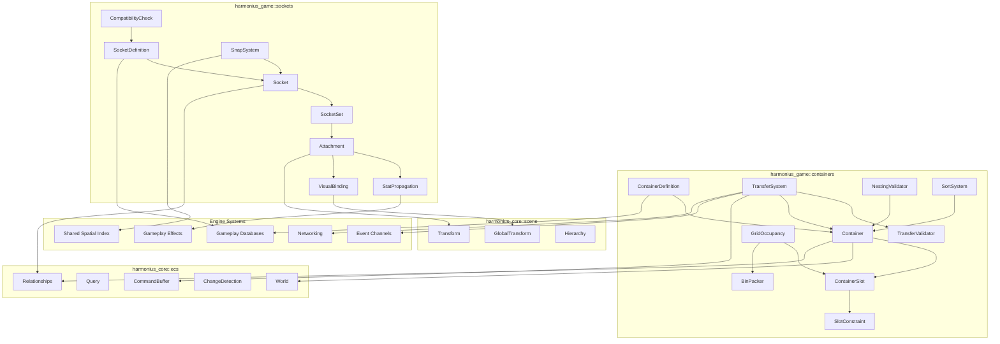
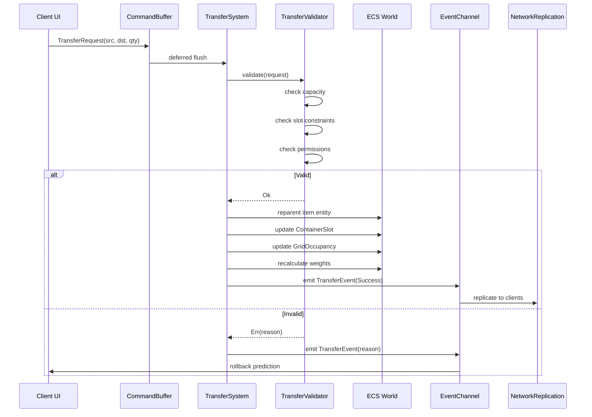
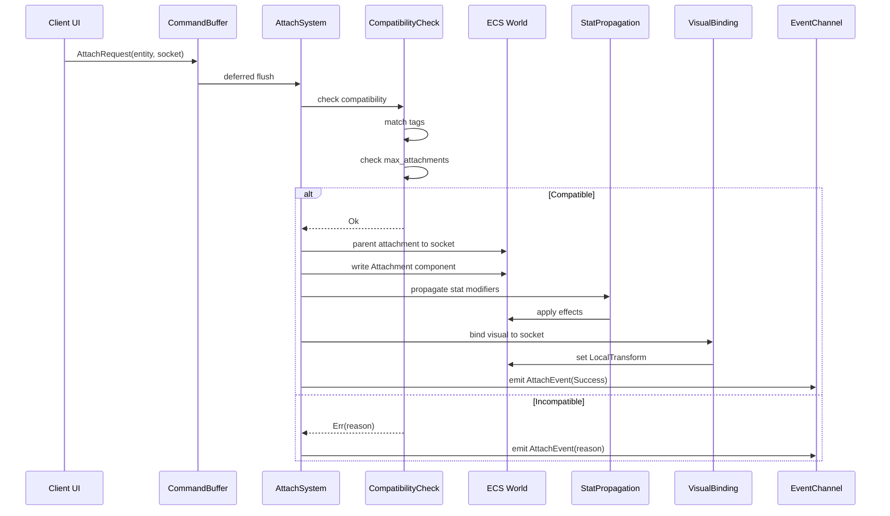

# Container and Slot Systems Design

## Requirements Trace

| Feature  | Requirement | Domain               |
|----------|-------------|----------------------|
| F-13.8.1 | R-13.8.1   | Grid-layout storage  |
| F-13.8.2 | R-13.8.2   | Item stacking        |
| F-13.8.3 | R-13.8.3   | Socket attachment    |
| F-13.8.4 | R-13.8.4   | Equipment slots      |
| F-13.8.5 | R-13.8.5   | Drag-drop operations |

1. **F-13.8.1** -- Containers with optional grid layout
2. **F-13.8.2** -- Item stacking with per-type limits
3. **F-13.8.3** -- Socket attachment points on entities
4. **F-13.8.4** -- Typed equipment slot definitions
5. **F-13.8.5** -- Drag-drop transfer operations

### Cross-Cutting Dependencies

| Dependency        | Source    | Consumed API               |
|-------------------|-----------|----------------------------|
| Entity lifecycle  | F-1.1.11  | Generational `Entity`      |
| ChildOf relation  | F-1.1.14  | Parent-child hierarchy     |
| Command buffers   | F-1.1.32  | Deferred structural changes|
| Change detection  | F-1.1.22  | `Changed<T>` queries       |
| Serialization     | F-1.4.1   | rkyv zero-copy binary      |
| Spatial index     | F-1.9.1   | BVH for snap queries       |
| Data tables       | F-13.7.2  | Definitions from DB rows   |
| Gameplay effects  | F-13.10.3 | Stat modifier application  |
| Networking        | F-8.2.1   | State replication           |

---

## Overview

Two genre-agnostic ECS primitives:

1. **Container** -- a bounded collection of items with capacity rules, optional grid layout, and
   stacking. Items are child entities referenced via `RowRef` (gameplay database rows).
2. **Socket** -- a typed attachment point on an entity. Items or child entities snap into sockets
   based on tag compatibility. Sockets hold entity references.

### Design Principles

1. **ECS-primary (~90%)-based.** All state in components/resources.
2. **Data-driven.** Definitions from gameplay databases.
3. **Genre-agnostic.** No game-specific semantics.
4. **Immutable definitions, mutable state.** Definition types are immutable. Runtime state is
   mutable.
5. **No shared ownership.** No `Arc`, `Rc`, `Cell`, `RefCell`. Owned values and generational indices
   only.

### Performance Targets

| Metric                       | Target      | Source      |
|------------------------------|-------------|-------------|
| Transfer validation          | < 0.1 ms   | R-13.9.NF3  |
| Container sort (500 items)   | < 1 ms     | R-13.9.NF3  |
| Grid bin-pack (500 items)    | < 1 ms     | R-13.9.NF3  |
| Snap query (500 pieces)      | < 2 ms     | NFR-13.14.1 |
| Stat propagation (64 sockets)| < 0.5 ms   | R-13.10.NF1 |

---

## Architecture

### Module Boundaries



### Core Data Structures

```mermaid
classDiagram
    class ContainerDefinitionId {
        +u64 0
    }
    class LayoutMode {
        <<enum>>
        List
        Grid
        FixedSlot
    }
    class CapacityMode {
        <<enum>>
        SlotCount
        Weight
        Both
    }
    class ContainerDefinition {
        +ContainerDefinitionId id
        +LayoutMode layout
        +CapacityMode capacity_mode
        +u16 slot_count
        +f32 weight_capacity
        +u16 grid_width
        +u16 grid_height
        +Vec~SlotDefinition~ slots
        +bool nestable
        +u8 max_nesting_depth
        +TagSet accepted_tags
        +TagSet rejected_tags
    }
    class SlotDefinition {
        +u16 index
        +SlotPosition position
        +SlotConstraint constraint
    }
    class SlotPosition {
        <<enum>>
        Linear(u16)
        Grid(u16 u16 u16 u16)
    }
    class SlotConstraint {
        +TagSet accepted_tags
        +TagSet rejected_tags
        +u32 max_stack
        +bool unique
    }
    class Container {
        +ContainerDefinitionId definition_id
        +u16 used_slots
        +f32 current_weight
    }
    class ContainerSlot {
        +u16 slot_index
        +u32 quantity
    }
    class GridOccupancy {
        +FixedBitSet cells
        +u16 width
        +u16 height
        +is_region_free() bool
        +occupy()
        +vacate()
    }
    class TransferRequest {
        +Entity source_container
        +u16 source_slot
        +Entity dest_container
        +u16 dest_slot
        +u32 quantity
        +Entity requester
    }
    class TransferResult {
        <<enum>>
        Success
        InsufficientCapacity
        WeightExceeded
        ConstraintViolation
        PermissionDenied
        InvalidSlot
        StackFull
        NestingDepthExceeded
        ItemNotFound
    }
    class TransferEvent {
        +Entity item
        +Entity source_container
        +u16 source_slot
        +Entity dest_container
        +u16 dest_slot
        +u32 quantity
        +TransferResult result
    }
    class SortCriteria {
        <<enum>>
        Name
        Weight
        Rarity
        Type
        Custom(u32)
    }
    class SortRequest {
        +Entity container
        +SortCriteria criteria
    }
    class SocketDefinitionId {
        +u64 0
    }
    class SocketDefinition {
        +SocketDefinitionId id
        +String name
        +Vec3 transform_offset
        +Quat rotation_offset
        +TagSet compatible_tags
        +u8 max_attachments
        +bool propagate_stats
        +bool propagate_physics
        +f32 snap_radius
    }
    class Socket {
        +SocketDefinitionId definition_id
    }
    class SocketSet {
        +SmallVec~Socket 4~ sockets
    }
    class Attachment {
        +Entity socket_entity
    }
    class AttachmentTags {
        +TagSet tags
    }
    class StatModifierList {
        +Vec~StatModifier~ modifiers
    }
    class StatModifier {
        +StatId stat
        +ModifierOp op
        +f32 value
    }
    class ModifierOp {
        <<enum>>
        Add
        Multiply
        Override
    }
    class VisualOverride {
        +Option~AssetHandle~ mesh_override
        +Option~AssetHandle~ material_override
        +bool hide_socket_visual
    }
    class AttachRequest {
        +Entity attachment
        +Entity socket
        +Entity requester
    }
    class DetachRequest {
        +Entity attachment
        +Entity socket
        +Entity requester
    }
    class AttachResult {
        <<enum>>
        Success
        Incompatible
        Full
        AlreadyAttached
        PermissionDenied
    }
    class AttachEvent {
        +Entity attachment
        +Entity socket
        +Entity owner
        +AttachResult result
    }
    class DetachEvent {
        +Entity attachment
        +Entity socket
        +Entity owner
    }
    class SnapPoint {
        +SocketDefinitionId socket_def
        +Vec3 world_position
        +Quat world_rotation
        +f32 snap_radius
    }
    class SnapCandidate {
        +Entity source_socket
        +Entity target_socket
        +f32 distance
    }

    ContainerDefinition --> ContainerDefinitionId
    ContainerDefinition --> LayoutMode
    ContainerDefinition --> CapacityMode
    ContainerDefinition *-- SlotDefinition
    SlotDefinition --> SlotPosition
    SlotDefinition --> SlotConstraint
    Container --> ContainerDefinitionId
    ContainerSlot --> Container
    GridOccupancy --> Container
    TransferRequest --> Container
    TransferEvent --> TransferResult
    SortRequest --> SortCriteria
    SocketDefinition --> SocketDefinitionId
    Socket --> SocketDefinitionId
    SocketSet *-- Socket
    Attachment --> Socket
    StatModifierList --> Attachment
    StatModifierList *-- StatModifier
    StatModifier --> ModifierOp
    VisualOverride --> Attachment
    AttachRequest --> Socket
    DetachRequest --> Socket
    AttachEvent --> AttachResult
    SnapPoint --> SocketDefinitionId
    SnapCandidate --> SnapPoint
    AttachmentTags --> Attachment
```



### System Ordering

All systems run on worker threads as part of the game loop. Game loop phases follow a fixed frame
pipeline. Systems in this module run in the `GameLogic` phase.

| System            | Phase        | Reads                         | Writes                         |
|-------------------|--------------|-------------------------------|--------------------------------|
| `SnapSystem`      | `PreLogic`   | `GlobalTransform`, `SocketSet`| `SnapCandidate` (resource)     |
| `TransferSystem`  | `GameLogic`  | `TransferRequest` events      | `Container`, `ContainerSlot`, `GridOccupancy` |
| `AttachSystem`    | `GameLogic`  | `AttachRequest` events        | `Attachment`, `SocketSet`      |
| `StatPropagation` | `PostLogic`  | `Attachment`, `StatModifierList`| Gameplay effects               |
| `SortSystem`      | `PostLogic`  | `SortRequest` events          | `ContainerSlot` order          |

**Frame-boundary handoff for replication:**

1. `TransferSystem` runs in `GameLogic`; emits `TransferEvent` into the event channel.
2. At frame boundary (`PostLogic` end), the network replication system reads all pending
   `TransferEvent`s and `AttachEvent`s from the channel.
3. Network replication serializes delta state via rkyv and pushes to the replication queue.
4. Client rollback is applied at the start of the next frame before `PreLogic` runs, using the
   authoritative server result.

**Per-thread arenas:** Transfer validation scratch buffers, bin-packing temporaries, and sort
buffers allocate from per-thread arenas. Arenas reset at the `PostLogic`/frame-end boundary.

---

## Codegen and Hot-Reload

`ContainerDefinition`, `SocketDefinition`, `SlotConstraint` rules, custom `SortCriteria` variants,
and tag sets are codegen'd into the middleman `.dylib`. The engine binary never contains
user-defined types.

| Codegen input                  | Generated output                           |
|--------------------------------|--------------------------------------------|
| Container schema (visual editor) | `ContainerDefinition` struct + load fn    |
| Socket schema (visual editor)  | `SocketDefinition` struct + load fn        |
| Slot constraint rules (visual) | `fn check_constraint(...)` in middleman    |
| Custom sort criteria           | `SortCriteria` enum variant + comparator   |
| Tag set definitions            | Typed `TagSet` constants in middleman      |

Hot-reload recompiles the middleman `.dylib` when container or socket definitions change. The engine
binary stays stable. Bundled `rustc`/`cargo` target sub-3-second reload.

### Extensible Enums

Enums are either closed (engine-only, never extended by designers) or open (designer-extensible,
codegen'd into the middleman `.dylib`).

| Enum            | Closed/Open | Rationale                                         |
|-----------------|-------------|---------------------------------------------------|
| `LayoutMode`    | Closed      | Engine-defined layout strategies only             |
| `CapacityMode`  | Closed      | Engine-defined capacity models only               |
| `TransferResult`| Closed      | Engine-defined error codes only                   |
| `AttachResult`  | Closed      | Engine-defined error codes only                   |
| `ModifierOp`    | Closed      | Engine-defined math ops only                      |
| `SortCriteria`  | Open        | Designers add custom sort axes; codegen'd in dylib|
| `SlotPosition`  | Closed      | Grid/linear layout defined by engine              |

Slot constraint rules and tag acceptance/rejection rules defined visually by designers compile to
actual Rust code via the codegen pipeline. Custom `SortCriteria` variants and their comparators are
also generated. This is the same "everything is Rust" architecture used by formulas and logic
graphs.

---

## API Design

### Container Types

```rust
#[derive(
    Clone, Copy, Debug, PartialEq, Eq, Hash,
    rkyv::Archive, rkyv::Serialize, rkyv::Deserialize,
)]
pub struct ContainerDefinitionId(pub u64);

#[derive(
    Clone, Copy, Debug, PartialEq, Eq, Hash,
    rkyv::Archive, rkyv::Serialize, rkyv::Deserialize,
)]
pub enum LayoutMode { List, Grid, FixedSlot }

#[derive(
    Clone, Copy, Debug, PartialEq, Eq, Hash,
    rkyv::Archive, rkyv::Serialize, rkyv::Deserialize,
)]
pub enum CapacityMode { SlotCount, Weight, Both }

/// Immutable blueprint from gameplay databases.
#[derive(
    Clone, Debug,
    rkyv::Archive, rkyv::Serialize, rkyv::Deserialize,
)]
pub struct ContainerDefinition {
    pub id: ContainerDefinitionId,
    pub layout: LayoutMode,
    pub capacity_mode: CapacityMode,
    pub slot_count: u16,
    pub weight_capacity: f32,
    pub grid_width: u16,
    pub grid_height: u16,
    pub slots: Vec<SlotDefinition>,
    pub nestable: bool,
    pub max_nesting_depth: u8,
    pub accepted_tags: TagSet,
    pub rejected_tags: TagSet,
}

#[derive(
    Clone, Debug,
    rkyv::Archive, rkyv::Serialize, rkyv::Deserialize,
)]
pub struct SlotDefinition {
    pub index: u16,
    pub position: SlotPosition,
    pub constraint: SlotConstraint,
}

#[derive(
    Clone, Copy, Debug, PartialEq, Eq, Hash,
    rkyv::Archive, rkyv::Serialize, rkyv::Deserialize,
)]
pub enum SlotPosition {
    Linear(u16),
    Grid { x: u16, y: u16, w: u16, h: u16 },
}

#[derive(
    Clone, Debug, Default,
    rkyv::Archive, rkyv::Serialize, rkyv::Deserialize,
)]
pub struct SlotConstraint {
    pub accepted_tags: TagSet,
    pub rejected_tags: TagSet,
    pub max_stack: u32,
    pub unique: bool,
}
```

### Container Runtime Components

```rust
/// Mutable per-entity state. Items are child
/// entities via ChildOf relationship.
#[derive(
    Clone, Debug,
    rkyv::Archive, rkyv::Serialize, rkyv::Deserialize,
)]
pub struct Container {
    pub definition_id: ContainerDefinitionId,
    pub used_slots: u16,
    pub current_weight: f32,
}

/// On item entity (not the container).
#[derive(
    Clone, Copy, Debug,
    rkyv::Archive, rkyv::Serialize, rkyv::Deserialize,
)]
pub struct ContainerSlot {
    pub slot_index: u16,
    pub quantity: u32,
}

/// Grid cell occupancy bitmap (row-major).
#[derive(
    Clone, Debug,
    rkyv::Archive, rkyv::Serialize, rkyv::Deserialize,
)]
pub struct GridOccupancy {
    pub cells: FixedBitSet,
    pub width: u16,
    pub height: u16,
}

impl GridOccupancy {
    pub fn is_region_free(
        &self, x: u16, y: u16, w: u16, h: u16,
    ) -> bool { /* row-major scan */ }

    pub fn occupy(
        &mut self, x: u16, y: u16, w: u16, h: u16,
    ) { /* set bits */ }

    pub fn vacate(
        &mut self, x: u16, y: u16, w: u16, h: u16,
    ) { /* clear bits */ }
}
```

### Transfer Types

```rust
#[derive(
    Clone, Copy, Debug,
    rkyv::Archive, rkyv::Serialize, rkyv::Deserialize,
)]
pub struct TransferRequest {
    pub source_container: Entity,
    pub source_slot: u16,
    pub dest_container: Entity,
    /// u16::MAX = auto-place.
    pub dest_slot: u16,
    /// 0 = entire stack.
    pub quantity: u32,
    pub requester: Entity,
}

#[derive(
    Clone, Copy, Debug, PartialEq, Eq, Hash,
    rkyv::Archive, rkyv::Serialize, rkyv::Deserialize,
)]
pub enum TransferResult {
    Success,
    InsufficientCapacity,
    WeightExceeded,
    ConstraintViolation,
    PermissionDenied,
    InvalidSlot,
    StackFull,
    NestingDepthExceeded,
    ItemNotFound,
}

#[derive(
    Clone, Copy, Debug,
    rkyv::Archive, rkyv::Serialize, rkyv::Deserialize,
)]
pub struct TransferEvent {
    pub item: Entity,
    pub source_container: Entity,
    pub source_slot: u16,
    pub dest_container: Entity,
    pub dest_slot: u16,
    pub quantity: u32,
    pub result: TransferResult,
}

#[derive(
    Clone, Copy, Debug, PartialEq, Eq, Hash,
    rkyv::Archive, rkyv::Serialize, rkyv::Deserialize,
)]
pub enum SortCriteria {
    Name, Weight, Rarity, Type, Custom(u32),
}

/// Pure validation -- no mutation.
pub fn validate_transfer(
    request: &TransferRequest,
    src_def: &ContainerDefinition,
    dst_def: &ContainerDefinition,
    src: &Container,
    dst: &Container,
    dst_grid: Option<&GridOccupancy>,
    item_tags: &TagSet,
    item_weight: f32,
    item_grid_size: Option<(u16, u16)>,
    nesting_depth: u8,
) -> Result<(), TransferResult> {
    // 1. Validate slot bounds.
    // 2. Check tag constraints.
    // 3. Check capacity (slots, weight, or both).
    // 4. Check grid occupancy for Grid layout.
    // 5. Check nesting depth.
    todo!()
}
```

### Socket Types

```rust
#[derive(
    Clone, Copy, Debug, PartialEq, Eq, Hash,
    rkyv::Archive, rkyv::Serialize, rkyv::Deserialize,
)]
pub struct SocketDefinitionId(pub u64);

/// Immutable blueprint from gameplay databases.
#[derive(
    Clone, Debug,
    rkyv::Archive, rkyv::Serialize, rkyv::Deserialize,
)]
pub struct SocketDefinition {
    pub id: SocketDefinitionId,
    pub name: String,
    pub transform_offset: Vec3,
    pub rotation_offset: Quat,
    pub compatible_tags: TagSet,
    pub max_attachments: u8,
    pub propagate_stats: bool,
    pub propagate_physics: bool,
    pub snap_radius: f32,
}

#[derive(
    Clone, Copy, Debug,
    rkyv::Archive, rkyv::Serialize, rkyv::Deserialize,
)]
pub struct Socket {
    pub definition_id: SocketDefinitionId,
}

#[derive(
    Clone, Debug,
    rkyv::Archive, rkyv::Serialize, rkyv::Deserialize,
)]
pub struct SocketSet {
    pub sockets: SmallVec<[Socket; 4]>,
}

#[derive(
    Clone, Copy, Debug,
    rkyv::Archive, rkyv::Serialize, rkyv::Deserialize,
)]
pub struct Attachment {
    pub socket_entity: Entity,
}

#[derive(
    Clone, Debug, Default,
    rkyv::Archive, rkyv::Serialize, rkyv::Deserialize,
)]
pub struct AttachmentTags { pub tags: TagSet }

#[derive(
    Clone, Debug, Default,
    rkyv::Archive, rkyv::Serialize, rkyv::Deserialize,
)]
pub struct StatModifierList {
    pub modifiers: Vec<StatModifier>,
}

#[derive(
    Clone, Copy, Debug,
    rkyv::Archive, rkyv::Serialize, rkyv::Deserialize,
)]
pub struct StatModifier {
    pub stat: StatId,
    pub op: ModifierOp,
    pub value: f32,
}

#[derive(
    Clone, Copy, Debug, PartialEq, Eq, Hash,
    rkyv::Archive, rkyv::Serialize, rkyv::Deserialize,
)]
pub enum ModifierOp { Add, Multiply, Override }

#[derive(
    Clone, Debug, Default,
    rkyv::Archive, rkyv::Serialize, rkyv::Deserialize,
)]
pub struct VisualOverride {
    pub mesh_override: Option<AssetHandle<Mesh>>,
    pub material_override:
        Option<AssetHandle<Material>>,
    pub hide_socket_visual: bool,
}
```

### Attach / Detach Types

```rust
#[derive(
    Clone, Copy, Debug,
    rkyv::Archive, rkyv::Serialize, rkyv::Deserialize,
)]
pub struct AttachRequest {
    pub attachment: Entity,
    pub socket: Entity,
    pub requester: Entity,
}

#[derive(
    Clone, Copy, Debug,
    rkyv::Archive, rkyv::Serialize, rkyv::Deserialize,
)]
pub struct DetachRequest {
    pub attachment: Entity,
    pub socket: Entity,
    pub requester: Entity,
}

#[derive(
    Clone, Copy, Debug, PartialEq, Eq, Hash,
    rkyv::Archive, rkyv::Serialize, rkyv::Deserialize,
)]
pub enum AttachResult {
    Success, Incompatible, Full,
    AlreadyAttached, PermissionDenied,
}

#[derive(
    Clone, Copy, Debug,
    rkyv::Archive, rkyv::Serialize, rkyv::Deserialize,
)]
pub struct AttachEvent {
    pub attachment: Entity,
    pub socket: Entity,
    pub owner: Entity,
    pub result: AttachResult,
}

#[derive(
    Clone, Copy, Debug,
    rkyv::Archive, rkyv::Serialize, rkyv::Deserialize,
)]
pub struct DetachEvent {
    pub attachment: Entity,
    pub socket: Entity,
    pub owner: Entity,
}

#[derive(
    Clone, Copy, Debug,
    rkyv::Archive, rkyv::Serialize, rkyv::Deserialize,
)]
pub struct SnapPoint {
    pub socket_def: SocketDefinitionId,
    pub world_position: Vec3,
    pub world_rotation: Quat,
    pub snap_radius: f32,
}

#[derive(
    Clone, Copy, Debug,
    rkyv::Archive, rkyv::Serialize, rkyv::Deserialize,
)]
pub struct SnapCandidate {
    pub source_socket: Entity,
    pub target_socket: Entity,
    pub distance: f32,
}

/// Pure compatibility check -- no mutation.
pub fn check_compatibility(
    socket_def: &SocketDefinition,
    attachment_tags: &AttachmentTags,
    current_count: u8,
) -> Result<(), AttachResult> {
    // 1. Check max_attachments.
    // 2. Check tag intersection.
    todo!()
}
```

---

## Data Flow

### Container Transfer Pipeline



1. UI drag-drop enqueues `TransferRequest`.
2. Client applies optimistic prediction.
3. Server calls `validate_transfer()`.
4. On success: reparent, update slots/grid/weight.
5. Emit `TransferEvent` for UI/audio/networking.
6. On rejection: client rolls back prediction.

### Socket Attach/Detach Pipeline



1. `AttachRequest` enqueued via `CommandBuffer`.
2. `check_compatibility()` verifies tags and count.
3. Attachment parented to socket via `ChildOf`.
4. Stat modifiers propagated to owner (F-13.10.3).
5. Visual binding sets local transform to offset.
6. `AttachEvent` emitted. Detach reverses 3--5.

---

## Platform Considerations

Platform-agnostic. All platform-specific behavior delegated to lower layers.

| Concern         | Abstraction               | Source  |
|-----------------|---------------------------|---------|
| Timing          | `Res<Time>` with f64      | Clock   |
| Spatial queries | Shared spatial index API  | F-1.9.1 |
| Networking      | Event-based replication   | F-8.2.1 |
| Serialization   | rkyv zero-copy binary     | F-1.4.1 |
| Asset loading   | `Assets<T>` with handles  | Pipeline|

---

## Test Plan

Companion: [containers-slots-test-cases.md](containers-slots-test-cases.md).

### Unit Tests -- Container

| Test                              | Req      |
|-----------------------------------|----------|
| `test_list_container_add_item`    | R-13.8.1 |
| `test_list_container_remove_item` | R-13.8.1 |
| `test_grid_occupy_region`         | R-13.8.1 |
| `test_grid_vacate_region`         | R-13.8.1 |
| `test_grid_region_overlap_reject` | R-13.8.1 |
| `test_grid_bin_pack_auto_sort`    | R-13.8.1 |
| `test_stack_split`                | R-13.8.2 |
| `test_stack_merge`                | R-13.8.2 |
| `test_stack_max_enforced`         | R-13.8.2 |
| `test_slot_constraint_accept`     | R-13.8.4 |
| `test_slot_constraint_reject`     | R-13.8.4 |
| `test_unique_constraint`          | R-13.8.4 |
| `test_capacity_slot_count`        | R-13.8.1 |
| `test_capacity_weight`            | R-13.8.1 |
| `test_capacity_both`              | R-13.8.1 |
| `test_transfer_success`           | R-13.8.5 |
| `test_transfer_insufficient_cap`  | R-13.8.5 |
| `test_transfer_constraint_fail`   | R-13.8.5 |
| `test_transfer_invalid_slot`      | R-13.8.5 |
| `test_transfer_auto_place`        | R-13.8.5 |
| `test_nesting_allowed`            | R-13.8.1 |
| `test_nesting_depth_exceeded`     | R-13.8.1 |
| `test_sort_by_name`               | R-13.8.1 |
| `test_sort_by_weight`             | R-13.8.1 |
| `test_weight_recalc_after_xfer`   | R-13.8.5 |

### Unit Tests -- Socket

| Test                              | Req       |
|-----------------------------------|-----------|
| `test_attach_compatible`          | R-13.8.3  |
| `test_attach_incompatible_tags`   | R-13.8.3  |
| `test_attach_socket_full`         | R-13.8.3  |
| `test_attach_already_attached`    | R-13.8.3  |
| `test_detach_removes_component`   | R-13.8.3  |
| `test_detach_reverses_stats`      | R-13.8.3  |
| `test_stat_propagation_add`       | R-13.10.3 |
| `test_stat_propagation_multiply`  | R-13.10.3 |
| `test_stat_propagation_override`  | R-13.10.3 |
| `test_stat_propagation_multi_att` | R-13.10.3 |
| `test_visual_binding_transform`   | R-13.8.3  |
| `test_visual_binding_mesh`        | R-13.8.3  |
| `test_snap_query_finds_nearby`    | R-13.8.3  |
| `test_snap_query_respects_radius` | R-13.8.3  |
| `test_snap_query_sorted`          | R-13.8.3  |
| `test_snap_tag_compatibility`     | R-13.8.3  |

### Integration Tests

| Test                              | Features            |
|-----------------------------------|---------------------|
| `test_inventory_equip_flow`       | F-13.8.1, F-13.8.4 |
| `test_container_to_container`     | F-13.8.1, F-13.8.5 |
| `test_socket_modifier_propagate`  | F-13.8.3, F-13.10.3|
| `test_transfer_rollback`          | F-13.8.5, F-8.3.1  |
| `test_attach_detach_cycle_stats`  | F-13.8.3, F-13.10.3|
| `test_serialization_roundtrip`    | F-1.4.1             |

### Benchmarks

| Benchmark                  | Target   | Req        |
|----------------------------|----------|------------|
| `bench_transfer_500`       | < 1 ms   | R-13.9.NF3 |
| `bench_grid_bin_pack_500`  | < 1 ms   | R-13.9.NF3 |
| `bench_sort_500`           | < 1 ms   | R-13.9.NF3 |
| `bench_snap_query_500`     | < 2 ms   | NFR-13.14.1|
| `bench_stat_propagation_64`| < 0.5 ms | R-13.10.NF1|
| `bench_attach_detach_100`  | < 0.5 ms | R-13.9.NF3 |

---

## Open Questions

1. **Grid bin-packing algorithm** -- FFDH vs shelf-based? FFDH is O(n log n) but may waste space.
2. **Container permission model** -- separate component with per-entity ACLs, or integrated into
   validator?
3. **Cross-container transactions** -- single swap request or two requests in a transaction batch?
4. **Socket hierarchy depth** -- explicit depth limit for nested sockets (scope with reticle
   socket)?
5. **Attachment physics mode** -- rigid-body weld only, or support joints (hinges, springs) for
   articulation?

## Review feedback

### RF-1: Remove all Reflect derives

Remove all `Reflect` derives (30+ occurrences). Remove `RF[Reflection]` from the architecture
diagram. Remove `Reflection | F-1.3.1` from cross-cutting dependencies. All type metadata is
generated statically by the codegen pipeline in the middleman .dylib.

### RF-2: Codegen pipeline for container schemas

Add a "Codegen and hot-reload" section: `ContainerDefinition`, `SocketDefinition`, custom
`SlotConstraint` rules, custom `SortCriteria` variants, and tag sets are codegen'd into the
middleman .dylib. Visual constraint editors produce Rust code via codegen (e.g., generated
`fn check_constraint(...)` in the middleman). Hot-reload recompiles when definitions change.

### RF-3: Replace RON with rkyv

Replace `Binary/RON codecs` in cross-cutting dependencies with `rkyv zero-copy binary`. No RON
anywhere.

### RF-4: Replace serde with rkyv

Remove all `Serialize, Deserialize` (serde) derives. Replace with
`rkyv::Archive, rkyv::Serialize, rkyv::Deserialize` for all definition/asset types. No serde
anywhere in the engine.

### RF-5: Create companion test cases file

Create `containers-slots-test-cases.md` with TC-IDs in `TC-X.Y.Z.N` format.

### RF-6: Identify game loop phase

Specify which phase TransferSystem, AttachSystem, SortSystem, SnapSystem, and StatPropagation run
in. Document system ordering dependencies and frame-boundary points for network replication handoff.

### RF-7: Codegen for extensible enums

Identify which enums are closed (engine-only) vs open (designer-extensible): `SortCriteria`,
`LayoutMode`, `CapacityMode`. Open enums are codegen'd in the middleman .dylib.

### RF-8: SmallVec for small collections

Replace `Vec<SlotDefinition>` with `SmallVec<[SlotDefinition; 8]>` and `Vec<StatModifier>` with
`SmallVec<[StatModifier; 4]>`. Most containers have fewer than 8 slots.

### RF-9: Per-thread arenas for hot paths

Transfer validation scratch buffers, bin-packing temporaries, and sort buffers allocate from
per-thread arenas. Arenas reset at frame boundaries.

### RF-10: Frame-boundary handoff for replication

Document when TransferEvents are flushed, when network replication reads container state, and when
client rollback applies relative to the game loop.

### RF-11: Complete data flow diagrams

Add sequence or flowchart diagrams for: database-to-container initialization, sort pipeline
inputs/outputs, snap system spatial query flow.

### RF-12: Algorithm reference URLs

Add URLs for FFDH bin-packing, tag-set intersection strategy, and BVH-based snap queries.

### RF-13: Expand platform considerations

Add per-platform notes: console memory budgets (Switch hard caps on container sizes), mobile touch
input for drag-drop on iOS/Android, VR spatial interaction model for container manipulation, rkyv
alignment on ARM vs x86_64.

### RF-14: 2D socket transforms

Sockets use `Vec3`/`Quat` with no 2D consideration. Add a note on 2D socket transforms (either via
`Transform2D` or `Vec3` with z=0). Snap queries use the 2D spatial index when in 2D mode.

### RF-15: Replace String with NameId

`SocketDefinition.name: String` prevents zero-copy access and requires heap allocation. Replace with
`NameId(u32)` indexing into a name table, consistent with rkyv zero-copy patterns.

### RF-16: Crafting/recipe integration

Add a cross-reference showing how `Container` entities serve as crafting inputs, how the crafting
system consumes/produces items, and how recipe validation checks container contents against directed
graph recipe nodes.

### RF-17: No HashMap for tag matching

Add a note that tag matching and custom sort lookups must use sorted Vec or index-based lookup, not
HashMap, on deterministic hot paths.

### RF-18: Dedicated validate_transfer benchmark

The 0.1ms target for `validate_transfer()` has no dedicated benchmark. Add
`bench_validate_transfer_500` targeting < 0.1 ms.

### RF-19: Fix heading case

Change "Attach / Detach Types" to "Attach and detach types" for sentence case consistency.

### RF-20: Designer constraint rules compile to Rust

Slot constraints, tag acceptance/rejection rules, and custom sort criteria defined visually by
designers compile to actual Rust code via the codegen pipeline — same "everything is Rust"
architecture used by formulas and logic graphs.

### RF-21: Loot and item indicator VFX

Interactable items in containers or dropped in the world should display 3D visual indicators: loot
sparkles (color-coded by rarity), interaction prompts ("Press E to pick up"), and highlight outlines
on hover. These are VFX effect graph instances (see vfx/effects.md RF-26) and world-space UI anchors
(see ui-framework.md F-10.1.10). The container/ inventory system owns the spawn/despawn logic based
on item state (dropped, interactable, in range). Item rarity from data tables drives sparkle color
selection.
