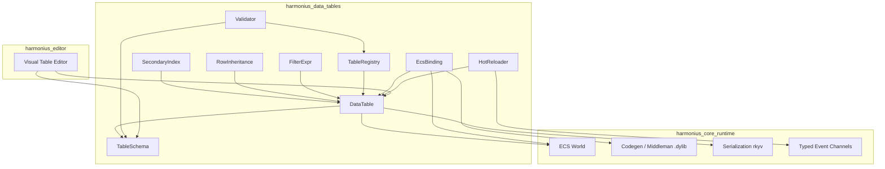
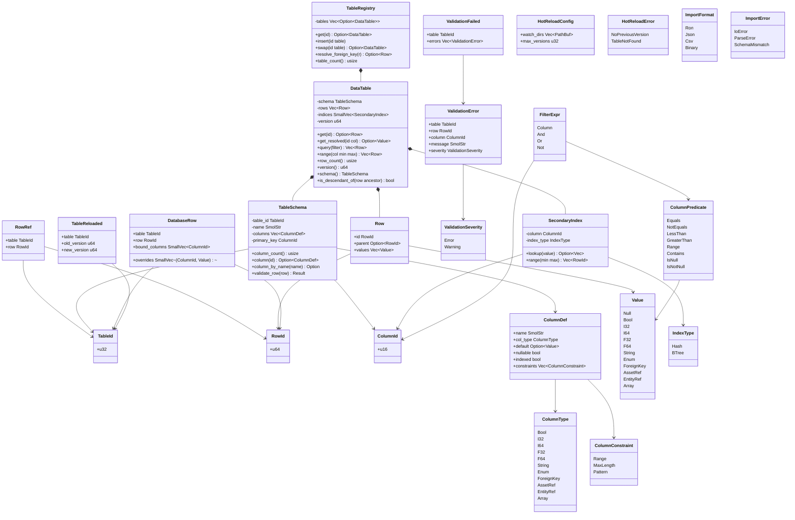
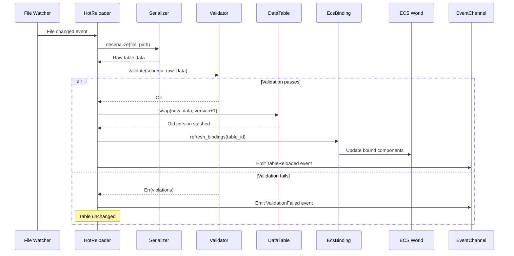

# Data Tables Design

## Requirements Trace

> **Canonical sources:** Features, requirements, and user stories are defined in
> [features/](../../features/), [requirements/](../../requirements/), and
> [user-stories/](../../user-stories/). The table below traces design elements to those definitions.

### Engine Primitives (primary trace)

| Feature   | Requirement | User Story  | Design Element                    |
|-----------|-------------|-------------|-----------------------------------|
| F-16.3.1  | R-16.3.1    | US-16.3.1   | Typed data table schemas          |
| F-16.3.2  | R-16.3.2    | US-16.3.2   | Load-time schema validation       |
| F-16.3.3  | R-16.3.3    | US-16.3.3   | Immutable rows + RowRef lookup    |
| F-16.3.4  | R-16.3.4    | US-16.3.4   | Row inheritance (prototype chain) |
| F-16.3.5  | R-16.3.5    | US-16.3.5   | Foreign key columns + resolution  |
| F-16.3.6  | R-16.3.6    | US-16.3.6   | Cross-table join queries          |
| F-16.3.7  | R-16.3.7    | US-16.3.7   | Hash + BTree secondary indices    |
| F-16.3.8  | R-16.3.8    | US-16.3.8   | Locale-keyed string columns       |
| F-16.3.9  | R-16.3.9    | US-16.3.9   | ECS component binding from rows   |
| F-16.3.10 | R-16.3.10   | US-16.3.10  | Formula columns (visual graphs)   |
| F-16.3.11 | R-16.3.11   | US-16.3.11  | Hot reload 10k rows < 500 ms      |
| F-16.3.12 | R-16.3.12   | US-16.3.12  | Full load 1M rows < 2 s           |

1. **R-16.3.1** -- Typed columns (bool, i32/i64, f32/f64, string, enum, FK, refs, array)
2. **R-16.3.2** -- Schema validation with FK integrity, range, custom rules at load time
3. **R-16.3.3** -- Immutable rows as ECS resources, RowRef zero-copy lookup
4. **R-16.3.4** -- Prototype chain row inheritance with cycle detection
5. **R-16.3.5** -- Foreign keys referencing rows in other tables
6. **R-16.3.6** -- Cross-table join queries via FK relationships
7. **R-16.3.7** -- Hash O(1) and BTree O(log n) secondary indices
8. **R-16.3.8** -- Locale-keyed string columns with fallback
9. **R-16.3.9** -- Spawn ECS entities from rows via codegen'd bindings
10. **R-16.3.10** -- Formula columns compiled to native Rust via codegen
11. **R-16.3.11** -- Hot reload 10,000-row table within 500 ms end-to-end
12. **R-16.3.12** -- Full load and validate 1,000,000 total rows within 2 s

### Game-Framework Consumers (cross-reference)

| Feature    | Requirement | Consumer Role                                 |
|------------|-------------|-----------------------------------------------|
| F-13.7.1   | R-13.7.1    | Gameplay table schemas                        |
| F-13.7.2   | R-13.7.2    | Gameplay rows as ECS resources                |
| F-13.7.3   | R-13.7.3    | Cross-table gameplay references               |
| F-13.7.4   | R-13.7.4    | Gameplay hot reload with versioning           |
| F-13.7.5   | R-13.7.5    | Gameplay row inheritance chains               |
| F-13.7.10  | R-13.7.10   | Localized gameplay strings                    |
| F-13.7.11  | R-13.7.11   | Gameplay query indices                        |
| F-13.7.12  | R-13.7.12   | Gameplay ECS component binding                |
| F-13.7.14  | R-13.7.14   | Gameplay schema validation                    |
| F-13.10.1  | R-13.10.1   | Ability definitions stored as table rows      |
| F-13.12.1a | R-13.12.1a  | Race definitions as table rows                |
| F-13.12.1b | R-13.12.1b  | Class definitions as table rows               |
| F-13.12.1c | R-13.12.1c  | Multi-class combos as table rows              |
| F-13.12.1d | R-13.12.1d  | Prestige/rebirth data as table rows           |

## Overview

Schema-driven typed data tables for all gameplay data. Tables are immutable assets authored in the
visual editor and loaded as ECS resources at runtime.

Key features:

- **Typed columns** -- bool, i32, i64, f32, f64, string, enum, foreign key, asset ref, entity ref,
  array.
- **Row inheritance** -- prototype chains for data hierarchies (e.g.,
  `Item > Weapon > Sword > FireSword`).
- **Secondary indices** -- hash (O(1) lookup) and BTree (O(log n) range) on indexed columns.
- **Formula nodes** -- computed columns via visual logic graphs that codegen to native Rust in the
  middleman .dylib. No bytecode.
- **Foreign keys** -- cross-table row references with validation.
- **Hot reload** -- swap table data at runtime with version tracking and rollback.
- **ECS binding** -- spawn entities from table rows with automatic component population.
- **Validation** -- type checks, FK integrity, range constraints, and custom rules.

All data is immutable at runtime. Mutable queries return copies. No `Arc`, `Rc`, `Cell`, or
`RefCell`. All types derive rkyv `Archive`/`Serialize`/`Deserialize` for zero-copy binary
serialization. No runtime reflection or `TypeRegistry`.

## Architecture

### Module Boundaries



### Core Data Structures



### Hot-Reload Sequence



## API Design

### Identity Types

```rust
/// Unique table identifier.
#[derive(
    Clone, Copy, Debug,
    PartialEq, Eq, Hash,
    Archive, Serialize, Deserialize,
)]
pub struct TableId(pub u32);

/// Unique row identifier within a table.
#[derive(
    Clone, Copy, Debug,
    PartialEq, Eq, Hash,
    Archive, Serialize, Deserialize,
)]
pub struct RowId(pub u64);

/// Column index within a table schema.
#[derive(
    Clone, Copy, Debug,
    PartialEq, Eq, Hash,
    Archive, Serialize, Deserialize,
)]
pub struct ColumnId(pub u16);

/// Cross-table row reference (table + row).
#[derive(
    Clone, Copy, Debug,
    PartialEq, Eq, Hash,
    Archive, Serialize, Deserialize,
)]
pub struct RowRef {
    pub table: TableId,
    pub row: RowId,
}
```

### Column Types and Schema

```rust
/// Opaque identifier for a codegen'd enum type
/// in the middleman .dylib. Replaces `TypeId`.
#[derive(
    Clone, Copy, Debug, PartialEq, Eq, Hash,
    Archive, Serialize, Deserialize,
)]
pub struct EnumSchemaId(pub u32);

/// Identifies a formula function codegen'd into
/// the middleman .dylib. Maps to
/// `fn formula_<table>_<col>(row, registry) -> T`.
#[derive(
    Clone, Copy, Debug, PartialEq, Eq, Hash,
    Archive, Serialize, Deserialize,
)]
pub struct FormulaId(pub u32);

/// Supported column data types.
#[derive(Clone, Debug, Archive, Serialize, Deserialize)]
pub enum ColumnType {
    Bool,
    I32,
    I64,
    F32,
    F64,
    String,
    /// Reference to a codegen'd enum variant.
    /// `EnumSchemaId` indexes the middleman .dylib
    /// enum registry — no runtime TypeId needed.
    Enum(EnumSchemaId),
    /// Reference to a row in another table.
    ForeignKey(TableId),
    /// Reference to an asset by handle.
    AssetRef,
    /// Reference to an ECS entity.
    EntityRef,
    /// Array of a single inner type.
    Array(Box<ColumnType>),
    /// Computed column: value produced by a
    /// codegen'd formula function at bake or
    /// runtime.
    Formula(FormulaId),
}

/// A column definition within a table schema.
#[derive(Clone, Debug, Archive, Serialize, Deserialize)]
pub struct ColumnDef {
    pub name: SmolStr,
    pub col_type: ColumnType,
    pub default: Option<Value>,
    pub nullable: bool,
    pub indexed: bool,
    /// Inline-allocated: most columns have ≤2
    /// constraints.
    pub constraints: SmallVec<[ColumnConstraint; 2]>,
}

/// Per-column constraints.
#[derive(Clone, Debug, Archive, Serialize, Deserialize)]
pub enum ColumnConstraint {
    /// Numeric range [min, max].
    Range { min: f64, max: f64 },
    /// String length limit.
    MaxLength(usize),
    /// Regex pattern for string columns.
    Pattern(SmolStr),
}

/// Immutable table schema. All fields are
/// private; access via methods only.
#[derive(Clone, Debug, Archive, Serialize, Deserialize)]
pub struct TableSchema {
    table_id: TableId,
    name: SmolStr,
    columns: Vec<ColumnDef>,
    primary_key: ColumnId,
}

impl TableSchema {
    pub fn column_count(&self) -> usize;

    pub fn column(
        &self,
        id: ColumnId,
    ) -> Option<&ColumnDef>;

    pub fn column_by_name(
        &self,
        name: &str,
    ) -> Option<(ColumnId, &ColumnDef)>;

    /// Validate a single row against the schema.
    pub fn validate_row(
        &self,
        row: &Row,
    ) -> Result<(), Vec<ValidationError>>;
}
```

### Values and Rows

```rust
/// A dynamically-typed value stored in a cell.
/// Used on the editor/import path. Runtime access
/// uses codegen'd strongly-typed row structs.
#[derive(Clone, Debug, Archive, Serialize, Deserialize)]
pub enum Value {
    Null,
    Bool(bool),
    I32(i32),
    I64(i64),
    F32(f32),
    F64(f64),
    String(SmolStr),
    /// Enum variant: schema id from middleman .dylib
    /// enum registry + variant index. No TypeId.
    Enum { schema_id: EnumSchemaId, variant: u32 },
    ForeignKey(RowRef),
    AssetRef(AssetHandle),
    EntityRef(Entity),
    Array(Vec<Value>),
}

/// A single row: primary key + column values.
/// Parent field enables prototype inheritance.
#[derive(Clone, Debug, Archive, Serialize, Deserialize)]
pub struct Row {
    pub id: RowId,
    pub parent: Option<RowId>,
    pub values: Vec<Value>,
}
```

### Data Table

```rust
/// A typed, immutable data table stored as an
/// ECS resource. Tables are loaded from rkyv
/// baked assets and never mutated at runtime.
/// Hot reload creates a new instance and swaps
/// it into the registry.
///
/// `rows` is sorted by `RowId` for O(log n)
/// binary-search primary-key lookup. Iteration
/// order is stable and deterministic.
#[derive(Debug, Archive, Serialize, Deserialize)]
pub struct DataTable {
    schema: TableSchema,
    /// Sorted by RowId. Binary search for O(log n)
    /// primary-key lookup.
    rows: Vec<Row>,
    /// Inline: most tables have ≤4 secondary
    /// indices.
    indices: SmallVec<[SecondaryIndex; 4]>,
    version: u64,
}

impl DataTable {
    /// O(1) lookup by primary key.
    pub fn get(
        &self,
        id: RowId,
    ) -> Option<&Row>;

    /// Get a cell value, resolving inheritance
    /// up the prototype chain if null.
    pub fn get_resolved(
        &self,
        id: RowId,
        col: ColumnId,
    ) -> Option<&Value>;

    /// Query with a filter expression. Uses
    /// secondary indices when available.
    /// Results are allocated into `arena`; the
    /// caller resets the arena at frame boundary.
    pub fn query<'a>(
        &'a self,
        filter: &FilterExpr,
        arena: &'a Arena,
    ) -> &'a [&'a Row];

    /// Range query on an indexed column.
    /// Results are arena-allocated; see `query`.
    pub fn range<'a>(
        &'a self,
        col: ColumnId,
        min: &Value,
        max: &Value,
        arena: &'a Arena,
    ) -> &'a [&'a Row];

    pub fn row_count(&self) -> usize;
    pub fn version(&self) -> u64;
    pub fn schema(&self) -> &TableSchema;

    /// Check if a row descends from a given
    /// ancestor in the prototype chain.
    pub fn is_descendant_of(
        &self,
        row: RowId,
        ancestor: RowId,
    ) -> bool;
}
```

### Filter Expressions

```rust
/// Column predicate for filtering.
#[derive(Clone, Debug)]
pub enum ColumnPredicate {
    Equals(Value),
    NotEquals(Value),
    LessThan(Value),
    LessOrEqual(Value),
    GreaterThan(Value),
    GreaterOrEqual(Value),
    Range { min: Value, max: Value },
    Contains(SmolStr),
    IsNull,
    IsNotNull,
}

/// Composable filter expression tree.
#[derive(Clone, Debug)]
pub enum FilterExpr {
    Column {
        col: ColumnId,
        predicate: ColumnPredicate,
    },
    And(Vec<FilterExpr>),
    Or(Vec<FilterExpr>),
    Not(Box<FilterExpr>),
}
```

### Secondary Indices

```rust
/// Index type for a column.
#[derive(Clone, Copy, Debug)]
pub enum IndexType {
    /// Sorted-Vec-backed. O(log n) exact lookup,
    /// deterministic iteration order.
    Hash,
    /// BTreeMap-backed. O(log n) range queries.
    BTree,
}

/// A secondary index on a single column.
#[derive(Debug)]
pub struct SecondaryIndex {
    column: ColumnId,
    index_type: IndexType,
}

impl SecondaryIndex {
    /// O(1) exact lookup (Hash index).
    pub fn lookup(
        &self,
        value: &Value,
    ) -> Option<Vec<RowId>>;

    /// O(log n) range query (BTree index).
    pub fn range(
        &self,
        min: &Value,
        max: &Value,
    ) -> Vec<RowId>;
}
```

### Row Inheritance

```rust
/// Resolve a column value through the prototype
/// chain. Walks parent pointers until a non-null
/// value is found or the chain ends.
pub fn resolve_inherited(
    table: &DataTable,
    row: RowId,
    col: ColumnId,
) -> Option<&Value>;

/// Flatten a row by resolving all inherited
/// values into a complete row with no null cells
/// (except nullable columns). The flattened row
/// is allocated into `arena`; the caller resets
/// the arena at frame boundary.
pub fn flatten_row<'a>(
    table: &'a DataTable,
    row: RowId,
    arena: &'a Arena,
) -> &'a Row;

/// Detect circular inheritance. Returns the
/// cycle path if found.
pub fn detect_cycle(
    table: &DataTable,
    row: RowId,
) -> Option<Vec<RowId>>;
```

### Table Registry

```rust
/// Central registry of all loaded data tables.
/// Stored as an ECS resource.
///
/// `tables` is a dense Vec indexed by
/// `TableId(u32)`. O(1) lookup, deterministic
/// iteration, no hash randomization.
#[derive(Debug)]
pub struct TableRegistry {
    tables: Vec<Option<DataTable>>,
}

impl TableRegistry {
    pub fn get(
        &self,
        id: TableId,
    ) -> Option<&DataTable>;

    /// Register a newly loaded table.
    pub fn insert(
        &mut self,
        id: TableId,
        table: DataTable,
    );

    /// Swap a table for hot-reload. Returns the
    /// old version for rollback.
    pub fn swap(
        &mut self,
        id: TableId,
        new_table: DataTable,
    ) -> Option<DataTable>;

    /// Resolve a foreign key across tables.
    pub fn resolve_foreign_key(
        &self,
        row_ref: &RowRef,
    ) -> Option<&Row>;

    pub fn table_count(&self) -> usize;
}
```

### ECS Component Binding

```rust
/// Attached to an entity to bind it to a
/// database row. The binding system populates
/// ECS components from the referenced row.
/// Works identically for 2D and 3D entities —
/// the codegen'd binding function resolves to
/// whichever transform component is present.
#[derive(Clone, Debug, Component)]
pub struct DatabaseRow {
    pub table: TableId,
    pub row: RowId,
    /// Columns to bind. Empty = all matching.
    /// Inline-allocated: most bindings use ≤8.
    pub bound_columns: SmallVec<[ColumnId; 8]>,
    /// Per-column overrides sorted by ColumnId.
    /// Inline-allocated: most overrides are ≤4.
    pub overrides: SmallVec<[(ColumnId, Value); 4]>,
}

/// System that populates ECS components from
/// database rows on spawn and after hot-reload.
/// Binding functions are codegen'd into the
/// middleman .dylib — no runtime reflection.
pub struct DatabaseBindingSystem;

impl DatabaseBindingSystem {
    /// Bind a single entity's components.
    /// Calls the codegen'd per-table binding
    /// function from the middleman .dylib.
    pub fn bind_entity(
        entity: Entity,
        db_row: &DatabaseRow,
        tables: &TableRegistry,
        world: &mut World,
    );

    /// Refresh all bindings for a table after
    /// hot-reload.
    pub fn refresh_table(
        table_id: TableId,
        tables: &TableRegistry,
        world: &mut World,
    );
}
```

### Validation

```rust
/// A single validation error.
#[derive(Clone, Debug)]
pub struct ValidationError {
    pub table: TableId,
    pub row: RowId,
    pub column: ColumnId,
    pub message: SmolStr,
    pub severity: ValidationSeverity,
}

#[derive(Clone, Copy, Debug)]
pub enum ValidationSeverity {
    Error,
    Warning,
}

/// Validate a data table against its schema
/// and cross-table foreign key references.
pub fn validate_table(
    table: &DataTable,
    registry: &TableRegistry,
) -> Vec<ValidationError>;

/// Validate all tables in the registry.
pub fn validate_all(
    registry: &TableRegistry,
) -> Vec<ValidationError>;
```

### Hot Reload

```rust
/// Hot-reload configuration.
#[derive(Clone, Debug)]
pub struct HotReloadConfig {
    /// Directories to watch for changes.
    pub watch_dirs: Vec<PathBuf>,
    /// Max stashed versions for rollback.
    pub max_versions: u32,
}

/// Emitted on successful table reload.
#[derive(Clone, Debug)]
pub struct TableReloaded {
    pub table: TableId,
    pub old_version: u64,
    pub new_version: u64,
}

/// Emitted when hot-reload validation fails.
#[derive(Clone, Debug)]
pub struct ValidationFailed {
    pub table: TableId,
    pub errors: Vec<ValidationError>,
}

/// Hot-reload error.
#[derive(Clone, Debug)]
pub enum HotReloadError {
    NoPreviousVersion,
    TableNotFound(TableId),
}

/// Hot-reload system. Watches files,
/// deserializes, validates, and swaps tables.
pub struct HotReloadSystem;

impl HotReloadSystem {
    /// Rollback to the previous version.
    pub fn rollback(
        &self,
        table: TableId,
        registry: &mut TableRegistry,
    ) -> Result<(), HotReloadError>;
}
```

### Import

```rust
/// Supported import formats.
#[derive(Clone, Copy, Debug)]
pub enum ImportFormat {
    /// Human-readable authoring format.
    Ron,
    /// Import from external tools.
    Json,
    /// Import from spreadsheets.
    Csv,
    /// rkyv zero-copy baked asset format.
    Binary,
}

/// Import error.
#[derive(Clone, Debug)]
pub enum ImportError {
    IoError(IoError),
    ParseError {
        line: u32,
        message: SmolStr,
    },
    SchemaMismatch(Vec<ValidationError>),
}

/// Opaque handle returned by `import_table`.
/// Poll at frame boundaries for completion.
pub struct ImportHandle(u64);

/// Submit a table import via platform-native I/O.
/// Sends a read request over crossbeam-channel to
/// the main thread (io_uring / IOCP / GCD
/// dispatch_io). Returns immediately. Poll
/// `ImportHandle` for completion at frame boundary.
/// Never blocks the calling thread.
pub fn import_table(
    path: &Path,
    format: ImportFormat,
    schema: &TableSchema,
    io_channel: &Sender<IoRequest>,
) -> ImportHandle;

/// Check whether an import has completed.
pub fn poll_import(
    handle: &ImportHandle,
    completions: &Receiver<IoCompletion>,
) -> Option<Result<DataTable, ImportError>>;

/// Zero-copy binary load: mmap the baked asset
/// and return a reference via `rkyv::archived_root`.
/// No allocation, no deserialization.
pub fn load_binary_table(
    data: &[u8],
) -> &ArchivedDataTable;

/// Resolved handle to a baked `DataTable` asset.
pub struct Handle<DataTable>(u32);
```

## Data Flow

### Table Load Pipeline

1. **Discover** -- Asset database provides a manifest of all data table assets with file paths and
   schemas.
2. **Read** -- `import_table` submits an I/O request via crossbeam-channel to the main thread. The
   main thread dispatches via io_uring (Linux), IOCP (Windows), or GCD dispatch_io (Apple). No
   blocking. An `ImportHandle` is returned for polling.
3. **Poll** -- At the asset-load phase (PreUpdate), the game loop polls `ImportHandle` for I/O
   completions. Baked binary assets use `load_binary_table` (rkyv mmap, zero deserialization).
4. **Deserialize** -- Serializer decodes RON, JSON, or CSV into raw `Row` data. Binary assets
   (`rkyv`) are zero-copy: no decoding step.
5. **Validate** -- Validator checks every row against the schema, verifies FK integrity across all
   tables, evaluates range constraints, and checks `AssetRef` values against the asset database.
6. **Index** -- Secondary indices are built for all columns marked as `indexed`.
7. **Inherit** -- Prototype chains are resolved and cached for fast `get_resolved` lookups.
8. **Register** -- Validated table is inserted into the `TableRegistry` ECS resource at the
   designated AssetReload phase.
9. **Bind** -- `DatabaseBindingSystem` runs in the same phase after the swap. It scans entities with
   `DatabaseRow` components and calls codegen'd binding functions from the middleman .dylib.

### Hot-Reload Pipeline

1. **Watch** -- Main thread monitors data table directories via platform-native file-watch APIs
   (inotify on Linux, ReadDirectoryChanges on Windows, FSEvents on Apple). Notifications arrive as
   main-thread I/O events.
2. **Debounce** -- Rapid writes coalesced into a single reload after 100 ms.
3. **Submit I/O** -- File read submitted via platform-native I/O (same path as initial load).
4. **Poll** -- Next frame's AssetReload phase polls for completion.
5. **Validate** -- Full schema and cross-table validation, including broken `AssetRef` checks.
6. **Swap or reject** -- If valid, old version is stashed and new version swapped in at the
   AssetReload phase. `TableReloaded` emitted. If invalid, `ValidationFailed` emitted; old table
   unchanged.
7. **Rebind** -- `DatabaseBindingSystem` refreshes all entity bindings for the reloaded table in the
   same phase.
8. **Rollback** -- `rollback()` restores stashed version if the reload causes runtime issues.

### ECS Binding Flow

1. Entity spawned with `DatabaseRow` component referencing a table and row.
2. `DatabaseBindingSystem` reads the row from the registry.
3. For each bound column, the codegen'd binding function from the middleman .dylib writes the column
   value directly into the appropriate ECS component field. No reflection.
4. The binding function resolves to whichever transform component is present (`Transform` for 3D,
   `Transform2D` for 2D/2.5D) — the same binding logic works for all entity types.
5. Override values in `DatabaseRow.overrides` take precedence over database values. Overrides are a
   `SmallVec<[(ColumnId, Value); 4]>` sorted by `ColumnId` for binary-search lookup.
6. On hot-reload, all entities referencing the reloaded table are re-bound in the AssetReload phase.

## Platform Considerations

| Aspect         | Detail                                                          |
|----------------|-----------------------------------------------------------------|
| Serialization  | RON (authoring), rkyv binary (shipping), JSON/CSV (import)     |
| I/O backend    | io_uring (Linux), IOCP (Windows), GCD dispatch_io (Apple)      |
| Codegen        | Binding functions and typed row structs in middleman .dylib     |
| Memory         | Sorted `Vec<Row>`, `Vec<Option<DataTable>>`, SmallVec indices   |
| Hot reload     | Platform file-watch → platform I/O → AssetReload phase swap    |
| Mobile/console | Max table size budget: 50k rows / 16 MB per table for mobile   |
| VR             | Tables driving entity spawning must complete in PreUpdate phase |

1. **Serialization** -- RON for human-readable authoring. Binary (rkyv) for shipped builds — mmap
   via `rkyv::archived_root`, zero deserialization cost. JSON and CSV for import from external tools
   only.
2. **I/O backend** -- `import_table` submits read requests via crossbeam-channel to the main thread.
   The main thread dispatches using io_uring (Linux), IOCP (Windows), or GCD dispatch_io (Apple). No
   Tokio, no blocking.
3. **Codegen** -- No runtime reflection. ECS binding functions, typed row accessor structs, and
   validation logic are all codegen'd into the middleman .dylib by the codegen pipeline.
4. **Memory** -- `DataTable.rows` is a `Vec<Row>` sorted by `RowId` (binary-search primary key).
   `TableRegistry.tables` is `Vec<Option<DataTable>>` indexed by `TableId(u32)`. Secondary indices
   and overrides use `SmallVec` to avoid heap allocation for the common case. `BTreeMap` for BTree
   secondary indices.
5. **Hot reload** -- File-watch events arrive on the main thread (inotify / ReadDirectoryChanges /
   FSEvents). I/O submitted via platform-native read. Table swap and entity rebind happen at the
   designated AssetReload phase boundary. Old version stashed for rollback. No `Arc`.
6. **Mobile/console** -- Budget per table: ≤50k rows, ≤16 MB binary size. Tables exceeding budget
   must use streaming (load on demand, evict when not referenced). Asset baking is mandatory for
   console — no RON loading at runtime.
7. **VR** -- Tables used to drive entity spawning must complete loading and binding in PreUpdate to
   avoid mid-frame latency spikes. Formula columns driving per-frame queries should be bake-time
   evaluated where possible.

## Test Plan

See companion file [data-tables-test-cases.md](data-tables-test-cases.md).

### Unit Tests

| Test                           | Req       |
|--------------------------------|-----------|
| `test_schema_type_validation`  | R-13.7.1  |
| `test_schema_constraint_range` | R-13.7.1  |
| `test_row_unique_key`          | R-13.7.2  |
| `test_foreign_key_valid`       | R-13.7.3  |
| `test_foreign_key_broken`      | R-13.7.3  |
| `test_inheritance_single`      | R-13.7.5  |
| `test_inheritance_chain_3`     | R-13.7.5  |
| `test_inheritance_circular`    | R-13.7.5  |
| `test_index_hash_lookup`       | R-13.7.11 |
| `test_index_btree_range`       | R-13.7.11 |
| `test_filter_and_or_not`       | R-13.7.11 |
| `test_binding_spawn`           | R-13.7.12 |
| `test_binding_override`        | R-13.7.12 |
| `test_hot_reload_valid`        | R-13.7.4  |
| `test_hot_reload_invalid`      | R-13.7.4  |
| `test_hot_reload_rollback`     | R-13.7.4  |
| `test_validation_full`         | R-13.7.14 |

1. **`test_schema_type_validation`** -- Schema with I32 column; insert matching value (pass), then
   mismatched String value (error naming column).
2. **`test_schema_constraint_range`** -- Range [0, 100]; insert 50 (pass), insert 200 (error).
3. **`test_row_unique_key`** -- Insert two rows with same RowId. Assert duplicate rejected.
4. **`test_foreign_key_valid`** -- Table A FK to Table B row 5; row 5 exists. Assert resolution
   returns row.
5. **`test_foreign_key_broken`** -- FK to nonexistent row
   999. Assert validation error with table, row, column.
6. **`test_inheritance_single`** -- Parent (a=10, b=20); child overrides a=99. Resolved: a=99, b=20.
7. **`test_inheritance_chain_3`** -- 3-level chain. Assert correct value resolution at each level.
8. **`test_inheritance_circular`** -- Row A parent=B, Row B parent=A. Assert `detect_cycle` returns
   path.
9. **`test_index_hash_lookup`** -- Hash index on 10k rows. Lookup by key returns correct row.
10. **`test_index_btree_range`** -- BTree index; range [50, 100] on 10k rows returns correct subset.
11. **`test_filter_and_or_not`** -- Compound filter. Assert result matches brute-force scan.
12. **`test_binding_spawn`** -- Spawn entity with `DatabaseRow`. Assert components populated.
13. **`test_binding_override`** -- Override column in `DatabaseRow.overrides`. Assert override used.
14. **`test_hot_reload_valid`** -- Modify table file, reload. Assert new values and `TableReloaded`
    event.
15. **`test_hot_reload_invalid`** -- Reload with broken data. Assert `ValidationFailed`, old table
    unchanged.
16. **`test_hot_reload_rollback`** -- Reload then rollback. Assert previous version restored.
17. **`test_validation_full`** -- Load tables with type errors, broken FKs, range violations. Assert
    each error includes table, row, column.

### Integration Tests

| Test                       | Req        |
|----------------------------|------------|
| `test_load_50_tables`      | R-13.7.NF2 |
| `test_hot_reload_bindings` | R-13.7.4   |
| `test_fk_cross_table`      | R-13.7.3   |

1. **`test_load_50_tables`** -- Load 50 tables totaling 1M rows. Assert total load + validate < 2
   sec.
2. **`test_hot_reload_bindings`** -- Hot-reload a table with bound entities. Assert all
   `DatabaseRow` entities updated within 1 frame.
3. **`test_fk_cross_table`** -- 3 tables with chained FK references. Assert full resolution chain
   works.

### Benchmarks

| Benchmark | Target | Req |
|-----------|--------|-----|
| Hash index lookup (100k rows) | < 1 us | R-13.7.NF1 |
| BTree range query (100k rows) | < 10 us | R-13.7.11 |
| Full table load (100k rows) | < 200 ms | R-13.7.NF2 |
| All tables load (1M rows) | < 2 sec | R-13.7.NF2 |
| Hot reload (10k rows) | < 500 ms | R-13.7.NF3 |
| Validation (100k rows) | < 500 ms | R-13.7.14 |

## Codegen Pipeline

When a user defines or edits a table schema in the Visual Table Editor, the codegen pipeline
generates Rust source code and hot-reloads the middleman .dylib. No runtime interpretation.

### Pipeline Steps

1. **Schema emit** -- Visual Table Editor serializes the schema (column names, types, constraints,
   indices) to RON and writes it to the project's schema directory.
2. **Codegen trigger** -- Schema file change is detected by the file watcher. The codegen pipeline
   runs and emits Rust source into the middleman .dylib source tree:
   - A strongly-typed row struct:
     `struct ItemRow { name: SmolStr, damage: i32, rarity: ItemRarity }`
   - Typed accessor methods on `DataTable` for the schema
   - An ECS binding function: `fn bind_item_row(entity, row, world)`
   - Validation logic for range/pattern constraints
   - rkyv `Archive`/`Serialize`/`Deserialize` derives on the row struct
3. **Compile** -- The bundled `rustc` recompiles the middleman .dylib. Incremental compilation
   targets < 3 s rebuild.
4. **Hot-reload** -- The engine reloads the middleman .dylib via `libloading`. Updated binding
   functions take effect immediately.
5. **Plugin schemas** -- Plugin-defined `ColumnType` variants and enum types are codegen'd into the
   middleman alongside engine-defined schemas.

### Runtime Access

The `Value` enum is used only on the editor and import path. At runtime, systems use the codegen'd
strongly-typed row structs for type safety and zero-overhead access:

```rust
// Editor/import path — dynamic typing via Value enum
let v: Value = table.get_cell(row_id, col_id);

// Runtime path — codegen'd strongly-typed accessor
let row: &ArchivedItemRow = item_table.get_typed(row_id);
let dmg: i32 = row.damage;
```

## Localization

Locale-keyed string columns allow per-locale text without duplicating rows (R-13.7.10, F-13.7.10).

### Design

- A `ColumnType::String` column may be marked `localized: true` in the schema.
- At runtime, `get_resolved` for a localized column consults the `LocalizationManager` ECS resource
  to select the active locale.
- Per-locale table overlays can override string columns for a specific locale. The overlay table
  shares the same schema and row IDs as the base table.
- Locale fallback chain: `active_locale → base_locale → default_locale → raw_value`.

```rust
/// Column definition extended with localization
/// flag.
pub struct ColumnDef {
    // ... existing fields ...
    /// If true, value is resolved through
    /// LocalizationManager at runtime.
    pub localized: bool,
}

/// Overlay providing locale-specific string
/// column values for a base table.
pub struct LocaleOverlay {
    pub table: TableId,
    pub locale: SmolStr,
    /// Map from RowId to per-column locale values.
    /// Only localized columns are present.
    pub values: Vec<(RowId, ColumnId, SmolStr)>,
}
```

### Test Cases

| Test ID       | Description                              | Req       |
|---------------|------------------------------------------|-----------|
| TC-13.7.10.1  | Active locale resolves to localized value | R-13.7.10 |
| TC-13.7.10.2  | Fallback when locale missing              | R-13.7.10 |
| TC-13.7.10.3  | Overlay overrides base string column      | R-13.7.10 |

## Asset Pipeline Integration

`AssetRef` columns connect data tables to the asset pipeline (F-12.3.2).

### Dependency Tracking

When a table asset is processed, the asset pipeline scans all `AssetRef` cells and registers each
referenced asset as a dependency of the table asset. The streaming system loads dependencies before
the table is marked ready. This integrates with the standard asset dependency graph:

```text
DataTable asset → depends on → Mesh asset (from AssetRef cell)
                             → Texture asset
                             → Sound asset
```

### Handle Resolution

`Value::AssetRef(AssetHandle)` stores the same `Handle<T>` that the asset pipeline uses. The handle
is resolved at import time from the asset path stored in the RON/CSV source. In binary (rkyv)
builds, handles are baked as stable numeric IDs.

### Streaming Integration

When `DatabaseBindingSystem` binds an entity from a `DatabaseRow`:

1. For each `AssetRef` column, the binding function checks `Handle<T>::is_ready()`.
2. If the asset is not yet loaded, the entity receives a `PendingAsset` marker component.
3. A follow-up system re-binds the entity when the asset becomes ready.
4. Placeholder assets (default mesh, 1×1 texture) are used in the interim.

### Per-Platform Asset Variants

A table column may hold multiple asset references keyed by platform tag. At load time, the import
system selects the variant matching the current platform (`win`, `macos`, `ios`, `console`). Only
one variant is loaded; others are discarded. Schema example:

```text
column: icon_asset  type: AssetRef  platform_variants: [win, macos, ios, console]
```

### Broken Reference Detection

Validation checks all `AssetRef` values against the asset database. Missing assets produce a
`ValidationError` with `severity: Warning` during import, and `severity: Error` during shipping
bake. The validation panel in the Visual Table Editor shows broken references inline.

## Visual Table Editor

The Visual Table Editor is the primary no-code authoring surface for all gameplay data. Every table
is created, edited, and validated here — no manual file editing required.

### Schema Editor

- Visual interface for defining columns: name, type, constraints, default value, indexed flag.
- Drag to reorder columns. Column reorder triggers a codegen rebuild of the row struct.
- Add/remove columns with automatic migration of existing rows (new column filled with default;
  removed column data archived).
- Enum columns show a picker populated from the middleman .dylib enum registry.

### Row Editor

- Spreadsheet-like grid. Each cell uses an inline editor appropriate for its type:
  - Bool: checkbox
  - Numeric: spinner with constraint range displayed
  - String: text field (localized flag shows locale picker)
  - Enum: dropdown of codegen'd variant names
  - ForeignKey: searchable dropdown of rows from the target table
  - AssetRef: drag-drop asset picker; broken refs shown in red
  - EntityRef: entity picker from the scene tree
  - Array: expandable sub-editor showing element list
  - Formula: read-only computed result; click opens logic graph editor
- Column sorting (click header) and per-column filter bar.

### Prototype Editor

- Displays the parent chain as a breadcrumb: `Item > Weapon > Sword > FireSword`.
- Drag a row onto another row to set the parent. Drop onto blank space to unparent.
- Cells show inherited values dimmed in grey; overridden values in bold. Hover shows which ancestor
  provides the inherited value.
- Cycle detection runs live — invalid parent assignments are rejected with an error tooltip.

### Undo/Redo

All edits produce `EditorCommand` entries through the editor's undo stack (F-15.1.3):

- Schema changes (add/remove/reorder column)
- Row edits (cell value change)
- Row operations (add, delete, duplicate, reparent)
- Bulk operations (multi-row edit, bulk delete)

### Copy/Paste and Import/Export

- Copy rows as JSON or CSV to clipboard. Paste into same or different table.
- Paste from external spreadsheets (CSV from clipboard, column mapping dialog).
- Drag CSV/JSON file onto editor to import. Export selected rows to CSV.

### Bulk Operations

Multi-select rows (checkbox or shift-click). Bulk actions:

- Edit a single column value across all selected rows
- Delete selected rows
- Reparent selected rows to a new parent

### Diff and Merge

When multiple designers edit the same table (via Git LFS):

- Per-row and per-cell diffs shown inline (green = added, red = removed, yellow = changed).
- Three-way merge dialog for conflicting rows: shows ours / theirs / base with accept buttons.
- Integrates with Git LFS locks — locked tables show the lock owner.

### Search and Filter

- Global search across all tables (table name + column value full-text search).
- Per-column filter bar (text match, range, enum value, null/non-null).
- Save and name filter presets per table.

### Validation Panel

- Live validation runs after every edit (debounced 200 ms).
- Error cells shown with red background; warning cells with yellow background.
- Validation panel lists all errors with table/row/column location and click-to-navigate.

## Formula Columns

Formula columns compute derived values via visual logic graphs that codegen to native Rust.

### Column Definition

A column with `ColumnType::Formula(FormulaId)` stores no static value. The formula function
identified by `FormulaId` computes the value at bake time or runtime:

```rust
/// Generated by codegen pipeline for each
/// formula column.
///
/// Referenced by FormulaId in the column
/// schema.
fn formula_item_dps(
    row: &ArchivedItemRow,
    registry: &TableRegistry,
) -> f32 {
    row.damage as f32 * row.attack_speed
}
```

### Evaluation Modes

| Mode         | When used                          | Cached |
|--------------|------------------------------------|--------|
| Bake-time    | Formula depends only on static row data | Yes (stored as Value) |
| Runtime      | Formula reads runtime state or cross-table data | Yes, invalidated on dep change |

Bake-time formulas are evaluated during asset baking. The result is stored as a static `Value` in
the binary asset — no runtime evaluation cost. Runtime formulas are cached per-row and invalidated
when input columns change (hot-reload or override).

### Dependency Tracking

Formula columns declare their input column dependencies in the schema. The codegen pipeline emits a
dependency list. Circular dependencies between formula columns are detected at schema-validation
time via topological sort. Reference:
[Kahn's algorithm](https://en.wikipedia.org/wiki/Topological_sorting#Kahn's_algorithm).

### Node Palette

The formula graph maps directly to Rust expressions. Every node codegens to a Rust expression:

| Node category | Rust output              |
|---------------|--------------------------|
| Arithmetic    | `+`, `-`, `*`, `/`, `%`  |
| Comparison    | `==`, `!=`, `<`, `>`, `<=`, `>=` |
| Math          | `f32::min`, `f32::max`, `f32::clamp`, `f32::floor`, `f32::ceil` |
| Case analysis | `match` (exhaustive arms) |
| Let-binding   | `let name = expr;`       |
| Option        | `.unwrap_or()`, `.map()`, `.and_then()` |
| Cast          | `as` (explicit, no coercion) |
| FK lookup     | Codegen'd accessor for foreign-key row columns |
| Aggregates    | `iter().filter().map().sum()` / `.min()` / `.max()` |

### Editor UX

- Clicking a formula cell opens the logic graph editor with the formula pre-loaded.
- The cell displays the computed result (read-only). A formula icon distinguishes formula cells.
- The editor can display the generated Rust source for debugging.

## Cross-Table Queries

The filter/query system is extended with cross-table operations usable from both the editor and
logic graph formula nodes.

### Reverse Lookup

Given a row in table A, find all rows in table B that reference it via foreign key. Used for queries
such as "find all items that use this material."

```rust
/// Find all rows in `source_table` whose
/// `fk_column` references `target_row`.
pub fn reverse_lookup(
    registry: &TableRegistry,
    target_row: RowRef,
    source_table: TableId,
    fk_column: ColumnId,
    arena: &Arena,
) -> &[RowId];
```

Reverse lookups are accelerated by a reverse-FK index built at table load time for any column
declared `indexed: true` with type `ForeignKey`.

### Join Query

Combine rows from two tables by matching a foreign key. Returns a flat result with columns from both
tables.

```rust
/// Join rows from `left` and `right` tables
/// where `left.fk_col` matches `right`'s
/// primary key.
pub fn join_query<'a>(
    registry: &'a TableRegistry,
    left: TableId,
    fk_col: ColumnId,
    right: TableId,
    filter: Option<&FilterExpr>,
    arena: &'a Arena,
) -> &'a [JoinRow<'a>];

pub struct JoinRow<'a> {
    pub left: &'a Row,
    pub right: &'a Row,
}
```

### Aggregate Queries

Count, sum, average, min, and max over a filtered row set.

```rust
pub enum AggregateOp {
    Count,
    Sum,
    Average,
    Min,
    Max,
}

/// Compute an aggregate over a filtered column.
pub fn aggregate(
    table: &DataTable,
    col: ColumnId,
    op: AggregateOp,
    filter: Option<&FilterExpr>,
) -> Value;
```

### Algorithm References

- **Prototype-based inheritance** -- Self language paper (Ungar & Smith, 1987):
  <https://dl.acm.org/doi/10.1145/38807.38828>
- **BTree secondary index** -- Graefe, "Modern B-Tree Techniques" (2011):
  <https://dl.acm.org/doi/10.1561/1900000028>
- **Filter expression evaluation** -- Selinger et al., "Access path selection in a relational
  database management system" (1979): <https://dl.acm.org/doi/10.1145/582095.582099>
- **Topological sort for formula dependency** -- Kahn's algorithm:
  <https://en.wikipedia.org/wiki/Topological_sorting#Kahn's_algorithm>
- **Reverse FK index** -- standard inverted index construction; see Baeza-Yates & Ribeiro-Neto,
  "Modern Information Retrieval" (2nd ed.), Ch. 8.

## Open Questions

1. **Column storage layout** -- Row-major (`Vec<Row>`) is simpler but column-major
   (struct-of-arrays) is better for bulk queries on a single column. Should high-frequency query
   columns use a columnar layout?
2. **Formula evaluation caching** -- Should formula column results be cached per-row and invalidated
   on dependency change, or re-evaluated on every access?
3. **Inheritance depth limit** -- Should prototype chains have a maximum depth (e.g., 8 levels) to
   bound resolution cost, or is cycle detection sufficient?
4. **Table partitioning** -- For tables exceeding 100k rows, should the system support horizontal
   partitioning (sharding by key range) to parallelize validation?
5. **Binary format versioning** -- When schemas evolve between engine versions, how are
   binary-serialized tables migrated? Options: version tag + migration functions, or always
   re-import from textual source.

## Review feedback

### RF-1: Remove all Reflect derives and TypeRegistry [APPLIED]

Remove every `Reflect` derive (20+ occurrences). Remove `TypeRegistry` parameters from
`DatabaseBindingSystem::bind_entity` and `refresh_table`. Replace reflection-based ECS binding with
codegen'd binding functions in the middleman .dylib. Replace the `Reflection / TypeRegistry` box in
the architecture diagram with `Codegen / Middleman .dylib`.

### RF-2: Remove async/Tokio — use platform-native I/O [APPLIED]

`import_table` is `async fn` referencing a Tokio runtime. Make it synchronous. Submit file reads via
crossbeam-channel to platform-native I/O (io_uring / IOCP / GCD dispatch_io). Return an
`ImportHandle` polled at frame boundaries. Remove all Tokio references.

### RF-3: Codegen pipeline for user-defined table schemas [APPLIED]

Zero mention of codegen or middleman .dylib. Add a "Codegen pipeline" section:

1. The visual table editor emits a schema definition (column names, types, constraints)
2. The codegen pipeline generates Rust structs, typed accessors, ECS binding functions, and
   validation logic into the middleman .dylib
3. `ColumnType` enum extensions from plugins are codegen'd into the middleman
4. The `Value` enum is used for editor/import path; runtime access uses generated strongly-typed row
   structs (e.g., `struct ItemRow { name: SmolStr, damage: i32, rarity: ItemRarity }`)
5. Hot-reload recompiles the middleman .dylib when schema changes

### RF-4: Replace HashMap with deterministic structures [APPLIED]

Replace `DataTable.rows: HashMap<RowId, Row>` with a sorted `Vec<Row>` (binary search) or dense slot
map. Replace `TableRegistry.tables: HashMap<TableId, DataTable>` with `Vec<Option<DataTable>>`
indexed by `TableId(u32)`. Replace `DatabaseRow.overrides: HashMap<ColumnId, Value>` with
`SmallVec<(ColumnId, Value)>` sorted by ColumnId.

### RF-5: Create companion test cases file [APPLIED]

Create `docs/design/data-systems/data-tables-test-cases.md` with TC-IDs in `TC-13.7.Z.N` format.

### RF-6: rkyv zero-copy serialization [APPLIED]

Specify rkyv as the binary format. Baked table assets are mmap'd at runtime via
`rkyv::archived_root` with zero deserialization. Define the `Handle<DataTable>` asset pattern.
Replace `Reflect` derives with rkyv `Archive`/`Serialize`/`Deserialize`.

### RF-7: Platform considerations per target [APPLIED]

Add per-platform details: I/O backend (io_uring on Linux, IOCP on Windows, GCD on Apple), memory
budgets for mobile/Switch (max table sizes, streaming strategies), console asset baking, VR latency
if tables drive spawning.

### RF-8: Game loop phase for binding and hot-reload [APPLIED]

Specify: table loading during asset load phase, hot-reload swap at PreUpdate or dedicated
AssetReload phase, binding runs after swap in same phase. I/O completions arrive at main thread
poll; table swap deferred to next frame's designated phase.

### RF-9: Localization support (F-13.7.10) [APPLIED]

F-13.7.10 is completely absent. Add to requirements trace. Design locale-keyed string columns where
runtime resolves the current locale from the `LocalizationManager` (core-runtime service per UI
framework RF-31). Per-locale table overlays can override string columns. Add test cases for locale
fallback.

### RF-10: SmallVec for small collections [APPLIED]

Replace `Vec` with `SmallVec` for: `constraints` (SmallVec<[ColumnConstraint; 2]>), `indices`
(SmallVec<[SecondaryIndex; 4]>), `bound_columns` (SmallVec<[ColumnId; 8]>), `overrides`
(SmallVec<[(ColumnId, Value); 4]>).

### RF-11: Per-thread arenas for queries [APPLIED]

Query results and flattened rows should use per-thread arena allocators. `query()` returns an
arena-allocated slice. `flatten_row()` accepts an arena parameter. Arenas reset at frame boundaries.

### RF-12: Algorithm reference URLs [APPLIED]

Add URLs for: prototype-based inheritance (Self language paper), BTree index structure, filter
expression evaluation.

### RF-13: Replace TypeId with codegen'd EnumSchemaId [APPLIED]

`ColumnType::Enum(TypeId)` and `Value::Enum { type_id: TypeId, variant: u32 }` use
`std::any::TypeId` (runtime reflection). Replace with `EnumSchemaId(u32)` indexing into codegen'd
enum registry in the middleman .dylib.

### RF-14: Formula columns compile to native code via logic graphs [APPLIED]

"Formula nodes compiled to logic graph bytecode" violates the native code constraint. Formulas
should be visual logic graphs that compile to native code via the codegen pipeline. Change
"bytecode" to "native code via middleman .dylib."

### RF-15: Codegen'd strongly-typed row structs [APPLIED]

The `Value` enum is dynamic typing. The codegen pipeline should generate strongly-typed row structs
for each table schema. Runtime access uses generated types for type safety and performance.

### RF-16: Add non-functional requirements to trace [APPLIED]

Benchmark requirement IDs (R-13.7.NF1-3) do not appear in the requirements trace. Add them or
reference the canonical requirements file.

### RF-17: Note 2D/2.5D agnosticism in ECS binding [APPLIED]

Add a note that the binding system works identically for 2D and 3D entities, resolving to whichever
transform component is present.

### RF-18: Asset pipeline integration [APPLIED]

`AssetRef` column type exists but the design doesn't explain:

1. **Dependency tracking** — how asset references in table cells participate in the asset pipeline's
   dependency graph (F-12.3.2). When a table cell references a mesh asset, the table asset must
   declare that mesh as a dependency so the streaming system loads it.
2. **Handle resolution** — how `Value::AssetRef(AssetHandle)` maps to the engine's `Handle<T>`
   pattern. Is `AssetHandle` the same as `Handle<T>`? If not, how does it resolve?
3. **Streaming integration** — when an entity is spawned from a `DatabaseRow`, the assets referenced
   by that row's columns must be loaded or already resident. The binding system must either wait for
   dependencies or spawn with placeholder assets.
4. **Per-platform asset variants** — F-13.7.10 mentions per-platform overrides (lower-res on
   console). How does the table store platform-variant asset references?
5. **Broken reference detection** — what happens when a referenced asset is deleted from the
   project? The validation system should flag broken `AssetRef` values.

### RF-19: Visual table editor design [APPLIED]

The architecture diagram has `Visual Table Editor` but zero design for it. This is a no-code engine
— the table editor is how all gameplay data is authored. The design must cover:

1. **Schema editor** — visual interface for defining columns (name, type, constraints, default
   value, indexed flag). Drag to reorder columns. Add/remove columns with migration of existing
   rows.
2. **Row editor** — spreadsheet-like grid for editing cell values. Inline editing per cell type
   (text field, number spinner, enum dropdown, asset picker via drag-drop, entity picker, foreign
   key dropdown with search, array sub-editor). Column sorting and filtering.
3. **Prototype editor** — visual parent chain display. Drag a row onto another to set parent. Show
   inherited vs overridden values with visual differentiation (dimmed = inherited, bold =
   overridden).
4. **Undo/redo** — all edits produce `EditorCommand` through the editor's undo stack (F-15.1.3).
   Schema changes, row edits, reorder, delete — all undoable.
5. **Copy/paste** — copy rows, paste into same or different table. Paste from external spreadsheets
   (CSV from clipboard).
6. **Bulk operations** — multi-select rows, bulk edit a column value, bulk delete, bulk reparent.
7. **Diff/merge** — when multiple designers edit the same table, show per-row and per-cell diffs.
   Three-way merge for conflict resolution. Integrates with Git LFS.
8. **Search and filter** — global search across all tables. Per-column filter bar. Save filter
   presets.
9. **Import/export** — drag CSV/JSON onto the editor to import. Export selected rows to CSV for
   external tools (Excel, Google Sheets).
10. **Validation panel** — live validation results displayed inline (red cells for errors, yellow
    for warnings). Validation panel lists all errors with click-to-navigate.

### RF-20: Formula columns as logic graphs [APPLIED]

Formula columns are mentioned once ("compiled to logic graph bytecode") with zero design. Formulas
must be visual logic graphs (no-code) that calculate derived column values. The design needs:

1. **Formula column definition** — a column with `ColumnType::Formula` that stores a
   `Handle<LogicGraphAsset>` instead of a static value. The logic graph computes the cell value at
   runtime (or at bake time for static formulas).
2. **Formulas are Rust** — the visual logic graph nodes codegen actual Rust source code
   (`#![no_std]` with `core` + `libm` for math). The bundled rustc compiles it into the middleman
   .dylib — the same pipeline that already exists for codegen'd types. This is not "Rust-inspired" —
   it literally IS Rust. The generated code has full type safety, zero runtime overhead, and
   benefits from rustc optimizations (inlining, constant folding, dead code elimination). This is
   part of being Harmonius — one language, one compiler, one type system across the entire engine.
3. **Logic graph integration** — the formula graph is authored in the visual logic graph editor
   (F-15.8.4). Input nodes read other columns from the same row (or cross-table via foreign keys).
   The output node produces the formula column's value. The codegen pipeline emits a Rust function:
   `fn formula_<table>_<column>(row: &ArchivedRow, registry: &TableRegistry) -> T`
4. **Dependency tracking** — formula columns declare which input columns they depend on. If an input
   column changes (hot-reload, override), the formula re-evaluates. Circular dependencies between
   formula columns are detected at validation time via topological sort (reuse directed graph
   `cycle_detection`).
5. **Evaluation modes**:
   - **Bake-time** — formula evaluated during asset bake, result stored as a static value. Used for
     derived data that doesn't change at runtime (e.g., `let dps = damage * attack_speed`).
   - **Runtime** — formula evaluated on access. Cached with invalidation when input columns change.
     Used for formulas depending on runtime state.
6. **Rust expression nodes** — the formula node palette maps directly to Rust expressions. Every
   node codegens to a Rust expression or statement:
   - Arithmetic: `+`, `-`, `*`, `/`, `%`
   - Comparison: `==`, `!=`, `<`, `>`, `<=`, `>=`
   - Math: `f32::min`, `f32::max`, `f32::clamp`, `f32::floor`, `f32::ceil`
   - **Case analysis**: `match` on enum variants, value ranges, or boolean conditions with
     exhaustive arm coverage
   - Let-binding: `let name = expr;` for named intermediates
   - Option/Result: `.unwrap_or()`, `.map()`, `.and_then()`, `?` operator
   - Explicit cast: `as` (no implicit coercion)
   - Table lookup: codegen'd accessor for foreign key row columns
   - Aggregates: `iter().filter().map().sum()` / `.min()` / `.max()`
7. **Editor UX** — clicking a formula column cell opens the logic graph editor with the formula
   graph pre-loaded. The cell displays the computed result (read-only). A formula icon distinguishes
   formula cells from static cells. The editor can show the generated Rust source for debugging.

### RF-21: Cross-table query and join operations [APPLIED]

The design has `ForeignKey` for single-row references but no way to query across tables:

1. **Reverse lookup** — given a row in table A, find all rows in table B that reference it via
   foreign key. Needed for: "find all items that use this material," "find all quests that grant
   this item."
2. **Join query** — combine rows from two tables by matching foreign key. Returns a flat result with
   columns from both tables. Needed for: "list all items with their crafting recipes."
3. **Aggregate queries** — count, sum, average, min, max over a filtered row set. Needed for: "total
   gold cost of all items in this loot table," "average damage of all swords."

These operations should be expressible in the filter/query system and usable from both the editor
(for validation and display) and the logic graph (for formula evaluation and gameplay queries).
