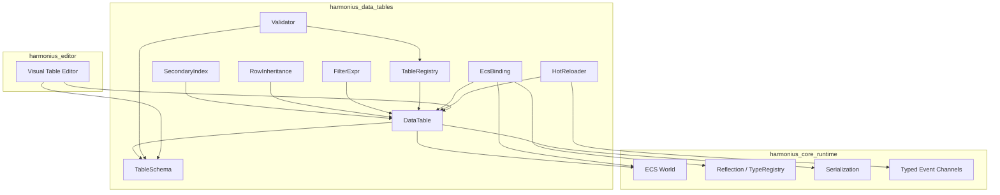
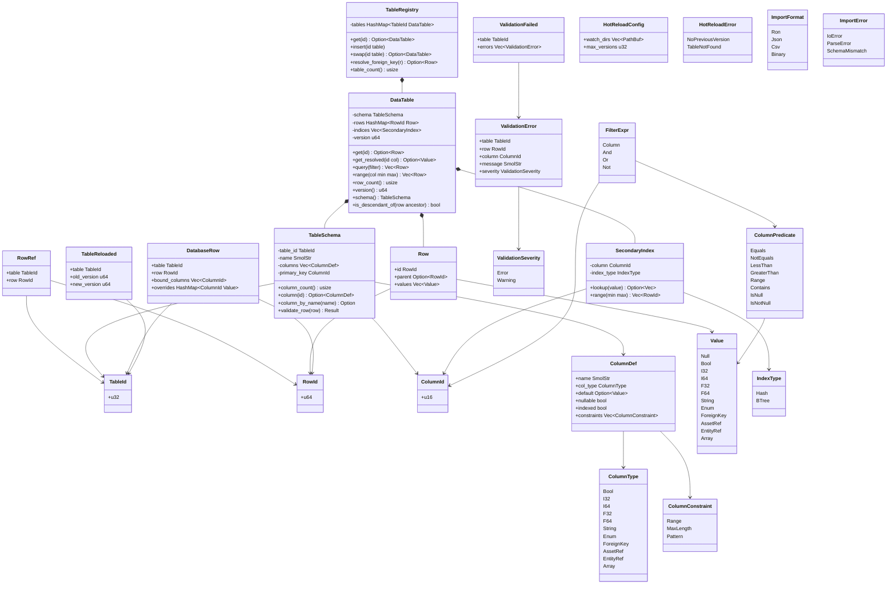
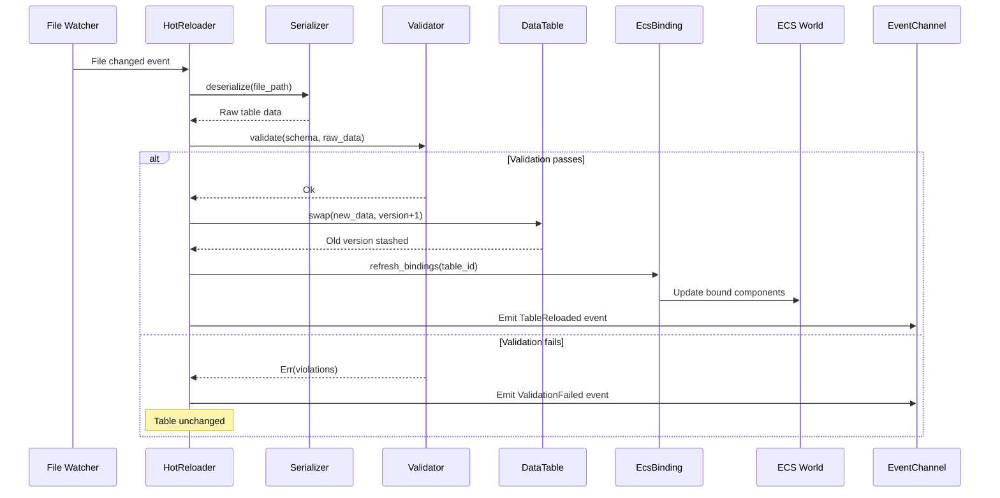

# Data Tables Design

## Requirements Trace

> **Canonical sources:** Features, requirements, and user stories are defined in
> [features/](../../features/), [requirements/](../../requirements/), and
> [user-stories/](../../user-stories/). The table below traces design elements to those definitions.

| Feature    | Requirement | Design Element              |
|------------|-------------|-----------------------------|
| F-13.7.1   | R-13.7.1    | Typed table schemas         |
| F-13.7.2   | R-13.7.2    | Row-based tables + FK refs  |
| F-13.7.3   | R-13.7.3    | Foreign key resolution      |
| F-13.7.4   | R-13.7.4    | Hot reload with versioning  |
| F-13.7.5   | R-13.7.5    | Row inheritance chains      |
| F-13.7.11  | R-13.7.11   | Secondary indices           |
| F-13.7.12  | R-13.7.12   | ECS component binding       |
| F-13.7.14  | R-13.7.14   | Schema validation           |
| F-13.10.1  | R-13.10.1   | Ability definition tables   |
| F-13.12.1a | R-13.12.1a  | Race definition tables      |
| F-13.12.1b | R-13.12.1b  | Class definition tables     |
| F-13.12.1c | R-13.12.1c  | Multi-class tables          |
| F-13.12.1d | R-13.12.1d  | Prestige/rebirth tables     |

1. **F-13.7.1** -- Typed column schemas with constraints
2. **F-13.7.2** -- Row-based data tables as ECS resources
3. **F-13.7.3** -- Cross-table foreign key references
4. **F-13.7.4** -- Hot reload with schema versioning
5. **F-13.7.5** -- Row inheritance (prototype chains)
6. **F-13.7.11** -- Hash/BTree secondary indices
7. **F-13.7.12** -- ECS component binding from rows
8. **F-13.7.14** -- Validation and constraint checking
9. **F-13.10.1** -- Ability definitions stored as table rows
10. **F-13.12.1a** -- Race definitions as table rows
11. **F-13.12.1b** -- Class definitions as table rows
12. **F-13.12.1c** -- Multi-class combos as table rows
13. **F-13.12.1d** -- Prestige/rebirth data as table rows

## Overview

Schema-driven typed data tables for all gameplay data. Tables are immutable assets authored in the
visual editor and loaded as ECS resources at runtime.

Key features:

- **Typed columns** -- bool, i32, i64, f32, f64, string, enum, foreign key, asset ref, entity ref,
  array.
- **Row inheritance** -- prototype chains for data hierarchies (e.g.,
  `Item > Weapon > Sword > FireSword`).
- **Secondary indices** -- hash (O(1) lookup) and BTree (O(log n) range) on indexed columns.
- **Formula nodes** -- computed columns via visual formula graphs compiled to logic graph bytecode.
- **Foreign keys** -- cross-table row references with validation.
- **Hot reload** -- swap table data at runtime with version tracking and rollback.
- **ECS binding** -- spawn entities from table rows with automatic component population.
- **Validation** -- type checks, FK integrity, range constraints, and custom rules.

All data is immutable at runtime. Mutable queries return copies. No `Arc`, `Rc`, `Cell`, or
`RefCell`. All types derive `Reflect` for serialization.

## Architecture

### Module Boundaries



### Core Data Structures



### Hot-Reload Sequence



## API Design

### Identity Types

```rust
/// Unique table identifier.
#[derive(
    Clone, Copy, Debug,
    PartialEq, Eq, Hash, Reflect,
)]
pub struct TableId(pub u32);

/// Unique row identifier within a table.
#[derive(
    Clone, Copy, Debug,
    PartialEq, Eq, Hash, Reflect,
)]
pub struct RowId(pub u64);

/// Column index within a table schema.
#[derive(
    Clone, Copy, Debug,
    PartialEq, Eq, Hash, Reflect,
)]
pub struct ColumnId(pub u16);

/// Cross-table row reference (table + row).
#[derive(
    Clone, Copy, Debug,
    PartialEq, Eq, Hash, Reflect,
)]
pub struct RowRef {
    pub table: TableId,
    pub row: RowId,
}
```

### Column Types and Schema

```rust
/// Supported column data types.
#[derive(Clone, Debug, Reflect)]
pub enum ColumnType {
    Bool,
    I32,
    I64,
    F32,
    F64,
    String,
    /// Reference to an enum in the type
    /// registry.
    Enum(TypeId),
    /// Reference to a row in another table.
    ForeignKey(TableId),
    /// Reference to an asset by handle.
    AssetRef,
    /// Reference to an ECS entity.
    EntityRef,
    /// Array of a single inner type.
    Array(Box<ColumnType>),
}

/// A column definition within a table schema.
#[derive(Clone, Debug, Reflect)]
pub struct ColumnDef {
    pub name: SmolStr,
    pub col_type: ColumnType,
    pub default: Option<Value>,
    pub nullable: bool,
    pub indexed: bool,
    pub constraints: Vec<ColumnConstraint>,
}

/// Per-column constraints.
#[derive(Clone, Debug, Reflect)]
pub enum ColumnConstraint {
    /// Numeric range [min, max].
    Range { min: f64, max: f64 },
    /// String length limit.
    MaxLength(usize),
    /// Regex pattern for string columns.
    Pattern(SmolStr),
}

/// Immutable table schema. All fields are
/// private; access via methods only.
#[derive(Clone, Debug, Reflect)]
pub struct TableSchema {
    table_id: TableId,
    name: SmolStr,
    columns: Vec<ColumnDef>,
    primary_key: ColumnId,
}

impl TableSchema {
    pub fn column_count(&self) -> usize;

    pub fn column(
        &self,
        id: ColumnId,
    ) -> Option<&ColumnDef>;

    pub fn column_by_name(
        &self,
        name: &str,
    ) -> Option<(ColumnId, &ColumnDef)>;

    /// Validate a single row against the schema.
    pub fn validate_row(
        &self,
        row: &Row,
    ) -> Result<(), Vec<ValidationError>>;
}
```

### Values and Rows

```rust
/// A dynamically-typed value stored in a cell.
#[derive(Clone, Debug, Reflect)]
pub enum Value {
    Null,
    Bool(bool),
    I32(i32),
    I64(i64),
    F32(f32),
    F64(f64),
    String(SmolStr),
    Enum { type_id: TypeId, variant: u32 },
    ForeignKey(RowRef),
    AssetRef(AssetHandle),
    EntityRef(Entity),
    Array(Vec<Value>),
}

/// A single row: primary key + column values.
/// Parent field enables prototype inheritance.
#[derive(Clone, Debug, Reflect)]
pub struct Row {
    pub id: RowId,
    pub parent: Option<RowId>,
    pub values: Vec<Value>,
}
```

### Data Table

```rust
/// A typed, immutable data table stored as an
/// ECS resource. Tables are loaded from
/// serialized assets and never mutated at
/// runtime. Hot reload creates a new table
/// instance and swaps it into the registry.
#[derive(Debug, Reflect)]
pub struct DataTable {
    schema: TableSchema,
    rows: HashMap<RowId, Row>,
    indices: Vec<SecondaryIndex>,
    version: u64,
}

impl DataTable {
    /// O(1) lookup by primary key.
    pub fn get(
        &self,
        id: RowId,
    ) -> Option<&Row>;

    /// Get a cell value, resolving inheritance
    /// up the prototype chain if null.
    pub fn get_resolved(
        &self,
        id: RowId,
        col: ColumnId,
    ) -> Option<&Value>;

    /// Query with a filter expression. Uses
    /// secondary indices when available.
    pub fn query(
        &self,
        filter: &FilterExpr,
    ) -> Vec<&Row>;

    /// Range query on an indexed column.
    pub fn range(
        &self,
        col: ColumnId,
        min: &Value,
        max: &Value,
    ) -> Vec<&Row>;

    pub fn row_count(&self) -> usize;
    pub fn version(&self) -> u64;
    pub fn schema(&self) -> &TableSchema;

    /// Check if a row descends from a given
    /// ancestor in the prototype chain.
    pub fn is_descendant_of(
        &self,
        row: RowId,
        ancestor: RowId,
    ) -> bool;
}
```

### Filter Expressions

```rust
/// Column predicate for filtering.
#[derive(Clone, Debug, Reflect)]
pub enum ColumnPredicate {
    Equals(Value),
    NotEquals(Value),
    LessThan(Value),
    LessOrEqual(Value),
    GreaterThan(Value),
    GreaterOrEqual(Value),
    Range { min: Value, max: Value },
    Contains(SmolStr),
    IsNull,
    IsNotNull,
}

/// Composable filter expression tree.
#[derive(Clone, Debug, Reflect)]
pub enum FilterExpr {
    Column {
        col: ColumnId,
        predicate: ColumnPredicate,
    },
    And(Vec<FilterExpr>),
    Or(Vec<FilterExpr>),
    Not(Box<FilterExpr>),
}
```

### Secondary Indices

```rust
/// Index type for a column.
#[derive(Clone, Copy, Debug, Reflect)]
pub enum IndexType {
    /// HashMap-backed. O(1) exact lookup.
    Hash,
    /// BTreeMap-backed. O(log n) range queries.
    BTree,
}

/// A secondary index on a single column.
#[derive(Debug, Reflect)]
pub struct SecondaryIndex {
    column: ColumnId,
    index_type: IndexType,
}

impl SecondaryIndex {
    /// O(1) exact lookup (Hash index).
    pub fn lookup(
        &self,
        value: &Value,
    ) -> Option<Vec<RowId>>;

    /// O(log n) range query (BTree index).
    pub fn range(
        &self,
        min: &Value,
        max: &Value,
    ) -> Vec<RowId>;
}
```

### Row Inheritance

```rust
/// Resolve a column value through the prototype
/// chain. Walks parent pointers until a non-null
/// value is found or the chain ends.
pub fn resolve_inherited(
    table: &DataTable,
    row: RowId,
    col: ColumnId,
) -> Option<&Value>;

/// Flatten a row by resolving all inherited
/// values into a complete row with no null cells
/// (except nullable columns).
pub fn flatten_row(
    table: &DataTable,
    row: RowId,
) -> Row;

/// Detect circular inheritance. Returns the
/// cycle path if found.
pub fn detect_cycle(
    table: &DataTable,
    row: RowId,
) -> Option<Vec<RowId>>;
```

### Table Registry

```rust
/// Central registry of all loaded data tables.
/// Stored as an ECS resource.
#[derive(Debug, Reflect)]
pub struct TableRegistry {
    tables: HashMap<TableId, DataTable>,
}

impl TableRegistry {
    pub fn get(
        &self,
        id: TableId,
    ) -> Option<&DataTable>;

    /// Register a newly loaded table.
    pub fn insert(
        &mut self,
        id: TableId,
        table: DataTable,
    );

    /// Swap a table for hot-reload. Returns the
    /// old version for rollback.
    pub fn swap(
        &mut self,
        id: TableId,
        new_table: DataTable,
    ) -> Option<DataTable>;

    /// Resolve a foreign key across tables.
    pub fn resolve_foreign_key(
        &self,
        row_ref: &RowRef,
    ) -> Option<&Row>;

    pub fn table_count(&self) -> usize;
}
```

### ECS Component Binding

```rust
/// Attached to an entity to bind it to a
/// database row. The binding system populates
/// ECS components from the referenced row.
#[derive(
    Clone, Debug, Component, Reflect,
)]
pub struct DatabaseRow {
    pub table: TableId,
    pub row: RowId,
    /// Columns to bind. Empty = all matching.
    pub bound_columns: Vec<ColumnId>,
    /// Per-column overrides that take precedence
    /// over the database value.
    pub overrides: HashMap<ColumnId, Value>,
}

/// System that populates ECS components from
/// database rows on spawn and after hot-reload.
pub struct DatabaseBindingSystem;

impl DatabaseBindingSystem {
    /// Bind a single entity's components.
    pub fn bind_entity(
        entity: Entity,
        db_row: &DatabaseRow,
        tables: &TableRegistry,
        registry: &TypeRegistry,
        world: &mut World,
    );

    /// Refresh all bindings for a table after
    /// hot-reload.
    pub fn refresh_table(
        table_id: TableId,
        tables: &TableRegistry,
        registry: &TypeRegistry,
        world: &mut World,
    );
}
```

### Validation

```rust
/// A single validation error.
#[derive(Clone, Debug, Reflect)]
pub struct ValidationError {
    pub table: TableId,
    pub row: RowId,
    pub column: ColumnId,
    pub message: SmolStr,
    pub severity: ValidationSeverity,
}

#[derive(Clone, Copy, Debug, Reflect)]
pub enum ValidationSeverity {
    Error,
    Warning,
}

/// Validate a data table against its schema
/// and cross-table foreign key references.
pub fn validate_table(
    table: &DataTable,
    registry: &TableRegistry,
) -> Vec<ValidationError>;

/// Validate all tables in the registry.
pub fn validate_all(
    registry: &TableRegistry,
) -> Vec<ValidationError>;
```

### Hot Reload

```rust
/// Hot-reload configuration.
#[derive(Clone, Debug, Reflect)]
pub struct HotReloadConfig {
    /// Directories to watch for changes.
    pub watch_dirs: Vec<PathBuf>,
    /// Max stashed versions for rollback.
    pub max_versions: u32,
}

/// Emitted on successful table reload.
#[derive(Clone, Debug, Reflect)]
pub struct TableReloaded {
    pub table: TableId,
    pub old_version: u64,
    pub new_version: u64,
}

/// Emitted when hot-reload validation fails.
#[derive(Clone, Debug, Reflect)]
pub struct ValidationFailed {
    pub table: TableId,
    pub errors: Vec<ValidationError>,
}

/// Hot-reload error.
#[derive(Clone, Debug, Reflect)]
pub enum HotReloadError {
    NoPreviousVersion,
    TableNotFound(TableId),
}

/// Hot-reload system. Watches files,
/// deserializes, validates, and swaps tables.
pub struct HotReloadSystem;

impl HotReloadSystem {
    /// Rollback to the previous version.
    pub fn rollback(
        &self,
        table: TableId,
        registry: &mut TableRegistry,
    ) -> Result<(), HotReloadError>;
}
```

### Import

```rust
/// Supported import formats.
#[derive(Clone, Copy, Debug, Reflect)]
pub enum ImportFormat {
    Ron,
    Json,
    Csv,
    Binary,
}

/// Import error.
#[derive(Clone, Debug, Reflect)]
pub enum ImportError {
    IoError(IoError),
    ParseError {
        line: u32,
        message: SmolStr,
    },
    SchemaMismatch(Vec<ValidationError>),
}

/// Import a data table from a file via the
/// async I/O reactor. No blocking.
pub async fn import_table(
    path: &Path,
    format: ImportFormat,
    schema: &TableSchema,
    reactor: &Tokio runtime,
) -> Result<DataTable, ImportError>;
```

## Data Flow

### Table Load Pipeline

1. **Discover** -- Asset database provides a manifest of all data table assets with file paths and
   schemas.
2. **Read** -- `import_table` reads each file via the async I/O reactor. No blocking file I/O.
3. **Deserialize** -- Serializer decodes RON, JSON, CSV, or binary into raw `Row` data.
4. **Validate** -- Validator checks every row against the schema, verifies FK integrity across all
   tables, and evaluates range constraints.
5. **Index** -- Secondary indices are built for all columns marked as `indexed`.
6. **Inherit** -- Prototype chains are resolved and cached for fast `get_resolved` lookups.
7. **Register** -- Validated table is inserted into the `TableRegistry` ECS resource.
8. **Bind** -- `DatabaseBindingSystem` scans entities with `DatabaseRow` components and populates
   ECS components.

### Hot-Reload Pipeline

1. **Watch** -- File watcher (async I/O) monitors data table directories.
2. **Debounce** -- Rapid writes coalesced into a single reload after 100 ms.
3. **Deserialize** -- Changed file is read and deserialized.
4. **Validate** -- Full schema and cross-table validation.
5. **Swap or reject** -- If valid, old version is stashed and new version swapped in.
   `TableReloaded` emitted. If invalid, `ValidationFailed` emitted. Old table stays active.
6. **Rebind** -- `DatabaseBindingSystem` refreshes all entity bindings for the reloaded table.
7. **Rollback** -- `rollback()` restores stashed version if the reload causes runtime issues.

### ECS Binding Flow

1. Entity spawned with `DatabaseRow` component referencing a table and row.
2. `DatabaseBindingSystem` reads the row from the registry.
3. For each bound column, the system maps the column value to the matching ECS component field via
   `Reflect`.
4. Override values in `DatabaseRow.overrides` take precedence over database values.
5. On hot-reload, all entities referencing the reloaded table are re-bound.

## Platform Considerations

| Aspect       |
|--------------|
| Serialization |
| Async I/O    |
| Reflection   |
| Memory       |
| Hot reload   |

1. **Serialization** -- RON for human-readable authoring, binary for shipping. JSON and CSV for
   import only.
2. **Async I/O** -- All table file reads use Tokio async I/O. No blocking file I/O.
3. **Reflection** -- All types derive `Reflect` for editor property panels and ECS binding.
4. **Memory** -- Dense `Vec` storage for rows. `HashMap` for primary key index. `BTreeMap` for BTree
   secondary indices.
5. **Hot reload** -- New version built in parallel, then swapped. Old version stashed for rollback.
   No `Arc` or shared-ownership types.

## Test Plan

See companion file [data-tables-test-cases.md](data-tables-test-cases.md).

### Unit Tests

| Test                           | Req       |
|--------------------------------|-----------|
| `test_schema_type_validation`  | R-13.7.1  |
| `test_schema_constraint_range` | R-13.7.1  |
| `test_row_unique_key`          | R-13.7.2  |
| `test_foreign_key_valid`       | R-13.7.3  |
| `test_foreign_key_broken`      | R-13.7.3  |
| `test_inheritance_single`      | R-13.7.5  |
| `test_inheritance_chain_3`     | R-13.7.5  |
| `test_inheritance_circular`    | R-13.7.5  |
| `test_index_hash_lookup`       | R-13.7.11 |
| `test_index_btree_range`       | R-13.7.11 |
| `test_filter_and_or_not`       | R-13.7.11 |
| `test_binding_spawn`           | R-13.7.12 |
| `test_binding_override`        | R-13.7.12 |
| `test_hot_reload_valid`        | R-13.7.4  |
| `test_hot_reload_invalid`      | R-13.7.4  |
| `test_hot_reload_rollback`     | R-13.7.4  |
| `test_validation_full`         | R-13.7.14 |

1. **`test_schema_type_validation`** -- Schema with I32 column; insert matching value (pass), then
   mismatched String value (error naming column).
2. **`test_schema_constraint_range`** -- Range [0, 100]; insert 50 (pass), insert 200 (error).
3. **`test_row_unique_key`** -- Insert two rows with same RowId. Assert duplicate rejected.
4. **`test_foreign_key_valid`** -- Table A FK to Table B row 5; row 5 exists. Assert resolution
   returns row.
5. **`test_foreign_key_broken`** -- FK to nonexistent row
   999. Assert validation error with table, row, column.
6. **`test_inheritance_single`** -- Parent (a=10, b=20); child overrides a=99. Resolved: a=99, b=20.
7. **`test_inheritance_chain_3`** -- 3-level chain. Assert correct value resolution at each level.
8. **`test_inheritance_circular`** -- Row A parent=B, Row B parent=A. Assert `detect_cycle` returns
   path.
9. **`test_index_hash_lookup`** -- Hash index on 10k rows. Lookup by key returns correct row.
10. **`test_index_btree_range`** -- BTree index; range [50, 100] on 10k rows returns correct subset.
11. **`test_filter_and_or_not`** -- Compound filter. Assert result matches brute-force scan.
12. **`test_binding_spawn`** -- Spawn entity with `DatabaseRow`. Assert components populated.
13. **`test_binding_override`** -- Override column in `DatabaseRow.overrides`. Assert override used.
14. **`test_hot_reload_valid`** -- Modify table file, reload. Assert new values and `TableReloaded`
    event.
15. **`test_hot_reload_invalid`** -- Reload with broken data. Assert `ValidationFailed`, old table
    unchanged.
16. **`test_hot_reload_rollback`** -- Reload then rollback. Assert previous version restored.
17. **`test_validation_full`** -- Load tables with type errors, broken FKs, range violations. Assert
    each error includes table, row, column.

### Integration Tests

| Test                       | Req        |
|----------------------------|------------|
| `test_load_50_tables`      | R-13.7.NF2 |
| `test_hot_reload_bindings` | R-13.7.4   |
| `test_fk_cross_table`      | R-13.7.3   |

1. **`test_load_50_tables`** -- Load 50 tables totaling 1M rows. Assert total load + validate < 2
   sec.
2. **`test_hot_reload_bindings`** -- Hot-reload a table with bound entities. Assert all
   `DatabaseRow` entities updated within 1 frame.
3. **`test_fk_cross_table`** -- 3 tables with chained FK references. Assert full resolution chain
   works.

### Benchmarks

| Benchmark | Target | Req |
|-----------|--------|-----|
| Hash index lookup (100k rows) | < 1 us | R-13.7.NF1 |
| BTree range query (100k rows) | < 10 us | R-13.7.11 |
| Full table load (100k rows) | < 200 ms | R-13.7.NF2 |
| All tables load (1M rows) | < 2 sec | R-13.7.NF2 |
| Hot reload (10k rows) | < 500 ms | R-13.7.NF3 |
| Validation (100k rows) | < 500 ms | R-13.7.14 |

## Open Questions

1. **Column storage layout** -- Row-major (`Vec<Row>`) is simpler but column-major
   (struct-of-arrays) is better for bulk queries on a single column. Should high-frequency query
   columns use a columnar layout?
2. **Formula evaluation caching** -- Should formula column results be cached per-row and invalidated
   on dependency change, or re-evaluated on every access?
3. **Inheritance depth limit** -- Should prototype chains have a maximum depth (e.g., 8 levels) to
   bound resolution cost, or is cycle detection sufficient?
4. **Table partitioning** -- For tables exceeding 100k rows, should the system support horizontal
   partitioning (sharding by key range) to parallelize validation?
5. **Binary format versioning** -- When schemas evolve between engine versions, how are
   binary-serialized tables migrated? Options: version tag + migration functions, or always
   re-import from textual source.
