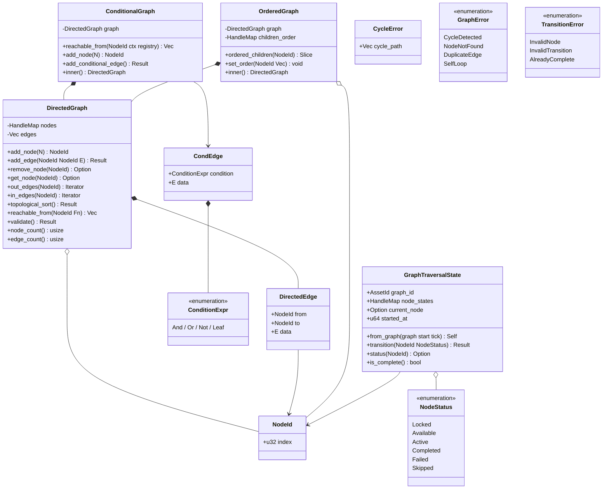

# Directed Graph Primitives Design

## Requirements Trace

> **Canonical sources:** Features, requirements, and user stories are defined in
> [features/](../../features/), [requirements/](../../requirements/), and
> [user-stories/](../../user-stories/). The table below traces design elements to those definitions.

### Traced Features

| Feature    | Requirement |
|------------|-------------|
| F-13.6.1   | R-13.6.1    |
| F-13.6.4   | R-13.6.4    |
| F-13.10.1  | R-13.10.1   |
| F-13.12.2a | R-13.12.2a  |

1. **F-13.6.1** -- Quest graph as DAG of typed objectives with conditional edges
2. **F-13.6.4** -- Branching dialogue trees with conditions and side effects
3. **F-13.10.1** -- Ability composition via directed graphs
4. **F-13.12.2a** -- Talent trees as DAGs with typed nodes, prerequisites, tier gating

> This design provides the **generic graph primitive** that all four features compose upon. No
> game-specific semantics exist in these types. Domain-specific behavior (quests, dialogue,
> abilities, talents) is built by parameterizing the graph with domain node and edge types.

### Cross-Cutting Dependencies

| Dependency        | Source  | Consumed API               |
|-------------------|---------|----------------------------|
| `Handle<T>`       | F-1.7.4 | Generational index         |
| `HandleMap<T>`    | F-1.7.5 | Dense gen-validated store  |
| `ConditionExpr`   | shared  | Boolean expression tree    |
| `ConditionContext` | shared  | Runtime evaluation context |
| Reflection        | F-1.3.1 | `Reflect` derive           |
| Serialization     | F-1.4.1 | Binary/text codecs         |
| ECS World         | F-1.1.1 | `Entity`, `Query`          |
| Event channels    | F-1.5.1 | `EventWriter<T>`           |
| Asset system      | F-12.1  | `AssetId`, asset loading   |

---

## Overview

This document defines a generic directed graph primitive `DirectedGraph<N, E>` with typed nodes and
edges. The primitive is intentionally free of game-specific semantics. Quest graphs, dialogue trees,
talent DAGs, ability compositions, and any future directed-graph use case all compose on top of it.

### Three Variants

1. **`DirectedGraph<N, E>`** -- base topology with adjacency list storage, topological sort,
   filtered reachability, and cycle detection.
2. **`ConditionalGraph<N, E>`** -- wraps `DirectedGraph` with `ConditionExpr` guards on every edge.
   Reachability queries evaluate conditions against a `ConditionContext` at runtime.
3. **`OrderedGraph<N, E>`** -- wraps `DirectedGraph` with per-node child ordering. Used for trees
   where sibling order matters (dialogue choices, talent rows).

### Design Principles

1. **Generic.** No quest, dialogue, talent, or ability vocabulary in the core types. Game mechanics
   compose from parameterized graphs.
2. **Immutable assets.** Graphs are read-only at runtime. Mutable state lives in per-entity
   `GraphTraversalState` components.
3. **No `Arc`/`Rc`/`Cell`/`RefCell`.** All storage uses owned values and generational indices
   (`Handle<T>`, `HandleMap`).
4. **Pure functions.** All transform and query operations are `fn(Input) -> Output` with no side
   effects.
5. **Reflect-derived.** All types derive `Reflect` for serialization via the engine reflection
   system.
6. **ECS-primary (~90%).** Traversal state is a component. Systems drive all state transitions. No manager
   singletons.

---

## Architecture

### Class Diagram



### Module Boundaries

```text
harmonius_graph/
  node.rs          # NodeId, NodeStatus
  edge.rs          # DirectedEdge<E>, CondEdge<E>
  graph.rs         # DirectedGraph<N, E>
  conditional.rs   # ConditionalGraph<N, E>
  ordered.rs       # OrderedGraph<N, E>
  traversal.rs     # GraphTraversalState, transitions
  error.rs         # GraphError, CycleError,
                   # TransitionError
  validate.rs      # DAG validation, cycle detection
  lib.rs           # Re-exports, plugin registration
```

---

## API Design

All types derive `Reflect`. Pseudocode uses Rust conventions.

### Core Types

```rust
/// Unique node identifier within a graph.
/// Indexes into the HandleMap slot array.
#[derive(Reflect, Copy, Clone, Eq, PartialEq, Hash)]
pub struct NodeId(pub u32);

/// A directed edge carrying typed payload data.
#[derive(Reflect, Clone)]
pub struct DirectedEdge<E> {
    pub from: NodeId,
    pub to: NodeId,
    pub data: E,
}
```

### `DirectedGraph<N, E>`

```rust
/// Generic directed graph with typed nodes and edges.
/// Nodes stored in HandleMap for O(1) generational lookup.
/// Edges stored in a Vec with adjacency indexed by node.
#[derive(Reflect)]
pub struct DirectedGraph<N, E> {
    nodes: HandleMap<N>,
    edges: Vec<DirectedEdge<E>>,
}

impl<N, E> DirectedGraph<N, E> {
    /// Inserts a node and returns its identifier.
    pub fn add_node(&mut self, data: N) -> NodeId;

    /// Adds an edge. Returns Err on self-loop or
    /// duplicate edge.
    pub fn add_edge(
        &mut self,
        from: NodeId,
        to: NodeId,
        data: E,
    ) -> Result<(), GraphError>;

    /// Removes a node and all incident edges.
    pub fn remove_node(
        &mut self,
        id: NodeId,
    ) -> Option<N>;

    /// Returns a reference to node data.
    pub fn get_node(
        &self,
        id: NodeId,
    ) -> Option<&N>;

    /// Iterates outgoing edges from a node.
    pub fn out_edges(
        &self,
        node: NodeId,
    ) -> impl Iterator<Item = (NodeId, &E)>;

    /// Iterates incoming edges to a node.
    pub fn in_edges(
        &self,
        node: NodeId,
    ) -> impl Iterator<Item = (NodeId, &E)>;

    /// Kahn's algorithm. Returns Err(CycleError) if
    /// the graph contains a cycle.
    pub fn topological_sort(
        &self,
    ) -> Result<Vec<NodeId>, CycleError>;

    /// BFS/DFS from start, following only edges where
    /// filter returns true. Pure function.
    pub fn reachable_from<F>(
        &self,
        start: NodeId,
        filter: F,
    ) -> Vec<NodeId>
    where
        F: Fn(&E) -> bool;

    /// Validates: no cycles, no orphan nodes, no
    /// self-loops, no duplicate edges.
    pub fn validate(&self) -> Result<(), GraphError>;

    /// Number of nodes currently in the graph.
    pub fn node_count(&self) -> usize;

    /// Number of edges currently in the graph.
    pub fn edge_count(&self) -> usize;
}
```

### `ConditionalGraph<N, E>`

```rust
/// Edge wrapper adding a ConditionExpr guard.
#[derive(Reflect, Clone)]
pub struct CondEdge<E> {
    pub condition: ConditionExpr,
    pub data: E,
}

/// Directed graph with condition-guarded edges.
/// Wraps DirectedGraph<N, CondEdge<E>>.
#[derive(Reflect)]
pub struct ConditionalGraph<N, E> {
    graph: DirectedGraph<N, CondEdge<E>>,
}

impl<N, E> ConditionalGraph<N, E> {
    /// Delegates to inner graph.
    pub fn add_node(&mut self, data: N) -> NodeId;

    /// Adds an edge with a condition guard.
    pub fn add_conditional_edge(
        &mut self,
        from: NodeId,
        to: NodeId,
        condition: ConditionExpr,
        data: E,
    ) -> Result<(), GraphError>;

    /// Returns nodes reachable from start whose edge
    /// conditions evaluate to true in the given
    /// context. Pure function over immutable inputs.
    pub fn reachable_from(
        &self,
        start: NodeId,
        ctx: &ConditionContext,
        registry: &ConditionRegistry,
    ) -> Vec<NodeId>;

    /// Read-only access to the inner graph.
    pub fn inner(
        &self,
    ) -> &DirectedGraph<N, CondEdge<E>>;
}
```

### `OrderedGraph<N, E>`

```rust
/// Directed graph with ordered children per node.
/// Wraps DirectedGraph<N, E> and adds a HandleMap
/// mapping each node to its ordered child list.
#[derive(Reflect)]
pub struct OrderedGraph<N, E> {
    graph: DirectedGraph<N, E>,
    children_order: HandleMap<Vec<NodeId>>,
}

impl<N, E> OrderedGraph<N, E> {
    /// Returns children of a node in authored order.
    pub fn ordered_children(
        &self,
        node: NodeId,
    ) -> &[NodeId];

    /// Sets the child order for a node. Used by the
    /// visual editor during authoring.
    pub fn set_order(
        &mut self,
        node: NodeId,
        order: Vec<NodeId>,
    );

    /// Read-only access to the inner graph.
    pub fn inner(&self) -> &DirectedGraph<N, E>;
}
```

### Traversal State

```rust
/// Per-entity mutable state tracking progress through
/// an immutable graph asset. Stored as an ECS component.
#[derive(Reflect, Clone)]
pub enum NodeStatus {
    Locked,
    Available,
    Active,
    Completed,
    Failed,
    Skipped,
}

#[derive(Reflect)]
pub struct GraphTraversalState {
    pub graph_id: AssetId,
    pub node_states: HandleMap<NodeStatus>,
    pub current_node: Option<NodeId>,
    pub started_at: u64,
}

impl GraphTraversalState {
    /// Creates initial state from a graph asset.
    /// Start node is set to Available; all others
    /// are Locked.
    pub fn from_graph<N, E>(
        graph: &DirectedGraph<N, E>,
        start: NodeId,
        tick: u64,
    ) -> Self;

    /// Transitions a node to a new status.
    /// Validates the transition is legal.
    pub fn transition(
        &mut self,
        node: NodeId,
        status: NodeStatus,
    ) -> Result<(), TransitionError>;

    /// Returns current status of a node.
    pub fn status(
        &self,
        node: NodeId,
    ) -> Option<NodeStatus>;

    /// True when all end nodes are Completed,
    /// Failed, or Skipped.
    pub fn is_complete(&self) -> bool;
}
```

### Error Types

```rust
#[derive(Reflect)]
pub enum GraphError {
    CycleDetected(CycleError),
    NodeNotFound(NodeId),
    DuplicateEdge { from: NodeId, to: NodeId },
    SelfLoop(NodeId),
}

#[derive(Reflect)]
pub struct CycleError {
    pub cycle_path: Vec<NodeId>,
}

#[derive(Reflect)]
pub enum TransitionError {
    InvalidNode(NodeId),
    InvalidTransition {
        node: NodeId,
        from: NodeStatus,
        to: NodeStatus,
    },
    AlreadyComplete,
}
```

---

## Data Flow


### Step-by-Step

1. **Author.** Designer creates a graph in the visual editor. Nodes and edges are placed, typed, and
   annotated with conditions via the predicate editor.
2. **Serialize.** The asset pipeline serializes the graph via the Reflection system (F-1.3.1) into
   binary or text format. The graph asset is immutable once serialized.
3. **Load.** At runtime the asset system loads the graph file into an immutable `Resource`. Multiple
   entities can share a single graph asset.
4. **Spawn.** When an entity begins traversing a graph, a `GraphTraversalState` component is spawned
   on that entity. The start node is set to `Available`; all others `Locked`.
5. **Evaluate.** ECS systems evaluate conditions on outgoing edges using the `ConditionContext`.
   When conditions are met, successor nodes transition from `Locked` to `Available`.
6. **Advance.** Systems transition nodes through the status lifecycle: `Available` -> `Active` ->
   `Completed`/`Failed`/ `Skipped`. Events are emitted on each transition for UI and gameplay
   systems to observe.

### Immutability Boundary

| Layer          | Mutability | Storage         |
|----------------|------------|-----------------|
| Graph asset    | Immutable  | `Resource`      |
| Traversal state | Mutable  | `Component`     |
| Condition eval | Read-only  | Pure function   |

---

## Platform Considerations

No platform-specific concerns. All types are pure Rust data structures with no OS, GPU, or async
dependencies. The graph primitive runs identically on all target platforms (macOS, Windows, Linux,
iOS, Android, consoles).

---

## Test Plan

Full test cases are in the companion file
[directed-graphs-test-cases.md](directed-graphs-test-cases.md).

### Summary by Category

| Category          | Count | Focus                        |
|-------------------|-------|------------------------------|
| Unit tests        | ~20   | Node/edge CRUD, validation   |
| Topology tests    | ~10   | Cycle detection, topo sort   |
| Reachability      | ~8    | Filtered traversal, BFS/DFS  |
| Conditional       | ~8    | ConditionExpr evaluation     |
| Ordered           | ~5    | Child ordering invariants    |
| State transitions | ~10   | NodeStatus lifecycle         |
| Serialization     | ~5    | Reflect round-trip           |
| Benchmarks        | ~5    | 1000-node graph traversal    |

### Key Test Scenarios

1. **Add/remove nodes** -- insert N nodes, verify count, remove one, verify stale handle returns
   `None`.
2. **Cycle detection** -- build a graph with a back-edge, verify `topological_sort` returns
   `CycleError` with the correct cycle path.
3. **Topological sort** -- build a known DAG, verify sort order matches expected sequence.
4. **Filtered reachability** -- build a graph with mixed edge predicates, verify `reachable_from`
   returns only nodes reachable through passing edges.
5. **Conditional reachability** -- build a `ConditionalGraph`, set up a `ConditionContext` where
   some conditions pass and others fail, verify correct reachable set.
6. **State transitions** -- create a `GraphTraversalState`, transition through the full lifecycle,
   verify `is_complete` returns true at the end.
7. **Invalid transitions** -- attempt `Locked` -> `Completed` directly, verify
   `TransitionError::InvalidTransition`.
8. **Benchmark: 1000-node DAG** -- build a 1000-node DAG, run `topological_sort` and
   `reachable_from`, measure under 1 ms.

---

## Open Questions

1. **Rollback support.** Should `GraphTraversalState` support snapshot/restore for networking
   rollback? If so, the state needs a compact diff format for delta replication.
2. **Arena threshold.** At what node count should the graph switch from `HandleMap` to a
   bump-allocated arena? Needs benchmarking at 1K, 10K, and 100K nodes to determine the crossover
   point.
3. **Edge index optimization.** Should outgoing edges be stored in per-node adjacency lists (better
   iteration) rather than a flat `Vec` (better cache locality for small graphs)? Benchmark both
   layouts.
4. **Serialization format.** Should the graph serialize via `Reflect` (bevy_reflect-style) or use a
   custom binary format for faster load times? The Reflect path is more flexible; the binary path is
   faster.
