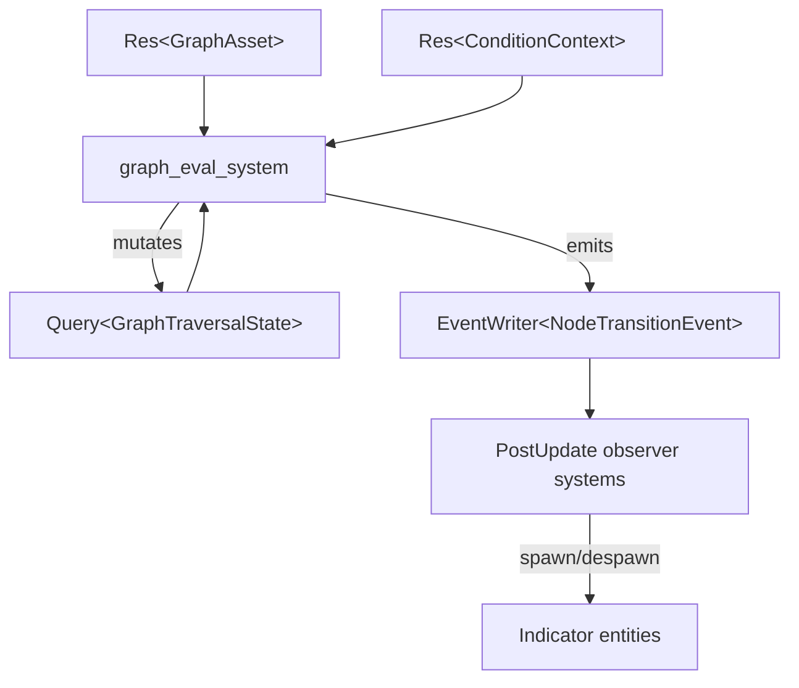

# Directed Graph Primitives Design

## Requirements Trace

> **Canonical sources:** Features, requirements, and user stories are defined in
> [features/](../../features/), [requirements/](../../requirements/), and
> [user-stories/](../../user-stories/). The table below traces design elements to those definitions.

### Engine Primitives (primary trace)

| Feature   | Requirement | User Story  | Design Element                   |
|-----------|-------------|-------------|----------------------------------|
| F-16.4.1  | R-16.4.1    | US-16.4.1   | DirectedGraph<N, E> primitive    |
| F-16.4.2  | R-16.4.2    | US-16.4.2   | Cycle detection (DFS)            |
| F-16.4.3  | R-16.4.3    | US-16.4.3   | Topological sort O(V + E)        |
| F-16.4.4  | R-16.4.4    | US-16.4.4   | ConditionalGraph guards          |
| F-16.4.5  | R-16.4.5    | US-16.4.5   | OrderedGraph sibling order       |
| F-16.4.6  | R-16.4.6    | US-16.4.6   | Weighted edges, shortest path    |
| F-16.4.7  | R-16.4.7    | US-16.4.7   | BFS / DFS pre / DFS post         |
| F-16.4.8  | R-16.4.8    | US-16.4.8   | Tree ops (root, leaves, LCA)     |
| F-16.4.9  | R-16.4.9    | US-16.4.9   | Dead-node + transitive reduction |
| F-16.4.10 | R-16.4.10   | US-16.4.10  | Multi-graph (parallel edges)     |
| F-16.4.11 | R-16.4.11   | US-16.4.11  | Indicator spawn/despawn events   |

1. **R-16.4.1** -- Generic DirectedGraph with adjacency list and generational handles
2. **R-16.4.2** -- Cycle detection rejecting back edges on acyclic graphs
3. **R-16.4.3** -- Deterministic topological sort in O(V + E)
4. **R-16.4.4** -- ConditionalGraph wrapping DirectedGraph with ConditionExpr guards
5. **R-16.4.5** -- OrderedGraph wrapping DirectedGraph with per-node child ordering
6. **R-16.4.6** -- Weighted edges, Dijkstra shortest path, budget-limited reach
7. **R-16.4.7** -- BFS, DFS pre-order, DFS post-order traversals with filters
8. **R-16.4.8** -- Tree operations: root, leaves, depth, subtree, ancestors, LCA
9. **R-16.4.9** -- Dead node elimination and transitive reduction
10. **R-16.4.10** -- Multi-graph support (parallel edges between same node pair)
11. **R-16.4.11** -- Spawn/despawn 3D indicators via ECS events on traversal changes

### Game-Framework Consumers (cross-reference)

| Feature    | Requirement | Consumer Role                                        |
|------------|-------------|------------------------------------------------------|
| F-13.6.1   | R-13.6.1    | Quest graph as DAG of typed objectives              |
| F-13.6.4   | R-13.6.4    | Branching dialogue trees with conditions            |
| F-13.10.1  | R-13.10.1   | Ability composition via directed graphs            |
| F-13.12.2a | R-13.12.2a  | Talent trees as DAGs with prerequisites             |

> This design provides the **generic graph primitive** that all consumers compose upon. No
> game-specific semantics exist in these types. Domain-specific behavior (quests, dialogue,
> abilities, talents) is built by parameterizing the graph with domain node and edge types.

### Cross-Cutting Dependencies

| Dependency        | Source  | Consumed API               |
|-------------------|---------|----------------------------|
| `Handle<T>`       | F-1.7.4 | Generational index         |
| `HandleMap<T>`    | F-1.7.5 | Dense gen-validated store  |
| `ConditionExpr`   | shared  | Boolean expression tree    |
| `ConditionContext` | shared  | Runtime evaluation context |
| Serialization     | F-1.4.1 | rkyv binary codec          |
| ECS World         | F-1.1.1 | `Entity`, `Query`          |
| Event channels    | F-1.5.1 | `EventWriter<T>`           |
| Asset system      | F-12.1  | `AssetId`, asset loading   |

---

## Overview

This document defines a generic directed graph primitive `DirectedGraph<N, E>` with typed nodes and
edges. The primitive is intentionally free of game-specific semantics. Quest graphs, dialogue trees,
talent DAGs, ability compositions, and any future directed-graph use case all compose on top of it.

### Three Variants

1. **`DirectedGraph<N, E>`** -- base topology with adjacency list storage, topological sort,
   filtered reachability, and cycle detection.
2. **`ConditionalGraph<N, E>`** -- wraps `DirectedGraph` with `ConditionExpr` guards on every edge.
   Reachability queries evaluate conditions against a `ConditionContext` at runtime.
3. **`OrderedGraph<N, E>`** -- wraps `DirectedGraph` with per-node child ordering. Used for trees
   where sibling order matters (dialogue choices, talent rows).

### Design Principles

1. **Generic.** No quest, dialogue, talent, or ability vocabulary in the core types. Game mechanics
   compose from parameterized graphs.
2. **Immutable assets.** Graphs are read-only at runtime. Mutable state lives in per-entity
   `GraphTraversalState` components.
3. **No `Arc`/`Rc`/`Cell`/`RefCell`.** All storage uses owned values and generational indices
   (`Handle<T>`, `HandleMap`).
4. **Pure functions.** All transform and query operations are `fn(Input) -> Output` with no side
   effects.
5. **Codegen + rkyv.** All types use codegen'd type metadata for editor/inspector support and rkyv
   `Archive`/`Serialize`/`Deserialize` for binary serialization. No runtime reflection.
6. **ECS-primary (~90%).** Traversal state is a component. Systems drive all state transitions. No
   manager singletons.

---

## Architecture

### Class Diagram


### Module Boundaries

- `harmonius_graph/`
  - `node.rs` -- `NodeId`, `NodeStatus`
  - `edge.rs` -- `DirectedEdge<E>`, `CondEdge<E>`
  - `graph.rs` -- `DirectedGraph<N, E>`
  - `conditional.rs` -- `ConditionalGraph<N, E>`
  - `ordered.rs` -- `OrderedGraph<N, E>`
  - `traversal.rs` -- `GraphTraversalState`, transitions
  - `error.rs` -- `GraphError`, `CycleError`, `TransitionError`
  - `validate.rs` -- DAG validation, cycle detection
  - `codegen.rs` -- middleman .dylib type registration, monomorphization hooks
  - `lib.rs` -- re-exports, plugin registration

---

## API Design

All types derive rkyv `Archive`/`Serialize`/`Deserialize` for zero-copy binary serialization.
Editor/inspector metadata is generated by the codegen pipeline. No `Reflect` derives. Pseudocode
uses Rust conventions.

### Core Types

```rust
/// Unique node identifier within a graph.
/// Indexes into the HandleMap slot array.
#[derive(Archive, Serialize, Deserialize, Copy, Clone, Eq, PartialEq, Hash)]
pub struct NodeId(pub u32);

/// A directed edge carrying typed payload data.
#[derive(Archive, Serialize, Deserialize, Clone)]
pub struct DirectedEdge<E> {
    pub from: NodeId,
    pub to: NodeId,
    pub data: E,
}
```

### `DirectedGraph<N, E>`

```rust
/// Generic directed graph with typed nodes and edges.
/// Nodes stored in HandleMap for O(1) generational lookup.
/// Edges stored in a Vec in insertion order. Adjacency
/// lists are index-based (not hash-based) so iteration
/// order is deterministic across runs. No HashMap used
/// internally. Edge iteration always follows insertion
/// order.
///
/// Traversal scratch allocations (visited bitset, BFS
/// queue, result vec) use per-thread arenas to avoid
/// global allocator contention during parallel system
/// execution.
#[derive(Archive, Serialize, Deserialize)]
pub struct DirectedGraph<N, E> {
    nodes: HandleMap<N>,
    edges: Vec<DirectedEdge<E>>,
}

impl<N, E> DirectedGraph<N, E> {
    /// Inserts a node and returns its identifier.
    pub fn add_node(&mut self, data: N) -> NodeId;

    /// Adds an edge. Returns Err on self-loop or
    /// duplicate edge.
    pub fn add_edge(
        &mut self,
        from: NodeId,
        to: NodeId,
        data: E,
    ) -> Result<(), GraphError>;

    /// Removes a node and all incident edges.
    pub fn remove_node(
        &mut self,
        id: NodeId,
    ) -> Option<N>;

    /// Returns a reference to node data.
    pub fn get_node(
        &self,
        id: NodeId,
    ) -> Option<&N>;

    /// Iterates outgoing edges from a node in insertion
    /// order. Deterministic; no HashMap adjacency index.
    pub fn out_edges(
        &self,
        node: NodeId,
    ) -> impl Iterator<Item = (NodeId, &E)>;

    /// Iterates incoming edges to a node in insertion
    /// order. Deterministic; no HashMap adjacency index.
    pub fn in_edges(
        &self,
        node: NodeId,
    ) -> impl Iterator<Item = (NodeId, &E)>;

    /// Kahn's algorithm topological sort.
    /// Reference: <https://en.wikipedia.org/wiki/Topological_sorting#Kahn's_algorithm>
    /// (original paper: Kahn, 1962).
    /// Returns Err(CycleError) if the graph contains a
    /// cycle. Scratch allocations use per-thread arena.
    pub fn topological_sort(
        &self,
    ) -> Result<Vec<NodeId>, CycleError>;

    /// Breadth-first traversal from start, following
    /// only edges where filter returns true. Pure fn.
    /// Reference: <https://en.wikipedia.org/wiki/Breadth-first_search>
    pub fn bfs<F>(
        &self,
        start: NodeId,
        filter: F,
    ) -> Vec<NodeId>
    where
        F: Fn(&E) -> bool;

    /// Depth-first traversal, pre-order (node before
    /// children). Pure function.
    /// Reference: <https://en.wikipedia.org/wiki/Depth-first_search>
    pub fn dfs_pre<F>(
        &self,
        start: NodeId,
        filter: F,
    ) -> Vec<NodeId>
    where
        F: Fn(&E) -> bool;

    /// Depth-first traversal, post-order (children
    /// before node). Used by render/material graph
    /// compilers. Pure function.
    pub fn dfs_post<F>(
        &self,
        start: NodeId,
        filter: F,
    ) -> Vec<NodeId>
    where
        F: Fn(&E) -> bool;

    /// BFS reachability from start with edge filter.
    /// Equivalent to bfs() — kept for naming clarity.
    pub fn reachable_from<F>(
        &self,
        start: NodeId,
        filter: F,
    ) -> Vec<NodeId>
    where
        F: Fn(&E) -> bool;

    /// Dead node elimination starting from live_roots.
    /// Walks backwards through in_edges from each root,
    /// marking all reachable nodes live. Returns the set
    /// of dead (unreachable) node IDs. Used by the render
    /// graph and material graph compilers to prune passes
    /// whose outputs are not consumed. Pure function.
    pub fn dead_node_elimination(
        &self,
        live_roots: &[NodeId],
    ) -> Vec<NodeId>;

    /// Returns a new graph with all redundant edges
    /// removed — an edge (u, v) is redundant if a longer
    /// directed path from u to v exists. Pure function.
    /// Reference: <https://en.wikipedia.org/wiki/Transitive_reduction>
    pub fn transitive_reduction(
        &self,
    ) -> DirectedGraph<N, E>
    where
        N: Clone,
        E: Clone;

    /// Validates: no cycles, no orphan nodes, no
    /// self-loops, no duplicate edges.
    pub fn validate(&self) -> Result<(), GraphError>;

    /// Number of nodes currently in the graph.
    pub fn node_count(&self) -> usize;

    /// Number of edges currently in the graph.
    pub fn edge_count(&self) -> usize;
}
```

### `WeightedGraph<N, E, W>`

Wraps `DirectedGraph<N, E>` with typed per-edge weights. Used by AI navigation (pathfinding cost),
ability/talent trees (unlock point costs), quest graphs (XP/currency rewards on edges), and the
render graph (estimated GPU cost per pass).

```rust
/// Directed graph with per-edge cost weights.
/// W must support addition, ordering, and a zero value.
#[derive(Archive, Serialize, Deserialize)]
pub struct WeightedGraph<N, E, W>
where
    W: Add<Output = W> + Ord + Default + Clone,
{
    graph: DirectedGraph<N, E>,
    weights: Vec<W>, // parallel to graph.edges
}

impl<N, E, W> WeightedGraph<N, E, W>
where
    W: Add<Output = W> + Ord + Default + Clone,
{
    /// Adds an edge with an associated cost weight.
    pub fn add_weighted_edge(
        &mut self,
        from: NodeId,
        to: NodeId,
        data: E,
        weight: W,
    ) -> Result<(), GraphError>;

    /// Dijkstra's shortest path from `from` to `to`.
    /// Returns the path and its total cost, or None if
    /// no path exists.
    /// Reference: <https://en.wikipedia.org/wiki/Dijkstra%27s_algorithm>
    pub fn shortest_path(
        &self,
        from: NodeId,
        to: NodeId,
    ) -> Option<(Vec<NodeId>, W)>;

    /// Sums edge weights along a path.
    pub fn total_cost(&self, path: &[NodeId]) -> W;

    /// Returns all nodes reachable from start whose
    /// cumulative path cost does not exceed budget.
    pub fn min_cost_reachable(
        &self,
        start: NodeId,
        budget: W,
    ) -> Vec<NodeId>;

    /// Read-only access to the inner graph.
    pub fn inner(&self) -> &DirectedGraph<N, E>;
}
```

### `ConditionalGraph<N, E>`

```rust
/// Edge wrapper adding a ConditionExpr guard.
#[derive(Archive, Serialize, Deserialize, Clone)]
pub struct CondEdge<E> {
    pub condition: ConditionExpr,
    pub data: E,
}

/// Directed graph with condition-guarded edges.
/// Wraps DirectedGraph<N, CondEdge<E>>. Reachability
/// scratch allocations use per-thread arenas.
#[derive(Archive, Serialize, Deserialize)]
pub struct ConditionalGraph<N, E> {
    graph: DirectedGraph<N, CondEdge<E>>,
}

impl<N, E> ConditionalGraph<N, E> {
    /// Delegates to inner graph.
    pub fn add_node(&mut self, data: N) -> NodeId;

    /// Adds an edge with a condition guard.
    pub fn add_conditional_edge(
        &mut self,
        from: NodeId,
        to: NodeId,
        condition: ConditionExpr,
        data: E,
    ) -> Result<(), GraphError>;

    /// Returns nodes reachable from start whose edge
    /// conditions evaluate to true in the given
    /// context. Pure function over immutable inputs.
    pub fn reachable_from(
        &self,
        start: NodeId,
        ctx: &ConditionContext,
        registry: &ConditionRegistry,
    ) -> Vec<NodeId>;

    /// Read-only access to the inner graph.
    pub fn inner(
        &self,
    ) -> &DirectedGraph<N, CondEdge<E>>;
}
```

### `OrderedGraph<N, E>`

```rust
/// Directed graph with ordered children per node.
/// Wraps DirectedGraph<N, E> and adds a HandleMap
/// mapping each node to its ordered child list.
/// children_order uses SmallVec<[NodeId; 8]> because
/// most tree nodes have 2-5 children; avoids heap
/// allocation in the common case. HandleMap is
/// index-based (not hash-based) for deterministic
/// iteration.
#[derive(Archive, Serialize, Deserialize)]
pub struct OrderedGraph<N, E> {
    graph: DirectedGraph<N, E>,
    children_order: HandleMap<SmallVec<[NodeId; 8]>>,
}

impl<N, E> OrderedGraph<N, E> {
    /// Returns children of a node in authored order.
    pub fn ordered_children(
        &self,
        node: NodeId,
    ) -> &[NodeId];

    /// Sets the child order for a node. Used by the
    /// visual editor during authoring.
    pub fn set_order(
        &mut self,
        node: NodeId,
        order: SmallVec<[NodeId; 8]>,
    );

    /// Returns the root node — the unique node with no
    /// incoming edges. Returns None if the graph is
    /// empty or has multiple roots (not a tree).
    pub fn root(&self) -> Option<NodeId>;

    /// Returns all leaf nodes — nodes with no outgoing
    /// edges.
    pub fn leaves(&self) -> Vec<NodeId>;

    /// Returns the depth of a node — number of edges
    /// from the root to this node.
    pub fn depth(&self, node: NodeId) -> usize;

    /// Extracts a subtree rooted at node into a new
    /// OrderedGraph. Used by the editor for copy/paste.
    pub fn subtree(
        &self,
        node: NodeId,
    ) -> OrderedGraph<N, E>
    where
        N: Clone,
        E: Clone;

    /// Returns the path from node up to the root, in
    /// order from node to root. Used by behavior tree
    /// evaluator for blackboard scoping.
    pub fn ancestors(
        &self,
        node: NodeId,
    ) -> Vec<NodeId>;

    /// Lowest common ancestor of nodes a and b.
    /// Returns None if no common ancestor exists.
    pub fn lca(
        &self,
        a: NodeId,
        b: NodeId,
    ) -> Option<NodeId>;

    /// Read-only access to the inner graph.
    pub fn inner(&self) -> &DirectedGraph<N, E>;
}
```

### Traversal State

```rust
/// Per-entity mutable state tracking progress through
/// an immutable graph asset. Stored as an ECS component.
#[derive(Archive, Serialize, Deserialize, Clone)]
pub enum NodeStatus {
    Locked,
    Available,
    Active,
    Completed,
    Failed,
    Skipped,
}

#[derive(Archive, Serialize, Deserialize)]
pub struct GraphTraversalState {
    pub graph_id: AssetId,
    pub node_states: HandleMap<NodeStatus>,
    pub current_node: Option<NodeId>,
    pub started_at: u64,
}

impl GraphTraversalState {
    /// Creates initial state from a graph asset.
    /// Start node is set to Available; all others
    /// are Locked.
    pub fn from_graph<N, E>(
        graph: &DirectedGraph<N, E>,
        start: NodeId,
        tick: u64,
    ) -> Self;

    /// Transitions a node to a new status.
    /// Validates the transition is legal.
    pub fn transition(
        &mut self,
        node: NodeId,
        status: NodeStatus,
    ) -> Result<(), TransitionError>;

    /// Returns current status of a node.
    pub fn status(
        &self,
        node: NodeId,
    ) -> Option<NodeStatus>;

    /// True when all end nodes are Completed,
    /// Failed, or Skipped.
    pub fn is_complete(&self) -> bool;
}
```

### Error Types

```rust
#[derive(Archive, Serialize, Deserialize)]
pub enum GraphError {
    CycleDetected(CycleError),
    NodeNotFound(NodeId),
    /// Multiple edges between the same node pair are
    /// rejected by default. Use MultiGraph<N, E> when
    /// parallel edges are required (e.g., dialogue
    /// options, quest alternatives, state machine
    /// triggers). Domain types may also encode
    /// alternatives within a single edge payload
    /// (e.g., Vec<DialogueChoice> as E).
    DuplicateEdge { from: NodeId, to: NodeId },
    SelfLoop(NodeId),
}

#[derive(Archive, Serialize, Deserialize)]
pub struct CycleError {
    pub cycle_path: Vec<NodeId>,
}

#[derive(Archive, Serialize, Deserialize)]
pub enum TransitionError {
    InvalidNode(NodeId),
    InvalidTransition {
        node: NodeId,
        from: NodeStatus,
        to: NodeStatus,
    },
    AlreadyComplete,
}
```

---

## Data Flow


### Step-by-Step

1. **Author.** Designer creates a graph in the visual editor. Nodes and edges are placed, typed, and
   annotated with conditions via the predicate editor.
2. **Serialize.** The asset pipeline bakes the graph to an rkyv archive (F-1.4.1). The file can be
   mmap'd at runtime with zero deserialization cost. The graph asset is immutable once baked.
3. **Load.** At runtime the asset system mmap-loads the rkyv archive into an immutable `Resource`.
   Multiple entities can share a single graph asset.
4. **Spawn.** When an entity begins traversing a graph, a `GraphTraversalState` component is spawned
   on that entity. The start node is set to `Available`; all others `Locked`.
5. **Evaluate.** ECS systems run in the `Update` phase. They evaluate conditions on outgoing edges
   using the `ConditionContext`. When conditions are met, successor nodes transition from `Locked`
   to `Available`.
6. **Advance.** Systems transition nodes through the status lifecycle: `Available` -> `Active` ->
   `Completed`/`Failed`/`Skipped`. Events are emitted on each transition in the same frame and are
   visible to observer systems in `PostUpdate`.
7. **Indicators.** When a quest node transitions to `Available`, the quest system spawns gameplay
   indicator entities (world-space markers, waypoint beams, minimap icons) via
   `EventWriter<NodeTransitionEvent>`. When the node transitions to `Completed`, the indicators are
   despawned. `GraphTraversalState` is the authoritative source for indicator visibility.

### Per-Frame ECS Data Flow



Traversal state mutations made in `Update` are visible to all `PostUpdate` systems in the same
frame. Graph assets are read-only; no writes occur to them at runtime.

### Game Loop Phase

| Phase      | System                  | Role                              |
|------------|-------------------------|-----------------------------------|
| Update     | `graph_eval_system`     | Evaluate conditions, unlock nodes |
| Update     | `graph_advance_system`  | Advance Active nodes, emit events |
| PostUpdate | `indicator_sync_system` | Spawn/despawn gameplay indicators |

### Immutability Boundary

| Layer           | Mutability | Storage       |
|-----------------|------------|---------------|
| Graph asset     | Immutable  | `Resource`    |
| Traversal state | Mutable    | `Component`   |
| Condition eval  | Read-only  | Pure function |

---

## Platform Considerations

Directed graphs are dimension-agnostic and work identically for 2D, 2.5D, and 3D game types.

All types are pure Rust data structures with no OS, GPU, or async dependencies. The graph primitive
runs identically on all target platforms:

| Platform         | Notes                                                        |
|------------------|--------------------------------------------------------------|
| macOS / iOS      | No constraints                                               |
| Windows          | No constraints                                               |
| Linux            | No constraints                                               |
| Android          | No constraints                                               |
| Nintendo Switch  | 4 GB RAM total; keep max graph size under 100K nodes         |
| VR (Quest, PSVR) | Tight frame budget; avoid large graphs in per-frame hot path |

Console and VR memory budgets constrain maximum graph sizes. The arena-based scratch allocation
strategy (per-thread arenas reset at frame boundaries) is especially important on Switch and VR
where global allocator pressure is more acute.

---

## Test Plan

Full test cases are in the companion file
[directed-graphs-test-cases.md](./directed-graphs-test-cases.md).

### Summary by Category

| Category          | Count | Focus                               |
|-------------------|-------|-------------------------------------|
| Unit tests        | ~20   | Node/edge CRUD, validation          |
| Topology tests    | ~10   | Cycle detection, topo sort          |
| Reachability      | ~8    | bfs/dfs_pre/dfs_post, BFS/DFS       |
| Conditional       | ~8    | ConditionExpr evaluation at 1K      |
| Ordered           | ~10   | Child ordering, tree ops            |
| State transitions | ~10   | NodeStatus lifecycle                |
| Serialization     | ~5    | rkyv archive round-trip, mmap load  |
| Benchmarks        | ~10   | Multi-scale traversal and loading   |

### Key Test Scenarios

1. **Add/remove nodes** -- insert N nodes, verify count, remove one, verify stale handle returns
   `None`.
2. **Cycle detection** -- build a graph with a back-edge, verify `topological_sort` returns
   `CycleError` with the correct cycle path.
3. **Topological sort** -- build a known DAG, verify sort order matches expected sequence.
4. **Filtered reachability** -- build a graph with mixed edge predicates, verify `reachable_from`
   returns only nodes reachable through passing edges.
5. **Conditional reachability** -- build a `ConditionalGraph`, set up a `ConditionContext` where
   some conditions pass and others fail, verify correct reachable set.
6. **State transitions** -- create a `GraphTraversalState`, transition through the full lifecycle,
   verify `is_complete` returns true at the end.
7. **Invalid transitions** -- attempt `Locked` -> `Completed` directly, verify
   `TransitionError::InvalidTransition`.
8. **Benchmark: 1000-node DAG topo sort** -- < 1 ms on a 1K-node DAG.
9. **Benchmark: 10K-node DAG topo sort** -- < 5 ms on a 10K-node DAG.
10. **Benchmark: 100K-node DAG topo sort** -- < 50 ms on a 100K-node DAG.
11. **Benchmark: conditional reachability 1K** -- < 500 µs for `ConditionalGraph` reachability at 1K
    nodes with 50% conditions passing.
12. **Benchmark: state transitions per frame** -- 10K `NodeStatus` transitions in < 1 ms.
13. **Benchmark: rkyv load** -- mmap-load a 10K-node rkyv archive in < 2 ms.

---

## Codegen and Hot-Reload

Directed graphs are the foundational data structure for all no-code authoring surfaces in the
engine. Users author quest graphs, dialogue trees, material graphs, and talent trees in visual
editors.

1. **User-defined types are codegen'd.** Node (`N`) and edge (`E`) type parameters are Rust structs
   generated into the middleman `.dylib` from editor schema definitions. Users never write Rust.
2. **Monomorphization at codegen time.** `DirectedGraph<N, E>` is monomorphized for each
   user-defined `(N, E)` pair when the codegen pipeline runs. No dynamic dispatch, no type erasure.
3. **Hot-reload is .dylib-scoped.** When a user modifies a node or edge type schema, only the
   middleman `.dylib` is recompiled and hot-reloaded. The engine binary is untouched. Incremental
   compilation targets sub-3-second reload.
4. **Domain graph types generated from schema.** Quest (`QuestNode`, `QuestEdge`), dialogue
   (`DialogueNode`, `DialogueEdge`), talent (`TalentNode`, `TalentEdge`), and ability
   (`AbilityNode`, `AbilityEdge`) types are all generated from their editor schema. The generic
   primitive composes all of them without modification.

---

## Open Questions

1. **Rollback support.** Should `GraphTraversalState` support snapshot/restore for networking
   rollback? If so, the state needs a compact diff format for delta replication.
2. **Arena threshold.** At what node count should the graph switch from `HandleMap` to a
   bump-allocated arena? Needs benchmarking at 1K, 10K, and 100K nodes to determine the crossover
   point.
3. **Edge index optimization.** Should outgoing edges be stored in per-node adjacency lists (better
   iteration) rather than a flat `Vec` (better cache locality for small graphs)? Benchmark both
   layouts.
4. ~~**Serialization format.**~~ **Resolved:** rkyv archives with mmap zero-copy load. No Reflect,
   no custom text format for binary assets.

## Review feedback

### RF-1: Remove all Reflect derives [APPLIED]

All 14 types derive `Reflect`, violating the zero-reflection constraint. Remove all `Reflect`
derives. Replace with rkyv `Archive`/`Serialize`/`Deserialize` for binary serialization and
codegen'd type metadata for editor/inspector support. Remove the "Reflection | F-1.3.1" cross-
cutting dependency. Update design principle #5 to state types use codegen + rkyv. Update the data
flow diagram from "serialize via Reflect" to "serialize via rkyv". Resolve open question #4 in favor
of rkyv.

### RF-2: rkyv serialization instead of Reflect [APPLIED]

Replace all Reflect-based serialization with rkyv. Graph assets should be baked to rkyv archives
that can be mmap'd at runtime with zero deserialization. Update data flow step 2, the serialization
test category, and close open question #4.

### RF-3: Codegen and middleman .dylib for user-extensible graph types [APPLIED]

This is the foundational data structure for a no-code engine. Users author quest graphs, dialogue
trees, material graphs, etc. in visual editors. Add a "Codegen and hot-reload" section:

1. User-defined node and edge types are codegen'd as Rust structs in the middleman .dylib
2. `DirectedGraph<N, E>` is monomorphized for each user-defined pair at codegen time
3. Hot-reload recompiles only the middleman .dylib
4. Domain-specific graph types (quest, dialogue, talent) get `N`/`E` types generated from editor
   schema definitions

### RF-4: Create companion test cases file [APPLIED]

Create `docs/design/data-systems/directed-graphs-test-cases.md` with TC-IDs in `TC-X.Y.Z.N` format,
explicit inputs/outputs, and links to R-X.Y.Z for every test.

### RF-5: Game loop phase mapping [APPLIED]

Specify which game loop phase graph traversal systems run in. Graph condition evaluation and state
transitions likely run in Update or PostUpdate. Document exactly where.

### RF-6: Per-frame ECS data flow [APPLIED]

Add a per-frame data flow diagram showing: system inputs (queries on `GraphTraversalState`,
`ConditionContext`, graph `Resource`), system outputs (mutated `GraphTraversalState`, emitted
events), and whether traversal state changes are visible to other systems in the same frame or next
frame.

### RF-7: Algorithm reference URLs [APPLIED]

Add direct URLs for Kahn's algorithm (Wikipedia or the 1962 paper) and BFS/DFS reachability.

### RF-8: Expanded benchmark targets [APPLIED]

Add benchmarks for: conditional reachability evaluation at 1K nodes, state transitions per frame
(10K transitions/frame < X us), graph loading from rkyv archive, scale targets at 10K and 100K
nodes. Each with a specific numeric threshold.

### RF-9: Replace ASCII module layout with Mermaid or list [APPLIED]

Lines 189-201 use a `text` block for the module layout. Replace with a Mermaid diagram or plain
Markdown list per the no-ASCII-art constraint.

### RF-10: SmallVec for OrderedGraph children [APPLIED]

Replace `HandleMap<Vec<NodeId>>` in `OrderedGraph::children_order` with
`HandleMap<SmallVec<[NodeId; 8]>>`. Most tree nodes have 2-5 children. Also state that `HandleMap`
is index-based (not hash-based) for deterministic iteration.

### RF-11: Per-thread arenas for traversal scratch space [APPLIED]

`topological_sort`, `reachable_from`, and conditional reachability queries should allocate working
sets (visited bitset, BFS queue, result vec) from per-thread arenas rather than the global
allocator. This avoids contention during parallel system execution.

### RF-12: Name Switch and VR in platform considerations [APPLIED]

Explicitly list all target platforms including Switch and VR by name. Note console memory budget
constraints that may affect max graph size.

### RF-13: State 2D/2.5D/3D agnosticism [APPLIED]

Add one sentence confirming that directed graphs are dimension-agnostic and work identically for 2D,
2.5D, and 3D game types.

### RF-14: Edge iteration determinism [APPLIED]

Confirm that edge iteration order is deterministic (insertion order or sorted) and that no `HashMap`
is used internally for adjacency indexing.

### RF-15: Weighted edges and cost queries [APPLIED]

The design has no concept of edge weights. Multiple consumers need weighted edges:

1. **AI navigation** — pathfinding cost through graph nodes
2. **Ability/talent trees** — point costs for unlocking nodes
3. **Quest graphs** — XP/currency rewards on edges
4. **Render graph** — estimated GPU cost per pass for scheduling

Add a `WeightedGraph<N, E, W>` variant (or add an optional `weight: W` field to `DirectedEdge`) with
shortest-path and minimum-cost queries:

- `shortest_path(from, to) -> Option<(Vec<NodeId>, W)>` — Dijkstra's algorithm
- `total_cost(path) -> W` — sum weights along a path
- `min_cost_reachable(start, budget) -> Vec<NodeId>` — all nodes reachable within a cost budget

Where `W: Add + Ord + Default` (typically `f32` or `u32`). Include a Dijkstra URL reference.

### RF-16: Dead pass elimination [APPLIED]

Dead pass elimination is not mentioned. This is critical for the render graph and material graph
compilers — both need to prune nodes whose outputs are not consumed by any downstream node.

Add a `dead_node_elimination` function:

```text
pub fn dead_node_elimination(
    &self,
    live_roots: &[NodeId],
) -> Vec<NodeId>
```

Starting from `live_roots` (e.g., the final output node), walk backwards through `in_edges` to mark
all reachable nodes as live. Return the set of dead (unreachable) nodes. This is the standard dead
code elimination algorithm applied to graphs.

Also add `transitive_reduction` which removes redundant edges where a longer path exists:

```text
pub fn transitive_reduction(&self) -> DirectedGraph<N, E>
```

Both are pure functions returning new data, consistent with the immutable asset design.

### RF-17: DFS vs BFS traversal control [APPLIED]

`reachable_from` does not specify or expose the traversal strategy. Different consumers need
different orders:

- **Topological consumers** (render graph, material graph) need DFS post-order
- **Breadth-first consumers** (quest availability, dialogue branching) need BFS
- **Depth-first consumers** (talent tree exploration, behavior tree tick) need DFS pre-order

Add explicit traversal functions:

- `bfs(start, filter) -> Vec<NodeId>` — breadth-first
- `dfs_pre(start, filter) -> Vec<NodeId>` — depth-first pre-order
- `dfs_post(start, filter) -> Vec<NodeId>` — depth-first post-order

Or parameterize `reachable_from` with a `TraversalOrder` enum.

### RF-18: Tree-specific operations on OrderedGraph [APPLIED]

`OrderedGraph` is the tree variant but lacks fundamental tree operations:

- `root() -> Option<NodeId>` — the node with no incoming edges
- `leaves() -> Vec<NodeId>` — nodes with no outgoing edges
- `depth(node) -> usize` — distance from root
- `subtree(node) -> OrderedGraph<N, E>` — extract a subtree rooted at node
- `ancestors(node) -> Vec<NodeId>` — path from node to root
- `lca(a, b) -> Option<NodeId>` — lowest common ancestor

These are needed by: talent tree UI (depth for tier gating), dialogue tree editor (subtree
extraction for copy/paste), behavior tree evaluator (ancestor traversal for blackboard scoping).

### RF-19: Parallel/concurrent edges between same node pair [APPLIED]

The design rejects duplicate edges (`DuplicateEdge` error) but some graph types need multiple edges
between the same pair:

- **Dialogue** — multiple dialogue options from one node to another (different conditions)
- **Quest** — multiple paths from one objective to the next (alternative completion methods)
- **State machines** — multiple transitions between same states (different triggers)

Either relax the `DuplicateEdge` constraint with a `MultiGraph<N, E>` variant, or clarify that
domain types encode alternatives within a single edge's `E` data (e.g., `Vec<DialogueChoice>` as the
edge payload).

### RF-20: Quest graph state drives 3D gameplay indicators [APPLIED]

Quest graph traversal state drives 3D visual indicators: quest markers (! /? above NPCs), waypoint
beams at objective locations, and minimap icons. When `GraphTraversalState` transitions a node to
`Available`, the quest system spawns indicator entities (WorldSpaceAnchor for icons from
ui-framework.md F-10.1.10, VFX effect graph instances for beams from vfx/effects.md RF-26). When the
node transitions to `Completed`, the indicators are despawned. The directed graph design should
document that graph state changes are the authoritative source for gameplay indicator visibility.
