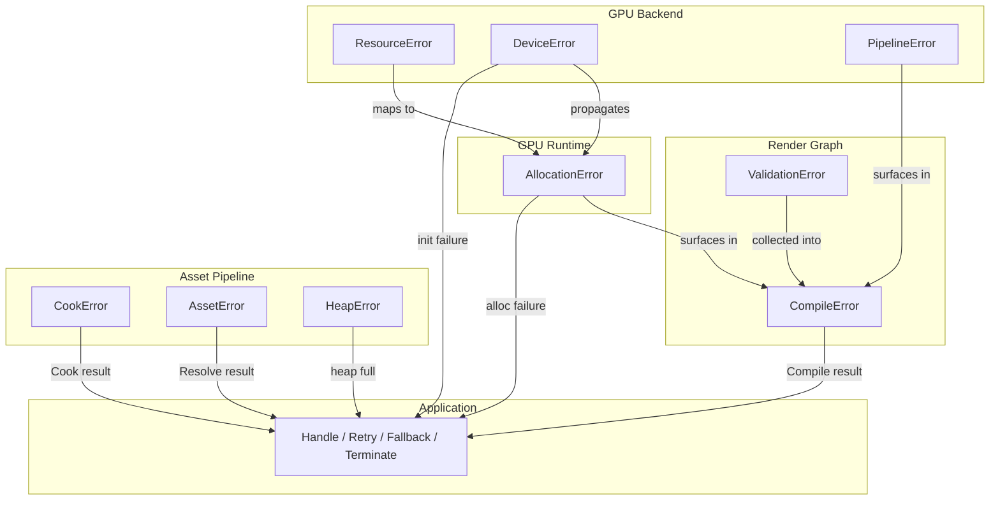

# Error Handling Strategy

Cross-cutting error handling strategy for the Harmonius GPU graphics framework. Defines
how every subsystem reports, propagates, and handles errors without exceptions. Companion
to [gpu-backend-interface.md](gpu-backend-interface.md), [gpu-runtime.md](gpu-runtime.md),
[render-graph-design.md](render-graph-design.md), and [asset-pipeline.md](asset-pipeline.md).

**Requirements:** R-1.1.1 (safe user-facing API)

---

## Contents

- [Error Handling Strategy](#error-handling-strategy)
  - [Contents](#contents)
  - [Design Principles](#design-principles)
  - [Error Categories](#error-categories)
    - [1. Recoverable Errors](#1-recoverable-errors)
    - [2. Programmer Errors](#2-programmer-errors)
    - [3. Fatal Errors](#3-fatal-errors)
    - [4. GPU Errors](#4-gpu-errors)
  - [Error Type Design](#error-type-design)
    - [Error Type Hierarchy](#error-type-hierarchy)
    - [Enum Design Rules](#enum-design-rules)
  - [Error Propagation](#error-propagation)
    - [Propagation Paths](#propagation-paths)
    - [Propagation Flowchart](#propagation-flowchart)
  - [Assertion Macro](#assertion-macro)
  - [Logging and Diagnostics](#logging-and-diagnostics)
  - [Patterns and Anti-Patterns](#patterns-and-anti-patterns)
    - [Correct Patterns](#correct-patterns)
    - [Incorrect Patterns (Anti-Patterns)](#incorrect-patterns-anti-patterns)

---

## Design Principles

| Principle | Description |
|-----------|-------------|
| No exceptions | Exceptions are prohibited throughout the entire codebase, consistent with the Google C++ Style Guide. No `throw`, no `try`/`catch`, compiler flag `-fno-exceptions` is required. |
| Safe user-facing API | User code cannot trigger undefined behavior (R-1.1.1). Every public API is designed so that misuse results in a Compile-time error or a well-defined runtime error value, never UB. |
| Errors are values | All fallible operations return `std::expected<T, E>`. Callers inspect the result and decide how to proceed. Error handling is explicit in the type system. |
| Fail fast for programmer errors | Precondition violations indicate bugs in calling code. In debug builds, assertions print a diagnostic message and call `std::abort()`. In Release builds, they Compile to optimizer hints or are removed entirely. |
| No silent failures | Every error path is explicit and documented. The `[[nodiscard]]` attribute is applied to all functions returning `std::expected`, making it a compiler warning to discard an error. |

---

## Error Categories

### 1. Recoverable Errors

Operations that can legitimately fail at runtime. The caller decides how to handle
them -- retry, fall back, or propagate upward.

**Mechanism:** `std::expected<T, ErrorEnum>`

Every fallible function is marked `[[nodiscard]]` so the compiler warns if the caller
discards the result.

```cpp
[[nodiscard]]
std::expected<T, ErrorEnum> operation(args);
```

**Examples from the framework:**

- `AllocationError` -- GPU memory allocator cannot satisfy a request
  (out of memory, budget exceeded, pool exhausted, invalid alignment).
- `ResourceError` -- GPU backend cannot create a resource
  (out of memory, invalid format, invalid dimensions, unsupported usage).
- `CompileError` -- Render graph compilation found validation errors
  (cycles, type mismatches, undeclared resources).
- `CookError` -- Asset pipeline cannot cook a raw asset
  (parse failed, compression failed, unsupported format).
- `AssetError` -- Resource registry cannot resolve a handle
  (not found, stale handle, not resident).
- `HeapError` -- Bindless descriptor heap cannot allocate a slot.

### 2. Programmer Errors

Violations of documented preconditions. These indicate bugs in the calling code,
not legitimate runtime conditions. They are caught by assertions.

**Mechanism:** `HARMONIUS_ASSERT` macro

```cpp
void SetPipeline(PipelineHandle h) {
  HARMONIUS_ASSERT(h != PipelineHandle::kInvalid, "Pipeline handle must be valid");
  // ...
}
```

The assertion macro behavior varies by build configuration:

- **Debug builds:** Prints a diagnostic message including the failed expression,
  a human-readable message, source file, and line number. Then calls
  `std::abort()` to terminate immediately with a core dump.
- **Release builds:** Compiles to `[[assume(expr)]]` (C++23), providing optimizer
  hints without runtime cost. Alternatively, the assertion is removed entirely.
- **Never throws:** The macro never throws exceptions under any configuration.

### 3. Fatal Errors

Failures during device initialization when required hardware capabilities are
missing. This is the **only** point where the framework may cause application
termination (as defined in
[gpu-backend-interface.md](gpu-backend-interface.md#initialization-hard-gate)).

**Mechanism:** `std::expected<Device, DeviceError>`

```cpp
std::expected<Device, DeviceError> CreateDevice(const DeviceDesc& desc);
```

Device creation fails with `DeviceError::kFeatureNotSupported` if any required
capability is absent (mesh shaders, bindless resources, timeline fences, async
compute queue, transfer queue). The caller -- the application, not the framework
-- decides whether to terminate, try a different backend, or present an error
dialog.

The hard gate runs immediately after querying physical device properties and
before any resource allocation occurs.

### 4. GPU Errors

Asynchronous errors originating from the GPU hardware. These include device lost
(driver crash, TDR, hardware fault) and GPU timeout conditions.

**Mechanism:** Errors surface through fence wait operations and swapchain
acquisition.

```cpp
// Device lost propagates through fence waits
[[nodiscard]]
std::expected<TextureHandle, DeviceError> AcquireNextImage(SwapchainHandle swapchain);
```

When device lost is detected, in-flight work is abandoned. The application may
attempt device re-creation or terminate gracefully.

---

## Error Type Design

### Error Type Hierarchy

Each subsystem defines its own scoped error enum. Error enums use `uint8_t` as
the underlying type for compact storage (fitting in a single byte alongside the
discriminant in `std::expected`).

| Subsystem | Error Type | Values |
|-----------|-----------|--------|
| GPU Backend | `ResourceError` | `kOutOfMemory`, `kInvalidFormat`, `kInvalidDimensions`, `kUnsupportedUsage` |
| GPU Backend | `DeviceError` | `kInitializationFailed`, `kFeatureNotSupported`, `kOutOfMemory` |
| GPU Backend | `PipelineError` | `kCompilationFailed`, `kUnsupported`, `kInvalidState` |
| GPU Runtime | `AllocationError` | `kOutOfMemory`, `kBudgetExceeded`, `kPoolExhausted`, `kInvalidAlignment` |
| Render Graph | `CompileError` | Contains `std::vector<ValidationError>` |
| Render Graph | `ValidationErrorKind` | `kCycleDetected`, `kTypeMismatch`, `kUndeclaredResource`, `kQueueIncompatibility`, `kSingleWriterViolation`, `kVariantAmbiguity`, `kInstanceCountMismatch`, `kHardGateUnsatisfied`, `kSampleCountMismatch` |
| Asset Pipeline | `CookError` | `kParseFailed`, `kCompressionFailed`, `kUnsupportedFormat` |
| Asset Pipeline | `AssetError` | `kNotFound`, `kStaleHandle`, `kNotResident` |
| Asset Pipeline | `HeapError` | `kHeapFull` |

### Enum Design Rules

1. Every error enum is an `enum class` with an explicit `uint8_t` underlying type.
2. Enum values use `kPascalCase` and are self-descriptive.
3. Each subsystem owns its error types -- no shared "uber-error" enum.
4. `CompileError` is a struct (not an enum) because it aggregates multiple
   validation errors from a single compilation pass.

```cpp
namespace harmonius::gpu {

enum class ResourceError : uint8_t {
  kOutOfMemory,
  kInvalidFormat,
  kInvalidDimensions,
  kUnsupportedUsage,
};

enum class DeviceError : uint8_t {
  kInitializationFailed,
  kFeatureNotSupported,
  kOutOfMemory,
};

enum class PipelineError : uint8_t {
  kCompilationFailed,
  kUnsupported,
  kInvalidState,
};

}  // namespace harmonius::gpu
```

```cpp
namespace harmonius::gpu_runtime::memory {

enum class AllocationError : uint8_t {
  kOutOfMemory,
  kBudgetExceeded,
  kPoolExhausted,
  kInvalidAlignment,
};

}  // namespace harmonius::gpu_runtime::memory
```

```cpp
namespace harmonius::rg {

enum class ValidationErrorKind : uint8_t {
  kCycleDetected,
  kTypeMismatch,
  kUndeclaredResource,
  kQueueIncompatibility,
  kSingleWriterViolation,
  kVariantAmbiguity,
  kInstanceCountMismatch,
  kHardGateUnsatisfied,
  kSampleCountMismatch,
};

struct ValidationError {
  ValidationErrorKind kind;
  PassHandle pass;
  ResourceHandle resource;
  std::string message;
};

struct CompileError {
  std::vector<ValidationError> errors;
};

}  // namespace harmonius::rg
```

```cpp
namespace harmonius::asset {

enum class CookError : uint8_t {
  kParseFailed,
  kCompressionFailed,
  kUnsupportedFormat,
};

enum class AssetError : uint8_t {
  kNotFound,
  kStaleHandle,
  kNotResident,
};

enum class HeapError : uint8_t {
  kHeapFull,
};

}  // namespace harmonius::asset
```

---

## Error Propagation

### Propagation Paths

Errors propagate upward through the framework layers. Each layer may map or wrap
errors from the layer below.

1. **GPU Backend** returns `std::expected<T, ResourceError>` or
   `std::expected<T, DeviceError>` from native API calls.
2. **GPU Runtime** wraps backend errors into `std::expected<T, AllocationError>`.
   A backend `ResourceError::kOutOfMemory` maps to
   `AllocationError::kOutOfMemory`. Budget and pool constraints are checked at
   this layer.
3. **Render Graph** exposes `std::expected<CompiledGraph, CompileError>` to the
   application. Compilation validates the graph topology and collects all errors
   into a single `CompileError` containing a vector of `ValidationError`.
4. **Asset Pipeline** returns `std::expected<CookedAsset, CookError>` from
   cooking and `std::expected<gpu::ResourceHandle, AssetError>` from resolution.
5. **Application** receives all errors as values and decides how to handle them:
   retry the operation, fall back to a simpler path, or terminate.

### Propagation Flowchart



---

## Assertion Macro

The project defines a single assertion macro used throughout the codebase for
precondition checks. The macro is defined in a core header included by all
modules.

```cpp
#if defined(HARMONIUS_DEBUG)

#define HARMONIUS_ASSERT(expr, msg)                                   \
  do {                                                                \
    if (!(expr)) {                                                    \
      harmonius::detail::AssertFail(#expr, msg, __FILE__, __LINE__); \
    }                                                                 \
  } while (0)

#define HARMONIUS_UNREACHABLE(msg) harmonius::detail::AssertFail("unreachable", msg, __FILE__, __LINE__)

#else

#define HARMONIUS_ASSERT(expr, msg) [[assume(expr)]]
#define HARMONIUS_UNREACHABLE(msg) std::unreachable()

#endif
```

The `AssertFail` helper prints a formatted diagnostic and aborts:

```cpp
namespace harmonius::detail {

[[noreturn]]
void AssertFail(const char* expr, const char* msg, const char* file, int line) {
  // Print to stderr: file, line, expression, message.
  // Then call std::abort() to produce a core dump.
  std::abort();
}

}  // namespace harmonius::detail
```

**Usage guidelines:**

- Use `HARMONIUS_ASSERT` for precondition checks on function arguments,
  handle validity, and invariant enforcement.
- Use `HARMONIUS_UNREACHABLE` for code paths that should never execute
  (e.g., exhaustive `switch` default cases).
- Never use assertions for conditions that can legitimately occur at
  runtime -- use `std::expected` instead.
- Assertion messages should be concise, stating what was expected
  (e.g., `"alignment must be a power of two"`).

---

## Logging and Diagnostics

The framework does not depend on any logging library. Diagnostic output is
handled through the following mechanisms:

| Mechanism | Scope | Build |
|-----------|-------|-------|
| GPU validation layers | GPU API call validation | Debug only |
| Debug labels and resource names | GPU capture tools (RenderDoc, PIX, Xcode GPU Debugger) | Debug only |
| Diagnostics subsystem (RG-12) | Timestamp queries, pipeline statistics, frame timing | All builds |
| Application log callback | Optional callback the application provides for framework diagnostics | All builds |

The application may register an optional log callback to receive framework
diagnostic messages. The framework never writes to `stdout` or `stderr` in
release builds (assertion failures in debug builds write to `stderr` before
aborting).

```cpp
namespace harmonius {

enum class LogSeverity : uint8_t {
  kDebug,
  kInfo,
  kWarning,
  kError,
};

using LogCallback = std::move_only_function<void(LogSeverity severity, std::string_view message)>;

void SetLogCallback(LogCallback callback);

}  // namespace harmonius
```

---

## Patterns and Anti-Patterns

### Correct Patterns

**Propagating errors with mapping:**

```cpp
auto result = allocator.Allocate(desc);
if (!result) {
  return std::unexpected(MapError(result.error()));
}
auto& alloc = result.value();
```

**Monadic chaining (C++23 `and_then` / `transform`):**

```cpp
auto texture = device.CreateTexture(desc)
                   .and_then([&](TextureHandle h) { return registry.RegisterTexture(h); })
                   .transform([](AssetHandle h) { return h.index; });
```

**Handling errors at the call site:**

```cpp
auto compiled = compiler.Compile(graph);
if (!compiled) {
  for (const auto& err : compiled.error().errors) {
    LogValidationError(err);
  }
  return;
}
Execute(compiled.value());
```

**Precondition assertion:**

```cpp
void BindTexture(uint32_t slot, TextureHandle handle) {
  HARMONIUS_ASSERT(slot < max_bindings, "slot index out of range");
  HARMONIUS_ASSERT(handle != TextureHandle::kInvalid, "texture handle must be valid");
  // ...
}
```

### Incorrect Patterns (Anti-Patterns)

```cpp
// WRONG: Discarding the result -- compiler warns due to [[nodiscard]]
allocator.Allocate(desc);

// WRONG: Using exceptions -- prohibited throughout the codebase
try {
  auto tex = CreateTexture(desc);
} catch (const std::bad_alloc&) {
  // ...
}

// WRONG: Returning raw error codes -- use std::expected instead
int Allocate(/* ... */);  // -1 on failure

// WRONG: Using errno or global error state
if (GetLastError() != 0) { /* ... */
}

// WRONG: Using assertions for recoverable conditions
HARMONIUS_ASSERT(memory_available >= requested,
                 "not enough memory");  // This can legitimately happen at runtime

// WRONG: Throwing from a destructor or callback
~ResourcePool() { throw CleanupError(); }
```
