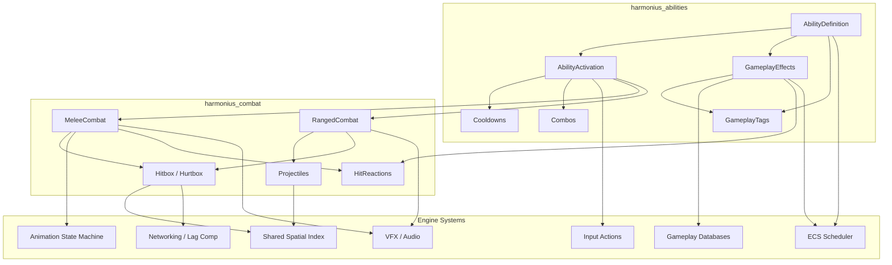
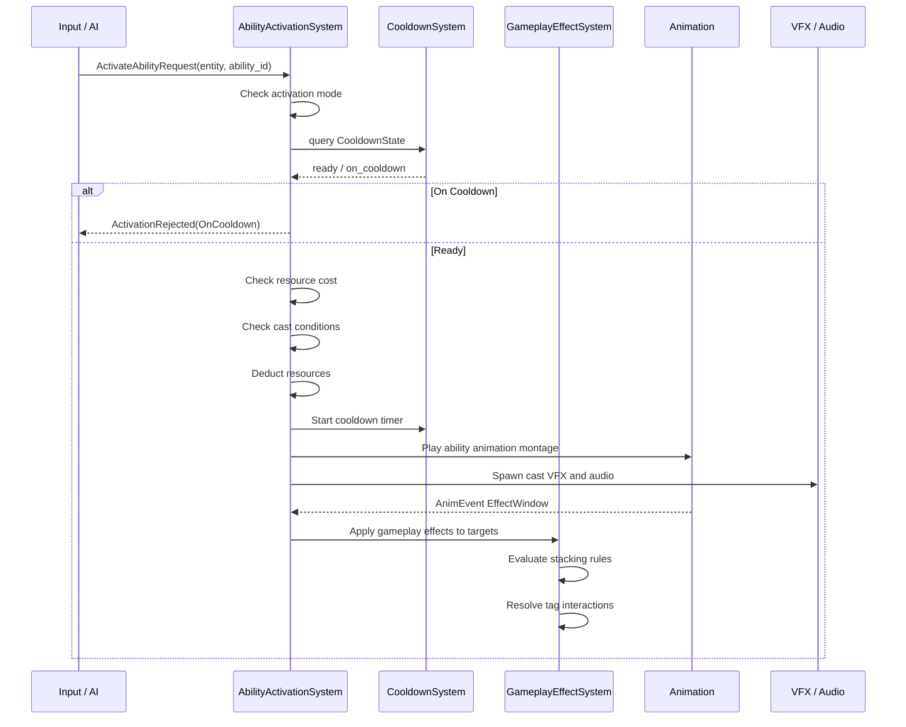
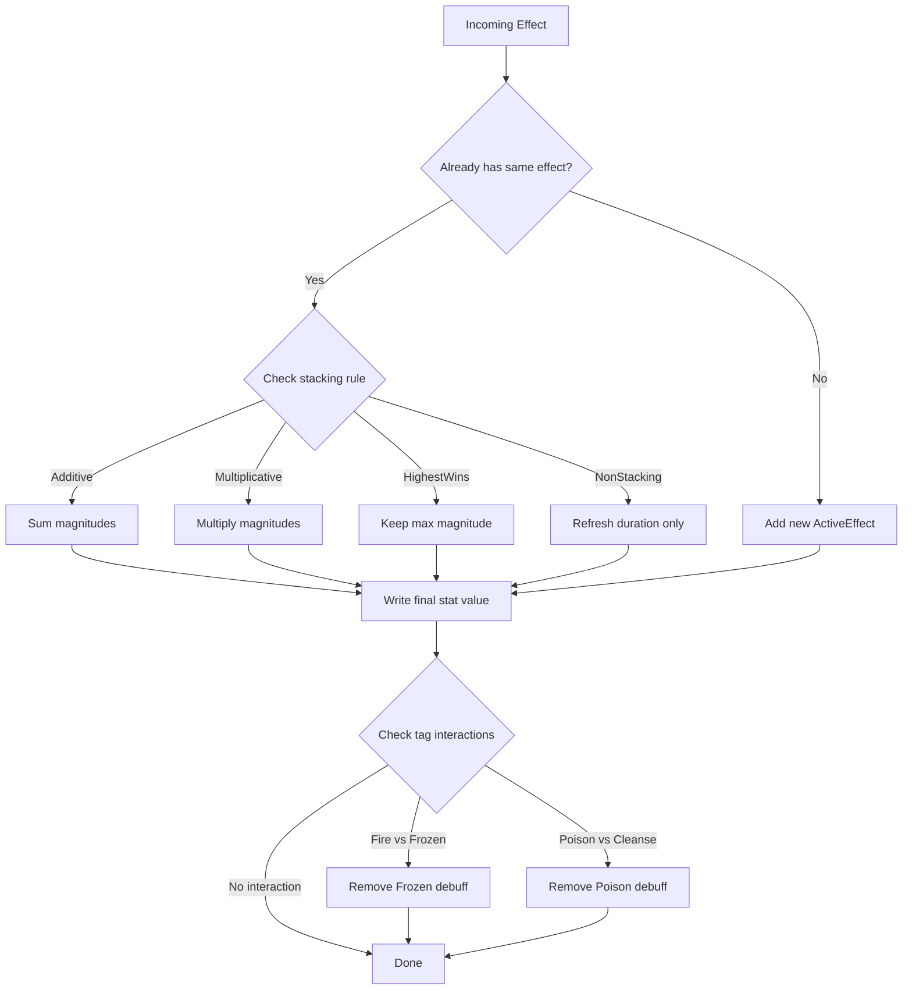
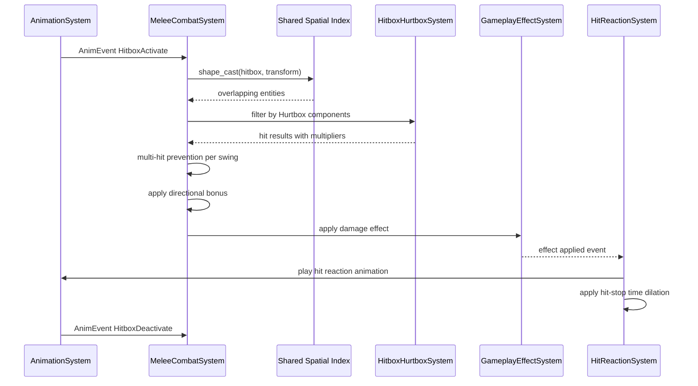
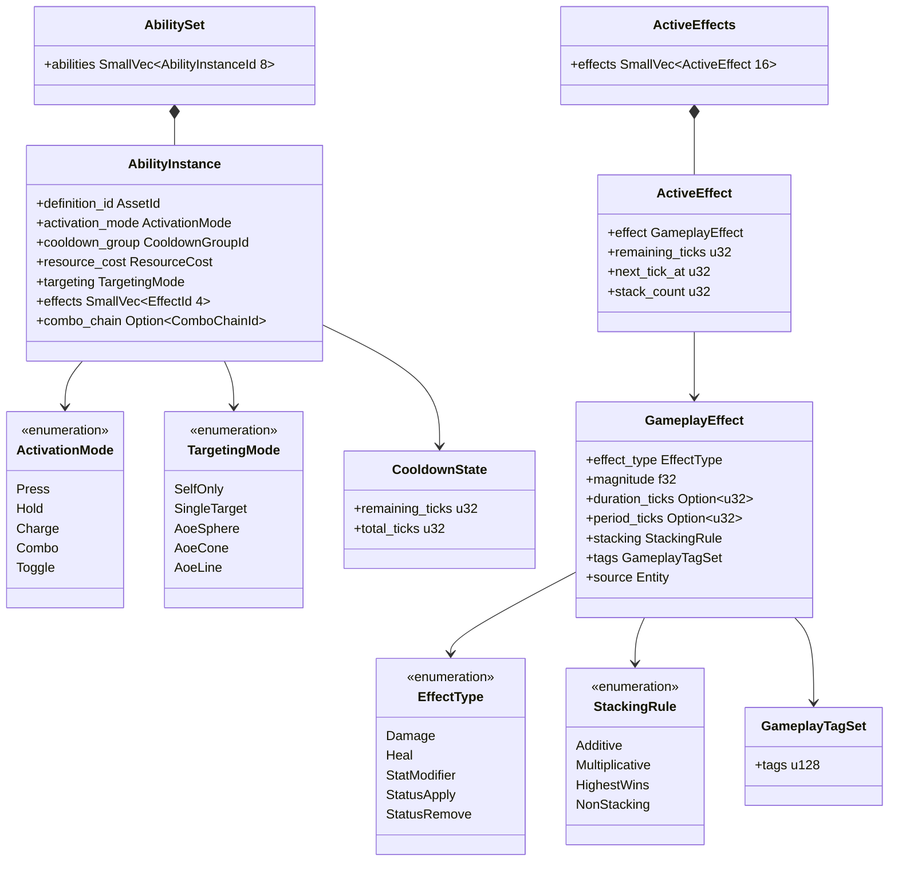
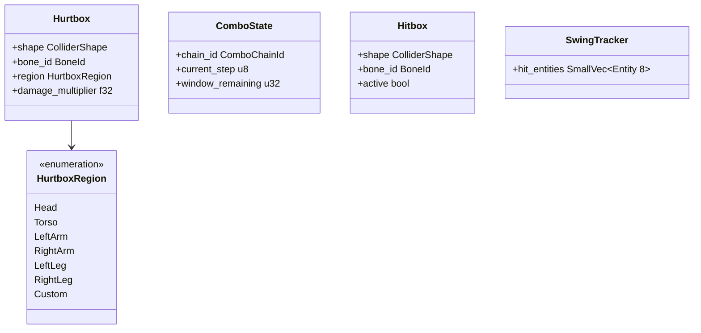

# Abilities and Combat Design

## Requirements Trace

| Feature | Requirement | User Stories | Description |
|---------|-------------|--------------|-------------|
| F-13.10.1 | R-13.10.1 | US-13.10.1.1 -- US-13.10.1.5 | Data-driven ability composition from modular building blocks |
| F-13.10.2 | R-13.10.2 | US-13.10.2.1 -- US-13.10.2.5 | Ability activation modes with input integration |
| F-13.10.3 | R-13.10.3 | US-13.10.3.1 -- US-13.10.3.5 | Composable gameplay effect system |
| F-13.10.4 | R-13.10.4 | US-13.10.4.1 -- US-13.10.4.5 | Animation-driven melee combat |
| F-13.10.5 | R-13.10.5 | US-13.10.5.1 -- US-13.10.5.5 | Projectile-based ranged combat |
| F-13.10.6 | R-13.10.6 | US-13.10.6.1 -- US-13.10.6.5 | Hitbox and hurtbox system |
| -- | R-13.10.NF1 | -- | 64 concurrent effects per entity under 0.1 ms |
| -- | R-13.10.NF2 | -- | Ability activation within 1 frame of input |
| -- | R-13.10.NF3 | -- | Melee hit detection within 1 frame of anim event |

## Overview

The abilities and combat system is a GAS-style (Gameplay Ability
System) framework where every ability is a data asset composed
from reusable building blocks. Designers author abilities entirely
in the visual editor -- no code. All runtime state lives as ECS
components, all logic runs as ECS systems, and all hit detection
flows through the shared spatial index.

The system has two major domains:

1. **Ability System** -- definition, activation, cooldowns,
   combos, gameplay tags, and the composable effect pipeline.
2. **Combat System** -- melee hit detection, ranged projectiles,
   hitbox/hurtbox management, hit reactions, and
   network lag compensation.

Abilities drive combat: an attack is an ability whose effect
window triggers a melee sweep or projectile spawn. Defensive
moves (block, parry, dodge) are abilities that set
invulnerability-frame components. Buffs, debuffs, heals, and
damage-over-time are all gameplay effects stacked on entities.

## Architecture

### Module Boundaries



### Directory Layout

```
harmonius_abilities/
├── definition.rs     # AbilityInstance, AbilitySet,
│                     # AbilityAsset
├── activation.rs     # AbilityActivationSystem,
│                     # ActivationMode, validation
├── cooldown.rs       # CooldownState, CooldownSystem,
│                     # CooldownGroupId
├── combo.rs          # ComboState, ComboChain,
│                     # ComboSystem
├── tags.rs           # GameplayTagSet, TagRegistry,
│                     # tag interaction rules
├── effects/
│   ├── effect.rs     # GameplayEffect, EffectType,
│   │                 # StackingRule
│   ├── active.rs     # ActiveEffects, ActiveEffect,
│   │                 # tick logic
│   ├── pipeline.rs   # EffectEvaluationSystem,
│   │                 # stacking resolution
│   └── stat.rs       # StatModifier, ModOp,
│                     # stat aggregation
└── resource.rs       # ResourcePool (mana, stamina),
                      # ResourceCost

harmonius_combat/
├── melee.rs          # MeleeCombatSystem,
│                     # SwingTracker, hit-stop
├── ranged.rs         # RangedCombatSystem,
│                     # aim assist
├── projectile.rs     # Projectile component,
│                     # ProjectileSystem
├── hitbox.rs         # Hitbox, Hurtbox,
│                     # HurtboxRegion
├── hit_reaction.rs   # HitReactionSystem,
│                     # stagger, knockback
└── lag_comp.rs       # LagCompensationSystem,
                      # historical snapshots
```

### Ability Activation Flow



### Gameplay Effect Evaluation Pipeline



### Melee Hit Detection Flow



### Core Data Structures





## API Design

### Gameplay Tags

Gameplay tags are the foundation for ability categorization,
effect interactions, and conditional logic. Tags are stored
as a 128-bit bitmask for O(1) set operations.

```rust
/// A set of gameplay tags stored as a bitmask.
/// Supports up to 128 tags registered in the
/// TagRegistry. All set operations are O(1).
#[derive(
    Clone, Copy, Debug, Default, PartialEq, Eq,
)]
pub struct GameplayTagSet {
    bits: u128,
}

impl GameplayTagSet {
    pub fn empty() -> Self;
    pub fn contains(&self, tag: GameplayTag) -> bool;
    pub fn insert(&mut self, tag: GameplayTag);
    pub fn remove(&mut self, tag: GameplayTag);
    pub fn union(&self, other: &Self) -> Self;
    pub fn intersection(&self, other: &Self) -> Self;
    pub fn has_any(&self, other: &Self) -> bool;
    pub fn has_all(&self, other: &Self) -> bool;
}

/// A single gameplay tag — an index into the
/// TagRegistry.
#[derive(
    Clone, Copy, Debug, PartialEq, Eq, Hash,
)]
pub struct GameplayTag(pub u8);

/// Registry mapping tag names to indices. Populated
/// at startup from data assets. Shared immutably
/// by all systems.
pub struct TagRegistry {
    names: Vec<&'static str>,
    by_name: HashMap<&'static str, GameplayTag>,
}

impl TagRegistry {
    pub fn register(
        &mut self,
        name: &'static str,
    ) -> GameplayTag;
    pub fn lookup(
        &self,
        name: &str,
    ) -> Option<GameplayTag>;
    pub fn name(
        &self,
        tag: GameplayTag,
    ) -> &'static str;
}
```

### Tag Interaction Rules

Tag interactions define cross-effect behaviors (e.g.,
fire damage removes frozen debuff). Rules are
data-driven, loaded from gameplay databases.

```rust
/// Defines what happens when a specific tag
/// combination occurs during effect application.
pub struct TagInteractionRule {
    /// Tag that the incoming effect must carry.
    pub trigger_tag: GameplayTag,
    /// Tag that must be present on the target's
    /// active effects for this rule to fire.
    pub target_tag: GameplayTag,
    /// Action to take when both tags are present.
    pub action: TagInteractionAction,
}

#[derive(Clone, Copy, Debug, PartialEq, Eq)]
pub enum TagInteractionAction {
    /// Remove all active effects carrying the
    /// target tag.
    RemoveTargetTag,
    /// Amplify the incoming effect magnitude by
    /// a multiplier.
    AmplifyIncoming { multiplier: FixedPoint },
    /// Suppress the incoming effect entirely.
    SuppressIncoming,
}
```

### Ability Definition and Composition

Each ability is a data asset composed from reusable
building blocks. Designers assemble them in the visual
ability editor.

```rust
/// Unique identifier for an ability definition
/// (data asset).
#[derive(
    Clone, Copy, Debug, PartialEq, Eq, Hash,
)]
pub struct AbilityId(pub u32);

/// ECS component: set of abilities granted to an
/// entity.
pub struct AbilitySet {
    pub abilities: SmallVec<[AbilityInstanceId; 8]>,
}

/// A runtime instance of an ability on an entity.
pub struct AbilityInstance {
    pub definition_id: AssetId,
    pub activation_mode: ActivationMode,
    pub cooldown_group: CooldownGroupId,
    pub resource_cost: ResourceCost,
    pub targeting: TargetingMode,
    pub effects: SmallVec<[EffectId; 4]>,
    pub combo_chain: Option<ComboChainId>,
    pub required_tags: GameplayTagSet,
    pub blocked_tags: GameplayTagSet,
    pub granted_tags: GameplayTagSet,
}

/// How the ability is triggered by input.
#[derive(Clone, Copy, Debug, PartialEq, Eq)]
pub enum ActivationMode {
    /// Instant cast on press.
    Press,
    /// Active while input is held.
    Hold,
    /// Hold to charge, release to fire. Power
    /// scales with charge duration.
    Charge {
        min_charge_ticks: u32,
        max_charge_ticks: u32,
    },
    /// Sequential presses within timing windows
    /// advance through a combo chain.
    Combo {
        chain_id: ComboChainId,
        window_ticks: u32,
    },
    /// Press to activate, press again to
    /// deactivate.
    Toggle,
}

/// What the ability targets.
#[derive(Clone, Copy, Debug, PartialEq)]
pub enum TargetingMode {
    SelfOnly,
    SingleTarget { range: f32 },
    AoeSphere { radius: f32 },
    AoeCone { half_angle: f32, range: f32 },
    AoeLine { width: f32, range: f32 },
}

/// Resource consumed on activation.
pub struct ResourceCost {
    pub resource_id: ResourceId,
    pub amount: f32,
}
```

### Ability Activation

The activation system validates and executes ability
requests. Both player input and AI synthetic events
use the same path.

```rust
/// Request to activate an ability. Sent by
/// the input system or AI behavior trees.
pub struct ActivateAbilityRequest {
    pub entity: Entity,
    pub ability_id: AbilityInstanceId,
}

/// Reason an activation was rejected.
#[derive(Clone, Copy, Debug, PartialEq, Eq)]
pub enum ActivationRejection {
    OnCooldown { remaining_ticks: u32 },
    InsufficientResource { required: f32, current: f32 },
    BlockedByTag { tag: GameplayTag },
    InvalidState,
}

/// Result of activation attempt.
pub enum ActivationResult {
    Activated,
    Rejected(ActivationRejection),
}

/// System: processes ActivateAbilityRequest events
/// each frame. Validates cooldowns, resources,
/// tags, and cast conditions, then triggers
/// animation, VFX, and effect application.
pub struct AbilityActivationSystem;
```

### Cooldown System

```rust
/// Identifies a cooldown group. Abilities sharing
/// a group share one cooldown timer.
#[derive(
    Clone, Copy, Debug, PartialEq, Eq, Hash,
)]
pub struct CooldownGroupId(pub u16);

/// ECS component: tracks cooldown state per group.
pub struct CooldownState {
    pub remaining_ticks: u32,
    pub total_ticks: u32,
}

/// Optional: global cooldown shared across all
/// abilities. A short lockout after any ability
/// activation.
pub struct GlobalCooldown {
    pub remaining_ticks: u32,
    pub duration_ticks: u32,
}

/// System: decrements all active cooldowns each
/// tick. Removes CooldownState components when
/// timers reach zero.
pub struct CooldownSystem;
```

### Combo System

Combos are chains of abilities executed in sequence
within timing windows. Each step can branch into
different abilities depending on input.

```rust
/// Identifies a combo chain (data asset).
#[derive(
    Clone, Copy, Debug, PartialEq, Eq, Hash,
)]
pub struct ComboChainId(pub u16);

/// A single step in a combo chain.
pub struct ComboStep {
    /// Ability to execute at this step.
    pub ability_id: AbilityId,
    /// Animation montage section for this step.
    pub montage_section: MontageSection,
    /// Branches: next steps reachable from here.
    pub branches: SmallVec<[ComboBranch; 3]>,
}

/// A branch from one combo step to the next.
pub struct ComboBranch {
    /// Input required to take this branch.
    pub input_action: InputActionId,
    /// Next step index in the combo chain.
    pub next_step: u8,
    /// Timing window in ticks from the current
    /// step's start.
    pub window_open_tick: u32,
    pub window_close_tick: u32,
}

/// ECS component: tracks current combo progress.
pub struct ComboState {
    pub chain_id: ComboChainId,
    pub current_step: u8,
    pub window_remaining: u32,
}

/// System: advances combo state based on input
/// timing. Resets to step 0 on window expiry.
pub struct ComboSystem;
```

### Gameplay Effect System

The effect system is the core combat math engine.
All damage, healing, buffs, debuffs, and status
changes flow through it.

```rust
/// Defines one gameplay effect.
pub struct GameplayEffect {
    pub effect_type: EffectType,
    pub magnitude: f32,
    pub duration_ticks: Option<u32>,
    pub period_ticks: Option<u32>,
    pub stacking: StackingRule,
    pub tags: GameplayTagSet,
    pub source: Entity,
}

/// What the effect does.
#[derive(Clone, Copy, Debug, PartialEq, Eq)]
pub enum EffectType {
    /// Instant or periodic damage.
    Damage(DamageType),
    /// Instant or periodic healing.
    Heal,
    /// Modify a stat by an operation.
    StatModifier {
        stat: StatId,
        op: ModOp,
    },
    /// Apply a status (stun, root, silence).
    StatusApply(StatusId),
    /// Remove a status.
    StatusRemove(StatusId),
}

/// Damage element for tag interactions and
/// resistances.
#[derive(Clone, Copy, Debug, PartialEq, Eq)]
pub enum DamageType {
    Physical,
    Fire,
    Ice,
    Lightning,
    Poison,
    Custom(u16),
}

/// How the stat modifier is applied.
#[derive(Clone, Copy, Debug, PartialEq, Eq)]
pub enum ModOp {
    /// Add flat value to base.
    Flat,
    /// Multiply the base value.
    Percent,
    /// Override the stat entirely.
    Override,
}

/// Stacking behavior when the same effect
/// is applied multiple times.
#[derive(Clone, Copy, Debug, PartialEq, Eq)]
pub enum StackingRule {
    /// Multiple instances sum magnitudes.
    Additive,
    /// Multiple instances multiply magnitudes.
    Multiplicative,
    /// Only the highest magnitude applies.
    HighestWins,
    /// Cannot stack; reapply refreshes duration.
    NonStacking,
}

/// ECS component: all active effects on an entity.
pub struct ActiveEffects {
    pub effects: SmallVec<[ActiveEffect; 16]>,
}

/// A single active effect instance.
pub struct ActiveEffect {
    pub effect: GameplayEffect,
    pub remaining_ticks: u32,
    pub next_tick_at: u32,
    pub stack_count: u32,
}

/// System: evaluates all active effects each tick.
/// Ticks periodic effects, expires durations,
/// resolves stacking, and fires tag interactions.
pub struct GameplayEffectSystem;
```

### Melee Combat

```rust
/// ECS component: weapon hitbox attached to a bone.
/// Activated/deactivated by animation events.
pub struct Hitbox {
    pub shape: ColliderShape,
    pub bone_id: BoneId,
    pub active: bool,
}

/// ECS component: damageable region on a bone.
pub struct Hurtbox {
    pub shape: ColliderShape,
    pub bone_id: BoneId,
    pub region: HurtboxRegion,
    pub damage_multiplier: f32,
}

/// Body region for damage multiplier lookup.
#[derive(Clone, Copy, Debug, PartialEq, Eq)]
pub enum HurtboxRegion {
    Head,
    Torso,
    LeftArm,
    RightArm,
    LeftLeg,
    RightLeg,
    Custom(u16),
}

/// ECS component: tracks entities already hit
/// during the current swing to prevent multi-hit.
pub struct SwingTracker {
    pub hit_entities: SmallVec<[Entity; 8]>,
}

/// Directional bonus applied based on relative
/// facing between attacker and target.
#[derive(Clone, Copy, Debug, PartialEq, Eq)]
pub enum AttackDirection {
    Front,
    Back,
    Flank,
}

/// Configuration for hit-stop (brief time dilation
/// on impact for game feel).
pub struct HitStopConfig {
    pub duration_ticks: u32,
    pub time_scale: f32,
}

/// System: processes active hitboxes each tick.
/// Queries the shared spatial index for overlaps,
/// filters by hurtbox components, resolves damage
/// with multipliers, and triggers hit reactions.
pub struct MeleeCombatSystem;
```

### Ranged Combat and Projectiles

```rust
/// ECS component: marks an entity as a projectile.
pub struct Projectile {
    pub velocity: Vec3,
    pub gravity_scale: f32,
    pub wind_scale: f32,
    pub effect_payload: EffectId,
    pub source_entity: Entity,
    pub max_distance: f32,
    pub distance_traveled: f32,
}

/// Trajectory type for the projectile.
#[derive(Clone, Copy, Debug, PartialEq, Eq)]
pub enum TrajectoryType {
    /// Straight line (bullets).
    Linear,
    /// Gravity arc (grenades, arrows).
    Arced,
    /// Tracks a target entity.
    Homing { turn_rate: f32 },
    /// Continuous ray (lasers).
    Beam,
    /// Multiple pellets in a cone (shotguns).
    Spread { pellet_count: u8, cone_angle: f32 },
}

/// Aim assist parameters for gamepad input.
pub struct AimAssistConfig {
    /// Radius within which aim snaps to target.
    pub magnetism_radius: f32,
    /// Slowdown factor when crosshair is near
    /// a target.
    pub friction: f32,
    /// Whether to snap to the nearest valid
    /// target on ADS.
    pub snap_on_ads: bool,
}

/// System: advances projectile positions using
/// physics integration (gravity, drag, wind).
/// Uses CCD via the shared spatial index for
/// fast projectiles. Applies effect payloads
/// on impact.
pub struct ProjectileSystem;

/// System: applies aim assist adjustments for
/// gamepad input.
pub struct AimAssistSystem;
```

### Hit Reactions

```rust
/// Types of hit reactions triggered by damage.
#[derive(Clone, Copy, Debug, PartialEq, Eq)]
pub enum HitReaction {
    /// No visible reaction (blocked, minor).
    None,
    /// Brief flinch animation.
    Flinch,
    /// Stagger with brief stun.
    Stagger { stun_ticks: u32 },
    /// Pushed away from the hit source.
    Knockback { force: f32 },
    /// Launched into the air.
    Launch { force: f32 },
    /// Death.
    Death,
}

/// ECS component: pending hit reaction to play.
pub struct PendingHitReaction {
    pub reaction: HitReaction,
    pub direction: Vec3,
    pub hit_stop: Option<HitStopConfig>,
}

/// System: processes PendingHitReaction components.
/// Drives animation state machine transitions and
/// applies hit-stop time dilation.
pub struct HitReactionSystem;
```

### Lag Compensation

```rust
/// Historical snapshot of an entity's hitbox
/// transforms at a specific tick.
pub struct HitboxSnapshot {
    pub tick: u64,
    pub transforms: SmallVec<[BoneTransform; 16]>,
}

/// ECS component: ring buffer of historical
/// snapshots for lag compensation.
pub struct HitboxHistory {
    pub snapshots: VecDeque<HitboxSnapshot>,
    pub max_history_ticks: u32,
}

/// System: records hitbox state each tick for
/// entities with HitboxHistory. On the server,
/// rewinds hitbox state to the client's fire
/// time to resolve hits fairly.
pub struct LagCompensationSystem;
```

## Data Flow

### Per-Frame System Execution Order

The ECS scheduler runs these systems in
dependency order each frame:

1. **InputSystem** -- reads raw input, produces
   `ActivateAbilityRequest` events.
2. **AbilityActivationSystem** -- validates
   requests, deducts resources, starts cooldowns,
   triggers animation montages.
3. **CooldownSystem** -- decrements all active
   cooldown timers.
4. **ComboSystem** -- advances combo state,
   resets expired windows.
5. **AnimationSystem** -- evaluates animation state
   machines, fires animation events (hitbox
   activate/deactivate, effect window).
6. **MeleeCombatSystem** -- processes active hitboxes,
   queries shared spatial index, resolves hits.
7. **ProjectileSystem** -- integrates projectile
   trajectories, runs CCD, resolves impacts.
8. **GameplayEffectSystem** -- applies pending
   effects, evaluates stacking, ticks periodic
   effects, expires durations, resolves tag
   interactions.
9. **HitReactionSystem** -- plays hit reactions,
   applies hit-stop dilation.
10. **LagCompensationSystem** -- records hitbox
    snapshots (server only).

### Effect Application Pipeline

When a melee hit or projectile impact occurs:

1. The combat system determines the base damage
   from the ability's effect payload.
2. The hurtbox region multiplier is applied
   (e.g., head x2.0).
3. The directional bonus is applied
   (e.g., back x1.5).
4. The final `GameplayEffect` is submitted to
   `ActiveEffects` on the target entity.
5. The `GameplayEffectSystem` evaluates stacking
   rules against existing effects.
6. Tag interactions fire (e.g., fire damage
   removes frozen debuff).
7. The stat aggregation system recalculates
   derived stats (health, speed, etc.).

### Combo Chain Example

A three-hit melee combo might flow as:

```
Step 0: Light Attack (press within idle)
   ├─ press within 0.3s → Step 1: Heavy Slash
   └─ hold within 0.3s  → Step 1: Upward Sweep

Step 1: Heavy Slash
   └─ press within 0.4s → Step 2: Finisher Slam

Step 1: Upward Sweep
   └─ press within 0.4s → Step 2: Air Combo

(window expires → reset to Step 0)
```

Each step is a separate ability with its own
hitbox timing, damage, and animation section.

## Platform Considerations

| Component | Platform Impact | Notes |
|-----------|----------------|-------|
| Shared spatial index | All platforms | Shape casts for hitboxes and projectile CCD use the same BVH/octree shared with physics, rendering, and networking |
| Gameplay tags | All platforms | 128-bit bitmask operations are 2 instructions on all targets (AND, CMP) |
| Effect evaluation | All platforms | Tight loop over SmallVec; cache-friendly iteration |
| Lag compensation | Server only | Historical snapshot ring buffer consumes memory proportional to max compensated latency |
| Aim assist | Gamepad only | Active only when gamepad input is detected; no overhead on keyboard/mouse |
| Visual ability editor | Editor only | Desktop editor surfaces; not compiled into runtime |

## Test Plan

### Unit Tests

| Test | Req | Description |
|------|-----|-------------|
| `test_tag_set_operations` | R-13.10.1 | Insert, remove, union, intersection, has_any, has_all on GameplayTagSet. Verify O(1) bitmask behavior. |
| `test_ability_activation_press` | R-13.10.2 | Activate a press-mode ability. Verify resource deducted, cooldown started, animation triggered. |
| `test_activation_rejected_cooldown` | R-13.10.2 | Attempt activation while on cooldown. Verify rejection with remaining time. |
| `test_activation_rejected_resource` | R-13.10.2 | Attempt activation with insufficient mana. Verify rejection with required vs current amounts. |
| `test_activation_rejected_blocked_tag` | R-13.10.2 | Attempt activation while stunned (blocked tag present). Verify rejection. |
| `test_hold_activation` | R-13.10.2 | Activate hold-mode ability. Verify active while held, deactivates on release. |
| `test_charge_activation` | R-13.10.2 | Charge ability for varying durations. Verify power scales with charge time, capped at max. |
| `test_toggle_activation` | R-13.10.2 | Press toggle ability twice. Verify activates on first, deactivates on second. |
| `test_combo_chain_advance` | R-13.10.2 | Execute 3-step combo within timing windows. Verify each step fires the correct ability. |
| `test_combo_window_expiry` | R-13.10.2 | Let combo window expire between steps. Verify reset to step 0. |
| `test_ai_synthetic_input` | R-13.10.2 | AI sends ActivateAbilityRequest. Verify identical execution path to player input. |
| `test_effect_instant_damage` | R-13.10.3 | Apply instant 50 damage. Verify health reduced by 50. |
| `test_effect_duration_buff` | R-13.10.3 | Apply 30% speed buff for 5s. Verify speed increased, then restored after expiry. |
| `test_effect_periodic_heal` | R-13.10.3 | Apply heal 10 HP every 2s for 10s. Verify exactly 5 ticks. |
| `test_stacking_additive` | R-13.10.3 | Apply two +10 damage bonuses. Verify total bonus is +20. |
| `test_stacking_multiplicative` | R-13.10.3 | Apply 1.2x and 1.5x multipliers. Verify total is 1.8x. |
| `test_stacking_highest_wins` | R-13.10.3 | Apply +15% and +25% buffs. Verify only +25% applies. |
| `test_stacking_non_stacking` | R-13.10.3 | Reapply same debuff. Verify duration refreshed, magnitude unchanged. |
| `test_tag_interaction_fire_frozen` | R-13.10.3 | Apply fire damage to frozen target. Verify frozen debuff removed. |
| `test_hitbox_activation_timing` | R-13.10.4 | Play attack animation. Verify hitbox active only during defined window. |
| `test_hurtbox_head_multiplier` | R-13.10.4 | Strike head hurtbox (x2). Verify damage doubled. |
| `test_hurtbox_limb_multiplier` | R-13.10.4 | Strike limb hurtbox (x0.75). Verify damage reduced. |
| `test_directional_back_bonus` | R-13.10.4 | Attack from behind. Verify back-attack multiplier applied. |
| `test_multi_hit_prevention` | R-13.10.4 | Swing through same target twice. Verify only one hit per swing. |
| `test_hit_stop_time_dilation` | R-13.10.4 | Land a melee hit. Verify time scale reduced for configured duration. |
| `test_projectile_linear` | R-13.10.5 | Fire linear projectile. Verify straight-line travel. |
| `test_projectile_arced` | R-13.10.5 | Fire arced projectile. Verify parabolic trajectory under gravity. |
| `test_projectile_homing` | R-13.10.5 | Fire homing projectile at moving target. Verify course correction. |
| `test_projectile_spread` | R-13.10.5 | Fire spread projectile. Verify correct pellet count within cone angle. |
| `test_projectile_ccd` | R-13.10.5 | Fire fast projectile at thin wall. Verify CCD prevents tunneling. |
| `test_projectile_effect_payload` | R-13.10.5 | Projectile impacts target. Verify effect payload applies. |
| `test_aim_assist_magnetism` | R-13.10.5 | Aim near target with gamepad. Verify aim snaps within radius. |

### Integration Tests

| Test | Req | Description |
|------|-----|-------------|
| `test_ability_full_cycle` | R-13.10.1, NF2 | Activate ability, verify animation + VFX + effect all within 1 frame. |
| `test_melee_full_pipeline` | R-13.10.4, NF3 | Swing weapon, verify hitbox activates, spatial query runs, damage applies, hit reaction plays -- all within 1 frame of animation event. |
| `test_ranged_full_pipeline` | R-13.10.5 | Fire weapon, projectile flies, impacts target, effect applies, surface VFX spawns. |
| `test_combo_into_ability` | R-13.10.2 | Execute combo chain where final step triggers a ranged projectile. Verify full combo-to-projectile flow. |
| `test_64_concurrent_effects` | R-13.10.NF1 | Apply 64 effects to one entity. Verify all evaluate correctly within 0.1 ms. |
| `test_40_entity_raid` | R-13.10.NF1 | 40 entities with 64 effects each. Verify total evaluation under 4 ms. |
| `test_lag_comp_100ms` | R-13.10.6 | Simulate 100 ms latency. Verify server resolves hits against historical snapshots at client fire time. |
| `test_shared_effect_component` | R-13.10.1 | Two abilities share a "Fire Damage" effect. Verify both produce identical damage. |

### Benchmarks

| Benchmark | Target | Source |
|-----------|--------|--------|
| Effect evaluation (64 effects, 1 entity) | < 0.1 ms | R-13.10.NF1 |
| Effect evaluation (64 effects, 40 entities) | < 4 ms | R-13.10.NF1 |
| Ability activation latency | < 1 frame (16.67 ms) | R-13.10.NF2 |
| Melee hit detection latency | < 1 frame (16.67 ms) | R-13.10.NF3 |
| Tag set operations (128-bit) | < 10 ns | -- |
| Projectile CCD (256 projectiles) | < 1 ms | NFR-13.16.1 |
| Combo input processing | < 0.01 ms | -- |

## Open Questions

1. **Tag capacity** -- 128 tags (u128 bitmask) may be
   insufficient for large games. Consider a tiered approach:
   128-bit fast path for common tags, plus a fallback
   `HashSet` for overflow. Measure actual tag counts from
   shipped game ability databases.
2. **Effect evaluation order** -- When multiple effects
   modify the same stat, the evaluation order (flat before
   percent, or percent before flat) affects the final value.
   Define a canonical ordering or make it configurable per
   stat.
3. **Network authority for effects** -- In multiplayer,
   should effects be applied client-side with server
   reconciliation (responsive but divergence-prone), or
   server-authoritative with client prediction (consistent
   but adds latency)? This interacts with the networking
   system's prediction and rollback design.
4. **Combo graph complexity** -- The current design supports
   branching combo trees. Determine whether cycles (loop
   combos) should be allowed, and if so, how to prevent
   infinite combo exploits.
5. **Hit-stop and networking** -- Hit-stop dilates local
   time. In multiplayer, should hit-stop be local-only
   (cosmetic) or synchronized (gameplay-affecting)? Local
   avoids desyncs but creates frame-count divergence.
6. **Visual ability editor scope** -- The editor must
   expose all activation modes, targeting, effects, and
   combo chains. Define the exact node graph vocabulary
   for the logic graph integration (F-15.8.4).
