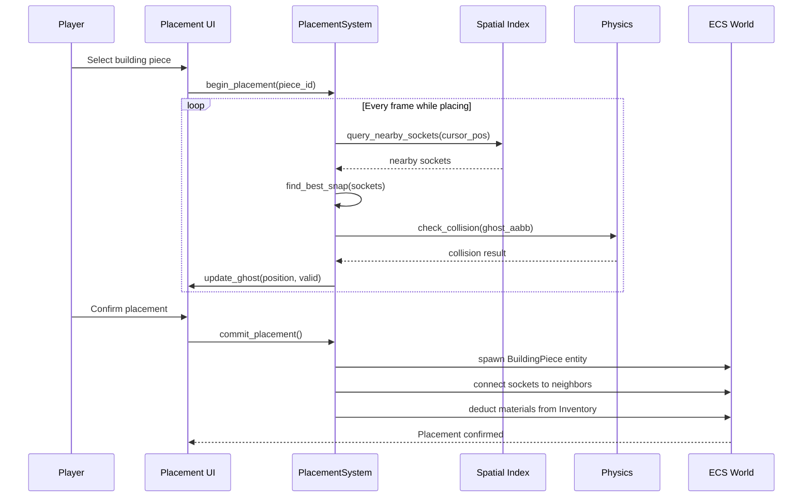
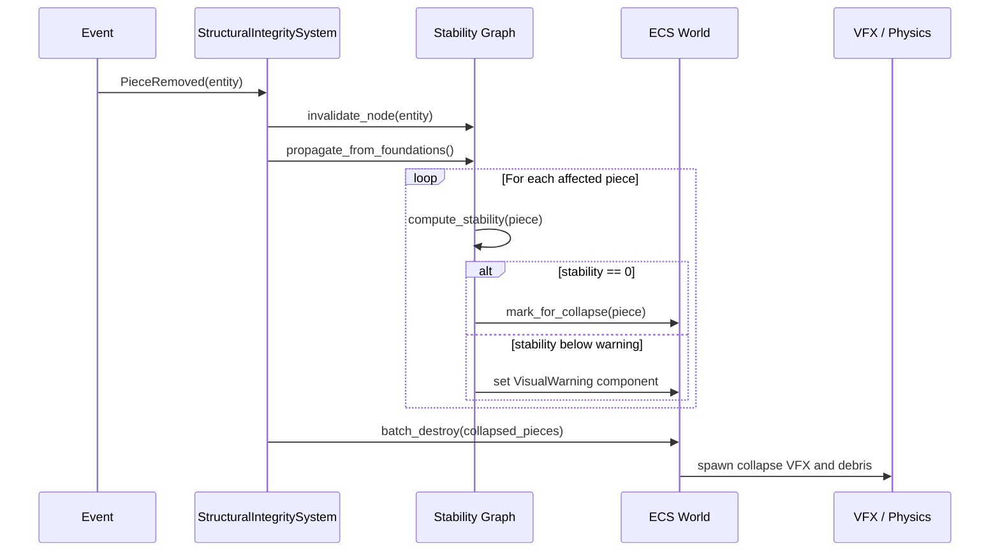
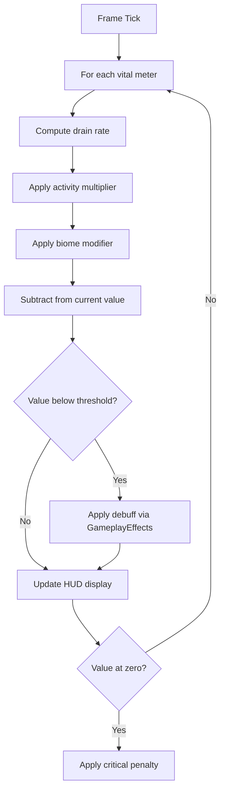
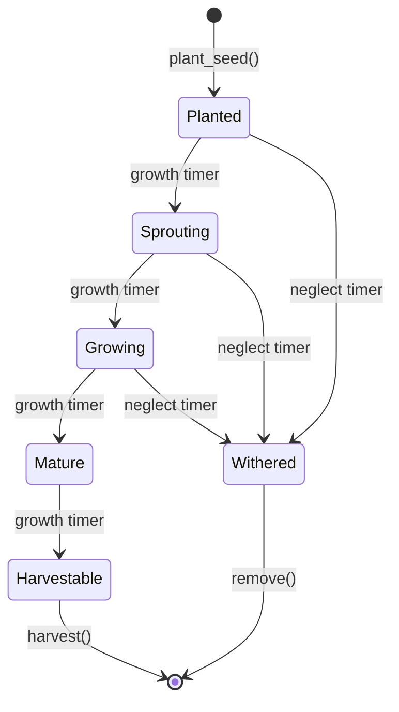
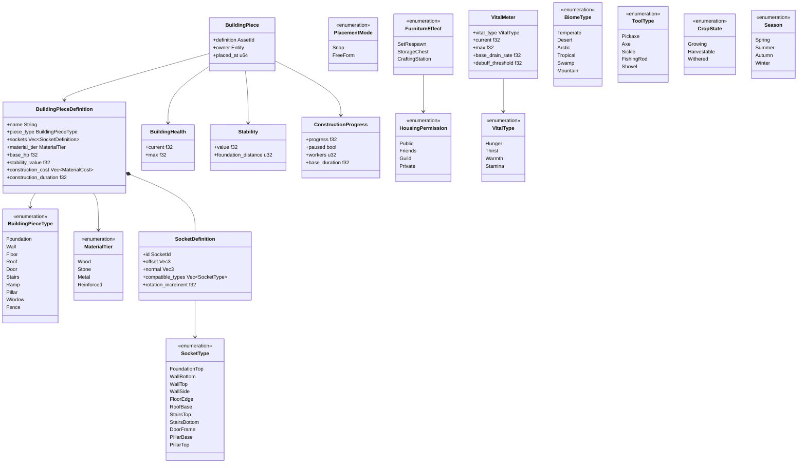

# Building and Survival Systems Design

## Requirements Trace

> **Canonical sources:** Features, requirements, and user stories are defined in
> [features/game-framework/](../../features/game-framework/),
> [requirements/game-framework/](../../requirements/game-framework/), and
> [user-stories/game-framework/](../../user-stories/game-framework/). The table below traces design
> elements to those definitions.

### Building

| Feature | Requirement | Description |
|---------|-------------|-------------|
| F-13.14.1 | R-13.14.1 | Modular snap-based building placement with socket system |
| F-13.14.2 | R-13.14.2 | Construction phase with scaffold, progress, resource costs |
| F-13.14.3 | R-13.14.3 | Structural integrity propagation from foundations |
| F-13.14.4 | R-13.14.4 | Building upgrade across material tiers and repair |
| F-13.14.5a | R-13.14.5a | Housing plot and instance system with permissions |
| F-13.14.5b | R-13.14.5b | Furniture placement in interior spaces |
| F-13.14.5c | R-13.14.5c | Functional furniture effects (beds, chests, stations) |

### Survival

| Feature | Requirement | Description |
|---------|-------------|-------------|
| F-13.14.6a | R-13.14.6a | Hunger and thirst meters with activity/biome modifiers |
| F-13.14.6b | R-13.14.6b | Temperature and warmth affected by clothing, fire, shelter |
| F-13.14.6c | R-13.14.6c | Stamina depletion and fatigue accumulation |
| F-13.14.6d | R-13.14.6d | Vital debuffs at critical thresholds |
| F-13.14.7a | R-13.14.7a | Harvestable resource node definitions |
| F-13.14.7b | R-13.14.7b | Gathering interaction loop with skill-based yield |
| F-13.14.7c | R-13.14.7c | Procedural resource node distribution by biome |
| F-13.14.8 | R-13.14.8 | Farming and crop growth pipeline |
| F-13.14.9a | R-13.14.9a | Animal needs, happiness, and production rates |
| F-13.14.9b | R-13.14.9b | Animal housing structures with capacity limits |
| F-13.14.9c | R-13.14.9c | Animal breeding with trait inheritance |

### Non-Functional

| Requirement | Target |
|-------------|--------|
| NFR-13.14.1 | Snap validity + ghost preview under 2 ms for 500 pieces |
| NFR-13.14.1 | Structural integrity recomputation under 5 ms for 1,000 pieces |
| NFR-13.14.1 | Cascade collapse above 30 fps |
| NFR-13.14.2 | All survival parameters data-driven, no recompilation |

## Overview

The building and survival subsystems provide construction, structural simulation, survival meters,
resource gathering, farming, and animal husbandry for the Harmonius engine. Every piece of data is
an ECS component. Every piece of logic is an ECS system. All authoring surfaces are visual
(no-code).

Building covers:

- **Placement** -- socket/snap system with ghost preview, grid and free-form modes, collision and
  slope validation
- **Construction** -- scaffold phases, resource costs, progress bars, visual stage transitions
- **Structural integrity** -- stability propagation from foundations, cascade collapse, material
  bonuses
- **Upgrade and repair** -- material tier progression, proportional repair costs, time-based decay
- **Housing** -- instanced plots, visitor permissions, furniture placement, functional effects

Survival covers:

- **Vital meters** -- hunger, thirst, warmth, stamina with drain rates, activity multipliers, and
  biome modifiers
- **Vital debuffs** -- starvation, dehydration, hypothermia penalties at critical thresholds
- **Resource gathering** -- harvestable nodes, tool requirements, skill-scaled yields, respawn
  timers
- **Farming** -- multi-stage crop growth, watering, fertilizer, seasonal constraints, withering
- **Animal husbandry** -- needs/happiness, production rates, housing structures, breeding with trait
  inheritance

## Architecture

### Module Boundaries

```mermaid
graph TD
    subgraph "harmonius_game::building"
        PLC[PlacementSystem]
        CON[ConstructionSystem]
        STR[StructuralIntegritySystem]
        UPG[UpgradeRepairSystem]
        HSG[HousingSystem]
        FUR[FurnitureSystem]
    end

    subgraph "harmonius_game::survival"
        VIT[VitalSystem]
        TMP[TemperatureSystem]
        STA[StaminaSystem]
        DBF[VitalDebuffSystem]
        RES[ResourceNodeSystem]
        GTH[GatheringSystem]
        FRM[FarmingSystem]
        ANM[AnimalHusbandrySystem]
    end

    subgraph "harmonius_core"
        ECS[ECS World]
        SPI[Spatial Index]
        PHY[Physics / Collision]
        DB[Gameplay Database]
        FX[Gameplay Effects]
    end

    PLC --> ECS
    PLC --> SPI
    PLC --> PHY
    CON --> ECS
    STR --> ECS
    UPG --> ECS
    HSG --> ECS
    FUR --> ECS

    VIT --> ECS
    TMP --> ECS
    STA --> ECS
    DBF --> FX
    RES --> ECS
    GTH --> ECS
    FRM --> ECS
    ANM --> ECS

    PLC --> DB
    CON --> DB
    STR --> DB
    UPG --> DB
    VIT --> DB
    RES --> DB
    FRM --> DB
    ANM --> DB
```



### Directory Layout

```text
harmonius_game/
├── building/
│   ├── placement/
│   │   ├── socket.rs       # Socket/anchor system
│   │   ├── snap.rs         # Snap validation,
│   │   │                   # rotation
│   │   ├── ghost.rs        # Ghost preview mesh
│   │   ├── freeform.rs     # Free-form placement
│   │   └── zone.rs         # Placement zone
│   │                       # restrictions
│   ├── construction/
│   │   ├── phase.rs        # Scaffold, progress
│   │   ├── visual.rs       # Stage transitions
│   │   └── cancel.rs       # Pause, cancel, refund
│   ├── integrity/
│   │   ├── stability.rs    # Stability graph
│   │   ├── propagation.rs  # Foundation propagation
│   │   ├── collapse.rs     # Cascade collapse
│   │   └── warning.rs      # Visual warnings
│   ├── upgrade/
│   │   ├── tier.rs         # Material tier upgrade
│   │   ├── repair.rs       # Damage repair
│   │   └── decay.rs        # Time-based decay
│   ├── housing/
│   │   ├── plot.rs         # Plot assignment
│   │   ├── instance.rs     # Housing instances
│   │   ├── permission.rs   # Visitor permissions
│   │   └── persistence.rs  # Save/load
│   └── furniture/
│       ├── placement.rs    # Interior placement
│       ├── functional.rs   # Gameplay effects
│       └── decoration.rs   # Cosmetic items
├── survival/
│   ├── vitals/
│   │   ├── hunger.rs       # Hunger meter
│   │   ├── thirst.rs       # Thirst meter
│   │   ├── warmth.rs       # Temperature system
│   │   ├── stamina.rs      # Stamina and fatigue
│   │   └── debuff.rs       # Vital debuffs
│   ├── gathering/
│   │   ├── node.rs         # Resource node defs
│   │   ├── interaction.rs  # Gathering loop
│   │   ├── yield_table.rs  # Skill-based yields
│   │   └── distribution.rs # Procedural placement
│   ├── farming/
│   │   ├── crop.rs         # Crop growth stages
│   │   ├── soil.rs         # Soil quality
│   │   ├── watering.rs     # Irrigation
│   │   ├── season.rs       # Seasonal constraints
│   │   └── wither.rs       # Neglect penalties
│   └── animals/
│       ├── needs.rs        # Hunger, happiness
│       ├── production.rs   # Resource production
│       ├── housing.rs      # Coops, barns, stables
│       └── breeding.rs     # Genetics, gestation
```

### Building Placement Flow



### Structural Integrity Propagation



### Survival Vital Meter Tick



### Crop Growth State Machine



### Core Data Structures



## API Design

### Building Piece Definition

```rust
/// Data-driven building piece asset. Authored in
/// the visual editor.
#[derive(Asset, Reflect)]
pub struct BuildingPieceDefinition {
    pub name: String,
    pub piece_type: BuildingPieceType,
    pub sockets: Vec<SocketDefinition>,
    pub material_tier: MaterialTier,
    pub base_hp: f32,
    pub stability_value: f32,
    pub construction_cost: Vec<MaterialCost>,
    pub construction_duration: f32,
    pub visual_stages: Vec<VisualStage>,
    pub mesh: AssetId<Mesh>,
    pub collision_shape: AssetId<CollisionShape>,
}

#[derive(
    Clone, Copy, Debug, PartialEq, Eq, Hash,
    Reflect,
)]
pub enum BuildingPieceType {
    Foundation,
    Wall,
    Floor,
    Roof,
    Door,
    Stairs,
    Ramp,
    Pillar,
    Window,
    Fence,
}

#[derive(
    Clone, Copy, Debug, PartialEq, Eq, Ord,
    PartialOrd, Hash, Reflect,
)]
pub enum MaterialTier {
    Wood,
    Stone,
    Metal,
    Reinforced,
}

/// Socket attachment point on a building piece.
#[derive(Clone, Reflect)]
pub struct SocketDefinition {
    pub id: SocketId,
    /// Position relative to piece origin.
    pub offset: Vec3,
    /// Outward-facing normal.
    pub normal: Vec3,
    /// Which socket types this can connect to.
    pub compatible_types: Vec<SocketType>,
    /// Rotation increments (degrees). 90 for
    /// square grid, 60 for hex.
    pub rotation_increment: f32,
}

#[derive(
    Clone, Copy, Debug, PartialEq, Eq, Hash,
    Reflect,
)]
pub struct SocketId(pub u32);

#[derive(
    Clone, Copy, Debug, PartialEq, Eq, Hash,
    Reflect,
)]
pub enum SocketType {
    FoundationTop,
    WallBottom,
    WallTop,
    WallSide,
    FloorEdge,
    RoofBase,
    StairsTop,
    StairsBottom,
    DoorFrame,
    PillarBase,
    PillarTop,
}

#[derive(Clone, Reflect)]
pub struct MaterialCost {
    pub item: AssetId<ItemDefinition>,
    pub quantity: u32,
}

/// Visual stage during construction. The mesh
/// transitions through these as progress increases.
#[derive(Clone, Reflect)]
pub struct VisualStage {
    /// Progress percentage (0.0 to 1.0) at which
    /// this stage activates.
    pub threshold: f32,
    pub mesh: AssetId<Mesh>,
}
```

### Placed Building Piece (ECS Components)

```rust
/// Marker component for a placed building piece.
#[derive(Component, Reflect)]
pub struct BuildingPiece {
    pub definition: AssetId<BuildingPieceDefinition>,
    pub owner: Entity,
    pub placed_at: u64,
}

/// Current HP of a placed piece.
#[derive(Component, Reflect)]
pub struct BuildingHealth {
    pub current: f32,
    pub max: f32,
}

/// Structural stability value. Computed by the
/// integrity system, not set manually.
#[derive(Component, Reflect)]
pub struct Stability {
    pub value: f32,
    /// Distance in hops from nearest grounded
    /// foundation.
    pub foundation_distance: u32,
}

/// Socket connections to neighboring pieces.
#[derive(Component, Reflect)]
pub struct SocketConnections {
    pub connections: Vec<SocketConnection>,
}

#[derive(Clone, Reflect)]
pub struct SocketConnection {
    pub local_socket: SocketId,
    pub remote_entity: Entity,
    pub remote_socket: SocketId,
}

/// Construction progress. Removed when complete.
#[derive(Component, Reflect)]
pub struct ConstructionProgress {
    pub progress: f32,
    pub paused: bool,
    pub workers: u32,
    pub base_duration: f32,
}

/// Building decay tracking.
#[derive(Component, Reflect)]
pub struct BuildingDecay {
    pub last_maintained: u64,
    pub decay_rate: f32,
}

/// Visual warning for low stability.
#[derive(Component, Reflect)]
pub struct StabilityWarning {
    pub severity: f32,
}
```

### Placement System

```rust
/// Ghost preview state during placement.
pub struct PlacementGhost {
    pub piece_def: AssetId<BuildingPieceDefinition>,
    pub position: Vec3,
    pub rotation: Quat,
    pub snapped_socket: Option<SnappedSocket>,
    pub is_valid: bool,
    pub mode: PlacementMode,
}

#[derive(Clone, Reflect)]
pub struct SnappedSocket {
    pub target_entity: Entity,
    pub target_socket: SocketId,
    pub local_socket: SocketId,
}

#[derive(Clone, Copy, Debug, PartialEq, Eq, Reflect)]
pub enum PlacementMode {
    /// Snap to sockets on adjacent pieces.
    Snap,
    /// Free-form with physics ground alignment.
    FreeForm,
}

/// Placement validation result.
#[derive(Clone, Debug, Reflect)]
pub enum PlacementError {
    NoValidSocket,
    CollisionDetected,
    SlopeTooSteep { angle: f32 },
    RestrictedZone,
    InsufficientMaterials,
    SocketIncompatible,
}

/// ECS system: updates ghost preview each frame
/// during placement mode. Queries spatial index for
/// nearby sockets, validates collision, updates
/// ghost position and validity color.
pub fn placement_preview_system(
    ghost: ResMut<PlacementGhost>,
    spatial_index: Res<SpatialIndex>,
    physics: Res<PhysicsWorld>,
    pieces: Query<(
        &BuildingPiece,
        &SocketConnections,
        &Transform,
    )>,
    definitions: Res<Assets<BuildingPieceDefinition>>,
);

/// ECS system: commits a valid placement. Spawns
/// the building piece entity, connects sockets,
/// deducts materials, triggers construction start.
pub fn commit_placement_system(
    mut commands: Commands,
    ghost: Res<PlacementGhost>,
    mut inventory: Query<&mut Inventory>,
    definitions: Res<Assets<BuildingPieceDefinition>>,
    mut events: EventWriter<PiecePlacedEvent>,
);
```

### Structural Integrity System

```rust
/// Adjacency graph for stability propagation.
/// Stored as a resource, updated incrementally.
pub struct StabilityGraph {
    /// Piece entity -> node index.
    nodes: Vec<StabilityNode>,
    /// Adjacency list (bidirectional).
    edges: Vec<Vec<u32>>,
}

#[derive(Clone)]
pub struct StabilityNode {
    pub entity: Entity,
    pub is_foundation: bool,
    pub material_tier: MaterialTier,
    pub base_stability: f32,
}

/// Stability per material tier. Higher-tier
/// materials propagate stability further.
pub fn stability_for_tier(tier: MaterialTier) -> f32 {
    match tier {
        MaterialTier::Wood => 1.0,
        MaterialTier::Stone => 1.5,
        MaterialTier::Metal => 2.0,
        MaterialTier::Reinforced => 3.0,
    }
}

/// The stability propagation algorithm:
///
/// Structural integrity analysis uses the shared
/// `ConnectivityAnalyzer` (see
/// [shared-primitives.md](../core-runtime/shared-primitives.md)),
/// which performs BFS from anchor entities over
/// connection components. The destruction system
/// (see [destruction.md](destruction.md)) shares
/// this analyzer.
///
/// 1. All foundations are seeds with stability = max.
/// 2. BFS from each foundation outward through the
///    adjacency graph.
/// 3. Each hop reduces stability by
///    (1.0 / material_stability_factor).
/// 4. A piece takes the maximum stability from all
///    paths reaching it (best support wins).
/// 5. Pieces with stability <= 0 are marked for
///    cascade collapse.
///
/// Runs incrementally on piece add/remove/damage,
/// not every frame.
pub fn propagate_stability(
    graph: &StabilityGraph,
) -> Vec<(Entity, f32)>;

/// ECS system: responds to PiecePlaced, PieceRemoved,
/// PieceDamaged events. Recomputes stability for
/// affected subgraph. Marks pieces for collapse or
/// warning.
pub fn structural_integrity_system(
    mut stability_graph: ResMut<StabilityGraph>,
    mut pieces: Query<(
        Entity,
        &BuildingPiece,
        &mut Stability,
        &SocketConnections,
    )>,
    mut events_placed: EventReader<PiecePlacedEvent>,
    mut events_removed: EventReader<PieceRemovedEvent>,
    mut events_damaged: EventReader<PieceDamagedEvent>,
    mut commands: Commands,
);

/// ECS system: processes cascade collapse. Destroys
/// marked pieces in wave order, spawns debris VFX,
/// emits destruction events for physics integration.
pub fn cascade_collapse_system(
    mut commands: Commands,
    marked: Query<
        (Entity, &Stability),
        With<MarkedForCollapse>,
    >,
    mut events: EventWriter<PieceDestroyedEvent>,
);
```

### Upgrade and Repair

```rust
/// Data-driven upgrade path per material tier.
#[derive(Asset, Reflect)]
pub struct UpgradePathDefinition {
    pub from_tier: MaterialTier,
    pub to_tier: MaterialTier,
    pub material_cost: Vec<MaterialCost>,
    pub new_mesh: AssetId<Mesh>,
    pub new_hp: f32,
    pub new_stability: f32,
}

/// ECS system: upgrades a piece in-place. Changes
/// tier, mesh, HP, stability. Deducts materials.
/// Resets decay timer.
pub fn upgrade_system(
    mut pieces: Query<(
        &mut BuildingPiece,
        &mut BuildingHealth,
        &mut Stability,
        &mut BuildingDecay,
    )>,
    mut inventory: Query<&mut Inventory>,
    upgrades: Res<Assets<UpgradePathDefinition>>,
    mut requests: EventReader<UpgradeRequest>,
);

/// ECS system: repairs damaged pieces. Material
/// cost proportional to damage amount.
pub fn repair_system(
    mut pieces: Query<(&mut BuildingHealth,)>,
    mut inventory: Query<&mut Inventory>,
    mut requests: EventReader<RepairRequest>,
);

/// ECS system: applies time-based decay to
/// unmaintained structures. Runs once per in-game
/// hour (configurable tick). Decreases HP based on
/// decay rate and elapsed time since last
/// maintenance.
pub fn decay_system(
    mut pieces: Query<(
        &mut BuildingHealth,
        &BuildingDecay,
    )>,
    time: Res<GameTime>,
);
```

### Housing and Furniture

```rust
/// Housing plot in the world.
#[derive(Component, Reflect)]
pub struct HousingPlot {
    pub plot_id: u64,
    pub owner: Option<Entity>,
    pub bounds: Aabb,
}

/// Housing instance with visitor permissions.
#[derive(Component, Reflect)]
pub struct HousingInstance {
    pub plot: Entity,
    pub permission: HousingPermission,
}

#[derive(
    Clone, Copy, Debug, PartialEq, Eq, Reflect,
)]
pub enum HousingPermission {
    Public,
    Friends,
    Guild,
    Private,
}

/// Furniture item placed inside a housing instance.
#[derive(Component, Reflect)]
pub struct PlacedFurniture {
    pub definition: AssetId<FurnitureDefinition>,
    pub housing_instance: Entity,
}

/// Data-driven furniture asset.
#[derive(Asset, Reflect)]
pub struct FurnitureDefinition {
    pub name: String,
    pub mesh: AssetId<Mesh>,
    pub placement_size: Vec3,
    pub functional_effect: Option<FurnitureEffect>,
    pub is_decorative: bool,
}

#[derive(Clone, Reflect)]
pub enum FurnitureEffect {
    /// Sets respawn point to this bed's location.
    SetRespawn,
    /// Extends inventory by N slots.
    StorageChest { extra_slots: u32 },
    /// Enables crafting at this station.
    CraftingStation {
        station_type: StationType,
        quality_tier: u32,
    },
}

/// ECS system: applies functional effects when
/// furniture is placed or removed.
pub fn furniture_effect_system(
    furniture: Query<(
        &PlacedFurniture,
        &Transform,
    ), Changed<PlacedFurniture>>,
    definitions: Res<Assets<FurnitureDefinition>>,
    mut players: Query<(&mut RespawnPoint,)>,
    mut inventories: Query<(&mut Inventory,)>,
);
```

### Vital Meters

```rust
/// Core vital meter component. One per vital type
/// per character entity.
#[derive(Component, Reflect)]
pub struct VitalMeter {
    pub vital_type: VitalType,
    pub current: f32,
    pub max: f32,
    pub base_drain_rate: f32,
    pub debuff_threshold: f32,
}

#[derive(
    Clone, Copy, Debug, PartialEq, Eq, Hash,
    Reflect,
)]
pub enum VitalType {
    Hunger,
    Thirst,
    Warmth,
    Stamina,
}

/// Activity state affecting vital drain rates.
#[derive(Component, Reflect)]
pub struct ActivityState {
    pub is_sprinting: bool,
    pub is_in_combat: bool,
    pub is_resting: bool,
}

/// Biome modifier affecting vital drain rates.
#[derive(Component, Reflect)]
pub struct BiomeModifier {
    pub temperature: f32,
    pub humidity: f32,
    pub biome_type: BiomeType,
}

#[derive(
    Clone, Copy, Debug, PartialEq, Eq, Hash,
    Reflect,
)]
pub enum BiomeType {
    Temperate,
    Desert,
    Arctic,
    Tropical,
    Swamp,
    Mountain,
}

/// Data-driven vital configuration asset.
#[derive(Asset, Reflect)]
pub struct VitalConfig {
    pub vital_type: VitalType,
    pub base_drain_per_second: f32,
    pub sprint_multiplier: f32,
    pub combat_multiplier: f32,
    pub rest_recovery_rate: f32,
    pub biome_modifiers: Vec<BiomeVitalModifier>,
    pub debuff_threshold: f32,
    pub critical_debuff: AssetId<GameplayEffect>,
}

#[derive(Clone, Reflect)]
pub struct BiomeVitalModifier {
    pub biome: BiomeType,
    pub drain_multiplier: f32,
}

/// ECS system: ticks all vital meters once per
/// frame. Computes effective drain rate from base
/// rate, activity state, and biome modifiers.
/// Updates current value.
pub fn vital_tick_system(
    mut vitals: Query<(
        &mut VitalMeter,
        &ActivityState,
        &BiomeModifier,
    )>,
    configs: Res<Assets<VitalConfig>>,
    time: Res<GameTime>,
);
```

### Temperature System

```rust
/// Insulation from equipped clothing.
#[derive(Component, Reflect)]
pub struct ClothingInsulation {
    pub warmth_bonus: f32,
}

/// Shelter detection. Set by spatial query each
/// frame when the character is under a roof piece
/// within a building.
#[derive(Component, Reflect)]
pub struct ShelterStatus {
    pub is_sheltered: bool,
}

/// Fire source component. Emits warmth in a radius.
#[derive(Component, Reflect)]
pub struct FireSource {
    pub warmth_radius: f32,
    pub warmth_rate: f32,
}

/// ECS system: computes effective warmth from
/// clothing insulation, fire proximity (spatial
/// query), shelter status, and weather conditions.
pub fn temperature_system(
    mut vitals: Query<(
        &mut VitalMeter,
        &ClothingInsulation,
        &ShelterStatus,
        &Transform,
    )>,
    fires: Query<(&FireSource, &Transform)>,
    spatial_index: Res<SpatialIndex>,
    weather: Res<WeatherState>,
    time: Res<GameTime>,
);
```

### Stamina and Fatigue

```rust
/// Fatigue accumulation component. Slows stamina
/// recovery after prolonged exertion.
#[derive(Component, Reflect)]
pub struct Fatigue {
    pub current: f32,
    pub max: f32,
    /// Fatigue gained per second of exertion.
    pub accumulation_rate: f32,
    /// Recovery rate multiplier. Decreases as
    /// fatigue increases. Formula:
    /// effective_recovery = base * (1.0 - fatigue/max)
    pub recovery_penalty: f32,
}

/// Data-driven stamina cost per action.
#[derive(Asset, Reflect)]
pub struct StaminaCostTable {
    pub sprint_per_second: f32,
    pub jump_cost: f32,
    pub attack_light: f32,
    pub attack_heavy: f32,
    pub dodge_cost: f32,
    pub block_per_second: f32,
}

/// ECS system: deducts stamina on actions,
/// accumulates fatigue during exertion, recovers
/// stamina during rest with fatigue penalty.
pub fn stamina_system(
    mut query: Query<(
        &mut VitalMeter,
        &mut Fatigue,
        &ActivityState,
    )>,
    costs: Res<Assets<StaminaCostTable>>,
    time: Res<GameTime>,
);
```

### Vital Debuffs

```rust
/// ECS system: checks all vital meters against
/// debuff thresholds. Applies or removes gameplay
/// effects through the effect system.
///
/// - Hunger below threshold: starvation (max HP
///   reduction)
/// - Thirst below threshold: dehydration (movement
///   speed reduction)
/// - Warmth below threshold: hypothermia (periodic
///   damage)
/// - Stamina at zero: cannot sprint, jump, or dodge
pub fn vital_debuff_system(
    mut vitals: Query<(
        Entity,
        &VitalMeter,
    )>,
    configs: Res<Assets<VitalConfig>>,
    mut effects: EventWriter<ApplyEffectEvent>,
    mut removals: EventWriter<RemoveEffectEvent>,
);
```

### Resource Nodes

```rust
/// Data-driven resource node asset.
#[derive(Asset, Reflect)]
pub struct ResourceNodeDefinition {
    pub name: String,
    pub resource_type: AssetId<ItemDefinition>,
    pub gather_time: f32,
    pub required_tool: Option<ToolType>,
    pub gather_animation: AssetId<AnimationClip>,
    pub node_hp: f32,
    pub respawn_timer: f32,
    pub base_yield: u32,
    pub rare_yield: Option<RareYield>,
    pub mesh: AssetId<Mesh>,
}

#[derive(
    Clone, Copy, Debug, PartialEq, Eq, Hash,
    Reflect,
)]
pub enum ToolType {
    Pickaxe,
    Axe,
    Sickle,
    FishingRod,
    Shovel,
}

#[derive(Clone, Reflect)]
pub struct RareYield {
    pub item: AssetId<ItemDefinition>,
    pub base_chance: f32,
}

/// Placed resource node in the world.
#[derive(Component, Reflect)]
pub struct ResourceNode {
    pub definition: AssetId<ResourceNodeDefinition>,
    pub remaining_hp: f32,
    pub is_depleted: bool,
    pub respawn_at: Option<u64>,
}

/// Data-driven yield scaling table. Maps profession
/// skill level to yield multiplier and rare chance
/// bonus.
#[derive(Asset, Reflect)]
pub struct YieldScalingTable {
    pub entries: Vec<YieldScalingEntry>,
}

#[derive(Clone, Reflect)]
pub struct YieldScalingEntry {
    pub skill_level: u32,
    pub yield_multiplier: f32,
    pub rare_chance_bonus: f32,
}

/// ECS system: handles gathering interaction loop.
/// Validates tool requirement, plays animation,
/// ticks gather time, computes yield from skill
/// level scaling, adds to inventory, depletes node.
pub fn gathering_system(
    mut nodes: Query<&mut ResourceNode>,
    mut players: Query<(
        &mut Inventory,
        &ProfessionSlots,
        &EquippedTool,
    )>,
    definitions: Res<Assets<ResourceNodeDefinition>>,
    yield_tables: Res<Assets<YieldScalingTable>>,
    mut interactions: EventReader<GatherRequest>,
    mut events: EventWriter<GatherCompleteEvent>,
    time: Res<GameTime>,
);

/// ECS system: respawns depleted resource nodes
/// after their respawn timer expires.
pub fn node_respawn_system(
    mut nodes: Query<&mut ResourceNode>,
    time: Res<GameTime>,
);
```

### Procedural Resource Distribution

```rust
/// Per-biome resource distribution rules.
#[derive(Asset, Reflect)]
pub struct BiomeResourceRules {
    pub biome: BiomeType,
    pub entries: Vec<BiomeResourceEntry>,
}

#[derive(Clone, Reflect)]
pub struct BiomeResourceEntry {
    pub node_def: AssetId<ResourceNodeDefinition>,
    pub density: f32,
    pub cluster_size: u32,
    pub cluster_radius: f32,
    pub min_spacing: f32,
}

/// ECS system: distributes resource nodes during
/// world generation. Uses biome rules, Poisson disk
/// sampling for spacing, and seed-based RNG for
/// deterministic placement.
pub fn distribute_resource_nodes(
    rules: Res<Assets<BiomeResourceRules>>,
    terrain: Res<TerrainData>,
    seed: Res<WorldSeed>,
    mut commands: Commands,
);
```

### Farming and Crops

```rust
/// Data-driven crop definition.
#[derive(Asset, Reflect)]
pub struct CropDefinition {
    pub name: String,
    pub growth_stages: Vec<CropStage>,
    pub total_growth_time: f32,
    pub water_requirement: f32,
    pub wither_grace_period: f32,
    pub seasonal_constraints: Vec<Season>,
    pub base_yield: u32,
    pub fertilizer_multiplier: f32,
    pub harvest_item: AssetId<ItemDefinition>,
}

#[derive(Clone, Reflect)]
pub struct CropStage {
    pub name: String,
    /// Fraction of total growth time (0.0 to 1.0).
    pub threshold: f32,
    pub mesh: AssetId<Mesh>,
}

#[derive(
    Clone, Copy, Debug, PartialEq, Eq, Hash,
    Reflect,
)]
pub enum Season {
    Spring,
    Summer,
    Autumn,
    Winter,
}

/// Planted crop instance component.
#[derive(Component, Reflect)]
pub struct PlantedCrop {
    pub definition: AssetId<CropDefinition>,
    pub growth_progress: f32,
    pub current_stage: u32,
    pub is_watered: bool,
    pub soil_quality: f32,
    pub fertilized: bool,
    pub wither_timer: f32,
    pub state: CropState,
}

#[derive(
    Clone, Copy, Debug, PartialEq, Eq, Reflect,
)]
pub enum CropState {
    Growing,
    Harvestable,
    Withered,
}

/// Soil plot component. Placed in farming zones.
#[derive(Component, Reflect)]
pub struct SoilPlot {
    pub quality: f32,
    pub is_tilled: bool,
    pub is_irrigated: bool,
}

/// ECS system: advances crop growth based on
/// elapsed time, watering status, soil quality,
/// fertilizer. Transitions through growth stages.
/// Starts wither timer if unwatered. Marks
/// harvestable when complete.
pub fn crop_growth_system(
    mut crops: Query<(&mut PlantedCrop, &SoilPlot)>,
    definitions: Res<Assets<CropDefinition>>,
    season: Res<CurrentSeason>,
    time: Res<GameTime>,
);

/// ECS system: harvests mature crops. Adds yield
/// to inventory. Removes crop entity.
pub fn harvest_system(
    mut commands: Commands,
    crops: Query<(&PlantedCrop, &SoilPlot)>,
    mut inventory: Query<&mut Inventory>,
    definitions: Res<Assets<CropDefinition>>,
    mut requests: EventReader<HarvestRequest>,
);
```

### Animal Husbandry

```rust
/// Data-driven animal species definition.
#[derive(Asset, Reflect)]
pub struct AnimalSpeciesDefinition {
    pub name: String,
    pub needs_config: AnimalNeedsConfig,
    pub production: AnimalProduction,
    pub compatible_housing: Vec<HousingStructureType>,
    pub trait_pool: Vec<AnimalTraitDef>,
}

#[derive(Clone, Reflect)]
pub struct AnimalNeedsConfig {
    pub hunger_drain_rate: f32,
    pub happiness_decay_rate: f32,
    pub feed_restore: f32,
    pub pet_happiness_bonus: f32,
    pub clean_happiness_bonus: f32,
}

#[derive(Clone, Reflect)]
pub struct AnimalProduction {
    pub product: AssetId<ItemDefinition>,
    pub base_interval: f32,
    pub happiness_multiplier: f32,
}

/// Domesticated animal entity components.
#[derive(Component, Reflect)]
pub struct DomesticAnimal {
    pub species: AssetId<AnimalSpeciesDefinition>,
    pub housing: Option<Entity>,
}

#[derive(Component, Reflect)]
pub struct AnimalNeeds {
    pub hunger: f32,
    pub happiness: f32,
}

#[derive(Component, Reflect)]
pub struct AnimalProductionTimer {
    pub time_until_next: f32,
}

/// Genetic traits on an animal instance.
#[derive(Component, Reflect)]
pub struct AnimalTraits {
    pub traits: Vec<AnimalTraitInstance>,
}

#[derive(Clone, Reflect)]
pub struct AnimalTraitInstance {
    pub trait_def: AssetId<AnimalTraitDef>,
    pub value: f32,
}

/// Animal housing structure component.
#[derive(Component, Reflect)]
pub struct AnimalHousing {
    pub housing_type: HousingStructureType,
    pub capacity: u32,
    pub occupants: Vec<Entity>,
}

#[derive(
    Clone, Copy, Debug, PartialEq, Eq, Hash,
    Reflect,
)]
pub enum HousingStructureType {
    Coop,
    Barn,
    Stable,
}

/// ECS system: ticks animal needs. Decreases
/// hunger and happiness over time. Computes
/// production interval from happiness.
pub fn animal_needs_system(
    mut animals: Query<(
        &DomesticAnimal,
        &mut AnimalNeeds,
        &mut AnimalProductionTimer,
    )>,
    species: Res<Assets<AnimalSpeciesDefinition>>,
    time: Res<GameTime>,
);

/// ECS system: produces resources when production
/// timer reaches zero. Resets timer. Adds product
/// to nearest storage or ground.
pub fn animal_production_system(
    mut animals: Query<(
        &DomesticAnimal,
        &AnimalNeeds,
        &mut AnimalProductionTimer,
        &Transform,
    )>,
    species: Res<Assets<AnimalSpeciesDefinition>>,
    mut commands: Commands,
);

/// Breeding request between two compatible animals.
#[derive(Clone, Reflect)]
pub struct BreedRequest {
    pub parent_a: Entity,
    pub parent_b: Entity,
}

/// Gestation timer on a pregnant animal.
#[derive(Component, Reflect)]
pub struct GestationTimer {
    pub remaining: f32,
    pub parent_a_traits: AnimalTraits,
    pub parent_b_traits: AnimalTraits,
}

/// ECS system: processes breeding. Validates species
/// compatibility and housing capacity. Starts
/// gestation timer. On completion, spawns offspring
/// with inherited traits using configurable genetic
/// rules with random variation.
pub fn breeding_system(
    mut commands: Commands,
    animals: Query<(
        &DomesticAnimal,
        &AnimalTraits,
        &AnimalHousing,
    )>,
    mut gestations: Query<&mut GestationTimer>,
    species: Res<Assets<AnimalSpeciesDefinition>>,
    mut requests: EventReader<BreedRequest>,
    time: Res<GameTime>,
);
```

## Data Flow

### Building Piece Placement

1. Player enters placement mode, selecting a building piece type from the build menu.
2. Each frame, `placement_preview_system` queries the shared spatial index for nearby sockets within
   snap range.
3. The system evaluates each candidate socket for type compatibility, rotation alignment, collision
   clearance, and slope angle.
4. The best valid snap is chosen. The ghost mesh is positioned and colored green (valid) or red
   (invalid).
5. On confirm, `commit_placement_system` spawns the entity, deducts materials, connects sockets, and
   starts construction if applicable.
6. `structural_integrity_system` receives the `PiecePlacedEvent` and incrementally recomputes
   stability for the affected subgraph.

### Structural Integrity on Removal

1. A piece is destroyed (combat, siege, or manual demolition).
2. `PieceRemovedEvent` is emitted.
3. `structural_integrity_system` removes the node from the stability graph.
4. BFS propagation from all foundations recomputes stability for every piece reachable from the
   removed node.
5. Pieces with stability <= 0 are marked for cascade collapse.
6. `cascade_collapse_system` destroys marked pieces in wave order, spawning debris VFX and emitting
   `PieceDestroyedEvent` for each.
7. Each destruction may trigger further propagation (iterative until stable).
8. Budget: under 5 ms for 1,000 pieces (NFR-13.14.1).

### Vital Meter Frame Tick

1. `vital_tick_system` iterates all entities with `VitalMeter`, `ActivityState`, and
   `BiomeModifier`.
2. For each vital, compute effective drain: `drain = base_rate * activity_mult * biome_mult`
3. Subtract drain from `current`. Clamp to [0, max].
4. `vital_debuff_system` checks each vital against its debuff threshold.
5. If below threshold and no active debuff, emit `ApplyEffectEvent` for the critical debuff.
6. If restored above threshold with active debuff, emit `RemoveEffectEvent`.

### Crop Growth Cycle

1. Player tills a `SoilPlot`, plants a seed (spawns `PlantedCrop` entity).
2. Each tick, `crop_growth_system` advances `growth_progress` based on elapsed time, soil quality,
   and fertilizer.
3. If the crop is not watered, the wither timer decrements. If it reaches zero, the crop state
   transitions to `Withered`.
4. Growth progress transitions the crop through visual stages (mesh swap at each threshold).
5. When progress reaches 1.0, state transitions to `Harvestable`.
6. Player harvests: yield is computed from base yield, soil quality, and fertilizer multiplier.
   Items are added to inventory.

### Animal Production Loop

1. `animal_needs_system` decreases hunger and happiness each tick.
2. Care interactions (feed, pet, clean) restore needs values.
3. `animal_production_system` computes effective production interval:
   `interval = base / (happiness * multiplier)`
4. When the timer reaches zero, the product item is spawned.
5. Breeding: two compatible animals with a housing structure start a gestation timer. On completion,
   offspring is spawned with traits inherited from both parents using weighted random selection with
   configurable variation.

## Platform Considerations

### Mobile Building Piece Cap

Mobile platforms cap placed building pieces at 500 (vs. 2,000+ on desktop) to limit structural
integrity graph traversal cost. The cap is enforced in `commit_placement_system` via a `cfg`-gated
constant.

| Platform | Max Pieces | Stability Budget |
|----------|-----------|-----------------|
| Mobile | 500 | 2 ms |
| Desktop | 2,000 | 5 ms |
| Console | 1,500 | 4 ms |

### Spatial Index Integration

Building placement queries use the shared spatial index (BVH/octree) for socket proximity searches
and collision checks. The spatial index is updated when pieces are placed or destroyed. This is the
same index shared across physics, rendering, networking, AI, audio, and gameplay.

### Physics Integration

- Collision shapes from `BuildingPieceDefinition` are registered with the ECS physics system on
  placement.
- Cascade collapse spawns rigid body debris entities for visual breakage, integrating with the
  destruction and fracture system (F-4.6.5).
- Free-form placement uses physics raycasts for ground alignment.

### Save System Integration

Building and survival state persists through the save system (F-13.3.1):

- All `BuildingPiece`, `SocketConnections`, `ConstructionProgress`, `BuildingDecay` components are
  serialized.
- `HousingInstance` with permissions is persisted.
- `PlacedFurniture` and its effects are persisted.
- `VitalMeter` values are saved/restored.
- `PlantedCrop` growth progress is saved.
- `DomesticAnimal` needs and traits are saved.

All components use `bevy_reflect`-style reflection for serialization. Mixed textual+binary format
per project constraints.

## Test Plan

### Unit Tests -- Building

| Test | Req | Description |
|------|-----|-------------|
| `test_socket_snap_valid` | R-13.14.1 | Place wall next to foundation; verify snap to wall socket at 90-degree increment. |
| `test_socket_snap_invalid` | R-13.14.1 | Place wall with no nearby sockets; verify ghost shows red, placement rejected. |
| `test_freeform_ground_align` | R-13.14.1 | Free-form place on slope; verify ground alignment, no float/clip. |
| `test_placement_collision` | R-13.14.1 | Place overlapping two pieces; verify collision rejects. |
| `test_placement_zone_restrict` | R-13.14.1 | Place in restricted zone; verify rejection. |
| `test_construction_progress` | R-13.14.2 | Place scaffold; verify visual stages at 33%, 66%, 100%. |
| `test_construction_cancel_refund` | R-13.14.2 | Cancel at 50%; verify partial material refund. |
| `test_incomplete_reduced_hp` | R-13.14.2 | Verify 50% progress gives 50% max HP. |
| `test_stability_decreases_with_distance` | R-13.14.3 | Build 5-piece tower; verify stability decreases per tier. |
| `test_cascade_collapse` | R-13.14.3 | Remove foundation; verify all dependent pieces collapse. |
| `test_stone_higher_stability` | R-13.14.3 | Compare stone vs wood at same distance; verify stone higher. |
| `test_stability_incremental` | R-13.14.3 | Verify stability recomputes on add/remove, not every frame. |
| `test_stability_warning_visual` | R-13.14.3 | Low stability piece; verify StabilityWarning component set. |
| `test_upgrade_tier` | R-13.14.4 | Upgrade wood to stone; verify mesh, HP, stability change. |
| `test_repair_proportional` | R-13.14.4 | Damage to 50%; repair; verify material cost is proportional. |
| `test_decay_over_time` | R-13.14.4 | Enable decay; advance time; verify HP decreases at configured rate. |
| `test_upgrade_resets_decay` | R-13.14.4 | Upgrade mid-decay; verify decay timer resets. |
| `test_housing_permission_public` | R-13.14.5a | Set public; verify any player can enter. |
| `test_housing_permission_private` | R-13.14.5a | Set private; verify non-owner blocked. |
| `test_housing_permission_persist` | R-13.14.5a | Save and reload; verify permissions persist. |
| `test_furniture_grid_placement` | R-13.14.5b | Place furniture on grid; verify snaps correctly. |
| `test_furniture_overlap_reject` | R-13.14.5b | Place overlapping furniture; verify rejection. |
| `test_bed_sets_respawn` | R-13.14.5c | Place bed; verify respawn point updated. |
| `test_chest_extends_inventory` | R-13.14.5c | Place chest; verify inventory capacity increases. |
| `test_station_enables_crafting` | R-13.14.5c | Place station; verify recipes accessible. |

### Unit Tests -- Survival

| Test | Req | Description |
|------|-----|-------------|
| `test_hunger_base_drain` | R-13.14.6a | Idle for 60 s; verify hunger drains at base rate. |
| `test_hunger_sprint_multiplier` | R-13.14.6a | Sprint for 60 s; verify hunger drains faster. |
| `test_thirst_hot_biome` | R-13.14.6a | Desert biome; verify thirst drains faster. |
| `test_food_restores_hunger` | R-13.14.6a | Eat food; verify hunger restores by configured amount. |
| `test_food_temp_buff` | R-13.14.6a | Eat buff food; verify temporary stat buff applied. |
| `test_warmth_clothing` | R-13.14.6b | Equip insulated clothing; verify warmth drain slows. |
| `test_warmth_fire_proximity` | R-13.14.6b | Stand near fire; verify warmth restores. |
| `test_warmth_shelter` | R-13.14.6b | Enter shelter; verify warmth drain stops. |
| `test_stamina_sprint_drain` | R-13.14.6c | Sprint; verify stamina depletes. |
| `test_stamina_rest_recovery` | R-13.14.6c | Rest; verify stamina recovers at configured rate. |
| `test_fatigue_slows_recovery` | R-13.14.6c | Prolonged exertion; verify fatigue slows recovery. |
| `test_starvation_debuff` | R-13.14.6d | Hunger below threshold; verify max HP reduced. |
| `test_dehydration_debuff` | R-13.14.6d | Thirst below threshold; verify movement slowed. |
| `test_hypothermia_debuff` | R-13.14.6d | Warmth below threshold; verify periodic damage. |
| `test_debuff_removal` | R-13.14.6d | Restore above threshold; verify debuff removed. |
| `test_node_tool_requirement` | R-13.14.7a | Gather ore without pickaxe; verify rejection. |
| `test_node_depletion` | R-13.14.7a | Gather until HP zero; verify node depleted. |
| `test_node_respawn` | R-13.14.7a | Deplete node; advance time; verify respawn. |
| `test_gather_yield_scales` | R-13.14.7b | Gather at two skill levels; verify higher yield. |
| `test_gather_rare_proc` | R-13.14.7b | Gather 1,000 times; verify rare procs within expected range. |
| `test_gather_animation_loop` | R-13.14.7b | Start gathering; verify animation loops until done. |
| `test_pcg_deterministic` | R-13.14.7c | Generate same seed twice; verify identical node placement. |
| `test_pcg_biome_density` | R-13.14.7c | Generate; verify per-biome node density matches config. |
| `test_crop_growth_stages` | R-13.14.8 | Plant and advance time; verify stage transitions at thresholds. |
| `test_crop_wither` | R-13.14.8 | Skip watering; verify crop withers after grace period. |
| `test_crop_fertilizer` | R-13.14.8 | Apply fertilizer; verify growth speed increases. |
| `test_crop_seasonal` | R-13.14.8 | Plant wrong season crop; verify growth blocked. |
| `test_animal_happiness_production` | R-13.14.9a | Feed to max happiness; verify max production rate. |
| `test_animal_neglect` | R-13.14.9a | Starve animal; verify production drops. |
| `test_animal_housing_capacity` | R-13.14.9b | Fill coop; verify next animal rejected. |
| `test_animal_species_compat` | R-13.14.9b | Place cow in coop; verify rejection. |
| `test_breeding_offspring` | R-13.14.9c | Breed two animals; verify offspring inherits traits. |
| `test_breeding_gestation` | R-13.14.9c | Breed; verify offspring appears after gestation timer. |

### Integration Tests

| Test | Req | Description |
|------|-----|-------------|
| `test_build_full_house` | R-13.14.1-3 | Build foundation, walls, floor, roof. Verify all snap, construction completes, stability valid. |
| `test_siege_destruction` | R-13.14.3 | Build structure, destroy foundation via combat. Verify cascade collapse with VFX and debris. |
| `test_upgrade_full_path` | R-13.14.4 | Upgrade wood to stone to metal to reinforced. Verify each tier change. |
| `test_housing_full_loop` | R-13.14.5a-c | Claim plot, build, furnish, set permissions, visit as friend. |
| `test_survival_full_day` | R-13.14.6a-d | Simulate full day: drain vitals, eat, drink, shelter, rest. Verify debuffs apply and resolve. |
| `test_gather_craft_loop` | R-13.14.7-8 | Gather resources, craft items, verify inventory. |
| `test_farm_full_cycle` | R-13.14.8 | Till, plant, water, grow, harvest. Verify yield matches config. |
| `test_animal_full_lifecycle` | R-13.14.9a-c | House, feed, breed, collect production over multiple cycles. |

### Benchmarks

| Benchmark | Target | Source |
|-----------|--------|--------|
| Snap validity + ghost preview (500 pieces) | < 2 ms/frame | NFR-13.14.1 |
| Structural integrity (1,000 pieces, removal) | < 5 ms | NFR-13.14.1 |
| Cascade collapse frame rate | > 30 fps | NFR-13.14.1 |
| Vital tick (4 vitals, 100 entities) | < 0.1 ms | - |
| Resource node respawn scan (10,000 nodes) | < 1 ms | - |
| Crop growth tick (1,000 crops) | < 0.5 ms | - |
| Animal needs tick (500 animals) | < 0.2 ms | - |

## Open Questions

1. **Snap search radius** -- How far from the cursor should the placement system search for valid
   sockets? Larger radius is more forgiving but increases spatial query cost.

2. **Stability algorithm variant** -- BFS from foundations (current design) vs. force-directed
   simulation. BFS is simpler and faster but cannot model tension/compression. Need to decide if
   advanced structural physics is worth the cost.

3. **Cascade collapse visual pacing** -- Should all collapses happen in one frame or spread across
   multiple frames for dramatic effect? Spreading improves visual quality but complicates the
   integrity system.

4. **Decay persistence across sessions** -- Does decay timer run while the player is offline?
   Always-on decay (like Rust) drives engagement but frustrates casual players. Need a design
   decision.

5. **Farming tick rate** -- Real-time growth vs. accelerated game-time growth. Survival games vary
   widely here. The tick rate should be configurable per server/game mode.

6. **Animal pathfinding** -- Do domesticated animals need navigation within housing areas? If so,
   they need NavMesh integration. Current design assumes stationary or simple wander behavior.

7. **Building piece limit enforcement** -- Hard cap (placement rejected) vs. soft cap (performance
   warning). Platforms have different budgets. Need to define the UX for hitting the cap.

8. **Free-form placement physics granularity** -- Raycast per frame vs. swept collision for ground
   alignment. Raycast is cheaper but may miss thin geometry.
