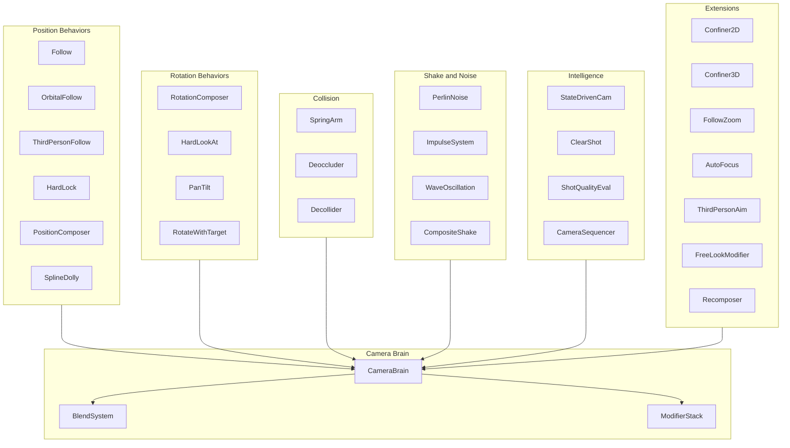
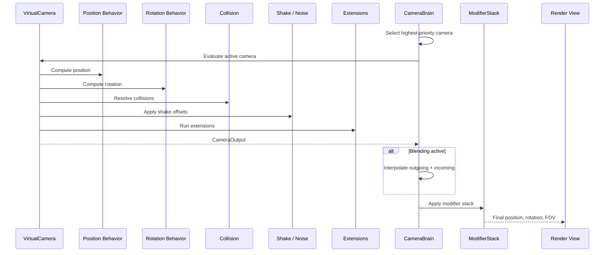
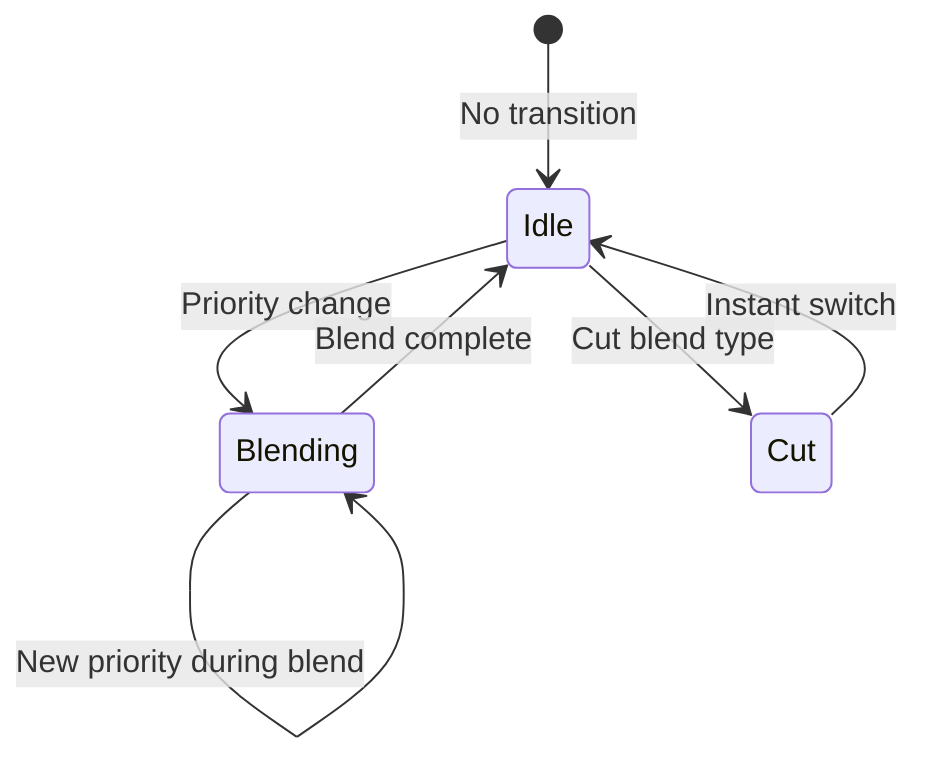
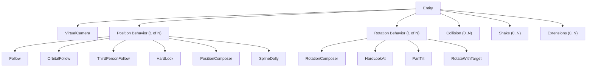

# Camera System Design

## Requirements Trace

> **Canonical sources:** Features, requirements, and user
> stories are defined in [features/game-framework/](../../features/game-framework/),
> [requirements/game-framework/](../../requirements/game-framework/), and
> [user-stories/game-framework/](../../user-stories/game-framework/). The table
> below traces design elements to those definitions.

### Virtual Camera Framework

| Feature | Requirement | Description |
|---------|-------------|-------------|
| F-13.25.1 | R-13.25.1 | Virtual camera entity with priority selection |
| F-13.25.2 | R-13.25.2 | Camera brain and output controller |

### Position Control

| Feature | Requirement | Description |
|---------|-------------|-------------|
| F-13.25.3 | R-13.25.3 | Follow with 6 binding modes |
| F-13.25.4 | R-13.25.4 | Orbital follow (sphere / three-ring) |
| F-13.25.5 | R-13.25.5 | Third-person follow with shoulder offset |
| F-13.25.6 | R-13.25.6 | Hard lock to target |
| F-13.25.7 | R-13.25.7 | Position composer (adaptive framing) |
| F-13.25.8 | R-13.25.8 | Spline dolly |

### Rotation Control

| Feature | Requirement | Description |
|---------|-------------|-------------|
| F-13.25.9 | R-13.25.9 | Rotation composer (adaptive aim) |
| F-13.25.10 | R-13.25.10 | Hard look-at |
| F-13.25.11 | R-13.25.11 | Pan and tilt (input-driven rotation) |
| F-13.25.12 | R-13.25.12 | Rotate with follow target |

### Spring Arm and Collision

| Feature | Requirement | Description |
|---------|-------------|-------------|
| F-13.25.13 | R-13.25.13 | Spring arm with collision retraction |
| F-13.25.14 | R-13.25.14 | Deoccluder (line-of-sight preservation) |
| F-13.25.15 | R-13.25.15 | Decollider (geometry penetration prevention) |

### Blending and Transitions

| Feature | Requirement | Description |
|---------|-------------|-------------|
| F-13.25.16 | R-13.25.16 | 8-curve blend system with custom blend assets |
| F-13.25.17 | R-13.25.17 | Weighted multi-camera mixing (up to 8) |

### Shake and Noise

| Feature | Requirement | Description |
|---------|-------------|-------------|
| F-13.25.18 | R-13.25.18 | Multi-channel Perlin noise profiles |
| F-13.25.19 | R-13.25.19 | Impulse system (event-driven shake) |
| F-13.25.20 | R-13.25.20 | Wave oscillation shake |
| F-13.25.21 | R-13.25.21 | Composite shake patterns |
| F-13.25.22 | R-13.25.22 | Sequencer-driven camera shake |

### Camera Intelligence

| Feature | Requirement | Description |
|---------|-------------|-------------|
| F-13.25.23 | R-13.25.23 | State-driven camera switching |
| F-13.25.24 | R-13.25.24 | Clear shot (automatic best-camera) |
| F-13.25.25 | R-13.25.25 | Shot quality evaluator |
| F-13.25.26 | R-13.25.26 | Camera sequencer (timed playlist) |

### Group and Multi-Target

| Feature | Requirement | Description |
|---------|-------------|-------------|
| F-13.25.27 | R-13.25.27 | Target group aggregation |
| F-13.25.28 | R-13.25.28 | Group framing extension |

### Extensions

| Feature | Requirement | Description |
|---------|-------------|-------------|
| F-13.25.29 | R-13.25.29 | Camera confiner 2D |
| F-13.25.30 | R-13.25.30 | Camera confiner 3D |
| F-13.25.31 | R-13.25.31 | Follow zoom (constant screen-size) |
| F-13.25.32 | R-13.25.32 | Auto focus |
| F-13.25.33 | R-13.25.33 | Third-person aim (parallax correction) |
| F-13.25.34 | R-13.25.34 | FreeLook modifier |
| F-13.25.35 | R-13.25.35 | Recomposer (timeline override) |
| F-13.25.36 | R-13.25.36 | Camera modifier stack |

### Input and Cinematic

| Feature | Requirement | Description |
|---------|-------------|-------------|
| F-13.25.37 | R-13.25.37 | Camera input axis controller |
| F-13.25.38 | R-13.25.38 | Cine camera (physical lens) |
| F-13.25.39 | R-13.25.39 | Camera rig presets (dolly, crane, jib) |
| F-13.25.40 | R-13.25.40 | Picture-in-Picture |

## Overview

The camera system is a data-driven virtual camera
framework modeled after Unity CineMachine and UE5
Gameplay Cameras. Each camera behavior is an ECS
entity. A per-player Camera Brain selects the
highest-priority camera and drives the rendered view.

Key design principles:

1. **Composition over monolith.** Position control,
   rotation control, collision, shake, and extensions
   are separate components on the same entity. Mix
   and match to build any camera style.
2. **Priority-based selection.** Multiple virtual
   cameras coexist. The brain activates the highest
   priority. Priority changes at runtime from gameplay
   events (trigger volumes, combat, mounts).
3. **Smooth blending.** Eight blend curve types with
   per-camera-pair custom blend assets. Sub-frame
   interpolation prevents discontinuities.
4. **No-code authoring.** All camera parameters are
   editable in the visual editor. Camera behaviors are
   configured by adding/removing components.
5. **Split-screen native.** Multiple brains coexist
   with independent channel masks.

## Architecture

### Module Boundaries



```
harmonius_game/
├── camera/
│   ├── brain.rs          # CameraBrain, channel
│   │                     # selection, output
│   ├── virtual.rs        # VirtualCamera,
│   │                     # CameraOutput
│   ├── blend.rs          # BlendSystem,
│   │                     # BlendCurve, custom
│   │                     # blend assets
│   ├── mixer.rs          # CameraMixer (weighted)
│   ├── modifier.rs       # ModifierStack, built-in
│   │                     # modifiers
│   ├── input.rs          # CameraInputAxisController
│   ├── position/
│   │   ├── follow.rs     # Follow (6 binding modes)
│   │   ├── orbital.rs    # OrbitalFollow
│   │   ├── third_person.rs # ThirdPersonFollow
│   │   ├── hard_lock.rs  # HardLockToTarget
│   │   ├── composer.rs   # PositionComposer
│   │   └── spline.rs     # SplineDolly
│   ├── rotation/
│   │   ├── composer.rs   # RotationComposer
│   │   ├── hard_look.rs  # HardLookAt
│   │   ├── pan_tilt.rs   # PanTilt
│   │   └── rotate_with.rs # RotateWithTarget
│   ├── collision/
│   │   ├── spring_arm.rs # SpringArm
│   │   ├── deoccluder.rs # CameraDeoccluder
│   │   └── decollider.rs # CameraDecollider
│   ├── shake/
│   │   ├── perlin.rs     # PerlinNoiseProfile
│   │   ├── impulse.rs    # ImpulseSource,
│   │   │                 # ImpulseListener
│   │   ├── wave.rs       # WaveOscillation
│   │   ├── composite.rs  # CompositeShake
│   │   └── sequencer.rs  # SequencerShake
│   ├── intelligence/
│   │   ├── state_driven.rs # StateDrivenCamera
│   │   ├── clear_shot.rs # ClearShot,
│   │   │                 # ShotQualityEval
│   │   └── sequencer.rs  # CameraSequencer
│   ├── group/
│   │   ├── target.rs     # TargetGroup
│   │   └── framing.rs    # GroupFraming
│   ├── extensions/
│   │   ├── confiner_2d.rs # CameraConfiner2D
│   │   ├── confiner_3d.rs # CameraConfiner3D
│   │   ├── follow_zoom.rs # FollowZoom
│   │   ├── auto_focus.rs  # AutoFocus
│   │   ├── aim.rs        # ThirdPersonAim
│   │   ├── free_look.rs  # FreeLookModifier
│   │   └── recomposer.rs # Recomposer
│   └── cinematic/
│       ├── cine_camera.rs # CineCameraProperties
│       ├── rigs.rs       # DollyRig, CraneRig
│       └── pip.rs        # PictureInPicture
```

### Camera Evaluation Pipeline



### Blend System State Machine



### Camera Composition Model



## API Design

### Core Virtual Camera

```rust
/// Virtual camera component. Describes desired
/// camera behavior; does not render independently.
#[derive(Component, Reflect)]
pub struct VirtualCamera {
    /// Numeric priority. Higher wins.
    pub priority: i32,
    /// Output channel mask for brain matching.
    pub channel_mask: u32,
    /// Entity to track for position behaviors.
    pub tracking_target: Option<Entity>,
    /// Entity to aim at for rotation behaviors.
    pub look_at_target: Option<Entity>,
}

/// Computed output from virtual camera evaluation.
#[derive(Clone, Debug, Default)]
pub struct CameraOutput {
    pub position: Vec3,
    pub rotation: Quat,
    pub fov: f32,
    pub near_clip: f32,
    pub far_clip: f32,
    pub focus_distance: f32,
}
```

### Camera Brain

```rust
/// Per-player camera brain that selects the active
/// camera and drives the rendered view.
#[derive(Component, Reflect)]
pub struct CameraBrain {
    /// Channel mask to filter virtual cameras.
    pub channel_mask: u32,
    /// Update timing mode.
    pub update_mode: CameraUpdateMode,
    /// Default blend when no custom blend matches.
    pub default_blend: BlendDefinition,
    /// Custom per-camera-pair blend rules.
    pub custom_blends: Option<Handle<CustomBlends>>,
}

#[derive(Clone, Copy, Debug, PartialEq, Eq, Reflect)]
pub enum CameraUpdateMode {
    /// After all systems, before render.
    LateUpdate,
    /// Synchronized with physics fixed timestep.
    FixedUpdate,
    /// Driven externally (replay, sequencer).
    Manual,
}
```

### Position Behaviors

```rust
/// Follow with fixed offset and 6 binding modes.
#[derive(Component, Reflect)]
pub struct Follow {
    /// Offset from tracking target.
    pub offset: Vec3,
    /// How offset relates to target rotation.
    pub binding_mode: FollowBindingMode,
    /// Per-axis position damping (seconds).
    pub position_damping: Vec3,
    /// Angular damping (seconds).
    pub angular_damping: f32,
}

#[derive(Clone, Copy, Debug, PartialEq, Eq, Reflect)]
pub enum FollowBindingMode {
    WorldSpace,
    LockToTarget,
    LockToTargetNoRoll,
    LockWithWorldUp,
    LockOnAssign,
    LazyFollow,
}

/// Orbital follow on sphere or three-ring surface.
#[derive(Component, Reflect)]
pub struct OrbitalFollow {
    /// Orbit mode.
    pub mode: OrbitMode,
    /// Horizontal axis range (degrees).
    pub horizontal_range: (f32, f32),
    /// Vertical axis range (degrees).
    pub vertical_range: (f32, f32),
    /// Horizontal axis wraps.
    pub horizontal_wrap: bool,
    /// Auto-recentering config.
    pub recenter: Option<RecenterConfig>,
    /// Offset from target to orbit center.
    pub target_offset: Vec3,
}

#[derive(Clone, Debug, Reflect)]
pub enum OrbitMode {
    /// Single radius sphere.
    Sphere { radius: f32 },
    /// Three configurable orbit radii forming a
    /// spline surface.
    ThreeRing {
        top_radius: f32,
        middle_radius: f32,
        bottom_radius: f32,
    },
}

#[derive(Clone, Debug, Reflect)]
pub struct RecenterConfig {
    /// Seconds of idle before recentering starts.
    pub wait_time: f32,
    /// Seconds to complete recentering.
    pub completion_time: f32,
}

/// Third-person follow with four-pivot rig.
#[derive(Component, Reflect)]
pub struct ThirdPersonFollow {
    /// Lateral shoulder offset.
    pub shoulder_offset: Vec3,
    /// Vertical arm length.
    pub vertical_arm_length: f32,
    /// 0.0 = left shoulder, 1.0 = right shoulder.
    pub camera_side: f32,
    /// Minimum distance from obstacles.
    pub camera_radius: f32,
    /// Damping when moving into collision.
    pub collision_damping: f32,
    /// Damping when recovering from collision.
    pub recovery_damping: f32,
    /// Collision layer mask.
    pub collision_layers: LayerMask,
}

/// Copies target position directly. Zero latency.
#[derive(Component, Reflect)]
pub struct HardLockToTarget;

/// Adaptive framing with dead/soft/hard zones.
#[derive(Component, Reflect)]
pub struct PositionComposer {
    /// Screen-space dead zone (no movement).
    pub dead_zone: Rect,
    /// Screen-space soft zone (damped movement).
    pub soft_zone: Rect,
    /// Screen-space target position [0,1].
    pub screen_position: Vec2,
    /// Lookahead time (seconds).
    pub lookahead_time: f32,
    /// Lookahead smoothing (seconds).
    pub lookahead_smoothing: f32,
    /// Position damping.
    pub damping: Vec3,
}

/// Camera constrained to a spline path.
#[derive(Component, Reflect)]
pub struct SplineDolly {
    /// Handle to the spline asset.
    pub spline: Handle<SplineAsset>,
    /// Position unit mode.
    pub position_mode: SplinePositionMode,
    /// Automatic dolly behavior.
    pub auto_dolly: AutoDollyMode,
    /// Rotation behavior.
    pub rotation_mode: SplineRotationMode,
    /// Position damping along spline.
    pub damping: f32,
}

#[derive(Clone, Copy, Debug, PartialEq, Eq, Reflect)]
pub enum SplinePositionMode {
    KnotIndex,
    Distance,
    Normalized,
}

#[derive(Clone, Copy, Debug, PartialEq, Eq, Reflect)]
pub enum AutoDollyMode {
    None,
    FixedSpeed { speed: f32 },
    NearestToTarget,
}

#[derive(Clone, Copy, Debug, PartialEq, Eq, Reflect)]
pub enum SplineRotationMode {
    Default,
    FollowTangent,
    FollowTangentNoRoll,
    MatchTarget,
    MatchTargetNoRoll,
}
```

### Rotation Behaviors

```rust
/// Adaptive aim with screen-space composition.
#[derive(Component, Reflect)]
pub struct RotationComposer {
    /// Offset in target-local space.
    pub target_offset: Vec3,
    /// Screen-space target position.
    pub screen_position: Vec2,
    /// Dead zone, soft zone.
    pub dead_zone: Rect,
    pub soft_zone: Rect,
    /// Rotational damping (seconds).
    pub damping: f32,
    /// Lookahead time (seconds).
    pub lookahead_time: f32,
}

/// Rigid aim at look-at target. No damping.
#[derive(Component, Reflect)]
pub struct HardLookAt;

/// Input-driven pan and tilt rotation.
#[derive(Component, Reflect)]
pub struct PanTilt {
    /// Reference frame for rotation.
    pub reference_frame: PanTiltReference,
    /// Horizontal range (degrees).
    pub pan_range: (f32, f32),
    /// Horizontal wrap.
    pub pan_wrap: bool,
    /// Vertical clamp (degrees). Always [-90, 90].
    pub tilt_clamp: (f32, f32),
    /// Auto-recentering config.
    pub recenter: Option<RecenterConfig>,
}

#[derive(Clone, Copy, Debug, PartialEq, Eq, Reflect)]
pub enum PanTiltReference {
    ParentObject,
    World,
    TrackingTarget,
    LookAtTarget,
}

/// Copies tracking target rotation to camera.
#[derive(Component, Reflect)]
pub struct RotateWithFollowTarget;
```

### Spring Arm and Collision

```rust
/// Spring arm that retracts on collision.
#[derive(Component, Reflect)]
pub struct SpringArm {
    /// Natural arm distance (meters).
    pub target_length: f32,
    /// Collision sphere radius (meters).
    pub probe_size: f32,
    /// Collision layer mask.
    pub probe_channel: LayerMask,
    /// Offset at arm end.
    pub socket_offset: Vec3,
    /// Offset at arm start.
    pub target_offset: Vec3,
    /// Position lag speed.
    pub position_lag_speed: f32,
    /// Rotation lag speed.
    pub rotation_lag_speed: f32,
    /// Per-axis rotation inheritance.
    pub inherit_pitch: bool,
    pub inherit_yaw: bool,
    pub inherit_roll: bool,
}

/// Line-of-sight preservation extension.
#[derive(Component, Reflect)]
pub struct CameraDeoccluder {
    /// Repositioning strategy.
    pub strategy: DeocclusionStrategy,
    /// Minimum distance from obstacles.
    pub camera_radius: f32,
    /// Normal damping speed.
    pub damping: f32,
    /// Damping when occluded (faster response).
    pub damping_when_occluded: f32,
    /// Ignore obstructions shorter than this
    /// (seconds).
    pub min_occlusion_time: f32,
    /// Layer mask for obstacle detection.
    pub obstacle_layers: LayerMask,
}

#[derive(Clone, Copy, Debug, PartialEq, Eq, Reflect)]
pub enum DeocclusionStrategy {
    PullForward,
    PreserveHeight,
    PreserveDistance,
}

/// Geometry penetration prevention.
#[derive(Component, Reflect)]
pub struct CameraDecollider {
    /// Minimum distance from geometry.
    pub camera_radius: f32,
    /// Obstacle layer mask.
    pub obstacle_layers: LayerMask,
    /// Terrain layer mask.
    pub terrain_layers: LayerMask,
    /// Recovery damping speed.
    pub damping: f32,
    /// Hold time to reduce jitter (seconds).
    pub smoothing_time: f32,
}
```

### Blending

```rust
/// Blend definition between two cameras.
#[derive(Clone, Debug, Reflect)]
pub struct BlendDefinition {
    /// Curve shape.
    pub curve: BlendCurve,
    /// Blend duration (seconds).
    pub duration: f32,
}

#[derive(Clone, Debug, Reflect)]
pub enum BlendCurve {
    Cut,
    EaseInOut,
    EaseIn,
    EaseOut,
    HardIn,
    HardOut,
    Linear,
    Custom { curve: Handle<AnimationCurve> },
}

/// Per-camera-pair custom blend rules.
#[derive(Asset, Reflect)]
pub struct CustomBlends {
    /// Ordered rules. First match wins.
    pub rules: Vec<BlendRule>,
}

#[derive(Clone, Debug, Reflect)]
pub struct BlendRule {
    /// Source camera name ("*" = wildcard).
    pub from: StringId,
    /// Destination camera name ("*" = wildcard).
    pub to: StringId,
    /// Blend to apply.
    pub blend: BlendDefinition,
}

/// Weighted multi-camera mixer (up to 8).
#[derive(Component, Reflect)]
pub struct CameraMixer {
    /// Child cameras and their weights.
    pub children: SmallVec<
        (Entity, f32),
        8,
    >,
}
```

### Shake and Noise

```rust
/// Multi-channel Perlin noise profile asset.
#[derive(Asset, Reflect)]
pub struct NoiseProfile {
    /// Per-channel noise curves.
    pub channels: [NoiseChannel; 6],
}

/// One axis of noise (pos X/Y/Z or rot P/Y/R).
#[derive(Clone, Debug, Reflect)]
pub struct NoiseChannel {
    /// Frequency (Hz).
    pub frequency: f32,
    /// Amplitude (world units or degrees).
    pub amplitude: f32,
}

/// Perlin noise shake on a virtual camera.
#[derive(Component, Reflect)]
pub struct PerlinNoiseShake {
    /// Noise profile asset.
    pub profile: Handle<NoiseProfile>,
    /// Amplitude multiplier (0 = muted).
    pub amplitude_gain: f32,
    /// Frequency multiplier.
    pub frequency_gain: f32,
    /// Pivot offset for position noise.
    pub pivot_offset: Vec3,
}

/// Impulse source that emits shake signals.
#[derive(Component, Reflect)]
pub struct ImpulseSource {
    /// Direction of the impulse.
    pub direction: Vec3,
    /// Strength over time curve.
    pub strength_curve: AnimationCurve,
    /// Total duration (seconds).
    pub duration: f32,
    /// Maximum propagation radius (meters).
    pub radius: f32,
}

/// Impulse listener on a virtual camera.
#[derive(Component, Reflect)]
pub struct ImpulseListener {
    /// Gain multiplier on received impulses.
    pub gain: f32,
    /// Maximum shake amplitude clamp.
    pub max_amplitude: f32,
}

/// Sinusoidal wave oscillation shake.
#[derive(Component, Reflect)]
pub struct WaveOscillation {
    /// Per-axis amplitude for position.
    pub position_amplitude: Vec3,
    /// Per-axis frequency for position (Hz).
    pub position_frequency: Vec3,
    /// Per-axis amplitude for rotation (degrees).
    pub rotation_amplitude: Vec3,
    /// Per-axis frequency for rotation (Hz).
    pub rotation_frequency: Vec3,
    /// FOV amplitude (degrees).
    pub fov_amplitude: f32,
    /// FOV frequency (Hz).
    pub fov_frequency: f32,
    /// Blend-in time (seconds).
    pub blend_in: f32,
    /// Blend-out time (seconds).
    pub blend_out: f32,
    /// Duration (None = infinite).
    pub duration: Option<f32>,
}

/// Composite shake layering multiple patterns.
#[derive(Component, Reflect)]
pub struct CompositeShake {
    /// Child shake entities contributing
    /// additively.
    pub layers: SmallVec<Entity, 4>,
}
```

### Camera Intelligence

```rust
/// State-driven camera switching.
#[derive(Component, Reflect)]
pub struct StateDrivenCamera {
    /// Target entity with animation state machine.
    pub state_source: Entity,
    /// State-to-camera mappings.
    pub mappings: Vec<StateCameraMapping>,
    /// Default blend between cameras.
    pub default_blend: BlendDefinition,
}

#[derive(Clone, Debug, Reflect)]
pub struct StateCameraMapping {
    /// Animation state name.
    pub state_name: StringId,
    /// Virtual camera entity to activate.
    pub camera: Entity,
    /// Delay before activation (seconds).
    pub wait_time: f32,
    /// Minimum active duration (seconds).
    pub min_duration: f32,
}

/// Clear shot: automatic best-camera selection.
#[derive(Component, Reflect)]
pub struct ClearShot {
    /// Child cameras to evaluate.
    pub children: Vec<Entity>,
    /// Delay before switching (seconds).
    pub activate_after: f32,
    /// Minimum time on each camera (seconds).
    pub min_duration: f32,
    /// Blend rules for transitions.
    pub blend: BlendDefinition,
}

/// Shot quality scorer for clear shot.
#[derive(Component, Reflect)]
pub struct ShotQualityEvaluator {
    /// Near distance limit.
    pub near_limit: f32,
    /// Far distance limit.
    pub far_limit: f32,
    /// Optimal distance for maximum score.
    pub optimal_distance: f32,
    /// Layer mask for occlusion raycasts.
    pub occlusion_layers: LayerMask,
}

/// Timed camera playlist.
#[derive(Component, Reflect)]
pub struct CameraSequencer {
    /// Ordered camera entries.
    pub entries: Vec<SequencerEntry>,
    /// Loop when reaching the end.
    pub loop_mode: bool,
}

#[derive(Clone, Debug, Reflect)]
pub struct SequencerEntry {
    /// Virtual camera entity.
    pub camera: Entity,
    /// Hold duration (seconds).
    pub hold_time: f32,
    /// Blend to next camera.
    pub blend: BlendDefinition,
}
```

### Target Group

```rust
/// Aggregates multiple targets into one virtual
/// target.
#[derive(Component, Reflect)]
pub struct TargetGroup {
    /// Group members.
    pub members: Vec<TargetGroupMember>,
    /// Position computation mode.
    pub position_mode: GroupPositionMode,
    /// Rotation mode.
    pub rotation_mode: GroupRotationMode,
}

#[derive(Clone, Debug, Reflect)]
pub struct TargetGroupMember {
    pub entity: Entity,
    pub weight: f32,
    pub radius: f32,
}

#[derive(Clone, Copy, Debug, PartialEq, Eq, Reflect)]
pub enum GroupPositionMode {
    /// AABB center of all members.
    BoundingBoxCenter,
    /// Weighted average of member positions.
    WeightedAverage,
}

#[derive(Clone, Copy, Debug, PartialEq, Eq, Reflect)]
pub enum GroupRotationMode {
    Manual,
    GroupAverage,
}

/// Adjusts zoom/position to frame all group
/// members.
#[derive(Component, Reflect)]
pub struct GroupFraming {
    /// Framing axis mode.
    pub framing_mode: FramingMode,
    /// How to adjust size.
    pub size_adjustment: SizeAdjustment,
    /// Target screen-space occupancy [0, 1].
    pub framing_size: f32,
    /// Minimum FOV (degrees).
    pub min_fov: f32,
    /// Maximum FOV (degrees).
    pub max_fov: f32,
    /// Damping.
    pub damping: f32,
}

#[derive(Clone, Copy, Debug, PartialEq, Eq, Reflect)]
pub enum FramingMode {
    Horizontal,
    Vertical,
    BestFit,
}

#[derive(Clone, Copy, Debug, PartialEq, Eq, Reflect)]
pub enum SizeAdjustment {
    ZoomOnly,
    DollyOnly,
    DollyThenZoom,
}
```

### Extensions

```rust
/// 2D polygon boundary confiner.
#[derive(Component, Reflect)]
pub struct CameraConfiner2D {
    /// Polygon boundary collider entity.
    pub bounding_shape: Entity,
    /// Corner transition damping.
    pub damping: f32,
    /// Deceleration zone width (meters).
    pub slowing_distance: f32,
}

/// 3D volume boundary confiner.
#[derive(Component, Reflect)]
pub struct CameraConfiner3D {
    /// Bounding volume entity.
    pub bounding_volume: Entity,
    /// Deceleration zone (meters).
    pub slowing_distance: f32,
}

/// Dynamic FOV to maintain constant screen size.
#[derive(Component, Reflect)]
pub struct FollowZoom {
    /// Target world-space width to maintain.
    pub target_width: f32,
    /// Zoom response damping.
    pub damping: f32,
    /// Minimum FOV (degrees).
    pub min_fov: f32,
    /// Maximum FOV (degrees).
    pub max_fov: f32,
}

/// Focus distance control for depth of field.
#[derive(Component, Reflect)]
pub struct AutoFocus {
    /// Focus target mode.
    pub mode: AutoFocusMode,
    /// Depth offset from target (meters).
    pub focus_offset: f32,
    /// Focus transition damping.
    pub damping: f32,
}

#[derive(Clone, Copy, Debug, PartialEq, Eq, Reflect)]
pub enum AutoFocusMode {
    LookAtTarget,
    FollowTarget,
    CustomTarget { entity: Entity },
    CameraRelative { distance: f32 },
    ScreenCenter,
}

/// Third-person aim parallax correction.
#[derive(Component, Reflect)]
pub struct ThirdPersonAim {
    /// Maximum ray distance for aim detection.
    pub max_distance: f32,
    /// Layer mask for aim raycasts.
    pub aim_layers: LayerMask,
    /// Cancel rotational noise for aim stability.
    pub noise_cancellation: bool,
}

/// Camera input bridge component.
#[derive(Component, Reflect)]
pub struct CameraInputAxisController {
    /// Player index for input routing.
    pub player_index: u32,
    /// Acceleration time (seconds).
    pub acceleration_time: f32,
    /// Deceleration time (seconds).
    pub deceleration_time: f32,
    /// Gain multiplier.
    pub gain: f32,
    /// Suppress input during blending.
    pub suppress_during_blend: bool,
    /// Use unscaled delta time (for paused state).
    pub use_unscaled_time: bool,
}

/// Physical camera simulation.
#[derive(Component, Reflect)]
pub struct CineCameraProperties {
    /// Sensor size (mm).
    pub sensor_size: Vec2,
    /// Focal length (mm).
    pub focal_length: f32,
    /// Aperture (f-stop).
    pub aperture: f32,
    /// Focus distance (meters).
    pub focus_distance: f32,
}

/// Modifier stack for post-brain adjustments.
#[derive(Component, Reflect)]
pub struct CameraModifierStack {
    /// Ordered modifiers by priority.
    pub modifiers: Vec<CameraModifierEntry>,
}

#[derive(Clone, Debug, Reflect)]
pub struct CameraModifierEntry {
    /// Execution priority (lower = first).
    pub priority: i32,
    /// Modifier type.
    pub modifier: CameraModifierType,
}

#[derive(Clone, Debug, Reflect)]
pub enum CameraModifierType {
    /// Override FOV with smooth transition.
    FovOverride {
        target_fov: f32,
        blend_speed: f32,
    },
    /// Blend post-process profile.
    PostProcessBlend {
        profile: Handle<PostProcessProfile>,
        weight: f32,
    },
    /// Lens effects (vignette, grain).
    LensEffect {
        vignette_intensity: f32,
        grain_intensity: f32,
    },
}
```

### ECS Systems

```rust
/// Core camera evaluation system. Runs position,
/// rotation, collision, shake, and extensions for
/// each active virtual camera. Writes CameraOutput.
pub struct CameraEvaluationSystem;

/// Brain system: selects highest-priority camera
/// per channel, manages blending, applies modifier
/// stack, and writes the final render view.
pub struct CameraBrainSystem;

/// Impulse propagation: distributes impulse source
/// signals to impulse listeners with distance
/// attenuation.
pub struct ImpulseDispatchSystem;

/// State-driven switching: monitors animation state
/// changes and activates mapped cameras.
pub struct StateDrivenSwitchSystem;

/// Clear shot evaluation: scores child cameras and
/// activates the best one.
pub struct ClearShotSystem;

/// Camera sequencer: advances through the playlist
/// based on hold timers.
pub struct CameraSequencerSystem;

/// Group framing: computes FOV and position
/// adjustments to frame all group members.
pub struct GroupFramingSystem;
```

## Data Flow

### Per-Frame Camera Pipeline

Each frame the camera pipeline executes:

1. **CameraEvaluationSystem** runs for each entity
   with `VirtualCamera`. For each:
   - Position behavior computes world position
   - Rotation behavior computes world rotation
   - Collision (spring arm, deoccluder, decollider)
     adjusts position
   - Shake offsets are applied
   - Extensions (confiners, follow zoom, auto focus)
     post-process the output
   - The result is written to `CameraOutput`
2. **Intelligence systems** (state-driven, clear shot,
   sequencer) may change camera priorities based on
   gameplay state.
3. **CameraBrainSystem** runs for each `CameraBrain`:
   - Queries all `VirtualCamera` entities matching the
     brain's channel mask
   - Selects the highest-priority camera
   - If the active camera changed, starts a blend
     using custom blend rules or the default blend
   - Interpolates position, rotation, FOV, and
     post-process between outgoing and incoming
     cameras using the blend curve
   - Applies the modifier stack
   - Writes the final render view
4. **ImpulseDispatchSystem** propagates impulse source
   events to listeners with distance attenuation.

### Blend Interpolation

```rust
// Pseudocode for camera blend evaluation.
fn blend_cameras(
    outgoing: &CameraOutput,
    incoming: &CameraOutput,
    t: f32,           // normalized blend progress
    curve: &BlendCurve,
) -> CameraOutput {
    let alpha = evaluate_curve(curve, t);
    CameraOutput {
        position: outgoing.position.lerp(
            incoming.position, alpha,
        ),
        rotation: outgoing.rotation.slerp(
            incoming.rotation, alpha,
        ),
        fov: lerp(outgoing.fov, incoming.fov, alpha),
        near_clip: lerp(
            outgoing.near_clip,
            incoming.near_clip,
            alpha,
        ),
        far_clip: lerp(
            outgoing.far_clip,
            incoming.far_clip,
            alpha,
        ),
        focus_distance: lerp(
            outgoing.focus_distance,
            incoming.focus_distance,
            alpha,
        ),
    }
}
```

### Split-Screen

Multiple `CameraBrain` entities coexist, each with a
different `channel_mask`. Virtual cameras belong to
channels via their own mask. Each brain independently
selects, blends, and outputs to its assigned viewport.

```rust
// Example: 2-player split-screen setup.
// Player 1 brain: channel_mask = 0x01
// Player 2 brain: channel_mask = 0x02
// Shared cinematic camera: channel_mask = 0x03
//   (visible to both brains)
```

## Platform Considerations

### Performance Budget

| Metric | Target | Source |
|--------|--------|--------|
| Total camera processing per brain | < 1 ms | NFR-13.25.1 |
| 4-brain split-screen total | < 4 ms | NFR-13.25.1 |
| Blend position discontinuity | < 0.01 units | NFR-13.25.2 |
| Blend rotation discontinuity | < 0.1 degrees | NFR-13.25.2 |

### Platform-Specific Notes

- **All platforms:** Camera evaluation is
  single-threaded per brain. Multiple brains can
  evaluate in parallel on the thread pool.
- **Mobile:** PiP limited to one viewport at quarter
  resolution.
- **Desktop:** Multiple PiP viewports at configurable
  resolution.
- **Networking:** Camera state is client-only. Only
  the tracking target entity positions are replicated.
  Virtual camera evaluation runs entirely on the
  client.
- **No-code:** All camera components are exposed to
  the visual editor. Designers create cameras by
  adding components to entities. Camera presets
  (third-person action, top-down RPG, side-scroller)
  are available as entity templates.

### Proposed Dependencies

No new external dependencies. Uses existing engine
modules:

| Module | Usage |
|--------|-------|
| `harmonius_core::ecs` | Components, systems, queries |
| `harmonius_core::spatial` | Raycasts, sphere sweeps |
| `harmonius_physics` | Collision layers, collision queries |
| `harmonius_animation` | State machine monitoring |
| `harmonius_rendering` | View setup, post-processing |
| `harmonius_input` | Input action system |

## Test Plan

### Unit Tests

| Test | Req | Description |
|------|-----|-------------|
| `test_priority_selection` | R-13.25.1 | 3 cameras (priority 1, 5, 10); brain selects 10. Change 10 to 0; brain selects 5. |
| `test_channel_mask_filter` | R-13.25.2 | 2 brains, 2 channels; each sees only its cameras. |
| `test_fixed_update_timing` | R-13.25.2 | Fixed-update brain syncs with physics timestep. |
| `test_follow_6_binding_modes` | R-13.25.3 | Rotate target 90 deg; verify offset transforms per mode. |
| `test_follow_damping` | R-13.25.3 | Damping smooths position over multiple frames. |
| `test_orbital_sphere_mode` | R-13.25.4 | Input axes rotate camera at configured radius. |
| `test_orbital_three_ring` | R-13.25.4 | Camera follows spline surface from three radii. |
| `test_orbital_recentering` | R-13.25.4 | Recentering activates after configured wait time. |
| `test_third_person_shoulder_blend` | R-13.25.5 | Blend camera_side from 0 to 1; smooth transition. |
| `test_third_person_collision` | R-13.25.5 | Obstacle between camera and target; camera retracts. |
| `test_hard_lock_zero_offset` | R-13.25.6 | Camera matches target position exactly each frame. |
| `test_position_composer_dead_zone` | R-13.25.7 | Target in dead zone; zero camera movement. |
| `test_position_composer_hard_limit` | R-13.25.7 | Target at hard limit; immediate correction. |
| `test_spline_dolly_fixed_speed` | R-13.25.8 | Camera traverses spline at constant velocity. |
| `test_spline_dolly_nearest` | R-13.25.8 | Camera tracks closest spline point to target. |
| `test_rotation_composer_dead_zone` | R-13.25.9 | Look-at in dead zone; no rotation change. |
| `test_rotation_only` | R-13.25.9 | Position unchanged throughout rotation changes. |
| `test_hard_look_at_centered` | R-13.25.10 | Target centered in frame at all positions. |
| `test_pan_tilt_clamp` | R-13.25.11 | Vertical tilt clamps at 90 degrees. |
| `test_pan_tilt_recentering` | R-13.25.11 | Recentering after configured wait time. |
| `test_rotate_with_target` | R-13.25.12 | Camera rotation matches target each frame. |
| `test_spring_arm_retraction` | R-13.25.13 | Obstacle at 3 m on 5 m arm; camera at 3 m. |
| `test_spring_arm_extension` | R-13.25.13 | Remove obstacle; camera extends to 5 m. |
| `test_spring_arm_rotation_inherit` | R-13.25.13 | Per-axis pitch/yaw/roll inheritance. |
| `test_deoccluder_pull_forward` | R-13.25.14 | Obstacle between camera and target; camera pulls forward. |
| `test_deoccluder_min_time` | R-13.25.14 | Brief obstruction below min time ignored. |
| `test_decollider_terrain` | R-13.25.15 | Camera below terrain; pushed above surface. |
| `test_decollider_smoothing` | R-13.25.15 | Smoothing time holds position to reduce jitter. |
| `test_blend_8_curves` | R-13.25.16 | All 8 blend types produce distinct curves. |
| `test_blend_custom_pair` | R-13.25.16 | Custom pair rule overrides wildcard. |
| `test_mixer_weighted_average` | R-13.25.17 | 3 cameras (weights 1,2,1); output is weighted average. |
| `test_mixer_zero_weight` | R-13.25.17 | Zero-weighted camera contributes nothing. |
| `test_perlin_mute` | R-13.25.18 | Amplitude gain 0 produces zero output. |
| `test_perlin_frequency_gain` | R-13.25.18 | 2x frequency gain doubles oscillation rate. |
| `test_impulse_distance_attenuation` | R-13.25.19 | Closer camera receives more shake. |
| `test_impulse_outside_radius` | R-13.25.19 | Camera beyond radius receives nothing. |
| `test_impulse_additive` | R-13.25.19 | Two impulses composite additively. |
| `test_wave_oscillation` | R-13.25.20 | 1 Hz sine; output oscillates correctly. |
| `test_wave_blend_in` | R-13.25.20 | Blend-in ramps amplitude from 0. |
| `test_composite_additive` | R-13.25.21 | Composite = sum of individual layers. |
| `test_state_driven_mapping` | R-13.25.23 | State change activates mapped camera. |
| `test_state_driven_wait_time` | R-13.25.23 | Transient state below wait time ignored. |
| `test_clear_shot_selection` | R-13.25.24 | Best-scoring camera selected. |
| `test_shot_quality_occlusion` | R-13.25.25 | Occluded camera scores lower. |
| `test_sequencer_playlist` | R-13.25.26 | 3 cameras play in order with hold durations. |
| `test_sequencer_loop` | R-13.25.26 | Loop mode restarts sequence. |
| `test_target_group_bbox` | R-13.25.27 | Group center equals AABB center. |
| `test_target_group_weighted` | R-13.25.27 | Weighted average respects member weights. |
| `test_group_framing_spread` | R-13.25.28 | Members spread apart; FOV widens. |
| `test_confiner_2d_boundary` | R-13.25.29 | Camera cannot show outside polygon. |
| `test_confiner_3d_slowing` | R-13.25.30 | Slowing distance creates deceleration. |
| `test_follow_zoom_fov_adjust` | R-13.25.31 | Target at 50 m; FOV adjusts to maintain size. |
| `test_auto_focus_tracking` | R-13.25.32 | Focus distance tracks look-at target distance. |
| `test_third_person_aim_parallax` | R-13.25.33 | Hit point matches crosshair, not weapon ray. |
| `test_modifier_stack_order` | R-13.25.36 | Modifiers execute in priority order. |
| `test_input_frame_independence` | R-13.25.37 | Same input at 30 fps and 120 fps; same result. |
| `test_input_blend_suppression` | R-13.25.37 | Input suppressed during active blend. |
| `test_cine_camera_fov` | R-13.25.38 | Super 35 + 50 mm = expected vertical FOV. |

### Integration Tests

| Test | Req | Description |
|------|-----|-------------|
| `test_split_screen_4_brains` | NFR-13.25.1 | 4 brains with cameras, blending, and collision; < 4 ms total. |
| `test_blend_smoothness_30fps` | NFR-13.25.2 | 1-second blend at 30 fps; no position jump > 0.01. |
| `test_blend_smoothness_120fps` | NFR-13.25.2 | 1-second blend at 120 fps; no rotation jump > 0.1 deg. |
| `test_pip_multiple_viewports` | R-13.25.40 | 2 PiP viewports render simultaneously on desktop. |
| `test_pip_mobile_quarter_res` | R-13.25.40 | Mobile PiP at quarter resolution. |

### Benchmarks

| Benchmark | Target | Source |
|-----------|--------|--------|
| Camera evaluation per brain | < 1 ms | NFR-13.25.1 |
| 4-brain split-screen | < 4 ms | NFR-13.25.1 |
| Blend position delta | < 0.01 units | NFR-13.25.2 |
| Blend rotation delta | < 0.1 degrees | NFR-13.25.2 |
| Impulse dispatch (10 sources, 4 listeners) | < 0.1 ms | R-13.25.19 |
| Group framing (8 members) | < 0.2 ms | R-13.25.28 |

## Open Questions

1. **Camera-per-entity limit.** Should an entity have
   at most one position behavior and one rotation
   behavior, or should multiple be supported with a
   priority override? Multiple adds flexibility but
   complicates evaluation order.
2. **Blend curve interpolation.** Quaternion slerp
   produces the shortest-arc rotation blend. Should
   we support squad (spherical cubic interpolation)
   for multi-waypoint blends with smoother curvature?
3. **Impulse signal filtering.** Impulse listeners
   have a gain multiplier. Should they also support
   frequency filtering (low-pass, high-pass) to allow
   cameras to respond only to certain shake
   frequencies?
4. **Camera persistence across level loads.** Should
   virtual camera entities persist across level
   transitions, or be destroyed and recreated? Cinematic
   cameras may need to survive transitions; gameplay
   cameras may not.
5. **Editor camera preview.** The no-code editor needs
   a live preview of each virtual camera's output.
   Should the editor render thumbnails per camera, or
   cycle through a full-viewport preview? Thumbnails
   add rendering cost but provide at-a-glance
   comparison.
6. **VR stereo cameras.** VR requires two cameras with
   IPD offset. Should VR be a modifier on the brain,
   or a special dual-output brain variant? VR-specific
   timing constraints (must match HMD refresh rate)
   also affect update mode.
