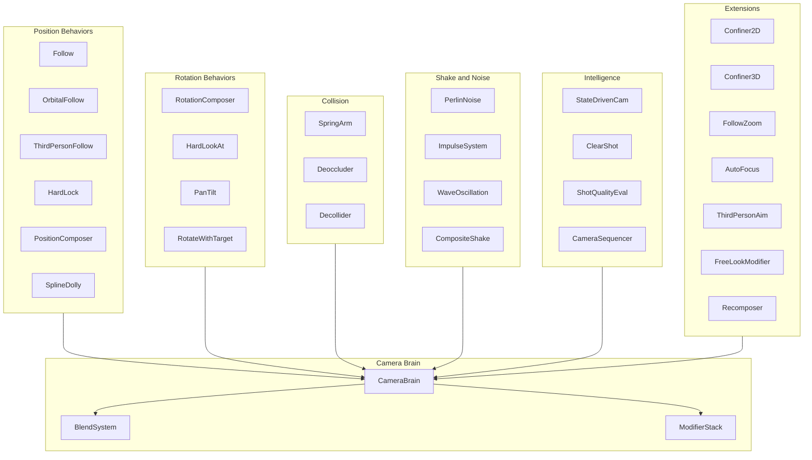
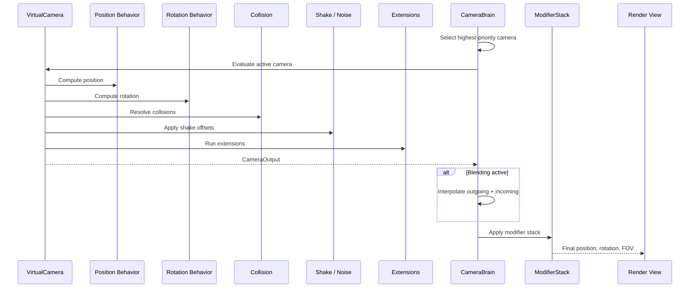
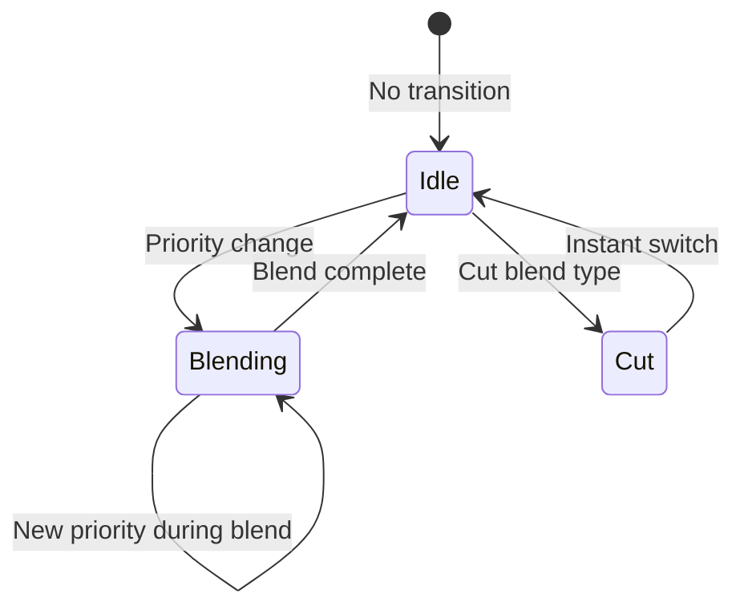
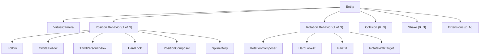
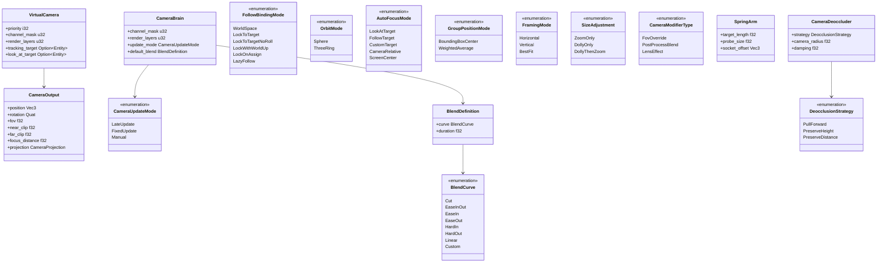

# Camera System Design

## Requirements Trace

> **Canonical sources:** Features, requirements, and user stories are defined in
> [features/game-framework/](../../features/), [requirements/game-framework/](../../requirements/),
> and [user-stories/game-framework/](../../user-stories/). The table below traces design elements to
> those definitions.
>
> **Scope split:** Rendering-specific camera features (spring-arm physics retraction, cine camera
> physical lens, picture-in-picture composition, and camera sequencer) live in
> [../rendering/camera-rendering.md](../rendering/camera-rendering.md). This document owns the
> VirtualCamera brain, priority selection, blend system, composer, and the gameplay-facing entry
> points. `Entity` stability across save/load, hot-reload, and network boundaries follows
> [../core-runtime/ids.md](../core-runtime/ids.md). No async anywhere — all systems are synchronous
> ECS phases per [../constraints.md](../constraints.md).

### Virtual Camera Framework

| Feature   | Requirement |
|-----------|-------------|
| F-13.25.1 | R-13.25.1   |
| F-13.25.2 | R-13.25.2   |

1. **F-13.25.1** — Virtual camera entity with priority selection
2. **F-13.25.2** — Camera brain and output controller

### Position Control

| Feature   | Requirement |
|-----------|-------------|
| F-13.25.3 | R-13.25.3   |
| F-13.25.4 | R-13.25.4   |
| F-13.25.5 | R-13.25.5   |
| F-13.25.6 | R-13.25.6   |
| F-13.25.7 | R-13.25.7   |
| F-13.25.8 | R-13.25.8   |

1. **F-13.25.3** — Follow with 6 binding modes
2. **F-13.25.4** — Orbital follow (sphere / three-ring)
3. **F-13.25.5** — Third-person follow with shoulder offset
4. **F-13.25.6** — Hard lock to target
5. **F-13.25.7** — Position composer (adaptive framing)
6. **F-13.25.8** — Spline dolly

### Rotation Control

| Feature    | Requirement |
|------------|-------------|
| F-13.25.9  | R-13.25.9   |
| F-13.25.10 | R-13.25.10  |
| F-13.25.11 | R-13.25.11  |
| F-13.25.12 | R-13.25.12  |

1. **F-13.25.9** — Rotation composer (adaptive aim)
2. **F-13.25.10** — Hard look-at
3. **F-13.25.11** — Pan and tilt (input-driven rotation)
4. **F-13.25.12** — Rotate with follow target

### Spring Arm and Collision

Spring-arm physics retraction (F-13.25.13), deoccluder (F-13.25.14), and decollider (F-13.25.15) are
rendering-facing concerns and live in
[../rendering/camera-rendering.md](../rendering/camera-rendering.md).

### Blending and Transitions

| Feature    | Requirement |
|------------|-------------|
| F-13.25.16 | R-13.25.16  |
| F-13.25.17 | R-13.25.17  |

1. **F-13.25.16** — 8-curve blend system with custom blend assets
2. **F-13.25.17** — Weighted multi-camera mixing (up to 8)

### Shake and Noise

| Feature    | Requirement |
|------------|-------------|
| F-13.25.18 | R-13.25.18  |
| F-13.25.19 | R-13.25.19  |
| F-13.25.20 | R-13.25.20  |
| F-13.25.21 | R-13.25.21  |
| F-13.25.22 | R-13.25.22  |

1. **F-13.25.18** — Multi-channel Perlin noise profiles
2. **F-13.25.19** — Impulse system (event-driven shake)
3. **F-13.25.20** — Wave oscillation shake
4. **F-13.25.21** — Composite shake patterns
5. **F-13.25.22** — Cinematics-Editor-driven camera shake

### Camera Intelligence

| Feature    | Requirement |
|------------|-------------|
| F-13.25.23 | R-13.25.23  |
| F-13.25.24 | R-13.25.24  |
| F-13.25.25 | R-13.25.25  |

1. **F-13.25.23** — State-driven camera switching
2. **F-13.25.24** — Clear shot (automatic best-camera)
3. **F-13.25.25** — Shot quality evaluator

Camera sequencer (F-13.25.26, timed playlist) is a rendering-facing concern and lives in
[../rendering/camera-rendering.md](../rendering/camera-rendering.md).

### Group and Multi-Target

| Feature    | Requirement |
|------------|-------------|
| F-13.25.27 | R-13.25.27  |
| F-13.25.28 | R-13.25.28  |

1. **F-13.25.27** — Target group aggregation
2. **F-13.25.28** — Group framing extension

### Extensions

| Feature    | Requirement |
|------------|-------------|
| F-13.25.29 | R-13.25.29  |
| F-13.25.30 | R-13.25.30  |
| F-13.25.31 | R-13.25.31  |
| F-13.25.32 | R-13.25.32  |
| F-13.25.33 | R-13.25.33  |
| F-13.25.34 | R-13.25.34  |
| F-13.25.35 | R-13.25.35  |
| F-13.25.36 | R-13.25.36  |

1. **F-13.25.29** — Camera confiner 2D
2. **F-13.25.30** — Camera confiner 3D
3. **F-13.25.31** — Follow zoom (constant screen-size)
4. **F-13.25.32** — Auto focus
5. **F-13.25.33** — Third-person aim (parallax correction)
6. **F-13.25.34** — FreeLook modifier
7. **F-13.25.35** — Recomposer (timeline override)
8. **F-13.25.36** — Camera modifier stack

### Input and Cinematic

| Feature    | Requirement |
|------------|-------------|
| F-13.25.37 | R-13.25.37  |
| F-13.25.38 | R-13.25.38  |
| F-13.25.39 | R-13.25.39  |
| F-13.25.40 | R-13.25.40  |

1. **F-13.25.37** — Camera input axis controller
2. **F-13.25.38** — Cine camera (physical lens)
3. **F-13.25.39** — Camera rig presets (dolly, crane, jib)
4. **F-13.25.40** — Picture-in-Picture

## Overview

The camera system is a data-driven virtual camera framework modeled after Unity CineMachine and UE5
Gameplay Cameras. Each camera behavior is an ECS entity. A per-player Camera Brain selects the
highest-priority camera and drives the rendered view.

Key design principles:

1. **Composition over monolith.** Position control, rotation control, collision, shake, and
   extensions are separate components on the same entity. Mix and match to build any camera style.
2. **Priority-based selection.** Multiple virtual cameras coexist. The brain activates the highest
   priority. Priority changes at runtime from gameplay events (trigger volumes, combat, mounts).
3. **Smooth blending.** Eight blend curve types with per-camera-pair custom blend assets. Sub-frame
   interpolation prevents discontinuities.
4. **No-code authoring.** All camera parameters are editable in the visual editor. Camera behaviors
   are configured by adding/removing components.
5. **Split-screen native.** Multiple brains coexist with independent channel masks.

## Architecture

### Module Boundaries



| File | Types defined |
|------|--------------|
| `camera/brain.rs` | `CameraBrain`, blend selection, output |
| `camera/virtual.rs` | `VirtualCamera`, `CameraOutput`, `CameraProjection` |
| `camera/blend.rs` | `BlendSystem`, `BlendCurve`, `CustomBlends` |
| `camera/mixer.rs` | `CameraMixer` |
| `camera/modifier.rs` | `CameraModifierStack`, `CameraModifierType` |
| `camera/input.rs` | `CameraInputAxisController` |
| `camera/vr.rs` | `VrCameraBrain`, `XrHeadPose`, `EyeTrackingInput`, `FoveationMap` |
| `camera/position/follow.rs` | `Follow`, `FollowBindingMode` |
| `camera/position/orbital.rs` | `OrbitalFollow`, `OrbitMode`, `RecenterConfig` |
| `camera/position/third_person.rs` | `ThirdPersonFollow` |
| `camera/position/hard_lock.rs` | `HardLockToTarget` |
| `camera/position/composer.rs` | `PositionComposer` |
| `camera/position/spline.rs` | `SplineDolly`, `SplinePositionMode`, `AutoDollyMode` |
| `camera/rotation/composer.rs` | `RotationComposer` |
| `camera/rotation/hard_look.rs` | `HardLookAt` |
| `camera/rotation/pan_tilt.rs` | `PanTilt`, `PanTiltReference` |
| `camera/rotation/rotate_with.rs` | `RotateWithFollowTarget` |
| `camera/collision/spring_arm.rs` | `SpringArm` |
| `camera/collision/deoccluder.rs` | `CameraDeoccluder`, `DeocclusionStrategy` |
| `camera/collision/decollider.rs` | `CameraDecollider` |
| `camera/shake/perlin.rs` | `PerlinNoiseShake`, `NoiseProfile`, `NoiseChannel` |
| `camera/shake/impulse.rs` | `ImpulseSource`, `ImpulseListener` |
| `camera/shake/wave.rs` | `WaveOscillation` |
| `camera/shake/composite.rs` | `CompositeShake` |
| `camera/intelligence/state_driven.rs` | `StateDrivenCamera`, `StateCameraMapping` |
| `camera/intelligence/clear_shot.rs` | `ClearShot`, `ShotQualityEvaluator` |
| `camera/intelligence/sequencer.rs` | `CameraSequencer`, `SequencerEntry` |
| `camera/group/target.rs` | `TargetGroup`, `TargetGroupMember` |
| `camera/group/framing.rs` | `GroupFraming`, `FramingMode`, `SizeAdjustment` |
| `camera/extensions/confiner_2d.rs` | `CameraConfiner2D` |
| `camera/extensions/confiner_3d.rs` | `CameraConfiner3D` |
| `camera/extensions/follow_zoom.rs` | `FollowZoom` |
| `camera/extensions/auto_focus.rs` | `AutoFocus`, `AutoFocusMode` |
| `camera/extensions/aim.rs` | `ThirdPersonAim` |
| `camera/extensions/free_look.rs` | `FreeLookModifier` |
| `camera/extensions/recomposer.rs` | `Recomposer` |
| `camera/cinematic/cine_camera.rs` | `CineCameraProperties` |
| `camera/cinematic/rigs.rs` | `DollyRig`, `CraneRig` |
| `camera/cinematic/pip.rs` | `PictureInPicture` |

### Camera Evaluation Pipeline



### Blend System State Machine



### Camera Composition Model



### Core Data Structures



## API Design

### Core Virtual Camera

```rust
/// Virtual camera component. Describes desired
/// camera behavior; does not render independently.
#[derive(Component)]
pub struct VirtualCamera {
    /// Numeric priority. Higher wins.
    pub priority: i32,
    /// Output channel mask for brain matching.
    pub channel_mask: u32,
    /// Render layer bitmask. Only renderable entities
    /// whose render_layers overlap this mask are
    /// visible to this camera. Enables split-screen
    /// per-player visibility, minimap-only layers,
    /// editor overlays, and PiP subsets. See
    /// constraints.md "Render layers" definition.
    pub render_layers: u32,
    /// Entity to track for position behaviors.
    pub tracking_target: Option<Entity>,
    /// Entity to aim at for rotation behaviors.
    pub look_at_target: Option<Entity>,
}

/// Projection mode for a camera.
///
/// Needed for isometric/RTS orthographic rendering,
/// editor viewports, and minimap cameras (RF-26).
#[derive(Clone, Debug)]
pub enum CameraProjection {
    /// Standard perspective projection.
    Perspective {
        /// Vertical field of view (degrees).
        fov: f32,
    },
    /// Orthographic projection (no perspective
    /// foreshortening).
    /// `size` = half-height of the view in world units.
    Orthographic { size: f32 },
}

/// Computed output from virtual camera evaluation.
#[derive(Clone, Debug)]
pub struct CameraOutput {
    pub position: Vec3,
    pub rotation: Quat,
    /// Active projection mode.
    pub projection: CameraProjection,
    pub near_clip: f32,
    pub far_clip: f32,
    pub focus_distance: f32,
}
```

### Camera Brain

```rust
/// Per-player camera brain that selects the active
/// camera and drives the rendered view.
#[derive(Component)]
pub struct CameraBrain {
    /// Channel mask to filter virtual cameras.
    pub channel_mask: u32,
    /// Render layer bitmask forwarded from the active
    /// VirtualCamera to the RenderView node. Determines
    /// which renderable entities this brain's viewport
    /// sees. Typical values: 0x01 = player 1 objects,
    /// 0x02 = player 2 objects, 0xFF = all layers,
    /// 0x10 = minimap-only layer.
    pub render_layers: u32,
    /// Update timing mode.
    pub update_mode: CameraUpdateMode,
    /// Default blend when no custom blend matches.
    pub default_blend: BlendDefinition,
    /// Custom per-camera-pair blend rules.
    pub custom_blends: Option<Handle<CustomBlends>>,
}

#[derive(Clone, Copy, Debug, PartialEq, Eq)]
pub enum CameraUpdateMode {
    /// After all systems, before render.
    LateUpdate,
    /// Synchronized with physics fixed timestep.
    FixedUpdate,
    /// Driven externally (replay, sequencer).
    Manual,
}
```

### Position Behaviors

```rust
/// Follow with fixed offset and 6 binding modes.
#[derive(Component)]
pub struct Follow {
    /// Offset from tracking target.
    pub offset: Vec3,
    /// How offset relates to target rotation.
    pub binding_mode: FollowBindingMode,
    /// Per-axis position damping (seconds).
    pub position_damping: Vec3,
    /// Angular damping (seconds).
    pub angular_damping: f32,
}

#[derive(Clone, Copy, Debug, PartialEq, Eq)]
pub enum FollowBindingMode {
    WorldSpace,
    LockToTarget,
    LockToTargetNoRoll,
    LockWithWorldUp,
    LockOnAssign,
    LazyFollow,
}

/// Orbital follow on sphere or three-ring surface.
#[derive(Component)]
pub struct OrbitalFollow {
    /// Orbit mode.
    pub mode: OrbitMode,
    /// Horizontal axis range (degrees).
    pub horizontal_range: (f32, f32),
    /// Vertical axis range (degrees).
    pub vertical_range: (f32, f32),
    /// Horizontal axis wraps.
    pub horizontal_wrap: bool,
    /// Auto-recentering config.
    pub recenter: Option<RecenterConfig>,
    /// Offset from target to orbit center.
    pub target_offset: Vec3,
}

#[derive(Clone, Debug)]
pub enum OrbitMode {
    /// Single radius sphere.
    Sphere { radius: f32 },
    /// Three configurable orbit radii forming a
    /// spline surface.
    ThreeRing {
        top_radius: f32,
        middle_radius: f32,
        bottom_radius: f32,
    },
}

#[derive(Clone, Debug)]
pub struct RecenterConfig {
    /// Seconds of idle before recentering starts.
    pub wait_time: f32,
    /// Seconds to complete recentering.
    pub completion_time: f32,
}

/// Third-person follow with four-pivot rig.
#[derive(Component)]
pub struct ThirdPersonFollow {
    /// Lateral shoulder offset.
    pub shoulder_offset: Vec3,
    /// Vertical arm length.
    pub vertical_arm_length: f32,
    /// 0.0 = left shoulder, 1.0 = right shoulder.
    pub camera_side: f32,
    /// Minimum distance from obstacles.
    pub camera_radius: f32,
    /// Damping when moving into collision.
    pub collision_damping: f32,
    /// Damping when recovering from collision.
    pub recovery_damping: f32,
    /// Collision layer mask.
    pub collision_layers: LayerMask,
}

/// Copies target position directly. Zero latency.
#[derive(Component)]
pub struct HardLockToTarget;

/// Adaptive framing with dead/soft/hard zones.
#[derive(Component)]
pub struct PositionComposer {
    /// Screen-space dead zone (no movement).
    pub dead_zone: Rect,
    /// Screen-space soft zone (damped movement).
    pub soft_zone: Rect,
    /// Screen-space target position [0,1].
    pub screen_position: Vec2,
    /// Lookahead time (seconds).
    pub lookahead_time: f32,
    /// Lookahead smoothing (seconds).
    pub lookahead_smoothing: f32,
    /// Position damping.
    pub damping: Vec3,
}

/// Camera constrained to a spline path.
///
/// Spline evaluation for dolly cameras and blend
/// curves use the shared `Curve<T>` type (see
/// [algorithms.md](../core-runtime/algorithms.md)).
#[derive(Component)]
pub struct SplineDolly {
    /// Handle to the spline asset.
    pub spline: Handle<SplineAsset>,
    /// Position unit mode.
    pub position_mode: SplinePositionMode,
    /// Automatic dolly behavior.
    pub auto_dolly: AutoDollyMode,
    /// Rotation behavior.
    pub rotation_mode: SplineRotationMode,
    /// Position damping along spline.
    pub damping: f32,
}

#[derive(Clone, Copy, Debug, PartialEq, Eq)]
pub enum SplinePositionMode {
    KnotIndex,
    Distance,
    Normalized,
}

#[derive(Clone, Copy, Debug, PartialEq, Eq)]
pub enum AutoDollyMode {
    None,
    FixedSpeed { speed: f32 },
    NearestToTarget,
}

#[derive(Clone, Copy, Debug, PartialEq, Eq)]
pub enum SplineRotationMode {
    Default,
    FollowTangent,
    FollowTangentNoRoll,
    MatchTarget,
    MatchTargetNoRoll,
}
```

### Rotation Behaviors

```rust
/// Adaptive aim with screen-space composition.
#[derive(Component)]
pub struct RotationComposer {
    /// Offset in target-local space.
    pub target_offset: Vec3,
    /// Screen-space target position.
    pub screen_position: Vec2,
    /// Dead zone, soft zone.
    pub dead_zone: Rect,
    pub soft_zone: Rect,
    /// Rotational damping (seconds).
    pub damping: f32,
    /// Lookahead time (seconds).
    pub lookahead_time: f32,
}

/// Rigid aim at look-at target. No damping.
#[derive(Component)]
pub struct HardLookAt;

/// Input-driven pan and tilt rotation.
#[derive(Component)]
pub struct PanTilt {
    /// Reference frame for rotation.
    pub reference_frame: PanTiltReference,
    /// Horizontal range (degrees).
    pub pan_range: (f32, f32),
    /// Horizontal wrap.
    pub pan_wrap: bool,
    /// Vertical clamp (degrees). Always [-90, 90].
    pub tilt_clamp: (f32, f32),
    /// Auto-recentering config.
    pub recenter: Option<RecenterConfig>,
}

#[derive(Clone, Copy, Debug, PartialEq, Eq)]
pub enum PanTiltReference {
    ParentObject,
    World,
    TrackingTarget,
    LookAtTarget,
}

/// Copies tracking target rotation to camera.
#[derive(Component)]
pub struct RotateWithFollowTarget;
```

### Spring Arm and Collision

```rust
/// Spring arm that retracts on collision.
#[derive(Component)]
pub struct SpringArm {
    /// Natural arm distance (meters).
    pub target_length: f32,
    /// Collision sphere radius (meters).
    pub probe_size: f32,
    /// Collision layer mask.
    pub probe_channel: LayerMask,
    /// Offset at arm end.
    pub socket_offset: Vec3,
    /// Offset at arm start.
    pub target_offset: Vec3,
    /// Position lag speed.
    pub position_lag_speed: f32,
    /// Rotation lag speed.
    pub rotation_lag_speed: f32,
    /// Per-axis rotation inheritance.
    pub inherit_pitch: bool,
    pub inherit_yaw: bool,
    pub inherit_roll: bool,
}

/// Line-of-sight preservation extension.
#[derive(Component)]
pub struct CameraDeoccluder {
    /// Repositioning strategy.
    pub strategy: DeocclusionStrategy,
    /// Minimum distance from obstacles.
    pub camera_radius: f32,
    /// Normal damping speed.
    pub damping: f32,
    /// Damping when occluded (faster response).
    pub damping_when_occluded: f32,
    /// Ignore obstructions shorter than this
    /// (seconds).
    pub min_occlusion_time: f32,
    /// Layer mask for obstacle detection.
    pub obstacle_layers: LayerMask,
}

#[derive(Clone, Copy, Debug, PartialEq, Eq)]
pub enum DeocclusionStrategy {
    PullForward,
    PreserveHeight,
    PreserveDistance,
}

/// Geometry penetration prevention.
#[derive(Component)]
pub struct CameraDecollider {
    /// Minimum distance from geometry.
    pub camera_radius: f32,
    /// Obstacle layer mask.
    pub obstacle_layers: LayerMask,
    /// Terrain layer mask.
    pub terrain_layers: LayerMask,
    /// Recovery damping speed.
    pub damping: f32,
    /// Hold time to reduce jitter (seconds).
    pub smoothing_time: f32,
}
```

### Blending

```rust
/// Blend definition between two cameras.
#[derive(Clone, Debug)]
pub struct BlendDefinition {
    /// Curve shape.
    pub curve: BlendCurve,
    /// Blend duration (seconds).
    pub duration: f32,
}

#[derive(Clone, Debug)]
pub enum BlendCurve {
    Cut,
    EaseInOut,
    EaseIn,
    EaseOut,
    HardIn,
    HardOut,
    Linear,
    Custom { curve: Handle<AnimationCurve> },
}

/// Per-camera-pair custom blend rules.
#[derive(Asset, Archive, Serialize, Deserialize)]
pub struct CustomBlends {
    /// Ordered rules. First match wins.
    pub rules: Vec<BlendRule>,
}

#[derive(Clone, Debug)]
pub struct BlendRule {
    /// Source camera name ("*" = wildcard).
    pub from: StringId,
    /// Destination camera name ("*" = wildcard).
    pub to: StringId,
    /// Blend to apply.
    pub blend: BlendDefinition,
}

/// Weighted multi-camera mixer (up to 8).
#[derive(Component)]
pub struct CameraMixer {
    /// Child cameras and their weights.
    pub children: SmallVec<
        (Entity, f32),
        8,
    >,
}
```

### Shake and Noise

```rust
/// Multi-channel Perlin noise profile asset.
#[derive(Asset, Archive, Serialize, Deserialize)]
pub struct NoiseProfile {
    /// Per-channel noise curves.
    pub channels: [NoiseChannel; 6],
}

/// One axis of noise (pos X/Y/Z or rot P/Y/R).
#[derive(Clone, Debug)]
pub struct NoiseChannel {
    /// Frequency (Hz).
    pub frequency: f32,
    /// Amplitude (world units or degrees).
    pub amplitude: f32,
}

/// Perlin noise shake on a virtual camera.
#[derive(Component)]
pub struct PerlinNoiseShake {
    /// Noise profile asset.
    pub profile: Handle<NoiseProfile>,
    /// Amplitude multiplier (0 = muted).
    pub amplitude_gain: f32,
    /// Frequency multiplier.
    pub frequency_gain: f32,
    /// Pivot offset for position noise.
    pub pivot_offset: Vec3,
}

/// Impulse source that emits shake signals.
#[derive(Component)]
pub struct ImpulseSource {
    /// Direction of the impulse.
    pub direction: Vec3,
    /// Strength over time curve.
    pub strength_curve: AnimationCurve,
    /// Total duration (seconds).
    pub duration: f32,
    /// Maximum propagation radius (meters).
    pub radius: f32,
}

/// Impulse listener on a virtual camera.
#[derive(Component)]
pub struct ImpulseListener {
    /// Gain multiplier on received impulses.
    pub gain: f32,
    /// Maximum shake amplitude clamp.
    pub max_amplitude: f32,
}

/// Sinusoidal wave oscillation shake.
#[derive(Component)]
pub struct WaveOscillation {
    /// Per-axis amplitude for position.
    pub position_amplitude: Vec3,
    /// Per-axis frequency for position (Hz).
    pub position_frequency: Vec3,
    /// Per-axis amplitude for rotation (degrees).
    pub rotation_amplitude: Vec3,
    /// Per-axis frequency for rotation (Hz).
    pub rotation_frequency: Vec3,
    /// FOV amplitude (degrees).
    pub fov_amplitude: f32,
    /// FOV frequency (Hz).
    pub fov_frequency: f32,
    /// Blend-in time (seconds).
    pub blend_in: f32,
    /// Blend-out time (seconds).
    pub blend_out: f32,
    /// Duration (None = infinite).
    pub duration: Option<f32>,
}

/// Composite shake layering multiple patterns.
#[derive(Component)]
pub struct CompositeShake {
    /// Child shake entities contributing
    /// additively.
    pub layers: SmallVec<Entity, 4>,
}
```

### Camera Intelligence

```rust
/// State-driven camera switching.
#[derive(Component)]
pub struct StateDrivenCamera {
    /// Target entity with animation state machine.
    pub state_source: Entity,
    /// State-to-camera mappings.
    pub mappings: Vec<StateCameraMapping>,
    /// Default blend between cameras.
    pub default_blend: BlendDefinition,
}

#[derive(Clone, Debug)]
pub struct StateCameraMapping {
    /// Animation state name.
    pub state_name: StringId,
    /// Virtual camera entity to activate.
    pub camera: Entity,
    /// Delay before activation (seconds).
    pub wait_time: f32,
    /// Minimum active duration (seconds).
    pub min_duration: f32,
}

/// Clear shot: automatic best-camera selection.
#[derive(Component)]
pub struct ClearShot {
    /// Child cameras to evaluate.
    pub children: Vec<Entity>,
    /// Delay before switching (seconds).
    pub activate_after: f32,
    /// Minimum time on each camera (seconds).
    pub min_duration: f32,
    /// Blend rules for transitions.
    pub blend: BlendDefinition,
}

/// Shot quality scorer for clear shot.
#[derive(Component)]
pub struct ShotQualityEvaluator {
    /// Near distance limit.
    pub near_limit: f32,
    /// Far distance limit.
    pub far_limit: f32,
    /// Optimal distance for maximum score.
    pub optimal_distance: f32,
    /// Layer mask for occlusion raycasts.
    pub occlusion_layers: LayerMask,
}

/// Timed camera playlist.
#[derive(Component)]
pub struct CameraSequencer {
    /// Ordered camera entries.
    pub entries: Vec<SequencerEntry>,
    /// Loop when reaching the end.
    pub loop_mode: bool,
}

#[derive(Clone, Debug)]
pub struct SequencerEntry {
    /// Virtual camera entity.
    pub camera: Entity,
    /// Hold duration (seconds).
    pub hold_time: f32,
    /// Blend to next camera.
    pub blend: BlendDefinition,
}
```

### Target Group

```rust
/// Aggregates multiple targets into one virtual
/// target.
#[derive(Component)]
pub struct TargetGroup {
    /// Group members.
    pub members: Vec<TargetGroupMember>,
    /// Position computation mode.
    pub position_mode: GroupPositionMode,
    /// Rotation mode.
    pub rotation_mode: GroupRotationMode,
}

#[derive(Clone, Debug)]
pub struct TargetGroupMember {
    pub entity: Entity,
    pub weight: f32,
    pub radius: f32,
}

#[derive(Clone, Copy, Debug, PartialEq, Eq)]
pub enum GroupPositionMode {
    /// AABB center of all members.
    BoundingBoxCenter,
    /// Weighted average of member positions.
    WeightedAverage,
}

#[derive(Clone, Copy, Debug, PartialEq, Eq)]
pub enum GroupRotationMode {
    Manual,
    GroupAverage,
}

/// Adjusts zoom/position to frame all group
/// members.
#[derive(Component)]
pub struct GroupFraming {
    /// Framing axis mode.
    pub framing_mode: FramingMode,
    /// How to adjust size.
    pub size_adjustment: SizeAdjustment,
    /// Target screen-space occupancy [0, 1].
    pub framing_size: f32,
    /// Minimum FOV (degrees).
    pub min_fov: f32,
    /// Maximum FOV (degrees).
    pub max_fov: f32,
    /// Damping.
    pub damping: f32,
}

#[derive(Clone, Copy, Debug, PartialEq, Eq)]
pub enum FramingMode {
    Horizontal,
    Vertical,
    BestFit,
}

#[derive(Clone, Copy, Debug, PartialEq, Eq)]
pub enum SizeAdjustment {
    ZoomOnly,
    DollyOnly,
    DollyThenZoom,
}
```

### Extensions

```rust
/// 2D polygon boundary confiner.
#[derive(Component)]
pub struct CameraConfiner2D {
    /// Polygon boundary collider entity.
    pub bounding_shape: Entity,
    /// Corner transition damping.
    pub damping: f32,
    /// Deceleration zone width (meters).
    pub slowing_distance: f32,
}

/// 3D volume boundary confiner.
#[derive(Component)]
pub struct CameraConfiner3D {
    /// Bounding volume entity.
    pub bounding_volume: Entity,
    /// Deceleration zone (meters).
    pub slowing_distance: f32,
}

/// Dynamic FOV to maintain constant screen size.
#[derive(Component)]
pub struct FollowZoom {
    /// Target world-space width to maintain.
    pub target_width: f32,
    /// Zoom response damping.
    pub damping: f32,
    /// Minimum FOV (degrees).
    pub min_fov: f32,
    /// Maximum FOV (degrees).
    pub max_fov: f32,
}

/// Focus distance control for depth of field.
#[derive(Component)]
pub struct AutoFocus {
    /// Focus target mode.
    pub mode: AutoFocusMode,
    /// Depth offset from target (meters).
    pub focus_offset: f32,
    /// Focus transition damping.
    pub damping: f32,
}

#[derive(Clone, Copy, Debug, PartialEq, Eq)]
pub enum AutoFocusMode {
    LookAtTarget,
    FollowTarget,
    CustomTarget { entity: Entity },
    CameraRelative { distance: f32 },
    ScreenCenter,
}

/// Third-person aim parallax correction.
#[derive(Component)]
pub struct ThirdPersonAim {
    /// Maximum ray distance for aim detection.
    pub max_distance: f32,
    /// Layer mask for aim raycasts.
    pub aim_layers: LayerMask,
    /// Cancel rotational noise for aim stability.
    pub noise_cancellation: bool,
}

/// Camera input bridge component.
#[derive(Component)]
pub struct CameraInputAxisController {
    /// Player index for input routing.
    pub player_index: u32,
    /// Acceleration time (seconds).
    pub acceleration_time: f32,
    /// Deceleration time (seconds).
    pub deceleration_time: f32,
    /// Gain multiplier.
    pub gain: f32,
    /// Suppress input during blending.
    pub suppress_during_blend: bool,
    /// Use unscaled delta time (for paused state).
    pub use_unscaled_time: bool,
}

/// Physical camera simulation.
#[derive(Component)]
pub struct CineCameraProperties {
    /// Sensor size (mm).
    pub sensor_size: Vec2,
    /// Focal length (mm).
    pub focal_length: f32,
    /// Aperture (f-stop).
    pub aperture: f32,
    /// Focus distance (meters).
    pub focus_distance: f32,
}

/// Modifier stack for post-brain adjustments.
#[derive(Component)]
pub struct CameraModifierStack {
    /// Ordered modifiers by priority.
    pub modifiers: Vec<CameraModifierEntry>,
}

#[derive(Clone, Debug)]
pub struct CameraModifierEntry {
    /// Execution priority (lower = first).
    pub priority: i32,
    /// Modifier type (enum dispatch — no dyn trait
    /// objects). Custom variants added by users are
    /// codegen'd into the middleman .dylib and extend
    /// this enum at compile time. See RF-9.
    pub modifier: CameraModifierType,
}

#[derive(Clone, Debug)]
pub enum CameraModifierType {
    /// Override FOV with smooth transition.
    FovOverride {
        target_fov: f32,
        blend_speed: f32,
    },
    /// Blend post-process profile.
    PostProcessBlend {
        profile: Handle<PostProcessProfile>,
        weight: f32,
    },
    /// Lens effects (vignette, grain).
    LensEffect {
        vignette_intensity: f32,
        grain_intensity: f32,
    },
}
```

### Cinematic Rigs and PiP

```rust
/// Free-look modifier: lets the player temporarily
/// aim the camera independently of the virtual
/// camera's rotation behavior. When active,
/// pan/tilt input drives the look direction instead
/// of the configured rotation behavior.
#[derive(Component)]
pub struct FreeLookModifier {
    /// Horizontal range (degrees, symmetric).
    pub horizontal_range: f32,
    /// Vertical range (degrees, symmetric).
    pub vertical_range: f32,
    /// Time to restore to default look (seconds).
    pub recenter_time: f32,
    /// Idle time before auto-recentering starts.
    pub recenter_wait: f32,
    /// Player index for input routing.
    pub player_index: u32,
}

/// Recomposer: timeline-driven property override
/// that temporarily takes control of camera
/// parameters from the behavior stack. Used for
/// scripted camera moments in cinematics.
#[derive(Component)]
pub struct Recomposer {
    /// Additional position offset in camera-local
    /// space (timeline-driven).
    pub position_offset: Vec3,
    /// Additional rotation offset (euler degrees,
    /// timeline-driven).
    pub rotation_offset: Vec3,
    /// FOV delta added on top of computed FOV.
    pub fov_delta: f32,
    /// Tilt offset (degrees, dutch angle).
    pub dutch: f32,
    /// Blend weight (0 = no effect, 1 = full).
    pub blend_weight: f32,
}

/// Camera dolly rig: camera on a linear track with
/// motorized movement.
#[derive(Component)]
pub struct DollyRig {
    /// Handle to the track spline asset.
    pub track: Handle<SplineAsset>,
    /// Current position along the track (normalized
    /// [0, 1]).
    pub position: f32,
    /// Motorized movement speed (units/s).
    /// Zero = manual positioning.
    pub motor_speed: f32,
}

/// Camera crane rig: camera on a vertical arm that
/// rotates around a base pivot.
#[derive(Component)]
pub struct CraneRig {
    /// Arm length (meters).
    pub arm_length: f32,
    /// Tilt angle of the arm (degrees).
    /// 0 = horizontal, 90 = vertical-up.
    pub tilt_angle: f32,
    /// Rotation around the vertical axis (degrees).
    pub pan_angle: f32,
    /// Offset at the crane head.
    pub head_offset: Vec3,
    /// Rotation speed for motorized movement.
    pub rotation_speed: f32,
}

/// Picture-in-Picture: renders a secondary virtual
/// camera's view into an off-screen texture consumed
/// by the UI overlay.
#[derive(Component)]
pub struct PictureInPicture {
    /// Virtual camera entity to render in the PiP.
    pub source_camera: Entity,
    /// Render texture resolution.
    pub resolution: (u32, u32),
    /// Screen-space rect (normalized [0,1]).
    pub viewport_rect: Rect,
    /// Update frequency (frames per update).
    /// 1 = every frame, 2 = every other frame.
    pub update_interval: u32,
}
```

### ECS Systems

```rust
/// Core camera evaluation system. Runs position,
/// rotation, collision, shake, and extensions for
/// each active virtual camera. Writes CameraOutput.
pub struct CameraEvaluationSystem;

/// Brain system: selects highest-priority camera
/// per channel, manages blending, applies modifier
/// stack, and writes the final render view.
pub struct CameraBrainSystem;

/// Impulse propagation: distributes impulse source
/// signals to impulse listeners with distance
/// attenuation.
pub struct ImpulseDispatchSystem;

/// State-driven switching: monitors animation state
/// changes and activates mapped cameras.
pub struct StateDrivenSwitchSystem;

/// Clear shot evaluation: scores child cameras and
/// activates the best one.
pub struct ClearShotSystem;

/// Camera sequencer: advances through the playlist
/// based on hold timers.
pub struct CameraSequencerSystem;

/// Group framing: computes FOV and position
/// adjustments to frame all group members.
pub struct GroupFramingSystem;
```

### Lifecycle Events

ECS events emitted by `CameraBrainSystem`. Gameplay systems and logic graphs wire to these for
no-code camera scripting (RF-30).

```rust
/// Fired when a VirtualCamera becomes the brain's
/// active camera.
pub struct CameraActivated {
    /// The camera entity that was activated.
    pub camera: Entity,
    /// The brain entity that activated it.
    pub brain: Entity,
}

/// Fired when a VirtualCamera is deactivated
/// (another camera took over).
pub struct CameraDeactivated {
    /// The camera entity that was deactivated.
    pub camera: Entity,
    /// The brain entity.
    pub brain: Entity,
}

/// Fired when a blend to/from this camera starts.
pub struct CameraBlendStarted {
    /// Outgoing (losing) camera entity.
    pub from: Entity,
    /// Incoming (gaining) camera entity.
    pub to: Entity,
    /// Total blend duration (seconds).
    pub duration: f32,
    /// Brain managing the blend.
    pub brain: Entity,
}

/// Fired when a camera blend completes.
pub struct CameraBlendCompleted {
    /// Camera that is now fully active.
    pub camera: Entity,
    /// Brain entity.
    pub brain: Entity,
}
```

## Data Flow

### Per-Frame Camera Pipeline

#### Game Loop Phase (RF-14)

Camera systems execute in the `PostUpdate` phase — after all gameplay systems have run but before
the render graph is compiled. VR late-latch runs in `PreRender` (after `PostUpdate`, just before GPU
submission). Ordering constraints:

1. `CameraEvaluationSystem` — `PostUpdate`, before `CameraBrainSystem`
2. Intelligence systems — `PostUpdate`, before `CameraBrainSystem`
3. `CameraBrainSystem` — `PostUpdate`, last in phase
4. VR late-latch view matrix update — `PreRender`

Each frame the camera pipeline executes:

1. **CameraEvaluationSystem** runs for each entity with `VirtualCamera`. For each:
   - Position behavior computes world position
   - Rotation behavior computes world rotation
   - Collision (spring arm, deoccluder, decollider) adjusts position
   - Shake offsets are applied
   - Extensions (confiners, follow zoom, auto focus) post-process the output
   - The result is written to `CameraOutput`
2. **Intelligence systems** (state-driven, clear shot, sequencer) may change camera priorities based
   on gameplay state.
3. **CameraBrainSystem** runs for each `CameraBrain`:
   - Queries all `VirtualCamera` entities matching the brain's channel mask
   - Selects the highest-priority camera
   - If the active camera changed, starts a blend using custom blend rules or the default blend
   - Interpolates position, rotation, FOV, and post-process between outgoing and incoming cameras
     using the blend curve
   - Applies the modifier stack
   - Emits `CameraActivated`/`CameraDeactivated`/`CameraBlendStarted`/`CameraBlendCompleted` events
   - Writes `CameraOutput` to the current ring-buffer write slot (RF-8, RF-10)
   - Writes the active camera's position/rotation to `AudioListener` on the brain entity (RF-15)
4. **ImpulseDispatchSystem** propagates impulse source events to listeners with distance
   attenuation.

#### Frame-Boundary Ring Buffer (RF-8, RF-10)

`CameraOutput` and `RenderView` are triple-buffered. The brain writes to slot `frame_index % 3` each
frame. The render thread reads slot `(frame_index - 1) % 3`. A `crossbeam_channel` signal notifies
the render thread that the write slot is ready. No mutex needed — each slot is owned by exactly one
thread at a time.

### Blend Interpolation

```rust
// Pseudocode for camera blend evaluation.
fn blend_cameras(
    outgoing: &CameraOutput,
    incoming: &CameraOutput,
    t: f32,           // normalized blend progress
    curve: &BlendCurve,
) -> CameraOutput {
    let alpha = evaluate_curve(curve, t);
    CameraOutput {
        position: outgoing.position.lerp(
            incoming.position, alpha,
        ),
        rotation: outgoing.rotation.slerp(
            incoming.rotation, alpha,
        ),
        fov: lerp(outgoing.fov, incoming.fov, alpha),
        near_clip: lerp(
            outgoing.near_clip,
            incoming.near_clip,
            alpha,
        ),
        far_clip: lerp(
            outgoing.far_clip,
            incoming.far_clip,
            alpha,
        ),
        focus_distance: lerp(
            outgoing.focus_distance,
            incoming.focus_distance,
            alpha,
        ),
    }
}
```

### Split-Screen

Multiple `CameraBrain` entities coexist, each with a different `channel_mask`. Virtual cameras
belong to channels via their own mask. Each brain independently selects, blends, and outputs to its
assigned viewport.

```rust
// Example: 2-player split-screen setup.
// Player 1 brain: channel_mask = 0x01
// Player 2 brain: channel_mask = 0x02
// Shared cinematic camera: channel_mask = 0x03
//   (visible to both brains)
```

Dynamic split behavior (RF-29): single player starts fullscreen; a second player joining animates a
viewport rect split via timeline-driven property animation on the rect boundaries. Each brain has an
independently configurable viewport rect supporting asymmetric splits (e.g. 70/30 for a racing
game). Horizontal, vertical, or quadrant split orientation is configurable at runtime. Each brain's
HUD is scoped to its viewport rect — see `ui-framework.md` RF-42 for the UI anchoring contract.

### Render Graph Integration (RF-4)

Each `CameraBrain` writes a `RenderView` node into the render graph:

1. **`RenderView` node** — contains view matrix, projection matrix, viewport rect, render layer
   mask, and near/far planes. The render graph compiler derives pass ordering from declared node
   dependencies.
2. **Split-screen** — each brain writes a separate `RenderView` node with its own viewport rect and
   `render_layers` mask. Multiple nodes execute in parallel where GPU resources permit.
3. **PiP** — `PictureInPicture` creates an additional render graph subgraph that renders to an
   off-screen texture. The UI system samples that texture as a widget.
4. **Post-process** — `CameraModifierStack` entries of type `PostProcessBlend` attach as
   post-process nodes chained after the main opaque/transparent passes in the camera's render graph
   chain.
5. **VR** — `VrCameraBrain` writes two `RenderView` nodes (left eye, right eye) with per-eye view
   matrices. Late-latch updates both matrices in `PreRender` after the last simulation write.
6. **Barriers** — the render graph compiler inserts resource barriers automatically based on
   declared read/write dependencies. Camera systems declare no GPU resources directly.

### 2.5D Camera Compositing (RF-5, RF-12)

Camera2D (orthographic, parallax, pixel-perfect) is designed in `rendering/2d.md`. Integration
boundary:

- `Camera2D` and `CameraBrain` are distinct component types. `Camera2D` is simpler: no modifier
  stack, no intelligence system, no VR support.
- Both produce `RenderView` nodes consumed by the same render graph.
- 2D position follow/dead-zone reuses `Follow` and `PositionComposer` behaviors with the Z axis
  locked (via a `lock_z: bool` flag on the behavior).
- 2.5D games layer one `Camera2D` for 2D sprite/tilemap layers and one `CameraBrain`-driven
  perspective camera for 3D background geometry. Viewport rects may overlap; compositing order is
  determined by the render graph viewport stack from `rendering/2d.md` RF-21.

### Cross-Subsystem Integration (RF-16)

| Subsystem | Direction | Data | Mechanism |
|-----------|-----------|------|-----------|
| Audio | produces | Listener position/rotation | `AudioListener` on brain entity |
| Timelines | consumes | Property animation tracks | `Recomposer` reads `Track<T>` |
| UI | produces | Viewport mapping for hit testing | `CameraOutput` screen-to-world |
| VFX | consumes | Screen effects from modifiers | `PostProcessBlend` modifier node |
| XR runtime | consumes | Head pose, eye tracking | `XrHeadPose`, `EyeTrackingInput` |
| Input | consumes | Mouse/gamepad axes | `CameraInputAxisController` |
| Physics | consumes | Raycast/sphere sweep | `SpringArm`, `CameraDecollider` |
| Spatial index | consumes | Frustum for gameplay queries | `CameraOutput` frustum |
| Rendering | produces | `RenderView` nodes | Brain writes to render graph |
| Networking | bidirectional | Replicated camera state | Server-auth spectator |

### Spatial Structures for Collision (RF-11)

Each collision component uses a specific spatial structure:

| Component | Query type | Spatial structure |
|-----------|-----------|------------------|
| `SpringArm` | Ray cast | Physics-private BVH |
| `CameraDecollider` | Sphere sweep | Physics-private BVH |
| `CameraDeoccluder` | Ray cast | Physics-private BVH |
| `CameraConfiner3D` | AABB query | Shared BVH (gameplay) |
| `CameraConfiner2D` | 2D AABB query | Shared 2D BVH (gameplay) |

### Per-Thread Arenas (RF-22)

Camera evaluation allocates `CameraOutput` temporaries and blend state each frame. These allocations
use thread-local arenas (per-worker arena from `harmonius_core::arena`). Arenas reset at the frame
boundary after `CameraBrainSystem` completes, consistent with the engine-wide pattern in
`constraints.md` "Performance Patterns".

## Platform Considerations

### Performance Budget

| Metric | Target | Source |
|--------|--------|--------|
| Total camera processing per brain | < 1 ms | NFR-13.25.1 |
| 4-brain split-screen total | < 4 ms | NFR-13.25.1 |
| Blend position discontinuity | < 0.01 units | NFR-13.25.2 |
| Blend rotation discontinuity | < 0.1 degrees | NFR-13.25.2 |

### Platform-Specific Notes

| Platform | Notes |
|----------|-------|
| Windows | D3D12 VRS Tier 2 for foveated rendering |
| macOS | Metal rasterization rate maps for foveated rendering |
| Linux | Vulkan fragment shading rate for foveated rendering |
| iOS | UIKit main thread owns event loop; camera eval on worker |
| Android | Same threading model as desktop |
| Nintendo Switch | 4-player split-screen capped at 2 brains per memory budget |
| Xbox | D3D12 VRS; DirectStorage for camera-related asset streaming |
| PlayStation | GNM VRS (PSVR2 foveated); DualSense gyro for FP shake |
| Quest (Meta) | OpenXR; foveated via Vulkan; passthrough blend support |
| SteamVR | OpenXR; Tobii/Vive eye tracking optional |
| Apple Vision Pro | ARKit; built-in eye tracking; passthrough blend support |

Additional notes:

- **All platforms:** Camera evaluation is single-threaded per brain. Multiple brains evaluate in
  parallel on the job system's worker threads.
- **Mobile (iOS/Android):** PiP limited to one viewport at quarter resolution. Touch-to-orbit input
  handled via `CameraInputAxisController` mapping touch delta to pan/tilt axes.
- **Desktop:** Multiple PiP viewports at configurable resolution.
- **Consoles:** Split-screen memory budgets constrain number of simultaneous brains. Nintendo Switch
  caps at 2 brains for 4-player split-screen at 540p per viewport.
- **VR platforms:** `VrCameraBrain` required; standard `CameraBrain` not used. See VR subsection.
- **Networking:** Camera state is client-only. Only tracking target entity positions are replicated.
  Virtual camera evaluation runs entirely on the client.
- **No-code:** All camera components are exposed to the visual editor. Camera presets (third-person
  action, top-down RPG, side-scroller) are available as entity templates.

### Proposed Dependencies

No new external dependencies. Uses existing engine modules:

| Module | Usage |
|--------|-------|
| `harmonius_core::ecs` | Components, systems, queries |
| `harmonius_core::spatial` | Raycasts, sphere sweeps |
| `harmonius_physics` | Collision layers, collision queries |
| `harmonius_animation` | State machine monitoring |
| `harmonius_rendering` | View setup, post-processing |
| `harmonius_input` | Input action system |

## Test Plan

### Unit Tests

| Test                                | Req        |
|-------------------------------------|------------|
| `test_priority_selection`           | R-13.25.1  |
| `test_channel_mask_filter`          | R-13.25.2  |
| `test_fixed_update_timing`          | R-13.25.2  |
| `test_follow_6_binding_modes`       | R-13.25.3  |
| `test_follow_damping`               | R-13.25.3  |
| `test_orbital_sphere_mode`          | R-13.25.4  |
| `test_orbital_three_ring`           | R-13.25.4  |
| `test_orbital_recentering`          | R-13.25.4  |
| `test_third_person_shoulder_blend`  | R-13.25.5  |
| `test_third_person_collision`       | R-13.25.5  |
| `test_hard_lock_zero_offset`        | R-13.25.6  |
| `test_position_composer_dead_zone`  | R-13.25.7  |
| `test_position_composer_hard_limit` | R-13.25.7  |
| `test_spline_dolly_fixed_speed`     | R-13.25.8  |
| `test_spline_dolly_nearest`         | R-13.25.8  |
| `test_rotation_composer_dead_zone`  | R-13.25.9  |
| `test_rotation_only`                | R-13.25.9  |
| `test_hard_look_at_centered`        | R-13.25.10 |
| `test_pan_tilt_clamp`               | R-13.25.11 |
| `test_pan_tilt_recentering`         | R-13.25.11 |
| `test_rotate_with_target`           | R-13.25.12 |
| `test_spring_arm_retraction`        | R-13.25.13 |
| `test_spring_arm_extension`         | R-13.25.13 |
| `test_spring_arm_rotation_inherit`  | R-13.25.13 |
| `test_deoccluder_pull_forward`      | R-13.25.14 |
| `test_deoccluder_min_time`          | R-13.25.14 |
| `test_decollider_terrain`           | R-13.25.15 |
| `test_decollider_smoothing`         | R-13.25.15 |
| `test_blend_8_curves`               | R-13.25.16 |
| `test_blend_custom_pair`            | R-13.25.16 |
| `test_mixer_weighted_average`       | R-13.25.17 |
| `test_mixer_zero_weight`            | R-13.25.17 |
| `test_perlin_mute`                  | R-13.25.18 |
| `test_perlin_frequency_gain`        | R-13.25.18 |
| `test_impulse_distance_attenuation` | R-13.25.19 |
| `test_impulse_outside_radius`       | R-13.25.19 |
| `test_impulse_additive`             | R-13.25.19 |
| `test_wave_oscillation`             | R-13.25.20 |
| `test_wave_blend_in`                | R-13.25.20 |
| `test_composite_additive`           | R-13.25.21 |
| `test_state_driven_mapping`         | R-13.25.23 |
| `test_state_driven_wait_time`       | R-13.25.23 |
| `test_clear_shot_selection`         | R-13.25.24 |
| `test_shot_quality_occlusion`       | R-13.25.25 |
| `test_sequencer_playlist`           | R-13.25.26 |
| `test_sequencer_loop`               | R-13.25.26 |
| `test_target_group_bbox`            | R-13.25.27 |
| `test_target_group_weighted`        | R-13.25.27 |
| `test_group_framing_spread`         | R-13.25.28 |
| `test_confiner_2d_boundary`         | R-13.25.29 |
| `test_confiner_3d_slowing`          | R-13.25.30 |
| `test_follow_zoom_fov_adjust`       | R-13.25.31 |
| `test_auto_focus_tracking`          | R-13.25.32 |
| `test_third_person_aim_parallax`    | R-13.25.33 |
| `test_modifier_stack_order`         | R-13.25.36 |
| `test_input_frame_independence`     | R-13.25.37 |
| `test_input_blend_suppression`      | R-13.25.37 |
| `test_cine_camera_fov`              | R-13.25.38 |
| `test_cinematic_shake_timeline`     | R-13.25.22 |
| `test_free_look_range_clamp`        | R-13.25.34 |
| `test_free_look_recenter`           | R-13.25.34 |
| `test_recomposer_fov_override`      | R-13.25.35 |
| `test_recomposer_timeline_blend`    | R-13.25.35 |
| `test_dolly_rig_position`           | R-13.25.39 |
| `test_crane_rig_tilt`               | R-13.25.39 |
| `test_pip_render_texture`           | R-13.25.40 |
| `test_pip_update_interval`          | R-13.25.40 |

1. **`test_priority_selection`** — 3 cameras (priority 1, 5, 10); brain selects 10. Change 10 to 0;
   brain selects 5.
2. **`test_channel_mask_filter`** — 2 brains, 2 channels; each sees only its cameras.
3. **`test_fixed_update_timing`** — Fixed-update brain syncs with physics timestep.
4. **`test_follow_6_binding_modes`** — Rotate target 90 deg; verify offset transforms per mode.
5. **`test_follow_damping`** — Damping smooths position over multiple frames.
6. **`test_orbital_sphere_mode`** — Input axes rotate camera at configured radius.
7. **`test_orbital_three_ring`** — Camera follows spline surface from three radii.
8. **`test_orbital_recentering`** — Recentering activates after configured wait time.
9. **`test_third_person_shoulder_blend`** — Blend camera_side from 0 to 1; smooth transition.
10. **`test_third_person_collision`** — Obstacle between camera and target; camera retracts.
11. **`test_hard_lock_zero_offset`** — Camera matches target position exactly each frame.
12. **`test_position_composer_dead_zone`** — Target in dead zone; zero camera movement.
13. **`test_position_composer_hard_limit`** — Target at hard limit; immediate correction.
14. **`test_spline_dolly_fixed_speed`** — Camera traverses spline at constant velocity.
15. **`test_spline_dolly_nearest`** — Camera tracks closest spline point to target.
16. **`test_rotation_composer_dead_zone`** — Look-at in dead zone; no rotation change.
17. **`test_rotation_only`** — Position unchanged throughout rotation changes.
18. **`test_hard_look_at_centered`** — Target centered in frame at all positions.
19. **`test_pan_tilt_clamp`** — Vertical tilt clamps at 90 degrees.
20. **`test_pan_tilt_recentering`** — Recentering after configured wait time.
21. **`test_rotate_with_target`** — Camera rotation matches target each frame.
22. **`test_spring_arm_retraction`** — Obstacle at 3 m on 5 m arm; camera at 3 m.
23. **`test_spring_arm_extension`** — Remove obstacle; camera extends to 5 m.
24. **`test_spring_arm_rotation_inherit`** — Per-axis pitch/yaw/roll inheritance.
25. **`test_deoccluder_pull_forward`** — Obstacle between camera and target; camera pulls forward.
26. **`test_deoccluder_min_time`** — Brief obstruction below min time ignored.
27. **`test_decollider_terrain`** — Camera below terrain; pushed above surface.
28. **`test_decollider_smoothing`** — Smoothing time holds position to reduce jitter.
29. **`test_blend_8_curves`** — All 8 blend types produce distinct curves.
30. **`test_blend_custom_pair`** — Custom pair rule overrides wildcard.
31. **`test_mixer_weighted_average`** — 3 cameras (weights 1,2,1); output is weighted average.
32. **`test_mixer_zero_weight`** — Zero-weighted camera contributes nothing.
33. **`test_perlin_mute`** — Amplitude gain 0 produces zero output.
34. **`test_perlin_frequency_gain`** — 2x frequency gain doubles oscillation rate.
35. **`test_impulse_distance_attenuation`** — Closer camera receives more shake.
36. **`test_impulse_outside_radius`** — Camera beyond radius receives nothing.
37. **`test_impulse_additive`** — Two impulses composite additively.
38. **`test_wave_oscillation`** — 1 Hz sine; output oscillates correctly.
39. **`test_wave_blend_in`** — Blend-in ramps amplitude from 0.
40. **`test_composite_additive`** — Composite = sum of individual layers.
41. **`test_state_driven_mapping`** — State change activates mapped camera.
42. **`test_state_driven_wait_time`** — Transient state below wait time ignored.
43. **`test_clear_shot_selection`** — Best-scoring camera selected.
44. **`test_shot_quality_occlusion`** — Occluded camera scores lower.
45. **`test_sequencer_playlist`** — 3 cameras play in order with hold durations.
46. **`test_sequencer_loop`** — Loop mode restarts sequence.
47. **`test_target_group_bbox`** — Group center equals AABB center.
48. **`test_target_group_weighted`** — Weighted average respects member weights.
49. **`test_group_framing_spread`** — Members spread apart; FOV widens.
50. **`test_confiner_2d_boundary`** — Camera cannot show outside polygon.
51. **`test_confiner_3d_slowing`** — Slowing distance creates deceleration.
52. **`test_follow_zoom_fov_adjust`** — Target at 50 m; FOV adjusts to maintain size.
53. **`test_auto_focus_tracking`** — Focus distance tracks look-at target distance.
54. **`test_third_person_aim_parallax`** — Hit point matches crosshair, not weapon ray.
55. **`test_modifier_stack_order`** — Modifiers execute in priority order.
56. **`test_input_frame_independence`** — Same input at 30 fps and 120 fps; same result.
57. **`test_input_blend_suppression`** — Input suppressed during active blend.
58. **`test_cine_camera_fov`** — Super 35 + 50 mm = expected vertical FOV.
59. **`test_cinematic_shake_timeline`** — Timeline-authored shake asset plays correct offsets.
60. **`test_free_look_range_clamp`** — FreeLookModifier clamps pan/tilt to configured range.
61. **`test_free_look_recenter`** — FreeLookModifier recenters after wait time elapses.
62. **`test_recomposer_fov_override`** — Recomposer fov_delta adds to computed FOV.
63. **`test_recomposer_timeline_blend`** — blend_weight 0 → 1 interpolates override smoothly.
64. **`test_dolly_rig_position`** — DollyRig position 0.5 maps to midpoint of track spline.
65. **`test_crane_rig_tilt`** — CraneRig tilt_angle 90 places camera directly above pivot.
66. **`test_pip_render_texture`** — PiP renders source camera to off-screen texture each frame.
67. **`test_pip_update_interval`** — PiP update_interval 2 skips every other frame.

### Integration Tests

| Test                           | Req         |
|--------------------------------|-------------|
| `test_split_screen_4_brains`   | NFR-13.25.1 |
| `test_blend_smoothness_30fps`  | NFR-13.25.2 |
| `test_blend_smoothness_120fps` | NFR-13.25.2 |
| `test_pip_multiple_viewports`  | R-13.25.40  |
| `test_pip_mobile_quarter_res`  | R-13.25.40  |

1. **`test_split_screen_4_brains`** — 4 brains with cameras, blending, and collision; < 4 ms total.
2. **`test_blend_smoothness_30fps`** — 1-second blend at 30 fps; no position jump > 0.01.
3. **`test_blend_smoothness_120fps`** — 1-second blend at 120 fps; no rotation jump > 0.1 deg.
4. **`test_pip_multiple_viewports`** — 2 PiP viewports render simultaneously on desktop.
5. **`test_pip_mobile_quarter_res`** — Mobile PiP at quarter resolution.

### Benchmarks

| Benchmark | Target | Source |
|-----------|--------|--------|
| Camera evaluation per brain | < 1 ms | NFR-13.25.1 |
| 4-brain split-screen | < 4 ms | NFR-13.25.1 |
| Blend position delta | < 0.01 units | NFR-13.25.2 |
| Blend rotation delta | < 0.1 degrees | NFR-13.25.2 |
| Impulse dispatch (10 sources, 4 listeners) | < 0.1 ms | R-13.25.19 |
| Group framing (8 members) | < 0.2 ms | R-13.25.28 |

## Design Q & A

**Q1. What is the biggest constraint limiting this design?**

The static dispatch constraint is the most limiting. Camera behaviors are concrete component types
(Follow, OrbitalFollow, ThirdPersonFollow, etc.) rather than trait objects. This means each virtual
camera entity can have exactly one position behavior and one rotation behavior as fixed component
types. Lifting this constraint to allow `dyn PositionBehavior` would enable runtime-composable
camera stacks where designers mix and match behaviors without predefined component types. The impact
of removing it would be more flexible camera authoring but at the cost of vtable overhead on every
frame's camera evaluation -- roughly 2-4 ns per virtual call, which is negligible relative to the 1
ms per-brain budget (NFR-13.25.1).

**Q2. How can this design be improved?**

The design has 40 features (F-13.25.1 through F-13.25.40) making it one of the largest subsystems.
This breadth creates a risk of feature creep in the camera module. The deoccluder (F-13.25.14) and
decollider (F-13.25.15) have overlapping concerns -- both prevent the camera from being in bad
positions relative to geometry. Merging them into a single collision resolution extension with
configurable modes would reduce API surface. The impulse system (F-13.25.19) and noise profiles
(F-13.25.18) both add shake offsets but have separate evaluation paths that could conflict. The
design also lacks accessibility features -- no motion sickness reduction options like reduced camera
shake intensity or restricted FOV oscillation are mentioned.

**Q3. Is there a better approach?**

An alternative is a node-graph camera system where each camera is a pipeline of composable nodes
(position node -> rotation node -> collision node -> noise node) connected visually. Unity
CineMachine uses a fixed component pipeline; this design follows the same model. A node graph would
be more flexible but harder to optimize because the evaluation order depends on runtime graph
topology. The component-based approach is justified by the no-code constraint -- visual editors for
component properties are simpler to build than a full node graph editor. Given that F-13.25.36
already provides a modifier stack, the component + modifier architecture covers most use cases
without the complexity of a full graph.

**Q4. Does this design solve all customer problems?**

VR camera support is now fully designed as `VrCameraBrain` (see VR subsection in Architecture). FPS
first-person body awareness (head bob, weapon sway, ADS, lean, landing impact) is covered by the
`HardLockToTarget` + `PanTilt` combination with procedural modifiers. Camera replay/rewind for
sports games and kill-cam is not yet designed — this remains a gap for a future iteration.

**Q5. Is this design cohesive with the overall engine?**

The camera system integrates well with the ECS (virtual cameras as entities), the shared spatial
index (collision queries for spring arm, deoccluder, and decollider), the input system (F-6.2.1 for
orbital and pan/tilt control), and the animation system (F-9.4.1 for state-driven camera switching).
The split-screen model (multiple brains with channel masks) avoids singletons per the constraints.
The modifier stack uses `CameraModifierType` enum dispatch (no `dyn`) — custom variants are
codegen'd into the middleman .dylib. The PiP system (F-13.25.40) aligns with the multi-view
rendering system (F-2.10.5) for consistent render target management.

## Open Questions

1. **Camera-per-entity limit.** Should an entity have at most one position behavior and one rotation
   behavior, or should multiple be supported with a priority override? Multiple adds flexibility but
   complicates evaluation order.
2. **Blend curve interpolation.** Quaternion slerp produces the shortest-arc rotation blend. Should
   we support squad (spherical cubic interpolation) for multi-waypoint blends with smoother
   curvature?
3. **Impulse signal filtering.** Impulse listeners have a gain multiplier. Should they also support
   frequency filtering (low-pass, high-pass) to allow cameras to respond only to certain shake
   frequencies?
4. **Camera persistence across level loads.** Should virtual camera entities persist across level
   transitions, or be destroyed and recreated? Cinematic cameras may need to survive transitions;
   gameplay cameras may not.
5. **Editor camera preview.** The no-code editor needs a live preview of each virtual camera's
   output. Should the editor render thumbnails per camera, or cycle through a full-viewport preview?
   Thumbnails add rendering cost but provide at-a-glance comparison.
6. **Camera replay/rewind.** A kill-cam or sports replay system requires rewinding and replaying
   camera state. This is not yet designed. Options: record `CameraOutput` ring buffer at reduced
   frequency; replay at normal speed from the recording.

## Review feedback

### RF-1: Remove all Reflect derives

Remove `Reflect` from all 60+ types. Remove `TypeRegistry` dependencies. Replace with codegen'd
metadata in the middleman .dylib. Asset types (`NoiseProfile`, `CustomBlends`) derive rkyv traits
for zero-copy loading.

### RF-2: Codegen for custom camera behaviors

Add a "Codegen integration" section:

1. Custom camera behaviors authored in the visual editor compile to Rust via the codegen pipeline
   into the middleman .dylib
2. `CameraModifierType` variants extended by users are codegen'd enums
3. `BlendCurve::Custom` evaluators are codegen'd Rust functions
4. Hot-reload recompiles middleman when camera definitions change
5. Camera rig presets are data-driven templates, not hardcoded

### RF-3: Render layers (u32 bitmask)

Add `render_layers: u32` to `VirtualCamera` or `CameraBrain`. Document how it filters renderable
entities for split-screen (each player sees only their layer), minimap (minimap camera renders only
terrain + markers), editor overlays (debug camera sees gizmos + wireframes), and PiP (preview camera
sees a subset). Cross-reference the constraints render layer definition.

### RF-4: Render graph integration

Add a "Render graph integration" subsection:

1. `CameraBrain` output creates a `RenderView` node in the render graph with view/projection
   matrices, viewport rect, and render layer mask
2. Split-screen creates multiple `RenderView` nodes, each with its own viewport rect and render
   layer
3. PiP creates an additional render graph subgraph rendering to an off-screen texture consumed by
   the UI
4. Post-process volumes from the modifier stack attach as post-process nodes in the camera's render
   graph chain
5. The render graph compiler orders passes and inserts barriers automatically based on declared
   dependencies

### RF-5: Camera2D integration

Camera2D (orthographic, parallax, pixel-perfect, dead zone, split-screen) is designed in
`rendering/2d.md`. Add an explicit cross-reference and document the integration boundary:

1. `Camera2D` and `CameraBrain` are separate component types — Camera2D is simpler (no modifier
   stack, no intelligence system)
2. Both produce `RenderView` nodes consumed by the render graph
3. Camera2D follow/dead-zone behavior reuses the same `OrbitalFollow` / `ThirdPersonFollow` position
   behaviors with the Z axis locked
4. 2.5D games use one Camera2D for 2D layers and one 3D camera for the background — composed via the
   viewport stack (rendering/2d.md RF-21)

### RF-6: VR stereo camera design

VR is not deferred. Design a full VR camera subsystem:

1. **`VrCameraBrain`** — dual-output brain variant that produces two `RenderView` nodes (left eye,
   right eye). Each view has an IPD/2 offset from the head position. The brain reads head pose from
   the XR runtime (OpenXR `XrView` per eye).
2. **Head tracking** — `XrHeadPose` component updated by the XR input system each frame. The VR
   brain reads this instead of using OrbitalFollow or ThirdPersonFollow. Head tracking bypasses the
   modifier stack for position (no smoothing on head tracking — must be zero-latency to prevent
   nausea).
3. **IPD** — `interpupillary_distance: f32` from the XR runtime. Automatically applied as horizontal
   offset per eye view.
4. **Late-latching** — to minimize motion-to-photon latency, the VR brain writes view matrices as
   late as possible in the frame. The render graph supports a late-latch injection point where the
   VR brain updates view matrices after all other work, just before GPU submission. This reduces
   perceived latency by 1+ frames.
5. **Foveated rendering** — the render graph supports variable-rate shading (VRS) driven by eye
   tracking data:
   - `EyeTrackingInput` component updated by the XR runtime with gaze direction per eye
     (`XrEyeTrackerEXT`)
   - `FoveationMap` resource computed each frame: high-resolution center at gaze point, reduced
     resolution in periphery
   - The render graph's rasterization passes apply VRS based on the foveation map via D3D12 VRS Tier
     2 / Vulkan fragment shading rate / Metal rasterization rate maps
   - Foveation parameters: inner radius (full res), transition region, outer region (quarter res).
     Configurable per quality tier.
6. **Eye tracking** — beyond foveated rendering, eye tracking enables:
   - Gaze-based UI interaction (dwell-to-select for accessibility)
   - Gaze-directed DOF (depth of field focused where the user looks)
   - Social eye contact in multiplayer (avatar eyes track where the player looks, replicated via
     networking)
   - Analytics (gaze heatmaps for level design feedback)
7. **Refresh rate** — VR brain enforces HMD refresh rate (72/90/120 Hz) as the update mode. If the
   frame misses the deadline, reprojection (ASW/ATW) kicks in. The camera system does not implement
   reprojection — that is the XR compositor's responsibility — but it must deliver frames on time.
8. **Comfort** — configurable vignette during locomotion (reduces FOV to prevent motion sickness).
   Snap rotation (discrete angle steps) vs smooth rotation option. Teleport-based movement avoids
   camera translation entirely. These are VR-specific camera modifiers.
9. **Passthrough** — mixed reality passthrough cameras (Quest 3, Apple Vision Pro). The VR brain can
   blend between virtual scene rendering and passthrough video. Passthrough is an XR compositor
   feature, but the camera system controls the blend factor.
10. **Platform support:**

| Platform | XR Runtime | Eye Tracking | Foveated | VRS API |
|----------|-----------|-------------|---------|---------|
| Quest | OpenXR | Quest Pro/3 | Yes | Vulkan |
| SteamVR | OpenXR | Tobii/Vive | Yes | Vulkan |
| PSVR2 | Platform SDK | Built-in | Yes | GNM |
| Apple Vision | ARKit | Built-in | Yes | Metal |
| Windows MR | OpenXR | Varies | Yes | D3D12 |

### RF-7: Timeline/property animation integration

Cross-reference timelines.md RF-20. Document:

1. Animatable camera properties: FOV, position offset, rotation offset, exposure, focus distance,
   shake intensity, blend weight, aperture, vignette intensity
2. Cinematic camera sequences use timeline playback — each camera parameter is a `Track<T>` in a
   `MultiTrackTimeline`
3. The Recomposer modifier reads timeline overrides that temporarily take control of camera
   parameters from the behavior stack
4. Camera shake can be authored as a timeline (noise profile sampled over time) rather than only
   runtime Perlin noise

### RF-8: Frame-boundary handoff

`CameraBrainSystem` writes to a ring-buffered `RenderView` slot. The render thread reads the
previous frame's slot. Document which ring-buffer index is written per frame and how synchronization
works (crossbeam channel or atomic swap).

### RF-9: Resolve dyn on camera modifier stack

Change `CameraModifierType` to enum dispatch with codegen-extended variants in the middleman .dylib.
Custom modifiers authored in the editor compile to Rust enum variants, not `dyn` trait objects.

### RF-10: Per-frame ring-buffering for camera output

`CameraOutput` and `RenderView` are double- or triple-buffered. Document which slot the brain writes
to each frame and how the render thread reads without stalling.

### RF-11: Specify spatial structure for collision

Document which spatial structure each collision component uses:

- `SpringArm` — physics raycast (physics-private BVH)
- `CameraDecollider` — physics sphere sweep (physics-private BVH)
- `CameraConfiner3D` — shared BVH AABB query (gameplay queries)
- `CameraConfiner2D` — shared 2D BVH (gameplay queries)

### RF-12: 2.5D camera compositing

Document how 3D and 2D cameras compose in a 2.5D game. Reference the viewport stack from
rendering/2d.md RF-21.

### RF-13: Missing test coverage

Add unit tests for: F-13.25.22 (cinematic shake), F-13.25.34 (FreeLook), F-13.25.35
(Recomposer/timeline), F-13.25.39 (dolly/crane/jib rigs), F-13.25.40 (PiP configuration).

### RF-14: Game loop phase

Name exact phases: camera behavior evaluation in PostUpdate (after gameplay but before rendering),
VR late-latch in PreRender. Document ordering constraints between CameraEvaluationSystem,
intelligence systems, and CameraBrainSystem.

### RF-15: Audio listener integration

The active camera's position/rotation is written to an `AudioListener` component so the audio system
uses the camera as the spatial audio listener. Document this in the cross-subsystem integration
list.

### RF-16: Expand cross-subsystem integration list

Add missing integrations:

| Subsystem | Direction | Data | Mechanism |
|-----------|-----------|------|-----------|
| Audio | produces | listener position | AudioListener component on brain entity |
| Timelines | consumes | property animation tracks | Timeline drives camera params (RF-20) |
| UI | produces | viewport mapping for hit testing | CameraOutput provides screen-to-world |
| VFX | consumes | screen effects from modifiers | Modifier stack applies post-process |
| XR runtime | consumes | head pose, eye tracking | XrHeadPose, EyeTrackingInput components |
| Input | consumes | mouse/gamepad axes | CameraInputAxisController reads actions |
| Physics | consumes | raycast/sphere sweep | SpringArm, Decollider use physics BVH |
| Spatial index | consumes | frustum for gameplay queries | CameraOutput frustum fed to shared BVH |
| Rendering | produces | RenderView nodes | Brain writes view/projection to render graph |
| Networking | bidirectional | replicated camera state | Server-auth for spectator, client-auth for player |

### RF-17: Algorithm reference URLs

Add URLs for: Perlin noise (Ken Perlin), spherical interpolation (slerp), spring arm collision (UE5
reference), screen-space dead zones (Unity Cinemachine), adaptive framing algorithms.

### RF-18: Expand platform considerations

Name all platforms: Windows, macOS, Linux, iOS, Android, Switch, Xbox, PlayStation, Quest, SteamVR,
Apple Vision Pro. Add console split-screen memory budgets, mobile touch-to-orbit input, VR
per-platform eye tracking availability.

### RF-19: Add missing API definitions

Add Rust pseudocode struct definitions for: `FreeLookModifier`, `Recomposer`, `DollyRig`,
`CraneRig`, `PictureInPicture`.

### RF-20: Complete class diagram

Expand to cover all ~40 defined types. Split into focused sub-diagrams if needed (position,
rotation, collision, shake, intelligence, extensions, VR).

### RF-21: rkyv for camera assets

Replace `#[derive(Asset, Archive, Serialize, Deserialize)]` with rkyv derives for zero-copy loading
of `NoiseProfile`, `CustomBlends`, and spline assets.

### RF-22: Per-thread arenas for evaluation temporaries

Camera evaluation allocates `CameraOutput` and temporary blend state each frame. Use thread-local
arenas consistent with the engine pattern.

### RF-23: Convert file layout to Mermaid or table

Replace the `text` code block directory tree with a Mermaid diagram or flat Markdown table.

### RF-24: Third-person camera missing details

`ThirdPersonFollow` has shoulder offset and collision damping but is missing:

1. **Lock-on targeting** — soft lock to an enemy entity. Camera orbits around the lock target while
   the player character stays in frame. Lock-on changes the orbit center from the player to a
   midpoint between player and target. Disengage on distance threshold or input.
2. **Over-the-shoulder aim transition** — when the player aims, the camera zooms in, shifts
   laterally to the aiming shoulder, and reduces FOV. This is a blend between the normal
   ThirdPersonFollow state and an `AimState` with tighter parameters. Should be a timeline-driven
   property animation (timelines.md RF-20) blending between two parameter sets.
3. **Cover system camera** — when in cover, camera shifts to peek left/right of the cover surface.
   The camera position is offset perpendicular to the cover normal. Input controls lean direction.
4. **Character turn follow** — when the character turns, the camera can optionally auto-rotate to
   stay behind the character. Controlled by a `follow_heading` flag with configurable rotation
   speed.

### RF-25: First-person camera missing details

`HardLockToTarget` + `PanTilt` provides basic first-person but is missing:

1. **Head bob** — procedural camera bob synchronized to character movement speed and gait. Vertical
   sine wave + horizontal figure-8. Amplitude scales with movement speed. This is a property
   animation (timelines.md RF-20) driven by the character locomotion state.
2. **Weapon sway** — subtle camera micro-movement when moving or turning. Lagged response to mouse
   input creating a floating feel. Separate from head bob. A spring-damper on the rotation output.
3. **Aim-down-sights (ADS)** — FOV reduction + position shift to align with weapon sights. Smooth
   transition in/out. Per-weapon ADS parameters (FOV, position offset, transition time) stored in
   data tables.
4. **Lean** — peek left/right by tilting the camera roll and offsetting position laterally.
   Input-driven with smooth in/out. Collision check to prevent leaning through walls.
5. **Landing impact** — brief downward camera dip on landing from a fall. Amplitude proportional to
   fall distance. Impulse shake variant.

### RF-26: 3D orthographic projection

The 3D camera system has no orthographic projection option. Needed for:

1. **Isometric games** — 3D-rendered but orthographic projection (Diablo, Hades, Factorio). The
   camera entity needs a `ProjectionMode::Orthographic { size: f32 }` alongside the existing
   perspective projection.
2. **Top-down strategy** — RTS/MOBA cameras use orthographic or near-orthographic projection with
   zoom controlling the ortho size.
3. **Editor viewports** — front/side/top orthographic views in the level editor. These are already
   in the editor design but the camera system must support the projection mode.
4. **Minimap camera** — renders a top-down orthographic view of the scene into a texture consumed by
   the minimap widget.

Add `CameraProjection` enum with `Perspective { fov }` and `Orthographic { size }` variants to
`CameraOutput` or as a component.

### RF-27: Camera collision depth

`CameraDeoccluder` and `CameraDecollider` exist but are missing:

1. **Transparent material fallback** — instead of moving the camera forward, make occluding objects
   transparent (fade-out based on camera proximity). This is a render-side effect: the camera system
   identifies occluding entities and sets a `CameraOccluded` component that the material system
   reads to lerp opacity. Common in third-person games (walls between camera and player go
   transparent).
2. **Multi-probe collision** — single raycast misses thin obstacles. Use 3-5 probes in a cone
   pattern around the camera-to-target line for wider collision detection.
3. **Dynamic probe size** — probe radius scales with zoom distance. Close zoom = small probe, far
   zoom = large probe to prevent clipping through large objects at distance.
4. **Collision response curve** — configurable blend between instant snap (hard collision) and
   smooth pullback (soft collision) via an easing curve on the retraction speed.

### RF-28: Camera shake depth

Four shake variants exist but are missing:

1. **Directional damage shake** — shake biased toward the damage source direction. The
   `ImpulseSource.direction` already exists but the listener needs to convert world-direction to
   camera-local shake bias (more shake on the hit side).
2. **Reduced motion accessibility** — global shake intensity multiplier (0.0 = no shake, 1.0 =
   full). Read from `ReducedMotionSettings` (accessibility system). All shake systems multiply their
   output by this global factor. Players with motion sensitivity can reduce or disable shake.
3. **Shake frequency filtering** — `ImpulseListener` has gain but no frequency filter. Add optional
   low-pass/high-pass to allow cameras to respond only to certain shake frequencies (e.g., ignore
   small weapon recoil, respond to large explosions).
4. **Cinematic shake curves** — authored shake as a timeline asset (timelines.md RF-20) rather than
   only runtime Perlin noise. The designer keyframes exact shake motion for scripted moments. The
   timeline drives camera position/rotation offsets.

### RF-29: Split-screen depth

Channel mask-based multi-brain exists but is missing:

1. **Dynamic split** — single player = fullscreen. Second player joins = animate split transition.
   Player leaves = animate merge back to fullscreen. The split animation is a timeline-driven
   property animation on viewport rect boundaries.
2. **Asymmetric split** — different viewport sizes per player (e.g., driver gets 70% in a racing
   game, navigator gets 30%). Configurable per-brain viewport rect.
3. **Split orientation** — horizontal split, vertical split, or quadrant split. Configurable at
   runtime for player preference.
4. **Split-screen UI** — each viewport needs its own HUD anchored to its viewport rect, not the full
   screen. The UI framework must scope widget layout to the brain's viewport (cross-reference
   ui-framework.md RF-42).

### RF-30: Virtual camera lifecycle events

`VirtualCamera` has priority-based selection but no lifecycle events:

1. **OnActivated** — fired when this camera becomes the brain's active camera. Used to start
   cinematic effects, enable post-processing, begin recording.
2. **OnDeactivated** — fired when this camera is no longer active. Used to clean up effects, stop
   recording.
3. **OnBlendStarted** — fired when a blend to/from this camera begins. Includes blend duration and
   target camera.
4. **OnBlendCompleted** — fired when a blend completes.

These are ECS events consumed by gameplay systems (logic graphs can wire to them for no-code camera
scripting).
