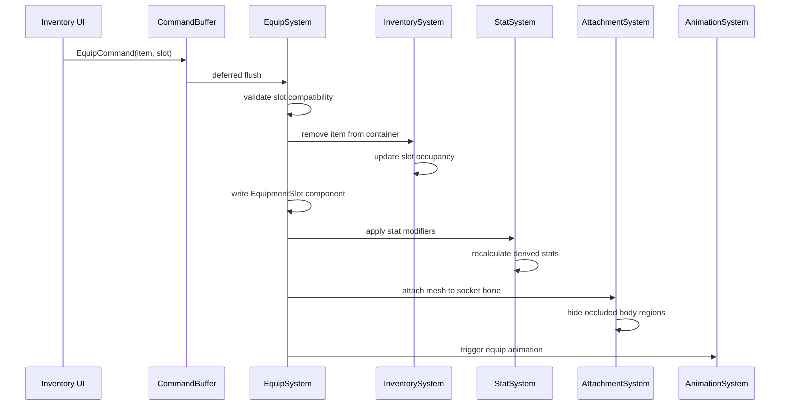
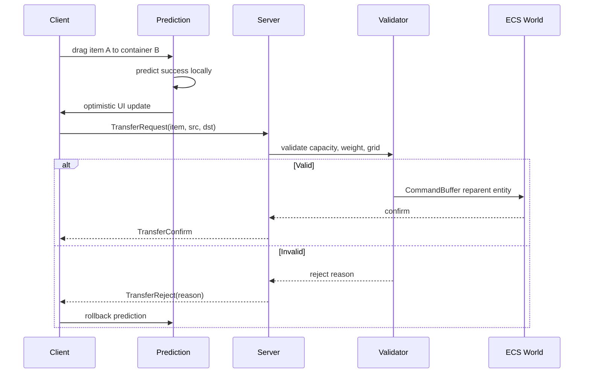
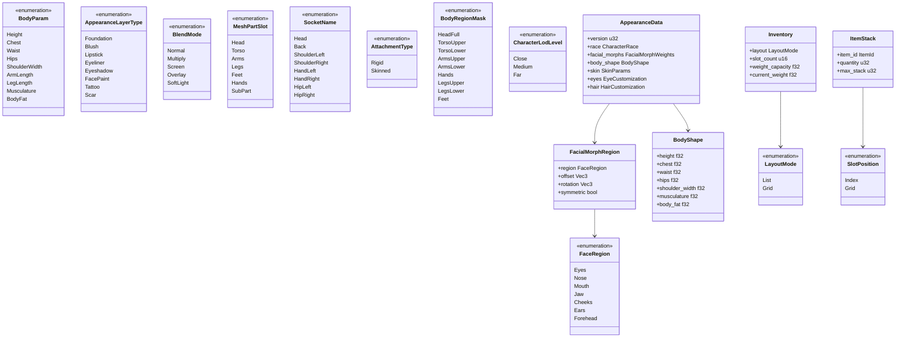

# Character Customization & Inventory Design

## Requirements Trace

> **Canonical sources:** Features, requirements, and user stories are defined in
> [features/game-framework/](../../features/game-framework/),
> [requirements/game-framework/](../../requirements/game-framework/), and
> [user-stories/game-framework/](../../user-stories/game-framework/). The table below traces design
> elements to those definitions.

### Character Customization (F-13.8, R-13.8)

| Feature | Requirement | Description |
|---------|-------------|-------------|
| F-13.8.1 | R-13.8.1 | Parametric facial morph targets per region with additive blending |
| F-13.8.2 | R-13.8.2 | Preset blending and templates with save/load/share |
| F-13.8.3 | R-13.8.3 | Parametric body shape via morph targets and skeleton scaling |
| F-13.8.4 | R-13.8.4 | Body morph propagation to equipment meshes |
| F-13.8.5 | R-13.8.5 | Skin material with SSS and layered detail maps |
| F-13.8.6 | R-13.8.6 | Makeup and face paint decal layer compositing |
| F-13.8.7 | R-13.8.7 | Per-eye customization with layered eye material |
| F-13.8.8 | R-13.8.8 | Hair system with strand/card LOD and parametric controls |
| F-13.8.9 | R-13.8.9 | Modular mesh part system with master-pose sharing |
| F-13.8.10 | R-13.8.10 | Socket-based equipment attachment on skeleton bones |
| F-13.8.11 | R-13.8.11 | Transmog and appearance override with wardrobe |
| F-13.8.12 | R-13.8.12 | Multi-race base mesh support with retargeting |
| F-13.8.13 | R-13.8.13 | Character LOD and crowd optimization |
| F-13.8.14 | R-13.8.14 | Async mesh merging for draw call reduction |
| F-13.8.15 | R-13.8.15 | Version-tagged appearance serialization |

### Inventory (F-13.9, R-13.9)

| Feature | Requirement | Description |
|---------|-------------|-------------|
| F-13.9.1 | R-13.9.1 | ECS-based inventory containers with child item entities |
| F-13.9.2 | R-13.9.2 | Grid-based 2D inventory layout with bin-packing auto-sort |
| F-13.9.3 | R-13.9.3 | Item stacking and splitting with per-type limits |
| F-13.9.4 | R-13.9.4 | Per-instance mutable item properties as ECS components |
| F-13.9.5 | R-13.9.5 | Item socket and augmentation system with type filtering |
| F-13.9.6 | R-13.9.6 | Inventory transfer and drag-drop with server authority |
| F-13.9.7 | R-13.9.7 | Loot distribution with multiple allocation modes |
| F-13.9.8 | R-13.9.8 | Merchant and player-to-player trading |
| F-13.9.9 | R-13.9.9 | Equipment slot binding with stat/visual/animation triggers |
| F-13.9.10 | R-13.9.10 | Schema-versioned inventory serialization and persistence |

### Non-Functional Requirements

| Requirement | Target |
|-------------|--------|
| R-13.8.NF1 | Character creator load < 3 s |
| R-13.8.NF2 | Morph slider response within 1 frame (16.67 ms) |
| R-13.8.NF3 | Serialized appearance data < 16 KB |
| R-13.9.NF1 | 500+ item stacks per container |
| R-13.9.NF2 | 20 containers per player, < 2 MB total |
| R-13.9.NF3 | All inventory operations < 1 ms server-side |

### Cross-Cutting Dependencies

| Dependency | Source | Consumed API |
|------------|--------|--------------|
| Entity lifecycle | F-1.1.11 | Generational `Entity` handles |
| ChildOf relationship | F-1.1.14, F-1.1.16 | Parent-child hierarchy |
| Command buffers | F-1.1.32 | Deferred structural changes |
| Change detection | F-1.1.22 | `Changed<T>` queries |
| Reflection | F-1.3.1 | `Reflect` derive for serialization |
| Serialization | F-1.4.1 | Binary/RON format codecs |
| Schema versioning | F-1.4.4, F-1.4.5 | Migration pipeline |
| Scene hierarchy | F-1.2.1 | Transform propagation |
| Shared spatial index | F-1.9.1 | BVH for LOD distance |
| Skeletal animation | F-9.1.1 | Bone transforms, retargeting |
| Morph targets | F-9.2.1 | Blend shape evaluation |
| Materials | F-2.4.1 | Shader parameter overrides |
| Data tables | F-13.7.2 | Item definitions, loot tables |
| Stats system | F-13.7.9 | Stat modifier application |
| Save system | F-13.3.1 | Persistence integration |
| State replication | F-8.2.1 | Networked inventory sync |
| RPCs | F-8.3.1 | Server-authoritative transfers |

## Overview

This document covers two tightly coupled domains:

1. **Character Customization** -- the data model and systems that define a character's visual
   appearance through morph targets, modular mesh parts, materials, hair, and equipment attachments.
2. **Inventory** -- the ECS-based container model for items, with grid/list layouts, stacking,
   equipment slot binding, loot distribution, and trading.

The two domains intersect at the **equipment slot** boundary: equipping an item moves it from
inventory to a character slot, triggering stat application, visual mesh attachment, and animation
state changes.

### Design Principles

1. **100% ECS-based.** All character appearance data and inventory state are ECS components. All
   logic is implemented as systems. No parallel data stores.
2. **No-code authoring.** All customization parameters, item definitions, slot configurations, and
   loot tables are authored through visual editors and data tables. Users never write code.
3. **Static dispatch.** No trait objects or dynamic dispatch. Component types are concrete. Systems
   use generic type parameters where needed.
4. **Server-authoritative inventory.** All inventory mutations are validated server-side. Client
   prediction provides responsive UI with rollback on rejection.

### Performance Targets

| Metric | Target | Source |
|--------|--------|--------|
| Character creator load | < 3 s | R-13.8.NF1 |
| Morph slider response | < 16.67 ms (1 frame) | R-13.8.NF2 |
| Appearance data size | < 16 KB | R-13.8.NF3 |
| Unique characters rendered | 500 at 1080p < 16 ms | R-13.8.13 |
| Mesh merge (6 parts) | < 5 ms async | R-13.8.14 |
| Items per container | 500+ stacks | R-13.9.NF1 |
| Containers per player | 20, < 2 MB total | R-13.9.NF2 |
| Inventory op latency | < 1 ms server-side | R-13.9.NF3 |

## Architecture

### Module Boundaries

```mermaid
graph TD
    subgraph character["harmonius_game::character"]
        CC[CharacterCustomization]
        FM[FacialMorphing]
        BS[BodyShape]
        SK[SkinMaterial]
        HC[HairCustomization]
        EC[EyeCustomization]
        MP[MeshPartSystem]
        AS[AttachmentSockets]
        TM[TransmogSystem]
        CS[CharacterSerializer]
        CL[CharacterLOD]
        MM[MeshMerger]
    end

    subgraph inventory["harmonius_game::inventory"]
        INV[InventoryContainer]
        IS[ItemStack]
        GL[GridLayout]
        ST[StackingSystem]
        IP[ItemProperties]
        SO[SocketSystem]
        TR[TransferSystem]
        LT[LootDistribution]
        MC[MerchantTrading]
        EQ[EquipmentSlots]
        IV[InventorySerializer]
    end

    subgraph ecs["harmonius_core::ecs"]
        W[World]
        CB[CommandBuffer]
        Q[Query]
        REL[Relationships]
    end

    subgraph scene["harmonius_core::scene"]
        T[Transform]
        GT[GlobalTransform]
    end

    subgraph reflect["harmonius_core::reflect"]
        RF[TypeRegistry]
        SE[Serializer]
    end

    subgraph rendering["harmonius_rendering"]
        MT[Materials]
        MR[MorphTargets]
        SK3[SkeletalMesh]
    end

    CC --> FM
    CC --> BS
    CC --> SK
    CC --> HC
    CC --> EC
    CC --> MP
    CC --> AS
    CC --> TM
    CC --> CS
    CC --> CL
    CC --> MM

    EQ --> AS
    EQ --> INV
    EQ --> CC

    MP --> SK3
    FM --> MR
    BS --> MR
    SK --> MT
    AS --> T

    INV --> W
    INV --> REL
    TR --> CB
    CS --> SE
    IV --> SE

    CL --> SK3
    MM --> SK3
```



### Directory Layout

```text
harmonius_game/
├── character/
│   ├── mod.rs
│   ├── facial.rs         # FacialMorphRegion,
│   │                     # FacePreset, blending
│   ├── body.rs           # BodyShape, scale bones,
│   │                     # constraints
│   ├── skin.rs           # SkinParams, detail layers
│   ├── makeup.rs         # AppearanceLayer,
│   │                     # compositing
│   ├── eyes.rs           # EyeParams, layered eye
│   │                     # material
│   ├── hair.rs           # HairParams, groom asset
│   │                     # selection
│   ├── mesh_parts.rs     # MeshPartSlot,
│   │                     # ModularMeshAssembly
│   ├── sockets.rs        # AttachmentSocket,
│   │                     # SocketAttachment
│   ├── transmog.rs       # AppearanceOverride,
│   │                     # Wardrobe, OutfitSlot
│   ├── race.rs           # RaceDefinition,
│   │                     # RaceMorphExtension
│   ├── lod.rs            # CharacterLodConfig,
│   │                     # LOD system
│   ├── merge.rs          # MeshMergeRequest,
│   │                     # MergeCache
│   └── serialize.rs      # AppearanceData,
│                         # versioned codec
├── inventory/
│   ├── mod.rs
│   ├── container.rs      # Inventory, LayoutMode,
│   │                     # capacity
│   ├── item.rs           # ItemStack, ItemDef,
│   │                     # InventorySlot
│   ├── grid.rs           # GridLayout, cell
│   │                     # occupancy, bin-packing
│   ├── stacking.rs       # Stack, split, auto-
│   │                     # consolidate
│   ├── properties.rs     # Durability, Enchantment,
│   │                     # BindStatus
│   ├── sockets.rs        # SocketSlot, insert/
│   │                     # remove, stat merge
│   ├── transfer.rs       # TransferCommand,
│   │                     # DragPayload, validation
│   ├── loot.rs           # LootSource,
│   │                     # DistributionMode
│   ├── merchant.rs       # MerchantInventory,
│   │                     # pricing, trade window
│   ├── equipment.rs      # EquipmentSlotMap,
│   │                     # equip/unequip
│   └── serialize.rs      # InventorySnapshot,
│                         # schema migration
└── lib.rs
```

### Equipment Pipeline

This sequence shows the full equip flow from inventory to visual attachment:



### Inventory Transfer Pipeline



### Character LOD Pipeline

```mermaid
graph LR
    subgraph close["Close Range"]
        A1[Full morph targets]
        A2[Strand hair]
        A3[All detail layers]
        A4[Facial animation]
        A5[Separate mesh parts]
    end

    subgraph medium["Medium Range"]
        B1[Simplified morph]
        B2[Card-based hair]
        B3[No detail layers]
        B4[No facial anim]
        B5[Merged mesh]
    end

    subgraph far["Far Range"]
        C1[Low-poly mesh]
        C2[No hair sim]
        C3[Impostor billboard]
        C4[GPU instanced]
    end

    close -->|LOD 0 to 1| medium
    medium -->|LOD 1 to 2| far
```



### Core Data Structures



## API Design

### Character Customization Components

#### Facial Morphing

```rust
/// A facial region that can be independently
/// morphed. Stored as a component on the
/// character entity.
#[derive(
    Clone, Debug, Reflect, Serialize, Deserialize,
)]
pub struct FacialMorphRegion {
    pub region: FaceRegion,
    /// 3D offset: height, width, depth.
    pub offset: Vec3,
    /// Euler rotation in degrees.
    pub rotation: Vec3,
    /// Fine-grained sculpt displacement.
    pub sculpt_markers: SmallVec<[SculptMarker; 4]>,
    /// Enforce symmetry with paired region.
    pub symmetric: bool,
}

#[derive(
    Clone, Copy, Debug, PartialEq, Eq, Hash,
    Reflect, Serialize, Deserialize,
)]
pub enum FaceRegion {
    Eyes,
    Nose,
    Mouth,
    Jaw,
    Cheeks,
    Ears,
    Forehead,
}

#[derive(
    Clone, Debug, Reflect, Serialize, Deserialize,
)]
pub struct SculptMarker {
    /// Index into the morph target vertex array.
    pub vertex_index: u32,
    /// Displacement vector in local space.
    pub displacement: Vec3,
}

/// Morph target weights for the entire face,
/// keyed by region. Attached to the character
/// entity.
#[derive(
    Clone, Debug, Default, Reflect,
    Serialize, Deserialize,
)]
pub struct FacialMorphWeights {
    pub regions: SmallVec<[FacialMorphRegion; 7]>,
}

/// A named face preset stored as a morph weight
/// vector. Used for preset blending.
#[derive(
    Clone, Debug, Reflect, Serialize, Deserialize,
)]
pub struct FacePreset {
    pub name: String,
    pub weights: FacialMorphWeights,
}

/// Active preset blend state on a character.
#[derive(
    Clone, Debug, Default, Reflect,
    Serialize, Deserialize,
)]
pub struct PresetBlend {
    /// (preset asset handle, blend weight).
    pub entries: SmallVec<
        [(AssetHandle<FacePreset>, f32); 4]
    >,
}
```

#### Body Shape

```rust
/// Continuous body proportion parameters.
/// Attached as a component to the character
/// entity.
#[derive(
    Clone, Debug, Reflect, Serialize, Deserialize,
)]
pub struct BodyShape {
    /// All values normalized 0.0..=1.0.
    pub height: f32,
    pub chest: f32,
    pub waist: f32,
    pub hips: f32,
    pub shoulder_width: f32,
    pub arm_length: f32,
    pub leg_length: f32,
    pub musculature: f32,
    pub body_fat: f32,
}

/// Plausibility constraints preventing extreme
/// or impossible proportions.
#[derive(
    Clone, Debug, Reflect, Serialize, Deserialize,
)]
pub struct BodyConstraints {
    /// Min/max ratio pairs per parameter.
    pub limits: SmallVec<
        [(BodyParam, f32, f32); 9]
    >,
    /// Cross-parameter constraints (e.g.,
    /// height affects min arm_length).
    pub cross_constraints: SmallVec<
        [CrossConstraint; 4]
    >,
}

#[derive(
    Clone, Copy, Debug, PartialEq, Eq, Hash,
    Reflect, Serialize, Deserialize,
)]
pub enum BodyParam {
    Height,
    Chest,
    Waist,
    Hips,
    ShoulderWidth,
    ArmLength,
    LegLength,
    Musculature,
    BodyFat,
}

#[derive(
    Clone, Debug, Reflect, Serialize, Deserialize,
)]
pub struct CrossConstraint {
    pub source: BodyParam,
    pub target: BodyParam,
    /// target_min = source_value * scale + offset.
    pub scale: f32,
    pub offset: f32,
}
```

#### Skin, Makeup, and Eyes

```rust
/// Parametric skin appearance. No unique
/// per-character textures -- all driven by
/// compact parameter sets.
#[derive(
    Clone, Debug, Reflect, Serialize, Deserialize,
)]
pub struct SkinParams {
    /// sRGB skin tone color.
    pub tone: Color,
    /// Subsurface scattering intensity
    /// (auto-adjusted per tone).
    pub sss_intensity: f32,
    pub wrinkle_intensity: f32,
    pub freckle_density: f32,
    pub freckle_saturation: f32,
    pub stubble_density: f32,
    pub pore_roughness: f32,
    pub vascular_detail: f32,
}

/// A decal-based appearance layer (makeup,
/// tattoo, scar, face paint). Composited at
/// runtime without modifying base textures.
#[derive(
    Clone, Debug, Reflect, Serialize, Deserialize,
)]
pub struct AppearanceLayer {
    pub layer_type: AppearanceLayerType,
    pub color: Color,
    pub opacity: f32,
    pub blend_mode: BlendMode,
    /// Mask texture asset.
    pub mask: AssetHandle<Texture>,
    /// UV-space offset for placement.
    pub uv_offset: Vec2,
    /// UV-space scale.
    pub uv_scale: Vec2,
}

#[derive(
    Clone, Copy, Debug, PartialEq, Eq, Hash,
    Reflect, Serialize, Deserialize,
)]
pub enum AppearanceLayerType {
    Foundation,
    Blush,
    Lipstick,
    Eyeliner,
    Eyeshadow,
    FacePaint,
    Tattoo,
    Scar,
}

#[derive(
    Clone, Copy, Debug, PartialEq, Eq, Hash,
    Reflect, Serialize, Deserialize,
)]
pub enum BlendMode {
    Normal,
    Multiply,
    Screen,
    Overlay,
    SoftLight,
}

/// Stacked appearance layers on a character.
#[derive(
    Clone, Debug, Default, Reflect,
    Serialize, Deserialize,
)]
pub struct AppearanceLayers {
    pub layers: SmallVec<[AppearanceLayer; 8]>,
}

/// Per-eye customization parameters.
#[derive(
    Clone, Debug, Reflect, Serialize, Deserialize,
)]
pub struct EyeParams {
    pub iris_color: Color,
    pub iris_pattern: AssetHandle<Texture>,
    pub pupil_size: f32,
    pub sclera_color: Color,
    pub sclera_vein_visibility: f32,
    pub limbal_ring_darkness: f32,
    pub cornea_clarity: f32,
    pub cornea_refraction: f32,
    pub wetness: f32,
}

/// Both eyes, supporting heterochromia.
#[derive(
    Clone, Debug, Reflect, Serialize, Deserialize,
)]
pub struct EyeCustomization {
    pub left: EyeParams,
    pub right: EyeParams,
}
```

#### Hair

```rust
/// Hair customization parameters.
#[derive(
    Clone, Debug, Reflect, Serialize, Deserialize,
)]
pub struct HairParams {
    pub primary_color: Color,
    pub highlight_color: Color,
    /// Blend factor for ombre gradient (0 = none).
    pub ombre_factor: f32,
    /// Normalized 0.0..=1.0.
    pub length: f32,
    /// Curl intensity 0.0 (straight) to 1.0.
    pub curl: f32,
    /// Hair density multiplier.
    pub density: f32,
}

/// All hair-related components on a character.
#[derive(
    Clone, Debug, Reflect, Serialize, Deserialize,
)]
pub struct HairCustomization {
    pub hairstyle: AssetHandle<HairAsset>,
    pub facial_hair: Option<AssetHandle<HairAsset>>,
    pub eyebrows: AssetHandle<HairAsset>,
    pub eyelashes: AssetHandle<HairAsset>,
    pub params: HairParams,
    /// Propagate color to eyebrows/eyelashes.
    pub propagate_color: bool,
    /// Per-component overrides when propagation
    /// is enabled.
    pub eyebrow_color_override: Option<Color>,
    pub eyelash_color_override: Option<Color>,
}
```

#### Modular Mesh Parts

```rust
/// Identifies a mesh part slot on a character.
#[derive(
    Clone, Copy, Debug, PartialEq, Eq, Hash,
    Reflect, Serialize, Deserialize,
)]
pub enum MeshPartSlot {
    Head,
    Torso,
    Arms,
    Legs,
    Feet,
    Hands,
    /// Sub-parts: shoulder pads, knee guards, etc.
    SubPart(u8),
}

/// A single mesh part assignment.
#[derive(
    Clone, Debug, Reflect, Serialize, Deserialize,
)]
pub struct MeshPartEntry {
    pub slot: MeshPartSlot,
    pub mesh: AssetHandle<SkinnedMesh>,
    /// Per-part material parameter overrides.
    pub material_overrides: MaterialOverrides,
}

/// Material color/parameter customization for a
/// mesh part.
#[derive(
    Clone, Debug, Default, Reflect,
    Serialize, Deserialize,
)]
pub struct MaterialOverrides {
    pub base_color: Option<Color>,
    pub pattern: Option<AssetHandle<Texture>>,
    pub roughness: Option<f32>,
    pub metallic: Option<f32>,
}

/// All mesh parts assigned to this character.
/// Systems combine these at runtime via
/// master-pose sharing or mesh merging.
#[derive(
    Clone, Debug, Default, Reflect,
    Serialize, Deserialize,
)]
pub struct ModularMeshAssembly {
    pub parts: SmallVec<[MeshPartEntry; 8]>,
}
```

#### Attachment Sockets

```rust
/// A named attachment point bound to a
/// skeleton bone.
#[derive(
    Clone, Copy, Debug, PartialEq, Eq, Hash,
    Reflect, Serialize, Deserialize,
)]
pub enum SocketName {
    Head,
    Back,
    ShoulderLeft,
    ShoulderRight,
    ElbowLeft,
    ElbowRight,
    HandLeft,
    HandRight,
    HipLeft,
    HipRight,
    KneeLeft,
    KneeRight,
}

/// Defines an attachment socket on a skeleton.
#[derive(
    Clone, Debug, Reflect, Serialize, Deserialize,
)]
pub struct AttachmentSocket {
    pub name: SocketName,
    /// Index into the skeleton's bone array.
    pub bone_index: u16,
    /// Local-space offset from the bone.
    pub offset: Vec3,
    /// Local-space rotation from the bone.
    pub rotation: Quat,
}

/// All sockets defined on a character's
/// skeleton.
#[derive(
    Clone, Debug, Default, Reflect,
    Serialize, Deserialize,
)]
pub struct SocketDefinitions {
    pub sockets: SmallVec<
        [AttachmentSocket; 12]
    >,
}

/// An entity attached to a socket. The
/// attachment entity is a child of the
/// character entity with this component.
#[derive(
    Clone, Debug, Reflect, Serialize, Deserialize,
)]
pub struct SocketAttachment {
    pub socket: SocketName,
    pub attachment_type: AttachmentType,
}

#[derive(
    Clone, Copy, Debug, PartialEq, Eq, Hash,
    Reflect, Serialize, Deserialize,
)]
pub enum AttachmentType {
    /// Follows bone transform rigidly.
    Rigid,
    /// Skinned to the character's skeleton.
    Skinned,
}

/// Body regions that can be hidden when
/// covered by opaque equipment.
#[derive(
    Clone, Copy, Debug, PartialEq, Eq, Hash,
    Reflect, Serialize, Deserialize,
)]
pub enum BodyRegionMask {
    HeadFull,
    TorsoUpper,
    TorsoLower,
    ArmsUpper,
    ArmsLower,
    Hands,
    LegsUpper,
    LegsLower,
    Feet,
}

/// Marks which body regions this equipment
/// hides when equipped.
#[derive(
    Clone, Debug, Default, Reflect,
    Serialize, Deserialize,
)]
pub struct OcclusionMask {
    pub hidden_regions: SmallVec<
        [BodyRegionMask; 4]
    >,
}
```

#### Transmog and Wardrobe

```rust
/// An appearance override that decouples visuals
/// from gameplay stats.
#[derive(
    Clone, Debug, Reflect, Serialize, Deserialize,
)]
pub struct AppearanceOverride {
    /// Map from equipment slot to the visual
    /// appearance item ID to display instead.
    pub overrides: SmallVec<
        [(EquipSlotId, ItemId); 8]
    >,
}

/// Account-wide wardrobe of unlocked appearances.
#[derive(
    Clone, Debug, Default, Reflect,
    Serialize, Deserialize,
)]
pub struct Wardrobe {
    /// Set of unlocked appearance item IDs.
    pub unlocked: Vec<ItemId>,
}

/// A saved outfit loadout for quick swapping.
#[derive(
    Clone, Debug, Reflect, Serialize, Deserialize,
)]
pub struct OutfitSlot {
    pub name: String,
    pub appearance: AppearanceOverride,
    /// Per-slot dye colors preserved across
    /// outfit changes.
    pub dye_colors: SmallVec<
        [(EquipSlotId, Color); 8]
    >,
}

/// All saved outfit loadouts.
#[derive(
    Clone, Debug, Default, Reflect,
    Serialize, Deserialize,
)]
pub struct OutfitLoadouts {
    pub slots: SmallVec<[OutfitSlot; 8]>,
    pub active_index: Option<u8>,
}
```

#### Race and Multi-Mesh

```rust
/// Unique identifier for a playable race.
#[derive(
    Clone, Copy, Debug, PartialEq, Eq, Hash,
    Reflect, Serialize, Deserialize,
)]
pub struct RaceId(pub u32);

/// Defines a playable race's base mesh, skeleton,
/// morph target set, and compatible equipment.
#[derive(
    Clone, Debug, Reflect, Serialize, Deserialize,
)]
pub struct RaceDefinition {
    pub id: RaceId,
    pub name: String,
    pub base_mesh: AssetHandle<SkinnedMesh>,
    pub skeleton: AssetHandle<Skeleton>,
    pub morph_target_set: AssetHandle<MorphTargetSet>,
    /// Item IDs compatible with this race.
    pub compatible_equipment: Vec<ItemId>,
    /// Race-specific morph extensions (e.g.,
    /// ear length, tail shape).
    pub extra_morphs: SmallVec<
        [RaceMorphExtension; 4]
    >,
}

/// An additional morph slider specific to a race.
#[derive(
    Clone, Debug, Reflect, Serialize, Deserialize,
)]
pub struct RaceMorphExtension {
    pub name: String,
    pub morph_target_index: u32,
    pub min_value: f32,
    pub max_value: f32,
    pub default_value: f32,
}

/// Assigned race on a character entity.
#[derive(
    Clone, Debug, Reflect, Serialize, Deserialize,
)]
pub struct CharacterRace {
    pub race_id: RaceId,
    /// Current values for race-specific morphs.
    pub extra_morph_values: SmallVec<[f32; 4]>,
}
```

#### Character LOD and Mesh Merging

```rust
/// LOD distance thresholds for character detail.
#[derive(
    Clone, Debug, Reflect, Serialize, Deserialize,
)]
pub struct CharacterLodConfig {
    /// Distance for full morph + strand hair.
    pub close_range: f32,
    /// Distance for simplified mesh + card hair.
    pub medium_range: f32,
    /// Distance for impostor billboard.
    pub far_range: f32,
    /// Culling distance beyond which the
    /// character is not rendered.
    pub cull_distance: f32,
}

/// Current LOD level assigned by the LOD
/// evaluation system.
#[derive(
    Clone, Copy, Debug, PartialEq, Eq, Hash,
    Reflect, Serialize, Deserialize,
)]
pub enum CharacterLodLevel {
    /// Full detail: morph targets, strand hair,
    /// all layers, facial animation, separate
    /// mesh parts.
    Close,
    /// Reduced: simplified morph, card hair, no
    /// detail layers, merged mesh.
    Medium,
    /// Minimal: low-poly or impostor billboard,
    /// GPU instanced.
    Far,
}

/// Tracks the current LOD level per character.
#[derive(
    Clone, Debug, Reflect, Serialize, Deserialize,
)]
pub struct CharacterLod {
    pub level: CharacterLodLevel,
    pub distance_sq: f32,
}

/// Request to merge modular mesh parts into a
/// single draw call. Processed asynchronously.
#[derive(Clone, Debug)]
pub struct MeshMergeRequest {
    pub character: Entity,
    pub parts: SmallVec<
        [AssetHandle<SkinnedMesh>; 8]
    >,
}

/// Cache of merged meshes keyed by the sorted
/// set of part asset handles.
pub struct MergeCache {
    entries: HashMap<
        SmallVec<[AssetHandle<SkinnedMesh>; 8]>,
        AssetHandle<SkinnedMesh>,
    >,
}

impl MergeCache {
    pub fn new() -> Self;

    pub fn lookup(
        &self,
        parts: &[AssetHandle<SkinnedMesh>],
    ) -> Option<AssetHandle<SkinnedMesh>>;

    pub fn insert(
        &mut self,
        parts: SmallVec<
            [AssetHandle<SkinnedMesh>; 8]
        >,
        merged: AssetHandle<SkinnedMesh>,
    );
}
```

#### Character Appearance Serialization

```rust
/// Complete serializable snapshot of a
/// character's visual appearance. Version-tagged
/// for forward compatibility.
#[derive(
    Clone, Debug, Reflect, Serialize, Deserialize,
)]
pub struct AppearanceData {
    pub version: u32,
    pub race: CharacterRace,
    pub facial_morphs: FacialMorphWeights,
    pub preset_blend: PresetBlend,
    pub body_shape: BodyShape,
    pub skin: SkinParams,
    pub layers: AppearanceLayers,
    pub eyes: EyeCustomization,
    pub hair: HairCustomization,
    pub mesh_parts: ModularMeshAssembly,
    pub equipment_visuals: AppearanceOverride,
    pub outfit_loadouts: OutfitLoadouts,
}

impl AppearanceData {
    /// Serialize to compact binary format.
    /// Target size: < 16 KB (R-13.8.NF3).
    pub fn to_binary(
        &self,
    ) -> Result<Vec<u8>, SerializeError>;

    /// Deserialize from binary with version
    /// migration.
    pub fn from_binary(
        data: &[u8],
    ) -> Result<Self, DeserializeError>;

    /// Serialize to human-readable RON format.
    pub fn to_ron(
        &self,
    ) -> Result<String, SerializeError>;

    /// Deserialize from RON with version
    /// migration.
    pub fn from_ron(
        data: &str,
    ) -> Result<Self, DeserializeError>;
}
```

### Inventory Components

#### Container and Items

```rust
/// Unique item type identifier referencing a
/// row in the item data table (F-13.7.2).
#[derive(
    Clone, Copy, Debug, PartialEq, Eq, Hash,
    Reflect, Serialize, Deserialize,
)]
pub struct ItemId(pub u64);

/// Layout mode for an inventory container.
#[derive(
    Clone, Copy, Debug, PartialEq, Eq, Hash,
    Reflect, Serialize, Deserialize,
)]
pub enum LayoutMode {
    /// Simple ordered list of slots.
    List,
    /// 2D grid with item width x height.
    Grid {
        columns: u16,
        rows: u16,
    },
}

/// Inventory container component. Attached to
/// any entity that holds items (player bag,
/// bank, chest, merchant, trade window).
#[derive(
    Clone, Debug, Reflect, Serialize, Deserialize,
)]
pub struct Inventory {
    pub layout: LayoutMode,
    pub slot_count: u16,
    pub weight_capacity: f32,
    pub current_weight: f32,
}

/// Position of an item within its parent
/// container.
#[derive(
    Clone, Debug, Reflect, Serialize, Deserialize,
)]
pub struct InventorySlot {
    /// For List mode: sequential index.
    /// For Grid mode: top-left cell (col, row).
    pub position: SlotPosition,
}

#[derive(
    Clone, Copy, Debug, PartialEq, Eq, Hash,
    Reflect, Serialize, Deserialize,
)]
pub enum SlotPosition {
    Index(u16),
    Grid { col: u16, row: u16 },
}

/// An item stack in an inventory. Each stack is
/// an ECS child entity of the container entity.
#[derive(
    Clone, Debug, Reflect, Serialize, Deserialize,
)]
pub struct ItemStack {
    pub item_id: ItemId,
    pub quantity: u32,
}

/// Grid dimensions occupied by this item type.
#[derive(
    Clone, Copy, Debug, PartialEq, Eq, Hash,
    Reflect, Serialize, Deserialize,
)]
pub struct ItemGridSize {
    pub width: u16,
    pub height: u16,
}
```

#### Grid Layout

```rust
/// Tracks cell occupancy for a grid-based
/// inventory. Stored alongside the Inventory
/// component on the container entity.
#[derive(Clone, Debug, Reflect)]
pub struct GridOccupancy {
    /// Bit array: 1 = occupied, 0 = free.
    /// Row-major order, columns * rows bits.
    cells: Vec<u8>,
    pub columns: u16,
    pub rows: u16,
}

impl GridOccupancy {
    pub fn new(columns: u16, rows: u16) -> Self;

    /// Check if a rectangle fits at (col, row).
    pub fn can_place(
        &self,
        col: u16,
        row: u16,
        width: u16,
        height: u16,
    ) -> bool;

    /// Mark cells as occupied.
    pub fn place(
        &mut self,
        col: u16,
        row: u16,
        width: u16,
        height: u16,
    );

    /// Mark cells as free.
    pub fn remove(
        &mut self,
        col: u16,
        row: u16,
        width: u16,
        height: u16,
    );

    /// Find the first position where the item
    /// fits, scanning left-to-right, top-to-bottom.
    pub fn find_free(
        &self,
        width: u16,
        height: u16,
    ) -> Option<(u16, u16)>;

    /// Auto-sort: repack all items to minimize
    /// wasted space using a shelf bin-packing
    /// heuristic. Returns new positions.
    pub fn auto_sort(
        &self,
        items: &[(Entity, u16, u16)],
    ) -> Vec<(Entity, u16, u16)>;
}
```

#### Item Stacking

```rust
/// Stacking configuration from the item data
/// table. Not stored per-instance -- looked up
/// by ItemId.
#[derive(
    Clone, Debug, Reflect, Serialize, Deserialize,
)]
pub struct StackConfig {
    pub max_stack_size: u32,
    pub stackable: bool,
}

/// Result of a stack split operation.
pub struct SplitResult {
    /// The original stack (reduced quantity).
    pub original: Entity,
    /// The new stack entity.
    pub new_stack: Entity,
}

/// Stacking operations.
pub struct StackOps;

impl StackOps {
    /// Attempt to merge `source` into `target`.
    /// Returns overflow quantity if target is full.
    pub fn merge(
        world: &mut World,
        source: Entity,
        target: Entity,
    ) -> u32;

    /// Split `amount` from a stack, creating a
    /// new child entity in the same container.
    pub fn split(
        world: &mut World,
        stack: Entity,
        amount: u32,
    ) -> Result<SplitResult, InventoryError>;

    /// Auto-consolidate all partial stacks of
    /// the same ItemId in a container.
    pub fn consolidate(
        world: &mut World,
        container: Entity,
    );
}
```

#### Per-Instance Item Properties

```rust
/// Current durability of an item instance.
#[derive(
    Clone, Debug, Reflect, Serialize, Deserialize,
)]
pub struct Durability {
    pub current: f32,
    pub max: f32,
}

/// An enchantment applied to an item instance.
#[derive(
    Clone, Debug, Reflect, Serialize, Deserialize,
)]
pub struct Enchantment {
    pub enchantment_id: u32,
    pub tier: u8,
}

/// Bind status of an item instance.
#[derive(
    Clone, Copy, Debug, PartialEq, Eq, Hash,
    Reflect, Serialize, Deserialize,
)]
pub enum BindStatus {
    Unbound,
    BoundOnPickup,
    BoundOnEquip,
    BoundToCharacter,
}

/// Arbitrary key-value properties on an item
/// for game-specific extensions.
#[derive(
    Clone, Debug, Default, Reflect,
    Serialize, Deserialize,
)]
pub struct CustomProperties {
    pub entries: Vec<(String, PropertyValue)>,
}

#[derive(
    Clone, Debug, Reflect, Serialize, Deserialize,
)]
pub enum PropertyValue {
    Bool(bool),
    Int(i64),
    Float(f64),
    Text(String),
}
```

#### Item Sockets

```rust
/// A socket slot on an item entity. Each socket
/// is a child entity of the item.
#[derive(
    Clone, Debug, Reflect, Serialize, Deserialize,
)]
pub struct SocketSlot {
    pub socket_type: SocketType,
    /// Entity of the inserted item, if any.
    pub insert: Option<Entity>,
}

#[derive(
    Clone, Copy, Debug, PartialEq, Eq, Hash,
    Reflect, Serialize, Deserialize,
)]
pub enum SocketType {
    Gem,
    Rune,
    Enchantment,
}

/// Rule for socket insert removal.
#[derive(
    Clone, Copy, Debug, PartialEq, Eq, Hash,
    Reflect, Serialize, Deserialize,
)]
pub enum RemovalRule {
    /// Insert is destroyed on removal.
    DestroyInsert,
    /// Requires a currency cost to remove safely.
    RequireCurrency { cost: u32 },
    /// Free removal.
    Free,
}

/// Socket operations.
pub struct SocketOps;

impl SocketOps {
    /// Insert an item into a socket. Validates
    /// type compatibility via the item type
    /// hierarchy. Merges stat modifiers onto the
    /// parent item.
    pub fn insert(
        world: &mut World,
        socket: Entity,
        insert: Entity,
    ) -> Result<(), InventoryError>;

    /// Remove an insert from a socket according
    /// to the removal rule.
    pub fn remove(
        world: &mut World,
        socket: Entity,
        rule: RemovalRule,
    ) -> Result<Option<Entity>, InventoryError>;
}
```

#### Inventory Transfers

```rust
/// Transient resource tracking drag-and-drop
/// state. Only one drag active at a time.
#[derive(Clone, Debug)]
pub struct DragPayload {
    pub item: Entity,
    pub source_container: Entity,
    pub source_slot: InventorySlot,
    /// Quantity being dragged (for partial
    /// stack drags).
    pub quantity: u32,
}

/// Command to transfer an item between
/// containers. Validated server-side.
#[derive(Clone, Debug)]
pub struct TransferCommand {
    pub item: Entity,
    pub source: Entity,
    pub destination: Entity,
    pub target_slot: Option<SlotPosition>,
    pub quantity: u32,
}

/// Transfer validation result.
#[derive(Clone, Debug)]
pub enum TransferResult {
    Success,
    Rejected(TransferRejectReason),
}

#[derive(
    Clone, Copy, Debug, PartialEq, Eq, Hash,
)]
pub enum TransferRejectReason {
    InsufficientCapacity,
    ExceedsWeightLimit,
    GridOverlap,
    ItemRestriction,
    ContainerLocked,
    NotOwner,
}

/// Transfer validation and execution.
pub struct TransferOps;

impl TransferOps {
    /// Validate a transfer against capacity,
    /// weight, grid fit, and item restrictions.
    pub fn validate(
        world: &World,
        cmd: &TransferCommand,
    ) -> TransferResult;

    /// Execute a validated transfer as an ECS
    /// entity reparenting operation.
    pub fn execute(
        world: &mut World,
        cmd: &TransferCommand,
    ) -> Result<(), InventoryError>;
}
```

#### Loot Distribution

```rust
/// How loot is allocated to group members.
#[derive(
    Clone, Copy, Debug, PartialEq, Eq, Hash,
    Reflect, Serialize, Deserialize,
)]
pub enum DistributionMode {
    /// First to loot gets the item.
    FreeForAll,
    /// Items rotate among group members.
    RoundRobin,
    /// Players vote need or greed; highest
    /// roll wins.
    NeedGreed,
    /// Designated leader assigns loot.
    MasterLooter,
    /// Per-player instanced drops.
    PersonalLoot,
}

/// A loot source entity (defeated enemy, chest,
/// quest reward).
#[derive(
    Clone, Debug, Reflect, Serialize, Deserialize,
)]
pub struct LootSource {
    pub mode: DistributionMode,
    /// Loot table asset generating the drop list.
    pub loot_table: AssetHandle<LootTable>,
    /// Seconds until unclaimed items expire.
    pub expire_timeout: f32,
}

/// A pending loot vote for need/greed mode.
#[derive(Clone, Debug)]
pub struct LootVote {
    pub item: Entity,
    pub votes: SmallVec<
        [(Entity, LootChoice); 8]
    >,
    pub deadline: f32,
}

#[derive(
    Clone, Copy, Debug, PartialEq, Eq, Hash,
)]
pub enum LootChoice {
    Need,
    Greed,
    Pass,
}
```

#### Merchant and Trading

```rust
/// NPC merchant inventory with pricing.
#[derive(
    Clone, Debug, Reflect, Serialize, Deserialize,
)]
pub struct MerchantInventory {
    pub inventory: Entity,
    /// Base prices per item ID (overrides data
    /// table defaults).
    pub price_overrides: Vec<(ItemId, u32)>,
    /// Reputation faction for discount calculation.
    pub reputation_faction: Option<u32>,
    /// Whether supply/demand affects prices.
    pub dynamic_pricing: bool,
}

/// Active trade window between two players.
#[derive(Clone, Debug)]
pub struct TradeWindow {
    pub player_a: Entity,
    pub player_b: Entity,
    pub items_a: SmallVec<[Entity; 8]>,
    pub items_b: SmallVec<[Entity; 8]>,
    pub currency_a: u64,
    pub currency_b: u64,
    pub confirmed_a: bool,
    pub confirmed_b: bool,
}

impl TradeWindow {
    /// Both parties confirmed. Execute the
    /// swap atomically.
    pub fn is_ready(&self) -> bool {
        self.confirmed_a && self.confirmed_b
    }
}
```

#### Equipment Slots

```rust
/// Identifies an equipment slot on a character.
#[derive(
    Clone, Copy, Debug, PartialEq, Eq, Hash,
    Reflect, Serialize, Deserialize,
)]
pub enum EquipSlotId {
    Head,
    Chest,
    Legs,
    Feet,
    Hands,
    WeaponMain,
    WeaponOff,
    Ring1,
    Ring2,
    Necklace,
    Trinket1,
    Trinket2,
}

/// Maps equipment slots to equipped item
/// entities. Attached to the character entity.
#[derive(
    Clone, Debug, Default, Reflect,
    Serialize, Deserialize,
)]
pub struct EquipmentSlotMap {
    pub slots: SmallVec<
        [(EquipSlotId, Option<Entity>); 12]
    >,
}

/// Equipment operations.
///
/// Equipment stat modifiers use the shared
/// `StatModifier` pipeline (see
/// [shared-primitives.md](../core-runtime/shared-primitives.md)).
pub struct EquipOps;

impl EquipOps {
    /// Equip an item from inventory to a slot.
    /// Validates slot compatibility via item
    /// type hierarchy. Triggers stat application,
    /// visual attachment, and animation state.
    pub fn equip(
        world: &mut World,
        character: Entity,
        item: Entity,
        slot: EquipSlotId,
    ) -> Result<(), InventoryError>;

    /// Unequip an item from a slot back to
    /// inventory. Reverts stat modifiers and
    /// detaches visual mesh.
    pub fn unequip(
        world: &mut World,
        character: Entity,
        slot: EquipSlotId,
    ) -> Result<Entity, InventoryError>;

    /// Swap items between two equipment slots
    /// (e.g., dual-wield weapon swap).
    pub fn swap(
        world: &mut World,
        character: Entity,
        slot_a: EquipSlotId,
        slot_b: EquipSlotId,
    ) -> Result<(), InventoryError>;
}
```

#### Inventory Serialization

```rust
/// Complete serializable snapshot of an
/// inventory container and all its contents.
#[derive(
    Clone, Debug, Reflect, Serialize, Deserialize,
)]
pub struct InventorySnapshot {
    pub schema_version: u32,
    pub layout: LayoutMode,
    pub slot_count: u16,
    pub weight_capacity: f32,
    pub items: Vec<ItemSnapshot>,
}

/// Serialized state of a single item stack
/// with all per-instance properties.
#[derive(
    Clone, Debug, Reflect, Serialize, Deserialize,
)]
pub struct ItemSnapshot {
    pub item_id: ItemId,
    pub quantity: u32,
    pub slot: InventorySlot,
    pub durability: Option<Durability>,
    pub enchantments: Vec<Enchantment>,
    pub sockets: Vec<SocketSnapshot>,
    pub bind_status: BindStatus,
    pub custom_properties: CustomProperties,
}

/// Serialized state of a socket and its insert.
#[derive(
    Clone, Debug, Reflect, Serialize, Deserialize,
)]
pub struct SocketSnapshot {
    pub socket_type: SocketType,
    pub insert: Option<ItemSnapshot>,
}

impl InventorySnapshot {
    /// Serialize to compact binary format.
    pub fn to_binary(
        &self,
    ) -> Result<Vec<u8>, SerializeError>;

    /// Deserialize with schema migration.
    pub fn from_binary(
        data: &[u8],
    ) -> Result<Self, DeserializeError>;

    /// Spawn all entities into the ECS world
    /// under the given container entity.
    pub fn spawn_into(
        &self,
        world: &mut World,
        container: Entity,
    ) -> Result<(), DeserializeError>;
}
```

### Error Types

```rust
#[derive(Clone, Debug)]
pub enum InventoryError {
    ContainerFull,
    ExceedsWeightLimit,
    GridOverlap,
    InvalidSlot,
    IncompatibleItemType,
    IncompatibleSocketType,
    InsufficientQuantity,
    InsufficientCurrency,
    ItemBound,
    NotOwner,
    TradeNotConfirmed,
    SerializationFailed(String),
}

#[derive(Clone, Debug)]
pub enum CharacterError {
    InvalidRace(RaceId),
    IncompatibleEquipment {
        item: ItemId,
        race: RaceId,
    },
    MorphOutOfBounds {
        param: BodyParam,
        value: f32,
        min: f32,
        max: f32,
    },
    SocketNotFound(SocketName),
    MeshMergeFailed(String),
    SerializationFailed(String),
}
```

## Data Flow

### Character Creation Flow

1. Player opens the character creator. The system loads all base meshes, morph target sets, hair
   assets, and presets (R-13.8.NF1: < 3 s).
2. Player selects a race. The `CharacterRace` component is set, loading the race-specific skeleton
   and morph target set.
3. Player adjusts facial sliders. Each slider change writes to `FacialMorphWeights`. The
   `MorphEvaluationSystem` reads `Changed< FacialMorphWeights>` and updates vertex positions within
   the same frame (R-13.8.NF2).
4. Player adjusts body sliders. `BodyShape` component changes trigger the `BodyMorphSystem` which
   blends morph targets and adjusts skeleton scale bones. `BodyConstraints` clamp values.
5. Player customizes skin, eyes, hair, and makeup layers. Each writes to its respective component.
   Material parameters update reactively.
6. Player confirms. `AppearanceData` is serialized (< 16 KB) and persisted.

### Equipment Equip/Unequip Flow

```rust
// Equip flow (simplified)
fn equip_system(
    mut commands: Commands,
    equip_events: EventReader<EquipCommand>,
    mut equipment: Query<&mut EquipmentSlotMap>,
    mut stats: Query<&mut CharacterStats>,
    item_defs: Res<ItemDataTable>,
    // ...
) {
    for event in equip_events.iter() {
        let slot_map =
            equipment.get_mut(event.character);
        let item_def =
            item_defs.get(event.item_id);

        // 1. Validate slot compatibility
        if !item_def.compatible_slots
            .contains(&event.slot)
        {
            continue; // reject
        }

        // 2. Remove from inventory container
        commands.entity(event.item)
            .remove_parent();

        // 3. Write to equipment slot
        slot_map.slots.push(
            (event.slot, Some(event.item))
        );

        // 4. Apply stat modifiers
        stats.get_mut(event.character)
            .apply_modifiers(&item_def.stats);

        // 5. Attach visual mesh to socket
        commands.entity(event.item).insert(
            SocketAttachment {
                socket: event.slot.to_socket(),
                attachment_type:
                    AttachmentType::Rigid,
            },
        );

        // 6. Apply body region occlusion
        if let Some(mask) =
            &item_def.occlusion_mask
        {
            commands.entity(event.character)
                .insert(mask.clone());
        }
    }
}
```

### Inventory Transfer Flow

1. Client initiates drag. `DragPayload` resource is set with the source item and container.
2. Client drops onto target container. A `TransferCommand` is created.
3. Client prediction: `TransferOps::validate()` runs locally. On success, the UI optimistically
   shows the item in the target.
4. `TransferCommand` is sent to the server via RPC.
5. Server runs `TransferOps::validate()`. On success, `TransferOps::execute()` reparents the item
   entity. On failure, a reject reason is sent back.
6. Client receives confirmation or rolls back the prediction.

### Mesh Merging Flow

1. The `CharacterLodSystem` evaluates distance from camera to each character using the shared
   spatial index.
2. Characters transitioning from `Close` to `Medium` LOD enqueue a `MeshMergeRequest`.
3. The `MeshMergeSystem` checks the `MergeCache`. On cache hit, the merged mesh is applied
   immediately.
4. On cache miss, the merge runs as an async task on the thread pool. The merged mesh is stored in
   the cache upon completion.
5. Characters transitioning back to `Close` LOD swap back to separate mesh parts for hot-swappable
   equipment.

### Body Morph Propagation

1. `BodyShape` changes are detected via `Changed<BodyShape>`.
2. The `BodyMorphPropagationSystem` iterates all equipment mesh parts that have matching morph
   targets.
3. For deformable equipment (cloth, leather), the system copies the body morph weights to the
   equipment's morph target component.
4. For rigid equipment (plate, helmets), morph propagation is skipped -- bone transforms alone
   position the pieces.

## Platform Considerations

### All Platforms

| Aspect | Detail |
|--------|--------|
| ECS storage | All components use archetype storage for cache-friendly iteration |
| Serialization | `Reflect` derive on all components enables binary + RON codecs |
| No-code | All parameters exposed as visual editor properties via reflection |
| Async merge | Mesh merging uses the thread pool's async task infrastructure |
| Static dispatch | No trait objects; `EquipSlotId` and `SocketName` are concrete enums |

### Mobile Scaling

| Feature | Desktop | Mobile |
|---------|---------|--------|
| Character LOD close range | 15 m | 8 m |
| Character LOD medium range | 50 m | 25 m |
| Max unique characters | 500 | 50 |
| Strand hair | Yes | Card-only |
| Appearance layers | 8 | 4 |
| Mesh merge threshold | 30 m | 15 m |
| Grid inventory max | 20 x 20 | 10 x 10 |

### Network Considerations

| Aspect | Detail |
|--------|--------|
| Appearance replication | Compact `AppearanceData` (< 16 KB) sent on first visibility |
| Inventory authority | Server-authoritative; client prediction with rollback |
| Equipment changes | Replicated via state replication (F-8.2.1) |
| Loot distribution | Server-authoritative; votes sent as RPCs |
| Trade execution | Atomic server-side swap after mutual confirmation |

## Test Plan

### Unit Tests -- Character Customization

| Test | Req | Description |
|------|-----|-------------|
| `test_facial_morph_additive` | R-13.8.1 | Set morph targets on two overlapping facial regions; verify vertex positions reflect additive composition. |
| `test_facial_symmetry_break` | R-13.8.1 | Toggle symmetry breaking on a marker; verify left/right sides diverge independently. |
| `test_preset_blend_50_50` | R-13.8.2 | Blend two presets at 50/50 weight; verify morph vector equals arithmetic mean. |
| `test_preset_save_load` | R-13.8.2 | Save a custom preset, reload, and assert all weights restored within f32 tolerance. |
| `test_body_shape_constraints` | R-13.8.3 | Set extreme slider values; verify constraints clamp to valid ranges. |
| `test_body_morph_smooth` | R-13.8.3 | Interpolate slider values; verify no mesh artifacts at intermediate values. |
| `test_equipment_morph_propagation` | R-13.8.4 | Apply extreme body shape with equipment; verify no mesh penetration. |
| `test_rigid_armor_no_deform` | R-13.8.4 | Equip plate armor; verify rigid pieces only follow bone transforms. |
| `test_skin_params_deterministic` | R-13.8.5 | Two characters with identical skin params produce the same material output. |
| `test_appearance_layer_order` | R-13.8.6 | Apply 3 overlapping layers; verify compositing order and blend modes. |
| `test_eye_heterochromia` | R-13.8.7 | Set left and right eye to different iris colors; verify each material instance is correct. |
| `test_hair_swap` | R-13.8.8 | Swap hairstyle assets; verify new groom renders with correct parameters. |
| `test_hair_color_propagation` | R-13.8.8 | Set hair color; verify propagation to eyebrows with override. |
| `test_mesh_parts_sync` | R-13.8.9 | Assemble 6 mesh parts; verify all share skeleton transforms in sync. |
| `test_mesh_part_swap` | R-13.8.9 | Swap one part; verify no seam artifacts at boundaries. |
| `test_socket_rigid_attach` | R-13.8.10 | Attach weapon to hand socket; verify transform matches hand bone. |
| `test_body_region_hiding` | R-13.8.10 | Equip opaque chest armor; verify torso region is culled. |
| `test_transmog_stats_visual` | R-13.8.11 | Equip stat gear + appearance override; verify stats from equipped, visuals from override. |
| `test_outfit_dye_persist` | R-13.8.11 | Apply dye, change outfit, revert; verify dye colors preserved. |
| `test_race_skeleton` | R-13.8.12 | Spawn two characters of different races; verify each uses own skeleton. |
| `test_race_equipment_filter` | R-13.8.12 | Attempt race-incompatible equipment; verify rejection. |
| `test_appearance_serialize_size` | R-13.8.15, R-13.8.NF3 | Fully customize a character; verify serialized data < 16 KB. |
| `test_appearance_version_migrate` | R-13.8.15 | Serialize v1, add param in v2; verify migration fills default. |

### Unit Tests -- Inventory

| Test | Req | Description |
|------|-----|-------------|
| `test_inventory_ecs_hierarchy` | R-13.9.1 | Create container entity, spawn item children; verify parent-child via ECS queries. |
| `test_weight_capacity_reject` | R-13.9.1 | Add items exceeding weight; verify rejection. |
| `test_grid_placement` | R-13.9.2 | Place 2x3 item in 10x10 grid; verify occupied cells marked. |
| `test_grid_overlap_reject` | R-13.9.2 | Attempt overlapping placement; verify rejection. |
| `test_grid_auto_sort` | R-13.9.2 | Auto-sort partially filled grid; verify no overlaps and item count preserved. |
| `test_stack_merge` | R-13.9.3 | Add 150 of max-100 item; verify two stacks (100 + 50). |
| `test_stack_split` | R-13.9.3 | Split 100-stack at 60; verify two stacks (60 + 40). |
| `test_auto_consolidate` | R-13.9.3 | Add item to container with partial stacks; verify consolidation. |
| `test_durability_query` | R-13.9.4 | Two items, different durability; filter by < 10%; verify correct result. |
| `test_bind_on_pickup` | R-13.9.4 | Item enters player inventory; verify bind status applied. |
| `test_socket_insert_merge` | R-13.9.5 | Insert Rune into Rune socket; verify stat modifiers merge. |
| `test_socket_type_reject` | R-13.9.5 | Insert Gem into Rune socket; verify rejection. |
| `test_socket_remove_destroy` | R-13.9.5 | Remove insert with destroy rule; verify entity despawned. |
| `test_transfer_reparent` | R-13.9.6 | Transfer item between containers; verify parent entity changes. |
| `test_transfer_capacity_reject` | R-13.9.6 | Transfer to full container; verify rejection. |
| `test_transfer_prediction_rollback` | R-13.9.6 | Simulate client prediction + server reject; verify rollback. |
| `test_loot_round_robin` | R-13.9.7 | Distribute to 4 players in round-robin; verify rotation. |
| `test_loot_need_greed_tie` | R-13.9.7 | Tied need/greed votes; verify tiebreaker resolution. |
| `test_loot_expire` | R-13.9.7 | Leave loot unclaimed; verify despawn after timeout. |
| `test_merchant_buy` | R-13.9.8 | Buy from merchant; verify currency deducted and item received. |
| `test_merchant_reputation_discount` | R-13.9.8 | Apply reputation; verify reduced price. |
| `test_trade_mutual_confirm` | R-13.9.8 | Confirm from both sides; verify items swap correctly. |
| `test_equip_stat_apply` | R-13.9.9 | Equip weapon; verify stat modifiers applied. |
| `test_unequip_stat_revert` | R-13.9.9 | Unequip weapon; verify stats revert. |
| `test_equip_slot_reject` | R-13.9.9 | Equip head item in weapon slot; verify rejection. |
| `test_inventory_serialize_roundtrip` | R-13.9.10 | Serialize inventory with socketed items; deserialize; verify all data. |
| `test_inventory_schema_migrate` | R-13.9.10 | Add property in new schema version; verify migration preserves data. |
| `test_duplication_prevention` | R-13.9.10 | Attempt duplication via save/load; verify prevention. |

### Integration Tests

| Test | Req | Description |
|------|-----|-------------|
| `test_equip_full_pipeline` | R-13.9.9, R-13.8.10 | Equip item: verify stat change, visual attachment to socket bone, animation trigger, and body region occlusion all fire. |
| `test_character_creator_load_time` | R-13.8.NF1 | Load character creator; verify interactive within 3 s on target hardware. |
| `test_morph_slider_latency` | R-13.8.NF2 | Move facial slider continuously; verify mesh updates within same frame. |
| `test_500_characters_frame_budget` | R-13.8.13 | Render 500 unique characters at 1080p; verify frame time < 16 ms. |
| `test_mesh_merge_async` | R-13.8.14 | Merge 6 parts; verify async, no main thread block, correct vertex data, 1 draw call. |
| `test_merge_cache_hit` | R-13.8.14 | Repeat same part combination; verify cache hit. |
| `test_lod_transition_smooth` | R-13.8.13 | Walk toward distant character; verify LOD transitions are not jarring. |
| `test_inventory_500_items` | R-13.9.NF1 | Fill container with 500 stacks; perform 1000 random operations; verify all under latency budget. |
| `test_20_containers_memory` | R-13.9.NF2 | 20 containers x 100 items with properties; verify < 2 MB. |
| `test_inventory_ops_latency` | R-13.9.NF3 | 10,000 random operations; verify p99 < 1 ms. |
| `test_body_morph_equipment_all_types` | R-13.8.4 | All body shapes x all equipment types; verify no clipping. |
| `test_race_animation_retarget` | R-13.8.12 | Play shared animation on different race skeletons via retargeting; verify correct playback. |
| `test_appearance_share_roundtrip` | R-13.8.15 | Export appearance, import on different client; verify visual match. |

### Benchmarks

| Benchmark | Target | Source |
|-----------|--------|--------|
| Morph evaluation (full face) | < 1 ms | R-13.8.NF2 |
| Body shape blend (9 params) | < 0.5 ms | R-13.8.NF2 |
| Mesh merge (6 parts) | < 5 ms async | R-13.8.14 |
| Appearance serialization | < 0.5 ms, < 16 KB | R-13.8.NF3 |
| Grid auto-sort (200 items) | < 2 ms | R-13.9.NF3 |
| Stack consolidate (500 items) | < 1 ms | R-13.9.NF3 |
| Equip/unequip cycle | < 0.5 ms server | R-13.9.NF3 |
| Transfer validation | < 0.2 ms | R-13.9.NF3 |
| Inventory serialize (500 items) | < 5 ms | R-13.9.10 |
| LOD evaluation (500 characters) | < 1 ms | R-13.8.13 |

## Design Q & A

**Q1. What is the biggest constraint limiting this design?**

The no-code constraint (all authoring via visual editors) is the most limiting. Character
customization requires complex relationships between morph targets, skeleton bones, equipment
meshes, and material parameters. Expressing body proportion constraints, morph target blending
rules, and mesh part compatibility entirely through visual data assets means the system must
pre-define every possible interaction. Lifting this would allow scripted customization logic (e.g.,
"if chest > 0.8, clamp shoulder_width to min 0.5") as code. The impact is that constraint authoring
requires a visual formula graph per constraint rather than a simple conditional expression, adding
editor complexity. However, maintaining no-code is essential for the target audience.

**Q2. How can this design be improved?**

The body morph propagation system (F-13.8.4) underspecifies the runtime conform approach -- "deforms
equipment vertices to follow the underlying body surface" without defining the algorithm (ray
projection vs. cage deformation). This is a critical rendering feature that affects every equipped
item on every character. The mesh merging system (F-13.8.14) has no invalidation strategy -- when a
player swaps one equipment piece, the entire merged mesh must be regenerated. A partial merge
approach that replaces only the changed submesh would reduce re-merge cost. The serialization format
(F-13.8.15) targets < 16 KB per R-13.8.NF3, but with all the layers (facial morphs, body shape,
skin, makeup, eyes, hair, mesh parts, equipment), this budget may be too tight for characters with
extensive customization.

**Q3. Is there a better approach?**

An alternative to modular mesh parts (F-13.8.9) is a single unified mesh with blend shapes for all
equipment variations. This eliminates draw call overhead entirely but requires an exponential number
of blend shapes for every equipment combination, which is impractical for games with hundreds of
armor pieces. The modular approach with runtime mesh merging is the industry standard (used by
Fortnite, Guild Wars 2, and most MMOs) because it scales linearly with equipment count. The
trade-off is the merge cost (< 5 ms async per R-13.8.14) and the LOD transition complexity between
separate and merged meshes.

**Q4. Does this design solve all customer problems?**

The design lacks body modification systems found in some games: tattoo placement via 3D painting
(UV-space projection in F-13.8.6 only supports decals, not freehand painting), dynamic body changes
(weight gain/loss over time from gameplay), and aging/scarring from combat. There is no support for
non-humanoid character creation (F-13.8.12 covers multi-race but all assume bipedal skeletons).
Games with quadruped or serpentine player characters would need additional race base meshes with
incompatible skeletons. The inventory system (F-13.9) has no visual bag/container representation in
the world (dropping a bag of items), which is expected in survival games (US-13.14.7a.1 gathering
deposits to inventory).

**Q5. Is this design cohesive with the overall engine?**

The character and inventory systems integrate tightly -- the equipment pipeline connects inventory
slots to attachment sockets to stat modifiers, forming a clean data flow. The serialization uses the
engine's reflection system (F-1.3.1) and schema versioning (F-1.4.4), maintaining consistency with
other subsystems. The LOD system uses the shared spatial index (F-1.9.1) for distance queries,
consistent with how other modules use it. One divergence is that the grid-based inventory (F-13.9.2)
implements its own spatial occupancy logic (bin-packing) rather than reusing spatial query
primitives, but this is justified since 2D grid packing is a fundamentally different problem from 3D
spatial queries. The server-authoritative inventory model aligns with the networking system's
prediction and rollback design.

## Open Questions

1. **Morph target storage format** -- Should morph targets use compressed deltas (16-bit fixed
   point) or full f32 per vertex? Compression reduces memory by 50% but adds a decode step per
   frame.
2. **Grid auto-sort algorithm** -- Shelf bin-packing vs. Guillotine vs. MaxRects. Shelf is simplest
   but wastes more space. MaxRects produces tighter packing but costs more CPU.
3. **Mesh merge granularity** -- Merge all parts into one mesh, or merge per-material-group (keeping
   2-3 draw calls)? Single mesh maximizes draw call reduction but requires re-merge on any part
   change.
4. **Transmog storage** -- Store wardrobe per-character or per-account? Per-account shares unlocks
   but requires a cross-character service. Per-character is simpler but duplicates unlock state.
5. **Loot table evaluation location** -- Server-only or client-predictable? Server-only prevents
   data-mining but adds latency to loot display. Personal loot mode could predict client-side with
   server confirmation.
6. **Socket stat merge timing** -- Merge stats eagerly on insert (faster tooltip reads) or lazily on
   query (simpler insert)? Eager merge requires reverting on removal; lazy merge requires
   aggregation on every stat query.
7. **Body morph conform system** -- Vertex projection onto body surface (ray cast per vertex) vs.
   cage-based deformation (lattice warp)? Ray cast is more accurate but expensive; cage warp is
   faster but may miss fine detail.
8. **Inventory network protocol** -- Full snapshot replication vs. delta-compressed incremental
   updates? Snapshots are simpler but waste bandwidth for single-item changes. Deltas require
   reliable ordered delivery and rollback complexity.
