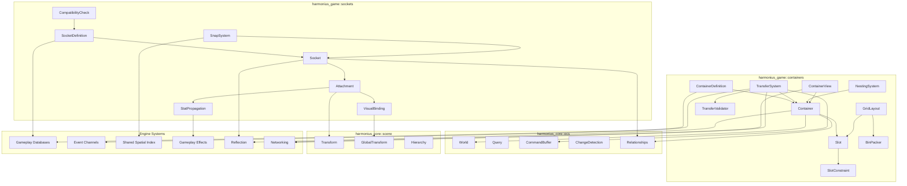
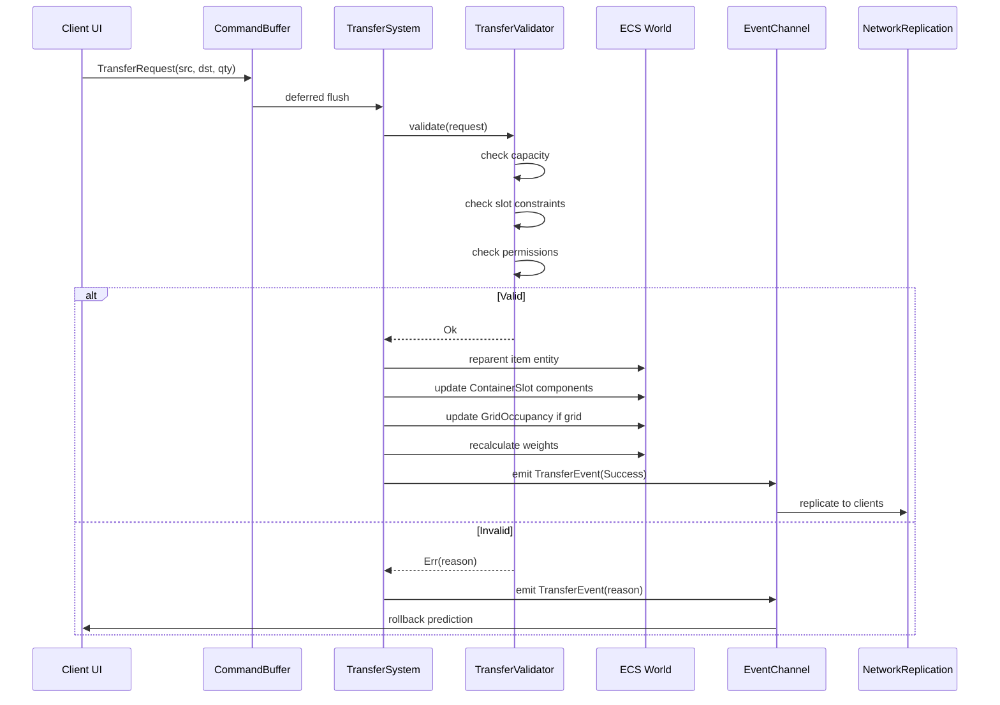
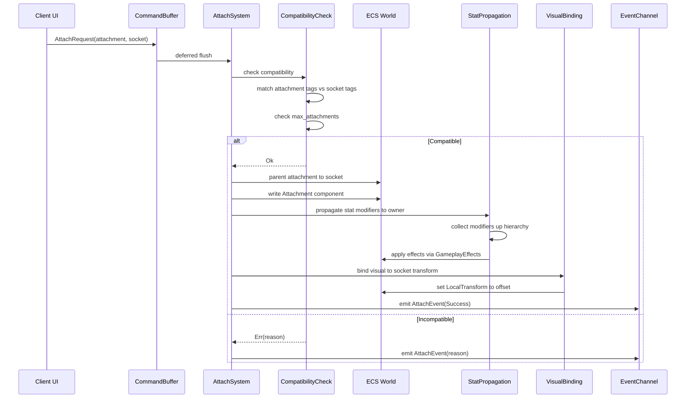

# Container and Socket Systems Design

## Requirements Trace

> **Canonical sources:** Features, requirements, and user stories are defined in
> [features/game-framework/](../../features/), [requirements/game-framework/](../../requirements/),
> and [user-stories/game-framework/](../../user-stories/). The table below traces design elements to
> those definitions.

### Container Features

| Feature    | Requirement | Domain               |
|------------|-------------|----------------------|
| F-13.9.1   | R-13.9.1    | Inventory containers |
| F-13.9.2   | R-13.9.2    | Grid-based layout    |
| F-13.9.3   | R-13.9.3    | Item stacking        |
| F-13.13.1a | R-13.13.1a  | Guild roster         |
| F-13.13.2  | R-13.13.2   | Guild storage        |
| F-13.14.5a | R-13.14.5a  | Housing furniture    |
| F-13.14.5b | R-13.14.5b  | Furniture placement  |
| F-13.14.5c | R-13.14.5c  | Functional furniture |

1. **F-13.9.1** -- ECS-based inventory containers with child item entities
2. **F-13.9.2** -- Grid-based 2D inventory layout with bin-packing auto-sort
3. **F-13.9.3** -- Item stacking and splitting with per-type limits
4. **F-13.13.1a** -- Guild CRUD and membership lifecycle (roster as container)
5. **F-13.13.2** -- Guild bank with permissioned tabs and audit logs
6. **F-13.14.5a** -- Housing plot and instance system with permissions
7. **F-13.14.5b** -- Furniture placement in interior spaces
8. **F-13.14.5c** -- Functional furniture effects (beds, chests, stations)

### Socket / Attachment Features

| Feature    | Requirement | Domain              |
|------------|-------------|---------------------|
| F-13.8.6   | R-13.8.6    | Modular meshes      |
| F-13.8.7   | R-13.8.7    | Equipment sockets   |
| F-13.14.1  | R-13.14.1   | Building snap       |
| F-13.15.3a | R-13.15.3a  | Mount attachment     |
| F-13.16.6  | R-13.16.6   | Weapon attachments  |

1. **F-13.8.6** -- Makeup and face paint decal layer compositing (modular mesh attachment points)
2. **F-13.8.7** -- Per-eye customization with layered eye material (socket-based equipment
   attachment on skeleton bones)
3. **F-13.14.1** -- Modular snap-based building placement with socket system
4. **F-13.15.3a** -- Mount summoning and dismissal (mount attachment sockets for riders and cargo)
5. **F-13.16.6** -- Weapon attachment slot model (scope, barrel, grip sockets)

### Non-Functional Requirements

| Requirement   | Target                                   |
|---------------|------------------------------------------|
| R-13.9.NF1    | 500+ item stacks per container           |
| R-13.9.NF2    | 20 containers per player, < 2 MB total   |
| R-13.9.NF3    | All container operations < 1 ms server   |
| NFR-13.14.1   | Snap validity + preview < 2 ms (500 pcs) |

### Cross-Cutting Dependencies

| Dependency         | Source   | Consumed API                 |
|--------------------|----------|------------------------------|
| Entity lifecycle   | F-1.1.11 | Generational `Entity`        |
| ChildOf relation   | F-1.1.14 | Parent-child hierarchy       |
| Command buffers    | F-1.1.32 | Deferred structural changes  |
| Change detection   | F-1.1.22 | `Changed<T>` queries         |
| Reflection         | F-1.3.1  | `Reflect` derive             |
| Serialization      | F-1.4.1  | Binary/RON codecs            |
| Schema versioning  | F-1.4.4  | Migration pipeline           |
| Scene hierarchy    | F-1.2.1  | Transform propagation        |
| Shared spatial idx | F-1.9.1  | BVH for snap queries         |
| Data tables        | F-13.7.2 | Definitions from DB rows     |
| Gameplay effects   | F-13.10.3 | Stat modifier application   |
| Networking         | F-8.2.1  | State replication            |
| RPCs               | F-8.3.1  | Server-authoritative ops     |

## Overview

This document defines two genre-agnostic ECS primitives that replace dozens of domain-specific
systems across the engine:

1. **Container** -- a generic entity collection with capacity rules, slot constraints, layout modes,
   and validated transfer operations.
2. **Socket / Attachment** -- a composable physical connection point with tag-based compatibility,
   stat propagation, and visual binding.

These primitives are intentionally free of genre assumptions. An inventory, a guild bank, a party
roster, a housing plot, and an animal pen are all containers with different definitions. A weapon
scope mount, a building snap edge, a character equipment bone, a mount saddle, and a vehicle chassis
hardpoint are all sockets with different definitions.

### Design Principles

1. **100% ECS-based.** All state lives in components and resources. No parallel data stores, no
   manager singletons.
2. **Data-driven and no-code.** All container and socket definitions are authored in the visual
   editor and stored in gameplay databases (F-13.7.2). Users never write code.
3. **Genre-agnostic.** Primitives carry no inventory, equipment, building, or vehicle semantics.
   Genre behavior emerges from definitions.
4. **Static dispatch.** Monomorphized generics on hot paths. No trait objects except at plugin
   boundary FFI layers.
5. **Server-authoritative.** All mutations are validated server-side. Client prediction provides
   responsive UI with rollback on rejection.
6. **Immutable definitions.** `ContainerDefinition` and `SocketDefinition` are immutable data loaded
   from gameplay databases. Runtime state is mutable components referencing those definitions.

### Performance Targets

| Metric                        | Target          | Source      |
|-------------------------------|-----------------|-------------|
| Transfer validation           | < 0.1 ms       | R-13.9.NF3  |
| Container sort (500 items)    | < 1 ms         | R-13.9.NF3  |
| Grid bin-pack (500 items)     | < 1 ms         | R-13.9.NF3  |
| Snap query (500 pieces)       | < 2 ms         | NFR-13.14.1 |
| Stat propagation (64 sockets) | < 0.5 ms       | R-13.10.NF1 |
| Items per container           | 500+ stacks    | R-13.9.NF1  |
| Containers per player         | 20, < 2 MB     | R-13.9.NF2  |
| Attachment count per socket   | 1--16           | Data-driven |

## Architecture

### Module Boundaries



### Directory Layout

```text
harmonius_game/
├── containers/
│   ├── mod.rs               # Re-exports
│   ├── definition.rs        # ContainerDefinition,
│   │                        # ContainerDefinitionId,
│   │                        # LayoutMode, CapacityMode
│   ├── container.rs         # Container component,
│   │                        # ContainerSlot
│   ├── slot.rs              # SlotDefinition,
│   │                        # SlotPosition,
│   │                        # SlotConstraint
│   ├── grid.rs              # GridOccupancy,
│   │                        # BinPacker, auto-sort
│   ├── transfer.rs          # TransferRequest,
│   │                        # TransferResult,
│   │                        # TransferEvent,
│   │                        # TransferValidator
│   ├── nesting.rs           # NestingValidator,
│   │                        # depth limits
│   ├── sort.rs              # SortRequest,
│   │                        # SortCriteria
│   ├── view.rs              # ContainerView for
│   │                        # network sync
│   └── plugin.rs            # ContainerPlugin
├── sockets/
│   ├── mod.rs               # Re-exports
│   ├── definition.rs        # SocketDefinition,
│   │                        # SocketDefinitionId
│   ├── socket.rs            # Socket component
│   ├── attachment.rs        # Attachment component,
│   │                        # AttachRequest,
│   │                        # DetachRequest
│   ├── compatibility.rs     # CompatibilityCheck,
│   │                        # tag matching
│   ├── stat_propagation.rs  # StatModifierList,
│   │                        # propagation system
│   ├── visual_binding.rs    # VisualOverride,
│   │                        # mesh/material bind
│   ├── snap.rs              # SnapPoint,
│   │                        # SnapCandidate,
│   │                        # SnapSystem
│   └── plugin.rs            # SocketPlugin
└── lib.rs
```

### Core Data Structures

```mermaid
classDiagram
    class LayoutMode {
        <<enum>>
        List
        Grid
        FixedSlot
    }

    class CapacityMode {
        <<enum>>
        SlotCount
        Weight
        Both
    }

    class ContainerDefinitionId {
        +u64 0
    }

    class ContainerDefinition {
        +ContainerDefinitionId id
        +LayoutMode layout
        +CapacityMode capacity_mode
        +u16 slot_count
        +f32 weight_capacity
        +u16 grid_width
        +u16 grid_height
        +Vec~SlotDefinition~ slots
        +bool nestable
        +TagSet accepted_tags
        +TagSet rejected_tags
    }

    class SlotDefinition {
        +u16 index
        +SlotPosition position
        +SlotConstraint constraint
    }

    class SlotPosition {
        <<enum>>
        Linear(u16)
        Grid(u16, u16, u16, u16)
    }

    class SlotConstraint {
        +TagSet accepted_tags
        +TagSet rejected_tags
        +u32 max_stack
        +bool unique
    }

    class Container {
        +ContainerDefinitionId definition_id
        +u16 used_slots
        +f32 current_weight
    }

    class ContainerSlot {
        +u16 slot_index
        +Entity item_entity
        +u32 quantity
    }

    class GridOccupancy {
        +FixedBitSet cells
        +u16 width
        +u16 height
    }

    class TransferRequest {
        +Entity source_container
        +u16 source_slot
        +Entity dest_container
        +u16 dest_slot
        +u32 quantity
        +Entity requester
    }

    class TransferResult {
        <<enum>>
        Success
        InsufficientCapacity
        ConstraintViolation
        PermissionDenied
        InvalidSlot
        StackFull
    }

    class TransferEvent {
        +Entity item
        +Entity source_container
        +u16 source_slot
        +Entity dest_container
        +u16 dest_slot
        +u32 quantity
        +TransferResult result
    }

    class SortRequest {
        +Entity container
        +SortCriteria criteria
    }

    class SortCriteria {
        <<enum>>
        Name
        Weight
        Rarity
        Type
        Custom(u32)
    }

    class SocketDefinitionId {
        +u64 0
    }

    class SocketDefinition {
        +SocketDefinitionId id
        +String name
        +Vec3 transform_offset
        +Quat rotation_offset
        +TagSet compatible_tags
        +u8 max_attachments
        +bool propagate_stats
        +bool propagate_physics
    }

    class Socket {
        +SocketDefinitionId definition_id
    }

    class Attachment {
        +Entity socket_entity
        +TagSet tags
    }

    class StatModifierList {
        +Vec~StatModifier~ modifiers
    }

    class StatModifier {
        +StatId stat
        +ModifierOp op
        +f32 value
    }

    class ModifierOp {
        <<enum>>
        Add
        Multiply
        Override
    }

    class VisualOverride {
        +Option~AssetHandle~ mesh_override
        +Option~AssetHandle~ material_override
        +bool hide_socket_visual
    }

    class AttachRequest {
        +Entity attachment
        +Entity socket
        +Entity requester
    }

    class DetachRequest {
        +Entity attachment
        +Entity socket
        +Entity requester
    }

    class AttachResult {
        <<enum>>
        Success
        Incompatible
        Full
        AlreadyAttached
        PermissionDenied
    }

    class AttachEvent {
        +Entity attachment
        +Entity socket
        +Entity owner
        +AttachResult result
    }

    class DetachEvent {
        +Entity attachment
        +Entity socket
        +Entity owner
    }

    class SnapPoint {
        +SocketDefinitionId socket_def
        +Vec3 world_position
        +Quat world_rotation
        +f32 snap_radius
    }

    class SnapCandidate {
        +Entity source_socket
        +Entity target_socket
        +f32 distance
    }

    ContainerDefinition --> LayoutMode
    ContainerDefinition --> CapacityMode
    ContainerDefinition --> ContainerDefinitionId
    ContainerDefinition *-- SlotDefinition
    SlotDefinition --> SlotPosition
    SlotDefinition --> SlotConstraint
    SlotConstraint --> TagSet
    Container --> ContainerDefinitionId
    ContainerSlot --> Container
    GridOccupancy --> Container
    TransferRequest --> Container
    TransferEvent --> TransferResult
    SortRequest --> SortCriteria

    SocketDefinition --> SocketDefinitionId
    Socket --> SocketDefinitionId
    Attachment --> Socket
    StatModifierList --> Attachment
    StatModifier --> ModifierOp
    StatModifierList *-- StatModifier
    VisualOverride --> Attachment
    AttachRequest --> Socket
    DetachRequest --> Socket
    AttachEvent --> AttachResult
    SnapPoint --> SocketDefinitionId
    SnapCandidate --> SnapPoint
```



## API Design

### Container Definition Types

```rust
/// Unique identifier for a container definition
/// stored in gameplay databases (F-13.7.2).
#[derive(
    Clone, Copy, Debug, PartialEq, Eq, Hash,
    Reflect, Serialize, Deserialize,
)]
pub struct ContainerDefinitionId(pub u64);

/// How items are spatially arranged within a
/// container.
#[derive(
    Clone, Copy, Debug, PartialEq, Eq, Hash,
    Reflect, Serialize, Deserialize,
)]
pub enum LayoutMode {
    /// Sequential list of slots (backpack).
    List,
    /// 2D grid with variable-size items
    /// (Diablo-style inventory).
    Grid,
    /// Named fixed slots (equipment screen).
    FixedSlot,
}

/// How capacity is measured.
#[derive(
    Clone, Copy, Debug, PartialEq, Eq, Hash,
    Reflect, Serialize, Deserialize,
)]
pub enum CapacityMode {
    /// Pure slot count limit.
    SlotCount,
    /// Weight limit only (unlimited slots).
    Weight,
    /// Both slot count and weight enforced.
    Both,
}

/// Immutable container blueprint loaded from
/// gameplay databases. Defines layout, capacity,
/// and per-slot constraints.
#[derive(
    Clone, Debug, Reflect, Serialize, Deserialize,
)]
pub struct ContainerDefinition {
    pub id: ContainerDefinitionId,
    pub layout: LayoutMode,
    pub capacity_mode: CapacityMode,
    /// Maximum number of slots. For Grid layout,
    /// this equals grid_width * grid_height.
    pub slot_count: u16,
    /// Maximum total weight. Only enforced when
    /// capacity_mode is Weight or Both.
    pub weight_capacity: f32,
    /// Grid dimensions. Only used for Grid layout.
    pub grid_width: u16,
    pub grid_height: u16,
    /// Per-slot definitions. Empty for List layout
    /// (all slots share the container-level
    /// constraint). Populated for FixedSlot and
    /// optionally for Grid.
    pub slots: Vec<SlotDefinition>,
    /// Whether this container can hold other
    /// containers (bag inside inventory).
    pub nestable: bool,
    /// Maximum nesting depth to prevent infinite
    /// recursion. 0 = no nesting allowed.
    pub max_nesting_depth: u8,
    /// Tags accepted at the container level.
    /// Empty = accept all.
    pub accepted_tags: TagSet,
    /// Tags rejected at the container level.
    pub rejected_tags: TagSet,
}
```

### Slot Types

```rust
/// Definition of a single slot within a container.
#[derive(
    Clone, Debug, Reflect, Serialize, Deserialize,
)]
pub struct SlotDefinition {
    /// Slot index within the container.
    pub index: u16,
    /// Spatial position within the layout.
    pub position: SlotPosition,
    /// Constraint on what items this slot accepts.
    pub constraint: SlotConstraint,
}

/// Spatial position of a slot.
#[derive(
    Clone, Copy, Debug, PartialEq, Eq, Hash,
    Reflect, Serialize, Deserialize,
)]
pub enum SlotPosition {
    /// Linear index for List and FixedSlot.
    Linear(u16),
    /// Grid cell: (x, y, width, height).
    Grid {
        x: u16,
        y: u16,
        w: u16,
        h: u16,
    },
}

/// Constraint applied to a single slot. Items must
/// satisfy all constraints to occupy the slot.
#[derive(
    Clone, Debug, Default, Reflect,
    Serialize, Deserialize,
)]
pub struct SlotConstraint {
    /// Tags the item must have. Empty = any.
    pub accepted_tags: TagSet,
    /// Tags the item must not have.
    pub rejected_tags: TagSet,
    /// Maximum stack size for this slot. 0 = use
    /// the item's default max_stack.
    pub max_stack: u32,
    /// If true, only one item of this type may
    /// exist in the entire container.
    pub unique: bool,
}
```

### Container Runtime Components

```rust
/// Runtime state of a container. Attached as an
/// ECS component to the owning entity. Items are
/// child entities via ChildOf relationship.
#[derive(
    Clone, Debug, Reflect, Serialize, Deserialize,
)]
pub struct Container {
    /// Reference to the immutable definition.
    pub definition_id: ContainerDefinitionId,
    /// Number of occupied slots.
    pub used_slots: u16,
    /// Current total weight of all items.
    pub current_weight: f32,
}

/// Maps a child entity to a specific slot in its
/// parent container. Attached as a component on the
/// item entity (not the container).
#[derive(
    Clone, Copy, Debug, Reflect,
    Serialize, Deserialize,
)]
pub struct ContainerSlot {
    /// Slot index within the parent container.
    pub slot_index: u16,
    /// Current stack quantity.
    pub quantity: u32,
}

/// Grid cell occupancy bitmap for Grid layout
/// containers. Attached as a component alongside
/// Container on the container entity.
#[derive(
    Clone, Debug, Reflect, Serialize, Deserialize,
)]
pub struct GridOccupancy {
    /// One bit per cell. Row-major order.
    pub cells: FixedBitSet,
    /// Grid dimensions (copied from definition
    /// for fast access without DB lookup).
    pub width: u16,
    pub height: u16,
}

impl GridOccupancy {
    /// Returns true if the rectangle (x, y, w, h)
    /// is entirely unoccupied.
    pub fn is_region_free(
        &self,
        x: u16,
        y: u16,
        w: u16,
        h: u16,
    ) -> bool {
        // Row-major scan of the rectangle.
        for row in y..(y + h) {
            for col in x..(x + w) {
                let idx = row as usize
                    * self.width as usize
                    + col as usize;
                if self.cells.contains(idx) {
                    return false;
                }
            }
        }
        true
    }

    /// Marks the rectangle as occupied.
    pub fn occupy(
        &mut self,
        x: u16,
        y: u16,
        w: u16,
        h: u16,
    ) {
        for row in y..(y + h) {
            for col in x..(x + w) {
                let idx = row as usize
                    * self.width as usize
                    + col as usize;
                self.cells.insert(idx);
            }
        }
    }

    /// Clears the rectangle.
    pub fn vacate(
        &mut self,
        x: u16,
        y: u16,
        w: u16,
        h: u16,
    ) {
        for row in y..(y + h) {
            for col in x..(x + w) {
                let idx = row as usize
                    * self.width as usize
                    + col as usize;
                self.cells.set(idx, false);
            }
        }
    }
}
```

### Transfer Types

```rust
/// A request to move items between containers or
/// slots. Submitted via CommandBuffer and processed
/// by TransferSystem.
#[derive(
    Clone, Copy, Debug, Reflect,
    Serialize, Deserialize,
)]
pub struct TransferRequest {
    /// Entity with Container component (source).
    pub source_container: Entity,
    /// Slot index in source container.
    pub source_slot: u16,
    /// Entity with Container component (dest).
    pub dest_container: Entity,
    /// Slot index in destination. u16::MAX =
    /// auto-place (first valid slot).
    pub dest_slot: u16,
    /// Number of items to move. 0 = entire stack.
    pub quantity: u32,
    /// Entity requesting the transfer (for
    /// permission checks).
    pub requester: Entity,
}

/// Outcome of a transfer validation.
#[derive(
    Clone, Copy, Debug, PartialEq, Eq, Hash,
    Reflect, Serialize, Deserialize,
)]
pub enum TransferResult {
    Success,
    InsufficientCapacity,
    WeightExceeded,
    ConstraintViolation,
    PermissionDenied,
    InvalidSlot,
    StackFull,
    NestingDepthExceeded,
    ItemNotFound,
}

/// Event emitted after every transfer attempt,
/// whether successful or not.
#[derive(
    Clone, Copy, Debug, Reflect,
    Serialize, Deserialize,
)]
pub struct TransferEvent {
    pub item: Entity,
    pub source_container: Entity,
    pub source_slot: u16,
    pub dest_container: Entity,
    pub dest_slot: u16,
    pub quantity: u32,
    pub result: TransferResult,
}

/// A request to sort all items within a container.
#[derive(
    Clone, Copy, Debug, Reflect,
    Serialize, Deserialize,
)]
pub struct SortRequest {
    pub container: Entity,
    pub criteria: SortCriteria,
}

/// Sorting criteria for auto-sort. The sort key is
/// resolved from item data table rows (F-13.7.2).
#[derive(
    Clone, Copy, Debug, PartialEq, Eq, Hash,
    Reflect, Serialize, Deserialize,
)]
pub enum SortCriteria {
    Name,
    Weight,
    Rarity,
    Type,
    /// Custom sort key column index in the item
    /// data table.
    Custom(u32),
}
```

### Transfer Validation

```rust
/// Pure function that validates a transfer without
/// mutating any state. Returns Ok(()) or an error
/// describing why the transfer is invalid.
pub fn validate_transfer(
    request: &TransferRequest,
    src_def: &ContainerDefinition,
    dst_def: &ContainerDefinition,
    src_container: &Container,
    dst_container: &Container,
    dst_grid: Option<&GridOccupancy>,
    item_tags: &TagSet,
    item_weight: f32,
    item_grid_size: Option<(u16, u16)>,
    nesting_depth: u8,
) -> Result<(), TransferResult> {
    // 1. Validate source slot exists and has item.
    if request.source_slot >= src_def.slot_count {
        return Err(TransferResult::InvalidSlot);
    }

    // 2. Check destination slot bounds.
    if request.dest_slot != u16::MAX
        && request.dest_slot >= dst_def.slot_count
    {
        return Err(TransferResult::InvalidSlot);
    }

    // 3. Check container-level tag constraints.
    if !dst_def.accepted_tags.is_empty()
        && !item_tags.intersects(&dst_def.accepted_tags)
    {
        return Err(
            TransferResult::ConstraintViolation,
        );
    }
    if item_tags.intersects(&dst_def.rejected_tags) {
        return Err(
            TransferResult::ConstraintViolation,
        );
    }

    // 4. Check capacity.
    match dst_def.capacity_mode {
        CapacityMode::SlotCount | CapacityMode::Both
            if dst_container.used_slots
                >= dst_def.slot_count =>
        {
            return Err(
                TransferResult::InsufficientCapacity,
            );
        }
        _ => {}
    }
    match dst_def.capacity_mode {
        CapacityMode::Weight | CapacityMode::Both
            if dst_container.current_weight
                + item_weight
                > dst_def.weight_capacity =>
        {
            return Err(
                TransferResult::WeightExceeded,
            );
        }
        _ => {}
    }

    // 5. Check grid occupancy for Grid layout.
    if let (
        Some(grid),
        Some((w, h)),
        LayoutMode::Grid,
    ) = (dst_grid, item_grid_size, dst_def.layout)
    {
        if request.dest_slot != u16::MAX {
            let x = request.dest_slot
                % dst_def.grid_width;
            let y = request.dest_slot
                / dst_def.grid_width;
            if !grid.is_region_free(x, y, w, h) {
                return Err(
                    TransferResult::InsufficientCapacity,
                );
            }
        }
    }

    // 6. Check nesting depth.
    if nesting_depth >= dst_def.max_nesting_depth {
        return Err(
            TransferResult::NestingDepthExceeded,
        );
    }

    Ok(())
}
```

### Socket Definition Types

```rust
/// Unique identifier for a socket definition
/// stored in gameplay databases (F-13.7.2).
#[derive(
    Clone, Copy, Debug, PartialEq, Eq, Hash,
    Reflect, Serialize, Deserialize,
)]
pub struct SocketDefinitionId(pub u64);

/// Immutable socket blueprint loaded from gameplay
/// databases. Defines compatibility, transform
/// offset, and behavior flags.
#[derive(
    Clone, Debug, Reflect, Serialize, Deserialize,
)]
pub struct SocketDefinition {
    pub id: SocketDefinitionId,
    /// Human-readable name for editor display.
    pub name: String,
    /// Local-space position offset from parent.
    pub transform_offset: Vec3,
    /// Local-space rotation offset from parent.
    pub rotation_offset: Quat,
    /// Tags that an attachment must have to be
    /// accepted. Empty = accept all.
    pub compatible_tags: TagSet,
    /// Maximum number of simultaneous attachments.
    /// 1 for equipment slots, N for multi-attach
    /// points like building edges.
    pub max_attachments: u8,
    /// Whether attached stat modifiers propagate
    /// to the socket's owner entity.
    pub propagate_stats: bool,
    /// Whether attached entities participate in
    /// the owner's physics simulation.
    pub propagate_physics: bool,
    /// Snap radius for spatial snap queries. 0.0
    /// disables spatial snapping.
    pub snap_radius: f32,
}
```

### Socket Runtime Components

```rust
/// Runtime socket instance. A child entity of the
/// owning entity (e.g., character, weapon, building
/// piece). Attachments become children of the
/// socket entity.
#[derive(
    Clone, Copy, Debug, Reflect,
    Serialize, Deserialize,
)]
pub struct Socket {
    /// Reference to the immutable definition.
    pub definition_id: SocketDefinitionId,
}

/// Marks an entity as attached to a socket.
/// Attached as a component on the attachment entity.
#[derive(
    Clone, Copy, Debug, Reflect,
    Serialize, Deserialize,
)]
pub struct Attachment {
    /// The socket entity this is attached to.
    pub socket_entity: Entity,
}

/// Tags carried by an attachable entity, used for
/// compatibility checks against socket definitions.
#[derive(
    Clone, Debug, Default, Reflect,
    Serialize, Deserialize,
)]
pub struct AttachmentTags {
    pub tags: TagSet,
}

/// Stat modifiers applied to the socket owner when
/// this entity is attached. Removed on detach.
#[derive(
    Clone, Debug, Default, Reflect,
    Serialize, Deserialize,
)]
pub struct StatModifierList {
    pub modifiers: Vec<StatModifier>,
}

/// A single stat modification.
#[derive(
    Clone, Copy, Debug, Reflect,
    Serialize, Deserialize,
)]
pub struct StatModifier {
    /// Which stat to modify (references stat
    /// table row via F-13.7.9).
    pub stat: StatId,
    /// How to apply the modification.
    pub op: ModifierOp,
    /// Numeric value of the modification.
    pub value: f32,
}

/// Modifier arithmetic operation.
#[derive(
    Clone, Copy, Debug, PartialEq, Eq, Hash,
    Reflect, Serialize, Deserialize,
)]
pub enum ModifierOp {
    /// value is added to the stat.
    Add,
    /// stat is multiplied by (1 + value).
    Multiply,
    /// stat is set to value, ignoring other mods.
    Override,
}

/// Visual overrides applied when an entity is
/// attached to a socket.
#[derive(
    Clone, Debug, Default, Reflect,
    Serialize, Deserialize,
)]
pub struct VisualOverride {
    /// Replace the attachment's mesh.
    pub mesh_override: Option<AssetHandle<Mesh>>,
    /// Replace the attachment's material.
    pub material_override:
        Option<AssetHandle<Material>>,
    /// Hide the socket's default visual when
    /// something is attached.
    pub hide_socket_visual: bool,
}
```

### Attach / Detach Types

```rust
/// Request to attach an entity to a socket.
#[derive(
    Clone, Copy, Debug, Reflect,
    Serialize, Deserialize,
)]
pub struct AttachRequest {
    /// Entity to attach (must have AttachmentTags).
    pub attachment: Entity,
    /// Socket entity to attach to.
    pub socket: Entity,
    /// Entity requesting (for permission checks).
    pub requester: Entity,
}

/// Request to detach an entity from its socket.
#[derive(
    Clone, Copy, Debug, Reflect,
    Serialize, Deserialize,
)]
pub struct DetachRequest {
    /// Attached entity to remove.
    pub attachment: Entity,
    /// Socket entity to detach from.
    pub socket: Entity,
    /// Entity requesting (for permission checks).
    pub requester: Entity,
}

/// Outcome of an attach attempt.
#[derive(
    Clone, Copy, Debug, PartialEq, Eq, Hash,
    Reflect, Serialize, Deserialize,
)]
pub enum AttachResult {
    Success,
    Incompatible,
    Full,
    AlreadyAttached,
    PermissionDenied,
}

/// Event emitted after an attach attempt.
#[derive(
    Clone, Copy, Debug, Reflect,
    Serialize, Deserialize,
)]
pub struct AttachEvent {
    pub attachment: Entity,
    pub socket: Entity,
    /// Owner of the socket (parent of the socket
    /// entity).
    pub owner: Entity,
    pub result: AttachResult,
}

/// Event emitted after a successful detach.
#[derive(
    Clone, Copy, Debug, Reflect,
    Serialize, Deserialize,
)]
pub struct DetachEvent {
    pub attachment: Entity,
    pub socket: Entity,
    pub owner: Entity,
}
```

### Snap System Types

```rust
/// Cached world-space snap point derived from a
/// socket's definition and global transform.
/// Inserted into the shared spatial index
/// (F-1.9.1) for proximity queries.
#[derive(
    Clone, Copy, Debug, Reflect,
    Serialize, Deserialize,
)]
pub struct SnapPoint {
    pub socket_def: SocketDefinitionId,
    pub world_position: Vec3,
    pub world_rotation: Quat,
    pub snap_radius: f32,
}

/// A ranked candidate from a snap query, sorted
/// by distance.
#[derive(
    Clone, Copy, Debug, Reflect,
    Serialize, Deserialize,
)]
pub struct SnapCandidate {
    pub source_socket: Entity,
    pub target_socket: Entity,
    pub distance: f32,
}
```

### Compatibility Check

```rust
/// Pure function that checks whether an attachment
/// is compatible with a socket.
pub fn check_compatibility(
    socket_def: &SocketDefinition,
    attachment_tags: &AttachmentTags,
    current_attachment_count: u8,
) -> Result<(), AttachResult> {
    // 1. Check capacity.
    if current_attachment_count
        >= socket_def.max_attachments
    {
        return Err(AttachResult::Full);
    }

    // 2. Check tag compatibility.
    if !socket_def.compatible_tags.is_empty()
        && !attachment_tags
            .tags
            .intersects(&socket_def.compatible_tags)
    {
        return Err(AttachResult::Incompatible);
    }

    Ok(())
}
```

### Stat Propagation

```rust
/// Collects all StatModifierList components from
/// attached children of a socket and applies them
/// to the socket owner's stat aggregation via the
/// gameplay effect system (F-13.10.3).
///
/// Called when Attachment components are added or
/// removed (detected via ChangeDetection).
pub fn propagate_stats_system(
    query: Query<
        (Entity, &Socket, &Children),
        Changed<Children>,
    >,
    attachment_query: Query<
        &StatModifierList,
        With<Attachment>,
    >,
    parent_query: Query<&Parent>,
    mut effects: EventWriter<ApplyEffectRequest>,
) {
    for (socket_entity, socket, children) in
        query.iter()
    {
        // Find the owner entity (socket's parent).
        let owner = match parent_query
            .get(socket_entity)
        {
            Ok(parent) => parent.entity(),
            Err(_) => continue,
        };

        // Collect modifiers from all attachments.
        let mut modifiers = Vec::new();
        for &child in children.iter() {
            if let Ok(stat_list) =
                attachment_query.get(child)
            {
                modifiers.extend_from_slice(
                    &stat_list.modifiers,
                );
            }
        }

        // Submit to the gameplay effect system.
        effects.send(ApplyEffectRequest {
            target: owner,
            source: socket_entity,
            modifiers,
        });
    }
}
```

### Visual Binding

```rust
/// When an Attachment component is added to a child
/// of a socket entity, this system sets the child's
/// LocalTransform to the socket definition's offset
/// and applies any VisualOverride.
pub fn visual_binding_system(
    socket_query: Query<(&Socket, &Children)>,
    socket_defs: Res<
        DataTable<SocketDefinition>,
    >,
    mut attachment_query: Query<
        (
            &Attachment,
            &mut Transform,
            Option<&VisualOverride>,
            Option<&mut MeshHandle>,
            Option<&mut MaterialHandle>,
        ),
        Added<Attachment>,
    >,
) {
    for (
        attachment,
        mut transform,
        visual_override,
        mesh_handle,
        material_handle,
    ) in attachment_query.iter_mut()
    {
        let (socket, _) = match socket_query
            .get(attachment.socket_entity)
        {
            Ok(s) => s,
            Err(_) => continue,
        };

        let def = match socket_defs
            .get(socket.definition_id)
        {
            Some(d) => d,
            None => continue,
        };

        // Snap transform to socket offset.
        transform.translation = def.transform_offset;
        transform.rotation = def.rotation_offset;

        // Apply visual overrides if present.
        if let Some(vis) = visual_override {
            if let (Some(mesh), Some(handle)) =
                (&vis.mesh_override, mesh_handle)
            {
                *handle = MeshHandle(mesh.clone());
            }
            if let (Some(mat), Some(handle)) = (
                &vis.material_override,
                material_handle,
            ) {
                *handle =
                    MaterialHandle(mat.clone());
            }
        }
    }
}
```

### Snap Query

```rust
/// Queries the shared spatial index (F-1.9.1) for
/// nearby sockets that are compatible with the
/// source socket. Returns candidates sorted by
/// distance, nearest first.
pub fn query_snap_candidates(
    source_entity: Entity,
    source_socket: &Socket,
    source_transform: &GlobalTransform,
    socket_defs: &DataTable<SocketDefinition>,
    spatial_index: &SpatialIndex,
    max_results: usize,
) -> SmallVec<[SnapCandidate; 8]> {
    let def = match socket_defs
        .get(source_socket.definition_id)
    {
        Some(d) => d,
        None => return SmallVec::new(),
    };

    if def.snap_radius <= 0.0 {
        return SmallVec::new();
    }

    let origin = source_transform.translation();
    let nearby = spatial_index.query_sphere(
        origin,
        def.snap_radius,
    );

    let mut candidates = SmallVec::new();
    for hit in nearby {
        if hit.entity == source_entity {
            continue;
        }
        // Check tag compatibility between
        // source and target sockets.
        let dist = (hit.position - origin).length();
        candidates.push(SnapCandidate {
            source_socket: source_entity,
            target_socket: hit.entity,
            distance: dist,
        });
        if candidates.len() >= max_results {
            break;
        }
    }

    candidates.sort_by(|a, b| {
        a.distance.partial_cmp(&b.distance)
            .unwrap_or(core::cmp::Ordering::Equal)
    });

    candidates
}
```

## Data Flow

### Container Transfer Pipeline



Transfer steps in detail:

1. **Client submits** -- UI drag-drop or button press enqueues a `TransferRequest` into the
   `CommandBuffer`.
2. **Optimistic prediction** -- client applies the transfer locally for responsive UI. Prediction is
   tagged for rollback.
3. **Server validation** -- `TransferSystem` calls `validate_transfer()` with the source and
   destination container definitions, current state, item tags, and weight.
4. **World mutation** -- on success, the item entity is reparented from the source container to the
   destination via the `ChildOf` relationship. `ContainerSlot` components are updated.
5. **Grid update** -- for Grid layout, `GridOccupancy` is vacated at the source and occupied at the
   destination.
6. **Weight recalculation** -- source and destination `Container` components have their
   `current_weight` updated.
7. **Event emission** -- `TransferEvent` is emitted for listeners (UI refresh, audio, networking).
8. **Rollback** -- on rejection, the client receives a `TransferEvent` with the failure reason and
   rolls back the optimistic prediction.

### Socket Attach/Detach Pipeline



Attach steps in detail:

1. **Request** -- `AttachRequest` is enqueued via `CommandBuffer`.
2. **Compatibility** -- `check_compatibility()` verifies tag intersection and attachment count.
3. **Parenting** -- attachment entity becomes a child of the socket entity via `ChildOf`
   relationship.
4. **Component write** -- `Attachment` component is added to the attachment entity with a reference
   to the socket entity.
5. **Stat propagation** -- `propagate_stats_system` detects the `Children` change on the socket,
   collects `StatModifierList` from all attached children, and sends them to the gameplay effect
   system (F-13.10.3).
6. **Visual binding** -- `visual_binding_system` detects the `Added<Attachment>` filter, sets the
   attachment's local transform to the socket definition's offset, and applies visual overrides.
7. **Event** -- `AttachEvent` is emitted for listeners.

Detach reverses steps 3--6:

1. `Attachment` component is removed.
2. Entity is unparented from the socket.
3. Stat modifiers are recollected (now excluding the detached entity).
4. Visual transform is cleared.
5. `DetachEvent` is emitted.

## Composition Examples

The following diagram shows how the same two primitives model four different game systems with only
different definitions.

```mermaid
graph TD
    subgraph inventory["Inventory (Container)"]
        INV[Player Entity]
        INV --> |Container| BAG1[Backpack Slot 0..23]
        INV --> |Container| EQUIP[Equipment Slots]
        BAG1 --> |ContainerSlot| I1[Sword Entity]
        BAG1 --> |ContainerSlot| I2[Potion x5]
        EQUIP --> |ContainerSlot| I3[Helmet Entity]
    end

    subgraph weapon["Weapon Attachments (Sockets)"]
        GUN[Rifle Entity]
        GUN --> |Socket| S1[Scope Socket]
        GUN --> |Socket| S2[Barrel Socket]
        GUN --> |Socket| S3[Grip Socket]
        S1 --> |Attachment| A1[4x Scope]
        S2 --> |Attachment| A2[Suppressor]
    end

    subgraph building["Building Snap (Sockets)"]
        WALL[Wall Piece Entity]
        WALL --> |Socket| TOP[Top Edge Socket]
        WALL --> |Socket| SIDE[Side Edge Socket]
        TOP --> |Attachment| ROOF[Roof Piece]
        SIDE --> |Attachment| WALL2[Adjacent Wall]
    end

    subgraph mount["Mount Harness (Sockets)"]
        HORSE[Mount Entity]
        HORSE --> |Socket| SADDLE[Saddle Socket]
        HORSE --> |Socket| BAGS[Saddlebag Socket]
        SADDLE --> |Attachment| RIDER[Rider Entity]
        BAGS --> |Attachment| CARGO[Cargo Container]
    end
```



### Example Definitions

The following tables show how different game systems are expressed as container and socket
definitions. All are authored in the visual editor and stored as gameplay database rows (F-13.7.2).

#### Container Definitions

| Definition          | Layout    | Capacity    | Slots | Nestable |
|---------------------|-----------|-------------|-------|----------|
| Player Backpack     | Grid      | Both(24,50) | 24    | Yes      |
| Equipment Screen    | FixedSlot | SlotCount   | 12    | No       |
| Guild Bank Tab      | Grid      | Both(100,∞) | 100   | No       |
| Guild Roster        | List      | SlotCount   | 500   | No       |
| Housing Plot        | FixedSlot | SlotCount   | 50    | No       |
| Animal Pen          | List      | SlotCount   | 8     | No       |
| Vendor Inventory    | List      | SlotCount   | 200   | No       |
| Loot Chest          | Grid      | Both(16,20) | 16    | No       |

1. **Player Backpack** -- Grid layout with 6x4 cells, weight limit 50.0, max nesting depth 1 (bag
   inside bag).
2. **Equipment Screen** -- FixedSlot layout with named slots (Head, Chest, Legs, Feet, MainHand,
   OffHand, etc.). Per-slot constraints filter by equipment type tags.
3. **Guild Bank Tab** -- Grid layout with 10x10 cells, permissioned per guild rank. No weight limit
   in practice (weight_capacity = f32::MAX).
4. **Guild Roster** -- List layout holding member entity references. Slot constraint accepts only
   the "guild_member" tag.
5. **Housing Plot** -- FixedSlot layout with furniture placement positions. Per-slot constraints
   accept furniture type tags.
6. **Animal Pen** -- List layout holding animal entities. Slot constraint accepts the "animal" tag.

#### Socket Definitions

| Definition       | Max Attach | Snap Radius | Propagate Stats |
|------------------|------------|-------------|-----------------|
| Skeleton Bone    | 1          | 0.0         | Yes             |
| Weapon Scope     | 1          | 0.0         | Yes             |
| Weapon Barrel    | 1          | 0.0         | Yes             |
| Weapon Grip      | 1          | 0.0         | Yes             |
| Building Edge    | 1          | 0.5         | No              |
| Building Corner  | 3          | 0.3         | No              |
| Mount Saddle     | 1          | 0.0         | No              |
| Mount Saddlebag  | 2          | 0.0         | No              |
| Vehicle Hardpoint| 1          | 0.0         | Yes             |
| Modular Mesh     | 1          | 0.0         | No              |

1. **Skeleton Bone** -- character equipment sockets placed on skeleton bones (F-13.8.7). Tags filter
   by equipment slot type. `propagate_stats = true` so armor stats affect the character.
2. **Weapon Scope/Barrel/Grip** -- weapon attachment sockets (F-13.16.6). Each accepts a different
   tag set. Stat modifiers adjust weapon accuracy, recoil, and damage.
3. **Building Edge/Corner** -- building snap sockets (F-13.14.1). `snap_radius > 0` enables spatial
   snap queries. Tags encode material tier and piece type for compatibility.
4. **Mount Saddle** -- rider attachment point (F-13.15.3a). Accepts the "rider" tag.
   `propagate_physics = true` so the rider follows mount motion.
5. **Vehicle Hardpoint** -- modular vehicle part socket. Stat modifiers adjust vehicle speed, armor,
   and handling.
6. **Modular Mesh** -- mesh part attachment on character (F-13.8.6). Accepts mesh part type tags
   (head, torso, arms, legs).

## Platform Considerations

The container and socket systems are platform-agnostic. All platform-specific behavior is delegated
to lower layers.

| Concern             | Abstraction                 | Source    |
|---------------------|-----------------------------|-----------|
| Timing              | `Res<Time>` with f64 delta  | Clock     |
| Spatial queries     | Shared spatial index API    | F-1.9.1   |
| Networking          | Event-based replication     | F-8.2.1   |
| Serialization       | `Reflect` derive            | F-1.3.1   |
| Async asset loading | `Assets<T>` with handles    | Pipeline  |
| Input routing       | `Res<InputActions>`         | F-6.2.1   |

### Scaling Tiers

| Tier     | Containers/Player | Items/Container | Sockets/Entity |
|----------|-------------------|-----------------|----------------|
| Mobile   | 10                | 100             | 8              |
| Desktop  | 20                | 500             | 32             |
| Server   | 50                | 1,000           | 64             |

### No-Code Authoring Surfaces

All container and socket definitions are authored through visual editors:

1. **Container definition editor** -- visual layout designer with drag-and-drop slot placement,
   constraint assignment, and capacity configuration. Grid containers show a cell grid overlay.
2. **Socket placement editor** -- 3D viewport tool for placing sockets on meshes. Sockets are
   positioned by clicking on the mesh surface, with gizmo handles for offset and rotation.
3. **Tag editor** -- centralized tag registry for both systems. Tags are created once and referenced
   by name in definitions.
4. **Stat modifier editor** -- table-based editor for authoring stat modifier lists on attachable
   items.

### Server Authority Model

For multiplayer, all container transfers and socket attach/detach operations are
server-authoritative:

1. **Client prediction** -- the client applies the operation locally for immediate UI feedback.
2. **Server validation** -- the server runs `validate_transfer()` or `check_compatibility()` with
   authoritative state.
3. **Confirm or reject** -- the server sends a confirm or reject event. On reject, the client rolls
   back the prediction.
4. **State replication** -- on confirm, the server replicates the updated component state to all
   relevant clients via F-8.2.1.

### Serialization

Both systems use the engine's standard serialization pipeline:

1. **Components** derive `Reflect` and `Serialize`/`Deserialize`.
2. **Binary format** for runtime save/load (F-1.4.1).
3. **RON format** for human-readable debugging.
4. **Schema versioning** (F-1.4.4) for forward-compatible migration when definitions change.

Entity references (`Entity` fields) are serialized as generational indices and remapped during scene
deserialization via the entity remap table.

## Test Plan

All test cases are in the companion file
[containers-sockets-test-cases.md](containers-sockets-test-cases.md).

### Unit Tests -- Container

| Test                               | Req       |
|------------------------------------|-----------|
| `test_list_container_add_item`     | R-13.9.1  |
| `test_list_container_remove_item`  | R-13.9.1  |
| `test_grid_occupy_region`          | R-13.9.2  |
| `test_grid_vacate_region`          | R-13.9.2  |
| `test_grid_region_overlap_reject`  | R-13.9.2  |
| `test_grid_bin_pack_auto_sort`     | R-13.9.2  |
| `test_stack_split`                 | R-13.9.3  |
| `test_stack_merge`                 | R-13.9.3  |
| `test_stack_max_enforced`          | R-13.9.3  |
| `test_slot_constraint_accept`      | R-13.9.1  |
| `test_slot_constraint_reject`      | R-13.9.1  |
| `test_unique_constraint`           | R-13.9.1  |
| `test_capacity_slot_count`         | R-13.9.1  |
| `test_capacity_weight`             | R-13.9.1  |
| `test_capacity_both`               | R-13.9.1  |
| `test_transfer_success`            | R-13.9.1  |
| `test_transfer_insufficient_cap`   | R-13.9.1  |
| `test_transfer_constraint_fail`    | R-13.9.1  |
| `test_transfer_invalid_slot`       | R-13.9.1  |
| `test_transfer_auto_place`         | R-13.9.2  |
| `test_nesting_allowed`             | R-13.9.1  |
| `test_nesting_depth_exceeded`      | R-13.9.1  |
| `test_sort_by_name`                | R-13.9.2  |
| `test_sort_by_weight`              | R-13.9.2  |
| `test_sort_by_rarity`              | R-13.9.2  |
| `test_weight_recalc_after_xfer`    | R-13.9.1  |

### Unit Tests -- Socket / Attachment

| Test                                | Req        |
|-------------------------------------|------------|
| `test_attach_compatible`            | R-13.8.7   |
| `test_attach_incompatible_tags`     | R-13.8.7   |
| `test_attach_socket_full`           | R-13.8.7   |
| `test_attach_already_attached`      | R-13.8.7   |
| `test_detach_removes_component`     | R-13.8.7   |
| `test_detach_reverses_stats`        | R-13.8.7   |
| `test_stat_propagation_add`         | R-13.10.3  |
| `test_stat_propagation_multiply`    | R-13.10.3  |
| `test_stat_propagation_override`    | R-13.10.3  |
| `test_stat_propagation_multi_att`   | R-13.10.3  |
| `test_visual_binding_transform`     | R-13.8.7   |
| `test_visual_binding_mesh_override` | R-13.8.7   |
| `test_visual_hide_socket`           | R-13.8.7   |
| `test_snap_query_finds_nearby`      | R-13.14.1  |
| `test_snap_query_respects_radius`   | R-13.14.1  |
| `test_snap_query_sorted_distance`   | R-13.14.1  |
| `test_snap_tag_compatibility`       | R-13.14.1  |
| `test_building_edge_snap`           | R-13.14.1  |
| `test_building_corner_multi`        | R-13.14.1  |
| `test_weapon_scope_attach`          | R-13.16.6  |
| `test_weapon_stat_mod_accuracy`     | R-13.16.6  |
| `test_mount_rider_attach`           | R-13.15.3a |
| `test_mount_saddlebag_container`    | R-13.15.3a |

### Integration Tests

| Test                                | Features              |
|-------------------------------------|-----------------------|
| `test_inventory_equip_flow`         | F-13.9.1, F-13.8.7   |
| `test_guild_bank_permissioned`      | F-13.13.2             |
| `test_guild_roster_membership`      | F-13.13.1a            |
| `test_building_snap_chain`          | F-13.14.1             |
| `test_furniture_placement`          | F-13.14.5b            |
| `test_weapon_full_customization`    | F-13.16.6             |
| `test_mount_ride_cycle`             | F-13.15.3a            |
| `test_container_nesting_inventory`  | F-13.9.1              |
| `test_transfer_rollback_on_reject`  | F-13.9.1, F-8.3.1    |
| `test_attach_detach_cycle_stats`    | F-13.8.7, F-13.10.3  |
| `test_serialization_roundtrip`      | F-1.4.1               |
| `test_schema_migration`             | F-1.4.4               |

### Benchmarks

| Benchmark                           | Target       | Req        |
|-------------------------------------|--------------|------------|
| `bench_transfer_500_items`          | < 1 ms       | R-13.9.NF3 |
| `bench_grid_bin_pack_500`           | < 1 ms       | R-13.9.NF3 |
| `bench_sort_500_items`              | < 1 ms       | R-13.9.NF3 |
| `bench_snap_query_500_pieces`       | < 2 ms       | NFR-13.14.1|
| `bench_stat_propagation_64_sockets` | < 0.5 ms     | R-13.10.NF1|
| `bench_attach_detach_cycle_100`     | < 0.5 ms     | R-13.9.NF3 |

## Open Questions

1. **Grid bin-packing algorithm** -- should the bin-packer use first-fit decreasing height (FFDH) or
   a more optimal shelf-based algorithm? FFDH is simpler and O(n log n) but may waste space on
   irregular item shapes.
2. **Container permission model** -- should permissions be a separate component (e.g.,
   `ContainerPermissions` with per-entity access lists) or integrated into the transfer validator as
   a trait? A separate component is more flexible but adds query overhead.
3. **Cross-container transactions** -- should multi-container transfers (e.g., swap items between
   two containers atomically) be a single `TransferRequest` with a swap flag, or two requests in a
   transaction batch? Transactions are more general but require rollback support.
4. **Socket hierarchy depth** -- should sockets support nested sockets (a scope on a weapon that
   itself has a reticle socket)? This adds complexity but enables recursive attachment trees.
   Current design supports it via entity hierarchy but has no explicit depth limit.
5. **Building structural integrity integration** -- should building snap sockets carry structural
   load data, or should structural integrity remain a separate system that queries socket
   connectivity? The current design keeps them separate (F-13.14.3 handles integrity independently).
6. **Attachment physics mode** -- should `propagate_physics` mean the attachment is a rigid body
   welded to the socket, or should it support joints (hinges, springs) for articulated attachments
   like vehicle suspensions?
