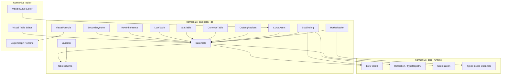
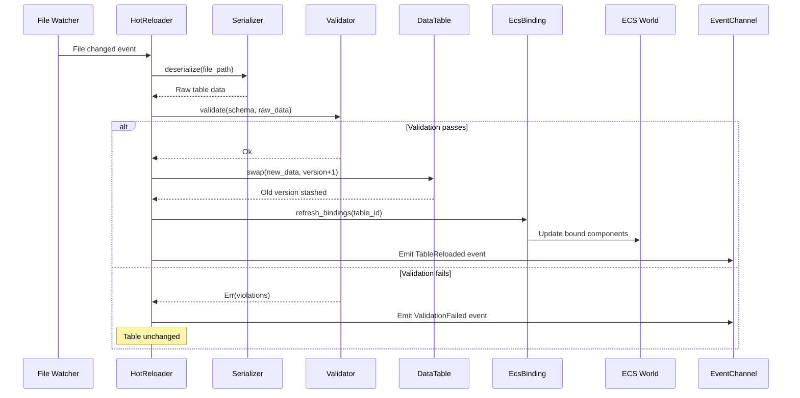
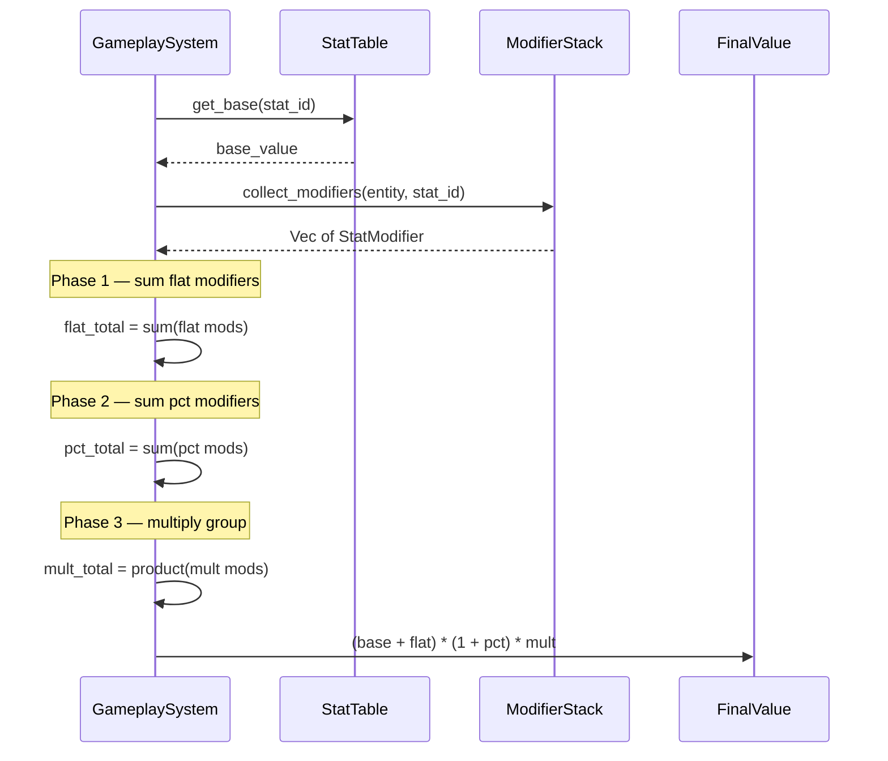
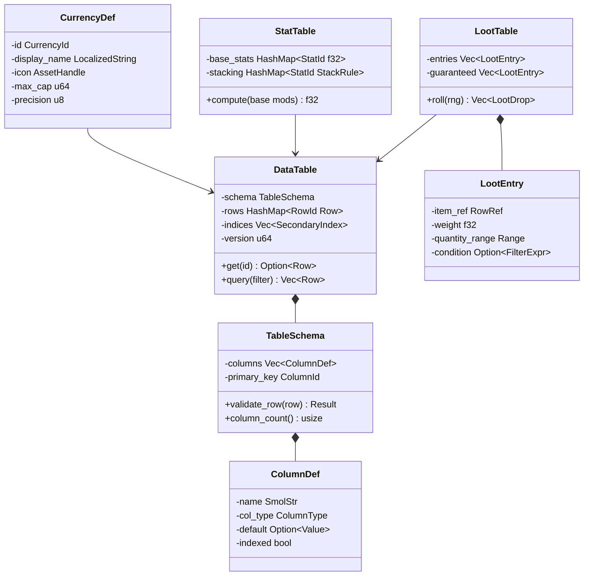

# Gameplay Databases Design

## Requirements Trace

> **Canonical sources:** Features, requirements, and user stories are defined in
> [features/game-framework/](../../features/game-framework/),
> [requirements/game-framework/](../../requirements/game-framework/), and
> [user-stories/game-framework/](../../user-stories/game-framework/). The table below traces design
> elements to those definitions.

| Feature | Requirement | Description |
|---------|-------------|-------------|
| F-13.7.1 | R-13.7.1 | Typed table schemas with constraints and defaults |
| F-13.7.2 | R-13.7.2 | Row-based tables as ECS resources with foreign keys |
| F-13.7.3 | R-13.7.3 | Numeric curves with interpolation modes |
| F-13.7.4 | R-13.7.4 | Visual formula nodes compiling to logic graph bytecode |
| F-13.7.5 | R-13.7.5 | Row inheritance with prototype chains |
| F-13.7.6 | R-13.7.6 | Currency types with caps and multi-currency transactions |
| F-13.7.7 | R-13.7.7 | Crafting recipes with catalysts and skill gates |
| F-13.7.8 | R-13.7.8 | Loot tables with weighted random and pity counters |
| F-13.7.9 | R-13.7.9 | Stat tables with configurable modifier stacking |
| F-13.7.10 | R-13.7.10 | Asset list tables with platform/locale overrides |
| F-13.7.11 | R-13.7.11 | Secondary indices for O(1) lookup and O(log n) range |
| F-13.7.12 | R-13.7.12 | ECS component binding from database rows |
| F-13.7.13 | R-13.7.13 | Hot reload with versioned rollback |
| F-13.7.14 | R-13.7.14 | Schema validation and constraint checking |

## Overview

The gameplay database system provides typed, schema-driven data tables that store all gameplay
content: items, abilities, NPCs, loot, stats, currencies, crafting recipes, and progression curves.
Tables are authored in a visual no-code editor, serialized as assets (RON, JSON, CSV, or binary),
and stored as ECS resources at runtime.

The system supports:

- **Typed schemas** with column-level constraints.
- **Foreign key references** across tables.
- **Row inheritance** (prototype chains) for data hierarchies.
- **Secondary indices** for O(1) key lookup and O(log n) range queries.
- **Visual formula nodes** for computed columns.
- **Hot reload** with versioned rollback.
- **ECS component binding** for automatic entity population from table rows.
- **Validation** on load and after hot-reload.

All data is immutable at runtime (copy-on-write for hot reload). No user-written code. Content
designers author everything through the visual table editor and visual curve editor.

## Architecture

### Module Boundaries



### Directory Layout

```text
harmonius_gameplay_db/
├── schema/
│   ├── column.rs       # ColumnDef, ColumnType,
│   │                   # ColumnId
│   ├── table.rs        # TableSchema, schema
│   │                   # builder, validation
│   └── constraint.rs   # RangeConstraint,
│                       # ForeignKey, CustomRule
├── table/
│   ├── data.rs         # DataTable, Row, RowId,
│   │                   # Value
│   ├── index.rs        # SecondaryIndex, BTree
│   │                   # and HashMap backends
│   ├── filter.rs       # FilterExpr, column
│   │                   # predicates, AND/OR/NOT
│   ├── inheritance.rs  # RowInheritance, prototype
│   │                   # chain resolution
│   └── registry.rs     # TableRegistry ECS
│                       # resource
├── content/
│   ├── loot.rs         # LootTable, LootEntry,
│   │                   # weighted random, pity
│   ├── stats.rs        # StatTable, StatModifier,
│   │                   # stacking rules
│   ├── currency.rs     # CurrencyDef, CurrencyWallet,
│   │                   # transactions
│   ├── crafting.rs     # CraftingRecipe, catalysts,
│   │                   # skill gates
│   ├── curves.rs       # CurveAsset, interpolation
│   │                   # modes, sampling
│   └── assets.rs       # AssetListTable, platform
│                       # overrides
├── formula/
│   ├── nodes.rs        # MathNode enum, formula
│   │                   # graph definition
│   └── compiler.rs     # Compile visual formula
│                       # to logic graph bytecode
├── binding.rs          # DatabaseRow component,
│                       # ECS binding system
├── validation.rs       # Full validation pipeline
├── hot_reload.rs       # File watcher, version
│                       # tracking, rollback
├── import.rs           # CSV/JSON/RON importers
└── events.rs           # TableReloaded,
                        # ValidationFailed
```

### Data Table Load and Hot-Reload Flow



### Stat Modifier Stacking Flow



### Core Data Structures



## API Design

### Identity Types

```rust
/// Unique table identifier.
#[derive(
    Clone, Copy, Debug, PartialEq, Eq, Hash,
    Reflect,
)]
pub struct TableId(pub u32);

/// Unique row identifier within a table.
#[derive(
    Clone, Copy, Debug, PartialEq, Eq, Hash,
    Reflect,
)]
pub struct RowId(pub u64);

/// Column index within a table schema.
#[derive(
    Clone, Copy, Debug, PartialEq, Eq, Hash,
)]
pub struct ColumnId(pub u16);

/// Cross-table row reference (table + row).
#[derive(
    Clone, Copy, Debug, PartialEq, Eq, Hash,
    Reflect,
)]
pub struct RowRef {
    pub table: TableId,
    pub row: RowId,
}

/// Named stat identifier.
#[derive(
    Clone, Copy, Debug, PartialEq, Eq, Hash,
    Reflect,
)]
pub struct StatId(pub u32);

/// Named currency identifier.
#[derive(
    Clone, Copy, Debug, PartialEq, Eq, Hash,
    Reflect,
)]
pub struct CurrencyId(pub u32);
```

### Column Types and Schema

```rust
/// Supported column data types.
#[derive(Clone, Debug, Reflect)]
pub enum ColumnType {
    Bool,
    I32,
    I64,
    F32,
    F64,
    String,
    /// Reference to an enum defined in the
    /// type registry.
    Enum(TypeId),
    /// Reference to a row in another table.
    ForeignKey(TableId),
    /// Reference to an asset by handle.
    AssetRef,
    /// Reference to an ECS entity.
    EntityRef,
    /// Nested struct (flattened columns).
    Struct(TypeId),
    /// Array of a single inner type.
    Array(Box<ColumnType>),
}

/// A column definition within a table schema.
#[derive(Clone, Debug, Reflect)]
pub struct ColumnDef {
    pub name: SmolStr,
    pub col_type: ColumnType,
    pub default: Option<Value>,
    pub nullable: bool,
    pub indexed: bool,
    pub constraints: Vec<ColumnConstraint>,
}

/// Per-column constraints.
#[derive(Clone, Debug, Reflect)]
pub enum ColumnConstraint {
    /// Numeric range [min, max].
    Range { min: f64, max: f64 },
    /// String length limit.
    MaxLength(usize),
    /// Regex pattern for string columns.
    Pattern(SmolStr),
    /// Custom validation rule (compiled from
    /// a visual formula graph).
    Custom(FormulaRef),
}

/// Immutable table schema.
pub struct TableSchema {
    table_id: TableId,
    name: SmolStr,
    columns: Vec<ColumnDef>,
    primary_key: ColumnId,
}

impl TableSchema {
    pub fn column_count(&self) -> usize;

    pub fn column(
        &self,
        id: ColumnId,
    ) -> Option<&ColumnDef>;

    pub fn column_by_name(
        &self,
        name: &str,
    ) -> Option<(ColumnId, &ColumnDef)>;

    /// Validate a single row against the schema.
    pub fn validate_row(
        &self,
        row: &Row,
    ) -> Result<(), Vec<ValidationError>>;
}
```

### Data Table

```rust
/// A dynamically-typed value stored in a cell.
#[derive(Clone, Debug, Reflect)]
pub enum Value {
    Null,
    Bool(bool),
    I32(i32),
    I64(i64),
    F32(f32),
    F64(f64),
    String(SmolStr),
    Enum { type_id: TypeId, variant: u32 },
    ForeignKey(RowRef),
    AssetRef(AssetHandle),
    EntityRef(Entity),
    Array(Vec<Value>),
}

/// A single row: primary key + column values.
pub struct Row {
    pub id: RowId,
    pub parent: Option<RowId>,
    pub values: Vec<Value>,
}

/// A typed data table. Stored as an ECS resource.
pub struct DataTable {
    schema: TableSchema,
    rows: HashMap<RowId, Row>,
    indices: Vec<SecondaryIndex>,
    version: u64,
}

impl DataTable {
    /// O(1) lookup by primary key.
    pub fn get(&self, id: RowId) -> Option<&Row>;

    /// Get a cell value, resolving inheritance
    /// up the prototype chain if the cell is null.
    pub fn get_resolved(
        &self,
        id: RowId,
        col: ColumnId,
    ) -> Option<&Value>;

    /// Query with a filter expression. Uses
    /// secondary indices when available.
    pub fn query(
        &self,
        filter: &FilterExpr,
    ) -> Vec<&Row>;

    /// Range query on an indexed column.
    pub fn range(
        &self,
        col: ColumnId,
        min: &Value,
        max: &Value,
    ) -> Vec<&Row>;

    pub fn row_count(&self) -> usize;
    pub fn version(&self) -> u64;
    pub fn schema(&self) -> &TableSchema;

    /// Check if a row descends from a given
    /// ancestor in the prototype chain.
    pub fn is_descendant_of(
        &self,
        row: RowId,
        ancestor: RowId,
    ) -> bool;
}
```

### Filter Expressions

```rust
/// Column predicate for filtering.
#[derive(Clone, Debug)]
pub enum ColumnPredicate {
    Equals(Value),
    NotEquals(Value),
    LessThan(Value),
    LessOrEqual(Value),
    GreaterThan(Value),
    GreaterOrEqual(Value),
    Range { min: Value, max: Value },
    Contains(SmolStr),
    Regex(SmolStr),
    IsNull,
    IsNotNull,
}

/// Composable filter expression.
#[derive(Clone, Debug)]
pub enum FilterExpr {
    Column {
        col: ColumnId,
        predicate: ColumnPredicate,
    },
    And(Vec<FilterExpr>),
    Or(Vec<FilterExpr>),
    Not(Box<FilterExpr>),
}
```

### Secondary Indices

```rust
/// Index type for a column.
#[derive(Clone, Copy, Debug)]
pub enum IndexType {
    /// HashMap-backed. O(1) exact lookup.
    Hash,
    /// BTreeMap-backed. O(log n) range queries.
    BTree,
}

/// A secondary index on a single column.
pub struct SecondaryIndex {
    column: ColumnId,
    index_type: IndexType,
}

impl SecondaryIndex {
    /// O(1) exact lookup (Hash index).
    pub fn lookup(
        &self,
        value: &Value,
    ) -> Option<Vec<RowId>>;

    /// O(log n) range query (BTree index).
    pub fn range(
        &self,
        min: &Value,
        max: &Value,
    ) -> Vec<RowId>;
}
```

### Row Inheritance

```rust
/// Resolve a column value through the prototype
/// chain. Walks parent pointers until a non-null
/// value is found or the chain ends.
pub fn resolve_inherited(
    table: &DataTable,
    row: RowId,
    col: ColumnId,
) -> Option<&Value>;

/// Flatten a row by resolving all inherited values
/// into a complete row with no null cells (except
/// nullable columns).
pub fn flatten_row(
    table: &DataTable,
    row: RowId,
) -> Row;

/// Detect circular inheritance. Returns the cycle
/// path if found.
pub fn detect_cycle(
    table: &DataTable,
    row: RowId,
) -> Option<Vec<RowId>>;
```

### Curves and Formulas

Numeric curve interpolation uses the shared `Curve<T>` type (see
[shared-primitives.md](../core-runtime/shared-primitives.md)).

```rust
/// Interpolation mode for a curve segment.
#[derive(Clone, Copy, Debug, Reflect)]
pub enum InterpolationMode {
    Linear,
    Step,
    CubicBezier {
        control1: (f32, f32),
        control2: (f32, f32),
    },
}

/// A single keyframe in a curve.
#[derive(Clone, Debug, Reflect)]
pub struct CurveKey {
    pub input: f32,
    pub output: f32,
    pub interpolation: InterpolationMode,
}

/// A named numeric curve asset.
#[derive(Clone, Debug, Reflect)]
pub struct CurveAsset {
    pub name: SmolStr,
    pub keys: Vec<CurveKey>,
}

impl CurveAsset {
    /// Sample the curve at a given input value.
    /// Clamps to the first/last key outside range.
    pub fn sample(&self, input: f32) -> f32;
}

/// Reference to a curve asset.
#[derive(
    Clone, Copy, Debug, PartialEq, Eq, Hash,
    Reflect,
)]
pub struct CurveRef(pub AssetHandle);

/// Visual formula math node types.
#[derive(Clone, Debug, Reflect)]
pub enum MathNode {
    Add,
    Subtract,
    Multiply,
    Divide,
    Min,
    Max,
    Clamp { min: f32, max: f32 },
    Floor,
    Ceil,
    Lerp,
    RandomRange { min: f32, max: f32 },
    /// Read a column value from the current row.
    ColumnRef(ColumnId),
    /// Sample a curve at an input value.
    CurveLookup(CurveRef),
    /// Literal constant.
    Constant(f32),
}

/// A compiled visual formula. Stored as bytecode
/// compatible with the logic graph runtime.
pub struct CompiledFormula {
    bytecode: Vec<u8>,
}

impl CompiledFormula {
    /// Evaluate the formula for a given row
    /// context.
    pub fn evaluate(
        &self,
        row: &Row,
        tables: &TableRegistry,
    ) -> f32;
}
```

### Loot Tables

```rust
/// A single entry in a loot table.
#[derive(Clone, Debug, Reflect)]
pub struct LootEntry {
    pub item_ref: RowRef,
    pub weight: f32,
    pub quantity_min: u32,
    pub quantity_max: u32,
    pub condition: Option<FilterExpr>,
}

/// Pity counter configuration.
#[derive(Clone, Debug, Reflect)]
pub struct PityConfig {
    /// After this many misses, guarantee the
    /// drop on the next roll.
    pub threshold: u32,
    /// Which entry is guaranteed by pity.
    pub guaranteed_entry: RowRef,
}

/// A hierarchical loot table.
#[derive(Clone, Debug, Reflect)]
pub struct LootTable {
    pub entries: Vec<LootEntry>,
    pub guaranteed: Vec<LootEntry>,
    pub sub_tables: Vec<LootTable>,
    pub rolls: u32,
    pub pity: Option<PityConfig>,
}

/// Result of a loot roll.
#[derive(Clone, Debug)]
pub struct LootDrop {
    pub item_ref: RowRef,
    pub quantity: u32,
}

impl LootTable {
    /// Roll the loot table with a deterministic
    /// seeded RNG. Returns all dropped items.
    pub fn roll(
        &self,
        rng: &mut SeededRng,
        pity_counter: &mut u32,
        context: &LootContext,
    ) -> Vec<LootDrop>;
}

/// Context for condition evaluation during
/// loot rolls.
pub struct LootContext {
    pub player_level: u32,
    pub quest_state: Option<QuestId>,
    pub faction: Option<FactionId>,
}
```

### Stat and Attribute System

```rust
/// Stat modifier type.
#[derive(Clone, Copy, Debug, Reflect)]
pub enum ModifierType {
    /// Added directly to base.
    Flat,
    /// Percentage of base (summed then applied).
    Percentage,
    /// Multiplicative (each applied independently
    /// as a product).
    Multiplicative,
}

/// **Note:** `ModifierType` should align with the
/// canonical `ModOp` enum in
/// [shared-primitives.md](../core-runtime/shared-primitives.md)
/// (`Flat`, `Percent`, `Override`). The `Percentage`
/// variant maps to `Percent`. The `Multiplicative`
/// variant represents a distinct composition rule
/// (multiply base by factor) that may warrant addition
/// to the canonical `ModOp` as a fourth variant.

/// A single stat modifier from an equipment slot,
/// buff, or ability.
#[derive(Clone, Debug, Component, Reflect)]
pub struct StatModifier {
    pub stat: StatId,
    pub modifier_type: ModifierType,
    pub value: f32,
    pub source: Entity,
}

/// Stacking rule for a stat.
#[derive(Clone, Copy, Debug, Reflect)]
pub enum StackRule {
    /// Default: flat sum, then pct sum, then
    /// multiplicative product.
    Standard,
    /// Only the highest modifier applies.
    HighestOnly,
    /// Only the most recent modifier applies.
    MostRecent,
}

/// Per-stat definition in the stat table.
#[derive(Clone, Debug, Reflect)]
pub struct StatDef {
    pub id: StatId,
    pub name: SmolStr,
    pub base_value: f32,
    pub min_value: f32,
    pub max_value: f32,
    pub stacking_rule: StackRule,
    /// Optional derived stat formula.
    pub derived_formula: Option<CompiledFormula>,
}

/// Compute the final stat value given base and
/// modifiers using the configured stacking rule.
pub fn compute_stat(
    def: &StatDef,
    modifiers: &[StatModifier],
) -> f32 {
    match def.stacking_rule {
        StackRule::Standard => {
            let flat: f32 = modifiers
                .iter()
                .filter(|m| {
                    matches!(
                        m.modifier_type,
                        ModifierType::Flat
                    )
                })
                .map(|m| m.value)
                .sum();

            let pct: f32 = modifiers
                .iter()
                .filter(|m| {
                    matches!(
                        m.modifier_type,
                        ModifierType::Percentage
                    )
                })
                .map(|m| m.value)
                .sum();

            let mult: f32 = modifiers
                .iter()
                .filter(|m| {
                    matches!(
                        m.modifier_type,
                        ModifierType::Multiplicative
                    )
                })
                .map(|m| m.value)
                .product();

            let result = (def.base_value + flat)
                * (1.0 + pct)
                * mult;
            result.clamp(
                def.min_value,
                def.max_value,
            )
        }
        StackRule::HighestOnly => {
            let highest = modifiers
                .iter()
                .map(|m| m.value)
                .max_by(|a, b| {
                    a.partial_cmp(b)
                        .unwrap_or(
                            std::cmp::Ordering::Equal,
                        )
                })
                .unwrap_or(0.0);
            (def.base_value + highest).clamp(
                def.min_value,
                def.max_value,
            )
        }
        StackRule::MostRecent => {
            let recent = modifiers
                .last()
                .map(|m| m.value)
                .unwrap_or(0.0);
            (def.base_value + recent).clamp(
                def.min_value,
                def.max_value,
            )
        }
    }
}
```

### Currency System

```rust
/// Currency type definition (stored as table row).
#[derive(Clone, Debug, Reflect)]
pub struct CurrencyDef {
    pub id: CurrencyId,
    pub display_name: LocalizedString,
    pub icon: AssetHandle,
    pub max_cap: u64,
    pub precision: u8,
}

/// Per-player currency wallet. ECS component.
#[derive(Clone, Debug, Component, Reflect)]
pub struct CurrencyWallet {
    pub balances: HashMap<CurrencyId, u64>,
}

/// A single currency cost or reward.
#[derive(Clone, Debug, Reflect)]
pub struct CurrencyAmount {
    pub currency: CurrencyId,
    pub amount: u64,
}

/// Conversion rate between two currencies.
#[derive(Clone, Debug, Reflect)]
pub struct ConversionRate {
    pub from: CurrencyId,
    pub to: CurrencyId,
    pub rate: f64,
}

impl CurrencyWallet {
    /// Check if the wallet can afford all costs.
    pub fn can_afford(
        &self,
        costs: &[CurrencyAmount],
    ) -> bool;

    /// Deduct multiple currencies atomically.
    /// Returns Err if any balance is insufficient.
    pub fn deduct(
        &mut self,
        costs: &[CurrencyAmount],
    ) -> Result<(), CurrencyError>;

    /// Add currency, clamping to max cap.
    pub fn credit(
        &mut self,
        amount: &CurrencyAmount,
        cap: u64,
    );

    /// Convert currency using a conversion rate.
    pub fn convert(
        &mut self,
        amount: u64,
        rate: &ConversionRate,
        caps: &HashMap<CurrencyId, u64>,
    ) -> Result<(), CurrencyError>;

    pub fn balance(
        &self,
        id: CurrencyId,
    ) -> u64;
}

pub enum CurrencyError {
    InsufficientFunds {
        currency: CurrencyId,
        required: u64,
        available: u64,
    },
    CapExceeded {
        currency: CurrencyId,
        cap: u64,
    },
}
```

### Crafting Recipes

```rust
/// An input ingredient for a crafting recipe.
#[derive(Clone, Debug, Reflect)]
pub struct RecipeInput {
    pub item: RowRef,
    pub quantity: u32,
    /// If true, the item is a catalyst and is
    /// not consumed.
    pub catalyst: bool,
}

/// An output product from a crafting recipe.
#[derive(Clone, Debug, Reflect)]
pub struct RecipeOutput {
    pub item: RowRef,
    pub quantity: u32,
    /// Probability of producing this output
    /// (0.0..=1.0). 1.0 = guaranteed.
    pub probability: f32,
}

/// A crafting recipe definition.
#[derive(Clone, Debug, Reflect)]
pub struct CraftingRecipe {
    pub id: RowId,
    pub inputs: Vec<RecipeInput>,
    pub outputs: Vec<RecipeOutput>,
    pub tool_required: Option<RowRef>,
    pub skill_level_gate: Option<(StatId, u32)>,
    pub discovery_condition: Option<FilterExpr>,
    /// If true, this is a dismantle recipe
    /// (reverse transformation).
    pub is_dismantle: bool,
}

impl CraftingRecipe {
    /// Check if the player has all required
    /// inputs and meets skill/tool requirements.
    pub fn can_craft(
        &self,
        inventory: &Inventory,
        stats: &StatBlock,
    ) -> bool;

    /// Execute the recipe. Consumes inputs
    /// (except catalysts), rolls output
    /// probabilities, and returns produced items.
    pub fn execute(
        &self,
        inventory: &mut Inventory,
        rng: &mut SeededRng,
    ) -> Result<Vec<RecipeOutput>, CraftError>;
}

pub enum CraftError {
    MissingInput { item: RowRef, need: u32 },
    MissingTool(RowRef),
    SkillTooLow { stat: StatId, need: u32 },
    NotDiscovered,
}
```

### Asset List Tables

```rust
/// An entry mapping a logical name to assets.
#[derive(Clone, Debug, Reflect)]
pub struct AssetListEntry {
    pub logical_name: SmolStr,
    pub default_asset: AssetHandle,
    pub platform_overrides:
        HashMap<PlatformTag, AssetHandle>,
    pub locale_overrides:
        HashMap<LocaleTag, AssetHandle>,
}

/// Resolve the correct asset handle for the
/// current platform and locale.
pub fn resolve_asset(
    entry: &AssetListEntry,
    platform: PlatformTag,
    locale: LocaleTag,
) -> AssetHandle;
```

### ECS Component Binding

```rust
/// Attached to an entity to bind it to a database
/// row. The binding system automatically populates
/// ECS components from the referenced row.
#[derive(Clone, Debug, Component, Reflect)]
pub struct DatabaseRow {
    pub table: TableId,
    pub row: RowId,
    /// Columns to bind. If empty, all columns
    /// with matching component fields are bound.
    pub bound_columns: Vec<ColumnId>,
    /// Per-column overrides that take precedence
    /// over the database value.
    pub overrides: HashMap<ColumnId, Value>,
}

/// System that populates ECS components from
/// database rows on entity spawn and after
/// hot-reload.
pub struct DatabaseBindingSystem;

impl DatabaseBindingSystem {
    /// Bind a single entity's components from its
    /// DatabaseRow reference.
    pub fn bind_entity(
        entity: Entity,
        db_row: &DatabaseRow,
        tables: &TableRegistry,
        registry: &TypeRegistry,
        world: &mut World,
    );

    /// Refresh all bindings for a table after
    /// hot-reload.
    pub fn refresh_table(
        table_id: TableId,
        tables: &TableRegistry,
        registry: &TypeRegistry,
        world: &mut World,
    );
}
```

### Table Registry (ECS Resource)

```rust
/// Central registry of all loaded data tables.
/// Stored as an ECS resource.
pub struct TableRegistry {
    tables: HashMap<TableId, DataTable>,
}

impl TableRegistry {
    pub fn get(
        &self,
        id: TableId,
    ) -> Option<&DataTable>;

    pub fn get_mut(
        &mut self,
        id: TableId,
    ) -> Option<&mut DataTable>;

    /// Register a newly loaded table.
    pub fn insert(
        &mut self,
        id: TableId,
        table: DataTable,
    );

    /// Swap a table for hot-reload. Returns the
    /// old version for rollback.
    pub fn swap(
        &mut self,
        id: TableId,
        new_table: DataTable,
    ) -> Option<DataTable>;

    pub fn table_count(&self) -> usize;
}
```

### Validation

```rust
/// A single validation error.
#[derive(Clone, Debug)]
pub struct ValidationError {
    pub table: TableId,
    pub row: RowId,
    pub column: ColumnId,
    pub message: SmolStr,
    pub severity: ValidationSeverity,
}

#[derive(Clone, Copy, Debug)]
pub enum ValidationSeverity {
    Error,
    Warning,
}

/// Validate a data table against its schema and
/// cross-table references.
pub fn validate_table(
    table: &DataTable,
    registry: &TableRegistry,
) -> Vec<ValidationError>;

/// Validate all tables in the registry.
pub fn validate_all(
    registry: &TableRegistry,
) -> Vec<ValidationError>;
```

### Hot Reload

```rust
/// Hot-reload configuration.
pub struct HotReloadConfig {
    /// Directories to watch for file changes.
    pub watch_dirs: Vec<PathBuf>,
    /// Maximum number of stashed versions for
    /// rollback.
    pub max_versions: u32,
}

/// Hot-reload events.
#[derive(Clone, Debug)]
pub struct TableReloaded {
    pub table: TableId,
    pub old_version: u64,
    pub new_version: u64,
}

#[derive(Clone, Debug)]
pub struct ValidationFailed {
    pub table: TableId,
    pub errors: Vec<ValidationError>,
}

/// Hot-reload system. Watches files, deserializes,
/// validates, and swaps tables. Emits events.
pub struct HotReloadSystem;

impl HotReloadSystem {
    /// Rollback a table to the previous version.
    pub fn rollback(
        &self,
        table: TableId,
        registry: &mut TableRegistry,
    ) -> Result<(), HotReloadError>;
}

pub enum HotReloadError {
    NoPreviousVersion,
    TableNotFound(TableId),
}
```

### Import Formats

```rust
/// Supported import formats.
#[derive(Clone, Copy, Debug)]
pub enum ImportFormat {
    Ron,
    Json,
    Csv,
    Binary,
}

/// Import a data table from a file.
pub async fn import_table(
    path: &Path,
    format: ImportFormat,
    schema: &TableSchema,
    reactor: &IoReactor,
) -> Result<DataTable, ImportError>;

pub enum ImportError {
    IoError(IoError),
    ParseError { line: u32, message: SmolStr },
    SchemaMismatch(Vec<ValidationError>),
}
```

### Events

```rust
/// Emitted when a data table is successfully
/// loaded or hot-reloaded.
#[derive(Clone, Debug)]
pub struct TableLoaded {
    pub table: TableId,
    pub row_count: usize,
    pub version: u64,
}
```

### Visual Table Editor (No-Code)

The visual table editor is a spreadsheet-like interface in the editor.

- **Schema designer:** drag-and-drop column types from a palette. Configure constraints, defaults,
  indexing, and foreign key targets per column.
- **Row editing:** spreadsheet grid with per-cell type-aware editors (numeric spinners, dropdowns
  for enums, asset pickers for asset refs, row pickers for foreign keys).
- **Inheritance view:** tree view showing prototype chains with inherited values grayed out and
  overrides highlighted.
- **Formula editor:** opens the logic graph editor for formula columns. Math nodes (add, multiply,
  min, max, clamp, lerp, random range) are connected visually.
- **Import wizard:** CSV/JSON import with column mapping and type coercion preview.
- **Validation panel:** real-time error display with table, row, and column references. Clickable to
  navigate to the offending cell.

### Visual Curve Editor (No-Code)

- **Curve canvas:** 2D plot with draggable keyframes. Handles for Bezier tangents.
- **Interpolation mode selector:** per-segment toggle between linear, step, and cubic Bezier.
- **Preview sampler:** live readout of curve output as the mouse hovers over the X axis.
- **Curve library:** browse and reference named curves from formula nodes.

## Data Flow

### Table Load Pipeline

1. **Discover:** On startup, the asset database provides a manifest of all data table assets with
   their file paths and schemas.
2. **Read:** The `import_table` function reads each file via the async I/O reactor. No blocking.
3. **Deserialize:** The serializer decodes RON, JSON, CSV, or binary into raw `Row` data.
4. **Validate:** The validator checks every row against the schema, verifies foreign key integrity
   across all tables, evaluates range constraints, and runs custom validation rules.
5. **Index:** Secondary indices are built for all columns marked as `indexed`.
6. **Inherit:** Prototype chains are resolved and cached for fast `get_resolved` lookups.
7. **Register:** The validated, indexed table is inserted into the `TableRegistry` ECS resource.
8. **Bind:** The `DatabaseBindingSystem` scans for entities with `DatabaseRow` components and
   populates their ECS components from table data.

### Loot Roll Pipeline

```rust
// Server-authoritative loot roll.
fn roll_loot(
    table: &LootTable,
    seed: u64,
    pity: &mut u32,
    ctx: &LootContext,
) -> Vec<LootDrop> {
    let mut rng = SeededRng::new(seed);
    let mut drops = Vec::new();

    // Guaranteed drops always included.
    for entry in &table.guaranteed {
        if entry.condition.as_ref().map_or(
            true,
            |c| evaluate_filter(c, ctx),
        ) {
            drops.push(LootDrop {
                item_ref: entry.item_ref,
                quantity: rng.range(
                    entry.quantity_min,
                    entry.quantity_max,
                ),
            });
        }
    }

    // Weighted random rolls.
    for _ in 0..table.rolls {
        let total_weight: f32 = table
            .entries
            .iter()
            .filter(|e| {
                e.condition.as_ref().map_or(
                    true,
                    |c| evaluate_filter(c, ctx),
                )
            })
            .map(|e| e.weight)
            .sum();

        let roll = rng.f32() * total_weight;
        let mut acc = 0.0;
        for entry in &table.entries {
            if !entry.condition.as_ref().map_or(
                true,
                |c| evaluate_filter(c, ctx),
            ) {
                continue;
            }
            acc += entry.weight;
            if roll < acc {
                drops.push(LootDrop {
                    item_ref: entry.item_ref,
                    quantity: rng.range(
                        entry.quantity_min,
                        entry.quantity_max,
                    ),
                });
                *pity = 0;
                break;
            }
        }
    }

    // Pity check.
    if let Some(pity_cfg) = &table.pity {
        *pity += 1;
        if *pity >= pity_cfg.threshold {
            drops.push(LootDrop {
                item_ref: pity_cfg.guaranteed_entry,
                quantity: 1,
            });
            *pity = 0;
        }
    }

    // Recurse into sub-tables.
    for sub in &table.sub_tables {
        drops.extend(
            sub.roll(&mut rng, pity, ctx),
        );
    }

    drops
}
```

### Hot-Reload Pipeline

1. **Watch:** The file watcher (async I/O) monitors data table directories for changes.
2. **Debounce:** Rapid successive writes are coalesced into a single reload after 100 ms.
3. **Deserialize:** The changed file is read and deserialized.
4. **Validate:** Full schema and cross-table validation runs against the new data.
5. **Swap or reject:**
   - If valid, the old table version is stashed and the new version is swapped into the registry. A
     `TableReloaded` event is emitted.
   - If invalid, a `ValidationFailed` event is emitted with error details. The old table stays
     active.
6. **Rebind:** The `DatabaseBindingSystem` refreshes all entity bindings for the reloaded table.
7. **Rollback:** If a hot-reload causes runtime issues, `rollback()` restores the stashed version.

## Platform Considerations

| Aspect | Detail |
|--------|--------|
| Serialization | RON for human-readable authoring, binary for shipping. JSON and CSV for import only. |
| Async I/O | All table file reads use the async I/O reactor. No blocking file I/O. |
| Reflection | All table types derive `Reflect` for editor property panels and ECS binding. |
| Memory | Tables use dense `Vec` storage for rows and `HashMap` for primary key index. Secondary BTree indices use `BTreeMap`. |
| Hot reload | Copy-on-write semantics. New version is built in parallel, then swapped atomically. Old version stashed for rollback. |
| Formula bytecode | Visual formulas compile to the same bytecode as gameplay logic graphs, using the shared logic graph VM. |
| No-code | All authoring through visual editors. Schema definition, row editing, curve editing, and formula authoring are all visual. |
| Platform overrides | Asset list tables resolve per-platform and per-locale at runtime via `cfg`-gated resolution. |

## Test Plan

### Unit Tests

| Test | Req | Description |
|------|-----|-------------|
| `test_schema_type_validation` | R-13.7.1 | Define schema with each column type. Load conforming data — pass. Load mismatched data — error. |
| `test_schema_constraint_range` | R-13.7.1 | Range constraint [0, 100]. Insert 50 — pass. Insert 200 — error naming the column. |
| `test_row_unique_key` | R-13.7.2 | Insert two rows with the same key. Assert duplicate rejected. |
| `test_row_foreign_key_valid` | R-13.7.2 | Two tables with a valid FK reference. Assert resolution returns the referenced row. |
| `test_row_foreign_key_broken` | R-13.7.2 | FK referencing a nonexistent row. Assert validation error with table, row, and column. |
| `test_load_ron` | R-13.7.2 | Load a table from RON format. Assert all rows present and typed correctly. |
| `test_load_json` | R-13.7.2 | Load a table from JSON format. Assert identical data to RON. |
| `test_load_csv` | R-13.7.2 | Load a table from CSV format. Assert correct type coercion. |
| `test_curve_linear` | R-13.7.3 | Linear curve with keys at 0 and 100. Sample at 50. Assert output = 50. |
| `test_curve_step` | R-13.7.3 | Step curve. Sample between keys. Assert output = previous key value. |
| `test_curve_bezier` | R-13.7.3 | Cubic Bezier curve. Sample at midpoint. Assert output within tolerance. |
| `test_formula_add_multiply` | R-13.7.4 | Visual formula: (col_a + col_b) * 2. Evaluate. Assert correct result. |
| `test_formula_curve_lookup` | R-13.7.4 | Formula with CurveLookup node. Assert output matches direct curve sample. |
| `test_formula_bytecode_compat` | R-13.7.4 | Compile visual formula. Verify bytecode matches equivalent logic graph. |
| `test_inheritance_single` | R-13.7.5 | Child inherits all parent values. Override one column. Assert mixed resolution. |
| `test_inheritance_chain_3` | R-13.7.5 | 3-level chain. Leaf inherits from both ancestors. Assert correct values. |
| `test_inheritance_circular` | R-13.7.5 | Circular chain. Assert validation detects the cycle with a path. |
| `test_inheritance_slot_filter` | R-13.7.5 | Row descends from "Headgear". Assert `is_descendant_of` returns true. |
| `test_currency_deduct` | R-13.7.6 | Deduct 100 gold from a wallet with 150. Assert balance = 50. |
| `test_currency_multi_deduct` | R-13.7.6 | Deduct 100 gold AND 5 gems atomically. Assert both deducted. |
| `test_currency_insufficient` | R-13.7.6 | Deduct more than balance. Assert `InsufficientFunds` error. |
| `test_currency_cap` | R-13.7.6 | Credit above max cap. Assert balance clamped to cap. |
| `test_currency_conversion` | R-13.7.6 | Convert 100 gold to gems at rate 10:1. Assert 10 gems credited. |
| `test_recipe_basic` | R-13.7.7 | Recipe: 3 iron -> 1 sword. Execute. Assert inputs consumed, output granted. |
| `test_recipe_catalyst` | R-13.7.7 | Recipe with catalyst (hammer). Assert hammer not consumed. |
| `test_recipe_skill_gate` | R-13.7.7 | Recipe requires smithing 5. Player has 3. Assert `SkillTooLow`. |
| `test_recipe_broken_ref` | R-13.7.7 | Recipe references nonexistent item. Assert validation error. |
| `test_recipe_dismantle` | R-13.7.7 | Dismantle recipe reverses a craft. Assert correct output. |
| `test_loot_weighted` | R-13.7.8 | Loot table: item A weight 3, B weight 1. Roll 10k times. Assert ~75/25 distribution within 5%. |
| `test_loot_guaranteed` | R-13.7.8 | Guaranteed entry always appears in every roll. |
| `test_loot_pity` | R-13.7.8 | Pity threshold 10. Miss 10 times. Assert pity item on roll 11. |
| `test_loot_deterministic` | R-13.7.8 | Same seed produces identical drops. |
| `test_loot_conditional` | R-13.7.8 | Entry conditioned on level >= 50. Roll at level 30 — absent. Roll at 50 — eligible. |
| `test_stat_flat_mod` | R-13.7.9 | Base 100, flat +20. Assert final = 120. |
| `test_stat_pct_mod` | R-13.7.9 | Base 100, pct +0.5. Assert final = 150. |
| `test_stat_standard_stack` | R-13.7.9 | Base 100, flat +20, pct +0.5, mult 1.1. Assert (100+20) * 1.5 * 1.1 = 198. |
| `test_stat_highest_only` | R-13.7.9 | HighestOnly rule. Two flat mods +10, +20. Assert final = base + 20. |
| `test_stat_clamp` | R-13.7.9 | Result exceeds max_value. Assert clamped. |
| `test_asset_list_resolve` | R-13.7.10 | Resolve on two platforms. Assert distinct handles. |
| `test_asset_list_locale` | R-13.7.10 | Resolve with locale override. Assert locale-specific handle. |
| `test_index_hash_lookup` | R-13.7.11 | Hash index O(1) lookup. Insert 10k rows, lookup by key. Assert found. |
| `test_index_btree_range` | R-13.7.11 | BTree index range query [50, 100]. Assert correct row subset. |
| `test_filter_and_or_not` | R-13.7.11 | Compound filter. Assert result matches brute-force scan. |
| `test_binding_spawn` | R-13.7.12 | Spawn entity with `DatabaseRow`. Assert components populated from row. |
| `test_binding_partial` | R-13.7.12 | Bind only 2 of 5 columns. Assert only those 2 are set. |
| `test_binding_override` | R-13.7.12 | Override one column. Assert override value used, not DB value. |
| `test_hot_reload_valid` | R-13.7.13 | Modify table file, hot-reload. Assert new values and `TableReloaded` event. |
| `test_hot_reload_invalid` | R-13.7.13 | Hot-reload with broken data. Assert `ValidationFailed` event, old table unchanged. |
| `test_hot_reload_rollback` | R-13.7.13 | Hot-reload, then rollback. Assert previous version restored. |
| `test_validation_full` | R-13.7.14 | Load tables with type errors, broken FKs, range violations. Assert each error includes table, row, column. |

### Integration Tests

| Test | Req | Description |
|------|-----|-------------|
| `test_load_50_tables` | R-13.7.NF2 | Load 50 tables totaling 1M rows. Assert total load + validate < 2 sec. |
| `test_hot_reload_bindings` | R-13.7.13 | Hot-reload a table. Assert all entities with `DatabaseRow` refs are updated within one frame. |
| `test_binding_two_way_sync` | R-13.7.12 | Modify a component in the editor. Assert the database row reflects the change. |
| `test_loot_server_authority` | R-13.7.8 | Roll loot on server with seed. Client verifies identical result with same seed. |
| `test_formula_eval_throughput` | R-13.7.4 | Evaluate 10k formula rows. Assert > 1M evaluations/sec. |

### Benchmarks

| Benchmark | Target | Source |
|-----------|--------|--------|
| Key lookup (100k rows, Hash) | < 1 us | R-13.7.NF1 |
| Range query (100k rows, BTree) | < 10 us | R-13.7.11 |
| Full table load (100k rows) | < 200 ms | R-13.7.NF2 |
| All tables load (1M rows, 50 tables) | < 2 sec | R-13.7.NF2 |
| Hot reload single table (10k rows) | < 500 ms | R-13.7.NF3 |
| Formula evaluation (10k rows) | > 1M eval/sec | R-13.7.4 |
| Stat computation (1k modifiers) | < 50 us | R-13.7.9 |
| Loot roll (100 entries) | < 10 us | R-13.7.8 |
| Validation (100k rows) | < 500 ms | R-13.7.14 |

## Design Q & A

**Q1. What is the biggest constraint limiting this design?**

The no-external-runtime constraint forces the database system to be entirely in-memory with no query
engine. There is no SQL, no ORM, and no database server -- all data is loaded from serialized assets
into `Vec<Row>` ECS resources. Lifting this would allow PostgreSQL integration for live service
content management and complex queries. The impact is that the system must implement its own
indexing (F-13.7.11), validation (F-13.7.14), and hot-reload (F-13.7.13) rather than leveraging
mature database technology. However, removing the constraint would add a network dependency and
async query latency to every data access, violating the < 10 us loot roll target. The in-memory
design is correct for a game engine where all data must be available within a frame.

**Q2. How can this design be improved?**

The formula system (F-13.7.4) compiles visual node graphs to bytecode, but the design does not
specify the bytecode format, interpreter, or JIT strategy. This is a critical performance path --
damage formulas evaluate on every combat hit. The row inheritance system (F-13.7.5) has no defined
behavior for diamond inheritance (row C inherits from both A and B which share a grandparent). The
hot-reload system (F-13.7.13) does not specify atomicity -- if a reload fails mid-table, is the
system left in a partial state? Adding transactional hot-reload with rollback semantics and
specifying the formula bytecode format would close the most important gaps.

**Q3. Is there a better approach?**

An alternative is a compiled data approach where all tables are baked into Rust structs at build
time (similar to `include_bytes!` with code generation). This would eliminate runtime schema
validation, give compile-time type safety, and enable the optimizer to inline data access. However,
it would make hot-reload impossible and require a full rebuild for any data change, which is
unacceptable for live service tuning (US-13.7.13.1). The current runtime schema approach trades
compile-time safety for runtime flexibility, which is the right choice for a no-code engine where
designers iterate on data without programmer involvement.

**Q4. Does this design solve all customer problems?**

The design covers typed schemas, row tables, curves, formulas, inheritance, currencies, crafting,
loot, stats, asset lists, indexing, ECS binding, hot-reload, and validation -- a comprehensive set.
However, it lacks a localization table type for string translations, which is essential for shipping
games internationally. There is no diff/merge tooling for collaborative editing -- two designers
editing the same table in the visual editor will create conflicts. A three-way merge system for data
tables would enable team workflows. The loot table system (F-13.7.8) lacks server-side analytics
integration for tracking drop rates in live service, which is critical for balancing live games.

**Q5. Is this design cohesive with the overall engine?**

The database system is the data backbone for nearly every game-framework module -- abilities,
combat, inventory, progression, survival, and crafting all reference data tables. The ECS component
binding (F-13.7.12) creates a clean bridge between static data and runtime entities. The visual
formula nodes (F-13.7.4) share the logic graph bytecode with gameplay scripting (F-15.8.4), avoiding
a second expression language. One concern is that the stat tables (F-13.7.9) define modifier
stacking rules independently from the gameplay effect system's `StackingRule` enum
(abilities-combat.md), creating two parallel stacking models. These should be unified into a single
`ModOp` + `StackingRule` pipeline in the shared primitives module to prevent divergence.

## Open Questions

1. **Column storage layout** — Row-major (`Vec<Row>`) is simpler but column-major (struct-of-arrays)
   is better for bulk queries on a single column. Current design uses row-major. Should
   high-frequency query columns use a columnar layout?
2. **Formula evaluation caching** — Should formula column results be cached per-row and invalidated
   on dependency change, or re-evaluated on every access? Caching adds memory; re-eval adds CPU.
3. **Inheritance depth limit** — Should prototype chains have a maximum depth (e.g., 8 levels) to
   bound resolution cost, or is cycle detection sufficient?
4. **Table partitioning** — For tables exceeding 100k rows, should the system support horizontal
   partitioning (sharding by key range) to parallelize validation and indexing?
5. **Binary format versioning** — When table schemas evolve between engine versions, how are
   binary-serialized tables migrated? Options: version tag + migration functions, or always
   re-import from textual source.
6. **Custom validation rule authoring** — Custom rules are compiled visual formulas. Should there be
   a built-in library of common rules (sum-of- weights, unique-per-column, reference-exists) to
   reduce formula graph complexity?
7. **Concurrent table access** — Multiple ECS systems may read the same table simultaneously.
   Current design uses immutable tables behind shared references. Confirm that `&DataTable` is
   sufficient or if `Arc<DataTable>` is needed for hot-reload atomicity.
