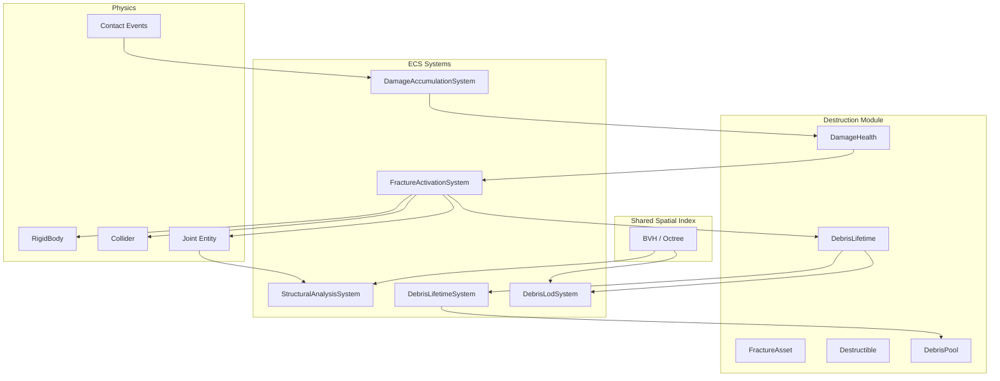
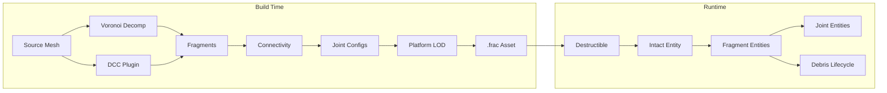
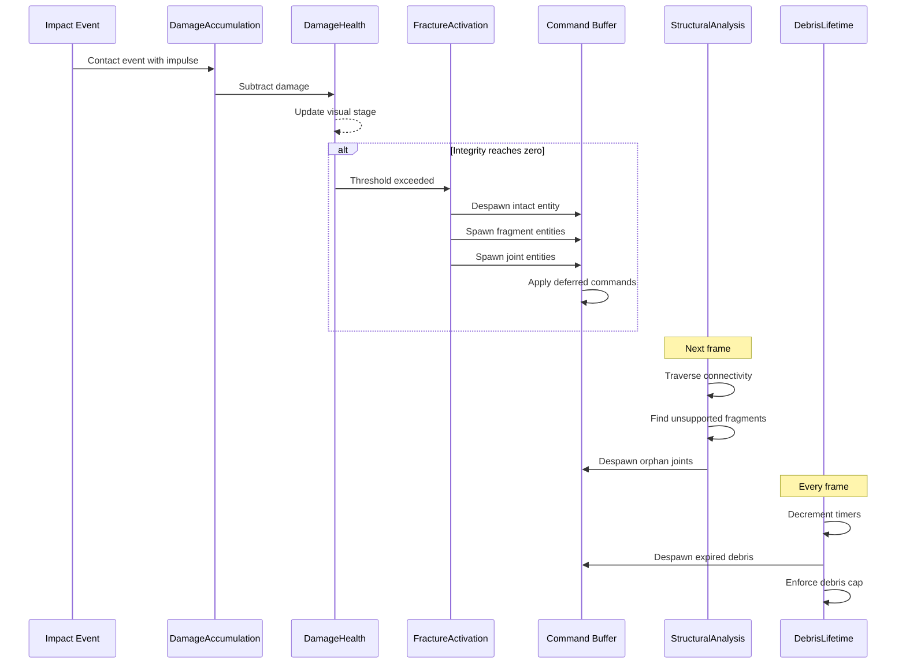
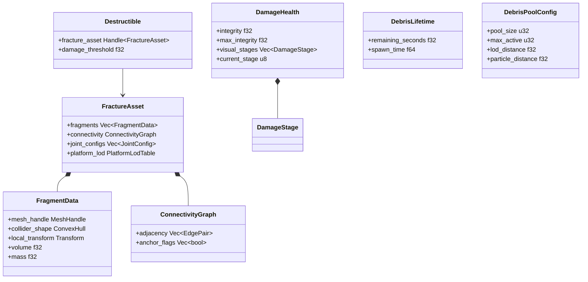
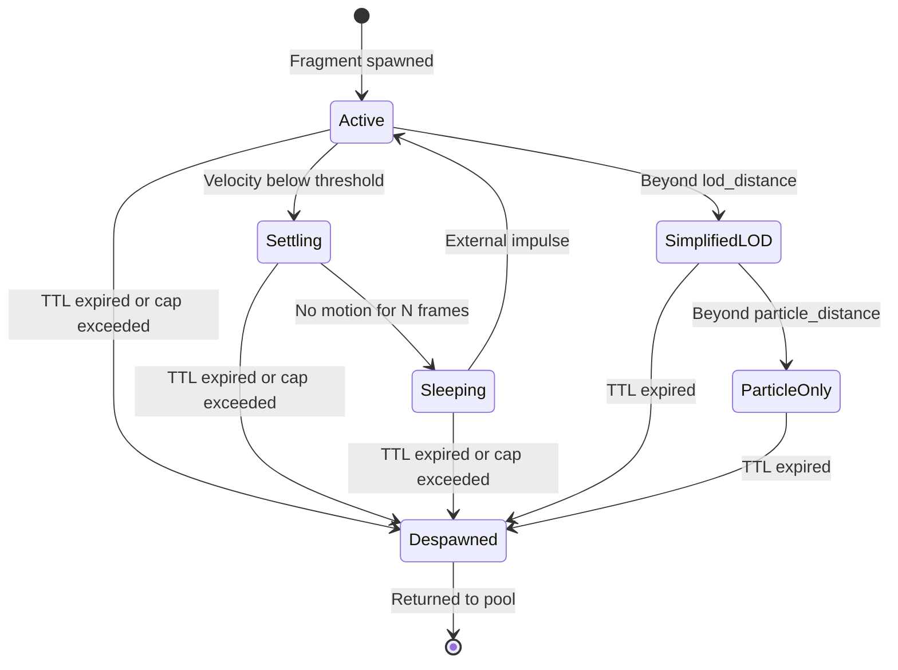

# Destruction System Design

## Requirements Trace

> **Canonical sources:** Features, requirements, and user
> stories are defined in [features/game-framework/](../../features/game-framework/),
> [requirements/game-framework/](../../requirements/game-framework/), and
> [user-stories/game-framework/](../../user-stories/game-framework/). The table
> below traces design elements to those definitions.

| Feature | Requirement | Description |
|---------|-------------|-------------|
| F-4.6.1 | R-4.6.1 | Voronoi fracture generation at build time |
| F-4.6.2 | R-4.6.2 | Pre-fractured mesh authoring from DCC tools |
| F-4.6.3 | R-4.6.3 | Runtime fracture activation on damage threshold |
| F-4.6.4 | R-4.6.4 | Progressive damage model with visual stages |
| F-4.6.5 | R-4.6.5 | Stress propagation and structural collapse |
| F-4.6.6 | R-4.6.6 | Debris simulation and lifecycle management |
| F-4.6.7 | R-4.6.7 | Debris pooling and LOD |

## Overview

The destruction system provides pre-computed fracture,
runtime activation, structural collapse, and debris
lifecycle management. All data lives as ECS components
and all logic runs as ECS systems.

Key design principles:

1. **Build-time fracture.** Voronoi decomposition and
   DCC-authored fractures are baked into fracture assets
   at import time. No runtime mesh generation.
2. **Threshold activation.** Cumulative damage tracked
   by `DamageHealth` triggers fracture when integrity
   reaches zero.
3. **ECS-only structural analysis.** Connectivity
   traversal over fragment and Joint entities determines
   structural support without a separate physics world.
4. **Budgeted spawning.** Fragment spawning is capped
   per frame per platform to prevent hitches.
5. **Pooled debris.** Entity recycling eliminates
   allocation churn. Distance-based LOD removes physics
   from distant fragments.

## Architecture

### Module Boundaries



```
harmonius_game/
├── destruction/
│   ├── asset.rs        # FractureAsset,
│   │                   # FragmentData,
│   │                   # ConnectivityGraph
│   ├── components.rs   # Destructible,
│   │                   # DamageHealth,
│   │                   # DebrisLifetime
│   ├── activation.rs   # FractureActivationSystem
│   ├── damage.rs       # DamageAccumulationSystem
│   ├── structural.rs   # StructuralAnalysisSystem
│   ├── debris.rs       # DebrisLifetimeSystem,
│   │                   # DebrisPool
│   ├── lod.rs          # DebrisLodSystem
│   └── config.rs       # PlatformDestructionConfig
└── pipeline/
    └── fracture.rs     # Voronoi decomposition,
                        # DCC fracture import
```

### Fracture Asset Pipeline



### Destruction Data Flow



### Core Data Structures



## API Design

### Fracture Asset

```rust
/// Pre-computed fracture data generated at build
/// time by Voronoi decomposition or DCC import.
pub struct FractureAsset {
    /// Per-fragment mesh, collider, and transform.
    pub fragments: Vec<FragmentData>,
    /// Adjacency graph connecting neighboring
    /// fragments.
    pub connectivity: ConnectivityGraph,
    /// Joint parameters per adjacency edge.
    pub joint_configs: Vec<JointConfig>,
    /// Per-platform fragment count limits.
    pub platform_lod: PlatformLodTable,
}

/// Geometry and physics data for one fragment.
pub struct FragmentData {
    /// Handle to the fragment's render mesh.
    pub mesh_handle: MeshHandle,
    /// Convex hull collider for physics.
    pub collider_shape: ConvexHull,
    /// Position/rotation relative to the intact
    /// object's origin.
    pub local_transform: Transform,
    /// Fragment volume in cubic meters.
    pub volume: f32,
    /// Fragment mass in kilograms.
    pub mass: f32,
}

/// Adjacency and grounding data.
pub struct ConnectivityGraph {
    /// Pairs of fragment indices that share a face.
    pub adjacency: Vec<(u32, u32)>,
    /// True if fragment is a grounded anchor.
    pub anchor_flags: Vec<bool>,
}

/// Joint break parameters for one adjacency edge.
pub struct JointConfig {
    /// Index of the first fragment.
    pub fragment_a: u32,
    /// Index of the second fragment.
    pub fragment_b: u32,
    /// Impulse magnitude that breaks this joint.
    pub break_threshold: f32,
}
```

### Platform LOD Table

```rust
/// Per-platform destruction budget.
pub struct PlatformLodTable {
    pub entries: Vec<PlatformLodEntry>,
}

pub struct PlatformLodEntry {
    /// Platform tier identifier.
    pub tier: PlatformTier,
    /// Maximum fragment count for this tier.
    pub max_fragments: u32,
    /// Maximum fracture activations per frame.
    pub max_activations_per_frame: u32,
}

#[derive(Clone, Copy, Debug, PartialEq, Eq)]
pub enum PlatformTier {
    Mobile,
    Switch,
    Desktop,
    HighEnd,
}
```

### ECS Components

```rust
/// Marks an entity as destructible. References
/// a pre-computed fracture asset.
#[derive(Component, Reflect)]
pub struct Destructible {
    /// Handle to the FractureAsset.
    pub fracture_asset: Handle<FractureAsset>,
    /// Cumulative damage required before fracture.
    pub damage_threshold: f32,
    /// Seed mode for Voronoi point placement.
    pub seed_mode: SeedMode,
}

#[derive(Clone, Copy, Debug, PartialEq, Eq, Reflect)]
pub enum SeedMode {
    /// Uniform random distribution.
    Random,
    /// Concentrated around expected impact points.
    ImpactDirected,
    /// Artist-placed seed points.
    ArtistGuided,
}

/// Tracks cumulative damage with visual stages.
#[derive(Component, Reflect)]
pub struct DamageHealth {
    /// Current structural integrity (0 = broken).
    pub integrity: f32,
    /// Maximum integrity at full health.
    pub max_integrity: f32,
    /// Ordered damage stages for visual feedback.
    pub visual_stages: Vec<DamageStage>,
    /// Index of the active visual stage.
    pub current_stage: u8,
}

/// One visual damage stage.
#[derive(Clone, Debug, Reflect)]
pub struct DamageStage {
    /// Integrity threshold below which this stage
    /// activates.
    pub threshold: f32,
    /// Visual crack intensity level (0-255).
    pub crack_level: u8,
}

/// Attached to fragment entities after fracture.
/// Controls debris cleanup timing.
#[derive(Component, Reflect)]
pub struct DebrisLifetime {
    /// Seconds until automatic despawn.
    pub remaining_seconds: f32,
    /// World time when the fragment was spawned.
    pub spawn_time: f64,
}

/// Marks a fragment as a grounded structural
/// anchor that supports other fragments.
#[derive(Component, Reflect)]
pub struct StructuralAnchor;

/// Tag component for fragment entities created
/// by the destruction system.
#[derive(Component, Reflect)]
pub struct DestructionFragment {
    /// Index into the source FractureAsset.
    pub fragment_index: u32,
    /// Entity ID of the original intact object.
    pub source_entity: Entity,
}
```

### Debris Pool

```rust
/// Pre-allocated entity pool for debris recycling.
pub struct DebrisPool {
    /// Available pre-spawned entities.
    free_list: Vec<Entity>,
    /// Maximum pool capacity.
    capacity: u32,
}

impl DebrisPool {
    pub fn new(capacity: u32) -> Self;

    /// Acquire a recycled entity, or None if the
    /// pool is empty. The caller resets components
    /// with new fragment data.
    pub fn acquire(&mut self) -> Option<Entity>;

    /// Return a despawned entity to the pool.
    pub fn release(&mut self, entity: Entity);

    pub fn available(&self) -> u32;
    pub fn capacity(&self) -> u32;
}
```

### Destruction Configuration

```rust
/// Global destruction budget per platform tier.
#[derive(Resource, Reflect)]
pub struct DestructionConfig {
    /// Maximum active debris entities.
    pub max_debris: u32,
    /// Default time-to-live for debris (seconds).
    pub default_ttl: f32,
    /// Maximum fracture activations per frame.
    pub max_activations_per_frame: u32,
    /// Maximum fragments per activation.
    pub max_fragments_per_activation: u32,
    /// Distance at which debris LOD reduces
    /// collision complexity.
    pub lod_distance: f32,
    /// Distance beyond which debris becomes
    /// visual-only particles.
    pub particle_distance: f32,
    /// Debris entity pool size.
    pub pool_size: u32,
}
```

### ECS Systems

```rust
/// Processes contact events and subtracts damage
/// from DamageHealth based on impulse magnitude.
/// Advances visual cracking stages.
pub struct DamageAccumulationSystem;

impl System for DamageAccumulationSystem {
    /// Query: (DamageHealth, Collider)
    /// Reads: ContactEvents
    /// Writes: DamageHealth
    fn run(
        &mut self,
        query: Query<(&mut DamageHealth, &Collider)>,
        contact_events: Res<ContactEvents>,
    );
}

/// Triggers fracture when DamageHealth integrity
/// reaches zero. Despawns the intact entity and
/// spawns fragment + joint entities from the
/// FractureAsset, budgeted per frame.
pub struct FractureActivationSystem;

impl System for FractureActivationSystem {
    /// Query: (Destructible, DamageHealth, Transform)
    /// Reads: FractureAssets, DestructionConfig
    /// Writes: Commands
    fn run(
        &mut self,
        query: Query<(
            Entity,
            &Destructible,
            &DamageHealth,
            &Transform,
        )>,
        assets: Res<Assets<FractureAsset>>,
        config: Res<DestructionConfig>,
        commands: Commands,
    );
}

/// Traverses fragment connectivity graph to find
/// fragments without a path to a StructuralAnchor.
/// Despawns joints on unsupported fragments so
/// they fall under gravity.
///
/// Structural analysis uses the shared
/// `ConnectivityAnalyzer` (see
/// [shared-primitives.md](../core-runtime/shared-primitives.md)).
/// The building system (see
/// [building-survival.md](building-survival.md))
/// shares this analyzer for structural integrity.
pub struct StructuralAnalysisSystem;

impl System for StructuralAnalysisSystem {
    /// Query: (DestructionFragment, Joint)
    /// Reads: StructuralAnchor tags
    /// Writes: Commands (despawn joints)
    fn run(
        &mut self,
        fragments: Query<(
            Entity,
            &DestructionFragment,
        )>,
        joints: Query<(Entity, &Joint)>,
        anchors: Query<Entity, With<StructuralAnchor>>,
        commands: Commands,
    );
}

/// Decrements DebrisLifetime timers, despawns
/// expired debris, enforces the global debris cap
/// by removing the oldest fragments first.
pub struct DebrisLifetimeSystem;

impl System for DebrisLifetimeSystem {
    /// Query: (DebrisLifetime, Transform)
    /// Reads: DestructionConfig, Time
    /// Writes: Commands, DebrisPool
    fn run(
        &mut self,
        query: Query<(
            Entity,
            &mut DebrisLifetime,
        )>,
        config: Res<DestructionConfig>,
        time: Res<Time>,
        pool: ResMut<DebrisPool>,
        commands: Commands,
    );
}

/// Reduces collision complexity for distant debris.
/// Removes RigidBody and Collider beyond the
/// particle distance threshold.
pub struct DebrisLodSystem;

impl System for DebrisLodSystem {
    /// Query: (DebrisLifetime, Transform)
    /// Reads: CameraTransform, DestructionConfig
    /// Writes: Commands
    fn run(
        &mut self,
        query: Query<(
            Entity,
            &DebrisLifetime,
            &Transform,
        )>,
        camera: Query<&Transform, With<CameraBrain>>,
        config: Res<DestructionConfig>,
        commands: Commands,
    );
}
```

## Data Flow

### Frame Lifecycle

Each frame, destruction systems execute in order
within the ECS schedule:

1. **DamageAccumulationSystem** reads contact events,
   subtracts damage from `DamageHealth`, and advances
   visual crack stages.
2. **FractureActivationSystem** queries entities where
   `integrity <= 0`. For each, up to
   `max_activations_per_frame`, it despawns the intact
   entity and spawns fragment + joint entities from the
   fracture asset. Spawning is staggered across frames
   when fragment count exceeds the per-frame budget.
3. **StructuralAnalysisSystem** traverses the
   connectivity graph of all fragment entities connected
   by joints. BFS from each `StructuralAnchor` marks
   reachable fragments. Unreachable fragments have their
   joints despawned, releasing them to fall under
   gravity.
4. **DebrisLifetimeSystem** decrements timers, despawns
   expired debris, and enforces the global cap by
   removing the oldest fragments.
5. **DebrisLodSystem** queries camera distance to each
   debris entity via the shared spatial index. Beyond
   `lod_distance`, collision shapes are simplified.
   Beyond `particle_distance`, `RigidBody` and
   `Collider` are removed entirely.

### Structural Connectivity Traversal

```rust
// Pseudocode for structural analysis BFS.
fn find_unsupported_fragments(
    fragments: &[(Entity, &DestructionFragment)],
    joints: &[(Entity, &Joint)],
    anchors: &[Entity],
) -> Vec<Entity> {
    // Build adjacency from joint entities.
    let mut adj: HashMap<Entity, Vec<Entity>> =
        HashMap::new();
    for (_, joint) in joints {
        adj.entry(joint.entity_a)
            .or_default()
            .push(joint.entity_b);
        adj.entry(joint.entity_b)
            .or_default()
            .push(joint.entity_a);
    }

    // BFS from all anchors.
    let mut visited: HashSet<Entity> =
        HashSet::new();
    let mut queue: VecDeque<Entity> =
        VecDeque::new();
    for &anchor in anchors {
        visited.insert(anchor);
        queue.push_back(anchor);
    }
    while let Some(current) = queue.pop_front() {
        if let Some(neighbors) = adj.get(&current) {
            for &n in neighbors {
                if visited.insert(n) {
                    queue.push_back(n);
                }
            }
        }
    }

    // Fragments not visited are unsupported.
    fragments
        .iter()
        .filter(|(e, _)| !visited.contains(e))
        .map(|(e, _)| *e)
        .collect()
}
```

### Debris State Transitions



## Platform Considerations

### Destruction Budgets

| Platform | Max Fragments | Activations/Frame | Max Debris | TTL | Pool |
|----------|--------------|-------------------|-----------|-----|------|
| Mobile | 8 | 1 | 32 | 3 s | 32 |
| Switch | 16 | 2 | 64 | 5 s | 64 |
| Desktop | 64 | 8 | 512 | 10 s | 512 |
| High-end PC | 256 | 16 | 2048 | 30 s | 2048 |

### LOD Distances

| Platform | LOD Distance | Particle Distance |
|----------|-------------|-------------------|
| Mobile | 10 m | 20 m |
| Switch | 20 m | 40 m |
| Desktop | 50 m | 100 m |
| High-end PC | 100 m | 200 m |

### Structural Analysis

| Platform | Enabled | Max Nodes | Notes |
|----------|---------|-----------|-------|
| Mobile | No | N/A | Pre-baked collapse sequences |
| Switch | Yes | 32 | Simplified traversal |
| Desktop | Yes | 256 | Full stress propagation |
| High-end PC | Yes | 1024 | Parallel graph traversal |

### Platform-Specific Notes

- **All platforms:** Fracture assets baked at build
  time with platform-appropriate fragment counts.
  No runtime mesh generation.
- **Mobile:** Structural analysis disabled; collapse
  sequences are pre-authored in the editor and played
  back as canned animations.
- **Desktop/High-end:** Parallel BFS via scoped tasks
  on the thread pool for large connectivity graphs
  (> 128 nodes).
- **Networking:** `DamageHealth` is server-authoritative
  and replicated via the ECS state replication system.
  Clients cannot modify integrity locally.

### Proposed Dependencies

No new external dependencies required. The destruction
system uses existing engine modules:

| Module | Usage |
|--------|-------|
| `harmonius_core::ecs` | Components, systems, queries, commands |
| `harmonius_physics` | RigidBody, Collider, Joint, ContactEvents |
| `harmonius_core::spatial` | Shared BVH for distance queries |
| `harmonius_platform::threading` | Scoped tasks for parallel BFS |
| `harmonius_content` | FractureAsset loading, Voronoi pipeline |

## Test Plan

### Unit Tests

| Test | Req | Description |
|------|-----|-------------|
| `test_voronoi_volume_preservation` | R-4.6.1 | Fracture unit cube into 20 fragments; assert total volume within 1% of original. |
| `test_convex_hull_validity` | R-4.6.1 | All generated fragments are valid convex hulls. |
| `test_platform_fragment_cap` | R-4.6.1 | Mobile fracture capped at 8 fragments. |
| `test_dcc_asset_load` | R-4.6.2 | Load pre-fractured asset; verify fragment count, connectivity, and joint configs. |
| `test_fracture_activation_threshold` | R-4.6.3 | Apply damage exceeding threshold; assert intact entity despawned and fragments spawned. |
| `test_fragment_transform_accuracy` | R-4.6.3 | Fragment positions match fracture asset layout within 0.001 m. |
| `test_activation_budget_per_frame` | R-4.6.3 | Mobile: max 1 activation per frame enforced. |
| `test_staggered_spawning` | R-4.6.3 | 64-fragment object on mobile spawns across multiple frames. |
| `test_damage_accumulation` | R-4.6.4 | Apply 3 impacts; verify integrity decreases proportionally. |
| `test_visual_stage_progression` | R-4.6.4 | 3-stage DamageHealth; each stage triggers in order. |
| `test_damage_from_multiple_types` | R-4.6.4 | Projectile, explosion, and melee all accumulate correctly. |
| `test_cascading_collapse` | R-4.6.5 | 3-column arch; break keystone; unsupported fragments fall. |
| `test_anchor_connectivity` | R-4.6.5 | Fragments connected to anchor remain supported. |
| `test_mobile_structural_disabled` | R-4.6.5 | Mobile uses pre-baked sequences, not runtime analysis. |
| `test_debris_ttl_expiration` | R-4.6.6 | Debris despawned within 1 frame of TTL expiry. |
| `test_debris_cap_enforcement` | R-4.6.6 | Spawn 500 debris with cap 200; oldest despawned first. |
| `test_debris_sleep_transition` | R-4.6.6 | Settled debris enters sleeping state with zero sim cost. |
| `test_pooling_reduces_alloc` | R-4.6.7 | 10 destructions with pooling vs without; pooling reduces allocations by 80%+. |
| `test_lod_component_removal` | R-4.6.7 | Debris beyond particle distance has no RigidBody or Collider. |

### Integration Tests

| Test | Req | Description |
|------|-----|-------------|
| `test_damage_replication` | R-4.6.4 | Server DamageHealth replicates to client; client cannot modify locally. |
| `test_destruction_with_cover` | R-4.6.3 | Destroying cover object removes cover points from spatial index. |
| `test_destruction_audio` | R-4.6.3 | Fracture activation emits destruction audio event. |
| `test_debris_visual_particles` | R-4.6.7 | Distant debris rendered as visual particles without physics. |

### Benchmarks

| Benchmark | Target | Source |
|-----------|--------|--------|
| Fracture activation (50 fragments) | < 2 ms | R-4.6.NF1 |
| Structural analysis (200 nodes) | < 0.5 ms | R-4.6.NF3 |
| Sustained destruction (2000 fragments, cap 500) | Stable frame rate | R-4.6.NF2 |
| Debris pool acquire/release | < 1 us per op | US-4.6.7.12 |
| Debris LOD query (512 entities) | < 0.5 ms | US-4.6.7.2 |

## Open Questions

1. **Voronoi library.** Use an existing Voronoi crate
   (e.g., `voronoi-rs`) or implement custom 3D Voronoi
   decomposition in the content pipeline? Custom
   implementation gives control over convex hull
   quality.
2. **Fragment merging.** Should adjacent sleeping
   fragments merge back into a single rigid body to
   reduce entity count? This adds complexity but
   reduces long-term simulation cost.
3. **Networked fracture determinism.** Fracture
   activation is server-authoritative, but fragment
   physics may diverge on clients. Should fragment
   spawning be replicated per-fragment, or should
   clients replay from the fracture asset locally?
4. **Destruction VFX integration.** How do dust, smoke,
   and spark VFX attach to fracture events? Per-fragment
   emitters vs. a single burst at the fracture origin.
5. **Partial fracture.** The current design fractures
   the entire object when integrity reaches zero. Should
   localized fracture (breaking only fragments near the
   impact point) be supported as a separate mode?
