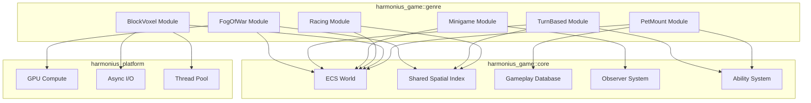
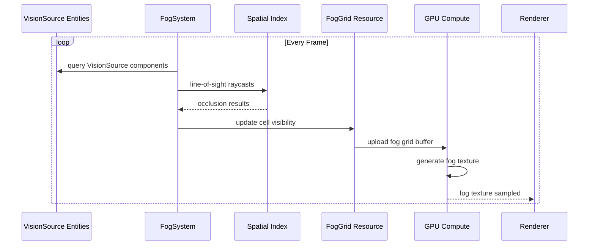
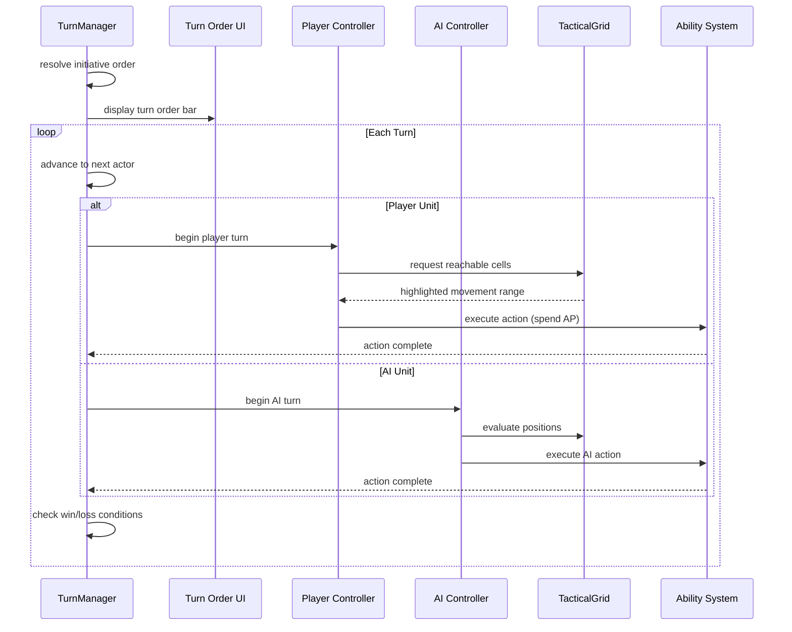
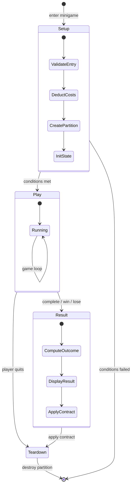
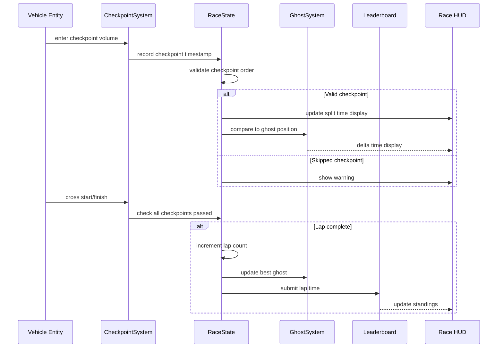
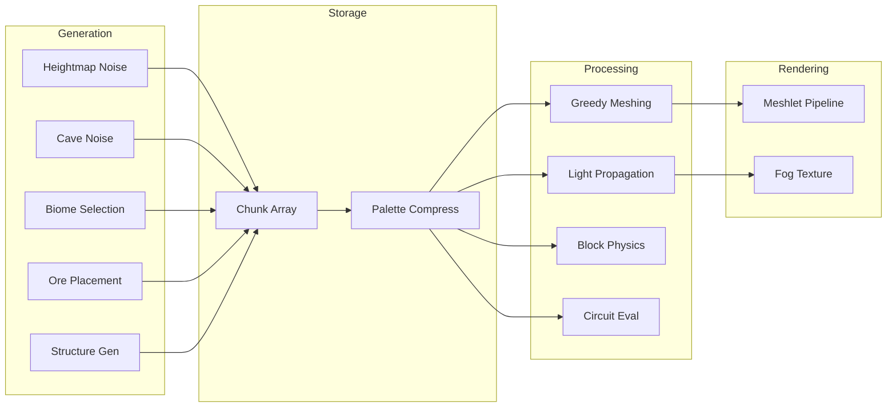
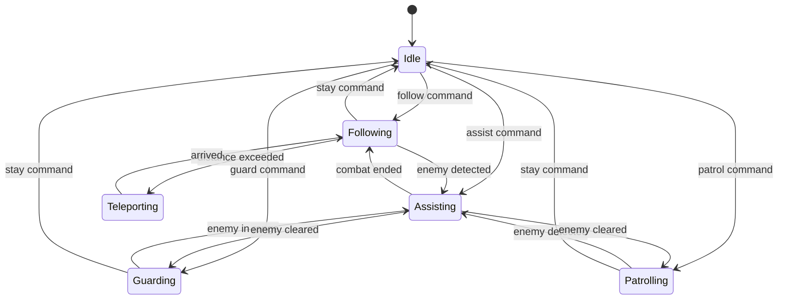

# Genre-Specific Systems Design

## Requirements Trace

> **Canonical sources:** Features, requirements, and user stories are defined in
> [features/game-framework/](../../features/game-framework/),
> [requirements/game-framework/](../../requirements/game-framework/), and
> [user-stories/game-framework/](../../user-stories/game-framework/). The table below traces design
> elements to those definitions.

| Feature    | Requirement |
|------------|-------------|
| F-13.20.1  | R-13.20.1   |
| F-13.20.2  | R-13.20.2   |
| F-13.20.3  | R-13.20.3   |
| F-13.20.4  | R-13.20.4   |
| F-13.21.1  | R-13.21.1   |
| F-13.21.2  | R-13.21.2   |
| F-13.21.3  | R-13.21.3   |
| F-13.21.4  | R-13.21.4   |
| F-13.21.5  | R-13.21.5   |
| F-13.26.1  | R-13.26.1   |
| F-13.26.2  | R-13.26.2   |
| F-13.26.3  | R-13.26.3   |
| F-13.26.4  | R-13.26.4   |
| F-13.26.5a | R-13.26.5a  |
| F-13.26.5b | R-13.26.5b  |
| F-13.26.5c | R-13.26.5c  |
| F-13.26.5d | R-13.26.5d  |
| F-13.26.6  | R-13.26.6   |
| F-13.26.7  | R-13.26.7   |
| F-13.26.8  | R-13.26.8   |
| F-13.22.1  | R-13.22.1   |
| F-13.22.2  | R-13.22.2   |
| F-13.22.3a | R-13.22.3a  |
| F-13.22.3b | R-13.22.3b  |
| F-13.22.3c | R-13.22.3c  |
| F-13.22.4  | R-13.22.4   |
| F-13.22.5  | R-13.22.5   |
| F-13.27.1  | R-13.27.1   |
| F-13.27.2  | R-13.27.2   |
| F-13.27.3  | R-13.27.3   |
| F-13.27.4  | R-13.27.4   |
| F-13.27.5  | R-13.27.5   |
| F-13.27.6a | R-13.27.6a  |
| F-13.27.6b | R-13.27.6b  |
| F-13.27.6c | R-13.27.6c  |
| F-13.27.7a | R-13.27.7a  |
| F-13.27.7b | R-13.27.7b  |
| F-13.27.7c | R-13.27.7c  |
| F-13.27.7d | R-13.27.7d  |
| F-13.27.8a | R-13.27.8a  |
| F-13.27.8b | R-13.27.8b  |
| F-13.27.8c | R-13.27.8c  |
| F-13.27.8d | R-13.27.8d  |
| F-13.15.1  | R-13.15.1   |
| F-13.15.2  | R-13.15.2   |
| F-13.15.3a | R-13.15.3a  |
| F-13.15.3b | R-13.15.3b  |
| F-13.15.3c | R-13.15.3c  |
| F-13.15.3d | R-13.15.3d  |
| F-13.15.4  | R-13.15.4   |
| F-13.15.5a | R-13.15.5a  |
| F-13.15.5b | R-13.15.5b  |
| F-13.15.5c | R-13.15.5c  |

1. **F-13.20.1** — Fog of war grid with 3-state visibility and GPU fog texture
2. **F-13.20.2** — Vision sources with sight radius, shape, and LOS blocking
3. **F-13.20.3** — Vision modifier volumes (stealth zones, smoke, high ground)
4. **F-13.20.4** — Fog memory with last-seen snapshots in shrouded areas
5. **F-13.21.1** — Tactical grid (square/hex) with cover, elevation, occupancy
6. **F-13.21.2** — Turn manager with initiative, team-based, and phase modes
7. **F-13.21.3** — Action point movement and abilities per turn
8. **F-13.21.4** — Grid cover, flanking, and overwatch stance
9. **F-13.21.5** — Hit probability computation and combat resolution
10. **F-13.26.1** — Minigame session with isolated ECS world partition
11. **F-13.26.2** — Minigame presentation modes (world-space, fullscreen, split, diegetic)
12. **F-13.26.3** — Minigame lifecycle with typed result contract
13. **F-13.26.4** — Timing/rhythm minigame template
14. **F-13.26.5a** — Grid/board engine for card/board/match-3 games
15. **F-13.26.5b** — Match detection algorithms
16. **F-13.26.5c** — Board minigame AI with difficulty tiers
17. **F-13.26.5d** — Board piece animation and cascading
18. **F-13.26.6** — Physics toy minigame template
19. **F-13.26.7** — Multiplayer minigame sessions
20. **F-13.26.8** — Minigame library and discovery registry
21. **F-13.22.1** — Track and checkpoint system with lap timing
22. **F-13.22.2** — Data-driven race mode framework
23. **F-13.22.3a** — Racing AI navigation via waypoint splines
24. **F-13.22.3b** — Rubber-banding difficulty adjustment
25. **F-13.22.3c** — AI racing behavior and personality profiles
26. **F-13.22.4** — Drift scoring and boost system
27. **F-13.22.5** — Ghost replay recording and leaderboards
28. **F-13.27.1** — Block type registry with O(1) lookup
29. **F-13.27.2** — Block placement and destruction via raycast
30. **F-13.27.3** — Chunk-based storage with palette compression
31. **F-13.27.4** — Greedy meshing with face culling and AO
32. **F-13.27.5** — Flood-fill lighting (sunlight + block light)
33. **F-13.27.6a** — Gravity-affected block physics
34. **F-13.27.6b** — Fluid flow simulation (water, lava)
35. **F-13.27.6c** — Fluid-block interactions (ignition, extinguish)
36. **F-13.27.7a** — Signal source and wire blocks
37. **F-13.27.7b** — Logic gate blocks (repeaters, comparators)
38. **F-13.27.7c** — Mechanism blocks (pistons, doors, hoppers)
39. **F-13.27.7d** — Deterministic circuit evaluation with budget
40. **F-13.27.8a** — Seed-deterministic block terrain generation
41. **F-13.27.8b** — Biome system with smooth transitions
42. **F-13.27.8c** — Ore vein placement via 3D noise
43. **F-13.27.8d** — Structure generation (trees, villages, dungeons)
44. **F-13.15.1** — Companion AI with commands and pathfinding
45. **F-13.15.2** — Pet needs and mood system
46. **F-13.15.3a** — Mount summoning and dismissal
47. **F-13.15.3b** — Mounted locomotion with physics swap
48. **F-13.15.3c** — Mounted combat with ability restrictions
49. **F-13.15.3d** — Ground, flying, and aquatic mount types
50. **F-13.15.4** — Creature taming with progress and probability
51. **F-13.15.5a** — Pet life stages (baby to elder)
52. **F-13.15.5b** — Evolution branching via diet/training
53. **F-13.15.5c** — Breeding with trait inheritance

## Overview

This document covers six genre-specific systems that extend the core game framework with specialized
gameplay mechanics. Each system is 100% ECS-based, data-driven, and authored through visual editors.

1. **Fog of War** -- GPU-computed visibility for RTS/strategy games
2. **Turn-Based Combat** -- tactical grid, initiative, action points, cover
3. **Minigame Framework** -- isolated sessions with typed result contracts
4. **Racing** -- checkpoints, lap timing, drift, ghost replay
5. **Block/Voxel** -- Minecraft-style chunk world with meshing, lighting, circuits
6. **Pets and Mounts** -- companion AI, taming, breeding, mounted locomotion

## Architecture

### Module Boundaries



### File Structure

```text
harmonius_game/
├── genre/
│   ├── fog_of_war/
│   │   ├── grid.rs         # FogGrid, FogCell
│   │   ├── vision.rs       # VisionSource, VisionModifier
│   │   ├── memory.rs       # FogMemory snapshots
│   │   ├── gpu.rs          # GPU fog texture gen
│   │   └── systems.rs      # FogUpdateSystem
│   ├── turn_based/
│   │   ├── grid.rs         # TacticalGrid, GridCell
│   │   ├── turn.rs         # TurnManager, TurnOrder
│   │   ├── action.rs       # ActionPoints, TurnAction
│   │   ├── cover.rs        # CoverValue, Overwatch
│   │   ├── combat.rs       # HitProbability, CombatResult
│   │   └── systems.rs      # TurnSystem, CoverSystem
│   ├── minigame/
│   │   ├── session.rs       # MinigameSession, Context
│   │   ├── contract.rs      # ResultContract, EntryReq
│   │   ├── presentation.rs  # PresentationMode
│   │   ├── timing.rs        # TimingTemplate, BeatTrack
│   │   ├── board.rs         # BoardEngine, MatchDetect
│   │   ├── physics_toy.rs   # PhysicsSandbox
│   │   ├── registry.rs      # MinigameRegistry
│   │   └── systems.rs       # MinigameLifecycle
│   ├── racing/
│   │   ├── track.rs         # Checkpoint, TrackLayout
│   │   ├── mode.rs          # RaceMode, RuleComponent
│   │   ├── ai.rs            # RacingAI, RubberBanding
│   │   ├── drift.rs         # DriftDetector, BoostMeter
│   │   ├── ghost.rs         # GhostRecorder, GhostReplay
│   │   └── systems.rs       # RaceSystem, DriftSystem
│   ├── block_voxel/
│   │   ├── registry.rs      # BlockTypeRegistry
│   │   ├── chunk.rs         # Chunk, ChunkManager
│   │   ├── meshing.rs       # GreedyMesher
│   │   ├── lighting.rs      # LightPropagation
│   │   ├── physics.rs       # GravityBlock, FluidFlow
│   │   ├── circuit.rs       # SignalSource, Wire, Gate
│   │   ├── worldgen.rs      # TerrainGen, BiomeGen
│   │   └── systems.rs       # ChunkSystem, LightSystem
│   └── pet_mount/
│       ├── companion.rs     # CompanionAI, Command
│       ├── needs.rs         # PetNeeds, MoodState
│       ├── mount.rs         # MountType, MountedState
│       ├── taming.rs        # TamingProgress
│       ├── breeding.rs      # BreedingPair, Offspring
│       ├── growth.rs        # LifeStage, Evolution
│       └── systems.rs       # CompanionSystem, MountSystem
```

### Core Data Structures

```mermaid
classDiagram
    class FogState {
        <<enumeration>>
        Unexplored
        Shrouded
        Visible
    }
    class VisionShape {
        <<enumeration>>
        Circle
        Cone
    }
    class VisionModifierKind {
        <<enumeration>>
        StealthZone
        VisionBlocker
        HighGround
        Darkness
    }
    class GridShape {
        <<enumeration>>
        Square
        Hexagonal
    }
    class CoverValue {
        <<enumeration>>
        None
        Half
        Full
    }
    class TurnMode {
        <<enumeration>>
        RoundRobin
        Initiative
        TeamBased
        PhaseBased
    }
    class TurnPhase {
        <<enumeration>>
        WaitingForInput
        Executing
        Animating
        EndOfTurn
    }
    class CombatOutcome {
        <<enumeration>>
        Miss
        Graze
        Hit
        Critical
    }
    class PresentationMode {
        <<enumeration>>
        WorldSpace
        FullscreenOverlay
        SplitView
        Diegetic
    }
    class MinigamePhase {
        <<enumeration>>
        Setup
        Play
        Result
        Teardown
    }
    class QuitPolicy {
        <<enumeration>>
        Loss
        Refund
        NoEffect
    }
    class MatchPattern {
        <<enumeration>>
        ThreeInARow
        FourInARow
        FiveInARow
        PokerHand
        Custom
    }
    class RaceModeKind {
        <<enumeration>>
        Circuit
        TimeTrial
        Elimination
        Knockout
        DriftChallenge
        DragRace
        CheckpointRace
    }
    class RacingPersonality {
        <<enumeration>>
        Cautious
        Balanced
        Aggressive
    }
    class BlockCollision {
        <<enumeration>>
        Solid
        Passable
        Liquid
        Climbable
    }
    class FogGrid {
        +width u32
        +height u32
        +faction_data Vec~FogFactionLayer~
    }
    class TacticalGrid {
        +shape GridShape
        +width u32
        +height u32
        +cells Vec~GridCell~
    }
    class TurnManager {
        +mode TurnMode
        +turn_count u32
        +current_actor Option~EntityId~
    }
    class MinigameSession {
        +world_partition WorldPartitionId
        +presentation PresentationMode
        +phase MinigamePhase
        +contract ResultContract
    }
    class RaceProgress {
        +checkpoints_hit BitSet
        +current_lap u32
        +best_lap_us Option~u64~
    }
    class BlockTypeRegistry {
        +types Vec~Option~BlockTypeDef~~
        +get(id) Option~BlockTypeDef~
    }
    FogGrid --> FogState
    TacticalGrid --> GridShape
    TacticalGrid --> CoverValue
    TurnManager --> TurnMode
    TurnManager --> TurnPhase
    MinigameSession --> PresentationMode
    MinigameSession --> MinigamePhase
    RaceProgress --> RaceModeKind
    BlockTypeRegistry --> BlockCollision
```



---

## API Design

Each genre subsystem is self-contained with its own ECS components, systems, and data structures.
The subsections below define the API for each genre.

### 1. Fog of War

### Fog of War Data Flow



### Fog of War Components

```rust
/// Visibility state for a single fog cell.
/// Encoded as 2 bits per cell per faction.
#[derive(
    Clone, Copy, Debug, PartialEq, Eq,
)]
pub enum FogState {
    /// Never seen. Fully hidden.
    Unexplored = 0,
    /// Previously seen. Shows terrain ghosts.
    Shrouded = 1,
    /// Currently visible. Real-time display.
    Visible = 2,
}

/// Per-faction fog grid stored as an ECS resource.
/// 2 bits per cell, packed into u32 words.
///
/// **Note:** Both the fog-of-war grid and tactical
/// grid are instances of `UniformGrid<T>` (see
/// [shared-primitives.md](../core-runtime/shared-primitives.md)).
/// The fog grid uses `UniformGrid<VisibilityState>`,
/// the tactical grid uses
/// `UniformGrid<CellProperties>`.
pub struct FogGrid {
    width: u32,
    height: u32,
    /// One bitfield per faction.
    faction_data: Vec<FogFactionLayer>,
}

pub struct FogFactionLayer {
    faction_id: FactionId,
    /// Packed 2-bit cells: ceil(width*height/16)
    /// u32 words.
    cells: Vec<u32>,
}

impl FogGrid {
    pub fn new(
        width: u32,
        height: u32,
        faction_count: u32,
    ) -> Self;

    pub fn get(
        &self,
        x: u32,
        y: u32,
        faction: FactionId,
    ) -> FogState;

    pub fn set(
        &mut self,
        x: u32,
        y: u32,
        faction: FactionId,
        state: FogState,
    );

    /// Serialize for network transmission.
    /// Full sync: 2 bits * width * height per faction.
    pub fn serialize_full(
        &self,
        faction: FactionId,
    ) -> Vec<u8>;

    /// Delta update: only changed cells since
    /// last sync.
    pub fn serialize_delta(
        &self,
        faction: FactionId,
        since: FrameId,
    ) -> Vec<u8>;
}

/// Attached to entities that reveal fog.
#[derive(Component)]
pub struct VisionSource {
    /// Base sight radius in grid cells.
    pub radius: u32,
    /// Shape of the vision cone.
    pub shape: VisionShape,
    /// Bonus radius per elevation tier above
    /// ground level.
    pub elevation_bonus: u32,
    /// Faction this vision source belongs to.
    pub faction: FactionId,
}

#[derive(Clone, Copy, Debug, PartialEq, Eq)]
pub enum VisionShape {
    /// 360-degree circle.
    Circle,
    /// Directional cone with half-angle in
    /// degrees.
    Cone { half_angle_deg: u32 },
}

/// Attached to trigger volume entities that
/// modify vision behavior.
#[derive(Component)]
pub struct VisionModifier {
    pub kind: VisionModifierKind,
}

#[derive(Clone, Copy, Debug, PartialEq, Eq)]
pub enum VisionModifierKind {
    /// Entities inside invisible to outsiders.
    StealthZone,
    /// Blocks all vision through the volume.
    VisionBlocker,
    /// Grants bonus vision radius to entities
    /// inside.
    HighGround { bonus: u32 },
    /// Reduces all vision radii within.
    Darkness { reduction: u32 },
}

/// Per-cell snapshot for fog memory. Stored per
/// faction as an ECS resource.
pub struct FogMemory {
    cells: Vec<FogMemoryCell>,
}

pub struct FogMemoryCell {
    /// Frame when cell was last visible.
    pub last_seen: FrameId,
    /// Entity reference of last-seen building.
    pub building_ref: Option<EntityId>,
    /// Resource state at last observation.
    pub resource_state: Option<u32>,
}
```

---

### 2. Turn-Based Combat

### Turn-Based Combat Sequence



### Turn-Based Components

```rust
/// Grid cell shape for the tactical grid.
#[derive(
    Clone, Copy, Debug, PartialEq, Eq,
)]
pub enum GridShape {
    Square,
    Hexagonal,
}

/// Per-cell data in the tactical grid.
pub struct GridCell {
    pub traversable: bool,
    pub elevation_tier: u8,
    /// Movement cost multiplier. 1.0 = normal,
    /// 2.0 = difficult terrain.
    pub movement_cost: f32,
    /// Directional cover values (per edge).
    pub cover: [CoverValue; 6],
    /// Entity occupying this cell, if any.
    pub occupant: Option<EntityId>,
    /// Terrain type for gameplay rules.
    pub terrain_type: TerrainTypeId,
}

#[derive(
    Clone, Copy, Debug, PartialEq, Eq,
)]
pub enum CoverValue {
    None,
    Half,
    Full,
}

/// The tactical grid, stored as an ECS resource.
pub struct TacticalGrid {
    shape: GridShape,
    width: u32,
    height: u32,
    cells: Vec<GridCell>,
    /// Floor connections for multi-floor grids.
    floor_links: Vec<FloorLink>,
}

impl TacticalGrid {
    pub fn new(
        shape: GridShape,
        width: u32,
        height: u32,
    ) -> Self;

    pub fn cell(
        &self,
        x: u32,
        y: u32,
    ) -> &GridCell;

    pub fn cell_mut(
        &mut self,
        x: u32,
        y: u32,
    ) -> &mut GridCell;

    /// BFS reachable cells within AP budget.
    /// Returns cells with path cost.
    pub fn reachable_cells(
        &self,
        origin: GridCoord,
        max_ap: u32,
    ) -> Vec<(GridCoord, u32)>;

    /// A* pathfinding between two cells.
    pub fn find_path(
        &self,
        from: GridCoord,
        to: GridCoord,
    ) -> Option<Vec<GridCoord>>;

    /// Get cover value from attacker direction.
    pub fn cover_between(
        &self,
        attacker: GridCoord,
        defender: GridCoord,
    ) -> CoverValue;
}

/// Turn ordering mode.
#[derive(
    Clone, Copy, Debug, PartialEq, Eq,
)]
pub enum TurnMode {
    /// Fixed order each round.
    RoundRobin,
    /// Speed stat determines order.
    Initiative,
    /// All of team A, then team B.
    TeamBased,
    /// Movement phase, action phase, end phase.
    PhaseBased,
}

/// ECS resource managing the turn lifecycle.
pub struct TurnManager {
    mode: TurnMode,
    turn_count: u32,
    current_actor: Option<EntityId>,
    turn_order: Vec<EntityId>,
    current_phase: TurnPhase,
}

#[derive(
    Clone, Copy, Debug, PartialEq, Eq,
)]
pub enum TurnPhase {
    WaitingForInput,
    Executing,
    Animating,
    EndOfTurn,
}

impl TurnManager {
    pub fn new(mode: TurnMode) -> Self;

    /// Resolve turn order from all participating
    /// entities. For initiative mode, sorts by
    /// speed stat descending.
    pub fn resolve_order(
        &mut self,
        participants: &[(EntityId, u32)],
    );

    /// Advance to the next actor. Returns the
    /// entity whose turn begins.
    pub fn advance(
        &mut self,
    ) -> Option<EntityId>;

    /// End the current actor's turn.
    pub fn end_turn(&mut self);

    pub fn current_actor(
        &self,
    ) -> Option<EntityId>;

    pub fn turn_count(&self) -> u32;
}

/// Attached to entities with turn-based movement.
#[derive(Component)]
pub struct ActionPoints {
    pub current: u32,
    pub max: u32,
}

/// Attached to entities in overwatch stance.
#[derive(Component)]
pub struct OverwatchStance {
    /// Direction and arc of overwatch cone.
    pub facing: Vec2,
    pub arc_deg: f32,
    /// Accuracy modifier (typically 0.5-0.8).
    pub accuracy_modifier: f32,
    /// Has this overwatch triggered this turn?
    pub triggered: bool,
}

/// Result of a combat resolution.
#[derive(Clone, Copy, Debug, PartialEq, Eq)]
pub enum CombatOutcome {
    Miss,
    Graze { damage: u32 },
    Hit { damage: u32 },
    Critical { damage: u32 },
}

/// Computes hit probability from all factors.
pub struct HitProbabilityCalc;

impl HitProbabilityCalc {
    /// Compute hit chance as a percentage (0-100).
    pub fn compute(
        base_accuracy: f32,
        range_penalty: f32,
        cover_bonus: f32,
        elevation_bonus: f32,
        flanking: bool,
        buffs: f32,
        attacker_accuracy: f32,
        defender_evasion: f32,
    ) -> f32;

    /// Resolve combat with weighted random.
    pub fn resolve(
        hit_chance: f32,
        crit_chance: f32,
        base_damage: u32,
        crit_multiplier: f32,
    ) -> CombatOutcome;
}
```

---

### 3. Minigame Framework

### Minigame Session Lifecycle



### Minigame Components

```rust
/// Presentation mode for rendering the minigame.
#[derive(
    Clone, Copy, Debug, PartialEq, Eq,
)]
pub enum PresentationMode {
    /// Render-to-texture on an in-world surface.
    WorldSpace,
    /// Fullscreen overlay with dimmed outer world.
    FullscreenOverlay,
    /// Minigame in a screen region.
    SplitView,
    /// 3D objects in the outer world.
    Diegetic,
}

/// Lifecycle phase of a minigame session.
#[derive(
    Clone, Copy, Debug, PartialEq, Eq,
)]
pub enum MinigamePhase {
    Setup,
    Play,
    Result,
    Teardown,
}

/// Policy applied when the player quits
/// mid-minigame.
#[derive(
    Clone, Copy, Debug, PartialEq, Eq,
)]
pub enum QuitPolicy {
    /// Quitting counts as a loss.
    Loss,
    /// Entry cost is refunded.
    Refund,
    /// No effect on outer world.
    NoEffect,
}

/// Entry conditions for starting a minigame.
pub struct EntryConditions {
    pub required_items: Vec<ItemId>,
    pub minimum_level: Option<u32>,
    pub currency_cost: Option<(CurrencyId, u64)>,
}

/// Typed result contract defining minigame I/O.
pub struct ResultContract {
    pub entry: EntryConditions,
    pub quit_policy: QuitPolicy,
    /// Outputs applied atomically on completion.
    pub outputs: Vec<ResultOutput>,
}

/// A single output applied to the outer world.
pub enum ResultOutput {
    GrantItem { item: ItemId, count: u32 },
    GrantCurrency { currency: CurrencyId, amount: u64 },
    SetQuestFlag { flag: QuestFlagId },
    ModifyReputation { faction: FactionId, delta: i32 },
    UnlockAchievement { achievement: AchievementId },
}

/// The live minigame session. One per active
/// minigame.
pub struct MinigameSession {
    /// Isolated ECS world partition.
    pub world_partition: WorldPartitionId,
    pub presentation: PresentationMode,
    pub phase: MinigamePhase,
    pub contract: ResultContract,
    /// Outer world tick behavior while active.
    pub outer_world_mode: OuterWorldMode,
}

#[derive(
    Clone, Copy, Debug, PartialEq, Eq,
)]
pub enum OuterWorldMode {
    Paused,
    ReducedTickRate { divisor: u32 },
    Normal,
}

impl MinigameSession {
    /// Create and initialize the session.
    /// Validates entry conditions, deducts costs,
    /// creates the ECS partition.
    pub fn start(
        contract: ResultContract,
        presentation: PresentationMode,
        outer_mode: OuterWorldMode,
    ) -> Result<Self, MinigameError>;

    /// Apply the result contract atomically to
    /// the outer world.
    pub fn apply_results(
        &self,
        outcome: MinigameOutcome,
    ) -> Result<(), MinigameError>;

    /// Destroy the session and reclaim memory.
    pub fn teardown(self);
}

/// Reusable timing/rhythm minigame template.
pub struct TimingTemplate {
    /// Beat markers synchronized to audio.
    pub beats: Vec<BeatMarker>,
    /// Input tolerance windows.
    pub windows: TimingWindows,
    /// Combo multiplier config.
    pub combo_config: ComboConfig,
}

pub struct TimingWindows {
    /// +/- milliseconds for each grade.
    pub perfect_ms: u32,
    pub great_ms: u32,
    pub good_ms: u32,
}

pub struct BeatMarker {
    pub timestamp_ms: u64,
    pub input_action: InputActionId,
    pub score_value: u32,
}

/// Reusable NxM board engine for grid-based
/// minigames.
pub struct BoardEngine {
    pub width: u32,
    pub height: u32,
    pub cells: Vec<BoardCell>,
    pub mode: BoardMode,
}

pub struct BoardCell {
    pub cell_type: BoardCellTypeId,
    pub piece: Option<BoardPieceId>,
}

#[derive(
    Clone, Copy, Debug, PartialEq, Eq,
)]
pub enum BoardMode {
    TurnBased,
    RealTime,
}

/// Match detection result for grid-based
/// minigames.
pub struct MatchResult {
    pub cells: Vec<GridCoord>,
    pub pattern: MatchPattern,
    pub score: u32,
}

#[derive(
    Clone, Copy, Debug, PartialEq, Eq,
)]
pub enum MatchPattern {
    ThreeInARow,
    FourInARow,
    FiveInARow,
    PokerHand(PokerHandRank),
    Custom(LogicGraphId),
}

/// Runtime registry of all available minigames.
pub struct MinigameRegistry {
    entries: Vec<MinigameEntry>,
}

pub struct MinigameEntry {
    pub id: MinigameId,
    pub name: StringId,
    pub category: MinigameCategory,
    pub player_count: RangeInclusive<u32>,
    pub avg_duration_sec: u32,
    pub difficulty: u8,
    pub unlock_condition: Option<UnlockConditionId>,
    pub discovered: bool,
    pub high_score: u64,
    pub completion_count: u32,
}
```

---

### 4. Racing Systems

### Checkpoint Flow



### Racing Components

```rust
/// A single checkpoint on the track.
#[derive(Component)]
pub struct Checkpoint {
    /// Position in the ordered sequence (0-based).
    pub index: u32,
    /// True if this is the start/finish line.
    pub is_start_finish: bool,
}

/// Per-racer race progress, attached to each
/// vehicle entity.
#[derive(Component)]
pub struct RaceProgress {
    /// Checkpoints passed in the current lap.
    pub checkpoints_hit: BitSet,
    /// Current lap number (0-based).
    pub current_lap: u32,
    /// Timestamp of each checkpoint crossing.
    pub split_times: Vec<u64>,
    /// Best lap time in microseconds.
    pub best_lap_us: Option<u64>,
    /// Finishing position (None if still racing).
    pub finish_position: Option<u32>,
}

/// Track definition stored as an ECS resource.
pub struct TrackLayout {
    pub checkpoint_count: u32,
    pub total_laps: u32,
    /// Boundary volumes that apply penalties.
    pub boundary_volumes: Vec<EntityId>,
}

/// Race mode configuration.
pub struct RaceMode {
    pub kind: RaceModeKind,
    pub scoring: ScoringRule,
    pub timer: TimerBehavior,
    pub elimination: Option<EliminationRule>,
    pub reward_distribution: Vec<RewardTier>,
}

#[derive(
    Clone, Copy, Debug, PartialEq, Eq,
)]
pub enum RaceModeKind {
    Circuit { laps: u32 },
    TimeTrial,
    Elimination,
    Knockout { round_duration_sec: u32 },
    DriftChallenge,
    DragRace,
    CheckpointRace,
}

/// AI racer navigation data per track segment.
pub struct RacingLineSegment {
    pub position: Vec3,
    pub target_speed: f32,
    pub braking_point: f32,
    /// 0.0 = hug inside, 1.0 = wide outside.
    pub line_offset: f32,
}

/// Attached to AI racer entities.
#[derive(Component)]
pub struct RacingAI {
    pub racing_line: Vec<RacingLineSegment>,
    pub current_segment: u32,
    pub top_speed_limiter: f32,
    pub braking_accuracy: f32,
    pub line_adherence: f32,
    pub personality: RacingPersonality,
}

#[derive(
    Clone, Copy, Debug, PartialEq, Eq,
)]
pub enum RacingPersonality {
    Cautious,
    Balanced,
    Aggressive,
}

/// Rubber-banding parameters stored as an
/// ECS resource.
pub struct RubberBanding {
    pub enabled: bool,
    /// Maximum time gap in seconds before
    /// rubber-banding activates.
    pub max_gap_sec: f32,
    /// Speed multiplier for trailing AI.
    pub trailing_boost: f32,
    /// Speed multiplier for leading AI.
    pub leading_penalty: f32,
}

/// Drift detection and scoring. Attached to
/// vehicle entities.
#[derive(Component)]
pub struct DriftState {
    /// True when slip angle exceeds threshold.
    pub drifting: bool,
    /// Current drift score accumulating.
    pub current_score: f32,
    /// Combo multiplier (increases with duration).
    pub combo_multiplier: f32,
    /// Slip angle threshold in degrees.
    pub slip_threshold_deg: f32,
}

/// Boost meter attached to vehicle entities.
#[derive(Component)]
pub struct BoostMeter {
    pub current: f32,
    pub max: f32,
    /// True when boost is actively applied.
    pub active: bool,
    /// Remaining boost duration in seconds.
    pub remaining_sec: f32,
    /// Speed increase while boosting.
    pub speed_bonus: f32,
}

/// Ghost replay recording. One per track per
/// player.
pub struct GhostRecording {
    pub track_id: TrackId,
    pub total_time_us: u64,
    /// Delta-compressed position samples at
    /// 120 Hz.
    pub samples: Vec<GhostSample>,
}

pub struct GhostSample {
    /// Delta from previous position.
    pub delta_pos: [i16; 3],
    /// Quantized rotation.
    pub rotation: [i16; 4],
    /// Input state bits.
    pub input_bits: u8,
}
```

---

### 5. Block/Voxel World

### Chunk Pipeline



### Block/Voxel Components

```rust
/// Unique identifier for a block type (0-1023).
#[derive(
    Clone, Copy, Debug, PartialEq, Eq,
    Hash, Ord, PartialOrd,
)]
pub struct BlockTypeId(pub u16);

/// Collision behavior for a block type.
#[derive(
    Clone, Copy, Debug, PartialEq, Eq,
)]
pub enum BlockCollision {
    Solid,
    Passable,
    Liquid,
    Climbable,
}

/// Properties for a registered block type.
pub struct BlockTypeDef {
    pub id: BlockTypeId,
    pub name: StringId,
    pub collision: BlockCollision,
    pub hardness: f32,
    pub tool_requirement: Option<ToolTypeId>,
    pub drop_table: DropTableId,
    pub light_emission: u8,
    pub light_attenuation: u8,
    pub transparent: bool,
    pub flammable: bool,
    pub blast_resistance: f32,
    /// Optional logic graph for custom behavior.
    pub behavior: Option<LogicGraphId>,
}

/// O(1) lookup registry for block types.
pub struct BlockTypeRegistry {
    /// Indexed by BlockTypeId. Capacity >= 1024.
    types: Vec<Option<BlockTypeDef>>,
}

impl BlockTypeRegistry {
    pub fn new() -> Self;

    pub fn register(
        &mut self,
        def: BlockTypeDef,
    ) -> Result<(), RegistryError>;

    /// O(1) lookup by ID.
    pub fn get(
        &self,
        id: BlockTypeId,
    ) -> Option<&BlockTypeDef>;
}

/// A 16x16x16 chunk of blocks.
pub struct Chunk {
    /// Palette-compressed block storage.
    storage: ChunkStorage,
    /// Two 4-bit light channels per block.
    light: ChunkLightData,
    /// Dirty flag for incremental re-meshing.
    dirty: bool,
}

/// Palette compression for chunk block data.
enum ChunkStorage {
    /// All blocks are the same type.
    Uniform(BlockTypeId),
    /// <= 16 unique types: 4-bit palette indices.
    Palette4 {
        palette: SmallVec<[BlockTypeId; 16]>,
        /// 4096 blocks * 4 bits = 2048 bytes.
        indices: [u8; 2048],
    },
    /// > 16 unique types: full 16-bit IDs.
    Full {
        /// 4096 blocks * 2 bytes = 8192 bytes.
        blocks: [BlockTypeId; 4096],
    },
}

impl Chunk {
    pub fn new_uniform(
        block: BlockTypeId,
    ) -> Self;

    pub fn get(
        &self,
        x: u8,
        y: u8,
        z: u8,
    ) -> BlockTypeId;

    pub fn set(
        &mut self,
        x: u8,
        y: u8,
        z: u8,
        block: BlockTypeId,
    );
}

/// Manages loaded, loading, and queued chunks.
pub struct ChunkManager {
    /// Loaded chunks indexed by chunk coordinate.
    loaded: HashMap<ChunkCoord, Chunk>,
    /// Render distance in chunks per axis.
    render_distance: u32,
}

impl ChunkManager {
    pub fn new(
        render_distance: u32,
    ) -> Self;

    /// Update loaded set based on player
    /// positions. Queues generation for new
    /// chunks and unloads distant ones.
    pub fn update(
        &mut self,
        player_positions: &[Vec3],
    );
}

/// Signal power level (0-15).
pub type SignalPower = u8;

/// Circuit component attached to signal-emitting
/// blocks.
#[derive(Component)]
pub struct SignalSource {
    pub power: SignalPower,
    pub active: bool,
}

/// Circuit wire that transmits power with
/// distance attenuation.
#[derive(Component)]
pub struct Wire {
    pub received_power: SignalPower,
}

/// Logic gate types for circuit networks.
#[derive(
    Clone, Copy, Debug, PartialEq, Eq,
)]
pub enum GateType {
    Repeater { delay_ticks: u8 },
    Comparator,
    NotGate,
}

/// Fluid flow state attached to fluid blocks.
#[derive(Component)]
pub struct FluidState {
    pub fluid_type: FluidTypeId,
    /// 0 = source, 1-7 = decreasing flow.
    pub flow_level: u8,
    /// Direction of flow for current force.
    pub flow_direction: Vec3,
}
```

---

### 6. Pets, Companions, and Mounts

### Companion State Machine



### Pet/Mount Components

```rust
/// Command issued to a companion entity.
#[derive(
    Clone, Copy, Debug, PartialEq, Eq,
)]
pub enum CompanionCommand {
    Follow,
    Guard { position: Vec3 },
    Assist,
    Stay,
    Patrol { route: PatrolRouteId },
    Passive,
}

/// Attached to companion entities.
#[derive(Component)]
pub struct CompanionAI {
    pub current_command: CompanionCommand,
    pub follow_distance: f32,
    pub teleport_distance: f32,
    pub owner: EntityId,
    pub behavior_tree: BehaviorTreeId,
}

/// Pet needs meters. Attached to pet entities.
#[derive(Component)]
pub struct PetNeeds {
    pub hunger: f32,
    pub happiness: f32,
    pub cleanliness: f32,
}

/// Mood derived from needs. Attached to pet
/// entities.
#[derive(Component)]
pub struct PetMood {
    pub state: MoodState,
}

#[derive(
    Clone, Copy, Debug, PartialEq, Eq,
)]
pub enum MoodState {
    Happy,
    Content,
    Unhappy,
    Neglected,
}

/// Mount movement type.
#[derive(
    Clone, Copy, Debug, PartialEq, Eq,
)]
pub enum MountType {
    Ground,
    Flying { max_altitude: f32 },
    Aquatic { max_depth: f32 },
}

/// Attached to mount entities when summoned.
#[derive(Component)]
pub struct MountStats {
    pub mount_type: MountType,
    pub speed: f32,
    pub acceleration: f32,
    pub jump_height: f32,
    pub turn_rate: f32,
    pub stamina: f32,
    pub armor: f32,
    pub combat_enabled: bool,
    pub allowed_abilities: Vec<AbilityId>,
}

/// Attached to the player entity while mounted.
#[derive(Component)]
pub struct MountedState {
    pub mount_entity: EntityId,
    /// True during enter/exit animation.
    pub transitioning: bool,
}

/// Taming progress attached to the creature
/// being tamed.
#[derive(Component)]
pub struct TamingProgress {
    pub progress: f32,
    pub required_progress: f32,
    pub base_success_rate: f32,
    /// Player entity attempting the tame.
    pub tamer: EntityId,
}

/// Life stage for creatures that grow.
#[derive(
    Clone, Copy, Debug, PartialEq, Eq,
    Ord, PartialOrd,
)]
pub enum LifeStage {
    Baby,
    Juvenile,
    Adult,
    Elder,
}

/// Attached to creatures with growth/evolution.
#[derive(Component)]
pub struct PetGrowth {
    pub stage: LifeStage,
    /// Progress toward next stage (0.0-1.0).
    pub progress: f32,
    /// Growth mode.
    pub mode: GrowthMode,
}

#[derive(
    Clone, Copy, Debug, PartialEq, Eq,
)]
pub enum GrowthMode {
    TimeBased { seconds_per_stage: u32 },
    ExperienceBased { xp_per_stage: u32 },
}

/// Attached to creatures eligible for evolution.
#[derive(Component)]
pub struct EvolutionTracker {
    /// Accumulated diet/training history used
    /// to determine evolution branch.
    pub meat_fed: u32,
    pub herb_fed: u32,
    pub combat_xp: u32,
    pub tracking_xp: u32,
}

/// Breeding pair state. Attached to a "stable"
/// or "pen" entity.
#[derive(Component)]
pub struct BreedingPair {
    pub parent_a: EntityId,
    pub parent_b: EntityId,
    pub gestation_remaining_sec: f32,
    /// Computed at breeding start from parents.
    pub offspring_traits: OffspringTraits,
}

pub struct OffspringTraits {
    pub color: ColorId,
    pub stat_bonuses: Vec<(StatId, f32)>,
    pub special_abilities: Vec<AbilityId>,
}
```

## Data Flow

### Per-Frame System Execution

Each genre system runs as ECS systems within the frame graph. Systems declare their component
queries and resource access, enabling the ECS scheduler to parallelize independent systems.

1. **Fog of War** -- `FogUpdateSystem` queries all `VisionSource` + `Transform` entities, raycasts
   through the spatial index, updates the `FogGrid` resource, uploads to GPU.
2. **Turn-Based** -- `TurnSystem` advances the `TurnManager` resource, `CoverSystem` updates cover
   values, `CombatSystem` resolves attacks.
3. **Minigame** -- `MinigameLifecycleSystem` manages session phases. The minigame's own systems run
   in the isolated world partition.
4. **Racing** -- `CheckpointSystem` detects volume overlaps, `DriftSystem` reads vehicle physics,
   `GhostSystem` records/replays at 120 Hz.
5. **Block/Voxel** -- `ChunkSystem` streams chunks, `MeshingSystem` runs greedy mesh on workers,
   `LightSystem` propagates BFS, `CircuitSystem` evaluates at 20 Hz.
6. **Pet/Mount** -- `CompanionSystem` ticks behavior trees, `NeedsSystem` decays meters,
   `MountSystem` swaps character controllers.

### Multiplayer Integration

| System | Replication Model |
|--------|-------------------|
| Fog of War | Per-faction delta sync (2 bits/cell) |
| Turn-Based | Server-authoritative turn resolution |
| Minigame | Session-scoped replication with own partition |
| Racing | 120 Hz state replication, ghost sharing via platform services |
| Block/Voxel | Server-authoritative block modifications, chunk streaming |
| Pet/Mount | Owner-authoritative companion AI, server-authoritative taming |

## Platform Considerations

### Fog of War

| Platform | Implementation | Notes |
|----------|----------------|-------|
| Desktop | GPU compute shader | Full-resolution fog grid |
| Mobile | GPU compute or CPU fallback | Half/quarter resolution on low-end |
| Console | GPU compute shader | Full-resolution |

### Block/Voxel

| Platform | Render Distance | Fluid Tick Rate | Circuit Budget |
|----------|----------------|-----------------|----------------|
| Desktop | 16-32 chunks | 20 Hz | Standard |
| Mobile | 8 chunks | 10 Hz | Reduced |
| Console | 16-24 chunks | 20 Hz | Standard |

### Racing

| Platform | Physics Tick | Ghost Storage |
|----------|-------------|---------------|
| All | 120 Hz fixed | <= 10 KB/min |

### Minigame Timing

| Platform | Notes |
|----------|-------|
| All | Sub-ms input timestamp precision required |
| Mobile | Touch slop for rhythm game input |

## Test Plan

### Unit Tests

| Test                           | Req         |
|--------------------------------|-------------|
| `test_fog_three_states`        | R-13.20.1   |
| `test_fog_2bit_encoding`       | R-13.20.1   |
| `test_fog_delta_90pct`         | NFR-13.20.2 |
| `test_vision_circle`           | R-13.20.2   |
| `test_vision_los_blocked`      | R-13.20.2   |
| `test_vision_elevation`        | R-13.20.2   |
| `test_vision_modifier_stealth` | R-13.20.3   |
| `test_fog_memory_persist`      | R-13.20.4   |
| `test_grid_reachable_cells`    | R-13.21.1   |
| `test_grid_hex_adjacency`      | R-13.21.1   |
| `test_initiative_order`        | R-13.21.2   |
| `test_team_turn_order`         | R-13.21.2   |
| `test_ap_movement`             | R-13.21.3   |
| `test_ap_interleave`           | R-13.21.3   |
| `test_cover_directional`       | R-13.21.4   |
| `test_overwatch_triggers`      | R-13.21.4   |
| `test_hit_probability`         | R-13.21.5   |
| `test_combat_outcomes`         | R-13.21.5   |
| `test_minigame_isolation`      | R-13.26.1   |
| `test_minigame_contract`       | R-13.26.3   |
| `test_minigame_quit_policy`    | R-13.26.3   |
| `test_timing_windows`          | R-13.26.4   |
| `test_match_3_detection`       | R-13.26.5b  |
| `test_cascade_recursive`       | R-13.26.5d  |
| `test_board_ai_difficulty`     | R-13.26.5c  |
| `test_physics_determinism`     | R-13.26.6   |
| `test_checkpoint_order`        | R-13.22.1   |
| `test_lap_counting`            | R-13.22.1   |
| `test_split_times`             | R-13.22.1   |
| `test_race_modes`              | R-13.22.2   |
| `test_rubber_banding`          | R-13.22.3b  |
| `test_drift_detection`         | R-13.22.4   |
| `test_drift_combo`             | R-13.22.4   |
| `test_boost_fill`              | R-13.22.4   |
| `test_ghost_record_replay`     | R-13.22.5   |
| `test_ghost_storage_10kb`      | NFR-13.22.2 |
| `test_block_registry_o1`       | R-13.27.1   |
| `test_block_placement`         | R-13.27.2   |
| `test_palette_compression`     | R-13.27.3   |
| `test_uniform_chunk`           | R-13.27.3   |
| `test_greedy_meshing`          | R-13.27.4   |
| `test_interior_culling`        | R-13.27.4   |
| `test_light_propagation`       | R-13.27.5   |
| `test_sunlight_flood`          | R-13.27.5   |
| `test_gravity_block`           | R-13.27.6a  |
| `test_fluid_flow_levels`       | R-13.27.6b  |
| `test_fluid_interaction`       | R-13.27.6c  |
| `test_signal_attenuation`      | R-13.27.7a  |
| `test_not_gate`                | R-13.27.7b  |
| `test_piston_push`             | R-13.27.7c  |
| `test_circuit_determinism`     | R-13.27.7d  |
| `test_circuit_budget`          | R-13.27.7d  |
| `test_terrain_seed`            | R-13.27.8a  |
| `test_biome_composition`       | R-13.27.8b  |
| `test_companion_follow`        | R-13.15.1   |
| `test_companion_teleport`      | R-13.15.1   |
| `test_pet_needs_decay`         | R-13.15.2   |
| `test_mount_locomotion`        | R-13.15.3b  |
| `test_mounted_combat`          | R-13.15.3c  |
| `test_flying_mount_alt`        | R-13.15.3d  |
| `test_taming_progress`         | R-13.15.4   |
| `test_taming_probability`      | R-13.15.4   |
| `test_life_stages`             | R-13.15.5a  |
| `test_evolution_branch`        | R-13.15.5b  |
| `test_breeding_inheritance`    | R-13.15.5c  |

1. **`test_fog_three_states`** — Set cell states, verify get returns correct state
2. **`test_fog_2bit_encoding`** — 256x256 grid serializes to 16,384 bytes per faction
3. **`test_fog_delta_90pct`** — 5% cell change yields >= 90% smaller delta
4. **`test_vision_circle`** — Radius-10 source reveals correct cells
5. **`test_vision_los_blocked`** — Wall occluder blocks visibility
6. **`test_vision_elevation`** — +3 elevation bonus increases radius to 13
7. **`test_vision_modifier_stealth`** — Entity in stealth zone invisible to outsiders
8. **`test_fog_memory_persist`** — Ghost building persists in shroud, updates on reveal
9. **`test_grid_reachable_cells`** — BFS reachable cells match expected set
10. **`test_grid_hex_adjacency`** — Hex grid adjacency correct for odd/even rows
11. **`test_initiative_order`** — Speed stats 10,20,15,5 -> order 20,15,10,5
12. **`test_team_turn_order`** — Team A acts fully before team B
13. **`test_ap_movement`** — 3 flat cells cost 3 AP, difficult costs 6 AP
14. **`test_ap_interleave`** — Move, attack, move again within budget
15. **`test_cover_directional`** — Half cover from north, none from east flank
16. **`test_overwatch_triggers`** — Enemy moving through LOS triggers overwatch shot
17. **`test_hit_probability`** — 80% base - 10% range - 20% cover = 50%
18. **`test_combat_outcomes`** — 1000 rolls at 50% within 95% CI
19. **`test_minigame_isolation`** — Cannot access outer world components
20. **`test_minigame_contract`** — Results applied atomically; crash = no partial
21. **`test_minigame_quit_policy`** — Quit with Loss/Refund/NoEffect policies
22. **`test_timing_windows`** — Perfect +/-30ms, great +/-60ms detection
23. **`test_match_3_detection`** — 3-in-a-row detected (H, V, diagonal)
24. **`test_cascade_recursive`** — Cascade triggers recursive match checks
25. **`test_board_ai_difficulty`** — Easy <30%, hard >70% vs random baseline
26. **`test_physics_determinism`** — Identical inputs produce identical physics
27. **`test_checkpoint_order`** — Skipped checkpoint invalidates lap
28. **`test_lap_counting`** — Lap increments on start/finish with all CPs
29. **`test_split_times`** — Split time = current - best at each CP
30. **`test_race_modes`** — Circuit, elimination, time trial end correctly
31. **`test_rubber_banding`** — Trailing AI speeds up, leading AI slows
32. **`test_drift_detection`** — Slip angle above threshold activates drift
33. **`test_drift_combo`** — 3s drift increases combo multiplier
34. **`test_boost_fill`** — Drift score fills boost meter proportionally
35. **`test_ghost_record_replay`** — Recorded ghost replays at correct positions
36. **`test_ghost_storage_10kb`** — 1 min ghost <= 10 KB compressed
37. **`test_block_registry_o1`** — 1024 types with O(1) lookup
38. **`test_block_placement`** — Raycast face targeting, validation rules
39. **`test_palette_compression`** — 8 unique types -> 4-bit palette (2048 bytes)
40. **`test_uniform_chunk`** — All-air chunk stores as single value
41. **`test_greedy_meshing`** — 16x16 flat surface -> single quad per face
42. **`test_interior_culling`** — Enclosed block generates zero mesh faces
43. **`test_light_propagation`** — Torch light attenuates over 15 blocks
44. **`test_sunlight_flood`** — Sunlight propagates down at full intensity
45. **`test_gravity_block`** — Sand falls to nearest solid surface
46. **`test_fluid_flow_levels`** — Water flows with 7 decreasing levels
47. **`test_fluid_interaction`** — Lava + water -> cobblestone
48. **`test_signal_attenuation`** — Signal reaches 15 blocks, not 16
49. **`test_not_gate`** — Torch on powered block inverts signal
50. **`test_piston_push`** — Piston pushes adjacent block on power
51. **`test_circuit_determinism`** — Same circuit = identical on 2 clients
52. **`test_circuit_budget`** — Exceed budget -> warning + depower
53. **`test_terrain_seed`** — Same seed -> identical terrain cross-platform
54. **`test_biome_composition`** — Plains = grass/dirt, desert = sand
55. **`test_companion_follow`** — Companion maintains follow distance
56. **`test_companion_teleport`** — Teleports when distance exceeded
57. **`test_pet_needs_decay`** — Needs drain to zero -> command refusal
58. **`test_mount_locomotion`** — Mount physics replaces player physics
59. **`test_mounted_combat`** — Only allowed abilities available
60. **`test_flying_mount_alt`** — Flying mount respects altitude limit
61. **`test_taming_progress`** — Multiple feedings advance progress bar
62. **`test_taming_probability`** — Level deficit reduces success rate
63. **`test_life_stages`** — Baby -> juvenile -> adult stat changes
64. **`test_evolution_branch`** — Meat diet -> combat wolf specialization
65. **`test_breeding_inheritance`** — Offspring inherits parental traits

### Integration Tests

| Test                            | Req         |
|---------------------------------|-------------|
| `test_fog_gpu_texture`          | NFR-13.20.1 |
| `test_fog_cpu_fallback`         | NFR-13.20.1 |
| `test_grid_pathfind_perf`       | NFR-13.21.1 |
| `test_turn_transition`          | NFR-13.21.2 |
| `test_minigame_create_teardown` | NFR-13.26.1 |
| `test_minigame_100_cycles`      | NFR-13.26.1 |
| `test_rhythm_input_latency`     | NFR-13.26.2 |
| `test_racing_tick_precision`    | NFR-13.22.1 |
| `test_chunk_mesh_perf`          | NFR-13.27.1 |
| `test_block_modify_latency`     | NFR-13.27.1 |
| `test_32k_chunks_60fps`         | NFR-13.27.1 |
| `test_companion_8_budget`       | NFR-13.15.1 |
| `test_mount_swap_latency`       | NFR-13.15.2 |

1. **`test_fog_gpu_texture`** — 512x512 grid, 128 sources: GPU < 0.5ms
2. **`test_fog_cpu_fallback`** — Same config: CPU < 2ms
3. **`test_grid_pathfind_perf`** — 100x100 grid pathfinding < 2ms
4. **`test_turn_transition`** — Camera focus + UI update < 500ms
5. **`test_minigame_create_teardown`** — Create < 500ms, teardown < 200ms, zero leak
6. **`test_minigame_100_cycles`** — 100 create/destroy cycles: zero net alloc
7. **`test_rhythm_input_latency`** — Audio-to-detection < 16ms
8. **`test_racing_tick_precision`** — 10 identical laps: variance < 1ms
9. **`test_chunk_mesh_perf`** — 1000 chunks avg < 2ms per mesh
10. **`test_block_modify_latency`** — Input to visual update < 16ms
11. **`test_32k_chunks_60fps`** — 32,768 chunks sustained 60 fps
12. **`test_companion_8_budget`** — 8 companions total AI < 4ms/frame
13. **`test_mount_swap_latency`** — Locomotion transition < 100ms

### Benchmarks

| Benchmark | Target | Source |
|-----------|--------|--------|
| Fog GPU texture gen (512x512, 128 sources) | < 0.5 ms | NFR-13.20.1 |
| Fog network payload (512x512, 4 factions) | <= 262,144 bytes | NFR-13.20.2 |
| Grid pathfinding (100x100) | < 2 ms | NFR-13.21.1 |
| Hit probability computation | < 0.1 ms | NFR-13.21.1 |
| Minigame session create | < 500 ms | NFR-13.26.1 |
| Minigame session teardown | < 200 ms | NFR-13.26.1 |
| Rhythm input latency | < 16 ms | NFR-13.26.2 |
| Racing lap time variance | < 1 ms | NFR-13.22.1 |
| Ghost storage | <= 10 KB/min | NFR-13.22.2 |
| Chunk meshing | < 2 ms per chunk | NFR-13.27.1 |
| Incremental re-mesh | < 1 ms | NFR-13.27.1 |
| Light propagation (single block) | < 0.5 ms | NFR-13.27.1 |
| Block placement latency | < 16 ms | NFR-13.27.1 |
| Companion AI per frame (8 companions) | < 4 ms | NFR-13.15.1 |
| Mount locomotion swap | < 100 ms | NFR-13.15.2 |

## Design Q & A

**Q1. What is the biggest constraint limiting this design?**

The isolated ECS world partition constraint for minigames (F-13.26.1) is the most significant. Each
minigame creates a separate ECS world, which means minigame entities cannot directly interact with
outer-world entities. Lifting this would allow diegetic minigames to share the physics and rendering
world (chess pieces as actual rigid bodies on a table). The current design forces diegetic mode
(F-13.26.2) to duplicate entity representation -- once in the minigame world for logic and once in
the outer world for rendering. However, the isolation is essential for preventing minigame bugs from
corrupting game state and for enabling the typed result contract that enforces clean integration
boundaries.

**Q2. How can this design be improved?**

The fog of war system (F-13.20.1-4) uses a fixed grid with 2 bits per cell per faction, but the grid
resolution is independent of terrain -- this means fog accuracy depends on a global setting rather
than adapting to local detail needs. Adaptive resolution (quadtree-based fog) would provide better
precision near unit positions without wasting memory on distant areas. The tactical combat system
(F-13.21.1-5) lacks reaction/interrupt mechanics (counterattacks, interrupt moves) that are standard
in XCOM-like games. The minigame framework lacks a built-in tutorial system for teaching players
minigame rules -- US-13.26.1.1 through US-13.26.8.6 describe gameplay but not onboarding.

**Q3. Is there a better approach?**

For fog of war, an alternative to the grid approach is GPU-driven per-pixel fog using stencil
rendering of vision cones. This eliminates grid resolution as a limiting factor and produces smooth
fog edges. However, GPU fog requires per-frame rendering passes per faction and does not support the
compact 2-bit-per-cell networking format (R-13.20.1). The grid approach is chosen because fog state
must be replicated efficiently in multiplayer and persisted in saves (F-13.20.4). For turn-based
combat, the action point model (F-13.21.3) could alternatively use a two-action system (move +
action) like D&D 5e, but the AP model is more flexible and covers more tactical game styles from
XCOM to Fire Emblem.

**Q4. Does this design solve all customer problems?**

The design covers fog of war (F-13.20), tactical combat (F-13.21), and minigames (F-13.26) but is
missing several genre-specific systems. There is no card game deck-building system (F-13.26.5a
provides a grid engine but not deck construction, card drawing, or hand management). The racing
features are referenced in the requirements trace but not designed in this document. There is no
puzzle game template beyond match-3 (no Sokoban, no physics puzzles beyond F-13.26.6). Adding a card
game framework with deck builder, draw pile, discard pile, and hand management would enable an
entire genre (Slay the Spire, Hearthstone) that the current grid engine alone cannot support.

**Q5. Is this design cohesive with the overall engine?**

The genre-specific systems integrate with engine infrastructure: fog of war uses the shared spatial
index for LOS blocking, tactical combat uses the ability system (F-13.10.1) for per-turn actions,
and minigames reuse the ECS world partition (F-1.1.34) and input mapping contexts (F-6.2.2). The
turn manager (F-13.21.2) shares the same ability activation API as real-time combat, maintaining a
unified combat pipeline. One concern is that the minigame framework creates an isolated ECS world
per session, but the outer game's save system (F-13.3.1) must persist minigame results -- this
cross-world communication relies on the typed result contract but has no defined serialization path
for in-progress minigame state (what happens if the game saves mid- minigame?). The vision modifier
volumes (F-13.20.3) reuse trigger volumes from physics (F-4.2.8), showing good cross-module
cohesion.

## Open Questions

1. **Fog grid resolution** -- Should the fog grid resolution be independent of chunk size, or should
   it align to chunk boundaries for efficient streaming?
2. **Turn-based network model** -- Should turn-based combat use lockstep or server-authoritative
   resolution? Lockstep simplifies replay but increases cheat surface.
3. **Minigame asset hot-reload** -- Can minigame assets be hot-reloaded while a session is active,
   or only between sessions?
4. **Racing physics substep** -- Should racing vehicle physics use a separate 120 Hz substep or run
   within the global physics tick?
5. **Chunk meshing thread budget** -- How many worker threads should be reserved for chunk meshing
   during gameplay to avoid starving other systems?
6. **Block world persistence format** -- Should chunk data use the engine's standard serialization
   (RON + binary companion) or a custom compact format optimized for block data?
7. **Companion teleport animation** -- Should companion teleport be instant or play a
   fade-out/fade-in effect? Instant is simpler; animated is more polished.
8. **Breeding trait randomness** -- Should trait inheritance use a seeded PRNG for deterministic
   breeding outcomes in multiplayer, or accept non-determinism with server-authoritative resolution?
