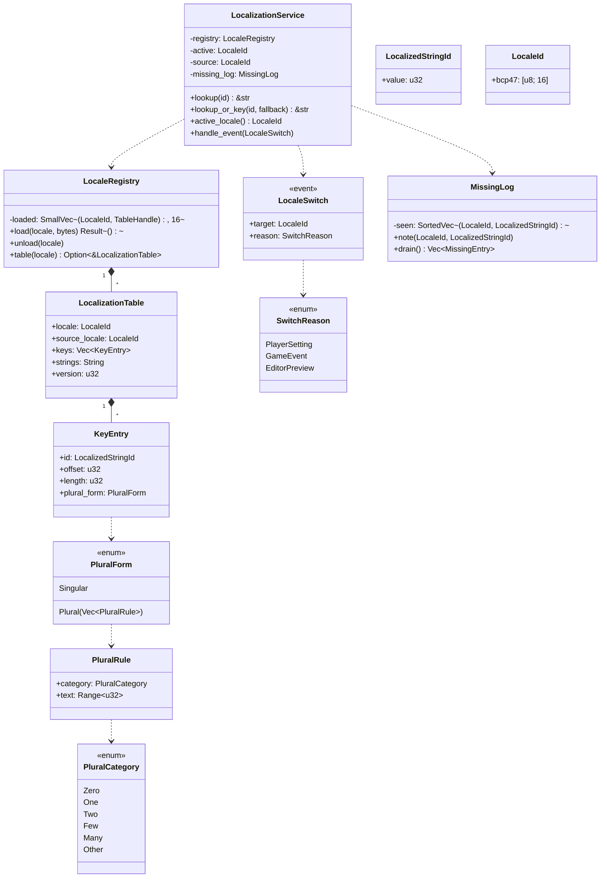
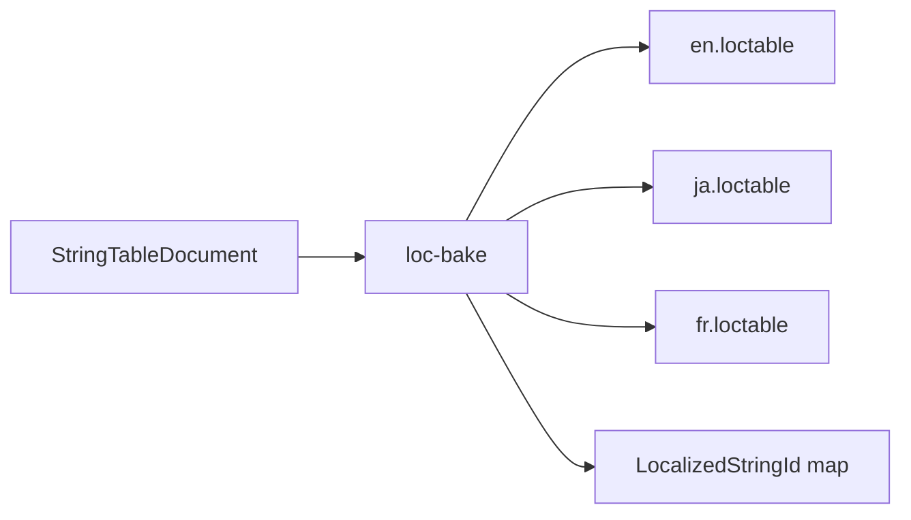
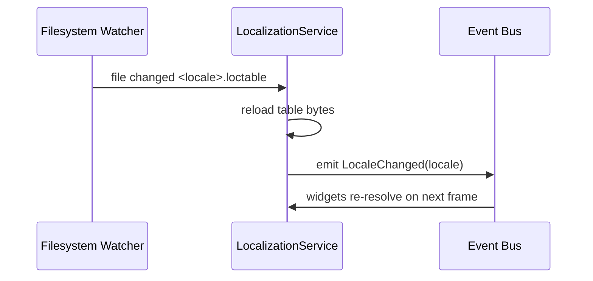
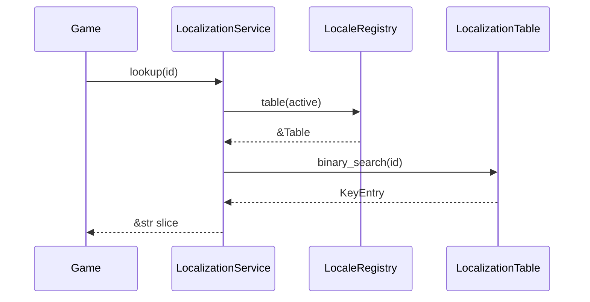

# Localization Runtime Design

## Requirements Trace

> **Canonical sources:** Features, requirements, and user stories live in
> [features/](../../features/), [requirements/](../../requirements/), and
> [user-stories/](../../user-stories/).

### Primary Requirements

| Feature    | Requirement | User Story    | Design Element                        |
|------------|-------------|---------------|---------------------------------------|
| F-10.1.9   | R-10.1.9    | US-10.1.9     | `LocalizationService` runtime         |
| F-15.13.1  | R-15.13.1   | US-15.13.1    | Baked `LocalizationTable` asset       |
| F-15.13.2  | R-15.13.2   | US-15.13.2    | Locale switching via `LocaleSwitch`   |
| F-15.13.3  | R-15.13.3   | US-15.13.3    | Missing-translation fallback          |
| F-10.1.9a  | R-10.1.9a   | US-10.1.9a    | Hot-reload in editor sessions         |

1. **R-10.1.9** -- Runtime service resolves `LocalizedStringId(u32)` to a `&str` per active locale
2. **R-15.13.1** -- Baked tables are rkyv archives produced by the content pipeline
3. **R-15.13.2** -- `LocaleSwitch` event changes the active locale; all widgets re-render
4. **R-15.13.3** -- Missing keys fall back to the source locale and log a warning
5. **R-10.1.9a** -- Editor sessions reload tables on change without restart

### Cross-Cutting Dependencies

| Dependency       | Source    | Consumed API                         |
|------------------|-----------|--------------------------------------|
| ECS world        | F-1.1.1   | `Resource`, `EventReader`            |
| Asset database   | F-12.3.1  | Asset handles for `LocalizationTable`|
| Content pipeline | F-12.1    | Table baking step                    |
| UI widgets       | F-10.1.1  | `Text` widgets consume `LocalizedStringId` |
| Hot-reload       | F-1.3.6   | Watch baked table files for change   |
| Log system       | F-14.4.4  | Emit missing-translation warnings    |

---

## Overview

The localization runtime resolves `LocalizedStringId(u32)` values to locale-specific strings at
runtime. All consumers (UI widgets, quest dialogue, tooltips) store `LocalizedStringId` rather than
raw text, so switching locale is a pointer swap rather than an asset reload.

Strings are baked by the content pipeline into immutable `LocalizationTable` assets, one per locale.
The service holds a `LocaleRegistry` containing the currently loaded locales and the active locale.
Lookups are `O(log n)` binary search into a sorted `(key, offset)` index.

### Design Principles

1. **Stable ids** -- `LocalizedStringId(u32)` assigned at bake time; never changes across rebuilds
2. **Immutable tables** -- baked tables are read-only rkyv archives mmapped at load
3. **Source locale fallback** -- missing translation returns source locale string with a warning
4. **Event-driven switching** -- locale changes flow through the ECS event system
5. **Zero-alloc lookup** -- `lookup` returns a `&str` into the archive, no heap allocation
6. **Hot-reloadable in editor** -- editor watches table files, reloads and re-renders
7. **Deterministic ordering** -- table key order is stable across platforms for reproducible bakes

---

## Architecture

### Class Diagram



### Lookup Flow

```mermaid
flowchart LR
    Call[service.lookup id] --> Active[active locale table]
    Active --> Search[binary search keys]
    Search -->|hit| S1[return slice into strings]
    Search -->|miss| Src[source locale table]
    Src --> Search2[binary search keys]
    Search2 -->|hit| S2[return slice + log missing]
    Search2 -->|miss| Key[return "[missing:id]"]
```

---

## API Design

### Types

```rust
#[derive(Copy, Clone, Eq, PartialEq, Hash, Archive, Serialize, Deserialize)]
pub struct LocalizedStringId(pub u32);

#[derive(Copy, Clone, Eq, PartialEq, Hash, Archive, Serialize, Deserialize)]
pub struct LocaleId(pub [u8; 16]);

impl LocaleId {
    pub fn from_bcp47(s: &str) -> Self;
    pub fn as_str(&self) -> &str;
}

#[derive(Archive, Serialize, Deserialize)]
pub struct LocalizationTable {
    pub locale: LocaleId,
    pub source_locale: LocaleId,
    pub keys: Vec<KeyEntry>,
    pub strings: String,
    pub version: u32,
}

#[derive(Archive, Serialize, Deserialize)]
pub struct KeyEntry {
    pub id: LocalizedStringId,
    pub offset: u32,
    pub length: u32,
    pub plural_form: PluralForm,
}
```

### Service

```rust
pub struct LocalizationService {
    registry: LocaleRegistry,
    active: LocaleId,
    source: LocaleId,
    missing_log: MissingLog,
}

impl LocalizationService {
    pub fn new(source: LocaleId) -> Self;
    pub fn load(&mut self, locale: LocaleId, bytes: Bytes) -> Result<(), LocError>;
    pub fn unload(&mut self, locale: LocaleId);
    pub fn set_active(&mut self, locale: LocaleId) -> Result<(), LocError>;
    pub fn active_locale(&self) -> LocaleId;
    pub fn lookup(&self, id: LocalizedStringId) -> &str;
    pub fn lookup_plural(&self, id: LocalizedStringId, n: u64) -> &str;
    pub fn drain_missing(&mut self) -> Vec<MissingEntry>;
}
```

### Event

```rust
#[derive(Clone, Copy)]
pub struct LocaleSwitch {
    pub target: LocaleId,
    pub reason: SwitchReason,
}

pub enum SwitchReason {
    PlayerSetting,
    GameEvent,
    EditorPreview,
}
```

### Lookup Implementation

```rust
impl LocalizationService {
    pub fn lookup(&self, id: LocalizedStringId) -> &str {
        if let Some(table) = self.registry.table(self.active) {
            if let Some(entry) = binary_search_entry(&table.keys, id) {
                return slice(&table.strings, entry.offset, entry.length);
            }
        }
        if let Some(table) = self.registry.table(self.source) {
            if let Some(entry) = binary_search_entry(&table.keys, id) {
                self.missing_log.note(self.active, id);
                return slice(&table.strings, entry.offset, entry.length);
            }
        }
        MISSING_PLACEHOLDER
    }
}
```

`binary_search_entry` is a sorted `Vec<KeyEntry>` lookup — no HashMap on hot path.

---

## Locale Switching

### Event Handling

```rust
pub fn handle_locale_switch(
    mut service: ResMut<LocalizationService>,
    mut events: EventReader<LocaleSwitch>,
    mut notify: EventWriter<LocaleChanged>,
) {
    for ev in events.iter() {
        if service.set_active(ev.target).is_ok() {
            notify.send(LocaleChanged { locale: ev.target });
        }
    }
}
```

`LocaleChanged` is a downstream event consumed by UI systems. Widgets rebind their text on
`LocaleChanged` so every user-visible string re-resolves through `LocalizationService`.

### Fallback Rules

| Situation                           | Behavior                                        |
|-------------------------------------|-------------------------------------------------|
| Active locale has key               | Return active string                            |
| Active locale missing key           | Return source string, log missing               |
| Source locale missing key           | Return `[missing:<id>]` placeholder             |
| Active locale not loaded            | Use source locale directly                      |
| Source locale not loaded            | Return `[missing:<id>]` placeholder             |

---

## Content Pipeline Integration

The editor localization tool (F-15.13.1) produces a `StringTableDocument` asset per project. The
content pipeline's `loc-bake` step emits one `LocalizationTable` asset per target locale:



The id map is a stable `(key_path, LocalizedStringId)` mapping stored alongside the project so that
code references (codegen'd id constants) stay consistent across rebuilds.

### Baking Determinism

`loc-bake` sorts key entries by `LocalizedStringId` ascending before writing, so the output is
byte-identical across platforms given the same input. This satisfies the reproducible-build
requirement for the content pipeline.

---

## Hot Reload in Editor



Watcher logic lives in the editor only; shipping runtime omits it behind a cfg flag.

---

## Missing Translation Log

```rust
pub struct MissingLog {
    seen: SortedVec<(LocaleId, LocalizedStringId)>,
}

impl MissingLog {
    pub fn note(&mut self, locale: LocaleId, id: LocalizedStringId) {
        if self.seen.insert_unique(&(locale, id)) {
            log_warn!("missing translation", locale = ?locale, id = id.0);
        }
    }
    pub fn drain(&mut self) -> Vec<MissingEntry>;
}
```

The `insert_unique` call deduplicates: warnings fire once per `(locale, id)` pair per session. The
editor surfaces drained entries in the localization validation panel.

---

## Data Flow



---

## Platform Considerations

| Platform | Notes                                                       |
|----------|-------------------------------------------------------------|
| Desktop  | Tables loaded from file via main-thread I/O bridge          |
| Console  | Tables bundled in package; loaded from read-only mount      |
| Mobile   | Tables packed into app bundle; memory-mapped where possible |

All table loads go through `IoRequest` — no direct filesystem calls from game systems.

---

## Test Plan

See [localization-test-cases.md](localization-test-cases.md) for TC-10.1.9.x and TC-15.13.x:

- Unit tests for lookup, fallback, locale switch, missing log, plural selection
- Integration tests for baked table round trip and editor hot reload
- Benchmarks for lookup latency and locale switch overhead

---

## Open Questions

1. How do we version `LocalizedStringId` across major bakes if the key namespace is refactored?
2. Should plural rules be per-locale CLDR data or authored per-project?
3. Do we support right-to-left metadata in `LocalizationTable` or leave that to widgets?
4. What is the policy when a shipping game loads an older table than its id-constant header?
