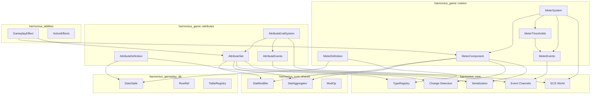
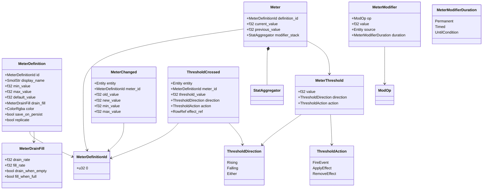
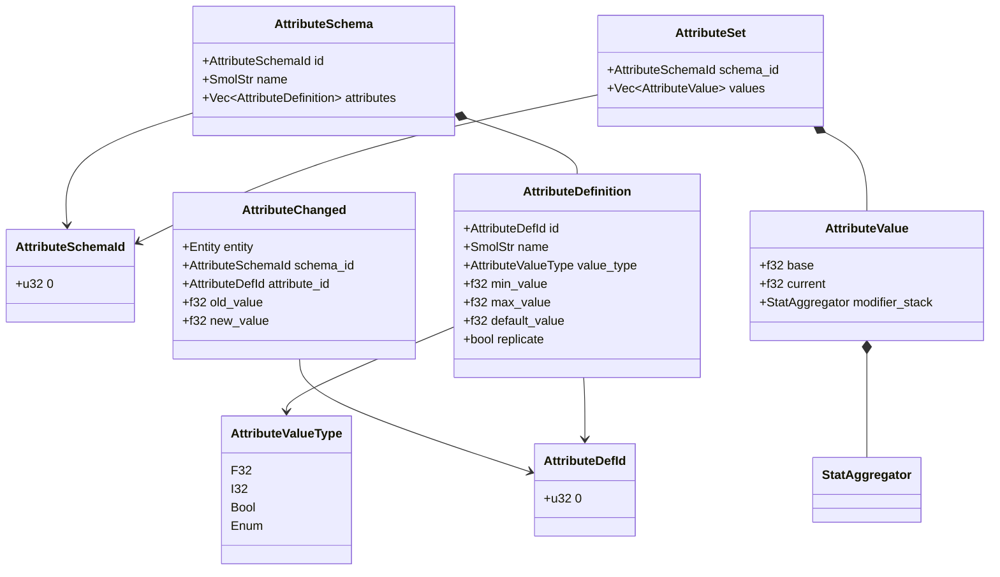
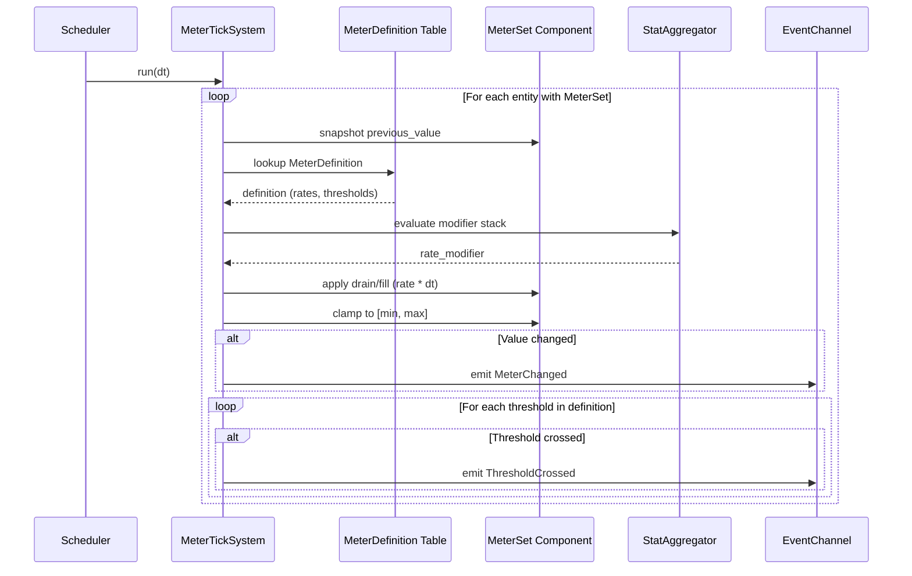
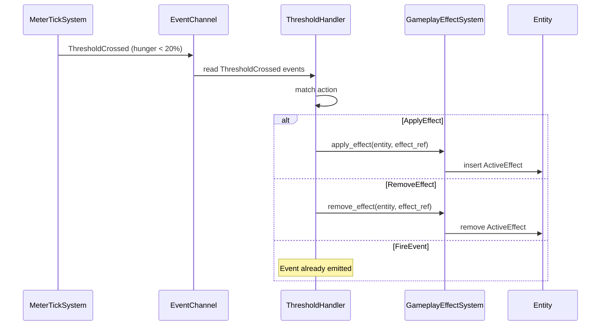
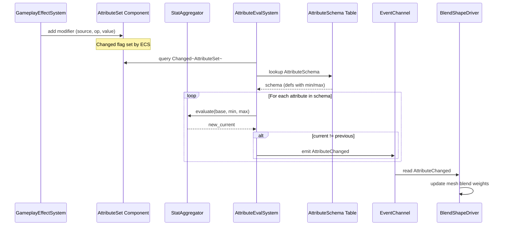
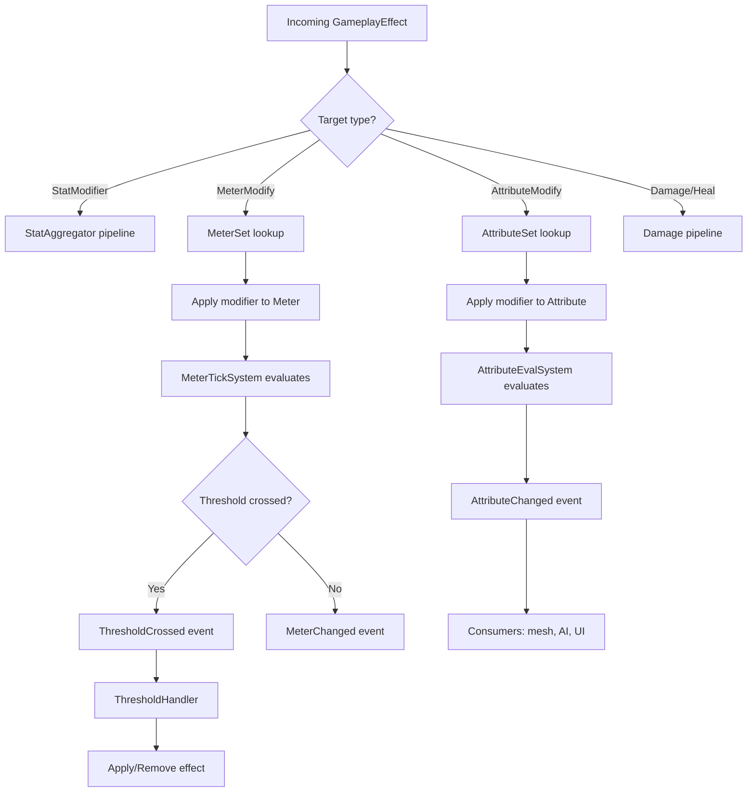

# Meters and Attribute Systems Design

## Requirements Trace

> **Canonical sources:** Features, requirements, and user stories are defined in
> [features/game-framework/](../../features/), [requirements/game-framework/](../../requirements/),
> and [user-stories/game-framework/](../../user-stories/). The table below traces design elements to
> those definitions.

### Meter Features

| Feature     | Requirement | Design Element          |
|-------------|-------------|-------------------------|
| F-13.1.5    | R-13.1.5    | Meter as ability cost   |
| F-13.1.6    | R-13.1.6    | Effects modify meters   |
| F-13.1.7    | R-13.1.7    | Damage pipeline health  |
| F-13.12.5   | R-13.12.5   | Faction rep meter       |
| F-13.12.7   | R-13.12.7   | Enhancement meter       |
| F-13.12.10  | R-13.12.10  | Durability meter        |
| F-13.14.6a  | R-13.14.6a  | Hunger meter            |
| F-13.14.6b  | R-13.14.6b  | Temperature meter       |
| F-13.14.6c  | R-13.14.6c  | Stamina meter           |
| F-13.14.6d  | R-13.14.6d  | Vital debuffs           |
| F-13.14.3   | R-13.14.3   | Structural integrity    |
| F-13.16.2a  | R-13.16.2a  | Ammo meter              |
| F-13.19.1   | R-13.19.1   | NPC affinity meter      |

1. **F-13.1.5** — Abilities reference meters as activation costs
2. **F-13.1.6** — Gameplay effects modify meter values
3. **F-13.1.7** — Damage pipeline reads/writes health meter
4. **F-13.12.5** — Faction reputation is a meter per faction
5. **F-13.12.7** — Item enhancement consumes a meter
6. **F-13.12.10** — Item durability is a meter
7. **F-13.14.6a** — Hunger is a survival vital meter
8. **F-13.14.6b** — Temperature/warmth is a survival meter
9. **F-13.14.6c** — Stamina depletion is a survival meter
10. **F-13.14.6d** — Vital debuffs fire at meter thresholds
11. **F-13.14.3** — Structural integrity is a building meter
12. **F-13.16.2a** — Ammo is a weapon meter
13. **F-13.19.1** — NPC affinity is a per-pair meter

### Attribute Set Features

| Feature    | Requirement | Design Element          |
|------------|-------------|-------------------------|
| F-13.8.1   | R-13.8.1    | Facial morph attributes |
| F-13.8.2   | R-13.8.2    | Preset blending attrs   |
| F-13.8.3   | R-13.8.3    | Body shape attributes   |
| F-13.19.2  | R-13.19.2   | Personality + emotions  |

1. **F-13.8.1** — Facial morph targets as attribute set
2. **F-13.8.2** — Preset blending reads attribute sets
3. **F-13.8.3** — Body shape morph targets as attribute set
4. **F-13.19.2** — Personality traits as attribute set, emotions as meters

### Non-Functional Requirements

| Requirement  | Target                           |
|--------------|----------------------------------|
| NFR-METER.1  | 1,000 meters evaluated < 0.5 ms  |
| NFR-METER.2  | Modifier stacking < 0.01 ms each |
| NFR-METER.3  | Threshold check < 0.001 ms each  |
| NFR-ATTR.1   | 10,000 attribute reads < 0.1 ms  |
| NFR-ATTR.2   | Attribute set clone < 0.01 ms    |

### Cross-Cutting Dependencies

| Dependency           | Source   | Consumed API               |
|----------------------|----------|----------------------------|
| ECS world, queries   | F-1.1.1  | `Query`, `Entity`          |
| Event channels       | F-1.5.1  | `EventWriter`, `Reader`    |
| Change detection     | F-1.1.22 | `Changed<T>`               |
| Command buffers      | F-1.5.4  | Deferred spawn/despawn     |
| Type registry        | F-1.3.1  | `Reflect` derive           |
| Serialization        | F-1.4.1  | Binary/RON codecs          |
| Gameplay databases   | F-13.7   | `DataTable`, `RowRef`      |
| Gameplay effects     | F-13.10  | `GameplayEffect`, `ModOp`  |
| StatModifier         | shared   | `StatAggregator`, `ModOp`  |
| Save system          | F-13.3.1 | Persistence integration    |

---

## Overview

The meters and attribute sets subsystem provides two generic, data-driven primitives that replace
all genre-specific numeric tracking systems in the engine. Every health bar, hunger gauge, ammo
counter, reputation score, personality trait, body morph slider, and resistance value is modeled
using one of these two building blocks.

### Meter

A **Meter** is a tracked numeric value with a defined range, optional drain/fill rates, a modifier
stack, configurable thresholds, and an event stream. Meters are the single abstraction for any value
that changes over time and triggers side effects at boundaries.

### Attribute Set

An **Attribute Set** is an N-dimensional typed collection of named numeric values attached to an
entity. Each attribute has a base value, a modifier stack (shared `StatAggregator`), and change
events. Attribute sets are schema-driven: the set of attributes is defined in a database table row,
not hardcoded.

### Design Principles

1. **100% ECS-based.** All state lives in components and resources. No parallel data stores.
2. **Data-driven and no-code.** Meter types and attribute schemas are authored in the visual
   database editor.
3. **Genre-agnostic.** No concept names like "health" or "hunger" exist in the code. Those are data
   labels.
4. **Composable with effects.** The `GameplayEffect` pipeline (F-13.10.3) targets meters and
   attributes by ID.
5. **Shared modifier pipeline.** Uses the engine-wide `StatModifier` + `StatAggregator` from
   shared-primitives.
6. **Deterministic.** Identical inputs produce identical outputs. All evaluation order is explicit.

### Performance Targets

| Metric                          | Target           |
|---------------------------------|------------------|
| 1,000 meter ticks per frame     | < 0.5 ms         |
| Modifier stack evaluation       | < 0.01 ms each   |
| Threshold check per meter       | < 0.001 ms each  |
| 10,000 attribute reads          | < 0.1 ms         |
| Attribute set clone             | < 0.01 ms        |

---

## Architecture

### Module Boundaries



### Directory Layout

```text
harmonius_game/
├── meters/
│   ├── mod.rs            # Re-exports
│   ├── definition.rs     # MeterDefinitionId,
│   │                     # MeterDefinition
│   ├── component.rs      # Meter component,
│   │                     # MeterModifier
│   ├── threshold.rs      # MeterThreshold,
│   │                     # ThresholdDirection
│   ├── system.rs         # MeterTickSystem,
│   │                     # MeterEvalSystem
│   ├── events.rs         # MeterChanged,
│   │                     # ThresholdCrossed
│   └── plugin.rs         # MeterPlugin
├── attributes/
│   ├── mod.rs            # Re-exports
│   ├── definition.rs     # AttributeDefId,
│   │                     # AttributeDefinition,
│   │                     # AttributeSchemaId
│   ├── component.rs      # AttributeSet,
│   │                     # AttributeValue
│   ├── system.rs         # AttributeEvalSystem
│   ├── events.rs         # AttributeChanged
│   └── plugin.rs         # AttributePlugin
└── plugin.rs             # MetersAttributesPlugin
                          # (group)
```

### Class Diagram — Meter Types



### Class Diagram — Attribute Types



---

## API Design

### Meter Identity Types

```rust
/// Unique identifier for a meter definition in
/// the gameplay database.
#[derive(
    Clone, Copy, Debug, PartialEq, Eq, Hash,
    Reflect,
)]
pub struct MeterDefinitionId(pub u32);
```

### Meter Definition (Database Row)

```rust
/// Immutable definition of a meter type. Stored as
/// a row in the gameplay database. Authored in the
/// visual meter editor. Never mutated at runtime.
#[derive(Clone, Debug, Reflect)]
pub struct MeterDefinition {
    /// Unique identifier.
    pub id: MeterDefinitionId,
    /// Display name for UI binding.
    pub display_name: SmolStr,
    /// Minimum allowed value.
    pub min_value: f32,
    /// Maximum allowed value.
    pub max_value: f32,
    /// Starting value when the meter is created.
    pub default_value: f32,
    /// Passive drain and fill rates per second.
    pub drain_fill: MeterDrainFill,
    /// UI color for meter bar rendering.
    pub color: ColorRgba,
    /// Thresholds that fire events or apply effects
    /// when crossed.
    pub thresholds: Vec<MeterThreshold>,
    /// Whether this meter is saved with the entity.
    pub save_on_persist: bool,
    /// Whether this meter is replicated over the
    /// network.
    pub replicate: bool,
}

/// Passive drain and fill configuration.
#[derive(Clone, Copy, Debug, Default, Reflect)]
pub struct MeterDrainFill {
    /// Units lost per second (0.0 = no drain).
    pub drain_rate: f32,
    /// Units gained per second (0.0 = no fill).
    pub fill_rate: f32,
    /// If true, drain continues at min (can go
    /// negative for penalty systems).
    pub drain_when_empty: bool,
    /// If true, fill continues at max (overflow
    /// for shield-like meters).
    pub fill_when_full: bool,
}
```

### Meter Threshold

```rust
/// A boundary condition on a meter that triggers
/// side effects when crossed.
#[derive(Clone, Debug, Reflect)]
pub struct MeterThreshold {
    /// The value at which this threshold fires.
    pub value: f32,
    /// Whether the threshold fires on rising,
    /// falling, or either direction.
    pub direction: ThresholdDirection,
    /// What happens when the threshold is crossed.
    pub action: ThresholdAction,
    /// Optional gameplay effect to apply or remove.
    /// References a row in the effects database.
    pub effect_ref: Option<RowRef>,
    /// Optional gameplay tag set to grant/revoke.
    pub tag_grant: Option<GameplayTagSet>,
}

/// Direction of value change that triggers the
/// threshold.
#[derive(
    Clone, Copy, Debug, PartialEq, Eq, Reflect,
)]
pub enum ThresholdDirection {
    /// Fires when value rises past the threshold.
    Rising,
    /// Fires when value falls past the threshold.
    Falling,
    /// Fires in either direction.
    Either,
}

/// Action to take when a threshold is crossed.
#[derive(
    Clone, Copy, Debug, PartialEq, Eq, Reflect,
)]
pub enum ThresholdAction {
    /// Fire a ThresholdCrossed event only.
    FireEvent,
    /// Apply the referenced gameplay effect.
    ApplyEffect,
    /// Remove the referenced gameplay effect.
    RemoveEffect,
}
```

### Meter Component

```rust
/// ECS component: a single tracked meter on an
/// entity. Multiple Meter components per entity
/// are common (health, mana, stamina, hunger).
///
/// Stored in a SmallVec on the MeterSet component
/// to keep related meters in the same archetype.
#[derive(Clone, Debug, Reflect)]
pub struct Meter {
    /// References the MeterDefinition row in the
    /// gameplay database.
    pub definition_id: MeterDefinitionId,
    /// Current effective value after modifiers.
    pub current_value: f32,
    /// Value at the start of this tick, for delta
    /// and threshold detection.
    pub previous_value: f32,
    /// Stacked modifiers affecting drain/fill rates
    /// and value offsets.
    pub modifier_stack: StatAggregator,
}

impl Meter {
    /// Create a new meter from its definition.
    pub fn from_definition(
        def: &MeterDefinition,
    ) -> Self;

    /// Current value as a normalized 0.0..1.0
    /// fraction of the min..max range.
    pub fn fraction(
        &self,
        def: &MeterDefinition,
    ) -> f32;

    /// Returns true if the meter is at its minimum.
    pub fn is_empty(
        &self,
        def: &MeterDefinition,
    ) -> bool;

    /// Returns true if the meter is at its maximum.
    pub fn is_full(
        &self,
        def: &MeterDefinition,
    ) -> bool;

    /// Apply a flat delta to the current value.
    /// Clamps to [min, max] unless drain_when_empty
    /// or fill_when_full is set.
    pub fn apply_delta(
        &mut self,
        delta: f32,
        def: &MeterDefinition,
    );

    /// Force-set the current value. Used for
    /// loading from save data or network sync.
    pub fn set_value(
        &mut self,
        value: f32,
        def: &MeterDefinition,
    );
}

/// ECS component: collection of all meters on
/// an entity. Keeps meters in a contiguous
/// allocation for cache-friendly iteration.
#[derive(Clone, Debug, Reflect)]
pub struct MeterSet {
    pub meters: SmallVec<[Meter; 4]>,
}

impl MeterSet {
    /// Look up a meter by definition ID.
    pub fn get(
        &self,
        id: MeterDefinitionId,
    ) -> Option<&Meter>;

    /// Look up a meter mutably by definition ID.
    pub fn get_mut(
        &mut self,
        id: MeterDefinitionId,
    ) -> Option<&mut Meter>;

    /// Add a meter to this set.
    pub fn insert(&mut self, meter: Meter);

    /// Remove a meter by definition ID.
    pub fn remove(
        &mut self,
        id: MeterDefinitionId,
    ) -> Option<Meter>;

    /// Iterate all meters.
    pub fn iter(&self) -> impl Iterator<Item = &Meter>;

    /// Iterate all meters mutably.
    pub fn iter_mut(
        &mut self,
    ) -> impl Iterator<Item = &mut Meter>;
}
```

### Meter Modifier

```rust
/// A runtime modifier applied to a meter. Uses
/// the shared ModOp and StatModifier pipeline.
#[derive(Clone, Debug, Reflect)]
pub struct MeterModifier {
    /// Which meter this modifier targets.
    pub meter_id: MeterDefinitionId,
    /// The stat modification operation.
    pub op: ModOp,
    /// The modifier magnitude.
    pub value: f32,
    /// Entity that applied this modifier (for
    /// removal when the source despawns).
    pub source: Entity,
    /// How long this modifier persists.
    pub duration: MeterModifierDuration,
    /// Remaining ticks for Timed duration.
    pub remaining_ticks: u32,
}

/// Duration policy for a meter modifier.
#[derive(
    Clone, Copy, Debug, PartialEq, Eq, Reflect,
)]
pub enum MeterModifierDuration {
    /// Lasts forever until explicitly removed.
    Permanent,
    /// Expires after a fixed number of ticks.
    Timed { total_ticks: u32 },
    /// Lasts until a condition expression evaluates
    /// to false. Condition ID references the
    /// ConditionExpr registry.
    UntilCondition { condition_id: u32 },
}
```

### Meter Events

```rust
/// Fired whenever a meter's value changes.
/// Consumed by UI, AI, combat log, and other
/// reactive systems.
#[derive(Clone, Debug, Reflect)]
pub struct MeterChanged {
    /// The entity whose meter changed.
    pub entity: Entity,
    /// Which meter changed.
    pub meter_id: MeterDefinitionId,
    /// Value before the change.
    pub old_value: f32,
    /// Value after the change.
    pub new_value: f32,
    /// Definition min (for UI normalization).
    pub min_value: f32,
    /// Definition max (for UI normalization).
    pub max_value: f32,
}

/// Fired when a meter crosses a defined threshold.
/// Consumed by the effect system, AI behavior
/// trees, and audio/VFX triggers.
#[derive(Clone, Debug, Reflect)]
pub struct ThresholdCrossed {
    /// The entity whose meter crossed a threshold.
    pub entity: Entity,
    /// Which meter crossed the threshold.
    pub meter_id: MeterDefinitionId,
    /// The threshold value that was crossed.
    pub threshold_value: f32,
    /// Direction of crossing.
    pub direction: ThresholdDirection,
    /// The action the threshold is configured to
    /// take.
    pub action: ThresholdAction,
    /// Optional effect reference for ApplyEffect
    /// or RemoveEffect actions.
    pub effect_ref: Option<RowRef>,
}
```

### Attribute Identity Types

```rust
/// Unique identifier for an attribute schema
/// in the gameplay database.
#[derive(
    Clone, Copy, Debug, PartialEq, Eq, Hash,
    Reflect,
)]
pub struct AttributeSchemaId(pub u32);

/// Unique identifier for a single attribute
/// within a schema.
#[derive(
    Clone, Copy, Debug, PartialEq, Eq, Hash,
    Reflect,
)]
pub struct AttributeDefId(pub u32);
```

### Attribute Definition (Database Row)

```rust
/// Immutable definition of a single attribute
/// within a schema. Stored as a row in the
/// gameplay database.
#[derive(Clone, Debug, Reflect)]
pub struct AttributeDefinition {
    /// Unique ID within the schema.
    pub id: AttributeDefId,
    /// Display name for UI and editor.
    pub name: SmolStr,
    /// The data type of this attribute's value.
    pub value_type: AttributeValueType,
    /// Minimum allowed value (for numeric types).
    pub min_value: f32,
    /// Maximum allowed value (for numeric types).
    pub max_value: f32,
    /// Default value when the attribute is created.
    pub default_value: f32,
    /// Whether this attribute is replicated over
    /// the network.
    pub replicate: bool,
}

/// The data type stored by an attribute.
#[derive(
    Clone, Copy, Debug, PartialEq, Eq, Reflect,
)]
pub enum AttributeValueType {
    /// 32-bit float (morph weights, resistances).
    F32,
    /// 32-bit signed integer (level, rank).
    I32,
    /// Boolean flag (unlocked, discovered).
    Bool,
    /// Enum variant index (personality archetype).
    Enum { type_id: u32 },
}

/// Immutable schema defining the set of attributes
/// in a collection. One schema per use case (body
/// morphs, personality, resistances). Stored as
/// a table in the gameplay database.
#[derive(Clone, Debug, Reflect)]
pub struct AttributeSchema {
    /// Unique schema identifier.
    pub id: AttributeSchemaId,
    /// Display name for the editor.
    pub name: SmolStr,
    /// Ordered list of attribute definitions. The
    /// index in this Vec is the dense index used by
    /// AttributeSet.values.
    pub attributes: Vec<AttributeDefinition>,
}

impl AttributeSchema {
    /// Look up an attribute definition by ID.
    pub fn get(
        &self,
        id: AttributeDefId,
    ) -> Option<&AttributeDefinition>;

    /// Look up an attribute's dense index.
    pub fn index_of(
        &self,
        id: AttributeDefId,
    ) -> Option<usize>;

    /// Number of attributes in this schema.
    pub fn len(&self) -> usize;
}
```

### Attribute Set Component

```rust
/// A single attribute value with its modifier
/// stack. Stored densely in the AttributeSet.
#[derive(Clone, Debug, Reflect)]
pub struct AttributeValue {
    /// Base value before modifiers.
    pub base: f32,
    /// Current value after modifier evaluation.
    pub current: f32,
    /// Stacked modifiers from gameplay effects,
    /// equipment, talents, and other sources.
    pub modifier_stack: StatAggregator,
}

impl AttributeValue {
    /// Create from a definition's default value.
    pub fn from_definition(
        def: &AttributeDefinition,
    ) -> Self;

    /// Recompute current from base + modifiers.
    /// Returns true if the value changed.
    pub fn evaluate(
        &mut self,
        def: &AttributeDefinition,
    ) -> bool;

    /// Set the base value. Does not recompute
    /// current; call evaluate() after.
    pub fn set_base(&mut self, value: f32);
}

/// ECS component: a collection of typed attribute
/// values conforming to a schema. Dense array
/// storage for cache-friendly access.
#[derive(Clone, Debug, Reflect)]
pub struct AttributeSet {
    /// The schema this set conforms to.
    pub schema_id: AttributeSchemaId,
    /// Dense array of attribute values. Index
    /// matches the schema's attribute order.
    pub values: Vec<AttributeValue>,
}

impl AttributeSet {
    /// Create a new set with all defaults from
    /// the schema.
    pub fn from_schema(
        schema: &AttributeSchema,
    ) -> Self;

    /// Get an attribute value by dense index.
    pub fn get(&self, index: usize) -> Option<&AttributeValue>;

    /// Get an attribute value mutably by index.
    pub fn get_mut(
        &mut self,
        index: usize,
    ) -> Option<&mut AttributeValue>;

    /// Get an attribute value by definition ID.
    /// Requires the schema for index lookup.
    pub fn get_by_id(
        &self,
        id: AttributeDefId,
        schema: &AttributeSchema,
    ) -> Option<&AttributeValue>;

    /// Get an attribute value mutably by ID.
    pub fn get_by_id_mut(
        &mut self,
        id: AttributeDefId,
        schema: &AttributeSchema,
    ) -> Option<&mut AttributeValue>;

    /// Recompute all attribute current values.
    /// Returns a list of changed attribute indices.
    pub fn evaluate_all(
        &mut self,
        schema: &AttributeSchema,
    ) -> SmallVec<[usize; 8]>;
}
```

### Attribute Events

```rust
/// Fired when an attribute's current value changes
/// after modifier evaluation. Consumed by mesh
/// blend shape drivers, AI systems, and UI.
#[derive(Clone, Debug, Reflect)]
pub struct AttributeChanged {
    /// The entity whose attribute changed.
    pub entity: Entity,
    /// The schema containing the attribute.
    pub schema_id: AttributeSchemaId,
    /// Which attribute changed.
    pub attribute_id: AttributeDefId,
    /// Dense index within the attribute set.
    pub index: usize,
    /// Value before the change.
    pub old_value: f32,
    /// Value after the change.
    pub new_value: f32,
}
```

### Meter System

```rust
/// Ticks all meters: applies drain/fill rates,
/// evaluates modifier stacks, detects threshold
/// crossings, and emits events.
///
/// Runs once per game tick in the Game Logic
/// phase of the frame.
pub fn meter_tick_system(
    dt: f32,
    meter_defs: &TableRegistry,
    meters: Query<(Entity, &mut MeterSet)>,
    meter_changed: &mut EventWriter<MeterChanged>,
    threshold_crossed: &mut EventWriter<
        ThresholdCrossed,
    >,
);

/// Expires timed modifiers and removes modifiers
/// whose source entity has been despawned.
///
/// Runs after meter_tick_system.
pub fn meter_modifier_cleanup_system(
    meters: Query<(Entity, &mut MeterSet)>,
    entities: &World,
);
```

### Attribute System

```rust
/// Evaluates all attribute sets, recomputing
/// current values from base + modifiers. Emits
/// AttributeChanged events for any values that
/// shifted.
///
/// Runs once per game tick after gameplay effects
/// have been applied.
pub fn attribute_eval_system(
    schemas: &TableRegistry,
    attr_sets: Query<
        (Entity, &mut AttributeSet),
        Changed<AttributeSet>,
    >,
    attr_changed: &mut EventWriter<
        AttributeChanged,
    >,
);

/// Removes modifiers whose source entity has
/// been despawned. Marks the AttributeSet as
/// changed so attribute_eval_system re-evaluates.
pub fn attribute_modifier_cleanup_system(
    attr_sets: Query<(Entity, &mut AttributeSet)>,
    entities: &World,
);
```

### Integration: Effects Target Meters and Attributes

```rust
/// Extension to EffectType (from
/// abilities-combat.md) for meter and attribute
/// targeting. When a GameplayEffect has one of
/// these types, the EffectEvaluationSystem
/// dispatches to the meter/attribute systems.
///
/// This extends the existing EffectType enum:
///   Damage, Heal, StatModifier, StatusApply,
///   StatusRemove ...
/// with:
///   MeterModify, AttributeModify

/// Modify a meter's value or modifiers.
pub struct MeterModifyPayload {
    /// Target meter by definition ID.
    pub meter_id: MeterDefinitionId,
    /// Operation: Flat delta, Percent scale, or
    /// Override.
    pub op: ModOp,
}

/// Modify an attribute's base value or modifiers.
pub struct AttributeModifyPayload {
    /// Target attribute set schema.
    pub schema_id: AttributeSchemaId,
    /// Target attribute within the schema.
    pub attribute_id: AttributeDefId,
    /// Operation: Flat delta, Percent scale, or
    /// Override.
    pub op: ModOp,
}
```

---

## Data Flow

### Meter Tick Sequence



### Threshold-to-Effect Sequence



### Attribute Evaluation Sequence



### Effect Pipeline Integration



---

## Composition Examples

The following examples demonstrate how the two generic primitives replace genre-specific systems. No
code changes are needed for any of these; they are purely data configurations in the visual editor.

### Health as a Meter

| Field         | Value                |
|---------------|----------------------|
| id            | `meter_health`       |
| display_name  | "Health"             |
| min_value     | 0.0                  |
| max_value     | (from stat table)    |
| default_value | (max_value)          |
| drain_rate    | 0.0                  |
| fill_rate     | 0.0 (regen via fx)   |
| color         | `#FF3333`            |

Thresholds:

| Value | Direction | Action      | Effect            |
|-------|-----------|-------------|--------------------|
| 0.0   | Falling   | ApplyEffect | "Dead" effect      |
| 25%   | Falling   | FireEvent   | low-health warning |
| 0.0   | Rising    | RemoveEffect| "Dead" effect      |

### Survival Vitals as Meters

| Meter ID     | Drain  | Fill   | Threshold            |
|--------------|--------|--------|----------------------|
| hunger       | 0.5/s  | 0.0    | < 20% = "Starving"  |
| thirst       | 0.8/s  | 0.0    | < 15% = "Dehydrated"|
| warmth       | varies | varies | < 10% = "Freezing"  |
| stamina      | on-use | 3.0/s  | 0% = "Exhausted"    |

### Ammo as a Meter

| Field         | Value              |
|---------------|--------------------|
| id            | `meter_ammo_rifle` |
| min_value     | 0                  |
| max_value     | 30 (magazine size) |
| default_value | 30                 |
| drain_rate    | 0.0 (per-shot)    |
| fill_rate     | 0.0 (reload)      |

Threshold: 0.0 / Falling / FireEvent (empty mag).

### Faction Reputation as a Meter

| Field         | Value                 |
|---------------|-----------------------|
| id            | `rep_{faction_id}`    |
| min_value     | -1000.0 (Hated)      |
| max_value     | 1000.0 (Exalted)     |
| default_value | 0.0 (Neutral)        |
| drain_rate    | 0.001/s (slow decay)  |

Thresholds at tier boundaries (-500, -200, 200, 500, 800) fire events consumed by the quest and shop
systems to unlock/lock content.

### NPC Affinity as a Meter

One meter per NPC pair. `meter_id` encodes the target NPC. Thresholds at relationship tier
boundaries (acquaintance, friend, close friend, rival) fire events consumed by the dialogue system
to unlock conversation branches.

### Body Morphs as an Attribute Set

Schema: `body_morph_schema`

| Attribute      | Type | Min  | Max  | Default |
|----------------|------|------|------|---------|
| height         | F32  | 0.85 | 1.15 | 1.0     |
| shoulder_width | F32  | 0.8  | 1.2  | 1.0     |
| chest_depth    | F32  | 0.8  | 1.2  | 1.0     |
| arm_length     | F32  | 0.9  | 1.1  | 1.0     |
| leg_length     | F32  | 0.9  | 1.1  | 1.0     |
| muscle_mass    | F32  | 0.0  | 1.0  | 0.3     |
| body_fat       | F32  | 0.0  | 1.0  | 0.2     |

`AttributeChanged` events drive the mesh blend shape system. When `muscle_mass` changes, the blend
shape driver updates the corresponding morph target weight.

### Personality as an Attribute Set

Schema: `personality_schema`

| Attribute     | Type | Min  | Max  | Default |
|---------------|------|------|------|---------|
| openness      | F32  | 0.0  | 1.0  | 0.5     |
| conscientiousn| F32  | 0.0  | 1.0  | 0.5     |
| extraversion  | F32  | 0.0  | 1.0  | 0.5     |
| agreeableness | F32  | 0.0  | 1.0  | 0.5     |
| neuroticism   | F32  | 0.0  | 1.0  | 0.5     |

These attributes are read by the AI behavior system to weight decision-making. Gameplay effects
(e.g., a "Corrupted" debuff) can temporarily modify personality attributes via the shared modifier
pipeline.

### Emotions as Meters

Each NPC has a `MeterSet` with emotion meters:

| Meter    | Min | Max | Drain | Fill |
|----------|-----|-----|-------|------|
| joy      | 0.0 | 1.0 | 0.02  | 0.0  |
| anger    | 0.0 | 1.0 | 0.03  | 0.0  |
| fear     | 0.0 | 1.0 | 0.05  | 0.0  |
| sadness  | 0.0 | 1.0 | 0.01  | 0.0  |
| surprise | 0.0 | 1.0 | 0.10  | 0.0  |

Drain rates model natural decay to baseline. Events and gameplay effects push emotions up; they
naturally fall back. Thresholds trigger behavior changes (anger > 0.8 triggers aggressive AI state).

### Resistances as an Attribute Set

Schema: `resistance_schema`

| Attribute  | Type | Min  | Max  | Default |
|------------|------|------|------|---------|
| fire_res   | F32  | -1.0 | 2.0  | 0.0     |
| ice_res    | F32  | -1.0 | 2.0  | 0.0     |
| lightning  | F32  | -1.0 | 2.0  | 0.0     |
| poison_res | F32  | -1.0 | 2.0  | 0.0     |
| physical   | F32  | -1.0 | 2.0  | 0.0     |

Negative values indicate vulnerability. The damage pipeline reads resistance attributes during the
mitigation step (F-13.1.7). Equipment and buffs add modifiers to the resistance attribute set.

### Durability as a Meter

| Field         | Value                |
|---------------|----------------------|
| id            | `meter_durability`   |
| min_value     | 0.0                  |
| max_value     | (from item def)      |
| default_value | (max_value)          |
| drain_rate    | 0.0 (per-use)       |

Threshold: 0.0 / Falling / ApplyEffect ("Broken" effect that disables the item's stat bonuses).

---

## Platform Considerations

### Memory Layout

Meters and attribute sets are stored as dense, contiguous arrays inside their respective ECS
components (`MeterSet`, `AttributeSet`). This layout ensures cache-friendly iteration when systems
process all entities with meters or attributes.

| Component      | Typical Size       | Notes           |
|----------------|--------------------|-----------------|
| MeterSet (4)   | ~256 bytes         | SmallVec inline |
| AttributeSet   | ~32 + 24*N bytes   | N = attr count  |
| MeterDefinition| ~128 bytes (table) | Shared, immut.  |
| AttributeSchema| ~64 + 48*N bytes   | Shared, immut.  |

### Serialization

Meters serialize `definition_id` + `current_value` + active modifiers. The definition itself is not
serialized with the entity; it is loaded from the database on deserialization.

Attribute sets serialize `schema_id` + the dense `values` array (base values only; modifiers are
recomputed from active effects on load).

### Network Replication

Only meters and attributes with `replicate = true` are sent over the network. The replication system
sends delta-compressed updates: `(entity, meter_id, new_value)` or
`(entity, schema_id, index, new_value)`.

### Platform-Specific Notes

| Platform | Notes                            |
|----------|----------------------------------|
| macOS    | GCD dispatch for batch eval      |
| Windows  | Thread pool for batch eval       |
| Linux    | io_uring not needed (CPU-bound)  |
| All      | SIMD for bulk attribute eval     |

Meter tick and attribute evaluation are CPU-bound, embarrassingly parallel workloads. The engine's
scoped task system (`parallel_for`) processes entities in chunks across worker threads.

---

## Test Plan

Detailed test cases are in the companion file
[meters-resources-test-cases.md](meters-resources-test-cases.md).

### Unit Tests

| Area                   | Coverage Target       |
|------------------------|-----------------------|
| Meter creation         | from_definition round |
| Meter delta/clamp      | min/max boundary      |
| Meter fraction         | 0.0, 0.5, 1.0        |
| Threshold detection    | Rising, Falling, Both |
| Modifier stacking      | Flat, Pct, Override   |
| Modifier expiry        | Timed, Permanent      |
| MeterSet CRUD          | insert, get, remove   |
| AttributeValue eval    | base + modifiers      |
| AttributeSet from_schema| defaults populated   |
| AttributeSet get_by_id | correct dense index   |
| evaluate_all           | changed list accurate |
| Event emission         | MeterChanged fields   |
| Event emission         | ThresholdCrossed      |
| Event emission         | AttributeChanged      |

### Integration Tests

| Test                         | Systems Under Test  |
|------------------------------|---------------------|
| Effect modifies meter        | GE + MeterTick      |
| Threshold applies effect     | MeterTick + GE      |
| Ability cost checks meter    | Activation + Meter  |
| Attribute drives blend shape | AttrEval + Mesh     |
| Save/load preserves meters   | Serialization       |
| Save/load preserves attrs    | Serialization       |
| Network sync meter           | Replication + Meter |
| Modifier source despawn      | Cleanup system      |

### Benchmarks

| Benchmark                  | Target        |
|----------------------------|---------------|
| 1,000 meter ticks          | < 0.5 ms      |
| 10,000 attribute reads     | < 0.1 ms      |
| 64 modifier stack eval     | < 0.01 ms     |
| 100 threshold checks       | < 0.1 ms      |
| MeterSet clone (8 meters)  | < 0.005 ms    |
| AttributeSet clone (32)    | < 0.01 ms     |

---

## Open Questions

**Q1. Should meters support overflow/underflow for edge-case designs like shield overcharge?**

The `drain_when_empty` and `fill_when_full` flags on `MeterDrainFill` allow passive rates to
continue past bounds. For explicit overflow (e.g., temporary HP above max), a separate
`temporary_bonus` field could be added to `Meter`. Deferred until a concrete use case demands it.

**Q2. Should attribute sets support dynamic schema extension at runtime?**

Currently the schema is fixed at load time. Adding attributes at runtime (e.g., a mod that adds a
new resistance type) would require a schema migration step. This aligns with the hot-reload design
(F-13.7.13) but adds complexity. Deferred until the modding API is designed.

**Q3. How do meters interact with the network authority model?**

Meters with `replicate = true` follow the same authority model as other replicated components: the
server is authoritative, clients receive delta updates. Client-side prediction for meter changes
(e.g., optimistic ammo deduction on fire) reuses the networking module's prediction/rollback
pipeline (F-8.2.1).

**Q4. Should ThresholdAction support running a logic graph node directly?**

Currently thresholds can fire events or apply/remove effects. Running an arbitrary logic graph would
add a dependency on the scripting runtime. Deferred; the event-based approach lets logic graphs
react to `ThresholdCrossed` events without coupling.

**Q5. Is this design cohesive with the overall engine?**

The design integrates cleanly with the existing ECS architecture (all state as components, all logic
as systems), the `GameplayEffect` pipeline (F-13.10.3), the `StatModifier` + `StatAggregator` shared
primitive, and the gameplay database system (F-13.7). Meters replace the ad-hoc `ResourcePool` in
abilities-combat.md and the per-vital meter structs previously in the building-survival design.
Attribute sets replace the hardcoded morph-target arrays previously in the character design and the
personality trait structs previously in the NPC simulation design. This unification reduces code
duplication and ensures consistent modifier math across all systems.
