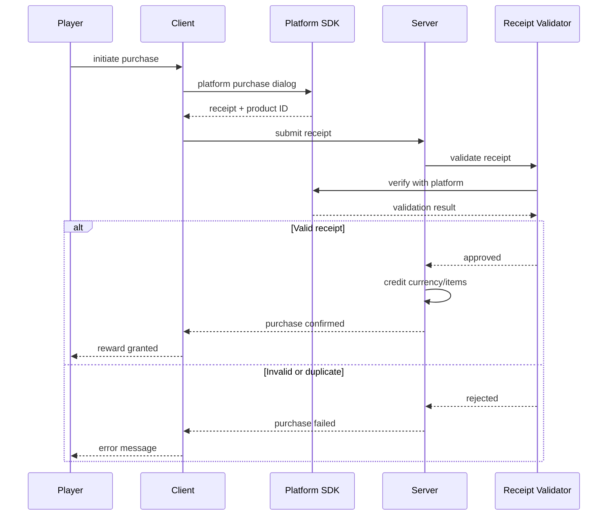
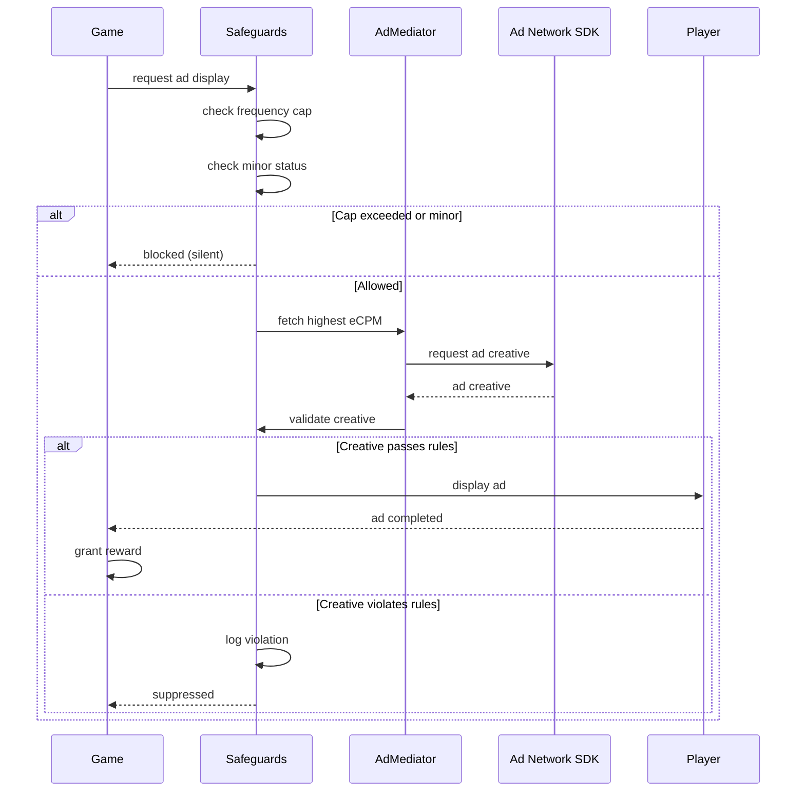
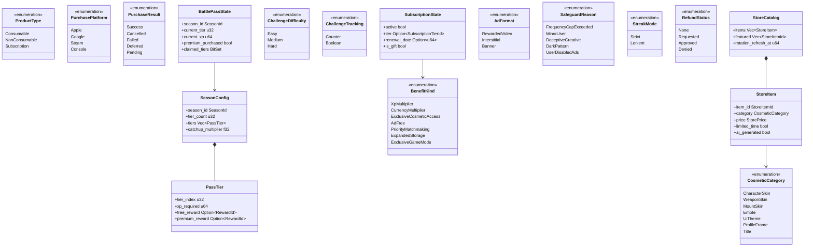

# Monetization and Live Operations Design

## Requirements Trace

> **Canonical sources:** Features, requirements, and user stories are defined in
> [features/game-framework/](../../features/game-framework/),
> [requirements/game-framework/](../../requirements/game-framework/), and
> [user-stories/game-framework/](../../user-stories/game-framework/). The table below traces design
> elements to those definitions.

| Feature    | Requirement |
|------------|-------------|
| F-13.23.1  | R-13.23.1   |
| F-13.23.2  | R-13.23.2   |
| F-13.23.3a | R-13.23.3a  |
| F-13.23.3b | R-13.23.3b  |
| F-13.23.3c | R-13.23.3c  |
| F-13.23.3d | R-13.23.3d  |
| F-13.23.4  | R-13.23.4   |
| F-13.23.5a | R-13.23.5a  |
| F-13.23.5b | R-13.23.5b  |
| F-13.23.5c | R-13.23.5c  |
| F-13.23.5d | R-13.23.5d  |
| F-13.23.6a | R-13.23.6a  |
| F-13.23.6b | R-13.23.6b  |
| F-13.23.6c | R-13.23.6c  |
| F-13.23.7  | R-13.23.7   |
| F-13.23.8  | R-13.23.8   |
| F-13.23.9a | R-13.23.9a  |
| F-13.23.9b | R-13.23.9b  |
| F-13.23.9c | R-13.23.9c  |
| F-13.23.9d | R-13.23.9d  |
| F-13.28.1  | R-13.28.1   |
| F-13.28.2  | R-13.28.2   |
| F-13.28.3  | R-13.28.3   |
| F-13.28.4  | R-13.28.4   |

1. **F-13.23.1** — Battle pass with free/premium tiers and season XP
2. **F-13.23.2** — Server-defined daily/weekly rotating challenges
3. **F-13.23.3a** — Platform purchase abstraction (StoreKit 2, Play Billing, Steam)
4. **F-13.23.3b** — Server-side receipt validation
5. **F-13.23.3c** — Premium currency (server-side balance, cosmetic-only)
6. **F-13.23.3d** — Purchase history and refund tracking
7. **F-13.23.4** — Daily login reward calendar with streak tracking
8. **F-13.23.5a** — Subscription state verification (periodic, server-side)
9. **F-13.23.5b** — Subscription benefit application and revocation
10. **F-13.23.5c** — Subscription management UI
11. **F-13.23.5d** — Subscription gifting
12. **F-13.23.6a** — Timed game trial with progress carry-over
13. **F-13.23.6b** — Server-scheduled free weekend events
14. **F-13.23.6c** — Content trial with temporary DLC unlock
15. **F-13.23.7** — DLC and expansion on-demand download
16. **F-13.23.8** — Cosmetic store with virtual currency
17. **F-13.23.9a** — Deceptive UI prevention (engine-enforced)
18. **F-13.23.9b** — Minor-targeted ad blocking
19. **F-13.23.9c** — Dark pattern prevention (engine-enforced)
20. **F-13.23.9d** — Frequency cap enforcement (engine-enforced)
21. **F-13.28.1** — Opt-in rewarded video ads
22. **F-13.28.2** — Transition-point interstitial ads
23. **F-13.28.3** — Non-intrusive banner ads
24. **F-13.28.4** — Multi-network ad mediation layer

## Overview

The monetization subsystem provides a complete set of revenue systems for free-to-play, premium, and
hybrid business models. All state is stored as ECS resources. All configuration is data-driven and
authored through the visual editor. Server-side validation and storage prevent client-side
tampering.

Key design principles:

- **Cosmetic-only defaults** -- no pay-to-win items in the default configuration
- **Server-authoritative** -- currency balances, receipts, and entitlements are server-side
- **Engine-enforced safeguards** -- ad frequency caps, deceptive UI prevention, and minor
  protections are compiled into the binary
- **Live-ops friendly** -- battle pass, challenges, and store content deploy server-side without
  client updates

## Architecture

### Module Boundaries

```mermaid
graph TD
    subgraph "harmonius_game::monetization"
        BP[BattlePass Module]
        IAP[Purchase Module]
        SUB[Subscription Module]
        CS[Cosmetic Store]
        DLC[DLC Manager]
        AD[Ad Mediation]
        CHL[Challenge System]
        LR[Login Rewards]
    end

    subgraph "harmonius_game::core"
        ECS[ECS World]
        CUR[Currency System]
        ENT[Entitlement System]
        GDB[Gameplay Database]
        OBS[Observer System]
    end

    subgraph "harmonius_server"
        VAL[Receipt Validator]
        SRV[Live Ops Server]
    end

    subgraph "Platform SDKs"
        SK[StoreKit 2]
        GP[Play Billing 5+]
        ST[Steam Microtxn]
    end

    BP --> ECS
    BP --> CUR
    BP --> SRV
    IAP --> ENT
    IAP --> VAL
    IAP -.-> SK
    IAP -.-> GP
    IAP -.-> ST
    SUB --> ENT
    SUB --> VAL
    CS --> CUR
    CS --> ECS
    DLC --> ENT
    AD --> OBS
    CHL --> SRV
    CHL --> GDB
    LR --> SRV
    LR --> CUR
```



### File Structure

```text
harmonius_game/
├── monetization/
│   ├── battle_pass/
│   │   ├── pass.rs       # BattlePass, PassTier
│   │   ├── season.rs     # Season, SeasonConfig
│   │   └── systems.rs    # PassProgressSystem
│   ├── purchase/
│   │   ├── platform.rs   # PlatformPurchaseApi
│   │   ├── receipt.rs    # ReceiptValidator
│   │   ├── currency.rs   # PremiumCurrency
│   │   ├── history.rs    # PurchaseHistory
│   │   └── systems.rs    # PurchaseFlowSystem
│   ├── subscription/
│   │   ├── state.rs      # SubscriptionState
│   │   ├── benefits.rs   # BenefitGrant
│   │   ├── gifting.rs    # GiftSubscription
│   │   └── systems.rs    # SubVerifySystem
│   ├── store/
│   │   ├── catalog.rs    # StoreCatalog, StoreItem
│   │   ├── rotation.rs   # FeaturedRotation
│   │   ├── refund.rs     # RefundWindow
│   │   └── systems.rs    # StoreRefreshSystem
│   ├── dlc/
│   │   ├── manifest.rs   # DlcManifest, DlcEntry
│   │   ├── download.rs   # DlcDownloader
│   │   └── systems.rs    # DlcEntitlementSystem
│   ├── challenges/
│   │   ├── challenge.rs  # Challenge, ChallengeSet
│   │   ├── rotation.rs   # ChallengeRotation
│   │   └── systems.rs    # ChallengeTrackSystem
│   ├── login_rewards/
│   │   ├── calendar.rs   # RewardCalendar
│   │   ├── streak.rs     # LoginStreak
│   │   └── systems.rs    # LoginRewardSystem
│   ├── trial/
│   │   ├── timed.rs      # TimedTrial
│   │   ├── free_weekend.rs # FreeWeekendEvent
│   │   ├── content.rs    # ContentTrial
│   │   └── systems.rs    # TrialCheckSystem
│   ├── advertising/
│   │   ├── rewarded.rs   # RewardedAd
│   │   ├── interstitial.rs # InterstitialAd
│   │   ├── banner.rs     # BannerAd
│   │   ├── mediation.rs  # AdMediator
│   │   ├── safeguards.rs # AdSafeguards
│   │   └── systems.rs    # AdLifecycleSystem
│   └── safeguards.rs     # Engine-enforced rules
```

### Purchase Transaction Flow



### Ad Lifecycle Flow



### Core Data Structures



## API Design

### Platform Purchase Abstraction

```rust
/// Unified purchase API abstracting platform
/// store SDKs. Platform selection is automatic
/// based on cfg attributes.
pub struct PlatformPurchaseApi;

/// A purchasable product definition.
pub struct ProductDef {
    pub product_id: ProductId,
    pub name: StringId,
    pub price_tier: PriceTier,
    pub product_type: ProductType,
}

#[derive(
    Clone, Copy, Debug, PartialEq, Eq,
)]
pub enum ProductType {
    Consumable,
    NonConsumable,
    Subscription { tier: SubscriptionTierId },
}

/// Receipt from a completed platform purchase.
pub struct PurchaseReceipt {
    pub transaction_id: TransactionId,
    pub product_id: ProductId,
    pub platform: PurchasePlatform,
    /// Platform-specific receipt data.
    pub receipt_data: Vec<u8>,
    pub timestamp: u64,
}

#[derive(
    Clone, Copy, Debug, PartialEq, Eq,
)]
pub enum PurchasePlatform {
    Apple,
    Google,
    Steam,
    Console,
}

/// Result of a purchase attempt.
pub enum PurchaseResult {
    Success(PurchaseReceipt),
    Cancelled,
    Failed(PurchaseError),
    /// iOS deferred purchase (Ask to Buy).
    Deferred,
    /// Google Play pending transaction.
    Pending,
}

pub enum PurchaseError {
    NetworkError,
    ProductNotFound,
    AlreadyOwned,
    PlatformError { code: i32, message: String },
}

impl PlatformPurchaseApi {
    /// Initiate a purchase through the platform
    /// store dialog. Returns asynchronously
    /// when the dialog completes.
    pub async fn initiate_purchase(
        product_id: ProductId,
    ) -> PurchaseResult;

    /// Restore previously purchased
    /// non-consumables and active subscriptions.
    pub async fn restore_purchases(
    ) -> Vec<PurchaseReceipt>;

    /// Query available products with
    /// localized prices.
    pub async fn query_products(
        ids: &[ProductId],
    ) -> Vec<LocalizedProduct>;
}

/// Localized product info from the platform.
pub struct LocalizedProduct {
    pub product_id: ProductId,
    pub localized_name: String,
    pub localized_price: String,
    pub currency_code: String,
    pub price_micros: u64,
}
```

### Server-Side Receipt Validation

```rust
/// Server-side receipt validator. Contacts
/// platform verification endpoints.
pub struct ReceiptValidator;

pub struct ValidationResult {
    pub valid: bool,
    pub transaction_id: TransactionId,
    pub product_id: ProductId,
    pub is_duplicate: bool,
    pub timestamp: u64,
}

impl ReceiptValidator {
    /// Validate a receipt against the platform
    /// verification endpoint. Rejects duplicates
    /// within 100ms.
    pub async fn validate(
        receipt: &PurchaseReceipt,
    ) -> Result<ValidationResult, ValidationError>;

    /// Retry a failed validation with
    /// exponential backoff.
    pub async fn validate_with_retry(
        receipt: &PurchaseReceipt,
        max_retries: u32,
    ) -> Result<ValidationResult, ValidationError>;
}

pub enum ValidationError {
    NetworkError,
    InvalidReceipt,
    PlatformError { code: i32 },
    /// Receipt was already processed.
    Duplicate { original_txn: TransactionId },
}
```

### Battle Pass

```rust
/// Season configuration loaded from server.
pub struct SeasonConfig {
    pub season_id: SeasonId,
    pub name: StringId,
    pub start_timestamp: u64,
    pub end_timestamp: u64,
    pub tier_count: u32,
    pub tiers: Vec<PassTier>,
    /// XP multiplier active in the final third
    /// of the season.
    pub catchup_multiplier: f32,
}

/// A single tier in the battle pass.
pub struct PassTier {
    pub tier_index: u32,
    pub xp_required: u64,
    pub free_reward: Option<RewardId>,
    pub premium_reward: Option<RewardId>,
}

/// Per-player battle pass progress. Stored as
/// an ECS resource, backed by server state.
pub struct BattlePassState {
    pub season_id: SeasonId,
    pub current_tier: u32,
    pub current_xp: u64,
    pub premium_purchased: bool,
    /// Tiers whose rewards have been claimed.
    pub claimed_tiers: BitSet,
}

impl BattlePassState {
    /// Award XP and advance tiers. Returns
    /// newly unlocked tier indices.
    pub fn award_xp(
        &mut self,
        xp: u64,
        config: &SeasonConfig,
    ) -> Vec<u32>;

    /// Claim reward for a specific tier.
    pub fn claim_tier(
        &mut self,
        tier: u32,
    ) -> Result<RewardId, ClaimError>;

    /// Check if the catch-up multiplier is
    /// currently active based on season progress.
    pub fn is_catchup_active(
        &self,
        config: &SeasonConfig,
        now: u64,
    ) -> bool;
}
```

### Challenge System

```rust
/// A single challenge definition from the
/// server.
pub struct ChallengeDef {
    pub challenge_id: ChallengeId,
    pub description: StringId,
    pub difficulty: ChallengeDifficulty,
    pub tracking: ChallengeTracking,
    pub reward: RewardId,
    /// XP granted toward battle pass on
    /// completion.
    pub pass_xp: u64,
}

#[derive(
    Clone, Copy, Debug, PartialEq, Eq,
)]
pub enum ChallengeDifficulty {
    Easy,
    Medium,
    Hard,
}

/// How challenge progress is tracked.
pub enum ChallengeTracking {
    /// Incremental counter (kill 10, craft 5).
    Counter { current: u32, target: u32 },
    /// Boolean completion (win a match).
    Boolean { complete: bool },
}

/// Per-player active challenge state.
pub struct ChallengeSet {
    pub daily: Vec<ChallengeProgress>,
    pub weekly: Vec<ChallengeProgress>,
    pub rerolls_remaining: u32,
    pub daily_refresh_at: u64,
    pub weekly_refresh_at: u64,
}

pub struct ChallengeProgress {
    pub def: ChallengeId,
    pub tracking: ChallengeTracking,
    pub claimed: bool,
}

impl ChallengeSet {
    /// Update progress for a tracked event.
    /// Returns challenges that completed.
    pub fn track_event(
        &mut self,
        event: &ChallengeEvent,
    ) -> Vec<ChallengeId>;

    /// Reroll a daily challenge at currency
    /// cost. Returns the replacement.
    pub fn reroll(
        &mut self,
        index: usize,
        cost: (CurrencyId, u64),
    ) -> Result<ChallengeId, RerollError>;
}
```

### Subscription Management

```rust
/// Subscription tier definition.
pub struct SubscriptionTierDef {
    pub tier_id: SubscriptionTierId,
    pub name: StringId,
    pub benefits: Vec<BenefitId>,
    pub product_id: ProductId,
}

/// Per-player subscription state. Stored as
/// an ECS resource, backed by server state.
pub struct SubscriptionState {
    pub active: bool,
    pub tier: Option<SubscriptionTierId>,
    pub renewal_date: Option<u64>,
    pub billing_amount: Option<u64>,
    pub is_gift: bool,
    /// Timestamp of last server-side
    /// verification.
    pub last_verified_at: u64,
}

/// Benefit types granted by subscriptions.
#[derive(
    Clone, Copy, Debug, PartialEq, Eq,
)]
pub enum BenefitKind {
    XpMultiplier { multiplier: u32 },
    CurrencyMultiplier { multiplier: u32 },
    ExclusiveCosmeticAccess,
    AdFree,
    PriorityMatchmaking,
    ExpandedStorage { slots: u32 },
    ExclusiveGameMode { mode: GameModeId },
}

impl SubscriptionState {
    /// Verify subscription state against the
    /// platform API. Updates active/tier fields.
    pub async fn verify(
        &mut self,
        api: &PlatformPurchaseApi,
    ) -> Result<(), VerifyError>;

    /// Check if the verification interval has
    /// elapsed and re-verification is needed.
    pub fn needs_verification(
        &self,
        interval_sec: u64,
        now: u64,
    ) -> bool;

    /// Apply benefits for the current tier.
    /// Revoke benefits if lapsed.
    pub fn apply_benefits(
        &self,
        tier_defs: &[SubscriptionTierDef],
    ) -> Vec<BenefitAction>;
}

pub enum BenefitAction {
    Grant(BenefitKind),
    Revoke(BenefitKind),
}
```

### Cosmetic Store

```rust
/// An item available in the cosmetic store.
pub struct StoreItem {
    pub item_id: StoreItemId,
    pub name: StringId,
    pub category: CosmeticCategory,
    pub price: StorePrice,
    /// True if this is a limited-time item.
    pub limited_time: bool,
    /// Expiry timestamp for limited items.
    pub available_until: Option<u64>,
    /// True if generated by AI (governance
    /// label required).
    pub ai_generated: bool,
}

#[derive(
    Clone, Copy, Debug, PartialEq, Eq,
)]
pub enum CosmeticCategory {
    CharacterSkin,
    WeaponSkin,
    MountSkin,
    Emote,
    UiTheme,
    ProfileFrame,
    Title,
}

/// Price in one or more currency types.
pub struct StorePrice {
    pub currency: CurrencyId,
    pub amount: u64,
}

/// Store catalog stored as an ECS resource.
/// Refreshed from server on schedule.
pub struct StoreCatalog {
    pub items: Vec<StoreItem>,
    pub featured: Vec<StoreItemId>,
    pub rotation_refresh_at: u64,
}

/// Per-player purchase record for refund
/// tracking.
pub struct StorePurchaseRecord {
    pub item_id: StoreItemId,
    pub purchase_time: u64,
    pub currency_spent: (CurrencyId, u64),
}

impl StoreCatalog {
    /// Check if an item's 24-hour refund
    /// window is still open.
    pub fn is_refundable(
        record: &StorePurchaseRecord,
        now: u64,
    ) -> bool;

    /// Purchase a cosmetic item. Returns error
    /// if insufficient currency.
    pub fn purchase(
        &self,
        item_id: StoreItemId,
        balance: &mut CurrencyBalance,
    ) -> Result<StorePurchaseRecord, StoreError>;

    /// Refund within the 24-hour window. No
    /// approval needed.
    pub fn refund(
        record: &StorePurchaseRecord,
        balance: &mut CurrencyBalance,
        now: u64,
    ) -> Result<(), RefundError>;
}
```

### Daily Login Rewards

```rust
/// Login reward calendar configuration.
pub struct RewardCalendar {
    pub days: Vec<DayReward>,
    pub streak_milestones: Vec<StreakMilestone>,
    pub mode: StreakMode,
}

pub struct DayReward {
    pub day_index: u32,
    pub reward: RewardId,
}

pub struct StreakMilestone {
    pub consecutive_days: u32,
    pub bonus_reward: RewardId,
}

#[derive(
    Clone, Copy, Debug, PartialEq, Eq,
)]
pub enum StreakMode {
    /// Missing a day resets the streak.
    Strict,
    /// Missing a day consumes a catch-up stamp.
    Lenient { stamps_per_month: u32 },
}

/// Per-player login reward state.
pub struct LoginRewardState {
    pub current_day: u32,
    pub consecutive_streak: u32,
    pub last_claim_date: u64,
    pub catchup_stamps: u32,
    /// Days whose rewards have been claimed.
    pub claimed_days: BitSet,
}

impl LoginRewardState {
    /// Claim today's reward. Server-validated
    /// timestamp prevents clock manipulation.
    pub fn claim(
        &mut self,
        server_time: u64,
        calendar: &RewardCalendar,
    ) -> Result<ClaimResult, LoginError>;
}

pub struct ClaimResult {
    pub day_reward: RewardId,
    pub milestone_reward: Option<RewardId>,
    pub streak_reset: bool,
}
```

### DLC Management

```rust
/// Manifest of all available DLC content.
pub struct DlcManifest {
    pub entries: Vec<DlcEntry>,
}

pub struct DlcEntry {
    pub dlc_id: DlcId,
    pub name: StringId,
    pub description: StringId,
    pub asset_bundle_id: AssetBundleId,
    pub price: StorePrice,
    pub owned: bool,
    pub installed: bool,
    pub download_size_bytes: u64,
}

/// DLC download state for in-progress downloads.
pub struct DlcDownloadState {
    pub dlc_id: DlcId,
    pub progress: f32,
    pub bytes_downloaded: u64,
    pub total_bytes: u64,
    pub resumable_offset: u64,
}

impl DlcManifest {
    /// Check entitlement for a DLC. Returns
    /// true if the player owns it.
    pub fn is_entitled(
        &self,
        dlc_id: DlcId,
    ) -> bool;

    /// Begin downloading a purchased DLC.
    /// Resumes from last offset if interrupted.
    pub async fn download(
        &self,
        dlc_id: DlcId,
    ) -> Result<DlcDownloadState, DlcError>;
}
```

### Ad Mediation and Safeguards

```rust
/// Ad format types.
#[derive(
    Clone, Copy, Debug, PartialEq, Eq,
)]
pub enum AdFormat {
    RewardedVideo,
    Interstitial,
    Banner { size: BannerSize },
}

#[derive(
    Clone, Copy, Debug, PartialEq, Eq,
)]
pub enum BannerSize {
    /// 320x50 (mobile).
    Standard,
    /// 728x90 (tablet/desktop).
    Leaderboard,
}

/// Ad mediation layer. Manages multiple ad
/// networks through a unified API.
pub struct AdMediator;

impl AdMediator {
    /// Check if an ad of the given format is
    /// available and allowed by safeguards.
    pub fn is_available(
        format: AdFormat,
    ) -> bool;

    /// Request and display an ad. Returns the
    /// ad result after display completes.
    pub async fn show(
        format: AdFormat,
    ) -> Result<AdResult, AdError>;

    /// Initialize ad networks after GDPR/CCPA
    /// consent has been collected.
    pub fn initialize_with_consent(
        consent: AdConsent,
    );

    /// Immediately disable all ad networks
    /// (consent withdrawal).
    pub fn disable_all();
}

pub enum AdResult {
    /// Video completed; reward should be
    /// granted.
    RewardedComplete,
    /// Interstitial or banner displayed.
    Displayed,
    /// User closed the ad early.
    Dismissed,
}

pub enum AdError {
    NoFill,
    NetworkError,
    /// Blocked by engine-enforced safeguards.
    SafeguardBlocked(SafeguardReason),
}

#[derive(
    Clone, Copy, Debug, PartialEq, Eq,
)]
pub enum SafeguardReason {
    FrequencyCapExceeded,
    MinorUser,
    DeceptiveCreative,
    DarkPattern,
    UserDisabledAds,
}

/// Engine-enforced ad safeguards. These rules
/// are compiled into the binary and cannot be
/// overridden by game configuration.
pub struct AdSafeguards;

impl AdSafeguards {
    /// Hard cap: max 1 interstitial per 10 min,
    /// 3 rewarded per hour. Rolling window.
    pub fn check_frequency_cap(
        format: AdFormat,
    ) -> bool;

    /// Block targeted ads for players under 16.
    pub fn check_minor_status() -> bool;

    /// Validate creative against deceptive UI
    /// and dark pattern rules.
    pub fn validate_creative(
        creative: &AdCreative,
    ) -> Result<(), SafeguardReason>;

    /// Minimum close button size: 44x44 points.
    /// Functional immediately on display.
    pub fn validate_close_button(
        creative: &AdCreative,
    ) -> bool;
}
```

### Purchase History

```rust
/// Per-player transaction history. Stored
/// server-side, queryable from client.
pub struct PurchaseHistory {
    pub transactions: Vec<TransactionRecord>,
}

pub struct TransactionRecord {
    pub transaction_id: TransactionId,
    pub platform: PurchasePlatform,
    pub product_id: ProductId,
    pub amount_micros: u64,
    pub currency_code: String,
    pub timestamp: u64,
    pub refund_status: RefundStatus,
}

#[derive(
    Clone, Copy, Debug, PartialEq, Eq,
)]
pub enum RefundStatus {
    None,
    Requested,
    Approved,
    Denied,
}

impl PurchaseHistory {
    /// Record a completed transaction.
    pub fn record(
        &mut self,
        record: TransactionRecord,
    );

    /// Update refund status from platform
    /// webhook notification.
    pub fn update_refund_status(
        &mut self,
        transaction_id: TransactionId,
        status: RefundStatus,
    );

    /// Query transactions within a date range.
    pub fn query(
        &self,
        from: u64,
        to: u64,
    ) -> Vec<&TransactionRecord>;
}
```

### Game Trials

```rust
/// Timed game trial state. Server-side time
/// tracking prevents clock manipulation.
pub struct TimedTrialState {
    pub total_allowed_sec: u64,
    pub elapsed_sec: u64,
    pub expired: bool,
}

impl TimedTrialState {
    /// Check remaining trial time.
    pub fn remaining_sec(&self) -> u64;

    /// Update elapsed time from server
    /// timestamp delta. Returns true if
    /// the trial just expired.
    pub fn tick(
        &mut self,
        delta_sec: u64,
    ) -> bool;
}

/// Free weekend event configuration from
/// server.
pub struct FreeWeekendEvent {
    pub start_timestamp: u64,
    pub end_timestamp: u64,
    pub active: bool,
}

/// Content trial configuration from server.
pub struct ContentTrial {
    pub dlc_id: DlcId,
    pub start_timestamp: u64,
    pub end_timestamp: u64,
    pub active: bool,
}
```

## Data Flow

### Live-Ops Content Refresh

Server-synced live-ops data (battle pass, store catalog, challenges, login calendar) uses the shared
`LiveOpsResource<T>` wrapper (see [shared-primitives.md](../core-runtime/shared-primitives.md)).
Challenge conditions use the shared `ConditionExpr`.

Server-deployed content (battle pass definitions, challenge rotations, store catalog, login
calendar) follows a consistent refresh pattern:

1. Client polls server at configurable intervals (default: 60 seconds)
2. Server responds with version hash
3. If version differs, client fetches updated definitions
4. Client replaces the corresponding ECS resource
5. UI observes the resource change and re-renders

No client restart or update is required. New content is visible within 60 seconds of server
deployment (NFR-13.23.2).

### Purchase Flow Integration

```text
Player -> Client -> Platform SDK -> Server
                                      |
                                      v
                              Receipt Validator
                                      |
                                      v
                              Currency/Entitlement
                                      |
                                      v
                              Client notified
```

All currency credits and entitlement grants happen server-side after validation. The client never
modifies currency balances directly.

### Ad Revenue Pipeline

| Stage | Component | Responsibility |
|-------|-----------|----------------|
| 1 | Game code | Request ad at natural break point |
| 2 | AdSafeguards | Check frequency cap, minor status |
| 3 | AdMediator | Select highest-eCPM network |
| 4 | Ad Network SDK | Fetch and cache creative |
| 5 | AdSafeguards | Validate creative (deceptive UI, dark patterns) |
| 6 | Display | Show ad in fullscreen overlay or banner widget |
| 7 | Callback | Grant reward (rewarded video) or log impression |
| 8 | Telemetry | Report impression, eCPM, fill rate |

## Platform Considerations

### Purchase API Mapping

| Platform | SDK               |
|----------|-------------------|
| iOS      | StoreKit 2        |
| Android  | Play Billing 5+   |
| Steam    | ISteamMicroTxn    |
| Console  | Native store APIs |

1. **iOS** — Handles deferred purchases (Ask to Buy). Requires iOS 15+.
2. **Android** — Handles pending transactions. Google requires acknowledgment within 3 days.
3. **Steam** — Overlay callback on purchase completion. Uses Steam Wallet.
4. **Console** — Varies per manufacturer.

### Receipt Validation Endpoints

| Platform | Endpoint | Format |
|----------|----------|--------|
| Apple | `/verifyReceipt` (App Store Server API v2) | JWS |
| Google | `androidpublisher` API | JSON |
| Steam | `ISteamMicroTxn/QueryTxn` | JSON |

### Subscription Verification

| Platform | API | Interval |
|----------|-----|----------|
| Apple | StoreKit 2 subscription status | 15 min |
| Google | Play Billing `subscriptions:get` | 15 min |
| Steam | `ISteamMicroTxn` recurring | 15 min |

### Ad SDK Integration

| Platform | Primary SDK | Notes |
|----------|-------------|-------|
| iOS/Android | AdMob, AppLovin, IronSource | Optional plugins; not linked when ads disabled |
| PC (Steam) | None (ads not standard) | Rewarded items via Steam Inventory |
| Console | None | Console platforms generally prohibit in-game advertising |

### Privacy Compliance

| Regulation | Requirement | Implementation |
|------------|-------------|----------------|
| GDPR | Consent before ad network init | Consent dialog via ATT on iOS, custom on Android |
| CCPA | Opt-out of data sale | Honoured via ad network CCPA signals |
| COPPA | No targeted ads for under-13 | Engine-enforced minor detection |
| Apple ATT | App Tracking Transparency | SKAdNetwork for attribution |

## Test Plan

### Unit Tests

| Test                           | Req        |
|--------------------------------|------------|
| `test_pass_xp_tier_advance`    | R-13.23.1  |
| `test_pass_premium_gating`     | R-13.23.1  |
| `test_pass_catchup_multiplier` | R-13.23.1  |
| `test_pass_season_reset`       | R-13.23.1  |
| `test_challenge_counter`       | R-13.23.2  |
| `test_challenge_rotation`      | R-13.23.2  |
| `test_challenge_reroll`        | R-13.23.2  |
| `test_purchase_flow`           | R-13.23.3a |
| `test_receipt_duplicate`       | R-13.23.3b |
| `test_receipt_retry`           | R-13.23.3b |
| `test_premium_currency_server` | R-13.23.3c |
| `test_premium_cosmetic_only`   | R-13.23.3c |
| `test_purchase_history`        | R-13.23.3d |
| `test_refund_webhook`          | R-13.23.3d |
| `test_login_streak_strict`     | R-13.23.4  |
| `test_login_streak_lenient`    | R-13.23.4  |
| `test_login_clock_tamper`      | R-13.23.4  |
| `test_sub_verify_active`       | R-13.23.5a |
| `test_sub_lapse_detect`        | R-13.23.5a |
| `test_sub_benefit_grant`       | R-13.23.5b |
| `test_sub_benefit_revoke`      | R-13.23.5b |
| `test_sub_tier_change`         | R-13.23.5b |
| `test_sub_gift_no_autorenew`   | R-13.23.5d |
| `test_trial_time_persist`      | R-13.23.6a |
| `test_trial_progress_carry`    | R-13.23.6a |
| `test_free_weekend_window`     | R-13.23.6b |
| `test_content_trial_temp`      | R-13.23.6c |
| `test_dlc_entitlement`         | R-13.23.7  |
| `test_dlc_tampered_reject`     | R-13.23.7  |
| `test_store_cosmetic_no_stat`  | R-13.23.8  |
| `test_store_refund_24h`        | R-13.23.8  |
| `test_store_account_bound`     | R-13.23.8  |
| `test_store_ai_label`          | R-13.23.8  |
| `test_ad_close_button_size`    | R-13.23.9a |
| `test_ad_close_immediate`      | R-13.23.9a |
| `test_ad_minor_contextual`     | R-13.23.9b |
| `test_ad_no_autoplay_audio`    | R-13.23.9c |
| `test_ad_no_vibrate`           | R-13.23.9c |
| `test_ad_disable_all`          | R-13.23.9c |
| `test_ad_freq_interstitial`    | R-13.23.9d |
| `test_ad_freq_rewarded`        | R-13.23.9d |
| `test_ad_freq_rolling`         | R-13.23.9d |
| `test_rewarded_lifecycle`      | R-13.28.1  |
| `test_rewarded_frequency`      | R-13.28.1  |
| `test_interstitial_cooldown`   | R-13.28.2  |
| `test_interstitial_iap_exempt` | R-13.28.2  |
| `test_banner_iab_size`         | R-13.28.3  |
| `test_banner_gameplay_hide`    | R-13.28.3  |
| `test_mediation_ecpm`          | R-13.28.4  |
| `test_mediation_no_sdk`        | R-13.28.4  |
| `test_gdpr_no_init`            | R-13.28.4  |

1. **`test_pass_xp_tier_advance`** — Award XP, verify tier progression
2. **`test_pass_premium_gating`** — Premium rewards withheld for non-purchasers
3. **`test_pass_catchup_multiplier`** — Multiplier active in final third of season
4. **`test_pass_season_reset`** — Season transition resets progress
5. **`test_challenge_counter`** — Incremental counter tracks events
6. **`test_challenge_rotation`** — Daily rotation replaces challenges
7. **`test_challenge_reroll`** — Reroll deducts currency, no duplicates
8. **`test_purchase_flow`** — Initiate, complete, verify receipt
9. **`test_receipt_duplicate`** — Replay same receipt -> rejected < 100ms
10. **`test_receipt_retry`** — Failed validation retries with backoff
11. **`test_premium_currency_server`** — Balance stored server-side only
12. **`test_premium_cosmetic_only`** — Cannot purchase gameplay items
13. **`test_purchase_history`** — Transaction recorded with all fields
14. **`test_refund_webhook`** — Platform refund updates status
15. **`test_login_streak_strict`** — Miss day -> streak resets
16. **`test_login_streak_lenient`** — Miss day -> catchup stamp consumed
17. **`test_login_clock_tamper`** — Client clock manipulation rejected
18. **`test_sub_verify_active`** — Active sub verified on login
19. **`test_sub_lapse_detect`** — Lapsed sub detected within interval
20. **`test_sub_benefit_grant`** — Active tier grants benefits
21. **`test_sub_benefit_revoke`** — Lapse revokes benefits, keeps content
22. **`test_sub_tier_change`** — Upgrade adjusts benefits immediately
23. **`test_sub_gift_no_autorenew`** — Gift sub does not auto-renew
24. **`test_trial_time_persist`** — Close/reopen preserves elapsed time
25. **`test_trial_progress_carry`** — Trial progress carries to purchase
26. **`test_free_weekend_window`** — Access granted during event, revoked after
27. **`test_content_trial_temp`** — DLC unlocked during trial, locked after
28. **`test_dlc_entitlement`** — Signed bundle verified before activation
29. **`test_dlc_tampered_reject`** — Unsigned bundle rejected
30. **`test_store_cosmetic_no_stat`** — Purchased cosmetic has zero stat effect
31. **`test_store_refund_24h`** — Refund within 24h succeeds, after fails
32. **`test_store_account_bound`** — Cosmetic available on all characters
33. **`test_store_ai_label`** — AI-generated cosmetic displays label
34. **`test_ad_close_button_size`** — < 44x44pt rejected
35. **`test_ad_close_immediate`** — Close button functional on display
36. **`test_ad_minor_contextual`** — Under-16 gets only contextual ads
37. **`test_ad_no_autoplay_audio`** — Audio autoplay ad suppressed
38. **`test_ad_no_vibrate`** — Vibration ad suppressed
39. **`test_ad_disable_all`** — Accessibility setting disables all ads
40. **`test_ad_freq_interstitial`** — 2nd interstitial within 10 min blocked
41. **`test_ad_freq_rewarded`** — 4th rewarded within 1 hour blocked
42. **`test_ad_freq_rolling`** — Rolling window, not calendar boundary
43. **`test_rewarded_lifecycle`** — Request, show, complete, reward granted
44. **`test_rewarded_frequency`** — Cap exceeded -> request rejected
45. **`test_interstitial_cooldown`** — Second display within cooldown blocked
46. **`test_interstitial_iap_exempt`** — IAP purchaser exempt from interstitials
47. **`test_banner_iab_size`** — Correct IAB dimensions per platform
48. **`test_banner_gameplay_hide`** — Banner hidden during gameplay
49. **`test_mediation_ecpm`** — Higher-eCPM network selected
50. **`test_mediation_no_sdk`** — No ad SDK linked when ads disabled
51. **`test_gdpr_no_init`** — No ad network init before consent

### Integration Tests

| Test                         | Req         |
|------------------------------|-------------|
| `test_purchase_e2e`          | NFR-13.23.1 |
| `test_receipt_idempotent`    | NFR-13.23.1 |
| `test_pass_hot_reload`       | NFR-13.23.2 |
| `test_challenge_hot_reload`  | NFR-13.23.2 |
| `test_sub_login_latency`     | NFR-13.23.3 |
| `test_sub_bg_no_block`       | NFR-13.23.3 |
| `test_dlc_bandwidth`         | NFR-13.23.4 |
| `test_dlc_resume`            | NFR-13.23.4 |
| `test_store_load_2sec`       | NFR-13.23.5 |
| `test_store_scroll_60fps`    | NFR-13.23.5 |
| `test_ad_load_latency`       | NFR-13.28.1 |
| `test_rewarded_callback`     | NFR-13.28.2 |
| `test_gdpr_consent_withdraw` | NFR-13.28.3 |

1. **`test_purchase_e2e`** — Full purchase flow < 3 seconds
2. **`test_receipt_idempotent`** — Retry after failure: no double-credit
3. **`test_pass_hot_reload`** — New pass definition visible < 60 sec
4. **`test_challenge_hot_reload`** — New challenges visible < 60 sec
5. **`test_sub_login_latency`** — Subscription verify < 500ms on login
6. **`test_sub_bg_no_block`** — Periodic verify does not block gameplay
7. **`test_dlc_bandwidth`** — >= 80% bandwidth utilization on 100 Mbps
8. **`test_dlc_resume`** — Interrupted download resumes correctly
9. **`test_store_load_2sec`** — Store initial page renders < 2 sec
10. **`test_store_scroll_60fps`** — 500-item catalog scrolls at 60 fps
11. **`test_ad_load_latency`** — Ad loads < 2 sec (p95)
12. **`test_rewarded_callback`** — Reward callback < 16.67ms after video
13. **`test_gdpr_consent_withdraw`** — All ad networks disabled within 1 frame

### Benchmarks

| Benchmark | Target | Source |
|-----------|--------|--------|
| Purchase flow (dialog to delivery) | < 3 sec | NFR-13.23.1 |
| Duplicate receipt rejection | < 100 ms | NFR-13.23.1 |
| Live-ops content refresh | < 60 sec | NFR-13.23.2 |
| Subscription verify on login | < 500 ms (p99) | NFR-13.23.3 |
| DLC download bandwidth utilization | >= 80% | NFR-13.23.4 |
| Store initial page load | < 2 sec | NFR-13.23.5 |
| Store scroll (500 items) | 60 fps | NFR-13.23.5 |
| Ad load latency | < 2 sec (p95) | NFR-13.28.1 |
| Rewarded callback latency | < 16.67 ms | NFR-13.28.2 |
| Reward delivery to inventory | < 100 ms | NFR-13.28.2 |
| GDPR consent withdrawal | < 1 frame | NFR-13.28.3 |

## Design Q & A

**Q1. What is the biggest constraint limiting this design?**

The server-authoritative requirement for all currency balances, receipts, and entitlements
(R-13.23.3b, R-13.23.3c) is the most constraining factor. It means every purchase, refund, and
subscription check requires a round-trip to the server, adding latency and creating offline failure
modes. Lifting this constraint would allow client-side currency caches with eventual consistency,
enabling instant purchase feedback and offline store browsing. However, removing server authority
would expose the economy to client-side tampering, which is unacceptable for a live-service game
with real-money transactions.

**Q2. How can this design be improved?**

The ad mediation layer (F-13.28.4) currently treats all ad networks uniformly, but real-world eCPM
varies by geography, device, and time of day. Adding a machine-learned bid prediction model
per-network would improve fill rates and revenue. The 60-second polling interval for live-ops
content refresh (NFR-13.23.2) could be replaced with server-push via WebSocket to reduce latency and
server load from polling. The subscription verification interval of 15 minutes (R-13.23.5a) is a
trade-off between API call volume and lapse detection speed that may need per-platform tuning.

**Q3. Is there a better approach?**

An event-sourced ledger model for all transactions (purchases, currency grants, refunds) would
provide a complete audit trail and enable replay for debugging. We are not taking this approach
because it adds significant storage and query complexity for the transaction history system
(F-13.23.3d). The current record-based approach is simpler and sufficient for the requirements. If
auditing needs grow (regulatory compliance, dispute resolution at scale), migrating to event
sourcing would be warranted.

**Q4. Does this design solve all customer problems?**

The design lacks a gifting system for cosmetic store items (F-13.23.8 covers only account-bound
cosmetics). Players frequently want to gift individual cosmetics to friends, not just subscriptions
(F-13.23.5d). Adding a cosmetic gifting feature would enable social spending and viral acquisition.
The design also lacks a "wish list" feature for the cosmetic store, which would help designers
understand demand and enable targeted sale notifications. These additions would benefit games
focused on social expression and community building.

**Q5. Is this design cohesive with the overall engine?**

The monetization module aligns well with engine constraints: all state is ECS resources, all
configuration is data-driven and visual-editor authored, and all I/O uses the custom IoReactor (no
tokio). The server-side components use the custom HTTP server built on IoReactor per constraints.md.
One cohesion gap is that the ad mediation layer integrates third-party SDKs (AdMob, AppLovin) which
may carry their own async runtimes on mobile platforms. This needs careful isolation to avoid
violating the no-third-party-runtime constraint. The `LiveOpsResource<T>` wrapper reuses shared
primitives from core-runtime, maintaining consistency with other subsystems.

## Open Questions

1. **A/B testing hooks** -- How should the monetization system expose A/B testing variants for store
   pricing, reward tiers, and ad frequency? Server-side variant assignment with client-side feature
   flags is the likely approach, but the API surface needs definition.
2. **Cross-platform purchase sync** -- If a player buys premium currency on iOS, should it be
   available on Steam? Platform TOS may prohibit cross-platform currency balances. Server-side
   accounts decouple from platform, but compliance varies.
3. **Offline purchase recovery** -- If the server is unreachable after a platform purchase
   completes, how long should the client retry before surfacing an error? Current design retries
   with exponential backoff, but a maximum retry window needs specification.
4. **Subscription tier migration** -- When subscription tier definitions change server-side (new
   benefits, renamed tiers), how should existing subscribers be migrated? Options: grandfather old
   tier, auto-migrate, or prompt user.
5. **Ad mediation waterfall vs bidding** -- Should the mediation layer default to waterfall
   (sequential) or bidding (parallel)? Bidding yields higher eCPM but requires all networks to
   support in-app bidding.
6. **DLC asset bundle signing key rotation** -- How should signing keys be rotated without
   invalidating previously downloaded DLC bundles? Multi-key verification with a grace period is one
   approach.
7. **Console ad restrictions** -- Console platforms generally prohibit in-game advertising. Should
   the ad modules be entirely excluded from console builds via cfg attributes, or stubbed?
