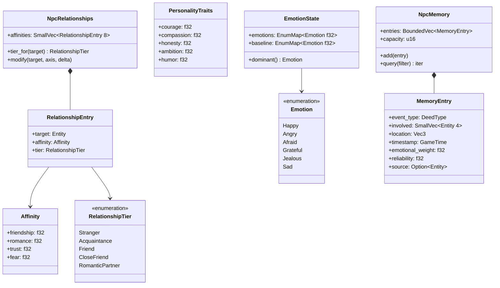
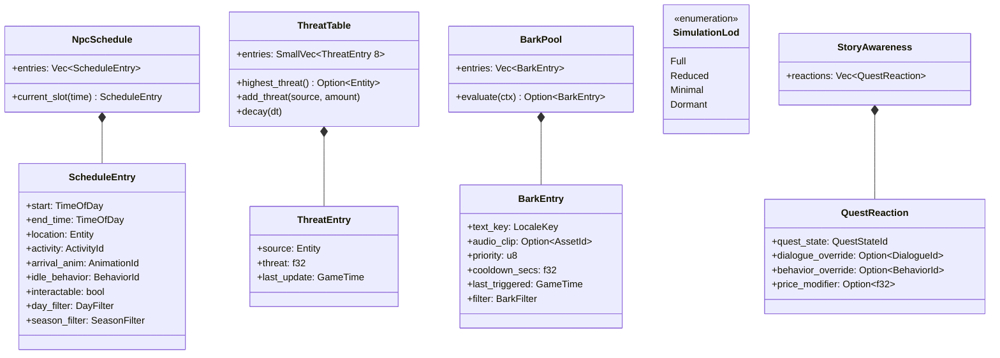
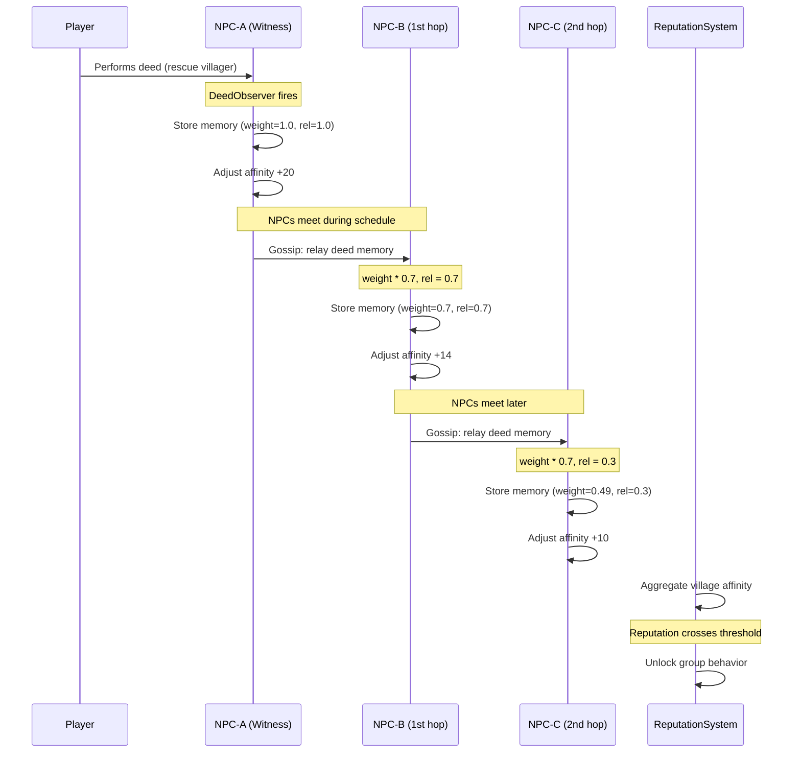
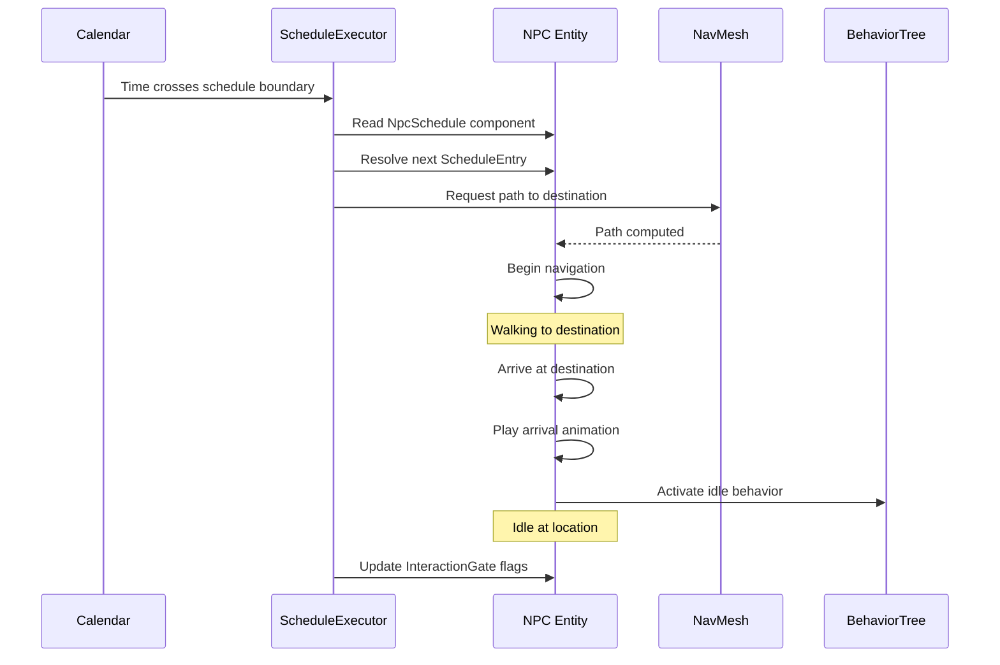
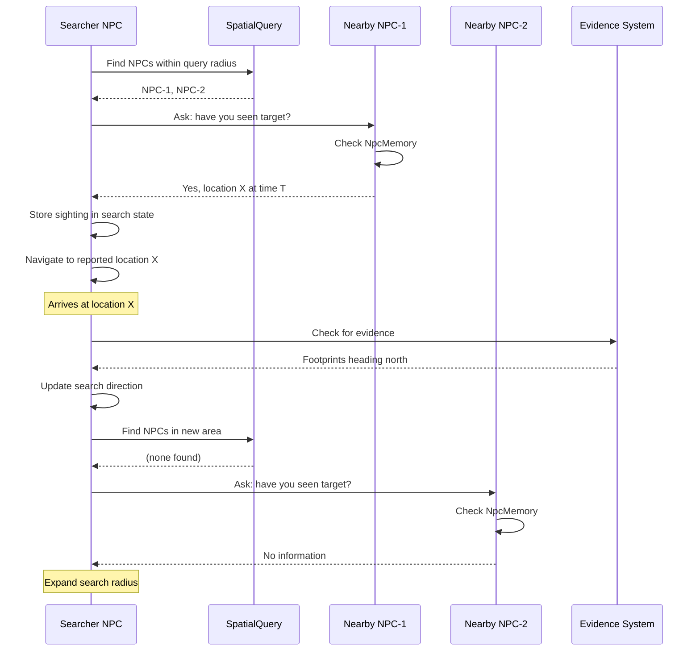
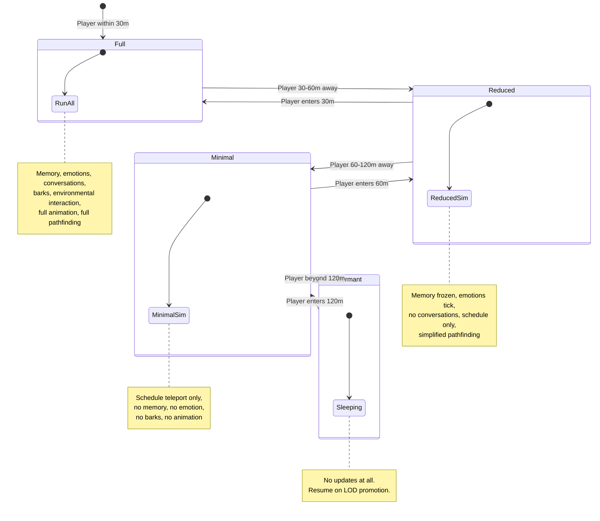

# NPC Simulation Design

## Requirements Trace

### Social Simulation (F-13.19.1--6 / R-13.19.1--6)

| Feature | Requirement | Description |
|---------|-------------|-------------|
| F-13.19.1 | R-13.19.1 | Per-NPC affinity values, gift preferences, relationship tiers |
| F-13.19.2 | R-13.19.2 | Personality traits, dynamic emotions, decay to baseline |
| F-13.19.3a | R-13.19.3a | Deed memory with emotional weight and time-based decay |
| F-13.19.3b | R-13.19.3b | Gossip propagation with accuracy degradation per hop |
| F-13.19.3c | R-13.19.3c | Emergent reputation aggregation across social groups |
| F-13.19.4a | R-13.19.4a | Schedule data model: time ranges, locations, activities |
| F-13.19.4b | R-13.19.4b | Schedule execution via pathfinding with arrival animations |
| F-13.19.4c | R-13.19.4c | Schedule-gated interactions exposed to dialogue and UI |
| F-13.19.5 | R-13.19.5 | Ambient barks: priority, cooldown, context filters |
| F-13.19.6 | R-13.19.6 | Threat tables with per-ability modifiers and decay |

### NPC Social Interactions (F-13.19.7--12 / R-13.19.7--12)

| Feature | Requirement | Description |
|---------|-------------|-------------|
| F-13.19.7 | R-13.19.7 | Autonomous NPC-to-NPC conversations with topic priority |
| F-13.19.8 | R-13.19.8 | Independent memory: 50 entries (20 mobile), reliability scores |
| F-13.19.9 | R-13.19.9 | Environmental interaction: doors, levers, chairs, shortcuts |
| F-13.19.10 | R-13.19.10 | Social-cue player search, no omniscient knowledge |
| F-13.19.11 | R-13.19.11 | Quest/story state awareness with NPC Reaction nodes |
| F-13.19.12 | R-13.19.12 | Player-visible NPC social behaviors, eavesdropping |

### Non-Functional (NFR-13.19.1--2)

| NFR | Description |
|-----|-------------|
| NFR-13.19.1 | 200 NPCs within 4 ms/frame; gossip amortized at 10/frame |
| NFR-13.19.2 | 256 bytes/deed entry; total deed memory <= 4 MB |

## Overview

The NPC simulation subsystem brings the game world to life
by giving every non-player character an independent social
identity: relationships, personality, emotions, memories,
daily routines, and reactions to player actions and world
events. All data lives as ECS components. All logic runs
as ECS systems. There are no parallel data stores.

Key architectural choices:

1. **Component-per-concern.** Each NPC aspect (affinity,
   personality, emotion, memory, schedule, threat) is a
   separate component. Systems compose freely.
2. **Data-driven everything.** Gift preferences,
   personality axes, schedule tables, bark pools, threat
   modifiers, and conversation templates are authored in
   the visual editor and stored as data assets.
3. **Amortized simulation.** Gossip propagation, memory
   decay, and reputation aggregation are budget-capped
   per frame to meet the 4 ms target at 200 NPCs.
4. **Simulation LOD.** Distant NPCs run simplified AI
   (no memory updates, no conversations, schedule-only).
   Full simulation activates when the player approaches.
5. **Static dispatch.** All systems are monomorphic. No
   trait objects on the hot path.
6. **No-code authoring.** Every tunable parameter is
   exposed through the visual NPC editor. Users never
   write code.

## Architecture

### Module Boundaries

```mermaid
graph TD
    subgraph social[social]
        REL[RelationshipSystem]
        PER[PersonalitySystem]
        EMO[EmotionSystem]
        REP[ReputationSystem]
        GOS[GossipSystem]
    end
    subgraph memory[memory]
        MEM[MemoryStore]
        DEED[DeedObserver]
        DECAY[MemoryDecaySystem]
        EVICT[MemoryEvictionSystem]
    end
    subgraph schedule[schedule]
        SDATA[ScheduleData]
        SEXEC[ScheduleExecutor]
        SGATE[InteractionGateSystem]
    end
    subgraph conversation[conversation]
        CONV[ConversationSystem]
        BARK[BarkSystem]
        EAVES[EavesdropSystem]
    end
    subgraph combat[combat]
        THREAT[ThreatTableSystem]
        AGGRO[AggroSystem]
    end
    subgraph awareness[awareness]
        STORY[StoryAwarenessSystem]
        SEARCH[SocialSearchSystem]
        ENV[EnvironmentalInteraction]
    end
    subgraph population[population]
        SPAWN[PopulationManager]
        LOD[SimulationLodSystem]
    end
    subgraph ext[External]
        ECS[World]
        BT[BehaviorTree]
        NAV[NavMesh]
        SQ[SpatialQuery]
        DLG[Dialogue]
        QUEST[QuestSystem]
        ANIM[AnimStateMachine]
        CAL[Calendar]
    end
    REL --> ECS
    PER --> ECS
    EMO --> PER
    EMO --> ANIM
    REP --> REL
    REP --> GOS
    GOS --> MEM
    GOS --> CONV
    MEM --> ECS
    DEED --> MEM
    DEED --> SQ
    DECAY --> MEM
    EVICT --> MEM
    SDATA --> ECS
    SDATA --> CAL
    SEXEC --> SDATA
    SEXEC --> NAV
    SEXEC --> BT
    SGATE --> SDATA
    SGATE --> DLG
    CONV --> MEM
    CONV --> REL
    CONV --> PER
    BARK --> SQ
    EAVES --> CONV
    THREAT --> SQ
    THREAT --> BT
    AGGRO --> THREAT
    STORY --> QUEST
    STORY --> DLG
    SEARCH --> MEM
    SEARCH --> SQ
    ENV --> NAV
    SPAWN --> ECS
    LOD --> SQ
    LOD --> SPAWN
```



### File Layout

```
harmonius_npc/
├── social/
│   ├── relationship.rs  # Affinity, AffinityAxis,
│   │                    # RelationshipTier,
│   │                    # GiftPreferenceTable
│   ├── personality.rs   # PersonalityTraits,
│   │                    # PersonalityAxis
│   ├── emotion.rs       # EmotionState, Emotion,
│   │                    # EmotionDecaySystem
│   ├── reputation.rs    # GroupReputation,
│   │                    # ReputationThreshold
│   └── gossip.rs        # GossipQueue, GossipEvent,
│                        # GossipSystem
├── memory/
│   ├── store.rs         # NpcMemory, MemoryEntry,
│   │                    # MemoryCapacity
│   ├── deed.rs          # DeedObserver, DeedType,
│   │                    # DeedJudgment
│   ├── decay.rs         # MemoryDecaySystem,
│   │                    # DecayCurve
│   └── eviction.rs      # MemoryEvictionSystem,
│                        # EvictionPolicy
├── schedule/
│   ├── data.rs          # NpcSchedule,
│   │                    # ScheduleEntry, TimeSlot
│   ├── executor.rs      # ScheduleExecutorSystem,
│   │                    # ScheduleTransition
│   └── gate.rs          # InteractionGate,
│                        # GateReason
├── conversation/
│   ├── system.rs        # ConversationSystem,
│   │                    # ConversationState
│   ├── template.rs      # ConversationTemplate,
│   │                    # TopicSlot
│   ├── bark.rs          # BarkPool, BarkEntry,
│   │                    # BarkSystem
│   └── eavesdrop.rs     # EavesdropSystem,
│                        # EavesdropRange
├── combat/
│   ├── threat.rs        # ThreatTable, ThreatEntry,
│   │                    # ThreatModifier
│   └── aggro.rs         # AggroRadius,
│                        # AggroSystem
├── awareness/
│   ├── story.rs         # StoryAwareness,
│   │                    # NpcReaction
│   ├── search.rs        # SocialSearchState,
│   │                    # SearchMethod
│   └── environment.rs   # NpcInteractionProfile,
│                        # EnvironmentInteraction
├── population/
│   ├── manager.rs       # PopulationBudget,
│   │                    # SpawnRuleSet
│   └── lod.rs           # SimulationLod,
│                        # LodTier
└── editor/
    ├── npc_editor.rs    # Visual NPC editor widgets
    ├── schedule_ed.rs   # Schedule timeline editor
    ├── bark_ed.rs       # Bark pool editor
    └── conversation_ed.rs # Conversation template
                           # editor
```

### System Execution Order


### Core Data Structures





### Gossip Propagation Flow



### Schedule Execution Flow



### Social Search Flow



### Simulation LOD Tiers



## API Design

### Relationship and Affinity

```rust
/// Axis of NPC affinity. Each axis is tracked
/// independently per relationship.
#[derive(
    Clone, Copy, Debug, PartialEq, Eq, Hash,
    Reflect,
)]
pub enum AffinityAxis {
    Friendship,
    Romance,
    Trust,
    Fear,
}

/// Numeric affinity values across all axes.
#[derive(
    Clone, Copy, Debug, Default, Reflect,
)]
pub struct Affinity {
    /// Range: -100.0 ..= 100.0 per axis.
    pub friendship: f32,
    pub romance: f32,
    pub trust: f32,
    pub fear: f32,
}

impl Affinity {
    pub fn get(&self, axis: AffinityAxis) -> f32;
    pub fn set(
        &mut self,
        axis: AffinityAxis,
        value: f32,
    );
    /// Clamps the modified value to [-100, 100].
    pub fn modify(
        &mut self,
        axis: AffinityAxis,
        delta: f32,
    );
}

/// Relationship tier, determined by affinity
/// thresholds.
#[derive(
    Clone, Copy, Debug, PartialEq, Eq,
    PartialOrd, Ord, Reflect,
)]
pub enum RelationshipTier {
    Stranger,
    Acquaintance,
    Friend,
    CloseFriend,
    RomanticPartner,
}

/// A single relationship from this NPC to another
/// entity.
#[derive(Clone, Debug, Reflect)]
pub struct RelationshipEntry {
    pub target: Entity,
    pub affinity: Affinity,
    pub tier: RelationshipTier,
}

/// ECS component: all relationships for one NPC.
/// Stored as a buffer component (dynamic array per
/// entity).
#[derive(Component, Debug, Reflect)]
pub struct NpcRelationships {
    entries: SmallVec<[RelationshipEntry; 8]>,
    /// Data asset: thresholds for tier transitions.
    tier_config: AssetId,
}

impl NpcRelationships {
    /// Look up the relationship to a target entity.
    pub fn get(
        &self,
        target: Entity,
    ) -> Option<&RelationshipEntry>;

    /// Modify affinity on one axis toward a target.
    /// Creates a new entry at Stranger tier if the
    /// target is unknown.
    pub fn modify_affinity(
        &mut self,
        target: Entity,
        axis: AffinityAxis,
        delta: f32,
        config: &TierConfig,
    );

    /// Current tier for a target. Returns Stranger
    /// if no relationship exists.
    pub fn tier_for(
        &self,
        target: Entity,
    ) -> RelationshipTier;

    /// Iterate all relationships.
    pub fn iter(
        &self,
    ) -> impl Iterator<Item = &RelationshipEntry>;
}

/// Gift preference category.
#[derive(
    Clone, Copy, Debug, PartialEq, Eq, Reflect,
)]
pub enum GiftPreference {
    Loved,
    Liked,
    Neutral,
    Disliked,
    Hated,
}

/// ECS component: per-NPC gift preference lookup.
/// References a data asset authored in the visual
/// editor.
#[derive(Component, Debug, Reflect)]
pub struct GiftPreferences {
    /// Asset containing item -> preference mapping.
    pub table: AssetId,
}

/// Tier transition thresholds loaded from a data
/// asset.
#[derive(Debug, Reflect)]
pub struct TierConfig {
    pub thresholds: [(RelationshipTier, f32); 5],
}
```

### Personality and Emotion

```rust
/// Personality axes. Values range 0.0 ..= 1.0.
#[derive(
    Clone, Copy, Debug, Default, Component, Reflect,
)]
pub struct PersonalityTraits {
    pub courage: f32,
    pub compassion: f32,
    pub honesty: f32,
    pub ambition: f32,
    pub humor: f32,
}

/// Emotional state identifiers.
#[derive(
    Clone, Copy, Debug, PartialEq, Eq, Hash,
    Reflect,
)]
pub enum Emotion {
    Happy,
    Angry,
    Afraid,
    Grateful,
    Jealous,
    Sad,
}

/// ECS component: dynamic emotional state.
/// Emotions decay toward personality-determined
/// baselines over time.
#[derive(Component, Debug, Reflect)]
pub struct EmotionState {
    /// Current intensity per emotion (0.0 ..= 1.0).
    pub current: EnumMap<Emotion, f32>,
    /// Personality-derived resting intensity.
    pub baseline: EnumMap<Emotion, f32>,
    /// Decay rate per second toward baseline.
    pub decay_rate: f32,
}

impl EmotionState {
    /// Apply a stimulus. Clamps to [0.0, 1.0].
    pub fn stimulate(
        &mut self,
        emotion: Emotion,
        intensity: f32,
    );

    /// Tick decay toward baseline by `dt` seconds.
    pub fn tick_decay(&mut self, dt: f32);

    /// The emotion with the highest current
    /// intensity.
    pub fn dominant(&self) -> Emotion;
}
```

### NPC Memory

```rust
/// Types of events that can be memorized.
#[derive(
    Clone, Copy, Debug, PartialEq, Eq, Hash,
    Reflect,
)]
pub enum DeedType {
    Sighting,
    Conversation,
    Combat,
    Theft,
    Gift,
    Rescue,
    Murder,
    QuestEvent,
    PropertyDestruction,
}

/// A single memory entry. Size budget: <= 256
/// bytes (NFR-13.19.2).
#[derive(Clone, Debug, Reflect)]
pub struct MemoryEntry {
    pub event_type: DeedType,
    /// Entities involved (player, NPCs, objects).
    pub involved: SmallVec<[Entity; 4]>,
    pub location: Vec3,
    pub timestamp: GameTime,
    /// How strongly the NPC felt about this event.
    /// Decays over time. Range: 0.0 ..= 1.0.
    pub emotional_weight: f32,
    /// How reliable the information is.
    /// Direct witness: 1.0, trusted NPC: 0.7,
    /// stranger: 0.3, multi-hop: degraded per hop.
    pub reliability: f32,
    /// Who told us (None = direct witness).
    pub source: Option<Entity>,
}

/// Predicate for querying memories.
pub struct MemoryFilter {
    pub event_type: Option<DeedType>,
    pub involves: Option<Entity>,
    pub min_weight: Option<f32>,
    pub min_reliability: Option<f32>,
    pub since: Option<GameTime>,
}

/// ECS component: an NPC's personal memory store.
/// Capped at `capacity` entries (50 desktop, 20
/// mobile). Lowest-weight eviction when full.
#[derive(Component, Debug, Reflect)]
pub struct NpcMemory {
    entries: Vec<MemoryEntry>,
    pub capacity: u16,
}

impl NpcMemory {
    pub fn new(capacity: u16) -> Self;

    /// Add a memory. If at capacity, evicts the
    /// entry with the lowest emotional weight.
    pub fn add(&mut self, entry: MemoryEntry);

    /// Query memories matching a filter.
    pub fn query<'a>(
        &'a self,
        filter: &MemoryFilter,
    ) -> impl Iterator<Item = &'a MemoryEntry>;

    /// Most recent memory involving a specific
    /// entity.
    pub fn last_sighting(
        &self,
        target: Entity,
    ) -> Option<&MemoryEntry>;

    /// Current entry count.
    pub fn len(&self) -> usize;

    /// Total byte size of all entries.
    pub fn byte_size(&self) -> usize;
}

/// Decay curve parameters loaded from data asset.
#[derive(Debug, Reflect)]
pub struct DecayCurve {
    /// Memories above this weight never decay.
    pub trauma_threshold: f32,
    /// Weight lost per in-game hour.
    pub decay_per_hour: f32,
    /// Weight below which the entry is evicted.
    pub eviction_threshold: f32,
}
```

### Gossip Propagation

```rust
/// A gossip event queued for amortized processing.
#[derive(Clone, Debug)]
pub struct GossipEvent {
    /// NPC sharing the gossip.
    pub speaker: Entity,
    /// NPC receiving the gossip.
    pub listener: Entity,
    /// Memory being shared.
    pub memory: MemoryEntry,
}

/// ECS resource: gossip processing queue.
/// At most `budget_per_frame` events are processed
/// per frame (default 10, NFR-13.19.1).
#[derive(Debug, Reflect)]
pub struct GossipQueue {
    pending: Vec<GossipEvent>,
    pub budget_per_frame: u32,
}

impl GossipQueue {
    pub fn enqueue(&mut self, event: GossipEvent);
    pub fn drain_budget(
        &mut self,
    ) -> impl Iterator<Item = GossipEvent> + '_;
    pub fn pending_count(&self) -> usize;
}

/// ECS component: per-NPC gossip behavior config.
#[derive(Component, Debug, Reflect)]
pub struct GossipProfile {
    /// Probability of sharing a memory per social
    /// interaction. 0.0 = hermit, 1.0 = town crier.
    pub propagation_rate: f32,
    /// Multiplier applied to emotional weight when
    /// retelling. Default 0.7.
    pub weight_degradation: f32,
    /// Multiplier applied to reliability when
    /// retelling.
    pub reliability_degradation: f32,
}
```

### Reputation Aggregation

```rust
/// ECS component on a group entity (village,
/// guild, faction). Aggregates member NPC
/// affinities into a group reputation score.
#[derive(Component, Debug, Reflect)]
pub struct GroupReputation {
    /// Group entity this reputation belongs to.
    pub group: Entity,
    /// Aggregated score per affinity axis.
    pub score: Affinity,
    /// Thresholds that gate group-wide behaviors.
    pub thresholds: Vec<ReputationThreshold>,
}

/// A threshold that triggers a group behavior.
#[derive(Clone, Debug, Reflect)]
pub struct ReputationThreshold {
    pub axis: AffinityAxis,
    pub min_value: f32,
    pub behavior: GroupBehavior,
}

/// Group-wide behavior triggered by reputation.
#[derive(Clone, Debug, Reflect)]
pub enum GroupBehavior {
    ShopDiscount { percent: f32 },
    HostileReaction,
    QuestUnlock { quest: AssetId },
    DialogueOverride { dialogue: AssetId },
}
```

### Schedule System

```rust
/// Time of day in minutes since midnight.
#[derive(
    Clone, Copy, Debug, PartialEq, Eq,
    PartialOrd, Ord, Reflect,
)]
pub struct TimeOfDay(pub u16);

/// Day-of-week filter bitmask.
#[derive(
    Clone, Copy, Debug, Default, Reflect,
)]
pub struct DayFilter(pub u8);

/// Season filter bitmask.
#[derive(
    Clone, Copy, Debug, Default, Reflect,
)]
pub struct SeasonFilter(pub u8);

/// A single time slot in an NPC's daily schedule.
#[derive(Clone, Debug, Reflect)]
pub struct ScheduleEntry {
    pub start: TimeOfDay,
    pub end_time: TimeOfDay,
    /// Target location entity (a waypoint).
    pub location: Entity,
    /// Activity identifier for behavior tree.
    pub activity: ActivityId,
    /// Animation to play on arrival.
    pub arrival_anim: AnimationId,
    /// Behavior tree to run while idle at location.
    pub idle_behavior: BehaviorId,
    /// Whether the NPC can be interacted with.
    pub interactable: bool,
    /// Which days this entry applies.
    pub day_filter: DayFilter,
    /// Which seasons this entry applies.
    pub season_filter: SeasonFilter,
}

/// ECS component: an NPC's full daily schedule.
#[derive(Component, Debug, Reflect)]
pub struct NpcSchedule {
    pub entries: Vec<ScheduleEntry>,
}

impl NpcSchedule {
    /// Find the active schedule entry for the
    /// given time, day, and season.
    pub fn current_slot(
        &self,
        time: TimeOfDay,
        day: DayOfWeek,
        season: Season,
    ) -> Option<&ScheduleEntry>;
}

/// ECS component: tracks the NPC's current
/// schedule execution state.
#[derive(Component, Debug, Reflect)]
pub struct ScheduleState {
    pub current_slot_index: Option<u16>,
    pub navigation_status: NavigationStatus,
    pub arrived: bool,
}

/// Navigation status for schedule transitions.
#[derive(Clone, Copy, Debug, PartialEq, Eq, Reflect)]
pub enum NavigationStatus {
    Idle,
    Navigating,
    Arrived,
    Failed,
}

/// ECS component: marks whether an NPC is
/// available for interaction in the current slot.
#[derive(Component, Debug, Reflect)]
pub struct InteractionGate {
    pub available: bool,
    pub reason: GateReason,
}

/// Why an NPC is unavailable for interaction.
#[derive(Clone, Debug, Reflect)]
pub enum GateReason {
    Available,
    Sleeping,
    Traveling,
    Working,
    InConversation,
    Custom { text_key: LocaleKey },
}
```

### Ambient Bark System

```rust
/// Context filters for bark triggering.
#[derive(Clone, Debug, Reflect)]
pub struct BarkFilter {
    pub require_combat: Option<bool>,
    pub require_time_range: Option<(
        TimeOfDay, TimeOfDay,
    )>,
    pub require_weather: Option<WeatherId>,
    pub require_nearby_entity: Option<Entity>,
    pub min_player_distance: Option<f32>,
    pub max_player_distance: Option<f32>,
}

/// A single bark entry in the pool.
#[derive(Clone, Debug, Reflect)]
pub struct BarkEntry {
    pub text_key: LocaleKey,
    pub audio_clip: Option<AssetId>,
    /// Higher priority preempts lower. Range: 0-255.
    pub priority: u8,
    /// Minimum seconds between triggers.
    pub cooldown_secs: f32,
    pub filter: BarkFilter,
}

/// ECS component: per-NPC bark pool.
#[derive(Component, Debug, Reflect)]
pub struct BarkPool {
    pub entries: Vec<BarkEntry>,
}

/// ECS component: tracks bark cooldown state.
#[derive(Component, Debug, Default, Reflect)]
pub struct BarkCooldowns {
    /// Last trigger time per bark index.
    last_triggered: SmallVec<
        [(u16, GameTime); 4]
    >,
}

impl BarkPool {
    /// Evaluate all barks against the current
    /// context. Returns the highest-priority bark
    /// that passes its filter and is not on
    /// cooldown.
    pub fn evaluate(
        &self,
        ctx: &BarkContext,
        cooldowns: &BarkCooldowns,
        now: GameTime,
    ) -> Option<(usize, &BarkEntry)>;
}

/// Context snapshot passed to bark evaluation.
pub struct BarkContext {
    pub in_combat: bool,
    pub time_of_day: TimeOfDay,
    pub weather: WeatherId,
    pub player_distance: f32,
    pub nearby_entities: SmallVec<[Entity; 8]>,
}
```

### Threat and Aggro

```rust
/// A single entry in the threat table.
#[derive(Clone, Debug, Reflect)]
pub struct ThreatEntry {
    pub source: Entity,
    pub threat: f32,
    pub last_update: GameTime,
}

/// ECS component: per-enemy threat table.
#[derive(Component, Debug, Reflect)]
pub struct ThreatTable {
    entries: SmallVec<[ThreatEntry; 8]>,
    /// Threat lost per second when source is out of
    /// combat range.
    pub decay_rate: f32,
}

impl ThreatTable {
    /// Add threat from a source. Creates entry if
    /// new.
    pub fn add_threat(
        &mut self,
        source: Entity,
        amount: f32,
        now: GameTime,
    );

    /// The entity with the highest accumulated
    /// threat.
    pub fn highest_threat(
        &self,
    ) -> Option<Entity>;

    /// Decay threat for sources outside combat
    /// range.
    pub fn decay(
        &mut self,
        dt: f32,
        in_range: &[Entity],
    );

    /// Remove a source entirely (death, despawn).
    pub fn remove(&mut self, source: Entity);

    /// Read-only access to all entries (exposed to
    /// behavior trees).
    pub fn entries(&self) -> &[ThreatEntry];
}

/// ECS component: aggro detection radius.
#[derive(Component, Debug, Reflect)]
pub struct AggroRadius {
    pub radius: f32,
    pub require_los: bool,
}
```

### NPC-to-NPC Conversations

```rust
/// Conversation topic categories, prioritized
/// in this order.
#[derive(
    Clone, Copy, Debug, PartialEq, Eq,
    PartialOrd, Ord, Reflect,
)]
pub enum TopicCategory {
    /// Highest priority: active threats.
    ThreatWarning,
    /// Quest-relevant information.
    QuestInfo,
    /// Social gossip and rumors.
    Gossip,
    /// Ambient chatter (weather, time).
    Ambient,
}

/// A conversation template authored in the editor.
#[derive(Clone, Debug, Reflect)]
pub struct ConversationTemplate {
    pub greeting_bark: LocaleKey,
    pub farewell_bark: LocaleKey,
    pub topic_slots: u8,
    pub max_duration_secs: f32,
}

/// ECS component: active conversation state.
/// Present only while the NPC is in a conversation.
#[derive(Component, Debug, Reflect)]
pub struct ConversationState {
    pub partner: Entity,
    pub phase: ConversationPhase,
    pub topics_exchanged: u8,
    pub elapsed_secs: f32,
    pub template: AssetId,
}

/// Phase of an NPC-to-NPC conversation.
#[derive(
    Clone, Copy, Debug, PartialEq, Eq, Reflect,
)]
pub enum ConversationPhase {
    Greeting,
    TopicExchange,
    Farewell,
    Interrupted,
}

/// Configuration for conversation limits per
/// platform.
#[derive(Debug, Reflect)]
pub struct ConversationConfig {
    /// Max simultaneous conversations in the world.
    /// Desktop: 16, Mobile: 4 (R-13.19.7).
    pub max_simultaneous: u32,
    /// Min distance between NPCs to start.
    pub proximity_threshold: f32,
}
```

### Eavesdropping

```rust
/// ECS component: marks a conversation as
/// containing eavesdroppable intelligence.
#[derive(Component, Debug, Reflect)]
pub struct EavesdropContent {
    /// What the player learns by overhearing.
    pub intel: IntelType,
    /// Base range at which eavesdropping succeeds.
    pub base_range: f32,
    /// Stealth multiplier applied to range.
    pub stealth_range_bonus: f32,
}

/// Types of intelligence obtainable by
/// eavesdropping.
#[derive(Clone, Debug, Reflect)]
pub enum IntelType {
    QuestHint { quest: AssetId },
    HiddenItemLocation { item: AssetId },
    NpcScheduleReveal { npc: Entity },
    FactionSecret { faction: Entity },
}
```

### Social-Cue Player Search

```rust
/// ECS component: active search state for an NPC
/// looking for a target.
#[derive(Component, Debug, Reflect)]
pub struct SocialSearchState {
    pub target: Entity,
    pub method: SearchMethod,
    pub last_known_pos: Option<Vec3>,
    pub last_known_time: Option<GameTime>,
    pub npcs_queried: SmallVec<[Entity; 8]>,
    pub evidence_checked: SmallVec<[Entity; 4]>,
    pub search_radius: f32,
}

/// Search methods, tried in order.
#[derive(
    Clone, Copy, Debug, PartialEq, Eq, Reflect,
)]
pub enum SearchMethod {
    /// Asking nearby NPCs for sightings.
    AskNearby,
    /// Checking environmental evidence.
    CheckEvidence,
    /// Broadcasting to faction members.
    FactionBroadcast,
    /// Expanding radius and repeating.
    ExpandRadius,
}

/// ECS component: limits on search behavior per
/// platform.
#[derive(Component, Debug, Reflect)]
pub struct SearchConfig {
    /// Max NPCs to query per search.
    /// Desktop: 8, Mobile: 4 (R-13.19.10).
    pub max_npc_queries: u8,
    /// Simulated delay for faction broadcast
    /// responses.
    pub faction_response_delay_secs: f32,
    /// Radius expansion per failed cycle.
    pub radius_expansion: f32,
}
```

### Story Awareness

```rust
/// A quest-state-triggered NPC reaction.
#[derive(Clone, Debug, Reflect)]
pub struct QuestReaction {
    /// The quest state that triggers this reaction.
    pub quest_state: QuestStateId,
    /// Override dialogue when this state is active.
    pub dialogue_override: Option<DialogueId>,
    /// Override behavior tree when active.
    pub behavior_override: Option<BehaviorId>,
    /// Price modifier for merchants (1.0 = normal).
    pub price_modifier: Option<f32>,
    /// Topic to inject into NPC conversations.
    pub conversation_topic: Option<LocaleKey>,
}

/// ECS component: list of quest states this NPC
/// reacts to. Configured in the visual quest editor
/// as NPC Reaction nodes.
#[derive(Component, Debug, Reflect)]
pub struct StoryAwareness {
    pub reactions: Vec<QuestReaction>,
}

impl StoryAwareness {
    /// Find the active reaction for the current
    /// quest state, if any.
    pub fn active_reaction(
        &self,
        active_states: &[QuestStateId],
    ) -> Option<&QuestReaction>;
}
```

### Environmental Interaction

```rust
/// ECS component on interactable objects: defines
/// which NPC archetypes can use it and how.
#[derive(Component, Debug, Reflect)]
pub struct NpcInteractionProfile {
    /// Which NPC archetypes may use this object.
    pub allowed_archetypes: Vec<ArchetypeId>,
    /// Required item to interact (key for door).
    pub required_item: Option<AssetId>,
    /// Animation to play during interaction.
    pub interaction_anim: AnimationId,
    /// Pathfinding cost modifier for this shortcut.
    /// Lower = more attractive to pathfinder.
    pub nav_cost: f32,
}
```

### Population Management and Simulation LOD

```rust
/// Simulation LOD tier. Determines which systems
/// run for this NPC.
#[derive(
    Clone, Copy, Debug, PartialEq, Eq,
    PartialOrd, Ord, Component, Reflect,
)]
pub enum SimulationLod {
    /// All systems active: memory, emotion,
    /// conversation, barks, full pathfinding.
    Full,
    /// Memory frozen, emotions tick, schedule-only
    /// navigation, no conversations.
    Reduced,
    /// Schedule teleport only, no memory, no
    /// emotion, no barks, no animation.
    Minimal,
    /// No updates. Resumes on LOD promotion.
    Dormant,
}

/// ECS resource: LOD distance thresholds.
#[derive(Debug, Reflect)]
pub struct LodConfig {
    pub full_radius: f32,
    pub reduced_radius: f32,
    pub minimal_radius: f32,
}

/// ECS resource: population budget. Limits the
/// number of fully-simulated NPCs per frame.
#[derive(Debug, Reflect)]
pub struct PopulationBudget {
    /// Max NPCs at Full LOD. Desktop: 50, Mobile:
    /// 20 (R-13.19.4b).
    pub max_full_lod: u32,
    /// Max NPCs at Reduced LOD.
    pub max_reduced_lod: u32,
    /// Max total scheduled NPCs in active area.
    /// 200 (NFR-13.19.1).
    pub max_active: u32,
}

/// ECS component: NPC spawn rule set.
#[derive(Component, Debug, Reflect)]
pub struct SpawnRule {
    /// Prefab entity to instantiate.
    pub prefab: AssetId,
    /// Location to spawn at.
    pub spawn_point: Entity,
    /// Time-of-day range during which NPC exists.
    pub active_hours: Option<(TimeOfDay, TimeOfDay)>,
    /// Minimum distance from player to spawn.
    pub min_spawn_distance: f32,
    /// Maximum distance before despawn.
    pub max_despawn_distance: f32,
}
```

### Visual NPC Editor

All NPC data is authored through the visual editor. The
editor exposes the following panels, accessible without
writing code:

| Panel | Data Authored | Component |
|-------|---------------|-----------|
| Relationship Editor | Gift preferences, tier thresholds, affinity modifiers | `GiftPreferences`, `TierConfig` |
| Personality Editor | Trait sliders, emotion baselines, decay rates | `PersonalityTraits`, `EmotionState` |
| Memory Config | Capacity, decay curve, trauma threshold | `NpcMemory`, `DecayCurve` |
| Schedule Timeline | Drag-and-drop time slots, location pins, day/season filters | `NpcSchedule` |
| Bark Pool Editor | Bark entries with priority, cooldown, context filters, audio preview | `BarkPool` |
| Threat Config | Per-ability threat modifiers, decay rate, aggro radius | `ThreatTable`, `AggroRadius` |
| Conversation Templates | Greeting/farewell barks, topic slot count, duration | `ConversationTemplate` |
| Story Reactions | NPC Reaction nodes on quest state transitions | `StoryAwareness` |
| Interaction Profiles | Allowed archetypes, required items, nav cost | `NpcInteractionProfile` |
| Population Rules | Spawn rules, LOD thresholds, budget caps | `SpawnRule`, `PopulationBudget` |
| Gossip Config | Propagation rate, weight/reliability degradation | `GossipProfile` |

## Data Flow

### Per-Frame Simulation Pipeline

The NPC simulation runs within the ECS schedule. Systems
are grouped into ordered phases to respect data
dependencies while maximizing parallelism within each
phase.

```rust
// Phase 1: Pre-Simulation
// SimulationLodSystem reads player position and
// spatial index, assigns SimulationLod to each NPC.
// PopulationManager spawns/despawns NPCs based on
// distance budget.

// Phase 2: Core Simulation (parallelizable)
// ScheduleExecutorSystem checks calendar, triggers
// navigation. EmotionDecaySystem ticks emotion
// toward baseline. MemoryDecaySystem reduces
// emotional weights. MemoryEvictionSystem evicts
// entries below threshold.

// Phase 3: Social (parallelizable)
// DeedObserver captures witnessed deeds, writes to
// NpcMemory, adjusts affinity.
// GossipSystem drains up to 10 events from
// GossipQueue, writes to listener NpcMemory.
// ReputationSystem aggregates group scores.

// Phase 4: Interaction (parallelizable)
// ConversationSystem initiates and ticks NPC-NPC
// conversations.
// BarkSystem evaluates bark pools, emits barks.
// EavesdropSystem checks player proximity to
// conversations.
// SocialSearchSystem advances search state.
// EnvironmentInteractionSystem evaluates shortcuts
// during pathfinding.
// StoryAwarenessSystem checks quest state changes,
// applies NPC reactions.

// Phase 5: Combat
// ThreatTableSystem accumulates threat from
// ability events.
// AggroSystem queries spatial index for targets
// within aggro radius.
```

### Memory Budget Enforcement

Total deed memory across all NPCs is capped at 4 MB
(NFR-13.19.2). Each `MemoryEntry` is budgeted at
256 bytes. The `MemoryEvictionSystem` enforces this:

1. Each NPC's `NpcMemory` has a per-entity cap (50
   desktop, 20 mobile).
2. When adding a memory exceeds capacity, the entry
   with the lowest `emotional_weight` is evicted.
3. A global `MemoryBudget` resource tracks total
   memory across all NPCs. If the global cap is
   reached, the system-wide lowest-weight entry is
   evicted before any new entry is added.

```rust
/// ECS resource: global memory budget.
#[derive(Debug, Reflect)]
pub struct MemoryBudget {
    /// Maximum total bytes across all NPCs.
    pub max_bytes: usize,
    /// Current total bytes.
    pub current_bytes: usize,
}

impl MemoryBudget {
    /// Check whether adding an entry would exceed
    /// the budget.
    pub fn can_allocate(
        &self,
        entry_size: usize,
    ) -> bool;
}
```

### Gossip Amortization

Gossip events are not processed immediately. When two
NPCs converse, gossip events are enqueued in the
`GossipQueue` resource. The `GossipSystem` drains at
most `budget_per_frame` (default 10) events per frame,
spreading the cost across multiple frames:

1. `ConversationSystem` evaluates gossip eligibility
   based on `GossipProfile.propagation_rate`.
2. Eligible memories are wrapped as `GossipEvent` and
   enqueued.
3. `GossipSystem` drains up to 10 per frame.
4. For each drained event, it creates a degraded
   `MemoryEntry` in the listener's `NpcMemory` with
   reduced weight and reliability.
5. The listener's affinity is adjusted based on the
   degraded emotional weight.

### LOD Promotion and Demotion

When a player moves through the world, the
`SimulationLodSystem` updates each NPC's `SimulationLod`
component based on distance. Systems check the LOD
component via a query filter:

```rust
// Full LOD: all systems run.
fn conversation_system(
    query: Query<
        (&mut ConversationState, &NpcMemory),
        With<SimulationLod>,
    >,
) {
    for (state, memory) in query
        .iter()
        .filter(|(.., lod)| {
            *lod == SimulationLod::Full
        })
    {
        // ... full conversation logic
    }
}

// Reduced LOD: emotion ticks, no conversations.
// Minimal LOD: schedule teleport only.
// Dormant: system skips entirely.
```

On promotion from Reduced to Full, frozen memories
are kept as-is. On promotion from Dormant, the NPC's
schedule state is fast-forwarded to the current time.

## Platform Considerations

### Scaling Tiers

| Platform | Max Full LOD | Max Reduced | Max Active | Memory Cap/NPC | Conversations |
|----------|-------------|-------------|------------|----------------|---------------|
| Desktop | 50 | 100 | 200 | 50 entries | 16 simultaneous |
| Mobile | 20 | 40 | 80 | 20 entries | 4 simultaneous |
| Console | 50 | 100 | 200 | 50 entries | 16 simultaneous |

### Platform-Specific Notes

| Platform | Consideration |
|----------|---------------|
| Mobile | Reduced NPC query limit (4 vs 8) for social search. Gossip budget reduced to 5/frame. |
| All | `SimulationLod` distances configured per platform via `cfg` resource defaults. |
| All | Schedule pathfinding requests routed through the thread pool's task graph (threading.md). |
| All | Spatial queries (aggro, bark proximity, search) use the shared BVH (spatial-index.md). |

### Performance Budget

| System | Budget | Scaling Strategy |
|--------|--------|------------------|
| All NPC simulation | 4 ms/frame (NFR-13.19.1) | LOD tiers reduce active count |
| Gossip processing | 10 events/frame | Amortized queue drain |
| Schedule transitions | ~1 per NPC per game-hour | Pathfinding batched |
| Bark evaluation | Per-frame per Full LOD NPC | Early-out on cooldown |
| Threat table decay | Per-frame per combat NPC | Only in-combat NPCs |
| Memory decay | Per-frame per Full/Reduced NPC | Skip Minimal/Dormant |

## Test Plan

### Unit Tests

| Test | Req | Description |
|------|-----|-------------|
| `test_affinity_modify_clamp` | R-13.19.1 | Modify affinity past 100/-100; verify clamped. |
| `test_gift_preference_loved` | R-13.19.1 | Give loved item; verify affinity increase matches table. |
| `test_gift_preference_hated` | R-13.19.1 | Give hated item; verify affinity decrease matches table. |
| `test_tier_advance` | R-13.19.1 | Push affinity past threshold; verify tier advances. |
| `test_tier_persist_save_load` | R-13.19.1 | Save and reload; verify affinity and tier persist. |
| `test_personality_emotion_baseline` | R-13.19.2 | High courage NPC; fear stays below low-courage NPC. |
| `test_emotion_decay_to_baseline` | R-13.19.2 | Stimulate emotion; tick decay; verify return to baseline. |
| `test_emotion_dominant` | R-13.19.2 | Stimulate multiple emotions; verify dominant is highest. |
| `test_deed_memory_positive` | R-13.19.3a | Witness rescue; verify memory stored, affinity increased. |
| `test_deed_memory_negative` | R-13.19.3a | Witness theft; verify memory stored, affinity decreased. |
| `test_deed_memory_decay` | R-13.19.3a | Wait for decay period; verify weight reaches zero. |
| `test_deed_memory_eviction` | R-13.19.3a | Fill to capacity; add one more; verify lowest-weight evicted. |
| `test_gossip_weight_degrades` | R-13.19.3b | Gossip from A to B; verify weight *= 0.7. |
| `test_gossip_multi_hop` | R-13.19.3b | Gossip A->B->C; verify C's reliability is 0.3. |
| `test_gossip_rate_hermit` | R-13.19.3b | Hermit archetype; verify low propagation rate. |
| `test_reputation_aggregate` | R-13.19.3c | Improve 3 NPCs; verify group score crosses threshold. |
| `test_reputation_unlock` | R-13.19.3c | Cross threshold; verify group behavior activates. |
| `test_schedule_current_slot` | R-13.19.4a | Query at 10:00; verify returns work slot. |
| `test_schedule_day_filter` | R-13.19.4a | Weekend schedule; verify alternate entry on Saturday. |
| `test_schedule_navigation` | R-13.19.4b | Cross boundary; verify pathfind request issued. |
| `test_schedule_skip_late` | R-13.19.4b | NPC arrives late; verify skip to current slot. |
| `test_interaction_gate_sleeping` | R-13.19.4c | Query sleeping NPC; verify unavailable with reason. |
| `test_interaction_gate_working` | R-13.19.4c | Query during work hours; verify available. |
| `test_bark_priority` | R-13.19.5 | Two barks eligible; verify higher priority wins. |
| `test_bark_cooldown` | R-13.19.5 | Trigger bark; trigger again within cooldown; verify suppressed. |
| `test_bark_filter_combat` | R-13.19.5 | Combat-only bark; verify no trigger outside combat. |
| `test_threat_add_decay` | R-13.19.6 | Add threat; decay out-of-range; verify reaches zero. |
| `test_threat_highest` | R-13.19.6 | Three sources; verify highest_threat returns top. |
| `test_threat_taunt` | R-13.19.6 | Taunt ability; verify caster tops the table. |
| `test_memory_capacity_desktop` | R-13.19.8 | Desktop NPC; verify capacity is 50. |
| `test_memory_capacity_mobile` | R-13.19.8 | Mobile NPC; verify capacity is 20. |
| `test_memory_reliability_direct` | R-13.19.8 | Direct witness; verify reliability is 1.0. |
| `test_memory_reliability_heard` | R-13.19.8 | Heard from trusted NPC; verify reliability is 0.7. |
| `test_memory_trauma_persists` | R-13.19.8 | Traumatic memory; verify no decay after time window. |
| `test_memory_routine_fades` | R-13.19.8 | Routine memory; verify decays within game-hours. |
| `test_search_no_omniscience` | R-13.19.10 | Hidden player; verify searcher never moves to current pos. |
| `test_search_ask_npc` | R-13.19.10 | Queried NPC has sighting; verify searcher investigates. |
| `test_search_faction_delay` | R-13.19.10 | Faction broadcast; verify responses delayed. |
| `test_story_dialogue_change` | R-13.19.11 | Complete quest; verify NPC dialogue overridden. |
| `test_story_price_modifier` | R-13.19.11 | Trigger event; verify merchant price changes. |
| `test_eavesdrop_stealth_range` | R-13.19.12 | Stealthed player; verify extended eavesdrop range. |
| `test_eavesdrop_no_stealth` | R-13.19.12 | Non-stealthed; verify shorter range. |
| `test_conversation_interrupt` | R-13.19.7 | Player approaches; verify conversation interrupted. |

### Integration Tests

| Test | Req | Description |
|------|-----|-------------|
| `test_200_npc_frame_budget` | NFR-13.19.1 | Spawn 200 scheduled NPCs; measure total NPC sim time; verify < 4 ms. |
| `test_gossip_amortization` | NFR-13.19.1 | Trigger 50 gossip events; verify they amortize at 10/frame across 5 frames. |
| `test_memory_global_budget` | NFR-13.19.2 | Generate 1,000 deeds across 200 NPCs; verify total memory <= 4 MB. |
| `test_memory_entry_size` | NFR-13.19.2 | Measure MemoryEntry size; verify <= 256 bytes. |
| `test_lod_promotion_demotion` | R-13.19.8 | Move player away; verify LOD demotes. Move back; verify LOD promotes and memory resumes. |
| `test_full_social_chain` | R-13.19.3b | Player performs deed witnessed by A; A gossips to B; B gossips to C; verify reputation propagation end-to-end. |
| `test_schedule_full_day` | R-13.19.4b | Run 24 game-hours; verify NPC visits all schedule locations. |
| `test_conversation_to_memory` | R-13.19.7 | Two NPCs converse; verify both gain memory entries with source attribution. |
| `test_env_interaction_door` | R-13.19.9 | NPC with key pathfinds through locked door; NPC without key routes around. |
| `test_npc_conversation_mobile_limit` | R-13.19.7 | On mobile config, start 5 conversations; verify only 4 active. |
| `test_search_expand_radius` | R-13.19.10 | All nearby queries fail; verify search radius expands. |

### Benchmarks

| Benchmark | Target | Source |
|-----------|--------|--------|
| 200 NPC full simulation | < 4 ms/frame | NFR-13.19.1 |
| Gossip drain (10 events) | < 200 us/frame | NFR-13.19.1 |
| Memory decay (200 NPCs) | < 500 us/frame | NFR-13.19.1 |
| Bark evaluation (50 NPCs) | < 300 us/frame | NFR-13.19.1 |
| Schedule transition (1 NPC) | < 50 us | R-13.19.4b |
| Threat table update | < 10 us per enemy | R-13.19.6 |
| Reputation aggregation | < 100 us per group | R-13.19.3c |
| Memory entry allocation | < 1 us | NFR-13.19.2 |

## Open Questions

1. **Gossip graph visualization.** Should the editor
   provide a real-time visualization of the gossip
   propagation network for debugging? This would
   require tracking gossip edges as transient data.
2. **Memory compression.** At 256 bytes per entry and
   50 entries per NPC, 200 NPCs consume ~2.5 MB. If
   the entry count or NPC count grows, a compressed
   representation (e.g., merging similar memories)
   may be needed.
3. **Schedule conflict resolution.** When an NPC is in
   a conversation or combat at a schedule boundary,
   the current design skips to the current slot. An
   alternative is to queue the transition and resume
   after the interruption.
4. **Emotion propagation.** Should witnessing another
   NPC's strong emotion trigger a weaker version in
   nearby NPCs (emotional contagion)? This would add
   emergent crowd reactions but increases per-frame
   cost.
5. **Gossip budget per platform.** The default is 10
   events/frame. Mobile may need 5. The optimal
   budget depends on NPC density and conversation
   frequency per platform tier.
6. **Threat table size cap.** Currently uncapped. In
   large raids (20+ players), the threat table could
   grow large. A cap with lowest-threat eviction may
   be needed.
7. **Cross-zone NPC persistence.** When an NPC is
   demoted to Dormant and the player re-enters the
   zone, should the NPC's memory and relationship
   state reflect time passed (simulated catch-up) or
   freeze exactly where it was?
