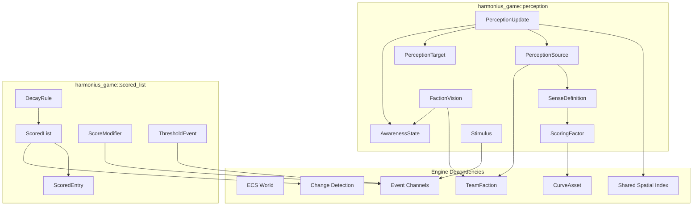
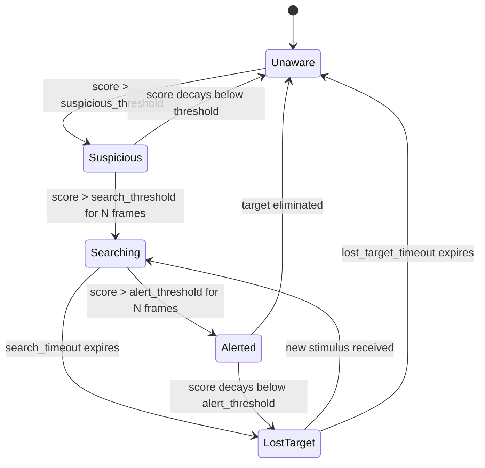
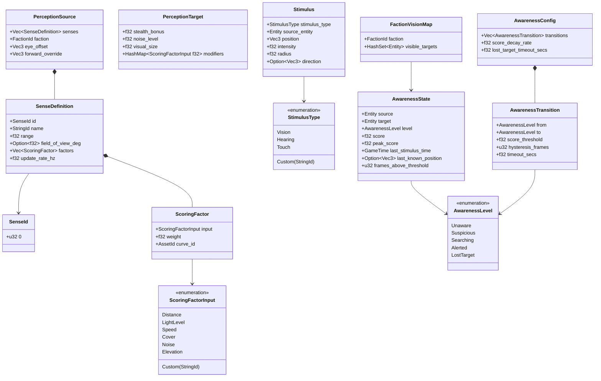
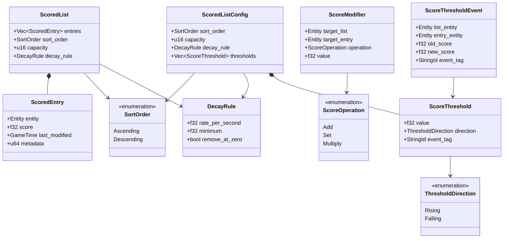
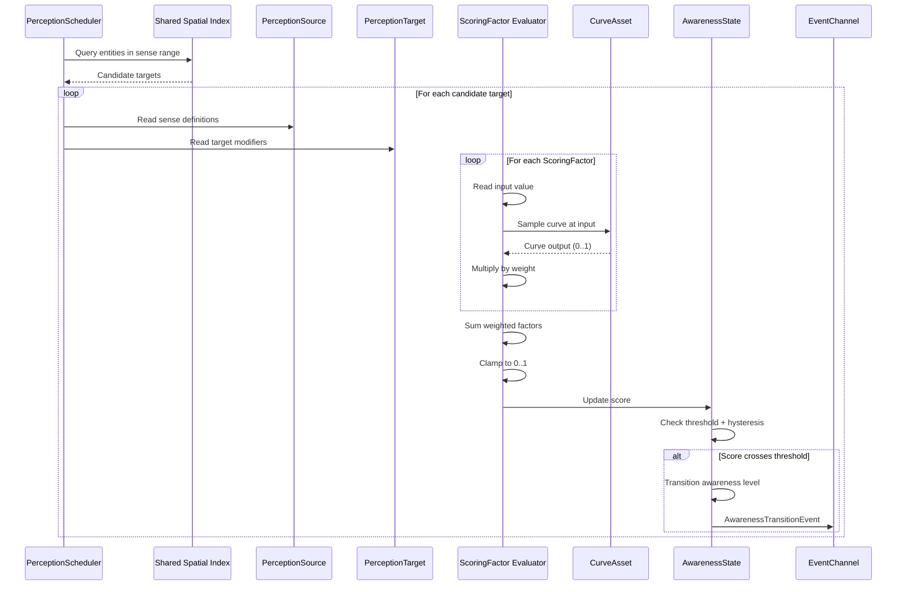
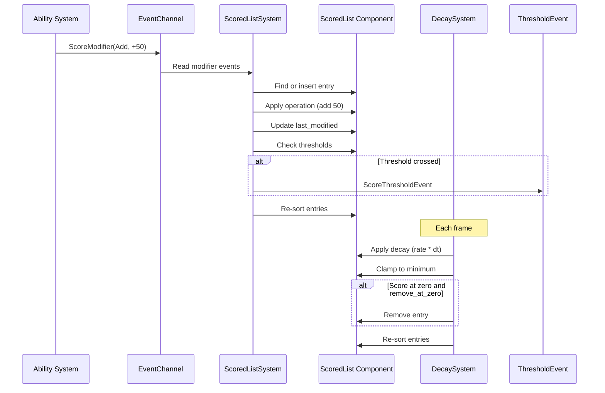

# Perception and Scoring Systems Design

## Requirements Trace

> **Canonical sources:** Features, requirements, and user stories are defined in
> [features/game-framework/](../../features/), [requirements/game-framework/](../../requirements/),
> and [user-stories/game-framework/](../../user-stories/). The table below traces design elements to
> those definitions.

### Stealth and Cover (F-13.18.1--4 / R-13.18.1--4)

| Feature   | Requirement |
|-----------|-------------|
| F-13.18.1 | R-13.18.1   |
| F-13.18.2 | R-13.18.2   |
| F-13.18.3 | R-13.18.3   |
| F-13.18.4 | R-13.18.4   |

1. **F-13.18.1** -- Player visibility and stealth scoring
2. **F-13.18.2** -- AI alert state machine (5 states)
3. **F-13.18.3** -- Noise generation and distraction
4. **F-13.18.4** -- Stealth takedown system

### Fog of War (F-13.20.1--4 / R-13.20.1--4)

| Feature   | Requirement |
|-----------|-------------|
| F-13.20.1 | R-13.20.1   |
| F-13.20.2 | R-13.20.2   |
| F-13.20.3 | R-13.20.3   |
| F-13.20.4 | R-13.20.4   |

1. **F-13.20.1** -- Fog of war grid with 3-state visibility and GPU texture
2. **F-13.20.2** -- Vision sources with sight radius, shape, and LOS blocking
3. **F-13.20.3** -- Vision modifier volumes (stealth zones, smoke, high ground)
4. **F-13.20.4** -- Fog memory with last-seen snapshots in shrouded areas

### NPC Simulation (F-13.19.3a--c, F-13.19.6 / R-13.19.3a--c, R-13.19.6)

| Feature    | Requirement |
|------------|-------------|
| F-13.19.3a | R-13.19.3a  |
| F-13.19.3b | R-13.19.3b  |
| F-13.19.3c | R-13.19.3c  |
| F-13.19.6  | R-13.19.6   |

1. **F-13.19.3a** -- Deed memory with emotional weight and time-based decay
2. **F-13.19.3b** -- Gossip propagation with accuracy degradation per hop
3. **F-13.19.3c** -- Emergent reputation aggregation across social groups
4. **F-13.19.6** -- Threat tables with per-ability modifiers and decay

### Traversal and Interaction (F-13.17.1 / R-13.17.1)

| Feature   | Requirement |
|-----------|-------------|
| F-13.17.1 | R-13.17.1   |

1. **F-13.17.1** -- World object interaction (raycast, proximity, radial menu)

### Selection (F-13.11.1--2 / R-13.11.1--2)

| Feature   | Requirement |
|-----------|-------------|
| F-13.11.1 | R-13.11.1   |
| F-13.11.2 | R-13.11.2   |

1. **F-13.11.1** -- 3D world picking via raycast through shared spatial index
2. **F-13.11.2** -- 2D screen-space picking with touch slop

### Cross-Cutting Dependencies

| Dependency           | Source   | Consumed API                     |
|----------------------|----------|----------------------------------|
| ECS world, queries   | F-1.1.1  | `Query`, `Entity`, `Component`   |
| Shared spatial index | F-1.9.1  | Range queries, LOS raycasts      |
| Event channels       | F-1.5.1  | `EventWriter<T>`, `EventReader`  |
| Change detection     | F-1.1.22 | `Changed<T>` for dirty tracking  |
| Ability system       | F-13.10  | Threat generation per ability    |
| Team / Faction       | F-13.1   | `FactionId`, `Allegiance`        |
| Curve assets         | F-1.3.1  | `CurveAsset` for factor response |

### Non-Functional Requirements

| NFR           | Target             | Description                    |
|---------------|--------------------|--------------------------------|
| NFR-PERC.1    | < 2 ms/frame       | 100 sources, 500 targets       |
| NFR-PERC.2    | < 0.5 ms/frame     | Scored list updates for 50     |
|               |                    | lists, 20 entries each         |
| NFR-PERC.3    | 1 frame            | Stimulus-to-awareness latency  |

## Overview

This document defines two genre-agnostic engine primitives that replace all genre-specific
detection, awareness, ranking, and threat mechanics.

1. **Perception System** -- multi-factor entity awareness with configurable senses, weighted
   scoring, curve-driven response, and a hysteresis-based awareness state machine.
2. **Scored List** -- a ranked entity collection with per-entry score accumulation, time-based
   decay, capacity limits, threshold events, and automatic sorting.

Together they replace stealth visibility, noise propagation, alert state machines, fog of war
vision, NPC deed observation, threat/aggro tables, targeting priority, leaderboards, and interaction
detection.

### Design Principles

1. **100% ECS-based.** All state lives in components. All logic runs as systems. No parallel data
   stores.
2. **Data-driven and no-code.** Sense definitions, scoring factors, curves, thresholds, and decay
   rules are authored in the visual editor.
3. **No genre assumptions.** The same perception system drives stealth AI, fog of war, interaction
   proximity, and NPC observation. Configuration alone determines behavior.
4. **Shared spatial index.** All range queries and line-of-sight checks use the shared BVH/octree
   (F-1.9.1). No per-system spatial acceleration.
5. **Amortized evaluation.** Distant or low-priority source-target pairs update at reduced rates.
   LOD tiers control evaluation frequency.
6. **Static dispatch.** All systems are monomorphic. No trait objects on the hot path.
7. **Immutable definitions.** `SenseDefinition`, `ScoringFactor`, and `DecayRule` are immutable
   data. Mutable runtime state is isolated to `AwarenessState` and `ScoredList`.

### Performance Targets

| Metric                           | Target              |
|----------------------------------|---------------------|
| 100 sources, 500 targets         | < 2 ms (NFR-PERC.1) |
| 50 scored lists, 20 entries each | < 0.5 ms (NFR-PERC.2) |
| Stimulus to awareness transition | 1 frame (NFR-PERC.3) |
| Awareness state decay (idle)     | < 50 us/frame       |
| Scored list sort (20 entries)    | < 5 us per list     |

## Architecture

### Module Boundaries



### File Layout

```text
harmonius_game/
├── perception/
│   ├── mod.rs            # Re-exports
│   ├── sense.rs          # SenseId, SenseDefinition,
│   │                     # ScoringFactor,
│   │                     # ScoringFactorInput
│   ├── source.rs         # PerceptionSource component
│   ├── target.rs         # PerceptionTarget component
│   ├── stimulus.rs       # Stimulus event,
│   │                     # StimulusType
│   ├── awareness.rs      # AwarenessState component,
│   │                     # AwarenessLevel,
│   │                     # AwarenessConfig,
│   │                     # AwarenessTransition
│   ├── faction_vision.rs # FactionVisionMap resource
│   ├── lod.rs            # PerceptionLod component,
│   │                     # PerceptionLodSystem
│   ├── systems/
│   │   ├── scheduler.rs  # SenseSchedulerSystem
│   │   ├── evaluator.rs  # SenseEvaluatorSystem
│   │   ├── transition.rs # AwarenessTransitionSystem
│   │   └── faction.rs    # FactionVisionMergeSystem
│   ├── editor/
│   │   ├── sense_ed.rs   # Visual sense editor
│   │   └── curve_ed.rs   # Factor curve editor
│   └── plugin.rs         # PerceptionPlugin
├── scored_list/
│   ├── mod.rs            # Re-exports
│   ├── list.rs           # ScoredList component,
│   │                     # ScoredEntry, SortOrder
│   ├── modifier.rs       # ScoreModifier event,
│   │                     # ScoreOperation
│   ├── decay.rs          # DecayRule, DecaySystem
│   ├── threshold.rs      # ScoreThreshold,
│   │                     # ScoreThresholdEvent,
│   │                     # ThresholdDirection
│   ├── config.rs         # ScoredListConfig asset
│   ├── systems/
│   │   ├── modifier.rs   # ScoreModifierSystem
│   │   ├── decay.rs      # DecaySystem
│   │   ├── threshold.rs  # ThresholdCheckSystem
│   │   └── sort.rs       # SortSystem
│   ├── editor/
│   │   └── list_ed.rs    # Visual scored list editor
│   └── plugin.rs         # ScoredListPlugin
```

### System Execution Order

```mermaid
flowchart LR
    subgraph phase1[Pre-Perception]
        LOD[PerceptionLodSystem]
        SCHED[SenseScheduler]
    end
    subgraph phase2[Perception Core]
        STIM[StimulusCollector]
        EVAL[SenseEvaluator]
        SCORE[ScoreAccumulator]
    end
    subgraph phase3[Awareness]
        TRANS[AwarenessTransition]
        FACTION[FactionVisionMerge]
    end
    subgraph phase4[Scored Lists]
        MOD[ScoreModifierSystem]
        DECAY[DecaySystem]
        THRESH[ThresholdSystem]
        SORT[SortSystem]
    end
    phase1 --> phase2
    phase2 --> phase3
    phase3 --> phase4
```



### Awareness State Machine



### Core Data Structures -- Perception



### Core Data Structures -- Scored List



## API Design

### Sense Definition and Scoring Factors

```rust
/// Unique identifier for a sense type.
#[derive(
    Clone, Copy, Debug, PartialEq, Eq, Hash,
    Reflect,
)]
pub struct SenseId(pub u32);

/// Input type for a scoring factor. Determines
/// which runtime value is sampled.
#[derive(
    Clone, Debug, PartialEq, Eq, Hash, Reflect,
)]
pub enum ScoringFactorInput {
    /// Normalized distance (0 = at source, 1 = at
    /// max range).
    Distance,
    /// Light level at target position (0 = dark,
    /// 1 = fully lit).
    LightLevel,
    /// Target movement speed normalized to max
    /// expected speed.
    Speed,
    /// Cover factor (0 = fully exposed, 1 = fully
    /// behind cover).
    Cover,
    /// Noise level at target (0 = silent, 1 = max
    /// noise).
    Noise,
    /// Elevation difference normalized to sense
    /// range.
    Elevation,
    /// Custom factor identified by name. Value
    /// read from PerceptionTarget::modifiers.
    Custom(StringId),
}

/// A single weighted factor in a sense's scoring
/// formula. The factor reads a runtime input,
/// samples a designer-authored curve, and
/// multiplies by weight.
#[derive(Clone, Debug, Reflect)]
pub struct ScoringFactor {
    /// Which runtime value to sample.
    pub input: ScoringFactorInput,
    /// Multiplier applied after curve evaluation.
    /// Range: 0.0 ..= 1.0.
    pub weight: f32,
    /// Reference to a CurveAsset that maps the
    /// input value (0..1) to an output value
    /// (0..1).
    pub curve_id: AssetId,
}

/// Definition of a single sense. Immutable data
/// asset authored in the visual editor.
#[derive(Clone, Debug, Reflect)]
pub struct SenseDefinition {
    pub id: SenseId,
    pub name: StringId,
    /// Maximum detection range in world units.
    pub range: f32,
    /// Optional field of view in degrees. None
    /// means omnidirectional (e.g., hearing).
    pub field_of_view_deg: Option<f32>,
    /// Scoring factors combined to produce the
    /// final sense score.
    pub factors: Vec<ScoringFactor>,
    /// How many times per second this sense
    /// re-evaluates. Lower rates for distant
    /// entities save budget.
    pub update_rate_hz: f32,
}
```

### Perception Source and Target

```rust
/// ECS component: an entity that can perceive
/// others. Typically an NPC, AI agent, RTS unit,
/// or security camera.
#[derive(Component, Debug, Reflect)]
pub struct PerceptionSource {
    /// All senses this entity uses.
    pub senses: Vec<SenseDefinition>,
    /// Faction for shared vision merging.
    pub faction: FactionId,
    /// Offset from entity origin to the "eye"
    /// position used for LOS checks.
    pub eye_offset: Vec3,
    /// Optional forward direction override. If
    /// None, uses the entity's transform forward.
    pub forward_override: Option<Vec3>,
}

/// ECS component: an entity that can be perceived.
/// Typically a player, NPC, interactive object, or
/// noise source.
#[derive(Component, Debug, Reflect)]
pub struct PerceptionTarget {
    /// Flat bonus subtracted from perception
    /// score. Represents stealth equipment,
    /// camouflage, or invisibility.
    pub stealth_bonus: f32,
    /// Current noise emission level.
    /// Range: 0.0 ..= 1.0.
    pub noise_level: f32,
    /// Visual silhouette size multiplier.
    /// Affects the Distance factor curve.
    pub visual_size: f32,
    /// Per-factor modifiers. Keys match
    /// ScoringFactorInput variants. Values are
    /// additive adjustments to the raw input
    /// before curve sampling.
    pub modifiers: HashMap<
        ScoringFactorInput, f32
    >,
}
```

### Stimulus Events

```rust
/// Type of stimulus that triggers perception
/// updates.
#[derive(
    Clone, Debug, PartialEq, Eq, Hash, Reflect,
)]
pub enum StimulusType {
    Vision,
    Hearing,
    Touch,
    Custom(StringId),
}

/// Event: a discrete stimulus injected into the
/// perception system. Used for one-shot events
/// like gunshots, explosions, or door slams that
/// should immediately affect awareness.
#[derive(Clone, Debug, Reflect)]
pub struct Stimulus {
    pub stimulus_type: StimulusType,
    /// Entity that caused the stimulus.
    pub source_entity: Entity,
    /// World-space position of the stimulus.
    pub position: Vec3,
    /// Base intensity before distance falloff.
    /// Range: 0.0 ..= 1.0.
    pub intensity: f32,
    /// Propagation radius in world units.
    pub radius: f32,
    /// Optional direction for directional stimuli
    /// (e.g., a scream has no direction, but a
    /// laser sight does).
    pub direction: Option<Vec3>,
}
```

### Awareness State

```rust
/// Awareness level of a source toward a target.
#[derive(
    Clone, Copy, Debug, PartialEq, Eq, Hash,
    PartialOrd, Ord, Reflect,
)]
pub enum AwarenessLevel {
    Unaware,
    Suspicious,
    Searching,
    Alerted,
    LostTarget,
}

/// ECS component: per source-target pair awareness
/// state. Created when a source first detects a
/// target above the minimum threshold. Removed
/// when the source returns to Unaware and score
/// reaches zero.
#[derive(Component, Debug, Reflect)]
pub struct AwarenessState {
    /// The perceiving entity.
    pub source: Entity,
    /// The perceived entity.
    pub target: Entity,
    /// Current awareness level.
    pub level: AwarenessLevel,
    /// Current perception score (0.0 ..= 1.0).
    pub score: f32,
    /// Highest score ever reached for this pair.
    /// Used for hysteresis: some transitions
    /// require peak_score above a threshold.
    pub peak_score: f32,
    /// Last time any stimulus affected this pair.
    pub last_stimulus_time: GameTime,
    /// Last known world position of the target.
    pub last_known_position: Option<Vec3>,
    /// Number of consecutive frames the score has
    /// been above the current transition
    /// threshold. Used for hysteresis.
    pub frames_above_threshold: u32,
}

/// A single transition rule in the awareness
/// state machine.
#[derive(Clone, Debug, Reflect)]
pub struct AwarenessTransition {
    pub from: AwarenessLevel,
    pub to: AwarenessLevel,
    /// Score must exceed this value.
    pub score_threshold: f32,
    /// Score must remain above threshold for this
    /// many consecutive frames before transition.
    pub hysteresis_frames: u32,
    /// If no new stimulus arrives within this
    /// duration, transition to a lower state.
    pub timeout_secs: f32,
}

/// Configuration asset for the awareness state
/// machine. Authored in the visual editor.
#[derive(Clone, Debug, Reflect)]
pub struct AwarenessConfig {
    pub transitions: Vec<AwarenessTransition>,
    /// Rate at which score decays per second when
    /// no stimulus is received.
    pub score_decay_rate: f32,
    /// How long a source stays in LostTarget
    /// before reverting to Unaware.
    pub lost_target_timeout_secs: f32,
}
```

### Awareness Transition Event

```rust
/// Event fired when an awareness level changes.
/// Consumed by AI behavior trees, alert
/// animations, UI threat indicators, and fog of
/// war updates.
#[derive(Clone, Debug, Reflect)]
pub struct AwarenessTransitionEvent {
    pub source: Entity,
    pub target: Entity,
    pub from: AwarenessLevel,
    pub to: AwarenessLevel,
    pub score: f32,
    pub last_known_position: Option<Vec3>,
}
```

### Faction Shared Vision

```rust
/// Resource: aggregated vision for a faction.
/// All PerceptionSource entities with the same
/// FactionId contribute their awareness states.
/// Used for fog of war and shared alert.
#[derive(Debug, Reflect)]
pub struct FactionVisionMap {
    pub faction: FactionId,
    /// Set of entities visible to any source in
    /// this faction.
    pub visible_targets: HashSet<Entity>,
}

impl FactionVisionMap {
    pub fn new(faction: FactionId) -> Self;

    /// Returns true if any source in the faction
    /// has the target at Suspicious or higher.
    pub fn is_visible(
        &self,
        target: Entity,
    ) -> bool;

    /// Returns the highest awareness level any
    /// source in the faction has toward the
    /// target.
    pub fn highest_awareness(
        &self,
        target: Entity,
        states: &[AwarenessState],
    ) -> AwarenessLevel;
}
```

### Perception LOD

```rust
/// ECS component: controls how frequently a
/// source evaluates its senses.
#[derive(Component, Debug, Reflect)]
pub struct PerceptionLod {
    pub tier: PerceptionLodTier,
    pub distance_to_player: f32,
}

/// LOD tier for perception evaluation.
#[derive(
    Clone, Copy, Debug, PartialEq, Eq,
    PartialOrd, Ord, Reflect,
)]
pub enum PerceptionLodTier {
    /// Full rate: every frame.
    Full,
    /// Reduced: every 2nd frame.
    Reduced,
    /// Minimal: every 4th frame.
    Minimal,
    /// Dormant: no evaluation.
    Dormant,
}

/// Configuration for perception LOD distances.
#[derive(Clone, Debug, Reflect)]
pub struct PerceptionLodConfig {
    pub full_distance: f32,
    pub reduced_distance: f32,
    pub minimal_distance: f32,
}
```

### Scored List

```rust
/// Sort order for a scored list.
#[derive(
    Clone, Copy, Debug, PartialEq, Eq, Reflect,
)]
pub enum SortOrder {
    /// Lowest score first (e.g., leaderboard by
    /// time).
    Ascending,
    /// Highest score first (e.g., threat table,
    /// damage meters).
    Descending,
}

/// A single entry in a scored list.
#[derive(Clone, Debug, Reflect)]
pub struct ScoredEntry {
    /// The entity this entry tracks.
    pub entity: Entity,
    /// Current accumulated score.
    pub score: f32,
    /// When the score was last modified.
    pub last_modified: GameTime,
    /// Opaque metadata for downstream systems.
    /// Interpretation is context-dependent.
    pub metadata: u64,
}

/// Rule governing automatic score decay.
#[derive(Clone, Debug, Reflect)]
pub struct DecayRule {
    /// Score reduction per second.
    pub rate_per_second: f32,
    /// Score floor. Decay stops at this value.
    pub minimum: f32,
    /// If true, entries whose score reaches zero
    /// are removed from the list.
    pub remove_at_zero: bool,
}

/// ECS component: a ranked collection of entity
/// scores. Scores accumulate via events, decay
/// automatically, and trigger threshold events
/// when boundaries are crossed.
#[derive(Component, Debug, Reflect)]
pub struct ScoredList {
    pub entries: Vec<ScoredEntry>,
    pub sort_order: SortOrder,
    /// Maximum number of entries. When exceeded,
    /// the lowest-ranked entry is evicted.
    pub capacity: u16,
    pub decay_rule: DecayRule,
}

impl ScoredList {
    pub fn new(
        sort_order: SortOrder,
        capacity: u16,
        decay_rule: DecayRule,
    ) -> Self;

    /// Find the entry for an entity.
    pub fn get(
        &self,
        entity: Entity,
    ) -> Option<&ScoredEntry>;

    /// Return the top-ranked entry.
    pub fn top(&self) -> Option<&ScoredEntry>;

    /// Return the entry at rank index.
    pub fn at_rank(
        &self,
        rank: usize,
    ) -> Option<&ScoredEntry>;

    /// Return the number of entries.
    pub fn len(&self) -> usize;
    pub fn is_empty(&self) -> bool;

    /// Iterate entries in sort order.
    pub fn iter(
        &self,
    ) -> impl Iterator<Item = &ScoredEntry>;

    /// Insert or update an entry. If the entity
    /// already exists, applies the operation.
    /// If inserting and at capacity, evicts the
    /// lowest-ranked entry first.
    pub fn apply(
        &mut self,
        entity: Entity,
        operation: ScoreOperation,
        value: f32,
        now: GameTime,
    ) -> ApplyResult;

    /// Apply decay to all entries. Called once
    /// per frame by the DecaySystem.
    pub fn apply_decay(
        &mut self,
        dt: f32,
    ) -> Vec<Entity>;

    /// Re-sort entries by score.
    pub fn sort(&mut self);
}

/// Result of applying a score modification.
#[derive(Clone, Debug)]
pub struct ApplyResult {
    pub entity: Entity,
    pub old_score: f32,
    pub new_score: f32,
    pub inserted: bool,
    pub evicted: Option<Entity>,
}
```

### Score Modifier Events

```rust
/// Operation to apply to a score.
#[derive(
    Clone, Copy, Debug, PartialEq, Eq, Reflect,
)]
pub enum ScoreOperation {
    /// Add value to current score.
    Add,
    /// Set score to value, ignoring current.
    Set,
    /// Multiply current score by value.
    Multiply,
}

/// Event: requests a score modification on a
/// specific entry in a specific list.
#[derive(Clone, Debug, Reflect)]
pub struct ScoreModifier {
    /// Entity that owns the ScoredList component.
    pub target_list: Entity,
    /// Entity whose score should be modified.
    pub target_entry: Entity,
    /// Operation to perform.
    pub operation: ScoreOperation,
    /// Operand value.
    pub value: f32,
}
```

### Score Thresholds

```rust
/// Direction a score must cross to fire.
#[derive(
    Clone, Copy, Debug, PartialEq, Eq, Reflect,
)]
pub enum ThresholdDirection {
    /// Fire when score rises above the value.
    Rising,
    /// Fire when score falls below the value.
    Falling,
}

/// A threshold boundary on a scored list.
#[derive(Clone, Debug, Reflect)]
pub struct ScoreThreshold {
    /// Score boundary value.
    pub value: f32,
    /// Direction of crossing that fires the
    /// event.
    pub direction: ThresholdDirection,
    /// Tag identifying this threshold for
    /// downstream logic.
    pub event_tag: StringId,
}

/// Configuration asset for a scored list.
/// Combines list parameters with threshold
/// definitions.
#[derive(Clone, Debug, Reflect)]
pub struct ScoredListConfig {
    pub sort_order: SortOrder,
    pub capacity: u16,
    pub decay_rule: DecayRule,
    pub thresholds: Vec<ScoreThreshold>,
}

/// Event fired when a score crosses a threshold.
#[derive(Clone, Debug, Reflect)]
pub struct ScoreThresholdEvent {
    /// Entity owning the ScoredList.
    pub list_entity: Entity,
    /// Entity whose score crossed.
    pub entry_entity: Entity,
    /// Score before the crossing.
    pub old_score: f32,
    /// Score after the crossing.
    pub new_score: f32,
    /// Tag from the ScoreThreshold definition.
    pub event_tag: StringId,
}
```

## Data Flow

### Perception Scoring Flow



### Scored List Update Flow



### Scoring Formula

For a single sense evaluating a single target, the perception score is:

```text
score = clamp(
    sum(
        for each factor in sense.factors:
            factor.weight * curve_sample(
                factor.curve_id,
                raw_input(factor.input) + target_modifier
            )
    ) - target.stealth_bonus,
    0.0,
    1.0
)
```

Where `raw_input` reads the runtime value for each `ScoringFactorInput`:

| Input       | Raw Value Computation                          |
|-------------|------------------------------------------------|
| Distance    | `dist(source, target) / sense.range`           |
| LightLevel  | Light probe at target position                 |
| Speed       | `target_velocity.length() / max_speed`         |
| Cover       | Raycast cover fraction from shared spatial     |
|             | index                                          |
| Noise       | `target.noise_level`                           |
| Elevation   | `(target.y - source.y) / sense.range`          |
| Custom(key) | `target.modifiers[key]`                        |

## Composition Examples

The following table shows how the two primitives compose to replace all genre-specific systems
listed in the requirements.

| Genre Use Case         | Perception Config          | Scored List Config        |
|------------------------|----------------------------|---------------------------|
| Stealth visibility     | Vision sense: Distance,    | --                        |
| (F-13.18.1)            | LightLevel, Speed, Cover   |                           |
| Alert states           | AwarenessConfig with 5     | --                        |
| (F-13.18.2)            | levels and hysteresis      |                           |
| Noise propagation      | Hearing sense:             | --                        |
| (F-13.18.3)            | omnidirectional, Noise     |                           |
|                        | factor only                |                           |
| Takedown detection     | Touch sense: short range,  | --                        |
| (F-13.18.4)            | no FoV, Distance only      |                           |
| Fog of war vision      | Vision sense per unit;     | --                        |
| (F-13.20.1--4)         | FactionVisionMap merges    |                           |
|                        | all sources                |                           |
| NPC deed observation   | Vision sense on NPC;       | --                        |
| (F-13.19.3a)           | AwarenessTransitionEvent   |                           |
|                        | triggers DeedObserver       |                           |
| Gossip propagation     | --                         | ScoredList per NPC:       |
| (F-13.19.3b)           |                            | reputation scores with    |
|                        |                            | decay                     |
| Threat/aggro table     | --                         | ScoredList, Descending,   |
| (F-13.19.6)            |                            | decay 5/s, remove_at_zero |
| Targeting priority     | --                         | ScoredList with distance  |
| (F-13.10)              |                            | + type weights            |
| Interaction detection  | Touch sense: short range,  | --                        |
| (F-13.17.1)            | omnidirectional             |                           |
| Selection picking      | Picking raycast feeds      | --                        |
| (F-13.11.1--2)         | PerceptionTarget for UI    |                           |
| Leaderboard            | --                         | ScoredList, Descending,   |
|                        |                            | no decay, capacity 100    |

### Stealth Configuration Example

```rust
let vision_sense = SenseDefinition {
    id: SenseId(1),
    name: StringId::from("vision"),
    range: 30.0,
    field_of_view_deg: Some(120.0),
    factors: vec![
        ScoringFactor {
            input: ScoringFactorInput::Distance,
            weight: 0.3,
            curve_id: INVERSE_LINEAR_CURVE,
        },
        ScoringFactor {
            input: ScoringFactorInput::LightLevel,
            weight: 0.25,
            curve_id: LINEAR_CURVE,
        },
        ScoringFactor {
            input: ScoringFactorInput::Speed,
            weight: 0.2,
            curve_id: EASE_IN_CURVE,
        },
        ScoringFactor {
            input: ScoringFactorInput::Cover,
            weight: 0.25,
            curve_id: INVERSE_LINEAR_CURVE,
        },
    ],
    update_rate_hz: 10.0,
};
```

### Threat Table Configuration Example

```rust
let threat_config = ScoredListConfig {
    sort_order: SortOrder::Descending,
    capacity: 16,
    decay_rule: DecayRule {
        rate_per_second: 5.0,
        minimum: 0.0,
        remove_at_zero: true,
    },
    thresholds: vec![
        ScoreThreshold {
            value: 100.0,
            direction: ThresholdDirection::Rising,
            event_tag: StringId::from(
                "high_threat"
            ),
        },
        ScoreThreshold {
            value: 10.0,
            direction: ThresholdDirection::Falling,
            event_tag: StringId::from(
                "low_threat"
            ),
        },
    ],
};
```

## Platform Considerations

### Scaling Tiers

| Platform | Max Sources | Max Targets | LOD Budget |
|----------|-------------|-------------|------------|
| Desktop  | 100         | 500         | 2 ms       |
| Mobile   | 30          | 150         | 1 ms       |
| Console  | 100         | 500         | 2 ms       |

### Platform-Specific Notes

| Platform | Consideration                                 |
|----------|-----------------------------------------------|
| Mobile   | Reduce Full LOD distance to 20m (vs 30m on    |
|          | desktop). Reduce max update_rate_hz to 5.     |
| All      | `PerceptionLodConfig` distances configured per |
|          | platform via `cfg` resource defaults.          |
| All      | Spatial queries routed through the shared BVH  |
|          | (F-1.9.1).                                     |
| All      | Curve asset sampling uses linear interpolation |
|          | for cache efficiency.                          |

### Performance Budget

| System                   | Budget        | Scaling Strategy           |
|--------------------------|---------------|----------------------------|
| Perception evaluation    | 2 ms/frame    | LOD tiers reduce eval rate |
| Awareness state machine  | 0.2 ms/frame  | Only active pairs          |
| Faction vision merge     | 0.1 ms/frame  | Per-faction, not per-pair  |
| Scored list modifiers    | 0.2 ms/frame  | Event batching             |
| Scored list decay        | 0.1 ms/frame  | Only non-empty lists       |
| Scored list sort         | 0.1 ms/frame  | Insertion sort (nearly     |
|                          |               | sorted data)               |

## Test Plan

Full test cases are in the companion file [perception-test-cases.md](perception-test-cases.md).

### Unit Tests

| Test                                       | Req       |
|--------------------------------------------|-----------|
| `test_sense_score_distance_only`           | R-13.18.1 |
| `test_sense_score_multi_factor`            | R-13.18.1 |
| `test_sense_fov_inside`                    | R-13.18.1 |
| `test_sense_fov_outside`                   | R-13.18.1 |
| `test_stealth_bonus_reduces_score`         | R-13.18.1 |
| `test_score_clamp_zero_one`               | R-13.18.1 |
| `test_curve_sample_linear`                | R-13.18.1 |
| `test_curve_sample_inverse`               | R-13.18.1 |
| `test_awareness_unaware_to_suspicious`     | R-13.18.2 |
| `test_awareness_suspicious_to_searching`   | R-13.18.2 |
| `test_awareness_searching_to_alerted`      | R-13.18.2 |
| `test_awareness_alerted_to_lost`           | R-13.18.2 |
| `test_awareness_lost_to_unaware`           | R-13.18.2 |
| `test_awareness_hysteresis_blocks`         | R-13.18.2 |
| `test_awareness_hysteresis_passes`         | R-13.18.2 |
| `test_awareness_timeout_revert`            | R-13.18.2 |
| `test_awareness_score_decay`               | R-13.18.2 |
| `test_stimulus_hearing_omnidirectional`    | R-13.18.3 |
| `test_stimulus_intensity_falloff`          | R-13.18.3 |
| `test_stimulus_stacks_with_sense`          | R-13.18.3 |
| `test_faction_vision_merge`               | R-13.20.2 |
| `test_faction_vision_any_source`           | R-13.20.2 |
| `test_faction_highest_awareness`           | R-13.20.2 |
| `test_scored_list_add`                     | R-13.19.6 |
| `test_scored_list_set`                     | R-13.19.6 |
| `test_scored_list_multiply`               | R-13.19.6 |
| `test_scored_list_decay`                   | R-13.19.6 |
| `test_scored_list_decay_minimum`           | R-13.19.6 |
| `test_scored_list_remove_at_zero`          | R-13.19.6 |
| `test_scored_list_capacity_eviction`       | R-13.19.6 |
| `test_scored_list_sort_descending`         | R-13.19.6 |
| `test_scored_list_sort_ascending`          | R-13.19.6 |
| `test_scored_list_top`                     | R-13.19.6 |
| `test_threshold_rising`                    | R-13.19.6 |
| `test_threshold_falling`                   | R-13.19.6 |
| `test_threshold_no_double_fire`            | R-13.19.6 |
| `test_lod_full_every_frame`               | R-13.18.1 |
| `test_lod_reduced_skip_frames`            | R-13.18.1 |
| `test_lod_dormant_no_eval`                | R-13.18.1 |

1. **`test_sense_score_distance_only`** -- Single Distance factor, target at half range; verify
   score matches curve sample at 0.5 times weight.
2. **`test_sense_score_multi_factor`** -- Four factors (Distance, Light, Speed, Cover); verify
   weighted sum matches expected value.
3. **`test_sense_fov_inside`** -- Target within 120-degree FoV; verify score is non-zero.
4. **`test_sense_fov_outside`** -- Target outside FoV; verify score is zero.
5. **`test_stealth_bonus_reduces_score`** -- Target with stealth_bonus 0.3; verify final score
   reduced by 0.3.
6. **`test_score_clamp_zero_one`** -- Factors sum to 1.5; verify clamped to 1.0. Negative sum;
   verify clamped to 0.0.
7. **`test_curve_sample_linear`** -- Linear curve; verify output equals input.
8. **`test_curve_sample_inverse`** -- Inverse curve; verify output equals 1.0 minus input.
9. **`test_awareness_unaware_to_suspicious`** -- Score exceeds suspicious threshold; verify
   transition after hysteresis frames.
10. **`test_awareness_suspicious_to_searching`** -- Sustained score above search threshold; verify
    transition.
11. **`test_awareness_searching_to_alerted`** -- Score above alert threshold for N frames; verify
    transition.
12. **`test_awareness_alerted_to_lost`** -- Score decays below alert threshold; verify transition to
    LostTarget.
13. **`test_awareness_lost_to_unaware`** -- Timeout expires without new stimulus; verify revert to
    Unaware.
14. **`test_awareness_hysteresis_blocks`** -- Score above threshold for fewer than N frames; verify
    no transition.
15. **`test_awareness_hysteresis_passes`** -- Score above threshold for exactly N frames; verify
    transition.
16. **`test_awareness_timeout_revert`** -- No stimulus for timeout_secs; verify automatic demotion.
17. **`test_awareness_score_decay`** -- No stimulus; tick 1 second; verify score reduced by
    score_decay_rate.
18. **`test_stimulus_hearing_omnidirectional`** -- Hearing sense with no FoV; verify target behind
    source is detected.
19. **`test_stimulus_intensity_falloff`** -- Stimulus at half radius; verify intensity reduced by
    distance curve.
20. **`test_stimulus_stacks_with_sense`** -- Stimulus + continuous sense; verify score is sum of
    both contributions.
21. **`test_faction_vision_merge`** -- Two sources, same faction; verify FactionVisionMap contains
    union of targets.
22. **`test_faction_vision_any_source`** -- One source sees target, another does not; verify
    is_visible returns true.
23. **`test_faction_highest_awareness`** -- Source A at Suspicious, source B at Alerted; verify
    highest_awareness returns Alerted.
24. **`test_scored_list_add`** -- Add 50 to entry; verify score increases by 50.
25. **`test_scored_list_set`** -- Set entry to 100; verify score is exactly 100 regardless of
    previous value.
26. **`test_scored_list_multiply`** -- Multiply entry by 2.0; verify score doubles.
27. **`test_scored_list_decay`** -- Decay at 5/s for 1 second; verify score reduced by 5.
28. **`test_scored_list_decay_minimum`** -- Decay below minimum; verify clamped to minimum.
29. **`test_scored_list_remove_at_zero`** -- Entry decays to zero with remove_at_zero true; verify
    entry removed.
30. **`test_scored_list_capacity_eviction`** -- List at capacity; insert new entry; verify
    lowest-ranked evicted.
31. **`test_scored_list_sort_descending`** -- Three entries; verify sorted highest first.
32. **`test_scored_list_sort_ascending`** -- Three entries; verify sorted lowest first.
33. **`test_scored_list_top`** -- Insert entries; verify top() returns highest-ranked.
34. **`test_threshold_rising`** -- Score crosses threshold upward; verify ScoreThresholdEvent fired.
35. **`test_threshold_falling`** -- Score crosses threshold downward; verify ScoreThresholdEvent
    fired.
36. **`test_threshold_no_double_fire`** -- Score oscillates around threshold; verify event fires
    once per crossing.
37. **`test_lod_full_every_frame`** -- Source at Full LOD; verify evaluated every frame.
38. **`test_lod_reduced_skip_frames`** -- Source at Reduced LOD; verify evaluated every 2nd frame.
39. **`test_lod_dormant_no_eval`** -- Source at Dormant LOD; verify no evaluation occurs.

### Integration Tests

| Test                                  | Req         |
|---------------------------------------|-------------|
| `test_100_sources_500_targets_budget` | NFR-PERC.1  |
| `test_50_lists_budget`               | NFR-PERC.2  |
| `test_stimulus_to_awareness_latency` | NFR-PERC.3  |
| `test_stealth_full_pipeline`         | R-13.18.1   |
| `test_fog_of_war_faction_vision`     | R-13.20.2   |
| `test_threat_table_ability_modifier` | R-13.19.6   |
| `test_npc_deed_observation_chain`    | R-13.19.3a  |
| `test_lod_promotion_demotion`        | R-13.18.1   |
| `test_perception_plus_scored_list`   | R-13.19.6   |

1. **`test_100_sources_500_targets_budget`** -- Spawn 100 sources and 500 targets; measure frame
   time; verify < 2 ms.
2. **`test_50_lists_budget`** -- Create 50 scored lists with 20 entries each; run modifiers + decay;
   verify < 0.5 ms.
3. **`test_stimulus_to_awareness_latency`** -- Fire stimulus; verify awareness transition completes
   within 1 frame.
4. **`test_stealth_full_pipeline`** -- Player with stealth gear; guard with vision sense; verify
   awareness progression through all 5 states as distance and light change.
5. **`test_fog_of_war_faction_vision`** -- Two units share a faction; one moves forward; verify
   shared FactionVisionMap reveals new area for both.
6. **`test_threat_table_ability_modifier`** -- Cast taunt ability; verify caster's threat entry
   jumps to top of the NPC's scored list.
7. **`test_npc_deed_observation_chain`** -- Player performs action; NPC source detects via vision;
   AwarenessTransitionEvent triggers DeedObserver; verify memory entry created.
8. **`test_lod_promotion_demotion`** -- Move player away from source; verify LOD demotes and eval
   rate decreases. Move back; verify promotion.
9. **`test_perception_plus_scored_list`** -- Perception detects target; score feeds into a scored
   list as threat; verify threat entry created with correct initial score.

### Benchmarks

| Benchmark                     | Target       | Source      |
|-------------------------------|--------------|-------------|
| 100 sources, 500 targets      | < 2 ms/frame | NFR-PERC.1  |
| 50 scored lists, 20 entries   | < 0.5 ms     | NFR-PERC.2  |
| Single sense eval (4 factors) | < 10 us      | NFR-PERC.1  |
| Awareness transition check    | < 1 us       | NFR-PERC.1  |
| Scored list insert + sort     | < 5 us       | NFR-PERC.2  |
| Scored list decay (20 entries)| < 2 us       | NFR-PERC.2  |
| Faction vision merge          | < 100 us     | R-13.20.2   |
| Curve sample                  | < 100 ns     | NFR-PERC.1  |

## Design Q & A

**Q1. What is the biggest constraint limiting this design?**

The 2 ms per-frame budget for 100 sources evaluating 500 targets (NFR-PERC.1) is the tightest
constraint. It forces LOD-based amortization and configurable update rates. Lifting this budget
would allow every source to evaluate every target every frame at full fidelity, eliminating LOD
artifacts where distant awareness transitions lag by a few frames. The LOD system is the pragmatic
trade-off that keeps perception within the frame budget alongside physics, rendering, and other
systems at 60 fps.

**Q2. How can this design be improved?**

The scoring formula uses a weighted linear sum of factors. A more expressive model would allow
factor dependencies (e.g., "if Cover > 0.5, ignore LightLevel") via a small expression graph. This
would enable designers to author complex multi-condition detection rules without the engine needing
genre-specific logic. The current linear model is sufficient for the identified use cases but may
need extension for games with unusual perception mechanics.

**Q3. Is there a better approach?**

A spatial-hash-based perception grid (like fog of war cells) would be faster for large-scale RTS
scenarios with thousands of units. We avoid this because the shared spatial index (BVH/octree) from
F-1.9.1 already handles range queries efficiently and is used by physics, rendering, and audio. A
separate spatial hash would create a parallel data store, violating the 100% ECS-based constraint
from constraints.md. If profiling shows the BVH is insufficient for extreme unit counts, the spatial
index itself can be extended with a grid acceleration layer.

**Q4. Does this design solve all customer problems?**

The design covers all identified perception and scoring use cases across stealth, fog of war, NPC
observation, threat tables, targeting priority, and interaction detection. One area not covered is
environmental perception (e.g., an AI noticing that a door is open or a light is broken). This would
require a "world state diff" sense that compares current state to expected state. It could be added
as a Custom ScoringFactorInput without changing the core architecture.

**Q5. Is this design cohesive with the overall engine?**

The design is highly cohesive. All data is ECS components, all logic is ECS systems, and all spatial
queries use the shared BVH (F-1.9.1). The scored list primitive integrates with the ability system
(F-13.10) via events for threat generation and with the NPC simulation (F-13.19) for reputation
scoring. Awareness transitions feed into behavior trees and animation state machines via the
standard event channel. The faction vision map integrates with the fog of war GPU texture pipeline
(F-13.20.1) by providing the set of visible entities per faction.

## Open Questions

1. **Multi-sense score combination.** When a source has both vision and hearing senses, how should
   their scores combine? Current approach: take the maximum across senses. Alternative: weighted
   sum. The max approach is simpler and avoids double-counting but may miss cases where weak signals
   from multiple senses should stack.
2. **AwarenessState memory management.** Per source-target pair states could grow large (100 sources
   x 500 targets = 50,000 potential pairs). The current design only creates AwarenessState when a
   target is first detected above the minimum threshold. If many targets are within range
   simultaneously, archetype storage may fragment. A pool allocator for awareness states may be
   needed.
3. **Scored list network replication.** Threat tables and leaderboards need to replicate to clients.
   The replication strategy (full snapshot vs. delta) depends on list size and update frequency.
   This decision should be deferred until the networking design (F-8) is finalized.
4. **Curve asset hot-reload.** Designers iterating on factor curves need real-time feedback. The
   curve asset pipeline should support hot-reload in the editor without restarting the simulation.
   This depends on the content pipeline's hot-reload infrastructure.
5. **Scored list compaction.** Lists with high churn (entries added and removed frequently) may
   benefit from a generational index scheme instead of Vec compaction. This depends on profiling
   real workloads.
6. **Perception debug visualization.** The editor should render sense cones, awareness levels, score
   values, and scored list rankings as overlays. The visualization API depends on the debug
   rendering infrastructure.
7. **Custom factor extensibility.** The `Custom(StringId)` variant allows arbitrary factors, but the
   runtime must know how to read the value from the target. A registration mechanism for custom
   factor readers may be needed for games with unique perception inputs.
