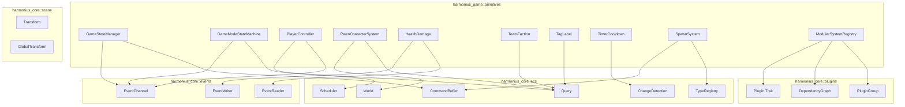
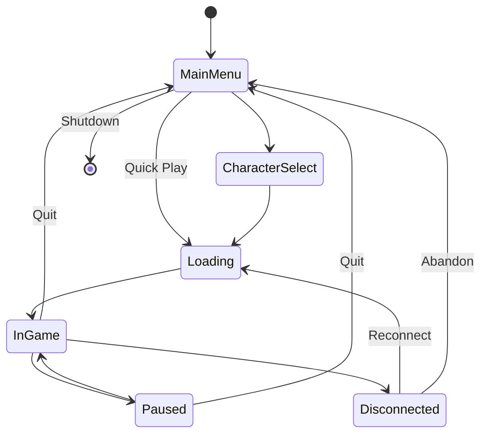
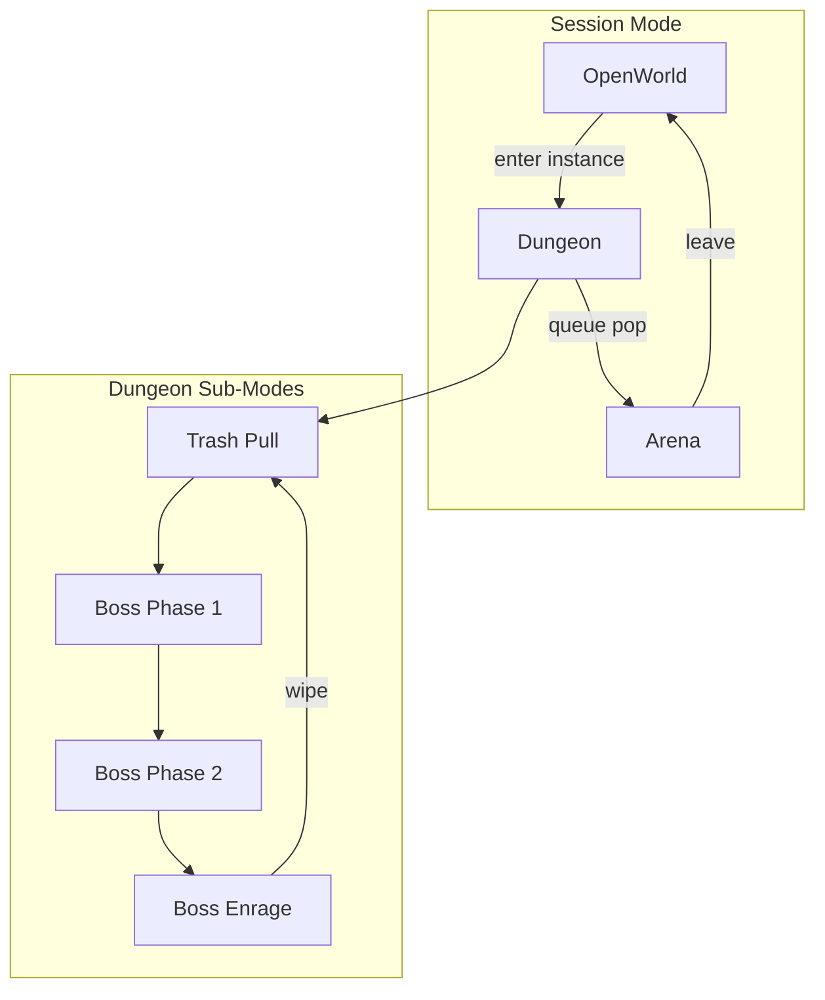
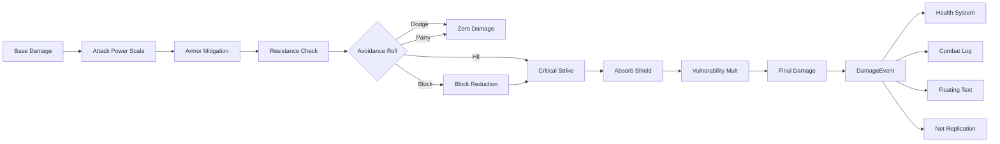
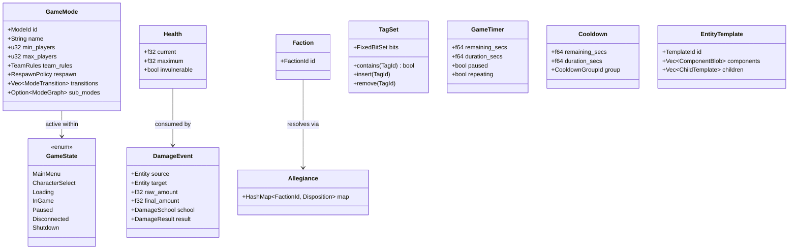
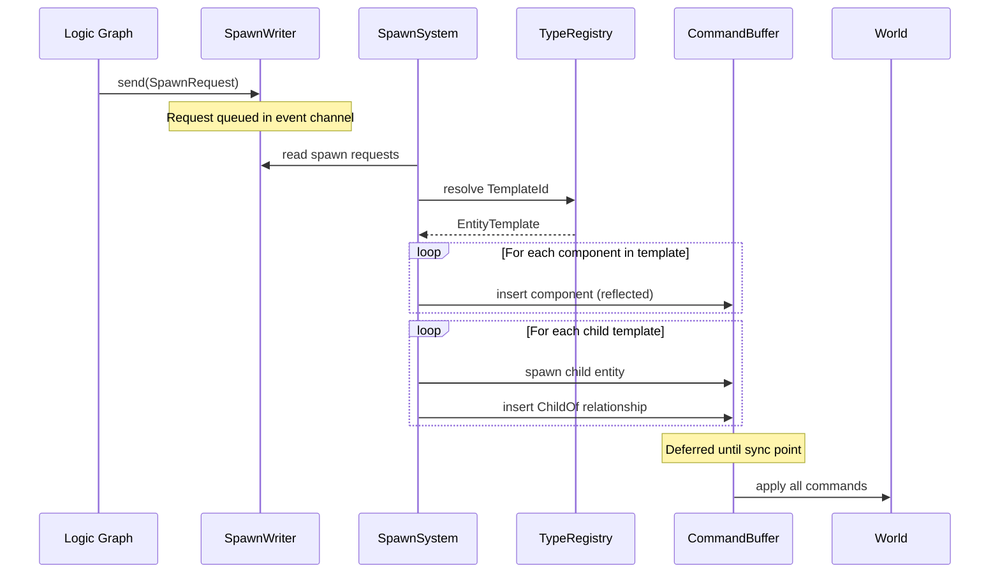
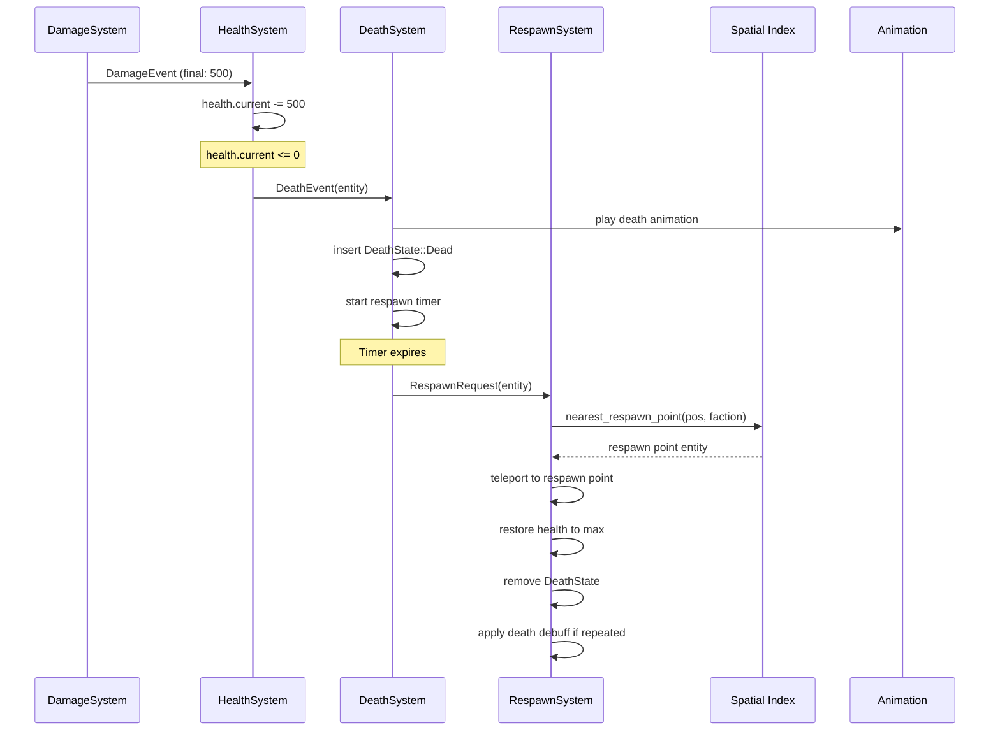
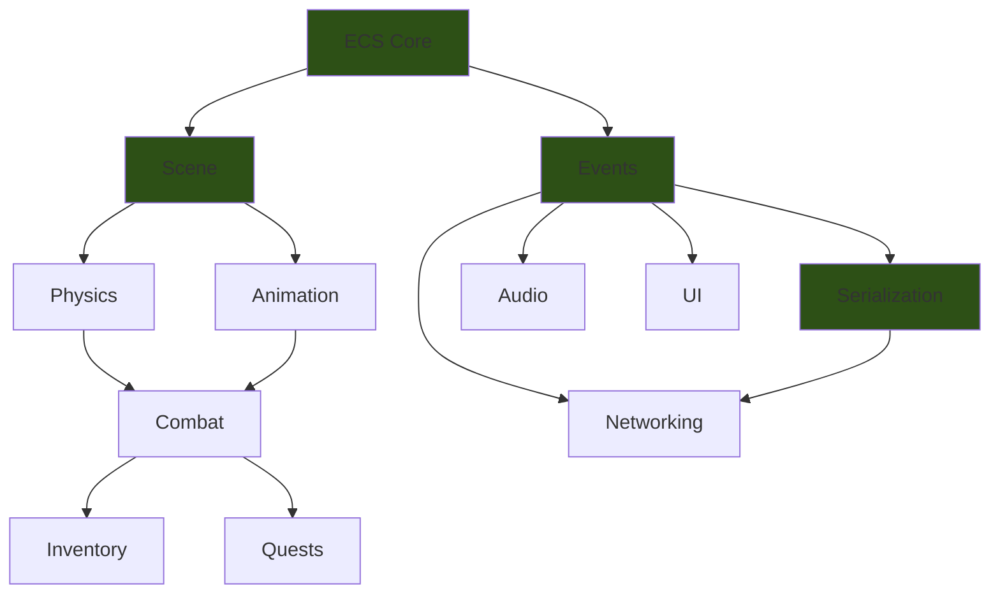

# Gameplay Primitives Design

## Requirements Trace

| Feature | Requirement | User Stories | Description |
|---------|-------------|--------------|-------------|
| F-13.1.1 | R-13.1.1 | US-13.1.1.1 -- US-13.1.1.8 | Hierarchical game mode state machine with nested sub-modes |
| F-13.1.2 | R-13.1.2 | US-13.1.2.1 -- US-13.1.2.6 | Top-level game state lifecycle manager |
| F-13.1.3 | R-13.1.3 | US-13.1.3.1 -- US-13.1.3.6 | Player controller input routing and context switching |
| F-13.1.4 | R-13.1.4 | US-13.1.4.1 -- US-13.1.4.4 | Pawn/character separation with possession transfer |
| F-13.1.5 | R-13.1.5 | US-13.1.5.1 -- US-13.1.5.6 | Data-driven gameplay ability system |
| F-13.1.6 | R-13.1.6 | US-13.1.6.1 -- US-13.1.6.7 | Gameplay effect system with stacking and inhibition |
| F-13.1.7 | R-13.1.7 | US-13.1.7.1 -- US-13.1.7.6 | Configurable damage pipeline with multiple schools |
| F-13.1.8 | R-13.1.8 | US-13.1.8.1 -- US-13.1.8.6 | Death, respawn, and encounter reset |
| F-13.1.9 | R-13.1.9 | US-13.1.9.1 -- US-13.1.9.6 | Modular system registration with dependency graph |
| F-13.1.10 | R-13.1.10 | US-13.1.10.1 -- US-13.1.10.7 | Rust plugin API for third-party developers |

### Non-Functional Requirements

| Requirement | Target | Description |
|-------------|--------|-------------|
| R-13.1.NF1 | < 1 frame (16.67 ms) | Game mode transition latency (excluding async asset loads) |
| R-13.1.NF2 | 1 ms precision | Ability cooldown timer accuracy regardless of frame rate |

### Cross-Cutting Dependencies

| Dependency | Source | Consumed API |
|------------|--------|--------------|
| ECS world, queries | F-1.1.1 | Archetype storage, `Query`, `Entity` |
| Event channels | F-1.5.1 | `EventWriter<T>`, `EventReader<T>` |
| Singleton resources | F-1.5.6 | `Res<T>`, `ResMut<T>` |
| Command buffers | F-1.5.4 | Deferred entity spawn / despawn |
| Change detection | F-1.1.22 | `Changed<T>` for dirty tracking |
| Plugin system | F-1.6.1 | Declarative plugin registration |
| Type registry | F-1.3.1 | `Reflect` derive, `TypeRegistry` |
| Input actions | F-6.2.1 | `InputAction` mapping system |
| Scene hierarchy | F-1.2.1 | Parent-child entity relationships |
| Shared spatial index | F-1.9.1 | Respawn point proximity queries |
| Thread pool | F-14.3.1 | Scoped parallel task execution |

## Overview

The gameplay primitives subsystem provides the
foundational building blocks that all game genres
share: state management, entity archetypes, health
and damage, teams, tags, timers, and spawn
templates. Every primitive is a pure ECS construct
-- components hold data, systems hold logic, events
carry messages.

### Design Principles

1. **100% ECS-based.** All state lives in
   components and resources. No parallel data
   stores, no object hierarchies, no manager
   singletons.
2. **Data-driven and no-code.** Every primitive is
   configurable through visual editors and asset
   files. Users never write Rust code.
3. **Modular plug-and-play.** Each subsystem is an
   independent plugin with declared dependencies.
   Projects enable only what they need.
4. **Static dispatch.** Monomorphized generics on
   hot paths. No trait objects except at plugin
   boundary FFI layers.
5. **Deterministic.** Identical inputs produce
   identical outputs. All randomness is seeded.
   All ordering is explicit.

### Performance Targets

| Metric | Target |
|--------|--------|
| Game state transition | < 1 frame (R-13.1.NF1) |
| Timer/cooldown precision | 1 ms (R-13.1.NF2) |
| Damage pipeline (1K events/frame) | < 0.5 ms |
| Tag query (10K entities, 8 tags) | < 0.1 ms |
| Spawn from template (100 entities) | < 1 ms |

## Architecture

### Module Boundaries



### File Layout

```
harmonius_game/
├── primitives/
│   ├── mod.rs              # Re-exports
│   ├── state/
│   │   ├── game_state.rs   # GameState enum,
│   │   │                   # GameStateManager
│   │   ├── transition.rs   # StateTransition,
│   │   │                   # TransitionGuard
│   │   └── plugin.rs       # GameStatePlugin
│   ├── mode/
│   │   ├── game_mode.rs    # GameMode, ModeNode,
│   │   │                   # ModeGraph
│   │   ├── sub_mode.rs     # SubMode, nesting
│   │   └── plugin.rs       # GameModePlugin
│   ├── control/
│   │   ├── controller.rs   # PlayerController,
│   │   │                   # InputContext
│   │   ├── pawn.rs         # Pawn, Possessed
│   │   ├── character.rs    # Character, Stats
│   │   └── plugin.rs       # ControlPlugin
│   ├── health/
│   │   ├── health.rs       # Health, MaxHealth
│   │   ├── damage.rs       # DamageEvent,
│   │   │                   # DamagePipeline
│   │   ├── death.rs        # DeathState, Respawn
│   │   └── plugin.rs       # HealthDamagePlugin
│   ├── team/
│   │   ├── faction.rs      # Faction, FactionId,
│   │   │                   # Allegiance
│   │   ├── team.rs         # Team, TeamId
│   │   └── plugin.rs       # TeamFactionPlugin
│   ├── tag/
│   │   ├── label.rs        # Tag, TagSet
│   │   └── plugin.rs       # TagLabelPlugin
│   ├── timer/
│   │   ├── timer.rs        # GameTimer, Cooldown
│   │   ├── cooldown.rs     # CooldownGroup
│   │   └── plugin.rs       # TimerCooldownPlugin
│   ├── spawn/
│   │   ├── template.rs     # EntityTemplate,
│   │   │                   # TemplateId
│   │   ├── spawner.rs      # SpawnRequest,
│   │   │                   # SpawnSystem
│   │   └── plugin.rs       # SpawnPlugin
│   ├── modular/
│   │   ├── registry.rs     # SystemModule,
│   │   │                   # ModuleRegistry
│   │   └── plugin.rs       # ModularPlugin
│   └── plugin.rs           # GameplayPrimitivesPlugin
│                           # (group)
```

### Game State Lifecycle



### Game Mode Nesting



### Damage Pipeline Flow



### Core Data Structures



### Spawn System Sequence



### Death and Respawn Sequence



### Modular System Dependency Graph



## API Design

### Game State (F-13.1.2)

```rust
/// Top-level game state. Stored as a singleton
/// resource. Transitions trigger resource
/// loading/unloading, UI layer swaps, and input
/// context changes.
#[derive(
    Clone, Copy, Debug, PartialEq, Eq, Hash,
    Reflect,
)]
pub enum GameState {
    MainMenu,
    CharacterSelect,
    Loading,
    InGame,
    Paused,
    Disconnected,
    Shutdown,
}

/// Configuration for a single game state.
/// Authored in the visual editor as an asset.
#[derive(Clone, Debug, Reflect)]
pub struct GameStateConfig {
    /// Assets to load on state entry.
    pub load_assets: Vec<AssetId>,
    /// Assets to unload on state exit.
    pub unload_assets: Vec<AssetId>,
    /// UI layer to activate.
    pub ui_layer: Option<UiLayerId>,
    /// Input context to activate.
    pub input_context: Option<InputContextId>,
    /// Allowed transitions from this state.
    pub transitions: Vec<GameState>,
}

/// Event fired when a state transition occurs.
#[derive(Clone, Debug, Reflect)]
pub struct GameStateTransitionEvent {
    pub from: GameState,
    pub to: GameState,
}

/// Singleton resource managing the top-level
/// game state lifecycle.
#[derive(Debug, Reflect)]
pub struct GameStateManager {
    current: GameState,
    configs: HashMap<GameState, GameStateConfig>,
    pending: Option<GameState>,
}

impl GameStateManager {
    pub fn new(
        initial: GameState,
        configs: HashMap<GameState, GameStateConfig>,
    ) -> Self;

    pub fn current(&self) -> GameState;

    /// Request a transition. Validated against
    /// allowed transitions. Applied at the next
    /// sync point.
    pub fn request_transition(
        &mut self,
        target: GameState,
    ) -> Result<(), TransitionError>;

    /// Returns true if a transition is pending.
    pub fn has_pending(&self) -> bool;

    /// Cancel a pending transition.
    pub fn cancel_pending(&mut self);
}

#[derive(Clone, Debug, PartialEq, Eq)]
pub enum TransitionError {
    /// Target state not in allowed transitions.
    InvalidTransition {
        from: GameState,
        to: GameState,
    },
    /// A transition is already pending.
    TransitionAlreadyPending,
}
```

### Game Mode State Machine (F-13.1.1)

```rust
/// Unique identifier for a game mode.
#[derive(
    Clone, Copy, Debug, PartialEq, Eq, Hash,
    Reflect,
)]
pub struct ModeId(pub u32);

/// Respawn policy per mode.
#[derive(Clone, Debug, Reflect)]
pub enum RespawnPolicy {
    /// Respawn at nearest graveyard.
    Graveyard {
        timer_secs: f32,
        repeated_death_debuff: bool,
    },
    /// Respawn at fixed checkpoint.
    Checkpoint,
    /// No respawn until encounter resets.
    EncounterReset,
    /// Eliminated from the match.
    Elimination,
}

/// Team composition rules.
#[derive(Clone, Debug, Reflect)]
pub struct TeamRules {
    pub team_count: u32,
    pub min_per_team: u32,
    pub max_per_team: u32,
    pub allow_uneven: bool,
}

/// A transition edge in the mode graph.
#[derive(Clone, Debug, Reflect)]
pub struct ModeTransition {
    pub target: ModeId,
    /// Condition evaluated by the logic graph.
    pub guard: TransitionGuardId,
}

/// A node in the hierarchical mode state machine.
/// Authored as an asset in the visual editor.
#[derive(Clone, Debug, Reflect)]
pub struct GameMode {
    pub id: ModeId,
    pub name: String,
    pub min_players: u32,
    pub max_players: u32,
    pub team_rules: TeamRules,
    pub respawn: RespawnPolicy,
    pub transitions: Vec<ModeTransition>,
    /// Nested sub-mode graph for encounters.
    pub sub_modes: Option<ModeGraph>,
}

/// Directed graph of mode nodes. Validated at
/// load time: no orphans, no cycles, single
/// initial state.
#[derive(Clone, Debug, Reflect)]
pub struct ModeGraph {
    pub initial: ModeId,
    pub modes: Vec<GameMode>,
}

impl ModeGraph {
    /// Validate graph topology. Returns error if
    /// unreachable modes, cycles, or missing
    /// initial state found.
    pub fn validate(
        &self,
    ) -> Result<(), ModeGraphError>;
}

/// Event fired when the active mode changes.
#[derive(Clone, Debug, Reflect)]
pub struct ModeTransitionEvent {
    pub from: ModeId,
    pub to: ModeId,
    /// True if this is a sub-mode transition.
    pub is_sub_mode: bool,
}

/// Singleton resource tracking the active mode
/// and sub-mode stack.
#[derive(Debug, Reflect)]
pub struct GameModeManager {
    graph: ModeGraph,
    active_mode: ModeId,
    sub_mode_stack: Vec<ModeId>,
}

impl GameModeManager {
    pub fn new(graph: ModeGraph) -> Self;

    pub fn active_mode(&self) -> ModeId;

    pub fn active_sub_mode(
        &self,
    ) -> Option<ModeId>;

    /// Request a mode transition. Guard conditions
    /// are evaluated by the logic graph system.
    pub fn request_transition(
        &mut self,
        target: ModeId,
    ) -> Result<(), ModeTransitionError>;

    /// Enter a sub-mode within the current mode.
    pub fn enter_sub_mode(
        &mut self,
        sub_mode: ModeId,
    ) -> Result<(), ModeTransitionError>;

    /// Exit the current sub-mode, returning to
    /// the parent.
    pub fn exit_sub_mode(&mut self);

    /// Get the rules for the active mode.
    pub fn active_rules(&self) -> &GameMode;
}

#[derive(Clone, Debug, PartialEq, Eq)]
pub enum ModeGraphError {
    UnreachableMode { id: ModeId },
    CycleDetected { path: Vec<ModeId> },
    MissingInitialState,
    DuplicateModeId { id: ModeId },
}

#[derive(Clone, Debug, PartialEq, Eq)]
pub enum ModeTransitionError {
    NoSuchTransition {
        from: ModeId,
        to: ModeId,
    },
    GuardRejected {
        guard: TransitionGuardId,
    },
    NoActiveSubMode,
}
```

### Player Controller (F-13.1.3)

```rust
/// The input context determines which actions
/// are routed to the controlled pawn.
#[derive(
    Clone, Copy, Debug, PartialEq, Eq, Hash,
    Reflect,
)]
pub enum InputContext {
    Exploration,
    Combat,
    Mounted,
    Vehicle,
    Cinematic,
    Menu,
}

/// Targeting mode for the controller.
#[derive(
    Clone, Copy, Debug, PartialEq, Eq, Hash,
    Reflect,
)]
pub enum TargetingMode {
    /// Traditional tab-target cycling.
    TabTarget,
    /// Reticle-based action targeting.
    ActionTarget,
    /// Hybrid soft-lock system.
    SoftLock,
}

/// Component attached to the player entity.
/// Links the player to their controlled pawn.
#[derive(Clone, Debug, Reflect)]
pub struct PlayerController {
    /// The entity currently being controlled.
    pub possessed_pawn: Option<Entity>,
    /// Active input context.
    pub input_context: InputContext,
    /// Active targeting mode.
    pub targeting_mode: TargetingMode,
    /// Currently targeted entity.
    pub current_target: Option<Entity>,
    /// Camera entity owned by this controller.
    pub camera: Option<Entity>,
    /// Queued ability inputs during GCD.
    pub input_queue: VecDeque<InputActionId>,
    /// Max queued inputs (default: 2).
    pub max_queue_depth: u8,
}

impl PlayerController {
    pub fn new() -> Self;

    /// Possess a pawn entity. Releases the
    /// previous pawn if any.
    pub fn possess(
        &mut self,
        pawn: Entity,
    );

    /// Release the currently possessed pawn.
    pub fn release(&mut self) -> Option<Entity>;

    /// Switch input context. Clears the input
    /// queue on context change.
    pub fn set_input_context(
        &mut self,
        context: InputContext,
    );

    /// Queue an ability input. Drops oldest if
    /// queue is full.
    pub fn queue_input(
        &mut self,
        action: InputActionId,
    );

    /// Pop the next queued input.
    pub fn dequeue_input(
        &mut self,
    ) -> Option<InputActionId>;
}

/// Event fired when input context changes.
#[derive(Clone, Debug, Reflect)]
pub struct InputContextChangedEvent {
    pub entity: Entity,
    pub from: InputContext,
    pub to: InputContext,
}

/// Event fired when possession changes.
#[derive(Clone, Debug, Reflect)]
pub struct PossessionChangedEvent {
    pub controller: Entity,
    pub old_pawn: Option<Entity>,
    pub new_pawn: Option<Entity>,
}
```

### Pawn and Character System (F-13.1.4)

```rust
/// Marker component for any entity that can be
/// possessed by a PlayerController.
#[derive(Clone, Debug, Default, Reflect)]
pub struct Pawn;

/// Component present when a pawn is currently
/// possessed. Points back to the controller.
#[derive(Clone, Debug, Reflect)]
pub struct Possessed {
    pub controller: Entity,
}

/// Component bundle for a character: a pawn with
/// gameplay attributes.
#[derive(Clone, Debug, Reflect)]
pub struct Character {
    pub name: String,
    pub level: u32,
}

/// Numeric gameplay attributes (strength,
/// agility, intellect, etc.). Stored as a flat
/// map for data-driven extensibility.
#[derive(Clone, Debug, Default, Reflect)]
pub struct Attributes {
    pub values: HashMap<AttributeId, f32>,
}

/// Unique identifier for an attribute type.
/// Registered in the TypeRegistry at project
/// load.
#[derive(
    Clone, Copy, Debug, PartialEq, Eq, Hash,
    Reflect,
)]
pub struct AttributeId(pub u32);

impl Attributes {
    pub fn get(
        &self,
        id: AttributeId,
    ) -> Option<f32>;

    pub fn set(
        &mut self,
        id: AttributeId,
        value: f32,
    );

    /// Apply a modifier (additive or
    /// multiplicative).
    pub fn modify(
        &mut self,
        id: AttributeId,
        modifier: AttributeModifier,
    );
}

/// How an attribute is modified.
#[derive(Clone, Copy, Debug, Reflect)]
pub enum AttributeModifier {
    /// Add a flat value.
    Additive(f32),
    /// Multiply current value.
    Multiplicative(f32),
    /// Override to a fixed value.
    Override(f32),
}

/// Equipment slot identifier. Data-driven: the
/// set of valid slots is defined per project.
#[derive(
    Clone, Copy, Debug, PartialEq, Eq, Hash,
    Reflect,
)]
pub struct EquipmentSlotId(pub u32);

/// Tracks equipped items per slot.
#[derive(Clone, Debug, Default, Reflect)]
pub struct Equipment {
    pub slots: HashMap<EquipmentSlotId, Entity>,
}
```

### Health and Damage (F-13.1.7)

```rust
/// Health component. Attached to any entity that
/// can take damage.
#[derive(Clone, Debug, Reflect)]
pub struct Health {
    pub current: f32,
    pub maximum: f32,
    /// When true, all damage is ignored.
    pub invulnerable: bool,
}

impl Health {
    pub fn new(max: f32) -> Self;

    pub fn is_alive(&self) -> bool;

    pub fn fraction(&self) -> f32;

    /// Apply damage, clamping to zero. Returns
    /// actual damage dealt.
    pub fn apply_damage(
        &mut self,
        amount: f32,
    ) -> f32;

    /// Apply healing, clamping to maximum.
    /// Returns actual healing done.
    pub fn apply_healing(
        &mut self,
        amount: f32,
    ) -> f32;
}

/// Damage school identifier. Data-driven: new
/// schools are added as assets, not code.
#[derive(
    Clone, Copy, Debug, PartialEq, Eq, Hash,
    Reflect,
)]
pub struct DamageSchool(pub u32);

/// Per-school resistances. Percentage reduction
/// (0.0 = none, 1.0 = immune).
#[derive(Clone, Debug, Default, Reflect)]
pub struct Resistances {
    pub values: HashMap<DamageSchool, f32>,
}

/// Outcome of avoidance rolls.
#[derive(
    Clone, Copy, Debug, PartialEq, Eq, Reflect,
)]
pub enum DamageResult {
    Hit,
    CriticalHit,
    Blocked,
    Parried,
    Dodged,
    Absorbed,
}

/// Immutable record of a completed damage
/// computation. Broadcast as an event to health,
/// combat log, floating text, and networking.
#[derive(Clone, Debug, Reflect)]
pub struct DamageEvent {
    pub source: Entity,
    pub target: Entity,
    pub school: DamageSchool,
    pub raw_amount: f32,
    pub final_amount: f32,
    pub result: DamageResult,
    pub was_critical: bool,
    pub absorbed_amount: f32,
    pub overkill_amount: f32,
    pub timestamp_ms: u64,
}

/// Absorb shield component. Consumes damage
/// before health. Multiple shields stack by
/// priority.
#[derive(Clone, Debug, Reflect)]
pub struct AbsorbShield {
    pub remaining: f32,
    pub priority: u32,
    /// Optional: only absorbs specific schools.
    pub school_filter: Option<Vec<DamageSchool>>,
}

/// Configuration for the damage pipeline.
/// Stored as an asset. Each stage is a named
/// slot that the logic graph evaluates.
#[derive(Clone, Debug, Reflect)]
pub struct DamagePipelineConfig {
    /// Ordered list of pipeline stages.
    pub stages: Vec<DamagePipelineStage>,
}

/// A single stage in the damage pipeline.
#[derive(Clone, Debug, Reflect)]
pub struct DamagePipelineStage {
    pub name: String,
    pub stage_type: DamageStageType,
    /// Logic graph node that computes this stage.
    pub logic_node: LogicNodeId,
}

/// Built-in stage types. Custom stages use the
/// `Custom` variant with a logic graph.
#[derive(
    Clone, Copy, Debug, PartialEq, Eq, Reflect,
)]
pub enum DamageStageType {
    AttackPowerScaling,
    ArmorMitigation,
    ResistanceCheck,
    AvoidanceRoll,
    BlockReduction,
    CriticalStrike,
    AbsorbShield,
    VulnerabilityMultiplier,
    /// Plugin-provided custom stage.
    Custom,
}
```

### Death, Respawn, and Encounter Reset (F-13.1.8)

```rust
/// Death state machine. Component attached when
/// an entity dies.
#[derive(
    Clone, Copy, Debug, PartialEq, Eq, Reflect,
)]
pub enum DeathState {
    /// Playing death animation / ragdoll.
    Dying,
    /// Dead. Awaiting respawn or resurrection.
    Dead,
    /// Spirit / ghost phase (can move to
    /// respawn point).
    Spirit,
    /// Resurrecting (cast by another player).
    Resurrecting,
}

/// Event fired when an entity dies.
#[derive(Clone, Debug, Reflect)]
pub struct DeathEvent {
    pub entity: Entity,
    pub killer: Option<Entity>,
    pub damage_school: Option<DamageSchool>,
}

/// Event requesting a respawn.
#[derive(Clone, Debug, Reflect)]
pub struct RespawnRequest {
    pub entity: Entity,
    /// Override respawn point. If None, the
    /// system selects the nearest valid point.
    pub respawn_point: Option<Entity>,
}

/// Component on respawn point entities.
#[derive(Clone, Debug, Reflect)]
pub struct RespawnPoint {
    /// Which factions can use this point.
    pub faction_filter: Vec<FactionId>,
    /// Priority for selection (higher = preferred).
    pub priority: u32,
}

/// Tracks repeated deaths for debuff stacking.
#[derive(Clone, Debug, Default, Reflect)]
pub struct DeathCounter {
    pub count: u32,
    /// Time of last death (game time seconds).
    pub last_death_time: f64,
    /// Window for counting repeated deaths.
    pub reset_window_secs: f64,
}

/// Configuration for encounter reset behavior.
/// Attached to encounter root entities.
#[derive(Clone, Debug, Reflect)]
pub struct EncounterConfig {
    /// Entities to despawn on reset (adds).
    pub despawn_on_reset: Vec<TemplateId>,
    /// Initial health values to restore.
    pub restore_health: HashMap<Entity, f32>,
    /// Sub-mode to revert to on wipe.
    pub reset_to_mode: Option<ModeId>,
}
```

### Team and Faction System (F-13.1.4)

```rust
/// Faction identifier. Registered as assets.
#[derive(
    Clone, Copy, Debug, PartialEq, Eq, Hash,
    Reflect,
)]
pub struct FactionId(pub u32);

/// Component assigning an entity to a faction.
#[derive(Clone, Debug, Reflect)]
pub struct Faction {
    pub id: FactionId,
}

/// How one faction regards another.
#[derive(
    Clone, Copy, Debug, PartialEq, Eq, Reflect,
)]
pub enum Disposition {
    Friendly,
    Neutral,
    Hostile,
}

/// Singleton resource defining faction-to-faction
/// relationships. Symmetric: if A is hostile to
/// B, B is hostile to A.
#[derive(Clone, Debug, Default, Reflect)]
pub struct AllegianceTable {
    /// Keyed by (min(a,b), max(a,b)) for
    /// canonical ordering.
    pub relations: HashMap<
        (FactionId, FactionId),
        Disposition,
    >,
}

impl AllegianceTable {
    /// Look up the disposition between two
    /// factions. Defaults to Neutral.
    pub fn disposition(
        &self,
        a: FactionId,
        b: FactionId,
    ) -> Disposition;

    /// Set the disposition between two factions.
    pub fn set_disposition(
        &mut self,
        a: FactionId,
        b: FactionId,
        disposition: Disposition,
    );
}

/// Team identifier for match-based modes.
#[derive(
    Clone, Copy, Debug, PartialEq, Eq, Hash,
    Reflect,
)]
pub struct TeamId(pub u32);

/// Component assigning an entity to a team.
#[derive(Clone, Debug, Reflect)]
pub struct Team {
    pub id: TeamId,
}

/// Singleton resource tracking team rosters.
#[derive(Clone, Debug, Default, Reflect)]
pub struct TeamRoster {
    pub teams: HashMap<TeamId, Vec<Entity>>,
}

impl TeamRoster {
    pub fn members(
        &self,
        team: TeamId,
    ) -> &[Entity];

    pub fn member_count(
        &self,
        team: TeamId,
    ) -> usize;

    pub fn add_member(
        &mut self,
        team: TeamId,
        entity: Entity,
    );

    pub fn remove_member(
        &mut self,
        team: TeamId,
        entity: Entity,
    );
}
```

### Tag and Label System

```rust
/// Tag identifier. Registered as named assets.
/// Each tag occupies one bit in a TagSet.
#[derive(
    Clone, Copy, Debug, PartialEq, Eq, Hash,
    Reflect,
)]
pub struct TagId(pub u16);

/// Maximum number of distinct tags per project.
pub const MAX_TAGS: usize = 1024;

/// Bitset component for O(1) tag membership
/// queries. Stored directly on entities.
#[derive(Clone, Debug, Default, Reflect)]
pub struct TagSet {
    bits: FixedBitSet,
}

impl TagSet {
    pub fn new() -> Self;

    pub fn contains(&self, tag: TagId) -> bool;

    pub fn insert(&mut self, tag: TagId);

    pub fn remove(&mut self, tag: TagId);

    /// Returns true if self contains all tags
    /// in `other`.
    pub fn contains_all(
        &self,
        other: &TagSet,
    ) -> bool;

    /// Returns true if self contains any tag
    /// in `other`.
    pub fn contains_any(
        &self,
        other: &TagSet,
    ) -> bool;

    pub fn count(&self) -> usize;

    pub fn clear(&mut self);

    /// Iterate over all set tag IDs.
    pub fn iter(
        &self,
    ) -> impl Iterator<Item = TagId> + '_;
}

/// Named label component for human-readable
/// entity identification in the editor. Not
/// used for runtime queries (use TagSet
/// instead).
#[derive(Clone, Debug, Default, Reflect)]
pub struct Label {
    pub name: String,
}
```

### Timer and Cooldown System (F-13.1.5)

```rust
/// General-purpose gameplay timer. Tracked with
/// f64 for millisecond precision over long
/// sessions (R-13.1.NF2).
#[derive(Clone, Debug, Reflect)]
pub struct GameTimer {
    /// Remaining time in seconds.
    pub remaining: f64,
    /// Total configured duration.
    pub duration: f64,
    /// Paused timers do not tick.
    pub paused: bool,
    /// If true, resets to duration on expiry.
    pub repeating: bool,
}

impl GameTimer {
    pub fn new(duration_secs: f64) -> Self;

    pub fn repeating(
        duration_secs: f64,
    ) -> Self;

    /// Advance the timer by `dt` seconds.
    /// Returns true if the timer expired this
    /// tick.
    pub fn tick(&mut self, dt: f64) -> bool;

    pub fn is_expired(&self) -> bool;

    /// Fraction elapsed: 0.0 = just started,
    /// 1.0 = expired.
    pub fn fraction(&self) -> f64;

    pub fn reset(&mut self);

    pub fn pause(&mut self);

    pub fn resume(&mut self);
}

/// Cooldown group identifier. Abilities in the
/// same group share a single cooldown.
#[derive(
    Clone, Copy, Debug, PartialEq, Eq, Hash,
    Reflect,
)]
pub struct CooldownGroupId(pub u32);

/// Cooldown component. One per ability or shared
/// group.
#[derive(Clone, Debug, Reflect)]
pub struct Cooldown {
    /// Timer driving the cooldown.
    pub timer: GameTimer,
    /// Group this cooldown belongs to.
    pub group: CooldownGroupId,
}

impl Cooldown {
    pub fn new(
        duration_secs: f64,
        group: CooldownGroupId,
    ) -> Self;

    pub fn is_ready(&self) -> bool;

    /// Trigger the cooldown. Resets the timer.
    pub fn trigger(&mut self);

    /// Tick the cooldown by `dt` seconds.
    pub fn tick(&mut self, dt: f64);
}

/// Global cooldown (GCD) resource. Shared across
/// all abilities on an entity.
#[derive(Clone, Debug, Reflect)]
pub struct GlobalCooldown {
    pub timer: GameTimer,
}

/// Event fired when a cooldown expires.
#[derive(Clone, Debug, Reflect)]
pub struct CooldownExpiredEvent {
    pub entity: Entity,
    pub group: CooldownGroupId,
}
```

### Spawn System (F-13.1.4, F-13.1.8)

```rust
/// Unique identifier for an entity template
/// asset.
#[derive(
    Clone, Copy, Debug, PartialEq, Eq, Hash,
    Reflect,
)]
pub struct TemplateId(pub u64);

/// A serialized component blob. Stored as
/// reflected data that can be deserialized
/// into any registered component type.
#[derive(Clone, Debug, Reflect)]
pub struct ComponentBlob {
    pub type_id: ReflectTypeId,
    pub data: Vec<u8>,
}

/// A child entity to spawn as part of a
/// template.
#[derive(Clone, Debug, Reflect)]
pub struct ChildTemplate {
    pub template: TemplateId,
    /// Local transform relative to parent.
    pub local_transform: Transform,
}

/// Entity template (prefab). Authored in the
/// visual editor. Stored as a serialized asset.
#[derive(Clone, Debug, Reflect)]
pub struct EntityTemplate {
    pub id: TemplateId,
    pub name: String,
    /// Components to insert on the spawned entity.
    pub components: Vec<ComponentBlob>,
    /// Child entities to spawn with ChildOf
    /// relationships.
    pub children: Vec<ChildTemplate>,
}

/// Request to spawn an entity from a template.
/// Sent as an event, processed by the
/// SpawnSystem.
#[derive(Clone, Debug, Reflect)]
pub struct SpawnRequest {
    pub template: TemplateId,
    pub transform: Transform,
    /// Optional overrides applied after template
    /// components.
    pub overrides: Vec<ComponentBlob>,
}

/// Result of a spawn operation. Broadcast as an
/// event after the entity is created.
#[derive(Clone, Debug, Reflect)]
pub struct SpawnedEvent {
    pub entity: Entity,
    pub template: TemplateId,
}
```

### Modular System Registration (F-13.1.9)

```rust
/// Unique identifier for a gameplay system
/// module.
#[derive(
    Clone, Copy, Debug, PartialEq, Eq, Hash,
    Reflect,
)]
pub struct ModuleId(pub u32);

/// Descriptor for a modular gameplay system.
/// Each system declares its dependencies and
/// registers as a plugin.
#[derive(Clone, Debug)]
pub struct SystemModule {
    pub id: ModuleId,
    pub name: &'static str,
    /// Modules that must be enabled for this
    /// module to function.
    pub dependencies: Vec<ModuleId>,
    /// The plugin to register when enabled.
    pub plugin_builder: fn() -> Box<dyn Plugin>,
}

/// Singleton resource tracking which modules
/// are enabled. Loaded from the project file.
#[derive(Clone, Debug, Default)]
pub struct ModuleRegistry {
    registered: HashMap<ModuleId, SystemModule>,
    enabled: HashSet<ModuleId>,
}

impl ModuleRegistry {
    pub fn register(
        &mut self,
        module: SystemModule,
    );

    /// Enable a module. Automatically enables
    /// transitive dependencies. Returns the list
    /// of additionally enabled modules.
    pub fn enable(
        &mut self,
        id: ModuleId,
    ) -> Result<Vec<ModuleId>, ModuleError>;

    /// Disable a module. Fails if other enabled
    /// modules depend on it.
    pub fn disable(
        &mut self,
        id: ModuleId,
    ) -> Result<(), ModuleError>;

    pub fn is_enabled(
        &self,
        id: ModuleId,
    ) -> bool;

    /// Validate all enabled modules have their
    /// dependencies satisfied.
    pub fn validate(
        &self,
    ) -> Result<(), ModuleError>;

    /// Return the enabled modules in dependency
    /// order.
    pub fn enabled_sorted(
        &self,
    ) -> Result<Vec<ModuleId>, ModuleError>;
}

#[derive(Clone, Debug, PartialEq, Eq)]
pub enum ModuleError {
    MissingDependency {
        module: ModuleId,
        dependency: ModuleId,
    },
    DependentModulesActive {
        module: ModuleId,
        dependents: Vec<ModuleId>,
    },
    CycleDetected {
        path: Vec<ModuleId>,
    },
    NotRegistered {
        id: ModuleId,
    },
}
```

### Plugin Registrations

```rust
/// Plugin for the game state lifecycle.
pub struct GameStatePlugin;

impl Plugin for GameStatePlugin {
    fn build(&self, app: &mut App) {
        app.init_resource::<GameStateManager>()
            .add_event::<GameStateTransitionEvent>()
            .add_system(
                game_state_transition_system
                    .in_set(CoreSet::PreUpdate),
            );
    }
}

/// Plugin for the game mode state machine.
pub struct GameModePlugin;

impl Plugin for GameModePlugin {
    fn dependencies(&self) -> Vec<PluginId> {
        vec![GameStatePlugin::ID]
    }

    fn build(&self, app: &mut App) {
        app.init_resource::<GameModeManager>()
            .add_event::<ModeTransitionEvent>()
            .add_system(
                game_mode_transition_system
                    .in_set(CoreSet::PreUpdate)
                    .after(
                        game_state_transition_system
                    ),
            );
    }
}

/// Plugin for health, damage, death, respawn.
pub struct HealthDamagePlugin;

impl Plugin for HealthDamagePlugin {
    fn build(&self, app: &mut App) {
        app.add_event::<DamageEvent>()
            .add_event::<DeathEvent>()
            .add_event::<RespawnRequest>()
            .add_system(
                damage_pipeline_system
                    .in_set(CoreSet::Update),
            )
            .add_system(
                health_apply_system
                    .in_set(CoreSet::Update)
                    .after(damage_pipeline_system),
            )
            .add_system(
                death_detection_system
                    .in_set(CoreSet::Update)
                    .after(health_apply_system),
            )
            .add_system(
                respawn_system
                    .in_set(CoreSet::Update)
                    .after(death_detection_system),
            );
    }
}

/// Plugin for timers, cooldowns, and GCD.
pub struct TimerCooldownPlugin;

impl Plugin for TimerCooldownPlugin {
    fn build(&self, app: &mut App) {
        app.add_event::<CooldownExpiredEvent>()
            .add_system(
                timer_tick_system
                    .in_set(CoreSet::PreUpdate),
            )
            .add_system(
                cooldown_tick_system
                    .in_set(CoreSet::PreUpdate),
            );
    }
}

/// Plugin for tags and labels.
pub struct TagLabelPlugin;

impl Plugin for TagLabelPlugin {
    fn build(&self, app: &mut App) {
        app.register_component::<TagSet>()
            .register_component::<Label>();
    }
}

/// Plugin for team and faction management.
pub struct TeamFactionPlugin;

impl Plugin for TeamFactionPlugin {
    fn build(&self, app: &mut App) {
        app.init_resource::<AllegianceTable>()
            .init_resource::<TeamRoster>()
            .register_component::<Faction>()
            .register_component::<Team>()
            .add_system(
                team_roster_sync_system
                    .in_set(CoreSet::PostUpdate),
            );
    }
}

/// Plugin for entity template spawning.
pub struct SpawnPlugin;

impl Plugin for SpawnPlugin {
    fn build(&self, app: &mut App) {
        app.add_event::<SpawnRequest>()
            .add_event::<SpawnedEvent>()
            .add_system(
                spawn_template_system
                    .in_set(CoreSet::PostUpdate),
            );
    }
}

/// Plugin for player controller and pawn
/// management.
pub struct ControlPlugin;

impl Plugin for ControlPlugin {
    fn dependencies(&self) -> Vec<PluginId> {
        vec![GameStatePlugin::ID]
    }

    fn build(&self, app: &mut App) {
        app.add_event::<PossessionChangedEvent>()
            .add_event::<InputContextChangedEvent>()
            .register_component::<PlayerController>()
            .register_component::<Pawn>()
            .register_component::<Possessed>()
            .add_system(
                controller_input_routing_system
                    .in_set(CoreSet::PreUpdate),
            )
            .add_system(
                controller_targeting_system
                    .in_set(CoreSet::Update),
            );
    }
}

/// Top-level plugin group. Enables all gameplay
/// primitives.
pub struct GameplayPrimitivesPlugin;

impl PluginGroup for GameplayPrimitivesPlugin {
    fn build(
        self,
    ) -> PluginGroupBuilder {
        PluginGroupBuilder::start::<Self>()
            .add(GameStatePlugin)
            .add(GameModePlugin)
            .add(TimerCooldownPlugin)
            .add(TagLabelPlugin)
            .add(TeamFactionPlugin)
            .add(SpawnPlugin)
            .add(ControlPlugin)
            .add(HealthDamagePlugin)
    }
}
```

### Core Systems (ECS System Functions)

```rust
/// Processes pending game state transitions.
/// Fires GameStateTransitionEvent on change.
fn game_state_transition_system(
    mut manager: ResMut<GameStateManager>,
    mut events: EventWriter<
        GameStateTransitionEvent,
    >,
    mut commands: Commands,
) {
    // If a transition is pending, validate it,
    // apply it, fire the event, and trigger
    // resource load/unload via commands.
}

/// Processes pending game mode transitions.
fn game_mode_transition_system(
    mut manager: ResMut<GameModeManager>,
    mut events: EventWriter<ModeTransitionEvent>,
    state: Res<GameStateManager>,
) {
    // Only process mode transitions when InGame.
    // Validate against mode graph topology.
}

/// Ticks all GameTimer components by delta time.
fn timer_tick_system(
    time: Res<Time>,
    mut query: Query<&mut GameTimer>,
) {
    let dt = time.delta_seconds_f64();
    for mut timer in query.iter_mut() {
        timer.tick(dt);
    }
}

/// Ticks all Cooldown components and fires
/// expiry events.
fn cooldown_tick_system(
    time: Res<Time>,
    mut query: Query<(Entity, &mut Cooldown)>,
    mut events: EventWriter<
        CooldownExpiredEvent,
    >,
) {
    let dt = time.delta_seconds_f64();
    for (entity, mut cd) in query.iter_mut() {
        let was_active = !cd.is_ready();
        cd.tick(dt);
        if was_active && cd.is_ready() {
            events.send(CooldownExpiredEvent {
                entity,
                group: cd.group,
            });
        }
    }
}

/// Runs the damage pipeline for all pending
/// damage requests.
fn damage_pipeline_system(
    config: Res<DamagePipelineConfig>,
    mut damage_in: EventReader<DamageRequest>,
    mut damage_out: EventWriter<DamageEvent>,
    query: Query<(
        &Attributes,
        &Resistances,
        Option<&AbsorbShield>,
    )>,
) {
    // For each DamageRequest, run through
    // pipeline stages, compute final damage,
    // emit DamageEvent.
}

/// Applies finalized damage to Health components.
fn health_apply_system(
    mut events: EventReader<DamageEvent>,
    mut query: Query<&mut Health>,
) {
    for event in events.read() {
        if let Ok(mut health) =
            query.get_mut(event.target)
        {
            health.apply_damage(event.final_amount);
        }
    }
}

/// Detects entities whose health reached zero
/// and transitions them to DeathState.
fn death_detection_system(
    mut commands: Commands,
    query: Query<
        (Entity, &Health),
        Changed<Health>,
    >,
    mut events: EventWriter<DeathEvent>,
) {
    for (entity, health) in query.iter() {
        if !health.is_alive() {
            commands
                .entity(entity)
                .insert(DeathState::Dying);
            events.send(DeathEvent {
                entity,
                killer: None,
                damage_school: None,
            });
        }
    }
}

/// Handles respawn requests. Selects nearest
/// valid respawn point, restores health, removes
/// death state.
fn respawn_system(
    mut commands: Commands,
    mut requests: EventReader<RespawnRequest>,
    respawn_points: Query<(
        Entity,
        &RespawnPoint,
        &GlobalTransform,
    )>,
    dead_query: Query<(
        &Faction,
        &GlobalTransform,
    )>,
    mut health_query: Query<&mut Health>,
) {
    // For each request, find nearest valid
    // respawn point by faction and distance.
    // Teleport entity, restore health, remove
    // DeathState.
}

/// Routes input actions to the possessed pawn
/// based on active InputContext.
fn controller_input_routing_system(
    mut controllers: Query<&mut PlayerController>,
    input: Res<InputActions>,
    mut events: EventWriter<
        InputContextChangedEvent,
    >,
) {
    // Read input actions, filter by active
    // context, route to pawn.
}

/// Updates targeting based on TargetingMode.
fn controller_targeting_system(
    mut controllers: Query<&mut PlayerController>,
    targets: Query<(
        Entity,
        &GlobalTransform,
        &Faction,
    )>,
    allegiance: Res<AllegianceTable>,
) {
    // For each controller, update current_target
    // based on targeting mode and allegiance.
}

/// Spawns entities from templates.
fn spawn_template_system(
    mut requests: EventReader<SpawnRequest>,
    templates: Res<Assets<EntityTemplate>>,
    registry: Res<TypeRegistry>,
    mut commands: Commands,
    mut spawned: EventWriter<SpawnedEvent>,
) {
    // For each request, look up template,
    // spawn entity, insert reflected components,
    // spawn children.
}

/// Synchronizes the TeamRoster resource with
/// Team components.
fn team_roster_sync_system(
    query: Query<
        (Entity, &Team),
        Changed<Team>,
    >,
    mut roster: ResMut<TeamRoster>,
) {
    // Rebuild roster from changed Team
    // components.
}
```

## Data Flow

### Frame Lifecycle

The gameplay primitives execute within the
standard ECS frame in three phases:

1. **PreUpdate** -- State transitions, timer
   ticks, cooldown ticks, input routing.
2. **Update** -- Damage pipeline, health
   application, death detection, targeting.
3. **PostUpdate** -- Spawn processing, team
   roster sync, mode cleanup.

```rust
// System execution order within a frame
//
// PreUpdate:
//   game_state_transition_system
//   game_mode_transition_system
//   timer_tick_system
//   cooldown_tick_system
//   controller_input_routing_system
//
// Update:
//   damage_pipeline_system
//   health_apply_system
//   death_detection_system
//   controller_targeting_system
//
// PostUpdate:
//   spawn_template_system
//   team_roster_sync_system
//   respawn_system
```

### State Transition Data Flow

1. External trigger (UI button, logic graph
   event) calls
   `GameStateManager::request_transition()`.
2. `game_state_transition_system` reads the
   pending transition, validates it.
3. On valid transition: fires
   `GameStateTransitionEvent`, enqueues asset
   load/unload commands.
4. Systems listening for
   `GameStateTransitionEvent` react (UI swaps
   layers, input remaps context).
5. Asset loads complete asynchronously. Loading
   state shown until all required assets ready.

### Damage Data Flow

1. Gameplay logic creates a `DamageRequest` event
   (from ability, DoT tick, environmental).
2. `damage_pipeline_system` reads requests, runs
   each through the configured pipeline stages.
3. Each stage queries source/target components
   (`Attributes`, `Resistances`, `AbsorbShield`).
4. Final `DamageEvent` is broadcast.
5. `health_apply_system` reduces `Health`.
6. `death_detection_system` checks for zero HP.
7. Combat log, floating text, and networking
   systems independently read `DamageEvent`.

### Spawn Data Flow

1. Logic graph or system sends `SpawnRequest`.
2. `spawn_template_system` resolves the
   `TemplateId` against the asset store.
3. For each `ComponentBlob`, the system uses the
   `TypeRegistry` to deserialize and insert the
   component via `CommandBuffer`.
4. Child templates are spawned recursively with
   `ChildOf` relationships.
5. `SpawnedEvent` is broadcast with the new
   entity ID.

## Platform Considerations

The gameplay primitives subsystem has no
platform-specific code. All platform
dependencies are abstracted by lower layers:

| Concern | Abstraction | Source |
|---------|-------------|--------|
| Timing | `Res<Time>` with f64 delta | Platform clock |
| Async asset loading | `Assets<T>` with async handle | Content pipeline |
| Input routing | `Res<InputActions>` | Input subsystem |
| Spatial queries | Shared spatial index API | F-1.9.1 |
| Networking | Event-based replication | Transport layer |
| Serialization | `Reflect` derive | bevy_reflect-style |

All components derive `Reflect` for automatic
editor integration and serialization. The no-code
constraint is satisfied by:

1. **Game state configs** -- authored as assets
   in the visual editor.
2. **Game mode graphs** -- authored as directed
   graph assets with node/edge editing.
3. **Damage pipeline** -- stages configured as
   ordered lists with logic graph nodes.
4. **Entity templates** -- composed visually from
   components in the entity inspector.
5. **Tag definitions** -- registered as named
   assets; assigned to entities via checkboxes.
6. **Faction/allegiance** -- edited as a
   relationship matrix in the editor.

## Test Plan

### Unit Tests

| Test | Req | Description |
|------|-----|-------------|
| `test_game_state_valid_transition` | R-13.1.2 | Transition MainMenu to Loading succeeds. |
| `test_game_state_invalid_transition` | R-13.1.2 | Transition Loading to Paused returns `InvalidTransition`. |
| `test_game_state_no_leak` | US-13.1.1.7 | Cycle all transitions 100x, verify zero resource growth. |
| `test_mode_graph_validate_reachable` | US-13.1.1.8 | Graph with orphan mode returns `UnreachableMode`. |
| `test_mode_graph_cycle_detection` | R-13.1.1 | Graph with cycle returns `CycleDetected`. |
| `test_mode_sub_mode_enter_exit` | R-13.1.1 | Enter sub-mode, verify active, exit, verify parent active. |
| `test_health_apply_damage` | R-13.1.7 | 100 HP - 30 damage = 70 HP. |
| `test_health_clamp_zero` | R-13.1.7 | 10 HP - 50 damage = 0 HP, overkill = 40. |
| `test_health_invulnerable` | R-13.1.7 | Invulnerable entity takes zero damage. |
| `test_damage_armor_mitigation` | R-13.1.7 | 100 raw, 50% armor = 50 final. |
| `test_damage_resistance_per_school` | R-13.1.7 | Fire resistance reduces fire but not physical. |
| `test_damage_absorb_shield` | R-13.1.7 | Shield absorbs up to remaining, excess goes to health. |
| `test_damage_determinism` | US-13.1.7.5 | 1000 identical inputs produce 1000 identical outputs. |
| `test_tag_set_insert_remove` | -- | Insert 3 tags, remove 1, verify contains correctness. |
| `test_tag_set_contains_all` | -- | `contains_all` returns true only when all present. |
| `test_tag_set_contains_any` | -- | `contains_any` returns true when at least one present. |
| `test_timer_tick_expiry` | R-13.1.NF2 | 1.5s timer at 60fps expires within 1ms of target. |
| `test_timer_repeating` | R-13.1.NF2 | Repeating timer resets after expiry. |
| `test_cooldown_not_ready` | US-13.1.5.6 | Trigger cooldown, verify `is_ready()` false. |
| `test_cooldown_expired_event` | R-13.1.5 | Cooldown expires, event fires exactly once. |
| `test_allegiance_symmetric` | R-13.1.4 | Set A hostile to B, verify B hostile to A. |
| `test_allegiance_default_neutral` | R-13.1.4 | Unset relation defaults to Neutral. |
| `test_pawn_possession_transfer` | US-13.1.4.4 | Possess pawn A, transfer to B, verify A state intact. |
| `test_controller_context_clears_queue` | US-13.1.3.6 | Switching context clears the input queue. |
| `test_spawn_from_template` | R-13.1.4 | Spawn from template, verify all components present. |
| `test_spawn_with_children` | R-13.1.4 | Spawn template with 2 children, verify ChildOf relationships. |
| `test_module_enable_transitive` | US-13.1.9.5 | Enable Combat, verify Physics and Animation auto-enabled. |
| `test_module_disable_with_dependents` | R-13.1.9 | Disable Physics while Combat active returns error. |
| `test_module_cycle_detection` | R-13.1.9 | Module graph with cycle returns `CycleDetected`. |

### Integration Tests

| Test | Req | Description |
|------|-----|-------------|
| `test_full_state_lifecycle` | R-13.1.2 | Transition through all states, verify resources load/unload at each step. |
| `test_rapid_pause_unpause` | US-13.1.2.5 | 60 Hz pause/unpause for 10 seconds, verify no state corruption. |
| `test_mode_transition_under_1_frame` | R-13.1.NF1 | Measure mode transition latency, assert < 16.67 ms. |
| `test_damage_1k_events_per_frame` | R-13.1.7 | Process 1000 damage events, verify all health values correct and < 0.5 ms. |
| `test_death_respawn_full_cycle` | R-13.1.8 | Kill entity, verify death state, wait for timer, verify respawn at correct point. |
| `test_encounter_reset` | US-13.1.8.4 | Trigger wipe, verify boss HP restores, adds despawned, mode reverts. |
| `test_death_debuff_stacking` | US-13.1.8.6 | Die 3 times, verify debuff stacks and timer resets. |
| `test_spawn_100_entities` | -- | Spawn 100 entities from template, verify < 1 ms. |
| `test_tag_query_10k_entities` | -- | 10K entities with 8 tags, filter by tag, verify < 0.1 ms. |
| `test_cooldown_precision_144fps` | R-13.1.NF2 | Run 1.5s cooldown at 144 fps, verify <=1 ms drift over 1000 trials. |
| `test_server_authoritative_state` | US-13.1.2.2 | Simulate client-server, verify both agree on state after transitions. |
| `test_controller_all_contexts` | US-13.1.3.6 | Exercise all input context transitions, verify no input leaks. |
| `test_effect_cleanup_on_death` | US-13.1.6.7 | Kill entity with active effects, verify no dangling references. |

### Benchmarks

| Benchmark | Target | Source |
|-----------|--------|--------|
| Game state transition | < 1 frame (16.67 ms) | R-13.1.NF1 |
| Cooldown precision (1000 trials) | <= 1 ms drift | R-13.1.NF2 |
| Damage pipeline (1K events) | < 0.5 ms | Performance target |
| Tag query (10K entities, 8 tags) | < 0.1 ms | Performance target |
| Spawn from template (100 entities) | < 1 ms | Performance target |
| Timer tick (100K timers) | < 0.5 ms | Performance target |
| Allegiance lookup (10K pairs) | < 0.05 ms | Performance target |

## Open Questions

1. **Damage pipeline extensibility** -- Should
   custom pipeline stages be pure logic graph
   nodes, or should plugin-authored Rust
   functions also be insertable? Logic graph
   keeps the no-code guarantee but may limit
   performance for complex formulas.

2. **Tag set size** -- `MAX_TAGS = 1024` uses
   128 bytes per entity. This is sufficient for
   most projects but may be excessive for simple
   games. Should projects declare their max tag
   count in the project file to optimize storage?

3. **Allegiance table symmetry** -- The current
   design enforces symmetric relations (A hostile
   to B means B hostile to A). Some games need
   asymmetric relations (A neutral to B, B
   hostile to A). Should the table support both
   modes?

4. **Entity template inheritance** -- Should
   templates support single inheritance (a
   "Goblin" template inherits from "NPC"
   template)? This reduces duplication but adds
   resolution complexity and potential for
   diamond problems.

5. **Cooldown reduction modifiers** -- Abilities
   like "haste" reduce cooldowns by a percentage.
   Should cooldown reduction be a first-class
   modifier on the `Cooldown` component, or
   handled externally through the effect system?

6. **Respawn point capacity** -- Should respawn
   points have a maximum concurrent capacity to
   prevent clustering? This matters for PvP modes
   where spawn camping is a concern.
