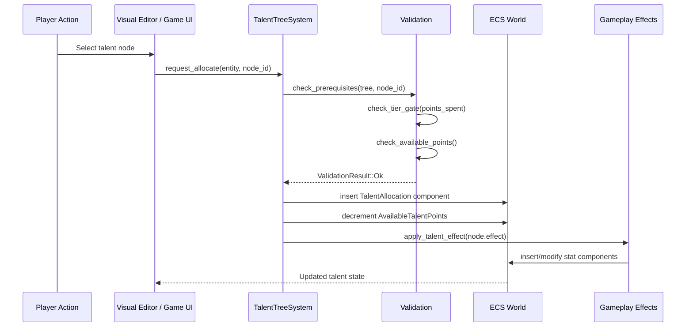
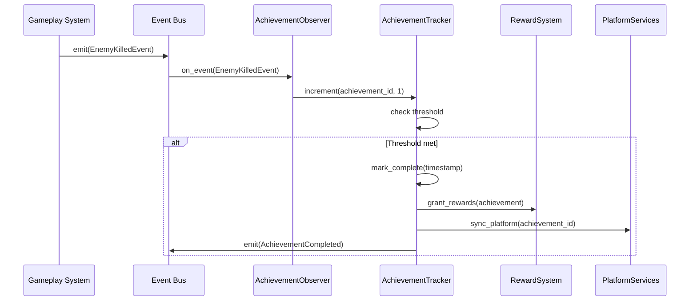
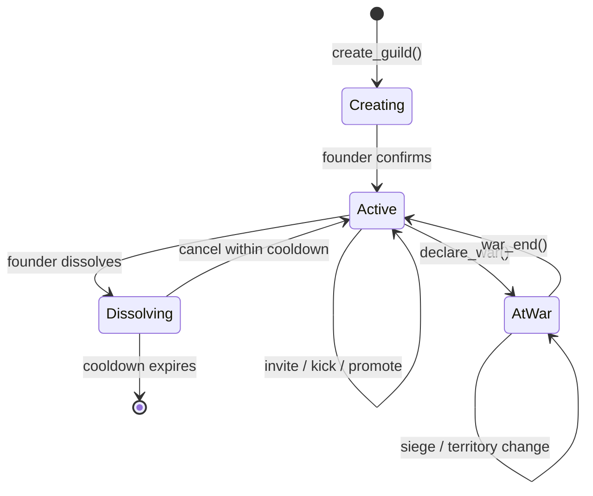
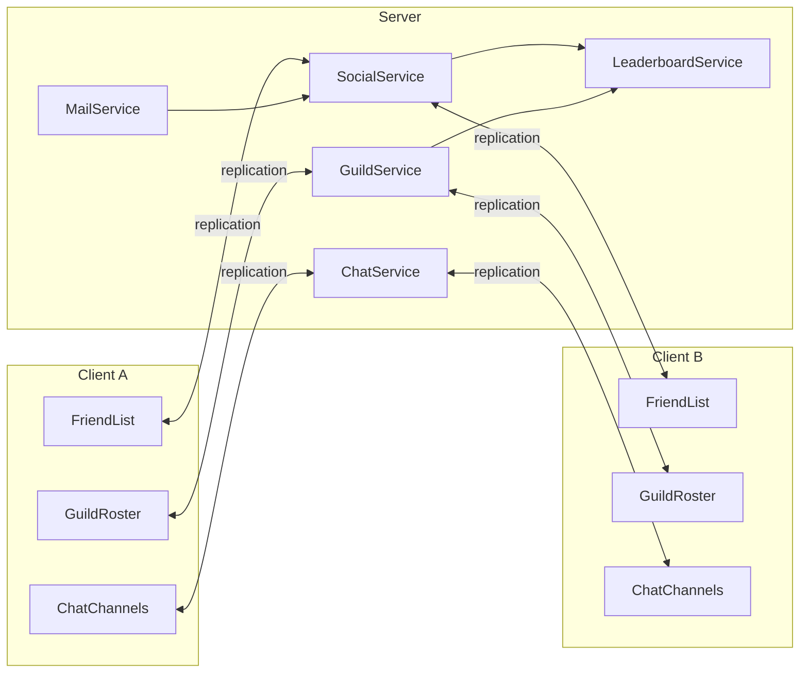

# Progression and Social Systems Design

## Requirements Trace

> **Canonical sources:** Features, requirements, and user stories are defined in
> [features/game-framework/](../../features/game-framework/),
> [requirements/game-framework/](../../requirements/game-framework/), and
> [user-stories/game-framework/](../../user-stories/game-framework/). The table below traces design
> elements to those definitions.

### Progression

| Feature | Requirement | Description |
|---------|-------------|-------------|
| F-13.12.1a | R-13.12.1a | Data-driven race definitions with stat modifiers and cosmetic constraints |
| F-13.12.1b | R-13.12.1b | Data-driven class definitions with abilities, resources, equipment restrictions |
| F-13.12.1c | R-13.12.1c | Multi-class switching and hybrid classes with prerequisites |
| F-13.12.1d | R-13.12.1d | Prestige/rebirth system with accumulating permanent bonuses |
| F-13.12.2a | R-13.12.2a | Talent trees as DAGs with typed nodes, prerequisites, tier gating |
| F-13.12.2b | R-13.12.2b | Talent point allocation, prerequisite validation, respec for currency |
| F-13.12.2c | R-13.12.2c | Talent tree visual editor with graph asset authoring |
| F-13.12.3a | R-13.12.3a | Profession data model with skill levels, XP curves, recipe thresholds |
| F-13.12.3b | R-13.12.3b | Gathering profession integration with skill-scaled yields |
| F-13.12.3c | R-13.12.3c | Crafting profession integration with level-gated recipes |
| F-13.12.4 | R-13.12.4 | Crafting station gating by type, tier, and location |
| F-13.12.5 | R-13.12.5 | Faction reputation with tiered standing and asymmetric relationships |
| F-13.12.6a | R-13.12.6a | Achievement definition and observer-driven tracking |
| F-13.12.6b | R-13.12.6b | Achievement rewards, notifications, and point accumulation |
| F-13.12.6c | R-13.12.6c | Platform achievement sync (Steam, PlayStation, Xbox) |
| F-13.12.7 | R-13.12.7 | Item enhancement with success/failure probability |
| F-13.12.8a | R-13.12.8a | Item rarity tier system with bounded stat ranges |
| F-13.12.8b | R-13.12.8b | Affix system with rarity-scaled affix count |
| F-13.12.8c | R-13.12.8c | Stat re-rolling for currency |
| F-13.12.9 | R-13.12.9 | Equipment set bonuses at piece-count thresholds |
| F-13.12.10 | R-13.12.10 | Item durability and repair |

### Social

| Feature | Requirement | Description |
|---------|-------------|-------------|
| F-13.13.1a | R-13.13.1a | Guild CRUD and membership lifecycle |
| F-13.13.1b | R-13.13.1b | Guild rank and permission system |
| F-13.13.1c | R-13.13.1c | Guild leveling and data-driven perks |
| F-13.13.1d | R-13.13.1d | Guild roster UI with sorting, filtering, context actions |
| F-13.13.2 | R-13.13.2 | Guild bank with permissioned tabs and audit logs |
| F-13.13.3a | R-13.13.3a | Territory claim via guild hall or control point |
| F-13.13.3b | R-13.13.3b | Guild war declaration and scoped PvP |
| F-13.13.3c | R-13.13.3c | Siege mechanics within scheduled war windows |
| F-13.13.3d | R-13.13.3d | Guild leaderboards with seasonal resets |
| F-13.13.4 | R-13.13.4 | Friends list with platform integration |
| F-13.13.5a | R-13.13.5a | Asynchronous player mail |
| F-13.13.5b | R-13.13.5b | Mail attachments and COD |
| F-13.13.5c | R-13.13.5c | Automated system mail |
| F-13.13.6a | R-13.13.6a | Multi-channel chat infrastructure |
| F-13.13.6b | R-13.13.6b | Item linking, profanity/spam filtering |
| F-13.13.6c | R-13.13.6c | Custom player-created channels |
| F-13.13.7 | R-13.13.7 | Emote and social action system |
| F-13.13.8 | R-13.13.8 | Player character inspection |
| F-13.13.9 | R-13.13.9 | Dungeon and group finder with role queuing |
| F-13.13.10a | R-13.13.10a | Arena PvP (2v2, 3v3, 5v5) |
| F-13.13.10b | R-13.13.10b | Objective-based battlegrounds |
| F-13.13.10c | R-13.13.10c | PvP rating (Elo/Glicko) and seasonal rewards |
| F-13.13.10d | R-13.13.10d | PvP stat normalization |

### Non-Functional

| Requirement | Target |
|-------------|--------|
| R-13.12.NF1 | Talent allocation validation under 1 ms |
| R-13.12.NF2 | 1,000 achievements tracked under 0.1 ms/frame |
| R-13.13.NF1 | 1,000-member guild roster renders in 1 frame |
| R-13.13.NF2 | 500-entry friends list, status updates within 2 s |
| R-13.13.NF3 | 100 chat messages/s without frame impact |

## Overview

The progression and social subsystems provide all character advancement, social interaction, and
competitive features for the Harmonius engine. Every piece of data lives as ECS components. Every
piece of logic runs as ECS systems. All authoring surfaces are visual (no-code).

Progression covers:

- **Experience and leveling** -- XP accumulation, level-up thresholds, stat growth curves
- **Race and class** -- data-driven archetypes with stat modifiers, ability sets, resource types
- **Talent trees** -- DAG-based node graphs with prerequisites, tier gating, visual editor authoring
- **Prestige/rebirth** -- max-level reset with permanent bonuses accumulating across cycles
- **Professions** -- independent skill levels, XP curves, recipe thresholds, gathering/crafting
  integration
- **Reputation** -- per-faction tiered standing with asymmetric relationships and gated content
- **Achievements** -- observer-driven tracking, rewards, platform sync
- **Item enhancement** -- probabilistic upgrade levels, rarity tiers, affixes, set bonuses,
  durability

Social covers:

- **Guilds** -- CRUD, ranks, permissions, leveling, bank, territory, wars, sieges, leaderboards
- **Friends** -- bi-directional list, platform import, status replication, block/ignore
- **Party/group** -- role-based group finder, cross-shard matchmaking, dungeon queuing
- **Mail** -- async player mail, attachments, COD, system mail
- **Chat** -- multi-channel, item linking, profanity filtering, custom channels
- **PvP** -- arenas, battlegrounds, Elo/Glicko rating, seasonal rewards, stat normalization
- **Emotes and inspection** -- social expression and read-only character viewing

## Architecture

### Module Boundaries

```mermaid
graph TD
    subgraph "harmonius_game::progression"
        XP[ExperienceSystem]
        LV[LevelUpSystem]
        TT[TalentTreeSystem]
        PR[PrestigeSystem]
        ACH[AchievementSystem]
        REP[ReputationSystem]
        PROF[ProfessionSystem]
        ENH[EnhancementSystem]
    end

    subgraph "harmonius_game::social"
        GLD[GuildSystem]
        FRD[FriendSystem]
        PTY[PartySystem]
        ML[MailSystem]
        CHT[ChatSystem]
        LDR[LeaderboardSystem]
        INS[InspectionSystem]
        EMT[EmoteSystem]
    end

    subgraph "harmonius_core"
        ECS[ECS World]
        EVT[Event Bus]
        DB[Gameplay Database]
        NET[State Replication]
    end

    XP --> ECS
    LV --> ECS
    TT --> ECS
    PR --> ECS
    ACH --> EVT
    REP --> ECS
    PROF --> ECS
    ENH --> ECS

    GLD --> ECS
    FRD --> NET
    PTY --> NET
    ML --> NET
    CHT --> NET
    LDR --> ECS
    INS --> NET
    EMT --> ECS

    TT --> DB
    ACH --> DB
    REP --> DB
    PROF --> DB
    ENH --> DB
    GLD --> DB
    LDR --> DB
```



### Directory Layout

```text
harmonius_game/
├── progression/
│   ├── experience.rs     # ExperienceSystem, XP curves
│   ├── level.rs          # LevelUpSystem, stat growth
│   ├── race.rs           # Race component, modifiers
│   ├── class.rs          # Class component, resources
│   ├── multiclass.rs     # Job change, hybrid classes
│   ├── prestige.rs       # PrestigeSystem, rebirth
│   ├── talent/
│   │   ├── tree.rs       # TalentTree asset, DAG
│   │   ├── node.rs       # TalentNode types
│   │   ├── allocation.rs # Allocation, validation
│   │   └── respec.rs     # Respec logic
│   ├── profession/
│   │   ├── model.rs      # Profession component
│   │   ├── gathering.rs  # Yield scaling
│   │   ├── crafting.rs   # Recipe gating
│   │   └── station.rs    # Crafting station
│   ├── reputation.rs     # ReputationSystem, factions
│   ├── achievement/
│   │   ├── definition.rs # AchievementDef asset
│   │   ├── tracker.rs    # Observer, progress
│   │   ├── reward.rs     # Reward distribution
│   │   └── platform.rs   # Platform sync
│   └── item/
│       ├── enhancement.rs  # Enhancement levels
│       ├── rarity.rs       # Rarity tiers, stat
│       │                   # ranges
│       ├── affix.rs        # Prefix/suffix system
│       ├── reroll.rs       # Stat re-rolling
│       ├── set_bonus.rs    # Equipment sets
│       └── durability.rs   # Durability, repair
├── social/
│   ├── guild/
│   │   ├── membership.rs # CRUD, invite, kick
│   │   ├── rank.rs       # Ranks, permissions
│   │   ├── leveling.rs   # Guild XP, perks
│   │   ├── roster.rs     # Roster data
│   │   ├── bank.rs       # Guild bank, audit
│   │   ├── territory.rs  # Claims, ownership
│   │   ├── war.rs        # Declaration, PvP
│   │   ├── siege.rs      # War windows, damage
│   │   └── leaderboard.rs # Rankings
│   ├── friend.rs         # Friends list, block
│   ├── party.rs          # Party/group management
│   ├── mail/
│   │   ├── core.rs       # Send/receive
│   │   ├── attachment.rs # Items, currency, COD
│   │   └── system.rs     # Automated mail
│   ├── chat/
│   │   ├── channel.rs    # Multi-channel infra
│   │   ├── content.rs    # Item links, filters
│   │   └── custom.rs     # Player channels
│   ├── emote.rs          # Emote system
│   ├── inspection.rs     # Player inspection
│   ├── pvp/
│   │   ├── arena.rs      # Arena brackets
│   │   ├── battleground.rs # Objective modes
│   │   ├── rating.rs     # Elo/Glicko
│   │   └── normalize.rs  # Stat templates
│   └── group_finder.rs   # Dungeon/group finder
```

### Talent Tree Allocation Flow



### Achievement Observer Pipeline



### Guild Lifecycle



### Social Data Replication



### Core Data Structures

```mermaid
classDiagram
    class Experience {
        +current_xp u64
        +level u32
        +xp_curve AssetId~XpCurve~
    }

    class CharacterStats {
        +base_stats HashMap~StatId f32~
        +computed_stats HashMap~StatId f32~
    }

    class RaceDefinition {
        +name String
        +stat_modifiers Vec~StatModifier~
    }

    class ClassDefinition {
        +name String
        +abilities Vec~AbilityUnlock~
        +stat_growth AssetId~StatGrowthTable~
    }

    class PrestigeState {
        +prestige_level u32
        +bonuses Vec~PrestigeBonus~
    }

    class TalentTree {
        +nodes Vec~TalentNode~
        +edges Vec~TalentEdge~
        +tier_gates Vec~TierGate~
    }

    class TalentNode {
        +id TalentNodeId
        +node_type TalentNodeType
        +max_ranks u32
        +effects Vec~AssetId~
    }

    class TalentNodeType {
        <<enumeration>>
        Active
        Passive
        Keystone
    }

    class TalentState {
        +allocated HashMap~TalentNodeId u32~
        +available_points u32
    }

    class ProfessionDefinition {
        +name String
        +xp_curve Vec~u64~
        +max_level u32
        +recipe_unlocks Vec~RecipeUnlock~
    }

    class ProfessionProgress {
        +definition AssetId
        +current_xp u64
        +level u32
    }

    class ReputationTable {
        +factions Vec~FactionReputation~
    }

    class FactionReputation {
        +faction_id AssetId
        +current_value i32
        +standing FactionStanding
    }

    class FactionStanding {
        <<enumeration>>
        Hostile
        Unfriendly
        Neutral
        Friendly
        Honored
        Revered
        Exalted
    }

    class AchievementDefinition {
        +name String
        +trigger AchievementTrigger
        +tracking AchievementTracking
        +point_value u32
    }

    class AchievementTrigger {
        <<enumeration>>
        KillCount
        CraftCount
        QuestComplete
        ExploreZones
        GearScore
        Custom
    }

    class AchievementTracking {
        <<enumeration>>
        Incremental
        Boolean
    }

    class EnhancementLevel {
        +level u32
    }

    class ItemRarity {
        +tier RarityTier
    }

    class RarityTier {
        <<enumeration>>
        Common
        Uncommon
        Rare
        Epic
        Legendary
        Mythic
    }

    class Guild {
        +name String
        +emblem AssetId
        +founder Entity
    }

    class GuildMember {
        +guild Entity
        +rank GuildRankId
        +joined_at u64
    }

    class GuildRank {
        +id GuildRankId
        +name String
        +permissions GuildPermissions
    }

    class GuildBank {
        +tabs Vec~GuildBankTab~
        +gold u64
    }

    class FriendsList {
        +friends Vec~FriendEntry~
        +blocked Vec~Entity~
    }

    class PvpRating {
        +arena_2v2 RatingEntry
        +arena_3v3 RatingEntry
        +battleground RatingEntry
    }

    class ChatChannelType {
        <<enumeration>>
        Global
        Zone
        Trade
        Party
        Guild
        Whisper
        LookingForGroup
        Custom
    }

    Experience --> CharacterStats
    ClassDefinition --> CharacterStats
    RaceDefinition --> CharacterStats
    PrestigeState --> Experience
    TalentTree *-- TalentNode
    TalentNode --> TalentNodeType
    TalentState --> TalentTree
    ProfessionProgress --> ProfessionDefinition
    ReputationTable *-- FactionReputation
    FactionReputation --> FactionStanding
    AchievementDefinition --> AchievementTrigger
    AchievementDefinition --> AchievementTracking
    ItemRarity --> RarityTier
    EnhancementLevel --> ItemRarity
    GuildMember --> Guild
    GuildMember --> GuildRank
    Guild --> GuildBank
    PvpRating --> GuildMember
```



## API Design

### Experience and Leveling

```rust
/// XP accumulation component. Tracks current XP and
/// level for a character entity.
#[derive(Component, Reflect)]
pub struct Experience {
    pub current_xp: u64,
    pub level: u32,
    pub xp_curve_id: AssetId<XpCurve>,
}

/// Data-driven XP curve asset. Maps level -> XP
/// threshold. Authored in the visual editor.
#[derive(Asset, Reflect)]
pub struct XpCurve {
    /// Sorted ascending. thresholds[i] = XP needed
    /// for level i+1.
    pub thresholds: Vec<u64>,
    pub max_level: u32,
}

/// Stat growth per level. Applied on level-up.
#[derive(Asset, Reflect)]
pub struct StatGrowthTable {
    /// Per-level stat deltas. Indexed by level.
    pub entries: Vec<StatGrowthEntry>,
}

#[derive(Clone, Reflect)]
pub struct StatGrowthEntry {
    pub strength: i32,
    pub agility: i32,
    pub intellect: i32,
    pub stamina: i32,
    pub spirit: i32,
}

/// Event emitted when a character levels up.
#[derive(Event, Reflect)]
pub struct LevelUpEvent {
    pub entity: Entity,
    pub old_level: u32,
    pub new_level: u32,
}

/// ECS system: checks XP against curve thresholds,
/// increments level, applies stat growth, emits
/// LevelUpEvent.
pub fn level_up_system(
    mut query: Query<(
        Entity,
        &mut Experience,
        &mut CharacterStats,
    )>,
    curves: Res<Assets<XpCurve>>,
    growth: Res<Assets<StatGrowthTable>>,
    mut events: EventWriter<LevelUpEvent>,
);
```

### Race and Class

```rust
/// Data-driven race asset.
#[derive(Asset, Reflect)]
pub struct RaceDefinition {
    pub name: String,
    pub stat_modifiers: StatModifiers,
    pub racial_abilities: Vec<AssetId<AbilityDef>>,
    pub cosmetic_constraints: CosmeticConstraints,
    pub lore_text: String,
}

/// Data-driven class asset.
#[derive(Asset, Reflect)]
pub struct ClassDefinition {
    pub name: String,
    pub starting_abilities: Vec<AssetId<AbilityDef>>,
    pub level_unlocks: Vec<LevelAbilityUnlock>,
    pub equipment_proficiencies: Vec<EquipmentSlot>,
    pub resource_type: ClassResource,
}

#[derive(Clone, Reflect)]
pub struct LevelAbilityUnlock {
    pub level: u32,
    pub ability: AssetId<AbilityDef>,
}

#[derive(Clone, Reflect)]
pub enum ClassResource {
    Mana { max: f32, regen_rate: f32 },
    Rage { max: f32, decay_rate: f32 },
    Energy { max: f32, regen_rate: f32 },
    Focus { max: f32, regen_rate: f32 },
}

/// Component tracking a character's race and class.
#[derive(Component, Reflect)]
pub struct CharacterArchetype {
    pub race: AssetId<RaceDefinition>,
    pub primary_class: AssetId<ClassDefinition>,
    pub secondary_class: Option<AssetId<ClassDefinition>>,
    pub class_levels: Vec<ClassLevelEntry>,
}

#[derive(Clone, Reflect)]
pub struct ClassLevelEntry {
    pub class: AssetId<ClassDefinition>,
    pub level: u32,
    pub xp: u64,
}
```

### Prestige / Rebirth

```rust
/// Tracks prestige cycles for a character.
#[derive(Component, Reflect)]
pub struct PrestigeProgress {
    pub cycle_count: u32,
    pub permanent_bonuses: Vec<PrestigeBonus>,
}

#[derive(Clone, Reflect)]
pub struct PrestigeBonus {
    pub stat: StatType,
    pub value: f32,
}

/// Data-driven prestige tier definitions.
#[derive(Asset, Reflect)]
pub struct PrestigeTierTable {
    pub tiers: Vec<PrestigeTierDef>,
}

#[derive(Clone, Reflect)]
pub struct PrestigeTierDef {
    pub cycle: u32,
    pub bonuses: Vec<PrestigeBonus>,
    pub cosmetic_rewards: Vec<AssetId<CosmeticItem>>,
    pub title: Option<String>,
}

/// ECS system: resets level to 1, accumulates
/// permanent bonuses from the tier table, grants
/// cosmetic rewards.
pub fn prestige_system(
    mut commands: Commands,
    mut query: Query<(
        Entity,
        &mut Experience,
        &mut PrestigeProgress,
        &mut CharacterStats,
    )>,
    tiers: Res<Assets<PrestigeTierTable>>,
    mut events: EventWriter<PrestigeEvent>,
);
```

### Talent Trees

```rust
/// A talent tree DAG asset. Authored in the visual
/// editor as a graph asset.
///
/// Talent tree prerequisites use the shared
/// `ConditionExpr` (see
/// [shared-primitives.md](../core-runtime/shared-primitives.md)).
/// Talent trees use `ConditionalGraph<N, E>` for
/// DAG structure. Stat bonuses use the shared
/// `StatModifier` pipeline.
#[derive(Asset, Reflect)]
pub struct TalentTree {
    pub name: String,
    pub nodes: Vec<TalentNode>,
    /// Directed edges: (prerequisite, dependent).
    pub edges: Vec<(TalentNodeId, TalentNodeId)>,
    /// Points required per tier before next tier
    /// unlocks.
    pub tier_gates: Vec<TierGate>,
}

#[derive(
    Clone, Copy, Debug, PartialEq, Eq, Hash,
    Reflect,
)]
pub struct TalentNodeId(pub u32);

#[derive(Clone, Reflect)]
pub struct TalentNode {
    pub id: TalentNodeId,
    pub name: String,
    pub tier: u32,
    pub max_ranks: u32,
    pub node_type: TalentNodeType,
    pub icon: AssetId<Texture>,
}

#[derive(Clone, Reflect)]
pub enum TalentNodeType {
    /// Passive stat bonus per rank.
    Passive { bonuses: Vec<StatModifier> },
    /// Unlocks an active ability.
    Active { ability: AssetId<AbilityDef> },
    /// Modifies an existing ability.
    AbilityMod {
        target: AssetId<AbilityDef>,
        modifier: AbilityModifier,
    },
}

#[derive(Clone, Reflect)]
pub struct TierGate {
    pub tier: u32,
    pub points_required: u32,
}

/// Per-character talent state component.
#[derive(Component, Reflect)]
pub struct TalentState {
    pub tree: AssetId<TalentTree>,
    pub allocations: Vec<TalentAllocation>,
    pub available_points: u32,
    pub total_spent: u32,
}

#[derive(Clone, Reflect)]
pub struct TalentAllocation {
    pub node_id: TalentNodeId,
    pub ranks_allocated: u32,
}

#[derive(Clone, Debug, Reflect)]
pub enum TalentValidationError {
    InsufficientPoints,
    PrerequisiteNotMet { required: TalentNodeId },
    TierGateNotMet { tier: u32, need: u32, have: u32 },
    MaxRanksReached,
    NodeNotFound,
}

/// Validates a single talent allocation.
pub fn validate_allocation(
    tree: &TalentTree,
    state: &TalentState,
    node_id: TalentNodeId,
) -> Result<(), TalentValidationError>;

/// ECS system: processes allocation requests,
/// validates, updates TalentState, applies effects.
pub fn talent_allocation_system(
    mut query: Query<(
        &mut TalentState,
        &mut CharacterStats,
    )>,
    trees: Res<Assets<TalentTree>>,
    mut requests: EventReader<TalentAllocateRequest>,
    mut results: EventWriter<TalentAllocateResult>,
);

/// ECS system: respec resets all allocations,
/// refunds points, removes effects, deducts
/// currency.
pub fn talent_respec_system(
    mut query: Query<(
        &mut TalentState,
        &mut CharacterStats,
        &mut Currency,
    )>,
    trees: Res<Assets<TalentTree>>,
    mut requests: EventReader<TalentRespecRequest>,
);
```

### Professions

```rust
/// Data-driven profession asset.
#[derive(Asset, Reflect)]
pub struct ProfessionDefinition {
    pub name: String,
    pub xp_curve: Vec<u64>,
    pub max_level: u32,
    pub recipe_unlocks: Vec<RecipeUnlock>,
}

#[derive(Clone, Reflect)]
pub struct RecipeUnlock {
    pub level_threshold: u32,
    pub recipe: AssetId<CraftingRecipe>,
}

/// Per-character profession tracking.
#[derive(Component, Reflect)]
pub struct ProfessionSlots {
    pub max_slots: u32,
    pub professions: Vec<ProfessionProgress>,
}

#[derive(Clone, Reflect)]
pub struct ProfessionProgress {
    pub definition: AssetId<ProfessionDefinition>,
    pub current_xp: u64,
    pub level: u32,
}

/// Crafting station component. Placed in world or
/// housing. Gates recipe access by type and tier.
#[derive(Component, Reflect)]
pub struct CraftingStation {
    pub station_type: StationType,
    pub quality_tier: u32,
}

#[derive(
    Clone, Copy, Debug, PartialEq, Eq, Hash,
    Reflect,
)]
pub enum StationType {
    Forge,
    AlchemyTable,
    CookingFire,
    Workbench,
    Loom,
    Enchanter,
}
```

### Reputation

```rust
/// Per-character, per-faction reputation tracking.
#[derive(Component, Reflect)]
pub struct ReputationTable {
    pub factions: Vec<FactionReputation>,
}

#[derive(Clone, Reflect)]
pub struct FactionReputation {
    pub faction_id: AssetId<FactionDefinition>,
    pub current_value: i32,
    pub standing: FactionStanding,
}

/// Data-driven faction asset.
#[derive(Asset, Reflect)]
pub struct FactionDefinition {
    pub name: String,
    pub standing_thresholds: Vec<StandingThreshold>,
    /// Asymmetric relationships: gaining rep here
    /// reduces rep with rivals.
    pub rival_factions: Vec<RivalEntry>,
}

#[derive(Clone, Reflect)]
pub struct RivalEntry {
    pub faction: AssetId<FactionDefinition>,
    /// Fraction of rep gained that is subtracted
    /// from the rival (e.g. 0.5 = 50%).
    pub loss_ratio: f32,
}

#[derive(
    Clone, Copy, Debug, PartialEq, Eq, Ord,
    PartialOrd, Hash, Reflect,
)]
pub enum FactionStanding {
    Hostile,
    Unfriendly,
    Neutral,
    Friendly,
    Honored,
    Revered,
    Exalted,
}

#[derive(Clone, Reflect)]
pub struct StandingThreshold {
    pub standing: FactionStanding,
    pub min_value: i32,
}
```

### Achievements

```rust
/// Data-driven achievement asset.
#[derive(Asset, Reflect)]
pub struct AchievementDefinition {
    pub name: String,
    pub description: String,
    pub trigger: AchievementTrigger,
    pub tracking: AchievementTracking,
    pub point_value: u32,
    pub visibility: AchievementVisibility,
    pub rewards: Vec<AchievementReward>,
    pub platform_mappings: Vec<PlatformMapping>,
}

#[derive(Clone, Reflect)]
pub enum AchievementTrigger {
    KillCount { enemy_type: Option<String>, count: u32 },
    CraftCount { recipe_type: Option<String>, count: u32 },
    QuestComplete { quest_chain: Option<String> },
    ExploreZones { zones: Vec<String> },
    GearScore { threshold: u32 },
    Custom { event_type: String, threshold: u32 },
}

#[derive(Clone, Reflect)]
pub enum AchievementTracking {
    Incremental { target: u32 },
    Boolean,
}

#[derive(Clone, Copy, Reflect)]
pub enum AchievementVisibility {
    Tracked,
    HiddenUntilComplete,
    Secret,
}

/// Per-character achievement progress component.
#[derive(Component, Reflect)]
pub struct AchievementProgress {
    pub entries: Vec<AchievementEntry>,
    pub total_points: u32,
}

#[derive(Clone, Reflect)]
pub struct AchievementEntry {
    pub definition: AssetId<AchievementDefinition>,
    pub current: u32,
    pub completed: bool,
    pub completion_time: Option<u64>,
}

#[derive(Clone, Reflect)]
pub struct PlatformMapping {
    pub platform: PlatformType,
    pub platform_id: String,
}

#[derive(Clone, Copy, Reflect)]
pub enum PlatformType {
    Steam,
    PlayStation,
    Xbox,
}
```

### Item Enhancement and Rarity

```rust
/// Enhancement level on an item instance.
#[derive(Component, Reflect)]
pub struct EnhancementLevel {
    pub level: u32,
}

/// Data-driven enhancement profile.
#[derive(Asset, Reflect)]
pub struct EnhancementProfile {
    pub max_level: u32,
    pub levels: Vec<EnhancementLevelDef>,
}

#[derive(Clone, Reflect)]
pub struct EnhancementLevelDef {
    pub level: u32,
    pub stat_bonus: Vec<StatModifier>,
    pub material_cost: Vec<MaterialCost>,
    pub success_rate: f32,
    pub failure_consequence: FailureConsequence,
}

#[derive(Clone, Copy, Reflect)]
pub enum FailureConsequence {
    NoChange,
    LevelDecrease { amount: u32 },
    Destruction,
}

/// Item rarity component.
#[derive(Component, Reflect)]
pub struct ItemRarity {
    pub tier: RarityTier,
}

#[derive(
    Clone, Copy, Debug, PartialEq, Eq, Ord,
    PartialOrd, Hash, Reflect,
)]
pub enum RarityTier {
    Common,
    Uncommon,
    Rare,
    Epic,
    Legendary,
    Mythic,
}

/// Affixes applied to an item instance.
#[derive(Component, Reflect)]
pub struct ItemAffixes {
    pub prefix: Option<AssetId<AffixDefinition>>,
    pub suffixes: Vec<AssetId<AffixDefinition>>,
}

/// Equipment set membership.
#[derive(Component, Reflect)]
pub struct EquipmentSetMember {
    pub set_id: AssetId<EquipmentSetDefinition>,
}

/// Data-driven equipment set.
#[derive(Asset, Reflect)]
pub struct EquipmentSetDefinition {
    pub name: String,
    pub members: Vec<AssetId<ItemDefinition>>,
    pub bonuses: Vec<SetBonus>,
}

#[derive(Clone, Reflect)]
pub struct SetBonus {
    pub pieces_required: u32,
    pub effects: Vec<AssetId<GameplayEffect>>,
}

/// Item durability component.
#[derive(Component, Reflect)]
pub struct Durability {
    pub current: f32,
    pub max: f32,
}
```

### Guild System

```rust
/// Guild entity marker.
#[derive(Component, Reflect)]
pub struct Guild {
    pub name: String,
    pub emblem: AssetId<GuildEmblem>,
    pub founder: Entity,
    pub created_at: u64,
}

/// Guild membership component on player entities.
#[derive(Component, Reflect)]
pub struct GuildMember {
    pub guild: Entity,
    pub rank: GuildRankId,
    pub joined_at: u64,
    pub xp_contributed: u64,
}

#[derive(
    Clone, Copy, Debug, PartialEq, Eq, Hash,
    Reflect,
)]
pub struct GuildRankId(pub u32);

/// Guild rank definitions (on guild entity).
#[derive(Component, Reflect)]
pub struct GuildRanks {
    pub ranks: Vec<GuildRank>,
}

#[derive(Clone, Reflect)]
pub struct GuildRank {
    pub id: GuildRankId,
    pub name: String,
    pub priority: u32,
    pub permissions: GuildPermissions,
}

/// Bitflag-style permissions.
#[derive(Clone, Reflect)]
pub struct GuildPermissions {
    pub can_invite: bool,
    pub can_kick: bool,
    pub can_promote: bool,
    pub can_demote: bool,
    pub can_access_bank: bool,
    pub can_start_events: bool,
    pub can_declare_war: bool,
}

/// Guild leveling component.
#[derive(Component, Reflect)]
pub struct GuildLevel {
    pub level: u32,
    pub current_xp: u64,
    pub xp_curve: AssetId<XpCurve>,
    pub active_perks: Vec<AssetId<GuildPerk>>,
}

/// Guild bank component.
#[derive(Component, Reflect)]
pub struct GuildBank {
    pub tabs: Vec<GuildBankTab>,
    pub gold: u64,
    pub transaction_log: Vec<BankTransaction>,
}

#[derive(Clone, Reflect)]
pub struct GuildBankTab {
    pub name: String,
    pub items: Vec<Option<ItemStack>>,
    pub min_rank_deposit: GuildRankId,
    pub min_rank_withdraw: GuildRankId,
}

#[derive(Clone, Reflect)]
pub struct BankTransaction {
    pub member: Entity,
    pub action: BankAction,
    pub item: Option<ItemStack>,
    pub gold: Option<u64>,
    pub timestamp: u64,
}

#[derive(Clone, Copy, Reflect)]
pub enum BankAction {
    Deposit,
    Withdraw,
}

/// Guild war state.
#[derive(Component, Reflect)]
pub struct GuildWarState {
    pub active_wars: Vec<ActiveWar>,
}

#[derive(Clone, Reflect)]
pub struct ActiveWar {
    pub enemy_guild: Entity,
    pub started_at: u64,
    pub war_windows: Vec<WarWindow>,
}

#[derive(Clone, Reflect)]
pub struct WarWindow {
    pub day_of_week: u8,
    pub start_hour: u8,
    pub duration_hours: u8,
}

/// Territory claim component.
#[derive(Component, Reflect)]
pub struct TerritoryOwnership {
    pub owning_guild: Entity,
    pub claimed_at: u64,
    pub resource_bonus: f32,
}
```

### Friends and Social Graph

```rust
/// Friends list component on player entities.
#[derive(Component, Reflect)]
pub struct FriendsList {
    pub friends: Vec<FriendEntry>,
    pub blocked: Vec<Entity>,
    pub recently_played: Vec<RecentPlayer>,
    pub pending_requests: Vec<FriendRequest>,
}

#[derive(Clone, Reflect)]
pub struct FriendEntry {
    pub player: Entity,
    pub added_at: u64,
    pub note: Option<String>,
}

#[derive(Clone, Reflect)]
pub struct RecentPlayer {
    pub player: Entity,
    pub last_played: u64,
    pub context: RecentContext,
}

#[derive(Clone, Copy, Reflect)]
pub enum RecentContext {
    Party,
    Dungeon,
    Battleground,
    Arena,
}

/// Online status component (replicated).
#[derive(Component, Reflect)]
pub struct OnlineStatus {
    pub is_online: bool,
    pub current_zone: Option<String>,
    pub current_activity: Option<String>,
    pub last_login: u64,
}
```

### Chat Infrastructure

```rust
#[derive(
    Clone, Copy, Debug, PartialEq, Eq, Hash,
    Reflect,
)]
pub enum ChatChannelType {
    Global,
    Zone,
    Trade,
    Party,
    Guild,
    Whisper,
    LookingForGroup,
    Custom,
}

/// A chat message.
#[derive(Clone, Reflect)]
pub struct ChatMessage {
    pub sender: Entity,
    pub channel: ChatChannelType,
    pub content: ChatContent,
    pub timestamp: u64,
}

#[derive(Clone, Reflect)]
pub enum ChatContent {
    Text(String),
    ItemLink {
        text: String,
        item: Entity,
    },
    Emote {
        text: String,
        emote_id: AssetId<EmoteDefinition>,
    },
}

/// Chat channel membership on player entities.
#[derive(Component, Reflect)]
pub struct ChatMemberships {
    pub channels: Vec<ActiveChannel>,
}

#[derive(Clone, Reflect)]
pub struct ActiveChannel {
    pub channel_type: ChatChannelType,
    pub channel_id: Option<String>,
    pub color: [u8; 4],
}
```

### Leaderboards and PvP Rating

```rust
/// Leaderboard entry. Stored in a sorted resource.
#[derive(Clone, Reflect)]
pub struct LeaderboardEntry {
    pub entity: Entity,
    pub name: String,
    pub score: i64,
    pub rank: u32,
}

/// PvP rating component.
#[derive(Component, Reflect)]
pub struct PvpRating {
    pub arena_2v2: RatingEntry,
    pub arena_3v3: RatingEntry,
    pub arena_5v5: RatingEntry,
    pub battleground: RatingEntry,
    pub season: u32,
}

#[derive(Clone, Reflect)]
pub struct RatingEntry {
    pub rating: i32,
    pub uncertainty: f32,
    pub matches_played: u32,
    pub wins: u32,
    pub losses: u32,
    pub placement_remaining: u32,
    pub peak_rating: i32,
}

/// PvP stat normalization template.
#[derive(Asset, Reflect)]
pub struct PvpStatTemplate {
    pub bracket: PvpBracket,
    pub stats: CharacterStats,
}

#[derive(Clone, Copy, Reflect)]
pub enum PvpBracket {
    Arena2v2,
    Arena3v3,
    Arena5v5,
    Battleground,
}
```

### Group Finder

```rust
#[derive(
    Clone, Copy, Debug, PartialEq, Eq, Hash,
    Reflect,
)]
pub enum GroupRole {
    Tank,
    Healer,
    Dps,
    Support,
}

/// Queue entry for group finder.
#[derive(Component, Reflect)]
pub struct GroupFinderQueue {
    pub role: GroupRole,
    pub content_id: AssetId<DungeonDefinition>,
    pub queued_at: u64,
    pub estimated_wait: Option<f32>,
}

/// Composed group awaiting teleport.
#[derive(Component, Reflect)]
pub struct MatchedGroup {
    pub members: Vec<Entity>,
    pub content_id: AssetId<DungeonDefinition>,
    pub instance_id: u64,
}
```

## Data Flow

### Experience Gain to Level-Up

1. A gameplay event awards XP (quest, kill, craft).
2. `ExperienceSystem` adds XP to the `Experience` component.
3. `LevelUpSystem` compares `current_xp` against the `XpCurve` thresholds.
4. If threshold crossed, increment `level`, apply `StatGrowthTable` deltas to `CharacterStats`.
5. Emit `LevelUpEvent`. Downstream observers:
   - `TalentTreeSystem` grants a talent point.
   - `ClassDefinition` checks level ability unlocks.
   - UI displays level-up notification.

### Talent Point Allocation

1. Player selects a node in the talent tree UI.
2. `TalentAllocateRequest` event is emitted.
3. `talent_allocation_system` validates:
   - Prerequisites met (all parent nodes allocated)
   - Tier gate met (total points >= gate)
   - Points available
   - Max ranks not exceeded
4. On success: update `TalentState`, apply effects to `CharacterStats`, emit result.
5. On failure: emit `TalentAllocateResult::Err` with the specific validation error for UI display.

### Achievement Tracking

1. Gameplay systems emit events (kills, crafts, exploration, quest completions).
2. `AchievementObserver` listens via the ECS observer system (F-1.1.30).
3. For each matching event, increment the relevant `AchievementEntry.current`.
4. When `current >= target`, mark complete, record timestamp, grant rewards, sync to platform.
5. Budget: all observer evaluation under 0.1 ms/frame for 1,000 achievements (R-13.12.NF2).

### Guild Bank Transaction

1. Player interacts with guild bank UI.
2. `GuildBankSystem` checks the member's rank permissions against the tab's min rank.
3. For withdrawals, checks daily limit.
4. On success: move item/gold, append to `transaction_log` with timestamp and member.
5. Replicate updated bank state to online guild members via state replication.

### Friend Status Updates

1. Player logs in or changes zone.
2. `OnlineStatus` component is updated.
3. State replication (F-8.2.1) propagates the change to all entities that have the player in their
   `FriendsList`.
4. Client-side UI updates the friends panel.
5. Delivery within 2 seconds (R-13.13.NF2).

### Chat Message Dispatch

1. Player sends a message to a channel.
2. `ChatSystem` validates rate limit per player.
3. Content pipeline: profanity filter, spam detection, item link resolution.
4. Route message based on channel type:
   - Global: broadcast via server to all connected
   - Zone: broadcast to players in same zone
   - Party/Guild: multicast to group members
   - Whisper: point-to-point delivery
5. Clients append to scrollable chat history.
6. Throughput: 100 messages/s (R-13.13.NF3).

## Platform Considerations

### Platform Achievement Sync

| Platform | API | Notes |
|----------|-----|-------|
| Steam | `ISteamUserStats::SetAchievement` | Via Steamworks crate |
| PlayStation | Trophy API | Platform SDK, requires certification |
| Xbox | `XGameSaveSubmitBlobWrite` + Achievements | Via GDK bindings |

Each engine achievement maps to a `PlatformMapping` with a platform-specific ID. Sync is
fire-and-forget after local completion.

### Platform Friends Import

| Platform | API | Notes |
|----------|-----|-------|
| Steam | `ISteamFriends::GetFriendCount/GetFriendByIndex` | Returns Steam IDs |
| PlayStation | PSN Friends API | Requires NP Toolkit |
| Xbox | `XSocialGetSocialRelationships` | Via GDK |

Import runs once on login. Matched players (by linked account) are added to the in-game friends
list.

### Chat on Consoles

Console platforms may require platform-native text input for chat (virtual keyboard). The chat
infrastructure routes input through the platform services layer (F-14.5.1) on consoles.

### State Replication

All social state (friend status, guild roster, chat messages, leaderboard updates) flows through the
networking state replication system (F-8.2.1). Cross-shard visibility for friends and group finder
uses the cross-shard services layer (F-8.7.7).

## Test Plan

### Unit Tests

| Test | Req | Description |
|------|-----|-------------|
| `test_xp_level_up` | R-13.12.1b | Award XP past threshold; verify level increments and stats grow. |
| `test_talent_prerequisite_reject` | R-13.12.2a | Attempt allocation without prerequisite; verify rejection. |
| `test_talent_tier_gate` | R-13.12.2a | Attempt tier-2 allocation without enough points; verify rejection. |
| `test_talent_allocation_success` | R-13.12.2b | Allocate valid node; verify TalentState updates and effect applies. |
| `test_talent_respec` | R-13.12.2b | Respec; verify all points refunded, effects removed, currency deducted. |
| `test_talent_validation_1ms` | R-13.12.NF1 | 100-node tree, sequential allocation; verify p99 under 1 ms. |
| `test_prestige_reset` | R-13.12.1d | Prestige at max level; verify level resets to 1, bonuses accumulate. |
| `test_prestige_cosmetics_preserved` | R-13.12.1d | Prestige; verify cosmetic rewards retained. |
| `test_profession_recipe_unlock` | R-13.12.3a | Level profession; verify recipe unlocks at threshold. |
| `test_profession_slot_limit` | R-13.12.3a | Exceed max profession slots; verify rejection. |
| `test_gathering_yield_scales` | R-13.12.3b | Gather at two skill levels; verify higher skill yields more. |
| `test_crafting_level_gate` | R-13.12.3c | Attempt recipe above level; verify rejection. |
| `test_station_type_gates` | R-13.12.4 | Access forge recipes at alchemy table; verify absent. |
| `test_reputation_gain` | R-13.12.5 | Complete quest; verify faction rep increases. |
| `test_reputation_asymmetric` | R-13.12.5 | Gain rep with faction A; verify rival B rep decreases. |
| `test_reputation_tier_gating` | R-13.12.5 | Reach honored; verify vendor unlocks. |
| `test_achievement_incremental` | R-13.12.6a | Kill 50/100 enemies; verify progress is 50. Kill 50 more; verify complete. |
| `test_achievement_observer_budget` | R-13.12.NF2 | 1,000 achievements, 100 events/frame; verify under 0.1 ms. |
| `test_achievement_platform_sync` | R-13.12.6c | Complete achievement; verify platform sync called. |
| `test_enhancement_success` | R-13.12.7 | Enhance +0 to +1 at 100% rate; verify stat bonus. |
| `test_enhancement_failure` | R-13.12.7 | Enhance at 10% rate; on failure verify consequence. |
| `test_protection_item` | R-13.12.7 | Use protection item; verify item not destroyed on failure. |
| `test_rarity_stat_ranges` | R-13.12.8a | Generate 1,000 items per tier; verify stats within ranges. |
| `test_affix_count_by_rarity` | R-13.12.8b | Generate items; verify affix counts match per-rarity config. |
| `test_reroll_preserves_base` | R-13.12.8c | Re-roll; verify base item and rarity preserved. |
| `test_set_bonus_thresholds` | R-13.12.9 | Equip 2/4/6 pieces; verify bonuses activate at thresholds. |
| `test_set_bonus_deactivate` | R-13.12.9 | Unequip below threshold; verify bonus removed. |
| `test_durability_drain` | R-13.12.10 | Attack; verify weapon durability decreases. |
| `test_durability_zero_nonfunctional` | R-13.12.10 | Reduce to 0%; verify weapon deals no damage. |
| `test_repair_restores` | R-13.12.10 | Repair from 0% to 100%; verify full stat restoration. |

### Unit Tests -- Social

| Test | Req | Description |
|------|-----|-------------|
| `test_guild_create` | R-13.13.1a | Create guild; verify entity with Guild component. |
| `test_guild_invite_accept` | R-13.13.1a | Invite player; accept; verify GuildMember added. |
| `test_guild_kick` | R-13.13.1a | Kick member; verify GuildMember removed. |
| `test_guild_dissolve_cooldown` | R-13.13.1a | Dissolve; verify cooldown enforced. |
| `test_guild_permission_check` | R-13.13.1b | Attempt kick without permission; verify rejection. |
| `test_guild_rank_assignment` | R-13.13.1b | Assign rank; verify permissions update. |
| `test_guild_xp_accumulation` | R-13.13.1c | Complete quest; verify guild XP increases. |
| `test_guild_perk_unlock` | R-13.13.1c | Reach level threshold; verify perk activates. |
| `test_guild_roster_1000` | R-13.13.NF1 | 1,000 members; verify roster renders in 1 frame. |
| `test_guild_bank_permission` | R-13.13.2 | Withdraw from restricted tab; verify rejection. |
| `test_guild_bank_daily_limit` | R-13.13.2 | Exhaust daily limit; verify next withdrawal blocked. |
| `test_guild_bank_audit_log` | R-13.13.2 | Perform 100 transactions; verify all logged. |
| `test_territory_claim` | R-13.13.3a | Claim territory; verify ownership set. |
| `test_territory_exclusive` | R-13.13.3a | Two guilds claim same territory; verify only one succeeds. |
| `test_war_declaration` | R-13.13.3b | Declare war; verify PvP enabled between warring guilds. |
| `test_war_nonwarring_safe` | R-13.13.3b | Non-warring player; verify PvP blocked. |
| `test_siege_window` | R-13.13.3c | Attack outside window; verify blocked. |
| `test_leaderboard_update` | R-13.13.3d | Win war; verify leaderboard points update. |
| `test_friend_add_remove` | R-13.13.4 | Add friend; verify both lists update. Block; verify hidden. |
| `test_friend_status_latency` | R-13.13.NF2 | Toggle status; verify update within 2 seconds. |
| `test_mail_send_receive` | R-13.13.5a | Send text mail; verify recipient receives. |
| `test_mail_attachment_escrow` | R-13.13.5b | Attach item; verify removed from sender inventory. |
| `test_mail_cod` | R-13.13.5b | Send COD mail; verify payment required. |
| `test_system_mail` | R-13.13.5c | Trigger auction completion; verify system mail arrives. |
| `test_chat_rate_limit` | R-13.13.6a | Exceed rate; verify messages blocked. |
| `test_chat_zone_transition` | R-13.13.6a | Change zones; verify chat history persists. |
| `test_item_link_tooltip` | R-13.13.6b | Link item; verify tooltip shows correct stats. |
| `test_profanity_filter` | R-13.13.6b | Send blacklisted term; verify filtered. |
| `test_custom_channel_password` | R-13.13.6c | Create password channel; verify unauthorized join blocked. |
| `test_emote_animation` | R-13.13.7 | Trigger /dance; verify looping animation plays. |
| `test_paired_emote_sync` | R-13.13.7 | Initiate handshake; verify both characters sync. |
| `test_inspection_privacy` | R-13.13.8 | Set friends-only; verify non-friend blocked. |
| `test_group_finder_role` | R-13.13.9 | Queue as tank; verify group composed with required roles. |
| `test_deserter_penalty` | R-13.13.9 | Leave instance; verify re-queue blocked. |
| `test_arena_rating_update` | R-13.13.10a | Win arena; verify rating increases. |
| `test_pvp_normalization` | R-13.13.10d | Enable normalization; verify stats match template. |
| `test_seasonal_reset` | R-13.13.10c | Trigger reset; verify ratings reset and rewards distributed. |
| `test_chat_throughput` | R-13.13.NF3 | 100 msg/s for 60 s; verify no drops, under 1 ms/batch. |

### Integration Tests

| Test | Req | Description |
|------|-----|-------------|
| `test_full_level_journey` | R-13.12.1b | Level 1 to max; verify all ability unlocks and stat growth. |
| `test_talent_editor_roundtrip` | R-13.12.2c | Author tree in editor; load at runtime; verify behavior matches. |
| `test_profession_full_loop` | R-13.12.3a-c | Learn profession, gather, craft, level; verify full loop. |
| `test_guild_full_lifecycle` | R-13.13.1a-d | Create, invite, level, war, siege, dissolve. |
| `test_cross_shard_friends` | R-13.13.4 | Add friend on different shard; verify status visible. |
| `test_cross_shard_group_finder` | R-13.13.9 | Queue from different shards; verify matched. |
| `test_prestige_full_cycle` | R-13.12.1d | Level to max, prestige 3 times; verify bonuses accumulate. |
| `test_set_bonus_with_enhancement` | R-13.12.9 | Enhanced set items; verify both set bonus and enhancement apply. |

### Benchmarks

| Benchmark | Target | Source |
|-----------|--------|--------|
| Talent validation (100 nodes) | < 1 ms p99 | R-13.12.NF1 |
| Achievement observer (1,000 defs, 100 events) | < 0.1 ms/frame | R-13.12.NF2 |
| Guild roster render (1,000 members) | < 1 frame | R-13.13.NF1 |
| Guild permission check | < 0.1 ms | R-13.13.NF1 |
| Friend status propagation | < 2 s | R-13.13.NF2 |
| Chat throughput | >= 100 msg/s | R-13.13.NF3 |
| Enhancement roll (1,000 items) | < 1 ms total | R-13.12.7 |
| Rarity stat generation (10,000 items) | < 10 ms total | R-13.12.8a |

## Open Questions

1. **Talent tree maximum size** -- What is the maximum supported node count per tree? 100 nodes
   keeps validation under 1 ms. Larger trees may need incremental validation caching.

2. **Achievement observer batching** -- Should achievement observers process events in batches per
   frame or one at a time? Batching amortizes overhead but adds latency.

3. **Guild bank replication granularity** -- Replicate entire bank on every change vs.
   delta-compressed per-slot updates. Delta reduces bandwidth but adds complexity.

4. **Cross-shard mail delivery** -- Mail to players on different shards requires the cross-shard
   service layer. Delivery latency target and retry policy need specification.

5. **PvP rating algorithm** -- Elo vs Glicko-2. Glicko-2 handles rating uncertainty better for
   infrequent players but is more complex to implement. Need to decide which variant.

6. **Chat history persistence** -- Session-scoped (current requirement) vs. persistent across
   sessions. Persistent requires server-side storage and retrieval API.

7. **Talent tree visual editor integration** -- The editor produces a `TalentTree` asset. Need to
   define the serialization format (RON graph with node positions for editor layout).

8. **Leaderboard update frequency** -- Real-time vs. periodic batch updates. Real-time is responsive
   but may cause write contention on high-traffic servers.
