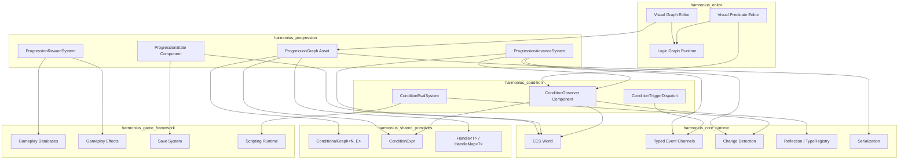
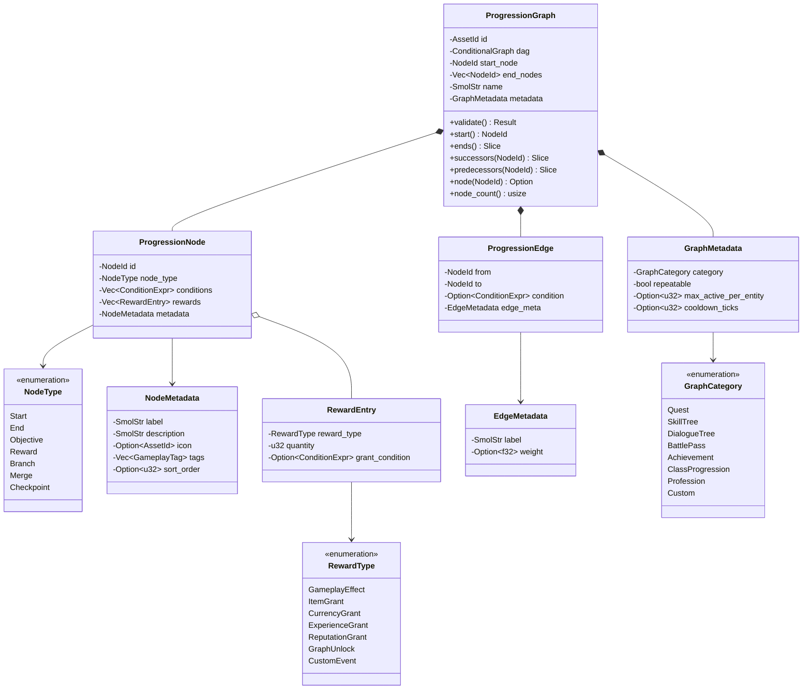
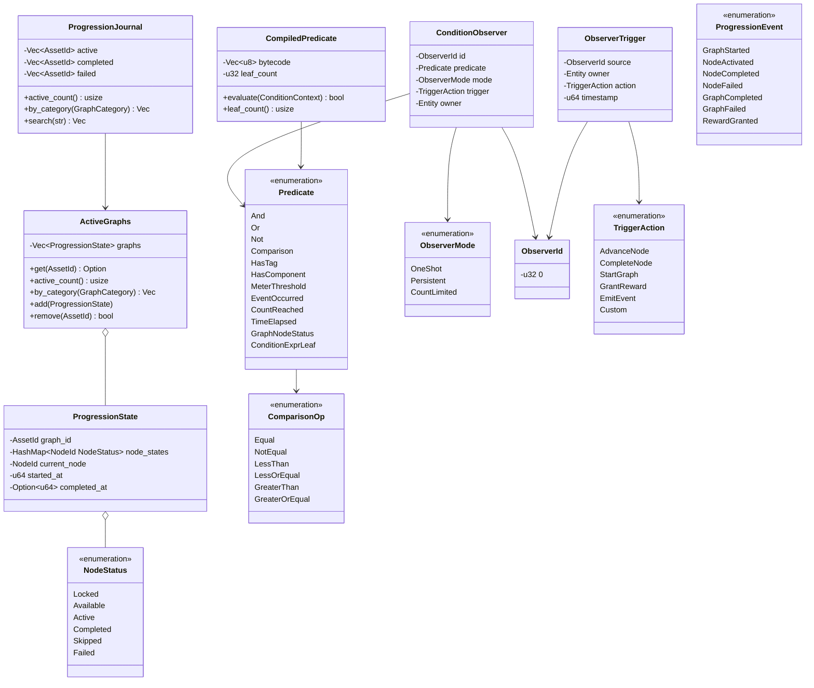
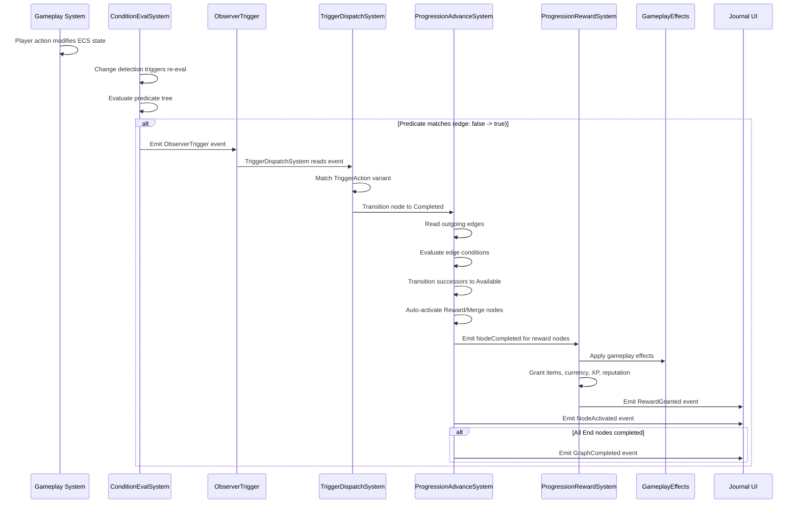
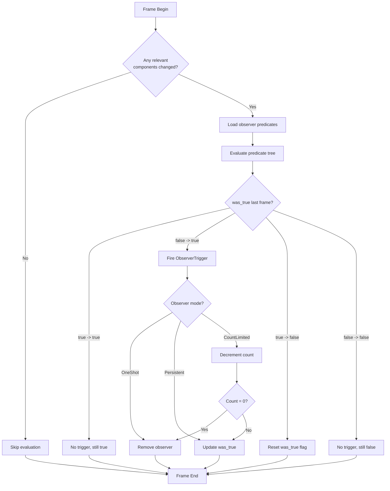
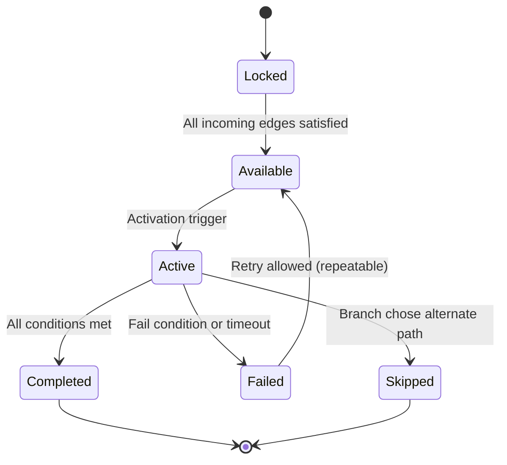

# Progression and Condition Systems Design

## Requirements Trace

> **Canonical sources:** Features, requirements, and user stories are defined in
> [features/game-framework/](../../features/), [requirements/game-framework/](../../requirements/),
> and [user-stories/game-framework/](../../user-stories/). The table below traces design elements to
> those definitions.

### Quest and Dialogue (F-13.6)

| Feature   | Requirement |
|-----------|-------------|
| F-13.6.1  | R-13.6.1    |
| F-13.6.2  | R-13.6.2    |
| F-13.6.3  | R-13.6.3    |
| F-13.6.4  | R-13.6.4    |
| F-13.6.5a | R-13.6.5a   |
| F-13.6.5b | R-13.6.5b   |
| F-13.6.5c | R-13.6.5c   |
| F-13.6.6  | R-13.6.6    |
| F-13.6.7a | R-13.6.7a   |
| F-13.6.7b | R-13.6.7b   |

1. **F-13.6.1** -- Quest graph as DAG of typed objectives with conditional edges
2. **F-13.6.2** -- Prerequisite gating with composable boolean expressions
3. **F-13.6.3** -- Per-player quest journal with event-driven UI updates
4. **F-13.6.4** -- Branching dialogue trees with conditions and side effects
5. **F-13.6.5a** -- Conversation camera framing and multi-NPC switching
6. **F-13.6.5b** -- Gameplay state suppression during conversations
7. **F-13.6.5c** -- Conversation interruption, state restore, and resumption
8. **F-13.6.6** -- Reward tables with level-scaling and group loot rules
9. **F-13.6.7a** -- Server-driven world events altering zone state
10. **F-13.6.7b** -- Per-player quest phasing via sub-level streaming

### Progression (F-13.12)

| Feature    | Requirement |
|------------|-------------|
| F-13.12.1a | R-13.12.1a  |
| F-13.12.1b | R-13.12.1b  |
| F-13.12.1c | R-13.12.1c  |
| F-13.12.1d | R-13.12.1d  |
| F-13.12.2a | R-13.12.2a  |
| F-13.12.2b | R-13.12.2b  |
| F-13.12.2c | R-13.12.2c  |
| F-13.12.3a | R-13.12.3a  |
| F-13.12.3b | R-13.12.3b  |
| F-13.12.3c | R-13.12.3c  |
| F-13.12.4  | R-13.12.4   |
| F-13.12.5  | R-13.12.5   |
| F-13.12.6a | R-13.12.6a  |
| F-13.12.6b | R-13.12.6b  |
| F-13.12.6c | R-13.12.6c  |
| F-13.12.7  | R-13.12.7   |
| F-13.12.8a | R-13.12.8a  |
| F-13.12.8b | R-13.12.8b  |
| F-13.12.8c | R-13.12.8c  |
| F-13.12.9  | R-13.12.9   |
| F-13.12.10 | R-13.12.10  |

1. **F-13.12.1a** -- Data-driven race definitions with stat modifiers and cosmetic constraints
2. **F-13.12.1b** -- Data-driven class definitions with abilities, resources, equipment restrictions
3. **F-13.12.1c** -- Multi-class switching and hybrid classes with prerequisites
4. **F-13.12.1d** -- Prestige/rebirth system with accumulating permanent bonuses
5. **F-13.12.2a** -- Talent trees as DAGs with typed nodes, prerequisites, tier gating
6. **F-13.12.2b** -- Talent point allocation, prerequisite validation, respec for currency
7. **F-13.12.2c** -- Talent tree visual editor with graph asset authoring
8. **F-13.12.3a** -- Profession data model with skill levels, XP curves, recipe thresholds
9. **F-13.12.3b** -- Gathering profession integration with skill-scaled yields
10. **F-13.12.3c** -- Crafting profession integration with level-gated recipes
11. **F-13.12.4** -- Crafting station gating by type, tier, and location
12. **F-13.12.5** -- Faction reputation with tiered standing and asymmetric relationships
13. **F-13.12.6a** -- Achievement definition and observer-driven tracking
14. **F-13.12.6b** -- Achievement rewards, notifications, and point accumulation
15. **F-13.12.6c** -- Platform achievement sync (Steam, PlayStation, Xbox)
16. **F-13.12.7** -- Item enhancement with success/failure probability
17. **F-13.12.8a** -- Item rarity tier system with bounded stat ranges
18. **F-13.12.8b** -- Affix system with rarity-scaled affix count
19. **F-13.12.8c** -- Stat re-rolling for currency
20. **F-13.12.9** -- Equipment set bonuses at piece-count thresholds
21. **F-13.12.10** -- Item durability and repair

### Monetization (F-13.23, selected)

| Feature   | Requirement |
|-----------|-------------|
| F-13.23.1 | R-13.23.1   |
| F-13.23.2 | R-13.23.2   |
| F-13.23.4 | R-13.23.4   |

1. **F-13.23.1** -- Battle pass with free/premium tiers and season XP
2. **F-13.23.2** -- Server-defined daily/weekly rotating challenges
3. **F-13.23.4** -- Daily login reward calendar with streak tracking

### Non-Functional

| Requirement | Target |
|-------------|--------|
| R-13.12.NF1 | Talent allocation validation under 1 ms |
| R-13.12.NF2 | 1,000 achievements tracked under 0.1 ms/frame |
| R-13.6.NF1  | Quest graph traversal under 0.5 ms |

### Cross-Cutting Dependencies

| Dependency | Source | Consumed API |
|------------|--------|--------------|
| ECS world, queries | F-1.1.1 | `Query`, `Entity` |
| Event channels | F-1.5.1 | `EventWriter<T>` |
| Change detection | F-1.1.22 | `Changed<T>` |
| `ConditionExpr` | shared-primitives | Boolean tree |
| `ConditionalGraph` | shared-primitives | DAG primitive |
| `Handle<T>` | shared-primitives | Generational ID |
| Gameplay databases | F-13.7 | `DataTable`, `RowRef` |
| Gameplay effects | F-13.10.3 | `GameplayEffect` |
| Scripting runtime | F-13.4 | `GraphProgram` |
| Serialization | F-1.3 | `Reflect`, binary/text |

## Overview

This document defines two genre-agnostic primitives that replace all previously separate quest,
skill tree, dialogue, talent, battle pass, achievement, prerequisite, challenge, and unlock systems.
By consolidating into two composable building blocks, the engine eliminates redundant graph
traversal code, condition evaluation logic, and per-entity state tracking that was duplicated across
six design files.

### Primitive 1: Progression Graph

A **Progression Graph** is an immutable DAG asset where each node carries a type tag, a list of
conditions (predicates), and a list of rewards (gameplay effects). Edges optionally carry predicates
evaluated by the Condition Observer. Per-entity state tracks which nodes are locked, available,
active, or completed. Multiple graphs can be active on one entity simultaneously (quest + skill tree

- battle pass). The graph is parameterized by the `ConditionalGraph<N, E>` shared primitive (see
[shared-primitives.md](../core-runtime/shared-primitives.md)).

### Primitive 2: Condition Observer

A **Condition Observer** watches ECS state for predicate matches and fires typed events when
conditions are met. Predicates are composable boolean expressions built from the `ConditionExpr`
shared primitive, extended with game-specific leaf types. Observers evaluate reactively via ECS
change detection, not by polling every frame. Observers can be one-shot (achievement unlock) or
persistent (quest prerequisite). Predicates are authored in the visual editor as node graphs and
compiled to logic graph bytecode for efficient evaluation via the scripting runtime (F-13.4).

### Design Principles

- **Genre-agnostic.** No quest, skill, or dialogue vocabulary in the core types. Game mechanics
  compose from generic nodes, edges, conditions, and rewards.
- **100% ECS.** All state as components, all logic as systems, all assets as resources.
- **Data-driven and no-code.** Visual editors for graph authoring. Predicates compile to bytecode.
- **Reactive evaluation.** Condition Observers use ECS change detection. No per-frame polling.
- **Immutable assets.** Graphs are read-only at runtime. Mutable state lives in per-entity
  components.

## Architecture

### Module Boundaries



### Directory Layout

```text
harmonius_progression/
├── graph/
│   ├── asset.rs        # ProgressionGraph, immutable
│   │                   # DAG asset wrapper
│   ├── node.rs         # ProgressionNode, NodeType,
│   │                   # metadata
│   ├── edge.rs         # ProgressionEdge, optional
│   │                   # condition predicate
│   ├── registry.rs     # GraphRegistry resource,
│   │                   # AssetId lookup
│   └── validate.rs     # DAG validation, cycle
│                       # detection, orphan check
├── state/
│   ├── component.rs    # ProgressionState, per-entity
│   │                   # node status tracking
│   ├── node_status.rs  # NodeStatus enum, transitions
│   ├── multi.rs        # ActiveGraphs component,
│   │                   # multi-graph tracking
│   └── journal.rs      # ProgressionJournal, filtered
│                       # views for UI binding
├── systems/
│   ├── advance.rs      # ProgressionAdvanceSystem,
│   │                   # node transition logic
│   ├── reward.rs       # ProgressionRewardSystem,
│   │                   # effect dispatch
│   ├── gating.rs       # GatingSystem, prerequisite
│   │                   # evaluation on edges
│   └── save.rs         # SaveProgressionSystem,
│                       # serialize/deserialize
├── events.rs           # NodeActivated, NodeCompleted,
│                       # GraphCompleted, GraphStarted
└── lib.rs              # Plugin registration

harmonius_condition/
├── observer/
│   ├── component.rs    # ConditionObserver component,
│   │                   # predicate + trigger config
│   ├── predicate.rs    # Predicate enum, composable
│   │                   # boolean expressions
│   ├── trigger.rs      # ObserverTrigger event,
│   │                   # one-shot vs persistent
│   └── bytecode.rs     # CompiledPredicate, bytecode
│                       # representation
├── systems/
│   ├── evaluate.rs     # ConditionEvalSystem, reactive
│   │                   # change-detection evaluation
│   ├── dispatch.rs     # TriggerDispatchSystem, fire
│   │                   # events on match
│   └── cleanup.rs      # OneShot observer removal
│                       # after trigger
├── events.rs           # ObserverTriggered,
│                       # ObserverRegistered
└── lib.rs              # Plugin registration
```

### Class Diagram -- Graph Asset Types



### Class Diagram -- State and Observer Types



## API Design

### Identity Types

```rust
/// Unique identifier for a progression graph asset.
/// Maps to a row in the graph data table.
#[derive(
    Clone, Copy, Debug, PartialEq, Eq, Hash,
    Reflect,
)]
pub struct ProgressionGraphId(pub u32);

/// Unique identifier for a condition observer.
#[derive(
    Clone, Copy, Debug, PartialEq, Eq, Hash,
    Reflect,
)]
pub struct ObserverId(pub u32);
```

### Progression Graph (Immutable Asset)

```rust
/// Types of nodes in a progression graph. Generic
/// across all game mechanics -- no genre-specific
/// vocabulary.
#[derive(Clone, Debug, Reflect)]
pub enum NodeType {
    /// Entry point of the graph. Exactly one per
    /// graph.
    Start,
    /// Terminal node. Completing this node
    /// completes the graph.
    End,
    /// Standard objective node. Completion
    /// requires all conditions to be met.
    Objective,
    /// Pure reward node. Auto-completes on
    /// activation, granting rewards.
    Reward,
    /// Branching decision point. Outgoing edges
    /// have mutually exclusive conditions.
    Branch,
    /// Convergence point. Activates when any one
    /// incoming edge's source is completed.
    Merge,
    /// Checkpoint node. Saves progress and acts
    /// as a resume point on reload.
    Checkpoint,
}

/// Metadata for a progression node. Used by the
/// visual editor and UI systems.
#[derive(Clone, Debug, Reflect)]
pub struct NodeMetadata {
    /// Short label for editor and HUD display.
    pub label: SmolStr,
    /// Localized description for journal/tooltip.
    pub description: SmolStr,
    /// Optional icon asset for UI rendering.
    pub icon: Option<AssetId<IconAsset>>,
    /// Gameplay tags for filtering and queries.
    pub tags: Vec<GameplayTag>,
    /// Optional sort order for UI presentation.
    pub sort_order: Option<u32>,
}

/// A node in the progression DAG.
#[derive(Clone, Debug, Reflect)]
pub struct ProgressionNode {
    /// Unique identifier within the graph.
    pub id: NodeId,
    /// Determines traversal and completion
    /// semantics.
    pub node_type: NodeType,
    /// Conditions that must all be true for this
    /// node to transition from Available to Active.
    pub conditions: Vec<ConditionExpr>,
    /// Rewards granted when this node completes.
    pub rewards: Vec<RewardEntry>,
    /// Display and editor metadata.
    pub metadata: NodeMetadata,
}

/// Metadata attached to an edge. Used by the
/// visual editor for display and weighting.
#[derive(Clone, Debug, Reflect)]
pub struct EdgeMetadata {
    /// Optional label for editor display.
    pub label: SmolStr,
    /// Optional weight for probabilistic branching.
    pub weight: Option<f32>,
}

/// A directed edge in the progression DAG with an
/// optional condition guard evaluated by the
/// Condition Observer.
#[derive(Clone, Debug, Reflect)]
pub struct ProgressionEdge {
    /// Source node.
    pub from: NodeId,
    /// Destination node.
    pub to: NodeId,
    /// Optional guard condition. When `None`, the
    /// edge is unconditional.
    pub condition: Option<ConditionExpr>,
    /// Display metadata.
    pub edge_meta: EdgeMetadata,
}

/// Categories for organizing graphs in the journal
/// and editor. Purely organizational -- no
/// behavioral difference.
#[derive(
    Clone, Copy, Debug, PartialEq, Eq, Reflect,
)]
pub enum GraphCategory {
    Quest,
    SkillTree,
    DialogueTree,
    BattlePass,
    Achievement,
    ClassProgression,
    Profession,
    Custom,
}

/// Metadata for the graph as a whole.
#[derive(Clone, Debug, Reflect)]
pub struct GraphMetadata {
    /// Organizational category.
    pub category: GraphCategory,
    /// Whether the graph can be re-started after
    /// completion.
    pub repeatable: bool,
    /// Max instances of this graph active on one
    /// entity. `None` = unlimited.
    pub max_active_per_entity: Option<u32>,
    /// Cooldown in ticks before re-start after
    /// completion. `None` = no cooldown.
    pub cooldown_ticks: Option<u32>,
}

/// Reward types that can be granted when a node
/// completes. Each variant references data in the
/// gameplay database or effect system.
#[derive(Clone, Debug, Reflect)]
pub enum RewardType {
    /// Apply a gameplay effect (F-13.10.3).
    GameplayEffect(AssetId<GameplayEffect>),
    /// Grant an item via database RowRef.
    ItemGrant(RowRef),
    /// Grant currency by type and amount.
    CurrencyGrant {
        currency: RowRef,
        amount: u64,
    },
    /// Grant experience points.
    ExperienceGrant(u64),
    /// Modify faction reputation.
    ReputationGrant {
        faction: RowRef,
        delta: i32,
    },
    /// Unlock another progression graph.
    GraphUnlock(AssetId<ProgressionGraph>),
    /// Emit a custom event for other systems.
    CustomEvent(SmolStr),
}

/// A single reward entry with optional gating.
#[derive(Clone, Debug, Reflect)]
pub struct RewardEntry {
    /// The reward to grant.
    pub reward_type: RewardType,
    /// Quantity multiplier.
    pub quantity: u32,
    /// Optional condition. If present, the reward
    /// is only granted when this condition is true
    /// at completion time.
    pub grant_condition: Option<ConditionExpr>,
}

/// Immutable progression graph asset. Wraps the
/// shared `ConditionalGraph<N, E>` primitive with
/// progression-specific metadata.
///
/// Graphs are authored in the visual graph editor
/// and serialized via the reflection system. At
/// runtime they are loaded as ECS resources.
#[derive(Asset, Reflect)]
pub struct ProgressionGraph {
    id: AssetId<ProgressionGraph>,
    dag: ConditionalGraph<
        ProgressionNode,
        ProgressionEdge,
    >,
    start_node: NodeId,
    end_nodes: Vec<NodeId>,
    name: SmolStr,
    metadata: GraphMetadata,
}

impl ProgressionGraph {
    /// Validate DAG structure: no cycles, exactly
    /// one Start node, at least one End node, all
    /// edges reference valid nodes.
    pub fn validate(
        &self,
    ) -> Result<(), GraphValidationError>;

    /// Return the start node identifier.
    pub fn start(&self) -> NodeId;

    /// Return all terminal (End) nodes.
    pub fn ends(&self) -> &[NodeId];

    /// Return outgoing edges from a node.
    pub fn successors(
        &self,
        node: NodeId,
    ) -> &[ProgressionEdge];

    /// Return incoming edges to a node.
    pub fn predecessors(
        &self,
        node: NodeId,
    ) -> &[ProgressionEdge];

    /// Retrieve a node by identifier.
    pub fn node(
        &self,
        id: NodeId,
    ) -> Option<&ProgressionNode>;

    /// Total node count.
    pub fn node_count(&self) -> usize;

    /// Return the graph category.
    pub fn category(&self) -> GraphCategory;

    /// Whether the graph is repeatable.
    pub fn is_repeatable(&self) -> bool;
}
```

### Progression State (Per-Entity Components)

```rust
/// Per-node status in a progression graph instance.
#[derive(
    Clone, Copy, Debug, PartialEq, Eq, Reflect,
)]
pub enum NodeStatus {
    /// Prerequisite edges not yet satisfied.
    Locked,
    /// All incoming conditions met. Waiting for
    /// activation (player action or auto-advance).
    Available,
    /// Currently being worked on. Conditions are
    /// being tracked by Condition Observers.
    Active,
    /// Successfully completed. Rewards granted.
    Completed,
    /// Skipped via a Branch node's alternate path.
    Skipped,
    /// Failed due to timeout or fail condition.
    Failed,
}

/// Per-entity state for a single progression graph
/// instance. Tracks the status of every node.
#[derive(Clone, Debug, Component, Reflect)]
pub struct ProgressionState {
    /// Which graph this state tracks.
    pub graph_id: AssetId<ProgressionGraph>,
    /// Per-node status map.
    pub node_states: HashMap<NodeId, NodeStatus>,
    /// Currently active node (for linear UIs).
    pub current_node: NodeId,
    /// Tick when the graph was started.
    pub started_at: u64,
    /// Tick when the graph was completed. `None`
    /// if still in progress.
    pub completed_at: Option<u64>,
}

impl ProgressionState {
    /// Create initial state from a graph. All nodes
    /// start as Locked except the Start node which
    /// begins as Available.
    pub fn from_graph(
        graph: &ProgressionGraph,
        start_tick: u64,
    ) -> Self;

    /// Transition a node to a new status. Returns
    /// an error if the transition is invalid.
    pub fn transition(
        &mut self,
        node: NodeId,
        new_status: NodeStatus,
    ) -> Result<(), TransitionError>;

    /// Query the status of a specific node.
    pub fn status(
        &self,
        node: NodeId,
    ) -> Option<NodeStatus>;

    /// Return all nodes with a given status.
    pub fn nodes_with_status(
        &self,
        status: NodeStatus,
    ) -> Vec<NodeId>;

    /// Whether the graph is fully completed (all
    /// End nodes are Completed).
    pub fn is_complete(&self) -> bool;
}

/// Component tracking all active progression graphs
/// on an entity. Supports simultaneous quest, skill
/// tree, and battle pass progression.
#[derive(Clone, Debug, Component, Reflect)]
pub struct ActiveGraphs {
    graphs: Vec<ProgressionState>,
}

impl ActiveGraphs {
    /// Look up state for a specific graph.
    pub fn get(
        &self,
        graph_id: AssetId<ProgressionGraph>,
    ) -> Option<&ProgressionState>;

    /// Mutable access to a specific graph state.
    pub fn get_mut(
        &mut self,
        graph_id: AssetId<ProgressionGraph>,
    ) -> Option<&mut ProgressionState>;

    /// Number of active graphs on this entity.
    pub fn active_count(&self) -> usize;

    /// Filter graphs by category.
    pub fn by_category(
        &self,
        category: GraphCategory,
        registry: &GraphRegistry,
    ) -> Vec<AssetId<ProgressionGraph>>;

    /// Add a new graph. Returns error if max
    /// active limit is reached.
    pub fn add(
        &mut self,
        state: ProgressionState,
    ) -> Result<(), GraphLimitError>;

    /// Remove a graph by ID. Returns true if found.
    pub fn remove(
        &mut self,
        graph_id: AssetId<ProgressionGraph>,
    ) -> bool;
}

/// Per-entity journal for UI display. Mirrors
/// ActiveGraphs with category filtering and
/// text search.
#[derive(Clone, Debug, Component, Reflect)]
pub struct ProgressionJournal {
    pub active: Vec<AssetId<ProgressionGraph>>,
    pub completed: Vec<AssetId<ProgressionGraph>>,
    pub failed: Vec<AssetId<ProgressionGraph>>,
}

impl ProgressionJournal {
    /// Filter by category.
    pub fn by_category(
        &self,
        category: GraphCategory,
        registry: &GraphRegistry,
    ) -> Vec<AssetId<ProgressionGraph>>;

    /// Text search across graph names.
    pub fn search(
        &self,
        query: &str,
        registry: &GraphRegistry,
    ) -> Vec<AssetId<ProgressionGraph>>;

    /// Total active graph count.
    pub fn active_count(&self) -> usize;
}
```

### Progression Events

```rust
/// Emitted when a progression graph is started on
/// an entity.
#[derive(Clone, Debug, Event, Reflect)]
pub struct GraphStarted {
    pub entity: Entity,
    pub graph_id: AssetId<ProgressionGraph>,
}

/// Emitted when a node becomes Active.
#[derive(Clone, Debug, Event, Reflect)]
pub struct NodeActivated {
    pub entity: Entity,
    pub graph_id: AssetId<ProgressionGraph>,
    pub node_id: NodeId,
}

/// Emitted when a node transitions to Completed.
#[derive(Clone, Debug, Event, Reflect)]
pub struct NodeCompleted {
    pub entity: Entity,
    pub graph_id: AssetId<ProgressionGraph>,
    pub node_id: NodeId,
}

/// Emitted when a node transitions to Failed.
#[derive(Clone, Debug, Event, Reflect)]
pub struct NodeFailed {
    pub entity: Entity,
    pub graph_id: AssetId<ProgressionGraph>,
    pub node_id: NodeId,
}

/// Emitted when all End nodes in a graph are
/// completed.
#[derive(Clone, Debug, Event, Reflect)]
pub struct GraphCompleted {
    pub entity: Entity,
    pub graph_id: AssetId<ProgressionGraph>,
}

/// Emitted when rewards are granted from a node.
#[derive(Clone, Debug, Event, Reflect)]
pub struct RewardGranted {
    pub entity: Entity,
    pub graph_id: AssetId<ProgressionGraph>,
    pub node_id: NodeId,
    pub reward: RewardType,
    pub quantity: u32,
}
```

### Condition Observer

```rust
/// Composable predicate for watching ECS state.
/// Extends `ConditionExpr` with game-specific leaf
/// types. Compiled to bytecode by the visual
/// predicate editor.
#[derive(Clone, Debug, Reflect)]
pub enum Predicate {
    /// Boolean AND -- all children must be true.
    And(Vec<Predicate>),
    /// Boolean OR -- at least one child is true.
    Or(Vec<Predicate>),
    /// Boolean NOT -- child must be false.
    Not(Box<Predicate>),
    /// Compare a stat or meter value.
    Comparison {
        stat: RowRef,
        op: ComparisonOp,
        threshold: f64,
    },
    /// Entity has a specific gameplay tag.
    HasTag(GameplayTag),
    /// Entity has a specific component type.
    HasComponent(ComponentTypeId),
    /// A resource meter is above/below a threshold.
    MeterThreshold {
        meter: RowRef,
        op: ComparisonOp,
        value: f64,
    },
    /// A specific event type has been observed at
    /// least N times.
    EventOccurred {
        event_type: SmolStr,
        min_count: u32,
    },
    /// A counter has reached a target value.
    CountReached {
        counter: SmolStr,
        target: u32,
    },
    /// Elapsed time since a reference point.
    TimeElapsed {
        reference: TimeReference,
        duration_ticks: u64,
    },
    /// A node in a progression graph has a
    /// specific status.
    GraphNodeStatus {
        graph_id: AssetId<ProgressionGraph>,
        node_id: NodeId,
        expected: NodeStatus,
    },
    /// Delegate to a registered ConditionExpr leaf.
    ConditionExprLeaf(ConditionId),
}

/// Comparison operators for predicate evaluation.
#[derive(
    Clone, Copy, Debug, PartialEq, Eq, Reflect,
)]
pub enum ComparisonOp {
    Equal,
    NotEqual,
    LessThan,
    LessOrEqual,
    GreaterThan,
    GreaterOrEqual,
}

/// Reference point for time-based predicates.
#[derive(
    Clone, Copy, Debug, PartialEq, Eq, Reflect,
)]
pub enum TimeReference {
    /// Ticks since the observer was registered.
    ObserverCreation,
    /// Ticks since the graph was started.
    GraphStart,
    /// Ticks since the node became Active.
    NodeActivation,
    /// Absolute simulation tick.
    AbsoluteTick(u64),
}

/// Observer mode determines lifetime behavior.
#[derive(
    Clone, Copy, Debug, PartialEq, Eq, Reflect,
)]
pub enum ObserverMode {
    /// Fires once, then auto-removes.
    OneShot,
    /// Fires every time the predicate transitions
    /// from false to true. Never auto-removes.
    Persistent,
    /// Fires up to N times, then auto-removes.
    CountLimited(u32),
}

/// Action taken when an observer's predicate
/// matches.
#[derive(Clone, Debug, Reflect)]
pub enum TriggerAction {
    /// Advance a specific node in a graph.
    AdvanceNode {
        graph_id: AssetId<ProgressionGraph>,
        node_id: NodeId,
    },
    /// Complete a specific node.
    CompleteNode {
        graph_id: AssetId<ProgressionGraph>,
        node_id: NodeId,
    },
    /// Start a new progression graph.
    StartGraph(AssetId<ProgressionGraph>),
    /// Grant a reward directly.
    GrantReward(RewardEntry),
    /// Emit a typed event.
    EmitEvent(SmolStr),
    /// Execute a compiled logic graph.
    Custom(AssetId<GraphProgram>),
}

/// Event emitted when an observer's predicate
/// matches.
#[derive(Clone, Debug, Event, Reflect)]
pub struct ObserverTrigger {
    /// Which observer fired.
    pub source: ObserverId,
    /// Entity that owns the observer.
    pub owner: Entity,
    /// Action to execute.
    pub action: TriggerAction,
    /// Simulation tick when the trigger fired.
    pub timestamp: u64,
}

/// Per-entity condition observer component. Tracks
/// a predicate and fires ObserverTrigger events
/// when the predicate matches.
#[derive(Clone, Debug, Component, Reflect)]
pub struct ConditionObserver {
    /// Unique observer identifier.
    pub id: ObserverId,
    /// The predicate to watch.
    pub predicate: Predicate,
    /// Lifetime mode.
    pub mode: ObserverMode,
    /// Action to take on match.
    pub trigger: TriggerAction,
    /// Number of times this observer has fired.
    pub fire_count: u32,
    /// Whether the predicate was true last
    /// evaluation (for edge detection).
    pub was_true: bool,
}

/// Compiled predicate for efficient evaluation.
/// Generated by the visual predicate editor's
/// compiler. Evaluated by the scripting runtime
/// (F-13.4).
#[derive(Clone, Debug, Reflect)]
pub struct CompiledPredicate {
    /// Bytecode for the logic graph runtime.
    pub bytecode: Vec<u8>,
    /// Number of leaf conditions in the tree.
    pub leaf_count: u32,
}

impl CompiledPredicate {
    /// Evaluate the compiled predicate against
    /// the ECS world state.
    pub fn evaluate(
        &self,
        ctx: &ConditionContext,
        registry: &ConditionRegistry,
    ) -> bool;

    /// Number of leaf predicates.
    pub fn leaf_count(&self) -> usize;
}
```

### ECS Systems

```rust
/// Evaluates all ConditionObserver predicates using
/// ECS change detection. Only re-evaluates when
/// relevant components have changed.
///
/// Runs in the PostUpdate schedule phase.
pub fn condition_eval_system(
    mut observers: Query<
        (Entity, &mut ConditionObserver),
        Changed<ConditionObserver>,
    >,
    world: &World,
    registry: Res<ConditionRegistry>,
    mut triggers: EventWriter<ObserverTrigger>,
    tick: Res<SimulationTick>,
);

/// Dispatches ObserverTrigger events to the
/// appropriate handlers: node advancement, reward
/// grants, graph starts, or custom events.
pub fn trigger_dispatch_system(
    triggers: EventReader<ObserverTrigger>,
    mut graphs: Query<&mut ActiveGraphs>,
    mut rewards: EventWriter<RewardGranted>,
    mut commands: Commands,
);

/// Advances progression graphs when nodes complete.
/// Evaluates outgoing edge conditions and
/// transitions successor nodes from Locked to
/// Available.
pub fn progression_advance_system(
    completed: EventReader<NodeCompleted>,
    mut graphs: Query<&mut ActiveGraphs>,
    graph_assets: Res<Assets<ProgressionGraph>>,
    ctx: Res<ConditionContext>,
    registry: Res<ConditionRegistry>,
    mut activated: EventWriter<NodeActivated>,
    mut graph_done: EventWriter<GraphCompleted>,
);

/// Grants rewards when nodes complete. Reads the
/// node's reward list and dispatches to the
/// gameplay effect system (F-13.10.3), database
/// (F-13.7), and currency systems.
pub fn progression_reward_system(
    completed: EventReader<NodeCompleted>,
    graphs: Query<&ActiveGraphs>,
    graph_assets: Res<Assets<ProgressionGraph>>,
    mut effects: EventWriter<ApplyGameplayEffect>,
    mut items: EventWriter<GrantItem>,
    mut currency: EventWriter<GrantCurrency>,
    mut xp: EventWriter<GrantExperience>,
    mut rep: EventWriter<GrantReputation>,
    mut rewards: EventWriter<RewardGranted>,
);

/// Removes one-shot and count-limited observers
/// that have exhausted their fire count.
pub fn observer_cleanup_system(
    mut commands: Commands,
    observers: Query<
        (Entity, &ConditionObserver),
    >,
);

/// Serializes ProgressionState and ActiveGraphs
/// to the save system. Deserializes on load.
pub fn save_progression_system(
    graphs: Query<
        (Entity, &ActiveGraphs),
        Changed<ActiveGraphs>,
    >,
    mut save: ResMut<SaveBuffer>,
);
```

## Data Flow

### Progression Advance Sequence



### Condition Observer Evaluation Flow



### Node State Machine



## Composition Examples

The two primitives compose to create every game mechanic that was previously handled by separate
systems.

### Quest System

A quest is a `ProgressionGraph` with category `Quest`:

- **Start node** -- quest acceptance point
- **Objective nodes** -- kill N enemies, collect M items, reach a location (conditions use
  `CountReached`, `EventOccurred`, `HasTag`)
- **Branch nodes** -- player choices in dialogue trigger different paths
- **Reward node** -- grants items, XP, reputation
- **End node** -- quest completion

Condition Observers track kill counts, item pickups, and zone entry. `ObserverTrigger` events
advance nodes. The `ProgressionJournal` component drives the quest journal UI.

Replaces: F-13.6.1 (quest graph), F-13.6.2 (prerequisites), F-13.6.3 (journal), F-13.6.6 (rewards).

### Dialogue Tree

A dialogue tree is a `ProgressionGraph` with category `DialogueTree`:

- **Start node** -- NPC greeting line
- **Branch nodes** -- player response options, each edge guarded by a `ConditionExpr` (reputation
  check, item check, quest status)
- **Objective nodes** -- NPC lines with side effects (grant item, modify reputation)
- **End node** -- conversation termination

The graph traversal is synchronous (no Condition Observers needed). The `ProgressionAdvanceSystem`
evaluates edge conditions as the player selects responses. Camera framing (F-13.6.5a) and state
suppression (F-13.6.5b) are handled by companion systems that read the `ActiveGraphs` component.

Replaces: F-13.6.4 (dialogue trees), F-13.6.5a--c (conversation).

### Skill Tree / Talent Tree

A talent tree is a `ProgressionGraph` with category `SkillTree`:

- **Start node** -- root of the tree
- **Objective nodes** -- each talent. Conditions include `MeterThreshold` (talent points available)
  and edge conditions for tier gating
- **Checkpoint nodes** -- tier gates that require a minimum number of allocated points
- **Reward nodes** -- apply `GameplayEffect` (stat modifier, ability unlock)

No Condition Observers needed for basic allocation. The `ProgressionAdvanceSystem` validates
prerequisites when the player allocates a point. Respec resets all nodes to `Locked` and refunds
points.

Replaces: F-13.12.2a (talent DAGs), F-13.12.2b (allocation), F-13.12.2c (visual editor).

### Battle Pass

A battle pass is a linear `ProgressionGraph` with category `BattlePass`:

- **Start node** -- season begin
- **Objective nodes** -- ordered tiers. Each node's condition is `MeterThreshold` on season XP
- **Reward nodes** -- free/premium reward split via `grant_condition` on each `RewardEntry`
- **End node** -- final tier

A Condition Observer watches the season XP meter. Each tier auto-advances when the XP threshold is
met. Season timing integrates with the NPC simulation schedule system (F-13.19.4a).

Replaces: F-13.23.1 (battle pass), F-13.23.4 (login rewards -- same pattern with a daily timer
predicate).

### Achievement System

An achievement uses only a `ConditionObserver` (no graph):

- A `Predicate` watches for a specific condition (`CountReached` for "kill 100 enemies",
  `EventOccurred` for "defeat boss X")
- `ObserverMode::OneShot` ensures it fires once
- `TriggerAction::GrantReward` dispatches the reward
- Platform sync (F-13.12.6c) subscribes to `RewardGranted` events

For multi-step achievements, a `ProgressionGraph` with category `Achievement` tracks ordered
milestones.

Replaces: F-13.12.6a (achievement tracking), F-13.12.6b (rewards), F-13.12.6c (platform sync).

### Race and Class Progression

Race and class definitions are rows in the gameplay database (F-13.7). Each class has an associated
`ProgressionGraph` with category `ClassProgression`:

- **Objective nodes** -- level thresholds that unlock abilities
- **Reward nodes** -- grant abilities, stat growth, resource pool increases via `GameplayEffect`
- **Branch nodes** -- specialization choices at key levels

Multi-class (F-13.12.1c) adds a second `ProgressionGraph` to the entity's `ActiveGraphs`. Prestige
(F-13.12.1d) resets the graph and applies permanent bonuses from a prestige-specific reward list.

Replaces: F-13.12.1a--d (race/class/prestige).

### Profession Progression

Each profession is a `ProgressionGraph` with category `Profession`:

- **Objective nodes** -- skill level milestones gated by `MeterThreshold` on profession XP
- **Reward nodes** -- recipe unlocks via `GraphUnlock` pointing to recipe sub-graphs
- **Checkpoint nodes** -- crafting station tier gates (F-13.12.4)

Replaces: F-13.12.3a--c (profession model), F-13.12.4 (station gating).

### Reputation and Faction Standing

Faction reputation uses `ConditionObserver` instances to watch reputation meter thresholds:

- Each tier threshold is a separate observer with `MeterThreshold` predicate
- `ObserverMode::Persistent` fires on every tier transition (both up and down)
- `TriggerAction::EmitEvent` notifies UI and gating systems

Replaces: F-13.12.5 (reputation tiers).

### Challenge System

Daily/weekly challenges are `ConditionObserver` instances with time-limited predicates:

- `Predicate::And` combining a `TimeElapsed` predicate (challenge window) with a gameplay predicate
  (`CountReached`, `EventOccurred`)
- `ObserverMode::OneShot` per challenge
- Server rotates challenges by spawning new observer entities each day/week

Replaces: F-13.23.2 (rotating challenges).

### World Events and Phasing

Server-driven world events (F-13.6.7a) use a `ProgressionGraph` attached to a zone entity:

- Nodes represent event phases
- Condition Observers watch aggregate player contributions (`CountReached`)
- Phase transitions trigger sub-level streaming for quest phasing (F-13.6.7b)

### Item Enhancement and Affixes

Item enhancement (F-13.12.7), rarity (F-13.12.8a), affixes (F-13.12.8b), re-rolling (F-13.12.8c),
set bonuses (F-13.12.9), and durability (F-13.12.10) do not use progression graphs. They are purely
database-driven systems that compose with the gameplay effect system (F-13.10.3). These remain in
the `containers-sockets.md` design as item subsystem components.

## Platform Considerations

All platforms (Windows, macOS, Linux, iOS, Android, consoles) use identical progression and
condition logic. The two primitives are pure Rust with no platform-specific code paths.

| Aspect | Approach |
|--------|----------|
| Evaluation | Pure functions, no platform I/O |
| Serialization | Via reflection system (F-1.3) |
| Platform achievements | F-13.12.6c subscribes to events |
| Save/load | Via save system, platform storage |
| Visual editor | Desktop-only tooling |

Platform achievement sync (F-13.12.6c) is handled by a separate platform bridge that subscribes to
`RewardGranted` events and maps them to Steam, PlayStation, or Xbox achievement APIs. This bridge is
not part of the progression primitives.

## Test Plan

Comprehensive test cases are in the companion file
[progression-test-cases.md](progression-test-cases.md).

### Unit Tests

| Area | Coverage |
|------|----------|
| Graph validation | Cycle detection, orphan nodes |
| Node transitions | All valid/invalid transitions |
| Predicate evaluation | Every `Predicate` variant |
| Compiled predicate | Bytecode evaluation correctness |
| Reward dispatch | Every `RewardType` variant |
| Observer modes | OneShot, Persistent, CountLimited |
| Edge detection | false->true, true->false edges |
| Journal filtering | Category, search, counts |
| State serialization | Round-trip save/load fidelity |

### Integration Tests

| Area | Coverage |
|------|----------|
| Quest composition | Full quest lifecycle end-to-end |
| Skill tree allocation | Allocate, respec, tier gates |
| Battle pass advance | XP gain -> tier unlock -> reward |
| Achievement fire | Event -> observer -> reward |
| Multi-graph | 3+ graphs active simultaneously |
| Dialogue traversal | Branch conditions, side effects |
| World event phases | Zone-level graph with phasing |

### Benchmarks

| Benchmark | Target | Req |
|-----------|--------|-----|
| 1,000 observer evals | < 0.1 ms | R-13.12.NF2 |
| Talent validation | < 1 ms | R-13.12.NF1 |
| Graph traversal (50 nodes) | < 0.5 ms | R-13.6.NF1 |
| 100 simultaneous graphs | < 1 ms total | -- |
| Predicate bytecode eval | < 0.01 ms | -- |
