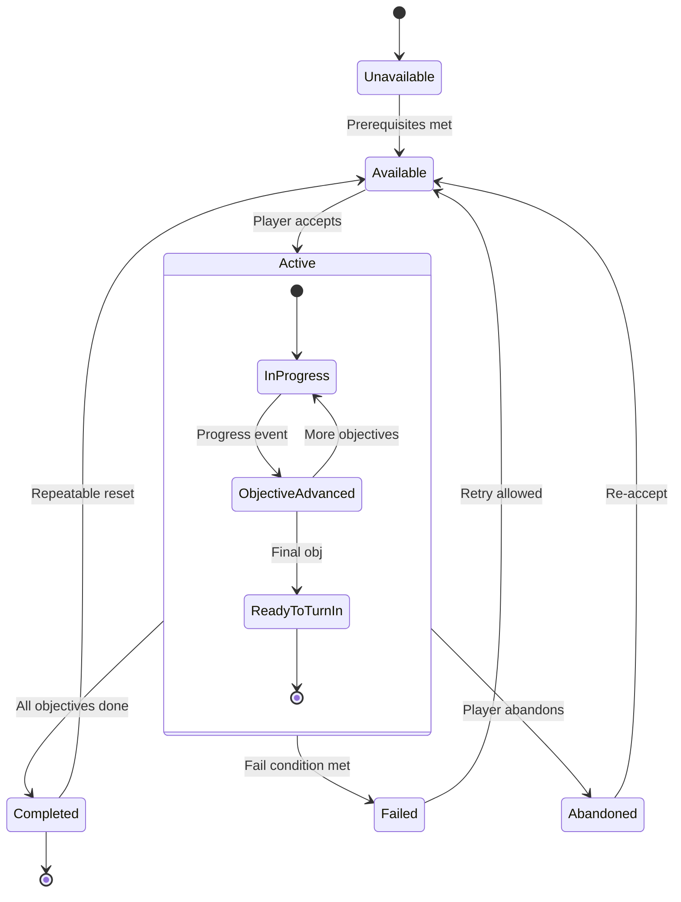
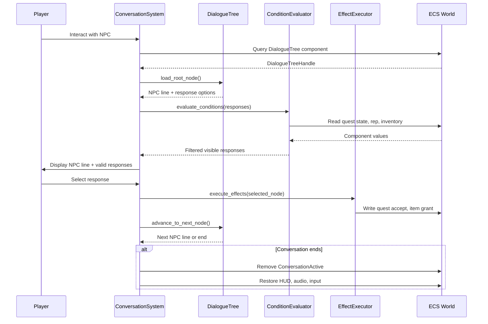
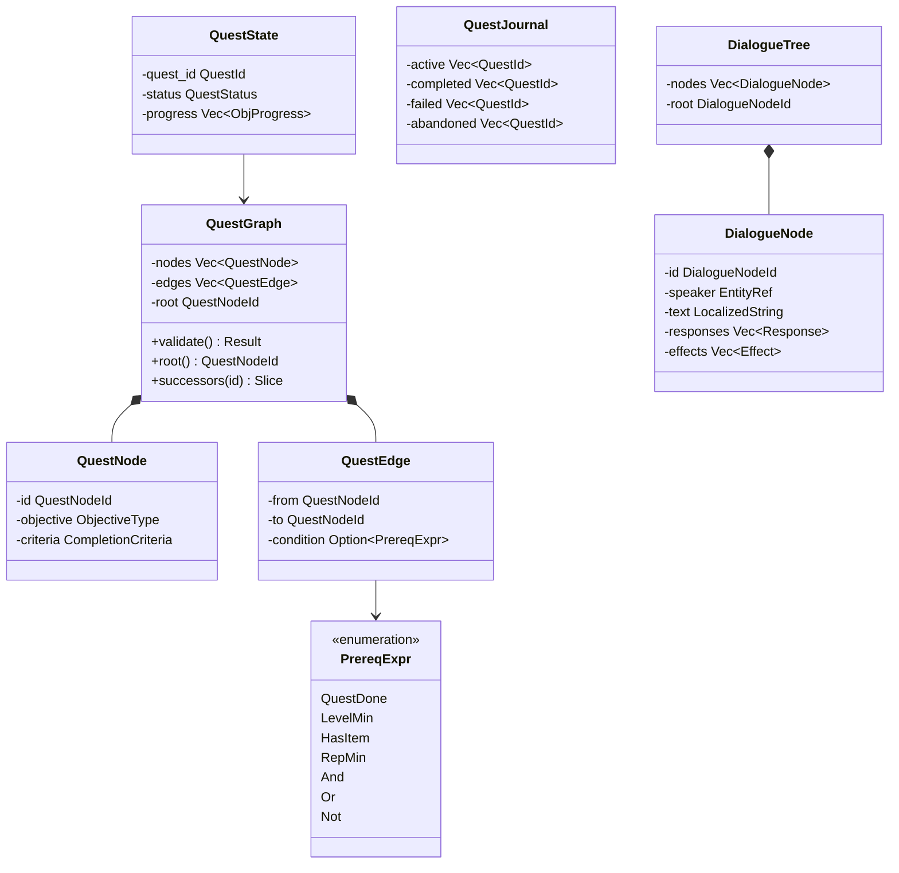

# Quest & Dialogue System Design

## Requirements Trace

> **Canonical sources:** Features, requirements, and user stories are defined in
> [features/game-framework/](../../features/), [requirements/game-framework/](../../requirements/),
> and [user-stories/game-framework/](../../user-stories/). The table below traces design elements to
> those definitions.

| Feature   | Requirement |
|-----------|-------------|
| F-13.6.1  | R-13.6.1    |
| F-13.6.2  | R-13.6.2    |
| F-13.6.3  | R-13.6.3    |
| F-13.6.4  | R-13.6.4    |
| F-13.6.5a | R-13.6.5a   |
| F-13.6.5b | R-13.6.5b   |
| F-13.6.5c | R-13.6.5c   |
| F-13.6.6  | R-13.6.6    |
| F-13.6.7a | R-13.6.7a   |
| F-13.6.7b | R-13.6.7b   |

1. **F-13.6.1** — Quest graph as DAG of typed objectives with conditional edges
2. **F-13.6.2** — Prerequisite gating with composable boolean expressions
3. **F-13.6.3** — Per-player quest journal with event-driven UI updates
4. **F-13.6.4** — Branching dialogue trees with conditions and side effects
5. **F-13.6.5a** — Conversation camera framing and multi-NPC switching
6. **F-13.6.5b** — Gameplay state suppression during conversations
7. **F-13.6.5c** — Conversation interruption, state restore, and resumption
8. **F-13.6.6** — Reward tables with level-scaling and group loot rules
9. **F-13.6.7a** — Server-driven world events altering zone state
10. **F-13.6.7b** — Per-player quest phasing via sub-level streaming

## Overview

The quest and dialogue system provides data-driven quest progression and branching NPC
conversations. Quests are directed acyclic graphs of typed objective nodes with conditional edges.
Dialogues are trees of NPC lines, player responses, and side-effect triggers. Both are authored in
visual no-code editors and stored as serialized assets.

All runtime state lives as ECS components. Quest graphs and dialogue trees are ECS resources
(immutable assets). Per-entity state (active quests, conversation progress) is stored in components
on player and NPC entities. State transitions emit typed events consumed by the journal UI, map
markers, and minimap systems.

The system integrates with gameplay databases for prerequisite evaluation, reward distribution, and
condition checking. Quest completion is server-authoritative to prevent client-side exploits.

## Architecture

### Module Boundaries

```mermaid
graph TD
    subgraph "harmonius_quest_dialogue"
        QG[QuestGraph]
        QS[QuestState]
        QJ[QuestJournal]
        QP[QuestPrerequisites]
        QR[QuestRewards]
        DT[DialogueTree]
        DC[DialogueConditions]
        DE[DialogueEffects]
        CS[ConversationState]
    end

    subgraph "harmonius_core_runtime"
        ECS[ECS World]
        EV[Typed Event Channels]
        REF[Reflection / TypeRegistry]
        SER[Serialization]
    end

    subgraph "harmonius_editor"
        VQE[Visual Quest Editor]
        VDE[Visual Dialogue Editor]
        LG[Logic Graph Runtime]
    end

    subgraph "harmonius_game_framework"
        DB[Gameplay Databases]
        INV[Inventory]
        PROG[Progression]
        SAV[Save System]
        CAM[Camera System]
    end

    QG --> ECS
    QS --> ECS
    QJ --> ECS
    QP --> ECS
    QR --> ECS
    DT --> ECS
    DC --> ECS
    DE --> ECS
    CS --> ECS

    QG --> EV
    QS --> EV
    DT --> SER
    QG --> SER

    VQE --> QG
    VDE --> DT
    VQE --> LG
    VDE --> LG

    QP --> DB
    QR --> DB
    QR --> INV
    QR --> PROG
    QJ --> SAV
    CS --> CAM
    DC --> REF
```



### Directory Layout

```text
harmonius_quest_dialogue/
├── quest/
│   ├── graph.rs        # QuestGraph, QuestNode,
│   │                   # QuestEdge, DAG validation
│   ├── state.rs        # QuestState, QuestStatus,
│   │                   # ObjectiveProgress
│   ├── objective.rs    # ObjectiveType, completion
│   │                   # criteria evaluation
│   ├── prereq.rs       # PrerequisiteExpr, boolean
│   │                   # condition evaluation
│   ├── journal.rs      # QuestJournal component,
│   │                   # category filtering
│   ├── rewards.rs      # RewardTable, RewardEntry,
│   │                   # distribution logic
│   └── systems.rs      # QuestProgressSystem,
│                       # QuestGatingSystem,
│                       # RewardDistributionSystem
├── dialogue/
│   ├── tree.rs         # DialogueTree, DialogueNode,
│   │                   # DialogueResponse
│   ├── conditions.rs   # Condition evaluation for
│   │                   # dialogue branches
│   ├── effects.rs      # Side-effect execution
│   │                   # (item grant, rep change)
│   ├── conversation.rs # ConversationActive,
│   │                   # ConversationState
│   └── systems.rs      # DialogueTraversalSystem,
│                       # ConversationCameraSystem,
│                       # ConversationStateSystem
├── events.rs           # QuestAccepted, QuestCompleted,
│                       # ObjectiveAdvanced, etc.
└── phasing.rs          # QuestPhase, PhaseMapping,
                        # sub-level swap logic
```

### Quest State Machine



### Dialogue Tree Traversal



### Core Data Structures



## API Design

### Identity Types

```rust
/// Unique quest identifier. Corresponds to a row
/// in the quest data table.
#[derive(
    Clone, Copy, Debug, PartialEq, Eq, Hash,
    Reflect,
)]
pub struct QuestId(pub u32);

/// Node within a quest graph.
#[derive(
    Clone, Copy, Debug, PartialEq, Eq, Hash,
)]
pub struct QuestNodeId(pub u16);

/// Node within a dialogue tree.
#[derive(
    Clone, Copy, Debug, PartialEq, Eq, Hash,
)]
pub struct DialogueNodeId(pub u16);
```

### Quest Graph (Immutable Asset)

```rust
/// Objective types supported by the quest system.
#[derive(Clone, Debug, Reflect)]
pub enum ObjectiveType {
    Kill {
        target_tag: TagId,
        count: u32,
    },
    Collect {
        item_id: RowRef,
        count: u32,
    },
    Escort {
        npc_tag: TagId,
        destination: ZoneRef,
    },
    Reach {
        zone: ZoneRef,
    },
    Interact {
        target_tag: TagId,
    },
    Defend {
        target_tag: TagId,
        duration_secs: f32,
    },
    Craft {
        recipe_id: RowRef,
        count: u32,
    },
}

/// Completion criteria for a quest objective.
#[derive(Clone, Debug, Reflect)]
pub struct CompletionCriteria {
    pub objective: ObjectiveType,
    /// Optional timer. Objective fails if not
    /// completed within this duration.
    pub time_limit_secs: Option<f32>,
    /// Whether partial progress persists across
    /// sessions (saved) or resets on logout.
    pub persistent_progress: bool,
}

/// A node in the quest DAG.
#[derive(Clone, Debug, Reflect)]
pub struct QuestNode {
    pub id: QuestNodeId,
    pub label: SmolStr,
    pub criteria: CompletionCriteria,
}

/// A directed edge in the quest DAG with an
/// optional guard condition.
#[derive(Clone, Debug, Reflect)]
pub struct QuestEdge {
    pub from: QuestNodeId,
    pub to: QuestNodeId,
    pub condition: Option<PrerequisiteExpr>,
}

/// Quest categories for journal organization.
#[derive(
    Clone, Copy, Debug, PartialEq, Eq, Reflect,
)]
pub enum QuestCategory {
    MainStory,
    Side,
    Daily,
    Weekly,
    WorldQuest,
    SeasonalEvent,
}

/// Immutable quest graph asset. Loaded from
/// serialized data, stored as an ECS resource.
///
/// Quest graphs use the shared
/// `ConditionalGraph<N, E>` type for DAG structure,
/// validation, and visual editor integration.
pub struct QuestGraph {
    id: QuestId,
    name: LocalizedString,
    category: QuestCategory,
    nodes: Vec<QuestNode>,
    edges: Vec<QuestEdge>,
    root_node: QuestNodeId,
    prerequisites: PrerequisiteExpr,
    reward_table: RewardTable,
    repeatable: bool,
}

impl QuestGraph {
    /// Validate DAG structure: no cycles, all
    /// edges reference valid nodes, root is
    /// reachable.
    pub fn validate(
        &self,
    ) -> Result<(), QuestGraphError> ;

    pub fn root(&self) -> QuestNodeId;

    /// Return outgoing edges from a node.
    pub fn successors(
        &self,
        id: QuestNodeId,
    ) -> &[QuestEdge];

    /// Return all terminal (leaf) nodes.
    pub fn terminals(&self) -> Vec<QuestNodeId>;

    pub fn node(
        &self,
        id: QuestNodeId,
    ) -> Option<&QuestNode>;

    pub fn category(&self) -> QuestCategory;
    pub fn is_repeatable(&self) -> bool;
}
```

### Prerequisite Expressions

```rust
/// Composable boolean prerequisite expression.
/// Evaluated lazily on player interaction.
///
/// **Note:** `PrerequisiteExpr` is an instance of
/// the shared `ConditionExpr` type (see
/// [shared-primitives.md](../core-runtime/shared-primitives.md)).
/// The And/Or/Not combinator tree with typed leaf
/// predicates is shared across quests, achievements,
/// faction gating, and progression prerequisites.
#[derive(Clone, Debug, Reflect)]
pub enum PrerequisiteExpr {
    /// Quest must be completed.
    QuestCompleted(QuestId),
    /// Player level >= threshold.
    LevelAtLeast(u32),
    /// Faction reputation >= threshold.
    ReputationAtLeast {
        faction: FactionId,
        value: i32,
    },
    /// Player possesses item with count.
    HasItem {
        item_id: RowRef,
        count: u32,
    },
    /// Achievement unlocked.
    AchievementUnlocked(AchievementId),
    /// Real-world time window (seasonal).
    TimeWindow {
        start: CalendarDate,
        end: CalendarDate,
    },
    /// Time-of-day range (in-game clock).
    TimeOfDay {
        start_hour: u8,
        end_hour: u8,
    },
    /// Boolean AND — all children must be true.
    And(Vec<PrerequisiteExpr>),
    /// Boolean OR — at least one child true.
    Or(Vec<PrerequisiteExpr>),
    /// Boolean NOT — child must be false.
    Not(Box<PrerequisiteExpr>),
    /// Always true. Used as default/placeholder.
    Always,
}

/// Evaluate a prerequisite expression against the
/// current player state. Reads ECS components for
/// quest completions, level, reputation, inventory,
/// and achievements.
pub fn evaluate_prerequisite(
    expr: &PrerequisiteExpr,
    player: Entity,
    world: &World,
) -> bool;
```

### Quest State (Per-Player ECS Components)

```rust
/// Per-objective progress tracking.
#[derive(Clone, Debug, Reflect)]
pub struct ObjectiveProgress {
    pub node_id: QuestNodeId,
    pub current: u32,
    pub required: u32,
}

/// Runtime quest status.
#[derive(
    Clone, Copy, Debug, PartialEq, Eq, Reflect,
)]
pub enum QuestStatus {
    Unavailable,
    Available,
    Active,
    ReadyToTurnIn,
    Completed,
    Failed,
    Abandoned,
}

/// Per-quest runtime state. Attached as a
/// component to the player entity (one per
/// active/completed quest).
#[derive(Clone, Debug, Component, Reflect)]
pub struct QuestState {
    pub quest_id: QuestId,
    pub status: QuestStatus,
    pub active_node: Option<QuestNodeId>,
    pub objective_progress: Vec<ObjectiveProgress>,
    pub started_at: u64,
    pub completed_at: Option<u64>,
}

/// Per-player quest journal. Single component on
/// the player entity indexing all quest states.
#[derive(Clone, Debug, Component, Reflect)]
pub struct QuestJournal {
    pub active: Vec<QuestId>,
    pub completed: Vec<QuestId>,
    pub failed: Vec<QuestId>,
    pub abandoned: Vec<QuestId>,
}

impl QuestJournal {
    /// Filter quests by category.
    pub fn by_category(
        &self,
        category: QuestCategory,
        graphs: &QuestGraphRegistry,
    ) -> Vec<QuestId>;

    /// Text search across quest names and
    /// descriptions.
    pub fn search(
        &self,
        query: &str,
        graphs: &QuestGraphRegistry,
    ) -> Vec<QuestId>;

    /// Total active quest count.
    pub fn active_count(&self) -> usize;
}
```

### Quest Events

```rust
/// Emitted when a quest becomes available.
#[derive(Clone, Debug)]
pub struct QuestAvailable {
    pub player: Entity,
    pub quest_id: QuestId,
}

/// Emitted when a player accepts a quest.
#[derive(Clone, Debug)]
pub struct QuestAccepted {
    pub player: Entity,
    pub quest_id: QuestId,
}

/// Emitted when objective progress advances.
#[derive(Clone, Debug)]
pub struct ObjectiveAdvanced {
    pub player: Entity,
    pub quest_id: QuestId,
    pub node_id: QuestNodeId,
    pub current: u32,
    pub required: u32,
}

/// Emitted when a quest is completed.
#[derive(Clone, Debug)]
pub struct QuestCompleted {
    pub player: Entity,
    pub quest_id: QuestId,
}

/// Emitted when a quest fails.
#[derive(Clone, Debug)]
pub struct QuestFailed {
    pub player: Entity,
    pub quest_id: QuestId,
    pub reason: QuestFailReason,
}

#[derive(Clone, Copy, Debug)]
pub enum QuestFailReason {
    TimerExpired,
    EscortTargetDied,
    DefendTargetDestroyed,
    PlayerAbandoned,
}
```

### Reward Tables

```rust
/// A single reward entry.
#[derive(Clone, Debug, Reflect)]
pub enum RewardEntry {
    Experience(u64),
    Currency {
        currency_id: CurrencyId,
        amount: u64,
    },
    Item {
        item_id: RowRef,
        count: u32,
    },
    Reputation {
        faction: FactionId,
        amount: i32,
    },
    Achievement(AchievementId),
    Unlock(UnlockId),
}

/// Choice-of-N reward group. Player picks one.
#[derive(Clone, Debug, Reflect)]
pub struct RewardChoice {
    pub options: Vec<RewardEntry>,
}

/// Per-quest reward table with level scaling.
#[derive(Clone, Debug, Reflect)]
pub struct RewardTable {
    /// Always granted on completion.
    pub guaranteed: Vec<RewardEntry>,
    /// Player chooses one from each group.
    pub choices: Vec<RewardChoice>,
    /// Level-scaling curve for XP and currency.
    pub level_scale_curve: Option<CurveRef>,
    /// Seasonal multiplier (1.0 = normal).
    pub seasonal_multiplier: f32,
}

/// Distribute rewards to a player. Transactional:
/// all-or-nothing to prevent duplication.
pub fn distribute_rewards(
    table: &RewardTable,
    player: Entity,
    player_level: u32,
    choices: &[usize],
    world: &mut World,
) -> Result<(), RewardError>;
```

### Dialogue Tree (Immutable Asset)

```rust
/// A dialogue side effect triggered on node
/// activation.
#[derive(Clone, Debug, Reflect)]
pub enum DialogueEffect {
    AcceptQuest(QuestId),
    CompleteQuest(QuestId),
    GrantItem {
        item_id: RowRef,
        count: u32,
    },
    RemoveItem {
        item_id: RowRef,
        count: u32,
    },
    ChangeReputation {
        faction: FactionId,
        delta: i32,
    },
    OpenShop(ShopId),
    OpenBank,
    OpenTrainer(TrainerId),
    PlayCinematic(CinematicId),
    SetDialogueFlag(DialogueFlagId),
}

/// A player response option in a dialogue node.
#[derive(Clone, Debug, Reflect)]
pub struct DialogueResponse {
    pub text: LocalizedString,
    pub condition: Option<PrerequisiteExpr>,
    pub next_node: DialogueNodeId,
}

/// A single node in the dialogue tree.
#[derive(Clone, Debug, Reflect)]
pub struct DialogueNode {
    pub id: DialogueNodeId,
    pub speaker: EntityRef,
    pub text: LocalizedString,
    pub audio_ref: Option<AssetHandle>,
    pub responses: Vec<DialogueResponse>,
    pub effects: Vec<DialogueEffect>,
    /// Camera shot type for this node.
    pub camera_shot: CameraShotType,
}

/// Camera framing during dialogue.
#[derive(
    Clone, Copy, Debug, PartialEq, Eq, Reflect,
)]
pub enum CameraShotType {
    OverTheShoulder,
    CloseUp,
    Wide,
    /// Inherit from conversation defaults.
    Default,
}

/// Immutable dialogue tree asset.
pub struct DialogueTree {
    nodes: Vec<DialogueNode>,
    root_node: DialogueNodeId,
}

impl DialogueTree {
    pub fn root(&self) -> DialogueNodeId;

    pub fn node(
        &self,
        id: DialogueNodeId,
    ) -> Option<&DialogueNode>;

    /// Return responses whose conditions pass
    /// for the given player state.
    pub fn visible_responses(
        &self,
        node_id: DialogueNodeId,
        player: Entity,
        world: &World,
    ) -> Vec<&DialogueResponse>;
}
```

### Conversation State (Per-Entity Components)

```rust
/// Attached to an NPC entity to mark it as a
/// dialogue source.
#[derive(Clone, Debug, Component, Reflect)]
pub struct DialogueSource {
    pub tree: AssetHandle,
}

/// Attached to the player entity during an active
/// conversation.
#[derive(Clone, Debug, Component, Reflect)]
pub struct ConversationActive {
    pub npc: Entity,
    pub tree: AssetHandle,
    pub current_node: DialogueNodeId,
}

/// Conversation configuration per dialogue asset.
#[derive(Clone, Debug, Reflect)]
pub struct ConversationConfig {
    /// Which HUD elements to suppress.
    pub suppress_hud: HudSuppressionLevel,
    /// Audio ducking amount (0.0 = mute, 1.0 =
    /// full volume).
    pub ambient_duck_level: f32,
    /// Suppress gameplay input during dialogue.
    pub suppress_input: bool,
}

#[derive(
    Clone, Copy, Debug, PartialEq, Eq, Reflect,
)]
pub enum HudSuppressionLevel {
    /// Suppress all HUD elements.
    Full,
    /// Keep minimap and health visible.
    Partial,
    /// No suppression.
    None,
}

/// Saved when a conversation is interrupted.
/// Enables resumption from the last node.
#[derive(Clone, Debug, Component, Reflect)]
pub struct ConversationInterrupted {
    pub npc: Entity,
    pub tree: AssetHandle,
    pub last_node: DialogueNodeId,
}
```

### Quest Phasing

```rust
/// Maps quest progress to sub-level variants.
#[derive(Clone, Debug, Reflect)]
pub struct PhaseMapping {
    pub quest_id: QuestId,
    pub node_id: QuestNodeId,
    pub sub_level: AssetHandle,
}

/// Per-player phase state. Determines which
/// sub-level variant is streamed.
#[derive(Clone, Debug, Component, Reflect)]
pub struct QuestPhase {
    pub active_phases: Vec<PhaseMapping>,
}
```

### ECS Systems

```rust
/// Evaluates kill/collect/interact events and
/// advances objective progress. Runs every frame.
pub struct QuestProgressSystem;

/// Evaluates prerequisites lazily on NPC
/// interaction. Transitions quests from
/// Unavailable to Available.
pub struct QuestGatingSystem;

/// Distributes rewards on quest completion.
/// Server-authoritative, transactional.
pub struct RewardDistributionSystem;

/// Manages dialogue traversal: node loading,
/// condition evaluation, effect execution.
pub struct DialogueTraversalSystem;

/// Controls camera framing during conversations.
pub struct ConversationCameraSystem;

/// Manages HUD suppression, audio ducking, and
/// input suppression during conversations.
pub struct ConversationStateSystem;

/// Handles conversation interruption (combat,
/// disconnect, area departure) and state restore.
pub struct ConversationInterruptSystem;

/// Evaluates quest phase mappings and triggers
/// sub-level streaming swaps per player.
pub struct QuestPhasingSystem;

/// Emits waypoint marker and zone indicator
/// data for the map and minimap UI systems.
pub struct QuestWaypointSystem;
```

### Error Types

```rust
pub enum QuestGraphError {
    CycleDetected {
        cycle: Vec<QuestNodeId>,
    },
    InvalidEdge {
        from: QuestNodeId,
        to: QuestNodeId,
    },
    OrphanNode(QuestNodeId),
    MissingRoot,
    EmptyGraph,
}

pub enum RewardError {
    /// Inventory full, cannot grant item.
    InventoryFull,
    /// Invalid choice index.
    InvalidChoice { index: usize },
    /// Transaction rolled back due to error.
    TransactionFailed,
}

pub enum DialogueError {
    /// Node ID not found in tree.
    NodeNotFound(DialogueNodeId),
    /// No valid responses available.
    DeadEnd(DialogueNodeId),
    /// Tree asset failed to load.
    AssetLoadFailed,
}
```

### Visual Quest Editor (No-Code)

The visual quest editor presents quest graphs as node-and-wire diagrams in the editor canvas.

- **Node palette:** objective types (kill, collect, escort, reach, interact, defend, craft) are
  dragged from a palette onto the canvas.
- **Edge wiring:** drag from an output port to an input port to create a directed edge. Optional
  condition guards are configured via a property panel.
- **Prerequisite builder:** a nested tree widget for composing AND/OR/NOT expressions over quest
  completions, levels, reputation, items, and time windows.
- **Reward editor:** inline reward table editor with rows for each reward entry and choice groups.
- **DAG validation:** real-time validation highlights cycles and orphan nodes with red overlays and
  error messages.

### Visual Dialogue Editor (No-Code)

The visual dialogue editor presents dialogue trees as flowchart-style graphs.

- **Node types:** NPC line nodes, player response nodes, effect nodes, and branch nodes.
- **Condition wiring:** response nodes expose a condition slot. Clicking opens the prerequisite
  builder (shared with the quest editor).
- **Effect configuration:** effect nodes list available side effects in a dropdown. Parameters are
  configured inline.
- **Audio assignment:** each NPC line node has an audio slot for drag-and-drop voice-over asset
  assignment.
- **Localization preview:** a locale selector switches displayed text to any loaded locale for
  in-editor review.
- **Camera shot preview:** selecting a node shows a camera framing preview in the 3D viewport.

## Data Flow

### Quest Lifecycle

1. **Load:** Quest graph assets are deserialized and registered in the `QuestGraphRegistry` (ECS
   resource).
2. **Gate:** When a player interacts with a quest giver or enters a trigger volume,
   `QuestGatingSystem` evaluates the quest's `PrerequisiteExpr`. If met, the quest transitions to
   `Available`.
3. **Accept:** On player acceptance, a `QuestState` component is added to the player entity with
   status `Active`. A `QuestAccepted` event is emitted.
4. **Progress:** Game events (kill, collect, interact) are matched by `QuestProgressSystem` against
   active objectives. On match, `ObjectiveProgress.current` increments and an `ObjectiveAdvanced`
   event is emitted.
5. **Complete:** When all objectives are met, the quest transitions to `ReadyToTurnIn`. Turning in
   at the quest giver triggers `RewardDistributionSystem`, which grants rewards transactionally and
   emits `QuestCompleted`.
6. **Journal:** All state-change events are consumed by the journal UI, map markers, and minimap
   systems for reactive display updates.

### Dialogue Lifecycle

1. **Initiate:** Player interacts with an NPC that has a `DialogueSource` component. The system
   loads the `DialogueTree` asset and adds a `ConversationActive` component to the player.
2. **Suppress:** `ConversationStateSystem` applies HUD suppression, audio ducking, and input
   suppression per the conversation config.
3. **Traverse:** `DialogueTraversalSystem` loads the current node, evaluates response conditions,
   and presents valid options. On selection, it executes effects and advances to the next node.
4. **Camera:** `ConversationCameraSystem` sets camera framing per the current node's
   `CameraShotType`, switching between speakers in multi-NPC conversations.
5. **End/Interrupt:** On conversation end, the `ConversationActive` component is removed and
   gameplay state is restored. On interruption (combat, disconnect, area departure),
   `ConversationInterruptSystem` saves the current node to a `ConversationInterrupted` component for
   later resumption.

### Reward Distribution

```rust
// Transactional reward grant — all or nothing.
fn distribute_rewards_impl(
    table: &RewardTable,
    player: Entity,
    level: u32,
    choices: &[usize],
    world: &mut World,
) -> Result<(), RewardError> {
    let scale = table
        .level_scale_curve
        .map(|c| c.sample(level as f32))
        .unwrap_or(1.0)
        * table.seasonal_multiplier;

    // Phase 1: validate all grants.
    for entry in &table.guaranteed {
        validate_grant(entry, player, scale, world)?;
    }
    for (i, choice) in
        table.choices.iter().enumerate()
    {
        let idx = choices
            .get(i)
            .ok_or(RewardError::InvalidChoice {
                index: i,
            })?;
        let entry = choice
            .options
            .get(*idx)
            .ok_or(RewardError::InvalidChoice {
                index: *idx,
            })?;
        validate_grant(entry, player, scale, world)?;
    }

    // Phase 2: apply all grants atomically.
    for entry in &table.guaranteed {
        apply_grant(entry, player, scale, world);
    }
    for (i, choice) in
        table.choices.iter().enumerate()
    {
        let entry =
            &choice.options[choices[i]];
        apply_grant(entry, player, scale, world);
    }

    Ok(())
}
```

## Platform Considerations

| Aspect           |
|------------------|
| Serialization    |
| Reflection       |
| Server authority |
| Async I/O        |
| Localization     |
| Save/load        |
| No-code          |

1. **Serialization** — Quest graphs and dialogue trees use RON for textual authoring, binary for
   shipping builds.
2. **Reflection** — All quest/dialogue types derive `Reflect` for editor property panels and
   save/load.
3. **Server authority** — Quest state transitions and reward grants are validated server-side.
   Client sends requests; server evaluates and responds.
4. **Async I/O** — Dialogue tree and quest graph assets are loaded via the async I/O reactor.
   Loading does not block the game loop thread.
5. **Localization** — `LocalizedString` references a key in the localization database. Text and
   audio resolve per-locale at display time.
6. **Save/load** — `QuestJournal`, `QuestState`, and `ConversationInterrupted` components are
   serialized via the save system.
7. **No-code** — Both editors compile to serialized assets. No user-written code. Quest conditions
   and dialogue branches use the shared `PrerequisiteExpr` type.

## Test Plan

### Unit Tests

| Test                               | Req        |
|------------------------------------|------------|
| `test_quest_dag_validation_valid`  | R-13.6.1   |
| `test_quest_dag_cycle_detected`    | R-13.6.1   |
| `test_quest_dag_orphan_node`       | R-13.6.1   |
| `test_objective_kill_progress`     | R-13.6.1   |
| `test_objective_collect_progress`  | R-13.6.1   |
| `test_prerequisite_and`            | R-13.6.2   |
| `test_prerequisite_or`             | R-13.6.2   |
| `test_prerequisite_not`            | R-13.6.2   |
| `test_prerequisite_time_window`    | R-13.6.2   |
| `test_prerequisite_lazy_eval`      | R-13.6.2   |
| `test_journal_category_filter`     | R-13.6.3   |
| `test_journal_search`              | R-13.6.3   |
| `test_journal_50_active_quests`    | R-13.6.NF1 |
| `test_dialogue_condition_branch`   | R-13.6.4   |
| `test_dialogue_effect_item_grant`  | R-13.6.4   |
| `test_dialogue_effect_rep_change`  | R-13.6.4   |
| `test_dialogue_localization`       | R-13.6.4   |
| `test_dialogue_eval_latency`       | R-13.6.NF2 |
| `test_reward_level_scaling`        | R-13.6.6   |
| `test_reward_choice_of_n`          | R-13.6.6   |
| `test_reward_transactional`        | R-13.6.6   |
| `test_reward_group_loot`           | R-13.6.6   |
| `test_conversation_state_suppress` | R-13.6.5b  |
| `test_conversation_state_restore`  | R-13.6.5b  |
| `test_conversation_interrupt`      | R-13.6.5c  |
| `test_conversation_resume`         | R-13.6.5c  |

1. **`test_quest_dag_validation_valid`** — Construct a valid 5-node DAG and assert `validate()`
   returns `Ok`.
2. **`test_quest_dag_cycle_detected`** — Insert a cycle and assert `CycleDetected` error with the
   correct cycle path.
3. **`test_quest_dag_orphan_node`** — Add a node with no incoming or outgoing edges. Assert
   `OrphanNode` error.
4. **`test_objective_kill_progress`** — Fire a kill event matching the target tag. Assert progress
   increments by 1.
5. **`test_objective_collect_progress`** — Add an item to inventory matching collect objective.
   Assert progress increments.
6. **`test_prerequisite_and`** — `And(LevelAtLeast(10), QuestCompleted(Q1))` — true only when both
   conditions met.
7. **`test_prerequisite_or`** — `Or(HasItem(I1, 1), ReputationAtLeast(F1, 100))` — true when either
   met.
8. **`test_prerequisite_not`** — `Not(QuestCompleted(Q2))` — true when quest not completed, false
   when completed.
9. **`test_prerequisite_time_window`** — `TimeWindow` with start/end dates. Assert true during
   window, false outside.
10. **`test_prerequisite_lazy_eval`** — Assert prerequisites are only evaluated on interaction, not
    per-frame.
11. **`test_journal_category_filter`** — Add quests of mixed categories. Filter by `Daily` and
    assert correct subset.
12. **`test_journal_search`** — Add quests with known names. Search by substring and assert matches.
13. **`test_journal_50_active_quests`** — Activate 50 quests and verify all track correctly without
    errors.
14. **`test_dialogue_condition_branch`** — Create a 3-branch dialogue with conditions on quest
    state, rep, and class. Assert correct branch for each condition set.
15. **`test_dialogue_effect_item_grant`** — Traverse a dialogue node with `GrantItem` effect. Assert
    item added to inventory.
16. **`test_dialogue_effect_rep_change`** — Traverse a node with `ChangeReputation`. Assert faction
    rep updated.
17. **`test_dialogue_localization`** — Load two locales. Assert distinct text per node per locale.
18. **`test_dialogue_eval_latency`** — 100-node tree, 20 conditional branches. Assert traversal < 5
    ms.
19. **`test_reward_level_scaling`** — Grant XP reward with level curve. Assert scaled value matches
    curve sample.
20. **`test_reward_choice_of_n`** — Offer 3 item choices. Select index 1. Assert only that item
    granted.
21. **`test_reward_transactional`** — Interrupt mid-grant. Assert either all or no rewards were
    applied.
22. **`test_reward_group_loot`** — 5-player group completes quest. Assert each receives rewards per
    loot mode.
23. **`test_conversation_state_suppress`** — Start conversation with `Full` suppression. Assert HUD
    hidden, audio ducked, input suppressed.
24. **`test_conversation_state_restore`** — End conversation. Assert HUD, audio, input fully
    restored.
25. **`test_conversation_interrupt`** — Simulate combat during dialogue. Assert gameplay state
    restored, `ConversationInterrupted` saved.
26. **`test_conversation_resume`** — Re-engage NPC after interruption. Assert conversation resumes
    from saved node.

### Integration Tests

| Test                              | Req        |
|-----------------------------------|------------|
| `test_quest_full_lifecycle`       | R-13.6.1-6 |
| `test_quest_event_propagation`    | R-13.6.3   |
| `test_server_rejects_tampered`    | R-13.6.1   |
| `test_phasing_two_players`        | R-13.6.7b  |
| `test_phase_transition_swap`      | R-13.6.7b  |
| `test_world_event_broadcast`      | R-13.6.7a  |
| `test_disconnect_during_dialogue` | R-13.6.5c  |
| `test_camera_multi_speaker`       | R-13.6.5a  |

1. **`test_quest_full_lifecycle`** — Accept quest, complete all objectives, turn in, verify rewards
   granted and journal updated.
2. **`test_quest_event_propagation`** — Advance an objective and verify UI, map markers, and minimap
   all receive the event within the same frame.
3. **`test_server_rejects_tampered`** — Send a forged quest completion from a modified client.
   Assert server rejects it.
4. **`test_phasing_two_players`** — Two players at different quest stages in the same zone. Assert
   each sees the correct sub-level.
5. **`test_phase_transition_swap`** — Advance through a phase boundary. Assert old sub-level unloads
   and new loads with correct entities.
6. **`test_world_event_broadcast`** — Trigger a world event. Assert all connected clients receive
   the zone state change within 1 second.
7. **`test_disconnect_during_dialogue`** — Disconnect during conversation. Reconnect. Assert
   conversation state preserved for resumption.
8. **`test_camera_multi_speaker`** — Start a multi-NPC conversation. Assert camera switches to face
   each active speaker.

### Benchmarks

| Benchmark | Target | Source |
|-----------|--------|--------|
| Quest tracking per frame (50 active) | < 0.5 ms | R-13.6.NF1 |
| Dialogue branch evaluation | < 5 ms | R-13.6.NF2 |
| Prerequisite evaluation (nested 10-deep) | < 0.1 ms | R-13.6.2 |
| Reward distribution (5-player group) | < 1 ms | R-13.6.6 |
| Quest graph validation (100 nodes) | < 10 ms | R-13.6.1 |

## Design Q & A

**Q1. What is the biggest constraint limiting this design?**

The server-authoritative requirement for quest completion and reward distribution (R-13.6.1,
R-13.6.6) is the most constraining. Every objective completion and reward grant requires server
validation, which adds latency to quest progression and prevents offline quest play entirely.
Lifting this constraint would allow client-predicted quest advancement with server reconciliation,
making quest objectives feel instant. The best unconstrained solution would be client-side quest
evaluation with server audit logging, but this would allow client-side exploits (forging quest
completions) that undermine competitive MMO integrity.

**Q2. How can this design be improved?**

The prerequisite system (F-13.6.2) evaluates lazily on interaction, which is correct for
performance, but means quest givers show no visual indication of availability until the player
interacts. Adding a lightweight proximity-triggered availability hint (icon change when
prerequisites are met) would improve discoverability without per-frame cost. The reward distribution
(F-13.6.6) uses a two-phase validate-then- apply approach, but lacks a rollback mechanism if the
second phase partially fails. Adding compensation logic (mail undelivered rewards) would handle edge
cases where inventory is full after validation passes.

**Q3. Is there a better approach?**

A rule-based quest system (where objectives are declarative predicates over world state rather than
explicit DAG nodes) would enable emergent quest completion from any gameplay action matching the
predicate. We use the explicit DAG approach (F-13.6.1) because it maps directly to visual editor
authoring and gives designers precise control over quest flow. The trade-off is that emergent quest
designs (complete objective X by any means) require authoring all possible paths as explicit DAG
branches rather than expressing a single predicate.

**Q4. Does this design solve all customer problems?**

The design lacks procedurally generated quest support. All quests are hand-authored DAGs, which
limits replayability in sandbox and roguelike games where procedural objectives (fetch random item
from random location, clear random dungeon) are core gameplay. Adding a `ProceduralQuestTemplate`
that generates `QuestGraph` instances from parameterized templates would address this. The dialogue
system (F-13.6.4) also lacks a bartering/negotiation mechanic where dialogue choices modify reward
values, which would benefit trading and diplomacy-focused games.

**Q5. Is this design cohesive with the overall engine?**

The quest and dialogue systems are well-integrated. Quest graphs use the shared
`ConditionalGraph<N, E>` type from core-runtime, and prerequisite expressions use the shared
`ConditionExpr` type -- both are reused across quests, achievements, faction gating, and progression
prerequisites. The dialogue tree integrates with the camera system (F-13.5.2), save system
(F-13.3.1), and localization system consistently. One area where cohesion could improve is the quest
phasing system (F-13.6.7b), which directly manages sub-level streaming rather than going through the
world management subsystem. Routing phase swaps through the standard level streaming pipeline would
reduce coupling and ensure consistent streaming behavior across all sub-level operations.

## Open Questions

1. **Quest graph vs quest tree** — The current design uses DAGs. Some quest designs need convergent
   paths (diamond patterns). Confirm that DAG semantics (multiple predecessors per node) are
   sufficient or if full graph support with explicit visited-node tracking is needed.
2. **Dialogue tree depth limit** — Deep dialogue trees increase memory for the node stack. Should
   there be a maximum depth (e.g., 50 nodes) to bound memory, or is the 5 ms latency target
   sufficient as a constraint?
3. **Conversation multiplayer visibility** — When one player is in a conversation with an NPC, can
   other players also initiate the same conversation concurrently? If so, the NPC needs per-player
   conversation state rather than a global lock.
4. **Quest phasing group play** — When grouped players are in different quest phases, which phase
   does each player see? Current design is per-player. Confirm that grouped players do not need to
   see a shared phase.
5. **Dialogue voice-over streaming** — Large voice-over assets should stream rather than preload.
   Confirm integration with the async I/O reactor for progressive audio streaming during dialogue
   traversal.
6. **Prerequisite evaluation caching** — Should prerequisite results be cached per-frame to avoid
   redundant ECS queries when multiple quests share prerequisite sub-expressions?
