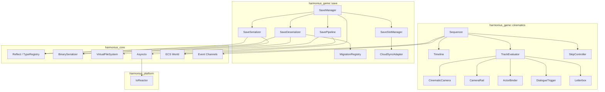
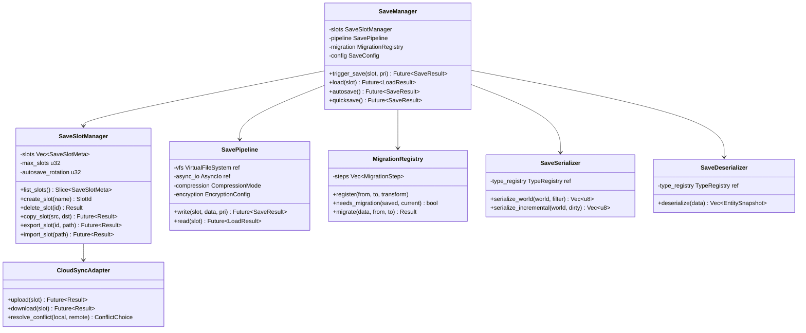
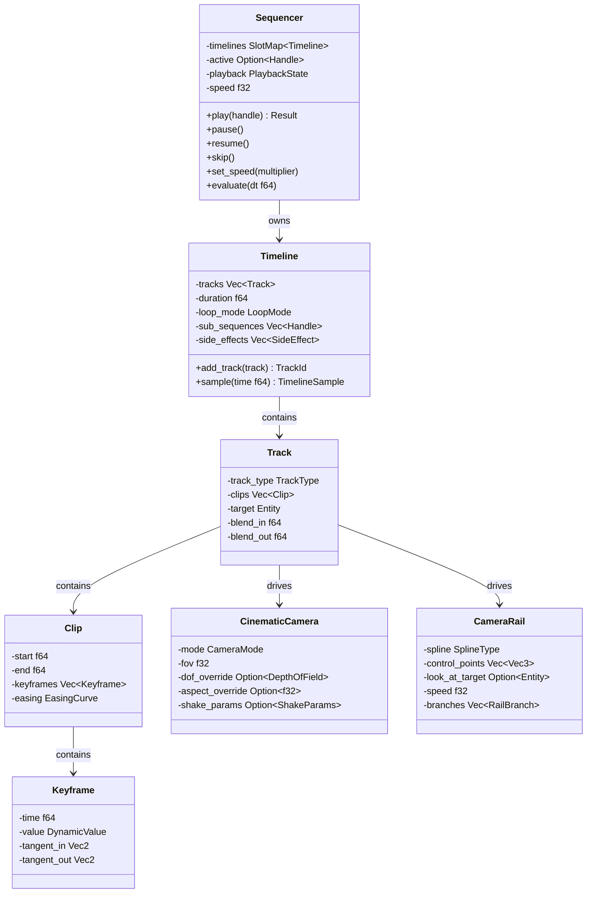
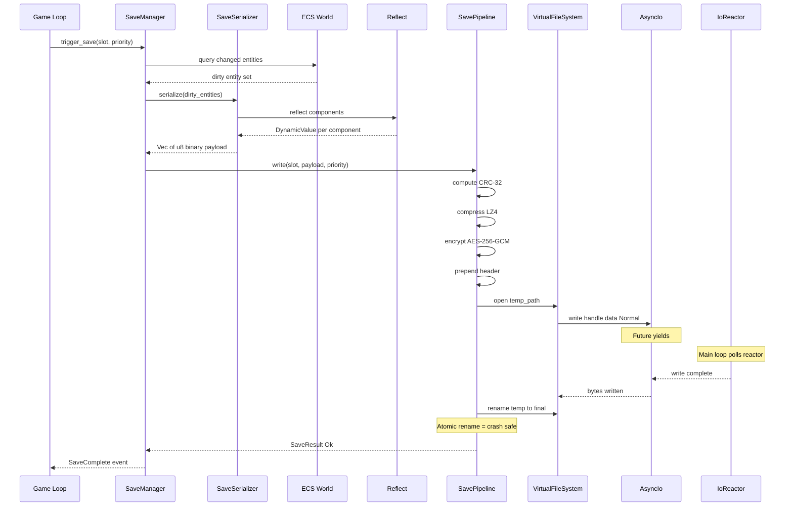
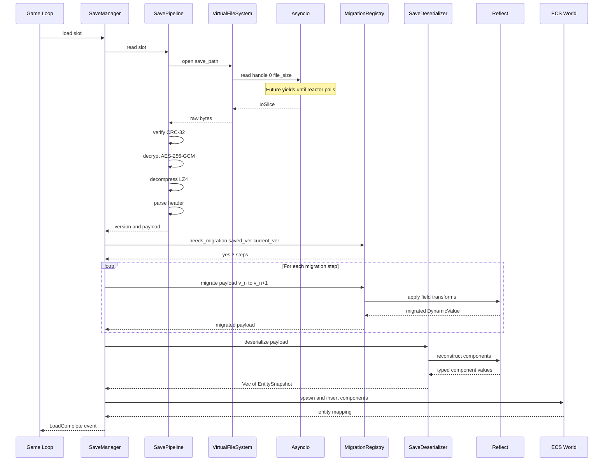
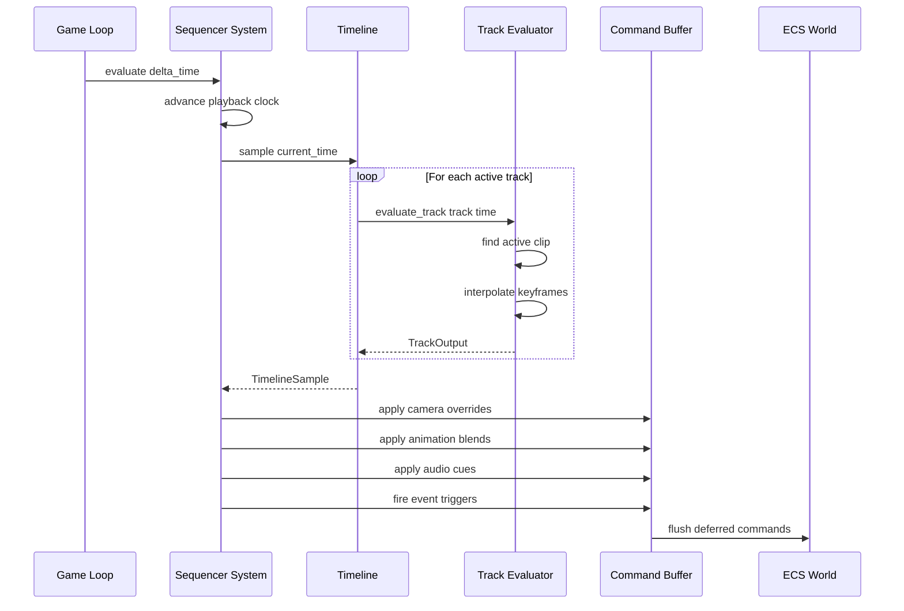
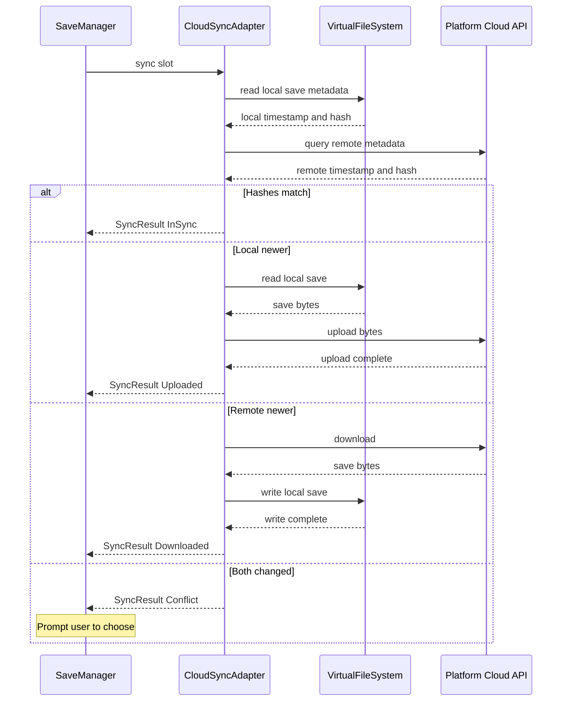
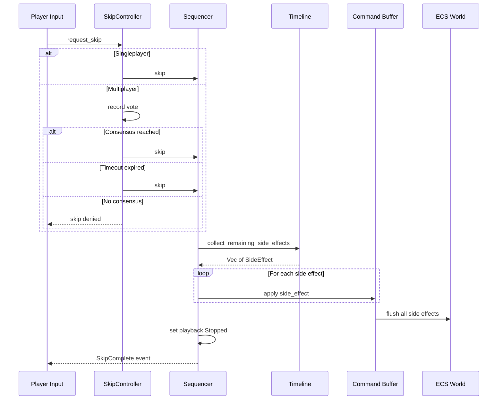
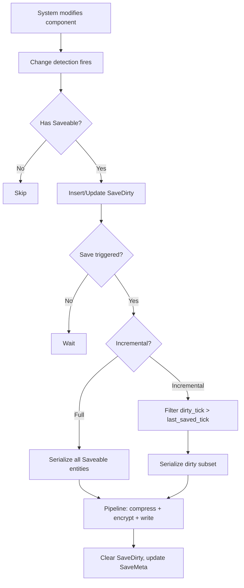

# Save System & Cinematics Design

## Requirements Trace

> **Canonical sources:** Features, requirements, and user
> stories are defined in [features/game-framework/](../../features/game-framework/),
> [requirements/game-framework/](../../requirements/game-framework/), and
> [user-stories/game-framework/](../../user-stories/game-framework/). The table
> below traces design elements to those definitions.

### Save System (F-13.3, R-13.3)

| Feature | Requirement | Description |
|---------|-------------|-------------|
| F-13.3.1 | R-13.3.1 | Reflection-based save serialization with partial dirty-field writes |
| F-13.3.2 | R-13.3.2 | Schema versioning with ordered migration transforms |
| F-13.3.3 | R-13.3.3 | Checkpoint and autosave with rotating slots |
| F-13.3.4 | R-13.3.4 | Save slot management with metadata and transactional operations |
| F-13.3.5 | R-13.3.5 | Cloud save sync with platform-native APIs |
| F-13.3.6 | R-13.3.6 | Async I/O pipeline with compression, encryption, checksumming |

### Cinematics (F-13.5, R-13.5)

| Feature | Requirement | Description |
|---------|-------------|-------------|
| F-13.5.1 | R-13.5.1 | Multi-track timeline sequencer with deterministic playback |
| F-13.5.2 | R-13.5.2 | Cinematic camera modes with blending and DOF overrides |
| F-13.5.3 | R-13.5.3 | Camera rails and splines with branching paths |
| F-13.5.4 | R-13.5.4 | Actor animation blending between gameplay and cinematic |
| F-13.5.5 | R-13.5.5 | Dialogue triggers with subtitles and lip-sync |
| F-13.5.6a | R-13.5.6a | Cutscene skip with side-effect application |
| F-13.5.6b | R-13.5.6b | Fast-forward playback at 2x and 4x |
| F-13.5.6c | R-13.5.6c | Cutscene pause and resume |
| F-13.5.7 | R-13.5.7 | Letterboxing with HUD suppression |

### Non-Functional Requirements

| Requirement | Target |
|-------------|--------|
| R-13.3.NF1 | Full save operation under 100 ms |
| R-13.3.NF2 | Compressed save file under 10 MB |
| R-13.3.NF3 | No data loss under crash at any point |
| R-13.5.NF1 | Sequencer evaluation under 0.5 ms for 32 tracks |
| R-13.5.NF2 | Skip side-effect application under 16.67 ms |

### Cross-Cutting Dependencies

| Dependency | Source | Consumed API |
|------------|--------|-------------|
| Reflect / TypeRegistry | F-1.3.1, F-1.3.8 | `Reflect` derive, `TypeRegistry`, `DynamicValue` |
| Binary serialization | F-1.4.1 | `BinarySerializer`, `BinaryDeserializer` |
| Schema versioning | F-1.4.4, F-1.4.5 | Schema stamps, `MigrationPipeline` |
| Scene serialization | F-1.4.7 | Full world serialize/deserialize |
| VirtualFileSystem | Memory/AsyncIo design | `VfsHandle`, async read/write |
| AsyncIo | Memory/AsyncIo design | `IoPriority`, `CancelToken` |
| IoReactor | Platform/Threading design | Controlled reactor poll point |
| ECS World | F-1.1 | Entity queries, components, command buffers |
| Event channels | F-1.5.1 | Typed double-buffered events |
| Animation state machine | F-9.4.1, F-9.4.4 | Animation layers, blend trees |
| Camera system | F-13.4 | Gameplay camera override |
| Dialogue trees | F-13.6.4 | Branching dialogue integration |

## Overview

This document designs two game-framework subsystems:

1. **Save System** -- reflection-driven world
   serialization, incremental dirty-entity saves,
   schema migration, an async I/O pipeline with
   compression/encryption/checksumming, save slot
   management, and cloud sync. All I/O is async
   via `IoReactor`. All state lives as ECS
   components.

2. **Cinematics** -- a timeline-based sequencer
   whose tracks drive camera, animation, audio,
   VFX, dialogue, and gameplay triggers. The
   sequencer state is 100% ECS components. Playback
   is deterministic regardless of framerate.
   Supports skip, pause, fast-forward, letterboxing,
   and a no-code visual editor.

Both subsystems consume the `Reflect` trait and
`TypeRegistry` for serialization and the `AsyncIo`
/ `VirtualFileSystem` layer for all disk operations.

## Architecture

### Module Boundaries



### File Layout

```
harmonius_game/
├── save/
│   ├── manager.rs        # SaveManager system,
│   │                     # SaveConfig resource
│   ├── serialize.rs      # SaveSerializer,
│   │                     # SaveDeserializer
│   ├── pipeline.rs       # SavePipeline (compress,
│   │                     # encrypt, checksum, I/O)
│   ├── migration.rs      # MigrationRegistry,
│   │                     # MigrationStep
│   ├── slots.rs          # SaveSlotManager,
│   │                     # SaveSlotMeta
│   ├── cloud.rs          # CloudSyncAdapter,
│   │                     # platform backends
│   ├── components.rs     # ECS components (Saveable,
│   │                     # DirtyMarker, etc.)
│   └── error.rs          # SaveError, LoadError
└── cinematics/
    ├── sequencer.rs      # Sequencer system,
    │                     # PlaybackState
    ├── timeline.rs       # Timeline, Track, Clip,
    │                     # Keyframe
    ├── camera.rs         # CinematicCamera,
    │                     # CameraRail, SplineType
    ├── actor.rs          # ActorBinder,
    │                     # BlendConfig
    ├── dialogue.rs       # DialogueTrigger,
    │                     # SubtitleEvent
    ├── skip.rs           # SkipController,
    │                     # SkipPolicy
    ├── letterbox.rs      # Letterbox, AspectRatio,
    │                     # CinematicOverlay
    ├── components.rs     # ECS components
    │                     # (SequencerState, etc.)
    └── error.rs          # SequencerError
```

### Save System Data Structures



### Sequencer Data Structures



## API Design

### Save System ECS Components

```rust
/// Marker component. Entities with this component
/// are included in save serialization. The filter
/// string selects which save contexts include this
/// entity (e.g., "character", "world", "instance").
#[derive(Component, Clone, Debug, Reflect)]
pub struct Saveable {
    /// Contexts this entity belongs to.
    pub contexts: SmallVec<[SaveContext; 2]>,
}

/// Save context identifier. Enables selective
/// serialization of subsets of the world.
#[derive(
    Clone, Copy, Debug, PartialEq, Eq, Hash,
    Reflect,
)]
pub enum SaveContext {
    Character,
    World,
    Instance,
    Settings,
}

/// Dirty-tracking component. Inserted by the
/// change-detection system when any saveable
/// component on this entity is modified.
/// Cleared after each successful save.
#[derive(Component, Clone, Debug, Reflect)]
pub struct SaveDirty {
    /// Tick at which the entity was last dirtied.
    pub dirty_tick: u64,
}

/// Per-entity save metadata. Tracks the last
/// save tick for incremental serialization.
#[derive(Component, Clone, Debug, Reflect)]
pub struct SaveMeta {
    pub last_saved_tick: u64,
    pub schema_version: SchemaVersion,
}

/// Schema version stamp. Embedded in every save
/// file header and per-entity metadata.
#[derive(
    Clone, Copy, Debug, PartialEq, Eq,
    PartialOrd, Ord, Hash, Reflect,
)]
pub struct SchemaVersion {
    pub major: u16,
    pub minor: u16,
    pub patch: u16,
}
```

### Save Slot Management

```rust
/// Unique save slot identifier.
#[derive(
    Clone, Copy, Debug, PartialEq, Eq, Hash,
    Reflect,
)]
pub struct SlotId(pub u32);

/// Metadata displayed in the save/load UI.
/// Stored alongside the save file as a separate
/// lightweight sidecar for fast enumeration.
#[derive(Clone, Debug, Reflect)]
pub struct SaveSlotMeta {
    pub id: SlotId,
    pub name: String,
    pub character_name: String,
    pub level: u32,
    pub playtime_seconds: u64,
    pub timestamp: u64,
    pub zone_name: String,
    /// PNG thumbnail bytes (compressed).
    pub thumbnail: Vec<u8>,
    pub schema_version: SchemaVersion,
    pub is_autosave: bool,
    /// Content hash for cloud conflict detection.
    pub content_hash: [u8; 32],
}

/// Save slot manager. Owns the slot registry and
/// enforces transactional operations.
pub struct SaveSlotManager {
    slots: Vec<SaveSlotMeta>,
    max_slots: u32,
    autosave_rotation: u32,
    autosave_cursor: u32,
    save_dir: String,
}

impl SaveSlotManager {
    pub fn new(
        max_slots: u32,
        autosave_rotation: u32,
        save_dir: &str,
    ) -> Self;

    /// List all slots with metadata.
    pub fn list_slots(&self) -> &[SaveSlotMeta];

    /// Allocate a new slot. Returns error if
    /// max_slots reached.
    pub fn create_slot(
        &mut self,
        name: &str,
    ) -> Result<SlotId, SaveError>;

    /// Delete a slot and its files. Transactional:
    /// metadata is removed only after file deletion
    /// succeeds.
    pub async fn delete_slot(
        &mut self,
        id: SlotId,
        vfs: &VirtualFileSystem,
    ) -> Result<(), SaveError>;

    /// Copy a slot. Uses atomic write so an
    /// interrupted copy leaves no partial file.
    pub async fn copy_slot(
        &mut self,
        src: SlotId,
        dst_name: &str,
        vfs: &VirtualFileSystem,
    ) -> Result<SlotId, SaveError>;

    /// Export a save to an external path.
    pub async fn export_slot(
        &self,
        id: SlotId,
        path: &str,
        vfs: &VirtualFileSystem,
    ) -> Result<(), SaveError>;

    /// Import a save from an external path.
    pub async fn import_slot(
        &mut self,
        path: &str,
        vfs: &VirtualFileSystem,
    ) -> Result<SlotId, SaveError>;

    /// Advance the autosave rotation cursor and
    /// return the slot to write.
    pub fn next_autosave_slot(&mut self) -> SlotId;

    /// Update metadata for a slot after a
    /// successful save.
    pub fn update_meta(
        &mut self,
        id: SlotId,
        meta: SaveSlotMeta,
    );
}
```

### Save Serializer

```rust
/// Snapshot of a single entity's saveable state.
pub struct EntitySnapshot {
    /// Stable entity identifier for remapping.
    pub stable_id: u64,
    /// Parent entity stable ID (if any).
    pub parent_id: Option<u64>,
    /// Component data as dynamic values.
    pub components: Vec<ComponentSnapshot>,
}

pub struct ComponentSnapshot {
    pub type_id: TypeId,
    pub schema_version: SchemaVersion,
    pub data: DynamicValue,
}

/// Serialize ECS world state via reflection.
pub struct SaveSerializer<'a> {
    type_registry: &'a TypeRegistry,
}

impl<'a> SaveSerializer<'a> {
    pub fn new(
        type_registry: &'a TypeRegistry,
    ) -> Self;

    /// Full-world serialization. Queries all
    /// entities with `Saveable` matching the
    /// given context and serializes their
    /// reflected components to binary.
    pub fn serialize_world(
        &self,
        world: &World,
        context: SaveContext,
    ) -> Result<Vec<u8>, SaveError>;

    /// Incremental serialization. Only serializes
    /// entities that have `SaveDirty` with a tick
    /// newer than their `SaveMeta::last_saved_tick`.
    pub fn serialize_incremental(
        &self,
        world: &World,
        context: SaveContext,
    ) -> Result<Vec<u8>, SaveError>;
}

/// Deserialize save data back into entity
/// snapshots ready for world insertion.
pub struct SaveDeserializer<'a> {
    type_registry: &'a TypeRegistry,
}

impl<'a> SaveDeserializer<'a> {
    pub fn new(
        type_registry: &'a TypeRegistry,
    ) -> Self;

    /// Deserialize binary save data into entity
    /// snapshots. Does not touch the world --
    /// the caller inserts snapshots via command
    /// buffers.
    pub fn deserialize(
        &self,
        data: &[u8],
    ) -> Result<Vec<EntitySnapshot>, LoadError>;
}
```

### Schema Migration

```rust
/// A single migration step from one schema
/// version to the next.
pub struct MigrationStep {
    pub from: SchemaVersion,
    pub to: SchemaVersion,
    pub transform: MigrationTransform,
}

/// Migration transform operates on dynamic values
/// so removed fields remain accessible.
pub enum MigrationTransform {
    /// Add a field with a default value.
    AddField {
        field_name: String,
        default: DynamicValue,
    },
    /// Remove a field.
    RemoveField {
        field_name: String,
    },
    /// Rename a field.
    RenameField {
        old_name: String,
        new_name: String,
    },
    /// Reshape via a custom function operating on
    /// the full DynamicValue.
    Custom {
        name: &'static str,
        func: fn(DynamicValue) -> DynamicValue,
    },
}

/// Registry of ordered migration steps.
pub struct MigrationRegistry {
    steps: Vec<MigrationStep>,
}

impl MigrationRegistry {
    pub fn new() -> Self;

    /// Register a migration step. Steps must be
    /// registered in order (v1->v2 before v2->v3).
    pub fn register(
        &mut self,
        step: MigrationStep,
    ) -> Result<(), MigrationError>;

    /// Check if data at `saved` needs migration
    /// to reach `current`.
    pub fn needs_migration(
        &self,
        saved: SchemaVersion,
        current: SchemaVersion,
    ) -> bool;

    /// Apply all migration steps from `saved` to
    /// `current` in order. Returns the migrated
    /// data or an error if any step fails.
    /// The original data is not modified on error.
    pub fn migrate(
        &self,
        data: DynamicValue,
        saved: SchemaVersion,
        current: SchemaVersion,
    ) -> Result<DynamicValue, MigrationError>;

    /// List the chain of steps from `saved` to
    /// `current`.
    pub fn migration_chain(
        &self,
        saved: SchemaVersion,
        current: SchemaVersion,
    ) -> Vec<&MigrationStep>;
}
```

### Save I/O Pipeline

```rust
/// Compression modes for save data.
#[derive(Clone, Copy, Debug, PartialEq, Eq)]
pub enum CompressionMode {
    /// LZ4 -- fast compression for local saves.
    Lz4,
    /// Zstd -- higher ratio for cloud uploads.
    Zstd { level: i32 },
    /// No compression.
    None,
}

/// Encryption configuration.
pub struct EncryptionConfig {
    /// AES-256-GCM key derivation from a
    /// platform-specific secret store.
    pub key_source: KeySource,
}

#[derive(Clone, Copy, Debug)]
pub enum KeySource {
    /// Platform credential store (Keychain,
    /// Credential Manager, Secret Service).
    PlatformKeystore,
    /// Derived from hardware identifier.
    HardwareBound,
}

/// Save file header. Prepended to every save.
#[derive(Clone, Debug, Reflect)]
pub struct SaveFileHeader {
    /// Magic bytes: "HMSV" (Harmonius Save).
    pub magic: [u8; 4],
    /// Header format version.
    pub header_version: u8,
    /// Schema version of the save data.
    pub schema_version: SchemaVersion,
    /// Compression mode used.
    pub compression: u8,
    /// Uncompressed data size in bytes.
    pub uncompressed_size: u64,
    /// CRC-32 of the uncompressed payload.
    pub checksum: u32,
    /// AES-256-GCM nonce (12 bytes).
    pub nonce: [u8; 12],
    /// AES-256-GCM authentication tag (16 bytes).
    pub auth_tag: [u8; 16],
    /// Whether this is an incremental save.
    pub is_incremental: bool,
    /// Timestamp (Unix epoch seconds).
    pub timestamp: u64,
}

/// The async I/O pipeline for save read/write.
/// All operations are non-blocking and route
/// through `AsyncIo` -> `IoReactor`.
pub struct SavePipeline {
    vfs: *const VirtualFileSystem,
    compression: CompressionMode,
    encryption: EncryptionConfig,
}

impl SavePipeline {
    pub fn new(
        vfs: &VirtualFileSystem,
        compression: CompressionMode,
        encryption: EncryptionConfig,
    ) -> Self;

    /// Write a save file. Pipeline:
    /// 1. Compute CRC-32 of raw payload
    /// 2. Compress (LZ4 or Zstd)
    /// 3. Encrypt (AES-256-GCM)
    /// 4. Prepend header
    /// 5. Async write to temp file
    /// 6. Atomic rename to final path
    ///
    /// Priority ordering: explicit saves take
    /// `IoPriority::Normal`, autosaves use
    /// `IoPriority::Background`.
    pub async fn write(
        &self,
        slot: SlotId,
        data: &[u8],
        priority: IoPriority,
    ) -> Result<(), SaveError>;

    /// Read a save file. Pipeline:
    /// 1. Async read entire file
    /// 2. Parse and validate header
    /// 3. Verify authentication tag
    /// 4. Decrypt (AES-256-GCM)
    /// 5. Decompress
    /// 6. Verify CRC-32
    /// Returns (schema_version, payload).
    pub async fn read(
        &self,
        slot: SlotId,
    ) -> Result<(SchemaVersion, Vec<u8>), LoadError>;
}
```

### Save Manager

```rust
/// Configuration for the save system.
#[derive(Clone, Debug, Reflect)]
pub struct SaveConfig {
    /// Maximum number of save slots.
    pub max_slots: u32,
    /// Number of rotating autosave slots.
    pub autosave_rotation: u32,
    /// Autosave interval in seconds. 0 = disabled.
    pub autosave_interval_secs: u32,
    /// Compression mode for local saves.
    pub local_compression: CompressionMode,
    /// Compression mode for cloud uploads.
    pub cloud_compression: CompressionMode,
    /// Enable cloud sync.
    pub cloud_sync_enabled: bool,
    /// Save directory (VFS virtual path).
    pub save_dir: String,
}

/// Events emitted by the save system.
#[derive(Clone, Debug)]
pub enum SaveEvent {
    SaveStarted { slot: SlotId },
    SaveComplete { slot: SlotId },
    SaveFailed { slot: SlotId, error: SaveError },
    LoadStarted { slot: SlotId },
    LoadComplete { slot: SlotId },
    LoadFailed { slot: SlotId, error: LoadError },
    AutosaveTriggered { slot: SlotId },
    CloudSyncStarted { slot: SlotId },
    CloudSyncComplete { slot: SlotId },
    CloudConflict {
        slot: SlotId,
        local_meta: SaveSlotMeta,
        remote_meta: SaveSlotMeta,
    },
}

/// The top-level save manager. Registered as an
/// ECS resource. Orchestrates serialization,
/// pipeline I/O, migration, and cloud sync.
pub struct SaveManager {
    slots: SaveSlotManager,
    pipeline: SavePipeline,
    migration: MigrationRegistry,
    config: SaveConfig,
    autosave_timer: f64,
    current_schema: SchemaVersion,
}

impl SaveManager {
    pub fn new(
        config: SaveConfig,
        vfs: &VirtualFileSystem,
        current_schema: SchemaVersion,
    ) -> Self;

    /// Trigger a save to the given slot.
    /// Serializes the world, runs the pipeline,
    /// and writes asynchronously.
    pub async fn trigger_save(
        &mut self,
        slot: SlotId,
        world: &World,
        type_registry: &TypeRegistry,
        context: SaveContext,
        priority: IoPriority,
    ) -> Result<(), SaveError>;

    /// Incremental save. Only serializes entities
    /// with SaveDirty newer than last save tick.
    pub async fn trigger_incremental_save(
        &mut self,
        slot: SlotId,
        world: &World,
        type_registry: &TypeRegistry,
        context: SaveContext,
        priority: IoPriority,
    ) -> Result<(), SaveError>;

    /// Load a save into the world. Reads the file,
    /// migrates if needed, deserializes, and spawns
    /// entities via command buffers.
    pub async fn load(
        &mut self,
        slot: SlotId,
        world: &mut World,
        type_registry: &TypeRegistry,
    ) -> Result<(), LoadError>;

    /// Autosave using the next rotating slot.
    pub async fn autosave(
        &mut self,
        world: &World,
        type_registry: &TypeRegistry,
    ) -> Result<(), SaveError>;

    /// Quicksave to a dedicated quicksave slot.
    pub async fn quicksave(
        &mut self,
        world: &World,
        type_registry: &TypeRegistry,
    ) -> Result<(), SaveError>;

    /// Checkpoint save triggered by a game event
    /// (zone transition, boss kill, quest milestone).
    pub async fn checkpoint_save(
        &mut self,
        world: &World,
        type_registry: &TypeRegistry,
        context: SaveContext,
    ) -> Result<(), SaveError>;

    /// Tick the autosave timer. Called each frame
    /// by the save system.
    pub fn tick_autosave(&mut self, dt: f64) -> bool;

    /// Access slot manager for UI operations.
    pub fn slots(&self) -> &SaveSlotManager;
    pub fn slots_mut(&mut self) -> &mut SaveSlotManager;
}
```

### Cloud Sync

```rust
/// Result of a cloud sync operation.
#[derive(Clone, Debug)]
pub enum SyncResult {
    /// Local and remote are identical.
    InSync,
    /// Local was newer; uploaded to cloud.
    Uploaded,
    /// Remote was newer; downloaded to local.
    Downloaded,
    /// Both changed; user must resolve.
    Conflict {
        local: SaveSlotMeta,
        remote: SaveSlotMeta,
    },
}

/// User's resolution of a cloud conflict.
#[derive(Clone, Copy, Debug)]
pub enum ConflictChoice {
    KeepLocal,
    KeepRemote,
}

/// Platform cloud storage backend. Selected at
/// compile time via cfg attributes.
pub struct CloudSyncAdapter {
    platform: CloudPlatform,
}

#[derive(Clone, Copy, Debug)]
pub enum CloudPlatform {
    Steam,
    PlayStation,
    Xbox,
    ICloud,
    EpicOnlineServices,
    None,
}

impl CloudSyncAdapter {
    pub fn new(platform: CloudPlatform) -> Self;

    /// Sync a save slot with cloud storage.
    /// Fully async -- never blocks the game thread.
    pub async fn sync(
        &self,
        slot: SlotId,
        local_meta: &SaveSlotMeta,
        vfs: &VirtualFileSystem,
    ) -> Result<SyncResult, SaveError>;

    /// Upload a save to cloud.
    pub async fn upload(
        &self,
        slot: SlotId,
        vfs: &VirtualFileSystem,
    ) -> Result<(), SaveError>;

    /// Download a save from cloud.
    pub async fn download(
        &self,
        slot: SlotId,
        vfs: &VirtualFileSystem,
    ) -> Result<(), SaveError>;
}
```

### Save Error Types

```rust
pub enum SaveError {
    /// Serialization failed for a component.
    SerializationFailed {
        entity: u64,
        type_name: &'static str,
        detail: String,
    },
    /// I/O error during write.
    IoFailed(IoError),
    /// Encryption key unavailable.
    EncryptionKeyUnavailable,
    /// Maximum slots reached.
    SlotLimitReached { max: u32 },
    /// Slot not found.
    SlotNotFound(SlotId),
    /// Cloud upload failed.
    CloudUploadFailed { detail: String },
}

pub enum LoadError {
    /// File not found for slot.
    FileNotFound(SlotId),
    /// I/O error during read.
    IoFailed(IoError),
    /// CRC-32 mismatch.
    ChecksumMismatch {
        expected: u32,
        actual: u32,
    },
    /// Decryption failed (wrong key or tampered).
    DecryptionFailed,
    /// Invalid or corrupt header.
    InvalidHeader,
    /// Migration failed.
    MigrationFailed {
        from: SchemaVersion,
        to: SchemaVersion,
        detail: String,
    },
    /// Deserialization failed.
    DeserializationFailed { detail: String },
}

pub enum MigrationError {
    /// No migration path from `from` to `to`.
    NoPath {
        from: SchemaVersion,
        to: SchemaVersion,
    },
    /// A migration step failed.
    StepFailed {
        step_from: SchemaVersion,
        step_to: SchemaVersion,
        detail: String,
    },
    /// Steps registered out of order.
    InvalidOrder {
        expected: SchemaVersion,
        got: SchemaVersion,
    },
}
```

### Cinematics ECS Components

```rust
/// Marker component for entities that act as
/// sequencer instances. The sequencer system
/// queries these each frame.
#[derive(Component, Clone, Debug, Reflect)]
pub struct SequencerState {
    /// Handle to the active timeline.
    pub timeline: Handle<Timeline>,
    /// Current playback position in seconds.
    pub position: f64,
    /// Playback state (playing, paused, stopped).
    pub playback: PlaybackState,
    /// Playback speed multiplier.
    pub speed: f32,
}

#[derive(
    Clone, Copy, Debug, PartialEq, Eq, Reflect,
)]
pub enum PlaybackState {
    Stopped,
    Playing,
    Paused,
}

/// Component attached to entities driven by a
/// cinematic track. Stores the blend state.
#[derive(Component, Clone, Debug, Reflect)]
pub struct CinematicActor {
    /// The sequencer entity driving this actor.
    pub sequencer: Entity,
    /// Current blend weight (0.0 = gameplay,
    /// 1.0 = cinematic).
    pub blend_weight: f32,
    /// Blend-in duration in seconds.
    pub blend_in_duration: f32,
    /// Blend-out duration in seconds.
    pub blend_out_duration: f32,
    /// Partial body mask (if any).
    pub body_mask: Option<BodyMask>,
}

/// Bitmask for partial-body cinematic overrides.
#[derive(
    Clone, Copy, Debug, PartialEq, Eq, Reflect,
)]
pub enum BodyMask {
    FullBody,
    UpperBodyOnly,
    LowerBodyOnly,
    Custom(u64),
}

/// Component for cinematic camera override.
/// When present, this entity's camera settings
/// override the gameplay camera.
#[derive(Component, Clone, Debug, Reflect)]
pub struct CinematicCameraOverride {
    pub mode: CameraMode,
    pub fov: f32,
    pub dof: Option<DepthOfField>,
    pub aspect_ratio: Option<f32>,
    pub shake: Option<ShakeParams>,
    /// Transition curve from previous camera.
    pub transition: TransitionCurve,
    pub transition_duration: f32,
}

#[derive(Clone, Copy, Debug, Reflect)]
pub enum CameraMode {
    Fixed { position: Vec3, rotation: Quat },
    Tracking {
        target: Entity,
        offset: Vec3,
    },
    Orbit {
        target: Entity,
        radius: f32,
        speed: f32,
    },
    DollyZoom {
        target: Entity,
        start_fov: f32,
        end_fov: f32,
    },
    Handheld {
        base_position: Vec3,
        intensity: f32,
        frequency: f32,
    },
    Rail { rail: Entity },
}

/// Depth-of-field override parameters.
#[derive(Clone, Copy, Debug, Reflect)]
pub struct DepthOfField {
    pub focal_distance: f32,
    pub focal_length: f32,
    pub aperture: f32,
}

/// Handheld camera shake parameters.
#[derive(Clone, Copy, Debug, Reflect)]
pub struct ShakeParams {
    pub intensity: f32,
    pub frequency: f32,
    pub decay: f32,
}

/// Easing curve for camera transitions.
#[derive(Clone, Copy, Debug, Reflect)]
pub enum TransitionCurve {
    Linear,
    EaseIn,
    EaseOut,
    EaseInOut,
    CubicBezier {
        p1: Vec2,
        p2: Vec2,
    },
}

/// Component for letterbox rendering during
/// cinematics.
#[derive(Component, Clone, Debug, Reflect)]
pub struct LetterboxState {
    pub target_aspect: AspectRatio,
    pub current_coverage: f32,
    pub transition_speed: f32,
    pub vignette_intensity: f32,
    pub film_grain_intensity: f32,
    pub suppress_hud: bool,
    pub suppress_input: bool,
}

#[derive(Clone, Copy, Debug, Reflect)]
pub enum AspectRatio {
    /// 2.39:1 -- anamorphic widescreen.
    Anamorphic,
    /// 2.00:1 -- Univisium.
    Univisium,
    /// 1.85:1 -- standard widescreen.
    Widescreen,
    /// Custom ratio.
    Custom(f32),
}
```

### Sequencer and Timeline

```rust
/// Unique track identifier within a timeline.
#[derive(
    Clone, Copy, Debug, PartialEq, Eq, Hash,
)]
pub struct TrackId(pub u32);

/// Track types supported by the sequencer.
#[derive(Clone, Copy, Debug, PartialEq, Eq, Reflect)]
pub enum TrackType {
    Camera,
    Animation,
    Audio,
    Vfx,
    Lighting,
    GameplayTrigger,
    UiOverlay,
    Dialogue,
}

/// Loop behavior for a timeline.
#[derive(Clone, Copy, Debug, PartialEq, Eq, Reflect)]
pub enum LoopMode {
    /// Play once and stop.
    Once,
    /// Loop indefinitely.
    Loop,
    /// Ping-pong (forward then reverse).
    PingPong,
}

/// A side effect that fires at a timeline position.
/// Collected and applied on skip.
#[derive(Clone, Debug, Reflect)]
pub struct SideEffect {
    /// Timeline position where this effect fires.
    pub time: f64,
    /// The effect payload.
    pub effect: SideEffectPayload,
    /// Whether this effect has already fired
    /// during normal playback.
    pub fired: bool,
}

#[derive(Clone, Debug, Reflect)]
pub enum SideEffectPayload {
    QuestUpdate { quest_id: u64, state: u32 },
    ItemGrant { item_id: u64, count: u32 },
    PhaseTransition { phase_id: u64 },
    EventEmit { event_name: String },
}

/// A timeline containing ordered tracks and
/// sub-sequence references.
pub struct Timeline {
    tracks: Vec<Track>,
    duration: f64,
    loop_mode: LoopMode,
    sub_sequences: Vec<Handle<Timeline>>,
    side_effects: Vec<SideEffect>,
}

impl Timeline {
    pub fn new(duration: f64) -> Self;

    /// Add a track. Returns its ID.
    pub fn add_track(
        &mut self,
        track: Track,
    ) -> TrackId;

    /// Remove a track by ID.
    pub fn remove_track(
        &mut self,
        id: TrackId,
    ) -> Result<Track, SequencerError>;

    /// Add a nested sub-sequence.
    pub fn add_sub_sequence(
        &mut self,
        handle: Handle<Timeline>,
    );

    /// Register a gameplay side effect at a
    /// specific time. Collected on skip.
    pub fn add_side_effect(
        &mut self,
        effect: SideEffect,
    );

    /// Sample all tracks at the given time.
    /// Returns per-track outputs for the
    /// sequencer system to apply.
    pub fn sample(
        &self,
        time: f64,
    ) -> TimelineSample;

    /// Collect all unfired side effects from
    /// `current_time` to end. Used on skip.
    pub fn collect_remaining_side_effects(
        &self,
        current_time: f64,
    ) -> Vec<&SideEffect>;
}

/// A single track within a timeline.
pub struct Track {
    pub track_type: TrackType,
    pub target: Entity,
    pub clips: Vec<Clip>,
    pub blend_in: f64,
    pub blend_out: f64,
    pub muted: bool,
}

/// A clip is a contiguous segment within a track.
pub struct Clip {
    pub start: f64,
    pub end: f64,
    pub keyframes: Vec<Keyframe>,
    pub easing: EasingCurve,
}

impl Clip {
    /// Evaluate this clip at a local time within
    /// [start, end]. Interpolates between the
    /// surrounding keyframes using the easing curve.
    pub fn evaluate(&self, time: f64) -> DynamicValue;
}

/// A keyframe with tangent handles for Bezier
/// interpolation.
pub struct Keyframe {
    pub time: f64,
    pub value: DynamicValue,
    pub tangent_in: Vec2,
    pub tangent_out: Vec2,
}

/// Easing curve for clip interpolation.
#[derive(Clone, Copy, Debug, Reflect)]
pub enum EasingCurve {
    Linear,
    EaseIn,
    EaseOut,
    EaseInOut,
    CubicBezier { p1: Vec2, p2: Vec2 },
    Step,
}

/// Result of sampling a timeline at a point.
pub struct TimelineSample {
    pub track_outputs: Vec<TrackOutput>,
}

pub struct TrackOutput {
    pub track_id: TrackId,
    pub track_type: TrackType,
    pub target: Entity,
    pub value: DynamicValue,
    pub blend_weight: f32,
}
```

### Camera Rails and Splines

```rust
/// Spline type for camera rails.
#[derive(Clone, Debug, Reflect)]
pub enum SplineType {
    CatmullRom {
        tension: f32,
    },
    CubicBezier,
}

/// A camera rail placed in the world.
/// Component on a rail entity.
#[derive(Component, Clone, Debug, Reflect)]
pub struct CameraRailComponent {
    pub spline: SplineType,
    pub control_points: Vec<Vec3>,
    pub look_at_target: Option<Entity>,
    pub speed: f32,
    pub acceleration: f32,
}

/// Branching rail configuration. Each branch
/// is gated by a gameplay condition.
#[derive(Clone, Debug, Reflect)]
pub struct RailBranch {
    pub condition_key: String,
    pub condition_value: DynamicValue,
    pub control_points: Vec<Vec3>,
}

impl CameraRailComponent {
    /// Evaluate the spline position at parameter
    /// t in [0, 1].
    pub fn evaluate(&self, t: f32) -> Vec3;

    /// Evaluate with look-at rotation.
    pub fn evaluate_with_look_at(
        &self,
        t: f32,
        target_pos: Vec3,
    ) -> (Vec3, Quat);

    /// Select the active branch based on gameplay
    /// conditions.
    pub fn select_branch(
        &self,
        conditions: &dyn Fn(&str) -> DynamicValue,
    ) -> &[Vec3];
}
```

### Dialogue Integration

```rust
/// A dialogue cue placed on a timeline track.
#[derive(Clone, Debug, Reflect)]
pub struct DialogueCue {
    /// Timeline position where dialogue triggers.
    pub time: f64,
    /// Duration of the dialogue line.
    pub duration: f64,
    /// Voice-over asset reference.
    pub voice_asset: Option<Handle<AudioAsset>>,
    /// Localization key for subtitle text.
    pub subtitle_key: String,
    /// Speaker name localization key.
    pub speaker_key: String,
    /// Lip-sync animation reference.
    pub lip_sync: Option<Handle<AnimationClip>>,
}

/// Event emitted when a dialogue cue fires.
#[derive(Clone, Debug)]
pub struct DialogueEvent {
    pub cue: DialogueCue,
    pub sequencer: Entity,
    pub actor: Entity,
}

/// Event emitted for subtitle display.
#[derive(Clone, Debug)]
pub struct SubtitleEvent {
    pub text_key: String,
    pub speaker_key: String,
    pub duration: f64,
    pub show: bool,
}
```

### Skip and Playback Control

```rust
/// Skip behavior configuration for multiplayer.
#[derive(Clone, Copy, Debug, PartialEq, Eq, Reflect)]
pub enum SkipPolicy {
    /// Any player can skip immediately.
    AnyPlayer,
    /// Host/leader only.
    HostOnly,
    /// Unanimous consent required.
    Unanimous,
    /// Majority vote with timeout.
    MajorityVote { timeout_secs: u32 },
}

/// Skip controller. Manages skip requests,
/// multiplayer voting, and side-effect collection.
pub struct SkipController {
    pub policy: SkipPolicy,
    votes: Vec<(Entity, bool)>,
    vote_start_time: Option<f64>,
}

impl SkipController {
    pub fn new(policy: SkipPolicy) -> Self;

    /// Request a skip. In singleplayer, skips
    /// immediately. In multiplayer, registers a
    /// vote and checks consensus.
    pub fn request_skip(
        &mut self,
        requester: Entity,
        player_count: u32,
        current_time: f64,
    ) -> SkipDecision;

    /// Check if a majority-vote timeout has
    /// expired.
    pub fn check_timeout(
        &self,
        current_time: f64,
    ) -> bool;

    pub fn reset(&mut self);
}

#[derive(Clone, Copy, Debug)]
pub enum SkipDecision {
    /// Skip approved. Apply side effects.
    Approved,
    /// Vote registered, waiting for consensus.
    Pending { votes_for: u32, votes_needed: u32 },
    /// Skip denied (no consensus, not host, etc.).
    Denied,
}

/// Sequencer-level error types.
pub enum SequencerError {
    /// Timeline not found.
    TimelineNotFound(Handle<Timeline>),
    /// Track not found in timeline.
    TrackNotFound(TrackId),
    /// Already playing.
    AlreadyPlaying,
    /// Not playing (cannot pause/skip).
    NotPlaying,
    /// Invalid playback speed.
    InvalidSpeed(f32),
}
```

### Sequencer System

```rust
/// The sequencer ECS system. Runs each frame,
/// evaluates active timelines, and writes results
/// to the world via command buffers.
pub struct SequencerSystem;

impl SequencerSystem {
    /// Evaluate all active sequencers. Called each
    /// frame as an ECS system.
    ///
    /// For each entity with `SequencerState`:
    /// 1. Advance the playback clock by dt * speed
    /// 2. Sample the timeline at current position
    /// 3. Apply track outputs via command buffers:
    ///    - Camera: insert CinematicCameraOverride
    ///    - Animation: update CinematicActor blend
    ///    - Audio: emit audio play/stop events
    ///    - VFX: emit VFX spawn/stop events
    ///    - Dialogue: emit DialogueEvent
    ///    - Gameplay: emit SideEffect events
    ///    - UI: update LetterboxState
    /// 4. Mark fired side effects
    /// 5. If past timeline duration, stop or loop
    pub fn evaluate(
        world: &mut World,
        dt: f64,
    );

    /// Handle a skip request. Collects unfired
    /// side effects and applies them all within
    /// one frame.
    pub fn handle_skip(
        world: &mut World,
        sequencer: Entity,
    ) -> Result<(), SequencerError>;

    /// Handle pause. Freezes all track state at
    /// the current frame.
    pub fn handle_pause(
        world: &mut World,
        sequencer: Entity,
    ) -> Result<(), SequencerError>;

    /// Handle resume. Resumes from the exact
    /// frame where paused.
    pub fn handle_resume(
        world: &mut World,
        sequencer: Entity,
    ) -> Result<(), SequencerError>;
}
```

## Data Flow

### Save Pipeline Write Flow



### Save Load and Migration Flow



### Sequencer Evaluation Flow



### Cloud Save Sync Flow



### Cutscene Skip Flow



### Incremental Save Decision

The save system uses ECS change detection to
identify dirty entities. Each frame:

1. Systems modify components normally
2. Change detection marks entities with `Changed<T>`
3. The save dirty-tracking system queries entities
   that have both `Saveable` and any `Changed<T>`
4. It inserts or updates `SaveDirty` with the
   current tick
5. On save, the serializer queries entities where
   `SaveDirty.dirty_tick > SaveMeta.last_saved_tick`
6. After save, `SaveDirty` is cleared and
   `SaveMeta.last_saved_tick` is updated



## Platform Considerations

### Save File I/O Backend

All save I/O routes through the `AsyncIo` and
`VirtualFileSystem` layers defined in
[memory-async-io.md](../core-runtime/memory-async-io.md).
Platform backends are selected at compile time.

| Operation | Windows (IOCP) | macOS (GCD) | Linux (io_uring) |
|-----------|---------------|-------------|-----------------|
| Save write | `WriteFile` + `OVERLAPPED` | `dispatch_io_write` via cxx.rs | `io_uring_prep_write` |
| Save read | `ReadFile` + `OVERLAPPED` | `dispatch_io_read` via cxx.rs | `io_uring_prep_read` |
| Atomic rename | `MoveFileEx` + `MOVEFILE_REPLACE_EXISTING` | `renameat2` / `rename` | `renameat2` + `RENAME_NOREPLACE` fallback to `rename` |
| Temp file | `GetTempFileName` | `mkstemp` | `mkstemp` |

### Save Directory Locations

| Platform | Default Save Path |
|----------|------------------|
| Windows | `%APPDATA%/Harmonius/<game>/saves/` |
| macOS | `~/Library/Application Support/Harmonius/<game>/saves/` |
| Linux | `$XDG_DATA_HOME/harmonius/<game>/saves/` |
| PlayStation | Platform TRC-mandated save directory |
| Xbox | Connected Storage container |
| Switch | Save data via nn::fs |
| iOS | `Documents/` (iCloud-synced) |
| Android | Internal storage via Storage Access Framework |

### Cloud Platform APIs

| Platform | API | Async Method |
|----------|-----|-------------|
| Steam | ISteamRemoteStorage | Callback-wrapped as Future |
| PlayStation | Save Data Library | NP async calls wrapped |
| Xbox | Connected Storage | XAsync wrapped |
| iCloud | NSFileManager + NSUbiquitousKeyValueStore | GCD via cxx.rs |
| Epic | EOS Player Data Storage | Callback-wrapped as Future |

### Cinematic Camera -- Platform Adaptation

Camera shake uses platform-appropriate noise
generation. No platform-specific rendering code;
all camera parameters are written as ECS components
consumed by the rendering pipeline.

### Proposed Dependencies

| Crate | Purpose | Justification |
|-------|---------|---------------|
| `lz4_flex` | LZ4 compression for local saves | Pure Rust, no C dependency, fast |
| `zstd` | Zstd compression for cloud uploads | Mature, wide adoption, better ratio |
| `aes-gcm` | AES-256-GCM encryption | Pure Rust, RustCrypto ecosystem |
| `crc32fast` | CRC-32 checksumming | SIMD-accelerated, widely used |

Note: `blake3` (for content hashing) is already
approved in
[memory-async-io.md](../core-runtime/memory-async-io.md).

## Test Plan

### Unit Tests -- Save System

| Test | Req | Description |
|------|-----|-------------|
| `test_serialize_full_character` | R-13.3.1 | Create entity with 500 inventory items, 50 quests, 200 achievements. Serialize to binary, deserialize, verify all fields match via `Reflect::reflect_partial_eq`. |
| `test_serialize_dirty_only` | R-13.3.1 | Modify 1 field on 1 of 100 entities. Incremental serialize. Verify only 1 entity serialized. Verify output size < 1% of full serialize. |
| `test_reflect_auto_serialize` | R-13.3.1 | Add a new `#[derive(Reflect)]` component. Verify it serializes without custom code. |
| `test_migration_v1_to_v3` | R-13.3.2 | Create v1 save. Register v1->v2 (add field) and v2->v3 (rename field). Load v1 save, verify v3 data correct. |
| `test_migration_failure_preserves_original` | R-13.3.2 | Register a failing migration step. Attempt migration. Verify original DynamicValue unchanged. |
| `test_migration_no_path` | R-13.3.2 | Request migration from v1 to v5 with only v1->v2 registered. Verify `MigrationError::NoPath`. |
| `test_checkpoint_trigger` | R-13.3.3 | Emit a zone-transition event. Verify autosave triggered. Verify correct rotating slot used. |
| `test_autosave_rotation` | R-13.3.3 | Trigger N+1 autosaves with N rotating slots. Verify oldest slot is overwritten. |
| `test_autosave_crash_midwrite` | R-13.3.3 | Interrupt save pipeline after temp file write but before rename. Verify previous slot intact. |
| `test_slot_metadata` | R-13.3.4 | Create slot, save, verify metadata fields (name, level, playtime, timestamp, zone, thumbnail hash). |
| `test_slot_copy_transactional` | R-13.3.4 | Copy a slot. Interrupt mid-copy. Verify no partial copy file exists. |
| `test_slot_delete` | R-13.3.4 | Delete a slot. Verify file removed and metadata cleared. |
| `test_slot_export_import` | R-13.3.4 | Export a slot, delete it, import it back. Verify data identical. |
| `test_pipeline_compress_encrypt_checksum` | R-13.3.6 | Write through pipeline. Read back. Verify data matches. Corrupt one byte; verify CRC-32 detects it. |
| `test_pipeline_atomic_rename` | R-13.3.6 | Kill process after temp write, before rename. Verify no corrupt final file. |
| `test_pipeline_priority_ordering` | R-13.3.6 | Submit autosave (Background) then explicit save (Normal). Verify explicit save completes first. |
| `test_pipeline_lz4_vs_zstd` | R-13.3.6 | Compress same payload with both. Verify LZ4 faster, Zstd smaller. |
| `test_encryption_wrong_key` | R-13.3.6 | Encrypt with key A, decrypt with key B. Verify `LoadError::DecryptionFailed`. |

### Unit Tests -- Cinematics

| Test | Req | Description |
|------|-----|-------------|
| `test_timeline_deterministic_30_60_120` | R-13.5.1 | Play timeline at 30, 60, and 120 fps. Sample at t=1.0s, t=2.5s, t=5.0s. Verify identical track outputs at all framerates. |
| `test_nested_sub_sequence` | R-13.5.1 | Parent sequence with child sub-sequence at t=2.0s. Verify child plays at correct position within parent. |
| `test_keyframe_interpolation` | R-13.5.1 | Clip with 3 keyframes (0.0, 0.5, 1.0). Sample at 0.25 and 0.75. Verify correct Bezier interpolation. |
| `test_camera_mode_fixed` | R-13.5.2 | Fixed camera shot. Verify position and rotation match authored values exactly. |
| `test_camera_mode_tracking` | R-13.5.2 | Tracking shot with moving target. Verify camera follows with offset. |
| `test_camera_blend_transition` | R-13.5.2 | Transition from fixed to tracking with EaseInOut. Sample at 50% transition. Verify blended values. |
| `test_camera_dof_override` | R-13.5.2 | Set DOF override on shot. Verify `DepthOfField` component values applied. |
| `test_spline_catmull_rom` | R-13.5.3 | 4 control points, evaluate at t=0.5. Verify position on Catmull-Rom curve. |
| `test_spline_branching` | R-13.5.3 | 2 branches gated on condition. Toggle condition. Verify correct branch selected. |
| `test_actor_blend_in` | R-13.5.4 | Start cutscene on moving actor. Sample blend at 50% duration. Verify weight = 0.5. |
| `test_actor_blend_out` | R-13.5.4 | End cutscene. Verify blend-out restores gameplay animation state. |
| `test_actor_partial_body` | R-13.5.4 | Upper body override. Verify lower body continues locomotion (blend weight 0.0 for lower). |
| `test_dialogue_cue_timing` | R-13.5.5 | Place dialogue cue at t=3.0s. Play to t=3.0s. Verify `DialogueEvent` emitted. |
| `test_subtitle_localization` | R-13.5.5 | Dialogue cue with localization key. Verify `SubtitleEvent` carries correct key. |
| `test_skip_applies_all_effects` | R-13.5.6a | Timeline with 5 side effects. Skip at t=1.0s. Verify all 5 applied. |
| `test_skip_multiplayer_unanimous` | R-13.5.6a | 4 players, Unanimous policy. 3 vote skip. Verify `SkipDecision::Pending`. 4th votes. Verify `Approved`. |
| `test_skip_multiplayer_timeout` | R-13.5.6a | MajorityVote policy, 3 of 4 vote. Timeout expires. Verify skip approved. |
| `test_fast_forward_2x` | R-13.5.6b | Play at 2x speed. Verify clock advances at 2x. Verify all triggers still fire. |
| `test_fast_forward_4x_trigger_order` | R-13.5.6b | 10 triggers across 10 seconds. Play at 4x. Verify all 10 fire in order. |
| `test_pause_freeze` | R-13.5.6c | Pause at t=2.5s. Wait 100 frames. Verify position still 2.5s. |
| `test_resume_exact_frame` | R-13.5.6c | Pause at t=2.5s, resume. Verify next frame is t=2.5s + dt. |
| `test_letterbox_aspect_ratios` | R-13.5.7 | Apply Anamorphic (2.39:1). Verify correct bar height calculation. |
| `test_letterbox_hides_hud` | R-13.5.7 | Activate letterbox. Verify `suppress_hud = true` and `suppress_input = true`. |

### Integration Tests

| Test | Req | Description |
|------|-----|-------------|
| `test_save_load_roundtrip` | R-13.3.1, R-13.3.6 | Full save-load cycle: serialize world, pipeline write, pipeline read, migrate (no-op), deserialize, spawn. Verify world state matches. |
| `test_save_no_frame_drop` | R-13.3.NF1 | Trigger save during 60fps gameplay. Verify zero frames exceed 16.67 ms. |
| `test_save_under_100ms` | R-13.3.NF1 | 500 inventory items, 50 quests, 200 achievements. Measure p99 save time < 100 ms. |
| `test_save_file_under_10mb` | R-13.3.NF2 | Max-progression character. Compress. Verify output < 10 MB. |
| `test_crash_safety_10_points` | R-13.3.NF3 | Inject process kill at 10 random pipeline stages. Verify no data loss. |
| `test_cloud_sync_upload` | R-13.3.5 | Save locally. Upload. Verify remote hash matches. |
| `test_cloud_sync_conflict` | R-13.3.5 | Modify both local and remote. Sync. Verify `SyncResult::Conflict`. |
| `test_cloud_sync_no_block` | R-13.3.5 | Upload during gameplay. Verify game thread never blocks > 1 ms. |
| `test_sequencer_32_tracks` | R-13.5.NF1 | 32 simultaneous tracks. Measure per-frame evaluation < 0.5 ms. |
| `test_skip_side_effects_under_1_frame` | R-13.5.NF2 | 20 side effects. Skip. Verify total application < 16.67 ms. |
| `test_cinematic_end_to_end` | R-13.5.1--R-13.5.7 | Play a sequence with camera, animation, audio, dialogue, and letterbox tracks. Verify correct output. Skip. Verify all effects apply. |

### Benchmarks

| Benchmark | Target | Source |
|-----------|--------|--------|
| Full save (max character) | < 100 ms p99 | R-13.3.NF1 |
| Incremental save (10 dirty) | < 10 ms p99 | R-13.3.1 |
| LZ4 compress 5 MB | < 5 ms | R-13.3.6 |
| AES-256-GCM encrypt 5 MB | < 10 ms | R-13.3.6 |
| Save file size (max char) | < 10 MB | R-13.3.NF2 |
| Sequencer eval (32 tracks) | < 0.5 ms | R-13.5.NF1 |
| Skip effect application (20) | < 16.67 ms | R-13.5.NF2 |
| Keyframe interpolation (1000) | < 0.1 ms | R-13.5.1 |

## Open Questions

1. **Incremental save merge strategy** -- When
   loading, should incremental save files be
   merged with the most recent full save at load
   time, or should the save system periodically
   compact incrementals into a full save? Periodic
   compaction reduces load time but adds background
   I/O.

2. **Save thumbnail capture timing** -- Thumbnails
   require a framebuffer readback. Should this
   happen synchronously at save time (adds latency),
   or should the system continuously maintain a
   low-res thumbnail buffer that is sampled on save
   (adds per-frame cost)?

3. **Migration test data management** -- Should
   the test suite maintain a repository of save
   files from every schema version for regression
   testing, or generate them on the fly from
   versioned test fixtures?

4. **Sequencer sub-sequence ownership** -- Should
   sub-sequences be value-owned (cloned into the
   parent timeline) or referenced by `Handle`
   (shared, potential lifetime issues)? Handle-based
   sharing reduces memory but complicates timeline
   editing.

5. **Actor blend mask granularity** -- The current
   design uses a simple enum (`UpperBodyOnly`,
   `LowerBodyOnly`, `Custom(u64)`). Should this be
   replaced by a per-bone weight map for finer
   control? Per-bone maps are more flexible but
   more expensive to evaluate.

6. **Cinematic audio during fast-forward** -- At
   2x/4x speed, should audio be pitch-shifted,
   played at normal speed with visual desync, or
   muted? Each approach has different UX tradeoffs.
   This should be configurable per-sequence.

7. **Cloud save quota management** -- Different
   platforms have different cloud storage quotas
   (Steam: 1 GB default, iCloud: varies). Should
   the engine enforce a maximum save count or size
   per platform, or let the platform API reject
   uploads that exceed quota?
