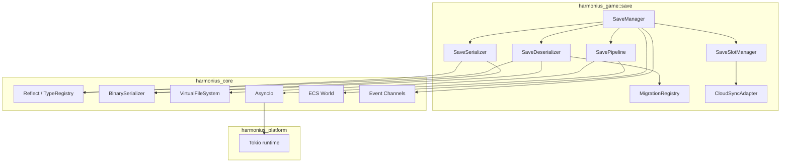
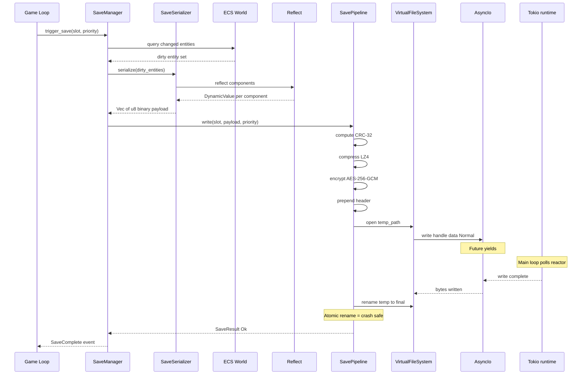
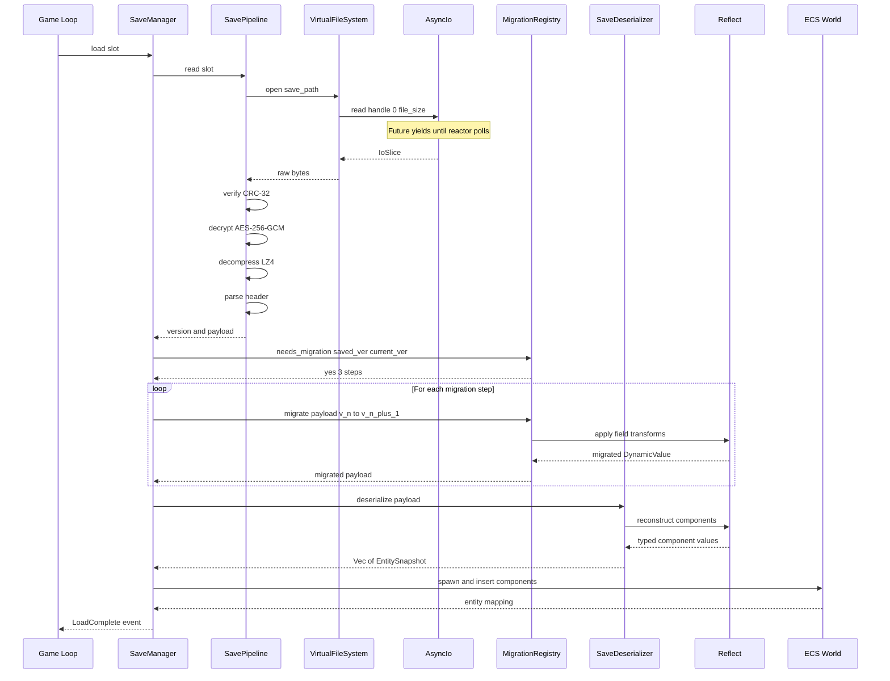
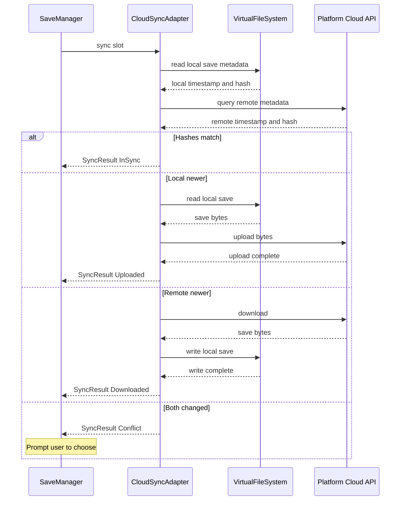
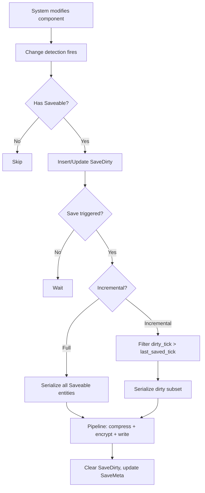

# Save System Design

## Requirements Trace

> **Canonical sources:** Features, requirements, and user stories are in
> [features/](../../features/), [requirements/](../../requirements/), and
> [user-stories/](../../user-stories/).

### Save System (F-13.3, R-13.3)

| Feature  | Requirement |
|----------|-------------|
| F-13.3.1 | R-13.3.1    |
| F-13.3.2 | R-13.3.2    |
| F-13.3.3 | R-13.3.3    |
| F-13.3.4 | R-13.3.4    |
| F-13.3.5 | R-13.3.5    |
| F-13.3.6 | R-13.3.6    |

1. **F-13.3.1** -- Reflection-based save serialization with partial dirty-field writes
2. **F-13.3.2** -- Schema versioning with ordered migration transforms
3. **F-13.3.3** -- Checkpoint and autosave with rotating slots
4. **F-13.3.4** -- Save slot management with metadata and transactional operations
5. **F-13.3.5** -- Cloud save sync with platform-native APIs
6. **F-13.3.6** -- Async I/O pipeline with compression, encryption, checksumming

### Non-Functional Requirements

| Requirement | Target |
|-------------|--------|
| R-13.3.NF1  | Full save under 100 ms |
| R-13.3.NF2  | Compressed file under 10 MB |
| R-13.3.NF3  | No data loss on crash |

### Cross-Cutting Dependencies

| Dependency | Source |
|------------|--------|
| Reflect / TypeRegistry | F-1.3.1, F-1.3.8 |
| Binary serialization | F-1.4.1 |
| Schema versioning | F-1.4.4, F-1.4.5 |
| Scene serialization | F-1.4.7 |
| VirtualFileSystem | Memory/AsyncIo design |
| AsyncIo | Memory/AsyncIo design |
| Tokio runtime | Platform/Threading design |
| ECS World | F-1.1 |
| Event channels | F-1.5.1 |

## Overview

Reflection-driven world serialization, incremental dirty-entity saves, schema migration, an async
I/O pipeline with compression/encryption/checksumming, save slot management, and cloud sync.

All I/O is async via `Tokio runtime`. All state lives as ECS components. The system consumes the
`Reflect` trait and `TypeRegistry` for serialization and the `AsyncIo` / `VirtualFileSystem` layer
for disk I/O.

## Architecture

### Module Boundaries



### File Layout

```text
harmonius_game/save/
  manager.rs      # SaveManager, SaveConfig
  serialize.rs    # SaveSerializer, SaveDeserializer
  pipeline.rs     # SavePipeline (compress, encrypt)
  migration.rs    # MigrationRegistry, MigrationStep
  slots.rs        # SaveSlotManager, SaveSlotMeta
  cloud.rs        # CloudSyncAdapter
  components.rs   # Saveable, SaveDirty, SaveMeta
  error.rs        # SaveError, LoadError
```

### Data Structures

```mermaid
classDiagram
    class SaveManager {
        -slots SaveSlotManager
        -pipeline SavePipeline
        -migration MigrationRegistry
        -config SaveConfig
        -autosave_timer f64
        -current_schema SchemaVersion
        +trigger_save()
        +trigger_incremental_save()
        +load()
        +autosave()
        +quicksave()
        +checkpoint_save()
        +tick_autosave(dt) bool
        +slots() SaveSlotManager
    }

    class SaveConfig {
        +max_slots u32
        +autosave_rotation u32
        +autosave_interval_secs u32
        +local_compression CompressionMode
        +cloud_compression CompressionMode
        +cloud_sync_enabled bool
        +save_dir String
    }

    class SaveSlotManager {
        -slots Vec~SaveSlotMeta~
        -max_slots u32
        -autosave_rotation u32
        -autosave_cursor u32
        -save_dir String
        +list_slots() Slice~SaveSlotMeta~
        +create_slot(name) Result~SlotId~
        +delete_slot(id vfs) Result
        +copy_slot(src name vfs) Result
        +export_slot(id path vfs) Result
        +import_slot(path vfs) Result
        +next_autosave_slot() SlotId
        +update_meta(id meta)
    }

    class SaveSlotMeta {
        +id SlotId
        +name String
        +character_name String
        +level u32
        +playtime_seconds u64
        +timestamp u64
        +zone_name String
        +thumbnail Vec~u8~
        +schema_version SchemaVersion
        +is_autosave bool
        +content_hash 32_bytes
    }

    class SlotId {
        +inner u32
    }

    class SavePipeline {
        -vfs ptr~VirtualFileSystem~
        -compression CompressionMode
        -encryption EncryptionConfig
        +write(slot data pri) Result
        +read(slot) Result
    }

    class SaveFileHeader {
        +magic 4_bytes
        +header_version u8
        +schema_version SchemaVersion
        +compression u8
        +uncompressed_size u64
        +checksum u32
        +nonce 12_bytes
        +auth_tag 16_bytes
        +is_incremental bool
        +timestamp u64
    }

    class SaveSerializer {
        -type_registry ref~TypeRegistry~
        +serialize_world(world ctx) Result
        +serialize_incremental(world ctx) Result
    }

    class SaveDeserializer {
        -type_registry ref~TypeRegistry~
        +deserialize(data) Result
    }

    class EntitySnapshot {
        +stable_id u64
        +parent_id Option~u64~
        +components Vec~ComponentSnapshot~
    }

    class ComponentSnapshot {
        +type_id TypeId
        +schema_version SchemaVersion
        +data DynamicValue
    }

    class MigrationRegistry {
        -steps Vec~MigrationStep~
        +register(step) Result
        +needs_migration(saved current) bool
        +migrate(data saved current) Result
        +migration_chain(saved current) Vec
    }

    class MigrationStep {
        +from SchemaVersion
        +to SchemaVersion
        +transform MigrationTransform
    }

    class MigrationTransform {
        <<enumeration>>
        AddField
        RemoveField
        RenameField
        Custom
    }

    class CloudSyncAdapter {
        -platform CloudPlatform
        +sync(slot meta vfs) Result
        +upload(slot vfs) Result
        +download(slot vfs) Result
    }

    class CloudPlatform {
        <<enumeration>>
        Steam
        PlayStation
        Xbox
        ICloud
        EpicOnlineServices
    }

    class SyncResult {
        <<enumeration>>
        InSync
        Uploaded
        Downloaded
        Conflict
    }

    class ConflictChoice {
        <<enumeration>>
        KeepLocal
        KeepRemote
    }

    class SchemaVersion {
        +major u16
        +minor u16
        +patch u16
    }

    class CompressionMode {
        <<enumeration>>
        Lz4
        Zstd
        Uncompressed
    }

    class EncryptionConfig {
        +key_source KeySource
    }

    class KeySource {
        <<enumeration>>
        PlatformKeystore
        HardwareBound
    }

    class Saveable {
        +contexts SmallVec~SaveContext~
    }

    class SaveContext {
        <<enumeration>>
        Character
        World
        Instance
        Settings
    }

    class SaveDirty {
        +dirty_tick u64
    }

    class SaveMeta {
        +last_saved_tick u64
        +schema_version SchemaVersion
    }

    class SaveEvent {
        <<enumeration>>
        SaveStarted
        SaveComplete
        SaveFailed
        LoadStarted
        LoadComplete
        LoadFailed
        AutosaveTriggered
        CloudSyncStarted
        CloudSyncComplete
        CloudConflict
    }

    class SaveError {
        <<enumeration>>
        SerializationFailed
        IoFailed
        EncryptionKeyUnavailable
        SlotLimitReached
        SlotNotFound
        CloudUploadFailed
    }

    class LoadError {
        <<enumeration>>
        FileNotFound
        IoFailed
        ChecksumMismatch
        DecryptionFailed
        InvalidHeader
        MigrationFailed
        DeserializationFailed
    }

    class MigrationError {
        <<enumeration>>
        NoPath
        StepFailed
        InvalidOrder
    }

    SaveManager --> SaveSlotManager : owns
    SaveManager --> SavePipeline : owns
    SaveManager --> MigrationRegistry : owns
    SaveManager --> SaveSerializer : uses
    SaveManager --> SaveDeserializer : uses
    SaveManager --> SaveConfig : owns
    SaveSlotManager --> CloudSyncAdapter : owns
    SaveSlotManager --> SaveSlotMeta : manages
    SaveSlotMeta --> SchemaVersion : stamps
    SavePipeline --> CompressionMode : uses
    SavePipeline --> EncryptionConfig : uses
    SavePipeline --> SaveFileHeader : writes
    SaveSerializer --> EntitySnapshot : produces
    SaveDeserializer --> EntitySnapshot : produces
    EntitySnapshot --> ComponentSnapshot : contains
    ComponentSnapshot --> SchemaVersion : stamps
    MigrationRegistry --> MigrationStep : stores
    MigrationStep --> MigrationTransform : applies
    MigrationStep --> SchemaVersion : versions
    CloudSyncAdapter --> CloudPlatform : targets
    CloudSyncAdapter --> SyncResult : returns
    EncryptionConfig --> KeySource : uses
    Saveable --> SaveContext : filters
    SaveMeta --> SchemaVersion : tracks
```



## API Design

### ECS Components

```rust
#[derive(Component, Clone, Debug, Reflect)]
pub struct Saveable {
    pub contexts: SmallVec<[SaveContext; 2]>,
}

#[derive(
    Clone, Copy, Debug, PartialEq, Eq,
    Hash, Reflect,
)]
pub enum SaveContext {
    Character,
    World,
    Instance,
    Settings,
}

#[derive(Component, Clone, Debug, Reflect)]
pub struct SaveDirty {
    pub dirty_tick: u64,
}

#[derive(Component, Clone, Debug, Reflect)]
pub struct SaveMeta {
    pub last_saved_tick: u64,
    pub schema_version: SchemaVersion,
}

#[derive(
    Clone, Copy, Debug, PartialEq, Eq,
    PartialOrd, Ord, Hash, Reflect,
)]
pub struct SchemaVersion {
    pub major: u16,
    pub minor: u16,
    pub patch: u16,
}
```

### Save Slot Management

```rust
#[derive(
    Clone, Copy, Debug, PartialEq, Eq,
    Hash, Reflect,
)]
pub struct SlotId(pub u32);

#[derive(Clone, Debug, Reflect)]
pub struct SaveSlotMeta {
    pub id: SlotId,
    pub name: String,
    pub character_name: String,
    pub level: u32,
    pub playtime_seconds: u64,
    pub timestamp: u64,
    pub zone_name: String,
    pub thumbnail: Vec<u8>,
    pub schema_version: SchemaVersion,
    pub is_autosave: bool,
    pub content_hash: [u8; 32],
}

pub struct SaveSlotManager {
    slots: Vec<SaveSlotMeta>,
    max_slots: u32,
    autosave_rotation: u32,
    autosave_cursor: u32,
    save_dir: String,
}

impl SaveSlotManager {
    pub fn list_slots(&self) -> &[SaveSlotMeta];
    pub fn create_slot(
        &mut self, name: &str,
    ) -> Result<SlotId, SaveError>;
    pub async fn delete_slot(
        &mut self, id: SlotId,
        vfs: &VirtualFileSystem,
    ) -> Result<(), SaveError>;
    pub async fn copy_slot(
        &mut self, src: SlotId, dst: &str,
        vfs: &VirtualFileSystem,
    ) -> Result<SlotId, SaveError>;
    pub async fn export_slot(
        &self, id: SlotId, path: &str,
        vfs: &VirtualFileSystem,
    ) -> Result<(), SaveError>;
    pub async fn import_slot(
        &mut self, path: &str,
        vfs: &VirtualFileSystem,
    ) -> Result<SlotId, SaveError>;
    pub fn next_autosave_slot(&mut self) -> SlotId;
    pub fn update_meta(
        &mut self, id: SlotId, meta: SaveSlotMeta,
    );
}
```

### Save Serializer and Deserializer

```rust
pub struct EntitySnapshot {
    pub stable_id: u64,
    pub parent_id: Option<u64>,
    pub components: Vec<ComponentSnapshot>,
}

pub struct ComponentSnapshot {
    pub type_id: TypeId,
    pub schema_version: SchemaVersion,
    pub data: DynamicValue,
}

pub struct SaveSerializer<'a> {
    type_registry: &'a TypeRegistry,
}

impl<'a> SaveSerializer<'a> {
    /// Full-world serialization. Queries all
    /// Saveable entities matching the context.
    pub fn serialize_world(
        &self, world: &World,
        context: SaveContext,
    ) -> Result<Vec<u8>, SaveError>;

    /// Incremental: only entities with SaveDirty
    /// tick > SaveMeta::last_saved_tick.
    pub fn serialize_incremental(
        &self, world: &World,
        context: SaveContext,
    ) -> Result<Vec<u8>, SaveError>;
}

pub struct SaveDeserializer<'a> {
    type_registry: &'a TypeRegistry,
}

impl<'a> SaveDeserializer<'a> {
    /// Deserialize binary data into snapshots.
    /// Does not touch the world -- caller inserts
    /// via command buffers.
    pub fn deserialize(
        &self, data: &[u8],
    ) -> Result<Vec<EntitySnapshot>, LoadError>;
}
```

### Schema Migration

```rust
pub struct MigrationStep {
    pub from: SchemaVersion,
    pub to: SchemaVersion,
    pub transform: MigrationTransform,
}

pub enum MigrationTransform {
    AddField {
        field_name: String,
        default: DynamicValue,
    },
    RemoveField { field_name: String },
    RenameField {
        old_name: String,
        new_name: String,
    },
    Custom {
        name: &'static str,
        func: fn(DynamicValue) -> DynamicValue,
    },
}

pub struct MigrationRegistry {
    steps: Vec<MigrationStep>,
}

impl MigrationRegistry {
    pub fn register(
        &mut self, step: MigrationStep,
    ) -> Result<(), MigrationError>;
    pub fn needs_migration(
        &self, saved: SchemaVersion,
        current: SchemaVersion,
    ) -> bool;
    /// Apply all steps from saved to current.
    /// Original data unchanged on error.
    pub fn migrate(
        &self, data: DynamicValue,
        saved: SchemaVersion,
        current: SchemaVersion,
    ) -> Result<DynamicValue, MigrationError>;
    pub fn migration_chain(
        &self, saved: SchemaVersion,
        current: SchemaVersion,
    ) -> Vec<&MigrationStep>;
}
```

### Save I/O Pipeline

```rust
#[derive(
    Clone, Copy, Debug, PartialEq, Eq, Reflect,
)]
pub enum CompressionMode {
    Lz4,
    Zstd { level: i32 },
    None,
}

pub struct EncryptionConfig {
    pub key_source: KeySource,
}

#[derive(Clone, Copy, Debug, Reflect)]
pub enum KeySource {
    PlatformKeystore,
    HardwareBound,
}

#[derive(Clone, Debug, Reflect)]
pub struct SaveFileHeader {
    pub magic: [u8; 4],
    pub header_version: u8,
    pub schema_version: SchemaVersion,
    pub compression: u8,
    pub uncompressed_size: u64,
    pub checksum: u32,
    pub nonce: [u8; 12],
    pub auth_tag: [u8; 16],
    pub is_incremental: bool,
    pub timestamp: u64,
}

pub struct SavePipeline {
    vfs: *const VirtualFileSystem,
    compression: CompressionMode,
    encryption: EncryptionConfig,
}

impl SavePipeline {
    /// Write: CRC-32 -> compress -> encrypt ->
    /// header -> async write temp -> atomic rename.
    pub async fn write(
        &self, slot: SlotId, data: &[u8],
        priority: IoPriority,
    ) -> Result<(), SaveError>;

    /// Read: async read -> parse header -> verify
    /// auth tag -> decrypt -> decompress -> CRC-32.
    pub async fn read(
        &self, slot: SlotId,
    ) -> Result<(SchemaVersion, Vec<u8>), LoadError>;
}
```

### Save Manager

```rust
#[derive(Clone, Debug, Reflect)]
pub struct SaveConfig {
    pub max_slots: u32,
    pub autosave_rotation: u32,
    pub autosave_interval_secs: u32,
    pub local_compression: CompressionMode,
    pub cloud_compression: CompressionMode,
    pub cloud_sync_enabled: bool,
    pub save_dir: String,
}

#[derive(Clone, Debug, Reflect)]
pub enum SaveEvent {
    SaveStarted { slot: SlotId },
    SaveComplete { slot: SlotId },
    SaveFailed { slot: SlotId, error: SaveError },
    LoadStarted { slot: SlotId },
    LoadComplete { slot: SlotId },
    LoadFailed { slot: SlotId, error: LoadError },
    AutosaveTriggered { slot: SlotId },
    CloudSyncStarted { slot: SlotId },
    CloudSyncComplete { slot: SlotId },
    CloudConflict {
        slot: SlotId,
        local_meta: SaveSlotMeta,
        remote_meta: SaveSlotMeta,
    },
}

pub struct SaveManager {
    slots: SaveSlotManager,
    pipeline: SavePipeline,
    migration: MigrationRegistry,
    config: SaveConfig,
    autosave_timer: f64,
    current_schema: SchemaVersion,
}

impl SaveManager {
    pub async fn trigger_save(
        &mut self, slot: SlotId, world: &World,
        type_registry: &TypeRegistry,
        context: SaveContext, priority: IoPriority,
    ) -> Result<(), SaveError>;
    pub async fn trigger_incremental_save(
        &mut self, slot: SlotId, world: &World,
        type_registry: &TypeRegistry,
        context: SaveContext, priority: IoPriority,
    ) -> Result<(), SaveError>;
    pub async fn load(
        &mut self, slot: SlotId,
        world: &mut World,
        type_registry: &TypeRegistry,
    ) -> Result<(), LoadError>;
    pub async fn autosave(
        &mut self, world: &World,
        type_registry: &TypeRegistry,
    ) -> Result<(), SaveError>;
    pub async fn quicksave(
        &mut self, world: &World,
        type_registry: &TypeRegistry,
    ) -> Result<(), SaveError>;
    pub async fn checkpoint_save(
        &mut self, world: &World,
        type_registry: &TypeRegistry,
        context: SaveContext,
    ) -> Result<(), SaveError>;
    pub fn tick_autosave(&mut self, dt: f64) -> bool;
    pub fn slots(&self) -> &SaveSlotManager;
    pub fn slots_mut(
        &mut self,
    ) -> &mut SaveSlotManager;
}
```

### Cloud Sync

```rust
#[derive(Clone, Debug, Reflect)]
pub enum SyncResult {
    InSync,
    Uploaded,
    Downloaded,
    Conflict {
        local: SaveSlotMeta,
        remote: SaveSlotMeta,
    },
}

#[derive(Clone, Copy, Debug, Reflect)]
pub enum ConflictChoice {
    KeepLocal,
    KeepRemote,
}

#[derive(Clone, Copy, Debug, Reflect)]
pub enum CloudPlatform {
    Steam,
    PlayStation,
    Xbox,
    ICloud,
    EpicOnlineServices,
    Disabled,
}

pub struct CloudSyncAdapter {
    platform: CloudPlatform,
}

impl CloudSyncAdapter {
    pub async fn sync(
        &self, slot: SlotId,
        local_meta: &SaveSlotMeta,
        vfs: &VirtualFileSystem,
    ) -> Result<SyncResult, SaveError>;
    pub async fn upload(
        &self, slot: SlotId,
        vfs: &VirtualFileSystem,
    ) -> Result<(), SaveError>;
    pub async fn download(
        &self, slot: SlotId,
        vfs: &VirtualFileSystem,
    ) -> Result<(), SaveError>;
}
```

### Error Types

```rust
#[derive(Clone, Debug, Reflect)]
pub enum SaveError {
    SerializationFailed {
        entity: u64,
        type_name: &'static str,
        detail: String,
    },
    IoFailed(IoError),
    EncryptionKeyUnavailable,
    SlotLimitReached { max: u32 },
    SlotNotFound(SlotId),
    CloudUploadFailed { detail: String },
}

#[derive(Clone, Debug, Reflect)]
pub enum LoadError {
    FileNotFound(SlotId),
    IoFailed(IoError),
    ChecksumMismatch { expected: u32, actual: u32 },
    DecryptionFailed,
    InvalidHeader,
    MigrationFailed {
        from: SchemaVersion,
        to: SchemaVersion,
        detail: String,
    },
    DeserializationFailed { detail: String },
}

#[derive(Clone, Debug, Reflect)]
pub enum MigrationError {
    NoPath {
        from: SchemaVersion,
        to: SchemaVersion,
    },
    StepFailed {
        step_from: SchemaVersion,
        step_to: SchemaVersion,
        detail: String,
    },
    InvalidOrder {
        expected: SchemaVersion,
        got: SchemaVersion,
    },
}
```

## Data Flow

### Save Pipeline Write Flow



### Save Load and Migration Flow



### Cloud Save Sync Flow



### Incremental Save Decision



1. Systems modify components normally
2. Change detection marks `Changed<T>`
3. Dirty-tracking queries `Saveable` + `Changed<T>`
4. Inserts/updates `SaveDirty` with current tick
5. Serializer filters `dirty_tick > last_saved_tick`
6. After save, clears `SaveDirty`, updates `SaveMeta`

## Platform Considerations

### Save File I/O Backend

All save I/O routes through `AsyncIo` and `VirtualFileSystem` defined in
[memory-async-io.md](../core-runtime/memory-async-io.md).

| Operation | Windows (IOCP) |
|-----------|----------------|
| Write | `WriteFile` + `OVERLAPPED` |
| Read | `ReadFile` + `OVERLAPPED` |
| Rename | `MoveFileEx` + `MOVEFILE_REPLACE_EXISTING` |
| Temp | `GetTempFileName` |

| Operation | macOS (Tokio) |
|-----------|---------------|
| Write | `tokio::fs::write` |
| Read | `tokio::fs::read` |
| Rename | `renameat2` / `rename` |
| Temp | `mkstemp` |

| Operation | Linux (Tokio) |
|-----------|---------------|
| Write | `tokio::fs::write` |
| Read | `tokio::fs::read` |
| Rename | `renameat2` fallback `rename` |
| Temp | `mkstemp` |

### Save Directory Locations

| Platform | Path |
|----------|------|
| Windows | `%APPDATA%/Harmonius/<game>/saves/` |
| macOS | `~/Library/Application Support/Harmonius/<game>/saves/` |
| Linux | `$XDG_DATA_HOME/harmonius/<game>/saves/` |
| PlayStation | Platform TRC-mandated directory |
| Xbox | Connected Storage container |
| Switch | Save data via nn::fs |
| iOS | `Documents/` (iCloud-synced) |
| Android | Internal storage via SAF |

### Cloud Platform APIs

| Platform | API |
|----------|-----|
| Steam | ISteamRemoteStorage |
| PlayStation | Save Data Library |
| Xbox | Connected Storage |
| iCloud | NSFileManager via swift-bridge |
| Epic | EOS Player Data Storage |

### Proposed Dependencies

| Crate | Purpose |
|-------|---------|
| `lz4_flex` | LZ4 compression (pure Rust) |
| `zstd` | Zstd compression (cloud uploads) |
| `aes-gcm` | AES-256-GCM (RustCrypto) |
| `crc32fast` | CRC-32 (SIMD-accelerated) |

Note: `blake3` already approved in [memory-async-io.md](../core-runtime/memory-async-io.md).

## Test Plan

Full test cases in [save-system-test-cases.md](save-system-test-cases.md).

### Unit Tests

| Test | Req |
|------|-----|
| `test_serialize_full_character` | R-13.3.1 |
| `test_serialize_dirty_only` | R-13.3.1 |
| `test_reflect_auto_serialize` | R-13.3.1 |
| `test_migration_v1_to_v3` | R-13.3.2 |
| `test_migration_failure_preserves` | R-13.3.2 |
| `test_migration_no_path` | R-13.3.2 |
| `test_checkpoint_trigger` | R-13.3.3 |
| `test_autosave_rotation` | R-13.3.3 |
| `test_autosave_crash_midwrite` | R-13.3.3 |
| `test_slot_metadata` | R-13.3.4 |
| `test_slot_copy_transactional` | R-13.3.4 |
| `test_slot_delete` | R-13.3.4 |
| `test_slot_export_import` | R-13.3.4 |
| `test_pipeline_compress_encrypt` | R-13.3.6 |
| `test_pipeline_atomic_rename` | R-13.3.6 |
| `test_pipeline_priority_ordering` | R-13.3.6 |
| `test_pipeline_lz4_vs_zstd` | R-13.3.6 |
| `test_encryption_wrong_key` | R-13.3.6 |

### Integration Tests

| Test | Req |
|------|-----|
| `test_save_load_roundtrip` | R-13.3.1, R-13.3.6 |
| `test_save_no_frame_drop` | R-13.3.NF1 |
| `test_save_under_100ms` | R-13.3.NF1 |
| `test_save_file_under_10mb` | R-13.3.NF2 |
| `test_crash_safety_10_points` | R-13.3.NF3 |
| `test_cloud_sync_upload` | R-13.3.5 |
| `test_cloud_sync_conflict` | R-13.3.5 |
| `test_cloud_sync_no_block` | R-13.3.5 |

### Benchmarks

| Benchmark | Target | Source |
|-----------|--------|--------|
| Full save (max char) | < 100 ms p99 | R-13.3.NF1 |
| Incremental (10 dirty) | < 10 ms p99 | R-13.3.1 |
| LZ4 compress 5 MB | < 5 ms | R-13.3.6 |
| AES-256-GCM 5 MB | < 10 ms | R-13.3.6 |
| Save file size | < 10 MB | R-13.3.NF2 |

## Open Questions

1. **Incremental save merge** -- Should incremental saves merge with the last full save at load
   time, or should the system periodically compact incrementals into a full save?

2. **Save thumbnail timing** -- Synchronous framebuffer readback at save time (adds latency) vs.
   continuously maintained low-res buffer sampled on save (adds per-frame cost)?

3. **Migration test data** -- Maintain a repository of save files from every schema version, or
   generate them on-the-fly from versioned fixtures?
