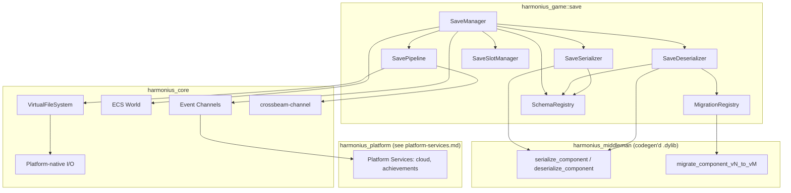
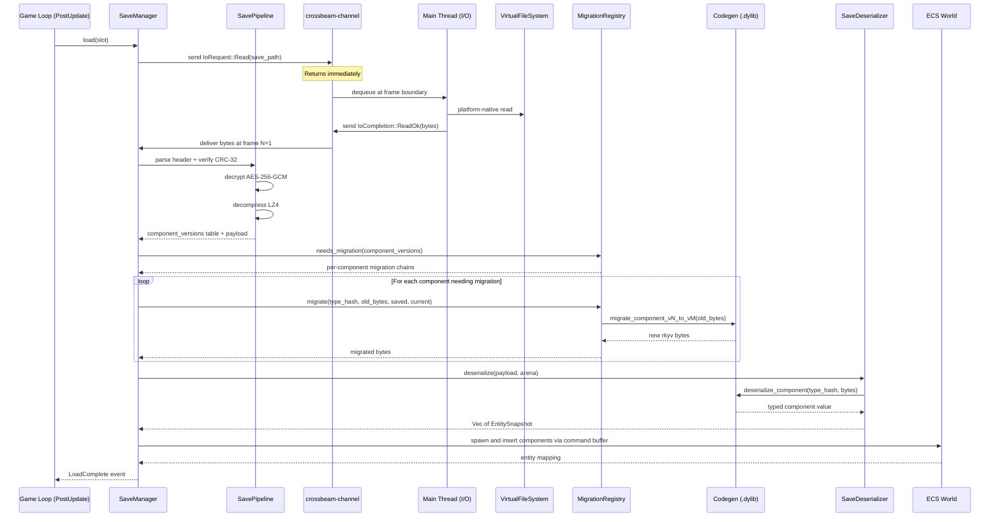
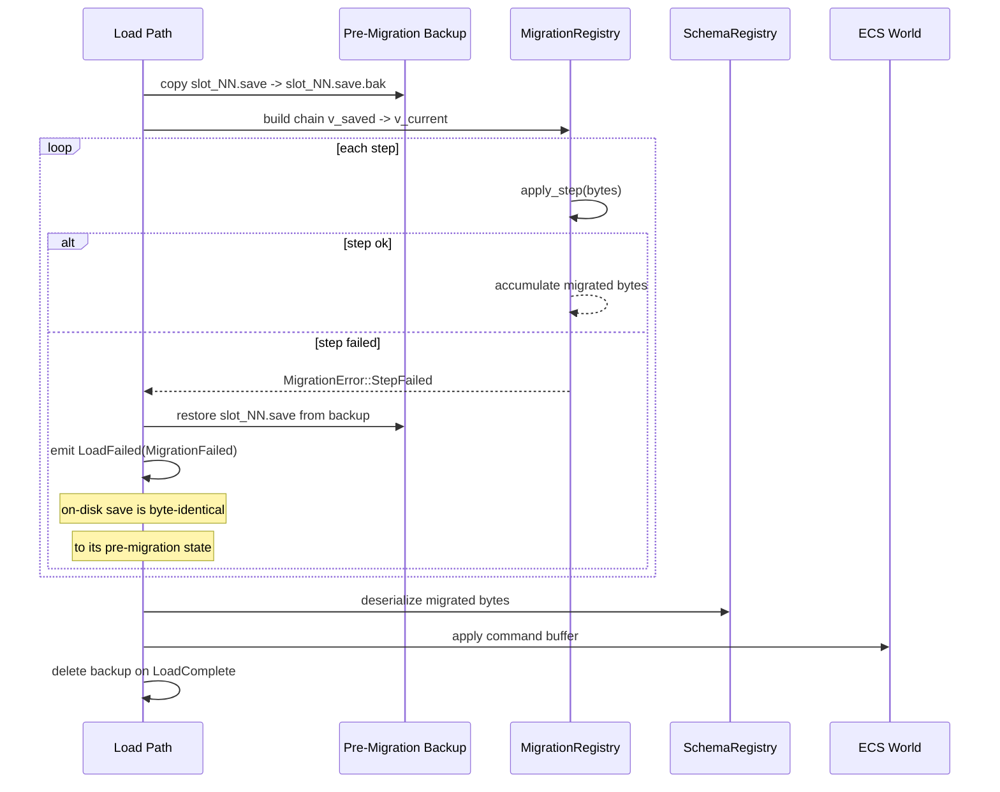
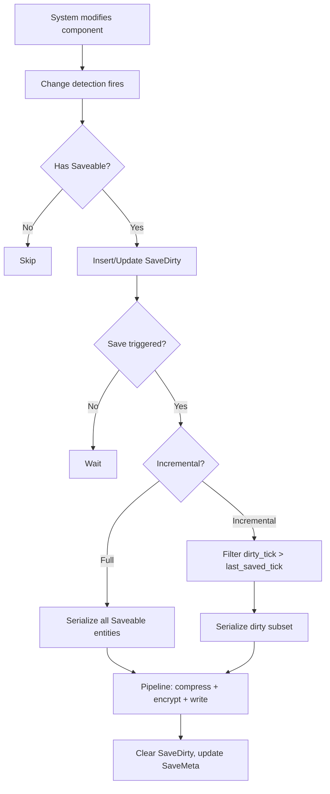
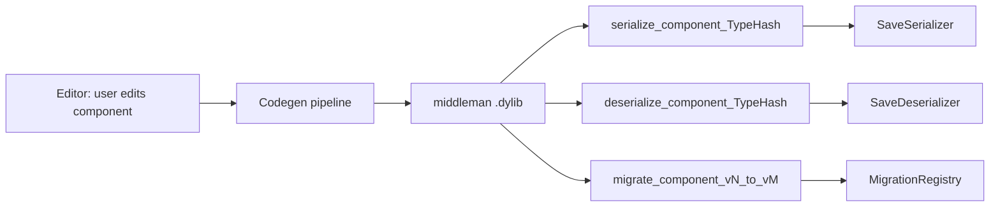
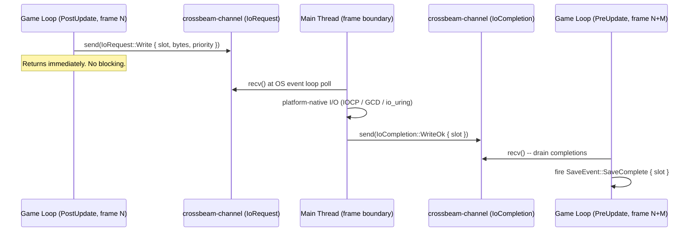

# Save System Design

## Requirements Trace

> **Canonical sources:** Features, requirements, and user stories are in
> [features/](../../features/), [requirements/](../../requirements/), and
> [user-stories/](../../user-stories/).

### Save System (F-13.3, R-13.3)

| Feature  | Requirement |
|----------|-------------|
| F-13.3.1 | R-13.3.1    |
| F-13.3.2 | R-13.3.2    |
| F-13.3.3 | R-13.3.3    |
| F-13.3.4 | R-13.3.4    |
| F-13.3.5 | R-13.3.5    |
| F-13.3.6 | R-13.3.6    |

1. **F-13.3.1** -- Codegen-based save serialization with partial dirty-field writes
2. **F-13.3.2** -- Schema versioning with ordered migration transforms
3. **F-13.3.3** -- Checkpoint and autosave with rotating slots
4. **F-13.3.4** -- Save slot management with metadata and transactional operations
5. **F-13.3.5** -- Cloud save sync with platform-native APIs (see
   [../platform/platform-services.md](../platform/platform-services.md))
6. **F-13.3.6** -- Sync I/O pipeline with compression, encryption, checksumming

### Non-Functional Requirements

| Requirement | Target |
|-------------|--------|
| R-13.3.NF1  | Full save under 100 ms |
| R-13.3.NF2  | Compressed file under 10 MB |
| R-13.3.NF3  | No data loss on crash |

### Cross-Cutting Dependencies

| Dependency | Source |
|------------|--------|
| Codegen pipeline | Codegen / middleman .dylib design |
| rkyv serialization | F-1.4.1 |
| Schema versioning | F-1.4.4, F-1.4.5 |
| Scene serialization | F-1.4.7 |
| VirtualFileSystem | [../core-runtime/io.md](../core-runtime/io.md) |
| Platform-native I/O | Platform/Threading design |
| ECS World | F-1.1 |
| Event channels | F-1.5.1 |
| crossbeam-channel | Platform/Threading design |

## Overview

Codegen-driven world serialization, incremental dirty-entity saves, schema migration, a
platform-native I/O pipeline with compression/encryption/checksumming, and save slot management.

All state lives as ECS components. The codegen pipeline generates typed
`serialize_component`/`deserialize_component` functions for every `Saveable` component into the
middleman .dylib. I/O is submitted to the main thread via crossbeam-channel and routed through the
`VirtualFileSystem` / platform-native I/O layer. No `Reflect`, no `TypeRegistry`, no async/await, no
Tokio.

Schema versioning is decoupled from the codegen pipeline via a `SchemaRegistry` keyed on stable
`TypeId`, allowing multiple format versions per component type to coexist in live saves. Stable IDs
across save boundaries follow the model in [../core-runtime/ids.md](../core-runtime/ids.md). Live
migration during hot-reload follows the protocol in
[../core-runtime/hot-reload-protocol.md](../core-runtime/hot-reload-protocol.md).

Cloud sync and achievement queuing live in
[../platform/platform-services.md](../platform/platform-services.md); this document provides only
the game-side save API surface.

## Architecture

### Module Boundaries



### File Layout

```text
harmonius_game/save/
  manager.rs      # SaveManager, SaveConfig
  serialize.rs    # SaveSerializer, SaveDeserializer
  pipeline.rs     # SavePipeline (compress, encrypt)
  migration.rs    # MigrationRegistry, MigrationStep
  schema.rs      # SchemaRegistry, SchemaEntry
  slots.rs        # SaveSlotManager, SaveSlotMeta
  components.rs   # Saveable, SaveDirty, SaveMeta
  error.rs        # SaveError, LoadError
```

Cloud sync and achievement queuing are owned by
[../platform/platform-services.md](../platform/platform-services.md); no `cloud.rs` exists in the
save crate.

### Data Structures

```mermaid
classDiagram
    class SaveManager {
        -slots SaveSlotManager
        -pipeline SavePipeline
        -migration MigrationRegistry
        -config SaveConfig
        -autosave_timer f64
        -current_schema SchemaVersion
        +trigger_save()
        +trigger_incremental_save()
        +load()
        +autosave()
        +quicksave()
        +checkpoint_save()
        +tick_autosave(dt) bool
        +slots() SaveSlotManager
    }

    class SaveConfig {
        +max_slots u32
        +autosave_rotation u32
        +autosave_interval_secs u32
        +local_compression CompressionMode
        +save_dir String
    }

    class SaveSlotManager {
        -slots Vec~SaveSlotMeta~
        -max_slots u32
        -autosave_rotation u32
        -autosave_cursor u32
        -save_dir String
        +list_slots() Slice~SaveSlotMeta~
        +create_slot(name) Result~SlotId~
        +delete_slot(id vfs) Result
        +copy_slot(src name vfs) Result
        +export_slot(id path vfs) Result
        +import_slot(path vfs) Result
        +next_autosave_slot() SlotId
        +update_meta(id meta)
    }

    class SaveSlotMeta {
        +id SlotId
        +name String
        +character_name String
        +level u32
        +playtime_seconds u64
        +real_world_date i64
        +zone_name String
        +thumbnail Handle~ThumbnailAsset~
        +schema_version SchemaVersion
        +engine_version SchemaVersion
        +platform PlatformId
        +save_type SaveType
        +is_autosave bool
        +content_hash 32_bytes
        +completion_percentage f32
        +chapter Option~LocalizedStringId~
        +difficulty Option~u32~
        +quest_summary SmallVec~LocalizedStringId~
        +deaths u32
        +currency u64
        +character_class Option~u32~
        +character_appearance Option~Handle~
        +party_members SmallVec~LocalizedStringId~
        +custom_fields SmallVec~StringId_Value~
    }

    class SaveType {
        <<enumeration>>
        Manual
        Autosave
        Quicksave
        Checkpoint
        CloudSync
    }

    class SlotId {
        +inner u32
    }

    class SavePipeline {
        -compression CompressionMode
        -encryption EncryptionConfig
        +write(slot data pri vfs) Result
        +read(slot vfs) Result
    }

    class SaveFileHeader {
        +magic 4_bytes
        +header_version u8
        +schema_version SchemaVersion
        +compression u8
        +uncompressed_size u64
        +checksum u32
        +nonce 12_bytes
        +auth_tag 16_bytes
        +is_incremental bool
        +timestamp u64
    }

    class SaveSerializer {
        +serialize_world(world ctx arena) Result
        +serialize_incremental(world ctx arena) Result
    }

    class SaveDeserializer {
        +deserialize(data arena) Result
    }

    class EntitySnapshot {
        +stable_id u64
        +parent_id Option~u64~
        +components SmallVec~ComponentSnapshot~
    }

    class ComponentSnapshot {
        +type_hash u64
        +schema_version SchemaVersion
        +data rkyv_bytes
    }

    class ProceduralAssetRef {
        +asset_type u64
        +blob_offset u64
        +blob_len u64
    }

    class MigrationRegistry {
        -steps Vec~MigrationStep~
        +register(step) Result
        +needs_migration(saved current) bool
        +migrate(data saved current) Result
        +migration_chain(saved current) Vec
    }

    class MigrationStep {
        +from SchemaVersion
        +to SchemaVersion
        +transform MigrationTransform
    }

    class MigrationTransform {
        <<enumeration>>
        AddField
        RemoveField
        RenameField
        SplitComponent
        MergeComponents
        ReparentEntity
        CreateEntity
        DeleteEntity
        CrossComponentMove
        DataTableRekey
        Codegen
    }

    class SchemaRegistry {
        -entries Vec~SchemaEntry~
        +register(entry)
        +get(type_id version) Option~SchemaEntry~
        +highest(type_id) Option~SchemaVersion~
        +versions(type_id) Slice~SchemaVersion~
    }

    class SchemaEntry {
        +type_id TypeId
        +version SchemaVersion
        +serialize fn
        +deserialize fn
    }

    class TypeId {
        +inner u64
    }

    class SchemaVersion {
        +major u16
        +minor u16
        +patch u16
    }

    class CompressionMode {
        <<enumeration>>
        Lz4
        Zstd
        Uncompressed
    }

    class EncryptionConfig {
        +key_source KeySource
    }

    class KeySource {
        <<enumeration>>
        PlatformKeystore
        HardwareBound
    }

    class Saveable {
        +contexts SmallVec~SaveContext~
        +procedural_assets SmallVec~ProceduralAssetRef~
    }

    class SaveContext {
        <<enumeration>>
        Character
        World
        Instance
        Settings
    }

    class SaveDirty {
        +dirty_tick u64
    }

    class SaveMeta {
        +last_saved_tick u64
        +schema_version SchemaVersion
    }

    class SaveEvent {
        <<enumeration>>
        SaveStarted
        SaveComplete
        SaveFailed
        LoadStarted
        LoadComplete
        LoadFailed
        AutosaveTriggered
    }

    class SaveError {
        <<enumeration>>
        SerializationFailed
        IoFailed
        EncryptionKeyUnavailable
        SlotLimitReached
        SlotNotFound
    }

    class LoadError {
        <<enumeration>>
        FileNotFound
        IoFailed
        ChecksumMismatch
        DecryptionFailed
        InvalidHeader
        MigrationFailed
        DeserializationFailed
    }

    class MigrationError {
        <<enumeration>>
        NoPath
        StepFailed
        InvalidOrder
    }

    SaveManager --> SaveSlotManager : owns
    SaveManager --> SavePipeline : owns
    SaveManager --> MigrationRegistry : owns
    SaveManager --> SchemaRegistry : owns
    SaveManager --> SaveSerializer : uses
    SaveManager --> SaveDeserializer : uses
    SaveManager --> SaveConfig : owns
    SaveSlotManager --> SaveSlotMeta : manages
    SaveSlotMeta --> SchemaVersion : stamps
    SaveSlotMeta --> SaveType : typed
    SavePipeline --> CompressionMode : uses
    SavePipeline --> EncryptionConfig : uses
    SavePipeline --> SaveFileHeader : writes
    SaveSerializer --> EntitySnapshot : produces
    SaveDeserializer --> EntitySnapshot : produces
    SaveSerializer --> SchemaRegistry : queries
    SaveDeserializer --> SchemaRegistry : queries
    SchemaRegistry --> SchemaEntry : stores
    SchemaEntry --> TypeId : identifies
    SchemaEntry --> SchemaVersion : versions
    EntitySnapshot --> ComponentSnapshot : contains
    EntitySnapshot --> ProceduralAssetRef : lists
    ComponentSnapshot --> SchemaVersion : stamps
    MigrationRegistry --> MigrationStep : stores
    MigrationStep --> MigrationTransform : applies
    MigrationStep --> SchemaVersion : versions
    EncryptionConfig --> KeySource : uses
    Saveable --> SaveContext : filters
    Saveable --> ProceduralAssetRef : lists
    SaveMeta --> SchemaVersion : tracks
```



## API Design

### ECS Components

```rust
/// Codegen generates rkyv Archive/Serialize/Deserialize for all
/// components tagged with Saveable. No Reflect, no TypeRegistry.
#[derive(Component, Clone, Debug)]
pub struct Saveable {
    pub contexts: SmallVec<[SaveContext; 2]>,
    /// Procedural asset blobs to snapshot alongside entity state.
    pub procedural_assets: SmallVec<[ProceduralAssetRef; 2]>,
}

/// Variants codegen'd into the middleman .dylib from user definitions.
#[derive(Clone, Copy, Debug, PartialEq, Eq, Hash)]
pub enum SaveContext {
    Character,
    World,
    Instance,
    Settings,
    // Additional variants codegen'd from game data.
}

#[derive(Component, Clone, Debug)]
pub struct SaveDirty {
    pub dirty_tick: u64,
}

#[derive(Component, Clone, Debug)]
pub struct SaveMeta {
    pub last_saved_tick: u64,
    pub schema_version: SchemaVersion,
}

#[derive(Clone, Copy, Debug, PartialEq, Eq, PartialOrd, Ord, Hash)]
pub struct SchemaVersion {
    pub major: u16,
    pub minor: u16,
    pub patch: u16,
}

/// Reference to a procedural asset blob stored alongside entity snapshots.
#[derive(Clone, Copy, Debug)]
pub struct ProceduralAssetRef {
    /// Stable hash of the asset type (codegen'd).
    pub asset_type: u64,
    /// Byte offset of the blob within the save archive's procedural section.
    pub blob_offset: u64,
    pub blob_len: u64,
}
```

### Save Slot Management

```rust
#[derive(Clone, Copy, Debug, PartialEq, Eq, Hash)]
pub struct SlotId(pub u32);

/// Stored as a separate `slot_NN.meta` rkyv file for fast slot-list reads.
/// Thumbnail is in `slot_NN.thumb` (loaded on demand).
#[derive(Clone, Debug)]
pub struct SaveSlotMeta {
    pub id: SlotId,
    pub name: String,
    // --- identity ---
    pub character_name: String,
    pub level: u32,
    pub character_class: Option<u32>,
    pub character_appearance: Option<Handle<ThumbnailAsset>>,
    pub party_members: SmallVec<[LocalizedStringId; 4]>,
    // --- progress ---
    pub playtime_seconds: u64,
    pub zone_name: String,
    pub completion_percentage: f32,
    pub chapter: Option<LocalizedStringId>,
    pub difficulty: Option<u32>,
    pub quest_summary: SmallVec<[LocalizedStringId; 4]>,
    pub deaths: u32,
    pub currency: u64,
    // --- session ---
    pub real_world_date: i64,
    pub engine_version: SchemaVersion,
    pub platform: PlatformId,
    pub save_type: SaveType,
    pub is_autosave: bool,
    pub schema_version: SchemaVersion,
    pub content_hash: [u8; 32],
    /// Thumbnail stored as separate asset file; loaded on demand.
    pub thumbnail: Handle<ThumbnailAsset>,
    /// Game-specific fields codegen'd from the save metadata schema.
    pub custom_fields: SmallVec<[(StringId, Value); 8]>,
}

/// Codegen'd from game data. Engine stores variants opaquely.
#[derive(Clone, Copy, Debug, PartialEq, Eq, Hash)]
pub enum SaveType {
    Manual,
    Autosave,
    Quicksave,
    Checkpoint,
    CloudSync,
}

pub struct SaveSlotManager {
    slots: Vec<SaveSlotMeta>,
    max_slots: u32,
    autosave_rotation: u32,
    autosave_cursor: u32,
    save_dir: String,
}

impl SaveSlotManager {
    pub fn list_slots(&self) -> &[SaveSlotMeta];
    pub fn create_slot(
        &mut self, name: &str,
    ) -> Result<SlotId, SaveError>;
    /// Submits delete I/O via channel; returns immediately.
    pub fn delete_slot(
        &mut self, id: SlotId,
        vfs: &VirtualFileSystem,
    ) -> Result<(), SaveError>;
    /// Submits copy I/O via channel; returns immediately.
    pub fn copy_slot(
        &mut self, src: SlotId, dst: &str,
        vfs: &VirtualFileSystem,
    ) -> Result<SlotId, SaveError>;
    /// Submits export I/O via channel; returns immediately.
    pub fn export_slot(
        &self, id: SlotId, path: &str,
        vfs: &VirtualFileSystem,
    ) -> Result<(), SaveError>;
    /// Submits import I/O via channel; returns immediately.
    pub fn import_slot(
        &mut self, path: &str,
        vfs: &VirtualFileSystem,
    ) -> Result<SlotId, SaveError>;
    pub fn next_autosave_slot(&mut self) -> SlotId;
    pub fn update_meta(
        &mut self, id: SlotId, meta: SaveSlotMeta,
    );
}
```

### Save Serializer and Deserializer

```rust
/// Allocated from a per-thread arena; reset after each save operation.
pub struct EntitySnapshot {
    pub stable_id: u64,
    pub parent_id: Option<u64>,
    /// SmallVec: most entities have < 8 saveable components.
    pub components: SmallVec<[ComponentSnapshot; 8]>,
}

/// Component payload is a raw rkyv byte slice (zero-copy on load).
pub struct ComponentSnapshot {
    /// Stable hash of the component type (codegen'd; no TypeId).
    pub type_hash: u64,
    pub schema_version: SchemaVersion,
    /// rkyv-archived bytes. Mmap'd directly on load.
    pub data: Box<[u8]>,
}

/// No TypeRegistry. Calls codegen'd serialize_component functions
/// from the middleman .dylib via sorted Vec lookup (no HashMap).
pub struct SaveSerializer;

impl SaveSerializer {
    /// Full-world serialization. Queries all
    /// Saveable entities matching the context.
    /// `arena` is the per-thread arena for scratch allocations.
    pub fn serialize_world(
        &self, world: &World,
        context: SaveContext,
        arena: &mut Arena,
    ) -> Result<Box<[u8]>, SaveError>;

    /// Incremental: only entities with SaveDirty
    /// tick > SaveMeta::last_saved_tick.
    pub fn serialize_incremental(
        &self, world: &World,
        context: SaveContext,
        arena: &mut Arena,
    ) -> Result<Box<[u8]>, SaveError>;
}

/// No TypeRegistry. Calls codegen'd deserialize_component functions.
pub struct SaveDeserializer;

impl SaveDeserializer {
    /// Deserialize binary data into snapshots.
    /// Does not touch the world -- caller inserts
    /// via command buffers. `arena` used for scratch.
    pub fn deserialize(
        &self, data: &[u8],
        arena: &mut Arena,
    ) -> Result<Vec<EntitySnapshot>, LoadError>;
}
```

### Schema Migration

```rust
/// Per-component version tracking. The save header stores a version
/// table mapping component type_hash → SchemaVersion at save time.
/// Only changed components need migration on load.
pub struct MigrationStep {
    /// Stable hash of the component type (codegen'd).
    pub type_hash: u64,
    pub from: SchemaVersion,
    pub to: SchemaVersion,
    /// Codegen'd Rust function in the middleman .dylib.
    /// Operates on raw rkyv byte slices -- no DynamicValue.
    pub func: fn(old: &[u8]) -> Result<Vec<u8>, MigrationError>,
}

/// All transform variants produce codegen'd Rust in the middleman .dylib.
/// The designer maps old → new schema in the editor; codegen does the rest.
pub enum MigrationTransform {
    AddField { field_name: &'static str },
    RemoveField { field_name: &'static str },
    RenameField { old: &'static str, new: &'static str },
    SplitComponent {
        new_a: u64,
        new_b: u64,
    },
    MergeComponents { target: u64 },
    ReparentEntity,
    CreateEntity,
    DeleteEntity,
    CrossComponentMove { target_type_hash: u64 },
    DataTableRekey { mapping_table: &'static [(u64, u64)] },
    /// Custom codegen'd migration function (most complex cases).
    Codegen,
}

pub struct MigrationRegistry {
    /// Sorted by (type_hash, from, to) for binary search -- no HashMap.
    steps: Vec<MigrationStep>,
}

impl MigrationRegistry {
    pub fn register(
        &mut self, step: MigrationStep,
    ) -> Result<(), MigrationError>;
    pub fn needs_migration(
        &self, saved: SchemaVersion,
        current: SchemaVersion,
    ) -> bool;
    /// Apply ordered chain from saved to current version.
    /// Pre-migration backup made before first step.
    /// Original data unchanged on error (atomic migration).
    pub fn migrate(
        &self, data: &[u8],
        type_hash: u64,
        saved: SchemaVersion,
        current: SchemaVersion,
    ) -> Result<Vec<u8>, MigrationError>;
    /// Returns ordered chain (no HashMap; binary search on sorted Vec).
    pub fn migration_chain(
        &self, type_hash: u64,
        saved: SchemaVersion,
        current: SchemaVersion,
    ) -> &[MigrationStep];
}
```

### Save I/O Pipeline

```rust
#[derive(Clone, Copy, Debug, PartialEq, Eq)]
pub enum CompressionMode {
    Lz4,
    Zstd { level: i32 },
    None,
}

pub struct EncryptionConfig {
    pub key_source: KeySource,
}

#[derive(Clone, Copy, Debug)]
pub enum KeySource {
    PlatformKeystore,
    HardwareBound,
}

/// rkyv-archived for zero-copy mmap on load.
/// See: AES-256-GCM NIST SP 800-38D
/// <https://nvlpubs.nist.gov/nistpubs/Legacy/SP/nistspecialpublication800-38d.pdf>
#[derive(Clone, Debug)]
pub struct SaveFileHeader {
    pub magic: [u8; 4],
    pub header_version: u8,
    pub schema_version: SchemaVersion,
    /// Per-component version table: (type_hash, SchemaVersion) pairs.
    pub component_versions: Vec<(u64, SchemaVersion)>,
    pub compression: u8,
    pub uncompressed_size: u64,
    /// CRC-32 per IETF RFC 3385.
    /// <https://www.rfc-editor.org/rfc/rfc3385>
    pub checksum: u32,
    pub nonce: [u8; 12],
    pub auth_tag: [u8; 16],
    pub is_incremental: bool,
    pub timestamp: u64,
}

/// No raw pointer. `VirtualFileSystem` passed as method parameter.
pub struct SavePipeline {
    compression: CompressionMode,
    encryption: EncryptionConfig,
}

impl SavePipeline {
    /// Write: CRC-32 -> compress -> encrypt -> header ->
    /// submit write to main thread via channel -> atomic rename.
    /// See LZ4 frame format: <https://github.com/lz4/lz4/blob/dev/doc/lz4_Frame_format.md>
    /// See Zstd RFC 8878: <https://www.rfc-editor.org/rfc/rfc8878>
    /// Atomic rename crash safety:
    /// <https://danluu.com/file-consistency/>
    pub fn write(
        &self, slot: SlotId, data: &[u8],
        priority: IoPriority,
        vfs: &VirtualFileSystem,
    ) -> Result<(), SaveError>;

    /// Read: platform-native read -> parse header -> verify
    /// auth tag -> decrypt -> decompress -> CRC-32.
    pub fn read(
        &self, slot: SlotId,
        vfs: &VirtualFileSystem,
    ) -> Result<(SchemaVersion, Vec<u8>), LoadError>;
}
```

### Save Manager

```rust
#[derive(Clone, Debug)]
pub struct SaveConfig {
    pub max_slots: u32,
    pub autosave_rotation: u32,
    pub autosave_interval_secs: u32,
    pub local_compression: CompressionMode,
    pub save_dir: String,
}

/// Save-system events. Cloud sync observes SaveComplete
/// from platform-services.md and emits its own events
/// there; this system does not define cloud variants.
#[derive(Clone, Debug)]
pub enum SaveEvent {
    SaveStarted { slot: SlotId },
    SaveComplete { slot: SlotId, meta: SaveSlotMeta },
    SaveFailed { slot: SlotId, error: SaveError },
    LoadStarted { slot: SlotId },
    LoadComplete { slot: SlotId },
    LoadFailed { slot: SlotId, error: LoadError },
    AutosaveTriggered { slot: SlotId },
}

pub struct SaveManager {
    slots: SaveSlotManager,
    pipeline: SavePipeline,
    migration: MigrationRegistry,
    config: SaveConfig,
    autosave_timer: f64,
    current_schema: SchemaVersion,
}

impl SaveManager {
    /// Called in PostUpdate phase. Serializes world synchronously;
    /// submits I/O to main thread via crossbeam-channel. Returns
    /// immediately. SaveComplete event delivered at next frame boundary.
    pub fn trigger_save(
        &mut self, slot: SlotId, world: &World,
        context: SaveContext, priority: IoPriority,
        vfs: &VirtualFileSystem, arena: &mut Arena,
    ) -> Result<(), SaveError>;
    /// Incremental variant -- serializes only dirty entities.
    pub fn trigger_incremental_save(
        &mut self, slot: SlotId, world: &World,
        context: SaveContext, priority: IoPriority,
        vfs: &VirtualFileSystem, arena: &mut Arena,
    ) -> Result<(), SaveError>;
    /// Called in PostUpdate phase. Submits I/O; LoadComplete event
    /// delivered at frame boundary when main thread posts completion.
    pub fn load(
        &mut self, slot: SlotId,
        world: &mut World,
        vfs: &VirtualFileSystem, arena: &mut Arena,
    ) -> Result<(), LoadError>;
    /// Autosave: runs in PostUpdate, rotates slots.
    pub fn autosave(
        &mut self, world: &World,
        vfs: &VirtualFileSystem, arena: &mut Arena,
    ) -> Result<(), SaveError>;
    /// Quicksave: runs in PostUpdate, saves to slot 0.
    pub fn quicksave(
        &mut self, world: &World,
        vfs: &VirtualFileSystem, arena: &mut Arena,
    ) -> Result<(), SaveError>;
    /// Checkpoint: runs in PostUpdate, saves named context.
    pub fn checkpoint_save(
        &mut self, world: &World,
        context: SaveContext,
        vfs: &VirtualFileSystem, arena: &mut Arena,
    ) -> Result<(), SaveError>;
    /// Called in PostUpdate to tick autosave timer.
    pub fn tick_autosave(&mut self, dt: f64) -> bool;
    pub fn slots(&self) -> &SaveSlotManager;
    pub fn slots_mut(
        &mut self,
    ) -> &mut SaveSlotManager;
}
```

### Schema Registry

`SchemaRegistry` decouples save serialization from the codegen pipeline. It maps a stable `TypeId`
to a sorted list of registered format versions. Multiple versions per type coexist so a save
containing older-format components can be loaded without forcing a single canonical schema. The
codegen pipeline populates the registry at `.dylib` load time; user code reads it.

```rust
/// Stable identity for a component schema across
/// save boundaries. See [../core-runtime/ids.md].
#[derive(Clone, Copy, Debug, PartialEq, Eq, Hash, PartialOrd, Ord)]
pub struct TypeId(pub u64);

/// Codegen'd descriptor for one format version of a
/// component type. Multiple versions per TypeId are
/// allowed in the registry; the serializer picks
/// the highest version supported by the running
/// engine, the deserializer accepts any registered
/// version and dispatches via `MigrationRegistry`.
#[derive(Clone, Debug)]
pub struct SchemaEntry {
    pub type_id: TypeId,
    pub version: SchemaVersion,
    /// Codegen'd rkyv archiver for this version.
    pub serialize: fn(&World, Entity, &mut Arena)
        -> Result<Box<[u8]>, SaveError>,
    /// Codegen'd rkyv deserializer for this version.
    pub deserialize: fn(&[u8], &mut CommandBuffer, Entity)
        -> Result<(), LoadError>,
}

/// Sorted Vec keyed by (TypeId, SchemaVersion) for
/// binary search. No HashMap on hot paths.
pub struct SchemaRegistry {
    entries: Vec<SchemaEntry>,
}

impl SchemaRegistry {
    /// Register a codegen'd schema entry. Called
    /// by the middleman .dylib at load time for every
    /// codegen'd (TypeId, SchemaVersion) pair.
    pub fn register(&mut self, entry: SchemaEntry);
    /// Look up the entry for a specific version.
    pub fn get(
        &self,
        type_id: TypeId,
        version: SchemaVersion,
    ) -> Option<&SchemaEntry>;
    /// Highest registered version for a type. Used
    /// by the serializer to pick the canonical
    /// version at save time.
    pub fn highest(
        &self,
        type_id: TypeId,
    ) -> Option<SchemaVersion>;
    /// All registered versions for a type (sorted).
    /// Used by the migration planner.
    pub fn versions(
        &self,
        type_id: TypeId,
    ) -> &[SchemaVersion];
}
```

### Cloud Sync and Achievement Queuing

Moved to [../platform/platform-services.md](../platform/platform-services.md). The save system
publishes `SaveComplete` events carrying the updated `SaveSlotMeta`; platform services observe those
events and perform cloud upload, conflict detection, and achievement queuing. Save system code holds
no platform SDK handles.

### Error Types

```rust
#[derive(Clone, Debug)]
pub enum SaveError {
    SerializationFailed {
        entity: u64,
        type_hash: u64,
        detail: String,
    },
    IoFailed(IoError),
    EncryptionKeyUnavailable,
    SlotLimitReached { max: u32 },
    SlotNotFound(SlotId),
}

#[derive(Clone, Debug)]
pub enum LoadError {
    FileNotFound(SlotId),
    IoFailed(IoError),
    ChecksumMismatch { expected: u32, actual: u32 },
    DecryptionFailed,
    InvalidHeader,
    ForwardCompatError {
        saved: SchemaVersion,
        current: SchemaVersion,
    },
    MigrationFailed {
        type_hash: u64,
        from: SchemaVersion,
        to: SchemaVersion,
        detail: String,
    },
    DeserializationFailed { detail: String },
}

#[derive(Clone, Debug)]
pub enum MigrationError {
    NoPath {
        type_hash: u64,
        from: SchemaVersion,
        to: SchemaVersion,
    },
    StepFailed {
        type_hash: u64,
        step_from: SchemaVersion,
        step_to: SchemaVersion,
        detail: String,
    },
    InvalidOrder {
        expected: SchemaVersion,
        got: SchemaVersion,
    },
    DataLossWarning {
        type_hash: u64,
        field: &'static str,
    },
}
```

## Data Flow

### Save Pipeline Write Flow

```mermaid
sequenceDiagram
    participant G as Game Loop (PostUpdate)
    participant SM as SaveManager
    participant SS as SaveSerializer
    participant CG as Codegen (.dylib)
    participant W as ECS World
    participant SP as SavePipeline
    participant CH as crossbeam-channel
    participant MT as Main Thread (I/O)
    participant VFS as VirtualFileSystem

    G->>SM: trigger_save(slot, priority)
    SM->>W: query Saveable + SaveDirty entities
    W-->>SM: dirty entity set (sorted Vec)

    SM->>SS: serialize_world(dirty, arena)
    SS->>CG: serialize_component(type_hash, &component)
    CG-->>SS: rkyv byte slice per component
    SS-->>SM: Box[u8] binary payload

    SM->>SP: write(slot, payload, priority, vfs)
    SP->>SP: compute CRC-32
    SP->>SP: compress LZ4
    SP->>SP: encrypt AES-256-GCM
    SP->>SP: prepend header

    SP->>CH: send IoRequest::Write(temp_path, bytes)
    Note over CH: Fire-and-forget; returns immediately
    CH->>MT: dequeue IoRequest at frame boundary
    MT->>VFS: platform-native write + atomic rename
    Note over MT: Atomic rename = crash safe
    MT->>CH: send IoCompletion::WriteOk(slot)
    CH->>SM: deliver SaveComplete event at frame N+1
```

### Save Load and Migration Flow



### Cloud Save Sync Flow

See [../platform/platform-services.md](../platform/platform-services.md) for the cloud sync flow.
The save system is a producer of `SaveComplete` events; platform services handle upload, conflict
resolution, and achievement queuing.

### Migration Failure Handling

Migrations run as an ordered chain of codegen'd steps. Any step that fails aborts the whole chain
and rolls back, leaving the on-disk save untouched.



Rollback protocol:

1. Before the first migration step, copy `slot_NN.save` to `slot_NN.save.bak` atomically via the
   platform-native rename pattern.
2. Migrations operate on an in-memory `Vec<u8>` copy of the payload; the on-disk file is never
   mutated until the full chain succeeds.
3. On any `MigrationError`, discard the in-memory buffer and emit
   `LoadError::MigrationFailed { type_hash, from, to, detail }`.
4. The backup remains until a successful `LoadComplete`, at which point it is deleted.
5. If the process crashes mid-migration, startup recovery notices a stale `.bak` file and
   automatically restores it before the next load.

### Incremental Save Decision



1. Systems modify components normally
2. Change detection marks `Changed<T>`
3. Dirty-tracking queries `Saveable` + `Changed<T>`
4. Inserts/updates `SaveDirty` with current tick
5. Serializer filters `dirty_tick > last_saved_tick`
6. After save, clears `SaveDirty`, updates `SaveMeta`

## Codegen Integration

The codegen pipeline generates typed serialization and migration functions for every `Saveable`
component into the middleman .dylib. No runtime type lookup, no Reflect, no TypeRegistry.



- All component types deriving `rkyv::Archive`/`Serialize`/`Deserialize` are codegen'd.
- Lookup during serialization uses a sorted `Vec<(u64, fn)>` keyed by `type_hash`. Binary search
  replaces HashMap — no non-deterministic iteration on hot paths.
- All custom migration functions are codegen'd Rust — no interpreted or dynamic logic.

## Game Loop Phase

| Phase | System | Notes |
|-------|--------|-------|
| `PostUpdate` | `DirtyTrackingSystem` | Queries `Changed<T>` + `Saveable`; inserts `SaveDirty` |
| `PostUpdate` | `AutosaveTimerSystem` | Ticks `autosave_timer`; fires save trigger on expiry |
| `PostUpdate` | `SaveTriggerSystem` | Processes save/load requests; submits I/O via channel |
| Frame boundary | Main thread poll | Dequeues `IoCompletion`; posts `SaveComplete`/`LoadComplete` |
| `PreUpdate` | `SaveEventSystem` | Delivers queued `SaveEvent` to ECS event channels |

## Frame-Boundary I/O Handoff

Save I/O is fire-and-forget. The game loop thread submits requests synchronously; the main thread
executes I/O and posts completions at the next frame boundary.



- `IoRequest` and `IoCompletion` are bounded crossbeam channels.
- Priority field orders requests within the queue (`Critical` > `Normal` > `Background`).
- M ≥ 1 frames of latency between submission and event delivery.

## Cross-Subsystem Integration

| Subsystem | Direction | Data | Mechanism |
|-----------|-----------|------|-----------|
| ECS | produces/consumes | all Saveable components | codegen'd serialize/deserialize |
| Event logs | produces/consumes | ring buffer state | rkyv serialization of log |
| Containers | produces/consumes | inventory/equipment state | Saveable components |
| Directed graphs | produces/consumes | GraphTraversalState | Saveable component |
| Attributes/effects | produces/consumes | meters, active effects | Saveable components |
| Timelines | produces/consumes | PlaybackState | Saveable component |
| Networking | bidirectional | server-auth save | server validates + stores |
| UI | consumes | save/load menu | SaveSlotMeta query |
| Camera | produces/consumes | active camera state | Saveable components |
| Spatial awareness | produces/consumes | AwarenessState (NPC memory) | Saveable component |
| Data tables | consumes | schema version for migration | version tag in save header |
| Platform I/O | produces/consumes | file read/write | platform-native I/O |
| Platform services | consumes | SaveComplete events | see platform-services.md |

## Saveable Component Map

Components from each subsystem that carry the `Saveable` marker and participate in save/load:

| Subsystem | Component | Save Context |
|-----------|-----------|--------------|
| Transform | `Transform`, `Transform2D` | World |
| Physics | `RigidBody`, `ColliderState` | World |
| Animation | `AnimationState`, `AnimatorGraph` | World |
| Camera | `CameraState`, `CameraTarget` | World |
| Attributes | `HealthPoints`, `ManaPoints`, `StatusEffects` | Character |
| Inventory | `Inventory`, `Equipment`, `Hotbar` | Character |
| Quests | `QuestLog`, `ObjectiveState` | Character |
| Player | `PlayerStats`, `ExperiencePoints`, `SkillTree` | Character |
| AI / NPC | `AwarenessState`, `DialogueState`, `FactionRep` | World |
| Audio | `AudioMixerState`, `MusicState` | Settings |
| UI | `UIPreferences`, `KeyBindings` | Settings |
| Graph | `GraphTraversalState`, `BlueprintState` | Instance |
| Timeline | `PlaybackState`, `CutsceneProgress` | Instance |

## Procedural Asset Saving

The entity save path handles standard ECS components. For runtime-generated assets that live in GPU
buffers, each asset type registers a `ProceduralSaveHandler` in the middleman .dylib.

| Asset type | Snapshot strategy | Typical size | Restore |
|------------|-------------------|--------------|---------|
| Voxel chunk delta | GPU→CPU readback, changed blocks only | 1–100 KB | Apply delta over base |
| Splatmap patch | Dirty rect readback + pixels | 10–500 KB | Patch over base texture |
| Mesh deformation | Displaced vertex indices + deltas | 1–50 KB | Apply to rest pose |
| Structure layout | Entity hierarchy (normal save path) | 1–10 KB | Spawn entities |
| Seed + params | Generation seed + parameters | < 1 KB | Regenerate on load |
| Audio params | Parameter snapshot (no buffers) | < 1 KB | Restore parameter values |

GPU readback is submitted via channel to the main thread at frame boundary and completed at a later
frame boundary (no blocking, no `.await`). The save pipeline waits for all readback completions
before finalizing the save archive.

## Migration Design

### Per-Component Version Tracking

Each component type has its own `SchemaVersion`. The save header stores a version table
`Vec<(type_hash, SchemaVersion)>`. Only components whose saved version differs from current need
migration — unchanged components are zero-copy loaded directly.

### Migration Chain

Migrations run as an ordered chain: `v1 → v2 → v3 → ... → current`. The registry builds the shortest
chain via binary search on a sorted `Vec<MigrationStep>` — no HashMap. All step functions are
codegen'd Rust in the middleman .dylib.

### Structural Migration Types

| Transform | Description |
|-----------|-------------|
| `AddField` | Field added with default value |
| `RemoveField` | Field removed; warns if non-default data discarded |
| `RenameField` | Field renamed; preserves value |
| `SplitComponent` | One component becomes two |
| `MergeComponents` | Two components merge into one |
| `ReparentEntity` | Entity hierarchy change |
| `CreateEntity` | New entity created by migration |
| `DeleteEntity` | Obsolete entity removed |
| `CrossComponentMove` | Field moved to a different component |
| `DataTableRekey` | Item/ability ID remapping via lookup table |
| `Codegen` | Custom codegen'd function for complex cases |

### Migration Safety

- **Atomic:** if any step fails, the original save file is untouched.
- **Pre-migration backup:** save file copied before migration; player can revert.
- **Migration log:** `.migration_log` file records steps run, components migrated, warnings.
- **Data loss warnings:** `MigrationError::DataLossWarning` emitted if non-default data removed.

### Lazy Migration

For large open-world saves, eager migration of all entities is too slow. Entities are migrated on
first access; migrated components write back on next save. The save file may store a mix of old and
new component formats during a session.

### Forward Compatibility

If `saved_version > current_version`, the load returns `LoadError::ForwardCompatError`. Unknown
component types are preserved as opaque blobs for round-trip (forward compat mode).

## 2D, 2.5D, and 3D Agnosticism

The save system serializes all component types uniformly. `Transform`, `Transform2D`, and mixed-mode
entities are serialized identically — the codegen pipeline handles each type's layout. No
dimension-specific save code paths exist.

## Platform Considerations

### Save File I/O Backend

All save I/O routes through the `VirtualFileSystem` and platform-native I/O layer defined in
[../core-runtime/io.md](../core-runtime/io.md). No Tokio, no async/await.

| Operation | Windows (IOCP via `windows-rs`) |
|-----------|---------------------------------|
| Write | `WriteFile` + `OVERLAPPED` |
| Read | `ReadFile` + `OVERLAPPED` |
| Rename | `MoveFileEx` + `MOVEFILE_REPLACE_EXISTING` |
| Temp | `GetTempFileName` |

| Operation | macOS / iOS (GCD via `dispatch2`) |
|-----------|------------------------------------|
| Write | `dispatch_io_write` |
| Read | `dispatch_io_read` |
| Rename | `renameat2` / POSIX `rename` |
| Temp | `mkstemp` |

| Operation | Linux / Android (io_uring via `rustix`) |
|-----------|------------------------------------------|
| Write | `io_uring_prep_write` |
| Read | `io_uring_prep_read` |
| Rename | `renameat2` fallback POSIX `rename` |
| Temp | `mkstemp` |

### Save Directory Locations

| Platform | Path |
|----------|------|
| Windows | `%APPDATA%/Harmonius/<game>/saves/` |
| macOS | `~/Library/Application Support/Harmonius/<game>/saves/` |
| Linux | `$XDG_DATA_HOME/harmonius/<game>/saves/` |
| PlayStation / PSVR2 | Platform TRC-mandated directory (PS5 Save Data API) |
| Xbox | Connected Storage container |
| Switch | Save data via `nn::fs` |
| iOS / visionOS | `Documents/` (iCloud-synced; GCD dispatch_io) |
| Android / Meta Quest | Internal storage via Storage Access Framework |

### Cloud Platform APIs

Cloud platform APIs are owned by
[../platform/platform-services.md](../platform/platform-services.md).

### Proposed Dependencies

| Crate | Purpose |
|-------|---------|
| `rkyv` | Zero-copy binary serialization for save files |
| `lz4_flex` | LZ4 compression (pure Rust) |
| `zstd` | Zstd compression (platform-services cloud uploads) |
| `aes-gcm` | AES-256-GCM (RustCrypto) |
| `crc32fast` | CRC-32 (SIMD-accelerated) |
| `smallvec` | Inline SmallVec for EntitySnapshot (already core dep) |

Note: `blake3` already approved in [../core-runtime/io.md](../core-runtime/io.md).

## Test Plan

Full test cases in [save-system-test-cases.md](save-system-test-cases.md).

### Unit Tests

All tests use real objects — no mocks. Codegen functions tested via the actual middleman .dylib.

| Test | Req |
|------|-----|
| `test_serialize_full_character` | R-13.3.1 |
| `test_serialize_dirty_only` | R-13.3.1 |
| `test_codegen_serialize_roundtrip` | R-13.3.1 |
| `test_migration_v1_to_v3` | R-13.3.2 |
| `test_migration_failure_preserves` | R-13.3.2 |
| `test_migration_no_path` | R-13.3.2 |
| `test_migration_golden_save_v1` | R-13.3.2 |
| `test_migration_data_loss_warning` | R-13.3.2 |
| `test_migration_per_component_version` | R-13.3.2 |
| `test_migration_split_component` | R-13.3.2 |
| `test_migration_lazy_on_access` | R-13.3.2 |
| `test_migration_forward_compat_error` | R-13.3.2 |
| `test_migration_cross_platform` | R-13.3.2 |
| `test_checkpoint_trigger` | R-13.3.3 |
| `test_autosave_rotation` | R-13.3.3 |
| `test_autosave_crash_midwrite` | R-13.3.3 |
| `test_slot_metadata_extended` | R-13.3.4 |
| `test_slot_meta_file_separate` | R-13.3.4 |
| `test_slot_thumb_on_demand` | R-13.3.4 |
| `test_slot_copy_transactional` | R-13.3.4 |
| `test_slot_delete` | R-13.3.4 |
| `test_slot_export_import` | R-13.3.4 |
| `test_pipeline_compress_encrypt` | R-13.3.6 |
| `test_pipeline_atomic_rename` | R-13.3.6 |
| `test_pipeline_priority_ordering` | R-13.3.6 |
| `test_pipeline_lz4_vs_zstd` | R-13.3.6 |
| `test_encryption_wrong_key` | R-13.3.6 |
| `test_no_hashmap_serialize_path` | R-13.3.1 |
| `test_arena_reset_after_save` | R-13.3.1 |
| `test_procedural_voxel_delta_save` | R-13.3.1 |
| `test_procedural_mesh_deform_save` | R-13.3.1 |
| `test_save_2d_transform` | R-13.3.1 |

### Integration Tests

| Test | Req |
|------|-----|
| `test_save_load_roundtrip` | R-13.3.1, R-13.3.6 |
| `test_save_no_frame_drop` | R-13.3.NF1 |
| `test_save_under_100ms` | R-13.3.NF1 |
| `test_save_file_under_10mb` | R-13.3.NF2 |
| `test_crash_safety_10_points` | R-13.3.NF3 |
| `test_schema_registry_multi_version_coexist` | R-13.3.2 |
| `test_migration_rollback_preserves_disk` | R-13.3.2 |
| `test_frame_boundary_save_complete` | R-13.3.6 |
| `test_migration_ci_golden_saves` | R-13.3.2 |

Cloud-sync tests live in the platform-services test-cases file.

### Benchmarks

| Benchmark | Target | Source |
|-----------|--------|--------|
| Full save (max char) | < 100 ms p99 | R-13.3.NF1 |
| Incremental (10 dirty) | < 10 ms p99 | R-13.3.1 |
| LZ4 compress 5 MB | < 5 ms | R-13.3.6 |
| AES-256-GCM 5 MB | < 10 ms | R-13.3.6 |
| Save file size | < 10 MB | R-13.3.NF2 |

## Open Questions

1. **Incremental save merge** -- Should incremental saves merge with the last full save at load
   time, or should the system periodically compact incrementals into a full save?

2. **Save thumbnail timing** -- RF-23 specifies framebuffer readback submitted one frame before
   save, with readback completion triggering finalization. Confirm this is acceptable latency for
   console TRC compliance.

3. **Migration test data** -- RF-24 resolves this: maintain a repository of golden save files from
   every shipped version. CI loads each golden save with the current engine to verify migration.

4. **Lazy migration threshold** -- For open-world saves, what entity count triggers lazy vs. eager
   migration? Needs profiling once the ECS is benchmarked.

## Review feedback

### RF-1: Remove all Reflect derives and TypeRegistry [APPLIED]

Remove `Reflect` from all 17+ types. Remove `&TypeRegistry` parameters from `SaveSerializer`,
`SaveDeserializer`, and all `SaveManager` methods. Replace with codegen'd serialization functions in
the middleman .dylib.

### RF-2: Remove all async/await [APPLIED]

Replace all `async fn` with synchronous APIs using the request/handle pattern. Submit I/O via
crossbeam-channel, return handles. Fire-and-forget writes (save, log, network). Completion events
delivered at frame boundaries. Methods: `trigger_save`, `trigger_incremental_save`, `load`,
`autosave`, `quicksave`, `checkpoint_save`, `delete_slot`, `copy_slot`, `export_slot`,
`import_slot`, `CloudSyncAdapter::sync`/`upload`/`download`.

### RF-3: Replace Tokio with platform-native I/O [APPLIED]

Remove all Tokio references. Replace with:

- Linux: io_uring via `rustix`
- macOS: GCD `dispatch_io` via `dispatch2`
- Windows: IOCP (already correct)
- iOS: GCD `dispatch_io`
- Android: io_uring
- Consoles: platform SDK I/O APIs

### RF-4: Codegen pipeline for component serialization [APPLIED]

Add a "Codegen integration" section: the codegen pipeline generates
`serialize_component`/`deserialize_component` functions for all `Saveable` components into the
middleman .dylib. `SaveSerializer` calls codegen'd functions via static dispatch. No runtime type
lookup.

### RF-5: rkyv for save files [APPLIED]

Replace DynamicValue-based serialization with rkyv. Components derive
`rkyv::Archive`/`Serialize`/`Deserialize` via codegen. Save files are rkyv archives that can be
mmap'd for zero-copy access on load. Same format as baked assets.

### RF-6: Create companion test cases file [APPLIED]

Create `save-system-test-cases.md` with TC-IDs in `TC-13.3.X.N` format.

### RF-7: Replace DynamicValue with typed rkyv buffers [APPLIED]

`ComponentSnapshot::data` and `MigrationTransform` variants use `DynamicValue` (runtime type
erasure). Replace with raw rkyv byte buffers. Migration transforms operate on byte offsets generated
by the codegen pipeline, or use codegen'd migration functions.

### RF-8: Remove raw pointer in SavePipeline [APPLIED]

`SavePipeline` stores `vfs: *const VirtualFileSystem`. Replace with an owned reference or pass
`&VirtualFileSystem` as a method parameter.

### RF-9: Codegen for extensible enums [APPLIED]

`SaveContext` variants and `MigrationTransform::Custom` are codegen'd from user definitions in the
middleman .dylib. Custom migration functions are codegen'd Rust, not raw fn pointers.

### RF-10: No HashMap on hot paths [APPLIED]

Explicitly state that no HashMap is used for entity/component lookups during serialization. Document
the lookup strategy (sorted Vec, index-based, BTreeMap).

### RF-11: Game loop phase [APPLIED]

Specify exact phase where save triggers are processed, dirty tracking runs, and autosave timers tick
(e.g., PostUpdate or FrameEnd).

### RF-12: Frame-boundary handoff [APPLIED]

I/O submitted at end of frame N. Main thread polls completions at frame boundary.
SaveComplete/LoadComplete events delivered at start of frame N+M. Document the ring-buffer or
channel mechanism.

### RF-13: Cross-subsystem integration table [APPLIED]

| Subsystem | Direction | Data | Mechanism |
|-----------|-----------|------|-----------|
| ECS | produces/consumes | all Saveable components | codegen'd serialize/deserialize |
| Event logs | produces/consumes | ring buffer state | rkyv serialization of log |
| Containers | produces/consumes | inventory/equipment state | Saveable components |
| Directed graphs | produces/consumes | GraphTraversalState | Saveable component |
| Attributes/effects | produces/consumes | meters, active effects | Saveable components |
| Timelines | produces/consumes | PlaybackState | Saveable component |
| Networking | bidirectional | server-auth save | server validates + stores |
| UI | consumes | save/load menu | SaveSlotMeta query |
| Camera | produces/consumes | active camera state | Saveable components |
| Spatial awareness | produces/consumes | AwarenessState (NPC memory) | Saveable component |
| Data tables | consumes | schema version for migration | version tag in save header |
| Platform I/O | produces/consumes | file read/write | platform-native I/O |
| Platform services | consumes | SaveComplete events | see platform-services.md |

### RF-14: Saveable component map per subsystem [APPLIED]

Add a table showing which component types from each subsystem are tagged `Saveable` and participate
in save/load serialization.

### RF-15: VR and console platform save paths [APPLIED]

Add Meta Quest (Android path), PSVR2 (PS5 path), Apple Vision Pro (visionOS, same as iOS). Add
`Nintendo` and `GooglePlay` to `CloudPlatform` enum.

### RF-16: Algorithm reference URLs [APPLIED]

Add URLs for: AES-256-GCM (NIST SP 800-38D), LZ4 frame format, Zstd (RFC 8878), CRC-32, atomic
rename crash safety pattern.

### RF-17: Everything compiles to Rust [APPLIED]

All save/load logic, including custom migrations, compiles to Rust through the codegen pipeline. No
interpreted or dynamic logic. Custom migration functions are codegen'd into the middleman .dylib.

### RF-18: Per-thread arenas for serialization buffers [APPLIED]

Serialization buffers (`Vec<u8>` payloads, `Vec<EntitySnapshot>`, `Vec<ComponentSnapshot>`) allocate
from per-thread arenas. Reset after each save operation.

### RF-19: SmallVec for EntitySnapshot components [APPLIED]

Change `components: Vec<ComponentSnapshot>` to `SmallVec<[ComponentSnapshot; 8]>`. Most entities
have fewer than 8 saveable components.

### RF-20: Note 2D/2.5D/3D agnosticism [APPLIED]

The save system serializes all component types uniformly regardless of whether the game uses 2D,
2.5D, or 3D transforms. No dimension-specific save logic.

### RF-21: Fix F-13.3.1 description [APPLIED]

Change "Reflection-based save serialization" to "Codegen-based save serialization with partial
dirty-field writes."

### RF-22: Saving runtime-generated procedural assets [APPLIED]

The design assumes all saveable data is ECS components. But many game types generate assets at
runtime that must persist across save/load:

1. **Voxel terrain edits** — player digs tunnels, places blocks. The modified `VoxelChunk` data is a
   GPU buffer (per grids-volumes.md RF-3). Saving requires GPU to CPU readback of dirty chunks, then
   rkyv serialization of the chunk delta (only changed blocks, not the full volume). On load, deltas
   are applied on top of the base terrain asset.
2. **Player-built structures** — buildings, bases, furniture placement. These are entity hierarchies
   with transforms, not raw mesh data. The entity save path handles them. But custom-shaped
   structures (free- form building, terrain sculpting) produce modified mesh data that must be saved
   as an asset blob alongside the entity state.
3. **Procedural map generation** — roguelike dungeons, procedural worlds. Two approaches: (a) save
   the seed + generation parameters (compact, deterministic regeneration on load), or (b) save the
   generated world state (large, but handles post-generation modifications). The save system must
   support both — seed-based for unmodified regions, delta-based for modified regions.
4. **Painted textures** — terrain painting (splatmap edits), decal placement, graffiti/tag systems.
   These are texture modifications stored as GPU textures. Save requires readback of dirty texture
   regions. Store as rkyv-serialized image patches (position + pixel data) applied on top of base
   textures on load.
5. **Deformed meshes** — destruction damage, cloth state, soft body deformation. These are vertex
   buffer modifications. Save the delta (displaced vertices relative to rest pose) as a compact rkyv
   blob.
6. **Generated audio** — procedural music state, audio parameter snapshots. These are small
   (parameter values only, not audio buffers).

**Architecture:**

- Each procedural asset type registers a `ProceduralSaveHandler` in the middleman .dylib (codegen'd)
  that knows how to:
  - **Snapshot:** GPU to CPU readback of dirty data into an rkyv buffer
  - **Restore:** apply the rkyv buffer back to GPU resources on load
  - **Delta:** compute minimal diff against the base asset
- The save file stores procedural asset blobs alongside entity snapshots. Each blob is keyed by
  (entity, asset type) and stored as a raw rkyv byte section in the save archive.
- The `Saveable` component on entities with procedural data includes a
  `procedural_assets: SmallVec<[ProceduralAssetRef; 2]>` field listing which procedural blobs to
  save alongside the entity.
- GPU readback is asynchronous (submitted via platform I/O, completed at frame boundary). The save
  pipeline waits for all readbacks to complete before finalizing the save file. This adds latency
  but ensures consistency.

**Size budget:**

| Asset type | Typical size | Strategy |
|------------|-------------|----------|
| Voxel chunk delta | 1-100 KB | Delta only changed blocks |
| Splatmap patch | 10-500 KB | Dirty region rect + pixels |
| Mesh deformation | 1-50 KB | Displaced vertex indices + deltas |
| Structure layout | 1-10 KB | Entity hierarchy (normal save) |
| Seed + params | < 1 KB | Regenerate on load |
| Total per save | < 50 MB | LZ4 compressed |

### RF-23: Expanded save metadata and screenshots [APPLIED]

`SaveSlotMeta` has basic fields (`character_name`, `level`, `playtime_seconds`, `zone_name`,
`thumbnail`) but is missing significant metadata that save/load UI and cloud platforms need:

1. **Progress data:**
   - `completion_percentage: f32` — overall game completion (0.0-1.0)
   - `chapter: Option<LocalizedStringId>` — current story chapter/act
   - `difficulty: Option<u32>` — difficulty setting ID
   - `quest_summary: SmallVec<[LocalizedStringId; 4]>` — names of active quests (displayed in save
     slot list)
   - `deaths: u32` — total death count (souls-like games display this)
   - `currency: u64` — primary currency amount (RPGs display gold)

2. **Character data:**
   - `character_class: Option<u32>` — class/archetype ID
   - `character_appearance: Option<Handle<ThumbnailAsset>>` — pre- rendered character portrait for
     save slot display
   - `party_members: SmallVec<[LocalizedStringId; 4]>` — party member names

3. **Session data:**
   - `real_world_date: i64` — UTC timestamp of save creation
   - `engine_version: SchemaVersion` — engine version that created the save
   - `platform: PlatformId` — which platform created the save (for cross-platform cloud sync
     conflict resolution)
   - `save_type: SaveType` — enum: Manual, Autosave, Quicksave, Checkpoint, CloudSync

4. **Screenshot/thumbnail:**
   - `thumbnail` should be `Handle<ThumbnailAsset>` not `Vec<u8>` — stored as a separate file
     alongside the save, not embedded in metadata (keeps metadata reads fast for save slot list)
   - Thumbnail format: JPEG or WebP at configurable resolution (default 480x270, 16:9). Compressed
     to < 50 KB.
   - Capture timing: framebuffer readback submitted one frame before save. The readback completion
     triggers the save finalization. Avoids synchronous GPU stall.
   - Screenshot vs thumbnail: optionally store a full-resolution screenshot (1920x1080) alongside
     the thumbnail for share/export. Stored as a separate asset file, not in the save archive.

5. **Custom game metadata:**
   - `custom_fields: SmallVec<[(StringId, Value); 8]>` — game-specific metadata defined by the
     designer in data tables. The save system does not know what these are — it stores them
     opaquely. Examples: current biome, active season, multiplayer mode, mod list.
   - Custom fields are codegen'd into the middleman .dylib from the game's save metadata schema.

6. **Metadata is readable without loading the save:**
   - `SaveSlotMeta` is stored as a separate small rkyv file alongside the main save archive (e.g.,
     `slot_01.meta` + `slot_01.save`)
   - The save slot list UI reads only `.meta` files for fast display (< 1 ms per slot) without
     touching the large save archives
   - Thumbnail is a separate file (`slot_01.thumb`) loaded on-demand when the save slot is scrolled
     into view

### RF-24: Save migration without losing progress [APPLIED]

The design has `MigrationRegistry` with `MigrationStep` and `MigrationTransform` (AddField,
RemoveField, RenameField, Custom) but this is insufficient for real-world save migration across game
updates. The system operates on `DynamicValue` (flagged for removal in RF-7) and only handles
individual field transforms. Missing:

1. **Per-component version tracking** — each component type has its own `SchemaVersion`
   (major.minor), not just a global save version. When the game updates, only changed components
   need migration. The codegen pipeline generates the current schema version for each component
   type. The save header stores a version table mapping component type to version at save time.

2. **Ordered migration chain** — migrations are ordered steps: `v1 -> v2 -> v3 -> ... -> current`.
   The registry builds the shortest chain from saved version to current version. Each step is a
   codegen'd Rust function in the middleman .dylib (not a `DynamicValue` transform). Steps are
   transitive — loading a v1 save on v5 runs all 4 migration steps in order.

3. **Structural migrations beyond field ops:**
   - **Split component** — one component becomes two (e.g., `CharacterStats` splits into
     `HealthComponent` + `ManaComponent`)
   - **Merge components** — two components merge into one
   - **Reparent entity** — entity hierarchy changes (child moves to a different parent)
   - **Entity creation** — migration creates new entities that didn't exist in the old save (e.g.,
     adding a new quest tracking entity)
   - **Entity deletion** — migration removes entities that are obsolete
   - **Cross-component migration** — one component's field is moved to another component on the same
     or different entity
   - **Data table re-keying** — item/ability IDs change between versions; a mapping table converts
     old IDs to new IDs

4. **Migration testing infrastructure:**
   - Maintain a repository of golden save files from every shipped version (resolve open question
     #3)
   - CI runs migration tests: load each golden save with the current engine, verify migration
     succeeds, verify game state is correct
   - Migration functions have unit tests: input v(N) data to output v(N+1) data with explicit
     assertions

5. **Migration safety:**
   - Migrations are atomic: if any step fails, the original save is untouched (already stated in the
     design, but enforce it)
   - Pre-migration backup: copy the save file before migration so the player can revert
   - Migration log: record which steps ran, which components migrated, any data loss warnings. Saved
     as a `.migration_log` alongside the save file.
   - Data loss warnings: if a migration removes a field that had non-default data, log a warning.
     Never silently discard player data.

6. **Lazy migration** — for large saves (open-world with millions of entities), migrating everything
   at load time is too slow. Support lazy migration: entities are migrated on first access rather
   than all at once. The save file stores a mix of old and new format components. Each component
   read checks its version and migrates on-the-fly if needed. Migrated components are written back
   to the save on the next save operation. This amortizes migration cost.

7. **Cross-platform migration** — saves created on one platform and loaded on another (via cloud
   sync) must handle: endianness (rkyv handles this), path separators (VFS normalizes), platform-
   specific asset references (resolved via asset ID not path), and different default values per
   platform.

8. **Forward compatibility** — a save from a newer engine version loaded on an older version. The
   system should detect this (saved version > current version) and either refuse with a clear error
   message or support limited forward compat by ignoring unknown component types and preserving them
   as opaque blobs for round-trip.

9. **Codegen integration** — all migration functions are codegen'd Rust in the middleman .dylib. The
   designer defines migrations in the editor (visual field mapping from old schema to new schema).
   The codegen pipeline produces: `fn migrate_<component>_v<N>_to_v<M>(old: &[u8]) -> Vec<u8>`
   Operating on raw rkyv byte buffers, not DynamicValue.
