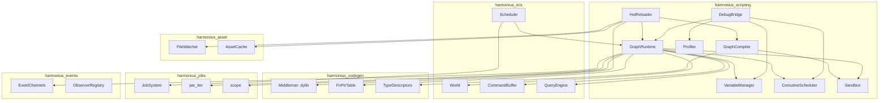
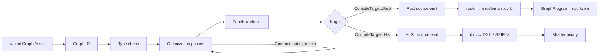
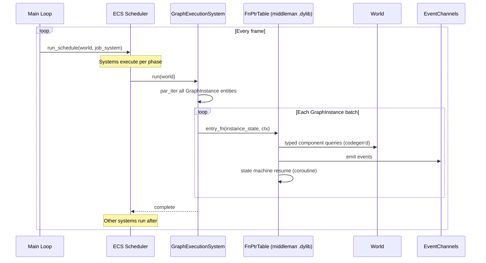
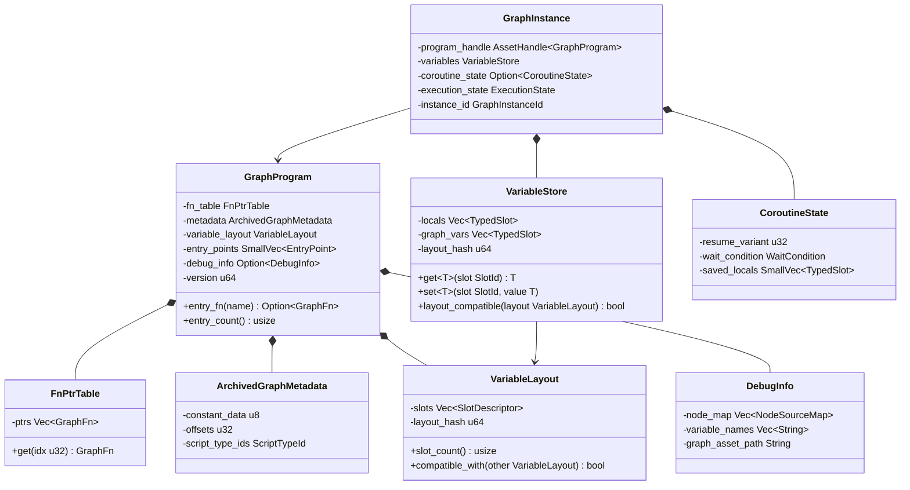
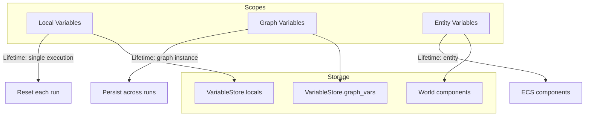
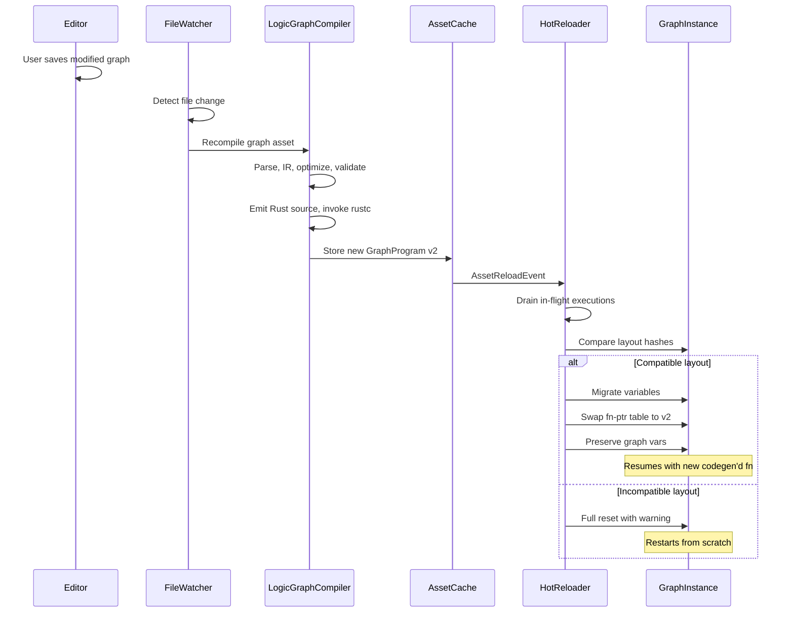
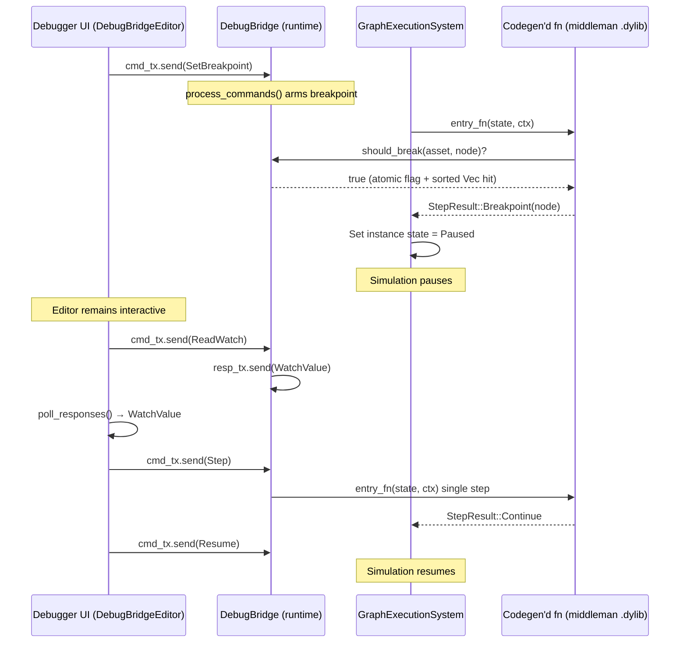
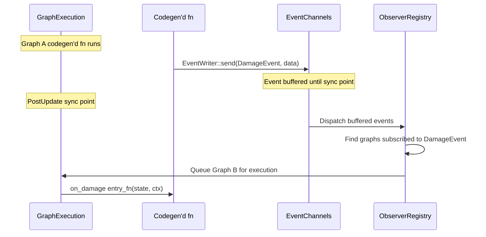

# Logic graph system design

## Requirements trace

> **Canonical sources:** Features, requirements, and user stories are defined in
> [features/game-framework/](../../features/), [requirements/game-framework/](../../requirements/),
> and [user-stories/game-framework/](../../user-stories/). The table below traces design elements to
> those definitions.

| Feature   | Requirement |
|-----------|-------------|
| F-13.4.1  | R-13.4.1    |
| F-13.4.2  | R-13.4.2    |
| F-13.4.3  | R-13.4.3    |
| F-15.8.1  | R-15.8.1    |
| F-15.8.4  | R-15.8.4    |
| F-15.8.12 | R-15.8.12   |
| —         | R-13.4.NF1  |
| —         | R-13.4.NF2  |

1. **F-13.4.1** — Gameplay logic graph integration with ECS world state access
2. **F-13.4.2** — Visual debugging with breakpoints, watch, remote debug
3. **F-13.4.3** — Hot reload of graph changes with state preservation
4. **F-15.8.1** — Universal logic graph runtime (compiled graphs)
5. **F-15.8.4** — Gameplay logic graphs (coroutines, ECS access)
6. **F-15.8.12** — Graph compilation and optimization passes
7. **—** — 1,000 active graphs in < 4 ms per frame at 60 fps
8. **—** — Hot reload turnaround < 1 second

## Overview

The logic graph system is the **universal extensibility layer for the entire engine**. Users never
write code. All logic — gameplay, AI, shaders, asset processing, editor tools, plugins — is authored
in the visual logic graph editor (F-15.8.4) and compiled to native Rust or HLSL by the graph
compiler (F-15.8.12). This document covers the full scope: compiler pipeline, codegen backends,
runtime, ECS integration, and editor tooling.

Key architectural choices:

1. **Native codegen, not interpreted.** Visual graphs compile to Rust source (CPU targets) or HLSL
   source (GPU targets). The bundled `rustc` compiles generated Rust into the middleman `.dylib`. No
   bytecode interpreter, no VM. This is the same codegen pipeline used for components and systems.
2. **ECS-primary (~90%).** Codegen'd graphs attach to entities as `GraphInstance` components. A
   `GraphExecutionSystem` runs in the ECS schedule like any other system. A small fraction of
   runtime logic (shader compilation, asset I/O callbacks) may run outside the ECS schedule.
3. **Static dispatch.** All node operations compile to typed Rust functions at codegen time. No
   vtables, no dynamic dispatch in the hot path.
4. **Sandboxed.** User graphs cannot express `unsafe`, raw pointers, or unbounded loops. The codegen
   pipeline enforces this by construction — the node palette has no unsafe operations. Generated
   modules compile with `#![forbid(unsafe_code)]`.
5. **Coroutine support.** Multi-frame sequences (boss phases, timed objectives) compile to
   synchronous Rust state machines: each yield point is an enum variant. No `async`/`await`, no
   Tokio. Pure synchronous state machine dispatched with `match`.
6. **Hot reload.** The runtime hot-reloads the middleman `.dylib` when graphs change, patching
   running `GraphInstance` state using a drain-then-swap protocol.
7. **Dual backend.** The graph compiler supports `CompileTarget::Rust` (CPU: gameplay, ECS,
   formulas, asset processing) and `CompileTarget::Hlsl` (GPU: shaders, compute, post-process). Math
   nodes work in both; ECS-access nodes are CPU-only; texture-sample nodes are GPU-only.

> **Authoring model.** The visual logic graph editor uses a Game Maker style keyboard-first
> workflow: hotkey to open a type-to-search palette, Enter to place and auto-connect nodes, arrow
> keys to navigate between nodes, and sequential action lists with implicit execution flow. See the
> Keyboard-First Interaction Model section in [visual-editors.md](../tools/visual-editors.md) for
> details.

### Crate structure

```text
harmonius_scripting/
├── compiler/
│   ├── ir.rs          # Typed IR (DAG of operations)
│   ├── passes.rs      # Constant folding, DCE, CSE, inlining
│   ├── typecheck.rs   # Type inference and validation
│   ├── codegen_rust.rs  # IR → Rust source (CPU target)
│   ├── codegen_hlsl.rs  # IR → HLSL source (GPU target)
│   └── validator.rs   # Sandbox and semantic validation
├── runtime/
│   ├── program.rs     # GraphProgram: fn-pointer table loaded from .dylib
│   ├── instance.rs    # GraphInstance component
│   ├── variable.rs    # VariableStore, scopes
│   ├── coroutine.rs   # CoroutineState: synchronous state machine
│   └── sandbox.rs     # Compile-time sandbox checks
├── schedule/
│   ├── system.rs      # GraphExecutionSystem (par_iter via job system)
│   ├── batch.rs       # Batched graph iteration
│   └── event.rs       # Event dispatch to graphs
├── debug/
│   ├── bridge.rs      # DebugBridge (crossbeam-channel command/response)
│   ├── watch.rs       # Watch expressions
│   ├── remote.rs      # Remote debug protocol
│   └── profiler.rs    # Per-graph profiling
└── reload/
    ├── watcher.rs     # File change detection
    ├── patcher.rs     # Drain-then-swap .dylib hot reload
    └── migration.rs   # Variable layout migration
```

## Architecture

### Module boundaries



### Compilation pipeline

The visual editor produces a serialized graph asset. The compiler transforms it through several
stages into generated Rust or HLSL source, which `rustc` or `dxc` compiles into the middleman
`.dylib` or shader binary. `GraphProgram` is a function-pointer table loaded from the `.dylib`.



### Graph execution within ECS schedule

Codegen'd graphs execute as part of the standard ECS system schedule. The `GraphExecutionSystem`
queries all entities with `GraphInstance` components and invokes their codegen'd Rust functions via
the fn-pointer table in `GraphProgram`.



### Core data structures



### Variable scoping

Variables exist at three scopes. The runtime manages each scope independently with separate storage
lifetimes.



## API design

### Graph program and codegen'd execution

There is no bytecode interpreter. Each visual logic graph compiles to a Rust function in the
middleman `.dylib`. `GraphProgram` is a handle to the fn-pointer table and rkyv-archived metadata
loaded from the `.dylib` and `.asset` files respectively. See RF-10 for rkyv metadata details.

```rust
/// Type alias for a codegen'd graph entry function.
/// Generated signature: takes instance state and
/// execution context, returns StepResult.
pub type GraphFn = fn(
    state: &mut GraphInstanceState,
    ctx: &ExecutionContext<'_>,
) -> StepResult;

/// Function-pointer table loaded from the
/// middleman .dylib. One fn per named entry point
/// (e.g. on_update, on_damage, on_enter).
/// Immutable after dylib load. Shared by all
/// instances of the same graph asset.
pub struct FnPtrTable {
    ptrs: Vec<GraphFn>,
}

impl FnPtrTable {
    /// Look up an entry fn by index.
    pub fn get(&self, idx: u32) -> Option<GraphFn>;
}

/// A compiled graph program. Immutable after
/// dylib load. Shared by all instances of the
/// same graph asset.
pub struct GraphProgram {
    /// Fn-pointer table into the middleman .dylib.
    fn_table: FnPtrTable,
    /// rkyv-archived constant pool and metadata.
    /// Zero-copy mmap access. See RF-10.
    metadata: &'static ArchivedGraphMetadata,
    /// Layout of all variables. Used for hot-reload
    /// compatibility checks.
    variable_layout: VariableLayout,
    /// Named entry points. Typically 1–4 entries.
    entry_points: SmallVec<[EntryPoint; 4]>,
    /// Debug source map. Present only in dev builds.
    debug_info: Option<DebugInfo>,
    /// Monotone version counter for hot-reload.
    version: u64,
}

/// Named entry point into the program.
pub struct EntryPoint {
    /// Interned name (e.g. "on_update").
    pub name: &'static str,
    /// Index into FnPtrTable.
    pub fn_idx: u32,
}

/// rkyv-archived constant pool and metadata.
/// Alignment guaranteed for SIMD types via
/// bytemuck/zerocopy. See RF-18.
#[derive(rkyv::Archive)]
pub struct GraphMetadata {
    /// Raw constant bytes. 16-byte aligned.
    pub constant_data: Vec<u8>,
    /// Byte offsets per constant index.
    pub offsets: Vec<u32>,
    /// Codegen'd type IDs (no std::any::TypeId).
    pub script_type_ids: Vec<ScriptTypeId>,
}

/// Codegen'd type identifier. Replaces std TypeId.
/// Generated as a C-like enum in the middleman.
/// See RF-3.
#[derive(Clone, Copy, Debug, PartialEq, Eq)]
pub struct ScriptTypeId(pub u32);

/// Compact slot identifier.
#[derive(Clone, Copy, Debug, PartialEq, Eq)]
pub struct SlotId(pub u16);

/// Unique identifier for a graph instance.
#[derive(Clone, Copy, Debug, PartialEq, Eq)]
pub struct GraphInstanceId(pub u64);

/// Node identifier for debug source mapping.
/// Canonically defined in algorithms.md as
/// `NodeId(pub u32)`.
#[derive(Clone, Copy, Debug, PartialEq, Eq)]
pub struct NodeId(pub u32);
```

### Graph instance component

```rust
/// Execution state of a graph instance.
#[derive(Clone, Copy, Debug, PartialEq, Eq)]
pub enum ExecutionState {
    /// Ready to execute this frame.
    Ready,
    /// Suspended in a coroutine yield.
    Suspended,
    /// Paused by a debugger breakpoint.
    Paused,
    /// Completed execution (no coroutine active).
    Complete,
    /// Encountered a runtime error.
    Error,
}

/// ECS component attached to entities that run
/// gameplay logic graphs. One entity may have
/// multiple GraphInstance components via a buffer
/// component.
#[derive(Component)]
pub struct GraphInstance {
    /// Handle to the shared compiled program.
    program: AssetHandle<GraphProgram>,
    /// Per-instance variable storage.
    variables: VariableStore,
    /// Coroutine suspension state, if any.
    coroutine: Option<CoroutineState>,
    /// Current execution state.
    state: ExecutionState,
    /// Unique instance identifier for debugging.
    instance_id: GraphInstanceId,
    /// Program version at last execution. Used
    /// to detect hot-reload version changes.
    loaded_version: u64,
}

impl GraphInstance {
    /// Create a new instance bound to a compiled
    /// graph program.
    pub fn new(
        program: AssetHandle<GraphProgram>,
        instance_id: GraphInstanceId,
    ) -> Self;

    /// Reset all local variables and coroutine
    /// state. Graph variables are preserved.
    pub fn reset(&mut self);

    /// Check if the loaded program version matches
    /// the current asset version.
    pub fn needs_reload(
        &self,
        current_version: u64,
    ) -> bool;
}
```

### Variable store

```rust
/// A single typed variable slot. 16 bytes fits
/// f32x4, Vec3+pad, Entity, or scalar types.
/// No runtime type registry — ScriptTypeId is
/// a codegen'd enum (see RF-3).
pub struct TypedSlot {
    /// 16-byte aligned storage. Use bytemuck for
    /// zero-copy cast to/from concrete types.
    data: [u8; 16],
    /// Codegen'd type identifier. No std TypeId.
    script_type_id: ScriptTypeId,
}

impl TypedSlot {
    /// Cast slot data to T. T must be Pod (bytemuck).
    pub fn get<T: bytemuck::Pod + Copy>(
        &self,
    ) -> Option<T>;

    /// Write a Pod value into the slot.
    pub fn set<T: bytemuck::Pod + Copy>(
        &mut self,
        value: T,
    );

    pub fn script_type_id(&self) -> ScriptTypeId;
}

/// Describes one slot in the variable layout.
pub struct SlotDescriptor {
    pub name: String,
    pub script_type_id: ScriptTypeId,
    pub scope: VariableScope,
    pub default_value: Option<TypedSlot>,
}

/// Variable scope classification.
#[derive(Clone, Copy, Debug, PartialEq, Eq)]
pub enum VariableScope {
    /// Reset each execution. Scratch registers.
    Local,
    /// Persist across executions within the same
    /// graph instance.
    Graph,
    /// Maps to an ECS component on the entity.
    /// Read/write via codegen'd typed queries.
    Entity,
}

/// Layout of all variables in a graph program.
/// Compared by hash for hot-reload compatibility.
pub struct VariableLayout {
    slots: Vec<SlotDescriptor>,
    layout_hash: u64,
}

impl VariableLayout {
    /// Check if another layout is compatible for
    /// state migration (same slots at same indices
    /// with same types).
    pub fn compatible_with(
        &self,
        other: &VariableLayout,
    ) -> bool;

    /// Compute a deterministic hash of the layout.
    pub fn compute_hash(&self) -> u64;

    pub fn slot_count(&self) -> usize;
}

/// Per-instance variable storage. Holds locals
/// and graph-scoped variables. Entity-scoped
/// variables are accessed through codegen'd
/// typed ECS queries — not stored here.
pub struct VariableStore {
    locals: Vec<TypedSlot>,
    graph_vars: Vec<TypedSlot>,
    layout_hash: u64,
}

impl VariableStore {
    pub fn new(layout: &VariableLayout) -> Self;

    pub fn get<T: bytemuck::Pod + Copy>(
        &self,
        slot: SlotId,
    ) -> T;

    pub fn set<T: bytemuck::Pod + Copy>(
        &mut self,
        slot: SlotId,
        value: T,
    );

    /// Check if the store's layout matches a
    /// program's expected layout.
    pub fn layout_compatible(
        &self,
        layout: &VariableLayout,
    ) -> bool;

    /// Migrate variables to a new layout. Copies
    /// values for slots whose name and type match.
    /// New slots get default values.
    pub fn migrate(
        &mut self,
        old_layout: &VariableLayout,
        new_layout: &VariableLayout,
    );

    /// Reset all local-scoped slots to defaults.
    pub fn reset_locals(
        &mut self,
        layout: &VariableLayout,
    );
}
```

### Coroutine support

Coroutines compile to synchronous Rust state machines. No `async`/`await`, no Tokio. Each yield
point in the logic graph becomes a variant of a codegen'd `ResumeVariant` enum. The generated
function is a `match` on the current variant — pure synchronous dispatch.

```rust
/// Condition that a suspended coroutine waits on.
/// Evaluated by coroutine_tick_system each frame.
#[derive(Clone, Debug)]
pub enum WaitCondition {
    /// Resume on the next frame.
    NextFrame,
    /// Resume after N frames have elapsed.
    Frames { remaining: u32 },
    /// Resume after N seconds (wall clock).
    Delay { remaining_secs: f32 },
    /// Resume when a specific event type fires.
    Event { event_type: EventTypeId },
}

/// Saved coroutine suspension point.
/// Coroutines are codegen'd state machines:
/// each yield point is a u32 variant index into
/// the generated match dispatch table.
pub struct CoroutineState {
    /// Variant index in the codegen'd state
    /// machine. Passed to the entry fn on resume.
    resume_variant: u32,
    /// The condition that must be met to resume.
    wait_condition: WaitCondition,
    /// Saved local variable snapshot at yield.
    /// Restored on resume. SmallVec avoids alloc
    /// for graphs with few locals (see RF-8).
    saved_locals: SmallVec<[TypedSlot; 8]>,
}

impl CoroutineState {
    /// Check if the wait condition is satisfied.
    pub fn is_ready(
        &self,
        current_frame: u64,
        delta_time: f32,
        pending_events: &EventBuffer,
    ) -> bool;

    /// Advance timers. Called each frame for
    /// suspended coroutines.
    pub fn tick(&mut self, delta_time: f32);
}
```

### Graph execution dispatch

There is no bytecode interpreter loop. `GraphExecutionSystem` invokes codegen'd Rust functions
directly via `GraphProgram::fn_table`. The codegen pipeline inserts budget checks at loop back-edges
(RF-2 item 8). Debug breakpoints compile as `if debug_enabled { check_breakpoint(node_id); }` and
eliminate entirely when disabled (RF-2 item 7).

```rust
/// Result of a single graph execution.
#[derive(Clone, Copy, Debug, PartialEq, Eq)]
pub enum StepResult {
    /// Execution continues (non-coroutine graphs).
    Continue,
    /// Program completed.
    Complete,
    /// Coroutine yielded (state machine suspended).
    Yield(WaitCondition),
    /// Breakpoint hit (debug builds only).
    Breakpoint(NodeId),
    /// Runtime error.
    Error(RuntimeError),
}

/// Runtime errors. All recoverable — the graph
/// instance transitions to Error state.
#[derive(Clone, Debug)]
pub enum RuntimeError {
    /// ECS component not found on the entity.
    ComponentNotFound {
        entity: Entity,
        component_id: ComponentId,
    },
    /// Division by zero.
    DivisionByZero,
    /// Instruction budget exceeded (infinite loop
    /// protection). Inserted at loop back-edges by
    /// the codegen pipeline.
    BudgetExhausted { limit: u32 },
    /// Type mismatch in variable slot access.
    TypeMismatch {
        slot: SlotId,
        expected: ScriptTypeId,
        actual: ScriptTypeId,
    },
    /// Query returned no results when required.
    EmptyQuery { query_id: QueryId },
}

/// Execution context passed to codegen'd fns.
/// Provides sandboxed access to the ECS world.
/// Carries a per-thread arena for temporaries
/// (reset at frame boundary — see RF-9).
pub struct ExecutionContext<'w> {
    /// The entity this graph instance is on.
    pub entity: Entity,
    /// Read-only world access.
    pub world: &'w World,
    /// Command buffer for deferred writes.
    pub commands: &'w CommandBuffer,
    /// Event writer for emitting events.
    pub events: &'w EventWriter,
    /// Current frame number.
    pub frame: u64,
    /// Delta time this frame.
    pub delta_time: f32,
    /// Maximum budget checks per execution.
    pub instruction_budget: u32,
    /// Per-thread arena for temporary allocs.
    /// Reset at frame boundary. See RF-9.
    pub arena: &'w ThreadArena,
    /// Debug bridge channel. None in release.
    pub debug: Option<&'w DebugBridge>,
}
```

### ECS system integration

```rust
/// Resource controlling graph execution parameters.
#[derive(Resource)]
pub struct GraphExecutionConfig {
    /// Maximum budget-check triggers per graph
    /// per frame. Codegen'd code increments a
    /// counter at loop back-edges. Default: 10,000.
    pub instruction_budget: u32,
    /// Enable debug instrumentation. Adds overhead
    /// when active. Disabled in release builds.
    pub debug_enabled: bool,
}

/// The ECS system that drives all graph execution.
/// Registered in the Update phase. Queries all
/// entities with GraphInstance components and
/// executes or resumes them.
pub fn graph_execution_system(
    query: Query<(
        Entity,
        &mut GraphInstance,
    )>,
    programs: Res<AssetStore<GraphProgram>>,
    config: Res<GraphExecutionConfig>,
    time: Res<Time>,
    commands: Commands,
    events: EventWriter<GraphEvent>,
    debug: Option<Res<DebugBridge>>,
);

/// System that ticks all suspended coroutines
/// and checks their wait conditions. Runs before
/// graph_execution_system so that newly-ready
/// coroutines execute this frame.
pub fn coroutine_tick_system(
    query: Query<&mut GraphInstance>,
    time: Res<Time>,
    pending_events: EventReader<AnyEvent>,
);

/// System that handles hot-reload version checks.
/// Runs after asset reload events fire.
pub fn graph_hot_reload_system(
    query: Query<&mut GraphInstance>,
    programs: Res<AssetStore<GraphProgram>>,
    reload_events: EventReader<AssetReloadEvent>,
);

/// Events emitted by the graph execution system.
#[derive(Event)]
pub enum GraphEvent {
    /// A graph instance completed execution.
    Completed {
        entity: Entity,
        instance_id: GraphInstanceId,
    },
    /// A graph instance encountered a runtime error.
    Error {
        entity: Entity,
        instance_id: GraphInstanceId,
        error: RuntimeError,
    },
    /// A graph instance was hot-reloaded.
    Reloaded {
        entity: Entity,
        instance_id: GraphInstanceId,
        compatible: bool,
    },
}
```

### Sandbox

Sandbox enforcement is by construction: the IR has no nodes for unsafe operations. Generated modules
compile with `#![forbid(unsafe_code)]`. User Rust templates (RF-24) are parsed with `syn` and
scanned for prohibited constructs before codegen. See RF-27 for full sandboxing details.

```rust
/// Validation pass applied at compile time to
/// ensure user graphs cannot perform unsafe
/// operations.
pub struct SandboxValidator;

/// Violations detected by the sandbox validator.
#[derive(Clone, Debug)]
pub enum SandboxViolation {
    /// Graph contains a potential infinite loop
    /// without a yield point.
    UnboundedLoop { node_id: NodeId },
    /// Graph accesses a component or resource not
    /// in the allowed set.
    UnauthorizedAccess {
        node_id: NodeId,
        target: String,
    },
    /// Graph exceeds maximum subgraph nesting
    /// depth.
    ExcessiveNesting {
        depth: u32,
        max: u32,
    },
    /// Graph uses a node type that is editor-only.
    EditorOnlyNode { node_id: NodeId },
}

impl SandboxValidator {
    /// Validate a compiled graph program for
    /// sandbox compliance. Called after compilation
    /// but before the program is made available
    /// to the runtime.
    pub fn validate(
        program: &GraphProgram,
        allowed_components: &[ComponentId],
        allowed_resources: &[ResourceId],
        allowed_events: &[EventTypeId],
    ) -> Result<(), Vec<SandboxViolation>>;
}

/// Runtime sandbox that enforces instruction
/// budgets. The codegen pipeline inserts budget
/// checks at loop back-edges in generated code.
pub struct RuntimeSandbox {
    /// Budget checks triggered this invocation.
    pub instructions_executed: u32,
    /// Maximum allowed before BudgetExhausted.
    pub budget: u32,
}

impl RuntimeSandbox {
    /// Check if the budget is exhausted.
    pub fn check(&self) -> bool;

    /// Increment the counter. Returns false if
    /// budget exceeded.
    pub fn tick(&mut self) -> bool;
}
```

### Debug bridge

The debug bridge uses crossbeam-channel command/response pairs. No `async`, no `AsyncRwLock`. The
editor sends `DebugCommand`; the runtime processes it at the next debug sync point and sends back
`DebugResponse`. `should_break` reads from an atomic flag plus a sorted `Vec` — no HashMap on the
hot path (RF-5, RF-7).

```rust
/// Commands sent from the editor to the runtime
/// via the debug bridge channel.
pub enum DebugCommand {
    SetBreakpoint {
        asset: AssetId,
        node: NodeId,
        config: BreakpointConfig,
    },
    RemoveBreakpoint {
        asset: AssetId,
        node: NodeId,
    },
    AddWatch(WatchEntry),
    Resume,
    Step,
    ReadWatch {
        instance_id: GraphInstanceId,
        slot: SlotId,
    },
}

/// Responses sent from the runtime to the editor.
pub enum DebugResponse {
    WatchValue {
        instance_id: GraphInstanceId,
        slot: SlotId,
        value: Option<TypedSlot>,
    },
    StateChanged(DebugState),
    Paused {
        instance_id: GraphInstanceId,
        node_id: NodeId,
        frame: u64,
    },
}

/// Debug bridge. Holds crossbeam-channel ends.
/// No async, no locks. Editor side owns the Sender
/// for commands and Receiver for responses.
pub struct DebugBridge {
    /// Runtime receives commands from the editor.
    cmd_rx: crossbeam_channel::Receiver<DebugCommand>,
    /// Runtime sends responses to the editor.
    resp_tx: crossbeam_channel::Sender<DebugResponse>,
    /// Sorted Vec of (AssetId, NodeId) pairs.
    /// Binary search on hot path. See RF-7.
    breakpoints: Vec<(AssetId, NodeId, BreakpointConfig)>,
    /// Watched slots. SmallVec avoids alloc for
    /// typical sessions (< 4 watches). See RF-8.
    watches: SmallVec<[WatchEntry; 4]>,
    /// Atomic flag: any breakpoints active?
    /// Checked first to avoid sorted Vec search.
    any_breakpoints: AtomicBool,
    state: DebugState,
}

/// Configuration for a single breakpoint.
pub struct BreakpointConfig {
    pub enabled: bool,
    /// Hit count condition. None = always break.
    pub hit_count: Option<u32>,
}

/// A watched variable slot.
pub struct WatchEntry {
    pub instance_id: GraphInstanceId,
    pub slot: SlotId,
    pub label: String,
}

/// The current debug session state.
pub enum DebugState {
    /// No debug session active.
    Inactive,
    /// Running normally with breakpoints armed.
    Running,
    /// Paused at a breakpoint.
    Paused {
        instance_id: GraphInstanceId,
        node_id: NodeId,
        frame: u64,
    },
    /// Single-stepping one call at a time.
    Stepping {
        instance_id: GraphInstanceId,
    },
}

impl DebugBridge {
    pub fn new() -> (Self, DebugBridgeEditor);

    /// Process pending commands from the editor.
    /// Called once per frame at the debug sync
    /// point. Synchronous — no await.
    pub fn process_commands(&mut self);

    /// Check if a breakpoint should fire.
    /// Fast path: atomic flag check first.
    /// Slow path: binary search on sorted Vec.
    pub fn should_break(
        &self,
        asset: AssetId,
        node: NodeId,
    ) -> bool;
}

/// Editor-side handle to the debug bridge.
pub struct DebugBridgeEditor {
    cmd_tx: crossbeam_channel::Sender<DebugCommand>,
    resp_rx: crossbeam_channel::Receiver<DebugResponse>,
}

impl DebugBridgeEditor {
    pub fn set_breakpoint(
        &self,
        asset: AssetId,
        node: NodeId,
        config: BreakpointConfig,
    );
    pub fn remove_breakpoint(&self, asset: AssetId, node: NodeId);
    pub fn add_watch(&self, entry: WatchEntry);
    pub fn resume(&self);
    pub fn step(&self);
    pub fn read_watch(
        &self,
        instance_id: GraphInstanceId,
        slot: SlotId,
    );
    /// Poll for responses (non-blocking).
    pub fn poll_responses(
        &self,
    ) -> impl Iterator<Item = DebugResponse> + '_;
}
```

### Hot reload

```rust
/// Handles patching running graph instances when
/// the editor recompiles a graph asset.
/// Uses drain-then-swap protocol: all in-flight
/// executions on the old .dylib complete before
/// the new fn-ptr table is installed (see RF-2).
pub struct HotReloader;

/// Result of a hot-reload attempt.
#[derive(Clone, Debug)]
pub enum ReloadResult {
    /// Variables migrated successfully. Execution
    /// continues with preserved graph-scoped state.
    Compatible,
    /// Variable layout changed incompatibly. The
    /// instance was reset with a warning.
    Incompatible { reason: String },
    /// The new program failed validation.
    ValidationFailed {
        errors: Vec<SandboxViolation>,
    },
}

impl HotReloader {
    /// Patch a running graph instance with a new
    /// compiled program version.
    ///
    /// 1. Compare variable layouts.
    /// 2. If compatible: migrate variables, swap
    ///    fn-ptr table, preserve graph vars.
    /// 3. If incompatible: reset instance fully,
    ///    emit warning event.
    pub fn patch(
        instance: &mut GraphInstance,
        old_program: &GraphProgram,
        new_program: &GraphProgram,
    ) -> ReloadResult;

    /// Migrate a variable store from one layout to
    /// another. Copies matching slots by name and
    /// type. New slots get default values. Removed
    /// slots are dropped.
    pub fn migrate_variables(
        store: &mut VariableStore,
        old_layout: &VariableLayout,
        new_layout: &VariableLayout,
    );
}
```

### Per-graph profiling

```rust
/// Per-graph-instance performance counters.
/// Collected when profiling is enabled.
pub struct GraphProfile {
    /// Total budget-check triggers this frame.
    pub instructions_executed: u32,
    /// Wall-clock time in microseconds.
    pub execution_time_us: u32,
    /// Number of ECS queries executed.
    pub query_count: u16,
    /// Number of events emitted.
    pub event_count: u16,
    /// Number of component reads.
    pub component_reads: u16,
    /// Number of component writes (deferred).
    pub component_writes: u16,
    /// Number of coroutine yields.
    pub yield_count: u16,
}

/// Resource accumulating per-frame profiling data
/// for all active graph instances.
/// Dense Vec indexed by GraphInstanceId lower bits
/// avoids HashMap overhead on this hot path.
/// See RF-7.
#[derive(Resource)]
pub struct GraphProfiler {
    /// Profiles indexed by instance slot.
    /// Slot = GraphInstanceId.0 % capacity.
    profiles: Vec<Option<(GraphInstanceId, GraphProfile)>>,
    enabled: bool,
}

impl GraphProfiler {
    pub fn new() -> Self;
    pub fn enable(&mut self);
    pub fn disable(&mut self);
    pub fn is_enabled(&self) -> bool;

    /// Record a completed execution.
    pub fn record(
        &mut self,
        id: GraphInstanceId,
        profile: GraphProfile,
    );

    /// Get the profile for a specific instance.
    pub fn get(
        &self,
        id: GraphInstanceId,
    ) -> Option<&GraphProfile>;

    /// Iterate all profiles for the current frame.
    pub fn all(
        &self,
    ) -> impl Iterator<Item = (GraphInstanceId, &GraphProfile)>;

    /// Reset all counters for the new frame.
    pub fn reset_frame(&mut self);

    /// Total execution time across all instances.
    pub fn total_time_us(&self) -> u64;
}
```

### Logic graph compiler

The `LogicGraphCompiler` (distinct from the shader `GraphCompiler` in algorithms.md) transforms
visual graph assets into Rust or HLSL source, then invokes `rustc` or `dxc` to produce the final
artifact. `IrNodeKind` is a codegen'd enum in the middleman — plugin node types are added by
recompiling the middleman (RF-14). No `TypeRegistry` — type descriptors come from codegen'd
`TypeDescriptors` in the middleman (RF-3).

```rust
/// Typed intermediate representation. A DAG of
/// typed operations with explicit data flow edges.
/// Each IR node maps 1:1 to a visual graph node.
pub struct GraphIr {
    pub nodes: Vec<IrNode>,
    pub edges: Vec<IrEdge>,
    pub entry_points: Vec<IrEntryPoint>,
}

pub struct IrNode {
    pub id: NodeId,
    /// Codegen'd enum variant per node type.
    /// Plugin nodes extend this via middleman.
    pub kind: IrNodeKind,
    /// SmallVec avoids alloc for typical nodes
    /// with <= 4 inputs/outputs. See RF-8.
    pub inputs: SmallVec<[IrPin; 4]>,
    pub outputs: SmallVec<[IrPin; 4]>,
}

pub struct IrEdge {
    pub from_node: NodeId,
    pub from_pin: u16,
    pub to_node: NodeId,
    pub to_pin: u16,
}

/// Compilation target selector.
pub enum CompileTarget {
    /// CPU logic: gameplay, ECS, formulas,
    /// asset processing. Emits Rust source.
    Rust,
    /// GPU shaders: materials, VFX compute,
    /// post-process. Emits HLSL source.
    Hlsl,
    /// Mixed: render graph pass = shader + Rust
    /// registration code. Emits both.
    RustAndHlsl,
}

/// The logic graph compiler. Named
/// `LogicGraphCompiler` to distinguish it from
/// the shader `GraphCompiler` in algorithms.md.
pub struct LogicGraphCompiler;

impl LogicGraphCompiler {
    /// Compile a graph asset into a GraphProgram.
    ///
    /// Passes:
    /// 1. Parse graph asset → GraphIr
    /// 2. Type check all connections (RF-25)
    /// 3. Dead node elimination (RF-26)
    /// 4. Constant folding (RF-26)
    /// 5. Common subexpression elimination (RF-26)
    /// 6. Subgraph inlining (RF-26)
    /// 7. Loop hoisting (RF-26)
    /// 8. Sandbox validation (RF-27)
    /// 9. Target-specific validation (RF-26)
    /// 10. Rust or HLSL source emit (RF-2)
    /// 11. rustc / dxc invocation
    /// 12. Load fn-ptr table from .dylib
    /// 13. Debug info emission (if enabled)
    pub fn compile(
        asset: &GraphAsset,
        type_descs: &TypeDescriptors,
        target: CompileTarget,
        debug: bool,
    ) -> Result<GraphProgram, CompileError>;
}

/// Compilation errors with source location.
#[derive(Clone, Debug)]
pub enum CompileError {
    /// Type mismatch on a connection.
    TypeMismatch {
        node: NodeId,
        pin: u16,
        expected: ScriptTypeId,
        actual: ScriptTypeId,
    },
    /// Disconnected required input pin.
    DisconnectedInput {
        node: NodeId,
        pin: u16,
    },
    /// Cycle in dataflow subgraph.
    DataflowCycle {
        nodes: Vec<NodeId>,
    },
    /// Sandbox violation detected at compile time.
    Sandbox(SandboxViolation),
    /// Unknown node type.
    UnknownNodeType {
        node: NodeId,
        type_name: String,
    },
    /// rustc or dxc invocation failed.
    CodegenFailed { stderr: String },
}
```

### Formula graphs

Formula graphs are a constrained logic graph subtype that codegen pure Rust functions with
`#![no_std]`. They are used for data table formula columns (F-13.7.2), material expression nodes,
VFX parameter expressions, animation blend weights, and AI utility scores. See RF-1.

The codegen pipeline emits one function per formula:

```rust
// Generated signature for a data table formula:
fn formula_<table>_<column>(
    row: &ArchivedRow,
    registry: &TableRegistry,
) -> T
```

Node palette for formula graphs (no coroutines, no ECS writes, no side effects):

- Arithmetic: `+`, `-`, `*`, `/`, `%`
- Comparison: `==`, `!=`, `<`, `>`, `<=`, `>=`
- Math: `f32::min`, `f32::max`, `f32::clamp`, `f32::floor`, `f32::ceil`
- Case analysis: `match` on enum variants, value ranges, or boolean conditions (exhaustive)
- Let-binding: `let name = expr;` for named intermediates
- Option/Result: `.unwrap_or()`, `.map()`, `.and_then()`, `?` operator
- Explicit cast: `as` (no implicit coercion)
- Table lookup: codegen'd accessor for foreign key row columns
- Aggregates: `iter().filter().map().sum()` / `.min()` / `.max()`

**Evaluation modes:**

| Mode | When used | Storage |
|------|-----------|---------|
| Bake-time | Asset bake. Inputs are static (e.g. `dps = damage * speed`) | Stored in baked table |
| Runtime | Inputs change at runtime. Cached with column invalidation | Evaluated on access |

Circular formula dependencies are detected via topological sort on the column dependency graph
(reuses `cycle_detection` from `data-systems/directed-graphs.md`).

### Cross-subsystem integration

Logic graphs integrate with every engine subsystem via nodes that codegen to typed Rust calls. See
RF-13 for the full integration table.

| Subsystem | Direction | Mechanism |
|-----------|-----------|-----------|
| ECS | read/write | Codegen'd typed queries |
| Events | emit/observe | `EventWriter`/`EventReader` |
| Data tables | read | Codegen'd row accessors |
| Attributes/effects | read/write | Component queries |
| Directed graphs | read | `GraphTraversalState` query |
| Timelines | bidirectional | Start/stop playback, timeline events |
| Spatial awareness | read | `AwarenessState` query |
| Physics | read | Raycast/overlap via physics API |
| Audio | write | Play/stop sound commands |
| UI | bidirectional | Widget events, data binding |
| Networking | bidirectional | Server-auth graph execution |
| Camera | write | Priority/blend commands |
| VFX | write | Spawn/despawn effect instances |
| Containers | read/write | Transfer/query commands |

### Universal extensibility

The logic graph system is the universal extensibility layer for the entire engine. The compilation
target selector (`CompileTarget`) determines whether a graph produces Rust (CPU) or HLSL (GPU). See
RF-20 for the full scope.

| Graph type | Target | Output |
|------------|--------|--------|
| Gameplay logic | Rust | System fn in middleman .dylib |
| Formula | Rust | Pure fn in middleman .dylib |
| Material expression | HLSL | Pixel/vertex shader |
| VFX compute | HLSL | Compute shader |
| Post-process | HLSL + Rust | Shader + render graph node |
| Custom render pass | HLSL + Rust | Shader + render graph node |
| Asset processor | Rust | Pipeline fn in middleman .dylib |
| Editor extension | Rust | Editor panel/tool in middleman |
| Component definition | Rust | Struct in middleman .dylib |
| Behavior tree | Rust | `tick()` fn in middleman .dylib |
| Plugin package | Rust + HLSL | Full middleman contribution |

### AI integration

Logic graphs integrate with all AI subsystems. See RF-21 for the full node palette.

| AI subsystem | Node types | Output |
|---|---|---|
| Navigation | Query navmesh, find path, follow path, off-mesh links | `NavPath` |
| Steering | Seek, flee, arrive, wander, obstacle avoidance, cohesion | Desired velocity |
| Behavior trees | Sequence, Selector, Parallel, Decorator, Condition, Action | `tick()` fn |
| State machines | State nodes, Transition edges with conditions | `match`-based state fn |
| Utility AI | Score evaluation, response curve, weighted random, highest-score | Selected action |
| Spatial queries | Range query, cone (vision), raycast (LOS), nearest entity | Query results |
| Perception | Awareness level, highest threat, entities at level | From `AwarenessState` |

Behavior trees and state machines are constrained logic graph subtypes — their node palettes are
restricted to the appropriate structural nodes. All compile to Rust functions in the middleman.

### Type definitions via logic graphs

Users define new data types visually. See RF-22.

- **Struct definition** — "Define Struct" node. User adds named fields with types from a dropdown.
  Codegen produces a Rust `struct` with `#[derive(Clone, Debug)]`, rkyv derives, and field accessor
  nodes (get/set per field).
- **Enum definition** — "Define Enum" node. User adds named variants with optional associated data.
  Codegen produces a Rust `enum` with exhaustive `match` as a case-analysis node, variant
  constructor nodes, and `is_variant()` check nodes.
- **Nested types** — structs may contain other user-defined structs or enums. The codegen pipeline
  resolves dependency order via topological sort.
- **Component registration** — a user-defined struct marked as an ECS component generates a
  `Component` impl and registers it in the middleman.
- **Event registration** — a user-defined struct marked as an event type generates an `Event` impl.

### Trait implementation via logic graphs

Users implement engine-defined trait interfaces visually. See RF-23.

- **Trait = interface contract** — engine defines traits (`Damageable`, `Interactable`, `Saveable`).
  For each method, the user creates a logic graph that implements the method body.
- **Codegen output**:
  `impl Damageable for MyStruct { fn take_damage(&mut self, amount: f32) { … } }`
- **Plugin-defined traits** — plugins can define new traits. Other plugins implement them. All
  codegen'd, all static dispatch. No `dyn` in hot paths.

### Rust code templates

Power users provide Rust source templates with placeholder markers. See RF-24.

- Placeholders: `{{field_list}}`, `{{match_arms}}`, `{{struct_name}}`.
- Templates are parsed by `syn`, scanned for prohibited constructs, then filled by the codegen
  pipeline. Output compiles into the middleman `.dylib`.
- Engine ships default templates. Users and plugins add custom templates. Templates are versioned.

### Type checking and AST validation

The compiler validates correctness before codegen. See RF-25 and RF-26.

1. **Type inference** — types propagate through the graph. Output type of `+` on two `f32` inputs is
   `f32`. Mismatches are reported as editor errors with click-to-navigate.
2. **AST validation** — no cycles in data flow (DAG), all required inputs connected, exhaustive
   match arms, no unreachable nodes (DCE warning), no conflicting mutable borrows.
3. **Semantic validation** — systems that write a component warn if they run in parallel with
   readers of the same component; event types match at emit/observe pairs; no hidden global state.
4. **Optimization passes** (IR level before codegen): constant folding, dead code elimination,
   common subexpression elimination, loop hoisting, subgraph inlining.
5. **Target-specific validation** — Rust target rejects GPU-only nodes; HLSL target rejects CPU-only
   nodes; mixed target validates CPU/GPU boundary type compatibility.

### Algorithm references

The following algorithms are used in the compiler pipeline. See RF-17.

| Algorithm | Used in | Reference |
|-----------|---------|-----------|
| Constant folding | Optimization pass | <https://en.wikipedia.org/wiki/Constant_folding> |
| Dead code elimination | Optimization pass | <https://en.wikipedia.org/wiki/Dead_code_elimination> |
| Common subexpression elim | Optimization pass | <https://en.wikipedia.org/wiki/Common_subexpression_elimination> |
| Coroutine state machine | Coroutine codegen | <https://without.boats/blog/coroutines-as-state-machines/> |
| Topological sort | Cycle detection, formula deps | <https://en.wikipedia.org/wiki/Topological_sorting> |
| Type inference (HM) | Type checking pass | <https://en.wikipedia.org/wiki/Hindley%E2%80%93Milner_type_system> |

### Safety and FFI sandboxing

All codegen'd code is safe by construction. See RF-27 for full details.

1. The IR has no nodes for unsafe operations — it is impossible to express `unsafe` in the visual
   graph.
2. Generated modules compile with `#![forbid(unsafe_code)]` and `#![no_std]` where applicable.
3. User Rust templates (RF-24) are parsed by `syn` and scanned for prohibited constructs before
   codegen.
4. Engine FFI lives in the engine binary, not in the middleman `.dylib`. Codegen'd code calls engine
   APIs through safe Rust trait boundaries.
5. Hot-reload uses a drain-then-swap protocol: no fn-pointer from the old `.dylib` is called after
   the new `.dylib` is loaded.

### Custom viewport tools

Logic graphs implement the `ViewportTool` trait to define custom viewport tools. See RF-28.

```rust
/// Trait implemented by codegen'd viewport tool
/// graphs. Each method is a logic graph entry fn.
pub trait ViewportTool {
    fn on_activate(&mut self, ctx: &ToolContext);
    fn on_deactivate(&mut self, ctx: &ToolContext);
    fn on_input(
        &mut self,
        event: &InputEvent,
        ctx: &ToolContext,
    );
    fn on_draw_gizmos(&self, gizmos: &mut GizmoWriter);
    fn on_apply(&mut self, ctx: &ToolContext);
}
```

Custom gizmos are also logic graphs that output draw commands for the debug overlay.

## Data flow

### Frame execution flow

Each frame, graph instances move through a lifecycle driven by three ECS systems. Execution order
is: PreUpdate (coroutine tick) → Update (graph execution) → PostUpdate (command flush). See RF-15
for resource access and sync-point details.

```rust
// Phase: PreUpdate
//
// 1. coroutine_tick_system
//    - For each Suspended instance: tick timers,
//      check wait conditions.
//    - If condition met: transition to Ready.
//    - Read-only: Res<Time>, EventReader<AnyEvent>
//    - Read-write: Query<&mut GraphInstance>
//
// Phase: Update
//
// 2. graph_execution_system
//    - For each Ready instance: call codegen'd fn
//      via GraphProgram::fn_table.
//    - For each newly-Ready (was Suspended):
//      resume state machine via resume_variant.
//    - Execution produces one of:
//      Complete, Yield, Breakpoint, Error.
//    - Read-write: world components (per access
//      manifest), EventWriter<GraphEvent>
//    - Deferred: commands buffered in CommandBuffer
//
// Phase: PostUpdate
//
// 3. graph_hot_reload_system
//    - If AssetReloadEvent fired for a graph,
//      find all instances using that asset,
//      drain in-flight executions, swap fn-ptr
//      table (drain-then-swap protocol).
//
// Sync point: command flush
//    - ECS scheduler flushes CommandBuffer after
//      Update phase. Deferred writes become
//      visible to PostUpdate systems.
```

### Hot reload sequence



### Debug session flow



### Event handling in graphs

Graphs can both emit and respond to typed events. Event-triggered graphs use entry points that are
invoked when a matching event fires.



## Platform considerations

The logic graph runtime is platform-agnostic. All platform-specific behavior is delegated to
underlying subsystems (ECS, job system, I/O). The codegen'd Rust compiles to native code on each
target architecture — no bytecode, no interpreter overhead.

The scripting runtime is dimension-agnostic. The node palette includes 2D and 3D variants for
transform, physics, and spatial operations. `Transform2D`/`Transform` nodes, 2D/3D physics queries,
and 2D/3D BVH spatial queries are all available. See RF-12.

| Concern | Approach | Notes |
|---------|----------|-------|
| Code generation | Rust → native (rustc) | ARM/x86_64/WASM per target |
| Coroutine yields | Sync state machine (match) | No async, no Tokio |
| Parallel execution | `par_iter` via job system | crossbeam-deque work-stealing |
| Debug transport | crossbeam-channel cmd/resp | No async sockets in game runtime |
| Hot reload file watch | `FileWatcher` | IOCP / FSEvents / inotify |
| Profiling timers | `std::time::Instant` | Platform-native high-res clock |

### Per-platform notes

| Platform | Tier | Hot reload | Notes |
|----------|------|-----------|-------|
| Windows | Desktop | IOCP file watch | `windows-rs` |
| macOS | Desktop | FSEvents (GCD) | `dispatch2` |
| Linux | Desktop | inotify (rustix) | |
| iOS | Mobile | Disabled in release | UIKit main thread |
| Android | Mobile | Disabled in release | |
| Nintendo Switch | Console | Disabled | Static link only |
| Xbox | Console | Disabled | Static link only |
| PlayStation | Console | Disabled | Static link only |
| Meta Quest | XR/Mobile | Disabled | Low budget (see below) |
| Dedicated server | Server | Enabled | Headless |

### Scaling tiers

| Tier | Platforms | Max active graphs | Budget checks | Profiling |
|------|-----------|------------------|---------------|-----------|
| Mobile/XR | iOS, Android, Quest | 256 | 5,000/instance | Off by default |
| Desktop | Windows, macOS, Linux | 1,000 | 10,000/instance | Optional |
| Console | Switch, Xbox, PS | 512 | 7,500/instance | Off by default |
| Server | Dedicated server | 4,000 | 20,000/instance | Optional |

### Memory budget

| Component | Per instance | 1,000 instances |
|-----------|-------------|-----------------|
| VariableStore (64 slots) | 1,088 bytes | ~1.06 MiB |
| CoroutineState | 96 bytes | ~93.8 KiB |
| GraphInstance metadata | 64 bytes | ~62.5 KiB |
| Total per instance | ~1,248 bytes | ~1.22 MiB |

`GraphProgram` (fn-ptr table + rkyv metadata) is shared by all instances of the same graph asset. A
typical 50-node graph produces ~4 KiB of compiled Rust (after LTO) + ~512 bytes of rkyv metadata.

## Test plan

### Unit tests

| Test | Req |
|------|-----|
| `test_codegen_add_f32` | R-13.4.1 |
| `test_codegen_branch` | R-13.4.1 |
| `test_codegen_get_component` | R-13.4.1 |
| `test_codegen_set_component` | R-13.4.1 |
| `test_codegen_emit_event` | R-13.4.1 |
| `test_codegen_query_iter` | R-13.4.1 |
| `test_codegen_blackboard_get_set` | R-13.4.1 |
| `test_codegen_state_machine_transition` | R-13.4.1 |
| `test_variable_store_get_set` | R-13.4.1 |
| `test_variable_layout_hash` | R-13.4.3 |
| `test_variable_migration_compatible` | R-13.4.3 |
| `test_variable_migration_incompatible` | R-13.4.3 |
| `test_coroutine_yield_next_frame` | R-15.8.4 |
| `test_coroutine_yield_frames` | R-15.8.4 |
| `test_coroutine_yield_delay` | R-15.8.4 |
| `test_coroutine_yield_event` | R-15.8.4 |
| `test_sandbox_budget_exhaustion` | R-13.4.1 |
| `test_sandbox_unauthorized_component` | R-13.4.1 |
| `test_sandbox_unbounded_loop` | R-13.4.1 |
| `test_compiler_dead_node_elimination` | R-15.8.12 |
| `test_compiler_constant_folding` | R-15.8.12 |
| `test_compiler_type_mismatch` | R-15.8.12 |
| `test_compiler_cycle_detection` | R-15.8.12 |
| `test_debug_breakpoint_hit` | R-13.4.2 |
| `test_debug_step` | R-13.4.2 |
| `test_debug_watch_read` | R-13.4.2 |
| `test_profiler_budget_count` | R-13.4.NF1 |
| `test_profiler_execution_time` | R-13.4.NF1 |

1. **`test_codegen_add_f32`** — Codegen graph with f32 add, compile, invoke fn, verify result.
2. **`test_codegen_branch`** — Codegen conditional branch, verify taken and not-taken paths.
3. **`test_codegen_get_component`** — Codegen'd fn reads Health component from world, returns value.
4. **`test_codegen_set_component`** — Codegen'd fn writes Health via CommandBuffer, verify flush.
5. **`test_codegen_emit_event`** — Codegen'd fn emits DamageDealt, verify event channel.
6. **`test_codegen_query_iter`** — Codegen'd fn iterates Query results, verify count.
7. **`test_codegen_blackboard_get_set`** — Codegen'd fn reads/writes AI blackboard keys.
8. **`test_codegen_state_machine_transition`** — Codegen'd fn triggers AI state transition.
9. **`test_variable_store_get_set`** — Set and get variables at all three scopes.
10. **`test_variable_layout_hash`** — Identical layouts produce identical hashes.
11. **`test_variable_migration_compatible`** — Migrate variables between compatible layouts.
12. **`test_variable_migration_incompatible`** — Detect incompatible layout, trigger reset.
13. **`test_coroutine_yield_next_frame`** — State machine suspends at NextFrame, resumes next frame.
14. **`test_coroutine_yield_frames`** — Frames(3) variant resumes after exactly 3 frames.
15. **`test_coroutine_yield_delay`** — Delay(1.0) variant resumes after 1 second of delta time.
16. **`test_coroutine_yield_event`** — Event variant suspends, resumes when event fires.
17. **`test_sandbox_budget_exhaustion`** — Tight loop hits budget check, returns BudgetExhausted.
18. **`test_sandbox_unauthorized_component`** — Access to disallowed component rejected at compile.
19. **`test_sandbox_unbounded_loop`** — Loop without budget check detected by SandboxValidator.
20. **`test_compiler_dead_node_elimination`** — Unreachable nodes produce no Rust source.
21. **`test_compiler_constant_folding`** — Static expressions evaluate at compile time.
22. **`test_compiler_type_mismatch`** — Type error on a connection produces CompileError.
23. **`test_compiler_cycle_detection`** — Dataflow cycle produces DataflowCycle error.
24. **`test_debug_breakpoint_hit`** — Breakpoint check fires, instance transitions to Paused.
25. **`test_debug_step`** — Single-step advances exactly one codegen'd call.
26. **`test_debug_watch_read`** — Read a watched variable value from a paused instance.
27. **`test_profiler_budget_count`** — Profile reports correct budget-check trigger count.
28. **`test_profiler_execution_time`** — Profile reports non-zero execution time.

### Integration tests

| Test | Req |
|------|-----|
| `test_graph_ecs_component_read_write` | R-13.4.1 |
| `test_graph_event_emission` | R-13.4.1 |
| `test_graph_ai_blackboard` | R-13.4.1 |
| `test_graph_state_machine_transition` | R-13.4.1 |
| `test_graph_ecs_schedule_order` | R-13.4.1 |
| `test_graph_coroutine_boss_encounter` | R-15.8.4 |
| `test_hot_reload_compatible` | R-13.4.3 |
| `test_hot_reload_incompatible` | R-13.4.3 |
| `test_hot_reload_concurrent_100` | R-13.4.3 |
| `test_hot_reload_turnaround` | R-13.4.NF2 |
| `test_debug_channel_connect` | R-13.4.2 |
| `test_debug_no_side_effects` | R-13.4.2 |
| `test_debug_channel_stability` | R-13.4.2 |
| `test_no_text_scripting_api` | R-13.4.1 |

1. **`test_graph_ecs_component_read_write`** — Codegen graph reads Health, subtracts damage, writes
   Health via CommandBuffer. Verify component updated after command flush.
2. **`test_graph_event_emission`** — Codegen'd fn emits DamageDealt event. Verify listener system
   receives it.
3. **`test_graph_ai_blackboard`** — Codegen'd fn reads/writes AI blackboard keys. Verify blackboard
   state matches.
4. **`test_graph_state_machine_transition`** — Codegen'd fn triggers AI state transition. Verify
   state machine updates.
5. **`test_graph_ecs_schedule_order`** — Two graphs with ordering constraints execute in declared
   order.
6. **`test_graph_coroutine_boss_encounter`** — Three-phase boss encounter state machine: phase 1 (5
   frames) → phase 2 (3 frames) → phase 3. Verify timing and state.
7. **`test_hot_reload_compatible`** — Modify a graph (add a node, keep variables). Verify
   drain-then-swap preserves variable values.
8. **`test_hot_reload_incompatible`** — Remove a variable from a graph. Verify clean restart with
   warning event.
9. **`test_hot_reload_concurrent_100`** — Hot-reload while 100 instances execute. Verify no crashes
   or fn-ptr table corruption.
10. **`test_hot_reload_turnaround`** — Modify a 50-node graph. Verify reload completes in < 1
    second.
11. **`test_debug_channel_connect`** — Open debug bridge channel, send SetBreakpoint, verify Paused
    response.
12. **`test_debug_no_side_effects`** — Run identical sessions with/without debugger. Verify
    identical world state.
13. **`test_debug_channel_stability`** — Send/receive 50 command/response cycles. Verify no panics.
14. **`test_no_text_scripting_api`** — Verify no public API accepts text-based scripts or code
    strings.

### Benchmarks

| Benchmark | Target | Source |
|-----------|--------|--------|
| 1,000 graphs, 10 nodes each | < 4 ms total at 60 fps | R-13.4.NF1 |
| Single graph, 100 nodes | < 50 µs | R-13.4.NF1 |
| Codegen'd fn call overhead | < 2 ns per call | R-15.8.12 |
| Hot reload turnaround (50 nodes) | < 1 second | R-13.4.NF2 |
| Variable store get/set | < 5 ns per access | R-13.4.1 |
| Coroutine state machine resume | < 10 ns | R-15.8.4 |
| Compiler throughput (50-node graph) | < 100 ms | R-15.8.12 |
| GraphProgram fn-table memory (50 nodes) | < 4 KiB shared | R-13.4.NF1 |
| GraphInstance memory (64 slots) | < 1.5 KiB per instance | R-13.4.NF1 |

## Design Q&A

**Q1. What is the biggest constraint limiting this design?**

The no-code constraint forces all logic through visual graphs compiled to native Rust. The 4 ms
budget for 1,000 graphs (R-13.4.NF1) leaves only 4 µs per graph per frame. Native codegen eliminates
interpreter overhead entirely — graphs compile to the same code a programmer would write by hand.
The binding constraint is now hot-reload latency: `rustc` incremental compile must complete in < 1
second (R-13.4.NF2). The bundled toolchain and incremental compilation targets this.

**Q2. How can this design be improved?**

The hot reload system (F-13.4.3) patches running instances but cannot migrate coroutine variant
indices across yield-point additions. If a designer adds a new yield between two existing nodes, all
running instances at that resume point must restart. A migration that maps old variant indices to
new ones would reduce lost state during iteration. The sandbox enforces budget checks at loop
back-edges but does not enforce a per-frame wall-clock limit. A watchdog terminating graphs
exceeding a microsecond budget would prevent user-authored infinite loops from freezing the frame.

**Q3. Is there a better approach?**

A text-based scripting language (Lua, Wren, or a custom DSL) would offer higher expressiveness and
faster iteration for complex logic. We explicitly reject this approach because it violates the
no-code engine constraint. The visual graph model makes the engine accessible to non-programmers.
Complex patterns (nested loops, deep conditions) are mitigated by subgraph encapsulation — authored
once as library subgraphs and reused via graph references.

**Q4. Does this design solve all customer problems?**

The design lacks a per-node execution time profiler inside the graph debugger. The remote debugger
(F-13.4.2) supports breakpoints and watches but not performance profiling, which is critical for
finding bottleneck nodes in complex graphs. A flame-graph-style per-node timing view would help
designers optimize logic. The design also lacks a graph unit testing framework — designers cannot
write automated tests for their logic graphs. A test-runner feeding input events and asserting
output state would enable test-driven visual logic development across all game genres.

**Q5. Is this design cohesive with the overall engine?**

The logic graph system is deeply integrated with the ECS architecture. `GraphInstance` is a standard
ECS component, `GraphExecutionSystem` runs in the normal system schedule, and all ECS access uses
codegen'd typed queries that respect system ordering. The compiler shares the build cache
(F-15.11.3) with the asset pipeline. The coroutine model uses a synchronous state machine consistent
with the engine's synchronous-only runtime policy — no `async`/`await`, no Tokio. The compiler
targets the same middleman `.dylib` pipeline as all other codegen'd types, making logic graphs a
first-class part of the engine's extensibility model.

## Open questions

1. **Parallel graph execution granularity** — `graph_execution_system` uses `par_iter` over entity
   batches. Graphs that emit events or write to overlapping components create ordering dependencies.
   Should graphs declare access sets like ECS systems for automatic conflict detection and safe
   parallel scheduling?

2. **Maximum variable slot size** — `TypedSlot` is fixed at 16 bytes (f32x4, mat4 column, entity
   reference). Larger types (strings, arrays) require heap allocation. Is 16 bytes sufficient for
   the majority of gameplay variables, or should we support 32-byte slots for matrix types?

3. **Coroutine nesting** — The current design supports a single coroutine per graph instance. Should
   nested coroutines (a coroutine that calls a subgraph which also yields) be supported? This adds a
   coroutine state stack to each instance.

4. **Event-triggered entry points** — Should event-triggered graph executions run in the same frame
   as the event emission, or be deferred to the next frame? Same-frame execution enables tighter
   feedback loops but risks cascading event storms.

5. **Debug bridge wire protocol** — The debug bridge uses crossbeam-channel inside a process. For
   remote debugging (separate editor process), a wire protocol is needed. Should this reuse DAP
   (Debug Adapter Protocol) for standard editor integration, or define a custom binary protocol
   optimized for graph debugging?

6. **Graph instance pooling** — For entities that frequently spawn and despawn (projectiles,
   particles), should `GraphInstance` components use a pool to avoid allocation overhead? The
   `VariableStore` heap allocation is the main cost per instance.

7. **Coroutine variant migration across hot-reload** — Adding a yield point to a live graph changes
   the `ResumeVariant` enum layout. Running instances at old variant indices cannot resume
   correctly. Should hot-reload record a variant remapping table to preserve running coroutines
   across structural changes?

## Review feedback

### RF-1: Formula evaluation via logic graphs [APPLIED]

Data table formula columns (F-13.7.2) must use logic graphs as their evaluation mechanism. The
scripting design needs a "Formula graph" execution mode alongside the existing gameplay graph mode:

1. **Formulas are Rust** — visual logic graph nodes codegen actual Rust source code (`#![no_std]`
   with `core` + `libm`). The bundled rustc compiles it into the middleman .dylib — the same
   pipeline that already exists for codegen'd types. This is not "Rust-inspired" — it literally IS
   Rust. Generated code has full type safety, zero runtime overhead, and benefits from rustc
   optimizations (inlining, constant folding, dead code elimination). This is part of being
   Harmonius — one language, one compiler, one type system across the entire engine.
2. **Formula graph definition** — a logic graph subtype with a constrained node palette. Every node
   codegens to a Rust expression or statement:
   - Arithmetic: `+`, `-`, `*`, `/`, `%`
   - Comparison: `==`, `!=`, `<`, `>`, `<=`, `>=`
   - Math: `f32::min`, `f32::max`, `f32::clamp`, `f32::floor`, `f32::ceil`
   - **Case analysis**: `match` on enum variants, value ranges, or boolean conditions with
     exhaustive arm coverage
   - Let-binding: `let name = expr;` for named intermediates
   - Option/Result: `.unwrap_or()`, `.map()`, `.and_then()`, `?` operator
   - Explicit cast: `as` (no implicit coercion)
   - Table lookup: codegen'd accessor for foreign key row columns
   - Aggregates: `iter().filter().map().sum()` / `.min()` / `.max()`
   - No coroutines, no side effects, no ECS writes.
3. **Input nodes** — read column values from the current row or cross-table via foreign key. Input
   node types are generated by the codegen pipeline from the table schema.
4. **Output node** — produces the formula column's computed value. Type must match the formula
   column's declared type.
5. **Compilation** — the codegen pipeline emits a Rust function per formula:
   `fn formula_<table>_<column>(row: &ArchivedRow, registry: &TableRegistry) -> T` Bundled rustc
   compiles it into the middleman .dylib. Hot-reload recompiles only the changed formula functions.
6. **Evaluation modes**:
   - **Bake-time** — evaluated during asset bake. Result stored as a static value in the baked
     table. Used for derived data that doesn't change at runtime (e.g.,
     `let dps = damage * attack_speed`).
   - **Runtime** — evaluated on access. Cached with invalidation when input columns change. Used for
     formulas depending on runtime state.
7. **Dependency tracking** — formula graphs declare which columns they read. Circular dependencies
   between formula columns are detected at validation time via topological sort on the column
   dependency graph (reuse directed graph `cycle_detection` from data-systems/directed-graphs.md).
8. **Editor UX** — clicking a formula column cell in the table editor opens the logic graph editor
   with the formula graph pre-loaded. The cell displays the computed result (read-only). A formula
   icon distinguishes formula cells from static cells. The editor can show the generated Rust source
   for debugging.
9. **Broader applicability** — the same "formulas are Rust" codegen pipeline applies to all graph
   types that compute values: material graph expression nodes, VFX graph parameter expressions,
   animation blend weight expressions, AI utility score functions. One codegen path, one compiler,
   one set of node types shared across the entire engine.

### RF-2: Replace bytecode VM with native Rust codegen [APPLIED]

The entire bytecode VM (Opcode enum, vm.rs executor, instruction budget) must be replaced with the
RF-1 codegen model as the PRIMARY execution path for ALL gameplay logic graphs — not just formulas.
The bytecode architecture directly contradicts two hard constraints: "compile to ARM/x86_64, no
bytecode VM" and "codegen is the preferred method for all dynamic content."

RF-1 already describes the correct pattern. Extend it to all graphs:

1. **Graph compiler** emits `.rs` source for each logic graph asset. Each graph becomes one or more
   Rust functions. Coroutine graphs become state machines (enum variants per yield point).
2. **Bundled rustc** compiles the generated `.rs` into the middleman .dylib. Hot-reload recompiles
   only changed graphs.
3. **`GraphProgram`** becomes a function pointer table loaded from the .dylib — not a bytecode
   buffer. Each entry point is a `fn` pointer.
4. **`GraphInstance`** stores state (variable slots, coroutine resume point) as a plain struct. The
   generated Rust function reads and writes this state directly — no interpreter loop.
5. **ECS access** in generated code uses codegen'd typed queries (not opcode-based
   `EcsRead`/`EcsWrite` instructions). The codegen pipeline knows which components each graph
   reads/writes and generates the appropriate `Query<&T>` / `Query<&mut T>` calls.
6. **Coroutines** become Rust state machines: each yield point is an enum variant. The
   `CoroutineState` stores the current variant + saved locals. Resume dispatches to the correct
   match arm. No Tokio, no async/await — pure synchronous state machine.
7. **Debug breakpoints** in the native model are compiled as conditional calls:
   `if debug_enabled { check_breakpoint(node_id); }`. When debugging is disabled, these compile away
   entirely (dead code elimination). When enabled, `check_breakpoint` reads from a sorted Vec or
   atomic flag — no HashMap.
8. **Instruction budget** — the codegen pipeline inserts periodic budget checks into generated code
   (e.g., every N operations or at loop back-edges). If budget exceeded, the function returns early
   with a `BudgetExhausted` result. Same safety guarantee as the bytecode budget, but at native
   speed.

### RF-3: Remove all Reflect/TypeRegistry/TypeId [APPLIED]

Remove `harmonius_reflect` dependency. Replace `T: Reflect + Copy` on `TypedSlot` with codegen'd
typed accessors. Replace `TypeId` with codegen'd `ScriptTypeId` enum. Replace `TypeRegistry` in
`GraphCompiler` with codegen'd type descriptor table from middleman.

### RF-4: Remove all async/await and Tokio [APPLIED]

Remove `async fn` from `DebugBridge`. Replace `AsyncRwLock` with crossbeam-channel command/response
protocol. Remove Tokio runtime from architecture diagram. Fix Q5 answer: delete "async/await
everywhere policy" — the engine has the opposite policy.

### RF-5: Replace AsyncRwLock with channels [APPLIED]

`DebugBridge` uses `AsyncRwLock<BreakpointSet>`, `AsyncRwLock<WatchSet>`, `AsyncRwLock<DebugState>`.
Replace with crossbeam-channel: editor sends `DebugCommand`, runtime sends `DebugResponse`.
`should_break` reads from atomic flag or sorted Vec during debug sync point.

### RF-6: Custom job system references [APPLIED]

Replace `ThreadPool` and `TaskGraph` with the engine's job system (`JobSystem`, `scope()`,
`par_iter`) built on crossbeam-deque. Remove Tokio from architecture diagram. Parallel graph
execution uses `par_iter` over entity batches within `scope()`.

### RF-7: Replace HashMap on hot paths [APPLIED]

`BreakpointSet`: sorted `Vec` with binary search or `BTreeMap`. `GraphProfiler`: dense `Vec` indexed
by `GraphInstanceId`. Both are per-frame hot paths.

### RF-8: SmallVec for small collections [APPLIED]

Replace `Vec` with `SmallVec`: `entry_points: SmallVec<[EntryPoint; 4]>`,
`inputs/outputs: SmallVec<[IrPin; 4]>`, `saved_locals: SmallVec<[TypedSlot; 8]>`,
`WatchSet::entries: SmallVec<[WatchEntry; 4]>`.

### RF-9: Per-thread arenas for execution temporaries [APPLIED]

`ExecutionContext` carries a reference to a per-thread arena. Temporary allocations during graph
execution (query results, intermediate buffers, command scratch) use the arena. Reset at frame
boundaries.

### RF-10: rkyv for graph metadata [APPLIED]

Graph constant data, metadata, and formula cached results use rkyv for zero-copy loading. In the
native codegen model, the `.dylib` contains the compiled code; the `.asset` file contains
rkyv-serialized constant pools and metadata.

### RF-11: Name all platforms [APPLIED]

Add per-platform rows: Windows, macOS, Linux, iOS, Android, Switch, Xbox, PlayStation, Quest. Map
"Mobile"/"Desktop"/"Server" tiers to actual platforms. Note mobile instruction budget constraints.

### RF-12: Note 2D/2.5D/3D agnosticism [APPLIED]

The scripting runtime is dimension-agnostic. Node palette includes both 2D and 3D variants for
transform, physics, and spatial operations.

### RF-13: Cross-subsystem integration table [APPLIED]

| Subsystem | Direction | Mechanism |
|-----------|-----------|-----------|
| ECS | read/write | Codegen'd typed queries |
| Events | emit/observe | EventWriter/EventReader |
| Data tables | read | Codegen'd row accessors |
| Attributes/effects | read/write | Component queries |
| Directed graphs | read | GraphTraversalState query |
| Timelines | bidirectional | Start/stop playback, timeline events |
| Spatial awareness | read | AwarenessState query |
| Physics | read | Raycast/overlap via physics API |
| Audio | write | Play/stop sound commands |
| UI | bidirectional | Widget events, data binding |
| Networking | bidirectional | Server-auth graph execution |
| Camera | write | Priority/blend commands |
| VFX | write | Spawn/despawn effect instances |
| Containers | read/write | Transfer/query commands |

### RF-14: Plugin extensibility via codegen [APPLIED]

Plugin authors define custom node types as data in plugin packages. The codegen pipeline generates
Rust code in the middleman .dylib. The editor node palette discovers plugin nodes. `IrNodeKind` is a
codegen'd enum.

### RF-15: Frame-boundary handoff [APPLIED]

Execution order: PreUpdate (coroutine tick) → Update (graph execution) → PostUpdate (command flush).
Specify which resources are read-only vs read-write per phase. Document sync point where deferred
writes become visible.

### RF-16: Fix Q5 factual error [APPLIED]

Delete "consistent with the engine's async/await everywhere policy." Replace with: "The coroutine
model uses a synchronous state machine consistent with the engine's synchronous-only runtime
policy."

### RF-17: Algorithm reference URLs [APPLIED]

Add URLs for: coroutine state machine implementation, constant folding, dead code elimination, type
specialization/monomorphization.

### RF-18: ConstantPool alignment [APPLIED]

Document alignment guarantees for constant pool entries. Use `bytemuck`/`zerocopy` for safe
zero-copy access into SIMD-typed constants.

### RF-19: Fix heading case [APPLIED]

Convert title-case headings to sentence case throughout.

### RF-20: Logic graphs as universal engine extensibility [APPLIED]

The current design scopes scripting to "gameplay logic." This is far too narrow. The logic graph
system is the **universal extensibility layer for the entire engine** — it is how users do
everything they would otherwise need code for. Since everything compiles to Rust, logic graphs can
target ANY compilation domain: Rust code for CPU logic, HLSL for GPU shaders, or both. This RF
expands the scope to cover every use case.

#### 1. Custom shaders via logic graphs

Users build custom shading effects and post-process effects as logic graphs that codegen to HLSL:

- **Material expression graphs** — already exist conceptually in the material editor, but they
  should use the SAME logic graph node system with the SAME node palette (math, case analysis,
  let-binding) targeting HLSL output instead of Rust output.
- **Custom render graph passes** — users create custom compute/raster passes as logic graphs. The
  codegen pipeline produces: (a) an HLSL compute/pixel shader from the graph, (b) a Rust render
  graph node registration function that declares inputs/outputs/barriers. The user never writes HLSL
  or Rust — they compose nodes.
- **VFX compute kernels** — particle simulation custom behaviors as logic graphs targeting HLSL
  compute. Same node palette, different compilation target.
- **Post-process effects** — screen-space effects (custom bloom, color grading, edge detection) as
  logic graphs producing HLSL pixel shaders + render graph pass registration.

The graph compiler has a **target selector**: `CompileTarget::Rust` or `CompileTarget::Hlsl`. The
node palette is shared; the codegen backend differs. Nodes that are CPU-only (ECS access, events)
are unavailable in HLSL target. Nodes that are GPU-only (texture sample, SV_Position) are
unavailable in Rust target. Math nodes work in both.

#### 2. High-performance asset processing

Logic graphs that process assets in the content pipeline:

- **Import processors** — custom asset import logic (e.g., extract metadata from glTF extensions,
  generate LOD meshes, compute tangent space) as logic graphs compiled to Rust. Run on the job
  system during asset import.
- **Bake processors** — custom bake-time computation (e.g., generate lightmap UVs, compute SDF from
  mesh, build navigation data) as logic graphs. These can be GPU-accelerated (compile to HLSL
  compute) for heavy processing.
- **Validation processors** — custom validation rules (e.g., check texture resolution constraints,
  verify naming conventions, validate mesh triangle budgets) as logic graphs.

Asset processing graphs run on worker threads via `par_iter`. They are pure functions (no ECS
access, no side effects beyond writing output assets). The codegen pipeline produces
`fn process(input: &AssetData) -> Result<AssetData, ProcessError>`.

#### 3. Full ECS integration covering all use cases

The logic graph must cover every ECS operation a programmer would use:

- **Define components** — a logic graph node defines a new component type (fields, default values).
  The codegen pipeline produces a Rust struct in the middleman .dylib.
- **Define systems** — a logic graph IS a system. The codegen pipeline produces a Rust system
  function with typed queries, resource access, and event handling. The graph author specifies:
  read/write access per component, system ordering (before/after), and run conditions.
- **Queries** — nodes for `Query<&T>`, `Query<&mut T>`, `Query<(&A, &B)>`, `Query<Entity, With<T>>`,
  `Query<Without<T>>`, `Changed<T>`, `Added<T>`. All codegen'd to typed Rust queries.
- **Commands** — spawn entity, despawn entity, insert component, remove component, add child, remove
  child. Deferred via command buffer.
- **Resources** — read/write ECS resources. `Res<T>`, `ResMut<T>`.
- **Events** — emit events (`EventWriter<T>`), observe events (`EventReader<T>`), define new event
  types.
- **Relations** — query parent/child, siblings, traverse hierarchy.
- **Change detection** — `Changed<T>`, `Added<T>`, `Removed<T>` filters on queries.
- **Parallel iteration** — the codegen'd system function uses `par_iter` when the graph's access
  pattern allows it (no conflicting writes). The compiler analyzes data dependencies and emits
  parallel or sequential iteration.

#### 4. Parallelism and job system integration

Logic graphs that need to process large batches:

- **Parallel systems** — codegen'd system functions use `par_iter` over entity batches via the
  custom job system (crossbeam-deque). The graph compiler analyzes which components are read vs
  written and determines if parallel iteration is safe.
- **Scoped parallelism** — logic graphs can express fork/join patterns: split work into N parallel
  branches, each processing a subset, then merge results. Codegen produces `scope()` calls with
  per-branch closures.
- **Pipeline parallelism** — multi-stage processing where stage N+1 starts as soon as stage N
  produces partial results. Codegen produces channel-connected pipeline stages.

#### 5. Platform primitives

Logic graphs can access platform-specific primitives through abstraction nodes:

- **File I/O** — read/write files via platform-native I/O (io_uring, IOCP, GCD). Nodes submit I/O
  requests and receive completions.
- **Time** — high-resolution timer, frame delta, fixed timestep tick.
- **Thread info** — current thread ID, worker index (for per-thread arena selection).
- **Platform queries** — OS version, device capabilities, display info, battery level, thermal
  state.

#### 6. Input handling

Logic graphs that process player input:

- **Action mapping** — read input actions (not raw buttons) via the input action system. Nodes:
  `IsActionPressed`, `ActionValue`, `ActionAxis2D`.
- **Gesture recognition** — compose touch gesture recognizers from logic graph nodes (tap, swipe,
  pinch, long-press).
- **Input context switching** — logic graph controls which input context is active (gameplay, UI,
  vehicle, swimming).
- **Rebinding** — logic graph can trigger runtime rebinding UI.

#### 7. Custom rendering logic

Beyond shader codegen (section 1), logic graphs can control rendering:

- **Render feature toggles** — enable/disable render features at runtime (shadows, reflections,
  post-process) based on game state.
- **Camera control** — set active camera, blend between cameras, trigger shake, adjust post-process
  volumes — all from logic graphs.
- **Material parameter animation** — drive material properties from logic graph output (dissolve
  effect, color shift, UV scroll).
- **Visibility control** — show/hide entities, set render layers from logic graphs.

#### 8. Physics interaction

Logic graphs that interact with the physics engine:

- **Raycasts and shape queries** — cast rays, spheres, boxes. Return hit entity, position, normal,
  material.
- **Force application** — apply forces, impulses, torques to rigid bodies.
- **Constraint manipulation** — create/destroy joints at runtime, adjust joint parameters.
- **Collision callbacks** — logic graph entry points triggered by collision events
  (OnCollisionEnter, OnCollisionExit, OnTrigger).
- **Physics material override** — change friction/restitution at runtime from logic graph.

#### 9. Editor extension

Logic graphs that extend the editor itself:

- **Custom editor panels** — logic graphs that define editor tool panels using the UI widget system.
  The graph produces a widget tree consumed by the editor layout.
- **Custom gizmos** — logic graphs that draw custom 3D gizmos in the viewport for visualizing
  game-specific data.
- **Custom inspectors** — logic graphs that define property panels for custom component types
  (instead of the default auto-generated inspector).
- **Custom asset importers** — editor-side import logic for custom file formats.
- **Validation rules** — custom project validation (naming conventions, asset budget checks,
  dependency audits) run as logic graphs in the editor.
- **Automation** — batch operations, asset migration scripts, project setup wizards — all as logic
  graphs.

#### 10. Writing plugins

The logic graph IS the plugin authoring system:

- **Plugin = collection of logic graphs** — a plugin is a data package containing logic graph
  assets, component definitions, data table schemas, and asset templates. No Rust source in the
  plugin package.
- **Plugin codegen** — the codegen pipeline processes all graphs in the plugin, generates Rust code,
  compiles into the middleman .dylib. The plugin author never sees Rust.
- **Plugin API surface** — the nodes available in logic graphs define the plugin API. New engine
  features = new node types. Node types are documented, versioned, and backward-compatible.
- **Plugin marketplace** — plugins distributed as data packages. Installing a plugin = adding its
  data to the project + triggering middleman recompilation.
- **Plugin isolation** — each plugin's codegen'd code runs within the engine's safety guarantees (no
  unsafe, no raw pointers, no FFI). The codegen pipeline enforces this.

#### 11. Compilation targets summary

| Graph type | Codegen target | Output |
|------------|---------------|--------|
| Gameplay logic | Rust | System fn in middleman .dylib |
| Formula | Rust | Pure fn in middleman .dylib |
| Material expression | HLSL | Pixel/vertex shader |
| VFX compute | HLSL | Compute shader |
| Post-process | HLSL + Rust | Shader + render graph node |
| Custom render pass | HLSL + Rust | Shader + render graph node |
| Asset processor | Rust | Pipeline fn in middleman .dylib |
| Editor extension | Rust | Editor panel/tool in middleman |
| Component definition | Rust | Struct in middleman .dylib |
| Plugin package | Rust + HLSL | Full middleman contribution |

#### 12. Design implications

This RF fundamentally changes the scope of the scripting design:

- The document title should change from "Gameplay Scripting" to "Logic Graph System" or "Visual
  Programming System"
- The design should move from `game-framework/` to `core-runtime/` since it is a foundational engine
  primitive, not a game framework feature
- The node palette must be much larger — covering ECS, rendering, physics, audio, input, UI,
  networking, and editor operations
- The graph compiler must support two backends (Rust + HLSL) with a shared IR
- The design must document how the graph compiler integrates with the content pipeline for asset
  processing graphs
- Performance requirements must cover both gameplay graphs (1000 instances < 4 ms) and asset
  processing graphs (batch throughput)
- The editor's visual graph editor (F-15.8.4) becomes the single most important tool in the engine

### RF-21: AI integration via logic graphs [APPLIED]

The logic graph must deeply integrate with all AI subsystems:

1. **Navigation** — nodes for: query navmesh (nearest point, random point in radius), find path (A*
   from A to B), path follow (advance agent along path), off-mesh links (jump, ladder, teleport).
   Output is a `NavPath` consumed by steering.
2. **Steering** — nodes for: seek, flee, arrive, wander, obstacle avoidance, separation, cohesion,
   alignment. Compose steering behaviors as weighted sums in the logic graph. Output is a desired
   velocity vector applied to the movement system.
3. **Behavior trees** — a behavior tree IS a logic graph with a constrained node palette: Sequence,
   Selector, Parallel, Decorator (Inverter, Repeat, Cooldown, Timeout), Condition, Action. The
   codegen pipeline compiles the BT to a Rust `tick()` function in the middleman. Blackboard access
   is typed ECS component read/write.
4. **State machines** — a state machine IS a logic graph with State nodes and Transition edges with
   conditions. The codegen pipeline produces a Rust match-based state machine. States can contain
   sub-graphs (hierarchical state machines).
5. **Utility AI** — nodes for: score evaluation (codegen'd Rust functions per RF-1), response curve
   sampling, weighted random selection, highest-score action. The utility system evaluates all
   options as a logic graph and picks the best.
6. **Data table queries** — AI reads from data tables via codegen'd accessors: query item stats, NPC
   schedules, ability cooldowns, faction relationships. Cross-table joins for complex AI decisions
   (e.g., "find cheapest healing item in inventory that I can use").
7. **Spatial queries** — nodes for: range query (entities within radius), cone query (vision cone),
   raycast (line of sight), nearest enemy, nearest ally, nearest cover point. Backed by the shared
   BVH.
8. **Perception** — nodes for: awareness level of target, highest threat, entities at awareness
   level. Reads from `AwarenessState` (spatial-awareness.md).

### RF-22: Defining structs and enums via logic graphs [APPLIED]

Users define new data types visually:

1. **Struct definition** — a "Define Struct" node in the editor. The user adds named fields with
   types from a dropdown (f32, Vec3, Entity, Handle<T>, other user structs). The codegen pipeline
   produces a Rust `struct` in the middleman .dylib with:
   - `#[derive(Clone, Debug)]`
   - `rkyv::Archive, Serialize, Deserialize` for serialization
   - Field accessors as logic graph nodes (get/set per field)
   - Default value per field (set in the editor)
2. **Enum definition** — a "Define Enum" node. The user adds named variants, optionally with
   associated data per variant. Codegen produces a Rust `enum` with:
   - Exhaustive `match` as a case-analysis logic graph node
   - Variant constructors as nodes
   - `is_variant()` check nodes
3. **Nested types** — structs can contain other user-defined structs or enums. The codegen pipeline
   resolves the dependency order via topological sort.
4. **Generic types** — NOT supported in user-defined types (too complex for no-code). Users compose
   concrete types only.
5. **Component registration** — a user-defined struct can be marked as an ECS component. The codegen
   pipeline generates the `Component` impl and registers it in the middleman.
6. **Event registration** — a user-defined struct can be marked as an ECS event type. Codegen
   generates `Event` impl.

### RF-23: Implementing traits via logic graphs [APPLIED]

Users implement behaviors on their types:

1. **Trait = interface contract** — the engine defines trait interfaces that user types can
   implement. Examples: `Damageable` (take_damage, get_health), `Interactable` (can_interact,
   on_interact), `Saveable` (serialize, deserialize).
2. **Trait implementation graph** — for each trait method, the user creates a logic graph that
   implements the method body. The codegen pipeline produces:
   `impl Damageable for MyStruct { fn take_damage(&mut self, amount: f32) { /* codegen'd */ } }`
3. **Engine-defined traits** — the engine ships a set of traits that users can implement. These are
   the extension points. New traits added by the engine = new extensibility surface.
4. **Plugin-defined traits** — plugins can define new traits (via struct definition + required
   method signatures). Other plugins implement them. All codegen'd.
5. **Trait dispatch** — codegen produces static dispatch. No `dyn`. If the engine needs dynamic
   dispatch (rare, cold path only), it generates a vtable from the codegen'd implementations.

### RF-24: Codegen extensibility with user Rust templates [APPLIED]

Power users can provide Rust code templates for advanced codegen:

1. **Template system** — a Rust source template with placeholder markers (e.g., `{{field_list}}`,
   `{{match_arms}}`, `{{struct_name}}`). The codegen pipeline fills placeholders with data from the
   editor (field definitions, enum variants, etc.).
2. **Use cases:**
   - Custom derive macros (user defines how a type serializes)
   - Custom system templates (user defines a system pattern and instantiates it for different
     component types)
   - Custom render pass templates (HLSL + Rust boilerplate for a specific rendering technique)
   - Custom asset importer templates (file parsing logic)
3. **Template invocation** — in the editor, the user selects a template, provides input data (via a
   form or logic graph), and triggers codegen. The output is Rust source compiled into the
   middleman.
4. **Template library** — engine ships default templates. Users and plugins can add custom
   templates. Templates are versioned and validated.

### RF-25: Type checking and validation [APPLIED]

The graph compiler must validate correctness BEFORE codegen:

1. **Type checking** — every edge in the logic graph carries a type. The compiler verifies that
   output types match input types at every connection. Type mismatches are reported as editor errors
   with click-to-navigate. Type inference propagates types through the graph (if an input is `f32`,
   the output of `+` is `f32`).
2. **AST validation** — the graph compiler builds an AST (abstract syntax tree) from the visual
   graph and validates:
   - No cycles in data flow (data flows are DAGs)
   - All inputs are connected (no dangling inputs)
   - All outputs are consumed or explicitly discarded
   - Exhaustive match arms (case analysis covers all enum variants)
   - No unreachable nodes (dead code warning)
   - Correct ECS access patterns (no conflicting mutable borrows)
3. **Semantic validation** — beyond syntax:
   - Systems that write to a component cannot run in parallel with systems that read the same
     component (the scheduler detects this, but the compiler warns at authoring time)
   - Event types used in emit/observe match
   - Resource access is declared (no hidden global state)
   - No infinite loops without budget checks (the compiler inserts budget checks at loop back-edges
     automatically per RF-2)
   - Component queries reference valid component types
4. **Error reporting** — all errors are surfaced in the editor with:
   - Error location (highlighted node + edge)
   - Error message (type mismatch, missing connection, etc.)
   - Suggested fix (auto-insert cast node, connect default value)
   - Error severity (error = cannot compile, warning = compiles but suspicious)

### RF-26: AST-based translations [APPLIED]

The graph compiler operates on an intermediate AST that enables transformations before codegen:

1. **Graph → IR** — the visual graph is parsed into a typed intermediate representation (IR). The IR
   is a DAG of typed operations with explicit data flow edges.
2. **Optimization passes** on the IR (before codegen):
   - Constant folding (evaluate pure nodes with constant inputs)
   - Dead code elimination (remove nodes whose outputs are unused)
   - Common subexpression elimination (share identical computations)
   - Loop hoisting (move invariant computations out of loops)
   - Inlining (expand subgraph references into the caller graph)
3. **Target translation:**
   - `IR → Rust source` (for CPU targets: gameplay, ECS, formulas)
   - `IR → HLSL source` (for GPU targets: shaders, compute)
   - `IR → both` (for mixed targets: render graph pass = HLSL shader + Rust registration code)
4. **Validation passes** on the IR (target-specific):
   - Rust target: verify no GPU-only nodes used (texture sample)
   - HLSL target: verify no CPU-only nodes used (ECS query, events)
   - Both: verify type compatibility across CPU/GPU boundary (data types that cross must be
     layout-compatible)
5. **Migration passes** — when the engine updates and node types change, the IR can be migrated
   (rename node types, remap connections) without the user re-authoring the graph. AST-level
   migration preserves user intent.

### RF-27: Safety and FFI sandboxing [APPLIED]

All codegen'd code must be safe. The engine manages FFI exclusively:

1. **No user FFI** — codegen'd Rust code CANNOT contain `extern`, `unsafe`, raw pointers,
   `std::process::Command`, file system access outside the VFS, network access outside the engine's
   networking layer, or any other escape hatch. The codegen pipeline enforces this by construction —
   the node palette simply does not include unsafe operations.
2. **AST-level enforcement** — the graph compiler's IR does not have IR nodes for unsafe operations.
   It is impossible to express `unsafe` in the visual graph. There is no "raw Rust code" node. Even
   user Rust templates (RF-24) are validated:
   - Template source is parsed by `syn` (Rust AST parser)
   - The AST is scanned for: `unsafe` blocks, `extern` declarations, raw pointer types (`*const`,
     `*mut`), `std::process`, `std::fs` (outside VFS), `std::net`, `libc`, `dlopen`, `libloading`,
     `include!` of external files
   - Any prohibited construct → compile error with clear message
3. **Engine-managed FFI** — the engine itself uses FFI for platform APIs (objc2 for Apple,
   windows-rs for Windows, rustix for Linux). This FFI is in the engine binary, NOT in the middleman
   .dylib. Codegen'd code in the middleman calls engine APIs through safe Rust trait boundaries. The
   middleman never links against C libraries directly.
4. **Compilation sandboxing** — bundled rustc compiles the middleman .dylib with:
   - `#![forbid(unsafe_code)]` on all codegen'd modules
   - `#![no_std]` where possible (pure functions, formulas)
   - No access to `std::process`, `std::net`, `std::fs` (only engine-provided I/O APIs)
   - Deny list of crate imports (no `libc`, no `winapi`, no `nix`, no networking crates)
5. **Runtime sandboxing** — codegen'd system functions run within the ECS scheduler's access
   control. A system can only read/write components it declared access to. The scheduler enforces
   this at system registration time (checked against the codegen'd access manifest). Attempting to
   access undeclared components is a compile-time error (codegen doesn't generate the query).
6. **Hot-reload safety** — when the middleman .dylib is hot-reloaded, no codegen'd function pointers
   from the old .dylib may be called. The engine invalidates all function pointer tables before
   loading the new .dylib. Any in-flight graph execution completes on the old .dylib before the swap
   (drain-then-swap protocol).

### RF-28: Custom viewport tools via logic graphs [APPLIED]

Logic graphs define custom viewport tools (level-world.md RF-31). The scripting design must define
the `ViewportTool` trait that codegen'd tool graphs implement: `on_activate()`, `on_deactivate()`,
`on_input(event)`, `on_draw_gizmos()`, `on_apply()`. Custom gizmos (level-world.md RF-28 item 8) are
also logic graphs that output draw commands for the debug overlay.
