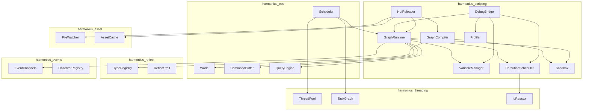
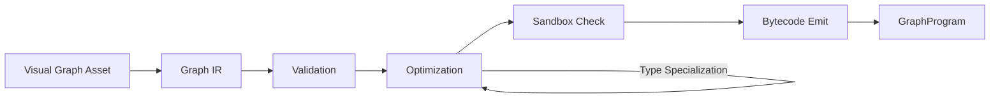
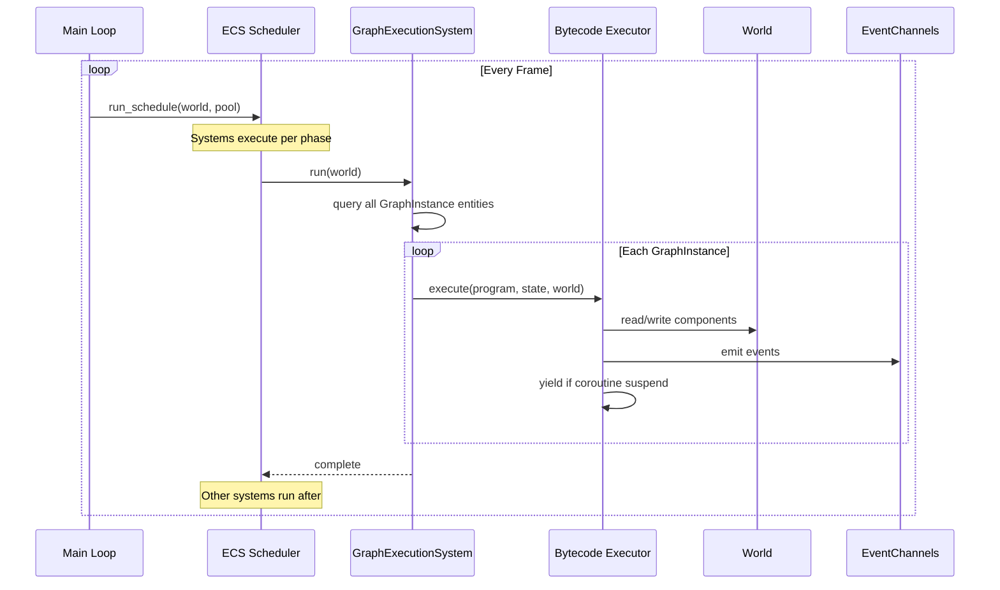
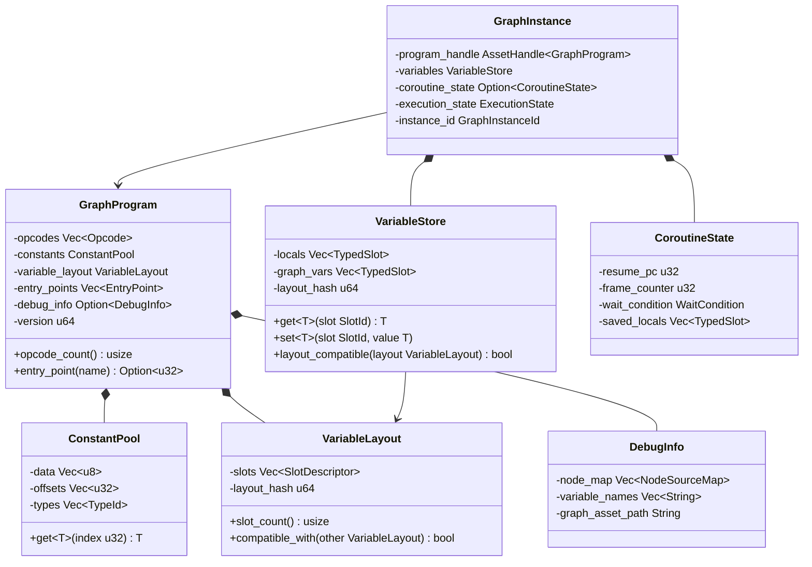
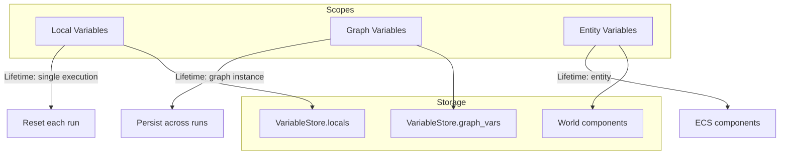
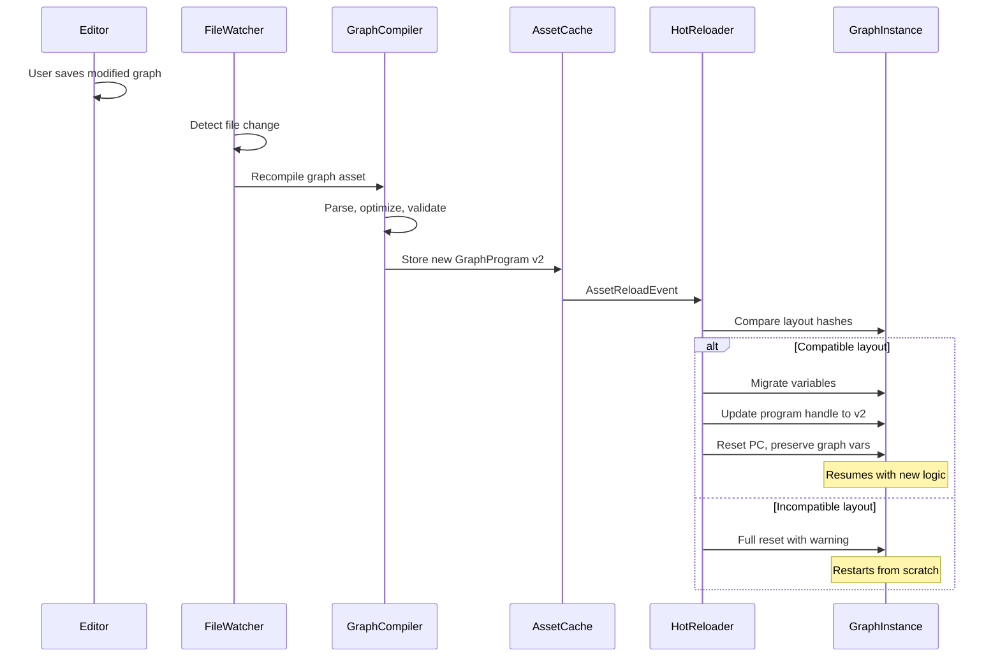
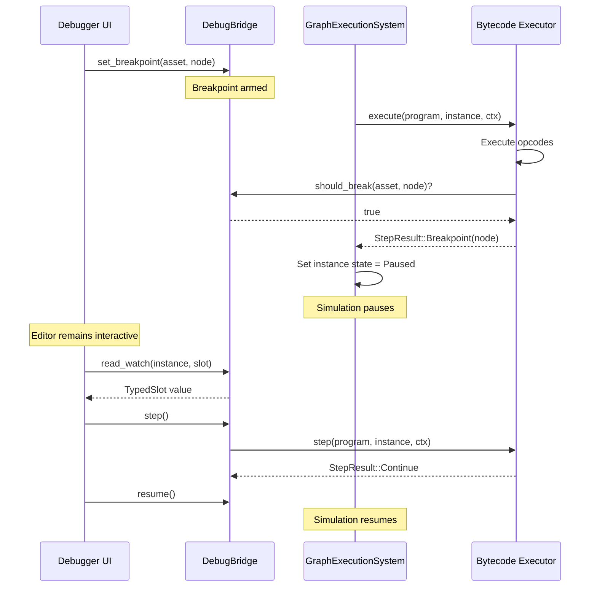
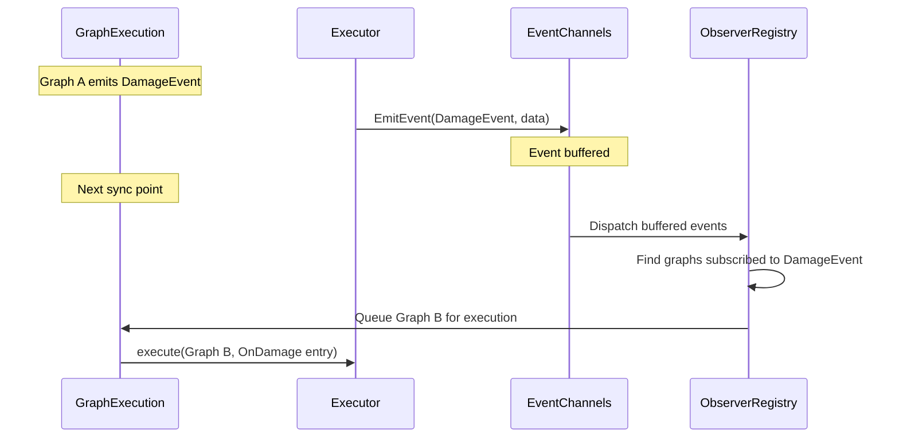

# Gameplay Scripting Design

## Requirements Trace

| Feature | Requirement | Description |
|---------|-------------|-------------|
| F-13.4.1 | R-13.4.1 | Gameplay logic graph integration with ECS world state access |
| F-13.4.2 | R-13.4.2 | Visual debugging with breakpoints, watch, remote debug |
| F-13.4.3 | R-13.4.3 | Hot reload of graph changes with state preservation |
| F-15.8.1 | R-15.8.1 | Universal logic graph runtime (compiled graphs) |
| F-15.8.4 | R-15.8.4 | Gameplay logic graphs (coroutines, ECS access) |
| F-15.8.12 | R-15.8.12 | Graph compilation and optimization passes |
| — | R-13.4.NF1 | 1,000 active graphs in < 4 ms per frame at 60 fps |
| — | R-13.4.NF2 | Hot reload turnaround < 1 second |

## Overview

The gameplay scripting subsystem is the runtime that executes
compiled visual logic graphs as ECS systems. Users never write
code. All gameplay logic -- ability rules, quest conditions,
dialogue branching, game mode rules, AI blackboard access --
is authored in the visual logic graph editor (F-15.8.4) and
compiled to an efficient bytecode format or ahead-of-time
native code (F-15.8.12). This document covers the runtime
that loads and executes those compiled artifacts.

Key architectural choices:

1. **Compiled, not interpreted.** Visual graphs are compiled
   to a typed bytecode (`GraphProgram`) by the editor's graph
   compiler. The runtime never parses or interprets graph
   topology at execution time.
2. **100% ECS-based.** Compiled graphs attach to entities as
   `GraphInstance` components. A `GraphExecutionSystem` runs
   in the ECS schedule like any other system.
3. **Static dispatch.** All node operations resolve to typed
   function pointers at compile time. No vtables, no dynamic
   dispatch in the hot path.
4. **Sandboxed.** User graphs cannot perform unsafe operations,
   raw memory access, or unbounded loops. All ECS access goes
   through validated accessor opcodes.
5. **Coroutine support.** Multi-frame sequences (boss phases,
   timed objectives) use async yield points that suspend and
   resume across frames via the `IoReactor`.
6. **Hot reload.** The runtime patches running graph instances
   with recompiled bytecode while preserving compatible state.

### Crate Structure

```
harmonius_scripting/
├── compiler/
│   ├── ir.rs          # Intermediate representation
│   ├── passes.rs      # Optimization passes
│   ├── codegen.rs     # Bytecode emission
│   └── validator.rs   # Sandbox validation
├── runtime/
│   ├── vm.rs          # Bytecode executor
│   ├── program.rs     # GraphProgram, Opcode
│   ├── instance.rs    # GraphInstance component
│   ├── variable.rs    # VariableStore, scopes
│   ├── coroutine.rs   # CoroutineState, yields
│   ├── accessor.rs    # ECS accessor opcodes
│   └── sandbox.rs     # Runtime sandbox checks
├── schedule/
│   ├── system.rs      # GraphExecutionSystem
│   ├── batch.rs       # Batched graph iteration
│   └── event.rs       # Event dispatch to graphs
├── debug/
│   ├── bridge.rs      # DebugBridge, breakpoints
│   ├── watch.rs       # Watch expressions
│   ├── remote.rs      # Remote debug protocol
│   └── profiler.rs    # Per-graph profiling
└── reload/
    ├── watcher.rs     # File change detection
    ├── patcher.rs     # Instance patching
    └── migration.rs   # Variable layout migration
```

## Architecture

### Module Boundaries



### Compilation Pipeline

The visual editor produces a serialized graph asset. The
compiler transforms it through several stages into a
`GraphProgram` -- the runtime-executable artifact.



### Graph Execution Within ECS Schedule

Compiled graphs execute as part of the standard ECS system
schedule. The `GraphExecutionSystem` queries all entities
with `GraphInstance` components and runs their programs.



### Core Data Structures



### Variable Scoping

Variables exist at three scopes. The runtime manages each
scope independently with separate storage lifetimes.



## API Design

### Bytecode and Opcodes

```rust
/// A compiled graph program. Immutable after
/// compilation. Shared by all instances of the
/// same graph asset.
pub struct GraphProgram {
    opcodes: Vec<Opcode>,
    constants: ConstantPool,
    variable_layout: VariableLayout,
    entry_points: Vec<EntryPoint>,
    debug_info: Option<DebugInfo>,
    version: u64,
}

/// Named entry point into the program. Each graph
/// event handler or execution trigger compiles to
/// a separate entry point.
pub struct EntryPoint {
    pub name: &'static str,
    pub pc: u32,
}

/// Bytecode opcodes. All opcodes are fixed-size
/// (8 bytes) for cache-friendly sequential access.
/// Operands are slot indices or constant pool
/// indices.
#[derive(Clone, Copy, Debug)]
#[repr(u8)]
pub enum Opcode {
    /// No operation.
    Nop,

    // ---- Constants and Variables ----

    /// Load constant from pool into slot.
    LoadConst { dst: SlotId, idx: ConstIdx },
    /// Copy slot to slot.
    Copy { dst: SlotId, src: SlotId },
    /// Move slot to slot (invalidates src).
    Move { dst: SlotId, src: SlotId },

    // ---- Arithmetic ----

    AddF32 { dst: SlotId, a: SlotId, b: SlotId },
    SubF32 { dst: SlotId, a: SlotId, b: SlotId },
    MulF32 { dst: SlotId, a: SlotId, b: SlotId },
    DivF32 { dst: SlotId, a: SlotId, b: SlotId },
    AddI32 { dst: SlotId, a: SlotId, b: SlotId },
    SubI32 { dst: SlotId, a: SlotId, b: SlotId },
    MulI32 { dst: SlotId, a: SlotId, b: SlotId },

    // ---- Comparison ----

    CmpEq { dst: SlotId, a: SlotId, b: SlotId },
    CmpNe { dst: SlotId, a: SlotId, b: SlotId },
    CmpLt { dst: SlotId, a: SlotId, b: SlotId },
    CmpLe { dst: SlotId, a: SlotId, b: SlotId },
    CmpGt { dst: SlotId, a: SlotId, b: SlotId },
    CmpGe { dst: SlotId, a: SlotId, b: SlotId },

    // ---- Logic ----

    And { dst: SlotId, a: SlotId, b: SlotId },
    Or  { dst: SlotId, a: SlotId, b: SlotId },
    Not { dst: SlotId, src: SlotId },

    // ---- Control Flow ----

    /// Unconditional jump.
    Jump { target: u32 },
    /// Conditional jump if slot is true.
    JumpIf { cond: SlotId, target: u32 },
    /// Conditional jump if slot is false.
    JumpIfNot { cond: SlotId, target: u32 },
    /// Call a subgraph. Pushes a call frame.
    Call { entry: u32, arg_base: SlotId },
    /// Return from subgraph call.
    Return,

    // ---- ECS Accessors (sandboxed) ----

    /// Read a component from the current entity.
    GetComponent {
        dst: SlotId,
        component_id: ComponentId,
    },
    /// Write a component on the current entity
    /// via command buffer (deferred).
    SetComponent {
        component_id: ComponentId,
        src: SlotId,
    },
    /// Read a field from a component by property
    /// path index.
    GetField {
        dst: SlotId,
        component_id: ComponentId,
        field_idx: u16,
    },
    /// Write a field on a component by property
    /// path index.
    SetField {
        component_id: ComponentId,
        field_idx: u16,
        src: SlotId,
    },
    /// Read a world resource.
    GetResource {
        dst: SlotId,
        resource_id: ResourceId,
    },
    /// Execute an ECS query. Results stored in
    /// a query result buffer accessible via
    /// QueryNext.
    QueryBegin {
        query_id: QueryId,
    },
    /// Advance query iterator. Sets dst to true
    /// if a result was fetched.
    QueryNext {
        dst: SlotId,
        query_id: QueryId,
    },

    // ---- Events ----

    /// Emit a typed event.
    EmitEvent {
        event_type: EventTypeId,
        src: SlotId,
    },

    // ---- Coroutine Yield ----

    /// Yield execution until next frame.
    YieldNextFrame,
    /// Yield for N frames.
    YieldFrames { count: SlotId },
    /// Yield until a specific event fires.
    YieldUntilEvent { event_type: EventTypeId },
    /// Yield for N seconds (wall clock).
    YieldDelay { seconds: SlotId },

    // ---- Debug ----

    /// Breakpoint. Only emitted when debug info
    /// is enabled. Triggers the debug bridge.
    Breakpoint { node_id: NodeId },
    /// Trace a slot value to the profiler.
    Trace { slot: SlotId, label_idx: u16 },

    // ---- AI Integration ----

    /// Read from AI blackboard.
    BlackboardGet {
        dst: SlotId,
        key: SlotId,
    },
    /// Write to AI blackboard.
    BlackboardSet {
        key: SlotId,
        value: SlotId,
    },
    /// Trigger a state machine transition.
    StateMachineTransition {
        state: SlotId,
    },
}

/// Compact slot identifier. 16-bit index into
/// the variable store.
#[derive(Clone, Copy, Debug, PartialEq, Eq)]
pub struct SlotId(pub u16);

/// Index into the constant pool.
#[derive(Clone, Copy, Debug, PartialEq, Eq)]
pub struct ConstIdx(pub u16);

/// Unique identifier for a graph instance.
#[derive(Clone, Copy, Debug, PartialEq, Eq, Hash)]
pub struct GraphInstanceId(pub u64);

/// Node identifier for debug source mapping.
#[derive(Clone, Copy, Debug, PartialEq, Eq)]
pub struct NodeId(pub u32);
```

### Graph Instance Component

```rust
/// Execution state of a graph instance.
#[derive(Clone, Copy, Debug, PartialEq, Eq)]
pub enum ExecutionState {
    /// Ready to execute this frame.
    Ready,
    /// Suspended in a coroutine yield.
    Suspended,
    /// Paused by a debugger breakpoint.
    Paused,
    /// Completed execution (no coroutine active).
    Complete,
    /// Encountered a runtime error.
    Error,
}

/// ECS component attached to entities that run
/// gameplay logic graphs. One entity may have
/// multiple GraphInstance components via a buffer
/// component.
#[derive(Component)]
pub struct GraphInstance {
    /// Handle to the shared compiled program.
    program: AssetHandle<GraphProgram>,
    /// Per-instance variable storage.
    variables: VariableStore,
    /// Coroutine suspension state, if any.
    coroutine: Option<CoroutineState>,
    /// Current execution state.
    state: ExecutionState,
    /// Unique instance identifier for debugging.
    instance_id: GraphInstanceId,
    /// Program version at last execution. Used
    /// to detect hot-reload version changes.
    loaded_version: u64,
}

impl GraphInstance {
    /// Create a new instance bound to a compiled
    /// graph program.
    pub fn new(
        program: AssetHandle<GraphProgram>,
        instance_id: GraphInstanceId,
    ) -> Self;

    /// Reset all local variables and coroutine
    /// state. Graph variables are preserved.
    pub fn reset(&mut self);

    /// Check if the loaded program version matches
    /// the current asset version.
    pub fn needs_reload(
        &self,
        current_version: u64,
    ) -> bool;
}
```

### Variable Store

```rust
/// A single typed variable slot.
pub struct TypedSlot {
    data: [u8; 16],
    type_id: TypeId,
}

impl TypedSlot {
    pub fn get<T: Reflect + Copy>(
        &self,
    ) -> Option<T>;

    pub fn set<T: Reflect + Copy>(
        &mut self,
        value: T,
    );

    pub fn type_id(&self) -> TypeId;
}

/// Describes one slot in the variable layout.
pub struct SlotDescriptor {
    pub name: String,
    pub type_id: TypeId,
    pub scope: VariableScope,
    pub default_value: Option<TypedSlot>,
}

/// Variable scope classification.
#[derive(Clone, Copy, Debug, PartialEq, Eq)]
pub enum VariableScope {
    /// Reset each execution. Scratch registers.
    Local,
    /// Persist across executions within the same
    /// graph instance.
    Graph,
    /// Maps to an ECS component on the entity.
    /// Read/write via accessor opcodes.
    Entity,
}

/// Layout of all variables in a graph program.
/// Compared by hash for hot-reload compatibility.
pub struct VariableLayout {
    slots: Vec<SlotDescriptor>,
    layout_hash: u64,
}

impl VariableLayout {
    /// Check if another layout is compatible for
    /// state migration (same slots at same indices
    /// with same types).
    pub fn compatible_with(
        &self,
        other: &VariableLayout,
    ) -> bool;

    /// Compute a deterministic hash of the layout.
    pub fn compute_hash(&self) -> u64;

    pub fn slot_count(&self) -> usize;
}

/// Per-instance variable storage. Holds locals
/// and graph-scoped variables. Entity-scoped
/// variables are accessed through ECS queries.
pub struct VariableStore {
    locals: Vec<TypedSlot>,
    graph_vars: Vec<TypedSlot>,
    layout_hash: u64,
}

impl VariableStore {
    pub fn new(
        layout: &VariableLayout,
    ) -> Self;

    pub fn get<T: Reflect + Copy>(
        &self,
        slot: SlotId,
    ) -> T;

    pub fn set<T: Reflect + Copy>(
        &mut self,
        slot: SlotId,
        value: T,
    );

    /// Check if the store's layout matches a
    /// program's expected layout.
    pub fn layout_compatible(
        &self,
        layout: &VariableLayout,
    ) -> bool;

    /// Migrate variables to a new layout. Copies
    /// values for slots whose name and type match.
    /// New slots get default values.
    pub fn migrate(
        &mut self,
        old_layout: &VariableLayout,
        new_layout: &VariableLayout,
    );

    /// Reset all local-scoped slots to defaults.
    pub fn reset_locals(
        &mut self,
        layout: &VariableLayout,
    );
}
```

### Coroutine Support

```rust
/// Condition that a suspended coroutine waits on.
#[derive(Clone, Debug)]
pub enum WaitCondition {
    /// Resume on the next frame.
    NextFrame,
    /// Resume after N frames have elapsed.
    Frames { remaining: u32 },
    /// Resume after N seconds (wall clock).
    Delay { remaining_secs: f32 },
    /// Resume when a specific event type fires.
    Event { event_type: EventTypeId },
}

/// Saved coroutine suspension point.
pub struct CoroutineState {
    /// Program counter to resume at.
    resume_pc: u32,
    /// Frame counter at time of suspension.
    suspended_frame: u64,
    /// The condition that must be met to resume.
    wait_condition: WaitCondition,
    /// Saved local variable snapshot at the yield
    /// point. Restored on resume.
    saved_locals: Vec<TypedSlot>,
}

impl CoroutineState {
    /// Check if the wait condition is satisfied.
    pub fn is_ready(
        &self,
        current_frame: u64,
        delta_time: f32,
        pending_events: &EventBuffer,
    ) -> bool;

    /// Advance timers. Called each frame for
    /// suspended coroutines.
    pub fn tick(&mut self, delta_time: f32);
}
```

### Bytecode Executor

```rust
/// Result of a single execution step.
#[derive(Clone, Copy, Debug, PartialEq, Eq)]
pub enum StepResult {
    /// Execution continues.
    Continue,
    /// Program completed.
    Complete,
    /// Coroutine yielded.
    Yield(WaitCondition),
    /// Breakpoint hit (debug mode only).
    Breakpoint(NodeId),
    /// Runtime error.
    Error(RuntimeError),
}

/// Runtime errors that can occur during graph
/// execution. All errors are recoverable -- the
/// graph instance transitions to Error state.
#[derive(Clone, Debug)]
pub enum RuntimeError {
    /// ECS component not found on the entity.
    ComponentNotFound {
        entity: Entity,
        component_id: ComponentId,
    },
    /// Division by zero.
    DivisionByZero { pc: u32 },
    /// Instruction budget exceeded (infinite loop
    /// protection).
    BudgetExhausted { limit: u32 },
    /// Type mismatch in variable access.
    TypeMismatch {
        slot: SlotId,
        expected: TypeId,
        actual: TypeId,
    },
    /// Call stack overflow.
    StackOverflow { depth: u32 },
    /// Invalid program counter.
    InvalidPc { pc: u32 },
    /// Query returned no results when required.
    EmptyQuery { query_id: QueryId },
}

/// Execution context passed to the executor.
/// Provides sandboxed access to the ECS world.
pub struct ExecutionContext<'w> {
    /// The entity this graph instance is attached
    /// to.
    pub entity: Entity,
    /// Read-only world access for queries and
    /// component reads.
    pub world: &'w World,
    /// Command buffer for deferred writes.
    pub commands: &'w CommandBuffer,
    /// Event writer for emitting events.
    pub events: &'w EventWriter,
    /// Current frame number.
    pub frame: u64,
    /// Delta time this frame.
    pub delta_time: f32,
    /// Maximum opcodes per execution (budget).
    pub instruction_budget: u32,
    /// Debug bridge, if debugging is active.
    pub debug: Option<&'w DebugBridge>,
}

/// The bytecode executor. Stateless -- all mutable
/// state lives in GraphInstance.
pub struct GraphExecutor;

impl GraphExecutor {
    /// Execute a graph instance for the current
    /// frame. Runs opcodes until completion, yield,
    /// breakpoint, budget exhaustion, or error.
    pub fn execute(
        program: &GraphProgram,
        instance: &mut GraphInstance,
        ctx: &ExecutionContext<'_>,
    ) -> StepResult;

    /// Resume a suspended coroutine.
    pub fn resume(
        program: &GraphProgram,
        instance: &mut GraphInstance,
        ctx: &ExecutionContext<'_>,
    ) -> StepResult;

    /// Execute a single opcode (debug stepping).
    pub fn step(
        program: &GraphProgram,
        instance: &mut GraphInstance,
        ctx: &ExecutionContext<'_>,
    ) -> StepResult;
}
```

### ECS System Integration

```rust
/// Resource controlling graph execution parameters.
#[derive(Resource)]
pub struct GraphExecutionConfig {
    /// Maximum opcodes per graph instance per frame.
    /// Prevents runaway graphs from stalling the
    /// frame. Default: 10,000.
    pub instruction_budget: u32,
    /// Maximum call stack depth. Default: 64.
    pub max_call_depth: u32,
    /// Enable debug instrumentation. Adds overhead
    /// when active.
    pub debug_enabled: bool,
}

/// The ECS system that drives all graph execution.
/// Registered in the Update phase. Queries all
/// entities with GraphInstance components and
/// executes or resumes them.
pub fn graph_execution_system(
    query: Query<(
        Entity,
        &mut GraphInstance,
    )>,
    programs: Res<AssetStore<GraphProgram>>,
    config: Res<GraphExecutionConfig>,
    time: Res<Time>,
    commands: Commands,
    events: EventWriter<GraphEvent>,
    debug: Option<Res<DebugBridge>>,
);

/// System that ticks all suspended coroutines
/// and checks their wait conditions. Runs before
/// graph_execution_system so that newly-ready
/// coroutines execute this frame.
pub fn coroutine_tick_system(
    query: Query<&mut GraphInstance>,
    time: Res<Time>,
    pending_events: EventReader<AnyEvent>,
);

/// System that handles hot-reload version checks.
/// Runs after asset reload events fire.
pub fn graph_hot_reload_system(
    query: Query<&mut GraphInstance>,
    programs: Res<AssetStore<GraphProgram>>,
    reload_events: EventReader<AssetReloadEvent>,
);

/// Events emitted by the graph execution system.
#[derive(Event)]
pub enum GraphEvent {
    /// A graph instance completed execution.
    Completed {
        entity: Entity,
        instance_id: GraphInstanceId,
    },
    /// A graph instance encountered a runtime error.
    Error {
        entity: Entity,
        instance_id: GraphInstanceId,
        error: RuntimeError,
    },
    /// A graph instance was hot-reloaded.
    Reloaded {
        entity: Entity,
        instance_id: GraphInstanceId,
        compatible: bool,
    },
}
```

### Sandbox

```rust
/// Validation pass applied at compile time to
/// ensure user graphs cannot perform unsafe
/// operations.
pub struct SandboxValidator;

/// Violations detected by the sandbox validator.
#[derive(Clone, Debug)]
pub enum SandboxViolation {
    /// Graph contains a potential infinite loop
    /// without a yield point.
    UnboundedLoop { node_id: NodeId },
    /// Graph accesses a component or resource not
    /// in the allowed set.
    UnauthorizedAccess {
        node_id: NodeId,
        target: String,
    },
    /// Graph exceeds maximum subgraph nesting
    /// depth.
    ExcessiveNesting {
        depth: u32,
        max: u32,
    },
    /// Graph uses a node type that is editor-only.
    EditorOnlyNode { node_id: NodeId },
}

impl SandboxValidator {
    /// Validate a compiled graph program for
    /// sandbox compliance. Called after compilation
    /// but before the program is made available
    /// to the runtime.
    pub fn validate(
        program: &GraphProgram,
        allowed_components: &[ComponentId],
        allowed_resources: &[ResourceId],
        allowed_events: &[EventTypeId],
    ) -> Result<(), Vec<SandboxViolation>>;
}

/// Runtime sandbox that enforces instruction
/// budgets. The executor checks the budget counter
/// after each opcode.
pub struct RuntimeSandbox {
    /// Opcodes executed this invocation.
    pub instructions_executed: u32,
    /// Maximum allowed.
    pub budget: u32,
}

impl RuntimeSandbox {
    /// Check if the budget is exhausted.
    pub fn check(&self) -> bool;

    /// Increment the counter. Returns false if
    /// budget exceeded.
    pub fn tick(&mut self) -> bool;
}
```

### Debug Bridge

```rust
/// Debug bridge connecting the runtime to the
/// editor's graph debugger. Thread-safe for
/// remote debugging sessions.
pub struct DebugBridge {
    breakpoints: AsyncRwLock<BreakpointSet>,
    watches: AsyncRwLock<WatchSet>,
    state: AsyncRwLock<DebugState>,
}

/// A set of active breakpoints.
pub struct BreakpointSet {
    /// Breakpoints keyed by (program asset,
    /// node id).
    entries: HashMap<
        (AssetId, NodeId),
        BreakpointConfig,
    >,
}

/// Configuration for a single breakpoint.
pub struct BreakpointConfig {
    pub enabled: bool,
    /// Hit count condition. None = always break.
    pub hit_count: Option<u32>,
    /// Conditional expression (compiled from a
    /// simple expression in the debugger UI).
    pub condition: Option<GraphProgram>,
}

/// A set of watched variable expressions.
pub struct WatchSet {
    entries: Vec<WatchEntry>,
}

pub struct WatchEntry {
    pub instance_id: GraphInstanceId,
    pub slot: SlotId,
    pub label: String,
}

/// The current debug session state.
pub enum DebugState {
    /// No debug session active.
    Inactive,
    /// Running normally with breakpoints armed.
    Running,
    /// Paused at a breakpoint. Game simulation is
    /// frozen but the editor remains interactive.
    Paused {
        instance_id: GraphInstanceId,
        node_id: NodeId,
        frame: u64,
    },
    /// Single-stepping one opcode at a time.
    Stepping {
        instance_id: GraphInstanceId,
    },
}

impl DebugBridge {
    pub fn new() -> Self;

    /// Set a breakpoint on a node.
    pub async fn set_breakpoint(
        &self,
        asset: AssetId,
        node: NodeId,
        config: BreakpointConfig,
    );

    /// Remove a breakpoint.
    pub async fn remove_breakpoint(
        &self,
        asset: AssetId,
        node: NodeId,
    );

    /// Add a watch expression.
    pub async fn add_watch(
        &self,
        entry: WatchEntry,
    );

    /// Resume execution after a breakpoint pause.
    pub async fn resume(&self);

    /// Step one opcode forward.
    pub async fn step(&self);

    /// Read the current value of a watched slot.
    pub async fn read_watch(
        &self,
        instance_id: GraphInstanceId,
        slot: SlotId,
    ) -> Option<TypedSlot>;

    /// Get the current debug state.
    pub async fn state(&self) -> DebugState;

    /// Check if a breakpoint should fire at the
    /// given location. Called by the executor.
    pub fn should_break(
        &self,
        asset: AssetId,
        node: NodeId,
    ) -> bool;
}
```

### Hot Reload

```rust
/// Handles patching running graph instances when
/// the editor recompiles a graph asset.
pub struct HotReloader;

/// Result of a hot-reload attempt.
#[derive(Clone, Debug)]
pub enum ReloadResult {
    /// Variables migrated successfully. Execution
    /// continues from the beginning with preserved
    /// graph-scoped state.
    Compatible,
    /// Variable layout changed incompatibly. The
    /// instance was reset with a warning.
    Incompatible { reason: String },
    /// The new program failed validation.
    ValidationFailed {
        errors: Vec<SandboxViolation>,
    },
}

impl HotReloader {
    /// Patch a running graph instance with a new
    /// compiled program version.
    ///
    /// 1. Compare variable layouts.
    /// 2. If compatible: migrate variables, update
    ///    program handle, reset PC to entry.
    /// 3. If incompatible: reset instance fully,
    ///    emit warning event.
    pub fn patch(
        instance: &mut GraphInstance,
        old_program: &GraphProgram,
        new_program: &GraphProgram,
    ) -> ReloadResult;

    /// Migrate a variable store from one layout to
    /// another. Copies matching slots by name and
    /// type. New slots get default values. Removed
    /// slots are dropped.
    pub fn migrate_variables(
        store: &mut VariableStore,
        old_layout: &VariableLayout,
        new_layout: &VariableLayout,
    );
}
```

### Per-Graph Profiling

```rust
/// Per-graph-instance performance counters.
/// Collected when profiling is enabled.
pub struct GraphProfile {
    /// Total opcodes executed this frame.
    pub instructions_executed: u32,
    /// Wall-clock time for this instance this
    /// frame, in microseconds.
    pub execution_time_us: u32,
    /// Number of ECS queries executed.
    pub query_count: u16,
    /// Number of events emitted.
    pub event_count: u16,
    /// Number of component reads.
    pub component_reads: u16,
    /// Number of component writes (deferred).
    pub component_writes: u16,
    /// Number of coroutine yields.
    pub yield_count: u16,
}

/// Resource accumulating per-frame profiling data
/// for all active graph instances.
#[derive(Resource)]
pub struct GraphProfiler {
    profiles: HashMap<
        GraphInstanceId,
        GraphProfile,
    >,
    enabled: bool,
}

impl GraphProfiler {
    pub fn new() -> Self;
    pub fn enable(&mut self);
    pub fn disable(&mut self);
    pub fn is_enabled(&self) -> bool;

    /// Record a completed execution.
    pub fn record(
        &mut self,
        id: GraphInstanceId,
        profile: GraphProfile,
    );

    /// Get the profile for a specific instance.
    pub fn get(
        &self,
        id: GraphInstanceId,
    ) -> Option<&GraphProfile>;

    /// Get all profiles for the current frame.
    pub fn all(
        &self,
    ) -> &HashMap<GraphInstanceId, GraphProfile>;

    /// Reset all counters for the new frame.
    pub fn reset_frame(&mut self);

    /// Total execution time across all instances.
    pub fn total_time_us(&self) -> u64;
}
```

### Compiler (Editor-Side)

```rust
/// Intermediate representation of a graph before
/// bytecode emission. Each IR node maps 1:1 to a
/// visual graph node.
pub struct GraphIr {
    pub nodes: Vec<IrNode>,
    pub edges: Vec<IrEdge>,
    pub entry_points: Vec<IrEntryPoint>,
}

pub struct IrNode {
    pub id: NodeId,
    pub kind: IrNodeKind,
    pub inputs: Vec<IrPin>,
    pub outputs: Vec<IrPin>,
}

pub struct IrEdge {
    pub from_node: NodeId,
    pub from_pin: u16,
    pub to_node: NodeId,
    pub to_pin: u16,
}

/// The graph compiler. Transforms a visual graph
/// asset into a GraphProgram through multiple
/// passes.
pub struct GraphCompiler;

impl GraphCompiler {
    /// Compile a graph asset into a GraphProgram.
    ///
    /// Passes:
    /// 1. Parse graph asset -> GraphIr
    /// 2. Type check all connections
    /// 3. Dead node elimination
    /// 4. Constant folding
    /// 5. Subgraph inlining
    /// 6. Type specialization (monomorphization)
    /// 7. Sandbox validation
    /// 8. Bytecode emission
    /// 9. Debug info emission (if enabled)
    pub fn compile(
        asset: &GraphAsset,
        registry: &TypeRegistry,
        debug: bool,
    ) -> Result<GraphProgram, CompileError>;
}

/// Compilation errors with source location.
#[derive(Clone, Debug)]
pub enum CompileError {
    /// Type mismatch on a connection.
    TypeMismatch {
        node: NodeId,
        pin: u16,
        expected: TypeId,
        actual: TypeId,
    },
    /// Disconnected required input pin.
    DisconnectedInput {
        node: NodeId,
        pin: u16,
    },
    /// Cycle in dataflow subgraph.
    DataflowCycle {
        nodes: Vec<NodeId>,
    },
    /// Sandbox violation.
    Sandbox(SandboxViolation),
    /// Unknown node type.
    UnknownNodeType {
        node: NodeId,
        type_name: String,
    },
}
```

## Data Flow

### Frame Execution Flow

Each frame, graph instances move through a
lifecycle driven by three ECS systems running in
sequence.

```rust
// System execution order within Update phase:
//
// 1. coroutine_tick_system
//    - For each Suspended instance: tick timers,
//      check wait conditions.
//    - If condition met: transition to Ready.
//
// 2. graph_execution_system
//    - For each Ready instance: execute bytecode.
//    - For each newly-Ready (was Suspended):
//      resume from saved PC.
//    - Execution produces one of:
//      Complete, Yield, Breakpoint, Error.
//    - Deferred commands are flushed at the next
//      sync point by the ECS scheduler.
//
// 3. graph_hot_reload_system
//    - If an AssetReloadEvent fired for a graph
//      program, find all instances using that
//      asset, patch them with the new version.
```

### Hot Reload Sequence



### Debug Session Flow



### Event Handling in Graphs

Graphs can both emit and respond to typed events.
Event-triggered graphs use entry points that are
invoked when a matching event fires.



## Platform Considerations

The gameplay scripting runtime is platform-agnostic.
All platform-specific behavior is delegated to
underlying subsystems (ECS, threading, I/O reactor).

| Concern | Approach | Notes |
|---------|----------|-------|
| Bytecode format | Little-endian, fixed-size opcodes | Matches all target platforms |
| Coroutine yields | Delegates to `IoReactor.next_frame()` | Platform-native async under the hood |
| Parallel execution | ECS scheduler + ThreadPool | Automatic via declared access sets |
| Debug transport | TCP socket for remote debug | Platform-native socket API |
| Hot reload file watch | Delegates to `FileWatcher` | IOCP / FSEvents / inotify |
| Profiling timers | `std::time::Instant` | Platform-native high-res clock |

### Scaling Tiers

| Tier | Max Active Graphs | Instruction Budget | Profile Overhead |
|------|-------------------|-------------------|------------------|
| Mobile | 256 | 5,000 per instance | Disabled by default |
| Desktop | 1,000 | 10,000 per instance | Optional |
| Server | 4,000 | 20,000 per instance | Optional |

### Memory Budget

| Component | Per Instance | 1,000 Instances |
|-----------|-------------|-----------------|
| VariableStore (64 slots) | 1,088 bytes | ~1.06 MiB |
| CoroutineState | 128 bytes | ~125 KiB |
| GraphInstance metadata | 64 bytes | ~62.5 KiB |
| Total per instance | ~1,280 bytes | ~1.25 MiB |

GraphProgram bytecode is shared (not per-instance).
A typical 50-node graph compiles to ~2 KiB of
bytecode + ~512 bytes of constant pool.

## Test Plan

### Unit Tests

| Test | Req | Description |
|------|-----|-------------|
| `test_opcode_add_f32` | R-13.4.1 | Execute AddF32 opcode, verify result in dst slot. |
| `test_opcode_jump_if` | R-13.4.1 | Conditional jump taken and not-taken paths. |
| `test_opcode_get_component` | R-13.4.1 | Read a component value from the world via GetComponent. |
| `test_opcode_set_component` | R-13.4.1 | Write a component via SetComponent, verify deferred in command buffer. |
| `test_opcode_emit_event` | R-13.4.1 | Emit a typed event, verify it appears in the event channel. |
| `test_opcode_query_begin_next` | R-13.4.1 | Execute a query, iterate results with QueryNext. |
| `test_opcode_blackboard_get_set` | R-13.4.1 | Read/write AI blackboard via opcodes. |
| `test_opcode_state_transition` | R-13.4.1 | Trigger a state machine transition from a graph. |
| `test_variable_store_get_set` | R-13.4.1 | Set and get variables at all three scopes. |
| `test_variable_layout_hash` | R-13.4.3 | Identical layouts produce identical hashes. |
| `test_variable_migration_compatible` | R-13.4.3 | Migrate variables between compatible layouts. |
| `test_variable_migration_incompatible` | R-13.4.3 | Detect incompatible layout, trigger reset. |
| `test_coroutine_yield_next_frame` | R-15.8.4 | YieldNextFrame suspends, resumes next frame. |
| `test_coroutine_yield_frames` | R-15.8.4 | YieldFrames(3) resumes after exactly 3 frames. |
| `test_coroutine_yield_delay` | R-15.8.4 | YieldDelay(1.0) resumes after 1 second of delta time. |
| `test_coroutine_yield_event` | R-15.8.4 | YieldUntilEvent suspends, resumes when event fires. |
| `test_sandbox_budget_exhaustion` | R-13.4.1 | Tight loop exceeds budget, returns BudgetExhausted error. |
| `test_sandbox_unauthorized_component` | R-13.4.1 | Access to disallowed component is rejected at compile time. |
| `test_sandbox_unbounded_loop` | R-13.4.1 | Loop without yield detected by SandboxValidator. |
| `test_compiler_dead_node_elimination` | R-15.8.12 | Unreachable nodes produce no opcodes. |
| `test_compiler_constant_folding` | R-15.8.12 | Static expressions evaluate at compile time. |
| `test_compiler_type_mismatch` | R-15.8.12 | Type error on a connection produces CompileError. |
| `test_compiler_cycle_detection` | R-15.8.12 | Dataflow cycle produces DataflowCycle error. |
| `test_debug_breakpoint_hit` | R-13.4.2 | Breakpoint opcode triggers Paused state. |
| `test_debug_step` | R-13.4.2 | Single-step advances exactly one opcode. |
| `test_debug_watch_read` | R-13.4.2 | Read a watched variable value from a paused instance. |
| `test_profiler_instruction_count` | R-13.4.NF1 | Profile reports correct instruction count. |
| `test_profiler_execution_time` | R-13.4.NF1 | Profile reports non-zero execution time. |

### Integration Tests

| Test | Req | Description |
|------|-----|-------------|
| `test_graph_ecs_component_read_write` | R-13.4.1 | Compile a graph that reads Health, subtracts damage, writes Health. Verify the component is updated after command flush. |
| `test_graph_event_emission` | R-13.4.1 | Graph emits DamageDealt event. Verify a listener system receives it. |
| `test_graph_ai_blackboard` | R-13.4.1 | Graph reads/writes AI blackboard keys. Verify blackboard state matches. |
| `test_graph_state_machine_transition` | R-13.4.1 | Graph triggers AI state transition. Verify state machine updates. |
| `test_graph_ecs_schedule_order` | R-13.4.1 | Two graphs with ordering constraints execute in declared order. |
| `test_graph_coroutine_boss_encounter` | R-15.8.4 | Three-phase boss encounter: phase 1 (5 frames) -> phase 2 (3 frames) -> phase 3. Verify timing and state. |
| `test_hot_reload_compatible` | R-13.4.3 | Modify a graph (add a node, keep variables). Verify hot reload preserves variable values. |
| `test_hot_reload_incompatible` | R-13.4.3 | Remove a variable from a graph. Verify clean restart with warning. |
| `test_hot_reload_concurrent_100` | R-13.4.3 | Hot-reload while 100 instances execute concurrently. Verify no crashes or corruption. |
| `test_hot_reload_turnaround` | R-13.4.NF2 | Modify a 50-node graph. Verify reload completes in < 1 second. |
| `test_debug_remote_connect` | R-13.4.2 | Connect remote debugger over TCP, set breakpoint, verify pause. |
| `test_debug_no_side_effects` | R-13.4.2 | Run identical sessions with and without debugger. Verify identical world state. |
| `test_debug_remote_stability` | R-13.4.2 | Connect/disconnect 50 times during gameplay. Verify no crashes. |
| `test_no_text_scripting_api` | R-13.4.1 | Verify no public API accepts text-based scripts or code strings. |

### Benchmarks

| Benchmark | Target | Source |
|-----------|--------|--------|
| 1,000 graphs, 10 nodes each | < 4 ms total at 60 fps | R-13.4.NF1 |
| Single graph, 100 nodes | < 50 us | R-13.4.NF1 |
| Opcode dispatch overhead | < 10 ns per opcode | R-15.8.12 |
| Hot reload turnaround (50 nodes) | < 1 second | R-13.4.NF2 |
| Variable store get/set | < 5 ns per access | R-13.4.1 |
| Coroutine suspend/resume | < 100 ns | R-15.8.4 |
| Compiler throughput (50-node graph) | < 100 ms | R-15.8.12 |
| GraphProgram memory (50 nodes) | < 4 KiB shared | R-13.4.NF1 |
| GraphInstance memory (64 slots) | < 1.5 KiB per instance | R-13.4.NF1 |

## Open Questions

1. **AOT native code compilation** -- The design currently
   uses bytecode execution. AOT compilation to native code
   via LLVM (F-15.8.12) would eliminate interpreter overhead
   entirely but requires a separate compilation pipeline and
   platform-specific code generation. Should AOT be a
   second-tier optimization applied to hot graphs identified
   by the profiler?

2. **Parallel graph execution granularity** -- Currently,
   `graph_execution_system` iterates all `GraphInstance`
   entities sequentially. For 1,000+ instances, batched
   parallel iteration via `ParQueryIter` could improve
   throughput. However, graphs that emit events or write to
   overlapping components create ordering dependencies.
   Should graphs declare their access sets like systems for
   automatic parallelism?

3. **Maximum variable slot size** -- `TypedSlot` is fixed at
   16 bytes (f32x4, mat4 column, entity reference). Larger
   types (strings, arrays) require heap allocation. Is 16
   bytes sufficient for the majority of gameplay variables,
   or should we support 32-byte slots for matrix types?

4. **Coroutine nesting** -- The current design supports a
   single coroutine per graph instance. Should nested
   coroutines (a coroutine that calls a subgraph which also
   yields) be supported? This adds a coroutine stack to each
   instance.

5. **Event-triggered entry points** -- Should event-triggered
   graph executions run in the same frame as the event
   emission, or be deferred to the next frame? Same-frame
   execution enables tighter feedback loops but risks
   cascading event storms.

6. **Debug protocol format** -- The remote debug bridge needs
   a wire protocol. Should this reuse an existing standard
   (DAP -- Debug Adapter Protocol) for editor integration,
   or define a custom binary protocol optimized for graph
   debugging?

7. **Graph instance pooling** -- For entities that frequently
   spawn and despawn (projectiles, particles), should
   `GraphInstance` components use a pool to avoid allocation
   overhead? The `VariableStore` heap allocation is the main
   cost per instance.
