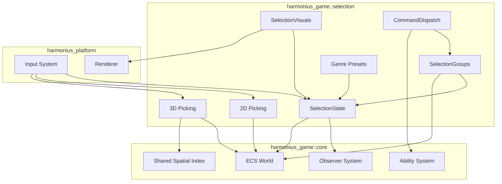
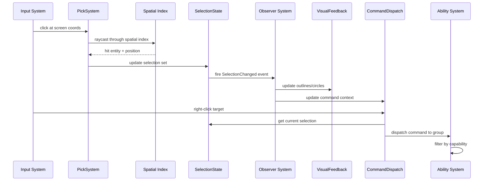
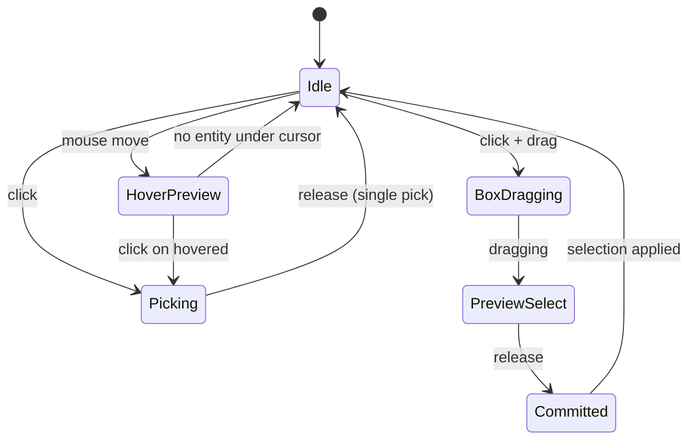
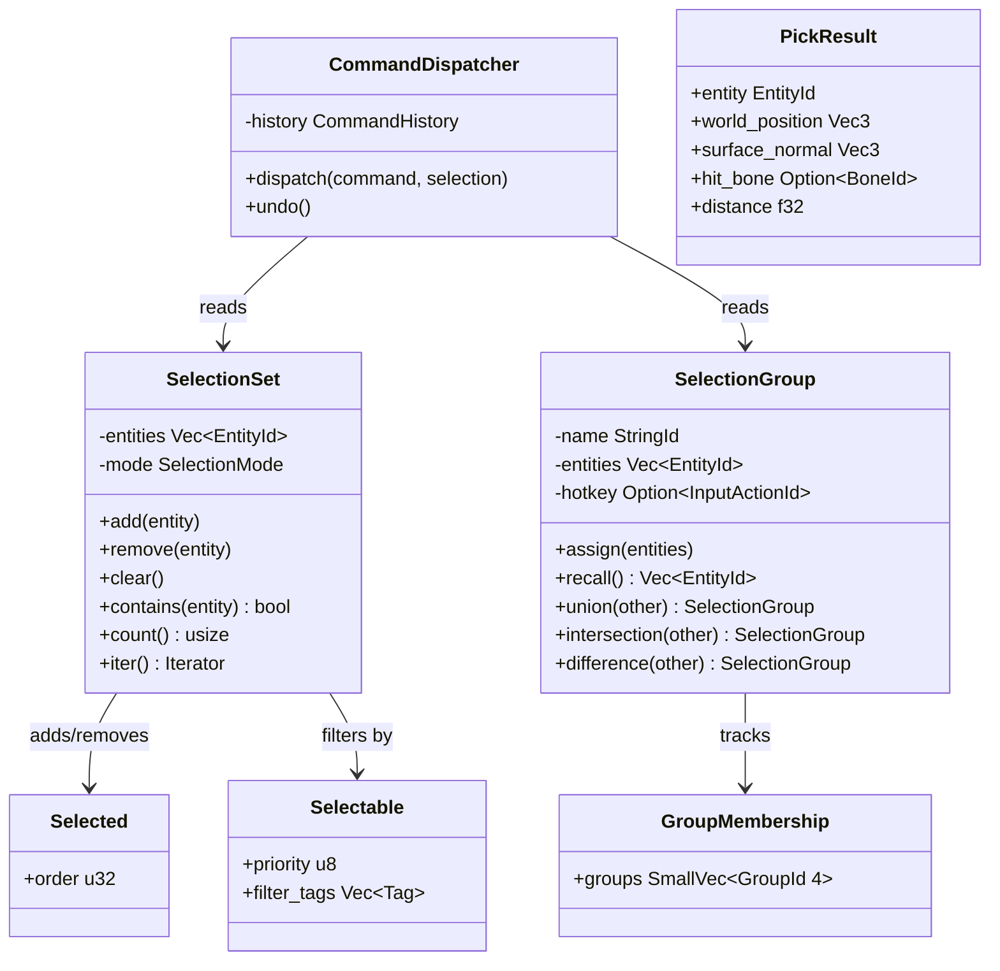

# Selection System Design

## Requirements Trace

> **Canonical sources:** Features, requirements, and user
> stories are defined in [features/game-framework/](../../features/game-framework/),
> [requirements/game-framework/](../../requirements/game-framework/), and
> [user-stories/game-framework/](../../user-stories/game-framework/). The table
> below traces design elements to those definitions.

| Feature | Requirement | Description |
|---------|-------------|-------------|
| F-13.11.1 | R-13.11.1 | 3D world picking via raycast through shared spatial index |
| F-13.11.2 | R-13.11.2 | 2D screen-space picking with touch slop |
| F-13.11.3 | R-13.11.3 | ECS-based selection state with modes and observer events |
| F-13.11.4a | R-13.11.4a | RTS selection preset (box select, control groups) |
| F-13.11.4b | R-13.11.4b | RPG selection preset (tab-cycle, target-of-target) |
| F-13.11.4c | R-13.11.4c | Action selection preset (auto-target, lock-on) |
| F-13.11.4d | R-13.11.4d | Builder/sandbox selection preset (gizmos, hierarchy) |
| F-13.11.5 | R-13.11.5 | Runtime selection groups with set operations |
| F-13.11.6a | R-13.11.6a | Command dispatch to selection via ability system |
| F-13.11.6b | R-13.11.6b | Formation movement with data-driven templates |
| F-13.11.6c | R-13.11.6c | Split and subgroup commands |
| F-13.11.6d | R-13.11.6d | Command history with single-level undo |
| F-13.11.7 | R-13.11.7 | Marquee (box) selection with modifier keys |
| F-13.11.8 | R-13.11.8 | Selection visual feedback (outlines, circles, decals) |

## Overview

The selection system provides a unified pipeline
for picking, selecting, grouping, commanding, and
visually highlighting entities in both 2D and 3D
games. It is 100% ECS-based: selection state lives
as components and resources, all logic runs as
systems, and all configuration is data-driven.

The system provides four genre presets (RTS, RPG,
action, builder) that configure input bindings,
selection modes, filtering rules, and visual
feedback. Presets are activated per-project through
the modular system and customized in the visual
editor without code.

## Architecture

### Module Boundaries



### File Structure

```
harmonius_game/
├── selection/
│   ├── picking/
│   │   ├── pick_3d.rs     # 3D raycast picking
│   │   ├── pick_2d.rs     # 2D screen-space picking
│   │   └── pick_result.rs # PickResult, PickLayer
│   ├── state/
│   │   ├── selection.rs   # SelectionSet resource
│   │   ├── selected.rs    # Selected component
│   │   ├── selectable.rs  # Selectable component
│   │   ├── mode.rs        # SelectionMode enum
│   │   └── events.rs      # SelectionChanged event
│   ├── groups/
│   │   ├── group.rs       # SelectionGroup resource
│   │   ├── membership.rs  # GroupMembership component
│   │   └── ops.rs         # Set operations
│   ├── commands/
│   │   ├── dispatch.rs    # CommandDispatcher
│   │   ├── formation.rs   # FormationTemplate
│   │   ├── split.rs       # SplitCommand
│   │   └── history.rs     # CommandHistory, Undo
│   ├── visuals/
│   │   ├── marquee.rs     # MarqueeRenderer
│   │   ├── outline.rs     # SelectionOutline
│   │   ├── circle.rs      # SelectionCircle decal
│   │   └── indicators.rs  # HoverIndicator
│   ├── presets/
│   │   ├── rts.rs         # RTS preset config
│   │   ├── rpg.rs         # RPG preset config
│   │   ├── action.rs      # Action preset config
│   │   └── builder.rs     # Builder preset config
│   └── systems.rs         # All selection ECS systems
```

### Pick-to-Command Pipeline



### Selection Mode State Machine



### Class Diagram



## API Design

### Picking

```rust
/// Result of a 3D world pick operation.
pub struct PickResult {
    pub entity: EntityId,
    pub world_position: Vec3,
    pub surface_normal: Vec3,
    pub hit_bone: Option<BoneId>,
    pub distance: f32,
}

/// Result of a 2D screen-space pick.
pub struct Pick2DResult {
    pub entity: EntityId,
    pub screen_position: Vec2,
    pub z_order: i32,
    pub is_ui: bool,
}

/// 3D picking system. Casts rays through the
/// shared spatial index.
pub struct Pick3D;

impl Pick3D {
    /// Pick the nearest selectable entity under
    /// the screen coordinate.
    pub fn pick_nearest(
        screen_pos: Vec2,
        camera: &Camera,
        spatial_index: &SpatialIndex,
    ) -> Option<PickResult>;

    /// Pick with priority: interactive objects
    /// take precedence over scenery.
    pub fn pick_priority(
        screen_pos: Vec2,
        camera: &Camera,
        spatial_index: &SpatialIndex,
    ) -> Option<PickResult>;

    /// Pick all entities along the ray, sorted
    /// by distance.
    pub fn pick_all(
        screen_pos: Vec2,
        camera: &Camera,
        spatial_index: &SpatialIndex,
    ) -> Vec<PickResult>;
}

/// 2D picking for UI and sprite entities.
pub struct Pick2D;

impl Pick2D {
    /// Pick the topmost UI widget at the screen
    /// position, traversing the widget tree in
    /// reverse render order.
    pub fn pick_ui(
        screen_pos: Vec2,
        widget_tree: &WidgetTree,
    ) -> Option<Pick2DResult>;

    /// Pick a 2D sprite entity. Respects z-order
    /// and optional per-pixel alpha testing.
    pub fn pick_sprite(
        screen_pos: Vec2,
    ) -> Option<Pick2DResult>;

    /// Pick with touch slop expansion.
    /// Active on touch devices.
    pub fn pick_with_slop(
        screen_pos: Vec2,
        slop_radius: f32,
    ) -> Option<Pick2DResult>;
}
```

### Selection State

```rust
/// Marker component added to selected entities.
/// Enables efficient ECS queries like
/// `Query<(&Selected, &Health)>`.
#[derive(Component)]
pub struct Selected {
    /// Order in which the entity was selected
    /// (0 = first).
    pub order: u32,
}

/// Marker component that makes an entity
/// eligible for picking. Entities without
/// this component are excluded from all pick
/// operations.
#[derive(Component)]
pub struct Selectable {
    /// Higher priority entities are picked
    /// before lower ones at the same position.
    pub priority: u8,
    /// Tags used for selection filtering.
    pub filter_tags: SmallVec<[SelectionTag; 4]>,
}

/// Tags for filtering selections by type.
#[derive(
    Clone, Copy, Debug, PartialEq, Eq,
    Hash,
)]
pub enum SelectionTag {
    Unit,
    Building,
    Resource,
    Friendly,
    Hostile,
    Neutral,
    Idle,
    Military,
    Worker,
    Hero,
    /// Custom tag defined in gameplay database.
    Custom(u32),
}

/// Selection mode determining how clicks
/// modify the selection set.
#[derive(
    Clone, Copy, Debug, PartialEq, Eq,
)]
pub enum SelectionMode {
    /// Click replaces the entire selection.
    Single,
    /// Shift+click adds to the selection.
    Additive,
    /// Ctrl+click removes from the selection.
    Subtractive,
    /// Click toggles membership.
    Toggle,
    /// Only one entity selectable at a time.
    Exclusive,
}

/// Per-player selection set. Stored as an
/// ECS resource. One per player controller.
pub struct SelectionSet {
    entities: Vec<EntityId>,
    mode: SelectionMode,
    next_order: u32,
}

impl SelectionSet {
    pub fn new() -> Self;

    /// Add an entity to the selection. Adds the
    /// `Selected` component to the entity.
    pub fn add(
        &mut self,
        entity: EntityId,
    );

    /// Remove an entity from the selection.
    /// Removes the `Selected` component.
    pub fn remove(
        &mut self,
        entity: EntityId,
    );

    /// Replace the entire selection with a
    /// single entity.
    pub fn set_single(
        &mut self,
        entity: EntityId,
    );

    /// Replace the entire selection with
    /// multiple entities.
    pub fn set_multiple(
        &mut self,
        entities: &[EntityId],
    );

    /// Clear the selection entirely.
    pub fn clear(&mut self);

    pub fn contains(
        &self,
        entity: EntityId,
    ) -> bool;

    pub fn count(&self) -> usize;
    pub fn is_empty(&self) -> bool;

    pub fn iter(
        &self,
    ) -> impl Iterator<Item = EntityId> + '_;

    /// Apply a selection mode modifier to a
    /// pick result.
    pub fn apply_pick(
        &mut self,
        entity: EntityId,
        mode: SelectionMode,
    );
}

/// Event fired through the observer system
/// when the selection changes.
pub struct SelectionChanged {
    pub player: PlayerId,
    pub added: Vec<EntityId>,
    pub removed: Vec<EntityId>,
}
```

### Selection Groups

```rust
/// A named, persistent selection group.
/// Stored as an ECS resource.
pub struct SelectionGroup {
    pub id: GroupId,
    pub name: StringId,
    pub icon: Option<IconId>,
    pub hotkey: Option<InputActionId>,
    entities: Vec<EntityId>,
}

/// Per-entity group membership tracking.
/// Enables efficient queries like
/// "all entities in group 3 with Velocity > 0".
#[derive(Component)]
pub struct GroupMembership {
    pub groups: SmallVec<[GroupId; 4]>,
}

/// Group ID (0-9 for standard control groups,
/// higher for custom groups).
#[derive(
    Clone, Copy, Debug, PartialEq, Eq,
    Hash, Ord, PartialOrd,
)]
pub struct GroupId(pub u32);

/// Manager for all selection groups belonging
/// to one player. Stored as an ECS resource.
pub struct GroupManager {
    groups: Vec<SelectionGroup>,
}

impl GroupManager {
    pub fn new() -> Self;

    /// Assign entities to a group. Replaces
    /// existing group contents.
    pub fn assign(
        &mut self,
        group_id: GroupId,
        entities: &[EntityId],
    );

    /// Recall a group: return its entities.
    pub fn recall(
        &self,
        group_id: GroupId,
    ) -> &[EntityId];

    /// Union of two groups.
    pub fn union(
        &self,
        a: GroupId,
        b: GroupId,
    ) -> Vec<EntityId>;

    /// Intersection of two groups.
    pub fn intersection(
        &self,
        a: GroupId,
        b: GroupId,
    ) -> Vec<EntityId>;

    /// Difference: entities in A but not in B.
    pub fn difference(
        &self,
        a: GroupId,
        b: GroupId,
    ) -> Vec<EntityId>;
}
```

### Command Dispatch

```rust
/// A command issued to selected entities.
#[derive(Clone, Debug)]
pub enum SelectionCommand {
    Move { target: Vec3 },
    Attack { target: EntityId },
    Ability { ability: AbilityId, target: Vec3 },
    Stop,
    Patrol { waypoints: Vec<Vec3> },
    HoldPosition,
}

/// Dispatches commands to the selection or a
/// named group through the ability system.
pub struct CommandDispatcher {
    history: CommandHistory,
}

impl CommandDispatcher {
    pub fn new() -> Self;

    /// Dispatch a command to all entities in the
    /// current selection. Filters by entity
    /// capability (e.g., buildings cannot move).
    pub fn dispatch(
        &mut self,
        command: SelectionCommand,
        selection: &SelectionSet,
    );

    /// Dispatch a command to a named group.
    pub fn dispatch_to_group(
        &mut self,
        command: SelectionCommand,
        group: &SelectionGroup,
    );

    /// Undo the last command if within the
    /// timeout window. Returns true if undo
    /// was applied.
    pub fn undo(&mut self) -> bool;
}

/// Tracks the last issued command for undo.
pub struct CommandHistory {
    last_command: Option<CommandRecord>,
    timeout_sec: f32,
}

pub struct CommandRecord {
    pub command: SelectionCommand,
    pub entities: Vec<EntityId>,
    /// Pre-command state for restoration.
    pub pre_state: Vec<EntityPreState>,
    pub issued_at: f64,
}

pub struct EntityPreState {
    pub entity: EntityId,
    pub position: Vec3,
    pub target: Option<EntityId>,
}
```

### Formation Movement

```rust
/// Formation shape for group movement.
#[derive(
    Clone, Copy, Debug, PartialEq, Eq,
)]
pub enum FormationShape {
    Line,
    Box,
    Wedge,
    Circle,
}

/// Data-driven formation template. Authored
/// in the visual editor.
///
/// **Note:** Selection owns formation commands
/// (assigning units to formation slots, issuing
/// move-in-formation orders). The actual formation
/// slot computation and steering is owned by the
/// crowd simulation system (see
/// [steering-crowds.md](../ai/steering-crowds.md)).
/// Selection dispatches `FormationMoveCommand`
/// events; steering consumes them.
pub struct FormationTemplate {
    pub shape: FormationShape,
    pub spacing: f32,
    /// How units face within the formation.
    pub facing: FormationFacing,
}

#[derive(
    Clone, Copy, Debug, PartialEq, Eq,
)]
pub enum FormationFacing {
    /// All units face the movement direction.
    Forward,
    /// Units face outward from the center.
    Outward,
    /// Units maintain their current facing.
    Free,
}

/// Assigned formation slot for an entity.
#[derive(Component)]
pub struct FormationSlot {
    pub formation_id: FormationId,
    /// Offset from formation center.
    pub slot_offset: Vec3,
    pub slot_index: u32,
}

impl FormationTemplate {
    /// Compute slot positions for N entities
    /// around a center point.
    pub fn compute_slots(
        &self,
        count: u32,
        center: Vec3,
        direction: Vec3,
    ) -> Vec<Vec3>;
}
```

### Split Commands

```rust
/// Mode for dividing the selection into
/// subgroups.
#[derive(
    Clone, Copy, Debug, PartialEq, Eq,
)]
pub enum SplitMode {
    /// Divide evenly by count.
    Even,
    /// Divide by selection tag (e.g., melee
    /// vs ranged).
    ByTag(SelectionTag),
    /// Player manually selects subgroups via
    /// marquee within the selection.
    Manual,
}

/// A split command targeting multiple
/// destinations.
pub struct SplitCommand {
    pub mode: SplitMode,
    pub targets: Vec<Vec3>,
}

impl SplitCommand {
    /// Divide the selection into subgroups
    /// and dispatch each to its target.
    pub fn execute(
        &self,
        selection: &SelectionSet,
        dispatcher: &mut CommandDispatcher,
    );
}
```

### Selection Visuals

```rust
/// Configuration for the marquee (box)
/// selection rectangle.
pub struct MarqueeConfig {
    pub fill_color: Color,
    pub fill_opacity: f32,
    pub border_color: Color,
    pub border_width: f32,
}

/// State of an active marquee drag.
pub struct MarqueeState {
    pub start: Vec2,
    pub current: Vec2,
    pub active: bool,
    /// Entities whose screen bounds intersect
    /// the rectangle (preview selection).
    pub preview: Vec<EntityId>,
}

impl MarqueeState {
    /// Test an entity's screen-space bounds
    /// against the marquee rectangle.
    pub fn intersects(
        &self,
        entity_screen_bounds: &Rect,
    ) -> bool;
}

/// Visual indicator style per entity type.
pub struct SelectionIndicatorStyle {
    /// Outline color for selected entities.
    pub selected_color: Color,
    pub selected_width: f32,
    /// Outline color for hovered entities.
    pub hover_color: Color,
    pub hover_width: f32,
    /// Ground circle for RTS-style selection.
    pub ground_circle: Option<GroundCircleStyle>,
    /// 2D outline effect for sprites.
    pub sprite_outline: Option<SpriteOutlineStyle>,
}

pub struct GroundCircleStyle {
    pub color: Color,
    pub radius_scale: f32,
    pub show_health_segments: bool,
}

pub struct SpriteOutlineStyle {
    pub color: Color,
    pub width_pixels: u32,
    pub glow: bool,
}

/// Per-entity indicator override. Attached
/// to entities that need a distinct selection
/// visual (heroes, quest targets).
#[derive(Component)]
pub struct SelectionIndicatorOverride {
    pub style: SelectionIndicatorStyle,
}
```

### Genre Presets

```rust
/// Genre preset defining default selection
/// behavior for a project.
pub struct SelectionPreset {
    pub name: &'static str,
    pub default_mode: SelectionMode,
    pub input_bindings: PresetInputBindings,
    pub visual_style: SelectionIndicatorStyle,
    pub features: PresetFeatures,
}

/// Input bindings configured by the preset.
pub struct PresetInputBindings {
    pub primary_select: InputActionId,
    pub secondary_action: InputActionId,
    pub additive_modifier: InputActionId,
    pub subtractive_modifier: InputActionId,
    pub box_select_drag: InputActionId,
    /// Preset-specific bindings.
    pub custom: Vec<(String, InputActionId)>,
}

/// Feature flags enabled by each preset.
pub struct PresetFeatures {
    pub box_select: bool,
    pub control_groups: bool,
    pub double_click_same_type: bool,
    pub tab_cycle: bool,
    pub auto_target: bool,
    pub lock_on: bool,
    pub hierarchy_select: bool,
    pub transform_gizmos: bool,
    pub formation_movement: bool,
}

/// RTS preset: box select, control groups,
/// double-click same-type, formations.
pub fn rts_preset() -> SelectionPreset;

/// RPG preset: tab-cycle, friendly/hostile
/// filter, target-of-target.
pub fn rpg_preset() -> SelectionPreset;

/// Action preset: auto-target, lock-on,
/// right-stick switching.
pub fn action_preset() -> SelectionPreset;

/// Builder preset: multi-select with gizmos,
/// group/ungroup, hierarchy select.
pub fn builder_preset() -> SelectionPreset;
```

## Data Flow

### Selection Pipeline Per Frame

1. **Input** -- Input system emits click, drag,
   or modifier events.
2. **Pick** -- `PickSystem` casts rays (3D) or
   tests screen coordinates (2D) using the
   shared spatial index. Filters by `Selectable`
   component.
3. **Selection Update** -- `SelectionUpdateSystem`
   applies the pick result to the `SelectionSet`
   resource using the active `SelectionMode`.
   Adds/removes `Selected` components on
   affected entities.
4. **Observer Dispatch** -- `SelectionChanged`
   event fires through the observer system.
5. **Visual Update** -- `SelectionVisualSystem`
   updates outlines, ground circles, and hover
   indicators on all entities with `Selected`
   or hovered state.
6. **Command** -- When a command input fires,
   `CommandDispatchSystem` reads the current
   selection and dispatches through the ability
   system.

### Marquee Selection Detail

```
click+drag start
    -> create MarqueeState
    -> each frame: test all entity screen bounds
    -> add/remove from preview set
    -> render marquee rectangle
release
    -> commit preview to SelectionSet
    -> apply modifier (Shift = additive,
       Ctrl = subtractive)
    -> fire SelectionChanged
    -> destroy MarqueeState
```

### Multiplayer Replication

- **Selection state** is replicated for spectator
  and team visibility (R-13.11.3)
- **Selection groups** are player-local and NOT
  replicated (R-13.11.5)
- **Commands** are sent to the server and
  distributed to all clients for
  server-authoritative execution

## Platform Considerations

### Input Device Mapping

| Platform | Primary Select | Box Select | Control Groups |
|----------|---------------|------------|----------------|
| Desktop (mouse) | Left click | Left drag | Ctrl+1-9 |
| Desktop (gamepad) | A button | N/A (use tab-cycle) | D-pad presets |
| Touch (mobile) | Tap | Long-press + drag | On-screen buttons |
| Console | A/X button | N/A (use tab-cycle) | D-pad presets |

### Touch Device Adaptations

| Adaptation | Description |
|------------|-------------|
| Touch slop | Expanded hit area by configurable radius (default 8pt) |
| Long-press drag | Activates box selection on touch devices |
| Double-tap | Equivalent to double-click (select all of same type) |
| Pinch | Zoom camera (defers to camera system, not selection) |

### Performance Tiers

| Tier | Max Selection | Marquee Entities | Frame Budget |
|------|--------------|------------------|--------------|
| Mobile | 200 | 200 | 1 ms |
| Desktop | 500 | 500 | 1 ms |
| High-end | 1000+ | 1000+ | 1 ms |

## Test Plan

### Unit Tests

| Test | Req | Description |
|------|-----|-------------|
| `test_pick_nearest_3d` | R-13.11.1 | 10,000 entities, pick returns correct entity < 1ms |
| `test_pick_priority` | R-13.11.1 | Interactive object picked over scenery at same position |
| `test_pick_all_sorted` | R-13.11.1 | All entities along ray returned sorted by distance |
| `test_pick_bone` | R-13.11.1 | Skeletal mesh pick reports hit bone |
| `test_pick_no_selectable` | R-13.11.1 | Entity without Selectable excluded from results |
| `test_pick_2d_zorder` | R-13.11.2 | Topmost UI widget picked in overlapping stack |
| `test_pick_2d_circular` | R-13.11.2 | Circular hit area: inside = hit, outside = miss |
| `test_pick_2d_alpha` | R-13.11.2 | Click on transparent pixel = no hit |
| `test_pick_touch_slop` | R-13.11.2 | Tap near button with slop = hit |
| `test_selection_single` | R-13.11.3 | Click A, then B: only B selected |
| `test_selection_additive` | R-13.11.3 | Shift+click B: both A and B selected |
| `test_selection_subtractive` | R-13.11.3 | Ctrl+click A: A removed, B remains |
| `test_selection_toggle` | R-13.11.3 | Toggle mode: click A toggles membership |
| `test_selection_exclusive` | R-13.11.3 | Exclusive: only one entity at a time |
| `test_selection_component` | R-13.11.3 | Selected component added/removed on state change |
| `test_selection_event` | R-13.11.3 | Observer fires with correct added/removed lists |
| `test_selection_multiplayer` | R-13.11.3 | Spectator sees observed player's selection |
| `test_rts_box_select` | R-13.11.4a | Marquee selects all intersecting entities |
| `test_rts_control_group` | R-13.11.4a | Ctrl+1 assign, 1 recall: correct entities |
| `test_rts_double_click` | R-13.11.4a | Double-click selects all of same type in view |
| `test_rpg_tab_cycle` | R-13.11.4b | Tab cycles through nearby enemies by distance |
| `test_rpg_target_of_target` | R-13.11.4b | Target-of-target displays enemy's current target |
| `test_action_auto_target` | R-13.11.4c | Auto-target selects nearest enemy |
| `test_action_lock_on` | R-13.11.4c | Lock-on toggle focuses camera on target |
| `test_action_stick_switch` | R-13.11.4c | Right-stick flick switches target in arc |
| `test_builder_hierarchy` | R-13.11.4d | Select parent selects children |
| `test_builder_group_ungroup` | R-13.11.4d | Group entities, select group = all members |
| `test_group_assign_recall` | R-13.11.5 | Assign 5 to group 1, recall returns 5 |
| `test_group_union` | R-13.11.5 | Union of overlapping groups = combined set |
| `test_group_intersection` | R-13.11.5 | Intersection returns only shared entities |
| `test_group_difference` | R-13.11.5 | Difference removes B from A |
| `test_group_persist` | R-13.11.5 | Save/load preserves groups |
| `test_group_local_mp` | R-13.11.5 | Groups not replicated in multiplayer |
| `test_command_move` | R-13.11.6a | Move command sent to mobile units only |
| `test_command_mixed` | R-13.11.6a | Mixed selection: buildings skip move |
| `test_formation_line` | R-13.11.6b | Line formation maintains relative positions |
| `test_formation_switch` | R-13.11.6b | Switch template: new shape applies |
| `test_split_even` | R-13.11.6c | 10 units split evenly into 2 groups of 5 |
| `test_split_by_tag` | R-13.11.6c | Melee and ranged split into separate groups |
| `test_undo_within_timeout` | R-13.11.6d | Ctrl+Z within timeout restores pre-state |
| `test_undo_expired` | R-13.11.6d | Ctrl+Z after timeout rejected |
| `test_marquee_intersect` | R-13.11.7 | Box over 200 entities: all selected |
| `test_marquee_additive` | R-13.11.7 | Shift+drag adds to existing selection |
| `test_marquee_subtractive` | R-13.11.7 | Ctrl+drag removes from selection |
| `test_marquee_touch` | R-13.11.7 | Long-press+drag activates on touch |
| `test_outline_selected` | R-13.11.8 | Selected entity gets colored outline |
| `test_outline_hover` | R-13.11.8 | Hovered entity gets thinner outline |
| `test_ground_circle` | R-13.11.8 | RTS: team-colored ground circle under units |
| `test_sprite_outline` | R-13.11.8 | 2D: pixel-perfect outline on selected sprite |
| `test_hero_indicator` | R-13.11.8 | Hero entity uses distinct indicator style |
| `test_preset_switch` | R-13.11.8 | Switch preset: visual style updates |

### Integration Tests

| Test | Req | Description |
|------|-----|-------------|
| `test_500_selection_perf` | R-13.11.NF1 | 500 entity selection change dispatch < 1ms |
| `test_500_command_dispatch` | R-13.11.NF1 | Group move to 500 entities < 1ms |
| `test_marquee_200_60fps` | R-13.11.NF2 | Drag over 200 entities: no frame > 16.67ms |
| `test_pick_10k_entities` | R-13.11.1 | Raycast pick in 10,000 entity scene < 1ms |
| `test_full_pipeline` | All | Click -> pick -> select -> outline -> command: end-to-end |

### Benchmarks

| Benchmark | Target | Source |
|-----------|--------|--------|
| 3D raycast pick (10,000 entities) | < 1 ms | R-13.11.1 |
| Selection change dispatch (500 entities) | < 1 ms | R-13.11.NF1 |
| Command dispatch (500 entities) | < 1 ms | R-13.11.NF1 |
| Marquee preview update (500 entities) | 60 fps | R-13.11.NF2 |
| Selection visual update | < 0.5 ms | R-13.11.8 |
| Group set operations (500 entities) | < 0.1 ms | R-13.11.5 |

## Open Questions

1. **Marquee projection method** -- Should the
   marquee test against the full 3D bounding
   volume projected to screen, or against a
   simplified screen-space circle from the
   bounding sphere? The sphere approach is
   faster but less precise for elongated
   entities.
2. **Selection limit enforcement** -- Should
   there be a hard cap on selection set size
   (e.g., 500), or should the system degrade
   gracefully with warnings? A hard cap is
   simpler but may frustrate players in extreme
   scenarios.
3. **Tab-cycle ordering** -- For the RPG preset,
   should tab-cycle order be strictly distance-
   based or should quest-target priority override
   distance? A priority system is more useful
   but adds configuration complexity.
4. **Lock-on camera integration** -- How tightly
   should the action preset's lock-on be coupled
   to the camera system? A soft constraint (camera
   suggestion) is more flexible than a hard
   override.
5. **Formation slot assignment** -- When a
   formation has more slots than entities, how
   should entities be assigned? Center-first
   preserves formation density; spread-first
   maximizes coverage.
6. **Selection group serialization** -- Should
   groups persist entity references by ID or by
   tag-based query? IDs break on entity respawn;
   queries are more robust but less precise.
7. **Command undo scope** -- Should undo restore
   the exact pre-command state (position, target,
   rotation) or only revert the navigation
   target? Full state restoration is more
   correct but requires storing more data per
   command.
