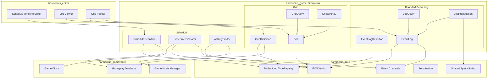
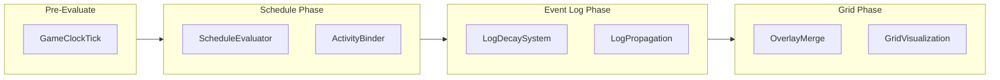
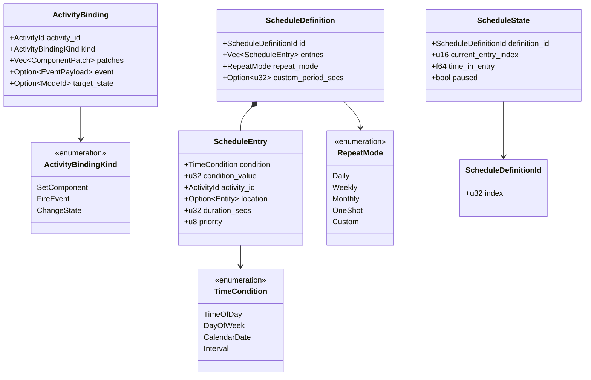
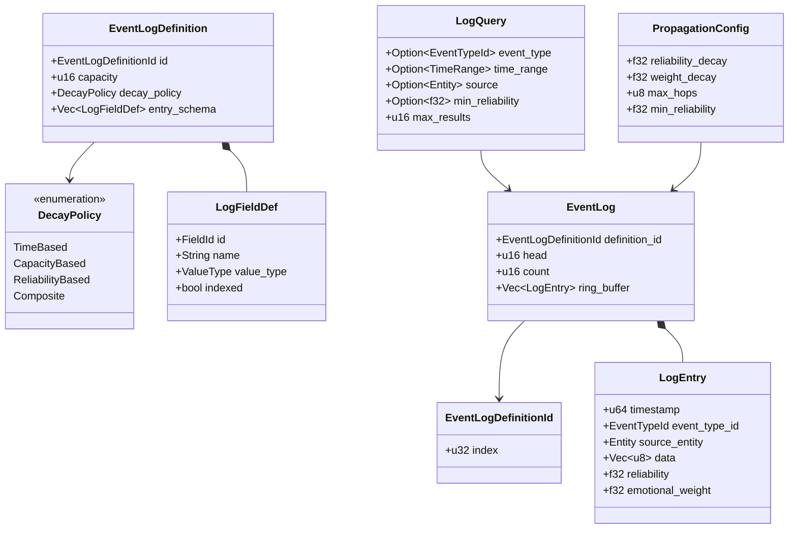
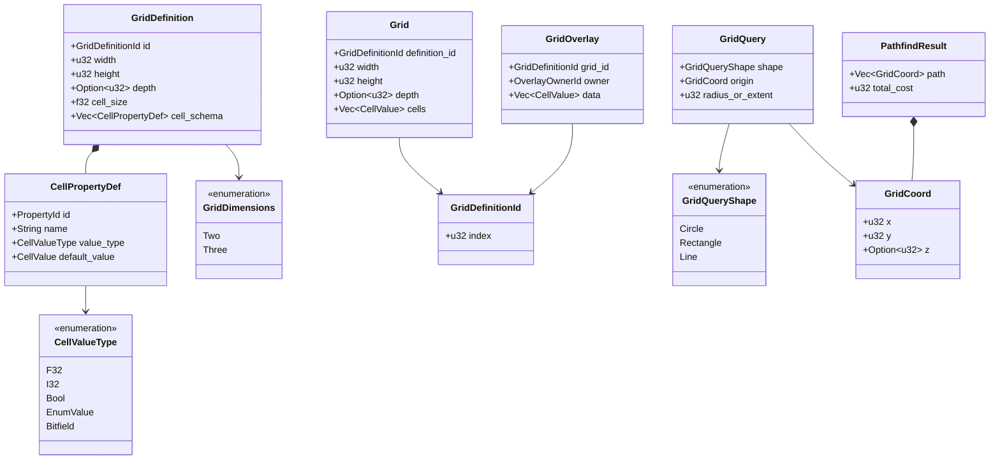
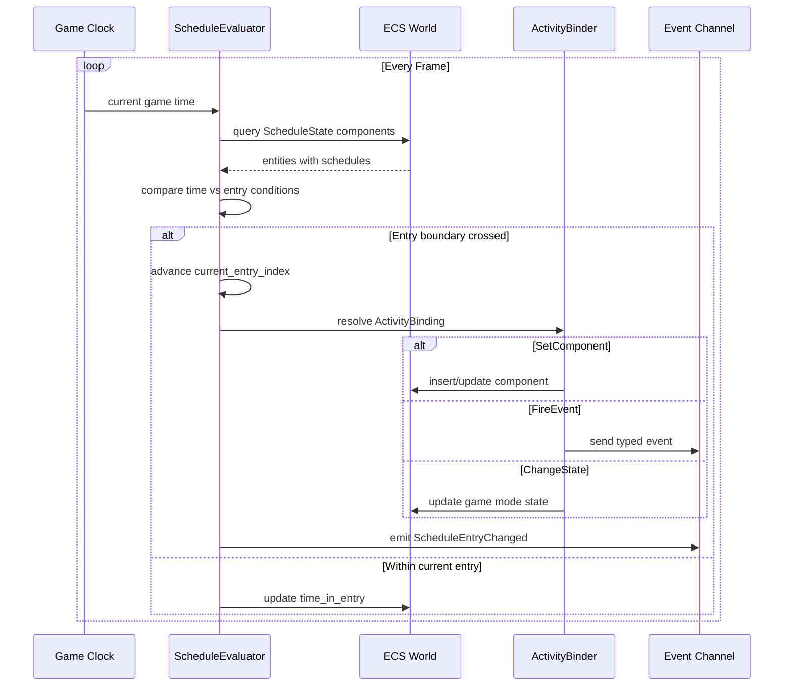
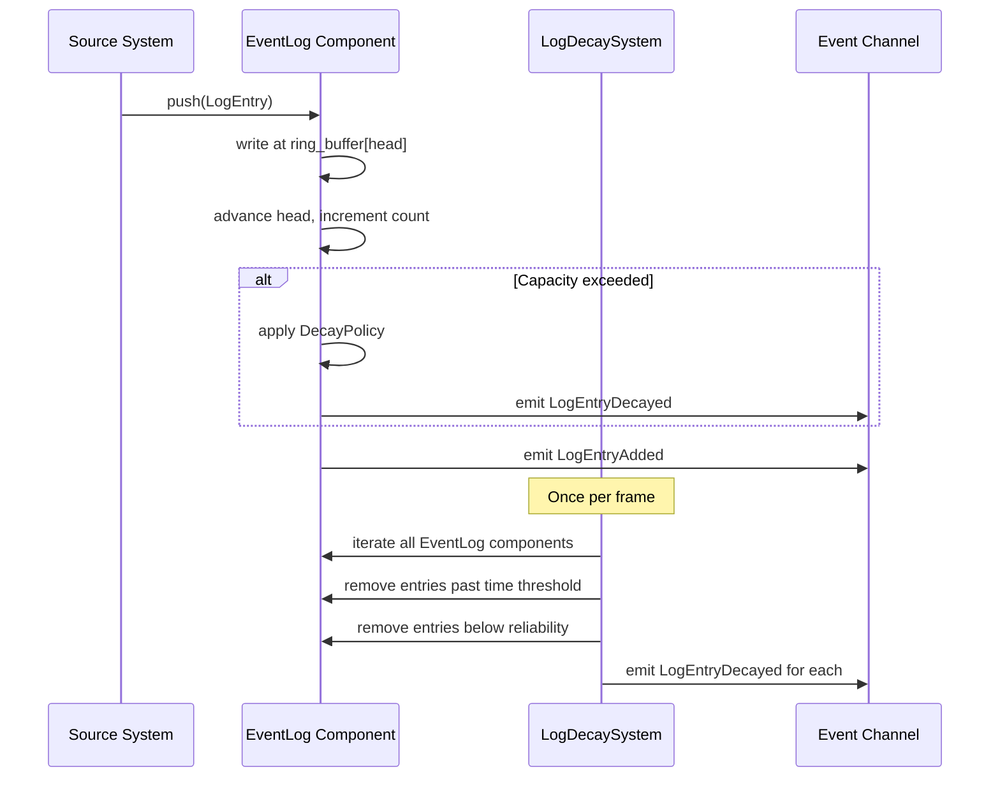
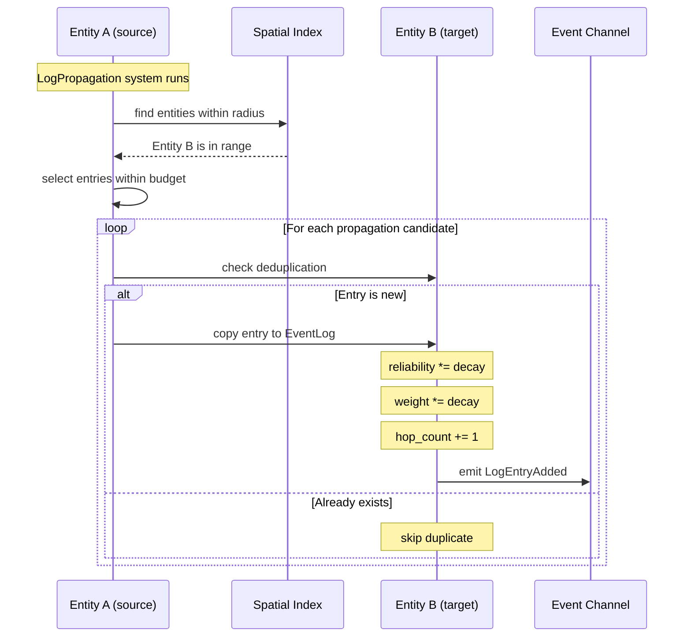
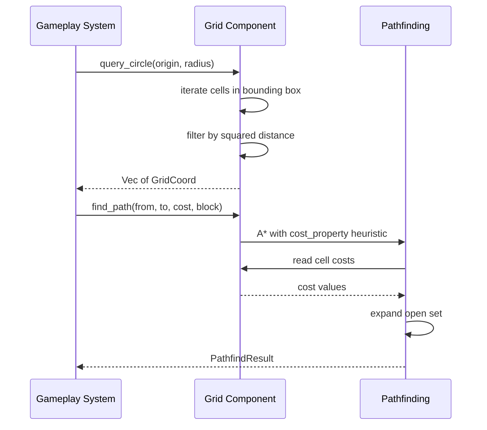

# Simulation Primitives Design

## Requirements Trace

> **Canonical sources:** Features, requirements, and user stories are defined in
> [features/game-framework/](../../features/), [requirements/game-framework/](../../requirements/),
> and [user-stories/game-framework/](../../user-stories/). The table below traces design elements to
> those definitions.

### Schedule (F-13.19.4a--c, F-13.23.2, F-13.23.4)

| Feature    | Requirement |
|------------|-------------|
| F-13.19.4a | R-13.19.4a  |
| F-13.19.4b | R-13.19.4b  |
| F-13.19.4c | R-13.19.4c  |
| F-13.23.2  | R-13.23.2   |
| F-13.23.4  | R-13.23.4   |

1. **F-13.19.4a** -- Schedule data model: time ranges, locations, activities
2. **F-13.19.4b** -- Schedule execution via pathfinding with arrival animations
3. **F-13.19.4c** -- Schedule-gated interactions exposed to dialogue and UI
4. **F-13.23.2** -- Server-defined daily/weekly rotating challenges
5. **F-13.23.4** -- Daily login reward calendar with streak tracking

### Bounded Event Log (F-13.19.3a--b)

| Feature    | Requirement |
|------------|-------------|
| F-13.19.3a | R-13.19.3a  |
| F-13.19.3b | R-13.19.3b  |

1. **F-13.19.3a** -- Deed memory with emotional weight and time-based decay
2. **F-13.19.3b** -- Gossip propagation with accuracy degradation per hop

### Grid (F-13.20.1--4, F-13.21.1, F-13.21.4, F-13.27.1--2)

| Feature   | Requirement |
|-----------|-------------|
| F-13.20.1 | R-13.20.1   |
| F-13.20.2 | R-13.20.2   |
| F-13.20.3 | R-13.20.3   |
| F-13.20.4 | R-13.20.4   |
| F-13.21.1 | R-13.21.1   |
| F-13.21.4 | R-13.21.4   |
| F-13.27.1 | R-13.27.1   |
| F-13.27.2 | R-13.27.2   |

1. **F-13.20.1** -- Fog of war grid with 3-state visibility and GPU fog texture
2. **F-13.20.2** -- Vision sources with sight radius, shape, and LOS blocking
3. **F-13.20.3** -- Vision modifier volumes (stealth zones, smoke, high ground)
4. **F-13.20.4** -- Fog memory with last-seen snapshots in shrouded areas
5. **F-13.21.1** -- Tactical grid (square/hex) with cover, elevation, occupancy
6. **F-13.21.4** -- Grid cover, flanking, and overwatch stance
7. **F-13.27.1** -- Block type registry with O(1) lookup
8. **F-13.27.2** -- Block placement and destruction via raycast

### Non-Functional Requirements

| Requirement  | Target | Description |
|--------------|--------|-------------|
| NFR-13.19.1  | 4 ms   | 200 NPCs with schedules within budget |
| NFR-13.19.2  | 256 B  | Per-entry memory for event log entries |
| NFR-SIM.NF1  | < 1 ms | Schedule evaluation for 500 entities |
| NFR-SIM.NF2  | < 1 ms | Grid query (1024x1024, circle r=32) |
| NFR-SIM.NF3  | < 2 ms | Event log decay pass for 1000 logs |

### Cross-Cutting Dependencies

| Dependency | Source | Consumed API |
|------------|--------|--------------|
| ECS world, queries | F-1.1.1 | Archetype storage, `Query` |
| Event channels | F-1.5.1 | `EventWriter<T>`, `EventReader<T>` |
| Singleton resources | F-1.5.6 | `Res<T>`, `ResMut<T>` |
| Command buffers | F-1.5.4 | Deferred entity spawn/despawn |
| Change detection | F-1.1.22 | `Changed<T>` for dirty tracking |
| Type registry | F-1.3.1 | `Reflect` derive, `TypeRegistry` |
| Serialization | F-1.3 | Save/load for all state |
| Gameplay databases | F-13.7 | `DataTable` for definitions |
| Game clock | F-13.1.2 | `GameTime` resource |
| Shared spatial index | F-1.9.1 | Proximity queries for propagation |
| Thread pool | F-14.3.1 | Scoped parallel grid operations |

## Overview

This document defines three generic simulation primitives that replace all genre-specific schedule,
memory, and grid systems throughout the game framework. Each primitive is a pure ECS construct:
definitions are immutable assets, runtime state lives in components, and all logic runs in systems.

The three primitives are:

1. **Schedule** -- Time-keyed activity binding that triggers state changes at clock or calendar
   times. Replaces NPC routines, seasonal events, daily challenge resets, and login reward
   calendars.
2. **Bounded Event Log** -- Fixed-capacity ring buffer with timestamps, typed payloads, decay
   policies, and queries. Replaces NPC deed memory, combat logs, gossip propagation, and chat
   history.
3. **Grid** -- 2D/3D cell-based spatial data with per-cell properties, schema-driven layout,
   queries, and per-faction overlays. Replaces fog of war grids, tactical combat grids, inventory
   layouts, and block placement grids.

### Design Principles

1. **100% ECS-based.** All state lives in components and resources. No parallel data stores.
2. **Data-driven and no-code.** Definitions are assets authored in visual editors. Users never write
   Rust code.
3. **Genre-agnostic.** No primitive makes assumptions about game genre. Specific behaviors emerge
   from composition.
4. **Static dispatch.** Monomorphized generics on hot paths. No trait objects except at editor
   boundaries.
5. **Deterministic.** Identical inputs produce identical outputs. All ordering is explicit.
6. **Immutable definitions.** `ScheduleDefinition`, `EventLogDefinition`, and `GridDefinition` are
   immutable assets. Runtime state is mutable but held in separate components.

### Performance Targets

| Metric | Target |
|--------|--------|
| Schedule evaluation (500 entities) | < 1 ms (NFR-SIM.NF1) |
| Grid circle query (1024x1024, r=32) | < 1 ms (NFR-SIM.NF2) |
| Event log decay pass (1000 logs) | < 2 ms (NFR-SIM.NF3) |
| Log entry size | <= 256 B (NFR-13.19.2) |
| A* pathfinding (128x128 grid) | < 0.5 ms |
| Grid overlay merge (4 factions) | < 0.5 ms |

## Architecture

### Module Boundaries



### File Layout

```text
harmonius_game/
├── simulation/
│   ├── mod.rs              # Re-exports
│   ├── schedule/
│   │   ├── definition.rs   # ScheduleDefinition,
│   │   │                   # ScheduleEntry,
│   │   │                   # RepeatMode, TimeCondition
│   │   ├── state.rs        # ScheduleState component
│   │   ├── evaluator.rs    # ScheduleEvaluatorSystem
│   │   ├── binding.rs      # ActivityBinding,
│   │   │                   # ActivityBindingKind
│   │   └── plugin.rs       # SchedulePlugin
│   ├── event_log/
│   │   ├── definition.rs   # EventLogDefinition,
│   │   │                   # LogFieldDef,
│   │   │                   # DecayPolicy
│   │   ├── log.rs          # EventLog component,
│   │   │                   # LogEntry
│   │   ├── query.rs        # LogQuery, LogQueryResult
│   │   ├── decay.rs        # LogDecaySystem
│   │   ├── propagation.rs  # LogPropagation,
│   │   │                   # PropagationConfig
│   │   └── plugin.rs       # EventLogPlugin
│   ├── grid/
│   │   ├── definition.rs   # GridDefinition,
│   │   │                   # CellPropertyDef,
│   │   │                   # CellValueType
│   │   ├── grid.rs         # Grid component, GridCoord
│   │   ├── overlay.rs      # GridOverlay,
│   │   │                   # OverlayMergeSystem
│   │   ├── query.rs        # GridQuery, GridQueryShape,
│   │   │                   # PathfindResult
│   │   ├── pathfinding.rs  # AStar, Bresenham, BFS
│   │   ├── visualization.rs# GridVisualizationSystem
│   │   └── plugin.rs       # GridPlugin
│   └── plugin.rs           # SimulationPrimitivesPlugin
│                           # (group)
```

### System Execution Order



### Class Diagram -- Schedule Types



### Class Diagram -- Event Log Types



### Class Diagram -- Grid Types



---

## API Design

All types derive `Reflect` for serialization and editor integration. Definitions are immutable
assets loaded from gameplay databases (F-13.7). Runtime state lives in ECS components.

### 1. Schedule

#### Schedule Definition (F-13.19.4a)

```rust
/// How a schedule repeats over time.
#[derive(
    Clone, Copy, Debug, PartialEq, Eq, Hash,
    Reflect,
)]
pub enum RepeatMode {
    /// Resets every in-game day.
    Daily,
    /// Resets every in-game week.
    Weekly,
    /// Resets every in-game month.
    Monthly,
    /// Fires once, then deactivates.
    OneShot,
    /// Repeats on a custom period in seconds.
    Custom,
}

/// Condition type for when a schedule entry
/// activates.
#[derive(
    Clone, Copy, Debug, PartialEq, Eq, Hash,
    Reflect,
)]
pub enum TimeCondition {
    /// Absolute time of day (seconds since
    /// midnight). condition_value = seconds.
    TimeOfDay,
    /// Day of the week (0=Monday, 6=Sunday).
    /// condition_value = day index.
    DayOfWeek,
    /// Calendar date (days since epoch).
    /// condition_value = day count.
    CalendarDate,
    /// Relative interval from schedule start.
    /// condition_value = seconds between fires.
    Interval,
}

/// Unique identifier for a schedule definition
/// asset. Maps to a row in the gameplay database.
#[derive(
    Clone, Copy, Debug, PartialEq, Eq, Hash,
    Reflect,
)]
pub struct ScheduleDefinitionId(pub u32);

/// Immutable schedule asset loaded from the
/// gameplay database. Defines a sequence of
/// time-triggered activities.
#[derive(Clone, Debug, Reflect)]
pub struct ScheduleDefinition {
    pub id: ScheduleDefinitionId,
    /// Ordered list of schedule entries. Evaluated
    /// in priority order when multiple match.
    pub entries: Vec<ScheduleEntry>,
    /// How this schedule repeats.
    pub repeat_mode: RepeatMode,
    /// Period in seconds when repeat_mode = Custom.
    pub custom_period_secs: Option<u32>,
}

/// A single time slot within a schedule.
#[derive(Clone, Debug, Reflect)]
pub struct ScheduleEntry {
    /// What kind of time condition triggers this.
    pub condition: TimeCondition,
    /// Numeric value interpreted per condition type.
    pub condition_value: u32,
    /// Activity to activate. References an
    /// ActivityBinding row in the database.
    pub activity_id: ActivityId,
    /// Optional location entity to move to.
    pub location: Option<Entity>,
    /// Duration in seconds. 0 = instantaneous.
    pub duration_secs: u32,
    /// Higher priority entries override lower ones
    /// when time ranges overlap.
    pub priority: u8,
}

impl ScheduleDefinition {
    /// Find the active entry for a given game time.
    /// Returns the highest-priority matching entry.
    pub fn active_entry(
        &self,
        game_time: &GameTime,
    ) -> Option<&ScheduleEntry>;

    /// Find the next entry that will activate after
    /// the given time. Used for UI previews.
    pub fn next_entry(
        &self,
        game_time: &GameTime,
    ) -> Option<(u32, &ScheduleEntry)>;

    /// Validate that entries have no gaps and
    /// priorities resolve all overlaps.
    pub fn validate(
        &self,
    ) -> Result<(), ScheduleValidationError>;
}
```

#### Activity Binding (F-13.19.4a)

```rust
/// What kind of side effect an activity triggers.
#[derive(
    Clone, Copy, Debug, PartialEq, Eq, Hash,
    Reflect,
)]
pub enum ActivityBindingKind {
    /// Insert or update a component on the entity.
    SetComponent,
    /// Fire a typed event through the event channel.
    FireEvent,
    /// Request a game mode / state machine
    /// transition.
    ChangeState,
}

/// Maps an ActivityId to a concrete side effect.
/// Stored as a row in the gameplay database.
#[derive(Clone, Debug, Reflect)]
pub struct ActivityBinding {
    /// Activity this binding resolves.
    pub activity_id: ActivityId,
    /// Kind of side effect.
    pub kind: ActivityBindingKind,
    /// Component patches to apply when
    /// kind = SetComponent. Each patch is a
    /// (TypeId, field_path, value) triple
    /// resolved through reflection.
    pub patches: Vec<ComponentPatch>,
    /// Event payload to fire when
    /// kind = FireEvent.
    pub event: Option<EventPayload>,
    /// Target state when kind = ChangeState.
    pub target_state: Option<ModeId>,
}
```

#### Schedule State Component (F-13.19.4b)

```rust
/// Runtime schedule state attached to any entity
/// that follows a schedule (NPCs, challenge timers,
/// login reward calendars, seasonal events).
#[derive(Clone, Debug, Reflect)]
pub struct ScheduleState {
    /// Which schedule definition this entity uses.
    pub definition_id: ScheduleDefinitionId,
    /// Index of the currently active entry.
    pub current_entry_index: u16,
    /// Seconds elapsed within the current entry.
    pub time_in_entry: f64,
    /// If true, the schedule is frozen.
    pub paused: bool,
}

/// Event fired when a schedule crosses an entry
/// boundary.
#[derive(Clone, Debug, Reflect)]
pub struct ScheduleEntryChanged {
    /// Entity whose schedule changed.
    pub entity: Entity,
    /// Previous entry index.
    pub from_index: u16,
    /// New entry index.
    pub to_index: u16,
    /// Activity that is now active.
    pub activity_id: ActivityId,
}

/// Event fired when a schedule completes (OneShot
/// mode) or wraps around (cyclic modes).
#[derive(Clone, Debug, Reflect)]
pub struct ScheduleCycleCompleted {
    pub entity: Entity,
    pub definition_id: ScheduleDefinitionId,
    pub cycle_count: u32,
}
```

#### Schedule Evaluator System

```rust
/// System that evaluates all ScheduleState
/// components against the current GameTime and
/// advances entries as needed.
///
/// Runs in the Schedule Phase after GameClockTick.
pub fn schedule_evaluator_system(
    time: Res<GameTime>,
    definitions: Res<DataTable<ScheduleDefinition>>,
    bindings: Res<DataTable<ActivityBinding>>,
    mut query: Query<
        (Entity, &mut ScheduleState),
        Changed<ScheduleState>,
    >,
    mut entry_events: EventWriter<
        ScheduleEntryChanged,
    >,
    mut cycle_events: EventWriter<
        ScheduleCycleCompleted,
    >,
    mut commands: CommandBuffer,
);
```

---

### 2. Bounded Event Log

#### Event Log Definition (F-13.19.3a)

```rust
/// How entries are evicted from a full log.
#[derive(
    Clone, Copy, Debug, PartialEq, Eq, Hash,
    Reflect,
)]
pub enum DecayPolicy {
    /// Entries older than a threshold are removed.
    TimeBased,
    /// When capacity is reached, the oldest entry
    /// is evicted (pure ring buffer behavior).
    CapacityBased,
    /// Entries with reliability below a threshold
    /// are evicted first.
    ReliabilityBased,
    /// Multiple policies applied in order. First
    /// match wins.
    Composite,
}

/// Unique identifier for an event log definition.
#[derive(
    Clone, Copy, Debug, PartialEq, Eq, Hash,
    Reflect,
)]
pub struct EventLogDefinitionId(pub u32);

/// Schema for a single field in a log entry's
/// typed payload.
#[derive(Clone, Debug, Reflect)]
pub struct LogFieldDef {
    pub id: FieldId,
    pub name: String,
    pub value_type: ValueType,
    /// If true, this field is indexed for fast
    /// query filtering.
    pub indexed: bool,
}

/// Immutable asset defining the shape and behavior
/// of an event log.
#[derive(Clone, Debug, Reflect)]
pub struct EventLogDefinition {
    pub id: EventLogDefinitionId,
    /// Maximum number of entries before eviction.
    pub capacity: u16,
    /// How entries are evicted.
    pub decay_policy: DecayPolicy,
    /// Time threshold in seconds for TimeBased
    /// decay. Entries older than this are eligible.
    pub decay_threshold_secs: Option<f64>,
    /// Minimum reliability for ReliabilityBased
    /// decay. Entries below this are eligible.
    pub min_reliability: Option<f32>,
    /// Schema of the typed payload.
    pub entry_schema: Vec<LogFieldDef>,
}
```

#### Event Log Component (F-13.19.3a)

```rust
/// A single entry in the event log ring buffer.
/// Target size: <= 256 bytes (NFR-13.19.2).
#[derive(Clone, Debug, Reflect)]
pub struct LogEntry {
    /// Game time when this entry was recorded.
    pub timestamp: u64,
    /// Type of event. References an EventType row
    /// in the gameplay database.
    pub event_type_id: EventTypeId,
    /// Entity that caused this event.
    pub source_entity: Entity,
    /// Typed payload matching the definition's
    /// entry_schema. Stored as a compact byte
    /// buffer with schema-defined layout.
    pub data: Vec<u8>,
    /// Confidence in this entry's accuracy.
    /// Range: 0.0 ..= 1.0. Decays during
    /// propagation (gossip).
    pub reliability: f32,
    /// Emotional significance. Used by NPC AI to
    /// weight memory importance. Range: 0.0 ..= 1.0.
    pub emotional_weight: f32,
    /// How many propagation hops this entry has
    /// traveled. 0 = first-hand observation.
    pub hop_count: u8,
}

/// Runtime event log attached to an entity. Ring
/// buffer with fixed capacity defined by the
/// EventLogDefinition.
#[derive(Clone, Debug, Reflect)]
pub struct EventLog {
    /// Which definition governs this log.
    pub definition_id: EventLogDefinitionId,
    /// Write cursor in the ring buffer.
    head: u16,
    /// Number of valid entries (may be less than
    /// ring_buffer.len() before first wrap).
    count: u16,
    /// Fixed-size ring buffer. Length equals the
    /// definition's capacity.
    ring_buffer: Vec<LogEntry>,
}

impl EventLog {
    /// Create a new empty log with the given
    /// capacity.
    pub fn new(
        definition_id: EventLogDefinitionId,
        capacity: u16,
    ) -> Self;

    /// Push a new entry. If full, the decay policy
    /// determines which entry is evicted.
    pub fn push(
        &mut self,
        entry: LogEntry,
        policy: &DecayPolicy,
    );

    /// Number of valid entries.
    pub fn len(&self) -> u16;

    /// True if the log contains no entries.
    pub fn is_empty(&self) -> bool;

    /// Iterate over all valid entries in
    /// chronological order (oldest first).
    pub fn iter(&self) -> EventLogIter<'_>;

    /// Iterate over all valid entries in reverse
    /// chronological order (newest first).
    pub fn iter_rev(&self) -> EventLogRevIter<'_>;

    /// Execute a query against this log. Returns
    /// matching entries in chronological order.
    pub fn query(
        &self,
        query: &LogQuery,
    ) -> Vec<&LogEntry>;

    /// Remove all entries matching a predicate.
    /// Used by the decay system.
    pub fn retain(
        &mut self,
        predicate: impl Fn(&LogEntry) -> bool,
    );
}
```

#### Log Query (F-13.19.3a)

```rust
/// Filter criteria for querying entries in an
/// EventLog. All fields are optional; omitted
/// fields match everything.
#[derive(Clone, Debug, Default, Reflect)]
pub struct LogQuery {
    /// Filter by event type.
    pub event_type: Option<EventTypeId>,
    /// Filter by time range (inclusive).
    pub time_range: Option<TimeRange>,
    /// Filter by source entity.
    pub source: Option<Entity>,
    /// Minimum reliability threshold.
    pub min_reliability: Option<f32>,
    /// Maximum number of results to return. 0 =
    /// unlimited.
    pub max_results: u16,
}

/// Inclusive time range for log queries.
#[derive(Clone, Copy, Debug, Reflect)]
pub struct TimeRange {
    pub start: u64,
    pub end: u64,
}
```

#### Log Events

```rust
/// Fired when a new entry is added to an event log.
#[derive(Clone, Debug, Reflect)]
pub struct LogEntryAdded {
    /// Entity owning the log.
    pub entity: Entity,
    /// The entry that was added.
    pub entry_index: u16,
    /// Type of the added event.
    pub event_type_id: EventTypeId,
}

/// Fired when an entry decays (is evicted) from
/// an event log.
#[derive(Clone, Debug, Reflect)]
pub struct LogEntryDecayed {
    /// Entity owning the log.
    pub entity: Entity,
    /// Type of the decayed event.
    pub event_type_id: EventTypeId,
    /// Reason for decay.
    pub reason: DecayPolicy,
}
```

#### Log Decay System

```rust
/// System that applies decay policies to all
/// EventLog components. Runs once per frame in
/// the Event Log Phase.
///
/// - TimeBased: remove entries where
///   (now - timestamp) > threshold.
/// - ReliabilityBased: remove entries where
///   reliability < min_reliability.
/// - CapacityBased: handled in EventLog::push.
/// - Composite: apply in definition order.
pub fn log_decay_system(
    time: Res<GameTime>,
    definitions: Res<
        DataTable<EventLogDefinition>,
    >,
    mut query: Query<(Entity, &mut EventLog)>,
    mut decay_events: EventWriter<LogEntryDecayed>,
);
```

#### Log Propagation (F-13.19.3b)

```rust
/// Configuration for how log entries propagate
/// between entities (gossip system).
#[derive(Clone, Debug, Reflect)]
pub struct PropagationConfig {
    /// Multiplier applied to reliability per hop.
    /// Range: 0.0 ..= 1.0. Typically 0.7.
    pub reliability_decay: f32,
    /// Multiplier applied to emotional_weight per
    /// hop. Range: 0.0 ..= 1.0.
    pub weight_decay: f32,
    /// Maximum number of hops before entry stops
    /// propagating. Prevents infinite spread.
    pub max_hops: u8,
    /// Entries below this reliability are not
    /// propagated further.
    pub min_reliability: f32,
}

/// Marker component on entities that participate
/// in log propagation. The system uses spatial
/// queries to find nearby entities with this marker.
#[derive(Clone, Debug, Reflect)]
pub struct LogPropagator {
    /// Configuration for propagation behavior.
    pub config: PropagationConfig,
    /// Radius in world units for finding
    /// propagation targets.
    pub radius: f32,
    /// Maximum entries to propagate per frame
    /// (budget cap for amortization).
    pub budget_per_frame: u8,
}

/// System that propagates log entries between
/// nearby entities. Uses the shared spatial index
/// to find neighbors within radius.
///
/// For each source entity with LogPropagator:
/// 1. Query spatial index for nearby entities
///    with EventLog components.
/// 2. For each entry in source log:
///    a. Skip if hop_count >= max_hops.
///    b. Skip if reliability < min_reliability.
///    c. Check if target already has this entry
///       (deduplicate by event_type + timestamp +
///       source_entity).
///    d. Copy entry with decayed reliability and
///       incremented hop_count.
/// 3. Respect budget_per_frame limit.
pub fn log_propagation_system(
    spatial: Res<SpatialIndex>,
    configs: Query<(
        Entity,
        &LogPropagator,
        &EventLog,
    )>,
    mut targets: Query<(Entity, &mut EventLog)>,
    mut added_events: EventWriter<LogEntryAdded>,
);
```

---

### 3. Grid

#### Grid Definition (F-13.20.1, F-13.21.1, F-13.27.1)

```rust
/// Whether the grid is 2D or 3D.
#[derive(
    Clone, Copy, Debug, PartialEq, Eq, Hash,
    Reflect,
)]
pub enum GridDimensions {
    /// 2D grid (width x height).
    Two,
    /// 3D grid (width x height x depth).
    Three,
}

/// Type of value stored in a cell property.
#[derive(
    Clone, Copy, Debug, PartialEq, Eq, Hash,
    Reflect,
)]
pub enum CellValueType {
    /// 32-bit float (movement cost, temperature).
    F32,
    /// 32-bit signed integer (elevation tier,
    /// block type ID).
    I32,
    /// Boolean (traversable, occupied).
    Bool,
    /// Named enum with up to 256 variants.
    /// Stored as u8.
    EnumValue,
    /// Bitfield with up to 32 flags.
    /// Stored as u32.
    Bitfield,
}

/// Unique identifier for a grid definition asset.
#[derive(
    Clone, Copy, Debug, PartialEq, Eq, Hash,
    Reflect,
)]
pub struct GridDefinitionId(pub u32);

/// Schema for a single cell property.
#[derive(Clone, Debug, Reflect)]
pub struct CellPropertyDef {
    /// Unique identifier within this grid's schema.
    pub id: PropertyId,
    /// Human-readable name for the editor.
    pub name: String,
    /// Value type for this property.
    pub value_type: CellValueType,
    /// Default value for new cells.
    pub default_value: CellValue,
}

/// Immutable grid definition asset. Defines
/// dimensions, cell size, and per-cell property
/// schema.
#[derive(Clone, Debug, Reflect)]
pub struct GridDefinition {
    pub id: GridDefinitionId,
    /// Width in cells.
    pub width: u32,
    /// Height in cells.
    pub height: u32,
    /// Depth in cells (None for 2D grids).
    pub depth: Option<u32>,
    /// World-space size of each cell in units.
    pub cell_size: f32,
    /// Schema defining properties stored per cell.
    /// Properties are stored in a dense SoA layout:
    /// one contiguous array per property.
    pub cell_schema: Vec<CellPropertyDef>,
}

impl GridDefinition {
    /// Total number of cells in the grid.
    pub fn cell_count(&self) -> u32;

    /// Dimensionality of this grid.
    pub fn dimensions(&self) -> GridDimensions;

    /// Byte size per cell (sum of all property
    /// sizes). Used for memory budgeting.
    pub fn bytes_per_cell(&self) -> usize;

    /// Validate that the schema has no duplicate
    /// IDs and all defaults match their types.
    pub fn validate(
        &self,
    ) -> Result<(), GridValidationError>;
}
```

#### Grid Component (F-13.20.1, F-13.21.1, F-13.27.2)

```rust
/// Coordinate in a grid. z is None for 2D grids.
#[derive(
    Clone, Copy, Debug, PartialEq, Eq, Hash,
    Reflect,
)]
pub struct GridCoord {
    pub x: u32,
    pub y: u32,
    pub z: Option<u32>,
}

/// Untyped cell value. Interpretation depends on
/// the CellPropertyDef.
#[derive(Clone, Copy, Debug, Reflect)]
pub enum CellValue {
    F32(f32),
    I32(i32),
    Bool(bool),
    EnumValue(u8),
    Bitfield(u32),
}

/// Runtime grid state attached to an entity. Stores
/// cell property values in a dense SoA layout: one
/// flat array per property in the schema.
#[derive(Clone, Debug, Reflect)]
pub struct Grid {
    /// Which definition governs this grid.
    pub definition_id: GridDefinitionId,
    /// Cached dimensions for fast access.
    width: u32,
    height: u32,
    depth: Option<u32>,
    /// One flat array per property in the schema.
    /// properties[i] corresponds to
    /// definition.cell_schema[i].
    /// Each array has cell_count() elements.
    properties: Vec<Vec<CellValue>>,
}

impl Grid {
    /// Create a new grid initialized to defaults.
    pub fn new(
        definition: &GridDefinition,
    ) -> Self;

    /// Get a cell property value by coordinate
    /// and property index.
    pub fn get(
        &self,
        coord: GridCoord,
        property_index: usize,
    ) -> CellValue;

    /// Set a cell property value.
    pub fn set(
        &mut self,
        coord: GridCoord,
        property_index: usize,
        value: CellValue,
    );

    /// Get all property values for a single cell.
    pub fn cell_properties(
        &self,
        coord: GridCoord,
    ) -> Vec<CellValue>;

    /// Convert a world-space position to grid
    /// coordinates. Returns None if out of bounds.
    pub fn world_to_grid(
        &self,
        position: Vec3,
        cell_size: f32,
    ) -> Option<GridCoord>;

    /// Convert grid coordinates to world-space
    /// center position.
    pub fn grid_to_world(
        &self,
        coord: GridCoord,
        cell_size: f32,
    ) -> Vec3;

    /// Linearize a coordinate to a flat index.
    fn coord_to_index(
        &self,
        coord: GridCoord,
    ) -> usize;

    /// Check if a coordinate is within bounds.
    pub fn in_bounds(
        &self,
        coord: GridCoord,
    ) -> bool;
}
```

#### Grid Overlay (F-13.20.1, F-13.21.4)

```rust
/// Identifies the owner of a grid overlay (faction,
/// player, team, etc.).
#[derive(
    Clone, Copy, Debug, PartialEq, Eq, Hash,
    Reflect,
)]
pub struct OverlayOwnerId(pub u32);

/// Per-owner overlay on top of a base grid. Each
/// overlay stores a subset of properties (typically
/// one) with per-owner values.
///
/// Example: fog of war. The base grid defines
/// terrain. Each faction has an overlay storing
/// visibility state per cell.
#[derive(Clone, Debug, Reflect)]
pub struct GridOverlay {
    /// Which grid this overlay belongs to.
    pub grid_id: GridDefinitionId,
    /// Owner of this overlay.
    pub owner: OverlayOwnerId,
    /// Index of the property in the grid schema
    /// that this overlay stores.
    pub property_index: usize,
    /// Overlay data. Same length as the grid's
    /// cell count.
    data: Vec<CellValue>,
}

impl GridOverlay {
    pub fn new(
        grid_id: GridDefinitionId,
        owner: OverlayOwnerId,
        property_index: usize,
        cell_count: u32,
        default: CellValue,
    ) -> Self;

    pub fn get(
        &self,
        coord: GridCoord,
        grid: &Grid,
    ) -> CellValue;

    pub fn set(
        &mut self,
        coord: GridCoord,
        grid: &Grid,
        value: CellValue,
    );
}
```

#### Grid Queries (F-13.20.2, F-13.21.1, F-13.27.2)

```rust
/// Shape of a grid query region.
#[derive(
    Clone, Copy, Debug, PartialEq, Eq, Hash,
    Reflect,
)]
pub enum GridQueryShape {
    /// Circle with radius in cells.
    Circle,
    /// Axis-aligned rectangle with half-extents.
    Rectangle,
    /// Line from origin to endpoint (Bresenham).
    Line,
}

/// A spatial query against grid cells.
#[derive(Clone, Debug, Reflect)]
pub struct GridQuery {
    /// Shape of the query region.
    pub shape: GridQueryShape,
    /// Center of the query.
    pub origin: GridCoord,
    /// Radius (Circle), half-extent (Rectangle),
    /// or endpoint packed as u32 (Line).
    pub radius_or_extent: u32,
    /// Optional: endpoint for Line queries.
    pub endpoint: Option<GridCoord>,
}

/// Result of an A* pathfinding query.
#[derive(Clone, Debug, Reflect)]
pub struct PathfindResult {
    /// Ordered sequence of grid coordinates from
    /// start to goal.
    pub path: Vec<GridCoord>,
    /// Total movement cost.
    pub total_cost: u32,
}

/// Grid query execution. All methods are pure
/// functions that operate on immutable grid data.
impl Grid {
    /// Return all cells within the query shape.
    pub fn query_cells(
        &self,
        query: &GridQuery,
    ) -> Vec<GridCoord>;

    /// Circle query: all cells within radius of
    /// origin. Uses squared-distance comparison.
    pub fn query_circle(
        &self,
        origin: GridCoord,
        radius: u32,
    ) -> Vec<GridCoord>;

    /// Rectangle query: all cells within
    /// axis-aligned rectangle.
    pub fn query_rect(
        &self,
        origin: GridCoord,
        half_width: u32,
        half_height: u32,
    ) -> Vec<GridCoord>;

    /// Line-of-sight: Bresenham line from origin
    /// to target. Stops at cells where a specified
    /// property (e.g., "blocks_sight") is true.
    pub fn line_of_sight(
        &self,
        from: GridCoord,
        to: GridCoord,
        blocking_property: usize,
    ) -> bool;

    /// A* pathfinding. Uses the specified property
    /// index as movement cost. Returns None if no
    /// path exists.
    pub fn find_path(
        &self,
        from: GridCoord,
        to: GridCoord,
        cost_property: usize,
        blocking_property: usize,
    ) -> Option<PathfindResult>;

    /// BFS reachable cells within a budget.
    /// Returns cells with their cumulative cost.
    pub fn reachable_cells(
        &self,
        origin: GridCoord,
        max_cost: u32,
        cost_property: usize,
        blocking_property: usize,
    ) -> Vec<(GridCoord, u32)>;
}
```

---

## Data Flow

### Schedule Evaluation



### Event Log Push and Decay



### Log Propagation (Gossip)



### Grid Query and Pathfinding



---

## Composition Examples

These examples show how the three generic primitives replace genre-specific systems through
composition.

### NPC Daily Routine (F-13.19.4a--c)

An NPC entity has:

- `ScheduleState` pointing to a `ScheduleDefinition` with `RepeatMode::Daily` and entries for
  morning (go to market), afternoon (go to workshop), evening (go to tavern), night (go home).
- Each `ScheduleEntry` has `location` set to a waypoint entity.
- `ActivityBinding` with `kind = SetComponent` sets an `NpcActivity` component that the behavior
  tree reads.
- The `ScheduleEntryChanged` event triggers the pathfinding system to navigate to the new location.

### NPC Memory and Gossip (F-13.19.3a--b)

An NPC entity has:

- `EventLog` with `capacity = 50`, `decay_policy = Composite` (TimeBased + ReliabilityBased).
- `LogPropagator` with `reliability_decay = 0.7`, `weight_decay = 0.7`, `max_hops = 3`,
  `radius = 30.0`.
- When the player performs a deed, a system pushes a `LogEntry` with `reliability = 1.0`,
  `emotional_weight = 1.0`, `hop_count = 0`.
- When two NPCs are nearby, `log_propagation_system` copies entries with decayed reliability.
- The reputation system queries logs with `LogQuery { min_reliability: Some(0.3) }` to aggregate
  community opinion.

### Daily Challenge Reset (F-13.23.2)

A singleton challenge entity has:

- `ScheduleState` pointing to a `ScheduleDefinition` with `RepeatMode::Daily` and a single entry at
  midnight.
- `ActivityBinding` with `kind = FireEvent` that fires a `ChallengeResetEvent`.
- The challenge system listens for `ChallengeResetEvent` and rotates the active challenge set from
  the database.

### Login Reward Calendar (F-13.23.4)

A per-player entity has:

- `ScheduleState` pointing to a `ScheduleDefinition` with `RepeatMode::Daily` and entries for each
  day in the reward calendar.
- `ActivityBinding` with `kind = FireEvent` that fires `LoginRewardAvailable`.
- `EventLog` tracking claim history so the system can detect streaks and missed days.

### Fog of War (F-13.20.1--4)

A world entity has:

- `Grid` with schema `[visibility: EnumValue, last_seen_frame: I32, blocks_sight: Bool]`.
- One `GridOverlay` per faction, storing per-faction `visibility` values.
- The vision system calls `grid.query_circle(npc_pos, sight_radius)` then
  `grid.line_of_sight(npc_pos, cell, blocking_property)` to update overlay visibility.
- The GPU fog texture is generated from the active faction's overlay.

### Tactical Combat Grid (F-13.21.1, F-13.21.4)

A battle entity has:

- `Grid` with schema containing `traversable: Bool`, `elevation: I32`, `movement_cost: F32`,
  directional cover properties (`cover_north`, `cover_east`, `cover_south`, `cover_west` as
  `EnumValue`), and `occupant: I32`.
- The turn-based system calls `grid.reachable_cells(origin, action_points, cost_idx, block_idx)` to
  highlight movement range.
- Cover is queried per-edge using the directional cover properties.
- `grid.find_path(from, to, cost_idx, block_idx)` provides A* pathfinding for unit movement.

### Block/Voxel Grid (F-13.27.1--2)

A chunk entity has:

- `Grid` with `depth = Some(16)` and schema `[block_type: I32, light_level: I32, sunlight: Bool]`.
- Block placement calls `grid.set(coord, 0, CellValue::I32(type_id))` and the meshing system is
  notified via change detection.
- Block destruction calls `grid.set(coord, 0, CellValue::I32(0))`.
- The lighting system uses `grid.query_cells` with custom flood-fill iteration.

### Inventory Layout Grid

A player inventory entity has:

- `Grid` with `depth = None`, `width = 10`, `height = 4`, and schema
  `[item_id: I32, occupied: Bool]`.
- Item placement checks `grid.query_rect(origin, w, h)` to verify all target cells have
  `occupied = false`.
- No pathfinding or overlays needed -- pure property storage.

---

## Platform Considerations

| Concern | Approach |
|---------|----------|
| Serialization | All state via `Reflect` + binary serialization (F-1.3) |
| Networking | Grid delta sync via dirty-cell bitset |
| GPU upload | Grid data uploaded as structured buffers for fog texture generation |
| Memory | Dense SoA layout for cache-friendly iteration |
| Threading | Grid queries are read-only; safe for parallel execution |
| Save/load | `ScheduleState`, `EventLog`, `Grid`, `GridOverlay` all serialized |
| Hot reload | Definitions hot-reloaded from database; runtime state preserved |
| Mobile | Reduce grid capacity and log capacity via platform config |

### Memory Budget

| Primitive | Calculation | Budget |
|-----------|-------------|--------|
| Schedule (500 NPCs) | 500 x 32 B state | 16 KB |
| Event log (200 NPCs, 50 entries) | 200 x 50 x 256 B | 2.5 MB |
| Fog grid (1024x1024, 4 factions) | 1024 x 1024 x 4 x 1 B | 4 MB |
| Tactical grid (64x64) | 64 x 64 x 32 B/cell | 128 KB |
| Voxel chunk (16x16x16) | 4096 x 8 B | 32 KB |

### Networking

- **Schedules** are deterministic given the same game clock. Only the clock needs synchronization.
- **Event logs** propagate via the gossip system. Network replication sends `LogEntryAdded` events.
- **Grids** use dirty-cell tracking. Each frame, modified cells are collected into a delta bitset
  and sent to clients. Full sync on join.

---

## Test Plan

Full test cases are in [simulation-test-cases.md](simulation-test-cases.md).

### Unit Tests

| Area | Coverage |
|------|----------|
| ScheduleDefinition::active_entry | All TimeCondition variants |
| ScheduleDefinition::validate | Gap detection, priority conflicts |
| EventLog::push | Capacity boundary, ring wrap |
| EventLog::query | All filter combinations |
| EventLog::retain | Each DecayPolicy variant |
| Grid::get/set | 2D and 3D, bounds checking |
| Grid::query_circle | Interior, boundary, out-of-bounds |
| Grid::line_of_sight | Unobstructed, blocked, edge cases |
| Grid::find_path | Reachable, unreachable, diagonal |
| Grid::reachable_cells | Budget exactly met, over budget |
| GridOverlay::get/set | Correct isolation between owners |
| LogPropagation | Dedup, hop limit, reliability floor |

### Integration Tests

| Area | Coverage |
|------|----------|
| Schedule + ActivityBinder | End-to-end entry transition |
| Schedule + Game Clock | Real-time and accelerated clock |
| EventLog + Propagation | Multi-hop gossip chain |
| Grid + Overlay + Vision | Fog of war update cycle |
| Grid + Pathfinding | A* on tactical grid with cover |
| All primitives + Serialization | Round-trip save/load |

### Benchmarks

| Benchmark | Target |
|-----------|--------|
| schedule_eval_500 | < 1 ms (NFR-SIM.NF1) |
| log_decay_1000 | < 2 ms (NFR-SIM.NF3) |
| grid_circle_1024 | < 1 ms (NFR-SIM.NF2) |
| grid_astar_128 | < 0.5 ms |
| propagation_200_npcs | < 2 ms |
| overlay_merge_4_factions | < 0.5 ms |

---

## Open Questions

1. **Grid property compression.** Should grids support palette compression (like voxel chunks) at
   the primitive level, or should that be a voxel-specific optimization layer?
2. **Async grid queries.** For very large grids (4096x4096), should pathfinding be async to avoid
   stalling the game loop?
3. **Event log indexing.** Should indexed fields use a secondary hash map per log, or is linear scan
   over <= 50 entries acceptable?
4. **Schedule interpolation.** Should entries support smooth transitions (lerp between activities)
   or only discrete switches?
