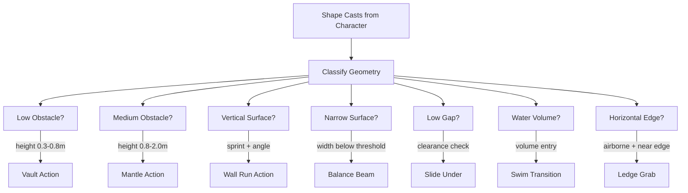
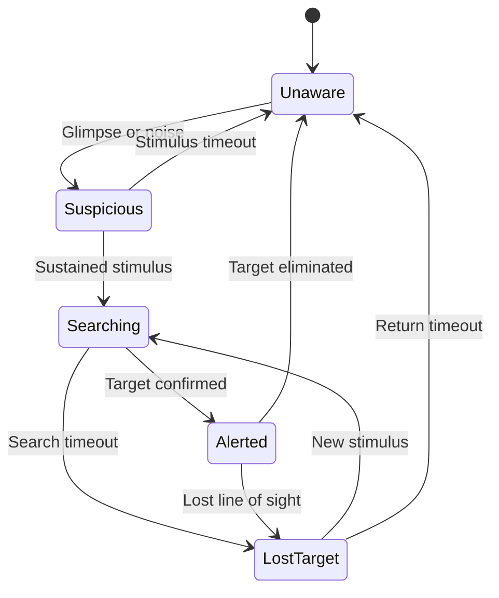
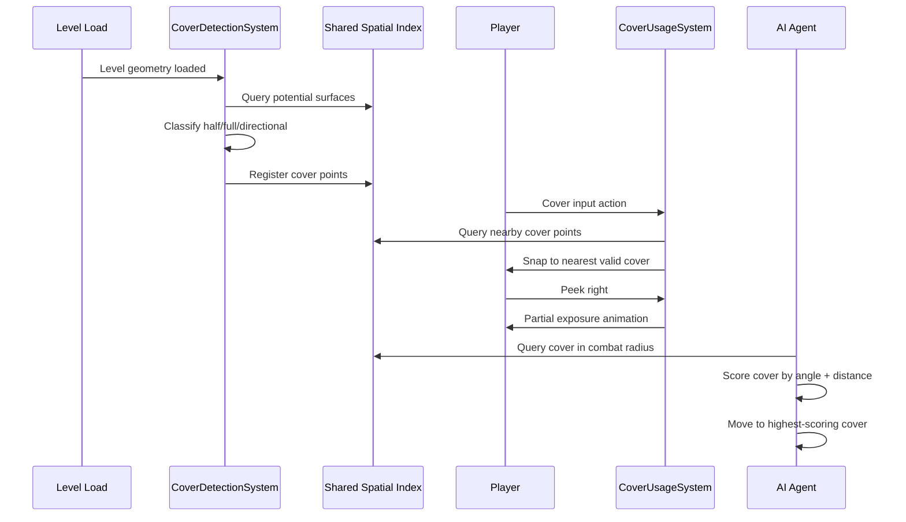

# Traversal and Stealth System Design

## Requirements Trace

> **Canonical sources:** Features, requirements, and user stories are defined in
> [features/game-framework/](../../features/game-framework/),
> [requirements/game-framework/](../../requirements/game-framework/), and
> [user-stories/game-framework/](../../user-stories/game-framework/). The table below traces design
> elements to those definitions.

### Traversal and Interaction

| Feature | Requirement | Description |
|---------|-------------|-------------|
| F-13.17.1 | R-13.17.1 | World object interaction (raycast, proximity, radial menu) |
| F-13.17.2 | R-13.17.2 | Door and lock system with AI integration |
| F-13.17.3 | R-13.17.3 | Physics object pickup and throw |
| F-13.17.4a | R-13.17.4a | Traversal detection via shape casts |
| F-13.17.4b | R-13.17.4b | Vault and mantle actions |
| F-13.17.4c | R-13.17.4c | Wall run |
| F-13.17.4d | R-13.17.4d | Crouch slide |
| F-13.17.4e | R-13.17.4e | Balance beam traversal |
| F-13.17.5a | R-13.17.5a | Free-climb with IK grip points |
| F-13.17.5b | R-13.17.5b | Ladder traversal |
| F-13.17.5c | R-13.17.5c | Ledge grab and shimmy |
| F-13.17.6 | R-13.17.6 | Swimming and diving |
| F-13.17.7 | R-13.17.7 | Grappling hook and zipline |

### Stealth and Cover

| Feature | Requirement | Description |
|---------|-------------|-------------|
| F-13.18.1 | R-13.18.1 | Player visibility and stealth scoring |
| F-13.18.2 | R-13.18.2 | AI alert state machine (5 states) |
| F-13.18.3 | R-13.18.3 | Noise generation and distraction |
| F-13.18.4 | R-13.18.4 | Stealth takedown system |
| F-13.18.5 | R-13.18.5 | Cover point detection and usage |

## Overview

This design covers two tightly coupled domains: traversal (movement actions and environmental
interaction) and stealth (visibility, noise, cover, and AI awareness). Both are 100% ECS-based with
all data as components and all logic as systems.

Key design principles:

1. **Data-driven traversal.** All traversal actions (vault, climb, slide, swim, grapple) are
   configured via components. Designers tune parameters in the visual editor.
2. **Auto-detection with override.** Traversal geometry is auto-detected from shape casts. Level
   designers can override with explicit tags.
3. **Multi-factor stealth.** Visibility scoring combines light, shadow, speed, posture, and
   equipment. No single binary detection check.
4. **Shared spatial index.** Noise propagation, cover detection, and traversal shape casts all use
   the shared BVH/octree.
5. **No-code authoring.** All parameters are exposed to the visual editor. Logic graphs drive
   interaction behavior.

## Architecture

### Module Boundaries

```mermaid
graph TD
    subgraph traversal["Traversal Module"]
        TD[TraversalDetection]
        VA[Vault / Mantle]
        WR[WallRun]
        CS[CrouchSlide]
        BB[BalanceBeam]
        CL[Climb / Ladder]
        LG[LedgeGrab]
        SW[Swim]
        GR[Grapple / Zipline]
    end

    subgraph interaction["Interaction Module"]
        IA[Interactable]
        DR[Door / Lock]
        PU[Pickup / Throw]
    end

    subgraph stealth["Stealth Module"]
        VS[VisibilityScore]
        NS[NoiseEvent]
        AS[AlertState]
        TK[Takedown]
        CP[CoverPoint]
    end

    subgraph deps["Engine Dependencies"]
        SI[Shared Spatial Index]
        CC[Character Controller]
        IK[IK Solvers]
        SM[Animation State Machine]
        LG2[Logic Graphs]
        PR[AI Perception]
    end

    SI --> TD
    SI --> CP
    SI --> NS
    CC --> VA
    CC --> WR
    CC --> CS
    IK --> CL
    IK --> LG
    SM --> VA
    SM --> WR
    LG2 --> IA
    PR --> VS
    PR --> AS
```



```text
harmonius_game/
├── traversal/
│   ├── detection.rs    # TraversalDetectionSystem,
│   │                   # TraversalOpportunity
│   ├── vault.rs        # VaultSystem,
│   │                   # MantleSystem
│   ├── wall_run.rs     # WallRunSystem
│   ├── slide.rs        # CrouchSlideSystem
│   ├── balance.rs      # BalanceBeamSystem
│   ├── climb.rs        # ClimbSystem,
│   │                   # LadderSystem
│   ├── ledge.rs        # LedgeGrabSystem,
│   │                   # ShimmySystem
│   ├── swim.rs         # SwimSystem, DiveSystem
│   ├── grapple.rs      # GrappleSystem,
│   │                   # ZiplineSystem
│   └── components.rs   # All traversal components
├── interaction/
│   ├── system.rs       # InteractionSystem
│   ├── door.rs         # DoorSystem
│   ├── pickup.rs       # PickupSystem
│   └── components.rs   # Interactable, Door,
│                       # Grabbable
└── stealth/
    ├── visibility.rs   # VisibilityScoreSystem
    ├── noise.rs        # NoiseGenerationSystem
    ├── alert.rs        # AlertStateSystem
    ├── takedown.rs     # TakedownSystem
    ├── cover.rs        # CoverDetectionSystem,
    │                   # CoverUsageSystem
    └── components.rs   # All stealth components
```

### Traversal Detection Flow



### Stealth State Machine



### Cover Detection and Usage



## API Design

### Traversal Components

```rust
/// Classification of detected traversal geometry.
#[derive(Clone, Copy, Debug, PartialEq, Eq, Reflect)]
pub enum TraversalType {
    Vault,
    Mantle,
    WallRun,
    CrouchSlide,
    BalanceBeam,
    Climb,
    Ladder,
    LedgeGrab,
    Swim,
    GrapplePoint,
    Zipline,
}

/// Detected traversal opportunity near the player.
/// Transient: rebuilt every frame by
/// TraversalDetectionSystem.
#[derive(Component, Reflect)]
pub struct TraversalOpportunity {
    /// Type of traversal action available.
    pub traversal_type: TraversalType,
    /// World-space contact point on the surface.
    pub contact_point: Vec3,
    /// Surface normal at the contact point.
    pub surface_normal: Vec3,
    /// Height of the obstacle (for vault/mantle).
    pub obstacle_height: f32,
}

/// Configurable detection parameters for the
/// traversal shape-cast system.
#[derive(Component, Reflect)]
pub struct TraversalDetectionConfig {
    /// Forward cast distance (meters).
    pub forward_distance: f32,
    /// Downward cast distance (meters).
    pub downward_distance: f32,
    /// Maximum vault height (meters).
    pub vault_height_max: f32,
    /// Minimum vault height (meters).
    pub vault_height_min: f32,
    /// Maximum mantle height (meters).
    pub mantle_height_max: f32,
    /// Balance beam width threshold (meters).
    pub balance_width_threshold: f32,
    /// Minimum slide clearance (meters).
    pub slide_clearance: f32,
}

/// Active traversal state on the character entity.
#[derive(Component, Reflect)]
pub struct TraversalState {
    /// Currently active traversal action, if any.
    pub active: Option<ActiveTraversal>,
}

/// Data for an in-progress traversal action.
#[derive(Clone, Debug, Reflect)]
pub struct ActiveTraversal {
    pub traversal_type: TraversalType,
    /// Normalized progress [0, 1].
    pub progress: f32,
    /// Target position to reach.
    pub target_position: Vec3,
    /// Stamina cost for this action.
    pub stamina_cost: f32,
}
```

### Vault and Mantle

```rust
/// Configuration for vault and mantle actions.
#[derive(Component, Reflect)]
pub struct VaultMantleConfig {
    /// Height range for vault (meters).
    pub vault_range: (f32, f32),
    /// Height range for mantle (meters).
    pub mantle_range: (f32, f32),
    /// Minimum approach speed (m/s).
    pub min_approach_speed: f32,
    /// Stamina cost per vault.
    pub vault_stamina_cost: f32,
    /// Stamina cost per mantle.
    pub mantle_stamina_cost: f32,
}
```

### Wall Run

```rust
/// Wall-run behavior parameters.
#[derive(Component, Reflect)]
pub struct WallRunConfig {
    /// Horizontal speed along the wall (m/s).
    pub run_speed: f32,
    /// Maximum wall-run duration (seconds).
    pub max_duration: f32,
    /// Gravity curve: vertical descent rate over
    /// normalized time [0, 1].
    pub gravity_curve: AnimationCurve,
    /// Minimum entry speed to trigger (m/s).
    pub min_entry_speed: f32,
    /// Jump-off launch angle (degrees from wall
    /// normal).
    pub jump_off_angle: f32,
}

/// Tracks active wall-run state.
#[derive(Component, Reflect)]
pub struct WallRunState {
    /// Wall normal for the surface being run on.
    pub wall_normal: Vec3,
    /// Elapsed time on the wall (seconds).
    pub elapsed: f32,
    /// True if the player is still providing
    /// forward input.
    pub sustained_input: bool,
}
```

### Crouch Slide

```rust
/// Crouch slide parameters.
#[derive(Component, Reflect)]
pub struct CrouchSlideConfig {
    /// Deceleration rate (m/s^2).
    pub deceleration: f32,
    /// Slope multiplier: > 1.0 for downhill
    /// extension, < 1.0 for uphill reduction.
    pub slope_multiplier: f32,
    /// Stamina cost per slide.
    pub stamina_cost: f32,
    /// Cooldown between slides (seconds).
    pub cooldown: f32,
    /// Reduced collision height during slide.
    pub slide_height: f32,
}
```

### Climbing and Ladders

```rust
/// Marks a surface as climbable with grip points.
#[derive(Component, Reflect)]
pub struct Climbable {
    /// Grip point generation mode.
    pub grip_mode: GripMode,
    /// Spacing between auto-generated grips
    /// (meters).
    pub grip_spacing: f32,
    /// Maximum reach distance between grips
    /// (meters).
    pub reach_distance: f32,
    /// Climb speed (m/s).
    pub climb_speed: f32,
    /// Stamina drain rate (units/second).
    pub stamina_drain: f32,
}

#[derive(Clone, Copy, Debug, PartialEq, Eq, Reflect)]
pub enum GripMode {
    /// Auto-generated grid of grip points.
    AutoGrid,
    /// Hand-placed grip markers by designer.
    Manual,
}

/// A rest point on a climb surface that pauses
/// stamina drain.
#[derive(Component, Reflect)]
pub struct ClimbRestPoint;

/// Ladder entity for simplified vertical movement.
#[derive(Component, Reflect)]
pub struct Ladder {
    /// Climb speed on this ladder (m/s).
    pub climb_speed: f32,
    /// Bottom rung world position.
    pub bottom: Vec3,
    /// Top rung world position.
    pub top: Vec3,
}
```

### Swimming

```rust
/// Swimming and diving parameters.
#[derive(Component, Reflect)]
pub struct SwimConfig {
    /// Surface swim speed (m/s).
    pub surface_speed: f32,
    /// Underwater swim speed (m/s).
    pub dive_speed: f32,
    /// Buoyancy force multiplier.
    pub buoyancy: f32,
    /// Oxygen drain rate (units/second).
    pub oxygen_drain: f32,
    /// Maximum oxygen capacity.
    pub max_oxygen: f32,
    /// Drowning damage per second at zero oxygen.
    pub drowning_damage: f32,
}

/// Tracks current swim/dive state.
#[derive(Component, Reflect)]
pub struct SwimState {
    /// Current oxygen level.
    pub oxygen: f32,
    /// True if fully submerged.
    pub submerged: bool,
}
```

### Grapple and Zipline

```rust
/// Grappling hook parameters per equipment item.
#[derive(Component, Reflect)]
pub struct GrappleConfig {
    /// Maximum grapple range (meters).
    pub range: f32,
    /// Pull speed toward anchor (m/s).
    pub pull_speed: f32,
    /// Swing pendulum parameters.
    pub swing_gravity: f32,
    pub swing_damping: f32,
}

/// Zipline cable entity.
#[derive(Component, Reflect)]
pub struct Zipline {
    /// Start point of the cable.
    pub start: Vec3,
    /// End point of the cable.
    pub end: Vec3,
    /// Maximum slide speed (m/s).
    pub max_speed: f32,
    /// Braking deceleration (m/s^2).
    pub brake_deceleration: f32,
}
```

### Interaction Components

```rust
/// Marks an entity as interactable with data-driven
/// behavior.
#[derive(Component, Reflect)]
pub struct Interactable {
    /// Type of interaction.
    pub interaction_type: InteractionType,
    /// Display prompt text (localization key).
    pub prompt_key: StringId,
    /// Required item for interaction (if any).
    pub required_item: Option<ItemId>,
    /// Duration for channeled interactions
    /// (seconds).
    pub channel_duration: f32,
    /// Logic graph to execute on interaction.
    pub logic_graph: Handle<LogicGraph>,
    /// Animation to play during interaction.
    pub animation: Option<Handle<AnimationClip>>,
}

#[derive(Clone, Copy, Debug, PartialEq, Eq, Reflect)]
pub enum InteractionType {
    /// Execute immediately on input press.
    Instant,
    /// Requires holding input for a duration.
    Channeled,
    /// Triggers on proximity entry.
    Automatic,
}

/// Door entity with state and access control.
#[derive(Component, Reflect)]
pub struct Door {
    /// Current door state.
    pub state: DoorState,
    /// Door swing type.
    pub swing_type: DoorSwingType,
    /// Required key item (if locked).
    pub key_item: Option<ItemId>,
    /// Lockpick difficulty (0 = not lockpickable).
    pub lockpick_difficulty: f32,
    /// HP for breakable doors (0 = unbreakable).
    pub breakable_hp: f32,
    /// Auto-close timer (0 = no auto-close).
    pub auto_close_seconds: f32,
}

#[derive(Clone, Copy, Debug, PartialEq, Eq, Reflect)]
pub enum DoorState {
    Open,
    Closed,
    Locked,
    Broken,
}

#[derive(Clone, Copy, Debug, PartialEq, Eq, Reflect)]
pub enum DoorSwingType {
    OneWay,
    DoubleSwing,
    Sliding,
    Portcullis,
}

/// Marks an entity as grabbable for physics pickup.
#[derive(Component, Reflect)]
pub struct Grabbable {
    /// Hold distance from character (meters).
    pub hold_distance: f32,
    /// Spring stiffness for held position.
    pub spring_stiffness: f32,
    /// Throw force magnitude.
    pub throw_strength: f32,
    /// Movement speed multiplier when carrying.
    pub carry_speed_multiplier: f32,
}
```

### Stealth Components

```rust
/// Per-entity visibility score computed each frame.
#[derive(Component, Reflect)]
pub struct VisibilityScore {
    /// Composite score [0.0 = invisible, 1.0 = fully
    /// visible].
    pub score: f32,
    /// Individual factor contributions.
    pub light_factor: f32,
    pub shadow_factor: f32,
    pub speed_factor: f32,
    pub equipment_factor: f32,
    pub ability_override: Option<f32>,
}

/// Equipment visibility modifier.
#[derive(Component, Reflect)]
pub struct StealthEquipmentModifier {
    /// Multiplier on visibility (< 1.0 reduces,
    /// > 1.0 increases).
    pub visibility_multiplier: f32,
}

/// AI awareness state component.
///
/// **Note:** Stealth `AlertState` delegates to the
/// AI perception system's awareness model (see
/// [perception.md](../ai/perception.md)). The
/// perception system manages awareness level
/// transitions; the stealth system provides the
/// stimuli (visibility score, noise level) that
/// drive those transitions. This avoids duplicating
/// the alert state machine.
#[derive(Component, Reflect)]
pub struct AlertState {
    /// Current awareness level.
    pub state: AlertLevel,
    /// Accumulated detection time (seconds).
    pub detection_accumulator: f32,
    /// Position where target was last seen.
    pub last_known_position: Option<Vec3>,
    /// Time spent in current state (seconds).
    pub state_timer: f32,
}

#[derive(Clone, Copy, Debug, PartialEq, Eq, Reflect)]
pub enum AlertLevel {
    /// Default patrol behavior.
    Unaware,
    /// Heard noise or glimpsed player.
    Suspicious,
    /// Actively investigating last stimulus.
    Searching,
    /// Confirmed detection, entering combat.
    Alerted,
    /// Lost contact, returning to patrol.
    LostTarget,
}

/// Hysteresis parameters for alert transitions.
#[derive(Component, Reflect)]
pub struct AlertConfig {
    /// Seconds of sustained detection before
    /// suspicious -> alerted.
    pub alert_threshold: f32,
    /// Seconds before searching -> lost-target.
    pub search_timeout: f32,
    /// Seconds before lost-target -> unaware.
    pub return_timeout: f32,
    /// Per-state perception sensitivity multiplier.
    pub sensitivity_by_state: [f32; 5],
}

/// Noise event emitted by player actions.
#[derive(Clone, Debug, Reflect)]
pub struct NoiseEvent {
    /// World-space origin of the noise.
    pub origin: Vec3,
    /// Noise intensity [0.0 = silent, 1.0 = max].
    pub intensity: f32,
    /// Entity that caused the noise.
    pub source: Entity,
    /// Noise type for filtering.
    pub noise_type: NoiseType,
}

#[derive(Clone, Copy, Debug, PartialEq, Eq, Reflect)]
pub enum NoiseType {
    Footstep,
    Gunfire,
    GunfireSuppressed,
    DoorOpen,
    Distraction,
    Explosion,
    MeleeImpact,
}

/// Stealth takedown configuration.
#[derive(Component, Reflect)]
pub struct TakedownConfig {
    /// Available takedown variants.
    pub variants: Vec<TakedownVariant>,
}

#[derive(Clone, Debug, Reflect)]
pub struct TakedownVariant {
    /// Display name (localization key).
    pub name_key: StringId,
    /// Takedown type.
    pub kind: TakedownKind,
    /// Synced animation pair.
    pub attacker_anim: Handle<AnimationClip>,
    pub victim_anim: Handle<AnimationClip>,
    /// Noise generated by this takedown.
    pub noise_intensity: f32,
}

#[derive(Clone, Copy, Debug, PartialEq, Eq, Reflect)]
pub enum TakedownKind {
    /// No noise, target killed.
    Silent,
    /// Nearby AI alerted, target killed.
    Loud,
    /// No kill, target unconscious.
    NonLethal,
}

/// Cover point detected from world geometry.
#[derive(Component, Reflect)]
pub struct CoverPoint {
    /// Cover type classification.
    pub cover_type: CoverType,
    /// World position of the cover point.
    pub position: Vec3,
    /// Direction the cover protects from.
    pub facing: Vec3,
    /// Width of the cover surface (meters).
    pub width: f32,
}

#[derive(Clone, Copy, Debug, PartialEq, Eq, Reflect)]
pub enum CoverType {
    /// Crouch height, torso protection.
    Half,
    /// Standing height, full body protection.
    Full,
    /// Protects from specific angles only.
    Directional,
}

/// Player cover state.
#[derive(Component, Reflect)]
pub struct CoverState {
    /// Currently occupied cover point (if any).
    pub active_cover: Option<Entity>,
    /// Current cover action.
    pub action: CoverAction,
}

#[derive(Clone, Copy, Debug, PartialEq, Eq, Reflect)]
pub enum CoverAction {
    /// Behind cover, fully protected.
    Idle,
    /// Peeking left or right to aim.
    Peek { direction: PeekDirection },
    /// Blind fire over or around cover.
    BlindFire,
    /// Sprinting to adjacent cover point.
    CoverTransition { target: Entity },
}

#[derive(Clone, Copy, Debug, PartialEq, Eq, Reflect)]
pub enum PeekDirection {
    Left,
    Right,
}
```

### ECS Systems

```rust
/// Shape-casts from character to detect traversal
/// geometry. Classifies surfaces and writes
/// TraversalOpportunity components.
pub struct TraversalDetectionSystem;

/// Processes look-at raycast and proximity triggers
/// for interactable entities. Drives UI prompts and
/// executes logic graphs.
pub struct InteractionSystem;

/// Computes per-frame visibility score from light,
/// shadow, speed, posture, and equipment.
pub struct VisibilityScoreSystem;

/// Propagates noise events through the spatial
/// index with distance attenuation and occlusion.
pub struct NoisePropagationSystem;

/// Updates AI AlertState based on perception
/// stimuli with hysteresis transitions.
pub struct AlertStateSystem;

/// Detects valid cover positions from world
/// geometry at level load and registers them in
/// the spatial index.
pub struct CoverDetectionSystem;

/// Handles player snap-to-cover, peek, blind fire,
/// and cover-to-cover transitions.
pub struct CoverUsageSystem;
```

## Data Flow

### Traversal Action Execution

Each frame, traversal proceeds through these stages:

1. **TraversalDetectionSystem** casts shapes forward and downward from the character. Detected
   surfaces are classified by dimensions and orientation into `TraversalOpportunity` components.
2. The character controller checks for traversal input
   - a matching `TraversalOpportunity`. If both are
   present, the system sets `TraversalState.active`.
3. The action-specific system (VaultSystem, WallRunSystem, etc.) drives the character through the
   traversal:
   - Deducts stamina
   - Requests animation transition
   - Updates character position via root motion
   - Places hands/feet via IK
4. On completion, `TraversalState.active` is cleared and normal locomotion resumes.

### Stealth Visibility Pipeline

```rust
// Pseudocode for per-frame visibility computation.
fn compute_visibility(
    light_level: f32,     // 0.0 dark, 1.0 bright
    in_shadow: bool,
    movement_speed: f32,
    posture: Posture,     // Standing, Crouching, Prone
    equipment_mod: f32,   // < 1.0 = stealthy gear
    ability_override: Option<f32>,
) -> f32 {
    if let Some(override_val) = ability_override {
        return override_val; // e.g., invisibility = 0.0
    }

    let shadow_mul = if in_shadow { 0.3 } else { 1.0 };
    let speed_mul = (movement_speed / MAX_SPEED)
        .clamp(0.1, 1.0);
    let posture_mul = match posture {
        Posture::Standing => 1.0,
        Posture::Crouching => 0.5,
        Posture::Prone => 0.2,
    };

    (light_level
        * shadow_mul
        * speed_mul
        * posture_mul
        * equipment_mod)
        .clamp(0.0, 1.0)
}
```

### Noise Propagation

1. Player action generates a `NoiseEvent` with intensity and world-space origin.
2. `NoisePropagationSystem` queries the shared spatial index for AI hearing entities within the
   noise radius.
3. For each AI, distance attenuation reduces intensity:
   `effective = intensity * (1.0 - dist / max_range)`.
4. Occlusion test: raycast from noise origin to AI. If the ray passes through closed doors or thick
   walls, intensity is further reduced by the material's attenuation factor.
5. If effective intensity exceeds the AI's hearing threshold (modified by
   `AlertConfig.sensitivity`), the AI receives the stimulus.

### Cover-to-Cover Sprint

1. Player selects target cover while in cover.
2. `CoverUsageSystem` validates the target is within sprint range and not occupied.
3. Character transitions to sprint animation, releases current cover.
4. Character moves along a path to the target cover point.
5. On arrival, character snaps to the new cover with transition animation.

## Platform Considerations

### Performance Budgets

| System | Budget | Source |
|--------|--------|--------|
| Traversal detection | < 0.5 ms/frame | NFR-13.17.1 |
| Interaction detection (200 entities) | < 1 ms/frame | NFR-13.17.2 |
| Visibility score (32 entities) | < 2 ms/frame | NFR-13.18.1 |
| Cover point detection (10k surfaces) | < 500 ms at load | NFR-13.18.2 |
| Cover point query (30 m radius) | < 0.3 ms | NFR-13.18.2 |

### Platform-Specific Notes

- **All platforms:** Traversal detection uses the shared spatial index for shape casts. No separate
  traversal acceleration structure.
- **Mobile:** Reduce traversal shape-cast frequency to every other frame. Limit cover points per
  combat area to 200.
- **Networking:** AlertState is server-authoritative. VisibilityScore is computed on both client
  (for HUD) and server (for AI decisions).
- **No-code:** All traversal parameters, interaction definitions, door configurations, stealth
  modifiers, and cover settings are exposed to the visual editor.

### Proposed Dependencies

No new external dependencies. Uses existing engine modules:

| Module | Usage |
|--------|-------|
| `harmonius_core::ecs` | Components, systems, queries |
| `harmonius_core::spatial` | Shape casts, proximity queries |
| `harmonius_physics` | Character controller, raycasts |
| `harmonius_animation` | State machine, IK solvers |
| `harmonius_game::logic_graph` | Interaction logic execution |
| `harmonius_ai::perception` | Sight and hearing perception |
| `harmonius_rendering::lighting` | Shadow map sampling |

## Test Plan

### Unit Tests

| Test | Req | Description |
|------|-----|-------------|
| `test_vault_height_classification` | R-13.17.4a | 0.5 m obstacle classified as vault. |
| `test_mantle_height_classification` | R-13.17.4a | 1.5 m obstacle classified as mantle. |
| `test_auto_detection_no_tags` | R-13.17.4a | Auto-detection works without editor tags. |
| `test_vault_stamina_deduction` | R-13.17.4b | Vault deducts configured stamina. |
| `test_vault_fails_low_stamina` | R-13.17.4b | Vault blocked when stamina insufficient. |
| `test_vault_min_approach_speed` | R-13.17.4b | Vault fails below minimum speed. |
| `test_wall_run_gravity_timer` | R-13.17.4c | Wall-run terminates after max duration. |
| `test_wall_run_jump_off_angle` | R-13.17.4c | Jump-off launches at configured angle. |
| `test_slide_distance_scales` | R-13.17.4d | Higher entry speed = longer slide. |
| `test_slide_downhill_extends` | R-13.17.4d | Downhill slope extends slide distance. |
| `test_balance_fall_on_speed` | R-13.17.4e | Moving too fast on narrow surface causes fall. |
| `test_climb_stamina_drain` | R-13.17.5a | Stamina depletes; character falls at zero. |
| `test_climb_rest_point` | R-13.17.5a | Rest point pauses stamina drain. |
| `test_ladder_no_stamina` | R-13.17.5b | Ladder does not consume stamina. |
| `test_ledge_grab_airborne` | R-13.17.5c | Ledge grab triggers only when airborne. |
| `test_swim_oxygen_drain` | R-13.17.6 | Oxygen drains while submerged. |
| `test_drowning_damage` | R-13.17.6 | Drowning damage applied at zero oxygen. |
| `test_grapple_range_limit` | R-13.17.7 | Hook only attaches within range. |
| `test_interaction_instant` | R-13.17.1 | Instant interaction executes on input. |
| `test_interaction_channeled` | R-13.17.1 | Channeled interaction requires hold. |
| `test_interaction_cancel` | R-13.17.1 | Moving during channel cancels it. |
| `test_door_key_required` | R-13.17.2 | Locked door rejects player without key. |
| `test_door_npc_key_usage` | R-13.17.2 | NPC with key opens locked door. |
| `test_pickup_hold_point` | R-13.17.3 | Object attaches to hold point. |
| `test_throw_damage` | R-13.17.3 | Thrown object deals damage. |
| `test_visibility_darkness` | R-13.18.1 | Darkness reduces visibility score. |
| `test_visibility_crouch` | R-13.18.1 | Crouching reduces visibility. |
| `test_visibility_override` | R-13.18.1 | Invisibility ability sets score to 0. |
| `test_alert_hysteresis` | R-13.18.2 | Brief glimpse reaches suspicious but not alerted. |
| `test_alert_sustained_detection` | R-13.18.2 | Sustained detection transitions to alerted. |
| `test_alert_search_timeout` | R-13.18.2 | Searching returns to patrol after timeout. |
| `test_noise_distance_attenuation` | R-13.18.3 | Noise intensity decreases with distance. |
| `test_noise_wall_occlusion` | R-13.18.3 | Closed door attenuates noise. |
| `test_distraction_lure` | R-13.18.3 | Thrown distraction lures AI to impact. |
| `test_takedown_silent` | R-13.18.4 | Silent takedown does not alert nearby AI. |
| `test_takedown_loud_alerts` | R-13.18.4 | Loud takedown alerts nearby AI. |
| `test_takedown_preconditions` | R-13.18.4 | Requires behind + unaware state. |
| `test_cover_half_classification` | R-13.18.5 | Waist-high wall = half cover. |
| `test_cover_full_classification` | R-13.18.5 | Standing wall = full cover. |
| `test_cover_peek_exposure` | R-13.18.5 | Peeking exposes partial body. |
| `test_cover_blind_fire_accuracy` | R-13.18.5 | Blind fire has reduced accuracy. |
| `test_cover_to_cover_sprint` | R-13.18.5 | Sprint between adjacent covers. |
| `test_cover_directional_flank` | R-13.18.5 | Flanking negates directional cover. |

### Integration Tests

| Test | Req | Description |
|------|-----|-------------|
| `test_traversal_animation_transition` | NFR-13.17.1 | Animation starts within 2 frames of detection. |
| `test_traversal_200_interactables` | NFR-13.17.2 | 200 interactables within range, < 1 ms detection. |
| `test_stealth_32_entities` | NFR-13.18.1 | 32 tracked entities, visibility < 2 ms total. |
| `test_cover_10k_surfaces` | NFR-13.18.2 | 10,000 surfaces detected < 500 ms at load. |
| `test_ai_cover_scoring` | R-13.18.5 | AI selects cover via scoring, consistent with player. |

### Benchmarks

| Benchmark | Target | Source |
|-----------|--------|--------|
| Traversal detection per frame | < 0.5 ms | NFR-13.17.1 |
| Interaction detection (200 entities) | < 1 ms | NFR-13.17.2 |
| Visibility score (32 entities) | < 2 ms | NFR-13.18.1 |
| Cover detection at load (10k) | < 500 ms | NFR-13.18.2 |
| Cover point query (30 m) | < 0.3 ms | NFR-13.18.2 |

## Open Questions

1. **Traversal priority resolution.** When multiple traversal types are available simultaneously
   (e.g., vault and slide both valid), which takes priority? Should there be a priority ordering, or
   should the player choose via distinct inputs?
2. **Climb grip point networking.** Grip points are deterministic from the Climbable component, but
   character hand/foot placement via IK may drift between client and server. How much IK divergence
   is acceptable?
3. **Cover destruction integration.** When a cover surface is destroyed (destruction system), cover
   points must be removed from the spatial index. The destruction system should fire an event that
   the cover system listens to. Define the event contract.
4. **Stealth in multiplayer.** In PvP, should opposing players see each other's visibility score, or
   only their own? VisibilityScore may need a per-observer variant for competitive balance.
5. **Noise propagation fidelity.** The current design uses simple raycasts for occlusion. Should we
   support multi-bounce noise propagation (e.g., sound traveling through open doorways around
   corners)? This increases fidelity but adds computation.
6. **Takedown animation variety.** The current design supports configured variants. Should takedown
   selection be random, context-dependent (weapon equipped, angle of approach), or
   player-selectable?
