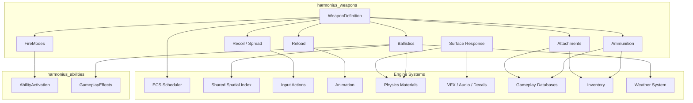
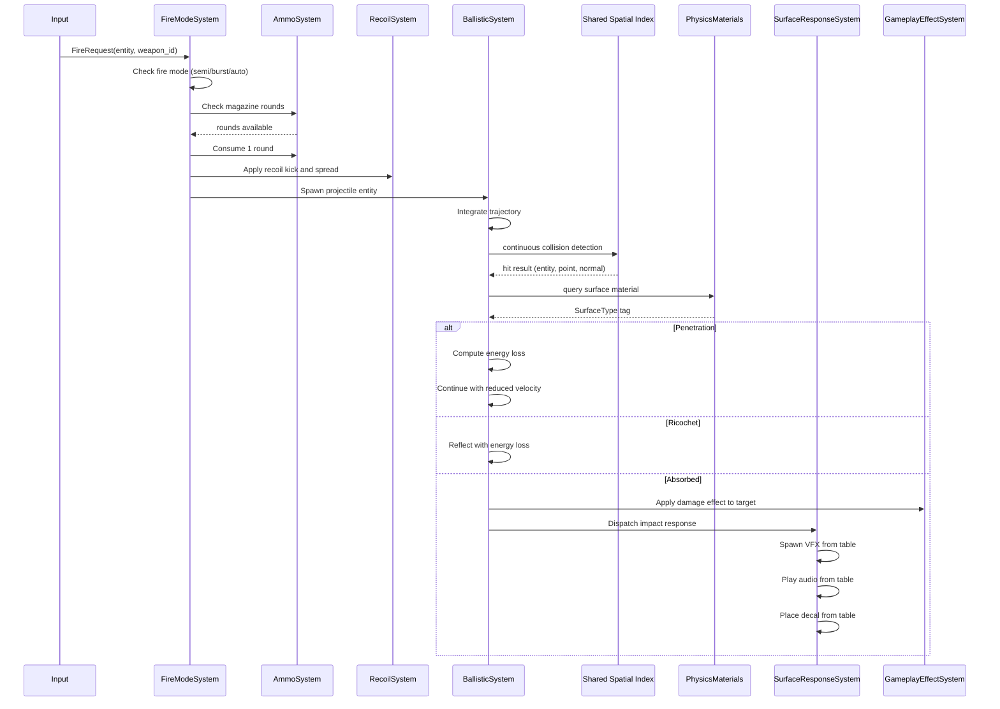
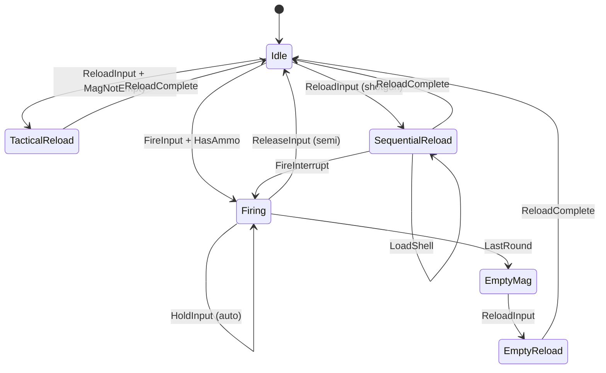
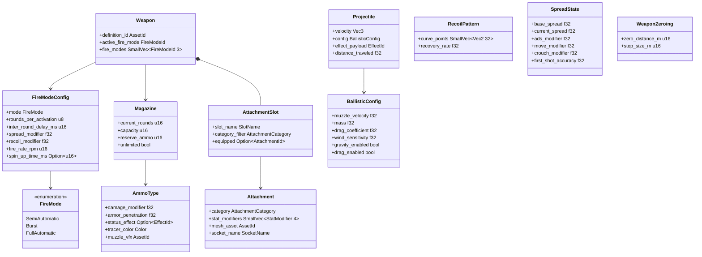

# Weapon System Design

## Requirements Trace

> **Canonical sources:** Features, requirements, and user stories are defined in
> [features/game-framework/](../../features/game-framework/),
> [requirements/game-framework/](../../requirements/game-framework/), and
> [user-stories/game-framework/](../../user-stories/game-framework/). The table below traces design
> elements to those definitions.

| Feature    | Requirement | User Stories                   |
|------------|-------------|--------------------------------|
| F-13.16.1  | R-13.16.1   | US-13.16.1.1 -- US-13.16.1.5   |
| F-13.16.2a | R-13.16.2a  | US-13.16.2a.1 -- US-13.16.2a.5 |
| F-13.16.2b | R-13.16.2b  | US-13.16.2b.1 -- US-13.16.2b.5 |
| F-13.16.2c | R-13.16.2c  | US-13.16.2c.1 -- US-13.16.2c.6 |
| F-13.16.3  | R-13.16.3   | US-13.16.3.1 -- US-13.16.3.6   |
| F-13.16.4a | R-13.16.4a  | US-13.16.4a.1 -- US-13.16.4a.5 |
| F-13.16.4b | R-13.16.4b  | US-13.16.4b.1 -- US-13.16.4b.5 |
| F-13.16.4c | R-13.16.4c  | US-13.16.4c.1 -- US-13.16.4c.5 |
| F-13.16.4d | R-13.16.4d  | US-13.16.4d.1 -- US-13.16.4d.5 |
| F-13.16.5a | R-13.16.5a  | US-13.16.5a.1 -- US-13.16.5a.5 |
| F-13.16.5b | R-13.16.5b  | US-13.16.5b.1 -- US-13.16.5b.4 |
| F-13.16.5c | R-13.16.5c  | US-13.16.5c.1 -- US-13.16.5c.5 |
| F-13.16.6a | R-13.16.6a  | US-13.16.6a.1 -- US-13.16.6a.4 |
| F-13.16.6b | R-13.16.6b  | US-13.16.6b.1 -- US-13.16.6b.3 |
| F-13.16.6c | R-13.16.6c  | US-13.16.6c.1 -- US-13.16.6c.3 |
| F-13.16.6d | R-13.16.6d  | US-13.16.6d.1 -- US-13.16.6d.3 |
| --         | NFR-13.16.1 | --                             |
| --         | NFR-13.16.2 | --                             |

1. **F-13.16.1** — Configurable fire modes (semi, burst, auto)
2. **F-13.16.2a** — Magazine and ammo management
3. **F-13.16.2b** — Reload mechanics (tactical, empty, sequential)
4. **F-13.16.2c** — Swappable ammo types
5. **F-13.16.3** — Recoil patterns and weapon spread
6. **F-13.16.4a** — Projectile drop and travel time
7. **F-13.16.4b** — Wind deflection
8. **F-13.16.4c** — Surface penetration and ricochet
9. **F-13.16.4d** — Weapon zeroing
10. **F-13.16.5a** — Attachment slot model
11. **F-13.16.5b** — Attachment visual integration
12. **F-13.16.5c** — Attachment customization UI
13. **F-13.16.6a** — Surface type tag system
14. **F-13.16.6b** — Impact VFX response
15. **F-13.16.6c** — Impact audio response
16. **F-13.16.6d** — Impact decal response
17. **--** — 256 projectiles under 1 ms per physics tick
18. **--** — Weapon feedback under 16 ms from input

## Overview

The weapon system models firearms, melee weapons, thrown weapons, and their supporting subsystems
(ammunition, ballistics, recoil, attachments, surface response). It builds on top of the ability and
combat system -- fire modes are ability activation modes, projectiles are ECS entities managed by
the projectile system, and damage flows through the gameplay effect pipeline.

All weapon state lives as ECS components. All weapon logic runs as ECS systems. Designers author
weapon configurations, recoil patterns, ammo types, attachment stats, and impact response tables
entirely in the visual editor. No code.

The weapon system has four major subsystems:

1. **Fire Modes and Ammunition** -- fire rate, magazine, reload, ammo types.
2. **Recoil and Spread** -- per-weapon recoil curves, context-sensitive spread.
3. **Ballistics** -- projectile physics, penetration, ricochet, wind, zeroing.
4. **Weapon Customization** -- attachment slots, stat modifiers, visual integration.
5. **Surface Response** -- impact VFX, audio, decals dispatched by surface material type.

## Architecture

### Module Boundaries



### Directory Layout

```text
harmonius_weapons/
├── weapon.rs           # Weapon component,
│                       # WeaponDefinition asset
├── fire_mode.rs        # FireMode, FireModeConfig,
│                       # FireModeSystem
├── magazine.rs         # Magazine component,
│                       # ammo consumption
├── reload.rs           # ReloadState, ReloadSystem,
│                       # tactical/empty/sequential
├── ammo_type.rs        # AmmoType component,
│                       # ammo switching
├── recoil.rs           # RecoilPattern, RecoilState,
│                       # RecoilSystem
├── spread.rs           # SpreadState, SpreadSystem,
│                       # context modifiers
├── ballistics/
│   ├── trajectory.rs   # Trajectory integration,
│   │                   # gravity, drag
│   ├── wind.rs         # Wind deflection system
│   ├── penetration.rs  # Material penetration,
│   │                   # energy loss
│   ├── ricochet.rs     # Angle-based ricochet,
│   │                   # probability
│   └── zeroing.rs      # Weapon zeroing, aim offset
├── attachments/
│   ├── slot.rs         # AttachmentSlot, category
│   │                   # filter
│   ├── attachment.rs   # Attachment component,
│   │                   # stat modifiers
│   └── visual.rs       # Mesh snapping, socket
│                       # transforms
└── surface_response/
    ├── surface_tag.rs  # SurfaceTypeTag, terrain
    │                   # splatmap resolve
    ├── vfx.rs          # Impact VFX table lookup
    ├── audio.rs        # Impact audio table lookup
    └── decal.rs        # Impact decal placement
```

### Fire and Ballistics Flow



### Reload State Machine



### Core Data Structures



## API Design

### Weapon Definition

```rust
/// ECS component: identifies a weapon entity and
/// its configuration.
pub struct Weapon {
    pub definition_id: AssetId,
    pub active_fire_mode: FireModeId,
    pub fire_modes: SmallVec<[FireModeId; 3]>,
}

/// Identifies a weapon definition (data asset).
#[derive(
    Clone, Copy, Debug, PartialEq, Eq, Hash,
)]
pub struct WeaponId(pub u32);

/// Weapon archetype for broad categorization.
#[derive(Clone, Copy, Debug, PartialEq, Eq)]
pub enum WeaponCategory {
    /// Close-range: swords, axes, hammers.
    Melee,
    /// Firearms: pistols, rifles, shotguns.
    Ranged,
    /// Thrown: grenades, throwing knives.
    Thrown,
}
```

### Fire Modes

Fire modes determine how trigger input maps to rounds fired. The fire mode system integrates with
the ability activation system -- each fire mode is an activation mode variant.

```rust
/// Fire mode type.
#[derive(Clone, Copy, Debug, PartialEq, Eq)]
pub enum FireMode {
    /// One round per trigger press.
    SemiAutomatic,
    /// N rounds per trigger press with inter-round
    /// delay.
    Burst,
    /// Continuous fire while trigger is held.
    FullAutomatic,
}

/// Per-mode configuration. Each weapon may support
/// multiple modes, toggled by input action.
pub struct FireModeConfig {
    pub mode: FireMode,
    /// Rounds fired per trigger activation
    /// (1 for semi, N for burst).
    pub rounds_per_activation: u8,
    /// Delay between rounds in burst mode (ms).
    pub inter_round_delay_ms: u16,
    /// Multiplier applied to base spread in this
    /// mode.
    pub spread_modifier: f32,
    /// Multiplier applied to base recoil in this
    /// mode.
    pub recoil_modifier: f32,
    /// Rounds per minute. Determines minimum time
    /// between shots.
    pub fire_rate_rpm: u16,
    /// Spin-up time for gatling-style weapons.
    /// None for instant-fire weapons.
    pub spin_up_time_ms: Option<u16>,
}

/// ECS component: current fire mode state on a
/// weapon entity.
pub struct FireModeState {
    pub config: FireModeConfig,
    /// Ticks until next round can fire.
    pub cooldown_remaining: u32,
    /// Rounds remaining in current burst.
    pub burst_remaining: u8,
    /// Current spin-up progress (0.0 -- 1.0).
    pub spin_up_progress: f32,
}

/// System: processes fire input, validates fire
/// rate and magazine state, consumes ammo, and
/// spawns projectiles.
pub struct FireModeSystem;
```

### Magazine and Ammunition

```rust
/// ECS component: magazine state on a weapon.
pub struct Magazine {
    pub current_rounds: u16,
    pub capacity: u16,
    pub reserve_ammo: u16,
    /// If true, reserve never depletes.
    pub unlimited: bool,
    /// Whether reserve is shared across all
    /// weapons of this ammo type.
    pub shared_reserve: bool,
}

/// Ammo type with distinct gameplay properties.
/// Stored as gameplay database entries.
pub struct AmmoType {
    pub damage_modifier: f32,
    pub armor_penetration: f32,
    pub status_effect: Option<EffectId>,
    pub tracer_color: Color,
    pub muzzle_vfx: AssetId,
    pub ballistic_config: BallisticConfig,
    pub wind_sensitivity: f32,
}

/// ECS component: currently loaded ammo type.
pub struct LoadedAmmo {
    pub ammo_type_id: AmmoTypeId,
}

/// System: manages magazine state -- decrement on
/// fire, replenish on reload from inventory or
/// unlimited pool.
pub struct AmmoSystem;
```

### Reload Mechanics

```rust
/// Reload state on a weapon entity.
#[derive(Clone, Copy, Debug, PartialEq, Eq)]
pub enum ReloadState {
    /// Not reloading.
    Idle,
    /// Magazine has rounds remaining. Faster
    /// animation.
    TacticalReload {
        remaining_ticks: u32,
    },
    /// Magazine is empty. Slower animation
    /// (includes chamber).
    EmptyReload {
        remaining_ticks: u32,
    },
    /// Shell-by-shell loading (shotguns).
    /// Interruptible by fire input.
    SequentialReload {
        shells_loaded: u16,
        per_shell_ticks: u32,
        current_shell_remaining: u32,
    },
}

/// Per-weapon reload timing configuration.
pub struct ReloadConfig {
    pub tactical_duration_ticks: u32,
    pub empty_duration_ticks: u32,
    pub sequential_per_shell_ticks: u32,
    pub tactical_anim: AssetId,
    pub empty_anim: AssetId,
    pub sequential_anim: AssetId,
    pub reload_sound: AssetId,
}

/// System: drives reload state machine. Transitions
/// between Idle, TacticalReload, EmptyReload, and
/// SequentialReload. Cancels sprint on reload start.
/// Fires animation and audio on state entry.
pub struct ReloadSystem;
```

### Recoil and Spread

```rust
/// Per-weapon recoil pattern. A sequence of 2D
/// offsets applied to aim direction during
/// sustained fire. Authored as a curve in the
/// visual editor.
///
/// Recoil pattern curves use the shared
/// `Curve<Vec2>` type.
pub struct RecoilPattern {
    /// Sequence of (yaw, pitch) offsets. One entry
    /// per round fired. After all entries, pattern
    /// loops from a configurable index.
    pub curve_points: SmallVec<[Vec2; 32]>,
    /// Speed at which aim recovers toward center
    /// when not firing (degrees per second).
    pub recovery_rate: f32,
    /// Index to loop from after all points are
    /// exhausted.
    pub loop_start_index: u8,
}

/// ECS component: current recoil state.
pub struct RecoilState {
    /// Current index into the recoil pattern.
    pub pattern_index: u8,
    /// Accumulated recoil offset not yet recovered.
    pub accumulated_offset: Vec2,
    /// Whether currently firing (suppresses
    /// recovery).
    pub firing: bool,
}

/// ECS component: current spread state.
pub struct SpreadState {
    /// Base spread angle (degrees) at rest.
    pub base_spread: f32,
    /// Current effective spread (degrees).
    pub current_spread: f32,
    /// Multiplier when aiming down sights.
    pub ads_modifier: f32,
    /// Multiplier when moving.
    pub move_modifier: f32,
    /// Multiplier when crouching.
    pub crouch_modifier: f32,
    /// Multiplier when jumping/airborne.
    pub jump_modifier: f32,
    /// First-shot accuracy. 0.0 = perfect,
    /// 1.0 = full base spread.
    pub first_shot_accuracy: f32,
    /// Spread increase per round fired.
    pub per_shot_increase: f32,
    /// Spread recovery rate (degrees per second).
    pub recovery_rate: f32,
}

/// System: updates RecoilState per fire event,
/// applies recovery between shots, and feeds
/// accumulated offset to the camera system.
pub struct RecoilSystem;

/// System: updates SpreadState based on movement,
/// posture, ADS, and fire rate. Feeds current
/// spread to crosshair UI and projectile spawn
/// direction.
pub struct SpreadSystem;
```

### Ballistics

#### Trajectory Integration

```rust
/// Per-ammo ballistic configuration.
pub struct BallisticConfig {
    /// Initial speed (m/s) at muzzle.
    pub muzzle_velocity: f32,
    /// Projectile mass (kg) for momentum
    /// calculations.
    pub mass: f32,
    /// Aerodynamic drag coefficient.
    pub drag_coefficient: f32,
    /// Sensitivity to wind deflection (0.0 -- 1.0).
    pub wind_sensitivity: f32,
    /// Whether gravity affects this projectile.
    /// Disableable for arcade modes.
    pub gravity_enabled: bool,
    /// Whether drag affects this projectile.
    /// Disableable for arcade modes.
    pub drag_enabled: bool,
}

/// ECS component on projectile entities.
pub struct Projectile {
    pub velocity: Vec3,
    pub config: BallisticConfig,
    pub effect_payload: EffectId,
    pub source_entity: Entity,
    pub distance_traveled: f32,
    pub max_distance: f32,
}

/// System: integrates projectile trajectories each
/// physics tick. Applies gravity (downward
/// acceleration), drag (velocity-dependent
/// deceleration), and wind (lateral force from
/// weather system). Uses the shared spatial index
/// for CCD.
pub struct BallisticSystem;
```

Per-tick trajectory integration (semi-implicit Euler):

```rust
// Pseudocode for one physics tick
fn integrate_projectile(
    proj: &mut Projectile,
    wind: Vec3,
    dt: f32,
) {
    let mut accel = Vec3::ZERO;

    if proj.config.gravity_enabled {
        accel.y -= GRAVITY; // 9.81 m/s^2
    }

    if proj.config.drag_enabled {
        let speed = proj.velocity.length();
        let drag_force = 0.5
            * proj.config.drag_coefficient
            * speed
            * speed;
        let drag_accel = drag_force / proj.config.mass;
        accel -= proj.velocity.normalize() * drag_accel;
    }

    // Wind force proportional to cross-section
    // and wind speed.
    let wind_force = wind
        * proj.config.wind_sensitivity;
    accel += wind_force / proj.config.mass;

    // Semi-implicit Euler: update velocity first,
    // then position.
    proj.velocity += accel * dt;
    let displacement = proj.velocity * dt;
    proj.distance_traveled += displacement.length();
}
```

#### Penetration and Ricochet

```rust
/// Per-weapon/ammo penetration configuration.
pub struct PenetrationConfig {
    /// Maximum depth (cm) projectile can
    /// penetrate.
    pub max_depth: f32,
    /// Energy lost per cm of penetration
    /// (0.0 -- 1.0 fraction of initial).
    pub energy_loss_per_cm: f32,
}

/// Per-material ricochet parameters. Stored on
/// physics material assets.
pub struct RicochetConfig {
    /// Maximum impact angle (from surface) that
    /// allows ricochet. Steeper angles absorb.
    pub angle_threshold_deg: f32,
    /// Material hardness (0.0 -- 1.0). Higher
    /// values increase ricochet probability.
    pub hardness: f32,
    /// Energy retained after ricochet (fraction).
    pub energy_retention: f32,
    /// Random angle deviation after ricochet
    /// (degrees).
    pub angle_randomization_deg: f32,
}

/// Outcome of a projectile-surface interaction.
#[derive(Clone, Copy, Debug, PartialEq)]
pub enum SurfaceInteraction {
    /// Projectile passes through with energy loss.
    Penetrated {
        exit_velocity: Vec3,
        remaining_energy: f32,
    },
    /// Projectile bounces off the surface.
    Ricocheted {
        new_velocity: Vec3,
        remaining_energy: f32,
    },
    /// Projectile stops in the surface.
    Absorbed,
}

/// System: evaluates penetration and ricochet on
/// projectile impact. Queries physics material for
/// density and hardness. Computes energy loss and
/// determines outcome.
pub struct PenetrationSystem;
```

#### Weapon Zeroing

```rust
/// ECS component: weapon zeroing state. Only
/// present on weapons with optic attachments.
pub struct WeaponZeroing {
    /// Current zero distance (meters).
    pub zero_distance_m: u16,
    /// Discrete step size for adjustment.
    pub step_size_m: u16,
    /// Minimum zero distance.
    pub min_distance_m: u16,
    /// Maximum zero distance.
    pub max_distance_m: u16,
}

/// System: adjusts aim offset to compensate for
/// bullet drop at the zeroed distance. Recomputes
/// offset when ammo type changes (different
/// ballistic profile shifts effective zero).
pub struct ZeroingSystem;
```

### Attachment System

```rust
/// Named attachment slot on a weapon.
#[derive(Clone, Copy, Debug, PartialEq, Eq, Hash)]
pub enum SlotName {
    Optic,
    Barrel,
    Muzzle,
    Grip,
    Stock,
    Magazine,
    RailAccessory,
}

/// Category filter for which attachments fit
/// a slot.
#[derive(Clone, Copy, Debug, PartialEq, Eq, Hash)]
pub enum AttachmentCategory {
    Scope,
    RedDot,
    Holographic,
    Suppressor,
    Compensator,
    FlashHider,
    VerticalGrip,
    AngledGrip,
    StockStandard,
    StockFolding,
    ExtendedMag,
    DrumMag,
    Laser,
    Flashlight,
}

/// ECS component: a single attachment slot on
/// a weapon entity.
pub struct AttachmentSlot {
    pub slot_name: SlotName,
    pub category_filter: SmallVec<
        [AttachmentCategory; 4]
    >,
    pub equipped: Option<AttachmentId>,
}

/// An attachment that can be equipped.
pub struct Attachment {
    pub category: AttachmentCategory,
    pub stat_modifiers: SmallVec<[StatModifier; 4]>,
    pub mesh_asset: AssetId,
    pub socket_name: SocketName,
}

/// A stat modifier applied by an attachment.
pub struct StatModifier {
    pub stat: WeaponStat,
    pub op: ModOp,
    pub value: f32,
}

/// Weapon stats that attachments can modify.
#[derive(Clone, Copy, Debug, PartialEq, Eq)]
pub enum WeaponStat {
    Damage,
    Range,
    RecoilVertical,
    RecoilHorizontal,
    Spread,
    AdsSpeed,
    ReloadSpeed,
    MagazineCapacity,
    MoveSpeed,
    AdsZoom,
    SoundRadius,
}

/// How the modifier is applied.
///
/// **Note:** `ModOp` is defined in the shared
/// primitives (see
/// [shared-primitives.md](../core-runtime/shared-primitives.md)).
/// This file references the canonical definition;
/// the local enum shown here is for design clarity
/// and will import from the shared module in
/// implementation.
#[derive(Clone, Copy, Debug, PartialEq, Eq)]
pub enum ModOp {
    /// Add flat value to base stat.
    Flat,
    /// Multiply the base stat.
    Percent,
}

/// System: recalculates weapon stats when
/// attachments are equipped or removed. Applies
/// all StatModifiers from equipped attachments.
pub struct AttachmentStatSystem;

/// System: updates weapon mesh to show/hide
/// attachment meshes at socket transforms when
/// equipped/unequipped. Propagates changes to
/// the render scene.
pub struct AttachmentVisualSystem;
```

### Surface Response

```rust
/// Surface material classification.
#[derive(
    Clone, Copy, Debug, PartialEq, Eq, Hash,
)]
pub enum SurfaceTypeTag {
    Metal,
    Wood,
    Concrete,
    Dirt,
    Glass,
    Water,
    Flesh,
    Custom(u16),
}

/// Data asset: maps surface types to VFX, audio,
/// and decal responses.
pub struct ImpactResponseTable {
    pub vfx: HashMap<SurfaceTypeTag, VfxResponse>,
    pub audio: HashMap<SurfaceTypeTag, AudioResponse>,
    pub decal: HashMap<SurfaceTypeTag, DecalResponse>,
}

/// VFX response for one surface type.
pub struct VfxResponse {
    pub particle_asset: AssetId,
    pub spawn_count: u8,
    pub scale: f32,
    pub lifetime_ms: u16,
}

/// Audio response for one surface type.
pub struct AudioResponse {
    /// Pool of sound assets for random variation.
    pub sound_pool: SmallVec<[AssetId; 4]>,
    /// Volume scales with impact force.
    pub volume_scale: f32,
    /// Pitch scales with impact force.
    pub pitch_scale: f32,
}

/// Decal response for one surface type.
pub struct DecalResponse {
    pub decal_asset: AssetId,
    pub lifetime_ms: u32,
    pub max_count: u16,
}

/// System: resolves surface type from physics
/// material or terrain splatmap. For terrain,
/// samples the dominant splatmap layer weight
/// at the impact point.
pub struct SurfaceTypeSystem;

/// System: dispatches VFX, audio, and decal
/// responses on projectile or melee impact.
/// Looks up the ImpactResponseTable and spawns
/// the appropriate effects at the impact point
/// oriented along the surface normal.
pub struct ImpactResponseSystem;
```

## Data Flow

### Per-Frame System Execution Order

These systems run after the ability activation system from the abilities design:

1. **FireModeSystem** -- processes fire input, checks fire rate and magazine, consumes ammo, emits
   projectile spawn requests.
2. **ReloadSystem** -- drives reload state machine, transitions on input and timer completion.
3. **AmmoSystem** -- replenishes magazine from reserves on reload complete, handles ammo type
   switching.
4. **RecoilSystem** -- applies recoil pattern offsets on fire, recovers between shots.
5. **SpreadSystem** -- updates spread based on movement, posture, ADS, fire rate.
6. **BallisticSystem** -- integrates projectile trajectories, runs CCD via shared spatial index.
7. **PenetrationSystem** -- evaluates penetration and ricochet on impact.
8. **ZeroingSystem** -- adjusts aim offset for bullet drop at zeroed distance.
9. **AttachmentStatSystem** -- recalculates weapon stats from equipped attachments.
10. **AttachmentVisualSystem** -- updates attachment meshes on equip/unequip.
11. **SurfaceTypeSystem** -- resolves surface material at impact points.
12. **ImpactResponseSystem** -- spawns VFX, audio, and decals based on surface type.

### Ballistic Pipeline

For each in-flight projectile per physics tick:

1. Read `BallisticConfig` from the projectile.
2. Read wind vector from the weather system.
3. Integrate velocity: gravity + drag + wind.
4. Compute displacement for this tick.
5. CCD sweep from old position to new position via shared spatial index.
6. If no hit: update position, continue.
7. If hit:
   - Query surface material from physics material.
   - Evaluate penetration/ricochet:
     - **Penetrate**: reduce energy, continue with exit velocity.
     - **Ricochet**: reflect, reduce energy, continue.
     - **Absorb**: apply damage effect, dispatch surface response, destroy projectile entity.

### Attachment Stat Aggregation

When an attachment is equipped or removed:

1. Collect all `StatModifier` entries from all equipped `AttachmentSlot` components.
2. Group modifiers by `WeaponStat`.
3. Apply flat modifiers first (sum).
4. Apply percent modifiers second (product).
5. Write final stat values to the weapon's derived stat cache.
6. Notify dependent systems (spread uses spread modifier, recoil uses recoil modifier, etc.).

### Recoil Pattern Playback

Per round fired:

1. Read the next `Vec2` from `RecoilPattern` at `pattern_index`.
2. Multiply by the fire mode's `recoil_modifier`.
3. Multiply by attachment recoil modifiers.
4. Add to `accumulated_offset`.
5. Feed `accumulated_offset` to the camera system as an additive aim rotation.
6. Advance `pattern_index`. If past the end, loop from `loop_start_index`.

Between rounds (recovery):

1. Lerp `accumulated_offset` toward zero at `recovery_rate` per second.
2. Stop recovery while `firing` is true.

## Platform Considerations

| Component               | Platform Impact  |
|-------------------------|------------------|
| Ballistic CCD           | All platforms    |
| Recoil patterns         | All platforms    |
| Surface type resolve    | All platforms    |
| Wind vector             | All platforms    |
| Attachment visuals      | All platforms    |
| Weapon customization UI | Editor + runtime |
| Impact VFX/audio/decal  | All platforms    |

1. **Ballistic CCD** — Uses shared spatial index BVH. 256 projectiles must complete under 1 ms
   (NFR-13.16.1). SIMD-accelerated sweep.
2. **Recoil patterns** — 32-entry SmallVec fits in 256 bytes -- single cache line reads per round
   fired.
3. **Surface type resolve** — Physics materials carry tag directly. Terrain splatmap resolve
   requires bilinear sample of weight textures -- CPU-side for hit detection.
4. **Wind vector** — Read from weather system singleton resource. Single Vec3 read per projectile
   per tick.
5. **Attachment visuals** — Mesh swap propagated to render scene via ECS-to-Renderer bridge.
   One-time cost on equip/unequip, not per-frame.
6. **Weapon customization UI** — 3D weapon preview renders to an offscreen render target composited
   into the UI layer.
7. **Impact VFX/audio/decal** — Budget-managed: decals capped by `max_count`, oldest evicted. VFX
   spawn count configurable per surface type.

## Test Plan

### Unit Tests

| Test                                | Req        |
|-------------------------------------|------------|
| `test_semi_auto_one_round`          | R-13.16.1  |
| `test_burst_n_rounds`               | R-13.16.1  |
| `test_full_auto_continuous`         | R-13.16.1  |
| `test_fire_mode_toggle`             | R-13.16.1  |
| `test_spin_up_gatling`              | R-13.16.1  |
| `test_magazine_decrement`           | R-13.16.2a |
| `test_empty_magazine_blocks_fire`   | R-13.16.2a |
| `test_unlimited_ammo`               | R-13.16.2a |
| `test_tactical_reload_faster`       | R-13.16.2b |
| `test_empty_reload_slower`          | R-13.16.2b |
| `test_sequential_reload_interrupt`  | R-13.16.2b |
| `test_reload_cancels_sprint`        | R-13.16.2b |
| `test_ammo_type_switch`             | R-13.16.2c |
| `test_incendiary_status_effect`     | R-13.16.2c |
| `test_tracer_color_change`          | R-13.16.2c |
| `test_recoil_pattern_deterministic` | R-13.16.3  |
| `test_recoil_recovery`              | R-13.16.3  |
| `test_spread_ads_tighter`           | R-13.16.3  |
| `test_spread_movement_wider`        | R-13.16.3  |
| `test_first_shot_accuracy`          | R-13.16.3  |
| `test_crosshair_reflects_spread`    | R-13.16.3  |
| `test_bullet_drop_parabolic`        | R-13.16.4a |
| `test_drag_decelerates`             | R-13.16.4a |
| `test_gravity_disable_straight`     | R-13.16.4a |
| `test_travel_time_matches_velocity` | R-13.16.4a |
| `test_wind_lateral_deflection`      | R-13.16.4b |
| `test_wind_disable_no_deflection`   | R-13.16.4b |
| `test_penetration_drywall`          | R-13.16.4c |
| `test_penetration_concrete_stops`   | R-13.16.4c |
| `test_ricochet_shallow_angle`       | R-13.16.4c |
| `test_ricochet_steep_absorbs`       | R-13.16.4c |
| `test_zeroing_300m_on_target`       | R-13.16.4d |
| `test_zeroing_wrong_distance`       | R-13.16.4d |
| `test_zeroing_ammo_shift`           | R-13.16.4d |
| `test_attachment_equip_stat`        | R-13.16.5a |
| `test_attachment_category_filter`   | R-13.16.5a |
| `test_attachment_visual_snap`       | R-13.16.5b |
| `test_attachment_unequip_visual`    | R-13.16.5b |
| `test_optic_reticle_render`         | R-13.16.5b |
| `test_surface_tag_metal`            | R-13.16.6a |
| `test_surface_tag_terrain`          | R-13.16.6a |
| `test_impact_vfx_metal_sparks`      | R-13.16.6b |
| `test_impact_audio_wood_thud`       | R-13.16.6c |
| `test_impact_audio_variation`       | R-13.16.6c |
| `test_impact_decal_placement`       | R-13.16.6d |
| `test_decal_max_count_eviction`     | R-13.16.6d |

1. **`test_semi_auto_one_round`** — Fire semi-auto weapon. Verify exactly 1 round per press.
2. **`test_burst_n_rounds`** — Fire burst-mode weapon (N=3). Verify exactly 3 rounds with
   inter-round delay.
3. **`test_full_auto_continuous`** — Hold fire on full-auto. Verify continuous fire at configured
   RPM.
4. **`test_fire_mode_toggle`** — Toggle between semi, burst, auto. Verify spread and recoil
   modifiers change per mode.
5. **`test_spin_up_gatling`** — Fire gatling weapon. Verify spin-up delay before first round, then
   full RPM.
6. **`test_magazine_decrement`** — Fire one round. Verify magazine count decrements by 1.
7. **`test_empty_magazine_blocks_fire`** — Empty magazine. Verify fire input suppressed.
8. **`test_unlimited_ammo`** — Enable unlimited mode. Verify reserve never depletes.
9. **`test_tactical_reload_faster`** — Reload with rounds remaining. Verify faster duration than
   empty reload.
10. **`test_empty_reload_slower`** — Reload with empty magazine. Verify slower duration.
11. **`test_sequential_reload_interrupt`** — Load 3 shells, interrupt with fire. Verify 3 rounds in
    magazine and weapon fires.
12. **`test_reload_cancels_sprint`** — Sprint, then reload. Verify sprint cancelled.
13. **`test_ammo_type_switch`** — Switch from standard to AP ammo. Verify damage modifier and
    penetration change.
14. **`test_incendiary_status_effect`** — Fire incendiary round. Verify burn DoT applied on hit.
15. **`test_tracer_color_change`** — Switch ammo type. Verify tracer color updates.
16. **`test_recoil_pattern_deterministic`** — Fire 10 rounds. Verify aim offset matches pattern
    curve exactly.
17. **`test_recoil_recovery`** — Fire, stop, wait. Verify offset recovers toward zero.
18. **`test_spread_ads_tighter`** — Compare spread ADS vs hip-fire. Verify ADS is tighter by
    ads_modifier.
19. **`test_spread_movement_wider`** — Compare spread stationary vs moving. Verify moving is wider.
20. **`test_first_shot_accuracy`** — Fire first shot with sniper (accuracy 0.0). Verify zero spread.
21. **`test_crosshair_reflects_spread`** — Fire sustained. Verify crosshair radius matches
    current_spread.
22. **`test_bullet_drop_parabolic`** — Fire at 500 m. Verify drop matches expected parabola within
    5%.
23. **`test_drag_decelerates`** — Fire and measure velocity at 100 m vs 500 m. Verify deceleration
    from drag.
24. **`test_gravity_disable_straight`** — Disable gravity. Verify projectile travels in a straight
    line.
25. **`test_travel_time_matches_velocity`** — Measure arrival time vs expected from muzzle velocity
    and drag.
26. **`test_wind_lateral_deflection`** — Fire perpendicular to wind. Verify lateral offset at
    distance matches expected.
27. **`test_wind_disable_no_deflection`** — Disable wind. Verify no lateral deflection.
28. **`test_penetration_drywall`** — Fire through drywall. Verify pass-through with reduced
    velocity.
29. **`test_penetration_concrete_stops`** — Fire at concrete. Verify projectile stops.
30. **`test_ricochet_shallow_angle`** — Fire at metal at shallow angle. Verify ricochet.
31. **`test_ricochet_steep_absorbs`** — Fire at metal at steep angle. Verify absorption (no
    ricochet).
32. **`test_zeroing_300m_on_target`** — Zero to 300 m, fire at 300 m target. Verify point-of-aim
    matches point-of-impact.
33. **`test_zeroing_wrong_distance`** — Zero to 300 m, fire at 100 m. Verify round impacts high.
34. **`test_zeroing_ammo_shift`** — Switch ammo type with different ballistics. Verify effective
    zero shifts.
35. **`test_attachment_equip_stat`** — Equip suppressor. Verify sound and range decrease by
    configured amounts.
36. **`test_attachment_category_filter`** — Attempt to equip optic in grip slot. Verify rejection.
37. **`test_attachment_visual_snap`** — Equip attachment. Verify mesh appears at socket transform.
38. **`test_attachment_unequip_visual`** — Remove attachment. Verify mesh disappears.
39. **`test_optic_reticle_render`** — Equip optic. Verify reticle renders at configured zoom.
40. **`test_surface_tag_metal`** — Raycast metal surface. Verify returns Metal tag.
41. **`test_surface_tag_terrain`** — Raycast terrain. Verify tag matches dominant splatmap layer.
42. **`test_impact_vfx_metal_sparks`** — Shoot metal. Verify sparks VFX spawns from table.
43. **`test_impact_audio_wood_thud`** — Shoot wood. Verify thud sound plays.
44. **`test_impact_audio_variation`** — Shoot same surface 10 times. Verify random variation from
    pool.
45. **`test_impact_decal_placement`** — Shoot surface. Verify decal placed at impact point along
    normal.
46. **`test_decal_max_count_eviction`** — Exceed max decal count. Verify oldest decal removed.

### Integration Tests

| Test                           | Req                          |
|--------------------------------|------------------------------|
| `test_fire_full_pipeline`      | R-13.16.1, NFR-13.16.2       |
| `test_projectile_impact_full`  | R-13.16.4a, R-13.16.6b -- 6d |
| `test_penetration_chain`       | R-13.16.4c                   |
| `test_ricochet_kills`          | R-13.16.4c                   |
| `test_attachment_full_cycle`   | R-13.16.5a -- 5c             |
| `test_256_projectiles_perf`    | NFR-13.16.1                  |
| `test_weapon_feedback_latency` | NFR-13.16.2                  |

1. **`test_fire_full_pipeline`** — Press fire: verify ammo consumed, recoil applied, projectile
   spawned, muzzle VFX plays -- all within 1 frame.
2. **`test_projectile_impact_full`** — Projectile hits surface: verify damage effect applied, VFX
   spawns, audio plays, decal placed.
3. **`test_penetration_chain`** — Fire through drywall, hit target behind. Verify damage applied
   with reduced energy.
4. **`test_ricochet_kills`** — Ricochet off metal into target. Verify damage applied with reduced
   energy.
5. **`test_attachment_full_cycle`** — Equip attachment in UI, verify stat change, verify mesh
   appears, verify UI stat comparison.
6. **`test_256_projectiles_perf`** — Spawn 256 simultaneous projectiles with full ballistics. Verify
   under 1 ms per physics tick.
7. **`test_weapon_feedback_latency`** — Measure input-to-muzzle-flash time. Verify under 16 ms
   across 100 fires.

### Benchmarks

| Benchmark | Target | Source |
|-----------|--------|--------|
| Ballistic simulation (256 projectiles) | < 1 ms per tick | NFR-13.16.1 |
| Per-projectile penetration/ricochet | < 0.01 ms | NFR-13.16.1 |
| Input-to-muzzle-flash latency | < 16 ms | NFR-13.16.2 |
| Reload state transition | < 0.01 ms | -- |
| Recoil pattern lookup + apply | < 0.001 ms | -- |
| Spread recalculation | < 0.001 ms | -- |
| Attachment stat aggregation | < 0.05 ms | -- |
| Surface type resolve (terrain splatmap) | < 0.01 ms | -- |
| Impact response dispatch (VFX + audio + decal) | < 0.1 ms | -- |

## Design Q & A

**Q1. What is the biggest constraint limiting this design?**

The custom IoReactor constraint (no third-party async runtimes) means the ballistic system's
continuous collision detection (CCD) for 256 simultaneous projectiles (NFR-13.16.1) must be
hand-optimized on platform-native primitives rather than leveraging existing high-performance
physics libraries with built-in CCD. Lifting this would allow integration with a dedicated physics
library's sweep-test pipeline, which could batch SIMD-accelerated CCD across all projectiles.
However, removing this constraint would introduce a third-party runtime dependency into the hot path
and violate the engine's platform-native I/O policy. The trade-off is justified because the shared
spatial index BVH already provides efficient sweep tests, and 256 projectiles at sub-1-ms is
achievable with SIMD on the custom reactor.

**Q2. How can this design be improved?**

The linear energy-loss-per-cm penetration model (R-13.16.4c) is oversimplified -- real penetration
follows non-linear curves based on projectile deformation and material density. A lookup table
indexed by material pair and velocity range would improve realism without significant runtime cost.
The `SmallVec<[Vec2; 32]>` recoil pattern caps at 32 points -- weapons with very high fire rates may
exhaust this in under a second. An `AnimationCurve` sampling approach (similar to
`WallRunConfig.gravity_curve`) would generalize better. The surface response system lacks budget
prioritization -- during heavy firefights, VFX and decal spawns could overwhelm the renderer without
per-frame caps enforced at the system level.

**Q3. Is there a better approach?**

An alternative is to use hitscan raycasts for all projectiles and simulate ballistic effects (drop,
wind) as post-hoc corrections to the hit point. This is simpler and eliminates per-tick trajectory
integration entirely. We are not taking this approach because R-13.16.4a requires finite travel time
and visible projectile trajectories, which hitscan cannot provide. The hybrid approach mentioned in
open question 1 (hitscan for supersonic, simulated for subsonic) is worth pursuing as a performance
optimization, but the current full-simulation design is the correct baseline for correctness.

**Q4. Does this design solve all customer problems?**

The design comprehensively covers firearms (F-13.16.1-- 6d) but is weaker on melee weapons.
`WeaponCategory` includes `Melee` but the API has no melee-specific components -- no swing arc, hit
frames, or melee combo integration. US-13.16.1.1--1.5 and the fire mode system assume ranged
trigger-pull semantics. A melee weapon subsystem with swing trajectories, hit detection via shape
casts, and combo tree integration (F-6.2.8) would enable action RPGs and fighting games. Thrown
weapons (grenades) lack trajectory preview for arc visualization -- a common feature in tactical
shooters. Adding these would significantly broaden genre support.

**Q5. Is this design cohesive with the overall engine?**

The weapon system integrates tightly with the ability system (F-13.10.2), inventory (F-13.9.1), and
gameplay databases (F-13.7.1), following the engine's data-driven and ECS-based patterns. Fire modes
as ability activation mode variants is a strong cohesion point. The `ModOp` enum references the
shared primitives module, correctly avoiding local duplication. The surface response system reuses
the physics material system (F-4.2.9) and VFX system (F-11.6.4) rather than building parallel
infrastructure. One inconsistency: `BallisticConfig` is stored inline on each `Projectile` component
rather than referencing a shared data asset, which means 256 projectiles duplicate the same config
data -- a shared `AssetId` reference would be more memory-efficient and consistent with how weapon
definitions reference data assets.

## Open Questions

1. **Hitscan vs projectile threshold** -- At what muzzle velocity should the system switch from
   simulated projectiles to instant raycasts? Very fast rounds (e.g., 1000+ m/s) travel so far per
   tick that CCD becomes a long sweep. A hybrid approach (raycast for supersonic, simulated for
   subsonic) may be optimal.
2. **Penetration energy model** -- The current linear energy-loss-per-cm model is simple but
   unrealistic. Real penetration follows a non-linear curve based on material density and projectile
   deformation. Determine whether a lookup table per material pair is needed for acceptable results.
3. **Recoil pattern randomization** -- Should recoil patterns be fully deterministic (learnable,
   competitive) or include a random component (more realistic, less exploitable)? This is a
   game-design-level decision that affects API shape -- deterministic needs only pattern index,
   random needs a per-shot RNG seed.
4. **Attachment compatibility matrix** -- The current design uses category filters per slot. Some
   games have per-weapon attachment whitelists (only certain scopes fit certain rifles). Determine
   whether per-weapon compatibility data is needed beyond category filtering.
5. **Surface response budget** -- Impact VFX, audio, and decals can accumulate rapidly during heavy
   firefights. Define per-frame budgets for each (max VFX spawns per frame, max audio voices, max
   decal placements) and prioritization strategy (nearest to camera first).
6. **Projectile pooling** -- With up to 256 simultaneous projectiles, entity creation/destruction
   overhead may matter. Consider an ECS entity pool for projectiles to avoid archetype table
   insertions on every shot.
7. **Scope rendering** -- Optic scope rendering can use either a render-to-texture approach
   (realistic but expensive -- second camera) or a shader overlay (cheaper, less realistic).
   Determine which approach aligns with performance targets.
