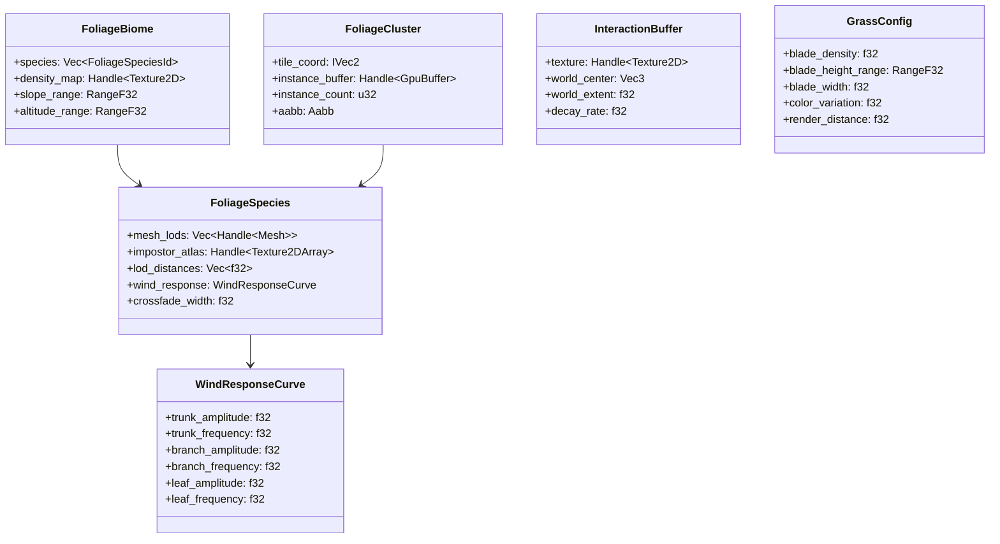
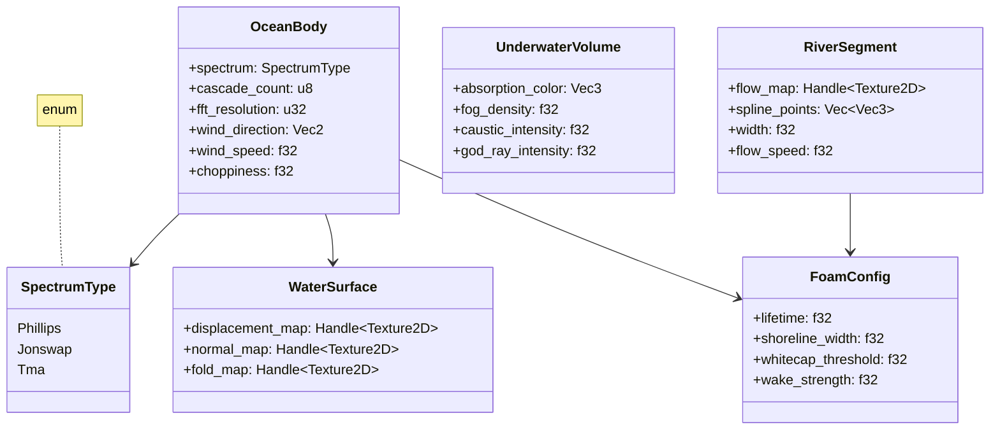
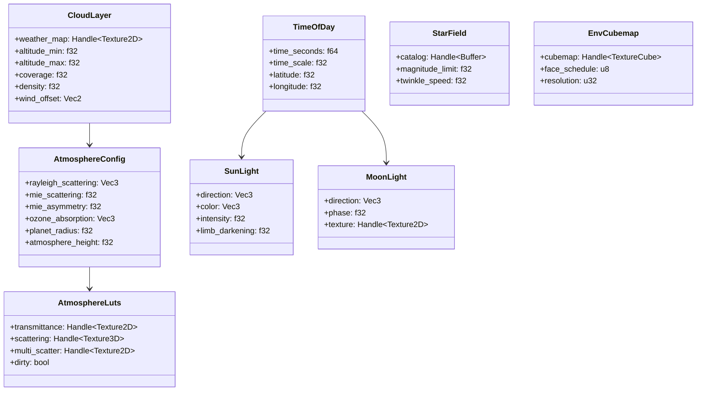
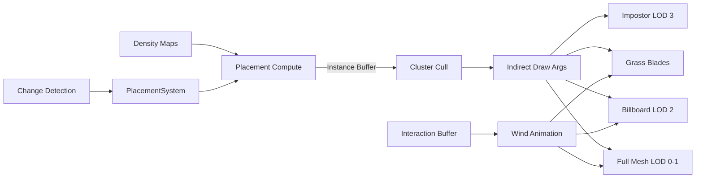
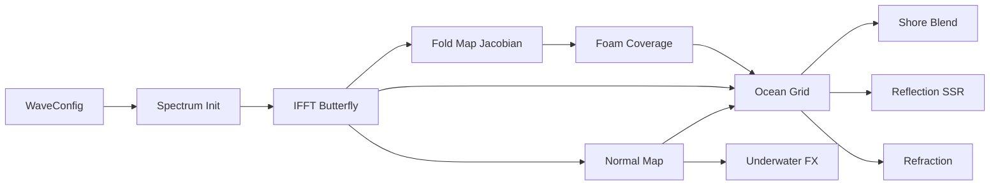
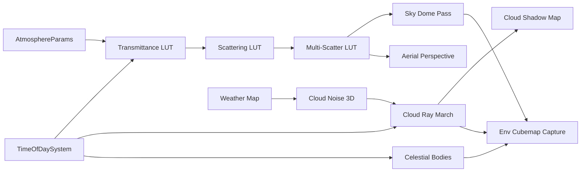
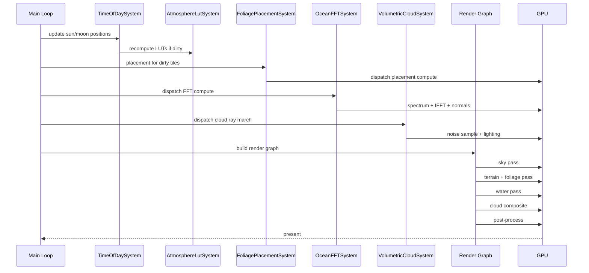

# Environment Systems Design
# Foliage, Water, Sky/Atmosphere

## Requirements Trace

### Foliage (F-3.3.1-7 / R-3.3.1-7)

| Feature | Requirement | User Story | Description |
|---------|-------------|------------|-------------|
| F-3.3.1 | R-3.3.1 | US-3.3.1 | GPU-driven instanced foliage with compute culling |
| F-3.3.2 | R-3.3.2 | US-3.3.2 | Density map and rule-based procedural placement |
| F-3.3.3 | R-3.3.3 | US-3.3.3 | Billboard and impostor LOD with crossfade dithering |
| F-3.3.4 | R-3.3.4 | US-3.3.4 | GPU vertex shader wind animation from shared wind field |
| F-3.3.5 | R-3.3.5 | US-3.3.5 | Character-vegetation interaction via displacement buffer |
| F-3.3.6 | R-3.3.6 | US-3.3.6 | Procedural grass blade rendering via mesh shader |
| F-3.3.7 | R-3.3.7 | US-3.3.7 | Tree rendering with subsurface leaf transmission |

### Water (F-3.4.1-7 / R-3.4.1-7)

| Feature | Requirement | User Story | Description |
|---------|-------------|------------|-------------|
| F-3.4.1 | R-3.4.1 | US-3.4.1 | FFT ocean wave simulation with multiple cascades |
| F-3.4.2 | R-3.4.2 | US-3.4.2 | Shoreline and depth-based blending with foam |
| F-3.4.3 | R-3.4.3 | US-3.4.3 | Underwater rendering with volume effects |
| F-3.4.4 | R-3.4.4 | US-3.4.4 | Water caustics projection onto seabed |
| F-3.4.5 | R-3.4.5 | US-3.4.5 | Fresnel-weighted reflection and refraction |
| F-3.4.6 | R-3.4.6 | US-3.4.6 | Flow map river simulation |
| F-3.4.7 | R-3.4.7 | US-3.4.7 | Dynamic foam from waves, shore, flow, wakes |

### Sky/Atmosphere (F-3.5.1-7 / R-3.5.1-7)

| Feature | Requirement | User Story | Description |
|---------|-------------|------------|-------------|
| F-3.5.1 | R-3.5.1 | US-3.5.1 | Procedural sky model (Preetham/Hosek-Wilkie) |
| F-3.5.2 | R-3.5.2 | US-3.5.2 | Multi-scattering atmosphere with aerial perspective |
| F-3.5.3 | R-3.5.3 | US-3.5.3 | Ray-marched volumetric clouds |
| F-3.5.4 | R-3.5.4 | US-3.5.4 | Cloud shadow map on terrain/foliage/water |
| F-3.5.5 | R-3.5.5 | US-3.5.5 | Dynamic time-of-day with astronomical arcs |
| F-3.5.6 | R-3.5.6 | US-3.5.6 | Celestial body rendering (sun, moon, stars) |
| F-3.5.7 | R-3.5.7 | US-3.5.7 | Environment cubemap capture for IBL |

### Cross-Cutting Dependencies

| Dependency | Source | Consumed API |
|------------|--------|--------------|
| Shared spatial index | F-1.9.1, F-1.9.7 | Frustum culling, BVH registration |
| Wind field texture | F-4.7.5 | Shared 3D wind texture from WindSource entities |
| Physics buoyancy | F-4.8.5 | WaterSurface wave height for buoyancy |
| Render graph | F-2.x | Pass registration and resource scheduling |
| Scene transforms | F-1.2.4 | GlobalTransform for entity placement |
| ECS scheduler | F-1.1.25 | System ordering and parallel dispatch |
| Thread pool | F-14.3.1 | Scoped parallel task execution |

---

## Overview

The environment systems render the natural world:
foliage covering terrain, water bodies filling
oceans/rivers/lakes, and sky/atmosphere overhead.
All three subsystems are 100% ECS-based with data
stored as components and logic as systems.

Key design principles:

1. **GPU-driven.** Placement, culling, animation,
   and simulation run as HLSL compute shaders.
   CPU systems dispatch work and manage resources
   but never touch per-instance data.
2. **Shared data.** Foliage reads the shared wind
   field texture (F-4.7.5). Water exposes wave
   heights for physics buoyancy (F-4.8.5). Sky
   provides the environment cubemap for all IBL.
3. **Tiered scaling.** Every GPU workload has
   per-platform quality tiers (mobile, Switch,
   desktop, high-end) controlled by config
   components, not code branches.
4. **Temporal amortization.** Expensive operations
   (cloud ray march, atmosphere LUTs, cubemap
   capture, foliage placement) spread across
   multiple frames via temporal reprojection or
   round-robin scheduling.

### Performance Targets

| Metric | Target |
|--------|--------|
| Foliage instances (desktop) | 1M+ visible |
| Foliage instances (mobile) | 50K-100K visible |
| Grass blades (desktop) | 200K+ visible |
| Ocean FFT cascades (desktop) | 3-4 at 256x256 |
| Cloud ray march (desktop) | 96-128 steps, half-res |
| Atmosphere LUT rebuild | < 2 ms on param change |
| Cubemap capture per face | < 0.5 ms |
| Foliage cull compute (1M) | < 1 ms GPU |

---

## Architecture

### Module Boundaries

```mermaid
graph TD
    subgraph Foliage
        FP[FoliagePlacementSystem]
        FC[FoliageCullSystem]
        FR[FoliageRenderSystem]
        FW[FoliageWindSystem]
        FI[FoliageInteractionSystem]
        FG[GrassGenerationSystem]
        FT[TreeRenderSystem]
    end

    subgraph Water
        OS[OceanSpectrumSystem]
        OF[OceanFFTSystem]
        WR[WaterRenderSystem]
        WS[ShorelineBlendSystem]
        WU[UnderwaterSystem]
        WC[CausticsSystem]
        WF[WaterFoamSystem]
        RF[RiverFlowSystem]
    end

    subgraph Sky
        PS[ProceduralSkySystem]
        AS[AtmosphereLutSystem]
        VC[VolumetricCloudSystem]
        CS[CloudShadowSystem]
        TD[TimeOfDaySystem]
        CB[CelestialBodySystem]
        EC[EnvCubemapSystem]
    end

    subgraph External
        ECS[ECS World]
        SI[Shared Spatial Index]
        WND[Wind Field Texture]
        RG[Render Graph]
        PHY[Physics Buoyancy]
    end

    FP --> SI
    FW --> WND
    FC --> SI
    FR --> RG
    FG --> RG
    FT --> RG
    OS --> PHY
    OF --> RG
    WR --> RG
    WC --> RG
    WU --> RG
    AS --> RG
    VC --> RG
    CS --> RG
    EC --> RG
    TD --> ECS
```



### Directory Layout

```
harmonius_geometry/
├── environment/
│   ├── foliage/
│   │   ├── placement.rs    # FoliagePlacementSystem,
│   │   │                   # density map evaluation
│   │   ├── cull.rs         # FoliageCullSystem,
│   │   │                   # cluster frustum/occlusion
│   │   ├── render.rs       # FoliageRenderSystem,
│   │   │                   # indirect draw submission
│   │   ├── wind.rs         # FoliageWindSystem,
│   │   │                   # wind field sampling
│   │   ├── interaction.rs  # FoliageInteractionSystem,
│   │   │                   # displacement buffer
│   │   ├── grass.rs        # GrassGenerationSystem,
│   │   │                   # procedural blade mesh
│   │   ├── tree.rs         # TreeRenderSystem,
│   │   │                   # bark + canopy shading
│   │   ├── lod.rs          # LOD selection, impostor
│   │   │                   # atlas, crossfade
│   │   └── components.rs   # All foliage ECS
│   │                       # components
│   ├── water/
│   │   ├── ocean.rs        # OceanSpectrumSystem,
│   │   │                   # OceanFFTSystem
│   │   ├── render.rs       # WaterRenderSystem,
│   │   │                   # reflection/refraction
│   │   ├── shoreline.rs    # ShorelineBlendSystem,
│   │   │                   # depth fade + foam
│   │   ├── underwater.rs   # UnderwaterSystem, fog,
│   │   │                   # god rays, surface view
│   │   ├── caustics.rs     # CausticsSystem,
│   │   │                   # projection onto seabed
│   │   ├── foam.rs         # WaterFoamSystem,
│   │   │                   # coverage accumulation
│   │   ├── river.rs        # RiverFlowSystem,
│   │   │                   # flow map UV animation
│   │   └── components.rs   # All water ECS
│   │                       # components
│   └── sky/
│       ├── procedural.rs   # ProceduralSkySystem,
│       │                   # analytical sky eval
│       ├── atmosphere.rs   # AtmosphereLutSystem,
│       │                   # Bruneton LUT compute
│       ├── clouds.rs       # VolumetricCloudSystem,
│       │                   # ray march + temporal
│       ├── shadow.rs       # CloudShadowSystem,
│       │                   # sun-view density map
│       ├── time_of_day.rs  # TimeOfDaySystem,
│       │                   # astronomical sun/moon
│       ├── celestial.rs    # CelestialBodySystem,
│       │                   # stars, moon phases
│       ├── cubemap.rs      # EnvCubemapSystem,
│       │                   # round-robin capture
│       └── components.rs   # All sky ECS components
└── shaders/
    ├── foliage/
    │   ├── placement.hlsl
    │   ├── cull.hlsl
    │   ├── wind.hlsl
    │   ├── interaction.hlsl
    │   ├── grass.hlsl
    │   ├── foliage_vs.hlsl
    │   ├── foliage_ps.hlsl
    │   ├── impostor_vs.hlsl
    │   ├── impostor_ps.hlsl
    │   ├── tree_bark_ps.hlsl
    │   └── tree_leaf_ps.hlsl
    ├── water/
    │   ├── spectrum_init.hlsl
    │   ├── fft_butterfly.hlsl
    │   ├── normal_fold.hlsl
    │   ├── foam_accumulate.hlsl
    │   ├── ocean_vs.hlsl
    │   ├── ocean_ps.hlsl
    │   ├── underwater_ps.hlsl
    │   ├── caustics.hlsl
    │   └── river_ps.hlsl
    └── sky/
        ├── transmittance_lut.hlsl
        ├── scattering_lut.hlsl
        ├── multi_scatter_lut.hlsl
        ├── sky_dome.hlsl
        ├── aerial_perspective.hlsl
        ├── cloud_noise.hlsl
        ├── cloud_raymarch.hlsl
        ├── cloud_shadow.hlsl
        ├── celestial.hlsl
        └── env_cubemap.hlsl
```

### Foliage Data Structures



### Water Data Structures



### Sky/Atmosphere Data Structures



### Foliage Pipeline



### Ocean FFT Pipeline



### Sky/Atmosphere Pipeline



### Frame Execution Order



---

## API Design

### Foliage Components

```rust
/// Unique identifier for a foliage species asset.
#[derive(
    Clone, Copy, Debug, PartialEq, Eq, Hash,
    Reflect,
)]
pub struct FoliageSpeciesId(pub u32);

/// Range of f32 values for slope/altitude
/// constraints.
#[derive(Clone, Copy, Debug, Reflect)]
pub struct RangeF32 {
    pub min: f32,
    pub max: f32,
}

/// Biome component defining which species grow
/// on a terrain region and under what rules.
/// Attached to terrain tile entities.
#[derive(Component, Reflect)]
pub struct FoliageBiome {
    /// Species that may be placed in this biome.
    pub species: Vec<FoliageSpeciesId>,
    /// Grayscale density map controlling
    /// instance distribution.
    pub density_map: Handle<Texture2D>,
    /// Slope range in degrees [min, max] where
    /// foliage can grow.
    pub slope_range: RangeF32,
    /// Altitude range in world units where
    /// foliage can grow.
    pub altitude_range: RangeF32,
}

/// Per-species rendering and animation config.
/// Stored as an ECS resource keyed by species ID.
#[derive(Reflect)]
pub struct FoliageSpecies {
    /// Mesh LOD chain from high to low poly.
    pub mesh_lods: Vec<Handle<Mesh>>,
    /// Pre-rendered impostor sprite sheet with
    /// PBR attributes from multiple angles.
    pub impostor_atlas: Handle<Texture2DArray>,
    /// Screen-space distance thresholds for
    /// each LOD transition.
    pub lod_distances: Vec<f32>,
    /// Per-species wind animation parameters.
    pub wind_response: WindResponseCurve,
    /// Screen-space range over which crossfade
    /// dithering blends LOD transitions.
    pub crossfade_width: f32,
}

/// Three-layer hierarchical wind response.
/// Sampled per-vertex from the shared wind
/// field texture (F-4.7.5).
#[derive(Clone, Copy, Debug, Reflect)]
pub struct WindResponseCurve {
    /// Low-frequency trunk sway amplitude.
    pub trunk_amplitude: f32,
    /// Trunk sway frequency in Hz.
    pub trunk_frequency: f32,
    /// Medium-frequency branch oscillation.
    pub branch_amplitude: f32,
    pub branch_frequency: f32,
    /// High-frequency leaf flutter.
    pub leaf_amplitude: f32,
    pub leaf_frequency: f32,
}

/// A cluster of foliage instances produced by
/// the placement compute shader. Registered
/// in the shared spatial index for culling.
#[derive(Component, Reflect)]
pub struct FoliageCluster {
    /// Terrain tile coordinate that owns this
    /// cluster.
    pub tile_coord: IVec2,
    /// GPU buffer holding per-instance
    /// transforms, random seeds, LOD indices.
    pub instance_buffer: Handle<GpuBuffer>,
    /// Number of instances in this cluster.
    pub instance_count: u32,
    /// World-space AABB for spatial indexing
    /// and frustum culling.
    pub aabb: Aabb,
}

/// World-space interaction buffer for
/// character-vegetation displacement.
#[derive(Component, Reflect)]
pub struct InteractionBuffer {
    /// R16 texture storing displacement
    /// magnitude per world texel.
    pub texture: Handle<Texture2D>,
    /// World-space center of the buffer.
    pub world_center: Vec3,
    /// Half-extent of the buffer in world
    /// units.
    pub world_extent: f32,
    /// Decay rate per second (0.0 = permanent,
    /// 1.0 = instant).
    pub decay_rate: f32,
}

/// Configuration for procedural grass blade
/// generation via mesh shader.
#[derive(Component, Reflect)]
pub struct GrassConfig {
    /// Blades per square meter at maximum
    /// density.
    pub blade_density: f32,
    /// Height range for blade variation.
    pub blade_height_range: RangeF32,
    /// Base blade width in world units.
    pub blade_width: f32,
    /// Color hue/saturation variation from
    /// noise [0..1].
    pub color_variation: f32,
    /// Maximum render distance before fade
    /// to ground texture.
    pub render_distance: f32,
}

/// Tree-specific rendering config. Extends
/// the base FoliageSpecies with separate
/// trunk/canopy shading.
#[derive(Component, Reflect)]
pub struct TreeSpecies {
    /// Bark material with detail normal map.
    pub bark_material: Handle<Material>,
    /// Leaf canopy material with subsurface
    /// transmission.
    pub leaf_material: Handle<Material>,
    /// Wind skeleton joint indices for
    /// physically-based sway. Maps to bone
    /// indices in the mesh.
    pub wind_skeleton: Vec<u32>,
    /// Subsurface scattering intensity for
    /// backlit leaves.
    pub leaf_transmission: f32,
}
```

### Foliage Systems

```rust
/// Dispatches the placement compute shader for
/// terrain tiles whose foliage data is dirty
/// (biome changed, terrain deformed, first load).
/// Reads: FoliageBiome, TerrainTile, Changed<>
/// Writes: FoliageCluster (spawns new entities)
pub struct FoliagePlacementSystem;

impl FoliagePlacementSystem {
    /// Query all tiles with Changed<FoliageBiome>
    /// or Changed<TerrainHeightmap>. For each
    /// dirty tile, dispatch the placement compute
    /// shader with density map + rules as inputs.
    /// Output fills the cluster instance buffer.
    pub fn run(
        &self,
        world: &World,
        gpu: &GpuContext,
    );
}

/// Dispatches the cluster culling compute shader.
/// Reads frustum planes and HiZ buffer from the
/// render graph. Compacts surviving instances
/// into indirect draw argument buffers.
/// Reads: FoliageCluster, CameraFrustum
/// Writes: IndirectDrawArgs (GPU buffer)
pub struct FoliageCullSystem;

/// Submits indirect draw calls for all foliage
/// LOD levels: full mesh, billboard, impostor.
/// Reads: IndirectDrawArgs, FoliageSpecies
/// Writes: Render graph draw commands
pub struct FoliageRenderSystem;

/// Uploads wind response parameters to the GPU
/// constant buffer. The vertex shader samples
/// wind velocity from the shared wind field
/// texture (F-4.7.5) and applies three-layer
/// procedural oscillation.
/// Reads: WindResponseCurve, WindFieldTexture
/// Writes: GPU constant buffer
pub struct FoliageWindSystem;

/// Writes interaction impulses into the
/// interaction buffer from nearby character
/// and projectile entities.
/// Reads: InteractionBuffer, Transform,
///        CharacterController
/// Writes: InteractionBuffer texture (GPU)
pub struct FoliageInteractionSystem;

/// Dispatches the mesh shader that procedurally
/// generates grass blade geometry from terrain
/// material layers and noise.
/// Reads: GrassConfig, TerrainMaterialLayers
/// Writes: Render graph mesh shader dispatch
pub struct GrassGenerationSystem;

/// Renders trees with separate bark PBR and
/// two-sided leaf shading passes.
/// Reads: TreeSpecies, FoliageCluster
/// Writes: Render graph draw commands
pub struct TreeRenderSystem;
```

### Water Components

```rust
/// Spectrum type for FFT ocean simulation.
#[derive(
    Clone, Copy, Debug, PartialEq, Eq,
    Reflect,
)]
pub enum SpectrumType {
    /// Classic Phillips spectrum.
    Phillips,
    /// JONSWAP spectrum for fetch-limited
    /// seas.
    Jonswap,
    /// TMA spectrum for shallow water.
    Tma,
}

/// Ocean body component. Attached to an entity
/// representing a water body (ocean, large lake).
#[derive(Component, Reflect)]
pub struct OceanBody {
    /// Wave spectrum model.
    pub spectrum: SpectrumType,
    /// Number of FFT cascades (1-4). Each
    /// captures a different wavelength range.
    pub cascade_count: u8,
    /// FFT resolution per cascade (power of 2).
    pub fft_resolution: u32,
    /// Dominant wind direction for wave
    /// propagation.
    pub wind_direction: Vec2,
    /// Wind speed in m/s controlling wave
    /// height.
    pub wind_speed: f32,
    /// Choppiness factor for horizontal
    /// displacement (Gerstner-style).
    pub choppiness: f32,
    /// Optional Gerstner waves layered on top
    /// for artist-directed swell.
    pub gerstner_waves: Vec<GerstnerWave>,
}

/// A single analytical Gerstner wave.
#[derive(Clone, Copy, Debug, Reflect)]
pub struct GerstnerWave {
    pub direction: Vec2,
    pub amplitude: f32,
    pub wavelength: f32,
    pub speed: f32,
    pub steepness: f32,
}

/// GPU textures produced by the FFT pipeline.
/// Written by OceanFFTSystem, read by
/// WaterRenderSystem and physics buoyancy.
#[derive(Component, Reflect)]
pub struct WaterSurface {
    /// RGB displacement (XYZ) per texel.
    pub displacement_map: Handle<Texture2D>,
    /// World-space normal map from gradient.
    pub normal_map: Handle<Texture2D>,
    /// Jacobian fold map for foam generation.
    pub fold_map: Handle<Texture2D>,
}

/// River segment component. A river is a
/// chain of RiverSegment entities connected
/// by spline points.
#[derive(Component, Reflect)]
pub struct RiverSegment {
    /// Artist-painted flow map encoding
    /// velocity direction and magnitude.
    pub flow_map: Handle<Texture2D>,
    /// Control points defining the river
    /// center spline.
    pub spline_points: Vec<Vec3>,
    /// River width in world units.
    pub width: f32,
    /// Base flow speed in m/s.
    pub flow_speed: f32,
    /// Foam config for this river.
    pub foam: FoamConfig,
}

/// Underwater rendering volume. Active when
/// camera is below the water surface.
#[derive(Component, Reflect)]
pub struct UnderwaterVolume {
    /// RGB absorption spectrum for
    /// Beer-Lambert attenuation.
    pub absorption_color: Vec3,
    /// Exponential fog density underwater.
    pub fog_density: f32,
    /// Caustic light pattern intensity.
    pub caustic_intensity: f32,
    /// Volumetric god ray intensity.
    pub god_ray_intensity: f32,
}

/// Foam generation parameters shared across
/// all foam sources.
#[derive(Clone, Copy, Debug, Reflect)]
pub struct FoamConfig {
    /// Foam dissipation time in seconds.
    pub lifetime: f32,
    /// Shoreline foam band width in world
    /// units.
    pub shoreline_width: f32,
    /// FFT Jacobian threshold below which
    /// whitecaps appear.
    pub whitecap_threshold: f32,
    /// Object wake foam strength multiplier.
    pub wake_strength: f32,
}

/// Water reflection configuration.
#[derive(Component, Reflect)]
pub struct WaterReflection {
    /// Enable screen-space reflections.
    pub ssr_enabled: bool,
    /// Environment cubemap for distant sky
    /// reflection.
    pub env_cubemap: Handle<TextureCube>,
    /// Enable optional planar reflection
    /// pass for hero water bodies.
    pub planar_enabled: bool,
    /// Planar reflection resolution divisor.
    pub planar_resolution_scale: f32,
}
```

### Water Systems

```rust
/// Initializes the frequency-domain spectrum
/// textures from OceanBody parameters. Runs
/// once on spawn and when parameters change.
/// Reads: OceanBody, Changed<OceanBody>
/// Writes: GPU spectrum textures
pub struct OceanSpectrumSystem;

/// Dispatches the FFT compute pipeline each
/// frame: time-dependent spectrum modulation,
/// IFFT butterfly passes (log2 N stages),
/// normal map generation, and fold map
/// (Jacobian) computation.
/// Reads: OceanBody, spectrum textures
/// Writes: WaterSurface (displacement, normal,
///         fold maps)
pub struct OceanFFTSystem;

/// Renders the ocean grid mesh with LOD
/// tessellation based on camera distance.
/// Applies Fresnel-weighted reflection +
/// refraction blending.
/// Reads: WaterSurface, WaterReflection,
///        CameraTransform
/// Writes: Render graph water pass
pub struct WaterRenderSystem;

/// Blends water opacity at shorelines using
/// scene depth comparison. Generates the
/// animated shoreline foam mask.
/// Reads: WaterSurface, DepthBuffer,
///        FoamConfig
/// Writes: Shoreline foam texture, opacity
pub struct ShorelineBlendSystem;

/// Activates underwater rendering when the
/// camera is below the water surface.
/// Reads: UnderwaterVolume, CameraTransform,
///        WaterSurface
/// Writes: Underwater fog pass, god ray pass,
///         refracted surface view
pub struct UnderwaterSystem;

/// Projects caustic patterns onto underwater
/// surfaces from the ocean normal map.
/// Reads: WaterSurface (normal map),
///        UnderwaterVolume
/// Writes: Caustics texture projection pass
pub struct CausticsSystem;

/// Accumulates foam coverage from all sources:
/// FFT Jacobian (whitecaps), shoreline depth,
/// flow map turbulence, and object wakes.
/// Reads: WaterSurface (fold map), FoamConfig,
///        ShorelineBlend, RiverSegment
/// Writes: Foam coverage map (GPU texture)
pub struct WaterFoamSystem;

/// Animates river surfaces using flow maps.
/// Drives UV offset of normal/foam textures
/// based on flow direction and speed.
/// Reads: RiverSegment, flow maps
/// Writes: River render commands
pub struct RiverFlowSystem;
```

### Sky/Atmosphere Components

```rust
/// Atmosphere scattering parameters for
/// Bruneton's precomputed model.
#[derive(Component, Reflect)]
pub struct AtmosphereConfig {
    /// Rayleigh scattering coefficients at
    /// sea level (wavelength-dependent RGB).
    pub rayleigh_scattering: Vec3,
    /// Mie scattering coefficient at sea
    /// level (wavelength-independent).
    pub mie_scattering: f32,
    /// Mie phase function asymmetry g
    /// parameter [-1, 1].
    pub mie_asymmetry: f32,
    /// Ozone absorption coefficients (RGB).
    pub ozone_absorption: Vec3,
    /// Planet radius in km.
    pub planet_radius: f32,
    /// Atmosphere height above surface in km.
    pub atmosphere_height: f32,
    /// Atmospheric turbidity [1.0 = clear,
    /// 10.0 = hazy].
    pub turbidity: f32,
}

/// GPU lookup tables produced by the
/// atmosphere precomputation pipeline.
#[derive(Component, Reflect)]
pub struct AtmosphereLuts {
    /// 2D transmittance LUT: (cos_theta,
    /// altitude) -> RGB transmittance.
    pub transmittance: Handle<Texture2D>,
    /// 3D single-scattering LUT.
    pub scattering: Handle<Texture3D>,
    /// 2D multi-scattering LUT.
    pub multi_scatter: Handle<Texture2D>,
    /// True when AtmosphereConfig changed
    /// and LUTs need recomputation.
    pub dirty: bool,
}

/// Time-of-day controller. Drives sun/moon
/// positions and all dependent parameters.
#[derive(Component, Reflect)]
pub struct TimeOfDay {
    /// Current time as seconds since midnight.
    pub time_seconds: f64,
    /// Time scale multiplier for gameplay.
    /// 1.0 = real time, 60.0 = 1 minute per
    /// real second.
    pub time_scale: f32,
    /// Latitude for astronomical sun/moon
    /// position calculation.
    pub latitude: f32,
    /// Longitude for astronomical calculation.
    pub longitude: f32,
    /// Day of year [1..365] for seasonal
    /// sun elevation.
    pub day_of_year: u16,
}

/// Sun directional light derived from
/// TimeOfDay astronomical computation.
#[derive(Component, Reflect)]
pub struct SunLight {
    /// Normalized direction toward the sun.
    pub direction: Vec3,
    /// Sun disc color (atmosphere-filtered
    /// at horizon).
    pub color: Vec3,
    /// Illuminance in lux.
    pub intensity: f32,
    /// Limb darkening coefficient for sun
    /// disc rendering.
    pub limb_darkening: f32,
    /// Angular diameter in degrees.
    pub angular_diameter: f32,
}

/// Moon light derived from TimeOfDay.
#[derive(Component, Reflect)]
pub struct MoonLight {
    /// Normalized direction toward the moon.
    pub direction: Vec3,
    /// Current phase [0.0 = new, 0.5 = full,
    /// 1.0 = new].
    pub phase: f32,
    /// Moon surface texture.
    pub texture: Handle<Texture2D>,
    /// Illuminance in lux.
    pub intensity: f32,
}

/// Volumetric cloud layer configuration.
#[derive(Component, Reflect)]
pub struct CloudLayer {
    /// 2D weather map texture (R = coverage,
    /// G = type, B = precipitation).
    pub weather_map: Handle<Texture2D>,
    /// Cloud layer altitude bounds in km.
    pub altitude_min: f32,
    pub altitude_max: f32,
    /// Global coverage multiplier [0..1].
    pub coverage: f32,
    /// Global density multiplier.
    pub density: f32,
    /// UV offset from wind pushing clouds.
    pub wind_offset: Vec2,
    /// Wind speed for cloud drift in m/s.
    pub wind_speed: f32,
}

/// Star field catalog for night sky rendering.
#[derive(Component, Reflect)]
pub struct StarField {
    /// GPU buffer of star positions and
    /// magnitudes from a stellar catalog.
    pub catalog: Handle<GpuBuffer>,
    /// Faintest star magnitude to render.
    pub magnitude_limit: f32,
    /// Twinkle animation speed.
    pub twinkle_speed: f32,
    /// Atmospheric extinction coefficient
    /// near horizon.
    pub extinction_coefficient: f32,
}

/// Environment cubemap for image-based
/// lighting across the scene.
#[derive(Component, Reflect)]
pub struct EnvCubemap {
    /// The cubemap texture updated each
    /// frame (one face per frame).
    pub cubemap: Handle<TextureCube>,
    /// Current face index [0..5] in the
    /// round-robin schedule.
    pub face_schedule: u8,
    /// Resolution per face in texels.
    pub resolution: u32,
}

/// Height fog parameters (analytical).
#[derive(Component, Reflect)]
pub struct HeightFog {
    /// Fog color (tinted by atmosphere).
    pub color: Vec3,
    /// Exponential fog density.
    pub density: f32,
    /// Height falloff rate.
    pub height_falloff: f32,
    /// Fog start distance from camera.
    pub start_distance: f32,
}

/// Froxel-based volumetric fog.
#[derive(Component, Reflect)]
pub struct VolumetricFog {
    /// Froxel grid dimensions (X, Y, depth).
    pub grid_size: UVec3,
    /// Maximum fog distance from camera.
    pub max_distance: f32,
    /// Scattering coefficient.
    pub scattering: f32,
    /// Anisotropy (Henyey-Greenstein g).
    pub anisotropy: f32,
}
```

### Sky/Atmosphere Systems

```rust
/// Evaluates analytical sky color using
/// Preetham or Hosek-Wilkie model. Used as
/// fallback when volumetric scattering exceeds
/// budget.
/// Reads: AtmosphereConfig, SunLight
/// Writes: Sky color to render graph
pub struct ProceduralSkySystem;

/// Precomputes atmosphere LUTs (transmittance,
/// single-scattering, multi-scattering) when
/// AtmosphereConfig changes. Dispatches
/// compute shaders for each LUT.
/// Reads: AtmosphereConfig, AtmosphereLuts
///        (dirty flag)
/// Writes: AtmosphereLuts GPU textures
pub struct AtmosphereLutSystem;

impl AtmosphereLutSystem {
    /// Returns true if LUTs need recomputation
    /// due to parameter changes.
    fn needs_rebuild(
        config: &AtmosphereConfig,
        luts: &AtmosphereLuts,
    ) -> bool;

    /// Dispatches the transmittance LUT
    /// compute shader.
    fn compute_transmittance(
        &self,
        config: &AtmosphereConfig,
        gpu: &GpuContext,
    ) -> Handle<Texture2D>;

    /// Dispatches single + multi scattering
    /// LUT compute shaders.
    fn compute_scattering(
        &self,
        config: &AtmosphereConfig,
        transmittance: &Handle<Texture2D>,
        gpu: &GpuContext,
    ) -> (Handle<Texture3D>, Handle<Texture2D>);
}

/// Ray-marches through the cloud volume with
/// temporal reprojection. Dispatches per-pixel
/// ray march at reduced resolution, composites
/// with previous frames.
/// Reads: CloudLayer, AtmosphereLuts, SunLight
/// Writes: Cloud color + alpha texture,
///         cloud shadow map
pub struct VolumetricCloudSystem;

/// Generates the cloud shadow map by rendering
/// cloud density from the sun's perspective.
/// Reads: CloudLayer, SunLight
/// Writes: Cloud shadow map texture
pub struct CloudShadowSystem;

/// Computes sun and moon positions from
/// astronomical formulae. Updates SunLight,
/// MoonLight, and marks AtmosphereLuts dirty
/// on significant sun angle change.
/// Reads: TimeOfDay
/// Writes: SunLight, MoonLight,
///         AtmosphereLuts.dirty
pub struct TimeOfDaySystem;

impl TimeOfDaySystem {
    /// Compute sun direction from time, date,
    /// latitude, and longitude using solar
    /// position algorithm.
    fn compute_sun_direction(
        tod: &TimeOfDay,
    ) -> Vec3;

    /// Compute moon direction and phase from
    /// time and date.
    fn compute_moon(
        tod: &TimeOfDay,
    ) -> (Vec3, f32);
}

/// Renders celestial bodies on the sky dome:
/// sun disc with limb darkening, textured moon
/// with phase illumination, star catalog with
/// magnitude-based brightness and twinkling.
/// Reads: SunLight, MoonLight, StarField,
///        AtmosphereConfig (for extinction)
/// Writes: Render graph sky pass
pub struct CelestialBodySystem;

/// Captures the current sky (atmosphere +
/// clouds + celestials) into the environment
/// cubemap on a round-robin face schedule.
/// One face rendered per frame.
/// Reads: EnvCubemap, sky render output
/// Writes: EnvCubemap.cubemap texture
pub struct EnvCubemapSystem;
```

### Foliage Quality Tiers

```rust
/// Platform quality tier for foliage. Set at
/// startup based on detected hardware.
#[derive(
    Clone, Copy, Debug, PartialEq, Eq,
    Reflect,
)]
pub enum FoliageQualityTier {
    /// 50K-100K instances, 1 wind layer,
    /// 10K-30K grass blades.
    Mobile,
    /// 200K instances, 2 wind layers,
    /// 50K grass blades.
    Switch,
    /// 1M+ instances, 3 wind layers,
    /// 200K+ grass blades.
    Desktop,
}

/// Runtime quality settings for foliage.
/// Applied as a resource in the ECS world.
#[derive(Resource, Reflect)]
pub struct FoliageQuality {
    pub tier: FoliageQualityTier,
    /// Density multiplier [0.25 .. 1.0].
    pub density_scale: f32,
    /// Maximum instance count cap.
    pub max_instances: u32,
    /// Wind animation layer count [1..3].
    pub wind_layers: u8,
    /// Maximum grass blade count.
    pub max_grass_blades: u32,
    /// Interaction buffer resolution.
    pub interaction_resolution: u32,
    /// Impostor atlas resolution.
    pub impostor_resolution: u32,
}
```

### Water Quality Tiers

```rust
/// Platform quality tier for water.
#[derive(
    Clone, Copy, Debug, PartialEq, Eq,
    Reflect,
)]
pub enum WaterQualityTier {
    /// 64x64 FFT, 1 cascade, Gerstner
    /// fallback, no planar reflection.
    Mobile,
    /// 128x128 FFT, 2 cascades, SSR at
    /// half-res.
    Switch,
    /// 256x256+ FFT, 3-4 cascades, full SSR,
    /// optional planar reflection.
    Desktop,
}

/// Runtime quality settings for water.
#[derive(Resource, Reflect)]
pub struct WaterQuality {
    pub tier: WaterQualityTier,
    /// FFT resolution override.
    pub fft_resolution: u32,
    /// Max cascade count.
    pub max_cascades: u8,
    /// Reflection mode.
    pub reflection_mode: ReflectionMode,
    /// Foam map resolution.
    pub foam_resolution: u32,
    /// Enable underwater volumetric god rays.
    pub god_rays_enabled: bool,
    /// Enable real-time caustics (vs baked).
    pub realtime_caustics: bool,
}

#[derive(
    Clone, Copy, Debug, PartialEq, Eq,
    Reflect,
)]
pub enum ReflectionMode {
    /// Cubemap only (mobile).
    CubemapOnly,
    /// Screen-space reflections.
    Ssr,
    /// SSR + planar reflection for hero water.
    SsrPlanar,
}
```

### Sky Quality Tiers

```rust
/// Platform quality tier for sky/atmosphere.
#[derive(
    Clone, Copy, Debug, PartialEq, Eq,
    Reflect,
)]
pub enum SkyQualityTier {
    /// Analytical sky, no volumetric clouds,
    /// 64x64 cubemap, reduced star count.
    Mobile,
    /// Volumetric clouds at quarter-res,
    /// 128x128 cubemap.
    Switch,
    /// Full volumetric clouds at half-res,
    /// 256x256 cubemap, full star catalog.
    Desktop,
}

/// Runtime quality settings for sky.
#[derive(Resource, Reflect)]
pub struct SkyQuality {
    pub tier: SkyQualityTier,
    /// Cloud ray march step count.
    pub cloud_steps: u32,
    /// Temporal reprojection frame count.
    pub cloud_temporal_frames: u8,
    /// Cloud shadow map resolution.
    pub cloud_shadow_resolution: u32,
    /// Froxel grid depth slices for aerial
    /// perspective.
    pub froxel_depth_slices: u32,
    /// Atmosphere LUT resolution.
    pub lut_resolution: UVec2,
    /// Cubemap face resolution.
    pub cubemap_resolution: u32,
    /// Cubemap update interval in frames.
    pub cubemap_update_interval: u8,
    /// Max star count to render.
    pub max_stars: u32,
    /// Enable star twinkling.
    pub twinkling_enabled: bool,
}
```

---

## Data Flow

### Foliage Lifecycle

1. **Terrain tile loads.** A tile entity spawns
   with `FoliageBiome` and `TerrainHeightmap`
   components.
2. **Placement.** `FoliagePlacementSystem` detects
   `Changed<FoliageBiome>` or
   `Changed<TerrainHeightmap>`, dispatches the
   placement compute shader with the density map,
   slope/altitude rules, and species list.
3. **Instance buffer fill.** The compute shader
   evaluates each texel of the density map,
   stochastically generates instance transforms
   respecting constraints, and writes to the
   cluster's GPU instance buffer.
4. **Spatial registration.** The cluster's AABB is
   registered in the shared spatial index for
   frustum culling.
5. **Culling.** `FoliageCullSystem` dispatches a
   compute shader that reads frustum planes and
   HiZ occlusion from the render graph, tests each
   cluster AABB, then tests individual instances
   within surviving clusters. Survivors are
   compacted into indirect draw argument buffers
   with per-instance LOD indices.
6. **Wind.** `FoliageWindSystem` uploads the
   per-species `WindResponseCurve` to a GPU
   constant buffer. The foliage vertex shader
   samples wind velocity from the shared wind
   field texture, multiplies by the response
   curve, and adds per-instance phase-offset
   sinusoidal displacement at three frequency
   layers (trunk, branch, leaf).
7. **Interaction.** `FoliageInteractionSystem`
   writes character positions and velocities into
   the `InteractionBuffer` texture. The vertex
   shader reads this buffer to bend nearby foliage.
   Displacement decays each frame at the configured
   rate.
8. **Render.** `FoliageRenderSystem` submits
   indirect draw calls grouped by LOD level:
   full mesh, billboard, impostor. Crossfade
   dithering is applied in the pixel shader during
   LOD transitions.

### Ocean Simulation Lifecycle

1. **Spectrum init.** `OceanSpectrumSystem` runs on
   `Added<OceanBody>` or `Changed<OceanBody>`.
   Dispatches `spectrum_init.hlsl` which generates
   the frequency-domain spectrum texture from
   Phillips/JONSWAP/TMA parameters.
2. **FFT each frame.** `OceanFFTSystem` dispatches
   a chain of compute shaders:
   - Time-dependent phase modulation.
   - Horizontal IFFT butterfly passes (log2 N).
   - Vertical IFFT butterfly passes (log2 N).
   - Normal map generation from displacement
     gradients.
   - Fold map (Jacobian determinant) for foam.
3. **Surface output.** Results are written to the
   `WaterSurface` component textures. Physics
   `BuoyancySystem` (F-4.8.5) reads displacement
   for wave height queries.
4. **Foam.** `WaterFoamSystem` accumulates foam
   coverage from: fold map whitecaps (Jacobian <
   threshold), shoreline depth, flow map
   turbulence, and object wake trails. Coverage
   decays over the configured lifetime.
5. **Render.** `WaterRenderSystem` draws the ocean
   grid with distance-based LOD tessellation. The
   pixel shader applies displacement, computes
   Fresnel-weighted reflection/refraction blend,
   and modulates by foam coverage.
6. **Shoreline.** `ShorelineBlendSystem` reads scene
   depth at water edges, fades opacity and wave
   amplitude, and generates an animated foam mask
   from the depth gradient.
7. **Underwater.** When the camera submerges,
   `UnderwaterSystem` activates: Beer-Lambert fog,
   absorption color shift, distorted surface
   refraction from below, and volumetric god rays.
8. **Caustics.** `CausticsSystem` projects refracted
   light patterns from the ocean normal map onto
   underwater geometry.

### Sky/Atmosphere Lifecycle

1. **Time advance.** `TimeOfDaySystem` advances
   `time_seconds` by `delta_time * time_scale`.
   Computes sun and moon directions from
   astronomical formulae using latitude, longitude,
   and day of year.
2. **Atmosphere LUTs.** `AtmosphereLutSystem`
   checks the `dirty` flag on `AtmosphereLuts`.
   When dirty (atmosphere params changed, or sun
   angle changed significantly), dispatches three
   compute passes:
   - Transmittance LUT (2D).
   - Single-scattering LUT (3D).
   - Multi-scattering LUT (2D).
3. **Cloud ray march.** `VolumetricCloudSystem`
   dispatches a per-pixel ray march at reduced
   resolution. The shader samples 3D noise textures
   modulated by the weather map, evaluates lighting
   via cone-sampled in-scattering, and writes cloud
   color + alpha. Temporal reprojection reprojects
   previous frames and blends with the current
   sample to reduce noise.
4. **Cloud shadows.** `CloudShadowSystem` renders
   the cloud density field from the sun's view
   into a 2D shadow map. Terrain, foliage, and
   water systems read this map to modulate direct
   lighting.
5. **Celestials.** `CelestialBodySystem` renders:
   - Sun disc with configurable limb darkening.
   - Moon disc with phase-accurate illumination.
   - Stars from the catalog buffer, with
     magnitude-based brightness, twinkling
     animation, and atmospheric extinction near
     the horizon.
6. **Aerial perspective.** A froxel volume pass
   applies in-scattered atmosphere color to all
   scene geometry based on depth, fading distant
   objects into haze.
7. **Cubemap capture.** `EnvCubemapSystem` renders
   the current sky (atmosphere + clouds +
   celestials) into one cubemap face per frame,
   cycling through all six faces. The cubemap
   provides ambient diffuse and specular IBL for
   the entire scene.

---

## Platform Considerations

### Foliage Scaling

| Parameter | Mobile | Switch | Desktop |
|-----------|--------|--------|---------|
| Max instances | 50K-100K | 200K | 1M+ |
| Density scale | 0.25x-0.5x | 0.5x | 1.0x |
| Wind layers | 1 (trunk) | 2 (trunk+branch) | 3 (all) |
| Grass blades | 10K-30K | 50K | 200K+ |
| Grass segments/blade | 2 | 3 | 4-5 |
| Impostor transition | Closer | Medium | Farther |
| Impostor atlas res | 512 | 1024 | 2048 |
| Interaction buffer | 128x128 | 256x256 | 512x512 |
| Subsurface leaves | Off | On | On |
| Placement radius | Reduced | Medium | Full |
| Cull cluster size | Coarse | Medium | Fine |

### Water Scaling

| Parameter | Mobile | Switch | Desktop |
|-----------|--------|--------|---------|
| FFT resolution | 64x64 | 128x128 | 256x256+ |
| FFT cascades | 1 | 2 | 3-4 |
| FFT fallback | Gerstner only | None | None |
| Reflection mode | Cubemap only | SSR half-res | SSR + planar |
| Foam map resolution | Half | Full | Full |
| Object wake foam | Off | On | On |
| Underwater god rays | Off (screen approx) | On | On |
| Caustics mode | Baked tiling maps | Baked | Real-time |
| River normal layers | 1 | 2 | 2-3 |
| Shore blend width | Reduced | Full | Full |

### Sky/Atmosphere Scaling

| Parameter | Mobile | Switch | Desktop |
|-----------|--------|--------|---------|
| Sky model | Analytical only | Analytical + LUTs | Full Bruneton |
| LUT resolution | 32x128 | 64x256 | 128x512 |
| LUT rebuild trigger | Large angle only | Angle change | Every change |
| Cloud mode | Skybox texture | Quarter-res march | Half-res march |
| Cloud ray steps | N/A | 32-48 | 96-128 |
| Cloud temporal frames | N/A | 4-6 | 2 |
| Cloud shadow res | 512x512 | 1024x1024 | 2048x2048 |
| Cloud shadow update | Every 4 frames | Every 2 frames | Every frame |
| Froxel depth slices | N/A (height fog) | 16 | 64 |
| Cubemap resolution | 64x64 | 128x128 | 256x256 |
| Cubemap update rate | Every 4-8 frames | Every 2-4 | Every 1-2 |
| Star count | Reduced | Medium | Full catalog |
| Star twinkling | Off | On | On |
| Moon texture res | Low | Medium | High |

### GPU Backend Notes

| Platform | API | Notes |
|----------|-----|-------|
| Windows | D3D12 / Vulkan | Compute shaders via DXIL. ExecuteIndirect for foliage. |
| macOS | Metal | HLSL compiled to MSL via Metal Shader Converter. Indirect command buffers. |
| Linux | Vulkan | HLSL compiled to SPIR-V via DXC. VkCmdDrawIndirect. |

All shaders are authored in HLSL and compiled via
DXC to DXIL (D3D12) or SPIR-V (Vulkan), then
optionally to MSL via Metal Shader Converter for
macOS. No platform-specific shader code.

---

## Test Plan

### Unit Tests — Foliage

| Test | Req | Description |
|------|-----|-------------|
| `test_placement_respects_slope` | R-3.3.2 | Configure slope range [0, 30]. Verify no instances placed on terrain > 30 degrees. |
| `test_placement_respects_altitude` | R-3.3.2 | Configure altitude range [100, 500]. Verify no instances outside range. |
| `test_placement_density_correlation` | R-3.3.2 | Density map at 100%. Verify instance count matches expected density * area. |
| `test_lod_distance_thresholds` | R-3.3.3 | Dolly camera. Verify LOD indices match configured distance thresholds. |
| `test_crossfade_active_in_range` | R-3.3.3 | Camera at LOD boundary. Verify crossfade dithering is active within configured width. |
| `test_wind_three_layers` | R-3.3.4 | Enable all wind layers. Verify vertex displacement has three distinct frequency components. |
| `test_wind_reads_shared_field` | R-3.3.4 | Verify foliage wind system reads from the shared wind field texture (F-4.7.5). |
| `test_interaction_decay` | R-3.3.5 | Write impulse to interaction buffer. Verify magnitude decays to near zero over configured time. |
| `test_grass_density_scales` | R-3.3.6 | Verify grass blade count decreases with camera distance. |
| `test_tree_subsurface` | R-3.3.7 | Render backlit tree. Verify leaf pixels have subsurface transmission contribution > 0. |

### Unit Tests — Water

| Test | Req | Description |
|------|-----|-------------|
| `test_fft_tile_continuity` | R-3.4.1 | Sample displacement at tile boundary. Assert delta < 0.001m across 60 frames. |
| `test_fft_cascade_count` | R-3.4.1 | Configure 3 cascades. Verify 3 IFFT dispatches with distinct resolution. |
| `test_spectrum_types` | R-3.4.1 | Init Phillips, JONSWAP, TMA spectra. Verify each produces distinct frequency distribution. |
| `test_shoreline_opacity_fade` | R-3.4.2 | Render water at terrain intersection. Verify opacity fades from 1.0 at depth > 2m to 0.0 at depth 0. |
| `test_shoreline_foam_mask` | R-3.4.2 | Verify foam mask is non-zero within configured shoreline band. |
| `test_underwater_fog_density` | R-3.4.3 | Camera at 5m depth. Assert fog increases with depth via Beer-Lambert. |
| `test_underwater_absorption` | R-3.4.3 | Verify scene color shifts toward configured absorption spectrum underwater. |
| `test_caustics_depth_scaling` | R-3.4.4 | Verify caustic intensity scales with water depth and wave amplitude. |
| `test_fresnel_grazing_angle` | R-3.4.5 | Render water at grazing angle. Assert reflection > refraction per Fresnel. |
| `test_flow_map_uv_advance` | R-3.4.6 | Uniform rightward flow. Assert normal UV offset advances rightward each frame. |
| `test_foam_coverage_decay` | R-3.4.7 | Enable all foam sources. Assert coverage decays to zero over configured lifetime. |
| `test_foam_jacobian_whitecaps` | R-3.4.7 | Verify foam appears where Jacobian < whitecap threshold. |

### Unit Tests — Sky/Atmosphere

| Test | Req | Description |
|------|-----|-------------|
| `test_sky_luminance_monotonic` | R-3.5.1 | Evaluate sky for zenith 0-90 deg. Assert luminance decreases monotonically opposite sun. |
| `test_sky_warm_at_sunset` | R-3.5.1 | Evaluate at low sun angle. Assert chromaticity shifts warm. |
| `test_aerial_perspective_depth` | R-3.5.2 | Render at 1km, 10km, 50km. Assert 50km pixel color closer to horizon. |
| `test_lut_recompute_on_change` | R-3.5.2 | Change AtmosphereConfig. Verify LUTs are recomputed. |
| `test_mie_sun_halo` | R-3.5.2 | Verify bright halo around sun direction from Mie scattering. |
| `test_cloud_coverage_correlation` | R-3.5.3 | Weather map at 50% coverage. Assert cloud pixels non-transparent where coverage > 0. |
| `test_cloud_temporal_savings` | R-3.5.3 | Verify temporal reprojection reduces per-frame sample count by >= 50%. |
| `test_cloud_shadow_modulation` | R-3.5.4 | Render terrain under clouds. Assert shadowed pixels receive less direct light. |
| `test_cloud_shadow_moves` | R-3.5.4 | Animate cloud coverage. Verify shadow pattern moves. |
| `test_tod_sun_arc` | R-3.5.5 | Advance dawn to night in 60s. Assert sun follows smooth arc. |
| `test_tod_time_scale` | R-3.5.5 | Set time_scale = 2.0. Verify cycle completes in half the time. |
| `test_star_magnitude_brightness` | R-3.5.6 | Assert star brightness is proportional to catalog magnitude. |
| `test_star_horizon_extinction` | R-3.5.6 | Assert star visibility decreases near horizon. |
| `test_moon_phase_illumination` | R-3.5.6 | First quarter phase. Assert half the moon disc is illuminated. |
| `test_cubemap_ambient_shift` | R-3.5.7 | Change sky from clear to overcast. Assert cubemap ambient color shifts within update period. |

### Integration Tests

| Test | Req | Description |
|------|-----|-------------|
| `test_foliage_1m_instances` | R-3.3.1 | Render 1M instances. Verify GPU culling, constant CPU draw call count. |
| `test_foliage_no_disk_data` | R-3.3.2 | Procedural placement only. Verify zero per-instance data on disk. |
| `test_ocean_physics_coupling` | R-3.4.1 | Drop rigid body onto ocean. Verify buoyancy force from WaterSurface displacement. |
| `test_river_ocean_seamless` | R-3.4.6 | Place river at ocean estuary. Verify seamless mesh and flow transition. |
| `test_full_day_cycle` | R-3.5.5 | Run 24h cycle. Verify all transitions (dawn, day, dusk, night) are smooth. |
| `test_cubemap_reflects_sky` | R-3.5.7 | Place reflective sphere. Verify reflections match current atmosphere. |
| `test_cloud_shadow_on_foliage` | R-3.5.4 | Render forest under clouds. Verify foliage receives cloud shadow. |
| `test_cloud_shadow_on_water` | R-3.5.4 | Render ocean under clouds. Verify water receives cloud shadow. |
| `test_tier_mobile_budget` | All | Run mobile tier. Verify frame time < 16 ms on target hardware. |
| `test_tier_desktop_quality` | All | Run desktop tier. Verify all features enabled and correct. |

### Benchmarks

| Benchmark | Target | Source |
|-----------|--------|--------|
| Foliage cull 1M instances | < 1 ms GPU | R-3.3.1 |
| Foliage placement per tile | < 2 ms GPU | R-3.3.2 |
| Ocean FFT 256x256 3-cascade | < 1 ms GPU | R-3.4.1 |
| Cloud ray march half-res 96 steps | < 3 ms GPU | R-3.5.3 |
| Atmosphere LUT rebuild | < 2 ms GPU | R-3.5.2 |
| Cubemap capture per face | < 0.5 ms GPU | R-3.5.7 |
| Cloud shadow map 2048x2048 | < 0.5 ms GPU | R-3.5.4 |
| Grass generation 200K blades | < 1.5 ms GPU | R-3.3.6 |

---

## Open Questions

1. **Foliage streaming granularity.** Should
   clusters be streamed per terrain tile or in
   finer chunks? Per-tile is simpler but wastes
   memory on partially visible tiles.
2. **Impostor atlas generation pipeline.** Should
   impostor sprite sheets be baked offline in the
   content pipeline, or generated at runtime on
   first encounter? Offline is faster at runtime
   but increases asset size.
3. **Ocean FFT precision.** FP16 vs FP32 for FFT
   textures. FP16 saves bandwidth but may cause
   visible artifacts on large swells with high
   choppiness.
4. **Gerstner wave count.** Maximum number of
   analytical Gerstner waves layered on FFT.
   Each adds vertex shader cost. Need to benchmark
   4, 8, and 16 waves.
5. **River-ocean estuary blending.** The exact
   interpolation scheme for transitioning from
   flow-map river to FFT ocean at estuary points.
   UV-space blending, height blending, or both.
6. **Atmosphere LUT dirty threshold.** How much
   sun angle must change before triggering a LUT
   recompute. Too sensitive wastes GPU; too coarse
   shows discontinuities.
7. **Cloud noise texture resolution.** 3D noise
   for cloud shape vs detail erosion. 128^3 for
   shape and 32^3 for detail is standard, but
   memory impact on mobile needs measurement.
8. **Volumetric fog integration.** Whether foliage,
   water, and sky systems write into a unified
   froxel fog volume or maintain separate volumes
   composited in the final pass.
9. **Star catalog source.** Which stellar catalog
   to use (Hipparcos ~118K stars, Tycho-2 ~2.5M).
   Need to determine memory budget vs visual
   quality tradeoff.
10. **Aurora and special celestial effects.** Design
    for aurora, meteor showers, eclipses, and other
    rare events deferred to a later phase.
